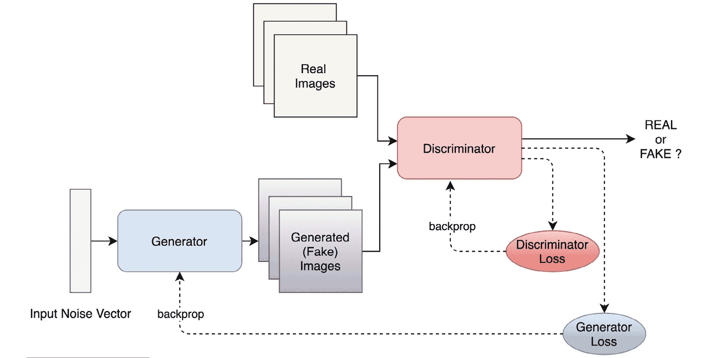
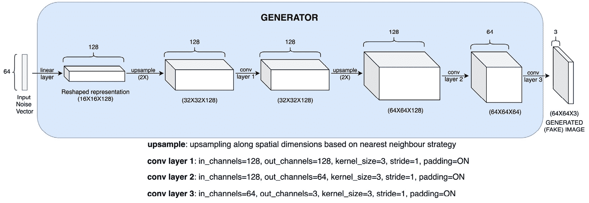
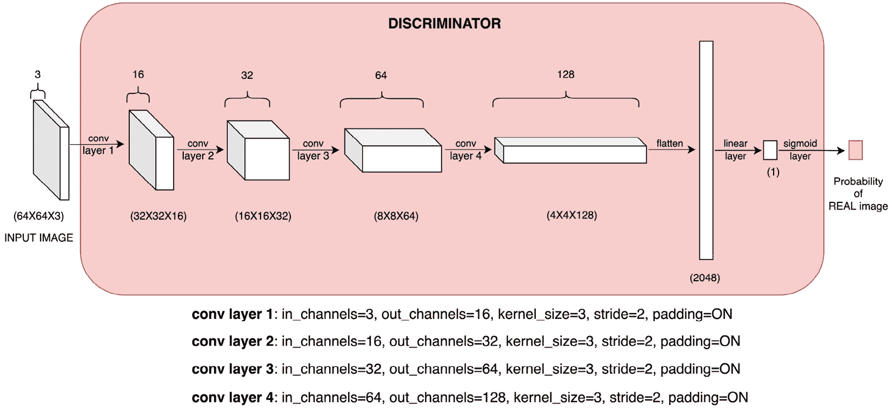
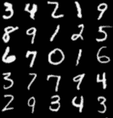
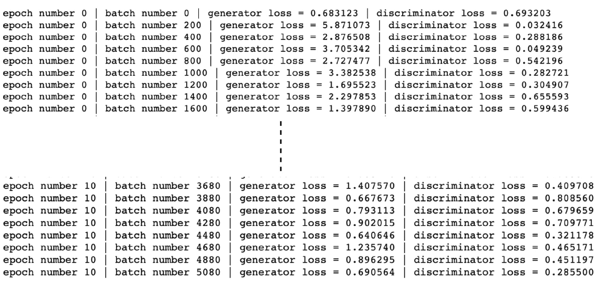
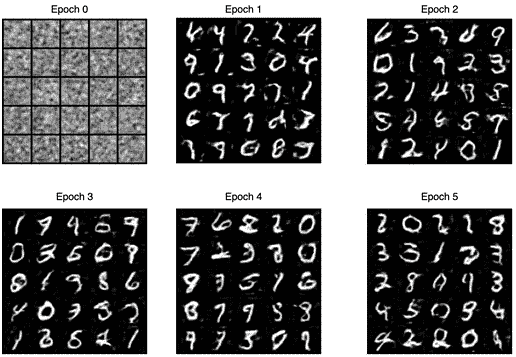
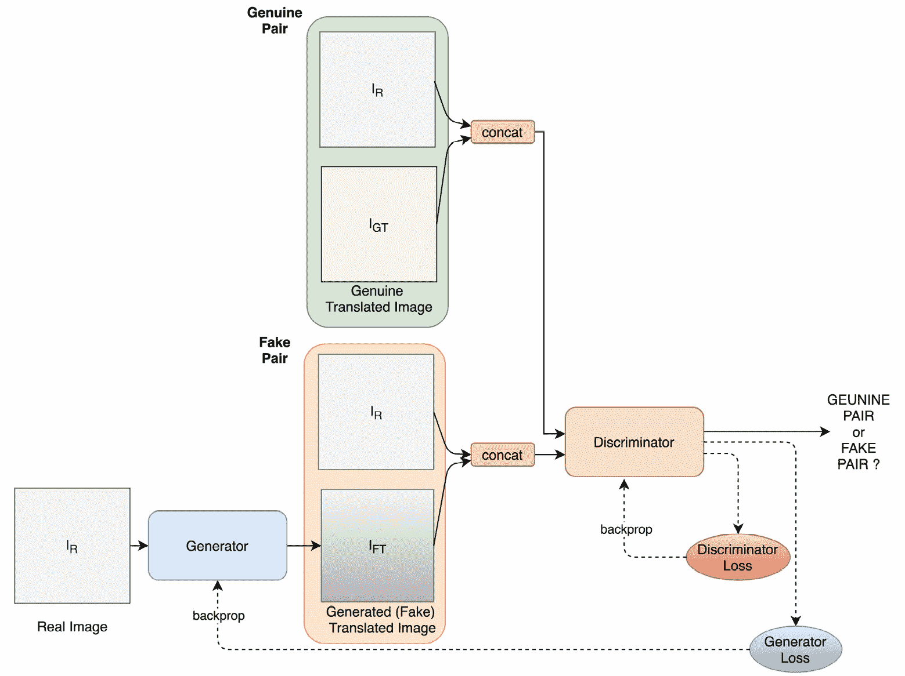
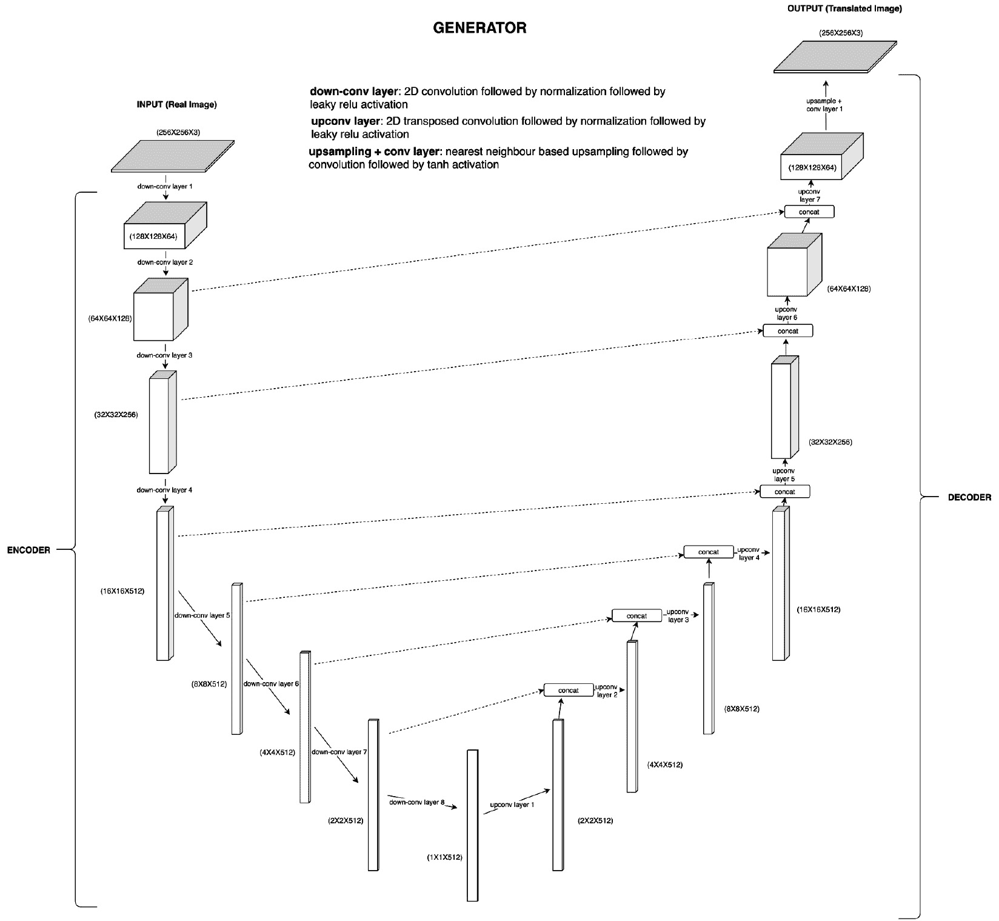
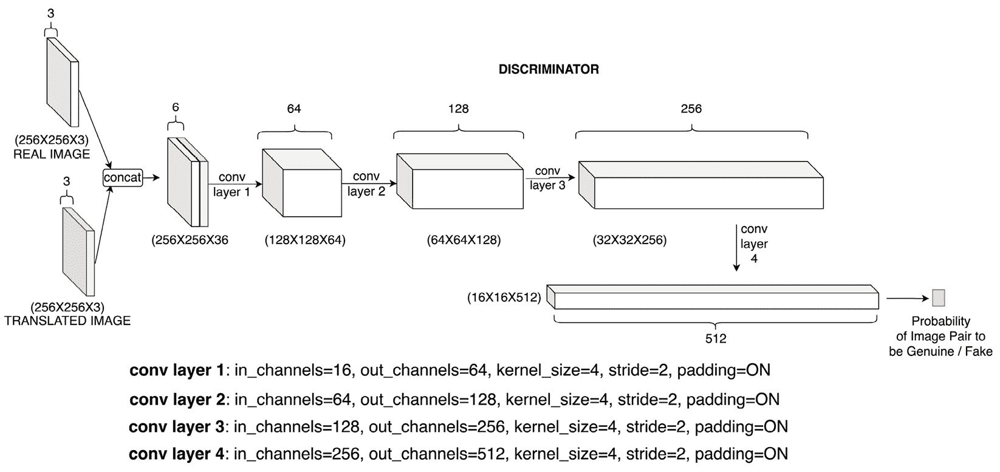

  

# 八、深度卷积GAN

生成神经网络已经成为一个热门而活跃的研究和发展领域。这种趋势很大程度上归功于我们将在本章中讨论的一类模型。这些模型被称为**生成对抗网络** ( **GAN**)，于 2014 年推出。自从基本 GAN 模型引入以来，已经并且正在为不同的应用发明各种类型的 GAN。

本质上，GAN 由两个神经网络组成——一个**发生器**和一个**鉴别器**。让我们看一个用来产生图像的 GAN 的例子。对于这样的 GAN，生成器的任务是生成逼真的假图像，而鉴别器的任务是将真图像与假图像区分开。

在联合优化过程中，生成器将最终学会生成如此好的假图像，以至于鉴别器基本上无法将它们与真实图像区分开来。一旦这样的模型被训练，它的生成器部分就可以被用作可靠的数据生成器。除了被用作无监督学习的生成模型，GANs 也被证明在半监督学习中是有用的。

例如，在图像示例中，由鉴别器模型学习的特征可以用于提高在图像数据上训练的分类模型的性能。除了半监督学习，GANs 也被证明在强化学习中是有用的，这是我们将在第九章 *【深度强化学习】*中讨论的主题。

本章我们将重点介绍的一种 GAN 是**深度卷积 GAN** ( **DCGAN** )。DCGAN 本质上是一个无监督的**卷积神经网络** ( **CNN** )模型。DCGAN 中的发生器和鉴别器都是纯粹的*CNN，没有完全连接的层*。DCGANs 在生成逼真的图像方面表现良好，它们可以作为学习如何从头开始构建、训练和运行 gan 的良好起点。

在本章中，我们将首先了解 GAN 中的各种组件——生成器和鉴别器模型以及联合优化计划。然后，我们将重点关注使用 PyTorch 构建一个 DCGAN 模型。接下来，我们将使用图像数据集来训练和测试 DCGAN 模型的性能。在本章的最后，我们将重温图像风格转换的概念，并探索 Pix2Pix GAN 模型，该模型可以有效地对任何给定的图像对执行风格转换。

我们还将了解 Pix2Pix GAN 模型的各种组件如何与 DCGAN 模型的组件相关联。读完本章后，我们将真正理解 GAN 是如何工作的，并将能够使用 PyTorch 构建任何类型的 GAN 模型。本章分为以下几个主题:

*   定义发生器和鉴别器网络
*   使用 PyTorch 训练 DCGAN
*   使用 GANs 进行风格转换

# 技术要求

我们将在所有练习中使用 Jupyter 笔记本。下面是使用`pip`应该为本章安装的 Python 库的列表。例如，在命令行上运行`pip install torch==1.4.0`:

```py
jupyter==1.0.0
```

```py
torch==1.4.0
```

```py
torchvision==0.5.0
```

与本章相关的所有代码文件都可以在这里找到:[https://github . com/packt publishing/Mastering-py torch/tree/master/chapter 08](https://github.com/PacktPublishing/Mastering-PyTorch/tree/master/Chapter08)。

# 定义发生器和鉴别器网络

如前所述，GANs 由两部分组成——发生器和鉴别器。这两者本质上都是神经网络。具有不同神经结构的发生器和鉴别器产生不同类型的 gan。例如，DCGANs 纯粹将 CNN 作为生成器和鉴别器。您可以在 https://github.com/eriklindernoren/PyTorch-GAN 的[找到不同类型的 gan](https://github.com/eriklindernoren/PyTorch-GAN)及其 PyTorch 实现的列表。

对于任何用于生成某种真实数据的 GAN ，生成器通常将随机噪声作为输入，并产生与真实数据维数相同的输出。我们称这种生成的输出**为假数据**。另一方面，鉴别器作为**二元分类器**工作。它接受生成的虚假数据和真实数据(一次一个)作为输入，并预测输入数据是真实的还是虚假的。*图 8.1* 显示了整体 GAN 模型示意图:



图 8.1–氮化镓示意图

鉴别器网络像任何二进制分类器一样被优化，即使用二进制交叉熵函数。因此，鉴别器模型的动机是正确地将真实图像分类为真实图像，将虚假图像分类为虚假图像。发电机网络有着完全相反的动机。发电机损耗在数学上表示为 *-log(D(G(x)))* ，其中 *x* 为输入发电机模型的随机噪声，*G*； *G(x)* 是生成器模型生成的假图像；而 *D(G(x))* 是鉴别器模型的输出概率， *D* ，也就是图像真实的概率。

因此，当鉴别器认为产生的假图像是真实的时，发生器损耗最小。本质上，生成器试图在这个联合优化问题中欺骗鉴别器。

在执行中，这两个损失函数交替反向传播。也就是说，在训练的每次迭代中，首先，鉴别器被冻结，并且通过反向传播来自发电机损耗的梯度来优化发电机网络的参数。

然后，调谐的发生器被冻结，同时通过反向传播来自鉴频器损耗的梯度来优化鉴频器。这就是我们所说的联合优化。在最初的甘论文中，它也被称为相当于两人的 Minimax 游戏，你可以在[https://arxiv.org/pdf/1406.2661.pdf](https://arxiv.org/pdf/1406.2661.pdf)找到它。

## 了解 DCGAN 发生器和鉴别器

对于dcgan 的特殊情况，让我们考虑一下生成器和鉴别器模型架构是什么样子的。如前所述，两者都是纯卷积模型。*图 8.2* 显示了 DCGAN 的发电机模型架构:



图 8.2–DCGAN 发生器模型架构

首先，大小为 **64** 的随机噪声输入向量被整形并投影到大小为**16×16**的 **128** 特征图中。这个投影是使用线性层实现的。从那里开始，一系列的上采样和卷积层接踵而至。第一上采样层使用最近邻上采样策略简单地将**16×16**特征图转换成**32×32**特征图。

接下来是一个 2D 卷积层，具有**3×3**内核大小和 **128** 输出特征图。该卷积层输出的 **128** **32x32** 特征图被进一步上采样为 **64x64** 大小的特征图，之后是两个 **2D** 卷积层，从而产生大小为 **64x64** 的(伪)RGB 图像。

注意

我们已经省略了批处理规范化和漏 ReLU 层，以避免前面的架构表示混乱。下一节中的 PyTorch 代码将提到并解释这些细节。

现在我们知道了发电机模型看起来像什么，让我们检查一下鉴别器模型看起来像什么。*图 8.3* 显示了鉴别器模型架构:



图 8.3–DCGAN 鉴别器模型架构

正如你所看到的，在这种架构中，每一个卷积层的 **2** 的步有助于降低空间维度，而深度(即特征图的数量)则保持增长。这是一个经典的基于 CNN 的二进制分类架构，在这里被用来对真实图像和生成的伪图像进行分类。

了解了发生器和鉴别器网络的架构后，我们现在可以根据图 8.1 中的原理图构建整个 DCGAN 模型，并在图像数据集上训练 DCGAN 模型。

在下一节中，我们将使用 PyTorch 来完成这项任务。我们将详细讨论 DCGAN 模型实例化、加载图像数据集、联合训练 DCGAN 生成器和鉴别器，以及从训练的 DCGAN 生成器生成样本伪图像。

# 使用 PyTorch 训练 DCGAN

在上一节中，我们已经讨论了 DCGAN 模型中的生成器和鉴别器模型的架构。在本节中，我们将以练习的形式使用 PyTorch 构建、训练和测试一个 DCGAN 模型。我们将使用一个图像数据集来训练模型，并测试经过训练的 DCGAN 模型的生成器在生成假图像时的表现。

## 定义发电机

在下面的练习中，出于演示目的，我们将只展示代码的重要部分。为了获取完整代码，可以参考[https://github . com/packt publishing/Mastering-py torch/blob/master/chapter 08/dcgan . ipynb](https://github.com/PacktPublishing/Mastering-PyTorch/blob/master/Chapter08/dcgan.ipynb):

1.  First, we need to `import` the required libraries, as follows:

    ```py
    import os
    import numpy as np
    import torch
    import torch.nn as nn
    import torch.nn.functional as F
    from torch.utils.data import DataLoader
    from torch.autograd import Variable
    import torchvision.transforms as transforms
    from torchvision.utils import save_image
    from torchvision import datasets
    ```

    在本练习中，我们只需要`torch`和`torchvision`来构建 DCGAN 模型。通过使用`torchvision`，我们将能够直接使用可用的图像数据集。

2.  After importing the libraries, we specify some model hyperparameters, as shown in the following code:

    ```py
    num_eps=10
    bsize=32
    lrate=0.001
    lat_dimension=64
    image_sz=64
    chnls=1
    logging_intv=200
    ```

    我们将为`10`个时期训练模型，批量为`32`，学习率为`0.001`。预期图像尺寸为 *64x64x3* 。`lat_dimension`是随机噪声向量的长度，这实质上意味着我们将从一个 *64* 维潜在空间中抽取随机噪声作为发电机模型的输入。

3.  现在我们定义生成器模型对象。以下代码直接按照*图 8.2* :

    ```py
    class GANGenerator(nn.Module):
        def __init__(self):
            super(GANGenerator, self).__init__()
            self.inp_sz = image_sz // 4
            self.lin =   nn.Sequential(nn.Linear(lat_dimension, 128 * self.inp_sz ** 2))
            self.bn1 = nn.BatchNorm2d(128)
            self.up1 = nn.Upsample(scale_factor=2)
            self.cn1 = nn.Conv2d(128, 128, 3, stride=1, padding=1)
            self.bn2 = nn.BatchNorm2d(128, 0.8)
            self.rl1 = nn.LeakyReLU(0.2, inplace=True)
            self.up2 = nn.Upsample(scale_factor=2)
            self.cn2 = nn.Conv2d(128, 64, 3, stride=1, padding=1)
            self.bn3 = nn.BatchNorm2d(64, 0.8)
            self.rl2 = nn.LeakyReLU(0.2, inplace=True)
            self.cn3 = nn.Conv2d(64, chnls, 3, stride=1, padding=1)
            self.act = nn.Tanh()
    ```

    所示的架构
4.  在定义了`_init_`方法之后，我们定义了`forward`方法，本质上就是以顺序的方式调用这些层:

    ```py
        def forward(self, x):
            x = self.lin(x)
            x = x.view(x.shape[0], 128, self.inp_sz, self.inp_sz)
            x = self.bn1(x)
            x = self.up1(x)
            x = self.cn1(x)
            x = self.bn2(x)
            x = self.rl1(x)
            x = self.up2(x)
            x = self.cn2(x)
            x = self.bn3(x)
            x = self.rl2(x)
            x = self.cn3(x)
            out = self.act(x)
            return out
    ```

在本练习中，我们使用了明确的逐层定义，而不是`nn.Sequential`方法；这是因为如果出现问题，调试模型会更容易。

我们还可以在代码中看到批量规格化和漏 ReLU 层，*图 8.2* 中没有提到。在线性或卷积层之后使用批量标准化，以加快训练过程并降低对初始网络权重的敏感性。

此外，泄漏 ReLU 被用作 DCGAN 中的激活函数，而不是常规 ReLU，因为 ReLU 可能丢失具有负值的输入的所有信息。具有 0.2 负斜率的泄漏 ReLU 集合给予传入的负信息 20%的权重，这可能有助于我们在 GAN 模型的训练期间避免消失梯度。

接下来，我们将看看 PyTorch 代码来定义鉴别器网络。

## 定义鉴别器

类似于生成器，我们现在将定义鉴别器模型如下:

1.  Once again, the following code is the PyTorch equivalent for the model architecture shown in *Figure 8.3*:

    ```py
    class GANDiscriminator(nn.Module):
        def __init__(self):
            super(GANDiscriminator, self).__init__()
            def disc_module(ip_chnls, op_chnls, bnorm=True):
                mod = [nn.Conv2d(ip_chnls, op_chnls, 3, 2, 1), nn.LeakyReLU(0.2, inplace=True), 
                       nn.Dropout2d(0.25)] if bnorm:
                    mod += [nn.BatchNorm2d(op_chnls, 0.8)]
                return mod
            self.disc_model = nn.Sequential(
                *disc_module(chnls, 16, bnorm=False),
                *disc_module(16, 32),
                *disc_module(32, 64),
                *disc_module(64, 128),
            )
            # width and height of the down-sized image
            ds_size = image_sz // 2 ** 4
            self.adverse_lyr = nn.Sequential(nn.Linear(128 * ds_size ** 2, 1), nn.Sigmoid())
    ```

    首先，我们已经定义了一个通用鉴别器模块，它是一个卷积层、一个可选的批量归一化层、一个泄漏 ReLU 层和一个丢弃层的级联。为了建立鉴别器模型，我们连续重复该模块四次，每次使用不同的卷积层参数集。

    目标是输入一个 64x64x3 的 RGB 图像，并在图像通过卷积层时增加深度(即通道数)并降低高度和宽度。

    最终鉴别器模块的输出被展平并通过对抗层。本质上，对立层将扁平化表示完全连接到最终的模型输出(即单个数字)。这个模型输出然后通过一个 sigmoid 激活函数，给我们图像是真实的(或不是伪造的)概率。

2.  下面是鉴别器的`forward`方法，它接受 64x64 RGB 图像作为输入，并产生它是真实图像的概率:

    ```py
        def forward(self, x):
            x = self.disc_model(x)
            x = x.view(x.shape[0], -1)
            out = self.adverse_lyr(x)
            return out
    ```

3.  已经定义了生成器和鉴别器模型，我们现在可以实例化它们中的一个。我们也可以在下面的代码中将我们的对抗性损失函数定义为二元交叉熵损失函数:

    ```py
    # instantiate the discriminator and generator models
    gen = GANGenerator()
    disc = GANDiscriminator()
    # define the loss metric
    adv_loss_func = torch.nn.BCELoss()
    ```

对抗损失函数将在训练循环的后面用于定义发生器和鉴别器损失函数。从概念上讲，我们使用二进制交叉熵作为损失函数，因为目标本质上是二进制的——也就是说，要么是真实图像，要么是虚假图像。并且，二元交叉熵损失是二元分类任务的非常适合的损失函数。

## 加载图像数据集

对于训练 DCGAN 生成逼真的假图像的任务，我们将使用众所周知的`MNIST`数据集。`MNIST`数据集包含从 0 到 9 的手写数字图像。通过使用`torchvision.datasets`，我们可以直接下载`MNIST`数据集，并从中创建一个`dataset`和一个`dataloader`实例:

```py
# define the dataset and corresponding dataloader
```

```py
dloader = torch.utils.data.DataLoader(
```

```py
    datasets.MNIST(
```

```py
        "./data/mnist/", download=True,
```

```py
        transform=transforms.Compose(
```

```py
            [transforms.Resize((image_sz, image_sz)), 
```

```py
             transforms.ToTensor(), transforms.Normalize([0.5], [0.5])]),), batch_size=bsize, shuffle=True,)
```

以下是来自`MNIST`数据集的真实图像示例:



图 8.4-来自 MNIST 数据集的真实图像

数据集引用

[LeCun 等人，1998 年 a] Y. LeCun，L. Bottou，Y. Bengio 和 P. Haffner。"基于梯度的学习应用于文档识别."IEEE 会议录，86(11):2278-2324，1998 年 11 月。

yann le Cun(NYU Courant 研究所)和 Corinna Cortes(纽约谷歌实验室)拥有 MNIST 数据集的版权，该数据集是 NIST 数据集的衍生作品。MNIST 数据集是根据知识共享署名-类似共享 3.0 许可条款提供的。

到目前为止，我们已经定义了模型架构和数据管道。现在是我们实际编写 DCGAN 模型训练例程的时候了，我们将在下一节中完成。

## dcgan 的训练循环

我们已经定义了模型架构并加载了数据集。在此部分，我们将实际训练 DCGAN 模型:

1.  **Defining the optimization schedule**: Before starting the training loop, we will define the optimization schedule for both the generator and the discriminator. We will use the `Adam` optimizer for our model. In the original DCGAN paper ([https://arxiv.org/pdf/1511.06434.pdf](https://arxiv.org/pdf/1511.06434.pdf)), the *beta1* and *beta2* parameters of the Adam optimizer are set to *0.5* and *0.999*, as opposed to the usual *0.9* and *0.999*.

    我们在练习中保留了默认值 *0.9* 和 *0.999* 。但是，我们鼓励您使用本文中提到的完全相同的值来获得类似的结果:

    ```py
    # define the optimization schedule for both G and D
    opt_gen = torch.optim.Adam(gen.parameters(), lr=lrate)
    opt_disc = torch.optim.Adam(disc.parameters(), lr=lrate)
    ```

2.  **Training the generator**: Finally, we can now run the training loop to train the DCGAN. As we will be jointly training the generator and the discriminator, the training routine will consist of both these steps – training the generator model and training the discriminator model – in an alternate fashion. We will begin with training the generator in the following code:

    ```py
    os.makedirs("./images_mnist", exist_ok=True)
    for ep in range(num_eps):
        for idx, (images, _) in enumerate(dloader):
            # generate ground truths for real and fake images
            good_img = Variable(torch.FloatTensor(images.shape[0], 1).fill_(1.0), requires_grad=False)
            bad_img = Variable(torch.FloatTensor(images.shape[0], 1) .fill_(0.0), requires_grad=False)
            # get a real image
            actual_images = Variable(images.type(torch.FloatTensor))
            # train the generator model
            opt_gen.zero_grad()
            # generate a batch of images based on random noise as input
            noise = Variable(torch.FloatTensor(np.random.normal(0, 1, (images.shape[0], lat_dimension))))
            gen_images = gen(noise)
            # generator model optimization - how well can it fool the discriminator
            generator_loss = adv_loss_func(disc(gen_images), good_img)
            generator_loss.backward()
            opt_gen.step()
    ```

    在前面的代码中，我们首先为真实和虚假图像生成地面真相标签。实像标注为`1`，假像标注为`0`。这些标签将作为鉴别器模型的目标输出，鉴别器模型是一个二元分类器。

    接下来，我们从 MINST 数据集加载器加载一批真实图像，我们还使用生成器生成一批使用随机噪声作为输入的假图像。

    最后，我们将发电机损耗定义为以下各项之间的对抗性损耗:

    I)鉴别器模型预测的假图像(由生成器模型产生)的真实概率。

    ii)`1`的地面真值。

    本质上，如果忽悠鉴别者把假生成的图像感知为真图像，那么发生器就成功了它的作用，发生器损耗就低了。一旦我们制定了发电机损耗，我们可以用它来沿发电机模型反向传播梯度，以调整其参数。

    在生成器模型的前面的优化步骤中，我们保持鉴别器模型参数不变，并且简单地将鉴别器模型用于向前传递。

3.  **训练鉴别器**:接下来我们反其道而行之，即保留发电机模型的参数，训练鉴别器模型:

    ```py
            # train the discriminator model
            opt_disc.zero_grad()
            # calculate discriminator loss as average of mistakes(losses) in confusing real images as fake and vice versa
            actual_image_loss = adv_loss_func(disc(actual_images), good_img)
            fake_image_loss = adv_loss_func(disc(gen_images.detach()), bad_img)
            discriminator_loss = (actual_image_loss + fake_image_loss) / 2
            # discriminator model optimization
            discriminator_loss.backward()
            opt_disc.step()
            batches_completed = ep * len(dloader) + idx
            if batches_completed % logging_intv == 0:
                print(f"epoch number {ep} | batch number {idx} | generator loss = {generator_loss.item()} \
                | discriminator loss = {discriminator_loss.item()}")
                save_image(gen_images.data[:25], f"images_mnist/{batches_completed}.png", nrow=5, normalize=True)
    ```

请记住，我们有一批真实和虚假的图像。为了训练鉴别器模型，我们需要两者。我们简单地将鉴别器损失定义为对抗性损失或二元交叉熵损失，就像我们对任何二元分类器所做的那样。

我们计算一批真实和虚假图像的鉴别器损耗，将一批真实图像的目标值保持在`1`处，一批虚假图像的目标值保持在`0`处。然后，我们使用这两个损耗的平均值作为最终的鉴频器损耗，并使用它来反向传播梯度，以调整鉴频器模型参数。

每隔几个时段和批次，我们记录模型的性能结果，即发电机损耗和鉴别器损耗。对于前面的代码，我们应该得到类似如下的输出:



图 8.5–DCGAN 培训日志

注意损失是如何波动的。由于联合训练机制的对抗性，这通常倾向于在 GAN 模型的训练期间发生。除了输出日志，我们还定期保存一些网络生成的图像。*图 8.6* 显示了这些生成的图像沿着最初几个时期的进展:



图 8.6–DCGAN 逐时段图像生成

如果我们将后来时代的结果与图 8.4 中*的原始 MNIST 图像进行比较，看起来 DCGAN 已经很好地学会了如何生成逼真的手写数字的 f ake 图像。*

就是这样。我们已经学习了如何使用 PyTorch 从头构建一个 DCGAN 模型。最初的 DCGAN 论文有一些细微的细节，例如发生器和鉴别器模型的层参数的正常初始化，为 Adam 优化器使用特定的*β1*和*β2*值，等等。为了专注于 GAN 代码的主要部分，我们省略了其中的一些细节。我们鼓励你将这些细节结合起来，看看会如何改变结果。

此外，我们在练习中只使用了`MNIST`数据库。然而，我们可以使用任何图像数据集来训练 DCGAN 模型。我们鼓励您在其他影像数据集上尝试此模型。用于 DCGAN 训练的一个流行的图像数据集是名人脸数据集([http://mmlab.ie.cuhk.edu.hk/projects/CelebA.html](http://mmlab.ie.cuhk.edu.hk/projects/CelebA.html))。

用这个模型训练的 DCGAN 可以用来生成不存在的名人的脸。*这个人不存在*([https://thispersondoesnotexist.com/](https://thispersondoesnotexist.com/))就是这样一个项目，它生成不存在的人类的面孔。诡异？是的。一般来说，这就是 DCGANs 和 gan 的强大之处。此外，由于 PyTorch，我们现在可以用几行代码构建自己的 GANs。

在本章的下一节，也是最后一节，我们将超越 DC GAN，简要了解另一种 GAN—`pix2pix`模型。`pix2pix`模型可用于概括图像中的风格转换任务，以及更一般地，图像到图像的翻译任务。我们将讨论`pix2pix`模型的架构，它的生成器和鉴别器，并使用 PyTorch 来定义生成器和鉴别器模型。我们还将对比 Pix2Pix 和 DCGAN 在 ir 架构和实现 n 方面的差异

# 使用 GANs 进行风格迁移

到目前为止，我们只详细研究了 DCGANs。虽然已经有数百种不同类型的 GAN 模型，并且更多的模型正在制作中，一些著名的模型和模型包括下面的:

*   开始
*   DCGAN
*   Pix2Pix
*   CycleGAN
*   super resolution gan(SRGAN
*   上下文编码器
*   Text-2-Imag e
*   最少的一个方一个
*   SoftmaxGAN
*   瓦塞尔斯坦恩

这些 GAN 变体中的每一个都有所不同，要么是它们迎合的应用、它们的底层模型架构，要么是它们的优化策略中的一些调整，例如修改损失函数。例如，SRGANs 用于增强低分辨率图像的分辨率。CycleGAN 使用两个生成器，而不是一个，生成器由类似 ResNet 的块组成。LSGAN 使用均方误差作为鉴别器损失函数，而不是大多数 GAN 中通常使用的交叉熵损失。

不可能在一章甚至一本书里讨论所有这些 GAN 变体。然而，在本节中，我们将探索另一种类型的 GAN 模型，它与上一节中讨论的 DCGAN 模型和第 7 章 *【神经类型转移】中讨论的 [*神经类型转移模型有关。*](B12158_07_Final_ASB_ePUB.xhtml#_idTextAnchor162)*

这种特殊类型的 GAN 概括了图像之间的风格转换任务，并且进一步提供了一个通用的图像到图像的翻译框架。它被称为 **Pix2Pix** ，我们将简要探讨它的架构以及它的生成器和鉴别器组件的 PyTorch 实现。

## 了解 pix2pix 架构

在第七章 *的 [*中，神经类型转移*，你可能记得一个完全训练的神经类型转移模型只对给定的一对图像起作用](B12158_07_Final_ASB_ePUB.xhtml#_idTextAnchor162)。Pix2Pix 是一个更通用的模型，一旦训练成功，它可以在任何一对图像之间传递风格。事实上，该模型不仅仅是样式转换，它可以用于任何图像到图像的翻译应用，比如背景遮罩、调色板完成等等。*

本质上，Pix2Pix 的工作原理与任何 GAN 模型一样。这里涉及到一个生成器和一个鉴别器。如图 8.1 中的*所示，一个`pix2pix`模型中的生成器接收一个真实图像作为输入，并试图生成该图像的翻译版本，而不是接收随机噪声作为输入并生成一个图像。如果手头的任务是样式转换，那么生成器将尝试生成样式转换的图像。*

随后，鉴别器现在查看一对图像，而不仅仅是一张图像，如图 8.1 中的情况。实像及其等效的平移图像作为输入被馈送到鉴别器。如果翻译后的图像是真实的，那么鉴别器应该输出 *1* ，如果翻译后的图像是生成器生成的，那么鉴别器应该输出 *0* 。*图 8.7* s 一个`pix2pix`型号的示意图:



图 8.7–Pix2Pix 模型示意图

*图 8.7* 显示了与*图 8.1* 的显著相似之处，这意味着基本思想与常规 GAN 相同。唯一的区别是鉴别者的真假问题是在一对图像上提出的，而不是在一张图像上。

### 探索 Pix2Pix 生成器

`pix2pix`模型中使用的发生器子模型是一个众所周知的用于图像分割的 CNN 即 **UNet** 。*图 8.8* 显示了 UNet 的架构，其用作`pix2pix`型号的发电机:



图 8.8–pix 2 pix 生成器模型架构

首先，UNet 这个名字来自于网络的 *U* 形状，从上图中可以明显看出。该网络中有两个 ma 组件，如下所示:

*   从左上角到底部是网络的编码器部分，它将 **256x256** RGB 输入图像编码成 **512** 大小的特征向量。
*   从右上角到底部是网络的解码器部分，它从大小为 **512** 的嵌入向量生成图像。

UNet 的一个关键特性是**跳过连接**，即从编码器部分到解码器部分的功能串联，如图*图 8.8* 中的虚线箭头所示。使用来自编码器部分的特征有助于解码器在每个上采样步骤更好地定位高分辨率信息。串联总是沿着深度维度发生。

本质上，编码器部分是一系列下卷积块，其中每个下卷积块本身是一系列 2D 卷积层、实例归一化层和泄漏 ReLU 激活。类似地，解码器部分由上行卷积块序列组成，其中每个块是 2D 转置卷积层、实例归一化层和 ReLU 激活层的序列。

该 UNet 生成器架构的最后一部分是基于最近邻的上采样层，接着是 2D 卷积层，最后是`tanh`激活。现在让我们看看 UNet 生成器的 PyTorch 代码:

1.  Here is the equivalent PyTorch code for defining the UNet-based generator architecture:

    ```py
    class UNetGenerator(nn.Module):
        def __init__(self, chnls_in=3, chnls_op=3):
            super(UNetGenerator, self).__init__()
            self.down_conv_layer_1 = DownConvBlock(chnls_in, 64, norm=False)
            self.down_conv_layer_2 = DownConvBlock(64, 128)
            self.down_conv_layer_3 = DownConvBlock(128, 256)
            self.down_conv_layer_4 = DownConvBlock(256, 512, dropout=0.5)
            self.down_conv_layer_5 = DownConvBlock(512, 512, dropout=0.5)
            self.down_conv_layer_6 = DownConvBlock(512, 512, dropout=0.5)
            self.down_conv_layer_7 = DownConvBlock(512, 512, dropout=0.5)
            self.down_conv_layer_8 = DownConvBlock(512, 512, norm=False, dropout=0.5)
            self.up_conv_layer_1 = UpConvBlock(512, 512, dropout=0.5)
            self.up_conv_layer_2 = UpConvBlock(1024, 512, dropout=0.5)
            self.up_conv_layer_3 = UpConvBlock(1024, 512, dropout=0.5)
            self.up_conv_layer_4 = UpConvBlock(1024, 512, dropout=0.5)
            self.up_conv_layer_5 = UpConvBlock(1024, 256)
            self.up_conv_layer_6 = UpConvBlock(512, 128)
            self.up_conv_layer_7 = UpConvBlock(256, 64)
            self.upsample_layer = nn.Upsample(scale_factor=2)
            self.zero_pad = nn.ZeroPad2d((1, 0, 1, 0))
            self.conv_layer_1 = nn.Conv2d(128, chnls_op, 4, padding=1)
            self.activation = nn.Tanh()
    ```

    如您所见，有 8 个下行卷积层和 7 个上行卷积层。上行卷积层有两个输入，一个来自先前的上行卷积层输出，另一个来自等效的下行卷积层输出，如图 8.7 中的虚线所示。

2.  We have used the `UpConvBlock` and `DownConvBlock` classes to define the layers of the UNet model. The following is the definition of these blocks, starting with the `UpConvBlock` class:

    ```py
    class UpConvBlock(nn.Module):
        def __init__(self, ip_sz, op_sz, dropout=0.0):
            super(UpConvBlock, self).__init__()
            self.layers = [
                nn.ConvTranspose2d(ip_sz, op_sz, 4, 2, 1),
                nn.InstanceNorm2d(op_sz), nn.ReLU(),]
            if dropout:
                self.layers += [nn.Dropout(dropout)]
        def forward(self, x, enc_ip):
            x = nn.Sequential(*(self.layers))(x)
            op = torch.cat((x, enc_ip), 1)
            return op
    ```

    这个上行卷积块中的转置卷积层由一个 4×4 的内核组成，其步幅为`2`步，与输入相比，其输出的空间维度基本上是两倍。

    在这个转置卷积层中，4x4 内核通过输入图像中的每隔一个像素(由于步长为`2`)。在每个像素处，像素值与 4x4 内核中的 16 个值相乘。

    然后对图像上的内核乘法结果的重叠值求和，得到两倍于输入图像长度和两倍于输入图像宽度的输出。此外，在前面的`forward`方法中，在经由上行卷积块完成正向传递之后，执行级联操作。

3.  Next, here is the PyTorch code for defining the `DownConvBlock` class:

    ```py
    class DownConvBlock(nn.Module):
        def __init__(self, ip_sz, op_sz, norm=True, dropout=0.0):
            super(DownConvBlock, self).__init__()
            self.layers = [nn.Conv2d(ip_sz, op_sz, 4, 2, 1)]
            if norm:
                self.layers.append(nn.InstanceNorm2d(op_sz))
            self.layers += [nn.LeakyReLU(0.2)]
            if dropout:
                self.layers += [nn.Dropout(dropout)]
        def forward(self, x):
            op = nn.Sequential(*(self.layers))(x)
            return op
    ```

    下行卷积块内部的卷积层具有大小为 4x4 的内核，步长为`2`，并且填充被激活。因为步幅值是`2`，所以这一层的输出是其输入的空间维度的一半。

    泄漏 ReLU 激活也用于与 DCGANs 类似的原因——处理负输入的能力，这也有助于缓解消失梯度问题。

    到目前为止，我们已经看到了我们基于 UNet 的生成器的`__init__`方法。下面的`forward`方法非常简单:

    ```py
        def forward(self, x):
            enc1 = self.down_conv_layer_1(x)
            enc2 = self.down_conv_layer_2(enc1)
            enc3 = self.down_conv_layer_3(enc2)
            enc4 = self.down_conv_layer_4(enc3)
            enc5 = self.down_conv_layer_5(enc4)
            enc6 = self.down_conv_layer_6(enc5)
            enc7 = self.down_conv_layer_7(enc6)
            enc8 = self.down_conv_layer_8(enc7)
            dec1 = self.up_conv_layer_1(enc8, enc7)
            dec2 = self.up_conv_layer_2(dec1, enc6)
            dec3 = self.up_conv_layer_3(dec2, enc5)
            dec4 = self.up_conv_layer_4(dec3, enc4)
            dec5 = self.up_conv_layer_5(dec4, enc3)
            dec6 = self.up_conv_layer_6(dec5, enc2)
            dec7 = self.up_conv_layer_7(dec6, enc1)
            final = self.upsample_layer(dec7)
            final = self.zero_pad(final)
            final = self.conv_layer_1(final)
            return self.activation(final)
    ```

讨论了`pix2pix`模型的生成器部分之后，让我们看看鉴别器模型。

### 探索 Pix2Pix 鉴别器

在这种情况下，鉴别器模型也是一个二元分类器——就像 DCGAN 一样。唯一的区别是这个二元分类器接受两幅图像作为输入。这两个输入沿着深度维度连接。*图 8.9* 显示了鉴别器模型的高层架构:



图 8.9–pix 2 pix 鉴别器模型架构

这是一个 CNN，其中最后 3 个卷积层之后是归一化层以及泄漏 ReLU 激活。定义这个鉴别器模型的 PyTorch 代码如下:

```py
class Pix2PixDiscriminator(nn.Module):
```

```py
    def __init__(self, chnls_in=3):
```

```py
        super(Pix2PixDiscriminator, self).__init__()
```

```py
        def disc_conv_block(chnls_in, chnls_op, norm=1):
```

```py
            layers = [nn.Conv2d(chnls_in, chnls_op, 4, stride=2, padding=1)]
```

```py
            if normalization:
```

```py
                layers.append(nn.InstanceNorm2d(chnls_op))
```

```py
            layers.append(nn.LeakyReLU(0.2, inplace=True))
```

```py
            return layers
```

```py
        self.lyr1 = disc_conv_block(chnls_in * 2, 64, norm=0)
```

```py
        self.lyr2 = disc_conv_block(64, 128)
```

```py
        self.lyr3 = disc_conv_block(128, 256)
```

```py
        self.lyr4 = disc_conv_block(256, 512)
```

如你所见，`4`卷积层随后在每一步将空间表示的深度加倍。层`2`、`3`和`4`在卷积层之后添加了归一化层，并且在每个卷积块的末端应用了负斜率为 20%的泄漏 ReLU 激活。最后，这里是 PyTorch 中鉴别器模型类的`forward`方法:

```py
    def forward(self, real_image, translated_image):
```

```py
        ip = torch.cat((real_image, translated_image), 1)
```

```py
        op = self.lyr1(ip)
```

```py
        op = self.lyr2(op)
```

```py
        op = self.lyr3(op)
```

```py
        op = self.lyr4(op)
```

```py
        op = nn.ZeroPad2d((1, 0, 1, 0))(op)
```

```py
        op = nn.Conv2d(512, 1, 4, padding=1)(op)
```

```py
        return op
```

首先，输入图像连接在一起，通过四个卷积模块，最终形成一个二进制输出，告诉我们这对图像是真的还是假的概率(即由生成器模型生成)。以这种方式，`pix2pix`模型在运行时被训练，使得`pix2pix`模型的生成器可以接受任何图像作为输入，并应用它在训练期间学习的图像平移函数。

如果生成的伪翻译图像很难与原始图像的阿格翻译版本区分开来，则认为`pix2pix`模型是成功的。

我们对`pix2pix`模型的探索到此结束。原则上，Pix2Pix 的整体模型示意图与 DCGAN 模型非常相似。这两个模型的鉴别器网络是一个基于 CNN 的二元分类器。`pix2pix`模型的生成器网络是一个受 UNet 图像分割模型启发的稍微复杂一点的架构。

总的来说，我们已经能够使用 PyTorch 成功定义 DCGAN 和 Pix2Pix 的生成器和鉴别器模型，并理解这两种 GAN 变体的内部工作方式。

读完这一节之后，您应该能够开始为许多其他 GAN 变体编写 PyTorch 代码了。使用 PyTorch 构建和训练各种 GAN 模型是一种很好的学习体验，当然也是一种有趣的练习。我们鼓励您使用本章中的信息，使用 PyTorch 开发您自己的 GAN 项目。

# 总结

自 2014 年问世以来，gan 一直是近年来研究和开发的活跃领域。本章探讨了 GANs 背后的概念，包括 GANs 的组件，即生成器和鉴别器。我们讨论了每个组件的架构以及 GAN 模型的整体原理图。

接下来，我们深入研究了一种特殊类型的 GAN，即 DCGAN。在一个练习的帮助下，我们使用 PyTorch 从头开始构建了一个 DCGAN 模型。我们使用 MNIST 数据集来训练模型。经过训练的 DCGAN 模型的生成器在 10 个时期的训练后成功地生成了逼真的手写数字的假图像。

在本章的最后一节，我们探讨了另一种类型的 GAN，它用于图像到图像的转换任务—`pix2pix`模型。与只处理一对图像不同的是，`pix2pix` GAN 模型的架构可以概括任何图像到图像的转换任务，包括任何给定图像对的风格转换。

此外，我们讨论了`pix2pix`模型原理图及其发生器和鉴别器模型的架构与 DCGAN 模型有何不同。这就结束了我们正在进行的关于生成模型的讨论，开始于 [*第六章*](B12158_06_Final_ASB_ePUB.xhtml#_idTextAnchor121)*用 PyTorch 生成音乐和文本*，继续于 [*第七章*](B12158_07_Final_ASB_ePUB.xhtml#_idTextAnchor162)*神经风格迁移*，现在以 GANs 结束。

在下一章中，我们将改变话题，讨论深度学习最令人兴奋和即将到来的领域之一——深度强化学习。深度学习的这个分支还在不断成熟。我们将探索 PyTorch 已经提供了什么，以及它如何帮助进一步发展这个具有挑战性的深度学习领域。