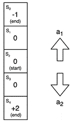

  

# 九、深度强化学习

机器学习通常分为三种不同的范式:**监督学习**、**非监督学习**、**强化学习** ( **RL** )。监督学习需要带标签的数据，并且是迄今为止使用最广泛的机器学习范例。然而，基于不需要标签的无监督学习的应用一直在稳步增长，特别是以生成模型的形式。

另一方面，RL 是机器学习的一个不同分支，被认为是我们在模仿人类如何学习方面最接近的一个分支。这是一个积极研究和开发的领域，正处于早期阶段，并取得了一些有希望的成果。一个突出的例子是著名的 AlphaGo 模型，由谷歌的 DeepMind 构建，击败了世界上最好的围棋选手。

在监督学习中，我们通常向模型提供原子输入-输出数据对，并希望模型将输出作为输入的函数来学习。在 RL 中，我们并不热衷于学习这样的个体输入到个体输出的函数。相反，我们感兴趣的是学习一种策略(或政策)，使我们能够从输入(状态)开始采取一系列步骤(或行动)，以获得最终输出或实现最终目标。

看一张照片并决定它是猫还是狗是一个原子输入输出学习任务，可以通过监督学习来解决。然而，看着棋盘并以赢得比赛为目标决定下一步棋需要策略，我们需要 RL 来完成这样的复杂任务。

在前面的章节中，我们遇到了监督学习的例子，例如使用 MNIST 数据集建立一个分类器来分类手写数字。我们还探索了无监督学习，同时使用无标签的文本语料库建立文本生成模型。

在本章中，我们将揭示 RL 和**深度强化学习(DRL)** 的一些基本概念。然后，我们将重点关注 DRL 模型的一个具体和受欢迎的类型——深度 Q 学习(deep Q-learning )( T2 )( T3 )( T4)网络(T5 )(( T6 )( T7)模型。使用 PyTorch，我们将构建一个 DRL 应用程序。我们将训练一个 DQN 模型来学习如何与电脑对手(机器人)玩乒乓游戏。

在本章结束时，你将拥有在 PyTorch 中开始你自己的 DRL 项目的所有必要背景。此外，您还将获得为现实生活中的问题构建 DQN 模型的实践经验。你在这一章学到的技能将对解决其他类似的 RL 问题有用。

本章分为以下几个主题:

*   回顾强化学习的概念
*   讨论 Q 学习
*   理解深度 Q 学习
*   在 PyTorch 中构建 DQN 模型

# 技术要求

我们将在所有练习中使用 Jupyter 笔记本。以下是本章使用`pip`必须安装的 Python 库列表。例如，在命令行上运行`pip install torch==1.4.0`:

```py
jupyter==1.0.0
```

```py
torch==1.4.0
```

```py
atari-py==0.2.6
```

```py
gym==0.17.2
```

与本章相关的所有代码文件都可以在[https://github . com/packt publishing/Mastering-py torch/tree/master/chapter 09](https://github.com/PacktPublishing/Mastering-PyTorch/tree/master/Chapter09)获得。

# 回顾强化学习的概念

在某种程度上，RL 可以定义为从错误中学习。与监督学习的情况不同，不是对每个数据实例都获得反馈，而是在一系列动作之后接收反馈。下图显示了 RL 系统的高级示意图:


图 9.1-强化学习示意图

在 RL 环境中，我们通常有一个**代理**，负责学习。代理学习做出决策，并根据这些决策采取**行动**。代理在提供的**环境**中运行。这个环境可以被认为是一个封闭的世界，代理在其中生活、采取行动并从其行动中学习。这里的一个动作仅仅是代理根据它所学到的东西做出的决定的执行。

我们之前提到过，与监督学习不同，RL 没有针对每个输入的输出；也就是说，代理不必为每个动作接收反馈。相反，代理人在**州**工作。假设它从一个初始状态开始， *S* 0。然后它采取行动，比如说 *a* 0。这个动作将代理的状态从 *S* 0 转换到 *S* 1，之后代理采取另一个动作 *a* 1，循环继续。

偶尔，代理会收到基于其状态的**奖励**。代理遍历的状态和动作序列也被称为一个**轨迹**。假设代理在状态 *S* 2 收到奖励。在那种情况下，导致这个奖励的轨迹将是 *S* 0， *a* 0， *S* 1， *a* 1， *S* 2。

注意

回报可能是正面的，也可能是负面的。

基于这些回报，代理人学会调整自己的行为，以便以最大化长期回报的方式采取行动。这就是 RL 的精髓。代理学习一个关于如何基于给定的状态和奖励最优地行动(即，最大化奖励)的策略。

这种习得的策略，基本上是用状态和奖励的函数表达的行动，被称为代理的策略**。RL 的最终目标是计算一个策略，使代理总是从给定的代理所处的环境中获得最大的回报。**

 **视频游戏是展示 RL 的最好例子之一。让我们以电子游戏 Pong 为例，它是乒乓球的虚拟版本。以下是这款游戏的截图:


图 9.2–乒乓视频游戏

考虑右边的玩家是代理人，用一条短竖线表示。请注意，这里有一个定义良好的环境。环境由游戏区域组成，游戏区域由棕色像素表示。环境也由一个球组成，用白色像素表示。除此之外，环境由游戏区域的边界组成，由球可能反弹的灰色条纹和边缘表示。最后，也是最重要的，环境包括一个对手，它看起来像代理，但被放在左手边，代理的对面。

通常，在 RL 设置中，处于任何给定状态的代理都有一个有限的可能动作集，称为离散动作空间(与连续动作空间相对)。在本例中，代理在所有状态下都有两个可能的动作——上移或下移，但有两个例外。一是在最顶端的位置(状态)只能下移，二是在最底端的位置(状态)只能上移。

在这种情况下，奖励的概念可以直接映射到实际乒乓球比赛中发生的事情。如果你没接到球，你的对手就得一分。谁先得 21 分，谁就赢得这场比赛，并获得正面奖励。输掉一场比赛意味着负面奖励。得分或失分也会分别导致较小的中间积极和消极奖励。从得分 0-0 开始并导致任何一名球员得到 21 分的一系列比赛被称为**集**。

用 RL 训练我们的代理玩一个 Pong 游戏，相当于训练某人从头开始打乒乓球。训练产生代理在玩游戏时遵循的策略。在任何给定的情况下——包括球的位置、对手的位置、记分牌以及之前的奖励——一个训练有素的代理人会上下移动，以最大化其赢得游戏的机会。

到目前为止，我们已经通过提供一个例子讨论了 RL 背后的基本概念。在此过程中，我们反复提到了诸如战略、政策和学习等术语。但是代理实际上是如何学习策略的呢？答案是通过 RL 模型，它基于预定义的算法工作。接下来，我们将探讨不同种类的 RL 算法。

## 强化学习算法的类型

在这一节中，我们将根据文献研究 RL 算法的类型。然后，我们将探讨这些类型中的一些子类型。广义而言，RL 算法可分为以下两类:

*   **基于模型的**
*   **无模型**

我们一个一个来看这些。

### 基于模型的

顾名思义，在基于模型的算法中，代理知道环境的模型。这里的模型指的是一个函数的数学公式，可以用来估计奖励以及环境中的状态如何转换。因为代理对环境有一些了解，这有助于减少选择下一个动作的样本空间。这有助于提高学习过程的效率。

然而，在现实中，建模的环境在大多数时候并不直接可用。尽管如此，如果我们想要使用基于模型的方法，我们需要让代理用它自己的经验学习环境模型。在这种情况下，代理很可能学习到模型的有偏见的表示，并且在真实环境中表现不佳。由于这个原因，基于模型的方法很少用于实现 RL 系统。我们不会在本书中详细讨论基于这种方法的模型，但这里有一些例子:

*   **基于模型的 DRL，带有无模型微调** ( **MBMF** )。
*   **基于模型的价值估计** ( **MBVE** )用于高效无模型 RL。
*   为 DRL 设计的 ( **I2A** )想象力增强代理。
*   打败国际象棋和围棋冠军的著名人工智能机器人 AlphaZero 。

现在，让我们看看另一组 RL 算法，它们以不同的理念工作。

### 无模型

无模型方法在没有任何环境模型的情况下也能工作，目前更普遍地用于 RL 研发。在无模型 RL 设置中，主要有两种培训代理的方式:

*   **政策优化**
*   **Q-学习**

#### 政策优化

在该方法中，给定当前状态,我们以动作的函数的形式制定策略,如以下等式所示:


这里， *β* 表示该函数的内部参数，通过梯度上升更新以优化策略函数。使用策略函数和奖励来定义目标函数。在某些情况下，目标函数的近似值也可用于优化过程。此外，在某些情况下，对于优化过程，可以使用策略函数的近似值来代替实际的策略函数。

通常，在这种方法下执行的优化是**基于策略的**，这意味着基于使用最新策略版本收集的数据来更新参数。基于策略优化的 RL 算法的一些示例如下:

*   **策略梯度**:这是最基本的策略优化方法，也是我们使用梯度上升直接优化策略函数的地方。策略函数在每个时间步输出接下来要采取的不同动作的概率。
*   **Actor-critic**: Because of the on-policy nature of optimization under the policy gradient algorithm, every iteration of the algorithm needs the policy to be updated. This takes a lot of time. The actor-critic method introduces the use of a value function, as well as a policy function. The actor models the policy function and the critic models the value function.

    通过使用 critical，策略更新过程变得更快。我们将在下一节更详细地讨论价值函数。然而，我们不会在本书中深入探讨演员-评论家方法的数学细节。

*   **Trust region policy optimization** (**TRPO**): Like the policy gradient method, TRPO consists of an on-policy optimization approach. In the policy-gradient approach, we use the gradient for updating the policy function parameters, *β*. Since the gradient is a first-order derivative, it can be noisy for sharp curvatures in the function. This may lead us to making large policy changes that may destabilize the learning trajectory of the agent.

    为了避免这一点，TRPO 提出了一个信任区域。它定义了在给定的更新步骤中策略可以改变的上限。这确保了优化过程的稳定性。

*   **最近策略优化** ( **PPO** ):与 TRPO 类似，PPO 旨在稳定优化过程。在梯度上升期间，在策略梯度方法中对每个数据样本执行更新。然而，PPO 使用一个替代目标函数，这有助于批量数据样本的更新。这导致更保守地估计梯度，从而提高梯度上升算法收敛的机会。

策略优化函数直接优化策略，因此是非常直观的算法。然而，由于大多数算法都是基于策略的，因此在策略更新后，每一步都需要对数据进行重新采样。这可能是解决 RL 问题的一个限制因素。接下来，我们将讨论另一种样本效率更高的无模型算法，称为 Q 学习。

#### q 学习

与策略优化算法相反， **Q-learning** 依赖价值函数而不是策略函数。从现在开始，这一章将集中讨论 Q-learning。我们将在下一节详细探讨 Q-learning 的基础。

# 讨论 Q 学习

策略优化和 Q-learning 之间的关键区别在于，在后者中，我们不直接优化策略。相反，我们优化一个价值函数。什么是**价值函数**？我们已经知道，RL 是关于一个智能体学习获得最大的整体回报，同时遍历状态和动作的轨迹。价值函数是代理当前所处的给定状态的函数，并且该函数输出代理在当前剧集结束时将获得的预期奖励总和。

在 Q-learning 中，我们优化了一种特定类型的价值函数，称为**动作-价值函数**，其取决于当前状态和动作。在给定的状态下， *S* ，行动价值函数决定了行动者将因采取行动 *a* 而获得的长期奖励(直到剧集结束的奖励)。该函数通常表示为 *Q(S，a)* ，因此也被称为 Q 函数。动作值也被称为作为 **Q 值**。

每个(状态，动作)对的 Q 值可以存储在一个表中，其中两个维度是状态和动作。例如，如果有四个可能的状态， *S* 1、 *S* 2、 *S* 3 和 *S* 4，以及两个可能的动作， *a* 1 和 *a* 2，那么八个 Q 值将存储在一个 4x2 的表中。因此，Q 学习的目标是创建这个 Q 值表。一旦该表可用，代理可以从给定状态查找所有可能动作的 Q 值，并采取具有最大 Q 值的动作。然而，问题是，我们从哪里得到 Q 值呢？答案在**贝尔曼方程**中，其数学表达式如下:


贝尔曼方程是一种计算 Q 值的递归方法。这个等式中的 *R* 是在状态 *S* t 采取行动 *a* t 得到的奖励，而γ (gamma)是**折扣因子**，是介于 *0* 和 *1* 之间的一个标量值。基本上，这个等式表明，当前状态的 Q 值， *S* t，以及动作， *a* t，等于通过在状态 *S* t 采取动作 *a* t 而获得的奖励， *R* ，加上从下一个状态 *S 获得的最佳动作， *a* t *+1* 产生的 Q 值折扣系数定义了相对于长期未来奖励，给予即时奖励的权重。*

既然我们已经定义了 Q-learning 的大部分基本概念，让我们通过一个例子来演示 Q-learning 到底是如何工作的。下图显示了由五种可能状态组成的环境:



图 9.3-Q-学习示例环境

有两种不同的可能动作——向上移动( **a** 1)或向下移动( **a** 2)。从状态 **S** 4 的 **+2** 到状态 **S** 0 的 **-1** 在不同的状态有不同的奖励。该环境中的每一集都从状态 **S** 2 开始，并在状态 **S** 0 或状态 **S** 4 结束。因为有五种状态和两种可能的动作，所以 Q 值可以存储在一个 5x2 的表中。以下代码片段显示了如何用 Python 编写奖励和 Q 值:

```py
rwrds = [-1, 0, 0, 0, 2]
```

```py
Qvals = [[0.0, 0.0], 
```

```py
         [0.0, 0.0],
```

```py
         [0.0, 0.0],
```

```py
         [0.0, 0.0],
```

```py
         [0.0, 0.0]]
```

我们将所有 Q 值初始化为零。此外，因为有两种特定的结束状态，我们需要以列表的形式指定它们，如下所示:

```py
end_states = [1, 0, 0, 0, 1]
```

这基本上表明状态 **S** 0 和 **S** 4 是结束状态。在我们运行完整的 Q-learning 循环之前，我们需要查看最后一个部分。在 Q-learning 的每一步，代理都有两个采取下一步行动的选项:

*   采取 Q 值最高的行动。
*   随机选择下一个动作。

为什么代理会随机选择一个动作？

请记住，在 [*第 6 章*](B12158_06_Final_ASB_ePUB.xhtml#_idTextAnchor121) *中，使用 PyTorch* 生成音乐和文本，在*文本生成*部分，我们讨论了贪婪搜索或波束搜索如何导致重复结果，因此引入随机性有助于产生更好的结果。用类似的方法，如果代理总是基于 Q 值选择下一个动作，那么它可能会陷入重复选择一个在短期内立即给出高回报的动作。因此，偶尔随机采取行动将有助于代理摆脱这种次优状态。

既然我们已经确定代理在每一步有两种可能的采取行动的方式，我们需要决定代理走哪一条路。这就是**ε贪婪行动**机制发挥作用的地方。下图显示了它的工作原理:


图 9.4–ε贪婪行动机制

在这种机制下，每集都预先决定一个ε值，它是一个在`0`和`1`之间的标量值。在给定的一集里，为了采取下一个行动，代理会在`0`到`1`之间生成一个随机数。如果生成的数字小于预定义的ε值，则代理从可用的下一组动作中随机选择下一个动作。否则，从 Q 值表中检索每个下一个可能动作的 Q 值，并选择具有最高 Q 值的动作。ε贪婪动作机制的 Python 代码如下:

```py
def eps_greedy_action_mechanism(eps, S):
```

```py
  rnd = np.random.uniform()
```

```py
  if rnd < eps:
```

```py
    return np.random.randint(0, 2)
```

```py
  else:
```

```py
    return np.argmax(Qvals[S])
```

通常，我们在第一集开始时使用ε值`1`,然后随着剧集的进展线性减小。这里的想法是，我们希望代理最初探索不同的选项。然而，随着学习过程的进行，代理人不太容易陷入收集短期奖励的困境，因此它可以更好地利用 Q 值表。

我们现在可以为主 Q-learning 循环编写 Python 代码了，如下所示:

```py
n_epsds = 100
```

```py
eps = 1
```

```py
gamma = 0.9
```

```py
for e in range(n_epsds):
```

```py
  S_initial = 2 # start with state S2
```

```py
  S = S_initial
```

```py
  while not end_states[S]:
```

```py
    a = eps_greedy_action_mechanism(eps, S)
```

```py
    R, S_next = take_action(S, a)
```

```py
    if end_states[S_next]:
```

```py
      Qvals[S][a] = R
```

```py
    else:
```

```py
      Qvals[S][a] = R + gamma * max(Qvals[S_next])
```

```py
    S = S_next
```

```py
  eps = eps - 1/n_epsds
```

首先，我们定义代理应接受`100`集的培训。我们从ε值`1`开始，并将折现因子(γ)定义为`0.9`。接下来，我们运行 Q-learning 循环，该循环遍历剧集的数量。在这个循环的每一次迭代中，我们都要经历一整集。在这个片段中，我们首先将代理的状态初始化为`S2`。

在此基础上，我们运行另一个内部循环，该循环只有在代理到达结束状态时才会中断。在这个内部循环中，我们使用ε贪婪动作机制来决定代理的下一个动作。然后，代理采取行动，将代理转换到新的状态，并可能产生奖励。`take_action`功能的实现如下:

```py
def take_action(S, a):
```

```py
  if a == 0: # move up
```

```py
    S_next = S - 1
```

```py
  else:
```

```py
    S_next = S + 1
```

```py
  return rwrds[S_next], S_next
```

一旦我们获得奖励和下一个状态，我们使用 *Bellman* 等式更新当前状态-动作对的 Q 值。下一个状态现在变成当前状态，并且重复该过程。在每集结束时，epsilon 值线性减少。一旦整个 Q 学习循环结束，我们就获得了一个 Q 值表。这张表基本上是代理在这种环境中运作以获得最大长期回报所需的全部内容。

理想情况下，这个例子中一个训练有素的代理将总是向下移动以在 *S* 4 处获得最大奖励 *+2* ，并且将避免向 *S* 0 移动，其中包含负奖励 *-1* 。

这就完成了我们对 Q-learning 的讨论。前面的代码应该可以帮助您在简单的环境中开始 Q-learning，比如这里提供的环境。对于更复杂、更真实的环境，比如视频游戏，这种方法是行不通的。为什么？

我们已经注意到 Q 学习的本质在于创建 Q 值表。在我们的例子中，我们只有 5 个状态和 2 个动作，因此表的大小是 10，这是可管理的。但是在像乒乓这样的电子游戏中，有太多的可能状态。这扩大了 Q 值表的大小，使得我们的 Q 学习算法非常占用内存，运行起来不切实际。

谢天谢地，有一个解决方案，我们仍然可以使用 Q-learning 的概念，而不会让我们的机器耗尽内存。这个解决方案结合了 Q 学习和深度神经网络的世界，并提供了非常受欢迎的 RL 算法，称为DQN。在下一节，我们将讨论 DQN 的基本情况和它的一些新颖的特点。

# 了解深度 Q 学习

**DQN** 没有创建一个 Q 值表，而是使用一个**深度神经网络**(**DNN**)为给定的状态-动作对输出一个 Q 值。DQN 用于复杂的环境，如视频游戏，其中有太多的状态需要在 Q 值表中管理。视频游戏的当前图像帧被用来表示当前状态，并作为输入与当前动作一起被馈送到底层的 DNN 模型。

DNN 为每个这样的输入输出标量 Q 值。在实践中，给定时间窗口中的 *N* 个相邻图像帧作为模型的输入被传递，而不是仅仅传递当前图像帧。

我们使用 DNN 来解决一个 RL 问题。这有一个内在的担忧。在使用 DNNs 时，我们总是使用**独立且同分布的** ( **iid** )数据样本。然而，在 RL 中，每个电流输出都会影响下一个输入。例如，在 Q 学习的情况下，贝尔曼方程本身表明 Q 值依赖于另一个 Q 值；也就是说，下一个状态-动作对的 Q 值影响当前状态对的 Q 值。

这意味着我们正在处理一个不断移动的目标，并且在目标和输入之间有很高的相关性。DQN 用两个新颖的特点解决了这些问题:

*   使用两个独立的 dnn
*   体验回放缓冲区

让我们更详细地看看这些。

## 使用两个独立的 dnn

让我们重写 DQNs 的贝尔曼方程:


除了引入了一个新术语 (theta)，这个等式与 Q-learning 的等式基本相同。表示 DQN 模型用于获取 Q 值的 DNN 的权重。但是这个等式有点奇怪。

请注意，位于等式的左侧和右侧。这意味着在每一步，我们都使用相同的神经网络来获得当前状态-动作对以及下一个状态-动作对的 Q 值。这意味着我们正在追逐一个不稳定的目标，因为每一步都将被更新，这将改变下一步等式的左侧和右侧，从而导致学习过程的不稳定性。

这可以通过查看损失函数更清楚地看到，DNN 将尝试使用梯度下降来最小化损失函数。损失函数如下:


暂且把 *R* (奖励)放在一边，让完全相同的网络产生当前和下一个状态-动作对的 Q 值将导致损失函数的波动，因为这两项将不断变化。为了解决这个问题，DQN 使用了两个独立的网络——主 DNN 和目标 DNN。两个 dnn 的架构完全相同。

主 DNN 用于计算当前状态-动作对的 Q 值，而目标 DNN 用于计算下一个(或目标)状态-动作对的 Q 值。然而，尽管主 DNN 的权重在每个学习步骤都被更新，但是目标 DNN 的权重被冻结。在每 *K* 次梯度下降迭代后，主网络的权重被复制到目标网络。这种机制保持训练过程相对稳定。权重复制机制确保来自目标网络的准确预测。

## 经验回放缓冲

因为 DNN 期望 iid 数据作为输入，我们简单地将最后的 *X* 步数(视频游戏的帧)缓存到一个缓冲存储器中，然后从缓冲区中随机抽样成批的数据。然后，这些批次作为输入被输入到 DNN。因为批次由随机采样的数据组成，所以分布看起来类似于 iid 数据样本的分布。这有助于稳定 DNN 培训过程。

注意

如果没有缓冲区技巧，DNN 将接收相关数据，这将导致较差的优化结果。

这两个技巧已经被证明对 DQNs 的成功有重要作用。现在，我们已经对 DQN 模型的工作原理及其新颖特征有了基本的了解，让我们继续本章的最后一节，在这里我们将实现我们自己的 DQN 模型。使用 PyTorch，我们将构建一个基于 CNN 的 DQN 模型，该模型将学习玩 Atari 视频游戏 Pong，并有可能学习战胜计算机对手。

# 在 PyTorch 中构建 DQN 模型

我们在上一节讨论了 DQNs 背后的理论。在这一部分，我们将采取动手操作的方法。使用 PyTorch，我们将构建一个基于 CNN 的 DQN 模型，该模型将训练一个代理来玩名为 Pong 的视频游戏。本练习的目标是演示如何使用 PyTorch 开发 DRL 应用程序。让我们直接进入练习。

## 初始化主要和目标 CNN 模型

在这个练习中，出于演示目的，我们将只展示代码的重要部分。为了获得完整的代码，请访问[https://github . com/packt publishing/Mastering-py torch/blob/master/chapter 09/pong . ipynb](https://github.com/PacktPublishing/Mastering-PyTorch/blob/master/Chapter09/pong.ipynb)。请遵循以下步骤:

1.  First, we need to import the necessary libraries:

    ```py
    # general imports
    import cv2
    import math
    import numpy as np
    import random
    # reinforcement learning related imports
    import re
    import atari_py as ap
    from collections import deque
    from gym import make, ObservationWrapper, Wrapper
    from gym.spaces import Box
    # pytorch imports 
    import torch
    import torch.nn as nn
    from torch import save
    from torch.optim import Adam
    ```

    在本练习中，除了通常的 Python 和 PyTorch 相关的导入，我们还使用了一个名为`gym`的 Python 库。它是由 OpenAI 开发的 Python 库，提供了一套构建 DRL 应用的工具。本质上，导入`gym`消除了为 RL 系统内部编写所有脚手架代码的需要。它还包含内置环境，包括我们将在本练习中使用的视频游戏 Pong。

2.  After importing the libraries, we must define the CNN architecture for the DQN model. This CNN model essentially takes in the current state input and outputs the probability distribution over all possible actions. The action with the highest probability gets chosen as the next action by the agent. Instead of using a regression model to predict the Q-values for each state-action pair, we cleverly turn this into a classification problem.

    对于所有可能的行动，必须单独运行 Q 值回归模型，我们将选择具有最高预测 Q 值的行动。但是使用这种分类模型将计算 Q 值和预测最佳下一步行动的任务结合成一个任务:

    ```py
    class ConvDQN(nn.Module):
        def __init__(self, ip_sz, tot_num_acts):
            super(ConvDQN, self).__init__()
            self._ip_sz = ip_sz
            self._tot_num_acts = tot_num_acts
            self.cnv1 = nn.Conv2d(ip_sz[0], 32, kernel_size=8, stride=4)
            self.rl = nn.ReLU()
            self.cnv2 = nn.Conv2d(32, 64, kernel_size=4, stride=2)
            self.cnv3 = nn.Conv2d(64, 64, kernel_size=3, stride=1)
            self.fc1 = nn.Linear(self.feat_sz, 512)
            self.fc2 = nn.Linear(512, tot_num_acts)
    ```

    正如我们所看到的，该模型由三个卷积层组成—`cnv1`、`cnv2`和`cnv3`—中间有 ReLU 激活，后面是两个完全连接的层。现在，让我们看看向前传递这个模型需要什么:

    ```py
        def forward(self, x):
            op = self.cnv1(x)
            op = self.rl(op)
            op = self.cnv2(op)
            op = self.rl(op)
            op = self.cnv3(op)
            op = self.rl(op).view(x.size()[0], -1)
            op = self.fc1(op)
            op = self.rl(op)
            op = self.fc2(op)
            return op
    ```

    `forward`方法简单地演示了模型的前向传递，其中输入通过卷积层，变平，并最终馈送到完全连接的层。最后，让我们看看其他模型方法:

    ```py
        @property
        def feat_sz(self):
            x = torch.zeros(1, *self._ip_sz)
            x = self.cnv1(x)
            x = self.rl(x)
            x = self.cnv2(x)
            x = self.rl(x)
            x = self.cnv3(x)
            x = self.rl(x)
            return x.view(1, -1).size(1)
        def perf_action(self, stt, eps, dvc):
            if random.random() > eps:
                stt=torch.from_numpy(np.float32(stt)).unsqueeze(0).to(dvc)
                q_val = self.forward(stt)
                act = q_val.max(1)[1].item()
            else:
                act = random.randrange(self._tot_num_acts)
            return act
    ```

    在前面的代码片段中，`feat_size`方法只是用来在展平最后一个卷积层输出后计算特征向量的大小。最后，`perf_action`方法与我们之前在*讨论 Q-learning* 部分讨论的`take_action`方法相同。

3.  在这一步，我们定义一个函数，这个函数实例化主神经网络和目标神经网络:

    ```py
    def models_init(env, dvc):
        mdl = ConvDQN(env.observation_space.shape, env.action_space.n).to(dvc)
        tgt_mdl = ConvDQN(env.observation_space.shape, env.action_space.n).to(dvc)
        return mdl, tgt_mdl
    ```

这两个模型是同一个类的实例，因此共享相同的架构。然而，它们是两个独立的实例，因此将随着不同的权重集而不同地发展。

## 定义体验回放缓冲区

正如我们在*理解深度 Q 学习*部分中所讨论的，体验回放缓冲是 DQNs 的一个重要特性。在这个缓冲区的帮助下，我们可以存储几千个游戏的过渡(帧)，然后随机采样这些视频帧来训练 CNN 模型。以下是定义重放缓冲区的代码:

```py
class RepBfr:
```

```py
    def __init__(self, cap_max):
```

```py
        self._bfr = deque(maxlen=cap_max)
```

```py
    def push(self, st, act, rwd, nxt_st, fin):
```

```py
        self._bfr.append((st, act, rwd, nxt_st, fin))
```

```py
    def smpl(self, bch_sz):
```

```py
        idxs = np.random.choice(len(self._bfr), bch_sz, False)
```

```py
        bch = zip(*[self._bfr[i] for i in idxs])
```

```py
        st, act, rwd, nxt_st, fin = bch
```

```py
        return (np.array(st), np.array(act), np.array(rwd,      dtype=np.float32),np.array(nxt_st), np.array(fin, dtype=np.uint8))
```

```py
    def __len__(self):
```

```py
        return len(self._bfr)
```

这里，`cap_max`是定义的缓冲区大小；即应该存储在缓冲器中的视频游戏状态转换的数量。在 CNN 训练循环期间使用了`smpl`方法来对存储的转换进行采样，并生成成批的训练数据。

## 设置环境

到目前为止，我们主要关注 DQNs 的神经网络方面。在本节中，我们将重点关注构建 RL 问题中的一个基础方面——环境。请遵循以下步骤:

1.  First, we must define some video game environment initialization-related functions:

    ```py
    def gym_to_atari_format(gym_env):
        ...
    def check_atari_env(env):
        ...
    ```

    使用`gym`库，我们可以访问预先构建的 Pong 视频游戏环境。但在这里，我们将通过一系列步骤来增强环境，其中包括对视频游戏图像帧进行缩减采样，将图像帧推送到体验重放缓冲区，将图像转换为 PyTorch 张量，等等。

2.  The following are the defined classes that implement each of the environment control steps:

    ```py
    class CCtrl(Wrapper):
        ...
    class FrmDwSmpl(ObservationWrapper):
        ...
    class MaxNSkpEnv(Wrapper):
        ...
    class FrRstEnv(Wrapper):
        ...
    class FrmBfr(ObservationWrapper):
        ...
    class Img2Trch(ObservationWrapper):
        ...
    class NormFlts(ObservationWrapper):
        ...        
    ```

    这些类现在将用于初始化和扩充视频游戏环境。

3.  一旦定义了环境相关的类，我们必须定义一个最终的方法，该方法将原始的 Pong 视频游戏环境作为输入，并扩充该环境，如下所示:

    ```py
    def wrap_env(env_ip):
        env = make(env_ip)
        is_atari = check_atari_env(env_ip)
        env = CCtrl(env, is_atari)
        env = MaxNSkpEnv(env, is_atari)
        try:
            env_acts = env.unwrapped.get_action_meanings()
            if "FIRE" in env_acts:
                env = FrRstEnv(env)
        except AttributeError:
            pass
        env = FrmDwSmpl(env)
        env = Img2Trch(env)
        env = FrmBfr(env, 4)
        env = NormFlts(env)
        return env
    ```

这一步中的一些代码已经被省略，因为我们的重点是这个练习的 PyTorch 方面。完整代码请参考本书的 GitHub 资源库。

## 定义 CNN 优化功能

在本节中，我们将定义用于训练我们的 DRL 模型的损失函数，以及定义在每个模型训练迭代结束时需要做的事情。请遵循以下步骤:

1.  We initialized our main and target CNN models in *step 2* of the *Initializing the main and target CNN models* section. Now that we have defined the model architecture, we shall define the `loss` function, which the model will be trained to minimize:

    ```py
    def calc_temp_diff_loss(mdl, tgt_mdl, bch, gm, dvc):
        st, act, rwd, nxt_st, fin = bch        st = torch.from_numpy(np.float32(st)).to(dvc)
        nxt_st =      torch.from_numpy(np.float32(nxt_st)).to(dvc)
        act = torch.from_numpy(act).to(dvc)
        rwd = torch.from_numpy(rwd).to(dvc)
        fin = torch.from_numpy(fin).to(dvc)     q_vals = mdl(st)
        nxt_q_vals = tgt_mdl(nxt_st)        q_val = q_vals.gather(1, act.unsqueeze(-1)).squeeze(-1)
        nxt_q_val = nxt_q_vals.max(1)[0]
        exp_q_val = rwd + gm * nxt_q_val * (1 - fin)        loss = (q_val -exp_q_val.data.to(dvc)).pow(2).   mean()
        loss.backward()
    ```

    此处定义的损失函数源自我们之前对`loss`函数方程的讨论。这种损失被称为**时间/时间差损失**，是 DQNs 的基本概念之一。

2.  现在神经网络架构和损失函数已经就位，我们将定义模型`updation`函数，在神经网络训练的每次迭代中调用该函数:

    ```py
    def upd_grph(mdl, tgt_mdl, opt, rpl_bfr, dvc, log):
        if len(rpl_bfr) > INIT_LEARN:
            if not log.idx % TGT_UPD_FRQ:
                tgt_mdl.load_state_dict(mdl.state_dict())
            opt.zero_grad()
            bch = rpl_bfr.smpl(B_S)
            calc_temp_diff_loss(mdl, tgt_mdl, bch, G, dvc)
            opt.step()
    ```

该函数从经验重放缓冲器中采样一批数据，计算这批数据的时差损失，并且每`TGT_UPD_FRQ`次迭代将主神经网络的权重复制到目标神经网络。`TGT_UPD_FRQ`稍后会被赋值。

## 管理和运行剧集

现在，让我们学习如何定义ε值:

1.  First, we will define a function that will update the epsilon value after each episode:

    ```py
    def upd_eps(epd):
        last_eps = EPS_FINL
        first_eps = EPS_STRT
        eps_decay = EPS_DECAY
        eps = last_eps + (first_eps - last_eps) * math.exp(-1 * ((epd + 1) / eps_decay))
        return eps
    ```

    该函数与 Q 学习循环中的 epsilon 更新步骤相同，如*讨论 Q 学习*部分所述。该函数的目标是线性降低每集的 epsilon 值。

2.  The next function is to define what happens at the end of an episode. If the overall reward that's scored in the current episode is the best we've achieved so far, we save the CNN model weights and print the reward value:

    ```py
    def fin_epsd(mdl, env, log, epd_rwd, epd, eps):
        bst_so_far = log.upd_rwds(epd_rwd)
        if bst_so_far:
            print(f"checkpointing current model weights. highest running_average_reward of\
     {round(log.bst_avg, 3)} achieved!")
            save(mdl.state_dict(), f"{env}.dat")
        print(f"episode_num {epd}, curr_reward: {epd_rwd},       best_reward: {log.bst_rwd},\running_avg_reward: {round(log.avg, 3)}, curr_epsilon: {round(eps, 4)}")
    ```

    在每集结束时，我们还会记录集号、当前集结束时的奖励、过去几集的奖励值的移动平均值，以及当前的 epsilon 值。

3.  We have finally reached one of the most crucial function definitions of this exercise. Here, we must specify the DQN loop. This is where we define the steps that shall be executed in an episode:

    ```py
    def run_epsd(env, mdl, tgt_mdl, opt, rpl_bfr, dvc, log, epd):
        epd_rwd = 0.0
        st = env.reset()
        while True:
            eps = upd_eps(log.idx)
            act = mdl.perf_action(st, eps, dvc)
            env.render()
            nxt_st, rwd, fin, _ = env.step(act)
            rpl_bfr.push(st, act, rwd, nxt_st, fin)
            st = nxt_st
            epd_rwd += rwd
            log.upd_idx()
            upd_grph(mdl, tgt_mdl, opt, rpl_bfr, dvc, log)
            if fin:
                fin_epsd(mdl, ENV, log, epd_rwd, epd, eps)
                break
    ```

    奖励和状态会在剧集开始时重置。然后，我们运行一个无限循环，只有当代理到达其中一个结束状态时才会中断。在该循环中，在每次迭代中，执行以下步骤:

    I)首先，按照*线性折旧方案*修改ε值。

    ii)由主要的 CNN 模型预测下一个动作。这个动作被执行，产生下一个状态和一个奖励。这个状态转换被记录在体验重放缓冲器中。

    iii)下一个状态现在变成当前状态，并且我们计算时差损失，其用于更新主 CNN 模型，同时保持目标 CNN 模型冻结。

    iv)如果新的当前状态是结束状态，则我们打破循环(即，结束情节)并记录该情节的结果。

4.  We have mentioned logging results throughout the training process. In order to store the various metrics around rewards and model performance, we must define a training metadata class, which will consist of various metrics as attributes:

    ```py
    class TrMetadata:
        def __init__(self):
            self._avg = 0.0
            self._bst_rwd = -float("inf")
            self._bst_avg = -float("inf")
            self._rwds = []
            self._avg_rng = 100
            self._idx = 0
    ```

    训练完模型后，我们将在本练习的稍后部分使用这些指标来可视化模型性能。

5.  我们将上一步中的模型度量属性存储为私有成员，并公开公开它们的对应的 getter 函数:

    ```py
        @property
        def bst_rwd(self):
            ...
        @property
        def bst_avg(self):
            ...
        @property
        def avg(self):
            ...
        @property
        def idx(self):
            ...
        ...
    ```

`idx`属性对于决定何时将权重从主 CNN 复制到目标 CNN 是至关重要的，而`avg`属性对于计算过去几集收到的奖励的移动平均值是有用的。

## 训练 DQN 模特学乒乓

现在，我们已经具备了开始训练 DQN 模型的所有必要条件。让我们开始吧:

1.  The following is a training wrapper function that will do everything we need it to do:

    ```py
    def train(env, mdl, tgt_mdl, opt, rpl_bfr, dvc):
        log = TrMetadata()
        for epd in range(N_EPDS):
            run_epsd(env, mdl, tgt_mdl, opt, rpl_bfr, dvc, log, epd)
    ```

    本质上，我们初始化一个记录器，然后只运行 DQN 训练系统一个预定义的集数。

2.  Before we actually run the training loop, we need to define the hyperparameter values, which are as follows:

    I)用于调节 CNN 模型的梯度下降的每次迭代的批量大小

    ii)环境，在这种情况下是 Pong 视频游戏

    iii)第一集的ε值

    iv)最后一集的ε值

    v)ε值的折旧率

    六)伽玛；也就是贴现因子

    vii)仅为了将数据推送到重放缓冲器而保留的初始迭代次数

    八)学习率

    ix)体验重放缓冲器的大小或容量

    x)培训代理的总集数

    xi)我们将权重从主 CNN 复制到目标 CNN 的迭代次数

    我们可以在下面的代码中实例化所有这些超参数:

    ```py
    B_S = 64
    ENV = "Pong-v4"
    EPS_STRT = 1.0
    EPS_FINL = 0.005
    EPS_DECAY = 100000
    G = 0.99
    INIT_LEARN = 10000
    LR = 1e-4
    MEM_CAP = 20000
    N_EPDS = 2000
    TGT_UPD_FRQ = 1000
    ```

    这些值是实验性的，我鼓励您尝试更改它们，并观察它们对结果的影响。

3.  This is the last step of the exercise and is where we actually execute the DQN training routine, as follows:

    I)首先，我们实例化游戏环境。

    ii)然后，我们定义将在其上进行培训的设备——根据可用性，是 CPU 还是 GPU。

    iii)接下来，我们实例化主要和目标 CNN 模型。我们还将亚当定义为 CNN 模型的优化器。

    iv)然后我们实例化一个体验重放缓冲区。

    v)最后，我们开始训练主要的 CNN 模型。一旦训练例程完成，我们就关闭实例化的环境。

    这方面的代码如下:

    ```py
    env = wrap_env(ENV)
    dvc = torch.device("cuda") if torch.cuda.is_available() else torch.device("cpu")
    mdl, tgt_mdl = models_init(env, dvc)
    opt = Adam(mdl.parameters(), lr=LR)
    rpl_bfr = RepBfr(MEM_CAP)
    train(env, mdl, tgt_mdl, opt, rpl_bfr, dvc)
    env.close()
    ```

    这将为我们提供以下输出:


图 9.5-DQN 培训日志

此外，下图显示了当前奖励、最佳奖励和平均奖励的进度，以及 epsilon 值与剧集进度的关系:


图 9.6-DQN 训练曲线

下图显示了在训练过程中 epsilon 值是如何随着发作而降低的:


图 9.7–Epsilon 随事件的变化

注意在*图 9.6* 中，一集(红色曲线)奖励的运行平均值开始于 **-20** ，这是一局游戏中代理人得 **0** 分，对手得全部 **20** 分的场景。随着剧集的进展，平均奖励不断增加，到第**集第 1500 集**时，平均奖励超过了零。这意味着经过 1500 集的训练后，代理人已经提高了对抗对手的水平。

从这里开始，平均回报是正的，这表明代理人平均比对手赢。我们只培训到 2000 年的第**集，这已经让代理商以超过对手 **7** 平均分数的优势获胜。我鼓励你训练它更长的时间，看看代理是否能通过总是得分并以 20 分中的一个 marg 分获胜来绝对击败对手。**

这就结束了我们对 DQN 模型实现的深入研究。DQN 在 RL 领域非常成功和受欢迎，对于那些有兴趣进一步探索该领域的人来说，绝对是一个很好的起点。PyTorch 和 gym 库是一个很好的资源，使我们能够在各种 RL 环境中工作，并与不同种类的 DRL 模型一起工作。

在这一章中，我们只关注了 dqn，但是我们学到的经验可以转移到 Q 学习模型的其他变体和其他 DRL 算法上。

# 总结

RL 是机器学习的基本分支之一，并且是当前最热门的研究和开发领域之一。基于 RL 的人工智能突破，如谷歌 DeepMind 的 AlphaGo，进一步增加了人们对该领域的热情和兴趣。本章提供了 RL 和 DRL 的概述，并带我们完成了使用 PyTorch 构建 DQN 模型的实践练习。

首先，我们简要回顾一下 RL 的基本概念。然后，我们探讨了多年来开发的不同类型的 RL 算法。我们仔细研究了这样一种 RL 算法——Q 学习算法。然后我们讨论了 Q 学习背后的理论，包括贝尔曼方程和ε贪婪行动机制。我们还解释了 Q-learning 如何不同于其他 RL 算法，例如策略优化方法。

接下来，我们探索了一种特定类型的 Q 学习模型——深度 Q 学习模型。我们讨论了 DQNs 背后的关键概念，并揭示了它的一些新特性，如经验重放缓冲机制和分离主神经网络和目标神经网络。最后，我们做了一个练习，使用 PyTorch 和 gym 库构建了一个 DQN 系统，使用 CNN 作为底层神经网络。在这个练习中，我们构建了一个人工智能代理，它成功地学会了玩视频游戏 Pong。训练快结束时，代理人设法战胜了电脑乒乓选手。

这就结束了我们使用 PyTorch 对 DRL 的讨论。RL 是一个广阔的领域，一章不足以涵盖所有内容。我鼓励你利用本章的高级别讨论来探究这些讨论的细节。从下一章开始，我们将关注 PyTorch 的实际应用，比如模型部署、并行化训练、自动化机器学习等等。在下一章，我们将从讨论如何有效地使用 PyTorch 将训练好的模型放入生产系统开始。**