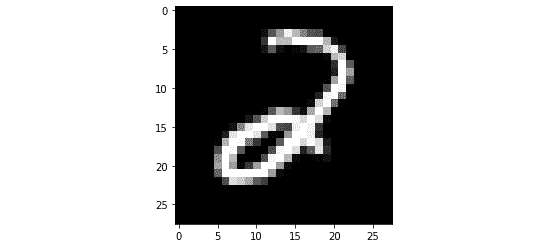

<link href="Styles/Style01.css" rel="stylesheet" type="text/css"> <link href="Styles/Style00.css" rel="stylesheet" type="text/css"> 

# 十、将 PyTorch 模型投入生产

在本书中，到目前为止，我们已经讲述了如何使用 PyTorch 训练和测试不同类型的机器学习模型。我们从回顾 PyTorch 的基本元素开始，这些元素使我们能够有效地处理深度学习任务。然后，我们探索了可以使用 PyTorch 编写的各种深度学习模型架构和应用程序。

在这一章中，我们将着重于将这些模型投入生产。但这意味着什么呢？基本上，我们将讨论将一个经过训练和测试的模型(对象)放入一个单独的环境中的不同方法，在这个环境中，它可以用来对输入的数据进行预测或推断。这就是所谓的模型的**生产化**，因为模型被部署到生产系统中。

我们将从讨论一些在生产环境中服务 PyTorch 模型的常用方法开始，从定义一个简单的模型推理函数开始，一直到使用模型微服务。然后我们将看看 TorchServe，这是一个可伸缩的 PyTorch 模型服务框架，最近(在撰写本文时)由 AWS 和脸书联合开发。

然后，我们将使用 **TorchScript** 进入导出 PyTorch 模型的世界，通过**序列化**，使我们的模型独立于 Python 生态系统，以便它们可以被加载到 **C++** 代码库中。我们还将在探索 **ONNX** 时超越 Torch 框架和 Python 生态系统，ONNX 是一种用于机器学习模型的开源通用格式，它将帮助我们将 PyTorch 训练的模型导出到非 PyTorch 和非 Python 环境中。

最后，我们将简要讨论如何使用 PyTorch 为一些知名的云平台提供模型服务，如**亚马逊 Web 服务** ( **AWS** )、**谷歌云**和**微软 Azure** 。

贯穿本章，我们将使用我们在 [*第一章*](B12158_01_Final_ASB_ePUB.xhtml#_idTextAnchor017) *【使用 PyTorch* 进行深度学习概述】中训练的手写数字图像分类**卷积神经网络** ( **CNN** )模型，作为我们的参考。我们将演示如何使用本章中讨论的不同方法来部署和导出经过训练的模型。

本章分为以下几节:

*   在 PyTorch 服役的模特
*   使用 TorchServe 服务 PyTorch 模型
*   使用 TorchScript 和 ONNX 导出通用 PyTorch 模型
*   在云中服务 PyTorch 模型

# 技术要求

我们将在练习中使用 Jupyter 笔记本和 Python 脚本。接下来显示的是使用`pip`为本章安装的 Python 库列表。要安装它们，在命令行中运行`pip install torch==1.4.0`等等:

```py
jupyter==1.0.0
```

```py
torch==1.4.0
```

```py
torchvision==0.5.0
```

```py
matplotlib==3.1.2
```

```py
Pillow==6.2.2
```

```py
torch-model-archiver==0.2.0
```

```py
torchserve==0.2.0
```

```py
Flask==1.1.1
```

```py
onnx==1.7.0
```

```py
onnx-tf==1.5.0
```

```py
tensorflow==1.15.0
```

与本章相关的所有代码文件可从以下网址获得:[https://github . com/packt publishing/Mastering-py torch/tree/master/chapter 10](https://github.com/PacktPublishing/Mastering-PyTorch/tree/master/Chapter10)。

# 在 PyTorch 服役的模特

在本节中，我们将从构建一个简单的 PyTorch 推断管道开始，该管道可以在给定一些输入数据和之前训练和保存的 PyTorch 模型的位置的情况下进行预测。此后，我们将把这个推理管道放在一个模型服务器上，该服务器可以监听传入的数据请求并返回预测。最后，我们将从开发模型服务器前进到使用 Docker 创建模型微服务。

## 创建 PyTorch 模型推理管道

我们将在`MNIST`数据集上研究我们在 [*第一章*](B12158_01_Final_ASB_ePUB.xhtml#_idTextAnchor017) 、*使用 PyTorch* 的深度学习概述中构建的手写数字图像分类 CNN 模型。使用这个经过训练的模型，我们将建立一个推理管道，它应该能够为给定的手写数字输入图像预测 0 到 9 之间的数字。

模型的建立和训练过程，请参考 [*第一章*](B12158_01_Final_ASB_ePUB.xhtml#_idTextAnchor017) 、*使用 PyTorch 进行深度学习概述*的*使用 PyTorch 训练神经网络*部分。这个练习的完整代码可以参考[https://github . com/packt publishing/Mastering-py torch/blob/master/chapter 10/mnist _ py torch . ipynb](https://github.com/PacktPublishing/Mastering-PyTorch/blob/master/Chapter10/mnist_pytorch.ipynb)。

### 保存和加载已训练的模型

在这个部分，我们将演示如何有效地加载一个已保存的预训练 PyTorch 模型，该模型稍后将用于服务请求。

因此，使用来自 [*第一章*](B12158_01_Final_ASB_ePUB.xhtml#_idTextAnchor017) 、*使用 PyTorch 进行深度学习概述*的笔记本代码，我们已经训练了一个模型，并根据测试数据样本对其进行了评估。但是接下来呢？在现实生活中，我们希望合上这个笔记本，稍后，仍然能够使用我们努力训练的模型对手写数字图像进行推理。这就是为模型服务的概念的来源。

从这里开始，我们可以在一个单独的 Jupyter 笔记本中使用前面训练过的模型，而不必进行任何(重新)训练。至关重要的下一步是将模型对象保存到一个文件中，该文件可以在以后恢复/反序列化。PyTorch 提供了两种主要的方法:

*   The less recommended way is to save the entire model object as follows:

    ```py
    torch.save(model, PATH_TO_MODEL)
    ```

    然后，保存的模型可以在以后按如下方式读取:

    ```py
    model = torch.load(PATH_TO_MODEL)
    ```

    尽管这种方法看起来最简单，但在某些情况下可能会有问题。这是因为我们不仅保存了模型参数，还保存了源代码中使用的模型类和目录结构。如果我们的类签名或目录结构后来改变了，加载模型会以潜在的不可修复的方式失败。

*   The second and more recommended way is to only save the model parameters as follows:

    ```py
    torch.save(model.state_dict(), PATH_TO_MODEL)
    ```

    稍后，当我们需要恢复模型时，首先我们实例化一个空模型对象，然后将模型参数加载到该模型对象中，如下所示:

    ```py
    model = ConvNet()
    model.load_state_dict(torch.load(PATH_TO_MODEL))
    ```

    我们将使用更推荐的方法来保存模型，如下面的代码所示:

    ```py
    PATH_TO_MODEL = "./convnet.pth"
    torch.save(model.state_dict(), PATH_TO_MODEL)
    ```

`convnet.pth`文件本质上是一个包含模型参数的 pickle 文件。

此时，我们可以安全地关闭正在处理的笔记本，并打开另一个笔记本，该笔记本位于:[https://github . com/packt publishing/Mastering-py torch/blob/master/chapter 10/run _ inference . ipynb](https://github.com/PacktPublishing/Mastering-PyTorch/blob/master/Chapter10/run_inference.ipynb):

1.  作为第一步，我们将再次需要导入库:

    ```py
    import torch
    ```

2.  Next, we need to instantiate an empty CNN model once again. Ideally, the model definition done in *step 1* would be written in a Python script (say, `cnn_model.py`), and then we would simply need to write this:

    ```py
    from cnn_model import ConvNet
    model = ConvNet()
    ```

    然而，由于我们在本练习中是在 Jupyter 笔记本上操作，我们将重写模型定义，然后将其实例化如下:

    ```py
    class ConvNet(nn.Module):
        def __init__(self):
           … 
        def forward(self, x):
            … 
    model = ConvNet()
    ```

3.  We can now restore the saved model parameters into this instantiated model object as follows:

    ```py
    PATH_TO_MODEL = "./convnet.pth"
    model.load_state_dict(torch.load(PATH_TO_MODEL, map_location="cpu"))
    ```

    您将看到以下输出:

    

    图 10.1–模型参数加载

    这实质上意味着参数加载成功。也就是说，我们实例化的模型与参数已保存且正在恢复的模型具有相同的结构。我们指定将模型加载到 CPU 设备上，而不是 GPU (CUDA)上。

4.  Finally, we want to specify that we do not wish to update or change the parameter values of the loaded model, and we will do so with the following line of code:

    ```py
    model.eval()
    ```

    该应给出以下输出:


图 10.2-评估模式下加载的模型

这再次验证了我们确实是在使用我们训练过的同一个模型(架构)工作。

### 构建推理管道

在前面的章节中，我们已经成功地在新环境(笔记本)中加载了一个预训练模型，现在我们将构建我们的模型推理管道，并使用它来运行模型预测:

1.  At this point, we have the previously trained model object fully restored to us. We shall now load an image that we can run the model prediction on using the following code:

    ```py
    image = Image.open("./digit_image.jpg")
    ```

    该图像文件应位于练习文件夹中，如下所示:

    

    图 10.3–模型推理输入图像

    在练习中没有必要使用这个特定的图像。你可以使用任何你想要的图像，来检查模型对它的反应。

2.  In any inference pipeline, there are three main components at the core of it: (a) the data preprocessing component, (b) the model inference (forward pass in the case of neural networks), and (c) the post-processing step.

    我们将从第一部分开始，定义一个函数，该函数接收图像并将其转换为张量，该张量将作为输入馈入模型，如下所示:

    ```py
    def image_to_tensor(image):
        gray_image = transforms.functional.to_grayscale(image)
        resized_image = transforms.functional.resize(gray_image, (28, 28))
        input_image_tensor = transforms.functional.to_tensor(resized_image)
        input_image_tensor_norm = transforms.functional.normalize(input_image_tensor, (0.1302,), (0.3069,))
        return input_image_tensor_norm
    ```

    这可以看作是如下的一系列步骤:

    I)首先，将 RGB 图像转换为灰度图像。

    ii)然后图像被调整大小为一个`28x28`像素的图像，因为这是模型被训练的图像大小。

    iii)然后，图像阵列被转换成 PyTorch 张量。

    iv)最后，张量中的像素值用与模型训练期间使用的相同的平均值和标准偏差值来归一化。

    定义了这个函数后，我们称它为将加载的图像转换成张量:

    ```py
    input_tensor = image_to_tensor(image)
    ```

3.  Next, we define the **model inference functionality**. This is where the model takes in a tensor as input and outputs the predictions. In this case, the prediction will be any digit between 0 to 9 and the input tensor will be the tensorized form of the input image:

    ```py
    def run_model(input_tensor):
        model_input = input_tensor.unsqueeze(0)
        with torch.no_grad():
            model_output = model(model_input)[0]
        model_prediction = model_output.detach().numpy().argmax()
        return model_prediction
    ```

    `model_output`包含模型的原始预测，其中包含每个图像的预测列表。因为我们在输入中只有一个图像，所以这个预测列表在索引`0`处只有一个条目。索引`0`处的原始预测实际上是一个张量，对于数字 0，1，2 有 10 个概率值...9、按那个顺序。这个张量被转换成一个`numpy`数组，最后，我们选择概率最高的数字。

4.  We can now use this function to generate our model prediction. The following code uses the `run_model` model inference function from *step 3* to generate the model prediction for the given input data, `input_tensor`:

    ```py
    output = run_model(input_tensor)
    print(output)
    print(type(output))
    ```

    这将输出以下内容:

    

    图 10.4–模型推理输出

    从前面的截图中我们可以看到，模型输出了一个`numpy`整数。根据图 10.3 中*所示的图像，模型输出似乎相当正确。*

5.  Besides just outputting the model prediction, we can also write a debug function to dig deeper into metrics such as raw prediction probabilities, as shown in the following code snippet:

    ```py
    def debug_model(input_tensor):
        model_input = input_tensor.unsqueeze(0)
        with torch.no_grad():
            model_output = model(model_input)[0]
        model_prediction = model_output.detach().numpy()
        return np.exp(model_prediction)
    ```

    这个函数与`run_model`函数完全相同，除了它返回每个数字的概率的原始列表。模型最初返回 softmax 输出的对数，因为`log_softmax`层被用作模型中的最后一层(参见本练习的*步骤 2* )。

    因此，我们需要对这些数字求幂以返回 softmax 输出，这相当于模型预测概率。使用这个调试功能，我们可以更详细地查看模型的执行情况，例如概率分布是平坦的还是有明显的峰值:

    ```py
    print(debug_model(input_tensor))
    ```

    这将输出以下内容:

    

    图 10.5–模型推理调试输出

    我们可以看到列表中的第三个概率是目前为止最高的，对应于数字 2。

6.  Finally, we shall post-process the model prediction so that it can be used by other applications. In our case, we are just going to transform the digit predicted by the model from the integer type to the string type.

    在其他情况下，后处理步骤可能会更复杂，例如语音识别，我们可能希望通过平滑、移除异常值等方式处理输出波形:

    ```py
    def post_process(output):
        return str(output)
    ```

    因为 string 是一种可序列化的格式，所以这使得模型预测可以很容易地在服务器和应用程序之间传递。我们可以检查最终的后处理数据是否如预期的那样:

    ```py
    final_output = post_process(output)
    print(final_output)
    print(type(final_output))
    ```

    这将为您提供以下输出:


图 10.6–后处理模型预测

正如所料，现在的输出是`type`字符串。

这就结束了我们加载一个保存的模型架构，恢复它的训练权重，并使用加载的模型为样本输入数据(一个图像)生成预测的练习。我们加载一个样本图像，对其进行预处理以将其转换为 PyTorch 张量，将其作为输入传递给模型以获得模型预测，并对预测进行后处理以生成最终输出。

这是向使用明确定义的输入和输出接口为训练好的模型提供服务的方向前进了一步。在这个练习中，输入是一个外部提供的图像文件，而输出是一个生成的字符串，包含一个 0 到 9 之间的数字。通过将提供的代码复制并粘贴到任何需要数字化手写数字功能的应用程序中，可以嵌入这样的系统。

在下一节中，我们将更深入地研究模型服务，我们的目标是构建一个可以与任何应用程序交互的系统，以使用数字化功能，而无需复制和粘贴任何代码。

## 构建基本模型服务器

到目前为止，我们已经建立了一个模型推理管道，它拥有从预训练模型独立执行预测所需的所有代码。在这里，我们将致力于构建我们的第一个模型服务器，它本质上是一台托管模型推理管道的机器，通过接口主动侦听任何传入的输入数据，并通过接口输出对任何输入数据的模型预测。

### 使用 Flask 编写基本应用程序

为了开发我们的服务器，我们将使用一个流行的 Python 库——Flask。 **Flask** 将使我们能够用几行代码构建我们的模型服务器。你可以在这里【https://flask.palletsprojects.com/en/1.1.x/】详细了解图书馆:。下面的代码很好地展示了这个库是如何工作的:

```py
from flask import Flask
```

```py
app = Flask(__name__)
```

```py
@app.route('/')
```

```py
def hello_world():
```

```py
    return 'Hello, World!'
```

```py
if __name__ == '__main__': 
```

```py
    app.run(host='localhost', port=8890)
```

假设我们将这个 Python 脚本保存为`example.py`，并从终端运行它:

```py
python example.py
```

它将在终端中显示以下输出:


图 10.7–烧瓶示例应用程序启动

基本上，它将发布一个 Flask 服务器，该服务器将为一个名为**的应用提供服务。让我们打开浏览器，转到以下 URL:**

```py
http://localhost:8890/
```

它将在浏览器中产生以下输出:


图 10.8–烧瓶示例应用程序测试

本质上，Flask 服务器在端点`/`监听 IP 地址`0.0.0.0 (localhost)`上的端口号`8890`。只要我们在浏览器搜索栏中输入`localhost:8890/`并按下 *Enter* ，服务器就会收到一个请求。然后，服务器运行`hello_world`函数，该函数根据`example.py`中提供的函数定义返回字符串`Hello, World!`。

### 使用 Flask 构建我们的模型服务器

使用在前面章节的中演示的运行 Flask 服务器的原则,我们现在将使用在前面章节中构建的模型推理管道来创建我们的第一个模型服务器。在练习的最后，我们将启动服务器来监听传入的请求(图像数据输入)。

此外，我们将编写另一个 Python 脚本，该脚本将通过发送图 10.3 所示的示例图像向该服务器发出请求。Flask 服务器应在该图像上运行模型推断，并输出后处理的预测。

GitHub 上提供了该练习的完整代码:请访问[https://GitHub . com/packt publishing/Mastering-py torch/blob/master/chapter 10/server . py](https://github.com/PacktPublishing/Mastering-PyTorch/blob/master/Chapter10/server.py)获取 Flask 服务器代码，并访问[https://GitHub . com/packt publishing/Mastering-py torch/blob/master/chapter 10/make _ request . py](https://github.com/PacktPublishing/Mastering-PyTorch/blob/master/Chapter10/make_request.py)获取请求生成器(客户端)代码。

#### 建立长颈瓶服务的模型推理

在本节中，我们将加载一个预训练的模型，并编写模型推理管道代码:

1.  First, we will build the Flask server. And for that, we once again start by importing the necessary libraries:

    ```py
    from flask import Flask, request
    import torch
    ```

    除了其他基本库如`numpy`和`json`之外，`flask`和`torch`都是这个任务的必需品。

2.  Next, we will need to define the model class (architecture):

    ```py
    class ConvNet(nn.Module):
        def __init__(self):
        def forward(self, x):
    ```

    理想情况下，这段代码已经存在于一个单独的 Python 脚本中，比如说，`model.py`，然后我们需要做的就是`from model import ConvNet`。

3.  Now that we have the empty model class defined, we can instantiate a model object and load the pre-trained model parameters into this model object as follows:

    ```py
    model = ConvNet()
    PATH_TO_MODEL = "./convnet.pth"
    model.load_state_dict(torch.load(PATH_TO_MODEL, map_location="cpu"))
    model.eval()
    ```

    我们将恢复的模型设置为评估模式，以指示不调整模型参数。

4.  We will reuse the exact `run_model` function defined in *step 3* of the *Building the inference pipeline* section:

    ```py
    def run_model(input_tensor):
        … 
        return model_prediction
    ```

    提醒一下，这个函数接收张量化的输入图像，并输出模型预测，可以是 0 到 9 之间的任意数字。

5.  接下来，我们将重用在*构建推理管道*部分

    ```py
    def post_process(output):
        return str(output)
    ```

    的*步骤 6* 中定义的确切的`post_process`函数

这实际上将把从`run_model`函数输出的整数转换成一个字符串。

#### 构建一个 Flask 应用程序来服务模型

在上一节中已经建立了推理管道，现在我们将构建我们自己的 Flask 应用程序，并使用它来服务加载的模型:

1.  We will instantiate our Flask app as shown in the following line of code:

    ```py
    app = Flask(__name__)
    ```

    这创建了一个与 Python 脚本同名的 Flask 应用程序，在我们的例子中是`server(.py)`。

2.  This is the critical step, where we will be defining an endpoint functionality of the Flask server. We will expose a `/test` endpoint and define what happens when a `POST` request is made to that endpoint on the server as follows:

    ```py
    @app.route("/test", methods=["POST"])
    def test():
        data = request.files['data'].read()
        md = json.load(request.files['metadata'])
        input_array = np.frombuffer(data, dtype=np.float32)
        input_image_tensor = torch.from_numpy(input_array).view(md["dims"])
        output = run_model(input_image_tensor)
        final_output = post_process(output)
        return final_output
    ```

    让我们一步一步来:

    a)首先，我们向下面定义的函数`test`添加一个装饰器。这个装饰器告诉 Flask 应用程序每当有人向`/test`端点发出`POST`请求时运行这个函数。

    b)接下来，我们开始定义在`test`函数中到底发生了什么。首先，我们从`POST`请求中读取数据和元数据。因为数据是序列化的，我们需要把它转换成数字格式——我们把它转换成一个`numpy`数组。从一个`numpy`数组中，我们迅速将其转换为 PyTorch 张量。

    c)接下来，我们使用元数据中提供的图像尺寸来重塑张量。

    d)最后，我们用这个张量运行前面加载的模型的正向传递。这为我们提供了模型预测，然后由我们的测试函数对其进行后处理并返回。

3.  We have all the necessary ingredients to launch our Flask app. We will add these last two lines to our `server.py` Python script:

    ```py
    if __name__ == '__main__':
        app.run(host='0.0.0.0', port=8890)
    ```

    这表明 Flask 服务器将被托管在 IP 地址`0.0.0.0`(也称为`localhost`)和端口号`8890`。我们现在可以保存 Python 脚本，并在新的终端窗口中简单地执行以下操作:

    ```py
    python server.py
    ```

    这将运行在前面步骤中编写的整个脚本，您将看到以下输出:


图 10.9–Flask 服务器启动

这看起来类似于图 10.7 中的示例。唯一不同的是应用名称。

#### 使用 Flask 服务器运行预测

我们已经成功地发布了我们的模型服务器，它正在积极地监听请求。现在让我们提出一个请求:

1.  We will write a separate Python script in the next few steps to do this job. We begin with importing libraries:

    ```py
    import requests
    from PIL import Image
    from torchvision import transforms
    ```

    `requests`库将帮助我们向 Flask 服务器发出实际的`POST`请求。`Image`帮助我们读取样本输入图像文件，`transforms`将帮助我们预处理输入图像数组。

2.  Next, we read an image file:

    ```py
    image = Image.open("./digit_image.jpg") 
    ```

    这里读取的图像是 RGB 图像，并且可以具有任何尺寸(不一定是作为输入的模型所期望的 28x28)。

3.  We now define a preprocessing function that converts the read image into a format that is readable by the model:

    ```py
    def image_to_tensor(image):
        gray_image = transforms.functional.to_grayscale(image)
        resized_image = transforms.functional.resize(gray_image, (28, 28))
        input_image_tensor = transforms.functional.to_tensor(resized_image)
        input_image_tensor_norm = transforms.functional.normalize(input_image_tensor, (0.1302,), (0.3069,))
        return input_image_tensor_norm
    ```

    首先，RGB 图像被转换成灰度图像。然后，将图像大小调整为 28x28 像素。接下来，图像从一个数组转换成 PyTorch 张量。最后， 28x28 像素值基于在先前练习中我们的模型训练期间获得的平均值和标准偏差值进行归一化。

    定义了函数后，我们可以执行它:

    ```py
    image_tensor = image_to_tensor(image)
    ```

    `image_tensor`是我们需要发送给 Flask 服务器的输入数据。

4.  Let's now get into packaging our data together to send it over. We want to send both the pixel values of the image as well as the shape of the image (28x28) so that the Flask server at the receiving end knows how to reconstruct the stream of pixel values as an image:

    ```py
    dimensions = io.StringIO(json.dumps({'dims': list(image_tensor.shape)}))
    data = io.BytesIO(bytearray(image_tensor.numpy()))
    ```

    我们将张量的形状字符串化，并将图像数组转换成字节，使其可序列化。

5.  This is the most critical step in this request making script. This is where we actually make the `POST` request:

    ```py
    r = requests.post('http://localhost:8890/test',
                      files={'metadata': dimensions,                          'data' : data})
    ```

    使用`requests`库，我们在 URL `localhost:8890/test`发出`POST`请求。这是 Flask 服务器监听请求的地方。我们以字典的形式发送实际的图像数据(作为字节)和元数据(作为字符串)

6.  The `r` variable in the preceding code will receive the response of the request from the Flask server. This response should contain the post-processed model prediction. We will now read that output:

    ```py
    response = json.loads(r.content)
    ```

    `response`变量将包含 Flask 服务器输出的内容，即一个 0 到 9 之间的数字字符串。

7.  We can print the response just to be sure:

    ```py
    print("Predicted digit :", response)
    ```

    此时，我们可以将这个 Python 脚本保存为`make_request.py`，并在终端中执行以下命令:

    ```py
    python make_request.py
    ```

    这将输出以下内容:


图 10.10–Flask 服务器响应

根据输入图像(见*图 10.3* ，响应似乎相当正确。我们当前的练习到此结束。

因此，我们已经成功地构建了一个独立的模型服务器，它可以呈现手写数字图像的预测。同样的一组步骤可以很容易地扩展到任何其他机器学习模型，因此这为使用 PyTorch 和 Flask 创建机器学习应用程序提供了无限的可能性。

到目前为止，我们已经从简单地编写推理函数发展到创建可以远程托管的模型服务器，并通过网络呈现预测。在我们下一个也是最后一个模型服务项目中，我们将更进一步。您可能已经注意到，为了遵循前两个练习中的步骤，需要考虑一些固有的依赖关系。我们需要安装特定的库，在特定的位置保存和加载模型，读取图像数据，等等。所有这些手动步骤都减慢了模型服务器的开发速度。

接下来，我们将致力于创建一个模型微服务，它可以用一个命令启动，并可以在几台机器上复制，比如说，因为可伸缩性的原因。

## 创建模型微服务

想象一下，你对训练机器学习模型一无所知，但想要使用一个已经训练好的模型，而不必用任何 PyTorch 代码弄脏你的手。这就是机器学习模型微服务等范式发挥作用的地方。

机器学习模型微服务可以被认为是一个黑匣子，你向它发送输入数据，它向你发回预测。此外，在一台给定的机器上，只需几行代码就可以轻松地运行这个黑盒。最棒的是，它可以毫不费力地扩展。您可以通过使用更大的机器(更大的内存、更强的处理能力)来纵向扩展微服务，也可以通过在多台机器之间复制微服务来横向扩展微服务。你可以在这里详细阅读关于微服务:[https://opensource.com/resources/what-are-microservices](https://opensource.com/resources/what-are-microservices)。

我们如何着手将机器学习模型部署为微服务？由于在前面的练习中使用 Flask 和 PyTorch 所做的工作，我们已经领先了几步。我们已经使用 Flask 构建了一个独立的模型服务器。

在本节中，我们将继续这个想法，并使用 **Docker** 构建一个独立的模型服务环境。Docker 帮助容器化软件，本质上就是帮助虚拟化整个**操作系统** ( **OS** )，包括软件库、配置文件，甚至数据文件。

注意

Docker 本身就是一个巨大的讨论话题。然而，因为这本书的重点是 PyTorch，出于我们有限的目的，我们将只涉及 Docker 的基本概念和用法。如果你有兴趣进一步了解 Docker，他们自己的文档是一个很好的起点:[https://docs.docker.com/get-started/overview/](https://docs.docker.com/get-started/overview/)。

在我们的例子中，到目前为止，我们在构建模型服务器时使用了以下库:

*   计算机编程语言
*   PyTorch
*   枕头(用于图像输入/输出)
*   瓶

并且，我们使用了以下数据文件:

*   预训练模型检查点文件(`convnet.pth`)

我们不得不通过安装库并将文件放在当前工作目录中来手动安排这些依赖关系。如果我们不得不在一台新机器上重做这一切，那该怎么办？我们必须手动安装库，并再次复制和粘贴文件。这种工作方式既不高效也不可靠，例如，我们最终可能会在不同的机器上安装不同的库版本。

为了解决这个问题，我们想要创建一个操作系统级别的蓝图，它可以在不同的机器上一致地重复。这就是 Docker 派上用场的地方。Docker 让我们以 Docker 图像的形式创建蓝图。然后，可以在任何空机器上构建这个映像，而不需要预先安装 Python 库或已经可用的模型。

让我们使用 Docker 为我们的数字分类模型创建一个这样的蓝图。以练习的形式，我们将从基于 Flask 的独立模型服务器过渡到基于 Docker 的模型微服务。在开始练习之前，您需要安装 Docker。根据你的操作系统和机器配置，你可以在这里找到 Docker 安装说明:【https://docs.docker.com/engine/install/】T2:

1.  First, we need to list the Python library requirements for our Flask model server. The requirements (with their versions) are as follows:

    ```py
    torch==1.5.0
    torchvision==0.5.0
    Pillow==6.2.2
    Flask==1.1.1
    ```

    按照惯例，我们将把这个列表保存为一个文本文件—`requirements.txt`。这个文件也可以在[https://github . com/packt publishing/Mastering-py torch/blob/master/chapter 10/requirements . tx](https://github.com/PacktPublishing/Mastering-PyTorch/blob/master/Chapter10/requirements.tx)获得。这个列表对于在任何给定的环境中一致地安装库将会很方便。

2.  Next, we get straight to the blueprint, which, in Docker terms, will be `Dockerfile`. A `Dockerfile` is a script that is essentially a list of instructions. The machine where this `Dockerfile` is run needs to execute the listed instructions in the file. This results in a Docker image, and the process is called *building an image*.

    这里的一个**映像**是一个可以在任何机器上实现的系统快照，前提是该机器拥有最少的必要硬件资源(例如，仅安装 PyTorch 1.5.0 就需要 750 MB 的内存空间)。

    让我们看看我们的`Dockerfile`，试着一步一步理解它是做什么的。`Dockerfile`的完整代码可在[https://github . com/packt publishing/Mastering-py torch/blob/master/chapter 10/docker file](https://github.com/PacktPublishing/Mastering-PyTorch/blob/master/Chapter10/Dockerfile)获得。

    a)`FROM`关键字指示 Docker 获取内置了`python 3.8`的标准 Linux 操作系统:

    ```py
    FROM python:3.8-slim
    ```

    这确保了我们将安装 Python。

    b)接下来，安装`wget`，这是一个 Unix 命令，用于通过命令行从互联网下载资源:

    ```py
    RUN apt-get -q update && apt-get -q install -y wget
    ```

    `&&`符号表示该符号前后所写命令的顺序执行。

    c)在这里，我们将两个文件从本地开发环境复制到这个虚拟环境中:

    ```py
    COPY ./server.py ./
    COPY ./requirements.txt ./
    ```

    我们复制在*步骤 1* 中讨论的需求文件，以及我们在之前练习中处理的 Flask 模型服务器代码。

    d)接下来，我们下载预先训练的 PyTorch 模型检查点文件:

    ```py
    RUN wget -q https://github.com/PacktPublishing/Mastering-PyTorch/blob/master/Chapter10/convnet.pth
    ```

    这与我们在本章的*保存和加载训练模型*一节中保存的模型检查点文件相同。

    e)在这里，我们正在安装`requirements.txt`下列出的所有相关库:

    ```py
    RUN pip install -r requirements.txt
    ```

    这个`txt`文件是我们在*步骤 1* 下编写的文件。

    e)接下来，我们授予`root`访问 Docker 客户端的权限:

    ```py
    USER root
    ```

    这一步在本练习中非常重要，因为它确保了客户拥有代表我们执行所有必要操作的凭证，例如将模型推理日志保存在磁盘上。

    注意

    不过一般来说，根据数据安全中的最小特权原则([https://snyk . io/blog/10-docker-image-security-best-practices/](https://snyk.io/blog/10-docker-image-security-best-practices/)，建议不要给客户端 root 特权。

    f)最后，我们指定在执行完所有前面的步骤后，Docker 应该执行`python server.py`命令:

    ```py
    ENTRYPOINT ["python", "server.py"]
    ```

    这将确保在虚拟机中启动 Flask 模型服务器。

3.  Let's now run this Dockerfile. In other words, let's build a Docker image using the Dockerfile from *step 2*. In the current working directory, on the command line, simply run this:

    ```py
    docker build -t digit_recognizer .
    ```

    我们正在为 Docker 图像分配一个名为`digit_recognizer`的标签。这将输出以下内容:

    

    图 10.11–构建 Docker 映像

    *图 10.11* 显示了对*步骤 2* 中所述步骤的顺序执行。运行此步骤可能需要一段时间，这取决于您的互联网连接，因为它会下载整个 PyTorch 库和其他库来构建映像。

4.  At this stage, we already have a Docker image with the name `digit_recognizer`. We are all set to deploy this image on any machine. In order to deploy the image on your own machine for now, just run the following command:

    ```py
    docker run -p 8890:8890 digit_recognizer
    ```

    使用这个命令，我们实际上是使用`digit_recognizer` Docker 映像在我们的机器内部启动一个虚拟机。因为我们最初的 Flask 模型服务器被设计成监听端口`8890`，所以我们使用`-p` 参数将我们实际机器的端口`8890`转发到虚拟机的端口`8890`。运行此命令应该会输出以下内容:

    

    图 10.12–运行 Docker 实例

    前面的截图与之前练习中的*图 10.9* 非常相似，这并不奇怪，因为 Docker 实例运行的是我们在之前练习中手动运行的同一个 Flask 模型服务器。

5.  We can now test whether our Dockerized Flask model server (model microservice) works as expected by using it to make model predictions. We will once again use the `make_request.py` file used in the previous exercise to send a prediction request to our model. From the current local working directory, simply execute this:

    ```py
    python make_request.py
    ```

    这将输出以下内容:

    

    图 10.13–微服务模型预测

    微服务似乎正在做这项工作，因此我们已经成功地使用 Python、PyTorch、Flask 和 Docker 构建并测试了我们自己的机器学习模型微服务。

6.  Upon successful completion of the preceding steps, you can close the launched Docker instance from *step 4* by pressing *Ctrl*+*C* as indicated in *Figure 10.12*. And once the running Docker instance is stopped, you can delete the instance by running the following command:

    ```py
    docker rm $(docker ps -a -q | head -1)
    ```

    这个命令基本上删除了最近不活动的 Docker 实例，在我们的例子中就是我们刚刚停止的 Docker 实例。

7.  最后，您还可以删除我们在*步骤 3* 中构建的 Docker 映像，方法是运行以下命令:

    ```py
    docker rmi $(docker images -q "digit_recognizer")
    ```

这将基本上删除已标记有`digit_recognizer`标签的图像。

我们用 PyTorch 编写的服务模型部分到此结束。我们从设计一个本地模型推理系统开始。我们采用这个推理系统，并在它周围包装了一个基于 Flask 的模型服务器，以创建一个独立的模型服务系统。

最后，我们在 Docker 容器中使用基于 Flask 的模型服务器来创建一个服务微服务的模型。使用本节中讨论的理论和练习，您应该能够开始跨不同的用例、系统配置和环境托管/服务您训练过的模型。

在下一节中，我们将继续讨论模型服务主题，但是将讨论一个专门为 PyTorch 模型开发的特定工具: **TorchServe** 。我们还将做一个快速练习来演示如何使用该工具。

# 使用 TorchServe 服务 PyTorch 模型

TorchServe 于 2020 年 4 月发布，是一个专门的 PyTorch 模型服务框架。使用 TorchServe 提供的功能，我们可以同时为多个模型提供低预测延迟，并且无需编写太多定制代码。此外，TorchServe 还提供了诸如模型版本控制、度量监控以及数据预处理和后处理等功能。

这显然使 TorchServe 成为比我们在上一节中开发的模型微服务更高级的模型服务替代方案。然而，对于复杂的机器学习管道(这比我们想象的更常见)，定制模型微服务仍然被证明是一种强大的解决方案。

在本节中，我们将继续使用我们的手写数字分类模型，并演示如何使用 TorchServe 来服务它。阅读完这一节后，您应该能够开始使用 TorchServe，并进一步利用它的全套特性。

## 安装火炬服务器

在开始这个练习之前，我们需要安装 Java 11 SDK。对于 Linux 操作系统，运行以下命令:

```py
sudo apt-get install openjdk-11-jdk
```

对于 macOS，我们需要在命令行上运行以下命令:

```py
brew tap AdoptOpenJDK/openjdk
```

```py
brew cask install adoptopenjdk11
```

此后，我们需要通过运行以下命令来安装`torchserve`:

```py
pip install torchserve torch-model-archiver
```

详细安装说明请参考[https://github . com/py torch/serve/blob/master/readme . MD # install-torch serve](https://github.com/pytorch/serve/blob/master/README.md#install-torchserve)。

注意，我们还安装了一个名为`torch-model-archiver`的库。该归档程序旨在创建一个模型文件，该文件将包含模型参数以及模型架构定义，并以独立的序列化格式作为一个`.mar`文件。你可以在这里阅读关于归档器的详细信息:【https://pytorch.org/serve/model-archiver.html[。](https://pytorch.org/serve/model-archiver.html)

## 启动和使用 TorchServe 服务器

现在我们已经安装了我们需要的所有东西，我们可以开始使用 TorchServe 将之前练习中的现有代码放在一起为我们的模型服务。接下来，我们将以练习的形式经历一些步骤:

1.  First, we will place the existing model architecture code in a model file saved as `convnet.py`:

    ```py
    ==========================convnet.py===========================
    import torch
    import torch.nn as nn
    import torch.nn.functional as F
    class ConvNet(nn.Module):
        def __init__(self):
            … 
        def forward(self, x):
            … 
    ```

    我们需要这个模型文件作为`torch-model-archiver`的输入之一，以产生一个统一的`.mar`文件。你可以在这里找到完整的模型文件:[https://github . com/packt publishing/Mastering-py torch/blob/master/chapter 10/conv net . PTH](https://github.com/PacktPublishing/Mastering-PyTorch/blob/master/Chapter10/convnet.pth)。

    记住，我们已经讨论了任何模型推理管道的三个部分:数据预处理、模型预测和后处理。TorchServe 提供了*处理程序*，用于处理常见机器学习任务的预处理和后处理部分:`image_classifier`、`image_segmenter`、`object_detector`和`text_classifier`。

    在写这本书的时候，随着 TorchServe 的积极开发，这个列表在未来可能会增加。

2.  For our task, we will create a custom image handler that is inherited from the default `Image_classifier` handler. We choose to create a custom handler because as opposed to the usual image classification models that deal with color (RGB) images, our model deals with grayscale images of a specific size (28x28 pixels). The following is the code for our custom handler, which you can also find at [https://github.com/PacktPublishing/Mastering-PyTorch/blob/master/10_operationalizing_pytorch_models_into_production/convnet_handler.py](https://github.com/PacktPublishing/Mastering-PyTorch/blob/master/10_operationalizing_pytorch_models_into_production/convnet_handler.py):

    ```py
    ========================convnet_handler.py=======================
    from torchvision import transforms
    from ts.torch_handler.image_classifier import ImageClassifier
    class ConvNetClassifier(ImageClassifier):
        image_processing = transforms.Compose([
            transforms.Grayscale(), transforms.Resize((28, 28)),
            transforms.ToTensor(),  transforms.Normalize((0.1302,), (0.3069,))])
        def postprocess(self, output):
            return output.argmax(1).tolist()
    ```

    首先，我们导入了`image_classifer`默认处理程序，它将提供大多数基本的图像分类推理管道处理能力。接下来，我们继承`ImageClassifer`处理程序类来定义我们的自定义`ConvNetClassifier`处理程序类。

    有两个自定义代码块:

    I)数据预处理步骤，其中我们对数据应用一系列转换，正如我们在*构建推理管道*部分的*步骤 3* 中所做的那样。

    ii)在`postprocess`方法下定义的后处理步骤，其中我们从所有类别的预测概率列表中提取预测的类别标签

3.  We already produced a `convnet.pth` file in *the Saving and loading a trained model section* of this chapter while creating the model inference pipeline. Using `convnet.py`, `convnet_handler.py`, and `convnet.pth`, we can finally create the `.mar` file using `torch-model-archiver` by running the following command:

    ```py
    torch-model-archiver --model-name convnet --version 1.0 --model-file ./convnet.py --serialized-file ./convnet.pth --handler  ./convnet_handler.py
    ```

    该命令将导致一个`convnet.mar`文件被写入当前工作目录。我们已经指定了一个`model_name`参数，它命名了`.mar`文件。我们已经指定了一个`version`参数，当同时处理一个模型的多个变体时，这将有助于模型版本化。

    我们已经定位了我们的`convnet.py`(模型架构)、`convnet.pth`(模型权重)和`convnet_handler.py`(预处理和后处理)文件所在的位置，分别使用`model_file`、`serialzed_file`和`handler`参数。

4.  Next, we need to create a new directory in the current working directory and move the `convnet.mar` file created in *step 3* to that directory, by running the following on the command line:

    ```py
    mkdir model_store
    mv convnet.mar model_store/
    ```

    我们这样做是为了遵循 TorchServe 框架的设计要求。

5.  Finally, we may launch our model server using TorchServe. On the command line, simply run the following:

    ```py
    torchserve --start --ncs --model-store model_store --models convnet.mar
    ```

    这将静默启动模型推理服务器，您将在屏幕上看到一些日志，包括以下内容:

    

    图 10.14–火炬服务器启动输出

    如您所见，TorchServe 调查机器上可用的设备以及其他细节。它为*推理*、*管理*和*度量*分配了三个独立的 URL。要检查启动的服务器是否确实服务于我们的模型，我们可以使用以下命令 ping 管理服务器:

    ```py
    curl http://localhost:8081/models
    ```

    这将输出以下内容:

    

    图 10.15–火炬服务模型

    这验证了 TorchServe 服务器确实是模型的宿主。

6.  Finally, we can test our TorchServe model server by making an inference request. This time, we won't need to write a Python script, because the handler will already take care of processing any input image file. So, we can directly make a request using the `digit_image.jpg` sample image file by running this:

    ```py
    curl http://127.0.0.1:8080/predictions/convnet -T ./digit_image.jpg
    ```

    这应该在终端中输出`2`，从*图 10.3* 中可以明显看出，这确实是正确的预测。

7.  最后，一旦我们使用完模型服务器，可以通过在命令行上运行以下命令来停止它:

    ```py
    torchserve --stop
    ```

我们关于如何使用 TorchServe 来启动我们自己的 PyTorch 模型服务器并使用它进行预测的练习到此结束。这里还有更多的内容需要展开，比如模型监控(度量)、日志记录、版本控制、基准测试等等。https://pytorch.org/serve/是一个深入探讨这些高级话题的好地方。

学完这一节，你应该能使用 TorchServe 为你自己的模型服务了。我鼓励你为自己的用例编写定制的处理程序，探索各种 TorchServe 配置设置(在这里阅读更多:[https://pytorch.org/serve/configuration.html](https://pytorch.org/serve/configuration.html)，并尝试 TorchServe 的其他高级特性(在这里阅读更多:【https://pytorch.org/serve/server.html#advanced-features】T4)。

注意

在写这本书的时候，TorchServe 还处于实验阶段，有很多前景。我的建议是关注 PyTorch 领域的快速更新。

在下一节中，我们将看一下导出 PyTorch 模型，以便它们可以在不同的环境、编程语言和深度学习库中使用。

# 使用 TorchScript 和 ONNX 导出通用 PyTorch 模型

我们已经在本章前面的部分广泛讨论了服务 PyTorch 模型，这可能是在生产系统中操作 PyTorch 模型的最关键的方面。在本节中，我们将关注另一个重要方面——导出 PyTorch 模型。我们已经学习了如何在经典的 Python 脚本环境中保存 PyTorch 模型并从磁盘加载它们。但是我们需要更多出口 PyTorch 模型的方法。为什么？

首先，Python 解释器使用**全局解释器锁** ( **GIL** )一次只允许一个线程运行。这使得无法并行操作。其次，Python 可能不被我们想要运行模型的每个系统或设备所支持。为了解决这些问题，PyTorch 支持以高效的格式和平台或语言无关的方式导出其模型，这样模型就可以在不同于它被训练的环境中运行。

我们将首先探索 TorchScript，它使我们能够将序列化和优化的 PyTorch 模型导出到中间表示中，然后可以在独立于 Python 的程序(比如说 C++程序)中运行。

接下来，我们将看看 ONNX 以及它如何让我们将 PyTorch 模型保存为通用格式，然后可以加载到其他深度学习框架和不同的编程语言中。

## 了解 TorchScript 的用途

TorchScript 成为 PyTorch 模型投入生产的重要工具有两个关键原因:

*   PyTorch works on an eager execution basis, as discussed in [*Chapter 1*](B12158_01_Final_ASB_ePUB.xhtml#_idTextAnchor017)*, Overview of Deep Learning Using PyTorch*, of this book. This has its advantages, such as easier debugging. However, executing steps/operations one by one by writing and reading intermediate results to and from memory may lead to high inference latency as well as limiting us from overall operational optimizations. To tackle this problem, PyTorch provides its own **just-in-time** (**JIT**) compiler, which is based on the PyTorch-centered parts of Python.

    JIT 编译器编译 PyTorch 模型，而不是解释，这相当于通过一次查看所有操作为整个模型创建一个复合图。JIT 编译的代码是 TorchScript 代码，它基本上是 Python 的静态类型子集。这种编译带来了几项性能改进和优化，比如去掉了 GIL，从而支持多线程。

*   PyTorch 本质上是为了与 Python 编程语言一起使用而构建的。记住，我们几乎在整本书中都使用了 Python。然而，当谈到生产模型时，有比 Python 更高性能(也就是更快)的语言，比如 C++。此外，我们可能希望在不支持 Python 的系统或设备上部署经过训练的模型。

这就是 TorchScript 发挥作用的地方。一旦我们将 PyTorch 代码编译成 TorchScript 代码，这是我们的 PyTorch 模型的中间表示，我们就可以使用 TorchScript 编译器将这个表示序列化成 C++友好的格式。此后，可以使用 lib torch(py torch C++ API)在 c++模型推理程序中读取这个序列化文件。

在本节中我们已经多次提到 PyTorch 模型的 JIT 编译。现在让我们看看将 PyTorch 模型编译成 TorchScript 格式的两种可能的选择。

## 用 TorchScript 进行模型追踪

将 PyTorch 代码翻译成 TorchScript 的一种方法是跟踪 PyTorch 模型。跟踪需要 PyTorch 模型对象以及一个输入到模型的虚拟示例。顾名思义，跟踪机制通过模型(神经网络)跟踪这个虚拟输入的流程，记录各种操作，并呈现一个 TorchScript **中间表示** ( **IR** )，它既可以可视化为图形，也可以可视化为 TorchScript 代码。

我们现在将使用我们的手写数字分类模型来完成跟踪 PyTorch 模型的步骤。本练习的完整代码可从[https://github . com/packt publishing/Mastering-py torch/blob/master/chapter 10/model _ tracing . ipynb](https://github.com/PacktPublishing/Mastering-PyTorch/blob/master/Chapter10/model_tracing.ipynb)获得。

本练习的前五个步骤与*保存和加载训练好的模型*和*构建推理管道*部分的步骤相同，我们在其中构建了模型推理管道:

1.  我们将通过运行下面的代码从导入库开始:

    ```py
    import torch
    ...
    ```

2.  接下来，我们将定义并实例化`model`对象:

    ```py
    class ConvNet(nn.Module):
        def __init__(self):
           … 
        def forward(self, x):
            … 
    model = ConvNet()
    ```

3.  接下来，我们将使用以下代码行恢复模型权重:

    ```py
    PATH_TO_MODEL = "./convnet.pth"
    model.load_state_dict(torch.load(PATH_TO_MODEL, map_location="cpu"))
    model.eval()
    ```

4.  然后我们加载一个样本图像:

    ```py
    image = Image.open("./digit_image.jpg")
    ```

5.  Next, we define the data pre-processing function:

    ```py
    def image_to_tensor(image):
        gray_image = transforms.functional.to_grayscale(image)
        resized_image = transforms.functional.resize(gray_image, (28, 28))
        input_image_tensor = transforms.functional.to_tensor(resized_image)
        input_image_tensor_norm = transforms.functional.normalize(input_image_tensor, (0.1302,), (0.3069,))
        return input_image_tensor_norm
    ```

    然后我们对样本图像应用预处理功能:

    ```py
    input_tensor = image_to_tensor(image)
    ```

6.  In addition to the code under *step 3*, we also execute the following lines of code:

    ```py
    for p in model.parameters():
        p.requires_grad_(False)
    ```

    如果我们不这样做，被追踪的模型将有所有需要梯度的参数，我们将不得不在`torch.no_grad()`上下文中加载模型。

7.  We already have the loaded PyTorch model object with pre-trained weights. We are ready to trace the model with a dummy input as shown next:

    ```py
    demo_input = torch.ones(1, 1, 28, 28)
    traced_model = torch.jit.trace(model, demo_input)
    ```

    虚拟输入是所有像素值都设置为`1`的图像。

8.  We can now look at the traced model graph by running this:

    ```py
    print(traced_model.graph)
    ```

    这将输出以下内容:

    

    图 10.16–追踪模型图

    直观来看，图中的前几行显示的是该模型各层的初始化，如`cn1`、`cn2`等。接近尾声时，我们看到了最后一层，即 softmax 层。显然，该图是用一种低级语言编写的，带有静态类型的变量，非常类似于 TorchScript 语言。

9.  Besides the graph, we can also look at the exact TorchScript code behind the traced model by running this:

    ```py
    print(traced_model.code)
    ```

    这将输出下面几行类似 Python 的代码，这些代码定义了模型的正向传递方法:

    

    图 10.17–追踪模型代码

    这正是我们在*步骤 2* 中使用 PyTorch 编写的代码的 TorchScript 等价物。

10.  接下来，我们将导出或保存追踪到的模型:

    ```py
    torch.jit.save(traced_model, 'traced_convnet.pt')
    ```

11.  Now we load the saved model:

    ```py
    loaded_traced_model = torch.jit.load('traced_convnet.pt')
    ```

    注意，我们不需要单独加载模型架构和参数。

12.  Finally, we can use this model for inference:

    ```py
    loaded_traced_model(input_tensor.unsqueeze(0))
    ```

    输出如下所示:

    这将输出以下内容:

    

    图 10.18-追踪模型推断

13.  We can check these results by re-running model inference on the original model:

    ```py
    model(input_tensor.unsqueeze(0))
    ```

    这应该产生与图 10.18 中*相同的输出，这验证了我们跟踪的模型工作正常。*

由于 TorchScript 的无 GIL 特性，您可以使用跟踪模型代替原始 PyTorch 模型对象来构建更高效的 Flask 模型服务器和 Dockerized 模型微服务。虽然跟踪对于 JIT 编译 PyTorch 模型是一个可行的选择，但是它有一些缺点。

例如，如果模型的前向传递由诸如`if`和`for`语句的控制流组成，那么跟踪将只呈现流中多个可能路径中的一个。为了准确地将 PyTorch 代码翻译成 TorchScript 代码，我们将使用另一种叫做脚本的编译机制。

## 使用 TorchScript 建模脚本

请按照上一个练习中的*步骤 1 到 6* ，然后按照本练习中给出的步骤继续。完整代码可从[https://github . com/packt publishing/Mastering-py torch/blob/master/chapter 10/model _ scripting . ipynb](https://github.com/PacktPublishing/Mastering-PyTorch/blob/master/Chapter10/model_scripting.ipynb)获得:

1.  对于脚本，我们不需要向模型提供任何虚拟输入，下面一行代码直接将 PyTorch 代码转换为 TorchScript 代码:

    ```py
    scripted_model = torch.jit.script(model)
    ```

2.  Let's look at the scripted model graph by running the following line of code:

    ```py
    print(scripted_model.graph)
    ```

    这应该会以与跟踪模型图相似的方式输出脚本化的模型图，如下图所示:

    

    图 10.19-脚本模型图

    同样，我们可以看到类似的、冗长的、低级的脚本，它在每一行中列出了图形的各种边。请注意，这里的图与*图 10.16* 中的图不同，图中显示了使用跟踪而非脚本的代码编译策略的差异。

3.  We can also look at the equivalent TorchScript code by running this:

    ```py
    print(scripted_model.code)
    ```

    这将输出以下内容:

    

    图 10.20–脚本模型代码

    从本质上讲，流程与*图 10.17* 中的流程相似；然而，由于编译策略的不同，代码签名也有细微的差别。

4.  同样，脚本化的模型可以通过以下方式导出和加载回来:

    ```py
    torch.jit.save(scripted_model, 'scripted_convnet.pt')
    loaded_scripted_model = torch.jit.load('scripted_convnet.pt')
    ```

5.  Finally, we use the scripted model for inference using this:

    ```py
    loaded_scripted_model(input_tensor.unsqueeze(0))
    ```

    这将产生与图 10.18*，*中完全相同的结果，从而验证脚本模型正在按预期工作。

与跟踪类似，脚本 PyTorch 模型是无 GIL 的，因此在与 Flask 或 Docker 一起使用时可以提高模型服务性能。*表 10.1* 显示了模型追踪和脚本方法之间的快速比较:


表 10.1–跟踪与脚本

到目前为止，我们已经展示了 PyTorch 模型如何被翻译和序列化为 TorchScript 模型。在下一节中，我们将暂时完全摆脱 Python，并演示如何使用 C++加载 TorchScript 序列化模型。

## 在 C++中运行 PyTorch 模型

Python 有时会限制或无法运行使用 PyTorch 训练的机器学习模型。在本节中，我们将使用我们在上一节中导出的序列化 TorchScript 模型对象(使用跟踪和脚本)在 C++代码中运行模型推理。

注意

本节假设具备 C++的基本工作知识。如果你想学习 C++编码的基础，这可能是一个很好的起点:[https://www.learncpp.com/](https://www.learncpp.com/)。这一节专门讲了很多关于 C++代码编译的内容。你可以在这里阅读更多关于 C++代码编译是如何工作的:[https://www . top tal . com/C-plus-plus/C-plus-plus-understand-compilation](https://www.toptal.com/c-plus-plus/c-plus-plus-understanding-compilation)。

在这个练习中，按照这里的步骤、[https://cmake.org/install/](https://cmake.org/install/)来安装 CMake，以便能够构建 C++代码。接下来，我们将在当前工作目录中创建一个名为`cpp_convnet`的文件夹，并从该目录开始工作:

1.  Let's get straight into writing the C++ file that will run the model inference pipeline. The full C++ code is available here: [https://github.com/PacktPublishing/Mastering-PyTorch/blob/master/Chapter10/cpp_convnet/cpp_convnet.cpp](https://github.com/PacktPublishing/Mastering-PyTorch/blob/master/Chapter10/cpp_convnet/cpp_convnet.cpp):

    ```py
    #include <torch/script.h>
    ... 
    int main(int argc, char **argv) {
        Mat img = imread(argv[2], IMREAD_GRAYSCALE);
    ```

    首先是。`jpg`使用 OpenCV 库将图像文件读取为灰度图像。您需要使用以下链接安装 OpenCV 库:

    a)**Mac**:[https://docs . opencv . org/master/d0/DB2/tutorial _ Mac OS _ install . html](https://docs.opencv.org/master/d0/db2/tutorial_macos_install.html)

    b)**Linux**:[https://docs . opencv . org/3.4/D7/d9f/tutorial _ Linux _ install . html](https://docs.opencv.org/3.4/d7/d9f/tutorial_linux_install.html)

    c) **赢**:[https://docs . opencv . org/master/D3/d52/tutorial _ windows _ install . html](https://docs.opencv.org/master/d3/d52/tutorial_windows_install.html)

2.  灰度图像然后被调整到`28x28`像素，因为这是我们的 CNN 模型的要求:

    ```py
    resize(img, img, Size(28, 28));
    ```

3.  The image array is then converted to a PyTorch tensor:

    ```py
    auto input_ = torch::from_blob(img.data, { img.rows, img.cols, img.channels() }, at::kByte);
    ```

    对于这一步中所有与`torch`相关的操作，我们使用`libtorch`库，它是所有与`torch` C++相关的 API 的主目录。如果安装了 PyTorch，就不需要单独安装 LibTorch。

4.  Because OpenCV reads the grayscale in (28, 28, 1) dimension, we need to turn it around as (1, 28, 28) to suit the PyTorch requirements. The tensor is then reshaped to shape (1,1,28,28), where the first `1` is `batch_size` for inference and the second `1` is the number of channels, which is `1` for grayscale:

    ```py
        auto input = input_.permute({2,0,1}).unsqueeze_(0).reshape({1, 1, img.rows, img.cols}).toType(c10::kFloat).div(255);
        input = (input – 0.1302) / 0.3069;
    ```

    因为 OpenCV 读取图像的像素值范围从`0`到`255`，我们将这些值归一化到`0`到`1`的范围。此后，我们用均值`0.1302`和标准差`0.3069`对图像进行标准化，正如我们在上一节中所做的那样(参见*构建推理管道*一节的*步骤 2* )。

5.  In this step, we load the JIT-ed TorchScript model object that we exported in the previous exercise:

    ```py
        auto module = torch::jit::load(argv[1]);
        std::vector<torch::jit::IValue> inputs;
        inputs.push_back(input);
    ```

    我们再次使用 LibTorch JIT API 来加载使用 Python 中的 TorchScript 编译的 JIT-ed 模型。

6.  Finally, we come to the model prediction, where we use the loaded model object to make a forward pass with the supplied input data (an image, in this case):

    ```py
    auto output_ = module.forward(inputs).toTensor();
    ```

    `output_`变量包含每个类的概率列表。让我们提取概率最高的类标签并打印出来:

    ```py
    auto output = output_.argmax(1);
    cout << output << '\n';
    ```

    最后，我们成功地退出了 C++例程:

    ```py
        return 0;
    }
    ```

7.  While *steps 1-6* concern the various parts of our C++, we also need to write a `CMakeLists.txt` file in the same working directory. The full code for this file is available at [https://github.com/PacktPublishing/Mastering-PyTorch/blob/master/Chapter10/cpp_convnet/CMakeLists.txt](https://github.com/PacktPublishing/Mastering-PyTorch/blob/master/Chapter10/cpp_convnet/CMakeLists.txt):

    ```py
    cmake_minimum_required(VERSION 3.0 FATAL_ERROR)
    project(cpp_convnet)
    find_package(Torch REQUIRED)
    find_package(OpenCV REQUIRED)
    add_executable(cpp_convnet cpp_convnet.cpp)
    ...
    ```

    这个文件基本上是类似于 Python 项目中的`setup.py`的库安装和构建脚本。除了这段代码，还需要将环境变量`OpenCV_DIR`设置为创建 OpenCV 构建工件的路径，如下面的代码块所示:

    ```py
    export OpenCV_DIR=/Users/ashish.jha/code/personal/Mastering-PyTorch/tree/master/Chapter10/cpp_convnet/build_opencv/
    ```

8.  Next, we need to actually run the `CMakeLists` file to create build artifacts. We do so by creating a new directory in the current working directory and run the build process from there. In the command line, we simply need to run the following:

    ```py
    mkdir build
    cd build
    cmake -DCMAKE_PREFIX_PATH=/Users/ashish.jha/opt/anaconda3/lib/python3.7/site-packages/torch/share/cmake/ ..
    cmake --build . --config Release
    ```

    在第三行中，您应该提供到 LibTorch 的路径。要找到自己的，打开 Python 并执行以下命令:

    ```py
    import torch; torch.__path__
    ```

    对我来说，它的输出是这样的:

    ```py
    ['/Users/ashish.jha/opt/anaconda3/lib/python3.7/site-packages/torch']_
    ```

    执行第三行将输出以下内容:

    

    图 10.21–c++ CMake 输出

    第四行应该是这样的:

    

    图 10.22–c++模型构建

9.  Upon successful execution of the previous step, we will have produced a C++ compiled binary with the name `cpp_convnet`. It is now time to execute this binary program. In other words, we can now supply a sample image to our C++ model for inference. We may use the scripted model as input:

    ```py
    ./cpp_convnet ../../scripted_convnet.pt ../../digit_image.jpg
    ```

    或者，我们可以使用跟踪的模型作为输入:

    ```py
    ./cpp_convnet ../../traced_convnet.pt ../../digit_image.jpg
    ```

    这两种情况都会产生以下输出:


图 10.23–c++模型预测

根据*图 10.3* ，C++模型似乎工作正常。因为与 Python (PIL)相比，我们在 C++中使用了不同的图像处理库(即 OpenCV)，像素值的编码略有不同，这将导致略有不同的预测概率，但如果应用正确的规范化，两种语言中的最终模型预测应该不会有很大不同。

这就结束了我们使用 C++对 PyTorch 模型推理的探索。这个练习将帮助您开始将您最喜欢的使用 PyTorch 编写和训练的深度学习模型移植到 C++环境中，这将使预测更加有效，并开辟了在无 Python 环境中托管模型的可能性(例如，某些嵌入式系统、无人机等)。

在下一节中，我们将离开 TorchScript，讨论一种通用的神经网络建模格式——ONNX——它使模型能够跨深度学习框架、编程语言和操作系统使用。我们将在 TensorFlow 中加载 PyTorch 训练模型进行推理。

## 使用 ONNX 导出 PyTorch 模型

在生产系统中有一些场景，其中大多数已经部署的机器学习模型是在某个深度学习库中编写的，比如 TensorFlow，它有自己复杂的模型服务基础设施。但是，如果某个模型是使用 PyTorch 编写的，我们希望它可以使用 TensorFlow 运行，以符合服务策略。这是 ONNX 等框架有用的各种其他用例之一。

ONNX 是一种通用格式，其中深度学习模型的基本操作，如矩阵乘法和激活，在不同的深度学习库中以不同的方式编写，是标准化的。它使我们能够互换使用不同的深度学习库、编程语言，甚至操作环境来运行相同的深度学习模型。

在这里，我们将演示如何在 TensorFlow 中运行使用 PyTorch 训练的模型。我们首先将 PyTorch 模型导出为 ONNX 格式，然后在 TensorFlow 代码中加载 ONNX 模型。

ONNX 使用 TensorFlow 的受限版本，因此我们将使用`tensorflow==1.15.0`。我们还需要为这个练习安装`onnx==1.7.0`和`onnx-tf==1.5.0`库。该练习的完整代码可在[https://github . com/packt publishing/Mastering-py torch/blob/master/chapter 10/onnx . ipynb](https://github.com/PacktPublishing/Mastering-PyTorch/blob/master/Chapter10/onnx.ipynb)获得。请遵循*使用 TorchScript* 部分的*步骤 1 至 11* ，然后遵循本练习中给出的步骤:

1.  Similar to model tracing, we again pass a dummy input through our loaded model:

    ```py
    demo_input = torch.ones(1, 1, 28, 28)
    torch.onnx.export(model, demo_input, "convnet.onnx")
    ```

    这将保存一个模型`onnx`文件。在幕后，使用与模型跟踪中相同的机制来序列化模型。

2.  接下来，我们加载保存的`onnx`模型，并将其转换为张量流模型:

    ```py
    import onnx
    from onnx_tf.backend import prepare
    model_onnx = onnx.load("./convnet.onnx")
    tf_rep = prepare(model_onnx)
    tf_rep.export_graph("./convnet.pb")
    ```

3.  Next, we load the serialized `tensorflow` model to parse the model graph. This will help us in verifying that we have loaded the model architecture correctly as well as in identifying the input and output nodes of the graph:

    ```py
    with tf.gfile.GFile("./convnet.pb", "rb") as f:
        graph_definition = tf.GraphDef()
        graph_definition.ParseFromString(f.read())
    with tf.Graph().as_default() as model_graph:
        tf.import_graph_def(graph_definition, name="")
    for op in model_graph.get_operations():
        print(op.values())
    ```

    这将输出以下内容:

    

    图 10.24–张量流模型图

    从图中，我们能够识别输入和输出节点，如所标记的。

4.  Finally, we can assign variables to the input and output nodes of the neural network model, instantiate a TensorFlow session, and run the graph to generate predictions for our sample image:

    ```py
    model_output = model_graph.get_tensor_by_name('18:0')
    model_input = model_graph.get_tensor_by_name('input.1:0')
    sess = tf.Session(graph=model_graph)
    output = sess.run(model_output, feed_dict={model_input: input_tensor.unsqueeze(0)})
    print(output)
    ```

    这将输出以下内容:


图 10.25–张量流模型预测

如你所见，与*图 10.18* 相比，我们模型的 TensorFlow 和 PyTorch 版本的预测完全相同。这验证了 ONNX 框架的成功运行。我鼓励您进一步剖析 TensorFlow 模型，并了解 ONNX 如何通过利用模型图中的底层数学运算，帮助在不同的深度学习库中重新生成完全相同的模型。

我们对导出 PyTorch 模型的不同方式的讨论到此结束。这里介绍的技术将有助于在生产系统中部署 PyTorch 模型，也有助于跨各种平台工作。随着深度学习库、编程语言甚至操作系统的新版本不断出现，这是一个将会相应快速发展的领域。

因此，密切关注发展动态并确保使用最新和最有效的方式输出模型并将其投入生产是非常明智的。

到目前为止，我们一直致力于本地机器的服务和出口我们的 PyTorch 模型。在本章的下一节，也是最后一节，我们将简要介绍在一些知名的云平台上提供 PyTorch 模式 ls，比如 AWS、Google Cloud 和 Microsoft Azure。

# 在云中服务 PyTorch 模型

深度学习在计算上很昂贵，因此需要强大而复杂的计算硬件。并不是每个人都有机会使用一台本地机器，这台机器有足够的 CPU 和 GPU 在合理的时间内训练巨大的深度学习模型。此外，我们不能保证为经过训练的推理模型提供服务的本地机器 100%可用。出于诸如此类的原因，云计算平台是训练和服务深度学习模型的重要替代方案。

在本节中，我们将讨论如何将 PyTorch 与一些最受欢迎的云平台—**AWS**、**谷歌云**和**微软 Azure** 一起使用。我们将探索在这些平台中为一个训练有素的 PyTorch 模型提供服务的不同方式。我们在本章前面讨论的模型服务练习是在本地机器上执行的。本节的目标是让您能够在云上使用**虚拟机** ( **虚拟机**)执行类似的练习。

## 将 PyTorch 与 AWS 配合使用

AWS 是最古老也是最受欢迎的云计算平台之一。It 与 PyTorch 有很深的集成。我们已经看到了由 AWS 和脸书联合开发的 TorchServe。

在这一节中，我们将看看使用 AWS 服务 PyTorch 模型的一些常见方式。首先，我们将简单地学习如何使用 AWS 实例作为本地机器(笔记本电脑)的替代品来服务 PyTorch 模型。然后，我们将简单讨论亚马逊 SageMaker，这是一个完全专用的云机器学习平台。我们将简要讨论 TorchServe 如何与 SageMaker 一起用于模型服务。

注意

本节假设您对 AWS 有基本的了解。因此，我们不会详细讨论 AWS EC2 实例是什么、ami 是什么、如何创建实例等等。如需复习此类话题，请前往[https://aws.amazon.com/getting-started/](https://aws.amazon.com/getting-started/)。相反，我们将关注与 PyTorch 相关的 AWS 组件。

### 使用 AWS 实例服务 PyTorch 模型

在本节中，我们将演示如何在 VM——AWS 实例中使用 PyTorch，在这个案例中。阅读完本部分后，您将能够在 AWS 实例内执行在【PyTorch 中的 模型部分中讨论的练习。

首先，如果您还没有创建 AWS 帐户，您需要创建一个。创建帐户需要电子邮件地址和支付方式(信用卡)。您可以在这里找到有关帐户创建的详细信息:[https://AWS . Amazon . com/premium support/knowledge-center/create-and-activate-AWS-account/](https://aws.amazon.com/premiumsupport/knowledge-center/create-and-activate-aws-account/)。

一旦你有了 AWS 账户，你就可以登录进入 AWS 控制台([https://aws.amazon.com/console/](https://aws.amazon.com/console/))。从这里开始，我们基本上需要实例化一个 VM (AWS 实例),我们可以开始使用 PyTorch 来训练和服务模型。创建虚拟机需要做出两个决定:

*   选择虚拟机的硬件配置，也称为 **AWS 实例类型**
*   选择**亚马逊机器镜像** ( **AMI** )，这需要所有需要的软件，比如 OS (Ubuntu 或 Windows)、Python、PyTorch 等等

你可以在这里阅读关于前面两个组件之间交互的更多细节:[https://docs . AWS . Amazon . com/AWS C2/latest/user guide/ec2-instances-and-amis . html](https://docs.aws.amazon.com/AWSEC2/latest/UserGuide/ec2-instances-and-amis.html)。通常，当我们提到 AWS 实例时，我们指的是到**弹性云计算**实例，也称为 **EC2** 实例。

基于 VM 的计算需求(RAM、CPU 和 GPU)，您可以从 AWS 提供的一长串 EC2 实例中进行选择，这些实例可以在这里找到:[https://aws.amazon.com/ec2/instance-types/](https://aws.amazon.com/ec2/instance-types/)。因为 PyTorch 大量利用 GPU 计算能力，所以建议使用包含 GPU 的 EC2 实例，尽管它们通常比纯 CPU 实例更昂贵。

关于 AMI，有两种选择 AMI 的方法。你可以选择只安装了一个操作系统的准系统 AMI，比如 Ubuntu (Linux)。在这种情况下，您可以手动安装 Python(使用这里的文档:[https://docs.python-guide.org/starting/install3/linux/](https://docs.python-guide.org/starting/install3/linux/))并随后安装 PyTorch(使用这里的文档:[https://py torch . org/get-started/locally/# Linux-prerequisites](https://pytorch.org/get-started/locally/#linux-prerequisites))。

另一种更值得推荐的方法是从已经安装了 PyTorch 的预构建 AMI 开始。AWS 提供深度学习 ami，这使得在 AWS 上开始使用 PyTorch 的过程更快更容易。你可以阅读这篇写得很好的关于用深度学习 AMI 启动自己的 AWS EC2 实例的博客:[https://AWS . Amazon . com/blogs/machine-Learning/get-started-with-Deep-Learning-using-the-AWS-Deep-Learning-AMI/](https://aws.amazon.com/blogs/machine-learning/get-started-with-deep-learning-using-the-aws-deep-learning-ami/)。

一旦使用建议的方法成功地启动了实例，就可以使用各种可用的方法之一连接到实例:[https://docs . AWS . Amazon . com/AWS ec2/latest/user guide/accessing instances . html](https://docs.aws.amazon.com/AWSEC2/latest/UserGuide/AccessingInstances.html)。

SSH 是将连接到实例的最常见的方式之一。一旦您进入实例，它将具有与在本地机器上工作相同的布局。第一个合乎逻辑的步骤是测试 PyTorch 是否在机器内部工作。

要进行测试，首先只需在命令行上输入`python`就可以打开一个 Python 交互式会话。然后，执行以下代码行:

```py
import torch
```

如果它执行时没有错误，这意味着您已经在系统上安装了 PyTorch。

此时，您可以简单地获取我们在本章前面关于模型服务的章节中编写的所有代码。在您的主目录中的命令行上，通过运行以下命令简单地克隆本书的 GitHub 存储库:

```py
git clone https://github.com/PacktPublishing/Mastering-PyTorch.git
```

然后，在`Chapter10`子文件夹中，您将拥有服务于我们在前面章节中工作的 MNIST 模型的所有代码。您基本上可以重新运行练习，这次是在 AWS 实例上，而不是在您的本地计算机上。

让我们回顾一下在 AWS 上使用 PyTorch 需要采取的步骤:

1.  创建一个 AWS 帐户。
2.  登录 AWS 控制台。
3.  点击控制台中的**启动虚拟机**按钮。
4.  选择一个 AMI。比如选择深度学习 AMI (Ubuntu)。
5.  选择 AWS 实例类型。例如，选择 **p.2x large** ，因为它包含一个 GPU。
6.  点击**启动**。
7.  点击**创建新的密钥对**。为密钥对命名，并将其下载到本地。
8.  通过在命令行上运行以下命令来修改该密钥对文件的权限:

    ```py
    chmod 400 downloaded-key-pair-file.pem
    ```

9.  在控制台上，点击**查看实例**以查看已启动实例的详细信息，并特别注意实例的公共 IP 地址。
10.  Using SSH, connect to the instance by running this on the command line:

    ```py
    ssh -i downloaded-key-pair-file.pem ubuntu@<Public IP address>
    ```

    公共 IP 地址与上一步中获得的地址相同。

11.  一旦连接上，启动一个`python` shell 并在 shell 中运行`import torch`,以确保 PyTorch 正确安装在实例上。
12.  通过在实例的命令行上运行以下命令来克隆本书的 GitHub 库:

    ```py
    git clone https://github.com/PacktPublishing/Mastering-PyTorch.git
    ```

13.  转到存储库中的`chapter10`文件夹，开始进行本章前面几节中提到的各种模型服务练习。

这就把我们带到了本节的结尾，在这里我们基本上已经学会了如何在远程 AWS 实例上开始使用 PyTorch。你可以在 PyTorch 的网站上阅读更多关于这个话题的内容:[https://py torch . org/get-started/cloud-partners/# AWS-quick-start](https://pytorch.org/get-started/cloud-partners/#aws-quick-start)。接下来，我们将看看 AWS 的全专用云机器学习平台——亚马逊 SageMaker。

### 使用 TorchServe 和 Amazon SageMaker

我们已经在前面的章节中详细讨论了 TorchServe。众所周知，TorchServe 是由 AWS 和脸书开发的 PyTorch 模型服务库。您可以使用 TorchServe 提供所有这些功能，而不是手动定义模型推理管道、模型服务 API 和微服务。

另一方面，亚马逊 SageMaker 是一个云机器学习平台，提供诸如训练大规模深度学习模型以及在定制实例上部署和托管训练好的模型等功能。与 SageMaker 合作时，我们需要做的就是:

*   指定我们希望启动以服务于模型的 AWS 实例的类型和数量。
*   提供存储的预训练模型对象的位置。

我们不需要手动连接到实例并使用 TorchServe 服务模型。SageMaker 负责所有这些。要开始使用 SageMaker 和 TorchServe 在工业规模上提供 PyTorch 模型，只需点击几下，请参考本教程:[https://AWS . Amazon . com/blogs/machine-learning/deploying-py torch-models-for-inference-at-scale-using-torch serve/](https://aws.amazon.com/blogs/machine-learning/deploying-pytorch-models-for-inference-at-scale-using-torchserve/)。您还可以探索亚马逊 SageMaker 在与 PyTorch 合作时的用例，这里:[https://docs . AWS . Amazon . com/sage maker/latest/DG/py torch . html](https://docs.aws.amazon.com/sagemaker/latest/dg/pytorch.html)。

在模型训练和服务期间，SageMaker 等工具对于可伸缩性非常有用。然而，在使用这种一键式工具时，我们往往会失去一些灵活性和可调试性。因此，由您来决定哪套工具最适合您的用例。我们关于使用 AWS 作为 PyTorch 的云平台的讨论到此结束。接下来，我们来看另一个云平台——谷歌云。

## 在谷歌云上服务 PyTorch 模型

与 AWS 类似，如果你还没有的话，你首先需要创建一个谷歌账户(*@gmail.com。此外，为了能够登录谷歌云控制台(【https://console.cloud.google.com】T2，您将需要添加一种支付方式(信用卡详情)。

注意

我们不会在这里讨论谷歌云的基础知识。相反，我们将专注于使用 Google Cloud 为 VM 中的 PyTorch 模型提供服务。要回顾谷歌云的基础知识，请参考[https://console.cloud.google.com/getting-started](https://console.cloud.google.com/getting-started)。

一旦进入控制台，我们需要遵循类似于 AWS 的步骤来启动一个 VM，在这里我们可以服务于我们的 PyTorch 模型。您总是可以从一个准系统 VM 开始，然后手动安装 PyTorch。但我们将使用谷歌的深度学习虚拟机映像([https://cloud.google.com/deep-learning-vm](https://cloud.google.com/deep-learning-vm))，它预装了 PyTorch。以下是启动 Google Cloud VM 并使用它来服务 PyTorch 模型的步骤:

1.  通过访问 marketplace 中的以下链接，在 Google Cloud 上启动深度学习虚拟机映像:[https://console . Cloud . Google . com/market place/product/click-to-deploy-img/Deep Learning](https://console.cloud.google.com/marketplace/product/click-to-deploy-img/deeplearning)。
2.  Input the deployment name in the command window. This name suffixed with `-vm` acts as the name of the launched VM. The command prompt inside this VM will look like this:

    ```py
    <user>@<deployment-name>-vm:~/
    ```

    这里，`user`是连接到虚拟机的客户端，`deployment-name`是在此步骤中选择的虚拟机的名称。

3.  在下一个命令窗口中选择`PyTorch`作为`Framework`。这告诉平台在 VM 中预安装 PyTorch。
4.  选择这台机器的区域。最好选择地理上离你最近的地区。此外，不同的区域提供的硬件(虚拟机配置)略有不同，因此您可能希望为特定的机器配置选择特定的区域。
5.  Having specified the software requirement in *step 3*, we shall now specify the hardware requirements. In the GPU section of the command window, we need to specify the GPU type and subsequently the number of GPUs to be included in the VM.

    可用于谷歌云的 GPU 类型列表可以在这里找到:[https://cloud.google.com/compute/docs/gpus](https://cloud.google.com/compute/docs/gpus)。在 GPU 部分，也勾选将自动安装 NVIDIA 驱动程序的复选框，这些驱动程序是利用 GPU 进行深度学习所必需的。

6.  类似地，在 CPU 部分，我们需要提供机器类型。谷歌云提供的机器类型列表可以在这里找到:[https://cloud.google.com/compute/docs/machine-types](https://cloud.google.com/compute/docs/machine-types)。关于*第 5 步*和*第 6 步*，请注意不同的区域提供不同的机器和 GPU 类型，以及 GPU 类型和 GPU 编号的不同组合。
7.  最后，点击**部署**按钮。这将启动虚拟机并引导您进入一个页面，该页面包含从本地计算机连接到虚拟机所需的所有说明。
8.  此时，您可以连接到 VM，并通过尝试从 Python shell 中导入 PyTorch 来确保 PyTorch 安装正确。一旦通过验证，克隆这本书的 GitHub 库。转到`Chapter10`文件夹，开始在这个虚拟机中进行模型服务练习。

你可以在这里阅读更多关于创建 PyTorch 深度学习 VM 的内容:[https://cloud . Google . com/ai-platform/deep-learning-VM/docs/py torch _ start _ instance](https://cloud.google.com/ai-platform/deep-learning-vm/docs/pytorch_start_instance)。我们关于使用 Google Cloud 作为云平台来使用 PyTorch 模型服务的讨论到此结束。您可能已经注意到，这个过程与 AWS 非常相似。在下一个也是最后一个部分，我们将简要介绍如何使用微软的云平台 Azure 来与 PyTorch 协同工作。

## 用 Azure 服务 PyTorch 模型

同样，与 AWS 和 Google Cloud 类似，Azure 需要微软认可的电子邮件 ID 来注册，以及有效的支付方式。

注意

我们假设对微软 Azure 云平台有一个基本的了解。为了复习 Azure 基础知识，你可以访问这个链接:[https://azure.microsoft.com/en-us/get-started/](https://azure.microsoft.com/en-us/get-started/)。

一旦你有了 Azure 门户网站([https://portal.azure.com/](https://portal.azure.com/))的访问权限，在 Azure 上开始使用 PyTorch 有两种大致的推荐方式:

*   **数据科学虚拟机** ( **DSVM**
*   **Azure 机器学习**

我们现在将简要讨论这些方法。

### 在 Azure 的数据科学虚拟机上工作

类似于谷歌云的深度学习 VM 镜像，Azure 提供了自己的 DSVM 镜像([https://Azure . Microsoft . com/en-us/services/virtual-machines/data-science-virtual-machines/](https://azure.microsoft.com/en-us/services/virtual-machines/data-science-virtual-machines/))，这是一个完全专用于数据科学和机器学习(包括深度学习)的 VM 镜像。

这些图像适用于 Windows 以及 Linux/Ubuntu。本章末尾的*参考文献*部分提供了机器图像的链接。

使用这个映像创建 DSVM 实例的步骤与针对 Google Cloud 讨论的步骤非常相似。您可以按照*参考资料*一节中提供的相应链接，按照步骤创建 Linux 或 Windows DSVM。

一旦创建了 DSVM，就可以启动 Python shell 并尝试导入 PyTorch 库，以确保正确安装。您可以按照这篇针对 Linux 和 Windows 的优秀文章中提供的步骤，进一步测试 DSVM 中可用的功能，这些文章的链接在*参考资料*一节中提供。

最后，您可以在 DSVM 实例中克隆本书的 GitHub 存储库，并使用`Chapter10`文件夹中的代码来处理本章中讨论的 PyTorch 模型服务练习。

### 讨论 Azure 机器学习服务

类似于并且早于亚马逊的 SageMaker，Azure 提供了一个端到端的云机器学习平台。Azure 机器学习服务(AMLS)包括以下内容(仅举几个例子):

*   Azure 机器学习虚拟机
*   笔记本电脑
*   虚拟环境
*   数据存储
*   跟踪机器学习实验
*   数据标记

AMLS 虚拟机和 DSVMs 的一个主要区别在于前者是完全托管的。例如，它们可以基于模型训练或服务需求而放大或缩小。你可以在这里阅读更多关于 Azure Machine 学习虚拟机和 DSVMs 的区别:[https://docs . Microsoft . com/en-GB/Azure/Machine-Learning/data-science-virtual-Machine/overview](https://docs.microsoft.com/en-gb/azure/machine-learning/data-science-virtual-machine/overview)。

就像 SageMaker 一样，Azure 机器学习对于训练大规模模型以及部署和服务这些模型都很有用。Azure 网站有一个很棒的教程，可以在 AMLS 上训练 PyTorch 模型，也可以在 AMLS 上部署 PyTorch 模型。这些教程的链接可以在*参考文献*部分找到。

Azure 机器学习旨在为用户提供一个一键式界面，用于所有的机器学习任务。因此，记住灵活性权衡是很重要的。虽然我们在这里没有涵盖关于 Azure 机器学习的所有细节，但 Azure 的网站是进一步阅读的好资源:[https://docs . Microsoft . com/en-us/Azure/Machine-Learning/overview-what-is-Azure-ml](https://docs.microsoft.com/en-us/azure/machine-learning/overview-what-is-azure-ml)。

这让我们结束了对 Azure 作为与 PyTorch 合作的云平台所能提供的东西的讨论。你可以在这里阅读更多关于在 Azure 上使用 PyTorch 的信息:[https://azure.microsoft.com/en-us/develop/pytorch/](https://azure.microsoft.com/en-us/develop/pytorch/)。

这也结束了我们关于使用 PyTorch 在云上服务模型的讨论。我们已经在本节讨论了 AWS、Google Cloud 和 Microsoft Azure。尽管有更多的云平台可用，但它们的产品性质以及在这些平台中使用 PyTorch 的方式将与我们讨论的类似。本节将帮助您开始在云中的 VM 上处理 PyTorch 项目。

# 总结

在这一章中，我们探索了在生产系统中部署经过训练的 PyTorch 深度学习模型的世界。我们开始构建一个本地模型推理管道，以便能够使用预训练的模型和几行 Python 代码进行预测。然后，我们利用这个管道的模型推理逻辑，使用 Python 的 Flask 库构建我们自己的模型服务器。我们进一步使用模型服务器，使用 Docker 构建了一个自包含的模型微服务，可以通过一行命令进行部署和扩展。

接下来，我们探索了 TorchServe，这是最近为 PyTorch 开发的专用模型服务框架。我们学习了如何使用这个工具通过几行代码来服务 PyTorch 模型，并讨论了它提供的高级功能，比如模型版本控制和度量监控。此后，我们详细阐述了如何导出 PyTorch 模型。

我们首先使用 TorchScript 学习了两种不同的方法:跟踪和脚本。我们还演示了如何使用 TorchScript 使用导出的模型在 C++代码中进行预测。然后，我们讨论了使用 ONNX 导出模型的另一种方法。我们演示了如何将经过训练的 PyTorch 模型导出为 ONNX 格式，然后再导出到 TensorFlow，以使用 TensorFlow 代码进行预测。

在本章的最后一节，我们探索了各种各样的云平台，我们可以在这些平台上训练和服务 PyTorch 模型。特别是，我们研究了 AWS、谷歌云和微软 Azure 云平台。

读完这一章后，你就可以开始构建你自己的模型推理管道了。开发模型服务基础设施的可能性很多，最佳设计选择将取决于模型的特定需求。一些模型可能需要大量的性能优化来减少推理延迟。一些模型可能需要部署在非常复杂的环境中，软件选项有限。本章涵盖的主题一定会帮助您合理地思考这些不同的场景，并准备一个可靠的模型服务系统。

在下一章中，我们将看看 PyTorch 中使用模型的另一个实际方面，它在训练和验证深度学习模型时极大地帮助节省了时间和资源——分布式训练。

# 参考文献

*   azure Linux/Ubuntu Image:[https://azure market place . Microsoft . com/en-us/market place/apps/Microsoft-dsvm . Ubuntu-1804？tab =概述](https://azuremarketplace.microsoft.com/en-us/marketplace/apps/microsoft-dsvm.ubuntu-1804?tab=Overview)
*   azure Windows Image:[https://azure market place . Microsoft . com/en-us/market place/apps/Microsoft-dsvm . dsvm-win-2019？tab =概述](https://azuremarketplace.microsoft.com/en-us/marketplace/apps/microsoft-dsvm.dsvm-win-2019?tab=Overview)
*   创建 Linux DSVM 的步骤:[https://docs . Microsoft . com/en-GB/azure/machine-learning/data-science-virtual-machine/DSVM-Ubuntu-intro](https://docs.microsoft.com/en-gb/azure/machine-learning/data-science-virtual-machine/dsvm-ubuntu-intro)
*   创建 Windows DSVM 的步骤:[https://docs . Microsoft . com/en-GB/azure/machine-learning/data-science-virtual-machine/provision-VM](https://docs.microsoft.com/en-gb/azure/machine-learning/data-science-virtual-machine/provision-vm)
*   Linux DSVM 演练:[https://docs . Microsoft . com/en-GB/azure/machine-learning/data-science-virtual-machine/Linux-DSVM-walk through](https://docs.microsoft.com/en-gb/azure/machine-learning/data-science-virtual-machine/linux-dsvm-walkthrough)
*   Windows DSVM 演练:[https://docs . Microsoft . com/en-GB/azure/machine-learning/data-science-virtual-machine/VM-do-ten-things](https://docs.microsoft.com/en-gb/azure/machine-learning/data-science-virtual-machine/vm-do-ten-things)
*   AMLS 培训 PyTorch 模型教程:[https://docs . Microsoft . com/en-us/azure/machine-learning/how-to-training-py torch](https://docs.microsoft.com/en-us/azure/machine-learning/how-to-train-pytorch)
*   在 AMLS 上部署 PyTorch 模型的教程:[https://docs . Microsoft . com/en-us/azure/machine-learning/how-to-deploy-and-where？tabs=azcli](https://docs.microsoft.com/en-us/azure/machine-learning/how-to-deploy-and-where?tabs=azcli)