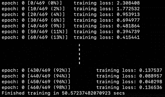
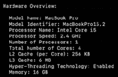
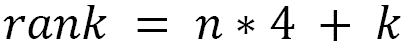
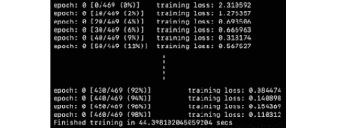
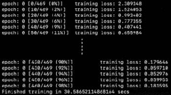
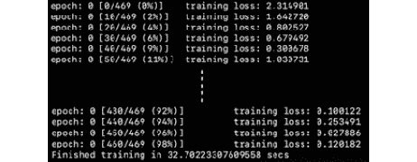

  

# 十一、分布式训练

在为预训练的机器学习模型提供服务之前，我们需要训练我们的机器学习模型，这一点我们在前一章中进行了广泛的讨论。第三章[](B12158_03_Final_ASB_ePUB.xhtml#_idTextAnchor053)**深 CNN 架构*； [*第四章*](B12158_04_Final_ASB_ePUB.xhtml#_idTextAnchor074) ，*深层轮回模式架构*；以及 [*第五章*](B12158_05_Final_ASB_ePUB.xhtml#_idTextAnchor106) 、*混合高级模型*，我们看到了日益复杂的深度学习模型架构的广阔无垠。*

 *这种巨大的模型通常有数百万甚至数十亿个参数。最近(撰写本文时)**生成式预训练转换器 3** ( **GPT3** )语言模型有 1750 亿个参数。使用反向传播来调整许多参数需要大量的内存和计算能力。即使这样，模特训练也需要几天才能完成。

在本章中，我们将探索通过在机器和机器内的过程之间分配训练任务来加速模型训练过程的方法。我们将了解 PyTorch 提供的分布式培训 API——**torch . distributed**、 **torch.multiprocessing** 和**torch . utils . data . distributed . distributed sampler**——它们将使分布式培训看起来很容易。

使用来自 [*第一章*](B12158_01_Final_ASB_ePUB.xhtml#_idTextAnchor017) 、*使用 PyTorch 进行深度学习概述*的手写数字分类示例，我们将演示使用 PyTorch 的分布式训练工具在 CPU 上进行训练时的加速。然后我们将讨论在 GPU 上加速的类似方法。

在本章结束时，你将能够充分利用硬件进行模型训练。对于训练非常大的模型，本章讨论的工具将被证明是至关重要的，如果不是必要的话。

在本章中，我们将讨论以下主题:

*   使用 PyTorch 进行分布式培训
*   使用 CUDA 在 GPU 上进行分布式培训

# 技术要求

我们将在所有练习中使用 Python 脚本。以下是本章使用 pip 必须安装的 Python 库列表。例如，在命令行上运行`pip install torch==1.4.0`，像这样安装`torch`:

```py
jupyter==1.0.0
```

```py
torch==1.4.0
```

```py
torchvision==0.5.0
```

与本章相关的所有代码文件都可以在[https://github . com/packt publishing/Mastering-py torch/tree/master/chapter 11](https://github.com/PacktPublishing/Mastering-PyTorch/tree/master/Chapter11)获得。

# 使用 PyTorch 进行分布式培训

在本书前面的练习中，我们已经隐含地假设模型训练发生在一台机器上，并且发生在那台机器的单个 Python 流程中。在本节中，我们将重温来自 [*第一章*](B12158_01_Final_ASB_ePUB.xhtml#_idTextAnchor017) 、*使用 PyTorch* 的深度学习概述的练习——手写数字分类模型——并将模型训练例程从常规训练转变为分布式训练。在这样做的同时，我们将探索 PyTorch 提供的用于分发培训过程的工具，从而使培训过程更快，硬件效率更高。

首先，我们来看看`MNIST`模型如何在不使用分布式训练的情况下进行训练。然后，我们将这与分布式培训 PyTorch 管道进行对比。

## 定期训练 MNIST 模特

我们在 [*第一章*](B12158_01_Final_ASB_ePUB.xhtml#_idTextAnchor017)*使用 Python 进行深度学习概述*中构建的手写数字分类模型，是 Jupyter 笔记本的形式。这里，我们将把笔记本代码放在一起作为一个 Python 脚本文件。完整代码可以在这里找到:[https://github . com/packt publishing/Mastering-py torch/blob/master/chapter 11/conv net _ undistributed . py](https://github.com/PacktPublishing/Mastering-PyTorch/blob/master/Chapter11/convnet_undistributed.py)。

在以下步骤中，我们将回顾模型培训代码的不同部分:

1.  在 Python 脚本中，我们必须导入相关的库:

    ```py
    import torch
    … 
    import argparse
    ```

2.  接下来，我们必须定义 CNN 模型架构:

    ```py
    class ConvNet(nn.Module):
        def __init__(self): … 
        def forward(self, x): … 
    ```

3.  We must then define the model training routine. The full code has been deliberately written here so that we can compare it to the distributed training mode later:

    ```py
    def train(args):
        torch.manual_seed(0)
        device = torch.device("cpu")
        train_dataloader=torch.utils.data.DataLoader(...)  
        model = ConvNet()
        optimizer = optim.Adadelta(model.parameters(), lr=0.5)
        model.train()
    ```

    在函数的前半部分，我们使用 PyTorch 训练数据集定义我们的 PyTorch 训练`dataloader`。然后，我们实例化我们的深度学习模型，称为`ConvNet`，并定义优化模块。在后半部分，我们运行训练循环，该循环运行规定数量的时期，如以下代码所示:

    ```py
        for epoch in range(args.epochs):
            for b_i, (X, y) in enumerate(train_dataloader):
                X, y = X.to(device), y.to(device)
                pred_prob = model(X)
                loss = F.nll_loss(pred_prob, y) # nll is the negative likelihood loss
                optimizer.zero_grad()
                loss.backward()
                optimizer.step()
    ```

    在循环中，我们以定义的批量大小(本例中为 128)分批运行整个训练数据集。对于包含 128 个训练数据点的每一批，我们通过模型运行正向传递来计算预测概率。然后，我们使用预测和地面实况标签来计算批次损失。我们使用这个损失来计算梯度，以便使用反向传播来调整模型参数。

4.  We now have all the components we need. We can put this all together in a `main()` function:

    ```py
    def main():
        parser = argparse.ArgumentParser()
        … 
        train(args)
    ```

    这里，我们使用一个参数解析器，它可以帮助我们在命令行中运行 Python 训练程序时输入超参数，比如历元数。我们还对训练程序进行计时，以便稍后可以将其与分布式训练程序进行比较。

5.  我们在 Python 脚本中必须做的最后一件事情是，当我们从命令行执行这个脚本时，确保`main()`函数能够运行:

    ```py
    if __name__ == '__main__':
        main()
    ```

6.  Now, we can execute the Python script by running the following command on the command line:

    ```py
    python convnet_undistributed.py --epochs 1
    ```

    我们只运行单个时期的训练数据，因为重点不是模型精度，而是模型训练时间。这将输出以下内容:



图 11.1–常规模型训练日志的输出

训练 1 个时期大约需要 50 秒，相当于 469 个批次，每个批次有 128 个数据点。唯一的例外是最后一批，它比通常少 32 个数据点(因为总共有 60，000 个数据点)。

在这一点上，重要的是要知道这个模型是在什么样的机器上被训练的，以便我们知道参考上下文。例如，下面的屏幕截图显示了我的电脑(MacBook)的系统规格:



图 11.2–硬件规格

在 mac 终端上运行以下命令，可以获得前述信息:

```py
/Volumes/Macintosh\ HD/usr/sbin/system_profiler SPHardwareDataType
```

需要注意的是，我的机器由 4 个 CPU 内核和 16 GB RAM 组成。当您试图并行化训练例程时，这是非常有用的信息，我们接下来将会看到这一点。

## 以分布式方式训练 MNIST 模型

在本节中，我们将基本上重复我们在上一节中提供的*六个步骤*，但是我们将对代码进行一些编辑以实现分布式培训，这应该比我们执行的常规培训更快。这个分布式训练 Python 脚本的完整代码可以在这里找到:[https://github . com/packt publishing/Mastering-py torch/blob/master/chapter 11/conv net _ distributed . py](https://github.com/PacktPublishing/Mastering-PyTorch/blob/master/Chapter11/convnet_distributed.py)。

### 定义分布式训练程序

在本节中，我们将导入对促进分布式培训至关重要的额外 PyTorch 库。然后，我们将重新定义模型训练例程，这一次确保不同的机器和过程可以在训练单个模型时一起工作。让我们开始吧:

1.  Once again, we will start by importing the necessary libraries. This time, we will have a few additional imports:

    ```py
    import torch
    import torch.multiprocessing as mp
    import torch.distributed as dist
    import argparse
    ```

    虽然`torch.multiprocessing`有助于在一台机器中产生多个 Python 进程(通常，我们可以产生与机器中 CPU 核心一样多的进程)，但是`torch.distributed`支持不同机器之间的通信，因为它们一起工作来训练模型。在执行过程中，我们需要从每台机器中显式地启动我们的模型训练脚本。

    其中一个内置的 PyTorch 通信后端，比如如 **Gloo** ，将负责这些机器之间的通信。在每台机器内部，多重处理将负责在几个过程中并行化训练任务。我鼓励你们分别在[https://pytorch.org/docs/stable/multiprocessing.html](https://pytorch.org/docs/stable/multiprocessing.html)和[https://pytorch.org/docs/stable/distributed.html](https://pytorch.org/docs/stable/distributed.html)阅读更多关于多处理和分布的细节。

2.  模型架构定义步骤保持不变，原因很明显:

    ```py
    class ConvNet(nn.Module):
        def __init__(self): … 
        def forward(self, x): … 
    ```

3.  At this point, it's time to define the `train()` function, which is where most of the magic happens. The following highlighted code helps facilitate distributed training:

    ```py
    def train(cpu_num, args):
        rank = args.machine_id * args.num_processes + cpu_num     dist.init_process_group(backend='gloo',
        init_method='env://', world_size=args.world_size,
    rank=rank) 
        torch.manual_seed(0)
        device = torch.device("cpu")  
    ```

    正如我们所看到的，在最开始有额外的代码，由两条语句组成。首先，计算一个`rank`。这实际上是整个分布式系统中进程的序号 ID；例如，如果我们使用两台各有四个 CPU 内核的机器。为了充分利用硬件，我们可能希望总共启动八个进程，每台机器四个。

    在这种情况下，我们将需要以某种方式标记这八个过程，以便记住哪个过程是哪个过程。我们可以这样做，将 id*0*和 *1* 分配给两台机器，然后将 id*0*到 *3* 分配给每台机器中的四个进程。最后，第 *n* 台机器的第 *k* 个过程的等级由以下等式给出:



第二行代码使用了`torch.distributed`模块的`init_process_group`，它为每个启动的进程指定了以下内容:

a)将用于机器间通信的后端(这里是 Gloo)。

b)参与分布式训练的进程总数(由`args.world_size`给出)，也称为`world_size`。

c)正在启动的流程的等级。

d)`init_process_group`方法阻止每个进程执行进一步的动作，直到机器上的所有进程都使用该方法启动。

关于后端，PyTorch 为分布式训练提供了以下三个内置后端: **Gloo** 、 **NCCL** 、 **MPI** 。简而言之，对于 CPU 上的分布式训练，使用 Gloo，对于 GPU，使用 NCCL。你可以在这里详细阅读这些通信后端:[https://py torch . org/tutorials/intermediate/dist _ tuto . html # communication-backends](https://pytorch.org/tutorials/intermediate/dist_tuto.html#communication-backends)。代码如下:

```py
    train_dataset = …  
```

```py
    train_sampler = torch.utils.data.distributed.DistributedSampler(
```

```py
        train_dataset, num_replicas=args.world_size,
```

```py
        rank=rank)
```

```py
    train_dataloader = torch.utils.data.DataLoader(
```

```py
 dataset=train_dataset, batch_size=args.batch_size,
```

```py
 shuffle=False, num_workers=0, sampler=train_sampler)
```

```py
    model = ConvNet()
```

```py
    optimizer = optim.Adadelta(model.parameters(), lr=0.5)
```

```py
    model = nn.parallel.DistributedDataParallel(model)
```

```py
    model.train()
```

与未分发的训练练习相比，我们已经将`MNIST`数据集实例化与数据加载器实例化分开。在这两个步骤之间，我们插入了一个数据采样器；也就是`torch.utils.data.distributed.DistributedSampler`。

采样器的任务是将训练数据集分成`world_size`个分区，以便分布式训练会话中的所有进程都能处理相同部分的数据。注意，我们已经在 dataloader 实例化中将 shuffle 设置为`False`,因为我们使用采样器来分发数据。

对代码的另一个补充是`nn.parallel.DistributedDataParallel`函数，它应用于模型对象。这可能是这段代码中最重要的部分，因为`DistributedDataParallel`是一个关键的组件/API，它以分布式的方式促进了梯度下降算法。下面是引擎盖下发生的事情:

a)分布式世界中的每个衍生进程都有自己的模型副本。

b)每个流程的每个模型维护其自己的优化器，并经历与全局迭代同步的局部优化步骤。

c)在每个分布式训练迭代中，在每个过程中计算个体损失以及梯度。这些梯度然后在整个过程中被平均。

d)然后，平均梯度被普遍反向传播到每个模型副本，调整它们的参数。

e)由于通用反向传播步骤，所有模型的参数在每次迭代中都是相同的，这意味着它们是自动同步的。

确保每个 Python 进程运行在独立的 Python 解释器上。这消除了 GIL 限制，如果多个模型在同一个解释器下的多个线程中被实例化，就会出现这种限制。这进一步提高了性能，尤其是对于需要大量 Python 特定处理的模型:

```py
    for epoch in range(args.epochs):
```

```py
        for b_i, (X, y) in enumerate(train_dataloader):
```

```py
            X, y = X.to(device), y.to(device)
```

```py
            pred_prob = model(X)
```

```py
            … 
```

```py
        if b_i % 10 == 0 and cpu_num==0:
```

```py
        print(...)
```

最后，训练循环几乎和以前一样。唯一的区别是，我们将日志记录限制为只记录等级为 0 的进程。我们这样做是因为等级为`0`的机器用于设置所有通信。因此，我们名义上使用等级为`0`的过程作为我们的参考来跟踪模型的训练表现。如果我们不限制这一点，我们将在每个模型训练迭代中获得与过程一样多的日志行。

### 对多个流程执行分布式培训

在上一节中，我们定义了模型，以及分布式训练例程。在本节中，我们将在多个硬件设置上执行该例程，并观察分布式训练对模型训练时间的影响。让我们开始吧:

1.  Moving on from the `train()` function to the `main()` function, we can see a lot of additions in the code:

    ```py
    def main():
        parser = argparse.ArgumentParser()
        parser.add_argument('--num-machines', default=1, type=int,)
        parser.add_argument('--num-processes', default=1, type=int)
        parser.add_argument('--machine-id', default=0, type=int)
        parser.add_argument('--epochs', default=1, type=int)
        parser.add_argument('--batch-size', default=128, type=int)
        args = parser.parse_args()
        args.world_size = args.num_processes * args.num_machines                
        os.environ['MASTER_ADDR'] = '127.0.0.1'              
        os.environ['MASTER_PORT'] = '8892'      
        start = time.time()
        mp.spawn(train, nprocs=args.num_processes, args=(args,))
        print(f"Finished training in {time.time()-start} secs")
    ```

    首先，我们可以观察到以下附加论点:

    a) `num_machines`:顾名思义，指定机器的数量。

    b) `num_processes`:每台机器要产生的进程数。

    c) `machine_id`:当前机器的序号 ID。记住，这个 Python 脚本需要在每台机器上单独启动。

    d) `batch_size`:一批数据点的个数。为什么我们突然需要这个？

    正如我们前面提到的，我们需要这样做有两个原因。首先，所有的过程都有自己的梯度，这些梯度将被平均以得到每次迭代的总梯度。因此，我们需要明确指定在一次模型训练迭代中每个过程处理多少数据点。其次，将完整的训练数据集分成`world_size`个个体数据集。

    因此，在每个迭代中，整批数据需要被分成每个过程的`world_size`个子批数据。因为`batch_size`现在耦合到了`world_size`，所以我们提供它作为更简单的训练接口的输入参数。因此，举例来说，如果`world_size`增加一倍，那么`batch_size`就需要减半，以便能够在所有机器和流程中均匀分布数据点。

    在提供了前面的附加参数后，我们将`world_size`计算为派生参数。然后，我们指定两个重要的环境变量:

    a) `MASTER_ADDR`:运行等级为`0`的进程的机器的 IP 地址。

    b) `MASTER_PORT`:运行等级为`0`的进程的机器上的可用端口。

    正如我们在上一节的*步骤 3*-*定义分布式训练例程*中提到的，等级为`0`的机器建立所有后端通信，因此整个系统始终能够定位主机是很重要的。这就是我们提供其 IP 地址和端口的原因。

    在这个例子中，训练过程将在单个本地机器上运行，因此本地主机地址就足够了。然而，当跨位于远程的服务器运行多机训练时，我们需要提供带有空闲端口的 rank `0`服务器的确切 IP 地址。

    我们做的最后一个改变是使用多重处理在一台机器上产生`num_processes`个进程，而不是简单地运行一个训练进程。分布参数被传递给每个产生的进程，以便进程和机器在模型训练运行期间相互协调。

2.  我们分布式训练代码的最后一部分与之前的一样:

    ```py
    if __name__ == '__main__':
        main()
    ```

3.  We are now in a position to launch the distributed training script. We will begin with an undistributed-like run using the distributed-like script. We can do so by simply setting the number of machines, as well as the number of processes, to `1`:

    ```py
    python convnet_distributed.py --num-machines 1 --num-processes 1 --machine-id 0 --batch-size 128
    ```

    注意

    在撰写本文时，Gloo 后端只能在 Linux 和 macOS 上运行。不幸的是，这意味着这段代码不能在 Windows 操作系统上运行。

    请注意，由于只有一个流程用于培训，`batch_size`与之前的练习相比保持不变。您将看到以下输出:

    

    图 11.3–采用单一流程的分布式培训

    如果我们将这一结果与图 11.1 所示的结果进行比较，尽管其遵循相似的模式，但训练时间略短。训练损失的演变也相当相似。

4.  We will now run a truly distributed training session with `2` processes instead of `1`. Due to this, we will halve the batch size from `128` to `64`:

    ```py
    python convnet_distributed.py --num-machines 1 --num-processes 2 --machine-id 0 --batch-size 64
    ```

    您将看到以下输出:

    

    图 11.4–具有两个流程的分布式培训

    正如我们所看到的，训练时间减少了很多——从 **44** 秒减少到 **30** 秒。再一次，训练损失的发展似乎没有受到影响，这显示了分布式训练如何能够加速训练而没有任何模型准确性的损失。

5.  Now, let's go even further and use `4` processes instead of `2`. Due to this, we will reduce the batch size from `64` to `32`:

    ```py
    python convnet_distributed.py --num-machines 1 --num-processes 4 --machine-id 0 --batch-size 32
    ```

    您将看到以下输出:

    

    图 11.5–包含四个流程的分布式培训

    与我们的预期相反，训练时间没有进一步减少，事实上还略有增加。这就是我们需要回到*图 11.2* 的地方——这里，机器有四个 CPU 内核，所有的内核都被一个进程占用。

    由于这个会话是在本地机器上运行的，所以也有其他进程在运行(比如 Google Chrome)，它们可能会与我们的一个或多个分布式训练进程争夺资源。

    实际上，以分布式方式训练模型是在远程机器上完成的，远程机器的唯一工作是执行模型训练。在这样的机器上，建议使用与 CPU 核心一样多(甚至更多)的进程。

    您仍然可以启动比核心数量更多的进程，但是这不会产生显著的训练时间改进(如果有的话)，因为多个进程将争夺一个资源(一个 CPU 核心)。你可以在这里阅读更多关于内核和进程的信息:[https://www.guru99.com/cpu-core-multicore-thread.html](https://www.guru99.com/cpu-core-multicore-thread.html)。

6.  As a final note, because we have only used one machine in this exercise, we only needed to launch one Python script to start training. If, however, you are training on multiple machines, then besides applying the changes to `MASTER_ADDR` and `MASTER_PORT`, as advised in *step 4*, you need to launch one Python script in each machine. For example, if there are two machines, then on the first machine, run the following command:

    ```py
    python convnet_distributed.py --num-machines 2 --num-processes 2 --machine-id 0 --batch-size 32
    ```

    然后，在第二台计算机上，运行以下命令:

    ```py
    python convnet_distributed.py --num-machines 2 --num-processes 2 --machine-id 1 --batch-size 32
    ```

这就结束了我们以分布式方式使用 PyTorch 在 CPU 上训练深度学习模型的实践讨论。只需添加几行代码，一个普通的 PyTorch 模型训练脚本就可以变成一个分布式训练环境。我们在本节中进行的练习是针对一个简单的卷积网络。然而，因为我们甚至没有接触模型架构代码，这个练习可以很容易地扩展到更复杂的学习模型，在那里收益将更明显和更需要。

在下一节，也是最后一节，我们将简要讨论如何应用类似的代码更改，以促进 GPU 上的分布式培训。

# 使用 CUDA 在 GPU 上进行分布式培训

在本书的各种练习中，你可能已经注意到 PyTorch 代码中的一行:

```py
device = torch.device('cuda' if torch.cuda.is_available() else 'cpu')
```

这段代码只是寻找可用的计算设备，并优先选择`cuda`(使用 GPU)而不是`cpu`。这种偏好是因为 GPU 可以在常规神经网络操作上提供计算加速，例如通过并行化的矩阵乘法和加法。

在本节中，我们将学习如何在 GPU 分布式培训的帮助下进一步加快速度。我们将在前一个练习中完成的工作基础上继续。注意，大部分代码看起来是一样的。在下面的步骤中，我们将突出显示这些更改。脚本的执行留给了您作为练习。完整代码可从这里获得:[https://github . com/packt publishing/Mastering-py torch/blob/master/chapter 11/conv net _ distributed _ cuda . py](https://github.com/PacktPublishing/Mastering-PyTorch/blob/master/Chapter11/convnet_distributed_cuda.py)。让我们开始吧:

1.  While the imports and model architecture definition code are exactly the same as they were previously, there are a few changes we need to make in the `train()` function:

    ```py
    def train(gpu_num, args):
    rank = args.machine_id * args.num_processes + cpu_num                        
    dist.init_process_group(                                   
    backend='nccl', init_method='env://',                                   
    world_size=args.world_size, rank=rank) 
        torch.manual_seed(0)
        model = ConvNet()
    torch.cuda.set_device(gpu_num)
    model.cuda(gpu_num)
    criterion = nn.NLLLoss().cuda(gpu_num) # nll is the negative likelihood loss
    ```

    正如我们在上一节的*步骤 3*—*定义分布式训练例程*中所讨论的，当使用 GPU 时，NCCL 是通信后端的首选。模型和损失函数都需要放在 GPU 设备上，以确保利用 GPU提供的并行矩阵运算，并相应地加速训练:

    ```py
        train_dataset = ...   
    train_sampler = ... 
        train_dataloader = torch.utils.data.DataLoader(
           dataset=train_dataset, batch_size=args.batch_size,
           shuffle=False, num_workers=0, pin_memory=True,
           sampler=train_sampler)
        optimizer = optim.Adadelta(model.parameters(), lr=0.5)
      model = nn.parallel.DistributedDataParallel(model,
           device_ids=[gpu_num])
        model.train()
    ```

    `DistributedDataParallel` API 接受一个名为`device_ids`的附加参数，该参数接受调用它的 GPU 进程的等级。数据加载器下还有一个附加参数`pin_memory`，设置为`True`。这实质上有助于在模型训练期间更快地将数据从主机(在本例中是 CPU，它是加载数据集的地方)传输到各种设备(GPU)。

    该参数使数据加载器能够*将*数据固定到 CPU 内存中——换句话说，将数据样本分配到固定页面锁定的 CPU 内存插槽中。然后，在训练期间，来自这些槽的数据被复制到相应的 GPU。你可以在这里了解更多牵制策略:[https://developer . NVIDIA . com/blog/how-optimize-data-transfers-cuda-cc/](https://developer.nvidia.com/blog/how-optimize-data-transfers-cuda-cc/)。`pin_memory=True`机制与`non_blocking=True`参数一起工作，如以下代码所示:

    ```py
    for epoch in range(args.epochs):
            for b_i, (X, y) in enumerate(train_dataloader):
          X, y = X.cuda(non_blocking=True), y.cuda(non_blocking=True)
                pred_prob = model(X)
                …            
    ```

    通过调用`pin_memory`和`non_blocking`参数，我们实现了以下内容之间的重叠:

    a) CPU 到 GPU 数据(地面实况)传输

    b) GPU 模型训练计算(或 GPU 内核执行)

    这基本上使得整个 GPU 训练过程更高效(更快)。

2.  Besides the changes in the `train()` function, we must change a few lines in the `main()` function as well:

    ```py
    def main():
        parser.add_argument('--num-gpu-processes', default=1, type=int)
        args.world_size = args.num_gpu_processes * args.num_machines                
        mp.spawn(train, nprocs=args.num_gpu_processes, args=(args,))
    ```

    我们现在有了`num_gpu_processes`，而不是`num_process`。代码的其余部分会相应地更改。GPU 代码的其余部分与之前相同。现在，通过执行以下命令，我们可以在 GPU 上运行分布式训练了:

    ```py
    python convnet_distributed_cuda.py --num-machines 1 --num-gpu-processes 2 --machine-id 0 --batch-size 64
    ```

这使我们结束了对使用 PyTorch 在 GPU 上进行分布式模型训练的简要讨论。正如我们在上一节中提到的，为前面的示例建议的代码更改可以扩展到其他深度学习模型。在 GPU 上使用分布式训练实际上是大多数最新的最先进的深度学习模型的训练方式。这应该让你开始使用 GPU 训练你自己的惊人模型。

# 总结

在这一章中，我们讨论了机器学习的一个重要的实践方面；也就是如何优化模型训练过程。我们使用 PyTorch 探索了分布式培训的范围和力量。首先，我们讨论了 CPU 上的分布式训练。我们使用 PyTorch 重新训练了我们在 [*第一章*](B12158_01_Final_ASB_ePUB.xhtml#_idTextAnchor017) 、*深度学习概述中训练过的模型，使用了分布式训练的原理。*

在进行这个练习时，我们学习了一些有用的 PyTorch APIs，一旦我们做了一些代码更改，它们就可以使分布式培训工作起来。最后，我们运行了新的培训脚本，并通过将培训分布到多个流程中观察到了显著的加速。

在本章的后半部分，我们简要讨论了使用 PyTorch 在 GPU 上进行分布式训练。我们强调了模型训练以分布式方式在多个 GPU 上工作所需的基本代码更改，同时将实际执行留给您作为练习。

在下一章中，我们将继续讨论应用机器学习的另一个重要且有前途的方面，我们已经在第三章[](B12158_03_Final_ASB_ePUB.xhtml#_idTextAnchor053)**深度 CNN 架构*， [*第五章*](B12158_05_Final_ASB_ePUB.xhtml#_idTextAnchor106) ，*混合高级模型*中提到过:我们将学习如何有效地使用 PyTorch 进行**自动机器学习** ( **AutoML** )。通过这样做，我们将能够使用 AutoML 自动训练机器学习模型；也就是说，不需要决定和定义模型架构。**