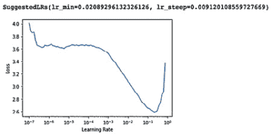
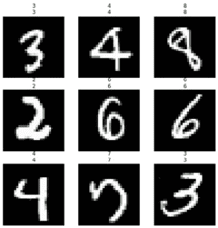
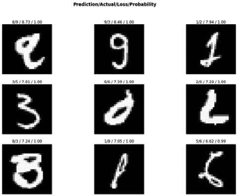
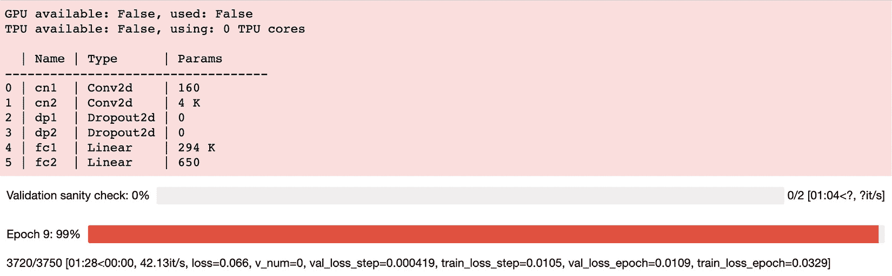

  

# 十四、PyTorch FastAI

在前面的章节中，我们已经看到了 PyTorch 作为一个 Python 库的多个方面。我们已经看到它用于训练视觉和文本模型。我们已经了解了其用于加载和处理数据集的广泛的**应用编程接口**(**API**)。我们探讨了 PyTorch 提供的模型推理支持。我们还注意到 PyTorch 跨编程语言(如 C++)的互操作性，以及与其他深度学习库(如 TensorFlow)的互操作性。

为了适应所有这些特性，PyTorch 提供了丰富而广泛的 API 家族，这使得它成为有史以来最好的深度学习库之一。然而，这些特性的广阔范围也使得 PyTorch 成为一个沉重的库，这有时会使用户不敢执行简化或简单的模型训练和测试任务。

本章重点介绍一些构建在 PyTorch 之上的库，这些库旨在提供直观易用的 API，以便用几行代码构建快速模型训练和测试管道。我们先来讨论一下 **fast.ai** ，这是最流行的高级深度学习库之一。

我们将展示 fast.ai 如何帮助加速深度学习研究过程，以及使深度学习可用于所有级别的专业知识。最后，我们将看看 **PyTorch Lightning** ，它提供了在任何硬件配置上使用完全相同的代码进行训练的能力，无论是多个**中央处理单元**(**CPU**)、**图形处理单元**(**GPU**)，甚至是**张量处理单元** ( **TPUs** )。

还有其他这样的库——比如`PyTorch Ignite`、`Poutyne`等等——旨在实现类似的目标，但是我们不会在这里讨论它们。本章应该让你熟悉这些更高级的深度学习库，它们对于快速原型化你的深度学习模型非常有用。

到本章结束时，你将能够在自己的深度学习项目中使用 fast.ai 和 PyTorch Lightning，并有望看到花在模型训练和测试上的时间大幅减少。

本章分为以下几个主题:

*   使用 fast.ai 在几分钟内设置好模型训练
*   使用 PyTorch Lightning 在任何硬件上训练模型

# 技术要求

我们将在所有练习中使用 Jupyter 笔记本。这里是本章将要安装的 Python 库的列表，使用`pip`(例如，通过在命令行上运行`pip install torch==1.4.0`:

```py
jupyter==1.0.0
```

```py
torch==1.4.0
```

```py
torchvision==0.5.0 matplotlib==3.1.2
```

```py
pytorch-lightning==1.0.5
```

```py
fast.ai==2.1.8
```

与本章相关的所有代码文件可在以下 GitHub 页面获得:[https://GitHub . com/packt publishing/Mastering-py torch/tree/master/chapter 14](https://github.com/PacktPublishing/Mastering-PyTorch/tree/master/Chapter14)。

# 使用 fast.ai 在几分钟内设置好模型训练

在本节中，我们将使用 fast.ai 库(【https://docs.fast.ai/】)以练习的形式，用不到 10 行代码训练和评估一个手写的数字分类模型。我们还将使用 fast.ai 的`interpretability`模块来了解训练好的模型在哪些地方仍然表现不佳。练习的完整代码可以在下面的 GitHub 页面找到:[https://GitHub . com/packt publishing/Mastering-py torch/blob/master/chapter 14/fast . ai . ipynb](https://github.com/PacktPublishing/Mastering-PyTorch/blob/master/Chapter14/fastai.ipynb)。

## 设置 fast.ai 并加载数据

在本节中，我们将首先导入 fast.ai 库，加载`MNIST`数据集，最后预处理数据集进行模型训练。我们将如下进行:

1.  First, we will import fast.ai in the recommended way, as shown here:

    ```py
    import os
    from fast.ai.vision.all import *
    ```

    虽然`import *`并不是 Python 中导入库的推荐方式，但 fast.ai 文档建议使用这种格式，因为 fast.ai 被设计用于**读取-评估-打印循环** ( **REPL** )环境。你可以在这里阅读更多关于的推理:[https://www . fast . ai/2020/02/13/fast . ai-A-Layered-API-for-Deep-Learning/](https://www.fast.ai/2020/02/13/fastai-A-Layered-API-for-Deep-Learning/)。

    基本上，这一行代码从 fast.ai 库中导入了一些关键模块，这些模块对于用户执行模型训练和评估来说通常是必要的，并且基本上是足够的。隐式导入模块的列表可以在这里找到:[https://fast.ai1.fast.ai/imports.html](https://fastai1.fast.ai/imports.html)。

2.  Next, by using fast.ai's ready-to-use data modules, we will load the `MNIST` dataset, which is among the provided list of datasets under the fast.ai library, as follows:

    ```py
    path = untar_data(URLs.MNIST)
    print(path)
    ```

    fast.ai 下可用数据集的详尽列表可以在[https://docs.fast.ai/data.external](https://docs.fast.ai/data.external)看到。前面的代码应该输出如下:

    

    图 14.1–fast . ai 数据集路径

    这是数据集将被存储的地方，以便我们知道将来的目的。

3.  We can now look at a sample image path under the stored dataset, so as to understand how the dataset is laid out, as follows:

    ```py
    files = get_image_files(path/"training")
    print(len(files))
    print(files[0])
    ```

    这将输出如下:

    

    图 14.2–fast . ai 数据集示例

    在训练数据集中总共有 60，000 张。正如我们所见，在`training`文件夹中，是一个引用数字 9 的`9`子文件夹，子文件夹中是数字 9 的图像。

4.  Using the information gathered in the preceding step, we can generate labels for the `MNIST` dataset. We first declare a function that takes an image path and uses its parent folder's name to derive the digit (class) that the image belongs to. Using this function and the `MNIST` dataset path, we instantiate a `DataLoader`, as shown in the following piece of code:

    ```py
    def label_func(f): return f.parent.name
    dls = ImageDataLoaders.from_path_func(path, fnames=files, label_func=label_func, num_workers=0)
    dls.show_batch()
    ```

    它应该输出类似这样的内容:


图 14.3–fast . ai 批处理显示

正如我们所看到的，数据加载器设置正确，我们现在准备继续进行模型训练，这将在下一节中进行。

## 使用 fast.ai 训练 MNIST 模型

使用上一节中创建的`DataLoader`，我们现在将使用三行代码用 fast.ai 训练一个模型，如下所示:

1.  First, we use fast.ai's `cnn_learner` module to instantiate our model. Instead of defining the model architecture from scratch, we use `resnet18` as the base architecture. You can read about the extensive list of available base architectures for computer vision tasks here: [https://fast.ai1.fast.ai/vision.models.html](https://fast.ai1.fast.ai/vision.models.html).

    另外，请随意查看第三章 *、深度 CNN 架构*中提供的模型架构细节。

2.  Next, we also define the metric that the model training logs should contain. Before actually training the model, we use fast.ai's **Learning Rate Finder** to suggest a good learning rate for this model architecture and dataset combination. You can read more about the learning rate finder at [https://fast.ai1.fast.ai/callbacks.lr_finder.html](https://fast.ai1.fast.ai/callbacks.lr_finder.html). The code for this step is shown here:

    ```py
    learn = cnn_learner(dls, arch=resnet18, metrics=accuracy)
    learn.lr_find()
    ```

    它应该输出类似这样的内容:

    

    图 14.4-学习率查找器输出

    学习率查找器本质上是用每次迭代的不同学习率进行模型训练，从一个低值开始，以一个高值结束。然后，它将每次迭代的损失与相应的学习率值进行对比。正如我们在这个图中看到的，学习率`0.0209`是损失最小的地方。因此，我们将选择它作为模型训练的基础学习率值。

3.  We are now ready to train our model. We could use `learn.fit` to train the model from scratch, but to aim for a better performance we will fine-tune a pre-trained `resnet18` model using the `learn.fine_tune` method, as shown in the following line of code:

    ```py
    learn.fine_tune(epochs=2, base_lr=0.0209, freeze_epochs=1)
    ```

    这里，`freeze_epochs`指的是的次数，模型最初在一个冻结的网络上被训练，其中只有最后一层被解冻。`epochs`是指通过解冻整个`resnet18`网络，模型在其后被训练的时期的数量。代码应该输出如下内容:


图 14.5–fast . ai 训练日志

如我们所见，有第一个用冻结网络训练的时期，然后有两个用解冻网络训练的后续时期。我们还可以在日志中看到准确性指标，我们在*步骤 2* 中将其声明为我们的指标。训练日志看起来很合理，看起来模型确实在学习任务。在本练习的下一个也是最后一个部分，我们将查看该模型在一些样本上的表现，并尝试了解它的失败之处。

## 使用 fast.ai 评估和解释模型

我们将首先查看经过训练的模型如何在一些样本图像上执行，最后探究模型所犯的主要错误，以便了解需要改进的范围。我们将如下进行:

1.  With the trained model, we can use the `show_results` method to look at some of the model's predictions, as shown in the following line of code:

    ```py
    learn.show_results()
    ```

    它应该输出类似这样的内容:

    

    图 14.6–fast . ai 样本预测

    在前面的截图中，我们可以看到该模型已经得到了所有九个正确的图像。因为训练模型的准确度已经是的 99%，我们将需要 100 张图像来观察一个错误的预测。相反，我们将在下一步中专门查看模型所犯的错误。

2.  In [*Chapter 13*](B12158_13_Final_ASB_ePUB.xhtml#_idTextAnchor291)*, PyTorch and Explainable AI*, we learned about **model interpretability**. One of the ways of trying to understand how a trained model is working is to look at where it is failing the most. Using fast.ai's `Interpretation` module, we can do that in two lines of code, as shown here:

    ```py
    interp = Interpretation.from_learner(learn)
    interp.plot_top_losses(9, figsize=(15,10))
    ```

    这将输出以下内容:



图 14.7–fast . ai 最常见的模型错误

在*图 14.7* 中，我们可以看到每幅图像都标有预测、地面真相、交叉熵损失和预测概率。即使对人类来说，这些情况中的大多数都是困难的/错误的，因此模型犯错误是可以接受的。但是对于右下角的例子，这个模型是完全错误的。这种类型的分析可以通过进一步剖析模型来跟进，就像我们在前一章所做的那样。

这就结束了练习和我们对 fast.ai 的讨论。fast.ai 可以为机器学习工程师和研究人员提供很多东西——无论是初学者还是高级用户。这项练习旨在展示 fast.ai 的快速性和易用性。这一部分的经验教训可以用于 fast.ai 的其他机器学习任务。在的掩护下，fast.ai 使用 PyTorch 的功能，因此总是可以在这两个框架之间切换。

在下一节中，我们将探索另一个这样的库，它位于 PyTorch 之上，便于用户用相对较少的代码行训练模型，使代码与硬件无关。

# 使用 PyTorch Lightning 在任何硬件上训练模型

PyTorch Lightning([https://github.com/PyTorchLightning/pytorch-lightning](https://github.com/PyTorchLightning/pytorch-lightning))是另一个库，它构建在 py torch 之上，用于提取模型训练和评估所需的样板代码。该库的一个特殊功能是，使用 PyTorch Lightning 编写的任何模型训练代码都可以在任何硬件配置(如多个 CPU、多个 GPU 甚至多个 TPU)上运行，而无需进行任何更改。

在下面的练习中，我们将在 CPU 上使用 PyTorch Lightning 训练和评估一个手写数字分类模型。您可以在 GPU 或 TPU 上使用相同的代码进行培训。以下练习的完整代码可以在这里找到:[https://github . com/packt publishing/Mastering-py torch/blob/master/chapter 14/py torch _ lightning . ipynb](https://github.com/PacktPublishing/Mastering-PyTorch/blob/master/Chapter14/pytorch_lightning.ipynb)。

## 在 PyTorch Lightning 中定义模型组件

在本练习的部分，我们将演示如何在 PyTorch Lightning 中初始化`model`类。这个库基于*自包含模型系统*的理念——也就是说，模型类不仅包含模型架构定义，还包含优化器定义和数据集加载器，以及训练、验证和测试集性能计算 n 个函数，所有这些都在一个地方。

我们将如下进行:

1.  First, we need to import the relevant modules, as follows:

    ```py
    import torch
    import torch.nn as nn
    from torch.nn import functional as F
    from torch.utils.data import DataLoader
    from torchvision.datasets import MNIST
    from torchvision import transforms
    import pytorch_lightning as pl
    ```

    正如我们所看到的，PyTorch Lightning 仍然使用了大量的本地 PyTorch 模块来定义模型类。我们还从`torchvision.datasets`模块直接导入了`MNIST`数据集，用于训练手写数字分类器。

2.  Next, we define the PyTorch Lightning model class, which contains everything that is needed to train and evaluate our model. Let's first look at the model architecture-related methods of the class, as follows:

    ```py
    class ConvNet(pl.LightningModule):
        def __init__(self):
            super(ConvNet, self).__init__()
            self.cn1 = nn.Conv2d(1, 16, 3, 1)
            … 
            self.fc2 = nn.Linear(64, 10)
        def forward(self, x):
            x = self.cn1(x)
            … 
            op = F.log_softmax(x, dim=1)
            return op
    ```

    这两个方法——`__init__`和`forward`——以与本地 PyTorch 代码相同的方式工作。

3.  接下来，我们来看看模型类的其他方法，如下:

    ```py
        def training_step(self, batch, batch_num):
            … 
        def validation_step(self, batch, batch_num):
            … 
        def validation_epoch_end(self, outputs):
            … 
        def test_step(self, batch, batch_num):
            … 
        def test_epoch_end(self, outputs):
            … 
        def configure_optimizers(self):
            return torch.optim.Adadelta(self.parameters(), lr=0.5)
        def train_dataloader(self):
           … 
        def val_dataloader(self):
            … 
        def test_dataloader(self):
           … 
    ```

虽然诸如`training_step`、`validation_step`和`test_step`的方法意在评估训练、验证和测试集上的每次迭代性能，但是`*_epoch_end`方法计算每个时期的性能。有`*_dataloader`方法用于训练、验证和测试集。最后是`configure_optimizer`方法，它定义了用于训练模型的优化器。

## 使用 PyTorch Lightning 训练和评估模型

在建立了模型类之后，我们现在将在练习的这一部分中训练模型。然后，我们将在测试集上评估训练好的模型的性能。

我们将如下进行:

1.  **Instantiating the model object**: Here, we will first instantiate the model object using the model class defined in *step 3* of the previous section - *Defining the model components in PyTorch Lightning*. We will then use the `Trainer` module from PyTorch Lightning to define a `trainer` object.

    请注意，我们只依赖 CPU 进行模型训练。但是，您可以轻松地切换到 GPU 或 TPU。PyTorch Lightning 的妙处在于，你可以根据自己的硬件设置，在`trainer`定义代码中添加一个参数，比如`gpus=8`或者`tpus=2`，整个代码仍然会运行，无需任何进一步的修改。

    我们从下面几行代码开始模型训练过程:

    ```py
    model = ConvNet()
    trainer = pl.Trainer(progress_bar_refresh_rate=20, max_epochs=10)    
    trainer.fit(model)  
    ```

    它应该输出类似这样的内容:

    

    图 14.8–py torch 闪电培训日志

    首先，`trainer`对象评估可用的硬件，然后它还记录要训练的整个模型架构，以及架构中每层的参数数量。此后，它逐个时期地开始模型训练。它训练直到定义`trainer`对象时使用`max_epochs`参数指定的`10`时期。我们还可以看到，在每个时期都记录了训练和验证损失。

2.  **Testing the model**: Having trained the model for `10` epochs, we can now test it. Using the `.test` method, we request the `trainer` object, that was defined in *step 1* of this section, to run inference on the test set, as follows:

    ```py
    trainer.test()
    ```

    它应该输出类似这样的内容:

    

    图 14.9–py torch 闪电测试日志

    我们可以看到，该模型使用经过训练的模型输出了训练、验证和测试损失。

3.  **Exploring the trained model**: Finally, PyTorch Lightning also provides a neat interface with TensorBoard ([https://www.tensorflow.org/tensorboard](https://www.tensorflow.org/tensorboard)), which is a great visualization toolkit made originally for TensorFlow. By running the following lines of code, we can explore the training, validation, and test set performance of the trained model interactively in a web app:

    ```py
    # Start TensorBoard.
    %reload_ext tensorboard
    %tensorboard --logdir lightning_logs/
    ```

    这将输出以下内容:


图 14.10–py torch 闪电张量板日志

正如输出提示中所建议的，如果我们在 web 浏览器上转到 [http://localhost:6007/](http://localhost:6007/) ，它将打开一个 TensorBoard 会话，看起来应该是这样的:


图 14.11–py torch 闪电张量板输出

在这个交互式可视化工具包中，我们可以从损失、准确性和各种其他指标的角度来查看按时期划分的模型训练进度。这是 PyTorch Lightning 的另一个简洁的特性，它使我们能够通过几行代码获得丰富的模型评估和调试体验。

注意

常规 PyTorch 代码也提供了与 TensorBoard 的接口，尽管代码比较长。你可以在这里阅读更多关于它的信息:[https://pytorch.org/docs/stable/tensorboard.html](https://pytorch.org/docs/stable/tensorboard.html)。

这个练习和这一部分到此结束。虽然这是对py torch Lightning 库的简要概述，但是对于了解这个库、它如何工作以及它如何为您的项目工作已经足够了。PyTorch Lightning 的文档页面上有更多的例子和教程，可在 https://pytorch-lightning.readthedocs.io/en/stable/[获得。](https://pytorch-lightning.readthedocs.io/en/stable/)

如果您正在快速试验各种模型，或者想要减少模型训练管道中的脚手架代码，那么这个库值得一试。

# 总结

在这本书的最后一章，我们将重点放在抽象出模型训练代码中涉及的嘈杂的细节和核心组件，以促进模型的快速原型化。由于 PyTorch 代码经常被大量这种嘈杂的详细代码组件弄得杂乱无章，我们查看了一些构建在 PyTorch 之上的高级库。

首先，我们探索了 fast.ai，它使 PyTorch 模型能够在不到 10 行代码内得到训练。以练习的形式，我们展示了使用 fast.ai 训练手写数字分类模型的有效性。我们使用 fast.ai 的一个模块来加载数据集，另一个模块来训练和评估模型，最后，另一个模块来解释训练的模型行为。

接下来，我们看了 PyTorch Lightning，这是构建在 PyTorch 之上的另一个高级库。我们做了一个类似的训练手写数字分类器的练习。我们展示了典型 PyTorch Lightning 会话中使用的代码布局，以及与常规 PyTorch 代码相比，它如何减少混乱。

我们重点介绍了 PyTorch Lightning 如何在不同的硬件配置中使用完全相同的模型训练代码。最后，我们还探索了 PyTorch Lightning 与 TensorBoard 联合提供的模型评估接口。

虽然我们讨论了这两个库，但是还有更多可用的库，比如 PyTorch `Ignite`和`Poutyne`。随着 PyTorch 的不断发展和扩展，这样的高级库将会在 PyTorch 用户中越来越流行。因此，类似于我们在前面章节中讨论的 PyTorch 的许多其他方面——例如第 13 章[](B12158_13_Final_ASB_ePUB.xhtml#_idTextAnchor291)**、PyTorch 和可解释的 AI、*以及第 12 章 *、PyTorch 和 AutoML* 中的自动化机器学习——这是另一个需要关注的领域。*

 *我们已经读到这本书的结尾了！我希望这里涵盖的各种主题将有助于您有效和高效地使用 PyTorch 进行深度学习。除了在 PyTorch 中编写各种深度学习架构和有趣的应用程序，我们还探索了一些有用的实用概念，如模型部署、分发和原型制作。因此，当您对 PyTorch 的任何特定方面有疑问时，这本书也可以作为指南。

现在，轮到你将你在本书中掌握的 PyTorch 技能应用到你的深度学习项目中了。谢谢你看这本书，继续学习！*