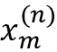

# one

# 赋予计算机从数据中学习的能力

在我看来，**机器学习**，即理解数据的算法的应用和科学，是所有计算机科学中最令人兴奋的领域！我们生活在一个数据大量涌现的时代；使用机器学习领域的自学习算法，我们可以将这些数据转化为知识。由于近年来开发了许多强大的开源库，现在可能是进入机器学习领域并学习如何利用强大的算法来发现数据模式并预测未来事件的最佳时机。

在本章中，您将了解机器学习的主要概念和不同类型。通过对相关术语的基本介绍，我们将为成功使用机器学习技术解决实际问题打下基础。

在本章中，我们将讨论以下主题:

*   机器学习的一般概念
*   学习的三种类型和基本术语
*   成功设计机器学习系统的基石
*   为数据分析和机器学习安装和设置 Python

# 建造智能机器将数据转化为知识

在这个现代科技时代，有一种资源我们非常丰富:大量的结构化和非结构化数据。在 20 世纪下半叶，机器学习发展成为**人工智能** ( **AI** )的一个子领域，涉及自学习算法，从数据中获取知识以进行预测。

机器学习不需要人类通过分析大量数据来手动推导规则和建立模型，而是提供了一种更有效的替代方法来捕捉数据中的知识，以逐步提高预测模型的性能，并做出数据驱动的决策。

机器学习不仅在计算机科学研究中变得越来越重要，而且在我们的日常生活中也发挥着越来越大的作用。多亏了机器学习，我们可以享受强大的垃圾邮件过滤器、便捷的文本和语音识别软件、可靠的网络搜索引擎、娱乐电影推荐、移动支票存款、预计送餐时间等等。希望很快，我们会将安全高效的自动驾驶汽车添加到这个列表中。此外，在医疗应用方面也取得了显著进展；例如，研究人员证明了深度学习模型可以以接近人类的精度检测皮肤癌([https://www.nature.com/articles/nature21056](https://www.nature.com/articles/nature21056))。DeepMind 的研究人员最近实现了另一个里程碑，他们使用深度学习来预测 3D 蛋白质结构，远远超过了基于物理的方法([https://deep mind . com/blog/article/alpha fold-a-solution-a-a-50-old-grand-challenge-in-biology](https://deepmind.com/blog/article/alphafold-a-solution-to-a-50-year-old-grand-challenge-in-biology))。虽然准确的 3D 蛋白质结构预测在生物和制药研究中发挥着重要作用，但最近机器学习在医疗保健领域还有许多其他重要的应用。例如，研究人员设计了提前四天预测新冠肺炎患者氧气需求的系统，以帮助医院为有需要的人分配资源([https://ai . Facebook . com/blog/new-ai-research-to-help-predict-新冠肺炎-resource-needs-from-a-series-of-a-x-ray/](https://ai.facebook.com/blog/new-ai-research-to-help-predict-covid-19-resource-needs-from-a-series-of-x-rays/))。我们这个时代的另一个重要话题是气候变化，这是最大和最关键的挑战之一。如今，许多努力都指向开发智能系统来应对气候变化([https://www . Forbes . com/sites/robto EWS/2021/06/20/these-is-the-startups-applying-ai-to-charge-climate-change](https://www.forbes.com/sites/robtoews/2021/06/20/these-are-the-startups-applying-ai-to-tackle-climate-change))。应对气候变化的众多方法之一是新兴的精准农业领域。在这里，研究人员旨在设计基于计算机视觉的机器学习系统，以优化资源部署，最大限度地减少化肥的使用和浪费。

# 三种不同类型的机器学习

在本节中，我们将看看机器学习的三种类型:**监督学习**、**非监督学习**和**强化学习**。我们将了解三种不同的学习类型之间的基本差异，并且使用概念示例，我们将发展对它们可以应用的实际问题领域的理解:


图 1.1:三种不同类型的机器学习

## 使用监督学习对未来进行预测

监督学习的主要目标是从标记的训练数据中学习一个模型，允许我们对未知或未来的数据进行预测。这里，术语“受监督的”指的是一组训练例子(数据输入),其中期望的输出信号(标签)是已知的。监督学习则是对数据输入和标签之间的关系进行建模的过程。因此，我们也可以认为监督学习是“标签学习”

*图 1.2* 总结了一个典型的监督学习工作流程，其中已标记的训练数据被传递给机器学习算法，以拟合一个预测模型，该模型可以对新的、未标记的数据输入进行预测:


图 1.2:监督学习过程

考虑到电子邮件垃圾邮件过滤的例子，我们可以使用监督机器学习算法在标记的电子邮件语料库上训练模型，这些电子邮件被正确标记为垃圾邮件或非垃圾邮件，以预测新电子邮件是否属于这两个类别中的任何一个。具有离散类别标签的监督学习任务，如前面的垃圾邮件过滤示例中的，也被称为**分类任务**。监督学习的另一个子类是**回归**，其中输出信号是一个连续值。

### 用于预测类别标签的分类

分类是监督学习的一个子类，其目标是基于过去的观察预测新实例或数据点的分类类别标签。这些类标签是离散的、无序的值，可以理解为数据点的组成员。前面提到的垃圾邮件检测的例子代表了二元分类任务的典型例子，其中机器学习算法学习一组规则来区分两种可能的类别:垃圾邮件和非垃圾邮件。

*图 1.3* 说明了给定 30 个训练示例的二元分类任务的概念；15 个训练样本被标记为 A 类，15 个训练样本被标记为 b 类。在这个场景中，我们的数据集是二维的，这意味着每个样本都有两个相关联的值: *x* [1] 和*x*2。现在，我们可以使用受监督的机器学习算法来学习一个规则——用虚线表示的决策边界——该规则可以将这两个类分开，并在给定其*x*1 和*x*2 值的情况下将新数据分类到这两个类别中的每一个:


图 1.3:对新数据点进行分类

然而，类别标签的集合不必是二进制的。由监督学习算法学习的预测模型可以将训练数据集中出现的任何类别标签分配给新的、未标记的数据点或实例。

一个典型的**多类分类**任务是手写字符识别。我们可以收集一个由字母表中每个字母的多个手写示例组成的训练数据集。字母(“A”、“B”、“C”等等)将代表我们想要预测的不同的无序类别或类标签。现在，如果用户通过输入设备提供一个新的手写字符，我们的预测模型将能够以一定的准确度预测字母表中的正确字母。然而，我们的机器学习系统将无法正确识别 0 和 9 之间的任何数字，例如，如果它们不是训练数据集的一部分。

### 预测连续结果的回归

我们在上一节中了解到，分类的任务是给实例分配分类的、无序的标签。第二种受监督的学习是对连续结果的预测，这也被称为**回归分析**。在回归分析中，我们被给定一些预测变量(**解释变量**)和一个连续响应变量(**结果**)，我们试图找到这些变量之间的关系，使我们能够预测结果。

注意，在机器学习领域，预测变量通常被称为“特征”，而响应变量通常被称为“目标变量”我们将在整本书中采用这些约定。

例如，假设我们对预测学生的数学 SAT 成绩感兴趣。(SAT 是美国大学招生中经常使用的标准化考试。)如果在为考试而学习所花费的时间和最终分数之间存在关系，我们可以使用它作为训练数据来学习一个模型，该模型使用学习时间来预测计划参加这次考试的未来学生的考试分数。

**回归平均值**

“退化”一词是由弗朗西斯·高尔顿在 1886 年的文章《退化至世袭地位的平庸》中提出的。高尔顿描述了一种生物现象，即人口中的身高差异不会随着时间的推移而增加。

他观察到，父母的身高并不会遗传给他们的孩子，相反，他们孩子的身高会向人口平均值倒退。

*图 1.4* 说明了线性回归的概念。给定一个特征变量 *x* 和一个目标变量 *y* ，我们用一条直线拟合该数据，使数据点和拟合直线之间的距离(通常是平均平方距离)最小化。

我们现在可以使用从该数据中学习到的截距和斜率来预测新数据的目标变量:


图 1.4:线性回归示例

## 用强化学习解决交互式问题

另一种机器学习是**强化学习**。在强化学习中，目标是开发一个系统(**代理**)，该系统基于与环境的交互来提高其性能。由于关于环境当前状态的信息通常还包括所谓的**奖励信号**，我们可以将强化学习视为与监督学习相关的领域。然而，在强化学习中，这种反馈并不是正确的基础事实标签或值，而是通过奖励函数来衡量行为的好坏。通过与环境的交互，智能体可以使用强化学习来学习一系列的动作，通过探索性的试错法或深思熟虑的计划来最大化这种回报。

强化学习的一个流行例子是国际象棋程序。在这里，代理人根据棋盘的状态(环境)决定一系列的移动，奖励可以定义为游戏结束时**赢**或**输**:


图 1.5:强化学习过程

强化学习有许多不同的亚型。然而，一个普遍的方案是，强化学习中的主体试图通过与环境的一系列交互来最大化回报。每个状态都可以与一个积极或消极的奖励相关联，奖励可以定义为完成一个总体目标，例如赢得或输掉一盘棋。例如，在国际象棋中，每一步棋的结果可以被认为是环境的不同状态。

为了进一步探究国际象棋的例子，让我们把访问棋盘上的某些配置想象成与更有可能获胜的状态相关联——例如，从棋盘上移走对手的棋子或威胁女王。然而，其他位置与更有可能导致输掉游戏的状态相关联，例如在下一轮中将棋子输给对手。现在在象棋的比赛中，奖励(无论是赢的正奖励还是输的负奖励)都是到比赛结束才给的。另外，最后的奖励也会看对手怎么玩。例如，对手可能牺牲了皇后，但最终赢得了比赛。

总之，强化学习关注的是学习选择一系列行动来最大化总回报，这可以在采取行动后立即获得，也可以通过*延迟的*反馈获得。

## 利用无监督学习发现隐藏结构

在监督学习中，当我们训练一个模型时，我们预先知道正确的答案(标签或目标变量)，在强化学习中，我们为代理执行的特定操作定义一个奖励措施。然而，在无监督学习中，我们正在处理未标记的数据或未知结构的数据。使用无监督学习技术，我们能够探索我们的数据结构，以提取有意义的信息，而无需已知结果变量或奖励函数的指导。

### 通过聚类查找子组

**聚类**是一种探索性的数据分析或模式发现技术，它允许我们将一堆信息组织成有意义的子群(**聚类**)，而无需事先了解它们的组成员关系。在分析过程中出现的每个聚类定义了一组对象，这些对象共享一定程度的相似性，但与其他聚类中的对象更不相似，这就是为什么聚类有时也被称为**无监督分类**。聚类是一种构建信息并从数据中导出有意义关系的伟大技术。例如，它允许营销人员根据他们的兴趣发现客户群，以便制定独特的营销计划。

*图 1.6* 说明了如何应用聚类将未标记的数据根据其特征的相似性组织成三个不同的组或聚类(A、B 和 C，按任意顺序)，即 *x* [1] 和*x*2:


图 1.6:集群是如何工作的

### 用于数据压缩的降维

无监督学习的另一个子领域是**降维**。通常，我们正在处理高维度的数据——每个观察都伴随着大量的测量结果——这对有限的存储空间和机器学习算法的计算性能提出了挑战。无监督降维是一种常用的特征预处理方法，用于消除数据中的噪声，噪声会降低某些算法的预测性能。降维将数据压缩到一个更小的维度子空间，同时保留大部分相关信息。

有时，降维对于可视化数据也很有用；例如，可以将高维特征集投影到一维、二维或三维特征空间上，以通过 2D 或 3D 散点图或直方图将其可视化。*图 1.7* 显示了一个应用非线性降维将 3D 瑞士卷压缩到新的 2D 特征子空间的例子:


图 1.7:从三维降维到二维的例子

# 基本术语和符号介绍

既然我们已经讨论了机器学习的三大类别——有监督的、无监督的和强化学习——让我们来看看我们将在本书中使用的基本术语。以下小节涵盖了我们在提到数据集的不同方面时将使用的常用术语，以及更精确、更有效地进行交流的数学符号。

由于机器学习是一个广阔的领域，并且非常跨学科，你肯定会很快遇到许多不同的术语来指代相同的概念。第二小节收集了在机器学习文献中发现的许多最常用的术语，这可能对您在阅读机器学习出版物时作为参考部分很有用。

## 本书中使用的符号和约定

*图 1.8* 描绘了虹膜数据集的摘录，这是机器学习领域的一个经典例子(更多信息可以在 https://archive.ics.uci.edu/ml/datasets/iris 的[找到)。鸢尾数据集包含来自三个不同物种——刚毛鸢尾、杂色鸢尾和海滨鸢尾的 150 朵鸢尾花的测量数据](https://archive.ics.uci.edu/ml/datasets/iris)。

在这里，每个花卉示例代表我们数据集中的一行，以厘米为单位的花卉测量值存储为列，我们也称之为数据集的**特征**:


图 1.8:虹膜数据集

为了保持符号和实现简单而有效，我们将利用线性代数的一些基础知识。在接下来的章节中，我们将使用矩阵符号来引用我们的数据。我们将遵循通用约定，将每个示例表示为特征矩阵中的单独一行， **X** ，其中每个特征存储为单独的一列。

由 150 个示例和四个特征组成的 Iris 数据集可以写成 150×4 矩阵，正式表示为:


**符号约定**

对于本书的大部分内容，除非另有说明，否则我们将使用上标 *i* 来指代第 *i* 个训练示例，使用下标 *j* 来指代训练数据集的第 *j* 个维度。

我们将使用小写的粗体字母来表示向量()，使用大写的粗体字母来表示矩阵()。为了引用向量或矩阵中的单个元素，我们将用斜体书写字母(*x*^(^n^)或)。

例如，指的是花例 150 的第一维，即萼片长度。矩阵 **X** 中的每一行代表一个花实例，并且可以写成四维行向量:


而每个特征维都是一个 150 维的列向量，。例如:


类似地，我们可以将目标变量(这里是类标签)表示为一个 150 维的列向量:


## 机器学习术语

机器学习是一个广阔的领域，也是非常跨学科的，因为它汇集了来自其他研究领域的许多科学家。碰巧的是，许多术语和概念已经被重新发现或者被重新定义，可能你已经很熟悉了，但是以不同的名字出现。为了方便起见，在下面的列表中，您可以找到一些常用术语及其同义词，在阅读本书和一般的机器学习文献时，您可能会发现它们很有用:

*   **训练示例**:表格中的一行，代表数据集，与观察、记录、实例或样本同义(在大多数上下文中，样本指的是训练示例的集合)。
*   **训练**:模型拟合，用于类似于参数估计的参数模型。
*   **特征，缩写。****x**:数据表或数据(设计)矩阵中的一列。与预测值、变量、输入、属性或协变量同义的。
*   **目标，缩写。** **y** :与结果、输出、响应变量、因变量、【类别】标签、基础事实同义的。
*   **损失函数**:通常与*成本*函数同义使用。有时损失函数也被称为误差函数*。在一些文献中，术语“损失”指的是针对单个数据点测量的损失，而成本是计算整个数据集损失(平均值或总和)的测量值。*

# 构建机器学习系统的路线图

在前面的章节中，我们讨论了机器学习的基本概念和三种不同类型的学习。在这一节中，我们将讨论伴随学习算法的机器学习系统的其他重要部分。

*图 1.9* 显示了在预测建模中使用机器学习的典型工作流程，我们将在以下小节中讨论:


图 1.9:预测建模工作流程

## 预处理–将数据整理成形

让我们从讨论构建机器学习系统的路线图开始。原始数据很少以学习算法的最佳性能所必需的形式出现。因此，数据的预处理是任何机器学习应用中最关键的步骤之一。

如果我们以上一节中的虹膜花朵数据集为例，我们可以将原始数据视为一系列花朵图像，我们希望从中提取有意义的特征。有用的特征可以集中在花的颜色或者花的高度、长度和宽度上。

许多机器学习算法还要求选择的特征在相同的尺度上以获得最佳性能，这通常通过变换范围[0，1]或具有零均值和单位方差的标准正态分布中的特征来实现，正如我们将在后面的章节中看到的。

一些选择的特征可能高度相关，因此在一定程度上是冗余的。在这些情况下，降维技术对于将特征压缩到低维子空间是有用的。降低我们的特征空间的维数的优点是需要更少的存储空间，并且学习算法可以运行得更快。在某些情况下，如果数据集包含大量不相关的特征(或噪声)，降维也可以提高模型的预测性能；也就是说，如果数据集的信噪比较低。

为了确定我们的机器学习算法不仅在训练数据集上表现良好，而且还能很好地推广到新数据，我们还希望将数据集随机分为单独的训练和测试数据集。我们使用训练数据集来训练和优化我们的机器学习模型，同时我们保留测试数据集，直到最后评估最终模型。

## 训练和选择预测模型

正如你将在后面的章节中看到的，许多不同的机器学习算法已经被开发出来解决不同的问题任务。从大卫·沃伯特著名的*没有免费的午餐定理*中可以总结出的一个重要观点，即我们不能“免费”获得学习(*缺乏学习算法之间的先验区分*，D.H .沃伯特，1996；*最优化没有免费的午餐定理*，D.H. Wolpert 和 W.G. Macready，1997)。我们可以将这个概念与流行的说法联系起来，如果你唯一的工具是一把锤子，我想这是很有诱惑力的，就像对待钉子一样。例如，每种分类算法都有其固有的偏见，如果我们不对任务做任何假设，没有一个单一的分类模型享有优势。因此，在实践中，为了训练和选择最佳执行模型，必须至少比较一些不同的学习算法。但是在我们比较不同的模型之前，我们首先必须确定一个度量标准来衡量性能。一个常用的度量是分类准确度，它被定义为正确分类的实例的比例。

一个合理的问题是:如果我们不使用这个测试数据集进行模型选择，而是保留它用于最终的模型评估，我们如何知道哪个模型在最终的测试数据集和真实世界的数据上表现良好？为了解决这个问题中隐含的问题，可以使用被总结为“交叉验证”的不同技术。在交叉验证中，我们进一步将数据集划分为训练和验证子集，以便评估模型的泛化性能。

最后，我们也不能期望软件库提供的不同学习算法的默认参数对于我们特定的问题任务是最优的。因此，我们将在后面的章节中频繁使用超参数优化技术来帮助我们微调模型的性能。

我们可以将这些超参数视为不是从数据中学习的参数，而是代表模型的旋钮，我们可以调整这些旋钮来改善其性能。当我们在后面的章节中看到实际的例子时，这一点会变得更加清楚。

## 评估模型和预测看不见的数据实例

在我们选择了一个已经在训练数据集上拟合的模型之后，我们可以使用测试数据集来估计它在这个看不见的数据上的表现如何，以估计所谓的*泛化误差*。如果我们对它的表现满意，我们现在可以用这个模型来预测新的、未来的数据。值得注意的是，前面提到的过程的参数(如特征缩放和维数减少)仅从训练数据集中获得，相同的参数稍后会重新应用于转换测试数据集以及任何新的数据实例，否则测试数据上测量的性能可能过于乐观。

# 使用 Python 进行机器学习

Python 是数据科学领域最流行的编程语言之一，由于其非常活跃的开发者和开源社区，已经开发了大量用于科学计算和机器学习的有用的库。

尽管诸如 Python 之类的解释语言在计算密集型任务方面的性能不如低级编程语言，但是诸如 NumPy 和 SciPy 之类的扩展库已经被开发出来，它们构建在较低层的 Fortran 和 C 实现之上，用于对多维数组进行快速矢量化操作。

对于机器学习编程任务，我们大多会参考 scikit-learn 库，这是目前最流行和最容易访问的开源机器学习库之一。在后面的章节中，当我们专注于称为*深度学习*的机器学习子领域时，我们将使用 PyTorch 库的最新版本，该库专门通过利用显卡非常高效地训练所谓的*深度神经网络*模型。

## 从 Python 包索引安装 Python 和包

Python 可用于所有三种主要操作系统——微软 Windows、macOS 和 Linux——并且安装程序以及文档可从官方 Python 网站下载:【https://www.python.org】T2。

本书中提供的代码示例是针对 Python 3.9 编写的，并且已经过测试，我们通常建议您使用最新版本的 Python 3。一些代码可能也兼容 Python 2.7，但由于官方对 Python 2.7 的支持已于 2019 年结束，并且大多数开源库已经停止支持 Python 2.7([https://python3statement.org](https://python3statement.org))，我们强烈建议您使用 Python 3.9 或更新版本。

您可以通过执行以下命令来检查 Python 版本

```py
python --version 
```

或者

```py
python3 --version 
```

在您的终端中(如果您使用的是 Windows，则为 PowerShell)。

我们将在整本书中使用的额外的包可以通过`pip`安装程序来安装，它从 Python 3.3 开始就是 Python 标准库的一部分。关于`pip`的更多信息可以在 https://docs.python.org/3/installing/index.html 的[找到。](https://docs.python.org/3/installing/index.html)

在我们成功安装 Python 之后，我们可以从终端执行`pip`来安装额外的 Python 包:

```py
pip install SomePackage 
```

已经安装的软件包可以通过`--upgrade`标志进行更新:

```py
pip install SomePackage --upgrade 
```

## 使用 Anaconda Python 发行版和包管理器

Continuum Analytics 的 conda 是一个强烈推荐的开源包管理系统，用于为科学计算环境安装 Python。Conda 是免费的,并在许可的开源许可下获得许可。它的目标是帮助跨不同操作系统的数据科学、数学和工程 Python 包的安装和版本管理。如果你想使用 conda，它有不同的风格，即 Anaconda、Miniconda 和 Miniforge:

*   Anaconda 预装了许多科学计算软件包。Anaconda 安装程序可以在 https://docs.anaconda.com/anaconda/install/的[下载，Anaconda 快速入门指南可以在](https://docs.anaconda.com/anaconda/install/)[的 https://docs . Anaconda . com/Anaconda/user-guide/getting-started/](https://docs.anaconda.com/anaconda/user-guide/getting-started/)找到。
*   迷你康达是蟒蛇([https://docs.conda.io/en/latest/miniconda.html](https://docs.conda.io/en/latest/miniconda.html))的更精简的替代品。本质上，它类似于 Anaconda ，但是没有预装任何包，这是许多人(包括作者)更喜欢的。
*   Miniforge 类似于 Miniconda，但由社区维护，使用与 Miniconda 和 Anaconda 不同的包存储库(conda-forge)。我们发现 Miniforge 是 Miniconda 的绝佳替代品。下载和安装 i 指令可以在 https://github.com/conda-forge/miniforge[的 GitHub 仓库中找到。](https://github.com/conda-forge/miniforge)

通过 Anaconda、Miniconda 或 Miniforge 成功安装 conda 后，我们可以使用以下命令安装新的 Python 包:

```py
conda install SomePackage 
```

可以使用以下命令更新现有的包:

```py
conda update SomePackage 
```

通过官方 conda 渠道无法获得的包可能会通过社区支持的 conda-forge 项目([https://conda-forge.org](https://conda-forge.org))获得，这可以通过`--channel conda-forge`标志指定。例如:

```py
conda install SomePackage --channel conda-forge 
```

如前所述，无法通过默认的 conda 通道或 conda-forge 获得的软件包可以通过`pip`安装。例如:

```py
pip install SomePackage 
```

## 科学计算、数据科学和机器学习包

在本书的前半部分，我们将主要使用 NumPy 的多维数组来存储和操作数据。偶尔，我们会使用 pandas 的,这是一个构建在 NumPy 之上的库，它为提供了额外的高级数据操作工具，使得处理表格数据更加方便。为了增加您的学习经验和可视化定量数据，这通常对理解它非常有用，我们将使用非常可定制的 Matplotlib 库。

本书使用的主要机器学习库是 scikit-learn ( *第 3 章*到*第 11 章*)。*第十二章*，*用 PyTorch* 并行化神经网络训练，接下来会介绍深度学习的 PyTorch 库。

在下面的列表中提到了用于编写本书的主要 Python 包的版本号。请确保您安装的软件包的版本号最好等于这些版本号，以确保代码示例正确运行:

*   数字 1.21.2
*   SciPy 1.7.0 版
*   Scikit-learn 1.0
*   Matplotlib 3.4.3
*   熊猫

安装完这些包后，您可以通过在 Python 中导入包并访问它的`__version__`属性来仔细检查安装的版本，例如:

```py
>>> import numpy

>>> numpy.__version__

'1.21.2' 
```

为了您的方便，我们在本书位于[https://github.com/rasbt/machine-learning-book](https://github.com/rasbt/machine-learning-book)的免费代码库中包含了一个`python-environment-check.py`脚本，这样您就可以通过执行这个脚本来检查您的 Python 版本和包版本。

某些章节将需要额外的软件包，并将提供有关安装的信息。例如，此时不要担心安装 PyTorch。第 12 章会在你需要的时候提供提示和指导。

如果您遇到错误，即使您的代码与本章中的代码完全匹配，我们建议您在花费更多时间调试或联系出版商或作者之前，首先检查基础包的版本号。有时，较新版本的库引入了向后不兼容的更改，可以解释这些错误。

如果你不想改变你的主要 Python 安装中的包版本，我们推荐使用虚拟环境来安装本书中使用的包。如果在没有 conda 管理器的情况下使用 Python，可以使用`venv`库创建一个新的虚拟环境。例如，您可以通过以下两个命令创建和激活虚拟环境:

```py
python3 -m venv /Users/sebastian/Desktop/pyml-book

source /Users/sebastian/Desktop/pyml-book/bin/activate 
```

请注意，每次打开新的终端或 PowerShell 时，都需要激活虚拟环境。你可以在 https://docs.python.org/3/library/venv.html 的 T2 找到更多关于 T0 的信息。

如果您在 conda 包管理器中使用 Anaconda，您可以创建并激活一个虚拟环境，如下所示:

```py
conda create -n pyml python=3.9

conda activate pyml 
```

# 摘要

在这一章中，我们在很高的层次上探索了机器学习，并熟悉了我们将在接下来的章节中更详细地探索的大画面和主要概念。我们知道监督学习由两个重要的子领域组成:分类和回归。虽然分类模型允许我们将对象分类到已知的类别中，但是我们可以使用回归分析来预测目标变量的连续结果。无监督学习不仅为发现未标记数据中的结构提供了有用的技术，而且它还可以用于特征预处理步骤中的数据压缩。

我们简要回顾了将机器学习应用于问题任务的典型路线图，我们将在接下来的章节中使用它作为更深入讨论和动手示例的基础。最后，我们设置了 Python 环境，安装并更新了所需的包，以准备好观看机器学习的运行。

在本书的后面，除了机器学习本身，我们将介绍不同的技术来预处理数据集，这将帮助您从不同的机器学习算法中获得最佳性能。虽然我们将在整本书中广泛地讨论分类算法，但我们也将探索不同的回归分析和聚类技术。

我们有一个令人兴奋的旅程，涵盖了广阔的机器学习领域中的许多强大的技术。然而，我们将一步一步地接近机器学习，在本书的各个章节中逐步建立我们的知识。在下一章中，我们将通过实现最早的分类机器学习算法之一来开始这一旅程，这将为我们准备好*第 3 章*、*使用 Scikit-Learn* 的机器学习分类器之旅，其中我们将介绍使用 Scikit-Learn 开源机器学习库的更高级的机器学习算法。

# 加入我们书的不和谐空间

加入该书的 Discord workspace，每月与作者进行一次*向我提问*会议:

[https://packt.link/MLwPyTorch](https://packt.link/MLwPyTorch)

