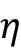
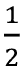
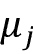

# Two

# 为分类训练简单的机器学习算法

在这一章中，我们将利用两个最先在算法上描述的机器学习算法进行分类:感知器和自适应线性神经元。我们将从在 Python 中逐步实现一个感知器开始，并训练它对 Iris 数据集中的不同花卉种类进行分类。这将有助于我们理解用于分类的机器学习算法的概念，以及如何在 Python 中高效地实现它们。

讨论使用自适应线性神经元进行优化的基础将为通过 scikit-learn 机器学习库使用更复杂的分类器奠定基础，参见*第 3 章*、*使用 Scikit-Learn 的机器学习分类器之旅*。

我们将在本章中涉及的主题如下:

*   建立对机器学习算法的理解
*   使用 pandas、NumPy 和 Matplotlib 读取、处理和可视化数据
*   用 Python 实现 2 类问题的线性分类器

# 人工神经元——机器学习早期历史的一瞥

在我们更详细地讨论感知机和相关算法之前，让我们简单地浏览一下机器学习的起源。为了试图理解生物大脑是如何工作的，以便设计出一种人工智能 T2，沃伦·麦卡洛克和沃尔特·皮茨在 1943 年发表了第一个简化脑细胞的概念，即所谓的麦卡洛克-皮茨神经元

生物神经元是大脑中相互连接的神经细胞，参与化学和电信号的处理和传输，如图*图 2.1* 所示:


图 2.1:处理化学和电子信号的神经元

麦卡洛克和皮茨将这种神经细胞描述为具有二进制输出的简单逻辑门；多个信号到达树突，然后整合到细胞体中，如果累积的信号超过某个阈值，就会产生一个输出信号，由轴突传递。

仅仅几年后，弗兰克·罗森布拉特发表了基于 MCP 神经元模型的感知机学习规则的第一个概念(*T2·f·罗森布拉特*、*康乃尔航空实验室*于 1957 年出版的《感知机:感知和识别自动机)。根据他的感知器规则，Rosenblatt 提出了一种算法，该算法可以自动学习最佳权重系数，然后与输入特征相乘，以决定神经元是否启动(传输信号)。在监督学习和分类的情况下，这种算法可以用来预测一个新的数据点是属于一个类别还是另一个类别。

## 人工神经元的形式定义

更正式地说，我们可以把**人工神经元**背后的想法放入一个有两个类别的二元分类任务的上下文中:0 和 1。然后，我们可以定义一个决策函数，它采用某些输入值 *x* 和一个相应的权重向量 *w* 的线性组合，其中 *z* 是所谓的净输入*z*=*w*1*x*[1]+*w*T22x*...+*w*T30m*x*T34m:*


现在，如果特定示例的净输入，**x**T3(IT7)，大于定义的阈值，我们预测类 1，否则预测类 0。在感知器算法中，决策函数是和**单位阶跃函数**的变体:


为了简化后面的代码实现，我们可以通过几个步骤来修改这个设置。首先，我们将阈值移到等式的左侧:


其次，我们将所谓的*偏置单元*的定义为，并使其成为净输入的一部分:

*z*=*w*1*x*[1]+...+*w*[m]*x*[m]+*b*=**w**^T**x**+*b*

第三，给定偏差单元的引入和上述净输入 *z* 的重新定义，我们可以如下重新定义决策函数:


**线性代数基础:点积和矩阵转置**

在下面几节中，我们将经常使用线性代数中的基本符号。例如，我们将使用向量点积来缩写 **x** 和 **w** 中的值的乘积之和，而上标 *T* 代表转置，这是一种将列向量转换为行向量的操作，反之亦然。例如，假设我们有以下两个列向量:


然后，我们可以将向量 **a** 的转置写成**a**T=【*a*1*a*[2]*a*[3]并将点积写成


此外，转置操作也可以应用于矩阵，以反映其对角线，例如:


请注意，转置操作严格地只针对矩阵定义；然而，在机器学习的上下文中，当我们使用术语“向量”时，我们指的是 *n* × 1 或 1 × *m* 矩阵

在本书中，我们将只使用来自线性代数的非常基本的概念；但是，如果你需要快速复习，请看看济科·科尔特的优秀的*线性代数复习与参考*，可以在[http://www . cs . CMU . edu/~ zkolter/course/Lina LG/Lina LG _ notes . pdf](http://www.cs.cmu.edu/~zkolter/course/linalg/linalg_notes.pdf)免费获得。

*图 2.2* 说明了网络输入*z*=**w**^T**x**+*b*如何被感知器的决策函数压缩成二进制输出(0 或 1)(左子图)，以及如何使用它来区分可由线性决策边界(右图)分开的两个类别:


图 2.2:为二元分类问题产生线性决策边界的阈值函数

## 感知器学习规则

MCP 神经元和 Rosenblatt 的*阈值*感知器模型背后的整个想法是使用简化方法来模拟大脑中单个神经元的工作方式:它要么*激发*要么不激发。因此，罗森布拉特的经典感知器规则相当简单，感知器算法可以总结为以下步骤:

1.  将权重和偏差单元初始化为 0 或小随机数
2.  对于每个训练实例，**x**^(^I^):
    1.  计算输出值，
    2.  更新权重和偏差单位

这里，输出值是我们前面定义的单位阶跃函数预测的类标签，偏差单位和各个权重的同时更新， *w* [j] ，在权重向量中， **w** ，可以更正式地写成:


更新值(“增量”)计算如下:


注意，与偏差单元不同，每个权重*w*j 对应于数据集中的特征*x*j，其涉及确定上面定义的的更新值。此外，是**学习率**(通常是 0.0 到 1.0 之间的常数)，*y*^(^I^)是第 *i* 个训练示例的**真实类标签**，是预测类标签。值得注意的是，偏差单元和权重向量中的所有权重被同时更新，这意味着在偏差单元和所有权重通过各自的更新值和被更新之前，我们不重新计算预测标签。具体来说，对于二维数据集，我们将把更新写成:


在我们用 Python 实现感知器规则之前，让我们通过一个简单的思维实验来说明这个学习规则是多么简单。在感知器正确预测类别标签的两种情况下，偏差单位和权重保持不变，因为更新值是 0:

(1) 

(2) 

然而，在错误预测的情况下，权重被推向正或负目标类的方向:

(3) 

(4) 

为了更好地理解作为乘法因子的特征值，我们来看另一个简单的例子，其中:


让我们假设并且我们把这个例子误分类为*类 0* 。在这种情况下，我们将相应的权重总共增加 2.5，使得下一次遇到该示例时，净输入将更为正值，从而更有可能高于单位阶跃函数的阈值，以将该示例分类为*类 1* :


权重更新与的值成比例。例如，如果我们有另一个示例，它被错误地分类为*类 0* ，我们将在下一次更大程度地推动决策边界，以正确分类该示例:


重要的是要注意，只有当两个类是线性可分的，感知器的收敛性才能得到保证，这意味着两个类不能被线性决策边界完全分开。(感兴趣的读者可以在我的讲义中找到收敛证明:[https://sebastianraschka . com/pdf/lecture-notes/stat 453 ss 21/L03 _ perceptron _ slides . pdf](https://sebastianraschka.com/pdf/lecture-notes/stat453ss21/L03_perceptron_slides.pdf))。*图 2.3* 显示了线性可分和线性不可分场景的可视化示例:


图 2.3:线性和非线性可分离类的例子

如果这两个类不能被线性决策边界分开，我们可以设置训练数据集的最大通过次数(**时期**)和/或容许错误分类次数的阈值——否则感知器永远不会停止更新权重。在本章的后面，我们将介绍 Adaline 算法，该算法产生线性决策边界，并且即使类不是完全线性可分的也能收敛。在*第 3 章*中，我们将学习能够产生非线性决策边界的算法。

**下载示例代码**

如果您直接从 Packt 购买了这本书，您可以从您在[http://www.packtpub.com](http://www.packtpub.com)的帐户下载示例代码文件。如果你在别处购买了这本书，你可以直接从 https://github.com/rasbt/machine-learning-book[下载所有的代码示例和数据集。](https://github.com/rasbt/machine-learning-book)

现在，在我们进入下一节的实现之前，您刚刚学到的东西可以用一个简单的图表来概括，这个图表说明了感知器的一般概念:


图 2.4:基于误差函数更新模型的权重和偏差

上图说明了感知器如何接收一个示例的输入( **x** )并将它们与偏差单元( **b** )和权重( **w** )结合起来计算净输入。然后，净输入被传递给阈值函数，该函数生成 0 或 1 的二进制输出——该示例的预测类标签。在学习阶段，该输出用于计算预测误差，并更新权重和偏差单元。

# 用 Python 实现感知器学习算法

在上一节中，我们了解了罗森布拉特的感知器规则是如何工作的；现在让我们用 Python 来实现它，并将其应用于我们在第一章*，*中介绍的虹膜数据集，赋予计算机从数据*中学习的能力。*

## 一个面向对象的感知器 API

我们将采用面向对象的方法将感知器接口定义为 Python 类，这将允许我们初始化新的`Perceptron`对象，这些对象可以通过`fit`方法从数据中学习，并通过单独的`predict`方法进行预测。按照惯例，我们在对象初始化时没有创建的属性后面加上一个下划线(`_`)，但是我们通过调用对象的其他方法来实现，例如`self.w_`。

**Python 科学计算堆栈的额外资源**

如果您还不熟悉 Python 的科学库或者需要复习，请参阅以下资源:

*   **NumPy**:【https://sebastianraschka.com/blog/2020/numpy-intro.html】T2
*   **熊猫**:[https://pandas . pydata . org/pandas-docs/stable/user _ guide/10min . html](https://pandas.pydata.org/pandas-docs/stable/user_guide/10min.html)
*   **Matplotlib**:[https://Matplotlib . org/stable/tutorials/introductive/usage . html](https://matplotlib.org/stable/tutorials/introductory/usage.html)

以下是 Python 中感知器的实现:

```py
import numpy as np

class Perceptron:

    """Perceptron classifier.

    Parameters

    ------------

    eta : float

      Learning rate (between 0.0 and 1.0)

    n_iter : int

      Passes over the training dataset.

    random_state : int

      Random number generator seed for random weight 

      initialization.

    Attributes

    -----------

    w_ : 1d-array

      Weights after fitting.

    b_ : Scalar

      Bias unit after fitting.

    errors_ : list

      Number of misclassifications (updates) in each epoch.

    """

    def __init__(self, eta=0.01, n_iter=50, random_state=1):

        self.eta = eta

        self.n_iter = n_iter

        self.random_state = random_state

    def fit(self, X, y):

        """Fit training data.

        Parameters

        ----------

        X : {array-like}, shape = [n_examples, n_features]

          Training vectors, where n_examples is the number of 

          examples and n_features is the number of features.

        y : array-like, shape = [n_examples]

          Target values.

        Returns

        -------

        self : object

        """

        rgen = np.random.RandomState(self.random_state)

        self.w_ = rgen.normal(loc=0.0, scale=0.01,

                              size=X.shape[1])

        self.b_ = np.float_(0.)

        self.errors_ = []

        for _ in range(self.n_iter):

            errors = 0

            for xi, target in zip(X, y):

                update = self.eta * (target - self.predict(xi))

                self.w_ += update * xi

                self.b_ += update

                errors += int(update != 0.0)

            self.errors_.append(errors)

        return self

    def net_input(self, X):

        """Calculate net input"""

        return np.dot(X, self.w_) + self.b_

    def predict(self, X):

        """Return class label after unit step"""

        return np.where(self.net_input(X) >= 0.0, 1, 0) 
```

使用这个感知器实现，我们现在可以用给定的学习速率、`eta` ( )和历元数、`n_iter`(通过训练数据集)初始化新的`Perceptron`对象。

通过`fit`方法，我们将偏差`self.b_`初始化为初始值 0，将`self.w_`中的权重初始化为向量，其中 *m* 代表数据集中的维度(特征)数量。

请注意，初始权重向量包含通过`rgen.normal(loc=0.0, scale=0.01, size=1 + X.shape[1])`从标准偏差为 0.01 的正态分布中抽取的小随机数，其中`rgen`是一个 NumPy 随机数生成器，我们使用用户指定的随机种子进行播种，以便我们可以在需要时重现之前的结果。

从技术上讲，我们可以将权重初始化为零(事实上，这是在原始感知器算法中完成的)。然而，如果我们这样做了，那么学习率 ( `eta`)将对决策边界没有影响。如果所有权重初始化为零，则学习率参数`eta`仅影响权重向量的比例，而不影响方向。如果您熟悉三角学，考虑一个向量， *v* 1 =[1 2 3]，其中 *v* 1 和向量， *v* 2 = 0.5 × * v * 1 之间的角度正好为零，如以下代码片段所示:

```py
>>> v1 = np.array([1, 2, 3])

>>> v2 = 0.5 * v1

>>> np.arccos(v1.dot(v2) / (np.linalg.norm(v1) *

...           np.linalg.norm(v2)))

0.0 
```

这里，`np.arccos`是三角反余弦，`np.linalg.norm`是计算向量长度的函数。(我们决定从随机正态分布中抽取随机数——例如，而不是从均匀分布中——并使用标准偏差`0.01`是任意的；记住，我们只是对小的随机值感兴趣，以避免全零向量的性质，如前所述。)

作为阅读本章后的可选练习，您可以将`self.w_ = rgen.normal(loc=0.0, scale=0.01, size=X.shape[1])`改为`self.w_ = np.zeros(X.shape[1])`，并使用不同的`eta`值运行下一节中介绍的感知器训练代码。您将观察到决策边界没有改变。

**NumPy 数组索引**

一维数组的 NumPy 索引的工作方式类似于使用方括号(`[]`)符号的 Python 列表。对于二维数组，第一个索引器引用行号，第二个索引器引用列号。例如，我们将使用`X[2, 3]`来选择一个二维数组的第三行第四列，`X`。

初始化权重后，`fit`方法遍历训练数据集中的所有单个示例，并根据我们在上一节中讨论的感知器学习规则更新权重。

类别标签是由`predict`方法预测的，该方法在训练期间在`fit`方法中被调用以获得用于权重更新的类别标签；但是`predict`也可以用来预测我们拟合模型后新数据的类别标签。此外，我们还在`self.errors_`列表中收集每个时期的错误分类数量，以便我们稍后可以分析我们的感知机在训练期间的表现如何。在`net_input`方法中使用的`np.dot`函数简单地计算矢量点积，**w**^T**x**+*b*。

**矢量化:用矢量化代码替换 for 循环**

除了使用 NumPy 通过`a.dot(b)`或`np.dot(a, b)`计算两个数组`a`和`b`之间的矢量点积，我们还可以通过`sum([i * j for i, j in zip(a, b)])`在纯 Python 中执行计算。然而，使用 NumPy 优于传统 Python `for`循环结构的优势在于它的算术运算是矢量化的。矢量化意味着基本算术运算会自动应用于数组中的所有元素。通过将我们的算术运算公式化为数组上的指令序列，而不是一次对每个元素执行一组运算，我们可以更好地利用我们现代的**中央处理器** ( **CPU** )架构，支持**单指令、多数据** ( **SIMD** )。再者，NumPy 使用了高度优化的线性代数库，比如用 C 或 Fortran 编写的**基本线性代数子程序** ( **BLAS** )和**线性代数包** ( **LAPACK** )。最后，NumPy 还允许我们使用线性代数的基础知识，如向量和矩阵点积，以更紧凑和直观的方式编写代码。

## 在虹膜数据集上训练感知器模型

为了测试我们的感知器的实现，我们将在本章的剩余部分把下面的分析和例子限制在两个特征变量(维度)上。虽然感知器规则不限于二维，但仅考虑两个特征，萼片长度和花瓣长度，将允许我们在散点图中可视化训练模型的决策区域，用于学习目的。

注意，出于实际原因，我们也将只考虑虹膜数据集中的两个花类，setosa 和 versicolor——记住，感知器是一个二元分类器。然而，感知器算法可以扩展到多类分类——例如，**一对一** ( **OvA** )技术。

**多类分类的 OvA 方法**

OvA 有时也被称为**one-vs-rest**(**OvR**)，是一种允许我们将任何二元分类器扩展到多类问题的技术。使用 OvA，我们可以为每个类训练一个分类器，其中特定的类被视为正面类，而来自所有其他类的示例被视为负面类。如果我们要对一个新的、未标记的数据实例进行分类，我们将使用我们的 *n* 分类器，其中 *n* 是类标签的数量，并将置信度最高的类标签分配给我们想要分类的特定实例。在感知器的情况下，我们将使用 OvA 来选择与最大绝对净输入值相关联的类标签。

首先，我们将使用`pandas`库将虹膜数据集直接从 *UCI 机器学习库*加载到`DataFrame`对象中，并通过`tail`方法打印最后五行，以检查数据加载是否正确:

```py
>>> import os

>>> import pandas as pd

>>> s = 'https://archive.ics.uci.edu/ml/'\

...     'machine-learning-databases/iris/iris.data'

>>> print('From URL:', s)

From URL: https://archive.ics.uci.edu/ml/machine-learning-databases/iris/iris.data

>>> df = pd.read_csv(s,

...                  header=None,

...                  encoding='utf-8')

>>> df.tail() 
```

执行前面的代码后，我们应该会看到下面的输出，它显示了 Iris 数据集的最后五行:


图 2.5:虹膜数据集的最后五行

**加载虹膜数据集**

你可以在本书的代码包中找到一份 Iris 数据集(以及本书中使用的所有其他数据集)，如果你离线工作，或者如果位于[https://archive . ics . UCI . edu/ml/machine-learning-databases/Iris/Iris . data](https://archive.ics.uci.edu/ml/machine-learning-databases/iris/iris.data)的 UCI 服务器暂时不可用，你可以使用它。例如，要从本地目录加载 Iris 数据集，您可以替换这一行，

```py
df = pd.read_csv(

  'https://archive.ics.uci.edu/ml/'

  'machine-learning-databases/iris/iris.data',

  header=None, encoding='utf-8') 
```

用下面的一个:

```py
df = pd.read_csv(

  'your/local/path/to/iris.data',

  header=None, encoding='utf-8') 
```

接下来，我们提取对应于50 朵鸢尾花和 50 朵彩鸢尾花的前 100 个类别标签，并将类别标签转换为两个整数类别标签`1`(彩鸢尾)和`0`(彩鸢尾)，我们将它们分配给一个向量`y`，其中熊猫`DataFrame`的`values`方法产生相应的 NumPy 表示。

类似地，我们提取这 100 个训练样本的第一特征列(萼片长度)和第三特征列(花瓣长度),并将它们分配给特征矩阵`X`,我们可以通过二维散点图将其可视化:

```py
>>> import matplotlib.pyplot as plt

>>> import numpy as np

>>> # select setosa and versicolor

>>> y = df.iloc[0:100, 4].values

>>> y = np.where(y == 'Iris-setosa', 0, 1)

>>> # extract sepal length and petal length

>>> X = df.iloc[0:100, [0, 2]].values

>>> # plot data

>>> plt.scatter(X[:50, 0], X[:50, 1],

...             color='red', marker='o', label='Setosa')

>>> plt.scatter(X[50:100, 0], X[50:100, 1],

...             color='blue', marker='s', label='Versicolor')

>>> plt.xlabel('Sepal length [cm]')

>>> plt.ylabel('Petal length [cm]')

>>> plt.legend(loc='upper left')

>>> plt.show() 
```

在执行了前面的代码示例后，我们应该会看到下面的散点图:


图 2.6:按萼片和花瓣长度排列的刚毛花和杂色花散点图

*图 2.6* 显示了虹膜数据集中花朵样本沿两个特征轴的分布:花瓣长度和萼片长度(以厘米为单位)。在这个二维特征子空间中，我们可以看到一个线性判定边界应该足以将 setosa 从杂色花中分离出来。因此，像感知器这样的线性分类器应该能够完美地对这个数据集中的花进行分类。

现在，是时候在我们刚刚提取的虹膜数据子集上训练我们的感知器算法了。此外，我们将绘制每个时期的错误分类误差，以检查算法是否收敛并找到了分隔两种鸢尾花类的判定边界:

```py
>>> ppn = Perceptron(eta=0.1, n_iter=10)

>>> ppn.fit(X, y)

>>> plt.plot(range(1, len(ppn.errors_) + 1),

...          ppn.errors_, marker='o')

>>> plt.xlabel('Epochs')

>>> plt.ylabel('Number of updates')

>>> plt.show() 
```

注意，误分类错误的数量和更新的数量是相同的，因为感知器权重和偏差在它每次误分类一个例子时被更新。执行上述代码后，我们应该会看到错误分类错误与历元数的关系图，如图 2.7 所示:

Figure 2.7: A plot of the misclassification errors against the number of epochs

正如我们可以在图 2.7 的*中看到的，我们的感知机在第六个时期后收敛，现在应该能够完美地对训练样本进行分类。让我们实现一个小的便利函数来可视化二维数据集的决策边界:*

```py
from matplotlib.colors import ListedColormap

def plot_decision_regions(X, y, classifier, resolution=0.02):

    # setup marker generator and color map

    markers = ('o', 's', '^', 'v', '<')

    colors = ('red', 'blue', 'lightgreen', 'gray', 'cyan')

    cmap = ListedColormap(colors[:len(np.unique(y))])

    # plot the decision surface

    x1_min, x1_max = X[:, 0].min() - 1, X[:, 0].max() + 1

    x2_min, x2_max = X[:, 1].min() - 1, X[:, 1].max() + 1

    xx1, xx2 = np.meshgrid(np.arange(x1_min, x1_max, resolution),

                           np.arange(x2_min, x2_max, resolution))

    lab = classifier.predict(np.array([xx1.ravel(), xx2.ravel()]).T)

    lab = lab.reshape(xx1.shape)

    plt.contourf(xx1, xx2, lab, alpha=0.3, cmap=cmap)

    plt.xlim(xx1.min(), xx1.max())

    plt.ylim(xx2.min(), xx2.max())

    # plot class examples

    for idx, cl in enumerate(np.unique(y)):

        plt.scatter(x=X[y == cl, 0],

                    y=X[y == cl, 1],

                    alpha=0.8,

                    c=colors[idx],

                    marker=markers[idx],

                    label=f'Class {cl}',

                    edgecolor='black') 
```

首先，我们定义一些`colors`和`markers`，并通过`ListedColormap`从颜色列表中创建一个色图。然后，我们确定这两个特征的最小值和最大值，并使用这些特征向量通过 NumPy `meshgrid`函数创建一对网格阵列`xx1`和`xx2`。由于我们在两个特征维度上训练我们的感知器分类器，我们需要展平网格阵列，并创建一个与虹膜训练子集具有相同列数的矩阵，以便我们可以使用`predict`方法来预测相应网格点的类别标签`lab`。

在将预测的类别标签`lab`整形为与`xx1`和`xx2`具有相同尺寸的网格后，我们现在可以通过 Matplotlib 的`contourf`函数绘制一个等值线图，该函数将不同的决策区域映射到网格阵列中每个预测类别的不同颜色:

```py
>>> plot_decision_regions(X, y, classifier=ppn)

>>> plt.xlabel('Sepal length [cm]')

>>> plt.ylabel('Petal length [cm]')

>>> plt.legend(loc='upper left')

>>> plt.show() 
```

在执行了前面的代码示例后，我们现在应该可以看到决策区域的绘图，如图 2.8 所示:

Figure 2.8: A plot of the perceptron’s decision regions

正如我们可以在图中看到的,感知器学习了一个决策边界，它可以完美地分类虹膜训练子集中的所有花朵示例。

**感知器收敛**

虽然感知器完美地分类了两个鸢尾花类，但收敛是感知器最大的问题之一。Rosenblatt 从数学上证明了，如果两个类可以被一个线性超平面分开，那么感知器学习规则是收敛的。然而，如果类不能被这样的线性决策边界完美地分开，权重将永远不会停止更新，除非我们设置最大的历元数。有兴趣的读者可以在[https://sebastianraschka . com/pdf/lecture-notes/stat 453 ss 21/L03 _ perceptron _ slides . pdf](https://sebastianraschka.com/pdf/lecture-notes/stat453ss21/L03_perceptron_slides.pdf)找到我的讲义中的证明概要。

# 自适应线性神经元与学习的收敛性

本节我们就来看看另一类单层**神经网络** ( **NN** ): **自适应线性神经元** ( **Adaline** )。Adaline 是由 Bernard Widrow 和他的博士生 Tedd Hoff 在 Rosenblatt 的感知器算法几年后发表的，它可以被认为是对后者的改进(*一种使用化学“记忆晶体管”的自适应“Adaline”神经元*，*技术报告编号 1553-2* 由 *B. Widrow 和他的同事*，*斯坦福电子实验室*，加利福尼亚州斯坦福*10 月*

Adaline 算法特别有趣，因为它阐明了定义和最小化连续损失函数的关键概念。这为理解用于分类的其他机器学习算法奠定了基础，如逻辑回归、支持向量机和多层神经网络，以及线性回归模型，我们将在未来的章节中讨论这些算法。

Adaline 规则(也称为**wid row-Hoff 规则**)和 Rosenblatt 的感知器之间的关键区别在于，权重是基于线性激活函数而不是感知器中的单位阶跃函数来更新的。在 Adaline 中，这个线性激活函数，就是网络输入的恒等函数，所以。

虽然线性激活函数用于学习权重，但我们仍然使用阈值函数进行最终预测，这与我们之前讨论的单位阶跃函数类似。

感知器和 Adaline 算法之间的主要区别在*图 2.9* 中突出显示:

Figure 2.9: A comparison between a perceptron and the Adaline algorithm

如图*图 2.9* 所示， Adaline 算法将真实类别标签与线性激活函数的连续值输出进行比较，以计算模型误差并更新权重。相反，感知器将真实类别标签与预测类别标签进行比较。

## 用梯度下降法最小化损失函数

监督机器学习算法的一个关键要素是定义的目标函数**，在学习过程中将被优化。这个目标函数通常是我们希望最小化的损失或成本 T4 函数。在 Adaline 的情况下，我们可以定义损失函数 *L* ，将模型参数学习为计算结果和真实类别标签之间的**均方误差** ( **MSE** ):**

 **

术语只是为了我们的方便而添加的，它将使导出损失函数相对于权重参数的梯度变得更容易，正如我们将在以下段落中看到的。与单位阶跃函数相比，这种连续线性激活函数的主要优点是损失函数变得可微。这个损失函数的另一个好的性质是它是凸的；因此，我们可以使用一种非常简单而强大的优化算法，称为**梯度下降**，来找到最小化我们损失的权重函数，以对虹膜数据集中的示例进行分类。

如图 2.10 中*所示，我们可以将梯度下降背后的主要思想描述为*下山*直到达到局部或全局损失最小。在每次迭代中，我们向梯度的相反方向迈出一步，步长由学习率的值以及梯度的斜率决定(为简单起见，下图仅针对单个权重 *w* )如下:*

Figure 2.10: How gradient descent works

使用梯度下降，我们现在可以通过在我们的损失函数 *L* ( **w** ， *b* )的梯度的相反方向上迈出一步来更新模型参数:


参数变化和被定义为负梯度乘以学习速率:


为了计算损失函数的梯度，我们需要计算损失函数相对于每个权重的偏导数， *w* [j] :


类似地，我们将损失相对于偏差的偏导数计算如下:


请注意，上面分子中的 2 只是一个常数比例因子，我们可以忽略它而不影响算法。移除比例因子的效果与将学习速率改变 2 倍的效果相同。以下信息框解释了该比例因子的来源。

因此，我们可以将权重更新写成:


由于我们同时更新所有参数，我们的 Adaline 学习规则变为:


**均方误差导数**

如果你熟悉微积分，MSE 损失函数相对于第 *j* 个权重的偏导数可以如下获得:


同样的方法可以用来寻找偏导数，除了等于–1，因此最后一步简化为。

虽然 Adaline 学习规则看起来和感知机规则一样，但是我们应该注意到带有的是一个实数，而不是一个整数类标签。此外，权重更新是基于训练数据集中的所有示例来计算的(而不是在每个训练示例之后递增地更新参数)，这就是为什么这种方法也被称为**批量梯度下降**。为了在本章和本书后面讨论相关概念时更加明确并避免混淆，我们将该过程称为**全批次梯度下降**。

## 用 Python 实现 Adaline

由于感知器规则和 Adaline 非常相似，我们将采用我们之前定义的感知器实现，并更改`fit`方法，以便现在通过梯度下降最小化损失函数来更新权重和偏差参数:

```py
class AdalineGD:

    """ADAptive LInear NEuron classifier.

    Parameters

    ------------

    eta : float

        Learning rate (between 0.0 and 1.0)

    n_iter : int

        Passes over the training dataset.

    random_state : int

        Random number generator seed for random weight initialization.

    Attributes

    -----------

    w_ : 1d-array

        Weights after fitting.

    b_ : Scalar

        Bias unit after fitting.

    losses_ : list

      Mean squared error loss function values in each epoch.    

    """

    def __init__(self, eta=0.01, n_iter=50, random_state=1):

        self.eta = eta

        self.n_iter = n_iter

        self.random_state = random_state

    def fit(self, X, y):

        """ Fit training data.

        Parameters

        ----------

        X : {array-like}, shape = [n_examples, n_features]

            Training vectors, where n_examples

            is the number of examples and

            n_features is the number of features.

        y : array-like, shape = [n_examples]

            Target values.

        Returns

        -------

        self : object

        """

        rgen = np.random.RandomState(self.random_state)

        self.w_ = rgen.normal(loc=0.0, scale=0.01,

                              size=X.shape[1])

        self.b_ = np.float_(0.)

        self.losses_ = []

        for i in range(self.n_iter):

            net_input = self.net_input(X)

            output = self.activation(net_input)

            errors = (y - output)

            self.w_ += self.eta * 2.0 * X.T.dot(errors) / X.shape[0]

            self.b_ += self.eta * 2.0 * errors.mean()

            loss = (errors**2).mean()

            self.losses_.append(loss)

        return self

    def net_input(self, X):

        """Calculate net input"""

        return np.dot(X, self.w_) + self.b_

    def activation(self, X):

        """Compute linear activation"""

        return X

    def predict(self, X):

        """Return class label after unit step"""

        return np.where(self.activation(self.net_input(X))

                        >= 0.5, 1, 0) 
```

与感知器中的在评估每个单个训练示例后更新权重不同，我们基于整个训练数据集计算梯度。对于偏置单元，这是通过`self.eta * 2.0 * errors.mean()`完成的，其中`errors`是包含偏导数值的数组。类似地，我们更新权重。然而，请注意，通过偏导数进行的权重更新涉及特征值*x*j，我们可以通过将`errors`乘以每个权重的每个特征值来计算:

```py
 for w_j in range(self.w_.shape[0]):

                self.w_[w_j] += self.eta * 

                    (2.0 * (X[:, w_j]*errors)).mean() 
```

为了在不使用`for`循环的情况下更有效地实现权重更新，我们可以使用特征矩阵和误差向量之间的矩阵向量乘法来代替:

```py
self.w_ += self.eta * 2.0 * X.T.dot(errors) / X.shape[0] 
```

请注意，`activation`方法对代码没有影响，因为它只是一个标识函数。这里，我们添加了激活函数(通过`activation`方法计算)来说明关于信息如何流经单层神经网络的一般概念:来自输入数据、净输入、激活和输出的特征。

在下一章，我们将学习使用非同一性、非线性激活函数的逻辑回归分类器。我们将看到，逻辑回归模型与 Adaline 密切相关，唯一的区别是它的激活和损失函数。

现在，类似于前面的感知器实现，我们在一个`self.losses_`列表中收集损失值，以检查算法在训练后是否收敛。

**矩阵乘法**

执行矩阵乘法类似于计算矢量点积，矩阵中的每一行都被视为一个单独的行矢量。这种向量化的方法代表了一种更紧凑的符号，并使用 NumPy 实现了更高效的计算。例如:


请注意，在前面的等式中，我们将一个矩阵乘以一个向量，这个向量在数学上没有定义。但是，请记住，我们使用的惯例是将前面的向量视为一个 3×1 矩阵。

在实践中，通常需要一些实验来找到一个好的学习速率，以达到最佳收敛。因此，让我们选择两种不同的学习速率，和，从开始，绘制损失函数与历元数的关系图，以查看 Adaline 实现从训练数据中学习的效果如何。

**超参数**

学习速率、 ( `eta`)以及时期数(`n_iter`)是感知器和 Adaline 学习算法的所谓超参数(或调谐参数)。在*第 6 章*、*学习模型评估和超参数调整的最佳实践*中，我们将了解不同的技术来自动找到产生分类模型最佳性能的不同超参数的值。

现在，让我们针对两种不同的学习速率绘制损失与时期数量的关系图:

```py
>>> fig, ax = plt.subplots(nrows=1, ncols=2, figsize=(10, 4))

>>> ada1 = AdalineGD(n_iter=15, eta=0.1).fit(X, y)

>>> ax[0].plot(range(1, len(ada1.losses_) + 1),

...            np.log10(ada1.losses_), marker='o')

>>> ax[0].set_xlabel('Epochs')

>>> ax[0].set_ylabel('log(Mean squared error)')

>>> ax[0].set_title('Adaline - Learning rate 0.1')

>>> ada2 = AdalineGD(n_iter=15, eta=0.0001).fit(X, y)

>>> ax[1].plot(range(1, len(ada2.losses_) + 1),

...            ada2.losses_, marker='o')

>>> ax[1].set_xlabel('Epochs')

>>> ax[1].set_ylabel('Mean squared error')

>>> ax[1].set_title('Adaline - Learning rate 0.0001')

>>> plt.show() 
```

正如我们在结果损失函数图中看到的，我们遇到了两种不同类型的问题。左图显示了如果我们选择过大的学习率会发生什么。MSE 不是最小化损失函数，而是在每个时期变得更大，因为我们*超过了*全局最小值。另一方面，我们可以看到在右边的图中损失减少，但是所选择的学习速率非常小，以至于算法将需要非常大量的时期来收敛到全局损失最小值:


图 2.11:次优学习率的误差图

*图 2.12* 说明了如果我们改变一个特定权重参数的值来最小化损失函数 *L* 会发生什么。左子图说明了精心选择的学习率的情况，其中损失逐渐减少，朝着全局最小值的方向移动。

然而，右边的子图说明了如果我们选择过大的学习率会发生什么——我们超过了全局最小值:


图 2.12:精心选择的学习率和过大的学习率的比较

## 通过特征缩放改善梯度下降

我们将在本书中遇到的许多机器学习算法需要某种特征缩放以获得最佳性能，我们将在*第 3 章*、*使用 Scikit-Learn 的机器学习分类器之旅*和*第 4 章*、*构建良好的训练数据集——数据预处理*中更详细地讨论这一点。

梯度下降是受益于特征缩放的众多算法之一。在本节中，我们将使用一种叫做**标准化**的特征缩放方法。这种标准化过程有助于梯度下降学习更快地收敛；但是，它不会使原始数据集呈正态分布。标准化会移动每个要素的平均值，使其以零为中心，并且每个要素的标准差为 1(单位方差)。例如，为了标准化第 *j* 个特征，我们可以简单地从每个训练样本中减去样本平均值，然后除以它的标准偏差:


这里， *x* [j] 是由所有训练样本的第 *j* 个特征值， *n* 组成的向量，并且这种标准化技术被应用于我们的数据集中的每个特征， *j* 。

标准化有助于梯度下降学习的原因之一是更容易找到对所有权重(和偏差)都有效的学习率。如果要素的比例相差很大，则适用于更新一个权重的学习率可能太大或太小，无法同样好地更新另一个权重。总的来说，使用标准化特征可以稳定训练，使得优化器必须经历更少的步骤来找到好的或最优的解决方案(全局损失最小)。*图 2.13* 显示了未缩放特征(左)和标准化特征(右)的可能梯度更新，其中同心圆表示二维分类问题中作为两个模型权重函数的损失面:


图 2.13:梯度更新中未缩放和标准化特征的比较

使用内置的 NumPy 方法`mean`和`std`可以轻松实现标准化:

```py
>>> X_std = np.copy(X)

>>> X_std[:,0] = (X[:,0] - X[:,0].mean()) / X[:,0].std()

>>> X_std[:,1] = (X[:,1] - X[:,1].mean()) / X[:,1].std() 
```

标准化后，我们将再次训练 Adaline，并看到它现在使用的学习速率在少量个时期后收敛:

```py
>>> ada_gd = AdalineGD(n_iter=20, eta=0.5)

>>> ada_gd.fit(X_std, y)

>>> plot_decision_regions(X_std, y, classifier=ada_gd)

>>> plt.title('Adaline - Gradient descent')

>>> plt.xlabel('Sepal length [standardized]')

>>> plt.ylabel('Petal length [standardized]')

>>> plt.legend(loc='upper left')

>>> plt.tight_layout()

>>> plt.show()

>>> plt.plot(range(1, len(ada_gd.losses_) + 1),

...          ada_gd.losses_, marker='o')

>>> plt.xlabel('Epochs')

>>> plt.ylabel('Mean squared error')

>>> plt.tight_layout()

>>> plt.show() 
```

执行此代码后，我们应该会看到一个决策区域图，以及一个下降损失图，如图*图 2.14* 所示:


图 2.14:Adaline 的决策区域和 MSE(按历元数)图

正如我们在图中看到的，Adaline 在经过标准化特征的训练后，现在已经收敛。然而，请注意，即使所有的花样本都被正确分类，MSE 仍然是非零的。

## 大规模机器学习和随机梯度下降

在上一节中，我们学习了如何通过在从整个训练数据集计算的损失梯度的相反方向上采取步骤来最小化损失函数；这就是为什么这种方法有时也被称为全批次梯度下降。现在想象一下，我们有一个非常大的数据集，有数百万个数据点，这在许多机器学习应用程序中并不罕见。在这种情况下，运行整批梯度下降在计算上可能是非常昂贵的，因为每次我们向全局最小值前进一步时，我们都需要重新评估整个训练数据集。

批量梯度下降算法的一种流行替代方法是**随机梯度下降** ( **SGD** )，有时也称为迭代或在线梯度下降。不是基于所有训练示例的累积误差的总和来更新权重，**x**T7(^I^):


我们为每个训练示例递增地更新参数，例如:


虽然 SGD 可以被认为是梯度下降的一种近似，但由于更频繁的权重更新，它通常会更快地达到收敛。由于每个梯度是基于单个训练示例计算的，因此误差表面比梯度下降中的噪声更大，如果我们使用非线性损失函数，这也具有 SGD 可以更容易地避开浅局部极小值的优点，正如我们将在稍后的第十一章*、*从头实现多层人工神经网络*中看到的。为了通过 SGD 获得令人满意的结果，以随机顺序呈现训练数据是很重要的；此外，我们希望对每个时期的训练数据集进行洗牌，以防止循环。*

**在训练过程中调整学习率**

在 SGD 实现中，固定学习速率通常由随时间降低的自适应学习速率代替，例如:


其中*c*T2 1 和*c*2 为常数。请注意，新加坡元没有达到全球损失的最低限度，但一个地区非常接近它。并且使用自适应学习速率，我们可以实现进一步退火以使损失最小化。

SGD 的另一个好处是我们可以用它进行**在线学习**。在在线学习中，当新的训练数据到达时，我们的模型被即时训练。这在我们积累大量数据时尤其有用，例如，web 应用程序中的客户数据。使用在线学习，系统可以立即适应变化，并且如果存储空间是一个问题，可以在更新模型之后丢弃训练数据。

**小批量梯度下降**

在全批次梯度下降和 SGD 之间的一个折衷是所谓的**小批次梯度下降**。小批量梯度下降可以理解为将全批量梯度下降应用于训练数据的较小子集，例如，一次 32 个训练样本。与全批次梯度下降相比，其优势在于通过小批次可以更快地达到收敛，因为重量更新更加频繁。此外，小批量学习允许我们使用利用线性代数概念的矢量化操作(例如，通过点积实现加权和)来取代 SGD 中训练示例的`for`循环，这可以进一步提高我们学习算法的计算效率。

由于我们已经使用梯度下降实现了 Adaline 学习规则，我们只需要做一些调整来修改学习算法，以通过 SGD 更新权重。在`fit`方法中，我们现在将在每个训练示例后更新权重。此外，我们将为在线学习实现一个额外的`partial_fit`方法，它不会重新初始化权重。为了检查我们的算法在训练后是否收敛，我们将损失计算为每个历元中训练样本的平均损失。此外，当我们优化损失函数时，我们将增加在每个时期之前混洗训练数据的选项，以避免重复循环；通过`random_state`参数，我们允许指定随机种子的重现性:

```py
class AdalineSGD:

    """ADAptive LInear NEuron classifier.

    Parameters

    ------------

    eta : float

        Learning rate (between 0.0 and 1.0)

    n_iter : int

        Passes over the training dataset.

    shuffle : bool (default: True)

        Shuffles training data every epoch if True to prevent 

        cycles.

    random_state : int

        Random number generator seed for random weight 

        initialization.

    Attributes

    -----------

    w_ : 1d-array

        Weights after fitting.

    b_ : Scalar

        Bias unit after fitting.

    losses_ : list

        Mean squared error loss function value averaged over all

        training examples in each epoch.

    """

    def __init__(self, eta=0.01, n_iter=10,

                 shuffle=True, random_state=None):

        self.eta = eta

        self.n_iter = n_iter

        self.w_initialized = False

        self.shuffle = shuffle

        self.random_state = random_state

    def fit(self, X, y):

        """ Fit training data.

        Parameters

        ----------

        X : {array-like}, shape = [n_examples, n_features]

            Training vectors, where n_examples is the number of 

            examples and n_features is the number of features.

        y : array-like, shape = [n_examples]

            Target values.

        Returns

        -------

        self : object

        """

        self._initialize_weights(X.shape[1])

        self.losses_ = []

        for i in range(self.n_iter):

            if self.shuffle:

                X, y = self._shuffle(X, y)

            losses = []

            for xi, target in zip(X, y):

                losses.append(self._update_weights(xi, target))

            avg_loss = np.mean(losses) 

            self.losses_.append(avg_loss)

        return self

    def partial_fit(self, X, y):

        """Fit training data without reinitializing the weights"""

        if not self.w_initialized:

            self._initialize_weights(X.shape[1])

        if y.ravel().shape[0] > 1:

            for xi, target in zip(X, y):

                self._update_weights(xi, target)

        else:

            self._update_weights(X, y)

        return self

    def _shuffle(self, X, y):

        """Shuffle training data"""

        r = self.rgen.permutation(len(y))

        return X[r], y[r]

    def _initialize_weights(self, m):

        """Initialize weights to small random numbers"""

        self.rgen = np.random.RandomState(self.random_state)

        self.w_ = self.rgen.normal(loc=0.0, scale=0.01,

                                   size=m)

        self.b_ = np.float_(0.)

        self.w_initialized = True

    def _update_weights(self, xi, target):

        """Apply Adaline learning rule to update the weights"""

        output = self.activation(self.net_input(xi))

        error = (target - output)

        self.w_ += self.eta * 2.0 * xi * (error)

        self.b_ += self.eta * 2.0 * error

        loss = error**2

        return loss

    def net_input(self, X):

        """Calculate net input"""

        return np.dot(X, self.w_) + self.b_

    def activation(self, X):

        """Compute linear activation"""

        return X

    def predict(self, X):

        """Return class label after unit step"""

        return np.where(self.activation(self.net_input(X))

                        >= 0.5, 1, 0) 
```

我们现在在`AdalineSGD`分类器中使用的`_shuffle`方法工作如下:通过`np.random`中的`permutation`函数，我们生成一个在 0 到 100 范围内的唯一数字的随机序列。然后，这些数字可以用作索引来打乱我们的特征矩阵和类别标签向量。

然后，我们可以使用`fit`方法来训练`AdalineSGD`分类器，并使用我们的`plot_decision_regions`来绘制我们的训练结果:

```py
>>> ada_sgd = AdalineSGD(n_iter=15, eta=0.01, random_state=1)

>>> ada_sgd.fit(X_std, y)

>>> plot_decision_regions(X_std, y, classifier=ada_sgd)

>>> plt.title('Adaline - Stochastic gradient descent')

>>> plt.xlabel('Sepal length [standardized]')

>>> plt.ylabel('Petal length [standardized]')

>>> plt.legend(loc='upper left')

>>> plt.tight_layout()

>>> plt.show()

>>> plt.plot(range(1, len(ada_sgd.losses_) + 1), ada_sgd.losses_,

...          marker='o')

>>> plt.xlabel('Epochs')

>>> plt.ylabel('Average loss')

>>> plt.tight_layout()

>>> plt.show() 
```

我们从执行前面的代码示例中获得的两个图显示在*图 2.15* 中:


图 2.15:使用 SGD 训练 Adaline 模型后的决策区域和平均损失图

如您所见，平均损失下降非常快，15 个时期后的最终决策边界看起来类似于批次梯度下降 Adaline。如果我们想要更新我们的模型，例如，在一个使用流数据的在线学习场景中，我们可以简单地对单个训练示例调用`partial_fit`方法——例如，`ada_sgd.partial_fit(X_std[0, :], y[0])`。

# 摘要

在本章中，我们很好地理解了用于监督学习的线性分类器的基本概念。在我们实现了感知器之后，我们看到了如何通过梯度下降的矢量化实现和通过 SGD 的在线学习来有效地训练自适应线性神经元。

现在我们已经看到了如何用 Python 实现简单的分类器，我们准备进入下一章，在这里我们将使用 Python scikit-learn 机器学习库来访问更高级和更强大的机器学习分类器，这些分类器在学术界和工业界都很常用。

我们用来实现感知器和 Adaline 算法的面向对象的方法将有助于理解 scikit-learn API，它是基于我们在本章中使用的相同核心概念实现的:`fit`和`predict`方法。基于这些核心概念，我们将学习建模类概率的逻辑回归和处理非线性决策边界的支持向量机。此外，我们将介绍一类不同的监督学习算法，基于树的算法，它们通常被组合成健壮的集成分类器。

# 加入我们书的不和谐空间

加入该书的 Discord workspace，每月与作者进行一次*向我提问*会议:

[https://packt.link/MLwPyTorch](https://packt.link/MLwPyTorch)

**