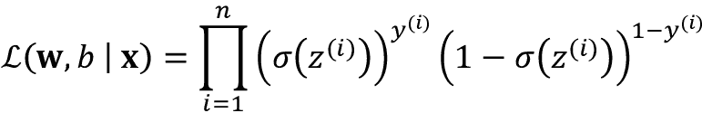
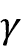

# 三、使用 Scikit-Learn 的机器学习分类器之旅

在这一章中，我们将浏览学术界和工业界常用的一些流行而强大的机器学习算法。在了解几种用于分类的监督学习算法之间的差异的同时，我们还将对它们各自的优缺点进行评估。此外，我们将使用 scikit-learn 库迈出第一步，该库提供了一个用户友好且一致的界面，用于高效地使用这些算法。

本章涵盖的主题如下:

*   介绍稳健和流行的分类算法，如逻辑回归、支持向量机、决策树和最近邻
*   使用 scikit-learn 机器学习库的示例和说明，该库通过用户友好的 Python API 提供了各种各样的机器学习算法
*   线性和非线性决策边界分类器的优缺点讨论

# 选择分类算法

为特定的问题任务选择合适的分类算法需要实践和经验；每种算法都有自己的怪癖，并基于某些假设。套用大卫·H·沃伯特的**没有免费的午餐定理**，没有任何单个分类器在所有可能的情况下都是最好的(*学习算法*、*沃伯特、大卫·H·*、*神经计算 8.7* (1996): 1341-1390)。在实践中，我们总是建议您至少比较一些不同学习算法的性能，以选择针对特定问题的最佳模型；这些可能在要素或示例的数量、数据集中的噪声量以及类是否可线性分离方面有所不同。

最终，分类器的性能——计算性能和预测能力——在很大程度上取决于可用于学习的底层数据。训练受监督的机器学习算法所涉及的五个主要步骤可以总结如下:

1.  选择特征并收集带标签的训练样本
2.  选择绩效指标
3.  选择学习算法和训练模型
4.  评估模型的性能
5.  改变算法的设置和调整模型。

由于本书的方法是一步一步地构建机器学习知识，我们将主要关注本章中不同算法的主要概念，并在本书后面的更详细讨论中重新审视诸如特征选择和预处理、性能指标和超参数调整等主题。

# scikit-learn 的第一步——训练一个感知机

在*第二章*、*训练分类的简单机器学习算法*中，你学习了分类的两个相关学习算法，**感知器**规则和 **Adaline** ，我们自己用 Python 和 NumPy 实现。现在我们来看看 scikit-learn API，如前所述，它将一个用户友好且一致的界面与几个分类算法的高度优化的实现相结合。scikit-learn 库不仅提供了各种各样的学习算法，还提供了许多方便的函数来预处理数据以及微调和评估我们的模型。我们将在*第 4 章*、*构建良好的训练数据集——数据预处理*和*第 5 章*、*通过降维压缩数据*中更详细地讨论这一点以及基础概念。

为了开始使用 scikit-learn 库，我们将训练一个类似于我们在第二章中*实现的感知机模型。为了简单起见，我们将在下面的章节中使用已经熟悉的**虹膜数据集**。方便的是，Iris 数据集已经可以通过 scikit-learn 获得，因为它是一个简单而流行的数据集，经常用于测试和实验算法。与前一章相似，我们将只使用虹膜数据集中的两个特征进行可视化。*

我们将把 150 种花样本的花瓣长度和花瓣宽度分配给特征矩阵`X`，将花的种类的相应类别标签分配给向量数组`y`:

```py
>>> from sklearn import datasets

>>> import numpy as np

>>> iris = datasets.load_iris()

>>> X = iris.data[:, [2, 3]]

>>> y = iris.target

>>> print('Class labels:', np.unique(y))

Class labels: [0 1 2] 
```

`np.unique(y)`函数返回了存储在`iris.target`中的三个唯一的类标签，我们可以看到，鸢尾花的类名`Iris-setosa`、`Iris-versicolor`和`Iris-virginica`已经存储为整数(这里:`0`、`1`、`2`)。虽然许多 scikit-learn 函数和类方法也使用字符串格式的类标签，但推荐使用整数标签来避免技术故障并提高计算性能，因为它占用的内存更少；此外，将类标签编码为整数是大多数机器学习库中的常见约定。

为了评估一个训练好的模型在看不见的数据上表现如何，我们将进一步把数据集分成单独的训练和测试数据集。在*第 6 章*、*学习模型评估和超参数调整的最佳实践*中，我们将更详细地讨论模型评估的最佳实践。使用 scikit-learn 的`model_selection`模块中的`train_test_split`函数，我们将`X`和`y`数组随机分成 30%的测试数据(45 个示例)和 70%的训练数据(105 个示例):

```py
>>> from sklearn.model_selection import train_test_split

>>> X_train, X_test, y_train, y_test = train_test_split(

...     X, y, test_size=0.3, random_state=1, stratify=y

... ) 
```

注意，`train_test_split`函数在分割之前已经在内部打乱了训练数据集；否则，来自类`0`和类`1`的所有示例都将出现在训练数据集中，测试数据集将由来自类`2`的 45 个示例组成。通过`random_state`参数，我们为内部伪随机数发生器提供了一个固定的随机种子(`random_state=1`)，用于在分割前对数据集进行洗牌。使用这样一个固定的`random_state`确保我们的结果是可重复的。

最后，我们通过`stratify=y`利用了内置的分层支持。在这种情况下，分层意味着`train_test_split`方法返回的训练和测试子集具有与输入数据集相同的类标签比例。我们可以使用 NumPy 的`bincount`函数，该函数计算数组中每个值出现的次数，以验证事实确实如此:

```py
>>> print('Labels counts in y:', np.bincount(y))

Labels counts in y: [50 50 50]

>>> print('Labels counts in y_train:', np.bincount(y_train))

Labels counts in y_train: [35 35 35]

>>> print('Labels counts in y_test:', np.bincount(y_test))

Labels counts in y_test: [15 15 15] 
```

许多机器学习和优化算法也需要特征缩放以获得最佳性能，正如我们在第二章的*中的**梯度下降**例子中看到的。这里，我们将使用 scikit-learn 的`preprocessing`模块中的`StandardScaler`类对特性进行标准化:*

```py
>>> from sklearn.preprocessing import StandardScaler

>>> sc = StandardScaler()

>>> sc.fit(X_train)

>>> X_train_std = sc.transform(X_train)

>>> X_test_std = sc.transform(X_test) 
```

使用前面的代码，我们从`preprocessing`模块加载了`StandardScaler`类，并初始化了一个新的`StandardScaler`对象，我们将它赋给了`sc`变量。使用`fit`方法，`StandardScaler`从训练数据中估计每个特征维度的参数(样本均值)和(标准偏差)。通过调用`transform`方法，我们然后使用那些估计的参数和来标准化训练数据。请注意，我们使用相同的缩放参数来标准化测试数据集，以便训练和测试数据集中的值可以相互比较。

训练数据标准化后，我们现在可以训练一个感知机模型。scikit-learn 中的大多数算法已经通过**one-vs-rest**(**OvR**)方法默认支持多类分类，这允许我们一次将三个 flower 类输入感知机。代码如下:

```py
>>> from sklearn.linear_model import Perceptron

>>> ppn = Perceptron(eta0=0.1, random_state=1)

>>> ppn.fit(X_train_std, y_train) 
```

scikit-learn 接口将提醒你我们在第 2 章中的感知机实现。从`linear_model`模块加载`Perceptron`类后，我们初始化一个新的`Perceptron`对象，并通过`fit`方法训练模型。这里，模型参数`eta0`相当于我们在自己的感知器实现中使用的学习速率`eta`。

正如你在第二章中所记得的，找到一个合适的学习率需要一些实验。如果学习率过大，算法会超调全局损失最小值。如果学习率太小，算法将需要更多的历元才能收敛，这可能会使学习速度变慢，尤其是对于大型数据集。此外，我们使用`random_state`参数来确保每个时期后训练数据集的初始洗牌的可再现性。

在 scikit-learn 中训练了一个模型后，我们可以通过`predict`方法进行预测，就像在第二章的*中我们自己的感知器实现一样。代码如下:*

```py
>>> y_pred = ppn.predict(X_test_std)

>>> print('Misclassified examples: %d' % (y_test != y_pred).sum())

Misclassified examples: 1 
```

执行代码，我们可以看到感知机在 45 个花的例子中误分类了 1 个。因此，测试数据集上的错误分类误差约为 0.022，或 2.2%()。

**分类误差对准确度**

代替错误分类错误，许多机器学习实践者报告模型的分类准确度，其简单计算如下:

1-*误差* = 0.978，即 97.8%

我们使用分类误差还是准确度仅仅是一个偏好的问题。

请注意，scikit-learn 还实现了大量不同的性能指标，这些指标可通过`metrics`模块获得。例如，我们可以如下计算测试数据集上感知器的分类准确度:

```py
>>> from sklearn.metrics import accuracy_score

>>> print('Accuracy: %.3f' % accuracy_score(y_test, y_pred))

Accuracy: 0.978 
```

这里，`y_test`是真实的类别标签，`y_pred`是我们之前预测的类别标签。或者，scikit-learn 中的每个分类器都有一个`score`方法，该方法通过结合`predict`调用和`accuracy_score`来计算分类器的预测精度，如下所示:

```py
>>> print('Accuracy: %.3f' % ppn.score(X_test_std, y_test))

Accuracy: 0.978 
```

**过拟合**

请注意，我们将根据本章中的测试数据集来评估模型的性能。在第 6 章中，你将学习有用的技术，包括图形分析，比如学习曲线，来检测和防止过度拟合。过度拟合(我们将在本章后面讨论)意味着模型很好地捕捉了训练数据中的模式，但未能很好地推广到看不见的数据。

最后，我们可以使用第二章的*中的`plot_decision_regions`函数来绘制我们新训练的感知器模型的**决策区域**，并可视化它如何很好地分离不同的花朵示例。但是，让我们添加一个小的修改，通过小圆圈突出显示测试数据集中的数据实例:*

```py
from matplotlib.colors import ListedColormap

import matplotlib.pyplot as plt

def plot_decision_regions(X, y, classifier, test_idx=None,

                          resolution=0.02):

    # setup marker generator and color map

    markers = ('o', 's', '^', 'v', '<')

    colors = ('red', 'blue', 'lightgreen', 'gray', 'cyan')

    cmap = ListedColormap(colors[:len(np.unique(y))])

    # plot the decision surface

    x1_min, x1_max = X[:, 0].min() - 1, X[:, 0].max() + 1

    x2_min, x2_max = X[:, 1].min() - 1, X[:, 1].max() + 1

    xx1, xx2 = np.meshgrid(np.arange(x1_min, x1_max, resolution),

                           np.arange(x2_min, x2_max, resolution))

    lab = classifier.predict(np.array([xx1.ravel(), xx2.ravel()]).T)

    lab = lab.reshape(xx1.shape)

    plt.contourf(xx1, xx2, lab, alpha=0.3, cmap=cmap)

    plt.xlim(xx1.min(), xx1.max())

    plt.ylim(xx2.min(), xx2.max())

    # plot class examples

    for idx, cl in enumerate(np.unique(y)):

        plt.scatter(x=X[y == cl, 0],

                    y=X[y == cl, 1],

                    alpha=0.8,

                    c=colors[idx],

                    marker=markers[idx],

                    label=f'Class {cl}',

                    edgecolor='black')

    # highlight test examples

    if test_idx:

        # plot all examples

        X_test, y_test = X[test_idx, :], y[test_idx]

        plt.scatter(X_test[:, 0], X_test[:, 1],

                    c='none', edgecolor='black', alpha=1.0,

                    linewidth=1, marker='o',

                    s=100, label='Test set') 
```

通过对`plot_decision_regions`函数的轻微修改，我们现在可以指定我们想要在结果图上标记的示例的索引。代码如下:

```py
>>> X_combined_std = np.vstack((X_train_std, X_test_std))

>>> y_combined = np.hstack((y_train, y_test))

>>> plot_decision_regions(X=X_combined_std,

...                       y=y_combined,

...                       classifier=ppn,

...                       test_idx=range(105, 150))

>>> plt.xlabel('Petal length [standardized]')

>>> plt.ylabel('Petal width [standardized]')

>>> plt.legend(loc='upper left')

>>> plt.tight_layout()

>>> plt.show() 
```

正如我们在结果图中看到的，这三个花类不能被线性决策边界完美地分开:


图 3.1:适合 Iris 数据集的多类感知器模型的决策边界

然而，请记住我们在第 2 章中的讨论，感知器算法永远不会收敛于非完全线性可分的数据集，这就是为什么在实践中通常不推荐使用感知器算法。在接下来的部分中，我们将会看到更强大的线性分类器，即使这些类不是完全线性可分的，它们也会收敛到最小损失。

**附加感知器设置**

`Perceptron`以及其他 scikit-learn 函数和类通常有额外的参数，为了清楚起见，我们省略了这些参数。您可以使用 Python 中的`help`函数(例如，`help(Perceptron)`)或通过浏览 http://scikit-learn.org/stable/[的优秀 scikit-learn 在线文档来了解更多关于这些参数的信息。](http://scikit-learn.org/stable/)

# 通过逻辑回归建模类别概率

虽然感知器规则为分类的机器学习算法提供了一个很好的简单介绍，但它的最大的缺点是，如果类别不是完全线性可分的，它永远不会收敛。上一节中的分类任务就是这种情况的一个例子。其原因是权重被持续更新，因为在每个时期总是存在至少一个错误分类的训练样本。当然，你可以改变学习率，增加历元数，但是要注意，感知器永远不会收敛到这个数据集上。

为了更好地利用我们的时间，我们现在将看看另一个简单但更强大的算法，用于线性和二元分类问题:**逻辑回归**。请注意，尽管它的名字，逻辑回归是一个分类模型，而不是回归。

## 逻辑回归和条件概率

逻辑回归是一种分类模型，非常容易实现，并且在线性可分离类上表现非常好。它是工业中最广泛使用的分类算法之一。与感知器和 Adaline 类似，本章中的逻辑回归模型也是二元分类的线性模型。

**多个类别的逻辑回归**

请注意，逻辑回归可以很容易地推广到多类设置，这被称为**多项式逻辑回归**，或 **softmax 回归**。关于多项逻辑回归的更详细的内容超出了本书的范围，但是感兴趣的读者可以在我的讲义中找到更多信息，网址是 https://sebastianraschka . com/pdf/lecture-notes/stat 453 ss 21/L08 _ logistic _ _ slides . pdf 或[https://youtu.be/L0FU8NFpx4E](https://youtu.be/L0FU8NFpx4E)。

在多类设置中使用逻辑回归的另一种方法是通过 OvR 技术，我们之前讨论过。

为了解释逻辑回归作为二元分类的概率模型背后的主要机制，让我们首先介绍一下**几率**:有利于特定事件的几率。几率可以写成，其中 *p* 代表正面事件的概率。术语“积极事件”不一定意味着“好”，而是指我们想要预测的事件，例如，在给定特定症状的情况下，患者患有特定疾病的概率；我们可以将积极事件视为类别标签 *y* = 1，将症状视为特征 **x** 。因此，为了简洁起见，我们可以将概率 *p* 定义为*p*:=*p*(*y*= 1 |**x**)，这是一个特定示例在给定其特征的情况下属于某一类 1 的条件概率， **x** 。

然后我们可以进一步定义 **logit** 函数，它就是概率的对数(log-odds):


注意 *log* 指的是自然对数，因为这是计算机科学中的通用约定。 *logit* 函数获取 0 到 1 范围内的输入值，并将其转换为整个实数范围内的值。

在逻辑模型下，我们假设加权输入(在第 2 章的*中称为净输入)和对数优势之间存在线性关系:*


虽然前面描述了我们对对数优势和净输入之间的线性关系所做的假设，但我们真正感兴趣的是概率 *p* ，即给定其特征的示例的类成员概率。虽然 logit 函数将概率映射到实数范围，但我们可以考虑该函数的逆函数，将实数范围映射回概率 *p* 的[0，1]范围。

这种 logit 函数的逆函数通常被称为**逻辑 sigmoid 函数**，由于其特征 S 形，有时被简称为 **sigmoid 函数**:


这里， *z* 是净输入、权重的线性组合和输入(即与训练示例相关联的特征):

*z*=**w**T**x**+*b*

现在，让我们简单地为–7 到 7 范围内的一些值绘制 sigmoid 函数，看看它是什么样子:

```py
>>> import matplotlib.pyplot as plt

>>> import numpy as np

>>> def sigmoid(z):

...     return 1.0 / (1.0 + np.exp(-z))

>>> z = np.arange(-7, 7, 0.1)

>>> sigma_z = sigmoid(z)

>>> plt.plot(z, sigma_z)

>>> plt.axvline(0.0, color='k')

>>> plt.ylim(-0.1, 1.1)

>>> plt.xlabel('z')

>>> plt.ylabel('$\sigma (z)$')

>>> # y axis ticks and gridline

>>> plt.yticks([0.0, 0.5, 1.0])

>>> ax = plt.gca()

>>> ax.yaxis.grid(True)

>>> plt.tight_layout()

>>> plt.show() 
```

由于执行了前面的代码示例，我们现在应该看到 S 形(S 形)曲线:


图 3.2:逻辑 sigmoid 函数图

我们可以看到，如果 *z* 趋向无穷大( *z* →∞),则趋近于 1，因为*e*^–^z对于 *z* 的大值变得非常小。类似地，趋向于 0，因为的分母越来越大。因此，我们可以得出结论，这个 sigmoid 函数将实数值作为输入，并将其转换为范围[0，1]内的值，截距为。

为了对逻辑回归模型有所了解，我们可以将其与第 2 章中的*联系起来。在 Adaline 中，我们使用身份函数作为激活函数。在逻辑回归中，这个激活函数就变成了我们之前定义的 sigmoid 函数。*

Adaline 和 logistic 回归之间的区别如下图所示，唯一的区别是激活函数:


图 3.3:与 Adaline 比较的逻辑回归

然后，sigmoid 函数的输出被解释为属于类别 1 的特定示例、的概率，给定其特征、 *x* 和，由权重和偏差、 *w* 和 *b* 参数化。例如，如果我们为一个特定的花例子计算，这意味着这个例子是`Iris-versicolor`花的概率是 80%。因此，此花为`Iris-setosa`花的概率可以计算为*p*(*y*= 0 |**x**； **w** ，*b*)= 1—*p*(*y*= 1 |**x**； **w** ， *b* ) = 0.2，即百分之二十。

然后，预测的概率可以通过阈值函数简单地转换成二进制结果:


如果我们查看前面的 sigmoid 函数图，这相当于以下内容:


事实上，在许多应用中，我们不仅对预测的类别标签感兴趣，而且对类别成员概率的估计也特别有用(在应用阈值函数之前，sigmoid 函数的输出)。Logistic 回归用于天气预报，例如，不仅可以预测某一天是否会下雨，还可以报告下雨的几率。类似地，逻辑回归可用于预测给定特定症状的患者患特定疾病的几率，这就是逻辑回归在医学领域非常受欢迎的原因。

## 通过逻辑损失函数学习模型权重

您已经了解了我们如何使用逻辑回归模型来预测概率和分类标签；现在，让我们简单地谈谈我们如何拟合模型的参数，例如，权重和偏差单位、 *w* 和 *b* 。在前一章中，我们将均方误差损失函数定义如下:


为了学习 Adaline 分类模型的参数，我们最小化了这个函数。为了解释我们如何获得逻辑回归的损失函数，让我们首先定义建立逻辑回归模型时我们希望最大化的可能性，假设我们数据集中的单个示例彼此独立。公式如下:


实际上，最大化该方程的(自然)对数更容易，这被称为**对数似然**函数:


首先，应用对数函数降低了数值下溢的可能性，如果可能性非常小，就会发生数值下溢。第二，我们可以把因子的乘积转换成因子的和，这使得通过加法技巧得到这个函数的导数变得更容易，你们可能还记得微积分。

**推导似然函数**

在给定数据的情况下，我们可以获得模型可能性的表达式，如下所示。假设我们有一个分类标签为 0 和 1 的二元分类问题，我们可以将标签 1 视为一个伯努利变量——它可以取两个值，0 和 1，概率 *p* 为 1: 。对于单个数据点，我们可以把这个概率写成和。

将这两个表达式放在一起，并使用简写，我们得到伯努利变量的概率质量函数:


假设所有训练示例都是独立的，我们可以使用乘法规则来计算所有事件发生的概率，从而写出训练标签的可能性，如下所示:


现在，代入伯努利变量的概率质量函数，我们得到似然性的表达式，我们试图通过改变模型参数使其最大化:



现在，我们可以使用梯度上升等优化算法来最大化这个对数似然函数。(梯度上升与第 2 章中解释的梯度下降的工作方式完全相同，除了梯度上升最大化一个函数而不是最小化它。)或者，让我们将对数似然重写为损失函数， *L* ，可以使用梯度下降将其最小化，如*第 2 章*所示:


为了让更好地理解这个损失函数，让看看我们为一个单独的训练示例计算的损失:


看等式，我们可以看到，如果 *y* = 0，第一项变为零，如果 *y* = 1，第二项变为零:


让我们编写一个简短的代码片段来创建一个图，说明针对不同的值对单个训练示例进行分类的损失:

```py
>>> def loss_1(z):

...     return - np.log(sigmoid(z))

>>> def loss_0(z):

...     return - np.log(1 - sigmoid(z))

>>> z = np.arange(-10, 10, 0.1)

>>> sigma_z = sigmoid(z)

>>> c1 = [loss_1(x) for x in z]

>>> plt.plot(sigma_z, c1, label='L(w, b) if y=1')

>>> c0 = [loss_0(x) for x in z]

>>> plt.plot(sigma_z, c0, linestyle='--', label='L(w, b) if y=0')

>>> plt.ylim(0.0, 5.1)

>>> plt.xlim([0, 1])

>>> plt.xlabel('$\sigma(z)$')

>>> plt.ylabel('L(w, b)')

>>> plt.legend(loc='best')

>>> plt.tight_layout()

>>> plt.show() 
```

得到的图显示了在范围 0 到 1 内的 *x* 轴上的 sigmoid 激活(sigmoid 函数的输入是范围-10 到 10 内的 *z* 值)和在 *y* 轴上的相关逻辑损耗:


图 3.4:逻辑回归中使用的损失函数图

我们可以看到，如果我们正确预测某个示例属于第 1 类,则损失接近 0(连续线)。同样，我们可以在 *y* 轴上看到，如果我们正确预测 *y* = 0(虚线)，损耗也接近 0。然而，如果预测是错误的，损失将趋于无穷大。重点是，我们用越来越大的损失来惩罚错误的预测。

## 将 Adaline 实现转换为逻辑回归算法

如果我们要自己实现逻辑回归，我们可以简单地用新的损失函数替换*第 2 章*中我们的 Adaline 实现中的损失函数 *L* :


我们用它来计算每个时期分类所有训练样本的损失。此外，我们需要用 sigmoid 替换线性激活函数。如果我们对 Adaline 代码进行这些更改，我们将最终得到一个有效的逻辑回归实现。以下是整批梯度下降的实现(但请注意，也可以对随机梯度下降版本进行相同的更改):

```py
class LogisticRegressionGD:

    """Gradient descent-based logistic regression classifier.

    Parameters

    ------------

    eta : float

      Learning rate (between 0.0 and 1.0)

    n_iter : int

      Passes over the training dataset.

    random_state : int

      Random number generator seed for random weight

      initialization.

    Attributes

    -----------

    w_ : 1d-array

      Weights after training.

    b_ : Scalar

      Bias unit after fitting.

    losses_ : list

      Mean squared error loss function values in each epoch.

    """

    def __init__(self, eta=0.01, n_iter=50, random_state=1):

        self.eta = eta

        self.n_iter = n_iter

        self.random_state = random_state

    def fit(self, X, y):

        """ Fit training data.

        Parameters

        ----------

        X : {array-like}, shape = [n_examples, n_features]

          Training vectors, where n_examples is the 

          number of examples and n_features is the 

          number of features.

        y : array-like, shape = [n_examples]

          Target values.

        Returns

        -------

        self : Instance of LogisticRegressionGD

        """

        rgen = np.random.RandomState(self.random_state)

        self.w_ = rgen.normal(loc=0.0, scale=0.01, size=X.shape[1])

        self.b_ = np.float_(0.)

        self.losses_ = []

        for i in range(self.n_iter):

            net_input = self.net_input(X)

            output = self.activation(net_input)

            errors = (y - output)

            self.w_ += self.eta * 2.0 * X.T.dot(errors) / X.shape[0]

            self.b_ += self.eta * 2.0 * errors.mean()

            loss = (-y.dot(np.log(output))

                   - ((1 - y).dot(np.log(1 - output)))

                    / X.shape[0])

            self.losses_.append(loss)

        return self

    def net_input(self, X):

        """Calculate net input"""

        return np.dot(X, self.w_) + self.b_

    def activation(self, z):

        """Compute logistic sigmoid activation"""

        return 1\. / (1\. + np.exp(-np.clip(z, -250, 250)))

    def predict(self, X):

        """Return class label after unit step"""

        return np.where(self.activation(self.net_input(X)) >= 0.5, 1, 0) 
```

当我们拟合逻辑回归模型时，我们必须记住，它只适用于二元分类任务。

因此，让我们只考虑 setosa 和 versicolor flowers(类`0`和`1`)并检查我们的逻辑回归实现是否有效:

```py
>>> X_train_01_subset = X_train_std[(y_train == 0) | (y_train == 1)]

>>> y_train_01_subset = y_train[(y_train == 0) | (y_train == 1)]

>>> lrgd = LogisticRegressionGD(eta=0.3,

...                             n_iter=1000,

...                             random_state=1)

>>> lrgd.fit(X_train_01_subset,

...          y_train_01_subset)

>>> plot_decision_regions(X=X_train_01_subset,

...                       y=y_train_01_subset,

...                       classifier=lrgd)

>>> plt.xlabel('Petal length [standardized]')

>>> plt.ylabel('Petal width [standardized]')

>>> plt.legend(loc='upper left')

>>> plt.tight_layout()

>>> plt.show() 
```

产生的决策区域图如下:


图 3.5:逻辑回归模型的决策区域图

**逻辑回归的梯度下降学习算法**

如果您将前面代码中的`LogisticRegressionGD`与来自*第 2 章*的`AdalineGD`代码进行比较，您可能已经注意到权重和偏差更新规则保持不变(除了缩放因子 2)。使用微积分，我们可以表明，对于逻辑回归和 Adaline，通过梯度下降的参数更新确实是相似的。然而，请注意，梯度下降学习规则的以下推导是为对逻辑回归的梯度下降学习规则背后的数学概念感兴趣的读者设计的。这对于理解本章的其余部分并不重要。

*图 3.6* 总结了我们如何计算对数似然函数相对于第 *j* 个权重的偏导数:


图 3.6:计算对数似然函数的偏导数

请注意，为了简洁起见，我们省略了对训练示例求平均值。

请记住第 2 章中的内容，我们在梯度的相反方向上迈步。因此，我们翻转并如下更新 *j* th 权重，包括学习率:


虽然未示出损失函数相对于偏差单位的偏导数，但是偏差推导遵循使用链式规则的相同总体概念，导致以下更新规则:


重量和偏差单位更新与第 2 章中【Adaline 的更新相同。

## 用 scikit-learn 训练逻辑回归模型

在前一小节中，我们刚刚进行了有用的编码和数学练习，这有助于说明 Adaline 和逻辑回归之间的概念上的差异。现在，让我们学习如何使用 scikit-learn 更优化的逻辑回归实现，它也支持现成的多类设置。请注意，在 scikit-learn 的最新版本中，用于多类分类、多项式或 OvR 的技术是自动选择的。在下面的代码示例中，我们将使用`sklearn.linear_model.LogisticRegression`类以及熟悉的`fit`方法在标准化 flower 训练数据集中的所有三个类上训练模型。此外，为了便于说明，我们设置了`multi_class='ovr'`。作为对读者的一个练习，您可能想将结果与`multi_class='multinomial'`进行比较。请注意，`multinomial`设置现在是 scikit-learn 的`LogisticRegression`类中的默认选择，并在实践中推荐用于互斥类，如 Iris 数据集中的那些类。这里，“互斥”意味着每个训练示例只能属于一个类(与多标签分类相反，在多标签分类中，一个训练示例可以是多个类的成员)。

现在，让我们来看看代码示例:

```py
>>> from sklearn.linear_model import LogisticRegression

>>> lr = LogisticRegression(C=100.0, solver='lbfgs',

...                         multi_class='ovr')

>>> lr.fit(X_train_std, y_train)

>>> plot_decision_regions(X_combined_std,

...                       y_combined,

...                       classifier=lr,

...                       test_idx=range(105, 150))

>>> plt.xlabel('Petal length [standardized]')

>>> plt.ylabel('Petal width [standardized]')

>>> plt.legend(loc='upper left')

>>> plt.tight_layout()

>>> plt.show() 
```

在对训练数据拟合模型后，我们绘制了决策区域、训练样本和测试样本，如图*图 3.7* 所示:


图 3.7:sci kit-learn 的多类逻辑回归模型的决策区域

**凸优化算法**

请注意，存在许多不同的算法来解决优化问题。对于最小化凸损失函数，如逻辑回归损失，建议使用比常规**随机梯度下降** ( **SGD** )更先进的方法。事实上，scikit-learn 实现了一系列这样的优化算法，这些算法可以通过`solver`参数指定，即`'newton-cg'`、`'lbfgs'`、`'`、`'sag'`和`'saga'`。

虽然逻辑回归损失是凸的，但是大多数优化算法都应该容易地收敛到全局损失最小。然而，使用一种算法比使用另一种算法有某些优势。例如，在以前的版本中(例如，v 0.21)，scikit-learn 使用`'liblinear'`作为默认值，这不能处理多项式损失，并且仅限于用于多类分类的 OvR 方案。然而，在 scikit-learn v 0.22 中，默认的求解器是改为`'lbfgs'`，代表有限记忆**Broyden-Fletcher-gold farb-Shanno**(**BFGS**)算法([https://en.wikipedia.org/wiki/Limited-memory_BFGS](https://en.wikipedia.org/wiki/Limited-memory_BFGS))并且在这方面更灵活。

看着我们用来训练`LogisticRegression`模型的前面的代码，你现在可能想知道，“这个神秘的参数 C 是什么？”我们将在下一小节中讨论这个参数，其中我们将引入过拟合和正则化的概念。然而，在我们继续这些话题之前，让我们完成我们对类成员概率的讨论。

使用`predict_proba`方法可以计算训练样本属于某一类的概率。例如，我们可以预测测试数据集中前三个示例的概率如下:

```py
>>> lr.predict_proba(X_test_std[:3, :]) 
```

此代码片段返回以下数组:

```py
array([[3.81527885e-09, 1.44792866e-01, 8.55207131e-01],

       [8.34020679e-01, 1.65979321e-01, 3.25737138e-13],

       [8.48831425e-01, 1.51168575e-01, 2.62277619e-14]]) 
```

第一行对应于第一朵花的类成员概率，第二行对应于第二朵花的类成员概率，依此类推。请注意，正如所料，每一行中的列方向总和为 1。(您可以通过执行`lr.predict_proba(X_test_std[:3, :]).sum(axis=1)`来确认这一点。)

第一行中的最高值约为 0.85，这意味着第一个示例属于类别 3 ( `Iris-virginica`)，预测概率为 85%。因此，您可能已经注意到，我们可以通过识别每行中最大的列来获得预测的类标签，例如，使用 NumPy 的`argmax`函数:

```py
>>> lr.predict_proba(X_test_std[:3, :]).argmax(axis=1) 
```

这里显示了返回的类索引(它们对应于`Iris-virginica`、`Iris-setosa`和`Iris-setosa`):

```py
array([2, 0, 0]) 
```

在前面的代码示例中，我们计算了条件概率，并通过使用 NumPy 的`argmax`函数将它们手动转换为类标签。实际上，在使用 scikit-learn 时获得类标签的更方便的方法是直接调用`predict`方法:

```py
>>> lr.predict(X_test_std[:3, :])

array([2, 0, 0]) 
```

最后，如果您想预测单朵花的类标签，请注意一句话:scikit-learn 期望一个二维数组作为数据输入；因此，我们必须首先将单个行切片转换成这样的格式。将单行条目转换成二维数据数组的一种方法是使用 NumPy 的`reshape`方法添加一个新的维度，如下所示:

```py
>>> lr.predict(X_test_std[0, :].reshape(1, -1))

array([2]) 
```

## 通过调整解决过度拟合问题

过度拟合是机器学习中的一个常见问题，其中一个模型在训练数据上表现良好，但对看不见的数据(测试数据)却不能很好地推广。如果一个模型遭受过度拟合，我们也说该模型具有高方差，这可能是由于具有太多的参数，导致给定底层数据的模型太复杂。类似地，我们的模型也可能遭受**欠拟合**(高偏差)，这意味着我们的模型不够复杂，无法很好地捕捉训练数据中的模式，因此在看不见的数据上也遭受低性能。

虽然到目前为止，我们只遇到了线性分类模型，但是过度拟合和欠拟合的问题可以通过比较线性决策边界和更复杂的非线性决策边界得到最好的说明，如图 3.8 所示:


图 3.8:欠拟合、良好拟合和过拟合模型的例子

**偏差-方差权衡**

通常，研究人员使用术语“偏差”和“方差”或“偏差-方差权衡”来描述模型的性能——也就是说，您可能会在谈话、书籍或文章中发现人们说模型具有“高方差”或“高偏差”那是什么意思？一般来说，我们可以说“高方差”与过度拟合成正比，“高偏差”与欠拟合成正比。

在机器学习模型的上下文中，如果我们例如在训练数据集的不同子集上多次重新训练模型，方差测量用于分类特定示例的模型预测的一致性(或可变性)。我们可以说，该模型对训练数据中的随机性很敏感。相比之下，如果我们在不同的训练数据集上多次重建模型，偏差通常衡量预测与正确值的差距；偏差是对非随机性引起的系统误差的度量。

如果你对“偏差”和“方差”术语的技术规范和推导感兴趣，我在这里的课堂笔记中写了相关内容:[https://sebastianraschka . com/pdf/lecture-notes/stat 451 fs 20/08-model-eval-1-intro _ _ notes . pdf](https://sebastianraschka.com/pdf/lecture-notes/stat451fs20/08-model-eval-1-intro__notes.pdf)。

找到一个好的偏差-方差权衡的方法是通过正则化来调整模型的复杂性。正则化对于处理共线性(特征间的高度相关性)，过滤掉数据中的噪声，最终防止过拟合是非常有用的方法。

正则化背后的概念是引入附加信息来惩罚极端的参数(权重)值。最常见的正则化形式是所谓的 **L2 正则化**(有时也称为 L2 收缩或权重衰减)，可以写成如下形式:


这里，就是所谓的**正则化参数**。请注意，分母中的 2 只是一个比例因子，因此在计算损耗梯度时，它会被抵消。添加样本大小 *n* 来缩放类似于损失的正则化项。

**正则化和特征归一化**

正则化是另一个为什么标准化这样的特征缩放很重要的原因。为了使正则化正常工作，我们需要确保我们所有的特征都在可比较的尺度上。

逻辑回归的损失函数可以通过添加简单的正则化项来正则化，这将在模型训练期间缩小权重:


未调整损失的偏导数定义为:


将正则化项添加到损失中会将偏导数改变为以下形式:


通过正则化参数，我们可以控制拟合训练数据的紧密程度，同时保持权重较小。通过增加的值，我们增加了正则化强度。请注意，偏差单位，本质上是截距项或负阈值，正如我们在*第 2 章*中了解到的，通常是不正则化的。

scikit-learn 中为`LogisticRegression`类实现的参数`C`来自支持向量机中的约定，这将是下一节的主题。项`C`与正则化参数成反比。因此，减小逆正则化参数`C`的值意味着我们在增加正则化强度，这可以通过绘制两个权重系数的 L2 正则化路径来可视化:

```py
>>> weights, params = [], []

>>> for c in np.arange(-5, 5):

...     lr = LogisticRegression(C=10.**c,

...                             multi_class='ovr')

...     lr.fit(X_train_std, y_train)

...     weights.append(lr.coef_[1])

...     params.append(10.**c)

>>> weights = np.array(weights)

>>> plt.plot(params, weights[:, 0],

...          label='Petal length')

>>> plt.plot(params, weights[:, 1], linestyle='--',

...          label='Petal width')

>>> plt.ylabel('Weight coefficient')

>>> plt.xlabel('C')

>>> plt.legend(loc='upper left')

>>> plt.xscale('log')

>>> plt.show() 
```

通过执行上述代码，我们用不同的反正则化参数值`C`拟合了 10 个逻辑回归模型。为了便于说明，我们只收集了类别`1`(这里是数据集中的第二个类别:`Iris-versicolor`)相对于所有分类器的权重系数——记住，我们使用 OvR 技术进行多类别分类。

正如我们在结果图中看到的，如果我们减小参数`C`，即如果我们增加正则化强度，权重系数会缩小:


图 3.9:反正则化强度参数 C 对 L2 正则化模型结果的影响

增加正则化强度可以减少过度拟合，所以我们可能会问为什么我们不在默认情况下强烈地正则化所有模型。原因是我们在调整正则化强度时必须小心。例如，如果正则化强度太高，而权重系数接近零，则由于拟合不足，模型的性能会非常差，如图 3.8 中的*所示。*

**关于逻辑回归的额外资源**

由于对单个分类算法的深入报道超出了本书的范围，*逻辑回归:从入门到高级概念和应用*，*斯科特·梅纳德博士*， *Sage 出版物*， *2009* 推荐给想要了解更多关于逻辑回归的读者。

# 基于支持向量机的最大间隔分类

另一个强大且广泛使用的学习算法是**支持向量机** ( **SVM** )，可以认为是感知器的扩展。使用感知器算法，我们尽量减少错误分类的错误。然而，在支持向量机中，我们的优化目标是最大化边际。余量被定义为分离超平面(决策边界)和最接近该超平面的训练样本之间的距离，即所谓的**支持向量**。

这在*图 3.10* 中进行了说明:


图 3.10: SVM 最大化决策边界和训练数据点之间的差距

## 最大边际直觉

拥有大边界的决策边界背后的基本原理是，它们往往具有较低的泛化误差，而边界小的模型更容易过度拟合。

不幸的是，虽然支持向量机背后的主要直觉相对简单，但它们背后的数学是非常高级的，并且需要约束优化的良好知识。

因此，支持向量机中最大间隔优化背后的细节超出了本书的范围。但是，如果您有兴趣了解更多信息，我们推荐以下资源:

*   Chris J.C. Burges 在*模式识别支持向量机教程*(数据挖掘和知识发现，2(2): 121-167，1998)中的精彩解释
*   弗拉基米尔·瓦普尼克的书*统计学习理论的本质*，施普林格科学+商业媒体，弗拉基米尔·瓦普尼克，2000 年
*   吴恩达非常详细的课堂讲稿可在[https://see . Stanford . edu/materials/aimlcs 229/cs 229-notes 3 . pdf](https://see.stanford.edu/materials/aimlcs229/cs229-notes3.pdf)获得

## 利用松弛变量处理非线性可分情况

虽然我们不想深入最大利润分类背后更复杂的数学概念，但让我们简单提一下所谓的*松弛变量*，它是由 Vladimir Vapnik 在 1995 年引入的，并导致了所谓的**软利润分类**。引入松弛变量的动机是，对于非线性可分离数据，SVM 优化目标中的线性约束需要放松，以允许在存在错误分类的情况下，在适当的损失惩罚下，优化收敛。

松弛变量的使用反过来引入了变量，这在 SVM 上下文中通常被称为 *C* 。我们可以考虑将 *C* 作为控制误分类惩罚的超参数。大值的 *C* 对应于大的错误惩罚，而如果我们为 *C* 选择较小的值，我们对错误分类错误就不那么严格。然后，我们可以使用 *C* 参数来控制余量的宽度，从而调整偏差-方差权衡，如图*图 3.11* 所示:


图 3.11:反正则化强度 *C* 的大小值对分类的影响

这个概念与正则化相关，我们在前面的正则化回归的上下文中讨论过，其中减小`C`的值会增加偏差(欠拟合)并降低模型的方差(过拟合)。

现在我们已经了解了线性 SVM 背后的基本概念，让我们训练一个 SVM 模型来对虹膜数据集中的不同花朵进行分类:

```py
>>> from sklearn.svm import SVC

>>> svm = SVC(kernel='linear', C=1.0, random_state=1)

>>> svm.fit(X_train_std, y_train)

>>> plot_decision_regions(X_combined_std,

...                       y_combined,

...                       classifier=svm,

...                       test_idx=range(105, 150))

>>> plt.xlabel('Petal length [standardized]')

>>> plt.ylabel('Petal width [standardized]')

>>> plt.legend(loc='upper left')

>>> plt.tight_layout()

>>> plt.show() 
```

SVM 的三个决策区域，通过执行前面的代码示例在虹膜数据集上训练分类器后可视化，如图*图 3.12* 所示:


图 3.12: SVM 的决策区域

**逻辑回归与支持向量机**

在实际的分类任务中，线性逻辑回归和线性支持向量机经常产生非常相似的结果。逻辑回归试图最大化训练数据的条件似然性，这使得它比 SVM 更容易出现异常值，SVM 主要关心最接近决策边界的点(支持向量)。另一方面，逻辑回归的优势是模型更简单，更容易实现，在数学上更容易解释。此外，逻辑回归模型可以很容易地更新，这在处理流数据时很有吸引力。

## scikit-learn 中的替代实现

我们在前面几节中使用的 scikit-learn 库的`LogisticRegression`类可以通过设置`solver='liblinear'`使用 LIBLINEAR 库。LIBLINEAR 是在国立台湾大学([http://www.csie.ntu.edu.tw/~cjlin/liblinear/](http://www.csie.ntu.edu.tw/~cjlin/liblinear/))开发的一个高度优化的 C/C++库。

类似地，我们用来训练 SVM 的`SVC`类使用了 LIBSVM，这是一个等价的专用于支持向量机的 C/C++库([http://www.csie.ntu.edu.tw/~cjlin/libsvm/](http://www.csie.ntu.edu.tw/~cjlin/libsvm/))。

例如，与原生 Python 实现相比，使用 LIBLINEAR 和 LIBSVM 的优势在于，它们允许非常快速地训练大量的线性分类器。然而，有时我们的数据集太大，不适合计算机内存。因此，scikit-learn 还通过`SGDClassifier`类提供了替代实现，该类还支持通过`partial_fit`方法进行在线学习。`SGDClassifier`类背后的概念类似于我们在第 2 章的*中为 Adaline 实现的随机梯度算法。*

我们可以初始化感知器的 SGD 版本(`loss='perceptron'`)、逻辑回归(`loss='log'`)和具有默认参数的 SVM(`loss='hinge'`)，如下所示:

```py
>>> from sklearn.linear_model import SGDClassifier

>>> ppn = SGDClassifier(loss='perceptron')

>>> lr = SGDClassifier(loss='log')

>>> svm = SGDClassifier(loss='hinge') 
```

# 使用核 SVM 解决非线性问题

支持向量机在机器学习实践者中广受欢迎的另一个原因是，它们可以很容易地被 T2 内核化来解决非线性分类问题。在我们讨论所谓的**核 SVM** (支持向量机最常见的变体)背后的主要概念之前，让我们首先创建一个合成数据集来看看这样一个非线性分类问题可能是什么样子。

## 线性不可分数据的核方法

使用下面的代码，我们将使用 NumPy 的`logical_or`函数创建一个具有 XOR 门形式的简单数据集，其中 100 个示例将被分配类别标签`1`，100 个示例将被分配类别标签`-1`:

```py
>>> import matplotlib.pyplot as plt

>>> import numpy as np

>>> np.random.seed(1)

>>> X_xor = np.random.randn(200, 2)

>>> y_xor = np.logical_xor(X_xor[:, 0] > 0,

...                        X_xor[:, 1] > 0)

>>> y_xor = np.where(y_xor, 1, 0)

>>> plt.scatter(X_xor[y_xor == 1, 0],

...             X_xor[y_xor == 1, 1],

...             c='royalblue', marker='s',

...             label='Class 1')

>>> plt.scatter(X_xor[y_xor == 0, 0],

...             X_xor[y_xor == 0, 1],

...             c='tomato', marker='o',

...             label='Class 0')

>>> plt.xlim([-3, 3])

>>> plt.ylim([-3, 3])

>>> plt.xlabel('Feature 1')

>>> plt.ylabel('Feature 2')

>>> plt.legend(loc='best')

>>> plt.tight_layout()

>>> plt.show() 
```

执行完代码后，我们会得到一个带有随机噪声的 XOR 数据集，如图*图 3.13* 所示:


图 3.13:异或数据集的曲线图

显然，通过我们在前面章节中讨论的线性逻辑回归或线性 SVM 模型，使用线性超平面作为决策边界，我们将无法很好地从正负类别中分离出示例。

用于处理这种线性不可分数据的**内核方法**背后的基本思想是创建原始特征的非线性组合，通过映射函数将它们投影到更高维度的空间，在那里数据变得线性可分。如图*图 3.14* 所示，我们可以将一个二维数据集转换成一个新的三维特征空间，其中的类通过以下投影变得可分离:


这允许我们通过线性超平面来分离图中显示的两个类，如果我们将其投影回原始特征空间，则该超平面将成为非线性决策边界，如以下同心圆数据集所示:


图 3.14:使用核方法对非线性数据进行分类的过程

## 利用核技巧寻找高维空间中的分离超平面

为了使用 SVM 解决非线性问题，我们将通过映射函数将训练数据转换到更高维度的特征空间，并训练线性 SVM 模型以在这个新的特征空间中对数据进行分类。然后，我们可以使用相同的映射函数，转换新的、看不见的数据，以使用线性 SVM 模型对其进行分类。

然而，这种映射方法的一个问题是新特征的构建在计算上非常昂贵，尤其是当我们处理高维数据时。这就是所谓的**内核技巧**发挥作用的地方。

虽然我们没有详细讨论如何解决二次规划任务来训练一个 SVM，但在实践中，我们只需要将点积**x**T3(IT7)^T**x**^(^j^)替换为。为了省去显式计算两点间点积的昂贵步骤，我们定义了一个所谓的**核函数**:


最广泛使用的内核之一是**径向基函数** ( **RBF** )内核，其中可以简称为**高斯内核**:


这通常简化为:


这里，是要优化的自由参数。

粗略地说，术语“内核”可以被解释为一对示例之间的**相似性函数**。负号将距离度量转化为相似性得分，并且由于指数项，所得的相似性得分将落入 1(对于完全相似的示例)和 0(对于非常不相似的示例)之间的范围。

现在我们已经了解了内核技巧背后的大背景，让我们看看是否可以训练一个内核 SVM，它能够绘制一个非线性决策边界，很好地分隔 XOR 数据。这里，我们简单地使用 scikit 中的`SVC`类——了解我们之前导入的类，并用`kernel='rbf'`替换`kernel='linear'`参数:

```py
>>> svm = SVC(kernel='rbf', random_state=1, gamma=0.10, C=10.0)

>>> svm.fit(X_xor, y_xor)

>>> plot_decision_regions(X_xor, y_xor, classifier=svm)

>>> plt.legend(loc='upper left')

>>> plt.tight_layout()

>>> plt.show() 
```

正如我们在结果图中看到的，内核 SVM 相对较好地分离了 XOR 数据:


图 3.15:使用核方法的 XOR 数据的决策边界

我们设置为`gamma=0.1`的参数可以理解为高斯球的截止参数。如果我们增加的值，我们就增加了训练示例的影响或范围，这导致了更紧密和更不稳定的决策边界。为了更好地理解，让我们将 RBF 核 SVM 应用到我们的鸢尾花数据集:

```py
>>> svm = SVC(kernel='rbf', random_state=1, gamma=0.2, C=1.0)

>>> svm.fit(X_train_std, y_train)

>>> plot_decision_regions(X_combined_std,

...                       y_combined, classifier=svm,

...                       test_idx=range(105, 150))

>>> plt.xlabel('Petal length [standardized]')

>>> plt.ylabel('Petal width [standardized]')

>>> plt.legend(loc='upper left')

>>> plt.tight_layout()

>>> plt.show() 
```

由于我们为选择了一个相对较小的值，因此得到的 RBF 核 SVM 模型的决策边界将相对较软，如图*图 3.16* 所示:


图 3.16:使用具有小值的 RBF 核 SVM 模型的虹膜数据集上的决策边界

现在，让我们增加的值，并观察对决策边界的影响:

```py
>>> svm = SVC(kernel='rbf', random_state=1, gamma=100.0, C=1.0)

>>> svm.fit(X_train_std, y_train)

>>> plot_decision_regions(X_combined_std,

...                       y_combined, classifier=svm,

...                       test_idx=range(105,150))

>>> plt.xlabel('Petal length [standardized]')

>>> plt.ylabel('Petal width [standardized]')

>>> plt.legend(loc='upper left')

>>> plt.tight_layout()

>>> plt.show() 
```

在*图 3.17* 中，我们现在可以看到，使用相对较大的值，类`0`和`1`周围的决策边界更加紧密:


图 3.17:使用具有大值的 RBF 核 SVM 模型的虹膜数据集上的决策边界

虽然模型非常适合训练数据集，但这样的分类器可能会对看不见的数据产生很高的泛化误差。这说明当算法对训练数据集中的波动过于敏感时，参数在控制过拟合或方差方面也起着重要作用。

# 决策树学习

如果我们关心可解释性，决策树分类器是有吸引力的模型。正如“决策树”这个名字所暗示的，我们可以认为这个模型是通过提出一系列问题来做出决策，从而分解我们的数据。

让我们考虑下面的例子，其中我们使用决策树来决定某一天的活动:


图 3.18:一个决策树的例子

基于我们训练数据集中的特征，决策树模型学习一系列问题来推断示例的类别标签。虽然*图 3.18* 说明了基于分类变量的决策树的概念，但是如果我们的特征是实数，同样的概念也适用，就像在 Iris 数据集中一样。例如，我们可以简单地定义为沿**萼片宽度**特征轴的截止值，并提出一个二元问题:“萼片宽度是否≥ 2.8 厘米？”

使用决策算法，我们从树根开始，分割导致最大**信息增益** ( **IG** )的特征上的数据，这将在下一节中更详细地解释。在一个迭代的过程中，我们可以在每个子节点重复这个分裂过程，直到叶子变纯。这意味着每个节点的训练样本都属于同一个类。在实践中，这会导致树非常深，有很多节点，这很容易导致过度拟合。因此，我们通常希望通过设置树的最大深度来修剪树。

## 最大化创新——让你的钱发挥最大效用

为了在最能提供信息的特征处分割节点，我们需要定义一个目标函数，通过树学习算法进行优化。这里，我们的目标函数是在每次分割时最大化 IG，我们定义如下:


这里， *f* 是执行分割的特征；*D*p 和*D*j 是父节点和 *j* 子节点的数据集； *I* 是我们**杂质**的度量；*N*p 为父节点的训练样本总数；并且*N*j 是第 *j* 个子节点中的个实例。正如我们所看到的，信息增益就是父节点杂质和子节点杂质之和的差——子节点杂质越低，信息增益越大。然而，为了简化和减少组合搜索空间，大多数库(包括 scikit-learn)都实现了二叉决策树。这意味着每个父节点被分成两个子节点，*D*左和 *D* 右:


二进制决策树中常用的三个杂质测度或分裂准则是**基尼杂质** ( *I* [G] )、**熵** ( *I* [H] )、以及**分类误差** ( *I* [E] )。让我们从所有**非空**类()的熵定义开始:


这里， *p* ( *i* | *t* )是属于类 *i* 的实例对于特定节点 *t* 的比例。因此，如果一个节点上的所有实例都属于同一个类，则熵为 0，如果我们具有均匀的类分布，则熵最大。例如，在二元类设置中，如果*p*(*I*= 1 |*t*)= 1 或*p*(*I*= 0 |*t*)= 0，则熵为 0。如果类均匀分布，*p*(*I*= 1 |*t*)= 0.5，*p*(*I*= 0 |*t*)= 0.5，则熵为 1。因此，我们可以说，熵准则试图最大化树中的互信息。

为了提供直观的印象，让我们通过下面的代码来可视化不同类别分布的熵值:

```py
>>> def entropy(p):

...     return - p * np.log2(p) - (1 - p) * np.log2((1 - p))

>>> x = np.arange(0.0, 1.0, 0.01)

>>> ent = [entropy(p) if p != 0 else None for p in x]

>>> plt.ylabel('Entropy')

>>> plt.xlabel('Class-membership probability p(i=1)')

>>> plt.plot(x, ent)

>>> plt.show() 
```

*下面的图 3.19* 显示了上述代码生成的图:


图 3.19:不同类别成员概率的熵值

基尼系数杂质可以理解为最小化错误分类概率的标准:


类似于熵，如果类别完全混合，则基尼系数最大，例如，在二元类别设置( *c* = 2)中:


然而，在实践中，基尼系数杂质和熵通常会产生非常相似的结果，并且通常不值得花费太多时间使用不同的杂质标准来评估树，而不是尝试不同的修剪截止值。事实上，正如你稍后将在*图 3.21* 中看到的，基尼系数和熵都有相似的形状。

另一个杂质指标是分类误差:


对于修剪来说，这是一个有用的标准，但不建议用于生长决策树，因为它对节点的类别概率的变化不太敏感。我们可以通过查看*图 3.20* 中所示的两种可能的分裂情况来说明这一点:


图 3.20:决策树数据分割

我们从父节点处的数据集 *D* [p] 开始，它由来自类 1 的 40 个示例和来自类 2 的 40 个示例组成，我们将它们分成两个数据集 *D* [左]和 *D* [右]。在两种情况下，使用分类误差作为分割标准的信息增益将是相同的(*IG*E= 0.25)， *A* 和 *B* :


然而，基尼系数杂质将有利于情景 *B* ( )中的分裂，而不是情景*A*(*IG*[G]= 0.125)，这确实更纯粹:


类似地，相对于场景 A ( *IG* [H] = 0.19)，熵标准也更倾向于场景 B ( *IG* [H] = 0.31):


为了更直观地比较我们之前讨论的三种不同杂质标准，让我们绘制第 1 类概率范围[0，1]的杂质指数。请注意，我们还将添加熵的缩放版本(熵/ 2 ),以观察基尼系数是熵和分类误差之间的中间度量。代码如下:

```py
>>> import matplotlib.pyplot as plt

>>> import numpy as np

>>> def gini(p):

...     return p*(1 - p) + (1 - p)*(1 - (1-p))

>>> def entropy(p):

...     return - p*np.log2(p) - (1 - p)*np.log2((1 - p))

>>> def error(p):

...     return 1 - np.max([p, 1 - p])

>>> x = np.arange(0.0, 1.0, 0.01)

>>> ent = [entropy(p) if p != 0 else None for p in x]

>>> sc_ent = [e*0.5 if e else None for e in ent]

>>> err = [error(i) for i in x]

>>> fig = plt.figure()

>>> ax = plt.subplot(111)

>>> for i, lab, ls, c, in zip([ent, sc_ent, gini(x), err],

...                           ['Entropy', 'Entropy (scaled)',

...                            'Gini impurity',

...                            'Misclassification error'],

...                           ['-', '-', '--', '-.'],

...                           ['black', 'lightgray',

...                            'red', 'green', 'cyan']):

...     line = ax.plot(x, i, label=lab,

...                   linestyle=ls, lw=2, color=c)

>>> ax.legend(loc='upper center', bbox_to_anchor=(0.5, 1.15),

...           ncol=5, fancybox=True, shadow=False)

>>> ax.axhline(y=0.5, linewidth=1, color='k', linestyle='--')

>>> ax.axhline(y=1.0, linewidth=1, color='k', linestyle='--')

>>> plt.ylim([0, 1.1])

>>> plt.xlabel('p(i=1)')

>>> plt.ylabel('impurity index')

>>> plt.show() 
```

前面的代码示例生成的图如下所示:


图 3.21:0 和 1 之间不同类别成员概率的不同杂质指数

## 构建决策树

决策树可以通过将特征空间划分成矩形来构建复杂的决策边界。然而，我们必须小心，因为决策树越深，决策边界就变得越复杂，这很容易导致过度拟合。使用 scikit-learn，我们现在将训练一个最大深度为 4 的决策树，使用 Gini 杂质作为杂质的标准。

尽管特征缩放可能是可视化目的所期望的，但是注意，特征缩放不是决策树算法的要求。代码如下:

```py
>>> from sklearn.tree import DecisionTreeClassifier

>>> tree_model = DecisionTreeClassifier(criterion='gini',

...                                     max_depth=4,

...                                     random_state=1)

>>> tree_model.fit(X_train, y_train)

>>> X_combined = np.vstack((X_train, X_test))

>>> y_combined = np.hstack((y_train, y_test))

>>> plot_decision_regions(X_combined,

...                       y_combined,

...                       classifier=tree_model,

...                       test_idx=range(105, 150))

>>> plt.xlabel('Petal length [cm]')

>>> plt.ylabel('Petal width [cm]')

>>> plt.legend(loc='upper left')

>>> plt.tight_layout()

>>> plt.show() 
```

执行代码示例后，我们得到了决策树的典型轴平行决策边界:


图 3.22:使用决策树的虹膜数据的决策边界

scikit-learn 中的一个很好的特性是，它允许我们在通过以下代码进行训练后很容易地可视化决策树模型:

```py
>>> from sklearn import tree

>>> feature_names = ['Sepal length', 'Sepal width',

...                  'Petal length', 'Petal width']

>>> tree.plot_tree(tree_model,

...                feature_names=feature_names,

...                filled=True)

>>> plt.show() 
```


图 3.23:适合 Iris 数据集的决策树模型

在`plot_tree`函数中设置`filled=True`,我们称之为通过节点上的多数类标签给节点着色。还有很多额外的选项可用，你可以在[https://sci kit-learn . org/stable/modules/generated/sk learn . tree . plot _ tree . html](https://scikit-learn.org/stable/modules/generated/sklearn.tree.plot_tree.html)的文档中找到。

查看决策树图，我们现在可以很好地追溯决策树从我们的训练数据集确定的拆分。关于每个节点处的特征分割标准，注意，左边的分支对应于“真”，右边的分支对应于“假”

查看根节点，它从顶部的 105 个示例开始。第一次分裂使用萼片宽度截止值≤ 0.75 cm 来将根节点分裂成具有 35 个样本(左侧子节点)和 70 个样本(右侧子节点)的两个子节点。第一次拆分后，我们可以看到左边的子节点已经是纯的，只包含来自`Iris-setosa`类的例子(Gini 杂质= 0)。右边的进一步分割用于将示例从`Iris-versicolor`和`Iris-virginica`类中分离出来。

看看这棵树，以及它的决策区域图，我们可以看到决策树在区分花类方面做得非常好。不幸的是，scikit-learn 目前没有实现手动后期修剪决策树的功能。然而，我们可以回到我们之前的代码示例，将决策树的`max_depth`改为`3`，并将其与我们当前的模型进行比较，但是我们将此作为一个练习留给感兴趣的读者。

或者，scikit-learn 为决策树提供了一个自动的成本复杂性后剪枝过程。有兴趣的读者可以在下面的教程中找到关于这个更高级的话题的更多信息:[https://sci kit-learn . org/stable/auto _ examples/tree/plot _ cost _ complexity _ pruning . html](https://scikit-learn.org/stable/auto_examples/tree/plot_cost_complexity_pruning.html)。

## 通过随机森林组合多个决策树

在过去的十年里，集成方法在机器学习的应用中获得了巨大的普及，因为它们具有良好的分类性能和对过拟合的鲁棒性。虽然我们将涵盖不同的集成方法，包括**打包**和**提升**，但稍后在*第 7 章*、*组合不同模型进行集成学习*，让我们讨论基于决策树的**随机森林**算法，该算法以其良好的可扩展性和易用性而闻名。随机森林可以被认为是决策树的**集合**。随机森林背后的想法是平均多个(深度)决策树，这些决策树分别遭受高方差，以建立一个更健壮的模型，该模型具有更好的泛化性能，并且不容易过度拟合。随机森林算法可以总结为四个简单的步骤:

1.  随机抽取大小为 *n* 的 **bootstrap** 样本(从带有替换的训练数据集中随机选择 *n* 个样本)。
2.  从引导示例中生成决策树。在每个节点:
    1.  随机选择 *d* 特性，无需更换。
    2.  根据目标函数，使用提供最佳分割的特征来分割节点，例如，最大化信息增益。
3.  重复*步骤 1* - *2* *k* 次。
4.  聚合每棵树的预测，通过**多数投票**分配类别标签。多数表决将在第 7 章中*更详细地讨论。*

我们应该注意到，当我们训练单个决策树时，在*步骤 2* 中有一个微小的修改:我们不是评估所有特征来确定每个节点的最佳分割，而是只考虑这些特征的随机子集。

**有替换和无替换的采样**

如果您不熟悉术语采样“有”和“没有”替换，让我们来做一个简单的思维实验。让我们假设我们正在玩一个彩票游戏，我们从一个瓮中随机抽取号码。我们从一个装有五个唯一数字(0、1、2、3 和 4)的骨灰盒开始，每一轮我们抽取一个数字。在第一轮中，从瓮中抽出一个特定数字的机会是 1/5。现在，在没有替换的抽样中，我们不在每回合之后把数字放回到瓮中。因此，下一轮从剩余数字集中抽取特定数字的概率取决于前一轮。例如，如果我们有一组剩余的数字 0、1、2 和 4，那么在下一轮抽中数字 0 的机会将变成 1/4。

然而，在有替换的随机抽样中，我们总是将抽取的数字返回到瓮中，以便在每一轮抽取特定数字的概率不变；我们可以多次抽取同一个数字。换句话说，在用替换的采样*中，样本(数字)是独立的，并且协方差为零。例如，五轮抽取随机数的结果可能如下所示:*

*   无替换的随机抽样:2，1，3，4，0
*   替换随机抽样:1，3，3，4，1

虽然随机森林不提供与决策树相同级别的可解释性，但随机森林的一个很大的优势是我们不必太担心选择好的超参数值。我们通常不需要修剪随机森林，因为集合模型对于在单个决策树中平均预测的噪声非常鲁棒。在实践中，我们需要关心的唯一参数是我们为随机森林选择的树的数量， *k* ，(*步骤 3* )。通常，树的数量越大，随机森林分类器的性能越好，但代价是计算成本增加。

虽然在实践中不太常见，但随机森林分类器的其他超参数可以优化，使用我们将在*第 6 章*、*学习模型评估的最佳实践和超参数* *调整*中讨论的技术，这些参数是引导样本的大小*n*(*步骤 1* )和为每个分裂(*步骤 2a)随机选择的特征数量 *d* 通过 bootstrap 样本的样本大小 *n* ，我们控制随机森林的偏差-方差权衡。*

减小引导样本的大小增加了个体树之间的多样性，因为特定的训练样本被包括在引导样本中的概率较低。因此，缩小引导样本的大小可以增加随机森林的*随机性*，并且有助于减少过拟合的影响。但是，较小的引导样本通常会导致随机林的整体性能较低，训练和测试性能之间的差距较小，但整体测试性能较低。相反，增加引导样本的大小可能会增加过度拟合的程度。因为 bootstrap 样本以及相应的各个决策树变得彼此更加相似，所以它们学会更紧密地拟合原始训练数据集。

在大多数实现中，包括 scikit-learn 中的`RandomForestClassifier`实现，引导样本的大小被选择为等于原始训练数据集中的训练样本的数量，这通常提供了良好的偏差-方差权衡。对于每次分割的特征数量 *d* ，我们希望选择一个小于训练数据集中特征总数的值。scikit-learn 和其他实现中使用的合理默认值是，其中 *m* 是训练数据集中的特征数量。

方便的是，我们不必自己从单个决策树构造随机森林分类器，因为 scikit-learn 中已经有一个我们可以使用的实现:

```py
>>> from sklearn.ensemble import RandomForestClassifier

>>> forest = RandomForestClassifier(n_estimators=25,

...                                 random_state=1,

...                                 n_jobs=2)

>>> forest.fit(X_train, y_train)

>>> plot_decision_regions(X_combined, y_combined,

...                       classifier=forest, test_idx=range(105,150))

>>> plt.xlabel('Petal length [cm]')

>>> plt.ylabel('Petal width [cm]')

>>> plt.legend(loc='upper left')

>>> plt.tight_layout()

>>> plt.show() 
```

在执行了前面的代码后，我们应该会看到随机森林中的树集合所形成的决策区域，如图*图 3.24* 所示:


图 3.24:使用随机森林的 Iris 数据集上的决策边界

使用前面的代码，我们通过`n_estimators`参数从 25 棵决策树中训练了一个随机森林。默认情况下，它使用基尼系数作为分割节点的标准。虽然我们正在从一个非常小的训练数据集生长一个非常小的随机森林，但是我们使用了`n_jobs`参数用于演示目的，这允许我们使用我们计算机的多个内核(这里是两个内核)来并行化模型训练。如果您遇到此代码的错误，您的计算机可能不支持多处理。您可以省略`n_jobs`参数或将其设置为`n_jobs=None`。

# k-最近邻——一种懒惰学习算法

本章我们要讨论的最后一个有监督的学习算法是 **k 近邻** ( **KNN** )分类器，这个分类器特别有趣，因为它与我们到目前为止讨论过的学习算法有着本质的不同。

KNN 是懒惰学习者的典型例子。它被称为“懒惰”不是因为它表面上的简单，而是因为它不从训练数据中学习判别函数，而是记忆训练数据集。

**参数与非参数模型**

机器学习算法可以分为参数模型和非参数模型。使用参数模型，我们从训练数据集中估计参数，以学习一个可以分类新数据点而不再需要原始训练数据集的函数。参数模型的典型例子是感知器、逻辑回归和线性 SVM。相比之下，非参数模型无法用一组固定的参数来表征，参数的数量会随着训练数据量的变化而变化。到目前为止，我们看到的非参数模型的两个例子是决策树分类器/随机森林和核(但不是线性的)SVM。

KNN 属于被描述为基于实例的学习的非参数模型的子类。基于基于实例的学习的模型的特征在于记忆训练数据集，而懒惰学习是基于实例的学习的特例，在学习过程中与无(零)成本相关联。

KNN 算法本身相当简单，可以总结为以下步骤:

1.  选择数量 *k* 和距离度量
2.  找到我们想要分类的数据记录的第 *k* 个最近邻
3.  通过多数投票分配类别标签

*图 3.25* 说明了一个新的数据点如何(**？**)基于其五个最近邻居中的多数投票被分配三角形类别标签:


图 3.25:k 近邻的工作原理

基于选择的距离度量，KNN 算法在训练数据集中找到最接近(最相似)我们想要分类的点的 *k* 个示例。然后，数据点的类别标签由它的 *k* 个最近邻居中的多数投票来确定。

**基于记忆的方法的优缺点**

这种基于记忆的方法的主要优点是，当我们收集新的训练数据时，分类器立即适应。然而，缺点是在最坏的情况下，对新示例进行分类的的计算复杂度随着训练数据集中的示例数量而线性增长——除非数据集具有非常少的维度(特征),并且该算法已经使用高效的数据结构来实现，以便更有效地查询训练数据。这样的数据结构包括 k-d 树(【https://en.wikipedia.org/wiki/K-d_tree】)和球树()，scikit-learn 都支持。此外，除了查询数据的计算成本之外，大型数据集在有限的存储容量方面也存在问题。

然而，在许多情况下，当我们处理相对较小到中等大小的数据集时，基于内存的方法可以提供良好的预测和计算性能，因此是处理许多现实问题的好选择。最近使用最近邻方法的例子包括预测制药药物靶标的性质(*机器学习以识别 A 类 GPCR 抑制的灵活性特征*、biomasters，2020、Joe Bemister-Buffington、Alex J. Wolf、Sebastian Raschka 和 Leslie A. Kuhn、[、](https://www.mdpi.com/2218-273X/10/3/454))和最先进的语言模型(*高效最近邻语言模型*，2021、何俊贤、Graham Neubig 和 Taylor Berg-Kirkpatrick、)。

通过执行以下代码，我们现在将使用欧几里德距离度量在 scikit-learn 中实现一个 KNN 模型:

```py
>>> from sklearn.neighbors import KNeighborsClassifier

>>> knn = KNeighborsClassifier(n_neighbors=5, p=2,

...                            metric='minkowski')

>>> knn.fit(X_train_std, y_train)

>>> plot_decision_regions(X_combined_std, y_combined,

...                       classifier=knn, test_idx=range(105,150))

>>> plt.xlabel('Petal length [standardized]')

>>> plt.ylabel('Petal width [standardized]')

>>> plt.legend(loc='upper left')

>>> plt.tight_layout()

>>> plt.show() 
```

通过在 KNN 模型中为该数据集指定五个邻居，我们获得了一个相对平滑的决策边界，如图*图 3.26* 所示:


图 3.26:Iris 数据集上的 k 近邻决策边界

**解决平局**

在出现平局的情况下，KNN 算法的 scikit-learn 实现将优先选择与要分类的数据记录距离较近的邻居。如果相邻要素的距离相似，算法将选择训练数据集中最先出现的类标签。

对 *k* 的*右*选择对于在过拟合和欠拟合之间找到一个好的平衡是至关重要的。我们还必须确保选择适合数据集中要素的距离度量。通常，简单的欧几里德距离度量用于实值示例，例如，我们的虹膜数据集中的花，其特征以厘米度量。但是，如果我们使用欧几里得距离度量，标准化数据也很重要，这样每个要素对距离的贡献就相等。我们在前面的代码中使用的`minkowski`距离只是欧几里德距离和曼哈顿距离的推广，可以写成如下形式:


如果我们将参数`p=2`或曼哈顿距离设置为`p=1`，它就变成了欧几里德距离。scikit-learn 中还有许多其他距离度量，可以提供给`metric`参数。它们列在[https://sci kit-learn . org/stable/modules/generated/sk learn . metrics . distance metric . html](https://scikit-learn.org/stable/modules/generated/sklearn.metrics.DistanceMetric.html)上。

最后，值得一提的是，由于**维数灾难**，KNN 非常容易过度拟合。维数灾难描述了这样一种现象:对于固定大小的训练数据集，随着维数的增加，特征空间变得越来越稀疏。我们可以认为即使是最近的邻居在高维空间中也太远了，无法给出一个好的估计。

我们在关于逻辑回归的部分讨论了正则化的概念，这是避免过度拟合的一种方法。然而，在正则化不适用的模型中，如决策树和 KNN，我们可以使用特征选择和降维技术来帮助我们避免维数灾难。这将在接下来的两章中详细讨论。

**支持 GPU 的替代机器学习实现**

当处理大型数据集时，运行 k-最近邻或用许多估计器拟合随机森林可能需要大量的计算资源和处理时间。如果你有一台配备了 NVIDIA GPU 的电脑，并且与 NVIDIA 的 CUDA 库的最新版本兼容，我们建议考虑急流生态系统([https://docs.rapids.ai/api](https://docs.rapids.ai/api))。例如，RAPIDS 的 cuML([https://docs.rapids.ai/api/cuml/stable/](https://docs.rapids.ai/api/cuml/stable/))库在 GPU 支持下实现了 scikit-learn 的许多机器学习算法，以加快处理速度。你可以在[https://docs.rapids.ai/api/cuml/stable/estimator_intro.html](https://docs.rapids.ai/api/cuml/stable/estimator_intro.html)找到 cuML 的介绍。如果你有兴趣了解更多关于 RAPIDS 生态系统的信息，也请参见我们与 RAPIDS 团队合作撰写的免费期刊文章:*Python 中的机器学习:数据科学、机器学习和人工智能的主要发展和技术趋势*([https://www.mdpi.com/2078-2489/11/4/193](https://www.mdpi.com/2078-2489/11/4/193))。

# 摘要

在这一章中，你学习了许多不同的机器学习算法，用于处理线性和非线性问题。你已经看到，如果我们关心可解释性，决策树特别有吸引力。逻辑回归不仅是通过 SGD 进行在线学习的有用模型，还允许我们预测特定事件的概率。

虽然支持向量机是强大的线性模型，可以通过核技巧扩展到非线性问题，但它们有许多参数必须调整才能做出好的预测。相比之下，集成方法，如随机森林，不需要太多的参数调整，也不像决策树那样容易过度拟合，这使它们成为许多实际问题领域的有吸引力的模型。KNN 分类器提供了一种通过惰性学习进行分类的替代方法，这种方法允许我们在没有任何模型训练的情况下进行预测，但具有计算成本更高的预测步骤。

然而，比选择合适的学习算法更重要的是我们的训练数据集中的可用数据。没有信息和鉴别特征，任何算法都不能做出好的预测。

在下一章中，我们将讨论关于数据预处理、特征选择和降维的重要主题，这意味着我们需要建立强大的机器学习模型。稍后，在*第 6 章*、*了解模型评估和超参数调整的最佳实践*中，我们将了解如何评估和比较我们模型的性能，并了解微调不同算法的有用技巧。

# 加入我们书的不和谐空间

加入该书的 Discord workspace，每月与作者进行一次*向我提问*会议:

[https://packt.link/MLwPyTorch](https://packt.link/MLwPyTorch)

