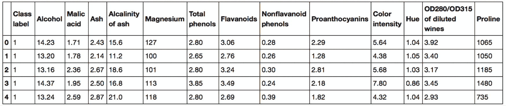

# 四、构建良好的训练数据集——数据预处理

数据的质量及其包含的有用信息量是决定机器学习算法学习效果的关键因素。因此，在将数据集输入到机器学习算法之前，确保我们检查并预处理数据集是绝对关键的。在本章中，我们将讨论基本的数据预处理技术，这些技术将帮助我们建立良好的机器学习模型。

我们将在本章中涉及的主题如下:

*   从数据集中移除和输入缺失值
*   为机器学习算法整理分类数据
*   为模型构建选择相关特征

# 处理缺失数据

在现实世界的应用程序中，我们的训练示例由于各种原因而缺失一个或多个值并不罕见。例如，可能在数据收集过程中出现错误，某些测量可能不适用，或者在调查中某些字段可能只是空白。我们通常将缺失值视为数据表中的空格或占位符字符串，如代表“不是数字”的`NaN`，或`NULL`(关系数据库中未知值的常用指示器)。不幸的是，大多数计算工具无法处理这种缺失值，或者如果我们简单地忽略它们，就会产生不可预测的结果。因此，在我们进行进一步的分析之前，注意那些缺失的值是至关重要的。

在本节中，我们将通过从数据集中移除条目或从其他训练示例和特征中输入缺失值，来学习几种处理缺失值的实用技术。

## 识别表格数据中的缺失值

在我们讨论几种处理缺失值的技术之前，让从一个**逗号分隔值** ( **CSV** )文件中创建一个简单的示例`DataFrame`，以便更好地理解这个问题:

```py
>>> import pandas as pd

>>> from io import StringIO

>>> csv_data = \

... '''A,B,C,D

... 1.0,2.0,3.0,4.0

... 5.0,6.0,,8.0

... 10.0,11.0,12.0,'''

>>> # If you are using Python 2.7, you need

>>> # to convert the string to unicode:

>>> # csv_data = unicode(csv_data)

>>> df = pd.read_csv(StringIO(csv_data))

>>> df

        A        B        C        D

0     1.0      2.0      3.0      4.0

1     5.0      6.0      NaN      8.0

2    10.0     11.0     12.0      NaN 
```

使用前面的代码，我们通过`read_csv`函数将 CSV 格式的数据读入到 pandas `DataFrame`中，并注意到两个缺失的单元格被替换为`NaN`。前面的代码示例中的`StringIO`函数只是用于说明的目的。它允许我们将分配给`csv_data`的字符串读入一个熊猫`DataFrame`，就好像它是我们硬盘上的一个普通 CSV 文件一样。

对于更大的`DataFrame`，手动寻找丢失的值可能会很繁琐；在这种情况下，我们可以使用`isnull`方法返回一个带有布尔值的`DataFrame`，该值指示单元格是否包含数值(`False`)或者数据是否丢失(`True`)。使用`sum`方法，我们可以返回每列缺失值的数量，如下所示:

```py
>>> df.isnull().sum()

A      0

B      0

C      1

D      1

dtype: int64 
```

通过这种方式，我们可以计算每个列中缺失值的数量；在下面的小节中，我们将看看如何处理这些丢失数据的不同策略。

**用熊猫的数据框方便数据处理**

尽管 scikit-learn 最初只是为处理 NumPy 数组而开发的，但有时使用 pandas 的`DataFrame`来预处理数据会更方便。现在，大多数 scikit-learn 函数都支持将`DataFrame`对象作为输入，但是由于 NumPy 数组处理在 scikit-learn API 中更加成熟，所以建议尽可能使用 NumPy 数组。请注意，在将`DataFrame`的底层 NumPy 数组输入到 scikit-learn 估计器之前，您总是可以通过`values`属性来访问它:

```py
>>> df.values

array([[  1.,   2.,   3.,   4.],

       [  5.,   6.,  nan,   8.],

       [ 10.,  11.,  12.,  nan]]) 
```

## 消除具有缺失值的训练示例或特征

处理缺失数据的最简单的方法之一是简单地从数据集中完全移除相应的特征(列)或训练示例(行);通过`dropna`方法可以很容易地删除缺少值的行:

```py
>>> df.dropna(axis=0)

      A    B    C    D

0   1.0  2.0  3.0  4.0 
```

类似地，我们可以通过将`axis`参数设置为`1`来删除任何行中至少有一个`NaN`的列:

```py
>>> df.dropna(axis=1)

      A      B

0   1.0    2.0

1   5.0    6.0

2  10.0   11.0 
```

`dropna`方法支持几个有用的附加参数:

```py
>>> # only drop rows where all columns are NaN

>>> # (returns the whole array here since we don't

>>> # have a row with all values NaN)

>>> df.dropna(how='all')

      A      B      C      D

0   1.0    2.0    3.0    4.0

1   5.0    6.0    NaN    8.0

2  10.0   11.0   12.0    NaN

>>> # drop rows that have fewer than 4 real values

>>> df.dropna(thresh=4)

      A      B      C      D

0   1.0    2.0    3.0    4.0

>>> # only drop rows where NaN appear in specific columns (here: 'C')

>>> df.dropna(subset=['C'])

      A      B      C      D

0   1.0    2.0    3.0    4.0

2  10.0   11.0   12.0    NaN 
```

虽然删除丢失的数据似乎是一种方便的方法，但它也带来了某些缺点;例如，我们可能会移除过多的样本，这将使可靠的分析变得不可能。或者，如果我们删除太多的特征列，我们将冒丢失有价值的信息的风险，我们的分类器需要这些信息来区分类。在下一节中，我们将看看处理缺失值最常用的替代方法之一:插值技术。

## 输入缺失值

通常，删除训练示例或删除整个特性列是不可行的，因为我们可能会丢失太多有价值的数据。在这种情况下，我们可以使用不同的插值技术来估计数据集中其他定型示例的缺失值。最常见的插值技术之一是**均值插补**，我们只需用整个特征列的平均值替换缺失值。实现这一点的一种便捷方法是使用 scikit-learn 中的`SimpleImputer`类，如以下代码所示:

```py
>>> from sklearn.impute import SimpleImputer

>>> import numpy as np

>>> imr = SimpleImputer(missing_values=np.nan, strategy='mean')

>>> imr = imr.fit(df.values)

>>> imputed_data = imr.transform(df.values)

>>> imputed_data

array([[  1.,   2.,   3.,   4.],

       [  5.,   6.,  7.5,   8.],

       [ 10.,  11.,  12.,   6.]]) 
```

这里，我们将每个`NaN`值替换为相应的平均值，这是为每个特性列单独计算的。`strategy`参数的其他选项是`median`或`most_frequent`，后者用最频繁的值替换缺失的值。这对于输入分类特征值非常有用，例如，存储颜色名称编码(如红色、绿色和蓝色)的要素列。在这一章的后面我们将会遇到这种数据的例子。

或者，一个更方便的估算缺失值的方法是使用 pandas 的方法，并提供一个估算方法作为参数。例如，使用 pandas，我们可以通过以下命令直接在`DataFrame`对象中实现相同的均值插补:

```py
>>> df.fillna(df.mean()) 
```


图 4.1:用平均值替换数据中缺失的值

**缺失数据的其他插补方法**

对于其他插补技术，包括基于 k-最近邻法的`KNNImputer`，通过最近邻对缺失特征进行插补，我们推荐位于 https://scikit-learn.org/stable/modules/impute.html[的 scikit-learn 插补文档](https://scikit-learn.org/stable/modules/impute.html)。

## 了解 scikit-learn estimator API

在上一节中，我们使用了 scikit-learn 中的`SimpleImputer`类来估算数据集中的缺失值。`SimpleImputer`类是 scikit-learn 中所谓的 **transformer** API 的一部分，用于实现与数据转换相关的 Python 类。(请注意，不要将 scikit-learn transformer API 与自然语言处理中使用的 transformer 架构相混淆，我们将在*第 16 章*、*Transformers-Improving Natural Language Processing with Attention Mechanisms*中详细介绍后者。)这些估计量的两个基本方法是`fit`和`transform`。`fit`方法用于从训练数据中学习参数，而`transform`方法使用这些参数来转换数据。任何要转换的数据数组都需要具有与用于拟合模型的数据数组相同数量的特征。

*图 4.2* 说明了如何使用符合训练数据的 scikit-learn 转换器实例来转换训练数据集和新的测试数据集:


图 4.2:使用 scikit-learn API 进行数据转换

我们在*第 3 章*、*使用 Scikit-Learn* 的机器学习分类器之旅中使用的分类器，属于 Scikit-Learn 中所谓的**估计器**，其 API 在概念上非常类似于 scikit-learn transformer API。估值器有一个`predict`方法，但也可以有一个`transform`方法，你将在本章后面看到。您可能还记得，当我们训练那些用于分类的估计器时，我们还使用了`fit`方法来学习模型的参数。然而，在监督学习任务中，我们额外提供了用于拟合模型的类别标签，然后可以使用这些标签通过`predict`方法对新的、无标签的数据示例进行预测，如图*图 4.3* 所示:


图 4.3:为预测模型(如分类器)使用 scikit-learn API

# 处理分类数据

到目前为止，我们只处理了数值。但是，现实世界的数据集包含一个或多个分类要素列的情况并不少见。在这一节中，我们将利用简单而有效的例子来看看如何在数值计算库中处理这种类型的数据。

当我们谈论分类数据时，我们必须进一步区分**序数**和**名义**特征。序数特征可以理解为可以排序的范畴值。例如，t 恤尺寸将是一个序数特征，因为我们可以定义一个顺序:*XL*>*L*>*M*。相反，名义特征不暗示任何顺序；继续前面的例子，我们可以认为 t 恤的颜色是一个名义上的特征，因为说红色比蓝色大通常是没有意义的。

## 熊猫的分类数据编码

在我们探索处理这种分类数据的不同技术之前，让我们创建一个新的`DataFrame`来说明这个问题:

```py
>>> import pandas as pd

>>> df = pd.DataFrame([

...            ['green', 'M', 10.1, 'class2'],

...            ['red', 'L', 13.5, 'class1'],

...            ['blue', 'XL', 15.3, 'class2']])

>>> df.columns = ['color', 'size', 'price', 'classlabel']

>>> df

    color  size  price  classlabel

0   green     M   10.1      class2

1     red     L   13.5      class1

2    blue    XL   15.3      class2 
```

正如我们在前面的输出中看到的，新创建的`DataFrame`包含一个名义特征(`color`)、一个序数特征(`size`)和一个数字特征(`price`)列。类别标签(假设我们为监督学习任务创建了数据集)存储在最后一列。我们在本书中讨论的分类学习算法不使用类别标签中的顺序信息。

## 映射序数特征

为了确保学习算法正确解释序数特征，我们需要将分类字符串值转换成整数。不幸的是，没有方便的函数可以自动导出我们的`size`特征标签的正确顺序，所以我们必须手动定义映射。在下面这个简单的例子中，假设我们知道特征之间的数值差，例如，*XL*=*L*+1 =*M*+2:

```py
>>> size_mapping = {'XL': 3,

...                 'L': 2,

...                 'M': 1}

>>> df['size'] = df['size'].map(size_mapping)

>>> df

    color  size  price  classlabel

0   green     1   10.1      class2

1     red     2   13.5      class1

2    blue     3   15.3      class2 
```

如果我们想在稍后阶段将整数值转换回原始的字符串表示，我们可以简单地定义一个反向映射字典`inv_size_mapping = {v: k for k, v in size_mapping.items()}`，然后可以通过 pandas `map`方法在转换后的特性列上使用它，它类似于我们之前使用的字典`size_mapping`。我们可以如下使用它:

```py
>>> inv_size_mapping = {v: k for k, v in size_mapping.items()}

>>> df['size'].map(inv_size_mapping)

0   M

1   L

2   XL

Name: size, dtype: object 
```

## 编码类别标签

很多机器学习库要求类标签编码为整数值。尽管 scikit-learn 中的大多数分类估计器在内部将类标签转换为整数，但是将类标签作为整数数组来提供以避免技术故障被认为是一种良好的实践。为了对分类标签进行编码，我们可以使用一种类似于前面讨论的顺序特征映射的方法。我们需要记住，类标签是*而不是*序数，我们将哪个整数分配给特定的字符串标签并不重要。因此，我们可以简单地列举类标签，从`0`开始:

```py
>>> import numpy as np

>>> class_mapping = {label: idx for idx, label in

...                  enumerate(np.unique(df['classlabel']))}

>>> class_mapping

{'class1': 0, 'class2': 1} 
```

接下来，我们可以使用映射字典将类标签转换为整数:

```py
>>> df['classlabel'] = df['classlabel'].map(class_mapping)

>>> df

    color  size  price  classlabel

0   green     1   10.1           1

1     red     2   13.5           0

2    blue     3   15.3           1 
```

我们可以如下反转映射字典中的键-值对，以将转换后的类标签映射回原始的字符串表示:

```py
>>> inv_class_mapping = {v: k for k, v in class_mapping.items()}

>>> df['classlabel'] = df['classlabel'].map(inv_class_mapping)

>>> df

    color  size  price  classlabel

0   green     1   10.1      class2

1     red     2   13.5      class1

2    blue     3   15.3      class2 
```

或者，在 scikit 中直接实现了一个方便的`LabelEncoder`类——学会实现这一点:

```py
>>> from sklearn.preprocessing import LabelEncoder

>>> class_le = LabelEncoder()

>>> y = class_le.fit_transform(df['classlabel'].values)

>>> y

array([1, 0, 1]) 
```

注意，`fit_transform`方法只是分别调用`fit`和`transform`的快捷方式，我们可以使用`inverse_transform`方法将整数类标签转换回它们原来的字符串表示:

```py
>>> class_le.inverse_transform(y)

array(['class2', 'class1', 'class2'], dtype=object) 
```

## 对名义特征执行一键编码

在前面的*映射序数特性*一节中，我们使用了一种简单的字典映射方法将序数特性`size`转换成整数。由于 scikit-learn 的分类估计器将类别标签视为不暗示任何顺序(名义)的分类数据，因此我们使用方便的`LabelEncoder`将字符串标签编码为整数。我们可以使用类似的方法来转换数据集的名义上的`color`列，如下所示:

```py
>>> X = df[['color', 'size', 'price']].values

>>> color_le = LabelEncoder()

>>> X[:, 0] = color_le.fit_transform(X[:, 0])

>>> X

array([[1, 1, 10.1],

       [2, 2, 13.5],

       [0, 3, 15.3]], dtype=object) 
```

执行上述代码后，NumPy 数组的第一列`X`现在保存新的`color`值，其编码如下:

*   `blue = 0`
*   `green = 1`
*   `red = 2`

如果我们在这一点上停下来，将数组提供给我们的分类器，我们将会犯一个在处理分类数据时最常见的错误。你能发现问题吗？虽然颜色值没有任何特定的顺序，但是常见的分类模型，比如前面章节中提到的那些，现在会假设`green`大于`blue`，并且`red`大于`green`。虽然这个假设是不正确的，但是分类器仍然可以产生有用的结果。然而，这些结果不会是最佳的。

解决这个问题的一个常见方法是使用一种叫做**一键编码**的技术。这种方法背后的思想是为标称特征列中的每个唯一值创建一个新的虚拟特征。这里，我们将把`color`特性转换成三个新特性:`blue`、`green`和`red`。二进制值可以用来表示一个例子的特定`color`；例如，`blue`示例可以编码为`blue=1`、`green=0`、`red=0`。为了执行这个转换，我们可以使用在 scikit-learn 的`preprocessing`模块中实现的`OneHotEncoder`:

```py
>>> from sklearn.preprocessing import OneHotEncoder

>>> X = df[['color', 'size', 'price']].values

>>> color_ohe = OneHotEncoder()

>>> color_ohe.fit_transform(X[:, 0].reshape(-1, 1)).toarray()

    array([[0., 1., 0.],

           [0., 0., 1.],

           [1., 0., 0.]]) 
```

注意，我们只将`OneHotEncoder`应用于一个列`(X[:, 0].reshape(-1, 1))`，以避免修改数组中的其他两列。如果我们想要有选择地转换多特征数组中的列，我们可以使用`ColumnTransformer`，它接受如下的`(name, transformer, column(s))`元组列表:

```py
>>> from sklearn.compose import ColumnTransformer

>>> X = df[['color', 'size', 'price']].values

>>> c_transf = ColumnTransformer([

...     ('onehot', OneHotEncoder(), [0]),

...     ('nothing', 'passthrough', [1, 2])

... ])

>>> c_transf.fit_transform(X).astype(float)

    array([[0.0, 1.0, 0.0, 1, 10.1],

           [0.0, 0.0, 1.0, 2, 13.5],

           [1.0, 0.0, 0.0, 3, 15.3]]) 
```

在前面的代码示例中，我们通过`'passthrough'`参数指定只修改第一列，而不修改其他两列。

通过一键编码创建这些虚拟特征的一个更方便的方法是使用 pandas 中实现的`get_dummies`方法。应用于一个`DataFrame`，`get_dummies`方法将只转换字符串列，并保持所有其他列不变:

```py
>>> pd.get_dummies(df[['price', 'color', 'size']])

    price  size  color_blue  color_green  color_red

0    10.1     1           0            1          0

1    13.5     2           0            0          1

2    15.3     3           1            0          0 
```

当我们使用一次性编码数据集时，我们必须记住这会引入多重共线性，这对于某些方法来说可能是一个问题(例如，需要矩阵求逆的方法)。如果特征高度相关，矩阵在计算上很难求逆，这会导致数值不稳定的估计。为了减少变量之间的相关性，我们可以简单地从独热编码数组中删除一个特征列。请注意，删除一个特性列并不会丢失任何重要信息；例如，如果我们删除列`color_blue`，特征信息仍然被保留，因为如果我们观察`color_green=0`和`color_red=0`，这意味着观察必须是`blue`。

如果我们使用`get_dummies`函数，我们可以通过向`drop_first`参数传递一个`True`参数来删除第一列，如下面的代码示例所示:

```py
>>> pd.get_dummies(df[['price', 'color', 'size']],

...                drop_first=True)

    price  size  color_green  color_red

0    10.1     1            1          0

1    13.5     2            0          1

2    15.3     3            0          0 
```

为了通过`OneHotEncoder`删除冗余列，我们需要设置`drop='first'`并如下设置`categories='auto'`:

```py
>>> color_ohe = OneHotEncoder(categories='auto', drop='first')

>>> c_transf = ColumnTransformer([

...            ('onehot', color_ohe, [0]),

...            ('nothing', 'passthrough', [1, 2])

... ])

>>> c_transf.fit_transform(X).astype(float)

array([[  1\. ,  0\. ,  1\. ,  10.1],

       [  0\. ,  1\. ,  2\. ,  13.5],

       [  0\. ,  0\. ,  3\. ,  15.3]]) 
```

**名义数据的附加编码方案**

虽然 one-hot 编码是对无序分类变量进行编码的最常见方式，但也有几种替代方法。当处理具有高基数(大量唯一类别标签)的分类要素时，其中一些技术可能会很有用。例子包括:

*   二进制编码，产生多个类似于一热编码的二进制特征，但需要更少的特征列，即 log [2] ( *K* )而不是*K*–1，其中 *K* 是唯一类别的数量。在二进制编码中，数字首先被转换成二进制表示，然后每个二进制数字位置将形成一个新的特征列。
*   计数或频率编码，用类别在训练集中出现的次数或频率来替换每个类别的标签。

这些方法，以及附加的分类编码方案，可以通过 scikit-learn-compatible `category_encoders`库:[https://contrib.scikit-learn.org/category_encoders/](https://contrib.scikit-learn.org/category_encoders/)获得。

虽然这些方法不能保证在模型性能方面比一键编码执行得更好，但我们可以考虑选择分类编码方案作为提高模型性能的附加“超参数”。

### 可选:编码序数特征

如果我们不确定有序特征类别之间的数值差异，或者两个序数值之间的差异没有定义，我们也可以使用具有 0/1 值的阈值编码对它们进行编码。例如，我们可以将具有值`M`、`L`和`XL`的特征`size`分割成两个新特征`x > M`和`x > L`。让我们来考虑一下最初的`DataFrame`:

```py
>>> df = pd.DataFrame([['green', 'M', 10.1,

...                     'class2'],

...                    ['red', 'L', 13.5,

...                     'class1'],

...                    ['blue', 'XL', 15.3,

...                     'class2']])

>>> df.columns = ['color', 'size', 'price',

...               'classlabel']

>>> df 
```

我们可以使用 pandas 的`DataFrame`的`apply`方法来编写自定义的 lambda 表达式，以便使用阈值方法对这些变量进行编码:

```py
>>> df['x > M'] = df['size'].apply(

...     lambda x: 1 if x in {'L', 'XL'} else 0)

>>> df['x > L'] = df['size'].apply(

...     lambda x: 1 if x == 'XL' else 0)

>>> del df['size']

>>> df 
```

# 将数据集划分为单独的训练数据集和测试数据集

我们在*第 1 章*、*赋予计算机从数据中学习的能力*和*第 3 章*、*中简要介绍了将数据集划分为单独数据集用于训练和测试的概念，并介绍了使用 Scikit-Learn 的机器学习分类器之旅*。请记住，将预测与测试集中的真实标签进行比较，可以被理解为在我们让模型进入真实世界之前对其进行的无偏性能评估。在本节中，我们将准备一个新的数据集，即 **Wine** 数据集。在我们预处理数据集之后，我们将探索不同的特征选择技术来降低数据集的维度。

葡萄酒数据集是另一个开源数据集，可从 https://archive.ics.uci.edu/ml/datasets/Wine 的 UCI 机器学习库获得；它包括 178 个葡萄酒的例子，13 个特征描述了它们不同的化学性质。

**获取葡萄酒数据集**

你可以在本书的代码包中找到葡萄酒数据集(以及本书中使用的所有其他数据集)的副本，如果你离线工作或者位于[https://archive . ics . uci . edu/ml/machine-learning-databases/Wine/Wine . data](https://archive.ics.uci.edu/ml/machine-learning-databases/wine/wine.data)的数据集在 UCI 服务器上暂时不可用，你可以使用它。例如，要从本地目录加载葡萄酒数据集，您可以替换以下代码行:

```py
df = pd.read_csv(

    'https://archive.ics.uci.edu/ml/'

    'machine-learning-databases/wine/wine.data',

    header=None

) 
```

用下面的一个:

```py
df = pd.read_csv(

    'your/local/path/to/wine.data', header=None

) 
```

使用 pandas 库，我们将直接从 UCI 机器学习库中读取开源葡萄酒数据集:

```py
>>> df_wine = pd.read_csv('https://archive.ics.uci.edu/'

...                       'ml/machine-learning-databases/'

...                       'wine/wine.data', header=None)

>>> df_wine.columns = ['Class label', 'Alcohol',

...                    'Malic acid', 'Ash',

...                    'Alcalinity of ash', 'Magnesium',

...                    'Total phenols', 'Flavanoids',

...                    'Nonflavanoid phenols',

...                    'Proanthocyanins',

...                    'Color intensity', 'Hue',

...                    'OD280/OD315 of diluted wines',

...                    'Proline']

>>> print('Class labels', np.unique(df_wine['Class label']))

Class labels [1 2 3]

>>> df_wine.head() 
```

下表列出了葡萄酒数据集中的 13 种不同特征，描述了 178 种葡萄酒的化学特性:



图 4.4:葡萄酒数据集的示例

示例属于三个不同的类别之一，`1`、`2`和`3`，它们指的是生长在意大利同一地区但来自不同葡萄酒品种的三种不同类型的葡萄，如数据集摘要([https://archive . ics . UCI . edu/ml/machine-learning-databases/wine/wine . names](https://archive.ics.uci.edu/ml/machine-learning-databases/wine/wine.names))中所述。

将该数据集随机划分为单独的测试和训练数据集的一种简便方法是使用 scikit-learn 的`model_selection`子模块中的`train_test_split`函数:

```py
>>> from sklearn.model_selection import train_test_split

>>> X, y = df_wine.iloc[:, 1:].values, df_wine.iloc[:, 0].values

>>> X_train, X_test, y_train, y_test =\

...     train_test_split(X, y,

...                      test_size=0.3,

...                      random_state=0,

...                      stratify=y) 
```

首先，我们将特性列 1-13 的 NumPy 数组表示分配给变量`X`，并将第一列的类标签分配给变量`y`。然后，我们使用`train_test_split`函数将`X`和`y`随机分成单独的训练和测试数据集。

通过设置`test_size=0.3`，我们将 30%的葡萄酒示例分配给`X_test`和`y_test`，剩余的 70%分别分配给`X_train`和`y_train`。将类别标签数组`y`作为参数提供给`stratify`确保了训练和测试数据集与原始数据集具有相同的类别比例。

**选择将数据集划分为训练数据集和测试数据集的适当比例**

如果我们将数据集分为训练和测试数据集，我们必须记住，我们保留了学习算法可以受益的有价值的信息。因此，我们不想给测试集分配太多的信息。然而，测试集越小，泛化误差的估计就越不准确。将数据集划分为训练数据集和测试数据集就是为了平衡这种权衡。实际上，最常用的拆分是 60:40、70:30 或 80:20，具体取决于初始数据集的大小。然而，对于大型数据集，90:10 或 99:1 的分割也是常见且合适的。例如，如果数据集包含超过 100，000 个训练示例，则只保留 10，000 个示例进行测试可能会更好，这样可以更好地估计泛化性能。更多信息和图解可以在我的文章*机器学习中的模型评估、模型选择和算法选择*的第一节中找到，该文章可以在 https://arxiv.org/pdf/1811.12808.pdf 的[免费获得。此外，我们将重温模型评估的主题，并在*第 6 章*、*学习模型评估和超参数调整的最佳实践*中进行更详细的讨论。](https://arxiv.org/pdf/1811.12808.pdf)

此外，代替在模型训练和评估之后丢弃分配的测试数据，通常的做法是在整个数据集上重新训练分类器，因为这可以提高模型的预测性能。虽然通常推荐使用这种方法，但是如果数据集很小并且测试数据集包含异常值，这种方法可能会导致泛化性能下降。此外，在整个数据集上重新调整模型后，我们没有任何独立的数据来评估它的性能。

# 将特征带到相同的尺度上

**特征缩放**是我们预处理流程中的关键步骤，很容易被遗忘。**决策树**和**随机森林**是为数不多的机器学习算法中的两种，其中我们不需要担心特征缩放。这些算法是尺度不变的。然而，如果特征在同一尺度上，大多数机器学习和优化算法表现得更好，正如我们在*第 2 章*、*中看到的，当我们实施**梯度下降优化**算法时，训练简单的机器学习算法用于分类*。

特征缩放的重要性可以通过一个简单的例子来说明。让我们假设我们有两个特征，其中一个特征在从 1 到 10 的范围内测量，第二个特征在从 1 到 100，000 的范围内测量。

当我们想到第二章中 Adaline 的平方误差函数时，可以说算法将主要忙于根据第二个特征中的较大误差来优化权重。另一个的例子是带有欧几里德距离度量的**k-最近邻** ( **KNN** )算法:实例之间的计算距离将由第二特征轴决定。

现在，有两种常见的方法可以将不同的特性放到同一个尺度上:**和**标准化**。这些术语在不同的领域中经常被不严格地使用，其含义必须从上下文中推导出来。最常见的情况是，归一化指的是将特征重新缩放到范围[0，1]，这是**最小-最大缩放**的特殊情况。为了标准化我们的数据，我们可以简单地将最小-最大缩放应用于每个特征列，其中示例的新值*x*^(^I^)可以计算如下:**

 **

这里，*x*^(^I^)是一个特例， *x* [min] 是一个特征列中的最小值， *x* [max] 是最大值。

最小-最大缩放程序在 scikit-learn 中实现，可按如下方式使用:

```py
>>> from sklearn.preprocessing import MinMaxScaler

>>> mms = MinMaxScaler()

>>> X_train_norm = mms.fit_transform(X_train)

>>> X_test_norm = mms.transform(X_test) 
```

虽然通过最小-最大缩放进行标准化是一种常用的技术，当我们需要有界区间内的值时，这种技术很有用，但标准化对于许多机器学习算法来说可能更实用，特别是对于梯度下降等优化算法。原因是许多线性模型，如第三章中的逻辑回归和 SVM，将权重初始化为 0 或接近 0 的小随机值。使用标准化，我们将特征列以平均值 0 为中心，标准偏差为 1，以便特征列具有与标准正态分布相同的参数(零平均值和单位方差)，这使得学习权重更容易。然而，我们应该强调标准化不会改变分布的形状，也不会将非正态分布的数据转换成正态分布的数据。除了缩放数据以使其具有零均值和单位方差之外，标准化还保留了关于异常值的有用信息，并使算法对异常值不太敏感，这与最小-最大缩放形成对比，后者将数据缩放到有限范围的值。

标准化的过程可以用下面的等式表示:


这里，是特定特征列的样本均值，是对应的标准差。

下表在一个由数字 0 到 5 组成的简单示例数据集上说明了标准化和规范化这两种常用的要素缩放技术之间的差异:

| 

**输入**

 | 

**标准化**

 | 

**最小-最大归一化**

 |
| Zero | -1.46385 | Zero |
| One | -0.87831 | Zero point two |
| Two | -0.29277 | Zero point four |
| Three | 0.29277 | Zero point six |
| Four | 0.87831 | Zero point eight |
| Five | 1.46385 | One |

表 4.1:标准化和最小-最大标准化之间的比较

您可以通过执行以下代码示例来手动执行表中所示的标准化和规范化:

```py
>>> ex = np.array([0, 1, 2, 3, 4, 5])

>>> print('standardized:', (ex - ex.mean()) / ex.std())

standardized: [-1.46385011  -0.87831007  -0.29277002  0.29277002

0.87831007  1.46385011]

>>> print('normalized:', (ex - ex.min()) / (ex.max() - ex.min()))

normalized: [ 0\.  0.2  0.4  0.6  0.8  1\. ] 
```

类似于`MinMaxScaler`类，scikit-learn 也实现了一个标准化类:

```py
>>> from sklearn.preprocessing import StandardScaler

>>> stdsc = StandardScaler()

>>> X_train_std = stdsc.fit_transform(X_train)

>>> X_test_std = stdsc.transform(X_test) 
```

再次强调，我们只对训练数据拟合一次`StandardScaler`类，并使用这些参数来转换测试数据集或任何新的数据点，这一点也很重要。

scikit-learn 提供了其他更高级的功能缩放方法，如`RobustScaler`。如果我们处理的是包含许多异常值的小数据集，那么`RobustScaler`尤其有用，值得推荐。同样，如果应用于这个数据集的机器学习算法是易于**过拟合**，`RobustScaler`可以是一个很好的选择。`RobustScaler`对每个要素列进行独立操作，移除中值并根据数据集的第 1 和第 3 个四分位数(即分别为第 25 和第 75 个分位数)缩放数据集，从而使更多的极值和异常值变得不明显。感兴趣的读者可以在[https://scikit-learn . org/stable/modules/generated/sk learn . preprocessing . robust scaler . html](https://scikit-learn.org/stable/modules/generated/sklearn.preprocessing.RobustScaler.html)的 sci kit-learn 官方文档中找到更多关于`RobustScaler`的信息。

# 选择有意义的特征

如果我们注意到模型在训练数据集上的表现比在测试数据集上好得多，这种观察是过度拟合的一个强有力的指标。正如我们在*第 3 章*、*使用 Scikit-Learn* 的机器学习分类器之旅中所讨论的，过度拟合意味着模型与训练数据集中的特定观察值过于接近，但不能很好地推广到新数据；我们说模型有一个**高方差**。过度拟合的原因是我们的模型对于给定的训练数据来说太复杂了。减少泛化误差的常见解决方案如下:

*   收集更多培训数据
*   通过正则化引入复杂度惩罚
*   选择一个参数较少的简单模型
*   降低数据的维度

收集更多的训练数据通常是不适用的。在*第 6 章*、*学习模型评估和超参数调整的最佳实践*中，我们将学习一种有用的技术来检查更多的训练数据是否有用。在接下来的章节中，我们将探讨通过正则化和通过特征选择降维来减少过拟合的常见方法，这通过需要更少的参数来拟合数据而产生更简单的模型。然后，在*第 5 章*、*通过降维压缩数据*中，我们将看看附加的特征提取技术。

## L1 和 L2 正则化作为对模型复杂性的惩罚

你会想起第三章的， **L2 正则化**是一种通过惩罚大的个体权重来降低模型复杂性的方法。我们定义了权重向量的平方 L2 范数，如下所示:


降低模型复杂性的另一种方法是相关的 **L1 正则化**:


这里，我们简单地将权重的平方替换为权重绝对值的和。与 L2 正则化相反，L1 正则化通常产生稀疏的特征向量，并且大多数特征权重将是零。如果我们有一个包含许多不相关特征的高维数据集，稀疏性在实践中会很有用，特别是在我们的不相关维度比训练示例多的情况下。在这个意义上，L1 正则化可以被理解为用于特征选择的技术。

## L2 正则化的几何解释

如前一节所述，L2 正则化为损失函数添加了一个惩罚项，与使用非正则化损失函数训练的模型相比，该惩罚项有效地产生了较少的极端权重值。

为了更好地理解 L1 正则化如何鼓励稀疏性，让我们后退一步，看看正则化的几何解释。让我们绘制两个权重系数的凸损失函数的轮廓， *w* [1] 和 *w* [2] 。

这里，我们将考虑我们在第 2 章的*中用于 Adaline 的**均方误差** ( **MSE** )损失函数，该函数计算真实和预测类标签 *y* 和之间的平方距离，并对训练集中的所有 *N* 个示例进行平均。由于 MSE 是球形的，比 logistic 回归的损失函数更容易画出来；然而，同样的概念也适用。请记住，我们的目标是找到最小化训练数据损失函数的权重系数组合，如图*图 4.5* (椭圆中心点)所示:*


图 4.5:最小化均方误差损失函数

我们可以认为正则化是在损失函数中增加一个惩罚项，以鼓励更小的权重；换句话说，我们惩罚大的重量。因此，通过经由正则化参数增加正则化强度，我们将权重向零收缩，并降低我们的模型对训练数据的依赖性。让我们在下图中用 L2 罚金期限来说明这个概念:


图 4.6:将 L2 正则化应用于损失函数

二次 L2 正则项由阴影球表示。这里，我们的权重系数不能超过我们的正则化预算——权重系数的组合不能落在阴影区域之外。另一方面，我们还是想最小化损失函数。在惩罚约束下，我们尽最大努力选择 L2 球与未惩罚损失函数的轮廓相交的点。正则化参数的值越大，惩罚损失增长得越快，这导致更窄的 L2 球。例如，如果我们将正则化参数增加到无穷大，权重系数实际上将变为零，由 L2 球的中心表示。总结一下这个例子的主要信息，我们的目标是最小化未平准化损失加上惩罚项的总和，这可以理解为在没有足够的训练数据来拟合模型的情况下，增加偏差和偏好更简单的模型来减少方差。

## L1 正则化稀疏解

现在，我们来讨论一下 L1 正则化和稀疏性。L1 正则化背后的主要概念类似于我们在上一节中讨论的内容。然而，由于 L1 惩罚是绝对权重系数的总和(记住 L2 项是二次的)，我们可以将其表示为菱形预算，如图 4.7 所示:


图 4.7:将 L1 正则化应用于损失函数

在上图中，我们可以看到损失函数的轮廓在 *w* [1] = 0 处接触到 L1 菱形。由于 L1 正则化系统的轮廓是清晰的，最有可能的是，最优值——即损失函数的椭圆和 L1 钻石的边界之间的交点——位于轴上，这促进了稀疏性。

**L1 正则化和稀疏化**

为什么 L1 正则化可以导致稀疏解的数学细节超出了本书的范围。如果你感兴趣，可以在*第 3.4 节*、*特雷弗·哈斯蒂、罗伯特·蒂布拉尼*和*杰罗姆·弗里德曼(Springer Science+Business Media，* 2009 年出版的《统计学习的要素》中找到关于 L2 与 L1 正则化的精彩解释。

对于 scikit-learn 中支持 L1 正则化的正则化模型，我们可以简单地将`penalty`参数设置为`'l1'`以获得稀疏解:

```py
>>> from sklearn.linear_model import LogisticRegression

>>> LogisticRegression(penalty='l1',

...                    solver='liblinear',

...                    multi_class='ovr') 
```

注意，我们还需要选择不同的优化算法(例如，`solver='liblinear'`)，因为`'lbfgs'`目前不支持 L1 正则化损失优化。应用于标准化葡萄酒数据，L1 正则化逻辑回归将产生以下稀疏解:

```py
>>> lr = LogisticRegression(penalty='l1',

...                         C=1.0,

...                         solver='liblinear',

...                         multi_class='ovr')

>>> # Note that C=1.0 is the default. You can increase

>>> # or decrease it to make the regularization effect

>>> # stronger or weaker, respectively.

>>> lr.fit(X_train_std, y_train)

>>> print('Training accuracy:', lr.score(X_train_std, y_train))

Training accuracy: 1.0

>>> print('Test accuracy:', lr.score(X_test_std, y_test))

Test accuracy: 1.0 
```

训练和测试精度(都是 100%)表明我们的模型在两个数据集上都做得很好。当我们通过`lr.intercept_`属性访问截距项时，我们可以看到数组返回三个值:

```py
>>> lr.intercept_

    array([-1.26317363, -1.21537306, -2.37111954]) 
```

由于我们通过**一对其余** ( **OvR** )方法在多类数据集上拟合`LogisticRegression`对象，第一个截距属于符合类 1 对类 2 和 3 的模型，第二个值是符合类 2 对类 1 和 3 的模型的截距，第三个值是符合类 3 对类 1 和 2 的模型的截距:

```py
>>> lr.coef_

array([[ 1.24647953,  0.18050894,  0.74540443, -1.16301108,

         0\.        ,0\.        ,  1.16243821,  0\.        ,

         0\.        ,  0\.        , 0\.        ,  0.55620267,

         2.50890638],

       [-1.53919461, -0.38562247, -0.99565934,  0.36390047,

        -0.05892612, 0\.        ,  0.66710883,  0\.        ,

         0\.        , -1.9318798 , 1.23775092,  0\.        ,

        -2.23280039],

       [ 0.13557571,  0.16848763,  0.35710712,  0\.        ,

         0\.        , 0\.        , -2.43804744,  0\.        ,

         0\.        ,  1.56388787, -0.81881015, -0.49217022,

         0\.        ]]) 
```

我们通过`lr.coef_`属性访问的权重数组包含三行权重系数，每个类一个权重向量。每行包含 13 个权重，其中每个权重乘以 13 维葡萄酒数据集中的相应特征，以计算净输入:


**访问 scikit-learn 估计器的偏差单位和权重参数**

在 scikit-learn 中，`intercept_`对应于偏置单位，`coef_`对应于值 *w* [j] 。

作为 L1 正则化的结果，如上所述，它是一种用于特征选择的方法，我们刚刚训练了一个模型，该模型对该数据集中潜在的不相关特征是鲁棒的。不过，严格地说，上一个例子中的权重向量不一定是稀疏的，因为它们包含的非零条目多于零条目。然而，我们可以通过进一步增加正则化强度来加强稀疏性(更多的零条目)——也就是说，为`C`参数选择更低的值。

在本章关于正则化的最后一个示例中，我们将改变正则化强度并绘制正则化路径-不同正则化强度的不同要素的权重系数:

```py
>>> import matplotlib.pyplot as plt

>>> fig = plt.figure()

>>> ax = plt.subplot(111)

>>> colors = ['blue', 'green', 'red', 'cyan',

...           'magenta', 'yellow', 'black',

...           'pink', 'lightgreen', 'lightblue',

...           'gray', 'indigo', 'orange']

>>> weights, params = [], []

>>> for c in np.arange(-4., 6.):

...     lr = LogisticRegression(penalty='l1', C=10.**c,

...                             solver='liblinear',

...                             multi_class='ovr', random_state=0)

...     lr.fit(X_train_std, y_train)

...     weights.append(lr.coef_[1])

...     params.append(10**c)

>>> weights = np.array(weights)

>>> for column, color in zip(range(weights.shape[1]), colors):

...     plt.plot(params, weights[:, column],

...              label=df_wine.columns[column + 1],

...              color=color)

>>> plt.axhline(0, color='black', linestyle='--', linewidth=3)

>>> plt.xlim([10**(-5), 10**5])

>>> plt.ylabel('Weight coefficient')

>>> plt.xlabel('C (inverse regularization strength)')

>>> plt.xscale('log')

>>> plt.legend(loc='upper left')

>>> ax.legend(loc='upper center',

...           bbox_to_anchor=(1.38, 1.03),

...           ncol=1, fancybox=True)

>>> plt.show() 
```

由此产生的图为我们提供了对 L1 正则化行为的进一步了解。正如我们所看到的，如果我们用一个强正则化参数(*C*0.01)惩罚模型，所有的特征权重都将为零； *C* 是正则化参数的逆，:


图 4.8:正则化强度超参数 C 值的影响

## 顺序特征选择算法

降低模型复杂性和避免过度拟合的另一种方法是通过特征选择进行**降维**，这对于非正则化模型尤其有用。主要有两类维度缩减技术:**特征选择**和**特征提取**。通过特征选择，我们*选择*原始特征的子集，而在特征提取中，我们*从特征集中导出*信息以构建新的特征子空间。

在这一节中，我们将看看一个经典的特征选择算法家族。在下一章*第 5 章*、*通过降维压缩数据*中，我们将学习不同的特征提取技术，将数据集压缩到一个更低维的特征子空间。

顺序特征选择算法是一系列贪婪搜索算法，用于将初始的*维*维特征空间缩减到*维*维特征子空间，其中*k*d。特征选择算法背后的动机是自动选择与问题最相关的特征子集，以提高计算效率，或者通过移除不相关的特征或噪声来减少模型的概化误差，这对于不支持正则化的算法可能很有用。

经典的序贯特征选择算法是**序贯反向选择** ( **SBS** )，其目的是在分类器性能衰减最小的情况下降低初始特征子空间的维数，以提高计算效率。在某些情况下，如果模型过度拟合，SBS 甚至可以提高模型的预测能力。

**贪婪搜索算法**

贪婪算法在组合搜索问题的每个阶段做出局部最优选择，通常会产生问题的次优解，而穷举搜索算法评估所有可能的组合，并保证找到最优解。然而，在实践中，穷举搜索通常在计算上是不可行的，而贪婪算法允许不太复杂、计算上更有效的解决方案。

SBS 算法背后的思想非常简单:SBS 顺序地从完整的特征子集中删除特征，直到新的特征子空间包含期望数量的特征。为了确定在每个阶段要移除哪个特征，我们需要定义我们想要最小化的标准函数 *J* 。

由标准函数计算的标准可以简单地是在去除特定特征之前和之后分类器性能的差异。然后，在每个阶段要移除的特征可以简单地定义为最大化该标准的特征；或者更简单地说，在每一个阶段，我们都消除了在删除后导致最小性能损失的特性。基于前面对 SBS 的定义，我们可以用四个简单的步骤来概括该算法:

1.  用 *k* = *d* 初始化算法，其中 *d* 是全特征空间的维数，**X**d。
2.  确定最大化准则的特征，**X**^–:**X**^–= arg max*J*(**X**k–**X**)，其中。
3.  从特征集中删除特征，**X**^–:**X**[k][–1]=**X**[k]–**X**^–；*k*=*k*–1。
4.  Terminate if *k* equals the number of desired features; otherwise, go to *step 2*.

    **关于序列特征算法的资源**

    你可以在 *F .费里*、 *P .普迪尔*、 *M .哈特夫*和 *J .基特勒*1994 年第 403-413 页的*大规模特征选择技术的比较研究*中找到几种顺序特征算法的详细评价。

为了练习我们的编码技巧和实现我们自己的算法的能力，让我们从头开始用 Python 实现它:

```py
from sklearn.base import clone

from itertools import combinations

import numpy as np

from sklearn.metrics import accuracy_score

from sklearn.model_selection import train_test_split

class SBS:

    def __init__(self, estimator, k_features,

                 scoring=accuracy_score,

                 test_size=0.25, random_state=1):

        self.scoring = scoring

        self.estimator = clone(estimator)

        self.k_features = k_features

        self.test_size = test_size

        self.random_state = random_state

    def fit(self, X, y):

        X_train, X_test, y_train, y_test = \

            train_test_split(X, y, test_size=self.test_size,

                             random_state=self.random_state)

        dim = X_train.shape[1]

        self.indices_ = tuple(range(dim))

        self.subsets_ = [self.indices_]

        score = self._calc_score(X_train, y_train,

                                 X_test, y_test, self.indices_)

        self.scores_ = [score]

        while dim > self.k_features:

            scores = []

            subsets = []

            for p in combinations(self.indices_, r=dim - 1):

                score = self._calc_score(X_train, y_train,

                                         X_test, y_test, p)

                scores.append(score)

                subsets.append(p)

            best = np.argmax(scores)

            self.indices_ = subsets[best]

            self.subsets_.append(self.indices_)

            dim -= 1

            self.scores_.append(scores[best])

        self.k_score_ = self.scores_[-1]

        return self

    def transform(self, X):

        return X[:, self.indices_]

    def _calc_score(self, X_train, y_train, X_test, y_test, indices):

        self.estimator.fit(X_train[:, indices], y_train)

        y_pred = self.estimator.predict(X_test[:, indices])

        score = self.scoring(y_test, y_pred)

        return score 
```

在前面的实现中，我们定义了`k_features`参数来指定我们想要返回的所需特征数量。默认情况下，我们使用 scikit-learn 中的`accuracy_score`来评估模型(用于分类的估计器)在特征子集上的性能。

在`fit`方法的`while`循环内，由`itertools.combination`函数创建的特征子集被评估和减少，直到特征子集具有期望的维度。在每次迭代中，基于内部创建的测试数据集`X_test`，在列表`self.scores_`中收集最佳子集的准确度分数。我们稍后将使用这些分数来评估结果。最终特征子集的列索引被分配给`self.indices_`，我们可以通过`transform`方法使用它返回一个包含所选特征列的新数据数组。注意，我们没有在`fit`方法中明确计算标准，而是简单地删除了不包含在最佳性能特征子集中的特征。

现在，让我们使用 scikit-learn 的 KNN 分类器来看看我们的 SBS 实现的运行情况:

```py
>>> import matplotlib.pyplot as plt

>>> from sklearn.neighbors import KNeighborsClassifier

>>> knn = KNeighborsClassifier(n_neighbors=5)

>>> sbs = SBS(knn, k_features=1)

>>> sbs.fit(X_train_std, y_train) 
```

尽管我们的 SBS 实现已经在`fit`函数中将数据集分割成测试和训练数据集，我们仍然将训练数据集`X_train`提供给算法。SBS `fit`方法随后将为测试(验证)和训练创建新的训练子集，这就是为什么这个测试集也被称为**验证数据集**。这种方法对于防止我们的*原始*测试集成为训练数据的一部分是必要的。

请记住，我们的 SBS 算法在每个阶段收集最佳特征子集的分数，因此让我们继续我们实现中更令人兴奋的部分，并绘制在验证数据集上计算的 KNN 分类器的分类精度。代码如下:

```py
>>> k_feat = [len(k) for k in sbs.subsets_]

>>> plt.plot(k_feat, sbs.scores_, marker='o')

>>> plt.ylim([0.7, 1.02])

>>> plt.ylabel('Accuracy')

>>> plt.xlabel('Number of features')

>>> plt.grid()

>>> plt.tight_layout()

>>> plt.show() 
```

正如我们在*图 4.9* 中看到的，随着我们减少特征的数量，KNN 分类器的准确性在验证数据集上有所提高，这很可能是由于我们在第 3 章的*中在 KNN 算法的背景下讨论的**维数灾难**的减少。此外，我们可以在下面的图中看到，对于 *k* = {3，7，8，9，10，11，12}，分类器实现了 100%的准确性:*


图 4.9:特征数量对模型准确性的影响

为了满足我们自己的好奇心，让我们看看在验证数据集上产生如此好的性能的最小特征子集( *k* =3)是什么样子的:

```py
>>> k3 = list(sbs.subsets_[10])

>>> print(df_wine.columns[1:][k3])

Index(['Alcohol', 'Malic acid', 'OD280/OD315 of diluted wines'], dtype='object') 
```

使用前面的代码，我们从属性`sbs.subsets_`的第 11 个位置获得了三个特性子集的列索引，并从 pandas Wine `DataFrame`的列索引中返回了相应的特性名称。

接下来，让我们在原始测试数据集上评估 KNN 分类器的性能:

```py
>>> knn.fit(X_train_std, y_train)

>>> print('Training accuracy:', knn.score(X_train_std, y_train))

Training accuracy: 0.967741935484

>>> print('Test accuracy:', knn.score(X_test_std, y_test))

Test accuracy: 0.962962962963 
```

在前面的代码部分中，我们使用了完整的功能集，在训练数据集上获得了大约 97%的准确性，在测试数据集上获得了大约 96%的准确性，这表明我们的模型已经可以很好地推广到新数据。现在，让我们使用选定的三个特征子集，看看 KNN 的表现如何:

```py
>>> knn.fit(X_train_std[:, k3], y_train)

>>> print('Training accuracy:',

...       knn.score(X_train_std[:, k3], y_train))

Training accuracy: 0.951612903226

>>> print('Test accuracy:',

...       knn.score(X_test_std[:, k3], y_test))

Test accuracy: 0.925925925926 
```

当使用葡萄酒数据集中不到四分之一的原始特征时，测试数据集上的预测精度略有下降。这可能表明这三个特征并没有提供比原始数据集更少的区分信息。然而，我们还必须记住，葡萄酒数据集是一个小数据集，非常容易受到随机性的影响，也就是说，我们将数据集分为训练和测试子集的方式，以及我们如何将训练数据集进一步分为训练和验证子集。

虽然我们没有通过减少特征的数量来提高 KNN 模型的性能，但我们缩小了数据集的大小，这在可能涉及昂贵的数据收集步骤的真实世界应用中是有用的。此外，通过大幅减少特征的数量，我们获得了更简单的模型，更容易解释。

**sci kit-learn 中的特征选择算法**

您可以在[http://rasbt . github . io/mlx tend/user _ guide/feature _ selection/SequentialFeatureSelector/](http://rasbt.github.io/mlxtend/user_guide/feature_selection/SequentialFeatureSelector/)的 Python 包`mlxtend`中找到与简单 SBS 相关的几种不同风格的顺序特征选择的实现。虽然我们的`mlxtend`实现有许多附加功能，但我们与 scikit-learn 团队合作实现了一个简化的、用户友好的版本，这是最近 v0.24 版本的一部分。用法和行为非常类似于我们在本章中实现的`SBS`代码。如果您想了解更多信息，请参见位于[https://sci kit-learn . org/stable/modules/generated/sk learn . feature _ selection 的文档。SequentialFeatureSelector.html](https://scikit-learn.org/stable/modules/generated/sklearn.feature_selection.SequentialFeatureSelector.html)。

通过 scikit-learn 可以获得更多的特征选择算法。这些方法包括基于特征权重的递归反向消除、基于树的按重要性选择特征的方法以及单变量统计测试。对不同特性选择方法的全面讨论超出了本书的范围，但是可以在[http://sci kit-learn . org/stable/modules/feature _ selection . html](http://scikit-learn.org/stable/modules/feature_selection.html)找到一个很好的带有说明性示例的总结。

# 用随机森林评估特征重要性

在前面的章节中，学习了如何使用 L1 正则化通过逻辑回归剔除不相关的特征，以及如何使用 SBS 算法进行特征选择并将其应用于 KNN 算法。另一种从数据集中选择相关特征的有用方法是使用**随机森林**，这是一种在第 3 章的*中介绍的集成技术。使用随机森林，我们可以通过从森林中的所有决策树计算的平均杂质减少来测量特征重要性，而无需对我们的数据是否是线性可分的做出任何假设。方便的是，scikit-learn 中的 random forest 实现已经为我们收集了特性重要性值，因此我们可以在拟合一个`RandomForestClassifier`后通过`feature_importances_`属性来访问它们。通过执行以下代码，我们现在将在 Wine 数据集上训练一个由 500 棵树组成的森林，并根据它们各自的重要性度量对 13 个特征进行排序——请记住我们在第 3 章* 的中的讨论，我们不需要在基于树的模型中使用标准化或规范化的特征:

```py
>>> from sklearn.ensemble import RandomForestClassifier

>>> feat_labels = df_wine.columns[1:]

>>> forest = RandomForestClassifier(n_estimators=500,

...                                 random_state=1)

>>> forest.fit(X_train, y_train)

>>> importances = forest.feature_importances_

>>> indices = np.argsort(importances)[::-1]

>>> for f in range(X_train.shape[1]):

...     print("%2d) %-*s %f" % (f + 1, 30,

...                             feat_labels[indices[f]],

...                             importances[indices[f]]))

>>> plt.title('Feature importance')

>>> plt.bar(range(X_train.shape[1]),

...         importances[indices],

...         align='center')

>>> plt.xticks(range(X_train.shape[1]),

...            feat_labels[indices], rotation=90)

>>> plt.xlim([-1, X_train.shape[1]])

>>> plt.tight_layout()

>>> plt.show()

 1) Proline                         0.185453

 2) Flavanoids                      0.174751

 3) Color intensity                 0.143920

 4) OD280/OD315 of diluted wines    0.136162

 5) Alcohol                         0.118529

 6) Hue                             0.058739

 7) Total phenols                   0.050872

 8) Magnesium                       0.031357

 9) Malic acid                      0.025648

 10) Proanthocyanins                0.025570

 11) Alcalinity of ash              0.022366

 12) Nonflavanoid phenols           0.013354

 13) Ash                            0.013279 
```

在执行了代码之后，我们创建了一个图表，按照葡萄酒数据集中不同特性的相对重要性对它们进行了排序；请注意，要素重要性值是归一化的，因此它们的总和为 1.0:


图 4.10:葡萄酒数据集的随机基于森林的特征重要性

我们可以得出结论，脯氨酸和类黄酮水平、颜色强度、OD280/OD315 衍射和葡萄酒的酒精浓度是基于 500 棵决策树中平均杂质减少的数据集中最具鉴别性的特征。有趣的是，图中排名最高的两个特征也在我们在上一节中实现的 SBS 算法的三特征子集选择中(酒精浓度和稀释葡萄酒的 OD280/OD315)。

然而，就可解释性而言，随机森林技术附带了一个重要的*陷阱*，值得一提。如果两个或更多特征高度相关，则一个特征可能被排得非常高，而关于其他特征的信息可能没有被完全捕获。另一方面，如果我们只是对模型的预测性能感兴趣，而不是对特征重要性值的解释，我们就不需要关心这个问题。

在结束关于特征重要性值和随机森林的这一节时，值得一提的是，scikit-learn 还实现了一个`SelectFromModel`对象，该对象在模型拟合后根据用户指定的阈值选择特征，如果我们希望将`RandomForestClassifier`用作 scikit-learn `Pipeline`对象中的特征选择器和中间步骤，该对象允许我们将不同的预处理步骤与估计器连接起来，正如您将在*第 6 章*、*学习模型评估和超参数调整的最佳实践*中看到的。例如，我们可以使用下面的代码将`threshold`设置为`0.1`到，将数据集简化为五个最重要的特征:

```py
>>> from sklearn.feature_selection import SelectFromModel

>>> sfm = SelectFromModel(forest, threshold=0.1, prefit=True)

>>> X_selected = sfm.transform(X_train)

>>> print('Number of features that meet this threshold',

...       'criterion:', X_selected.shape[1])

Number of features that meet this threshold criterion: 5

>>> for f in range(X_selected.shape[1]):

...     print("%2d) %-*s %f" % (f + 1, 30,

...                             feat_labels[indices[f]],

...                             importances[indices[f]]))

 1) Proline                         0.185453

 2) Flavanoids                      0.174751

 3) Color intensity                 0.143920

 4) OD280/OD315 of diluted wines    0.136162

 5) Alcohol                         0.118529 
```

# 摘要

本章开始时，我们看了一些有用的技术，以确保我们能正确处理丢失的数据。在我们向机器学习算法提供数据之前，我们还必须确保正确编码分类变量，在本章中，我们看到了如何将序数和名义特征值映射到整数表示。

此外，我们简要讨论了 L1 正则化，它可以通过降低模型的复杂性来帮助我们避免过度拟合。作为移除不相关特征的替代方法，我们使用顺序特征选择算法从数据集中选择有意义的特征。

在下一章，你将学习另一种有用的降维方法:特征提取。它允许我们将特征压缩到一个低维子空间，而不是像在特征选择中那样完全删除特征。

# 加入我们书的不和谐空间

加入该书的 Discord workspace，每月与作者进行一次*向我提问*会议:

[https://packt.link/MLwPyTorch](https://packt.link/MLwPyTorch)

**