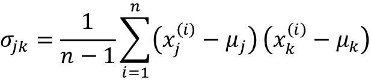
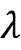
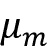
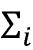

<title>Chapter_5</title> <link href="../Styles/epub.css" rel="stylesheet" type="text/css"> <link href="../Styles/syntax-highlighting.css" rel="stylesheet" type="text/css">

# five

# 通过降维压缩数据

在*第 4 章*、*构建良好的训练数据集——数据预处理*中，您了解了使用不同的特征选择技术来降低数据集维度的不同方法。另一种针对维度缩减的特征选择方法是**特征提取**。在本章中，您将学习两种基本技术，通过将数据集转换到一个比原始特征子空间维数更低的新特征子空间，帮助您总结数据集的信息内容。数据压缩是机器学习中的一个重要主题，它帮助我们存储和分析在现代技术时代产生和收集的越来越多的数据。

在本章中，我们将讨论以下主题:

*   无监督数据压缩的主成分分析
*   线性判别分析作为监督降维技术最大化类别可分性
*   数据可视化中的非线性降维技术和 t-分布随机近邻嵌入技术概述

# 基于主成分分析的无监督降维

类似于特征选择，我们可以使用不同的特征提取技术来减少数据集中的特征数量。特征选择和特征提取之间的区别在于，当我们使用特征选择算法时，如**顺序反向选择**等，我们保持原始特征，而使用特征提取将数据转换或投影到新的特征空间。

在降维的背景下，特征提取可以理解为一种数据压缩的方法，目标是保持大部分相关信息。在实践中，特征提取不仅用于提高存储空间或学习算法的计算效率，还可以通过减少维度的**诅咒来提高预测性能——尤其是在我们使用非正则化模型的情况下。**

## 主成分分析的主要步骤

在本节中，我们将讨论**主成分分析** ( **PCA** )，这是一种无监督的线性变换技术，广泛应用于不同领域，最突出的是用于特征提取和维度缩减。PCA 的其他流行应用包括探索性数据分析和股票市场交易中的信号去噪，以及生物信息学领域中的基因组数据和基因表达水平的分析。

PCA 帮助我们根据特征之间的相关性识别数据中的模式。简而言之，PCA 旨在找到高维数据中最大方差的方向，并将数据投影到一个新的子空间，该子空间的维数等于或小于原始子空间的维数。新子空间的正交轴(主分量)可以解释为最大方差的方向，假设新特征轴相互正交，如图 5.1 中的*所示:*


图 5.1:使用 PCA 寻找数据集中最大方差的方向

在*图 5.1* 中， *x* [1] 和*x*2 为原始特征轴， **PC 1** 和 **PC 2** 为主要部件。

如果我们使用 PCA 进行降维，我们将构建一个*d*×*k*-维变换矩阵 **W** ，这允许我们将训练示例的特征向量 **x** 映射到一个新的 *k* 维特征子空间上，该子空间比原始的 *d* 维特征空间具有更少的维数。例如，过程如下。假设我们有一个特征向量， **x** :


然后通过变换矩阵进行变换，:

**xW** = **z**

产生输出向量:


作为将原始的 *d* 维数据变换到这个新的 *k* 维子空间(通常是 *k* < < *d* )上的结果，第一主分量将具有最大可能的方差。在给定这些分量与其他主分量不相关(正交)的约束条件下，所有后续主分量将具有最大方差-即使输入要素相关，所得主分量也将相互正交(不相关)。请注意，PCA 方向对数据缩放高度敏感，如果在不同的尺度上测量特征，我们需要在 PCA 之前标准化特征，并且我们希望对所有特征赋予同等的重要性。

在更详细地查看用于降维的 PCA 算法之前，让我们用几个简单的步骤来总结该方法:

1.  标准化*维*维数据集。
2.  构建协方差矩阵。
3.  将协方差矩阵分解为其特征向量和特征值。
4.  按降序对特征值进行排序，对对应的特征向量进行排序。
5.  选择 *k* 个特征向量，对应 *k* 个最大特征值，其中 *k* 为新特征子空间的维数()。
6.  从“顶” *k* 特征向量构造一个投影矩阵 **W** 。
7.  利用投影矩阵 **W** 对 *d* 维输入数据集 **X** 进行变换，得到新的 *k* 维特征子空间。

在接下来的几节中，我们将使用 Python 一步一步地执行 PCA，作为学习练习。然后，我们将看到如何使用 scikit-learn 更方便地执行 PCA。

**特征分解:将矩阵分解成特征向量和特征值**

特征分解，将方阵的分解成所谓的**特征值**和**特征向量**，是本节中描述的 PCA 过程的核心。

协方差矩阵是方阵的一个特例:它是一个对称矩阵，这意味着矩阵等于它的转置， *A* = *A* ^T 。

当我们分解这样的对称矩阵时，特征值是实数(而不是复数)，特征向量是相互正交(垂直)的。此外，特征值和特征向量成对出现。如果我们将协方差矩阵分解为其特征向量和特征值，与最高特征值相关联的特征向量对应于数据集中最大方差的方向。在这里，这个“方向”是数据集的要素列的线性变换。

虽然关于特征值和特征向量的更详细的讨论超出了本书的范围，但是可以在 https://en.wikipedia.org/wiki/Eigenvalues_and_eigenvectors 的[的维基百科上找到关于附加资源的相对全面的处理。](https://en.wikipedia.org/wiki/Eigenvalues_and_eigenvectors)

## 逐步提取主成分

在本小节中，我们将讨论 PCA 的前四个步骤:

1.  标准化数据
2.  构建协方差矩阵
3.  获取协方差矩阵的特征值和特征向量
4.  按降序对特征值排序，对特征向量进行排序

首先，我们将开始加载我们在*第 4 章*、*中使用的葡萄酒数据集，构建良好的训练数据集——数据预处理*:

```
>>> import pandas as pd

>>> df_wine = pd.read_csv(

...     'https://archive.ics.uci.edu/ml/'

...     'machine-learning-databases/wine/wine.data',

...     header=None

... ) 
```

**获取葡萄酒数据集**

你可以在本书的代码包中找到葡萄酒数据集(以及本书中使用的所有其他数据集)的副本，如果你离线工作或者位于[https://archive . ics . UCI . edu/ml/machine-learning-databases/Wine/Wine . data](https://archive.ics.uci.edu/ml/machine-learning-databases/wine/wine.data)的 UCI 服务器暂时不可用，你可以使用它。例如，要从本地目录加载葡萄酒数据集，可以替换以下行:

```
df = pd.read_csv(

    'https://archive.ics.uci.edu/ml/'

    'machine-learning-databases/wine/wine.data',

    header=None

) 
```

有了这些:

```
df = pd.read_csv(

    'your/local/path/to/wine.data',

    header=None

) 
```

接下来，我们将分别使用 70%和 30%的数据，将葡萄酒数据处理为单独的训练和测试数据集，并将其标准化为单位方差:

```
>>> from sklearn.model_selection import train_test_split

>>> X, y = df_wine.iloc[:, 1:].values, df_wine.iloc[:, 0].values

>>> X_train, X_test, y_train, y_test = \

...     train_test_split(X, y, test_size=0.3,

...                      stratify=y,

...                      random_state=0)

>>> # standardize the features

>>> from sklearn.preprocessing import StandardScaler

>>> sc = StandardScaler()

>>> X_train_std = sc.fit_transform(X_train)

>>> X_test_std = sc.transform(X_test) 
```

通过执行前面的代码完成强制预处理后，我们前进到第二步:构造协方差矩阵。对称的 *d* × *d* 维协方差矩阵存储不同特征之间的成对协方差，其中 *d* 是数据集中的维数。例如，两个特征之间的协方差， *x* [j] 和 *x* [k] 在群体水平上可以通过以下等式来计算:



这里，和分别是特征 *j* 和 *k* 的样本均值。请注意，如果我们标准化数据集，样本均值为零。两个要素之间的正协方差表示要素一起增加或减少，而负协方差表示要素以相反的方向变化。例如，三个特征的协方差矩阵可以写成如下形式(注意是希腊大写字母 sigma，不要与求和符号混淆):


协方差矩阵的特征向量代表主要分量(最大方差的方向)，而相应的特征值将定义它们的大小。在葡萄酒数据集的情况下，我们将从 13×13 维协方差矩阵中获得 13 个特征向量和特征值。

现在，对于我们的第三步，让我们获得协方差矩阵的特征对。如果你上过线性代数课，你可能已经知道特征向量 **v** 满足以下条件:


这里，是标量:特征值。由于手动计算特征向量和特征值是一项有些繁琐和复杂的任务，我们将使用 NumPy 的`linalg.eig`函数来获得葡萄酒协方差矩阵的特征对:

```
>>> import numpy as np

>>> cov_mat = np.cov(X_train_std.T)

>>> eigen_vals, eigen_vecs = np.linalg.eig(cov_mat)

>>> print('\nEigenvalues \n', eigen_vals)

Eigenvalues

[ 4.84274532  2.41602459  1.54845825  0.96120438  0.84166161

  0.6620634   0.51828472  0.34650377  0.3131368   0.10754642

  0.21357215  0.15362835  0.1808613 ] 
```

使用`numpy.cov`函数，我们计算了标准化训练数据集的协方差矩阵。使用`linalg.eig`函数，我们执行了特征分解，产生了一个向量(`eigen_vals`)，该向量由 13 个特征值和相应的特征向量组成，以列的形式存储在 13×13 维矩阵(`eigen_vecs`)中。

**NumPy 中的特征分解**

`numpy.linalg.eig`函数设计用于对称和非对称方形矩阵。但是，您可能会发现，在某些情况下，它会返回复杂的特征值。

一个相关的函数`numpy.linalg.eigh`已经被实现来分解 Hermetian 矩阵，这是一种数值上更稳定的处理对称矩阵(如协方差矩阵)的方法；`numpy.linalg.eigh`总是返回实特征值。

## 总差异和解释差异

由于我们希望通过将数据集压缩到一个新的特征子空间来降低数据集的维数，因此我们只选择包含大部分信息(方差)的特征向量(主成分)的子集。特征值定义了特征向量的大小，所以我们要把特征值按大小递减排序；我们感兴趣的是基于其相应特征值的值的前 *k* 个特征向量。但是在我们收集那些 *k* 最有信息的特征向量之前，让我们画出特征值的**方差解释比率**。特征值的方差解释比率就是特征值的分数和特征值的总和:


使用 NumPy `cumsum`函数，我们可以计算解释方差的累积和，然后通过 Matplotlib 的`step`函数绘制:

```
>>> tot = sum(eigen_vals)

>>> var_exp = [(i / tot) for i in

...            sorted(eigen_vals, reverse=True)]

>>> cum_var_exp = np.cumsum(var_exp)

>>> import matplotlib.pyplot as plt

>>> plt.bar(range(1,14), var_exp, align='center',

...         label='Individual explained variance')

>>> plt.step(range(1,14), cum_var_exp, where='mid',

...          label='Cumulative explained variance')

>>> plt.ylabel('Explained variance ratio')

>>> plt.xlabel('Principal component index')

>>> plt.legend(loc='best')

>>> plt.tight_layout()

>>> plt.show() 
```

结果图表明，仅第一主成分就占了方差的大约 40%。

此外，我们可以看到前两个主成分加起来解释了数据集中几乎 60%的差异:


图 5.2:主成分占总方差的比例

虽然解释的方差图提醒我们在*第 4 章*、*构建良好的训练数据集-数据预处理*中计算的特征重要性值，但是通过随机森林，我们应该提醒自己 PCA 是一种无监督的方法，这意味着关于类标签的信息被忽略。随机森林使用类成员信息来计算结点杂质，而方差测量值沿要素轴的分布。

## 特征转换

既然我们已经成功地将协方差矩阵分解成特征对，让我们继续最后三个步骤，将葡萄酒数据集转换到新的主成分轴上。我们将在本节中处理的其余步骤如下:

1.  选择 *k* 个特征向量，对应 *k* 个最大特征值，其中 *k* 为新特征子空间的维数()。
2.  从“顶” *k* 特征向量构造一个投影矩阵 **W** 。
3.  利用投影矩阵 **W** 对 *d* 维输入数据集 **X** 进行变换，得到新的 *k* 维特征子空间。

或者，用不太专业的术语来说，我们将按照特征值的降序对特征对进行排序，从选择的特征向量中构造一个投影矩阵，并使用投影矩阵将数据变换到更低维的子空间上。

我们首先按照特征值的降序对特征对进行排序:

```
>>> # Make a list of (eigenvalue, eigenvector) tuples

>>> eigen_pairs = [(np.abs(eigen_vals[i]), eigen_vecs[:, i])

...                 for i in range(len(eigen_vals))]

>>> # Sort the (eigenvalue, eigenvector) tuples from high to low

>>> eigen_pairs.sort(key=lambda k: k[0], reverse=True) 
```

接下来，我们收集对应于两个最大特征值的两个特征向量，以获取该数据集中约 60%的方差。请注意，出于说明的目的，选择了两个特征向量，因为我们将在本小节稍后通过二维散点图绘制数据。在实践中，主成分的数量必须通过计算效率和分类器性能之间的权衡来确定:

```
>>> w = np.hstack((eigen_pairs[0][1][:, np.newaxis],

...                eigen_pairs[1][1][:, np.newaxis]))

>>> print('Matrix W:\n', w)

Matrix W:

[[-0.13724218   0.50303478]

 [ 0.24724326   0.16487119]

 [-0.02545159   0.24456476]

 [ 0.20694508  -0.11352904]

 [-0.15436582   0.28974518]

 [-0.39376952   0.05080104]

 [-0.41735106  -0.02287338]

 [ 0.30572896   0.09048885]

 [-0.30668347   0.00835233]

 [ 0.07554066   0.54977581]

 [-0.32613263  -0.20716433]

 [-0.36861022  -0.24902536]

 [-0.29669651   0.38022942]] 
```

通过执行前面的代码，我们已经从顶部的两个特征向量创建了一个 13×2 维的投影矩阵 **W** 。

**镜像投影**

根据你使用的 NumPy 和 LAPACK 的版本，你可能会得到矩阵 **W** ，它的符号被翻转了。请注意，这不是问题；如果 **v** 是矩阵的特征向量，则我们有:


这里， **v** 是特征向量，而——**v**也是特征向量，我们可以表示如下。利用基本代数，我们可以将方程的两边都乘以一个标量，:


由于矩阵乘法与标量乘法相关，因此我们可以将其重新排列如下:


现在，我们可以看到，是一个具有相同特征值的特征向量，，对于和。因此， **v** 和—**v**都是特征向量。

使用投影矩阵，我们现在可以将示例 **x** (表示为 13 维行向量)变换到 PCA 子空间(主分量 1 和 2)上，获得**x**’，现在是由两个新特征组成的二维示例向量:

**x**' =**xW**

```
>>> X_train_std[0].dot(w)

array([ 2.38299011,  0.45458499]) 
```

类似地，我们可以通过计算矩阵点积将整个 124×13 维训练数据集转换到两个主分量上:

**X**' =**XW**

```
>>> X_train_pca = X_train_std.dot(w) 
```

最后，让我们在二维散点图中可视化转换后的葡萄酒训练数据集，现在存储为 124×2 维矩阵:

```
>>> colors = ['r', 'b', 'g']

>>> markers = ['o', 's', '^']

>>> for l, c, m in zip(np.unique(y_train), colors, markers):

...     plt.scatter(X_train_pca[y_train==l, 0],

...                 X_train_pca[y_train==l, 1],

...                 c=c, label=f'Class {l}', marker=m)

>>> plt.xlabel('PC 1')

>>> plt.ylabel('PC 2')

>>> plt.legend(loc='lower left')

>>> plt.tight_layout()

>>> plt.show() 
```

正如我们在*图 5.3* 中看到的，数据更多地沿着第一主成分( *x* 轴)而不是第二主成分( *y* 轴)分布，这与我们在上一小节中创建的解释方差比图一致。然而，我们可以看出，线性分类器可能能够很好地区分这些类别:


图 5.3:葡萄酒数据集的数据记录通过主成分分析投影到 2D 特征空间

尽管我们在前面的散点图中为了说明的目的对类别标签信息进行了编码，但我们必须记住，PCA 是一种不使用任何类别标签信息的无监督技术。

## scikit-learn 中的主成分分析

尽管前面的小节中的详细方法帮助我们理解了 PCA 的内部工作原理，但我们现在将讨论如何使用 scikit-learn 中实现的`PCA`类。

`PCA`类是 scikit-learn 的另一个 transformer 类，在使用相同的模型参数转换训练数据和测试数据集之前，我们首先使用训练数据拟合模型。现在，让我们在葡萄酒训练数据集上使用来自 scikit-learn 的`PCA`类，通过逻辑回归对转换后的示例进行分类，并通过我们在*第 2 章*、*中定义的`plot_decision_regions`函数可视化决策区域，为分类*训练简单的机器学习算法:

```
from matplotlib.colors import ListedColormap

def plot_decision_regions(X, y, classifier, test_idx=None, resolution=0.02):

    # setup marker generator and color map

    markers = ('o', 's', '^', 'v', '<')

    colors = ('red', 'blue', 'lightgreen', 'gray', 'cyan')

    cmap = ListedColormap(colors[:len(np.unique(y))])

    # plot the decision surface

    x1_min, x1_max = X[:, 0].min() - 1, X[:, 0].max() + 1

    x2_min, x2_max = X[:, 1].min() - 1, X[:, 1].max() + 1

    xx1, xx2 = np.meshgrid(np.arange(x1_min, x1_max, resolution),

                           np.arange(x2_min, x2_max, resolution))

    lab = classifier.predict(np.array([xx1.ravel(), xx2.ravel()]).T)

    lab = lab.reshape(xx1.shape)

    plt.contourf(xx1, xx2, lab, alpha=0.3, cmap=cmap)

    plt.xlim(xx1.min(), xx1.max())

    plt.ylim(xx2.min(), xx2.max())

    # plot class examples

    for idx, cl in enumerate(np.unique(y)):

        plt.scatter(x=X[y == cl, 0],

                    y=X[y == cl, 1],

                    alpha=0.8,

                    c=colors[idx],

                    marker=markers[idx],

                    label=f'Class {cl}',

                    edgecolor='black') 
```

为了方便起见，您可以将前面的`plot_decision_regions`代码放在当前工作目录下的一个单独的代码文件中，例如`plot_decision_regions_script.py`，并将其导入到当前的 Python 会话中:

```
>>> from sklearn.linear_model import LogisticRegression

>>> from sklearn.decomposition import PCA

>>> # initializing the PCA transformer and

>>> # logistic regression estimator:

>>> pca = PCA(n_components=2)

>>> lr = LogisticRegression(multi_class='ovr',

...                         random_state=1,

...                         solver='lbfgs')

>>> # dimensionality reduction:

>>> X_train_pca = pca.fit_transform(X_train_std)

>>> X_test_pca = pca.transform(X_test_std)

>>> # fitting the logistic regression model on the reduced dataset:

>>> lr.fit(X_train_pca, y_train)

>>> plot_decision_regions(X_train_pca, y_train, classifier=lr)

>>> plt.xlabel('PC 1')

>>> plt.ylabel('PC 2')

>>> plt.legend(loc='lower left')

>>> plt.tight_layout()

>>> plt.show() 
```

通过执行这个代码，我们现在应该看到训练数据的决策区域减少到两个主分量轴:


图 5.4:使用 scikit-learn 的 PCA 进行降维后的训练示例和逻辑回归决策区域

当我们通过 scikit-learn 将 PCA 投影与我们自己的 PCA 实现进行比较时，我们可能会看到得到的图是彼此的镜像。请注意，这不是由于这两个实现中的任何一个出现了错误；这种差异的原因是，根据本征解算器，本征向量可以有负号或正号。

这并不重要，但是如果我们愿意，我们可以通过将数据乘以-1 来恢复镜像；注意，特征向量通常被缩放到单位长度 1。为了完整起见，让我们在转换的测试数据集上绘制逻辑回归的决策区域，看看它是否能很好地分离类:

```
>>> plot_decision_regions(X_test_pca, y_test, classifier=lr)

>>> plt.xlabel('PC 1')

>>> plt.ylabel('PC 2')

>>> plt.legend(loc='lower left')

>>> plt.tight_layout()

>>> plt.show() 
```

在我们通过执行前面的代码为测试数据集绘制决策区域之后，我们可以看到，逻辑回归在这个小的二维特征子空间上表现得相当好，并且仅错误分类了测试数据集中的几个示例:


图 5.5:在基于 PCA 的特征空间中用逻辑回归决策区域测试数据点

如果我们对不同主成分的解释方差比率感兴趣，我们可以简单地初始化`PCA`类，将`n_components`参数设置为`None`，这样所有主成分被保留，然后可以通过`explained_variance_ratio_`属性访问解释方差比率:

```
>>> pca = PCA(n_components=None)

>>> X_train_pca = pca.fit_transform(X_train_std)

>>> pca.explained_variance_ratio_

array([ 0.36951469, 0.18434927, 0.11815159, 0.07334252,

        0.06422108, 0.05051724, 0.03954654, 0.02643918,

        0.02389319, 0.01629614, 0.01380021, 0.01172226,

        0.00820609]) 
```

注意，当我们初始化`PCA`类时，我们设置了`n_components=None`,这样它将按照排序的顺序返回所有主成分，而不是执行维度缩减。

## 评估特征贡献

在这一部分，我们将简单看一下如何评估原始特征对主要成分的贡献。正如我们所学的，通过 PCA，我们创建了代表特征线性组合的主成分。有时，我们有兴趣知道每个原始特征对给定主成分的贡献有多大。这些贡献通常被称为**负载**。

可以通过用特征值的平方根缩放特征向量来计算因子负载。然后可以将结果值解释为原始特征和主成分之间的相关性。为了说明这一点，让我们画出第一主分量的载荷。

首先，我们通过将特征向量乘以特征值的平方根来计算 13×13 维负载矩阵:

```
>>> loadings = eigen_vecs * np.sqrt(eigen_vals) 
```

然后，我们绘制第一主成分`loadings[:, 0]`的载荷，这是该矩阵的第一列:

```
>>> fig, ax = plt.subplots()

>>> ax.bar(range(13), loadings[:, 0], align='center')

>>> ax.set_ylabel('Loadings for PC 1')

>>> ax.set_xticks(range(13))

>>> ax.set_xticklabels(df_wine.columns[1:], rotation=90)

>>> plt.ylim([-1, 1])

>>> plt.tight_layout()

>>> plt.show() 
```

在*图 5.6* 中，我们可以看到，例如**酒精**与第一主成分负相关(约-0.3)，而**苹果酸**正相关(约 0.54)。请注意，值 1 表示完全正相关，而值–1 对应完全负相关:


图 5.6:第一主成分的特征相关性

在前面的代码示例中，我们为自己的 PCA 实现计算了因子负载。我们可以以类似的方式从拟合的 scikit-learn PCA 对象获得负载，其中`pca.components_`表示特征向量，而`pca.explained_variance_`表示特征值:

```
>>> sklearn_loadings = pca.components_.T * np.sqrt(pca.explained_variance_) 
```

为了将 scikit-learn PCA 加载量与我们之前创建的加载量进行比较，让我们创建一个类似的条形图:

```
>>> fig, ax = plt.subplots()

>>> ax.bar(range(13), sklearn_loadings[:, 0], align='center')

>>> ax.set_ylabel('Loadings for PC 1')

>>> ax.set_xticks(range(13))

>>> ax.set_xticklabels(df_wine.columns[1:], rotation=90)

>>> plt.ylim([-1, 1])

>>> plt.tight_layout()

>>> plt.show() 
```

正如我们所见，条形图看起来是一样的:


图 5.7:使用 scikit-learn 的第一主成分的特征相关性

在探索了 PCA 作为一种无监督的特征提取技术之后，下一节将介绍**线性判别分析** ( **LDA** )，这是一种考虑了类别标签信息的线性变换技术。

# 基于线性判别分析的监督数据压缩

LDA 可以用作特征提取的技术，以提高计算效率并降低由于非正则化模型中的维数灾难而导致的过拟合程度。LDA 背后的一般概念非常类似于 PCA，但是 PCA 试图在数据集中找到最大方差的正交分量轴，而 LDA 的目标是找到优化类可分性的特征子空间。在接下来的部分中，我们将更详细地讨论 LDA 和 PCA 之间的相似之处，并一步步地介绍 LDA 方法。

## 主成分分析与线性判别分析

PCA 和 LDA 都是*线性变换技术*，可以用于减少数据集中的维数；前者是无监督的算法，而后者是有监督的。因此，我们可能会认为，与 PCA 相比，LDA 是一种更好的用于分类任务的特征提取技术。然而，A.M. Martinez 报告说，在某些情况下，例如，如果每个类别仅由少量的例子组成，则经由 PCA 的预处理倾向于在图像识别任务中产生更好的分类结果(A. M. Martinez 和 a . c . Kak*， *IEEE 模式分析和机器智能汇刊*，23(2): 228-233，2001)。*

**费希尔 LDA**

LDA 有时也被称为费希尔的 LDA(T2)。罗纳德·a·费希尔(Ronald A. Fisher)于 1936 年首次为两类分类问题制定了*费希尔线性判别式*(*分类问题中多重测量的使用*，*r·a·费希尔*，*优生学年鉴*，7(2): 179-188，1936)。1948 年，C. Radhakrishna Rao 在等类协方差和正态分布类的假设下将 Fisher 线性判别式推广到多类问题，我们现在称之为 LDA(*c . r . Rao*、*皇家统计学会杂志*在生物分类问题中利用多重测量)。系列 B(方法论)，10(2): 159-203，1948)。

*图 5.8* 总结了两类问题的 LDA 概念。类别 1 中的示例显示为圆圈，类别 2 中的示例显示为十字:


图 5.8:两类问题的 LDA 概念

线性判别式，如在 *x* 轴( *LD 1* )上显示的，将很好地分离两个正态分布类。尽管在 *y* 轴( *LD 2* 上示出的示例性线性判别式捕获了数据集中的大量方差，但是它作为良好的线性判别式是失败的，因为它没有捕获任何类别区分信息。

LDA 中的一个假设是数据呈正态分布。此外，我们假设类别具有相同的协方差矩阵，并且训练示例在统计上彼此独立。然而，即使这些假设中的一个或多个被(轻微地)违反，用于降维的 LDA 仍然可以相当好地工作(*模式分类第二版*作者 *R. O .杜达*、 *P. E .哈特*和 *D. G .斯托克*、*纽约*，2001)。

## 线性判别分析的内部工作原理

在我们深入研究代码实现之前，让我们简要总结一下执行 LDA 所需的主要步骤:

1.  标准化 *d* 维数据集( *d* 是特征的数量)。
2.  对于每个类别，计算 *d* 维平均向量。
3.  构造类间散布矩阵， **S** [B] ，类内散布矩阵， **S** [W] 。
4.  计算矩阵的特征向量和对应的特征值，。
5.  按降序对特征值进行排序，对对应的特征向量进行排序。
6.  选择 *k* 个最大特征值对应的 *k* 个特征向量，构造一个*d*×*k*-维变换矩阵，**W**；特征向量是这个矩阵的列。
7.  使用变换矩阵 **W** 将示例投影到新的特征子空间上。

正如我们所见，LDA 与 PCA 非常相似，我们将矩阵分解为特征值和特征向量，这将形成新的低维特征空间。然而，如前所述，LDA 考虑了类别标签信息，该信息以在*步骤 2* 中计算的均值向量的形式表示。在接下来的部分中，我们将更详细地讨论这七个步骤，并附有说明性的代码实现。

## 计算散布矩阵

由于我们已经在本章开始的 PCA 部分标准化了葡萄酒数据集的特征，我们可以跳过第一步，继续计算均值向量，我们将使用均值向量分别构建类内散布矩阵和类间散布矩阵。每个平均向量**m**I 存储关于类别 *i* 的示例的平均特征值:


这导致三个平均向量:


这些平均向量可以通过以下代码来计算，其中我们为三个标签中的每一个计算一个平均向量:

```
>>> np.set_printoptions(precision=4)

>>> mean_vecs = []

>>> for label in range(1,4):

...     mean_vecs.append(np.mean(

...                X_train_std[y_train==label], axis=0))

...     print(f'MV {label}: {mean_vecs[label - 1]}\n')

MV 1: [ 0.9066  -0.3497  0.3201  -0.7189  0.5056  0.8807  0.9589  -0.5516

0.5416  0.2338  0.5897  0.6563  1.2075]

MV 2: [-0.8749  -0.2848  -0.3735  0.3157  -0.3848  -0.0433  0.0635  -0.0946

0.0703  -0.8286  0.3144  0.3608  -0.7253]

MV 3: [ 0.1992  0.866  0.1682  0.4148  -0.0451  -1.0286  -1.2876  0.8287

-0.7795  0.9649  -1.209  -1.3622  -0.4013] 
```

使用平均向量，我们现在可以计算类内散布矩阵， **S** [W] :


这是通过对每个个体类别 *i* 的个体散布矩阵 **S** [i] 求和来计算的:


```
>>> d = 13 # number of features

>>> S_W = np.zeros((d, d))

>>> for label, mv in zip(range(1, 4), mean_vecs):

...     class_scatter = np.zeros((d, d))

...     for row in X_train_std[y_train == label]:

...         row, mv = row.reshape(d, 1), mv.reshape(d, 1)

...         class_scatter += (row - mv).dot((row - mv).T)

...     S_W += class_scatter

>>> print('Within-class scatter matrix: '

...       f'{S_W.shape[0]}x{S_W.shape[1]}')

Within-class scatter matrix: 13x13 
```

我们在计算散布矩阵时所做的假设是训练数据集中的类别标签是均匀分布的。然而，如果我们打印类别标签的数量，我们会发现这一假设被违反了:

```
>>> print('Class label distribution:',

...       np.bincount(y_train)[1:])

Class label distribution: [41 50 33] 
```

因此，在我们将它们汇总为散布矩阵 **S** [W] 之前，我们想要缩放单独的散布矩阵 **S** [i] 。当我们将散布矩阵除以类别示例的数量时， *n* [i] ，我们可以看到，计算散布矩阵实际上与计算协方差矩阵相同，—协方差矩阵是散布矩阵的归一化版本:


用于计算缩放的类内散布矩阵的代码如下:

```
>>> d = 13 # number of features

>>> S_W = np.zeros((d, d))

>>> for label,mv in zip(range(1, 4), mean_vecs):

...     class_scatter = np.cov(X_train_std[y_train==label].T)

...     S_W += class_scatter

>>> print('Scaled within-class scatter matrix: '

...       f'{S_W.shape[0]}x{S_W.shape[1]}')

Scaled within-class scatter matrix: 13x13 
```

在我们计算了定标的类内散布矩阵(或协方差矩阵)之后，我们可以继续下一步，计算类间散布矩阵**S**B:


这里， **m** 是计算的总体平均值，包括所有 **c** 类的示例:

```
>>> mean_overall = np.mean(X_train_std, axis=0)

>>> mean_overall = mean_overall.reshape(d, 1)

>>> d = 13 # number of features

>>> S_B = np.zeros((d, d))

>>> for i, mean_vec in enumerate(mean_vecs):

...     n = X_train_std[y_train == i + 1, :].shape[0]

...     mean_vec = mean_vec.reshape(d, 1) # make column vector

...     S_B += n * (mean_vec - mean_overall).dot(

...     (mean_vec - mean_overall).T)

>>> print('Between-class scatter matrix: '

...       f'{S_B.shape[0]}x{S_B.shape[1]}')

Between-class scatter matrix: 13x13 
```

## 为新的特征子空间选择线性判别式

LDA 的其余步骤类似于 PCA 的步骤。然而，我们不是对协方差矩阵进行特征分解，而是求解矩阵的广义特征值问题，:

```
>>> eigen_vals, eigen_vecs =\

...     np.linalg.eig(np.linalg.inv(S_W).dot(S_B)) 
```

计算出特征对后，我们可以按降序对特征值进行排序:

```
>>> eigen_pairs = [(np.abs(eigen_vals[i]), eigen_vecs[:,i])

...                for i in range(len(eigen_vals))]

>>> eigen_pairs = sorted(eigen_pairs,

...               key=lambda k: k[0], reverse=True)

>>> print('Eigenvalues in descending order:\n')

>>> for eigen_val in eigen_pairs:

...     print(eigen_val[0])

Eigenvalues in descending order:

349.617808906

172.76152219

3.78531345125e-14

2.11739844822e-14

1.51646188942e-14

1.51646188942e-14

1.35795671405e-14

1.35795671405e-14

7.58776037165e-15

5.90603998447e-15

5.90603998447e-15

2.25644197857e-15

0.0 
```

在 LDA 中，线性判别式的数量最多为*c*–1，其中 *c* 是类别标签的数量，因为中间散布矩阵**S**B 是秩为 1 或更小的 *c* 矩阵的总和。我们确实可以看到，我们只有两个非零特征值(特征值 3-13 并不完全为零，但这是由于 NumPy 中的浮点运算。)

**共线性**

请注意，在完美共线性的罕见情况下(所有对齐的示例点落在一条直线上)，协方差矩阵的秩为 1，这将导致只有一个具有非零特征值的特征向量。

为了测量线性判别式(特征向量)捕获了多少类别区分信息，让我们通过减少特征值来绘制线性判别式，类似于我们在 PCA 部分创建的解释方差图。为简单起见，我们将阶级歧视信息的内容称为**可辨别性**:

```
>>> tot = sum(eigen_vals.real)

>>> discr = [(i / tot) for i in sorted(eigen_vals.real,

...                                    reverse=True)]

>>> cum_discr = np.cumsum(discr)

>>> plt.bar(range(1, 14), discr, align='center',

...         label='Individual discriminability')

>>> plt.step(range(1, 14), cum_discr, where='mid',

...          label='Cumulative discriminability')

>>> plt.ylabel('"Discriminability" ratio')

>>> plt.xlabel('Linear Discriminants')

>>> plt.ylim([-0.1, 1.1])

>>> plt.legend(loc='best')

>>> plt.tight_layout()

>>> plt.show() 
```

正如我们在*图 5.9* 中看到的，仅前两个线性判别式就捕获了葡萄酒训练数据集中 100%的有用信息:


图 5.9:前两个判别式捕获了 100%的有用信息

现在让我们堆叠两个最有区别的特征向量列来创建转换矩阵， **W** :

```
>>> w = np.hstack((eigen_pairs[0][1][:, np.newaxis].real,

...                eigen_pairs[1][1][:, np.newaxis].real))

>>> print('Matrix W:\n', w)

Matrix W:

 [[-0.1481  -0.4092]

  [ 0.0908  -0.1577]

  [-0.0168  -0.3537]

  [ 0.1484   0.3223]

  [-0.0163  -0.0817]

  [ 0.1913   0.0842]

  [-0.7338   0.2823]

  [-0.075   -0.0102]

  [ 0.0018   0.0907]

  [ 0.294   -0.2152]

  [-0.0328   0.2747]

  [-0.3547  -0.0124]

  [-0.3915  -0.5958]] 
```

## 将示例投影到新的特征空间

使用我们在上一小节中创建的变换矩阵W，我们现在可以通过将这些矩阵相乘来变换训练数据集:

**X**' =**XW**

```
>>> X_train_lda = X_train_std.dot(w)

>>> colors = ['r', 'b', 'g']

>>> markers = ['o', 's', '^']

>>> for l, c, m in zip(np.unique(y_train), colors, markers):

...     plt.scatter(X_train_lda[y_train==l, 0],

...                 X_train_lda[y_train==l, 1] * (-1),

...                 c=c, label= f'Class {l}', marker=m)

>>> plt.xlabel('LD 1')

>>> plt.ylabel('LD 2')

>>> plt.legend(loc='lower right')

>>> plt.tight_layout()

>>> plt.show() 
```

正如我们在*图 5.10* 中看到的，三个葡萄酒类别现在在新的特征子空间中完全线性分离:


图 5.10:将数据投射到前两个判别式后，葡萄酒类别完全可分

## LDA via scikit-learn

这一步一步的实施对理解 LDA 的内部工作以及理解 LDA 和 PCA 之间的区别是一个很好的练习。现在，让我们看看 scikit-learn 中实现的`LDA`类:

```
>>> # the following import statement is one line

>>> from sklearn.discriminant_analysis import LinearDiscriminantAnalysis as LDA

>>> lda = LDA(n_components=2)

>>> X_train_lda = lda.fit_transform(X_train_std, y_train) 
```

接下来，让我们看看逻辑回归分类器如何处理 LDA 转换后的低维训练数据集:

```
>>> lr = LogisticRegression(multi_class='ovr', random_state=1,

...                         solver='lbfgs')

>>> lr = lr.fit(X_train_lda, y_train)

>>> plot_decision_regions(X_train_lda, y_train, classifier=lr)

>>> plt.xlabel('LD 1')

>>> plt.ylabel('LD 2')

>>> plt.legend(loc='lower left')

>>> plt.tight_layout()

>>> plt.show() 
```

查看*图 5.11* ，我们可以看到逻辑回归模型错误分类了类别 2 中的一个示例:


图 5.11:逻辑回归模型错误分类了一个类别

通过降低正则化强度，我们可以可能移动决策边界，以便逻辑回归模型正确分类训练数据集中的所有示例。然而，更重要的是，让我们看看测试数据集上的结果:

```
>>> X_test_lda = lda.transform(X_test_std)

>>> plot_decision_regions(X_test_lda, y_test, classifier=lr)

>>> plt.xlabel('LD 1')

>>> plt.ylabel('LD 2')

>>> plt.legend(loc='lower left')

>>> plt.tight_layout()

>>> plt.show() 
```

正如我们在*图 5.12* 中看到的，逻辑回归分类器仅通过使用二维特征子空间，而不是最初的 13 个葡萄酒特征，就能够获得对测试数据集中的样本进行分类的完美准确度分数:


图 5.12:逻辑回归模型在测试数据上完美地工作

# 非线性降维与可视化

在上一节中，我们介绍了用于特征提取的线性变换技术，如 PCA 和 LDA。在这一节中，我们将讨论为什么考虑非线性降维技术是值得的。

一种特别值得强调的非线性降维技术是**t-分布式随机邻居嵌入** ( **t-SNE** )，因为它在文献中经常用于在二维或三维中可视化高维数据集。我们将看到如何应用 t-SNE 来绘制二维特征空间中的手写图像。

## 为什么要考虑非线性降维？

许多机器学习算法对输入数据的线性可分性做出假设。你已经知道感知器甚至需要完全线性可分的训练数据来收敛。到目前为止，我们已经讨论过的其他算法假设缺乏完美的线性可分性是由于噪声:Adaline、逻辑回归和(标准)SVM，仅举几个例子。

然而，如果我们处理的是非线性问题(在现实应用中可能会经常遇到)，线性变换降维技术(如 PCA 和 LDA)可能不是最佳选择:


图 5.13:线性和非线性问题的区别

scikit-learn 库实现了一系列先进的非线性降维技术，这超出了本书的范围。感兴趣的读者可以在[http://scikit-learn.org/stable/modules/manifold.html](http://scikit-learn.org/stable/modules/manifold.html)的 scikit-learn 中找到当前实现的概述，并辅以示例。

非线性降维技术的发展和应用通常也被称为流形学习，其中流形是指嵌入在高维空间中的低维拓扑空间。流形学习的算法必须捕获数据的复杂结构，以便将其投影到较低维度的空间，在该空间中，数据点之间的关系得以保留。

流形学习的一个经典例子是在*图 5.14* 中展示的三维瑞士卷:


图 5.14:三维瑞士卷投影到一个较低的二维空间

虽然非线性维度缩减和流形学习算法非常强大，但我们应该注意到，这些技术是出了名的难以使用，并且在非理想超参数选择的情况下，它们可能弊大于利。这种困难背后的原因是，我们经常处理高维数据集，这些数据集不容易可视化，结构也不明显(不像*图 5.14* 中的瑞士卷示例)。此外，除非我们将数据集投影到二维或三维空间(这通常不足以捕捉更复杂的关系)，否则很难甚至不可能评估结果的质量。因此，许多人仍然依赖于更简单的技术，如 PCA 和 LDA 进行降维。

## 通过 t 分布随机邻居嵌入可视化数据

在介绍了非线性降维并讨论了它的一些挑战之后，让我们来看一个涉及 t-SNE 的实际例子，它通常用于在二维或三维中可视化复杂的数据集。

简而言之，t-SNE 是基于高维(原始)特征空间中的成对距离来建模数据点的。然后，它在新的低维空间中找到接近原始空间中成对距离的概率分布的成对距离的概率分布。或者，换句话说，t-SNE 学会将数据点嵌入到低维空间中，从而保留原始空间中的成对距离。你可以在 2018 年*马阿滕和辛顿的《机器学习研究杂志*([https://www . jmlr . org/papers/volume 9/vandermaten 08 a/vandermaten 08 a . pdf](https://www.jmlr.org/papers/volume9/vandermaaten08a/vandermaaten08a.pdf))的原始研究论文*使用 t-SNE* 可视化数据中找到关于这种方法的更多细节。然而，正如研究论文标题所示，t-SNE 是一种用于可视化目的的技术，因为它需要整个数据集进行投影。由于它直接投影点(与 PCA 不同，它不涉及投影矩阵)，我们不能将 t-SNE 应用于新的数据点。

以下代码快速演示了如何将 t-SNE 应用于 64 维数据集。首先，我们从 scikit-learn 加载 Digits 数据集，它由低分辨率手写数字(数字 0-9)组成:

```
>>> from sklearn.datasets import load_digits

>>> digits = load_digits() 
```

位是 8×8 灰度图像。以下代码绘制了数据集中的前四幅图像，该数据集中总共包含 1，797 幅图像:

```
>>> fig, ax = plt.subplots(1, 4)

>>> for i in range(4):

>>>     ax[i].imshow(digits.images[i], cmap='Greys')

>>> plt.show() 
```

正如我们在*图 5.15* 中看到的，图像的分辨率相对较低，为 8×8 像素(即每张图像 64 像素):


图 5.15:手写数字的低分辨率图像

请注意，`digits.data`属性让我们可以访问该数据集的表格版本，其中示例由行表示，列对应于像素:

```
>>> digits.data.shape

(1797, 64) 
```

接下来，让我们将特征(像素)分配给一个新变量`X_digits`，将标签分配给另一个新变量`y_digits`:

```
>>> y_digits = digits.target

>>> X_digits = digits.data 
```

然后，我们从 scikit-learn 导入 t-SNE 类，并安装一个新的`tsne`对象。使用`fit_transform`，我们一步完成 t-SNE 拟合和数据转换:

```
>>> from sklearn.manifold import TSNE

>>> tsne = TSNE(n_components=2, init='pca',

...             random_state=123)

>>> X_digits_tsne = tsne.fit_transform(X_digits) 
```

使用这个代码，我们将 64 维数据集投影到一个 2 维空间。我们指定了`init='pca'`，它使用 PCA 初始化 t-SNE 嵌入，正如在研究文章*中所建议的那样，初始化对于在 t-SNE 和 UMAP* 中保留全局数据结构至关重要，作者*科巴克*和*林德曼*，*自然生物技术第 39 卷*，第 156-157 页，2021([https://www.nature.com/articles/s41587-020-00809-z](https://www.nature.com/articles/s41587-020-00809-z))。

注意，t-SNE 包括额外的超参数，如困惑和学习率(通常称为**ε**)，我们在示例中省略了这些参数(我们使用 scikit-learn 默认值)。在实践中，我们建议您也研究这些参数。关于这些参数及其对结果影响的更多信息，可以在 2016 年*瓦滕伯格*、*维埃加斯*、*约翰逊*、*迪维*、[https://distill.pub/2016/misread-tsne/](https://distill.pub/2016/misread-tsne/)撰写的优秀文章*如何有效使用 t-SNE*中找到。

最后，让我们使用以下代码来可视化 2D t-SNE 嵌入:

```
>>> import matplotlib.patheffects as PathEffects

>>> def plot_projection(x, colors):

...     f = plt.figure(figsize=(8, 8))

...     ax = plt.subplot(aspect='equal')

...     for i in range(10):

...         plt.scatter(x[colors == i, 0],

...                     x[colors == i, 1])

...     for i in range(10):

...         xtext, ytext = np.median(x[colors == i, :], axis=0)

...         txt = ax.text(xtext, ytext, str(i), fontsize=24)

...         txt.set_path_effects([

...             PathEffects.Stroke(linewidth=5, foreground="w"),

...             PathEffects.Normal()])

>>> plot_projection(X_digits_tsne, y_digits)

>>> plt.show() 
```

像 PCA 一样，t-SNE 是一种无监督的方法，在前面的代码中，我们使用类标签`y_digits` (0-9)只是为了通过函数颜色参数实现可视化。Matplotlib 的`PathEffects`用于视觉目的，因此分类标签显示在属于每个相应数字的数据点的中心(通过`np.median`)。结果图如下所示:


图 5.16:t-SNE 如何在 2D 特征空间嵌入手写数字的可视化

正如我们所看到的，t-SNE 能够很好地分离不同的数字(类)，尽管并不完美。通过调整超参数，有可能实现更好的分离。然而，由于难以辨认的笔迹，一定程度的班级混合可能是不可避免的。例如，通过检查单个图像，我们可能会发现数字 3 的某些实例看起来确实像数字 9，等等。

**一致流形逼近和投影**

另一个流行的可视化技术是**均匀流形逼近和投影** ( **UMAP** )。虽然 UMAP 可以产生与 t-SNE 类似的好结果(例如，参见前面引用的科巴克和林德曼的论文)，但它通常更快，并且还可以用于投影新数据，这使得它作为机器学习环境中的降维技术更有吸引力，类似于 PCA。感兴趣的读者可以在原论文中找到更多关于 UMAP 的资料: *UMAP:一致流形逼近与降维投影*由*麦金尼斯、希利*和*梅尔维尔*、*2018*([https://arxiv.org/abs/1802.03426](https://arxiv.org/abs/1802.03426))。可以在[https://umap-learn . readthedocs . io](https://umap-learn.readthedocs.io)找到一个兼容 scikit-learn 的 UMAP 实现。**

 **# 摘要

在本章中，你学习了两种用于特征提取的基本降维技术:PCA 和 LDA。使用主成分分析，我们将数据投影到一个低维子空间，以最大化沿正交特征轴的方差，同时忽略类别标签。与 PCA 相反，LDA 是一种用于监督维数减少的技术，这意味着它考虑训练数据集中的类别信息，以尝试在线性特征空间中最大化类别可分性。最后，您还了解了 t-SNE，这是一种非线性特征提取技术，可用于可视化二维或三维数据。

有了 PCA 和 LDA 作为基本的数据预处理技术，您现在已经准备好在下一章中学习有效整合不同预处理技术和评估不同模型性能的最佳实践。

# 加入我们书的不和谐空间

加入该书的 Discord workspace，每月与作者进行一次*向我提问*会议:

[https://packt.link/MLwPyTorch](https://packt.link/MLwPyTorch)

**