<title>Chapter_6</title> <link href="../Styles/epub.css" rel="stylesheet" type="text/css"> <link href="../Styles/syntax-highlighting.css" rel="stylesheet" type="text/css">

# six

# 学习模型评估和超参数调整的最佳实践

在前面的章节中，我们学习了用于分类的基本机器学习算法，以及如何在将数据输入这些算法之前使数据成形。现在，是时候了解通过微调算法和评估模型性能来构建良好的机器学习模型的最佳实践了。在本章中，我们将学习如何执行以下操作:

*   评估机器学习模型的性能
*   诊断机器学习算法的常见问题
*   微调机器学习模型
*   使用不同的性能指标评估预测模型

# 通过管道简化工作流程

当我们在前面的章节中应用不同的预处理技术时，例如*第 4 章*、*构建良好的训练数据集——数据预处理*或*第 5 章*中用于数据压缩的主成分分析、*通过降维压缩数据*，您了解到我们必须重用在训练数据拟合期间获得的参数来缩放和压缩任何新数据，例如单独测试数据集中的示例。在本节中，您将了解到一个非常方便的工具，scikit-learn 中的`Pipeline`类。它允许我们拟合一个包含任意数量转换步骤的模型，并应用它对新数据进行预测。

## 加载乳腺癌威斯康星州数据集

在这一章中，我们将处理乳腺癌威斯康星州数据集，该数据集包含 569 个恶性和良性肿瘤细胞的例子。数据集中的前两列分别存储示例和相应诊断的唯一 ID 号(`M` =恶性，`B` =良性)。列 3-32 包含从细胞核的数字化图像中计算出的 30 个实值特征，这些特征可用于建立预测肿瘤是良性还是恶性的模型。乳腺癌威斯康辛数据集已经存放在 UCI 机器学习知识库中，关于这个数据集的更详细信息可以在[https://archive . ics . UCI . edu/ml/datasets/Breast+Cancer+Wisconsin+(Diagnostic)](https://archive.ics.uci.edu/ml/datasets/Breast+Cancer+Wisconsin+(Diagnostic))找到。

**获取乳腺癌威斯康星数据集**

你可以在本书的代码包中找到数据集(以及本书中使用的所有其他数据集)的副本，如果你离线工作或 UCI 服务器暂时不可用，可以使用该副本，网址为[https://archive . ics . UCI . edu/ml/machine-learning-databases/breast-cancer-Wisconsin/wdbc . data](https://archive.ics.uci.edu/ml/machine-learning-databases/breast-cancer-wisconsin/wdbc.data)。例如，要从本地目录加载数据集，可以替换以下行:

```
df = pd.read_csv(

    'https://archive.ics.uci.edu/ml/'

    'machine-learning-databases'

    '/breast-cancer-wisconsin/wdbc.data',

    header=None

) 
```

有了这些:

```
df = pd.read_csv(

    'your/local/path/to/wdbc.data',

    header=None

) 
```

在本节中，我们将读入数据集，并通过三个简单的步骤将其分为训练数据集和测试数据集:

1.  我们将从使用熊猫直接从 UCI 网站读取数据开始:

    ```
    >>> import pandas as pd

    >>> df = pd.read_csv('https://archive.ics.uci.edu/ml/'

    ...                  'machine-learning-databases'

    ...                  '/breast-cancer-wisconsin/wdbc.data',

    ...                  header=None) 
    ```

2.  接下来，我们将把 30 个特性分配给一个 NumPy 数组，`X`。使用一个`LabelEncoder`对象，我们将把类标签从它们原始的字符串表示(`'M'`和`'B'`)转换成整数:

    ```
    >>> from sklearn.preprocessing import LabelEncoder

    >>> X = df.loc[:, 2:].values

    >>> y = df.loc[:, 1].values

    >>> le = LabelEncoder()

    >>> y = le.fit_transform(y)

    >>> le.classes_

    array(['B', 'M'], dtype=object) 
    ```

3.  在将类别标签(诊断)编码成数组`y`后，恶性肿瘤现在被表示为类别`1`，良性肿瘤被表示为类别`0`。我们可以通过在两个虚拟类标签

    ```
    >>> le.transform(['M', 'B'])

    array([1, 0]) 
    ```

    上调用拟合的`LabelEncoder`的`transform`方法来仔细检查这个映射
4.  在我们在下面的小节中构建我们的第一个模型管道之前，让我们将数据集分成一个单独的训练数据集(80%的数据)和一个单独的测试数据集(20%的数据):

    ```
    >>> from sklearn.model_selection import train_test_split

    >>> X_train, X_test, y_train, y_test = \

    ...     train_test_split(X, y,

    ...                      test_size=0.20,

    ...                      stratify=y,

    ...                      random_state=1) 
    ```

## 在流水线中组合变压器和估计器

在前一章中，您了解到许多学习算法需要相同比例的输入特征来获得最佳性能。由于乳腺癌威斯康星数据集中的要素是在各种不同的尺度上测量的，因此在将它们输入线性分类器(如逻辑回归)之前，我们将对乳腺癌威斯康星数据集中的列进行标准化。此外，让我们假设我们想要通过**主成分分析** ( **PCA** )，一种在*第 5 章*中介绍的用于降维的特征提取技术，将我们的数据从最初的 30 维压缩到一个较低的二维子空间中。

我们可以将`StandardScaler`、`PCA`和`LogisticRegression`对象链接在一个管道中，而不是分别经历训练和测试数据集的模型拟合和数据转换步骤:

```
>>> from sklearn.preprocessing import StandardScaler

>>> from sklearn.decomposition import PCA

>>> from sklearn.linear_model import LogisticRegression

>>> from sklearn.pipeline import make_pipeline

>>> pipe_lr = make_pipeline(StandardScaler(),

...                         PCA(n_components=2),

...                         LogisticRegression())

>>> pipe_lr.fit(X_train, y_train)

>>> y_pred = pipe_lr.predict(X_test)

>>> test_acc = pipe_lr.score(X_test, y_test)

>>> print(f'Test accuracy: {test_acc:.3f}')

Test accuracy: 0.956 
```

`make_pipeline`函数接受任意数量的 scikit-learn 转换程序(支持`fit`和`transform`方法的对象作为输入)，后跟一个实现`fit`和`predict`方法的 scikit-learn 估计器。在前面的代码示例中，我们提供了两个 scikit-learn 转换器`StandardScaler`和`PCA`，以及一个`LogisticRegression`估算器作为`make_pipeline`函数的输入，该函数从这些对象中构造一个 scikit-learn `Pipeline`对象。

我们可以将 scikit-learn `Pipeline`视为元估计器，或者是那些独立转换器和估计器的包装器。如果我们调用`Pipeline`的`fit`方法，数据将通过这些中间步骤的`fit`和`transform`调用向下传递到一系列转换器，直到它到达估算器对象(流水线中的最后一个元素)。然后，估计器将被拟合到变换后的训练数据。

当我们在前面的代码示例中对`pipe_lr`管道执行`fit`方法时，`StandardScaler`首先对训练数据执行`fit`和`transform`调用。其次，转换后的训练数据被传递给流水线中的下一个对象`PCA`。与上一步类似，`PCA`也对缩放后的输入数据执行`fit`和`transform`，并将其传递给流水线的最后一个元素，即估计器。

最后，`LogisticRegression`估计器经过`StandardScaler`和`PCA`变换后拟合到训练数据。同样，我们应该注意到流水线中的中间步骤的数量没有限制；然而，如果我们想使用管道来完成预测任务，最后一个管道元素必须是一个估计器。

类似于在管道上调用`fit`，如果管道中的最后一步是估计器，管道也实现`predict`方法。如果我们向`Pipeline`对象实例的`predict`调用提供数据集，数据将通过`transform`调用经过中间步骤。在最后一步中，估计器对象将返回对转换后的数据的预测。

scikit-learn 库的管道是非常有用的包装工具，我们将在本书的其余部分经常使用。为了确保你已经很好地掌握了`Pipeline`对象是如何工作的，请仔细看看*图 6.1* ，它总结了我们在前面段落中的讨论:


图 6.1:管道对象的内部工作方式

# 使用 k-fold 交叉验证评估模型性能

在本节中，您将了解常见的交叉验证技术**维持交叉验证**和 **k 倍交叉验证**，这可以帮助我们获得模型泛化性能的可靠估计，即模型在看不见的数据上表现如何。

## 保持方法

评估机器学习模型泛化性能的一种经典且流行的方法是维持法。使用维持方法，我们将初始数据集分为单独的训练和测试数据集，前者用于模型训练，后者用于估计其泛化性能。然而，在典型的机器学习应用中，我们也对调整和比较不同的参数设置感兴趣，以进一步提高对未知数据进行预测的性能。这个过程称为**模型选择**，其名称指的是给定的分类问题，我们要为该问题选择*调整参数*(也称为**超参数**)的*最优*值。然而，如果我们在模型选择期间一次又一次地重复使用相同的测试数据集，它将成为我们训练数据的一部分，因此模型将更有可能过度拟合。尽管有这个问题，许多人仍然使用测试数据集进行模型选择，这不是一个好的机器学习实践。

使用维持方法进行模型选择的更好方法是将数据分成三部分:定型数据集、验证数据集和测试数据集。训练数据集用于拟合不同的模型，然后验证数据集上的性能用于模型选择。拥有模型在训练和模型选择步骤中从未见过的测试数据集的优势在于，我们可以获得对其归纳为新数据的能力的偏差较小的估计。*图 6.2* 说明了维持交叉验证的概念，其中我们使用一个验证数据集，在使用不同的超参数值进行训练后，重复评估模型的性能。一旦我们对超参数值的调整感到满意，我们就可以评估模型在测试数据集上的泛化性能:

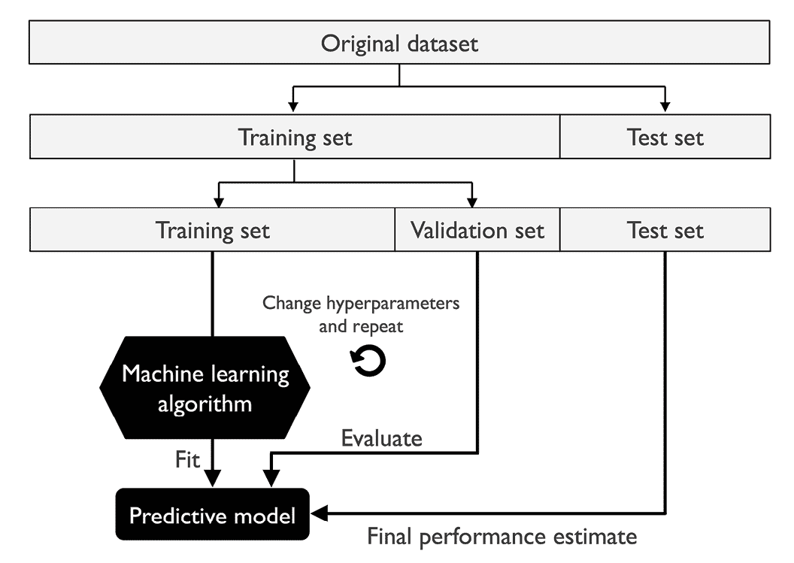

图 6.2:如何使用训练、验证和测试数据集

维持方法的一个缺点是，性能估计可能对我们如何将训练数据集划分为训练和验证子集非常敏感；对于不同的数据示例，估计值会有所不同。在下一小节中，我们将了解一种更健壮的性能估计技术，k 倍交叉验证，其中我们对训练数据的 *k* 子集重复保持方法 *k* 次。

## k 倍交叉验证

在 k 折叠交叉验证中，我们随机地将训练数据集分成 *k* 折叠，而没有替换。这里，*k*–1 折，即所谓的*训练折*，用于模型训练，一折，即所谓的*测试折*，用于性能评估。这个过程重复 *k* 次，以便我们获得 *k* 模型和性能估计。

**有替换和无替换的采样**

在第 3 章的*中，我们看了一个例子来说明有替换和没有替换的采样。如果你没有读过那一章，或者想复习一下，请参考*通过随机森林*合并多个决策树一节中标题为*带替换和不带替换的采样*的信息框。*

然后，我们基于不同的独立测试折叠来计算模型的平均性能，以获得与维持方法相比对训练数据的子划分不太敏感的性能估计。通常，我们使用 k-fold 交叉验证进行模型调整，即找到产生令人满意的泛化性能的最佳超参数值，这是通过评估测试折叠上的模型性能来估计的。

一旦我们找到满意的超参数值，我们就可以在完整的训练数据集上重新训练模型，并使用独立的测试数据集获得最终的性能估计。在 k-fold 交叉验证之后将模型拟合到整个训练数据集背后的基本原理是，首先，我们通常对单个最终模型感兴趣(相对于 *k* 个单独的模型)，其次，为学习算法提供更多训练示例通常会导致更准确和更稳健的模型。

由于 k-fold 交叉验证是一种没有替换的重采样技术，这种方法的优点是在每次迭代中，每个示例将被恰好使用一次，并且训练和测试折叠是不相交的。此外，所有测试折叠都是不相交的；也就是说，测试折叠之间没有重叠。*图 6.3* 用 *k* = 10 总结了 k 重交叉验证背后的概念。训练数据集分为 10 个折叠，在 10 次迭代过程中，9 个折叠用于训练，1 个折叠将用作模型评估的测试数据集。

此外，每个折叠的估计性能 *E* [i] (例如，分类精度或误差)然后用于计算模型的估计平均性能 *E* :

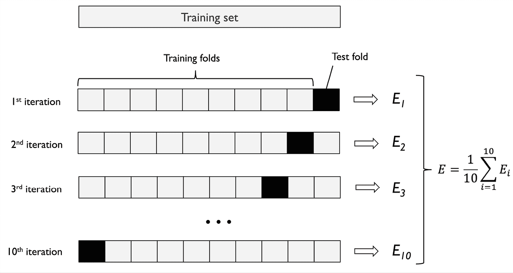

图 6.3:k 倍交叉验证的工作原理

总之，k 重交叉验证比具有验证集的维持方法更好地利用数据集，因为在 k 重交叉验证中，所有数据点都用于评估。

经验证据显示， k 倍交叉验证中 *k* 的一个好的标准值是 10。例如，罗恩·科哈维在各种真实世界数据集上进行的实验表明，10 重交叉验证提供了偏倚和方差之间的最佳权衡(*一项针对精确度估计和模型选择的交叉验证和引导的研究*作者*科哈维，罗恩*，*国际人工智能联合会议(IJCAI)* ，14 (12): 1137-43，1995，*[https://www.ijcai.org/Proceedings/95-2/Papers/016.pdf](https://www.ijcai.org/Proceedings/95-2/Papers/016.pdf))。*

 *但是，如果我们使用相对较小的训练集，增加折叠次数会很有用。如果我们增加 *k* 的值，在每次迭代中将使用更多的训练数据，这将导致通过平均单个模型估计值来估计泛化性能的悲观偏差降低。然而， *k* 的大值也将增加交叉验证算法的运行时间，并且产生具有更高方差的估计，因为训练折叠将彼此更加相似。另一方面，如果我们正在处理大型数据集，我们可以为 *k* 选择较小的值，例如 *k* = 5，并且仍然可以获得模型平均性能的准确估计，同时降低在不同褶皱上重新调整和评估模型的计算成本。

**留一交叉验证**

k 重交叉验证的一个特例是**留一交叉验证** ( **LOOCV** )方法。在 LOOCV，我们设置折叠的数量等于训练样本的数量( *k* = *n* )，这样在每次迭代中只有一个训练样本用于测试，这是处理非常小的数据集的推荐方法。

与标准 k 倍交叉验证方法相比，分层 k 倍交叉验证方法有一点改进，它可以产生更好的偏差和方差估计，特别是在类别比例不相等的情况下，Ron Kohavi 在本节前面引用的同一项研究中也显示了这一点。在分层交叉验证中，类标签比例保留在每个折叠中，以确保每个折叠代表训练数据集中的类比例，我们将通过使用 scikit-learn 中的`StratifiedKFold`迭代器来说明这一点:

```
>>> import numpy as np

>>> from sklearn.model_selection import StratifiedKFold

>>> kfold = StratifiedKFold(n_splits=10).split(X_train, y_train)

>>> scores = []

>>> for k, (train, test) in enumerate(kfold):

...     pipe_lr.fit(X_train[train], y_train[train])

...     score = pipe_lr.score(X_train[test], y_train[test])

...     scores.append(score)

...     print(f'Fold: {k+1:02d}, '

...           f'Class distr.: {np.bincount(y_train[train])}, '

...           f'Acc.: {score:.3f}')

Fold: 01, Class distr.: [256 153], Acc.: 0.935

Fold: 02, Class distr.: [256 153], Acc.: 0.935

Fold: 03, Class distr.: [256 153], Acc.: 0.957

Fold: 04, Class distr.: [256 153], Acc.: 0.957

Fold: 05, Class distr.: [256 153], Acc.: 0.935

Fold: 06, Class distr.: [257 153], Acc.: 0.956

Fold: 07, Class distr.: [257 153], Acc.: 0.978

Fold: 08, Class distr.: [257 153], Acc.: 0.933

Fold: 09, Class distr.: [257 153], Acc.: 0.956

Fold: 10, Class distr.: [257 153], Acc.: 0.956

>>> mean_acc = np.mean(scores)

>>> std_acc = np.std(scores)

>>> print(f'\nCV accuracy: {mean_acc:.3f} +/- {std_acc:.3f}')

CV accuracy: 0.950 +/- 0.014 
```

首先，我们用训练数据集中的`y_train`类标签初始化来自`sklearn.model_selection`模块的`StratifiedKFold`迭代器，并通过`n_splits`参数指定折叠数。当我们使用`kfold`迭代器遍历`k`折叠时，我们使用`train`中返回的索引来拟合我们在本章开始时设置的逻辑回归管道。使用`pipe_lr`管道，我们确保了在每一次迭代中示例都被适当地缩放(例如，标准化)。然后，我们使用`test`指数来计算模型的精确度分数，我们在`scores`列表中收集这些分数来计算估计的平均精确度和标准偏差。

虽然前面的代码示例有助于说明 k-fold 交叉验证是如何工作的，但 scikit-learn 还实现了一个 k-fold 交叉验证计分器，它允许我们使用分层的 k-fold 交叉验证来评估我们的模型，而不那么繁琐:

```
>>> from sklearn.model_selection import cross_val_score

>>> scores = cross_val_score(estimator=pipe_lr,

...                          X=X_train,

...                          y=y_train,

...                          cv=10,

...                          n_jobs=1)

>>> print(f'CV accuracy scores: {scores}')

CV accuracy scores: [ 0.93478261  0.93478261  0.95652174

                      0.95652174  0.93478261  0.95555556

                      0.97777778  0.93333333  0.95555556

                      0.95555556]

>>> print(f'CV accuracy: {np.mean(scores):.3f} '

...       f'+/- {np.std(scores):.3f}')

CV accuracy: 0.950 +/- 0.014 
```

`cross_val_score`方法的一个非常有用的特性是，我们可以在我们机器上的多个**中央处理器**(**CPU**)之间分配不同折叠的评估。如果我们将`n_jobs`参数设置为`1`，那么只有一个 CPU 将用于评估性能，就像我们之前的`StratifiedKFold`示例一样。然而，通过设置`n_jobs=2`，我们可以将 10 轮交叉验证分配给两个 CPU(如果我们的机器上有可用的话)，通过设置`n_jobs=-1`，我们可以使用我们机器上所有可用的 CPU 来并行执行计算。

**评估泛化性能**

请注意，关于如何在交叉验证中估计泛化性能的方差的详细讨论超出了本书的范围，但您可以参考一篇关于模型评估和交叉验证的综合文章(*s .*s .*拉什卡*撰写的《机器学习中的模型评估、模型选择和算法选择】，我们在[https://arxiv.org/abs/1811.12808](https://arxiv.org/abs/1811.12808)分享了这篇文章。本文还讨论了替代的交叉验证技术，例如. 632 和. 632+ bootstrap 交叉验证方法。

此外，您可以在 M. Markatou 等人的一篇优秀文章中找到详细的讨论(*m . Marka tou*、 *H. Tian* 、 *S. Biswas* 和 *G. M. Hripcsak* 、*Journal of Machine Learning Research*，6: 1127-1168，2005)，该文章可从以下网址获得

# 使用学习和验证曲线调试算法

在本节中，我们将看看两个非常简单但功能强大的诊断工具，它们可以帮助我们提高学习算法的性能:**学习曲线**和**验证曲线**。在接下来的小节中，我们将讨论如何使用学习曲线来诊断学习算法是否存在过拟合(高方差)或欠拟合(高偏差)的问题。此外，我们将看看验证曲线，它可以帮助我们解决学习算法的常见问题。

## 用学习曲线诊断偏差和方差问题

如果模型对于给定的训练数据集来说太复杂，例如，考虑一个非常深的决策树，模型往往会过度拟合训练数据，并且不能很好地推广到看不见的数据。通常，收集更多的训练示例有助于降低过度拟合的程度。

然而，在实践中，收集更多的数据通常非常昂贵或者根本不可行。通过将模型训练和验证准确性绘制为训练数据集大小的函数，我们可以轻松检测模型是否存在高方差或高偏差，以及收集更多数据是否有助于解决这一问题。

但是在我们讨论如何在 scikit-learn 中绘制学习曲线之前，让我们通过下面的插图来讨论这两个常见的模型问题:

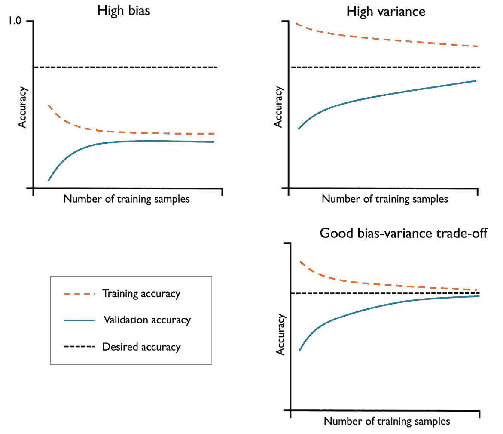

图 6.4:常见的模型问题

左上角的图表显示了一个具有高偏差的模型。该模型的训练和交叉验证精度都很低，这表明它对训练数据的拟合不足。解决这个问题的常见方法是增加模型参数的数量，例如，通过收集或构建附加特征，或者通过降低正则化的程度，例如，在**支持向量机** ( **SVM** )或逻辑回归分类器中。

右上方的图表显示了一个具有高方差的模型，这由训练和交叉验证准确性之间的巨大差距来指示。例如，为了解决这个过度拟合的问题，我们可以收集更多的训练数据，降低模型的复杂性，或者增加正则化参数。

对于未规范的模型，通过特征选择(*第 4 章*)或特征提取(*第 5 章*)来降低过度拟合的程度，也有助于减少特征的数量。虽然收集更多的训练数据通常会减少过度拟合的机会，但它可能并不总是有所帮助，例如，如果训练数据非常嘈杂或者模型已经非常接近最优。

在下一小节中，我们将了解如何使用验证曲线来解决这些模型问题，但首先让我们看看如何使用 scikit-learn 的学习曲线函数来评估模型:

```
>>> import matplotlib.pyplot as plt

>>> from sklearn.model_selection import learning_curve

>>> pipe_lr = make_pipeline(StandardScaler(),

...                         LogisticRegression(penalty='l2',

...                                            max_iter=10000))

>>> train_sizes, train_scores, test_scores =\

...                 learning_curve(estimator=pipe_lr,

...                                X=X_train,

...                                y=y_train,

...                                train_sizes=np.linspace(

...                                            0.1, 1.0, 10),

...                                cv=10,

...                                n_jobs=1)

>>> train_mean = np.mean(train_scores, axis=1)

>>> train_std = np.std(train_scores, axis=1)

>>> test_mean = np.mean(test_scores, axis=1)

>>> test_std = np.std(test_scores, axis=1)

>>> plt.plot(train_sizes, train_mean,

...          color='blue', marker='o',

...          markersize=5, label='Training accuracy')

>>> plt.fill_between(train_sizes,

...                  train_mean + train_std,

...                  train_mean - train_std,

...                  alpha=0.15, color='blue')

>>> plt.plot(train_sizes, test_mean,

...          color='green', linestyle='--',

...          marker='s', markersize=5,

...          label='Validation accuracy')

>>> plt.fill_between(train_sizes,

...                  test_mean + test_std,

...                  test_mean - test_std,

...                  alpha=0.15, color='green')

>>> plt.grid()

>>> plt.xlabel('Number of training examples')

>>> plt.ylabel('Accuracy')

>>> plt.legend(loc='lower right')

>>> plt.ylim([0.8, 1.03])

>>> plt.show() 
```

注意，我们在实例化`LogisticRegression`对象(默认情况下使用 1000 次迭代)时传递了`max_iter=10000`作为附加参数，以避免较小数据集大小或极端正则化参数值的收敛问题(在下一节中讨论)。在我们成功地执行了前面的代码之后，我们将获得下面的学习曲线图:


图 6.5:一条学习曲线，通过训练样本的数量显示了训练和验证数据集的准确性

通过`learning_curve`函数中的`train_sizes`参数，我们可以控制用于生成学习曲线的训练样本的绝对或相对数量。在这里，我们将`train_sizes=np.linspace(0.1, 1.0, 10)`设置为使用 10 个均匀间隔的相对区间来确定训练数据集的大小。默认情况下，`learning_curve`函数使用分层 k 重交叉验证来计算分类器的交叉验证精度，我们通过`cv`参数设置 *k* = 10 进行 10 重分层交叉验证。

然后，我们简单地计算了不同大小的训练数据集的返回的交叉验证训练和测试分数的平均准确度，我们使用 Matplotlib 的`plot`函数绘制了该数据集。此外，我们使用`fill_between`函数将平均精度的标准偏差添加到图中，以指示估计值的方差。

正如我们在前面的学习曲线图中看到的，如果我们的模型在训练期间看到了 250 个以上的例子，那么它在训练和验证数据集上都表现得非常好。我们还可以看到，对于少于 250 个示例的训练数据集，训练精度提高了，验证和训练精度之间的差距扩大了——这表明过度拟合的程度增加了。

## 利用验证曲线解决过度拟合和欠拟合问题

验证曲线是通过解决过拟合或欠拟合等问题来提高模型性能的有用工具。验证曲线与学习曲线相关，但我们不是将训练和测试精度绘制为样本大小的函数，而是改变模型参数的值，例如，逻辑回归中的逆正则化参数`C`。

让我们来看看如何通过 scikit-learn 创建验证曲线:

```
>>> from sklearn.model_selection import validation_curve

>>> param_range = [0.001, 0.01, 0.1, 1.0, 10.0, 100.0]

>>> train_scores, test_scores = validation_curve(

...                             estimator=pipe_lr,

...                             X=X_train,

...                             y=y_train,

...                             param_name='logisticregression__C',

...                             param_range=param_range,

...                             cv=10)

>>> train_mean = np.mean(train_scores, axis=1)

>>> train_std = np.std(train_scores, axis=1)

>>> test_mean = np.mean(test_scores, axis=1)

>>> test_std = np.std(test_scores, axis=1)

>>> plt.plot(param_range, train_mean,

...          color='blue', marker='o',

...          markersize=5, label='Training accuracy')

>>> plt.fill_between(param_range, train_mean + train_std,

...                  train_mean - train_std, alpha=0.15,

...                  color='blue')

>>> plt.plot(param_range, test_mean,

...          color='green', linestyle='--',

...          marker='s', markersize=5,

...          label='Validation accuracy')

>>> plt.fill_between(param_range,

...                  test_mean + test_std,

...                  test_mean - test_std,

...                  alpha=0.15, color='green')

>>> plt.grid()

>>> plt.xscale('log')

>>> plt.legend(loc='lower right')

>>> plt.xlabel('Parameter C')

>>> plt.ylabel('Accuracy')

>>> plt.ylim([0.8, 1.0])

>>> plt.show() 
```

使用前面的代码，我们获得了参数`C`的验证曲线图:


图 6.6:SVM 超参数 C 的验证曲线图

与`learning_curve`函数类似，`validation_curve`函数默认使用分层 k 折交叉验证来评估分类器的性能。在`validation_curve`函数中，我们指定了想要评估的参数。在这种情况下，它是`C`，即`LogisticRegression`分类器的逆正则化参数，我们将它写成`'logisticregression__C'`来访问 scikit-learn 管道内的`LogisticRegression`对象，以获得我们通过`param_range`参数设置的指定值范围。与上一节中的学习曲线示例类似，我们绘制了平均训练和交叉验证准确度以及相应的标准偏差。

尽管不同的`C`值在精确度上的差异是细微的，但我们可以看到，当我们增加正则化强度时(较小的`C`值)，模型会略微欠拟合数据。然而，对于较大的`C`值，这意味着降低正则化的强度，因此模型倾向于稍微过度拟合数据。在这种情况下，最佳位置似乎在`C`值的 0.01 到 0.1 之间。

# 通过网格搜索微调机器学习模型

在机器学习中，我们有两种类型的参数:从训练数据中学习的参数，例如，逻辑回归中的权重，以及单独优化的学习算法的参数。后者是模型的调整参数(或超参数)，例如，逻辑回归中的正则化参数或决策树的最大深度参数。

在上一节中，我们使用验证曲线通过调整一个超参数来提高模型的性能。在本节中，我们将了解一种流行的超参数优化技术，称为**网格搜索**，它可以通过找到超参数值的*最优*组合来进一步帮助提高模型的性能。

## 通过网格搜索调整超参数

网格搜索方法非常简单:这是一个强力穷举搜索范例，我们为不同的超参数指定一个值列表，计算机评估每个组合的模型性能，以从这个集合中获得值的最佳组合:

```
>>> from sklearn.model_selection import GridSearchCV

>>> from sklearn.svm import SVC

>>> pipe_svc = make_pipeline(StandardScaler(),

...                          SVC(random_state=1))

>>> param_range = [0.0001, 0.001, 0.01, 0.1,

...                1.0, 10.0, 100.0, 1000.0]

>>> param_grid = [{'svc__C': param_range,

...                'svc__kernel': ['linear']},

...               {'svc__C': param_range,

...                'svc__gamma': param_range,

...                'svc__kernel': ['rbf']}]

>>> gs = GridSearchCV(estimator=pipe_svc,

...                   param_grid=param_grid,

...                   scoring='accuracy',

...                   cv=10,

...                   refit=True,

...                   n_jobs=-1)

>>> gs = gs.fit(X_train, y_train)

>>> print(gs.best_score_)

0.9846153846153847

>>> print(gs.best_params_)

{'svc__C': 100.0, 'svc__gamma': 0.001, 'svc__kernel': 'rbf'} 
```

使用前面的代码，我们从`sklearn.model_selection`模块初始化了一个`GridSearchCV`对象来训练和调优 SVM 管道。我们将`GridSearchCV`的`param_grid`参数设置为一个字典列表，以指定我们想要调优的参数。对于线性 SVM，我们只评估了逆正则化参数，`C`；对于的**径向基函数** ( **RBF** )核 SVM，我们调整了`svc__C`和`svc__gamma`参数。注意，`svc__gamma`参数是特定于内核 SVM 的。

`GridSearchCV`使用 k-fold 交叉验证来比较用不同超参数设置训练的模型。通过`cv=10`设置，它将执行 10 重交叉验证并计算这 10 重的平均准确度(通过`scoring='accuracy'`)以评估模型性能。我们设置`n_jobs=-1`,以便`GridSearchCV`可以使用我们所有的处理核心，通过并行将模型拟合到不同的褶皱来加速网格搜索，但是如果您的机器在此设置上有问题，您可以将此设置更改为`n_jobs=None`进行单次处理。

在我们使用训练数据执行网格搜索之后，我们通过`best_score_`属性获得了表现最好的模型的分数，并查看了它的参数，这些参数可以通过`best_params_`属性访问。在这个特例中，使用`svc__C = 100.0`的 RBF 核 SVM 模型产生了最好的 k 倍交叉验证准确率:98.5%。

最后，我们使用独立的测试数据集来评估最佳选择模型的性能，这可以通过`GridSearchCV`对象的`best_estimator_`属性获得:

```
>>> clf = gs.best_estimator_

>>> clf.fit(X_train, y_train)

>>> print(f'Test accuracy: {clf.score(X_test, y_test):.3f}')

Test accuracy: 0.974 
```

请注意，在完成网格搜索后，没有必要通过`clf.fit(X_train, y_train)`在训练集上手动拟合具有最佳设置(`gs.best_estimator_`)的模型。`GridSearchCV`类有一个`refit`参数，如果我们设置`refit=True`(默认)，它会自动将`gs.best_estimator_`重新安装到整个训练集。

## 利用随机搜索更广泛地探索超参数配置

由于网格搜索是一种穷举搜索，因此如果超参数配置包含在用户指定的参数网格中，就可以保证找到最佳的超参数配置。然而，指定大的超参数网格使得网格搜索在实践中非常昂贵。随机搜索是对不同参数组合进行采样的另一种方法。在随机搜索中，我们从分布(或离散集)中随机抽取超参数配置。与网格搜索相比，随机搜索不会在超参数空间中进行穷举搜索。尽管如此，它允许我们以更具成本效益和时间效益的方式探索更广泛的超参数值设置。这个概念在*图 6.7* 中进行了说明，该图显示了通过网格搜索和随机搜索进行搜索的九个超参数设置的固定网格:


图 6.7:网格搜索和随机搜索对九种不同超参数配置的比较

主要的收获是，虽然网格搜索只探索离散的、用户指定的选择，但如果搜索空间过于稀缺，它可能会错过好的超参数配置。感兴趣的读者可以在下面的文章中找到关于随机搜索的更多细节，以及实证研究:*随机搜索超参数优化*作者 *J .伯格斯特拉*、 *Y .本吉奥*、*机器学习研究杂志*，2012 年第 281-305 页、[https://www . jmlr . org/papers/volume 13/Berg stra 12a/Berg stra 12a](https://www.jmlr.org/papers/volume13/bergstra12a/bergstra12a)。

让我们看看如何使用随机搜索来调优 SVM。Scikit-learn 实现了一个`RandomizedSearchCV`类，它类似于我们在前一小节中使用的`GridSearchCV`。主要区别在于，我们可以将分布指定为参数网格的一部分，并指定要评估的超参数配置的总数。例如，让我们考虑一下在上一节的网格搜索示例中调整 SVM 时用于几个超参数的超参数范围:

```
>>> param_range = [0.0001, 0.001, 0.01, 0.1,

...                1.0, 10.0, 100.0, 1000.0] 
```

请注意，虽然`RandomizedSearchCV`可以接受类似的离散值列表作为参数网格的输入，这在考虑分类超参数时很有用，但它的主要功能在于我们可以用从中采样的分布替换这些列表。因此，例如，我们可以用 SciPy 的以下发行版替换前面的列表:

```
>>> param_range = scipy.stats.loguniform(0.0001, 1000.0) 
```

例如，使用对数均匀分布代替规则的均匀分布将确保在足够多的试验中，从[0.0001，0.001]范围抽取与[10.0，100.0]范围相同数量的样本。为了检查它的行为，我们可以通过`rvs(10)`方法从这个分布中随机抽取 10 个样本，如下所示:

```
>>> np.random.seed(1)

>>> param_range.rvs(10)

array([8.30145146e-02, 1.10222804e+01, 1.00184520e-04, 1.30715777e-02,

       1.06485687e-03, 4.42965766e-04, 2.01289666e-03, 2.62376594e-02,

       5.98924832e-02, 5.91176467e-01]) 
```

**指定分布**

`RandomizedSearchCV`支持任意分布，只要我们可以通过调用`rvs()`方法从它们中取样。目前可以通过`scipy.stats`获得的所有发行版的列表可以在这里找到:[https://docs . scipy . org/doc/scipy/reference/stats . html # probability-distributions](https://docs.scipy.org/doc/scipy/reference/stats.html#probability-distributions)。

现在让看到动作中的`RandomizedSearchCV`，并像我们在上一节中对`GridSearchCV`所做的那样调整一个 SVM:

```
>>> from sklearn.model_selection import RandomizedSearchCV

>>> pipe_svc = make_pipeline(StandardScaler(),

...                          SVC(random_state=1))

>>> param_grid = [{'svc__C': param_range,

...                'svc__kernel': ['linear']},

...               {'svc__C': param_range,

...                'svc__gamma': param_range,

...                'svc__kernel': ['rbf']}]

>>> rs = RandomizedSearchCV(estimator=pipe_svc,

...                         param_distributions=param_grid,

...                         scoring='accuracy',

...                         refit=True,

...                         n_iter=20,

...                         cv=10,

...                         random_state=1,

...                         n_jobs=-1)

>>> rs = rs.fit(X_train, y_train)

>>> print(rs.best_score_)

0.9670531400966184

>>> print(rs.best_params_)

{'svc__C': 0.05971247755848464, 'svc__kernel': 'linear'} 
```

基于这个代码示例，我们可以看到用法与`GridSearchCV`非常相似，除了我们可以使用分布来指定参数范围，并通过设置`n_iter=20`来指定迭代次数——20 次迭代。

## 具有连续减半功能的更具资源效率的超参数搜索

scikit-learn 将随机搜索的思想向前推进了一步，实现了一个连续减半的变体`HalvingRandomSearchCV`，使得寻找合适的超参数配置更加有效。给定一大组候选配置，连续的减半连续地丢弃没有希望的超参数配置，直到只剩下一个配置。我们可以通过以下步骤总结该过程:

1.  通过随机抽样绘制大量候选配置
2.  用有限的资源来训练模型，例如，训练数据的一个小子集(而不是使用整个训练集)
3.  根据预测性能，放弃后 50%
4.  返回到*步骤 2* ，增加可用资源量

重复这些步骤，直到只剩下一个超参数配置。注意，也有一个称为`HalvingGridSearchCV`的网格搜索变体的连续减半实现，其中所有指定的超参数配置用于*步骤 1* 中，而不是随机样本。

在 scikit-learn 1.0 中，`HalvingRandomSearchCV`仍然是实验性的，这就是为什么我们必须首先启用它:

```
>>> from sklearn.experimental import enable_halving_search_cv 
```

(上述代码在未来版本中可能不工作或不受支持。)

启用实验支持后，我们可以使用连续减半的随机搜索，如下所示:

```
>>> from sklearn.model_selection import HalvingRandomSearchCV

>>> hs = HalvingRandomSearchCV(pipe_svc,

...                            param_distributions=param_grid,

...                            n_candidates='exhaust',

...                            resource='n_samples',

...                            factor=1.5,

...                            random_state=1,

...                            n_jobs=-1) 
```

`resource='n_samples'`(默认)设置指定我们将训练集大小视为我们在各轮之间变化的资源。通过`factor`参数，我们可以确定每轮淘汰多少候选人。比如设置`factor=2`淘汰一半的候选人，设置`factor=1.5`意味着只有 100%/1.5 ≈ 66%的候选人进入下一轮。我们没有像在`RandomizedSearchCV`中那样选择固定的迭代次数，而是设置了`n_candidates='exhaust'`(默认)，它将对超参数配置的数量进行采样，以便在最后一轮中使用最大数量的资源(这里是训练示例)。

然后，我们可以像执行`RandomizedSearchCV`一样执行搜索:

```
>>> hs = hs.fit(X_train, y_train)

>>> print(hs.best_score_)

0.9617647058823529

>>> print(hs.best_params_)

{'svc__C': 4.934834261073341, 'svc__kernel': 'linear'}

>>> clf = hs.best_estimator_

>>> print(f'Test accuracy: {hs.score(X_test, y_test):.3f}')

Test accuracy: 0.982 
```

如果我们将前两个小节中的`GridSearchCV`和`RandomizedSearchCV`的结果与`HalvingRandomSearchCV`的模型进行比较，我们可以看到后者产生的模型在测试集上表现稍好(98.2%的准确率对 97.4%)。

**用 hyperopt 调节超参数**

另一个流行的超参数优化库是 hyperopt([https://github.com/hyperopt/hyperopt](https://github.com/hyperopt/hyperopt))，它实现了几种不同的超参数优化方法，包括随机搜索和**树形结构 Parzen 估计器** ( **TPE** )方法。TPE 是一种基于概率模型的贝叶斯优化方法，该概率模型根据过去的超参数评估和相关的性能得分不断更新，而不是将这些评估视为独立事件。您可以在*超参数优化算法*中找到更多关于 TPE 的信息。*伯格斯特拉 J* ，*巴登内特 R，本吉奥 Y，凯格尔 B* 。 *NeurIPS 2011* 。第 2546–2554 页，[https://dl.acm.org/doi/10.5555/2986459.2986743](https://dl.acm.org/doi/10.5555/2986459.2986743)。

虽然 hyperopt 为超参数优化提供了一个通用接口，但为了更加方便起见，还有一个名为 hyperopt-sklearn 的 scikit-learn 专用包:[https://github.com/hyperopt/hyperopt-sklearn](https://github.com/hyperopt/hyperopt-sklearn)。

## 嵌套交叉验证的算法选择

使用 k-fold 交叉验证结合网格搜索或随机搜索是一种通过改变其超参数值来微调机器学习模型性能的有用方法，正如我们在前面的小节中看到的那样。如果我们想在不同的机器学习算法中进行选择，另一个推荐的方法是**嵌套交叉验证**。在一项关于误差估计偏差的出色研究中，Sudhir Varma 和 Richard Simon 得出结论，当使用嵌套交叉验证时，估计的真实误差相对于测试数据集几乎是无偏的(当使用交叉验证进行模型选择时，误差估计中的*偏差*作者 *S. Varma* 和 *R. Simon* ， *BMC Bioinformatics* ，7(1): 91，2006，*[https://bmcbioinformatics](https://bmcbioinformatics.biomedcentral.com/articles/10.1186/1471-2105-7-91)*

 *在嵌套交叉验证中，我们有一个外部 k-fold 交叉验证循环来将数据分成训练和测试折叠，一个内部循环用于在训练折叠上使用 k-fold 交叉验证来选择模型。在模型选择之后，测试折叠然后被用于评估模型性能。*图 6.8* 解释了只有五个外部折叠和两个内部折叠的嵌套交叉验证的概念，这对于计算性能很重要的大型数据集很有用；这种特殊类型的嵌套交叉验证也被称为T4 5×2 交叉验证:

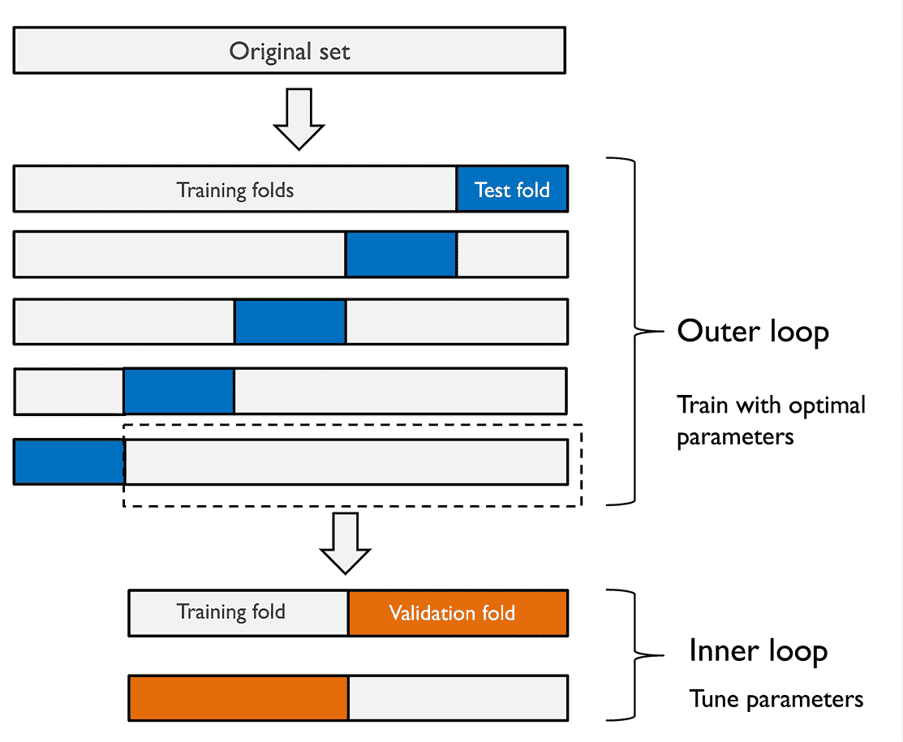

图 6.8:嵌套交叉验证的概念

在 scikit-learn 中，我们可以使用网格搜索执行嵌套交叉验证，如下所示:

```
>>> param_range = [0.0001, 0.001, 0.01, 0.1,

...                1.0, 10.0, 100.0, 1000.0]

>>> param_grid = [{'svc__C': param_range,

...                'svc__kernel': ['linear']},

...               {'svc__C': param_range,

...                'svc__gamma': param_range,

...                'svc__kernel': ['rbf']}]

>>> gs = GridSearchCV(estimator=pipe_svc,

...                   param_grid=param_grid,

...                   scoring='accuracy',

...                   cv=2)

>>> scores = cross_val_score(gs, X_train, y_train,

...                          scoring='accuracy', cv=5)

>>> print(f'CV accuracy: {np.mean(scores):.3f} '

...       f'+/- {np.std(scores):.3f}')

CV accuracy: 0.974 +/- 0.015 
```

如果我们调整模型的超参数，并将其用于看不见的数据，返回的平均交叉验证准确性为我们提供了一个很好的预期估计。

例如，我们可以使用嵌套交叉验证方法来比较 SVM 模型和简单的决策树分类器；为简单起见，我们将只调整其深度参数:

```
>>> from sklearn.tree import DecisionTreeClassifier

>>> gs = GridSearchCV(

...     estimator=DecisionTreeClassifier(random_state=0),

...     param_grid=[{'max_depth': [1, 2, 3, 4, 5, 6, 7, None]}],

...     scoring='accuracy',

...     cv=2

... )

>>> scores = cross_val_score(gs, X_train, y_train,

...                          scoring='accuracy', cv=5)

>>> print(f'CV accuracy: {np.mean(scores):.3f} '

...       f'+/- {np.std(scores):.3f}')

CV accuracy: 0.934 +/- 0.016 
```

正如我们所看到的，SVM 模型的嵌套交叉验证性能(97.4%)明显优于决策树的性能(93.4%)，因此，我们预计对来自与该特定数据集相同群体的新数据进行分类可能是更好的选择。

# 查看不同的绩效评估指标

在前面的章节和章节中，我们使用预测准确性评估了不同的机器学习模型，预测准确性是一种有用的度量标准，可以用来量化模型的总体性能。然而，还有几个其他的性能指标可以用来衡量一个模型的相关性，比如精度、召回率、 **F1 分数**，以及**马修斯相关系数** ( **MCC** )。

## 阅读混淆矩阵

在我们进入不同评分指标的细节之前，让我们来看看一个**混淆矩阵**，一个展示学习算法性能的矩阵。

一个混淆矩阵就是一个方阵，它报告了一个分类器的**真阳性**(**TP**)**真阴性**(**TN**)**假阳性** ( **FP** )和**假阴性** ( **FN** )预测的计数，如图*图 6 所示。*

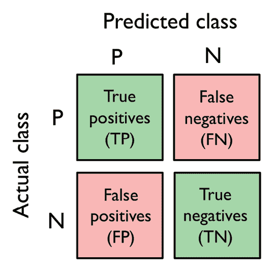

图 6.9:混淆矩阵

尽管通过比较实际和预测的类标签可以很容易地手动计算这些指标，但是 scikit-learn 提供了一个我们可以使用的方便的`confusion_matrix`函数，如下所示:

```
>>> from sklearn.metrics import confusion_matrix

>>> pipe_svc.fit(X_train, y_train)

>>> y_pred = pipe_svc.predict(X_test)

>>> confmat = confusion_matrix(y_true=y_test, y_pred=y_pred)

>>> print(confmat)

[[71  1]

[ 2 40]] 
```

执行代码后返回的数组为我们提供了分类器在测试数据集上产生的不同类型错误的信息。我们可以使用 Matplotlib 的`matshow`函数将这些信息映射到*图 6.9* 中的混淆矩阵图:

```
>>> fig, ax = plt.subplots(figsize=(2.5, 2.5))

>>> ax.matshow(confmat, cmap=plt.cm.Blues, alpha=0.3)

>>> for i in range(confmat.shape[0]):

...     for j in range(confmat.shape[1]):

...         ax.text(x=j, y=i, s=confmat[i, j],

...                 va='center', ha='center')

>>> ax.xaxis.set_ticks_position('bottom')

>>> plt.xlabel('Predicted label')

>>> plt.ylabel('True label')

>>> plt.show() 
```

现在，下面的混淆矩阵图，加上标签，应该会使结果更容易解释:


图 6.10:我们数据的混淆矩阵

假设类`1`(恶性)是这个例子中的阳性类，我们的模型分别正确地分类了属于类`0` (TN)的 71 个例子和属于类`1` (TP)的 40 个例子。然而，我们的模型也错误地将来自类别`1`的两个例子分类为类别`0` (FN)，并且它预测一个例子是恶性的，尽管它是良性肿瘤(FP)。在下一小节中，我们将学习如何使用这些信息来计算各种误差指标。

## 优化分类模型的精度和召回率

预测**误差** ( **ERR** )和**准确度** ( **ACC** )都提供了关于有多少个例子被错误分类的一般信息。误差可以理解为所有错误预测的总和除以总预测数，准确度计算为正确预测的总和除以总预测数，分别为:

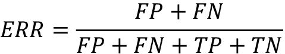

然后可以直接从误差计算预测精度:

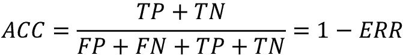

**真阳性率** ( **TPR** )和**假阳性率** ( **FPR** )是对不平衡类问题特别有用的性能指标:

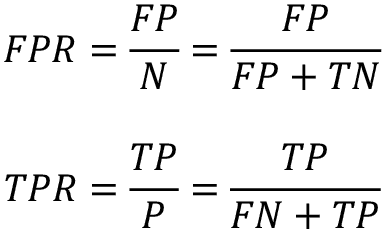

例如，在肿瘤诊断中，我们更关心恶性肿瘤的检测，以便帮助患者进行适当的治疗。然而，减少被错误分类为恶性(FP)的良性肿瘤的数量也很重要，以免不必要地引起患者的关注。与 FPR 相反，TPR 提供了关于从全部阳性样本(P)中被正确识别的阳性(或相关)样本的比例的有用信息。

性能指标 **precision** ( **PRE** )和 **recall** ( **REC** )与那些 TP 和 TN 速率相关，事实上，REC 与 TPR 同义:

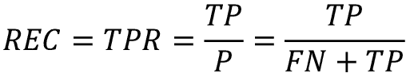

换句话说，recall 量化了有多少相关记录(阳性)被捕获(真阳性)。精度量化了预测为相关的记录(真阳性和假阳性的总和)中有多少是实际相关的(真阳性):

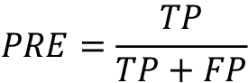

再看恶性肿瘤检测的例子，优化召回有助于最小化未检测到恶性肿瘤的机会。然而，这是以预测患者的恶性肿瘤为代价的，尽管患者是健康的(大量的 FPs)。另一方面，如果我们优化精确度，如果我们预测病人患有恶性肿瘤，我们就强调正确性。然而，这是以更频繁地遗漏恶性肿瘤(大量 fn)为代价的。

为了平衡优化 PRE 和 REC 的上升和下降，使用 PRE 和 REC 的调和平均值，即所谓的 F1 分数:

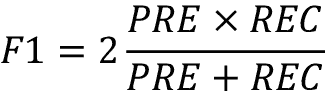

**关于精度和召回的进一步阅读**

如果你有兴趣更深入地讨论不同的性能指标，如精确度和召回率，请阅读大卫·m·w·鲍尔斯的技术报告*评估:从精确度、召回率和 F 因子到 ROC、信息量、标记性&相关性*，该报告可在 https://arxiv.org/abs/2010.16061[的](https://arxiv.org/abs/2010.16061)免费获得。

最后，总结混淆矩阵的一个度量是 MCC，它在生物学研究环境中特别流行。MCC 的计算如下:

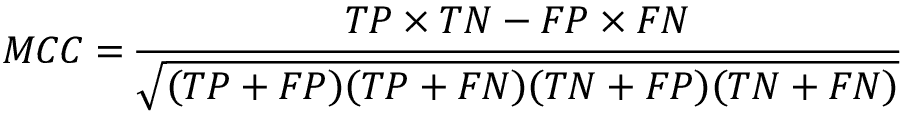

与 PRE、REC 和 F1 分数相比，MCC 的范围在–1 和 1 之间，它考虑了混淆矩阵的所有元素，例如，F1 分数不涉及 TN。虽然 MCC 值比 F1 分数更难解释，但它被视为一个优越的指标，如以下文章所述:*马修斯相关系数(MCC)优于 F1 分数的优势和二元分类评估的准确性*由 *D .奇克科*和 *G .朱尔曼*、 *BMC Genomics* 进行。2012 年第 281-305 页，[https://bmcgenomics . biomed central . com/articles/10.1186/s 12864-019-6413-7](https://bmcgenomics.biomedcentral.com/articles/10.1186/s12864-019-6413-7)。

这些评分指标都在 scikit-learn 中实现，并且可以从`sklearn.metrics`模块导入，如以下代码片段所示:

```
>>> from sklearn.metrics import precision_score

>>> from sklearn.metrics import recall_score, f1_score

>>> from sklearn.metrics import matthews_corrcoef

>>> pre_val = precision_score(y_true=y_test, y_pred=y_pred)

>>> print(f'Precision: {pre_val:.3f}')

Precision: 0.976

>>> rec_val = recall_score(y_true=y_test, y_pred=y_pred)

>>> print(f'Recall: {rec_val:.3f}')

Recall: 0.952

>>> f1_val = f1_score(y_true=y_test, y_pred=y_pred)

>>> print(f'F1: {f1_val:.3f}')

F1: 0.964

>>> mcc_val = matthews_corrcoef(y_true=y_test, y_pred=y_pred)

>>> print(f'MCC: {mcc_val:.3f}')

MCC: 0.943 
```

此外，我们可以通过评分参数在`GridSearchCV`中使用不同于准确度的评分标准。评分参数接受的不同值的完整列表可以在[http://sci kit-learn . org/stable/modules/model _ evaluation . html](http://scikit-learn.org/stable/modules/model_evaluation.html)找到。

记住scikit-learn 中的正类是被标记为类`1`的类。如果我们想要指定一个不同的*正标签*，我们可以通过`make_scorer`函数构造我们自己的计分器，然后我们可以直接将它作为参数提供给`GridSearchCV`中的`scoring`参数(在本例中，使用`f1_score`作为度量):

```
>>> from sklearn.metrics import make_scorer

>>> c_gamma_range = [0.01, 0.1, 1.0, 10.0]

>>> param_grid = [{'svc__C': c_gamma_range,

...                'svc__kernel': ['linear']},

...               {'svc__C': c_gamma_range,

...                'svc__gamma': c_gamma_range,

...                'svc__kernel': ['rbf']}]

>>> scorer = make_scorer(f1_score, pos_label=0)

>>> gs = GridSearchCV(estimator=pipe_svc,

...                   param_grid=param_grid,

...                   scoring=scorer,

...                   cv=10)

>>> gs = gs.fit(X_train, y_train)

>>> print(gs.best_score_)

0.986202145696

>>> print(gs.best_params_)

{'svc__C': 10.0, 'svc__gamma': 0.01, 'svc__kernel': 'rbf'} 
```

## 绘制接收器工作特性曲线

**接收器操作特性** ( **ROC** )图表是基于它们相对于 FPR 和 TPR 的性能来选择分类模型的有用工具，这些性能是通过移动分类器的决策阈值来计算的。ROC 图的对角线可以解释为*随机猜测*，落在对角线以下的分类模型被认为比随机猜测差。一个完美的分类器会落在图的左上角，TPR 为 1，FPR 为 0。基于 ROC 曲线，我们然后可以计算曲线 ( **ROC AUC** )到下的所谓 **ROC 面积，以表征分类模型的性能。**

类似于 ROC 曲线，我们可以为分类器的不同概率阈值计算**精确召回曲线**。在 scikit-learn 中也实现了绘制这些精确召回曲线的功能，并记录在[http://sci kit-learn . org/stable/modules/generated/sk learn . metrics . precision _ recall _ curve . html](http://scikit-learn.org/stable/modules/generated/sklearn.metrics.precision_recall_curve.html)中。

执行以下代码示例，我们将绘制一个分类器的 ROC 曲线，该分类器仅使用来自乳腺癌 Wisconsin 数据集的两个特征来预测肿瘤是良性还是恶性。尽管我们将使用之前定义的相同的逻辑回归管道，但这次我们只使用了两个特性。这是为了通过保留包含在其他特征中的有用信息，使分类器的分类任务更具挑战性，从而使所得的 ROC 曲线在视觉上变得更有趣。出于类似的原因，我们也将`StratifiedKFold`验证器中的折叠次数减少到三次。代码如下:

```
>>> from sklearn.metrics import roc_curve, auc

>>> from numpy import interp

>>> pipe_lr = make_pipeline(

...     StandardScaler(),

...     PCA(n_components=2),

...     LogisticRegression(penalty='l2', random_state=1,

...                        solver='lbfgs', C=100.0)

... )

>>> X_train2 = X_train[:, [4, 14]]

>>> cv = list(StratifiedKFold(n_splits=3).split(X_train, y_train))

>>> fig = plt.figure(figsize=(7, 5))

>>> mean_tpr = 0.0

>>> mean_fpr = np.linspace(0, 1, 100)

>>> all_tpr = []

>>> for i, (train, test) in enumerate(cv):

...     probas = pipe_lr.fit(

...         X_train2[train],

...         y_train[train]

...     ).predict_proba(X_train2[test])

...     fpr, tpr, thresholds = roc_curve(y_train[test],

...                                      probas[:, 1],

...                                      pos_label=1)

...     mean_tpr += interp(mean_fpr, fpr, tpr)

...     mean_tpr[0] = 0.0

...     roc_auc = auc(fpr, tpr)

...     plt.plot(fpr,

...              tpr,

...              label=f'ROC fold {i+1} (area = {roc_auc:.2f})')

>>> plt.plot([0, 1],

...          [0, 1],

...          linestyle='--',

...          color=(0.6, 0.6, 0.6),

...          label='Random guessing (area=0.5)')

>>> mean_tpr /= len(cv)

>>> mean_tpr[-1] = 1.0

>>> mean_auc = auc(mean_fpr, mean_tpr)

>>> plt.plot(mean_fpr, mean_tpr, 'k--',

...          label=f'Mean ROC (area = {mean_auc:.2f})', lw=2)

>>> plt.plot([0, 0, 1],

...          [0, 1, 1],

...          linestyle=':',

...          color='black',

...          label='Perfect performance (area=1.0)')

>>> plt.xlim([-0.05, 1.05])

>>> plt.ylim([-0.05, 1.05])

>>> plt.xlabel('False positive rate')

>>> plt.ylabel('True positive rate')

>>> plt.legend(loc='lower right')

>>> plt.show() 
```

在前面的代码示例中，我们使用了已经熟悉的 scikit-learn 中的`StratifiedKFold`类，并使用来自`sklearn.metrics`模块的`roc_curve`函数为每次迭代分别计算了我们的`pipe_lr`管道中的`LogisticRegression`分类器的 ROC 性能。此外，我们通过从 SciPy 导入的`interp`函数对三个折叠的平均 ROC 曲线进行插值，并通过`auc`函数计算曲线下的面积。所得的 ROC 曲线表明不同折叠之间存在一定程度的差异，并且平均 ROC AUC (0.76)落在满分(1.0)和随机猜测(0.5)之间:


图 6.11:ROC 图

请注意，如果我们只是对 ROC AUC 得分感兴趣，我们也可以直接从`sklearn.metrics`子模块导入`roc_auc_score`函数，它可以类似于前面几节中介绍的其他得分函数(例如，`precision_score`)来使用。

将分类器的性能报告为 ROC AUC 可以进一步了解分类器在不平衡样本方面的性能。然而，虽然准确度分数可以被解释为 ROC 曲线上的单个分界点，但 A. P .布拉德利表明 ROC AUC 和准确度度量基本上彼此一致:*ROC 曲线下面积在机器学习算法评估中的使用*由 *A. P .布拉德利*，*模式识别*，30(7): 1145-1159，1997，[https://reader.elsevier.com/reader/sd/pii/S0031320396001422](https://reader.elsevier.com/reader/sd/pii/S0031320396001422)。

## 多类分类的评分标准

到目前为止，我们已经讨论过的评分标准是针对二元分类系统的。然而，scikit-learn 还实现了宏观和微观平均方法，通过**一对一对全部** ( **OvA** )分类将这些评分指标扩展到多类问题。微平均值由系统的各个 TPs、TNs、FPs 和 FNs 计算得出。例如，在 *k* 级系统中，精度分数的微平均值可以计算如下:

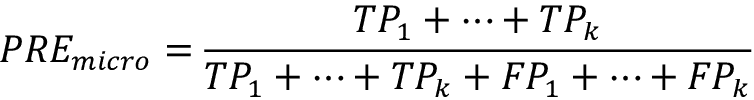

宏观平均值简单地计算为不同系统的平均分数:

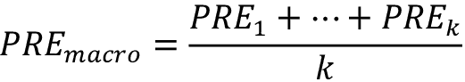

如果我们希望对每个实例或预测进行同等加权，微平均是有用的，而宏平均对所有类进行同等加权，以评估分类器在最频繁的类标签方面的整体性能。

如果我们在 scikit-learn 中使用二进制性能度量来评估多类分类模型，则默认使用宏平均值的归一化或加权变量。在计算平均值时，通过用真实实例的数量对每个类标签的分数进行加权来计算加权宏平均值。如果我们要处理类别不平衡，即每个标签有不同数量的实例，加权宏观平均是有用的。

虽然加权宏平均是 scikit-learn 中多类问题的默认方法，但我们可以通过从`sklearn.metrics`模块导入的不同评分函数中的`average`参数指定平均方法，例如`precision_score`或`make_scorer`函数:

```
>>> pre_scorer = make_scorer(score_func=precision_score,

...                          pos_label=1,

...                          greater_is_better=True,

...                          average='micro') 
```

## 处理阶级不平衡

在这一章中，我们已经多次提到了阶级失衡，但是我们并没有真正讨论如果出现这种情况，应该如何恰当地处理。在处理真实世界的数据时，类不平衡是一个非常常见的问题——来自一个类或多个类的示例在数据集中被过度表示。我们可以想到几个可能发生这种情况的领域，如垃圾邮件过滤、欺诈检测或疾病筛查。

想象一下，我们在这一章中处理的乳腺癌威斯康星州数据集由 90%的健康患者组成。在这种情况下，我们可以在测试数据集上实现 90%的准确性，只需预测所有示例的主要类别(良性肿瘤)，而无需监督机器学习算法的帮助。因此，在达到大约 90%测试准确率的数据集上训练模型意味着我们的模型没有从该数据集中提供的功能中学到任何有用的东西。

在本节中，我们将简要介绍一些有助于处理不平衡数据集的技术。但是在我们讨论解决这个问题的不同方法之前，让我们从我们的数据集创建一个不平衡的数据集，该数据集最初由 357 个良性肿瘤(类别`0`)和 212 个恶性肿瘤(类别`1`)组成:

```
>>> X_imb = np.vstack((X[y == 0], X[y == 1][:40]))

>>> y_imb = np.hstack((y[y == 0], y[y == 1][:40])) 
```

在这个代码片段中，我们将所有 357 个良性肿瘤示例与前 40 个恶性肿瘤示例堆叠在一起，以创建一个明显的类别不平衡。如果我们要计算一个总是预测多数类(良性，类`0`)的模型的准确性，我们将实现大约 90%的预测准确性:

```
>>> y_pred = np.zeros(y_imb.shape[0])

>>> np.mean(y_pred == y_imb) * 100

89.92443324937027 
```

因此，当我们在这样的数据集上拟合分类器时，在比较不同的模型时，关注准确性以外的其他指标将是有意义的，例如精确度、召回率、ROC 曲线——无论我们在应用程序中最关心什么。例如，我们的首要任务可能是确定大多数恶性肿瘤患者，以推荐额外的筛查，因此回忆应该是我们选择的衡量标准。在垃圾邮件过滤中，如果系统不是很确定，我们不希望将电子邮件标记为垃圾邮件，精确度可能是更合适的指标。

除了评估机器学习模型之外，类别不平衡在模型拟合本身期间影响学习算法。由于机器学习算法通常优化奖励或损失函数，该函数被计算为在拟合期间看到的训练示例的总和，因此决策规则可能会偏向多数类。

换句话说，该算法隐式地学习一个模型，该模型基于数据集中最丰富的类来优化预测，以在训练期间最小化损失或最大化回报。

在模型拟合期间处理不平衡类比例的一种方法是对少数类的错误预测分配较大的惩罚。通过 scikit-learn，调整这样的惩罚就像将`class_weight`参数设置为`class_weight='balanced'`一样方便，这是为大多数分类器实现的。

处理类不平衡的其他流行策略包括对少数类进行上采样，对多数类进行下采样，以及生成合成训练样本。不幸的是，对于不同的问题领域，没有普遍适用的最佳解决方案或技术。因此，在实践中，建议对给定的问题尝试不同的策略，评估结果，并选择看起来最合适的技术。

scikit-learn 库实现了一个简单的`resample`函数，可以通过替换从数据集中提取新样本来帮助少数类的上采样。下面的代码将从我们的不平衡乳腺癌威斯康星州数据集(这里，类`1`)中提取少数民族类，并重复从中提取新的样本，直到它包含与类标签`0`相同数量的示例:

```
>>> from sklearn.utils import resample

>>> print('Number of class 1 examples before:',

...       X_imb[y_imb == 1].shape[0])

Number of class 1 examples before: 40

>>> X_upsampled, y_upsampled = resample(

...         X_imb[y_imb == 1],

...         y_imb[y_imb == 1],

...         replace=True,

...         n_samples=X_imb[y_imb == 0].shape[0],

...         random_state=123)

>>> print('Number of class 1 examples after:',

...       X_upsampled.shape[0])

Number of class 1 examples after: 357 
```

重采样后，我们可以将原始类`0`样本与上采样类`1`子集进行堆叠，以获得如下平衡数据集:

```
>>> X_bal = np.vstack((X[y == 0], X_upsampled))

>>> y_bal = np.hstack((y[y == 0], y_upsampled)) 
```

因此，多数投票预测规则只能达到 50%的准确率:

```
>>> y_pred = np.zeros(y_bal.shape[0])

>>> np.mean(y_pred == y_bal) * 100

50 
```

类似地，我们可以通过从数据集中移除训练样本来对多数类进行缩减采样。要使用`resample`函数执行缩减采样，我们可以简单地用前面代码示例中的类`0`替换类`1`标签，反之亦然。

**生成新的训练数据以解决班级失衡**

处理类不平衡的另一个技巧是生成合成训练示例，这超出了本书的范围。大概最广泛使用的用于合成训练数据生成的算法是**合成少数过采样技术** ( **SMOTE** )，你可以在 *Nitesh Chawla* 和其他人的原始研究文章中了解关于该技术的更多信息: *SMOTE:合成少数过采样技术*，*人工智能研究杂志*，16: 321-357，2002 *，*可在【T11 还强烈建议查看不平衡学习，这是一个完全专注于不平衡数据集的 Python 库，包括 SMOTE 的实现。你可以在 https://github.com/scikit-learn-contrib/imbalanced-learn 了解更多关于不平衡的信息。

# 摘要

在本章的开始，我们讨论了如何在方便的模型管道中链接不同的转换技术和分类器，以帮助我们更有效地训练和评估机器学习模型。然后，我们使用这些管道执行 k-fold 交叉验证，这是模型选择和评估的基本技术之一。使用 k-fold 交叉验证，我们绘制了学习和验证曲线，以诊断学习算法的常见问题，如过拟合和欠拟合。

使用网格搜索、随机搜索和连续减半，我们进一步微调了我们的模型。然后，我们使用混淆矩阵和各种性能指标来评估和优化特定问题任务的模型性能。最后，我们通过讨论处理不平衡数据的不同方法来结束本章，不平衡数据是许多现实应用程序中的常见问题。现在，您应该很好地掌握了成功构建用于分类的监督机器学习模型的基本技术。

在下一章中，我们将研究集成方法:允许我们结合多种模型和分类算法的方法，以进一步提高机器学习系统的预测性能。

# 加入我们书的不和谐空间

加入该书的 Discord workspace，每月与作者进行一次*向我提问*会议:

[https://packt.link/MLwPyTorch](https://packt.link/MLwPyTorch)

**