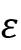
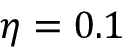

# seven

# 结合不同模型进行集成学习

在前一章中，我们重点介绍了优化和评估不同分类模型的最佳实践。在这一章中，我们将在这些技术的基础上，探索不同的方法来构建一组分类器，这些分类器通常比其任何单个成员都具有更好的预测性能。我们将学习如何执行以下操作:

*   基于多数投票做出预测
*   使用 bagging 通过重复绘制训练数据集的随机组合来减少过度拟合
*   应用 boosting 从从错误中学习的弱学习者中构建强大的模型

# 集体学习

**集成方法**的目标是将不同的分类器组合成一个元分类器，该元分类器比每个单独的分类器具有更好的泛化性能。例如，假设我们收集了 10 位专家的预测，集成方法将允许我们战略性地组合这 10 位专家的预测，以得出比每位专家的预测更准确、更稳健的预测。正如你将在本章后面看到的，有几种不同的方法来创建一个分类器集合。本节将介绍集成如何工作的基本解释，以及为什么它们通常被认为具有良好的泛化性能。

在这一章中，我们将关注使用**多数表决**原则的最流行的集成方法。多数投票仅仅意味着我们选择已经被大多数分类器预测的类别标签，也就是说，获得超过 50%的投票。严格地说,“多数表决”一词仅指二元类设置。然而，很容易将多数投票原则推广到多类别设置中，这被称为T4 多数投票。(在英国，人们分别通过“绝对”和“相对”多数来区分多数和多数投票。)

这里，我们选择收到最多投票的类标签(模式)。*图 7.1* 说明了 10 个分类器集合的多数和多数投票的概念，其中每个独特的符号(三角形、正方形和圆形)代表一个独特的类别标签:


图 7.1:不同的投票概念

使用训练数据集，我们首先训练 *m* 个不同的分类器(*C*1，...、*C*m)。根据不同的技术，可以从不同的分类算法中构建集成，例如决策树、支持向量机、逻辑回归分类器等等。或者，我们也可以使用相同的基本分类算法，拟合训练数据集的不同子集。这种方法的一个突出例子是结合不同决策树分类器的随机森林算法，我们在*第 3 章*、*使用 Scikit-Learn 的机器学习分类器之旅*中讨论过。*图 7.2* 说明了使用多数表决的一般集合方法的概念:


图 7.2:一般的集合方法

为了通过简单多数或多数投票来预测一个类标签，我们可以组合每个单独分类器的预测类标签*C*j，并选择获得最多投票的类标签:


(在统计学中，众数是一个集合中最频繁出现的事件或结果。例如，mode{1，2，1，1，2，4，5，4} = 1。)

例如，在 class 1 =–1 和 class2 = +1 的二元分类任务中，我们可以将多数投票预测写成如下形式:


为了说明为什么集成方法比单独的分类器更好，让我们应用一些组合学的概念。对于下面的例子，我们将假设用于二元分类任务的所有 *n* 基分类器具有相等的错误率。此外，我们将假设分类器是独立的，并且错误率不相关。在这些假设下，我们可以简单地将一个基本分类器集合的误差概率表示为一个二项式分布的概率质量函数:


这里，是二项式系数 *n 选 k* 。换句话说，我们计算系综预测错误的概率。现在，让我们看一个更具体的 11 个基本分类器的例子( *n* = 11)，其中每个分类器的错误率为 0.25 ( ):


**二项式系数**

二项式系数指的是我们可以从一组大小为 *n* 的无序元素中选择 *k* 的子集的方式的数量；因此，它通常被称为“n 选 k”。由于这里的顺序并不重要，二项式系数有时也被称为*组合*或*组合数*，其简写形式如下:


这里，符号(！)代表阶乘—例如，3！= 3×2×1 = 6.

如你所见，如果所有假设都满足，那么集合的错误率(0.034)比每个单独分类器的错误率(0.25)低得多。注意，在这个简化的图示中，由偶数个分类器 *n* 进行的 50-50 分割被视为错误，而这仅在一半的时间里是正确的。为了在不同的基本错误率范围内将这种理想的集成分类器与基本分类器进行比较，让我们用 Python 实现概率质量函数:

```py
>>> from scipy.special import comb

>>> import math

>>> def ensemble_error(n_classifier, error):

...     k_start = int(math.ceil(n_classifier / 2.))

...     probs = [comb(n_classifier, k) *

...              error**k *

...              (1-error)**(n_classifier - k)

...              for k in range(k_start, n_classifier + 1)]

...     return sum(probs)

>>> ensemble_error(n_classifier=11, error=0.25)

0.03432750701904297 
```

在我们实现了`ensemble_error`函数之后，我们可以计算从 0.0 到 1.0 的不同基本误差范围内的总体误差率，以便在线图中可视化总体误差和基本误差之间的关系:

```py
>>> import numpy as np

>>> import matplotlib.pyplot as plt

>>> error_range = np.arange(0.0, 1.01, 0.01)

>>> ens_errors = [ensemble_error(n_classifier=11, error=error)

...               for error in error_range]

>>> plt.plot(error_range, ens_errors,

...          label='Ensemble error',

...          linewidth=2)

>>> plt.plot(error_range, error_range,

...          linestyle='--', label='Base error',

...          linewidth=2)

>>> plt.xlabel('Base error')

>>> plt.ylabel('Base/Ensemble error')

>>> plt.legend(loc='upper left')

>>> plt.grid(alpha=0.5)

>>> plt.show() 
```

正如您在结果图中看到的，只要基本分类器的性能优于随机猜测()，总体的误差概率总是优于单个基本分类器的误差。

注意， *y* 轴描述了基本误差(虚线)和总体误差(实线):


图 7.3:总体误差与基本误差的关系图

# 通过多数投票组合分类器

在前面的部分对集成学习做了简短的介绍之后，让我们从热身练习开始，用 Python 实现一个简单的用于多数投票的集成分类器。

**多数投票**

尽管我们将在本节讨论的多数投票算法也通过多数投票推广到多类设置，但术语“多数投票”是为了简单起见而使用的，这在文献中是常见的情况。

## 实现简单的多数投票分类器

我们将在本节中实现的算法将允许我们组合与各个权重相关联的不同分类算法以获得置信度。我们的目标是建立一个更强的元分类器，平衡特定数据集上各个分类器的弱点。用更精确的数学术语来说，我们可以将加权多数票写成如下形式:


这里， *w* [j] 是与基础分类器相关联的权重，*C*[j]；是系综的预测类标签； *A* 是唯一类标签的集合；(希腊文 chi)是特征函数或指示函数，如果第 *j* 个分类器的预测类匹配*I*(*C*j(**x【T21)=*I*)，则返回 1。对于相等的权重，我们可以简化该等式，并将其写为:**


为了更好地理解*加权*的概念，我们现在来看一个更具体的例子。让我们假设我们有三个基本分类器的集成，，并且我们想要预测给定示例 **x** 的类标签，。三个基本分类器中的两个预测类别标签 0，一个*C*3 预测该示例属于类别 1。如果我们平均加权每个基本分类器的预测，多数投票预测该示例属于类 0:


现在，让我们给 *C* [3] 分配 0.6 的权重，让我们用 0.2 的系数给 *C* [1] 和 *C* [2] 加权:


更简单地说，由于 3×0.2 = 0.6，我们可以说由 *C* [3] 做出的预测比由 *C* [1] 或 *C* [2] 做出的预测具有三倍的权重，我们可以这样写:


为了将加权多数投票的概念转化为 Python 代码，我们可以使用 NumPy 方便的`argmax`和`bincount`函数，其中`bincount`计算每个类标签的出现次数。然后`argmax`函数返回最高计数的索引位置，对应于多数类标签(假设类标签从 0 开始):

```py
>>> import numpy as np

>>> np.argmax(np.bincount([0, 0, 1],

...           weights=[0.2, 0.2, 0.6]))

1 
```

正如您在第 3 章中对逻辑回归的讨论中所记得的，scikit-learn 中的某些分类器也可以通过`predict_proba`方法返回预测类标签的概率。如果我们的集成中的分类器被很好地校准，使用预测的类概率而不是类标签来进行多数表决可能是有用的。用于从概率预测类别标签的多数投票的修改版本可以写成如下:


这里， *p* [ij] 是类别标签 *i* 的第 *j* 个分类器的预测概率。

继续我们之前的例子，让我们假设我们有一个带有类别标签和三个分类器的集成的二元分类问题。让我们假设分类器 *C* [j] 返回特定示例的以下类成员概率， **x** :


使用与前面相同的权重(0.2、0.2 和 0.6)，我们可以计算各个类别的概率如下:


为了实现基于类别概率的加权多数投票，我们可以再次使用 NumPy，使用`np.average`和`np.argmax`:

```py
>>> ex = np.array([[0.9, 0.1],

...                [0.8, 0.2],

...                [0.4, 0.6]])

>>> p = np.average(ex, axis=0, weights=[0.2, 0.2, 0.6])

>>> p

array([0.58, 0.42])

>>> np.argmax(p)

0 
```

把所有东西放在一起，现在让我们用 Python 实现`MajorityVoteClassifier`:

```py
from sklearn.base import BaseEstimator

from sklearn.base import ClassifierMixin

from sklearn.preprocessing import LabelEncoder

from sklearn.base import clone

from sklearn.pipeline import _name_estimators

import numpy as np

import operator

class MajorityVoteClassifier(BaseEstimator, ClassifierMixin):

    def __init__(self, classifiers, vote='classlabel', weights=None):

        self.classifiers = classifiers

        self.named_classifiers = {

            key: value for key,

            value in _name_estimators(classifiers)

        }

        self.vote = vote

        self.weights = weights

    def fit(self, X, y):

        if self.vote not in ('probability', 'classlabel'):

            raise ValueError(f"vote must be 'probability' "

                             f"or 'classlabel'"

                             f"; got (vote={self.vote})")

        if self.weights and

        len(self.weights) != len(self.classifiers):

            raise ValueError(f'Number of classifiers and'

                             f' weights must be equal'

                             f'; got {len(self.weights)} weights,'

                             f' {len(self.classifiers)} classifiers')

        # Use LabelEncoder to ensure class labels start

        # with 0, which is important for np.argmax

        # call in self.predict

        self.lablenc_ = LabelEncoder()

        self.lablenc_.fit(y)

        self.classes_ = self.lablenc_.classes_

        self.classifiers_ = []

        for clf in self.classifiers:

            fitted_clf = clone(clf).fit(X,

                               self.lablenc_.transform(y))

            self.classifiers_.append(fitted_clf)

        return self 
```

我们在代码中添加了许多注释来解释各个部分。然而，在我们实现剩下的方法之前，让我们休息一会儿，讨论一些一开始可能看起来令人困惑的代码。我们使用`BaseEstimator`和`ClassifierMixin`父类免费获得一些基础功能*，包括设置和返回分类器参数的`get_params`和`set_params`方法，以及计算预测精度的`score`方法。*

 *接下来，如果我们用`vote='classlabel'`初始化一个新的`MajorityVoteClassifier`对象，我们将添加`predict`方法，通过基于类标签的多数投票来预测类标签。或者，我们将能够用`vote='probability'`初始化集成分类器，以基于类成员概率预测类标签。此外，我们还将添加一个`predict_proba`方法来返回平均概率，这在计算曲线 ( **ROC AUC** )下的**接收器操作特征面积时很有用:**

```py
 def predict(self, X):

        if self.vote == 'probability':

            maj_vote = np.argmax(self.predict_proba(X), axis=1)

        else: # 'classlabel' vote

            # Collect results from clf.predict calls

            predictions = np.asarray([

                clf.predict(X) for clf in self.classifiers_

            ]).T

            maj_vote = np.apply_along_axis(

                lambda x: np.argmax(

                    np.bincount(x, weights=self.weights)

                ),

                axis=1, arr=predictions

            )

        maj_vote = self.lablenc_.inverse_transform(maj_vote)

        return maj_vote

    def predict_proba(self, X):

        probas = np.asarray([clf.predict_proba(X)

                             for clf in self.classifiers_])

        avg_proba = np.average(probas, axis=0,

                               weights=self.weights)

        return avg_proba

    def get_params(self, deep=True):

        if not deep:

            return super().get_params(deep=False)

        else:

            out = self.named_classifiers.copy()

            for name, step in self.named_classifiers.items():

                for key, value in step.get_params(

                        deep=True).items():

                    out[f'{name}__{key}'] = value

            return out 
```

另外，注意我们定义了我们自己的`get_params`方法的修改版本，使用`_name_estimators`函数来访问集成中各个分类器的参数；这一开始可能看起来有点复杂，但是当我们在后面的部分中使用网格搜索进行超参数调整时，这将是非常有意义的。

**sci kit-learn 中的 voting classifier**

尽管`MajorityVoteClassifier`实现对于演示非常有用，但我们在 scikit-learn 中基于本书第一版中的实现实现了这个多数投票分类器的更复杂版本。在 sci kit-learn 0.17 版及更高版本中，集成分类器作为`sklearn.ensemble.VotingClassifier`提供。你可以在[https://sci kit-learn . org/stable/modules/generated/sk learn . ensemble . voting classifier . html](https://scikit-learn.org/stable/modules/generated/sklearn.ensemble.VotingClassifier.html)找到更多关于`VotingClassifier`的信息

## 使用多数投票原则进行预测

现在是时候让将我们在上一节中实现的`MajorityVoteClassifier`付诸行动了。但首先，让我们准备一个数据集，我们可以测试它。由于我们已经熟悉了从 CSV 文件加载数据集的技术，我们将采用一种快捷方式，从 scikit-learn 的`datasets`模块加载 Iris 数据集。此外，我们将仅选择两个特征，即*萼片宽度*和*花瓣长度*，以使分类任务更具挑战性，便于说明。尽管我们的`MajorityVoteClassifier`推广到多类问题，我们将只对来自`Iris-versicolor`和`Iris-virginica`类的花卉样本进行分类，稍后我们将使用它们计算 ROC AUC。代码如下:

```py
>>> from sklearn import datasets

>>> from sklearn.model_selection import train_test_split

>>> from sklearn.preprocessing import StandardScaler

>>> from sklearn.preprocessing import LabelEncoder

>>> iris = datasets.load_iris()

>>> X, y = iris.data[50:, [1, 2]], iris.target[50:]

>>> le = LabelEncoder()

>>> y = le.fit_transform(y) 
```

**来自决策树的类成员概率**

注意 scikit-learn 使用的`predict_proba`方法(如果适用)来计算 ROC AUC 分数。在第 3 章的*中，我们看到了在逻辑回归模型中如何计算类别概率。在决策树中，概率是通过在训练时为每个节点创建的频率向量来计算的。该向量收集从该节点处的类别标签分布计算的每个类别标签的频率值。然后，对频率进行归一化，使其总和为 1。类似地，在 k-最近邻算法中，聚集 k-最近邻的类标签以返回归一化的类标签频率。尽管决策树和 k-最近邻分类器返回的归一化概率可能看起来类似于从逻辑回归模型获得的概率，但我们必须意识到它们实际上不是从概率质量函数中获得的。*

接下来，我们将 Iris 示例分成 50%的训练数据和 50%的测试数据:

```py
>>> X_train, X_test, y_train, y_test =\

...     train_test_split(X, y,

...                      test_size=0.5,

...                      random_state=1,

...                      stratify=y) 
```

使用训练数据集，我们现在将训练三个不同的分类器:

*   逻辑回归分类器
*   决策树分类器
*   k 近邻分类器

然后，在我们将它们组合成集成分类器之前，我们将通过对训练数据集的 10 重交叉验证来评估每个分类器的模型性能:

```py
>>> from sklearn.model_selection import cross_val_score

>>> from sklearn.linear_model import LogisticRegression

>>> from sklearn.tree import DecisionTreeClassifier

>>> from sklearn.neighbors import KNeighborsClassifier

>>> from sklearn.pipeline import Pipeline

>>> import numpy as np

>>> clf1 = LogisticRegression(penalty='l2',

...                           C=0.001,

...                           solver='lbfgs',

...                           random_state=1)

>>> clf2 = DecisionTreeClassifier(max_depth=1,

...                               criterion='entropy',

...                               random_state=0)

>>> clf3 = KNeighborsClassifier(n_neighbors=1,

...                             p=2,

...                             metric='minkowski')

>>> pipe1 = Pipeline([['sc', StandardScaler()],

...                   ['clf', clf1]])

>>> pipe3 = Pipeline([['sc', StandardScaler()],

...                   ['clf', clf3]])

>>> clf_labels = ['Logistic regression', 'Decision tree', 'KNN']

>>> print('10-fold cross validation:\n')

>>> for clf, label in zip([pipe1, clf2, pipe3], clf_labels):

...     scores = cross_val_score(estimator=clf,

...                              X=X_train,

...                              y=y_train,

...                              cv=10,

...                              scoring='roc_auc')

...     print(f'ROC AUC: {scores.mean():.2f} '

...           f'(+/- {scores.std():.2f}) [{label}]') 
```

我们收到的输出，如下面的代码片段所示，显示了各个分类器的预测性能几乎相等:

```py
10-fold cross validation:

ROC AUC: 0.92 (+/- 0.15) [Logistic regression]

ROC AUC: 0.87 (+/- 0.18) [Decision tree]

ROC AUC: 0.85 (+/- 0.13) [KNN] 
```

您可能想知道为什么我们将逻辑回归和 k-最近邻分类器作为管道的一部分进行训练。背后的原因是，正如在*第 3 章*中所讨论的，与决策树相比，逻辑回归和 k-最近邻算法(使用欧几里德距离度量)都不是尺度不变的。虽然虹膜特征都是在相同的尺度(cm)上测量的，但是使用标准化的特征是一个好习惯。

现在，让我们进入更激动人心的部分，在我们的`MajorityVoteClassifier`中组合用于多数规则投票的个体分类器:

```py
>>> mv_clf = MajorityVoteClassifier(

...     classifiers=[pipe1, clf2, pipe3]

... )

>>> clf_labels += ['Majority voting']

>>> all_clf = [pipe1, clf2, pipe3, mv_clf]

>>> for clf, label in zip(all_clf, clf_labels):

...     scores = cross_val_score(estimator=clf,

...                              X=X_train,

...                              y=y_train,

...                              cv=10,

...                              scoring='roc_auc')

...     print(f'ROC AUC: {scores.mean():.2f} '

...           f'(+/- {scores.std():.2f}) [{label}]')

ROC AUC: 0.92 (+/- 0.15) [Logistic regression]

ROC AUC: 0.87 (+/- 0.18) [Decision tree]

ROC AUC: 0.85 (+/- 0.13) [KNN]

ROC AUC: 0.98 (+/- 0.05) [Majority voting] 
```

正如你所看到的，`MajorityVotingClassifier`的性能在 10 倍交叉验证评估中比单个分类器有所提高。

## 评估和调整集成分类器

在这一节中，我们将从测试数据集计算 ROC 曲线，以检查`MajorityVoteClassifier`是否能很好地概括看不见的数据。我们必须记住，测试数据集不用于模型选择；其目的仅仅是报告分类器系统的泛化性能的无偏估计:

```py
>>> from sklearn.metrics import roc_curve

>>> from sklearn.metrics import auc

>>> colors = ['black', 'orange', 'blue', 'green']

>>> linestyles = [':', '--', '-.', '-']

>>> for clf, label, clr, ls \

...     in zip(all_clf, clf_labels, colors, linestyles):

...     # assuming the label of the positive class is 1

...     y_pred = clf.fit(X_train,

...                      y_train).predict_proba(X_test)[:, 1]

...     fpr, tpr, thresholds = roc_curve(y_true=y_test,

...                                      y_score=y_pred)

...     roc_auc = auc(x=fpr, y=tpr)

...     plt.plot(fpr, tpr,

...              color=clr,

...              linestyle=ls,

...              label=f'{label} (auc = {roc_auc:.2f})')

>>> plt.legend(loc='lower right')

>>> plt.plot([0, 1], [0, 1],

...          linestyle='--',

...          color='gray',

...          linewidth=2)

>>> plt.xlim([-0.1, 1.1])

>>> plt.ylim([-0.1, 1.1])

>>> plt.grid(alpha=0.5)

>>> plt.xlabel('False positive rate (FPR)')

>>> plt.ylabel('True positive rate (TPR)')

>>> plt.show() 
```

正如您在结果 ROC 中看到的，集成分类器在测试数据集上也表现良好(ROC AUC = 0.95)。但是，您可以看到逻辑回归分类器在相同的数据集上表现类似，这可能是由于给定数据集的小尺寸的高方差(在这种情况下，我们如何分割数据集的敏感性)造成的:


图 7.4:不同分类器的 ROC 曲线

由于我们只为分类示例选择了两个特征，所以看看集成分类器的决策区域实际上是什么样子将会很有趣。

虽然在模型拟合之前没有必要对训练特征进行标准化,但是因为我们的逻辑回归和 k-最近邻管道会自动处理它，所以我们将对训练数据集进行标准化，以便决策树的决策区域在相同的尺度上用于视觉目的。代码如下:

```py
>>> sc = StandardScaler()

>>> X_train_std = sc.fit_transform(X_train)

>>> from itertools import product

>>> x_min = X_train_std[:, 0].min() - 1

>>> x_max = X_train_std[:, 0].max() + 1

>>> y_min = X_train_std[:, 1].min() - 1

>>>

>>> y_max = X_train_std[:, 1].max() + 1

>>> xx, yy = np.meshgrid(np.arange(x_min, x_max, 0.1),

...                      np.arange(y_min, y_max, 0.1))

>>> f, axarr = plt.subplots(nrows=2, ncols=2,

...                         sharex='col',

...                         sharey='row',

...                         figsize=(7, 5))

>>> for idx, clf, tt in zip(product([0, 1], [0, 1]),

...                         all_clf, clf_labels):

...     clf.fit(X_train_std, y_train)

...     Z = clf.predict(np.c_[xx.ravel(), yy.ravel()])

...     Z = Z.reshape(xx.shape)

...     axarr[idx[0], idx[1]].contourf(xx, yy, Z, alpha=0.3)

...     axarr[idx[0], idx[1]].scatter(X_train_std[y_train==0, 0],

...                                   X_train_std[y_train==0, 1],

...                                   c='blue',

...                                   marker='^',

...                                   s=50)

...     axarr[idx[0], idx[1]].scatter(X_train_std[y_train==1, 0],

...                                   X_train_std[y_train==1, 1],

...                                   c='green',

...                                   marker='o',

...                                   s=50)

...     axarr[idx[0], idx[1]].set_title(tt)

>>> plt.text(-3.5, -5.,

...          s='Sepal width [standardized]',	

...          ha='center', va='center', fontsize=12)

>>> plt.text(-12.5, 4.5,

...          s='Petal length [standardized]',

...          ha='center', va='center',

...          fontsize=12, rotation=90)

>>> plt.show() 
```

有趣的是，但也如预期的那样，集成分类器的决策区域似乎是来自单个分类器的决策区域的混合。乍一看，多数票决定边界看起来很像决策树树桩的决定，对于*萼片宽度* ≥ 1，该边界与 *y* 轴正交。

然而，您也可以注意到 k-最近邻分类器的非线性混合在:


图 7.5:不同分类器的决策边界

在我们为集成分类调整单个分类器的参数之前，让我们调用`get_params`方法来了解如何访问`GridSearchCV`对象中的单个参数:

```py
>>> mv_clf.get_params()

{'decisiontreeclassifier':

 DecisionTreeClassifier(class_weight=None, criterion='entropy',

                        max_depth=1, max_features=None,

                        max_leaf_nodes=None, min_samples_leaf=1,

                        min_samples_split=2,

                        min_weight_fraction_leaf=0.0,

                        random_state=0, splitter='best'),

 'decisiontreeclassifier__class_weight': None,

 'decisiontreeclassifier__criterion': 'entropy',

 [...]

 'decisiontreeclassifier__random_state': 0,

 'decisiontreeclassifier__splitter': 'best',

 'pipeline-1':

 Pipeline(steps=[('sc', StandardScaler(copy=True, with_mean=True,

                                       with_std=True)),

                 ('clf', LogisticRegression(C=0.001,

                                            class_weight=None,

                                            dual=False,

                                            fit_intercept=True,

                                            intercept_scaling=1,

                                            max_iter=100,

                                            multi_class='ovr',

                                            penalty='l2',

                                            random_state=0,

                                            solver='liblinear',

                                            tol=0.0001,

                                            verbose=0))]),

 'pipeline-1__clf':

 LogisticRegression(C=0.001, class_weight=None, dual=False,

                    fit_intercept=True, intercept_scaling=1,

                    max_iter=100, multi_class='ovr',

                    penalty='l2', random_state=0,

                    solver='liblinear', tol=0.0001, verbose=0),

 'pipeline-1__clf__C': 0.001,

 'pipeline-1__clf__class_weight': None,

 'pipeline-1__clf__dual': False,

 [...]

 'pipeline-1__sc__with_std': True,

 'pipeline-2':

 Pipeline(steps=[('sc', StandardScaler(copy=True, with_mean=True,

                                       with_std=True)),

                 ('clf', KNeighborsClassifier(algorithm='auto',

                                              leaf_size=30,

                                              metric='minkowski',

                                              metric_params=None,

                                              n_neighbors=1,

                                              p=2,

                                              weights='uniform'))]),

 'pipeline-2__clf':

 KNeighborsClassifier(algorithm='auto', leaf_size=30,

                      metric='minkowski', metric_params=None,

                      n_neighbors=1, p=2, weights='uniform'),

 'pipeline-2__clf__algorithm': 'auto',

 [...]

 'pipeline-2__sc__with_std': True} 
```

基于由`get_params`方法返回的值，我们现在知道如何访问单个分类器的属性。出于演示目的，现在让我们通过网格搜索来调整逻辑回归分类器的逆正则化参数`C`和决策树深度:

```py
>>> from sklearn.model_selection import GridSearchCV

>>> params = {'decisiontreeclassifier__max_depth': [1, 2],

...           'pipeline-1__clf__C': [0.001, 0.1, 100.0]}

>>> grid = GridSearchCV(estimator=mv_clf,

...                     param_grid=params,

...                     cv=10,

...                     scoring='roc_auc')

>>> grid.fit(X_train, y_train) 
```

完成网格搜索后，我们可以打印不同的超参数值组合和通过 10 重交叉验证计算的平均 ROC AUC 得分，如下所示:

```py
>>> for r, _ in enumerate(grid.cv_results_['mean_test_score']):

...     mean_score = grid.cv_results_['mean_test_score'][r]

...     std_dev = grid.cv_results_['std_test_score'][r]

...     params = grid.cv_results_['params'][r]

...     print(f'{mean_score:.3f} +/- {std_dev:.2f} {params}')

0.983 +/- 0.05 {'decisiontreeclassifier__max_depth': 1,

                'pipeline-1__clf__C': 0.001}

0.983 +/- 0.05 {'decisiontreeclassifier__max_depth': 1,

                'pipeline-1__clf__C': 0.1}

0.967 +/- 0.10 {'decisiontreeclassifier__max_depth': 1,

                'pipeline-1__clf__C': 100.0}

0.983 +/- 0.05 {'decisiontreeclassifier__max_depth': 2,

                'pipeline-1__clf__C': 0.001}

0.983 +/- 0.05 {'decisiontreeclassifier__max_depth': 2,

                'pipeline-1__clf__C': 0.1}

0.967 +/- 0.10 {'decisiontreeclassifier__max_depth': 2,

                'pipeline-1__clf__C': 100.0}

>>> print(f'Best parameters: {grid.best_params_}')

Best parameters: {'decisiontreeclassifier__max_depth': 1,

                  'pipeline-1__clf__C': 0.001}

>>> print(f'ROC AUC : {grid.best_score_:.2f}')

ROC AUC: 0.98 
```

正如你所看到的，当我们选择较低的正则化强度(`C=0.001`)时，我们获得了最好的交叉验证结果，而树的深度似乎根本不影响性能，这表明决策树桩足以分离数据。为了提醒我们自己，多次使用测试数据集进行模型评估是一种不好的做法，我们不打算在这一节中评估调整后的超参数的泛化性能。我们将迅速转向集成学习的另一种方法: **bagging** 。

**使用堆叠构建整体**

我们在此部分实现的多数表决方法不要与堆叠混淆。堆叠算法可以理解为两级集成，其中第一级由将它们的预测提供给第二级的单个分类器组成，其中另一个分类器(通常是逻辑回归)适合第一级分类器的预测，以做出最终预测。有关堆叠的更多信息，请参见以下资源:

*   David H. Wolpert 在 1992 年的 *Stacked generalization* ， *Neural Networks* ，5(2):241–259([https://www . science direct . com/science/article/pii/s 0893608005800231](https://www.sciencedirect.com/science/article/pii/S0893608005800231))中对堆叠算法进行了更详细的描述。
*   感兴趣的读者可以在 YouTube 上的[https://www.youtube.com/watch?v=8T2emza6g80](https://www.youtube.com/watch?v=8T2emza6g80)找到我们关于堆叠的视频教程。
*   堆栈分类器的 scikit-learn 兼容版本可从 mlxtend 获得:[http://rasbt . github . io/mlx tend/user _ guide/classifier/StackingCVClassifier/](http://rasbt.github.io/mlxtend/user_guide/classifier/StackingCVClassifier/)。
*   另外，最近 scikit-learn 中增加了一个`StackingClassifier`(在 0.22 及更高版本中可用)；更多信息请参见[https://sci kit-learn . org/stable/modules/generated/sk learn . ensemble . stacking classifier . html](https://scikit-learn.org/stable/modules/generated/sklearn.ensemble.StackingClassifier.html)上的文档。

# bagging——从引导样本中构建一个分类器集合

Bagging 是一种集成学习技术，它与我们在上一节中实现的`MajorityVoteClassifier`密切相关。然而，我们不是使用相同的训练数据集来拟合集成中的各个分类器，而是从初始训练数据集中提取引导样本(具有替换的随机样本)，这就是为什么 bagging 也被称为*引导聚集*。

*图 7.6* 总结了装袋的概念:


图 7.6:装袋的概念

在接下来的小节中，我们将通过一个简单的手工装袋示例，并使用 scikit-learn 对葡萄酒示例进行分类。

## 简而言之，装袋

为了提供一个更具体的例子来说明 bagging 分类器的自举聚合是如何工作的，让我们考虑一下图 7.7 中的例子。这里，我们有七个不同的训练实例(表示为指数 1-7 ),它们是在每一轮装袋中随机抽样替换的。然后，每个引导样本被用于拟合一个分类器，*C*j，这通常是一个未修剪的决策树:


图 7.7:装袋示例

从*图 7.7* 中可以看出，每个分类器从训练数据集中接收一个随机的样本子集。我们将这些通过装袋获得的随机样本称为*装袋第一轮*、*装袋第二轮*，以此类推。每个子集都包含一定比例的重复样本，并且由于替换采样，一些原始样本根本不会出现在重新采样的数据集中。一旦单个分类器适合引导样本，就使用多数投票来组合预测。

请注意，装袋还与我们在第 3 章的*中介绍的随机森林分类器有关。事实上，随机森林是 bagging 的一个特例，我们在拟合单个决策树时也使用随机特征子集。*

**使用 bagging 的模型集合**

Bagging 由 Leo Breiman 在 1994 年的一份技术报告中首次提出；他还表明，装袋可以提高不稳定模型的准确性，降低过度拟合的程度。我们强烈推荐你阅读他在*的研究，套袋预测*，作者 *L. Breiman* ，*机器学习*，24(2):123–140，1996，可以在网上免费获得，以了解更多关于套袋的细节。

## 应用 bagging 对葡萄酒数据集中的例子进行分类

为了看到装袋的效果，让我们使用在*第 4 章*、*构建良好的训练数据集——数据预处理*中介绍的葡萄酒数据集来创建一个更复杂的分类问题。这里，我们将只考虑葡萄酒类别 2 和 3，我们将选择两个特征—`Alcohol`和`OD280/OD315 of diluted wines`:

```py
>>> import pandas as pd

>>> df_wine = pd.read_csv('https://archive.ics.uci.edu/ml/'

...                       'machine-learning-databases/'

...                       'wine/wine.data',

...                       header=None)

>>> df_wine.columns = ['Class label', 'Alcohol',

...                    'Malic acid', 'Ash',

...                    'Alcalinity of ash',

...                    'Magnesium', 'Total phenols',

...                    'Flavanoids', 'Nonflavanoid phenols',

...                    'Proanthocyanins',

...                    'Color intensity', 'Hue',

...                    'OD280/OD315 of diluted wines',

...                    'Proline']

>>> # drop 1 class

>>> df_wine = df_wine[df_wine['Class label'] != 1]

>>> y = df_wine['Class label'].values

>>> X = df_wine[['Alcohol',

...              'OD280/OD315 of diluted wines']].values 
```

接下来，我们将把类标签编码成二进制格式，并将数据集分成 80%的训练数据集和 20%的测试数据集:

```py
>>> from sklearn.preprocessing import LabelEncoder

>>> from sklearn.model_selection import train_test_split

>>> le = LabelEncoder()

>>> y = le.fit_transform(y)

>>> X_train, X_test, y_train, y_test =\

...            train_test_split(X, y,

...                             test_size=0.2,

...                             random_state=1,

...                             stratify=y) 
```

**获取葡萄酒数据集**

你可以在本书的代码包中找到一份 Wine 数据集(以及本书中使用的所有其他数据集)，如果你离线工作或者位于[https://archive . ics . UCI . edu/ml/machine-learning-databases/Wine/Wine . data](https://archive.ics.uci.edu/ml/machine-learning-databases/wine/wine.data)的 UCI 服务器暂时不可用，你可以使用它。例如，要从本地目录加载葡萄酒数据集，请使用以下代码行:

```py
df = pd.read_csv('https://archive.ics.uci.edu/ml/'

                 'machine-learning-databases'

                 '/wine/wine.data',

                 header=None) 
```

用这些来代替它们:

```py
df = pd.read_csv('your/local/path/to/wine.data',

                 header=None) 
```

一个`BaggingClassifier`算法已经在 scikit-learn 中实现，我们可以从`ensemble`子模块中导入它。这里，我们将使用一个未修剪的决策树作为基本分类器，并创建一个 500 个决策树的集合，适合训练数据集的不同引导样本:

```py
>>> from sklearn.ensemble import BaggingClassifier

>>> tree = DecisionTreeClassifier(criterion='entropy',

...                               random_state=1,

...                               max_depth=None)

>>> bag = BaggingClassifier(base_estimator=tree,

...                         n_estimators=500,

...                         max_samples=1.0,

...                         max_features=1.0,

...                         bootstrap=True,

...                         bootstrap_features=False,

...                         n_jobs=1,

...                         random_state=1) 
```

接下来，我们将计算训练和测试数据集上预测的准确度分数，以比较 bagging 分类器的性能和单个未修剪决策树的性能:

```py
>>> from sklearn.metrics import accuracy_score

>>> tree = tree.fit(X_train, y_train)

>>> y_train_pred = tree.predict(X_train)

>>> y_test_pred = tree.predict(X_test)

>>> tree_train = accuracy_score(y_train, y_train_pred)

>>> tree_test = accuracy_score(y_test, y_test_pred)

>>> print(f'Decision tree train/test accuracies '

...       f'{tree_train:.3f}/{tree_test:.3f}')

Decision tree train/test accuracies 1.000/0.833 
```

基于我们在这里打印的准确度值，未修剪的决策树正确地预测训练示例的所有类别标签；然而，低得多的测试精度表明模型的高方差(过度拟合):

```py
>>> bag = bag.fit(X_train, y_train)

>>> y_train_pred = bag.predict(X_train)

>>> y_test_pred = bag.predict(X_test)

>>> bag_train = accuracy_score(y_train, y_train_pred)

>>> bag_test = accuracy_score(y_test, y_test_pred)

>>> print(f'Bagging train/test accuracies '

...       f'{bag_train:.3f}/{bag_test:.3f}')

Bagging train/test accuracies 1.000/0.917 
```

虽然决策树和 bagging 分类器在训练数据集上的训练精度相似(都是 100%)，但我们可以看到 bagging 分类器具有稍好的泛化性能，如在测试数据集上估计的那样。接下来，让我们比较决策树和 bagging 分类器之间的决策区域:

```py
>>> x_min = X_train[:, 0].min() - 1

>>> x_max = X_train[:, 0].max() + 1

>>> y_min = X_train[:, 1].min() - 1

>>> y_max = X_train[:, 1].max() + 1

>>> xx, yy = np.meshgrid(np.arange(x_min, x_max, 0.1),

...                      np.arange(y_min, y_max, 0.1))

>>> f, axarr = plt.subplots(nrows=1, ncols=2,

...                         sharex='col',

...                         sharey='row',

...                         figsize=(8, 3))

>>> for idx, clf, tt in zip([0, 1],

...                         [tree, bag],

...                         ['Decision tree', 'Bagging']):

...     clf.fit(X_train, y_train)

...

...     Z = clf.predict(np.c_[xx.ravel(), yy.ravel()])

...     Z = Z.reshape(xx.shape)

...     axarr[idx].contourf(xx, yy, Z, alpha=0.3)

...     axarr[idx].scatter(X_train[y_train==0, 0],

...                        X_train[y_train==0, 1],

...                        c='blue', marker='^')

...     axarr[idx].scatter(X_train[y_train==1, 0],

...                        X_train[y_train==1, 1],

...                        c='green', marker='o')

...     axarr[idx].set_title(tt)

>>> axarr[0].set_ylabel('Alcohol', fontsize=12)

>>> plt.tight_layout()

>>> plt.text(0, -0.2,

...          s='OD280/OD315 of diluted wines',

...          ha='center',

...          va='center',

...          fontsize=12,

...          transform=axarr[1].transAxes)

>>> plt.show() 
```

正如我们可以在结果图中看到的，三节点深度决策树的分段线性决策边界在 bagging 系综中看起来更平滑:


图 7.8:决策树与 bagging 的分段线性决策边界

在本节中，我们只看了一个非常简单的装袋示例。在实践中，更复杂的分类任务和数据集的高维度很容易导致单个决策树的过度拟合，这就是 bagging 算法真正发挥其优势的地方。最后，我们必须注意，bagging 算法是减少模型方差的有效方法。然而，bagging 在减少模型偏差方面是无效的，即模型过于简单，无法很好地捕捉数据中的趋势。这就是为什么我们想要在具有低偏差的分类器集成上执行 bagging，例如，未修剪的决策树。

# 通过自适应强化利用弱学习者

在关于集成方法的最后一节中，我们将讨论**提升**，特别关注其最常见的实现:**自适应提升** ( **AdaBoost** )。

**AdaBoost 识别**

AdaBoost 背后最初的想法是由 Robert E. Schapire 于 1990 年在*弱可学习性的力量*，*机器学习*，5(2): 197-227，1990，网址:[http://rob.schapire.net/papers/strengthofweak.pdf](http://rob.schapire.net/papers/strengthofweak.pdf)。在 Robert Schapire 和 Yoav Freund 在第十三届国际会议 (ICML，1996 年)的*会议录中提出 AdaBoost 算法后，AdaBoost 在随后的几年中成为最广泛使用的集成方法之一(由 Y. Freund* 、 *R. E. Schapire* 和其他人*、ICML* ，第 96 卷，148-156 页，1996 年*用新的 Boosting 算法进行实验)2003 年，Freund 和 Schapire 因其开创性的工作获得了哥德尔奖，这是一个授予计算机科学领域最杰出出版物的声望很高的奖项。*

在 boosting 中，集成由非常简单的基本分类器组成，也经常被称为**弱学习器**，其通常只比随机猜测有轻微的性能优势——弱学习器的一个典型例子是决策树。boosting 背后的关键概念是关注难以分类的训练样本，即让弱学习者随后从错误分类的训练样本中学习，以提高集成的性能。

以下小节将介绍 boosting 和 AdaBoost 的一般概念背后的算法过程。最后，我们将使用 scikit-learn 作为一个实际的分类示例。

## 自适应增压的工作原理

与 bagging 相反，boosting 算法的初始公式使用从训练数据集中抽取的训练样本的随机子集，而没有替换；最初的升压过程可以总结为以下四个关键步骤:

1.  从训练数据集中抽取一个随机子集(样本)的训练样本， *d* [1] ，不进行替换， *D* ，训练一个弱学习者， *C* [1] 。
2.  从训练数据集中抽取第二个随机训练子集， *d* [2] ，没有替换，并添加 50%的先前被错误分类的示例来训练弱学习者， *C* [2] 。
3.  找到训练数据集中， *d* [3] ， *D* ，其中 *C* [1] 和*C*2 不一致，来训练第三个弱学习者，*C*3。
4.  通过多数投票将弱学习者*C*[1]*C*[2]*C*[3]组合起来。

正如 Leo Breiman ( *偏差、方差和弧形分类器*，1996)所讨论的，与 bagging 模型相比，boosting 可以降低偏差和方差。然而，在实践中，像 AdaBoost 这样的 boosting 算法也因其高方差而闻名，即，过度拟合训练数据的趋势(*AdaBoost 的一种改进，以避免过度拟合*，由 *G. Raetsch* 、 *T. Onoda* 和 *K. R. Mueller* 提出。*神经信息处理国际会议论文集*， *CiteSeer* ，1998)。

与这里描述的原始提升过程相反，AdaBoost 使用完整的训练数据集来训练弱学习器，其中训练样本在每次迭代中被重新加权，以构建强分类器，该强分类器从集合中先前弱学习器的错误中学习。

在我们深入AdaBoost 算法的具体细节之前，让我们看一下*图 7.9* ，以便更好地理解 AdaBoost 背后的基本概念:


图 7.9:AdaBoost 改善弱势学习者的概念

为了一步一步地浏览 AdaBoost 插图，我们将从子图 **1** 开始，它表示二进制分类的训练数据集，其中所有训练示例都被分配了相等的权重。基于这个训练数据集，我们训练一个决策树桩(显示为虚线),该决策树桩试图对两个类(三角形和圆形)的例子进行分类，并且可能最小化损失函数(或者在决策树集成的特殊情况下的杂质分数)。

对于下一轮(子图 **2** )，我们给两个之前分类错误的例子(圆)分配一个较大的权重。此外，我们降低正确分类的例子的权重。下一个决策树桩现在将更加关注具有最大权重的训练示例，也就是难以分类的训练示例。

子图 **2** 中所示的弱学习者错误分类了来自 circle 类的三个不同的例子，然后给它们分配一个较大的权重，如子图 **3** 所示。

假设我们的 AdaBoost 集成只包括三轮提升，然后我们通过加权多数投票将在不同加权训练子集上训练的三个弱学习器组合起来，如子图 **4** 所示。

现在我们对 AdaBoost 的基本概念有了更好的理解，让我们更详细地看看使用伪代码的算法。为了清楚起见，我们将用十字符号(×)表示元素级乘法，用点符号(⋅):)表示两个向量之间的点积

1.  将权重向量 **w** 设置为均匀权重，其中。
2.  对于 *m* 助推轮中的 *j* ，进行如下操作:
    1.  训练一个加权弱学习者:*C*[j]= train(**X**， **y** ， **w** )。
    2.  预测类标签:。
    3.  计算加权错误率:。
    4.  计算系数:。
    5.  更新权重:。
    6.  将权重归一化为 1: 。
3.  计算最终预测:。

请注意，*步骤 2c* 中的表达式指的是由 1 和 0 组成的二进制向量，其中如果预测不正确，则分配 1，否则分配 0。

尽管 AdaBoost 算法看起来非常简单，但让我们使用由 10 个训练样本组成的训练数据集来完成一个更具体的例子，如图 7.10 所示:


图 7.10:通过 AdaBoost 算法运行 10 个训练示例

表格的第一列描述了训练示例 1 至 10 的指数。在第二列中，您可以看到单个样本的特征值，假设这是一个一维数据集。第三列显示真实的类标签，*y*I，对于每个训练样本，*x*I，其中。初始重量显示在第四列中；我们统一初始化权重(分配相同的常数值)并将它们归一化为总和 1。在 10 样本训练数据集的情况下，我们因此在权重向量 **w** 中为每个权重*w*I 分配 0.1。预测的类别标签显示在第五列中，假设我们的分割标准是。表格的最后一列显示了基于我们在伪代码中定义的更新规则的更新权重。

由于权重更新的计算一开始可能看起来有点复杂，我们现在将一步一步地进行计算。我们将从计算加权错误率 ( `epsilon`)开始，如*步骤 2c* 中所述:

```py
>>> y = np.array([1, 1, 1, -1, -1, -1,  1,  1,  1, -1])

>>> yhat = np.array([1, 1, 1, -1, -1, -1, -1, -1, -1, -1])

>>> correct = (y == yhat)

>>> weights = np.full(10, 0.1)

>>> print(weights)

[0.1 0.1 0.1 0.1 0.1 0.1 0.1 0.1 0.1 0.1]

>>> epsilon = np.mean(~correct)

>>> print(epsilon)

0.3 
```

注意，`correct`是由`True`和`False`值组成的布尔数组，其中`True`表示预测是正确的。通过`~correct`，我们反转数组，这样`np.mean(~correct)`计算不正确预测的比例(`True`计为值 1，`False`计为 0)，即分类误差。

接下来，我们将计算系数——在*步骤 2d* 中示出——该系数稍后将在*步骤 2e* 中用于更新权重，以及用于多数投票预测中的权重(*步骤 3* ):

```py
>>> alpha_j = 0.5 * np.log((1-epsilon) / epsilon)

>>> print(alpha_j)

0.42364893019360184 
```

在我们计算了系数 ( `alpha_j`)之后，我们现在可以使用下面的等式来更新权重向量:


这里，分别是预测和真实类别标签的向量之间的逐元素乘法。因此，如果预测是正确的，将具有正号，从而我们减少第 *i* th 权重，因为也是正数:

```py
>>> update_if_correct = 0.1 * np.exp(-alpha_j * 1 * 1)

>>> print(update_if_correct)

0.06546536707079771 
```

类似地，如果错误地预测了标签，我们将增加 *i* th 权重，如下所示:

```py
>>> update_if_wrong_1 = 0.1 * np.exp(-alpha_j * 1 * -1)

>>> print(update_if_wrong_1)

0.1527525231651947 
```

或者，是这样的:

```py
>>> update_if_wrong_2 = 0.1 * np.exp(-alpha_j * 1 * -1)

>>> print(update_if_wrong_2) 
```

我们可以使用这些值更新权重，如下所示:

```py
>>> weights = np.where(correct == 1,

...                    update_if_correct,

...                    update_if_wrong_1)

>>> print(weights)

array([0.06546537, 0.06546537, 0.06546537, 0.06546537, 0.06546537,

       0.06546537, 0.15275252, 0.15275252, 0.15275252, 0.06546537]) 
```

上面的代码将`update_if_correct`值分配给所有正确的预测，将`update_if_wrong_1`值分配给所有错误的预测。为了简单起见，我们省略了使用`update_if_wrong_2`，因为它与`update_if_wrong_1`相似。

在我们更新了权重向量中的每个权重之后，我们对权重进行归一化，使得它们的总和为 1 ( *步骤 2f* ):


在代码中，我们可以按如下方式完成:

```py
>>> normalized_weights = weights / np.sum(weights)

>>> print(normalized_weights)

[0.07142857 0.07142857 0.07142857 0.07142857 0.07142857 0.07142857

 0.16666667 0.16666667 0.16666667 0.07142857] 
```

因此，对于下一轮提升，对应于正确分类的示例的每个权重将从初始值 0.1 减少到 0.0714。类似地，不正确分类的例子的权重将从 0.1 增加到 0.1667。

## 使用 scikit-learn 应用 AdaBoost

前面的小节简要介绍了 AdaBoost。跳到更实际的部分，现在让我们通过 scikit-learn 训练一个 AdaBoost 集成分类器。我们将使用在上一节中使用的相同的葡萄酒子集来训练 bagging 元分类器。

通过`base_estimator`属性，我们将在 500 个决策树树桩上训练`AdaBoostClassifier`:

```py
>>> from sklearn.ensemble import AdaBoostClassifier

>>> tree = DecisionTreeClassifier(criterion='entropy',

...                               random_state=1,

...                               max_depth=1)

>>> ada = AdaBoostClassifier(base_estimator=tree,

...                          n_estimators=500,

...                          learning_rate=0.1,

...                          random_state=1)

>>> tree = tree.fit(X_train, y_train)

>>> y_train_pred = tree.predict(X_train)

>>> y_test_pred = tree.predict(X_test)

>>> tree_train = accuracy_score(y_train, y_train_pred)

>>> tree_test = accuracy_score(y_test, y_test_pred)

>>> print(f'Decision tree train/test accuracies '

...       f'{tree_train:.3f}/{tree_test:.3f}')

Decision tree train/test accuracies 0.916/0.875 
```

如您所见，与我们在上一节中看到的未修剪的决策树相比，决策树的树桩似乎对训练数据的拟合不足:

```py
>>> ada = ada.fit(X_train, y_train)

>>> y_train_pred = ada.predict(X_train)

>>> y_test_pred = ada.predict(X_test)

>>> ada_train = accuracy_score(y_train, y_train_pred)

>>> ada_test = accuracy_score(y_test, y_test_pred)

>>> print(f'AdaBoost train/test accuracies '

...       f'{ada_train:.3f}/{ada_test:.3f}')

AdaBoost train/test accuracies 1.000/0.917 
```

在这里，您可以看到 AdaBoost 模型正确地预测了训练数据集的所有类标签，并且还显示了与决策树残肢相比略有改善的测试数据集性能。然而，您也可以看到，我们在尝试减少模型偏差时引入了额外的差异——训练和测试性能之间的更大差距。

尽管我们出于演示目的使用了另一个简单的例子，但我们可以看到，与决策树桩相比，AdaBoost 分类器的性能略有提高，并且获得了与我们在上一节中训练的 bagging 分类器非常相似的准确度分数。然而，我们必须注意，基于测试数据集的重复使用来选择模型被认为是不良的实践。对泛化性能的估计可能过于乐观，我们在*第 6 章*、*学习模型评估和超参数调整的最佳实践*中对此进行了更详细的讨论。

最后，让我们看看决策区域是什么样子的:

```py
>>> x_min = X_train[:, 0].min() - 1

>>> x_max = X_train[:, 0].max() + 1

>>> y_min = X_train[:, 1].min() - 1

>>> y_max = X_train[:, 1].max() + 1

>>> xx, yy = np.meshgrid(np.arange(x_min, x_max, 0.1),

...                      np.arange(y_min, y_max, 0.1))

>>> f, axarr = plt.subplots(1, 2,

...                         sharex='col',

...                         sharey='row',

...                         figsize=(8, 3))

>>> for idx, clf, tt in zip([0, 1],

...                         [tree, ada],

...                         ['Decision tree', 'AdaBoost']):

...     clf.fit(X_train, y_train)

...     Z = clf.predict(np.c_[xx.ravel(), yy.ravel()])

...     Z = Z.reshape(xx.shape)

...     axarr[idx].contourf(xx, yy, Z, alpha=0.3)

...     axarr[idx].scatter(X_train[y_train==0, 0],

...                        X_train[y_train==0, 1],

...                        c='blue',

...                        marker='^')

...     axarr[idx].scatter(X_train[y_train==1, 0],

...                        X_train[y_train==1, 1],

...                        c='green',

...                        marker='o')

...     axarr[idx].set_title(tt)

...     axarr[0].set_ylabel('Alcohol', fontsize=12)

>>> plt.tight_layout()

>>> plt.text(0, -0.2,

...          s='OD280/OD315 of diluted wines',

...          ha='center',

...          va='center',

...          fontsize=12,

...          transform=axarr[1].transAxes)

>>> plt.show() 
```

通过查看决策区域，您可以看到 AdaBoost 模型的决策边界比决策树桩的决策边界要复杂得多。此外，请注意，AdaBoost 模型分离特征空间的方式与我们在上一节中训练的 bagging 分类器非常相似:


图 7.11:决策树和 AdaBoost 的决策边界

作为关于集成技术的总结，值得注意的是，与单个分类器相比，集成学习增加了计算复杂度。在实践中，我们需要仔细考虑我们是否愿意为预测性能的相对适度的改善付出增加计算成本的代价。

这种权衡的一个经常被引用的例子是著名的 100 万美元的 Netflix 奖，它是使用合奏技术赢得的。有关该算法的详细信息发表在 2009 年由 *A. Toescher* 、 *M. Jahrer* 和 *R. M. Bell* 、 *Netflix 奖文档*撰写的*网飞大奖*的 BigChaos 解决方案中，可在[http://www . stat . OSU . edu/~ dmsl/grandprize 2009 _ BPC _ big chaos . pdf](http://www.stat.osu.edu/~dmsl/GrandPrize2009_BPC_BigChaos.pdf)上找到获胜队获得了 100 万美元的大奖；然而，网飞从未实现他们的模型，因为它的复杂性，这使得它不可行的现实世界的应用程序:

> “我们离线评估了一些新方法，但我们测量的额外精度增益似乎并不证明将它们引入生产环境所需的工程努力是合理的。”
> 
> [http://tech blog . Netflix . com/2012/04/网飞-推荐-超越五星. html](http://techblog.netflix.com/2012/04/netflix-recommendations-beyond-5-stars.html)

# 梯度增强——基于损失梯度训练集合

梯度提升是上一节介绍的提升概念的另一种变体，即连续训练弱学习者以创建强集成。梯度推进是一个极其重要的话题，因为它构成了 XGBoost 等流行的机器学习算法的基础，XGBoost 以赢得 Kaggle 比赛而闻名。

梯度提升算法一开始可能会显得有点令人生畏。因此，在接下来的小节中，我们将一步一步地介绍它，从一个概述开始。然后，我们将看到如何使用梯度推进进行分类，并通过一个例子。最后，在我们介绍了梯度增强的基本概念之后，我们将简单看一下流行的实现，比如 XGBoost，我们将看到如何在实践中使用梯度增强。

## AdaBoost 与梯度增强的比较

从根本上说，梯度增强与 AdaBoost 非常相似，我们在本章前面的中讨论过。AdaBoost 基于先前决策树树桩的错误来训练决策树桩。特别地，这些误差被用于计算每一轮中的样本权重，以及用于在将各个树桩组合成集合时计算每个决策树树桩的分类器权重。一旦达到最大迭代次数(决策树树桩),我们就停止训练。像 AdaBoost 一样，梯度提升使用预测误差以迭代方式拟合决策树。然而，梯度推进树通常比决策树树桩更深，并且通常具有 3 到 6 的最大深度(或者 8 到 64 个叶节点的最大数量)。此外，与 AdaBoost 相反，梯度提升不使用预测误差来分配样本权重；它们直接用于形成适合下一棵树的目标变量。此外，不同于 AdaBoost 中为每棵树使用单独的加权项，梯度提升使用对每棵树都相同的全局学习速率。

如您所见，AdaBoost 和梯度增强有一些相似之处，但在某些关键方面有所不同。在接下来的小节中，我们将概述梯度推进算法。

## 概述一般的梯度推进算法

在本节中，我们将查看用于分类的梯度增强。为了简单起见，我们将看一个二元分类的例子。感兴趣的读者可以在第 4.6 节*中找到对具有逻辑损失的多类设置的概括。Friedman 在 2001 年写的原梯度推进论文的多类逻辑回归与分类*，*Greedy function approximation:A gradient boosting machine*，[https://project Euclid . org/journals/annals-of-statistics/volume-29/issue-5/Greedy-function-approximation-A-gradient-boosting machine/10.1214/AOS/1013203451 . full](https://projecteuclid.org/journals/annals-of-statistics/volume-29/issue-5/Greedy-function-approximation-A-gradient-boostingmachine/10.1214/aos/1013203451.full)。

**用于回归的梯度推进**

注意，梯度增强背后的过程比 AdaBoost 稍微复杂一些。为了简洁起见，我们省略了一个更简单的回归示例，该示例在 Friedman 的论文中给出，但是鼓励感兴趣的读者也考虑我的关于回归的梯度推进的补充视频教程，该教程可在:[https://www.youtube.com/watch?v=zblsrxc7XpM](https://www.youtube.com/watch?v=zblsrxc7XpM)获得。

本质上，梯度增强构建了一系列树，其中每棵树都符合前一棵树的误差(标签和预测值之间的差异)。在每一轮中，当我们通过小的更新把每一棵树推向正确的方向时，树的集合会提高。这些更新基于损失梯度，这就是梯度推进得名的原因。

下面的步骤将介绍梯度增强背后的一般算法。在说明了主要步骤之后，我们将更详细地研究它的一些部分，并在接下来的小节中浏览一个实际操作的例子。

1.  Initialize a model to return a constant prediction value. For this, we use a decision tree root node; that is, a decision tree with a single leaf node. We denote the value returned by the tree as , and we find this value by minimizing a differentiable loss function *L* that we will define later:

    

    这里， *n* 指的是我们数据集中的 *n* 个训练样本。

2.  对于每棵树 *m* = 1，...， *M* ，其中 *M* 是用户指定的树的总数，我们执行下面的*步骤 2a* 到 *2d* 中概述的以下计算:
    1.  Compute the difference between a predicted value  and the class label *y*[i]. This value is sometimes called the *pseudo-response* or *pseudo-residual*. More formally, we can write this pseudo-residual as the negative gradient of the loss function with respect to the predicted values:

        

        注意，上面的批注中 *F* ( *x* )是前一棵树的预测，*F*[m][–1](*x*)。因此，在第一轮中，这指的是来自步骤 1 中的树(单个叶节点)的常量值。

    2.  对伪残差进行树拟合*r*im。我们使用符号*R*JM 来表示 *j* = 1... *J* [m] 迭代得到的树的叶节点 *m* 。
    3.  For each leaf node *R*[jm], we compute the following output value:

        

        在下一小节中，我们将深入探讨如何通过最小化损失函数来计算这个。此时，我们已经可以注意到，叶节点*R*JM 可能包含多个训练示例，因此进行求和。

    4.  Update the model by adding the output values  to the previous tree:

        

        然而，我们不是将当前树的全部预测值加到先前树上，而是通过学习率来缩放，该学习率通常是 0.01 和 1 之间的小值。换句话说，我们通过一小步一小步地更新模型，这有助于避免过度拟合。

现在，在看了梯度增强的一般结构之后，我们将采用这些机制来看梯度增强以进行分类。

## 解释用于分类的梯度增强算法

在这一小节中，我们将详细介绍实现二进制分类的梯度推进算法。在这种情况下，我们将使用我们在*第 3 章*、*使用 Scikit-Learn* 的机器学习分类器之旅中为逻辑回归引入的逻辑损失函数。对于单个训练示例，我们可以如下指定逻辑损失:


在*第 3 章*中，我们还介绍了 log(odds):


出于稍后会有意义的原因，我们将使用这些日志(odds)来重写逻辑函数，如下所示(此处省略中间步骤):


现在，我们可以定义损失函数相对于这些 log(odds)，的偏导数。该损失函数相对于对数的导数(赔率)为:


在指定了这些数学定义之后，现在让我们重温上一节中的一般梯度提升*步骤 1* 到 *2d* ，并为这种二元分类场景重新表述它们。

1.  创建一个最小化物流损失的根节点。事实证明，如果根节点返回 log(odds)，，则损失最小。
2.  For each tree *m* = 1, ..., *M*, where *M* is a user-specified number of total trees, we carry out the following computations outlined in *steps 2a* to *2d*:
    1.  We convert the log(odds) into a probability using the familiar logistic function that we used in logistic regression (in *Chapter 3*):

        

        然后，我们计算伪残差，伪残差是损失相对于对数(赔率)的负偏导数，它是类别标签和预测概率之间的差值:

        

    2.  用新树拟合伪残差。
    3.  For each leaf node *R*[jm], compute a value  that minimizes the logistic loss function. This includes a summarization step for dealing with leaf nodes that contain multiple training examples:

        

        跳过中间的数学细节，结果如下:

        

        注意，这里的求和仅针对与叶节点*R*JM 相对应的节点处的样本，而不是完整的训练集。

    4.  通过将来自*步骤 2c* 的伽马值与学习速率相加来更新模型:

    

**输出对数(赔率)对概率**

为什么树返回对数(赔率)值而不是概率？这是因为我们不能仅仅把概率值相加就得出一个有意义的结果。(所以，从技术上讲，用于分类的梯度提升使用回归树。)

在本节中，我们采用了一般的梯度推进算法，并将其指定用于二元分类，例如，用逻辑损失替换一般损失函数，用对数(odds)替换预测值。然而，许多单独的步骤看起来仍然非常抽象，在下一节中，我们将把这些步骤应用到一个具体的例子中。

## 示出了用于分类的梯度提升

前两节介绍了用于二进制分类的梯度推进算法的简明数学细节。为了让这些概念更清晰，我们把它应用到一个小的玩具例子中，也就是下面三个例子的训练数据集如图*图 7.12* 所示:


图 7.12:解释梯度增强的玩具数据集

让我们从*步骤 1* 开始，构建根节点并计算 log(odds)，以及*步骤 2a* ，将 log(odds)转换为类成员概率并计算伪残差。请注意，根据我们在《T4》第三章中学到的知识，成功的次数除以失败的次数可以计算出几率。这里我们把标签 1 看作成功，标签 0 看作失败，所以赔率计算为:赔率= 2/1。执行步骤 *1* 和 *2a* ，得到如下结果如图*图 7.13* 所示:


图 7.13:第一轮应用步骤 1 和步骤 2a 的结果

接下来，在*步骤 2b* 中，我们在伪残差 *r* 上拟合一个新树。然后，在*步骤 2c* 中，我们计算该树的输出值，如图*图 7.14* 所示:


图 7.14:步骤 2b 和 2c 的图示，将树拟合到残差并计算每个叶节点的输出值

(注意，我们人为地将树限制为只有两个叶节点，这有助于说明如果一个叶节点包含多个示例会发生什么。)

然后，在最后的*步骤 2d* 中，我们更新先前的模型和当前的模型。假设学习率为，第一个训练示例的预测结果如图*图 7.15* 所示:


图 7.15:在第一个训练示例的上下文中显示的先前模型的更新

现在我们已经完成了第一轮的*步骤 2a* 到 *2d* ， *m* = 1，我们可以继续执行第二轮， *m* = 2 的*步骤 2a* 到 *2d* 。在第二轮中，我们使用更新后的模型返回的 log(odds)，例如，作为*步骤* *2A* 的输入。我们在第二轮中获得的新值如*图 7.16* 所示:


图 7.16:第二轮的值与第一轮的值相邻

我们已经可以看到，正类的预测概率较高，负类的预测概率较低。因此，残差也越来越小。注意，重复步骤 2a 到 2d*的过程，直到我们已经拟合出 *M* 棵树或者残差小于用户指定的阈值。然后，一旦梯度增强算法完成，我们可以通过将最终模型的概率值、 *F* [M] ( *x* )设定为 0.5 来使用它来预测类别标签，就像第 3 章*中的*逻辑回归一样。然而，与逻辑回归相反，梯度提升由多个树组成，并产生非线性决策边界。在下一节，我们将看看如何梯度推进看起来在行动中。*

## 使用 XGBoost

在介绍了梯度增强背后的本质细节之后，让我们最后看看如何使用梯度增强代码实现。

在 scikit-learn 中，梯度提升实现为`sklearn.ensemble.GradientBoostingClassifier`(详见[https://sci kit-learn . org/stable/modules/generated/sk learn . ensemble . gradientboostingclassifier . html](https://scikit-learn.org/stable/modules/generated/sklearn.ensemble.GradientBoostingClassifier.html))。需要注意的是，梯度增强是一个循序渐进的过程，训练起来可能会很慢。然而，近年来出现了一种更受欢迎的梯度增强实现，即 XGBoost。

XGBoost 提出了几个技巧和近似方法，大大加快了训练过程。因此得名 XGBoost，代表极端梯度增强。此外，这些近似和技巧导致非常好的预测性能。事实上，XGBoost 越来越受欢迎，因为它已经成为许多 Kaggle 竞赛的获胜解决方案。

除了 XGBoost，还有其他流行的梯度增强实现，例如 LightGBM 和 CatBoost。受 LightGBM 的启发，scikit-learn 现在还实现了一个`HistGradientBoostingClassifier`，它比原来的梯度提升分类器(`GradientBoostingClassifier`)性能更好。

你可以通过下面的资源找到关于这些方法的更多细节:

*   `XGBoost`:[https://xgboost.readthedocs.io/en/stable/](https://xgboost.readthedocs.io/en/stable/)
*   `LightGBM` : [https://lightgbm.readthedocs.io/en/latest/](https://lightgbm.readthedocs.io/en/latest/)
*   `CatBoost` : [https://catboost.ai](https://catboost.ai)
*   `HistGradientBoostingClassifier`:[https://sci kit-learn . org/stable/modules/generated/sk learn . ensemble . histgradientsboostingclassifier . html](https://scikit-learn.org/stable/modules/generated/sklearn.ensemble.HistGradientBoostingClassifier.html)

然而，由于 XGBoost 仍然是最流行的梯度增强实现之一，我们将看看如何在实践中使用它。首先，我们需要安装它，例如通过`pip`:

```py
pip install xgboost 
```

**安装 XGBoost**

对于本章，我们使用 XGBoost 版本 1.5.0，可以通过以下方式安装:

```py
pip install XGBoost==1.5.0 
```

你可以在[https://xgboost.readthedocs.io/en/stable/install.html](https://xgboost.readthedocs.io/en/stable/install.html)找到更多关于安装细节的信息

幸运的是，XGBoost 的`XGBClassifier`遵循了 scikit-learn API。因此，使用它相对简单:

```py
>>> import xgboost as xgb

>>> model = xgb.XGBClassifier(n_estimators=1000, learning_rate=0.01,

...                           max_depth=4, random_state=1,

...                           use_label_encoder=False)

>>> gbm = model.fit(X_train, y_train)

>>> y_train_pred = gbm.predict(X_train)

>>> y_test_pred = gbm.predict(X_test)

>>> gbm_train = accuracy_score(y_train, y_train_pred)

>>> gbm_test = accuracy_score(y_test, y_test_pred)

>>> print(f'XGboost train/test accuracies '

...       f'{gbm_train:.3f}/{gbm_test:.3f}')

XGboost train/test accuracies 0.968/0.917 
```

这里，我们用 1，000 棵树(轮)和 0.01 的学习率来拟合梯度提升分类器。通常，建议学习率在 0.01 和 0.1 之间。但是，请记住，学习率用于调整单个回合的预测。因此，直觉上，学习率越低，实现准确预测所需的估计器就越多。

接下来，我们为单个决策树设置了和`max_depth`，我们将其设置为 4。由于我们仍在提升弱学习者，2 到 6 之间的值是合理的，但更大的值也可能工作得很好，这取决于数据集。

最后，`use_label_encoder=False`禁用一条警告消息，通知用户默认情况下 XGBoost 不再转换标签，它希望用户以从标签 0 开始的整数格式提供标签。(这里没有什么可担心的，因为我们在本书中一直遵循这种格式。)

还有更多设置可用，详细的讨论超出了本书的范围。不过，有兴趣的读者可以在[https://xgboost . readthedocs . io/en/latest/python/python _ API . html # xgboost 找到更多详细的原始文档。XGBClassifier](https://xgboost.readthedocs.io/en/latest/python/python_api.html#xgboost.XGBClassifier) 。

# 摘要

在这一章中，我们看了一些最流行和广泛使用的集成学习技术。集成方法将不同的分类模型结合起来，以抵消它们各自的弱点，这通常会产生稳定且性能良好的模型，这些模型对于工业应用以及机器学习竞赛非常有吸引力。

在本章的开始，我们用 Python 实现了`MajorityVoteClassifier`，它允许我们组合不同的算法进行分类。然后，我们研究了 bagging，这是一种有用的技术，通过从训练数据集中抽取随机引导样本，并通过多数投票合并单独训练的分类器，来减少模型的方差。最后，我们学习了 AdaBoost 和 gradient boosting 形式的 boosting，这是基于训练弱学习者随后从错误中学习的算法。

在前面的章节中，我们学习了很多不同的学习算法、调优和评估技术。在下一章，我们将看看机器学习的一个特殊应用，情感分析，这已经成为互联网和社交媒体时代的一个有趣的话题。

# 加入我们书的不和谐空间

加入该书的 Discord workspace，每月与作者进行一次*向我提问*会议:

[https://packt.link/MLwPyTorch](https://packt.link/MLwPyTorch)

*