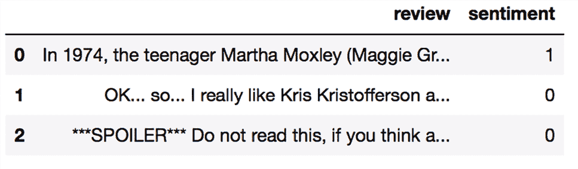

# eight

# 机器学习在情感分析中的应用

在现代互联网和社交媒体时代，人们的意见、评论和建议已经成为政治科学和商业的宝贵资源。由于现代技术，我们现在能够最有效地收集和分析这些数据。在本章中，我们将深入研究**自然语言处理** ( **NLP** )的一个子领域，称为**情感分析**，并学习如何使用机器学习算法根据文档的情感对文档进行分类:作者的态度。特别是，我们将使用来自互联网电影数据库 ( **IMDb** )的 50，000 条电影评论的数据集，并建立一个可以区分正面和负面评论的预测器。

我们将在本章中讨论的主题包括以下内容:

*   清理和准备文本数据
*   从文本文档构建特征向量
*   训练机器学习模型来分类正面和负面的电影评论
*   使用核外学习处理大型文本数据集
*   从文档集合中推断用于分类的主题

# 为文本处理准备 IMDb 电影评论数据

正如提到的，情感分析，有时也被称为**意见挖掘**，是 NLP 更广泛领域的一个流行分支；它涉及分析文档的情感。情感分析中的一个流行任务是基于作者对特定主题表达的观点或情感对文档进行分类。

在这一章中，我们将使用安德鲁·马斯和其他人收集的来自 IMDb 的电影评论的大型数据集(*学习用于情感分析的词向量*由 *A. L .马斯*、 *R. E. Daly* 、 *P. T. Pham* 、 *D. Huang* 、 *A. Y. Ng* 和 *C. Potts* ， *计算语言学协会第 49 届年会会议录:人类语言技术*，第 142-150 页，美国俄勒冈州波特兰市，计算语言学协会2011 年 6 月)。 电影评论数据集由 50，000 条极地电影评论组成，这些评论被标记为正面或负面；在这里，正面意味着一部电影在 IMDb 的评分超过六颗星，负面意味着一部电影在 IMDb 的评分低于五颗星。在以下几节中，我们将下载数据集，将其预处理为机器学习工具可用的格式，并从这些电影评论的子集提取有意义的信息，以建立一个机器学习模型，该模型可以预测某个评论者是否喜欢某部电影。

## 获取电影评论数据集

电影评论数据集的压缩档案(84.1 MB)可以从[http://ai.stanford.edu/~amaas/data/sentiment/](http://ai.stanford.edu/~amaas/data/sentiment/)下载为 gzip 压缩的 tarball 档案:

*   如果您是使用 Linux 或 macOS 的，您可以打开一个新的终端窗口，`cd`进入下载目录，并执行`tar -zxf aclImdb_v1.tar.gz`来解压缩数据集。
*   如果你使用的是 Windows，你可以下载一个免费的归档程序，比如 7-Zip([http://www.7-zip.org](http://www.7-zip.org))，从下载的归档文件中提取文件。
*   或者，您可以直接用 Python 解压 gzip 压缩的 tarball 归档文件，如下所示:

    ```py
    >>> import tarfile

    >>> with tarfile.open('aclImdb_v1.tar.gz', 'r:gz') as tar:

    ...     tar.extractall() 
    ```

## 将电影数据集预处理成更方便的格式

成功地提取了数据集之后，我们现在将把解压缩的下载档案中的单个文本文档组装成一个 CSV 文件。在下面的代码部分中，我们将把电影评论读入一个 pandas `DataFrame`对象，这在一台标准的桌面计算机上可能需要 10 分钟。

为了可视化进度和预计完成时间，我们将使用 **Python 进度指示器** ( **PyPrind** ，[https://pypi.python.org/pypi/PyPrind/](https://pypi.python.org/pypi/PyPrind/))包，它是几年前为实现此目的而开发的。PyPrind 可以通过执行`pip install pyprind`命令来安装:

```py
>>> import pyprind

>>> import pandas as pd

>>> import os

>>> import sys

>>> # change the 'basepath' to the directory of the

>>> # unzipped movie dataset

>>> basepath = 'aclImdb'

>>>

>>> labels = {'pos': 1, 'neg': 0}

>>> pbar = pyprind.ProgBar(50000, stream=sys.stdout)

>>> df = pd.DataFrame()

>>> for s in ('test', 'train'):

...     for l in ('pos', 'neg'):

...         path = os.path.join(basepath, s, l)

...         for file in sorted(os.listdir(path)):

...             with open(os.path.join(path, file),

...                       'r', encoding='utf-8') as infile:

...                 txt = infile.read()

...             df = df.append([[txt, labels[l]]],

...                            ignore_index=True)

...             pbar.update()

>>> df.columns = ['review', 'sentiment']

0%                          100%

[##############################] | ETA: 00:00:00

Total time elapsed: 00:00:25 
```

在前面的代码中，我们首先用 50，000 次迭代初始化了一个新的进度条对象`pbar`，这是我们将要读入的文档数。使用嵌套的`for`循环，我们遍历主`aclImdb`目录中的`train`和`test`子目录，并从`pos`和`neg`子目录中读取单个文本文件，我们最终将它们附加到`df` pandas `DataFrame`中，以及一个整数类标签(1 =正，0 =负)。

由于集合数据集中的类标签已经排序，我们现在将使用`np.random`子模块中的`permutation`函数来打乱`DataFrame`——这将有助于在后面的部分中将数据集分成训练和测试数据集，届时我们将直接从本地驱动器传输数据。

为了方便起见，我们还会将组合和打乱的电影评论数据集存储为 CSV 文件:

```py
>>> import numpy as np

>>> np.random.seed(0)

>>> df = df.reindex(np.random.permutation(df.index))

>>> df.to_csv('movie_data.csv', index=False, encoding='utf-8') 
```

由于我们将在本章的后面使用该数据集，因此让我们通过读入 CSV 并打印前三个示例的摘录来快速确认我们已经成功地以正确的格式保存了数据:

```py
>>> df = pd.read_csv('movie_data.csv', encoding='utf-8')

>>> # the following column renaming is necessary on some computers:

>>> df = df.rename(columns={"0": "review", "1": "sentiment"})

>>> df.head(3) 
```

如果您正在 Jupyter 笔记本中运行代码示例，您现在应该会看到数据集的前三个示例，如*图 8.1* 所示:



图 8.1:电影评论数据集的前三行

作为健全性检查，在我们进入下一节之前，让我们确保`DataFrame`包含所有 50，000 行:

```py
>>> df.shape

(50000, 2) 
```

# 介绍单词袋模型

你可能还记得*第 4 章*、*构建良好的训练数据集——数据预处理*，我们必须将文本或单词等分类数据转换成数字形式，然后才能将其传递给机器学习算法。在这一节中，我们将介绍**单词袋**模型，它允许我们将文本表示为数字特征向量。单词袋背后的思想非常简单，可以总结如下:

1.  我们从整组文档中创建一个惟一标记的词汇表，例如单词。
2.  我们从每个文档中构造一个特征向量，它包含每个单词在特定文档中出现的频率。

由于每个文档中的唯一单词只代表单词袋词汇表中所有单词的一个小子集，因此特征向量将主要由零组成，这就是为什么我们称它们为**稀疏**。如果这听起来太抽象，不要担心；在下面的小节中，我们将一步一步地完成创建简单单词袋模型的过程。

## 将单词转换成特征向量

为了基于各个文档中的单词计数构建一个单词袋模型，我们可以使用 scikit-learn 中实现的`CountVectorizer`类。正如您将在下面的代码部分中看到的，`CountVectorizer`接受一个文本数据数组，它可以是文档或句子，并为我们构建单词袋模型:

```py
>>> import numpy as np

>>> from sklearn.feature_extraction.text import CountVectorizer

>>> count = CountVectorizer()

>>> docs = np.array(['The sun is shining',

...                  'The weather is sweet',

...                  'The sun is shining, the weather is sweet,'

...                  'and one and one is two'])

>>> bag = count.fit_transform(docs) 
```

通过调用`CountVectorizer`上的`fit_transform`方法，我们构建了词袋模型的词汇，并将以下三个句子转换为稀疏特征向量:

*   `'The sun is shining'`
*   `'The weather is sweet'`
*   `'The sun is shining, the weather is sweet, and one and one is two'`

现在，让我们打印词汇表的内容，以便更好地理解基本概念:

```py
>>> print(count.vocabulary_)

{'and': 0,

'two': 7,

'shining': 3,

'one': 2,

'sun': 4,

'weather': 8,

'the': 6,

'sweet': 5,

'is': 1} 
```

从执行前面的命令中可以看出，词汇表存储在 Python 字典中，该字典将唯一的单词映射到整数索引。接下来，让我们打印刚刚创建的特征向量:

```py
>>> print(bag.toarray())

[[0 1 0 1 1 0 1 0 0]

 [0 1 0 0 0 1 1 0 1]

 [2 3 2 1 1 1 2 1 1]] 
```

这里显示的特征向量中的每个索引位置对应于作为字典项目存储在`CountVectorizer`词汇表中的整数值。例如，索引位置`0`处的第一个特征类似于仅出现在最后一个文档中的单词`'and'`的计数，而索引位置`1`处的单词`'is'`(文档向量中的第二个特征)出现在所有三个句子中。特征向量中的这些值也被称为**原始术语频率** : *tf* ( *t* ，*d*)—术语 *t* 在文档 *d* 中出现的次数。应该注意的是，在单词袋模型中，句子或文档中的单词或术语顺序并不重要。术语频率在特征向量中出现的顺序从词汇索引中导出，词汇索引通常按字母顺序分配。

**N 元模型**

我们刚刚创建的单词袋模型中的项目序列也被称为 1-gram 或 unigram 模型——词汇表中的每个项目或标记代表一个单词。更一般地说， NLP 中的连续项目序列——单词、字母或符号——也被称为 *n 元语法*。n 元模型中的数 *n* 的选择取决于特定的应用；例如，Ioannis Kanaris 和其他人的一项研究显示，大小为 3 和 4 的 n 元文法在电子邮件消息的反垃圾邮件过滤中产生良好的性能(*单词与字符 n 元文法的反垃圾邮件过滤*)

为了总结 n 元语法表示的概念，我们的第一个文档“太阳在照耀”的 1 元语法和 2 元语法表示将构造如下:

*   1 克:“太阳”，“太阳”，“是”，“闪亮的”
*   2 克:“太阳”，“太阳是”，“照耀着”

scikit-learn 中的`CountVectorizer`类允许我们通过它的`ngram_range`参数使用不同的 n 元模型。虽然默认使用 1-gram 表示，但是我们可以通过用`ngram_range=(2,2)`初始化一个新的`CountVectorizer`实例来切换到 2-gram 表示。

## 通过词频-逆文档频率评估单词相关性

当我们分析文本数据时，我们经常会遇到出现在两个类的多个文档中的单词。这些频繁出现的单词通常不包含有用的或歧视性的信息。在这一小节中，你将了解到一种叫做**词频-逆文档频率** ( **tf-idf** )的有用技术，它可以用来降低特征向量中这些频繁出现的单词的权重。tf-idf 可以定义为术语频率和逆文档频率的乘积:

*tf-idf* ( *t* ， *d* ) = *tf* ( *t* ，*d*)×*IDF*(*t*， *d* )

这里， *tf* ( *t* ， *d* )是我们上一节介绍的词频， *idf* ( *t* ， *d* )是逆文档频率，可以计算如下:


这里， *n* [d] 为文档总数， *df* ( *d* ， *t* )为包含术语 *t* 的文档数 *d* 。请注意，将常数 1 添加到分母是可选的，目的是将非零值分配给没有在任何训练示例中出现的项；*日志*用于确保低文档频率不会被赋予过多的权重。

scikit-learn 库实现了另一个转换器，即`TfidfTransformer`类，它将来自`CountVectorizer`类的原始术语频率作为输入，并将它们转换成 TF-IDF:

```py
>>> from sklearn.feature_extraction.text import TfidfTransformer

>>> tfidf = TfidfTransformer(use_idf=True,

...                          norm='l2',

...                          smooth_idf=True)

>>> np.set_printoptions(precision=2)

>>> print(tfidf.fit_transform(count.fit_transform(docs))

...       .toarray())

[[ 0\.    0.43  0\.    0.56  0.56  0\.    0.43  0\.    0\.  ]

 [ 0\.    0.43  0\.    0\.    0\.    0.56  0.43  0\.    0.56]

 [ 0.5   0.45  0.5   0.19  0.19  0.19  0.3   0.25  0.19]] 
```

正如您在前一小节中看到的，单词`'is'`在第三个文档中出现频率最高，是出现频率最高的单词。然而，在将相同的特征向量转换成 tf-idf 之后，单词`'` `is'`现在与第三文档中相对较小的 tf-idf (0.45)相关联，因为它也出现在第一和第二文档中，因此不太可能包含任何有用的区别信息。

然而，如果我们手动计算特征向量中单个术语的 TF-IDF，我们会注意到`TfidfTransformer`计算 TF-IDF 的方式与我们之前定义的标准教科书方程略有不同。scikit-learn 中实现的反向文档频率的公式计算如下:


类似地，在 scikit-learn 中计算的 tf-idf 稍微偏离我们先前定义的默认方程:

*tf-idf* ( *t* ， *d* ) = *tf* ( *t* ，*d*)×(*IDF*(*t*， *d* ) + 1)

请注意，前面的 idf 等式中的“+1”是由于前面的代码示例中设置了`smooth_idf=True`，这有助于为所有文档中出现的术语分配零权重(即， *idf* ( *t* ， *d* ) = log(1) = 0)。

虽然在计算 TF-IDF 之前对原始项频率进行归一化也是更典型的，但是`TfidfTransformer`类直接对 TF-IDF 进行归一化。默认情况下(`norm='l2'`)，scikit-learn 的`TfidfTransformer`应用 L2 归一化，通过将未归一化的特征向量 *v* 除以其 L2 范数来返回长度为 1 的向量:


为了确保我们理解了`TfidfTransformer`是如何工作的，让我们通过一个例子来计算第三个文档中单词`'is'`的 tf-idf。单词`'is'`在第三个文档中具有 3 ( *tf* = 3)的词频，并且由于词`'is'`在所有三个文档中都出现( *df* = 3)，所以该词的文档频率为 3。因此，我们可以如下计算逆文档频率:


现在，为了计算 tf-idf，我们只需将逆文档频率加 1，然后乘以频率项:


如果我们对第三个文档中的所有项重复这个计算，我们将获得下面的 tf-idf 向量:`[3.39, 3.0, 3.39, 1.29, 1.29, 1.29, 2.0, 1.69, 1.29]`。但是，请注意，这个特征向量中的值不同于我们从之前使用的`TfidfTransformer`中获得的值。我们在 tf-idf 计算中缺少的最后一步是 L2 归一化，它可以应用如下:


如您所见，现在的结果与 scikit-learn 的`TfidfTransformer`返回的结果相匹配，既然您现在已经理解了 TF-IDF 是如何计算的，那么让我们继续下一部分，并将这些概念应用于电影评论数据集。

## 清理文本数据

在前面的小节中，我们学习了词袋模型、词频和 TF-IDF。然而，在我们构建单词袋模型之前，第一个重要的步骤是清除文本数据中所有不需要的字符。

为了说明这一点的重要性，让我们显示重新洗牌的电影评论数据集中第一个文档的最后 50 个字符:

```py
>>> df.loc[0, 'review'][-50:]

'is seven.<br /><br />Title (Brazil): Not Available' 
```

正如您在这里看到的，文本包含 HTML 标记以及标点符号和其他非字母字符。虽然 HTML 标记不包含许多有用的语义，但在某些 NLP 上下文中，标点符号可以表示有用的附加信息。然而，为了简单起见，我们现在将删除除表情符号以外的所有标点符号，例如:)，因为这些符号对于情感分析肯定是有用的。

为了完成这个任务，我们将使用 Python 的**正则表达式** ( **regex** )库`re`，如下所示:

```py
>>> import re

>>> def preprocessor(text):

...     text = re.sub('<[^>]*>', '', text)

...     emoticons = re.findall('(?::|;|=)(?:-)?(?:\)|\(|D|P)',

...                            text)

...     text = (re.sub('[\W]+', ' ', text.lower()) +

...             ' '.join(emoticons).replace('-', ''))

...     return text 
```

在前面的代码部分中，通过第一个正则表达式`<[^>]*>`，我们试图从电影评论中删除所有的 HTML 标记。尽管许多程序员通常建议不要使用正则表达式来解析 HTML，但是这个正则表达式应该足以*清理*这个特定的数据集。因为我们只对移除 HTML 标记感兴趣，并且不打算进一步使用 HTML 标记，所以使用 regex 来完成这项工作应该是可以接受的。然而，如果你喜欢使用复杂的工具从文本中移除 HTML 标记，你可以看看 Python 的 HTML 解析器模块，在[https://docs.python.org/3/library/html.parser.html](https://docs.python.org/3/library/html.parser.html)中有描述。在我们移除了 HTML 标记之后，我们使用了一个稍微复杂一点的正则表达式来查找表情符号，我们将它临时存储为表情符号。接下来，我们通过 regex `[\W]+`从文本中删除所有非单词字符，并将文本转换成小写字符。

**处理单词大写**

在这个分析的上下文中，我们假设一个单词的大写——例如，它是否出现在句子的开头——不包含语义相关的信息。但是，注意也有例外；例如，我们去掉了专有名词的符号。但是，在这个分析的上下文中，这是一个简化的假设，即字母大小写不包含与情感分析相关的信息。

最终，我们将临时存储的表情符号添加到处理后的文档字符串的末尾。此外，为了一致性，我们从表情符号中删除了*鼻子*字符(- in :-)。

**正则表达式**

尽管正则表达式提供了一种高效便捷的方法来搜索字符串中的字符，但是它们也有一个陡峭的学习曲线。不幸的是，对正则表达式的深入讨论超出了本书的范围。然而，你可以在谷歌开发者门户网站的[https://Developers . Google . com/edu/python/regular-expressions](https://developers.google.com/edu/python/regular-expressions)找到一个很棒的教程，或者你可以在[https://docs.python.org/3.9/library/re.html](https://docs.python.org/3.9/library/re.html)查看 Python 的`re`模块的官方文档。

尽管在清理后的文档字符串末尾添加表情符号看起来可能不是最优雅的方法，但是我们必须注意，如果我们的词汇表只包含一个单词的标记，那么单词的顺序在我们的单词袋模型中并不重要。但是在我们更多地讨论将文档分割成单独的术语、单词或标记之前，让我们确认一下我们的`preprocessor`函数是否工作正常:

```py
>>> preprocessor(df.loc[0, 'review'][-50:])

'is seven title brazil not available'

>>> preprocessor("</a>This :) is :( a test :-)!")

'this is a test :) :( :)' 
```

最后，由于我们将在接下来的部分中反复使用使用*清理过的*文本数据，现在让我们将`preprocessor`函数应用于`DataFrame`中的所有电影评论:

```py
>>> df['review'] = df['review'].apply(preprocessor) 
```

## 将文档处理成令牌

在成功地准备了电影评论数据集之后，我们现在需要考虑如何将文本语料库分割成单独的元素。对文档进行*标记化的一种方法是通过在空白字符处分割干净的文档，将它们分割成单个单词:*

```py
>>> def tokenizer(text):

...     return text.split()

>>> tokenizer('runners like running and thus they run')

['runners', 'like', 'running', 'and', 'thus', 'they', 'run'] 
```

在标记化的背景下，另一个有用的技术是**词干化**，这是将一个单词转换成其词根形式的过程。它允许我们将相关的单词映射到同一个词干。最初的词干算法是由马丁·f·波特在 1979 年开发的，因此被称为波特词干分析器算法(由*马丁·f·波特*、*计划:电子图书馆和信息系统*，14(3):130–137，1980 年开发的一种后缀剥离算法*)。用于 Python 的**自然语言工具包** ( **NLTK** ，[http://www.nltk.org](http://www.nltk.org))实现了波特词干算法，我们将在下面的代码部分使用该算法。要安装 NLTK，您可以简单地执行`conda install nltk`或`pip install nltk`。*

**NLTK 在线图书**

虽然 NLTK 不是本章的重点，但是如果您对 NLP 中更高级的应用感兴趣，我强烈建议您访问 NLTK 网站并阅读 NLTK 官方书籍，这本书可以在[http://www.nltk.org/book/](http://www.nltk.org/book/)免费获得。

以下代码显示了如何使用波特词干算法:

```py
>>> from nltk.stem.porter import PorterStemmer

>>> porter = PorterStemmer()

>>> def tokenizer_porter(text):

...     return [porter.stem(word) for word in text.split()]

>>> tokenizer_porter('runners like running and thus they run')

['runner', 'like', 'run', 'and', 'thu', 'they', 'run'] 
```

使用来自`nltk`包的`PorterStemmer`,我们修改了我们的`tokenizer`函数，将单词简化为它们的词根形式,这在前面的简单示例中有所说明，其中单词`'running'`由*派生为词根形式*`'run'`。

**词干算法**

波特词干算法可能是最古老也是最简单的词干算法。其他流行的词干算法包括较新的 Snowball stemmer (Porter2 或 English stemmer)和 Lancaster stemmer(Paice/shell stemmer)。虽然 Snowball 和 Lancaster stemmer 都比最初的 Porter stemmer 快，但 Lancaster stemmer 也因比 Porter stemmer 更具攻击性而臭名昭著，这意味着它将产生更短、更难懂的单词。这些可选的词干算法也可以通过 NLTK 包获得([http://www.nltk.org/api/nltk.stem.html](http://www.nltk.org/api/nltk.stem.html))。

虽然词干可以创建非真实的单词，如`'thu'`(来自`'thus'`)，如前一个示例所示，一种称为*词条化*的技术旨在获得单个单词的规范(语法正确)形式，即所谓的*词条*。然而，与词干化相比，词汇化在计算上更加困难和昂贵，并且在实践中，已经观察到词干化和词汇化对文本分类的性能几乎没有影响(*单词规范化对文本分类的影响*，作者*迈克尔·托曼*、*罗曼·特萨尔*和*卡雷尔·耶泽克*、*in scit*会议录，第 354–358 页，2006)。

在我们进入下一部分之前，我们将使用词袋模型训练机器学习模型，让我们简单谈谈另一个有用的话题，称为**停用词移除**。停用词就是那些在各种文本中极其常见的词，可能没有(或只有一点点)可用于区分不同类别文档的有用信息。停用词的例子有*是*、*和*、*有*、*像*。如果我们使用的是原始的或归一化的词频，而不是 TF-IDF，去除停用词可能是有用的，TF-IDF 已经降低了频繁出现的词的权重。

为了从电影评论中删除停用词，我们将使用 NLTK 库中的 127 个英语停用词，可以通过调用`nltk.download`函数获得:

```py
>>> import nltk

>>> nltk.download('stopwords') 
```

下载停用词集后，我们可以加载并应用英文停用词集，如下所示:

```py
>>> from nltk.corpus import stopwords

>>> stop = stopwords.words('english')

>>> [w for w in tokenizer_porter('a runner likes'

...  ' running and runs a lot')

...  if w not in stop]

['runner', 'like', 'run', 'run', 'lot'] 
```

# 训练用于文档分类的逻辑回归模型

在本节中，我们将训练一个逻辑回归模型，根据词袋模型将电影评论分为*正面*和*负面*评论。首先，我们将清洗后的文本文档`DataFrame`分为 25000 个用于训练的文档和 25000 个用于测试的文档:

```py
>>> X_train = df.loc[:25000, 'review'].values

>>> y_train = df.loc[:25000, 'sentiment'].values

>>> X_test = df.loc[25000:, 'review'].values

>>> y_test = df.loc[25000:, 'sentiment'].values 
```

接下来，我们将使用一个`GridSearchCV`对象，通过 5 重分层交叉验证，为我们的逻辑回归模型找到最佳参数集:

```py
>>> from sklearn.model_selection import GridSearchCV

>>> from sklearn.pipeline import Pipeline

>>> from sklearn.linear_model import LogisticRegression

>>> from sklearn.feature_extraction.text import TfidfVectorizer

>>> tfidf = TfidfVectorizer(strip_accents=None,

...                         lowercase=False,

...                         preprocessor=None)

>>> small_param_grid = [

...     {

...         'vect__ngram_range': [(1, 1)],

...         'vect__stop_words': [None],

...         'vect__tokenizer': [tokenizer, tokenizer_porter],

...         'clf__penalty': ['l2'],

...         'clf__C': [1.0, 10.0]

...     },

...     {

...         'vect__ngram_range': [(1, 1)],

...         'vect__stop_words': [stop, None],

...         'vect__tokenizer': [tokenizer],

...         'vect__use_idf':[False],

...         'vect__norm':[None],

...         'clf__penalty': ['l2'],

...         'clf__C': [1.0, 10.0]

...     },

... ]

>>> lr_tfidf = Pipeline([

...     ('vect', tfidf),

...     ('clf', LogisticRegression(solver='liblinear'))

... ])

>>> gs_lr_tfidf = GridSearchCV(lr_tfidf, small_param_grid,

...                            scoring='accuracy', cv=5,

...                            verbose=2, n_jobs=1)

>>> gs_lr_tfidf.fit(X_train, y_train) 
```

请注意，对于逻辑回归分类器，我们使用 LIBLINEAR 求解器，因为对于相对较大的数据集，它的性能优于默认选择(`'lbfgs'`)。

**通过 n_jobs 参数进行多重处理**

请注意，我们强烈建议设置`n_jobs=-1`(而不是前面代码示例中的`n_jobs=1`)来利用机器上所有可用的内核，并加速网格搜索。然而，一些 Windows 用户报告了在 Windows 上使用`n_jobs=-1`设置运行之前的代码时出现的问题，这些设置与酸洗`tokenizer`和`tokenizer_porter`函数以进行多处理有关。另一个解决方法是用`[str.split]`替换这两个函数`[tokenizer, tokenizer_porter]`。但是，请注意，简单的`str.split`替换不支持词干。

当我们使用前面的代码初始化`GridSearchCV`对象及其参数网格时，我们将自己限制在有限数量的参数组合，因为特征向量的数量以及大量的词汇会使网格搜索在计算上非常昂贵。使用标准台式计算机，我们的网格搜索可能需要 5-10 分钟才能完成。

在前面的代码示例中，我们用`TfidfVectorizer`替换了前面小节中的`CountVectorizer`和`TfidfTransformer`，它将`CountVectorizer`和`TfidfTransformer`组合在一起。我们的`param_grid`由两个参数字典组成。在第一个字典中，我们使用带有默认设置(`use_idf=True`、`smooth_idf=True`和`norm='l2'`)的`TfidfVectorizer`来计算 TF-idfs；在第二个字典中，我们将这些参数设置为`use_idf=False`、`smooth_idf=False`和`norm=None`，以便基于原始术语频率训练模型。此外，对于逻辑回归分类器本身，我们通过惩罚参数使用 L2 正则化来训练模型，并通过定义反正则化参数`C`的值范围来比较不同的正则化强度。作为一个可选练习，也鼓励您通过将`'clf__penalty': ['l2']`更改为`'clf__penalty': ['l2', 'l1']`来将 L1 正则化添加到参数网格中。

网格搜索完成后，我们可以打印最佳参数集:

```py
>>> print(f'Best parameter set: {gs_lr_tfidf.best_params_}')

Best parameter set: {'clf__C': 10.0, 'clf__penalty': 'l2', 'vect__ngram_range': (1, 1), 'vect__stop_words': None, 'vect__tokenizer': <function tokenizer at 0x169932dc0>} 
```

正如您在前面的输出中看到的，我们使用常规的`tokenizer`获得了最佳的网格搜索结果，没有波特词干，没有停用词库，tf-idfs 与逻辑回归分类器结合使用，后者使用正则化强度为`10.0`的 L2 正则化。

使用此网格搜索中的最佳模型，让我们在训练数据集上打印平均 5 倍交叉验证准确性分数，在测试数据集上打印分类准确性分数:

```py
>>> print(f'CV Accuracy: {gs_lr_tfidf.best_score_:.3f}')

CV Accuracy: 0.897

>>> clf = gs_lr_tfidf.best_estimator_

>>> print(f'Test Accuracy: {clf.score(X_test, y_test):.3f}')

Test Accuracy: 0.899 
```

结果显示，我们的机器学习模型可以以 90%的准确率预测电影评论是正面还是负面。

**朴素贝叶斯分类器**

用于文本分类的一个仍然非常流行的分类器是朴素贝叶斯分类器，它在电子邮件垃圾邮件过滤应用程序中很受欢迎。与其他算法相比，朴素贝叶斯分类器易于实现，计算效率高，并且往往在相对较小的数据集上表现得特别好。虽然我们在本书中不讨论朴素贝叶斯分类器，但有兴趣的读者可以在 arXiv 上找到一篇关于朴素贝叶斯文本分类的免费文章(*朴素贝叶斯和文本分类 I-简介和理论*作者 *S .拉什卡*，*计算研究库* ( *CoRR* )，abs/1410.5329，2014，[http://arxiv.org/pdf/1410.5329v3.pdf](http://arxiv.org/pdf/1410.5329v3.pdf))。本文中引用的不同版本的朴素贝叶斯分类器都是在 scikit-learn 中实现的。你可以在这里找到一个链接到各自代码类的概述页面:[https://scikit-learn.org/stable/modules/naive_bayes.html](https://scikit-learn.org/stable/modules/naive_bayes.html)。

# 处理更大的数据–在线算法和核外学习

如果您执行了上一节中的代码示例，您可能已经注意到，在网格搜索过程中，为 50，000 部电影的评论数据集构造特征向量的计算量可能非常大。在许多现实世界的应用程序中，处理超过计算机内存的更大的数据集并不少见。

由于不是每个人都可以使用超级计算机设施，我们现在将应用一种叫做**核外学习**的技术，它允许我们通过在较小批次的数据集上逐步拟合分类器来处理如此大的数据集。

**用递归神经网络进行文本分类**

在*第 15 章*、*使用递归神经网络*对序列数据建模中，我们将重新访问这个数据集，并训练一个基于深度学习的分类器(递归神经网络)来对 IMDb 电影评论数据集中的评论进行分类。这种基于神经网络的分类器使用随机梯度下降优化算法遵循相同的核外原则，但是不需要构建单词袋模型。

回到*第二章*、*训练分类的简单机器学习算法*，引入了**随机梯度下降**的概念；这是一种优化算法，每次使用一个示例来更新模型的权重。在本节中，我们将利用 scikit 中`SGDClassifier`的`partial_fit`函数——学习直接从我们的本地驱动器流式传输文档，并使用小批量文档训练逻辑回归模型。

首先，我们将定义一个`tokenizer`函数，它从我们在本章开始时构建的`movie_data.csv`文件中清除未处理的文本数据，并在删除停用词的同时将它分成单词标记:

```py
>>> import numpy as np

>>> import re

>>> from nltk.corpus import stopwords

>>> stop = stopwords.words('english')

>>> def tokenizer(text):

...     text = re.sub('<[^>]*>', '', text)

...     emoticons = re.findall('(?::|;|=)(?:-)?(?:\)|\(|D|P)',

...                            text.lower())

...     text = re.sub('[\W]+', ' ', text.lower()) \

...                   + ' '.join(emoticons).replace('-', '')

...     tokenized = [w for w in text.split() if w not in stop]

...     return tokenized 
```

接下来，我们将定义一个生成器函数`stream_docs`，它一次读入并返回一个文档:

```py
>>> def stream_docs(path):

...     with open(path, 'r', encoding='utf-8') as csv:

...         next(csv) # skip header

...         for line in csv:

...             text, label = line[:-3], int(line[-2])

...             yield text, label 
```

为了验证我们的`stream_docs`函数是否正常工作，让我们从`movie_data.csv`文件中读取第一个文档，它应该返回一个由评论文本和相应的类标签组成的元组:

```py
>>> next(stream_docs(path='movie_data.csv'))

('"In 1974, the teenager Martha Moxley ... ',1) 
```

我们现在将定义一个函数`get_minibatch`，它将从`stream_docs`函数获取一个文档流，并返回由`size`参数指定的特定数量的文档:

```py
>>> def get_minibatch(doc_stream, size):

...     docs, y = [], []

...     try:

...         for _ in range(size):

...             text, label = next(doc_stream)

...             docs.append(text)

...             y.append(label)

...     except StopIteration:

...         return None, None

...     return docs, y 
```

不幸的是，我们不能使用`CountVectorizer`进行核外学习，因为它需要在内存中保存完整的词汇。另外，`TfidfVectorizer`需要将训练数据集的所有特征向量保存在内存中，以计算逆文档频率。然而，scikit-learn 中实现的另一个有用的文本处理矢量器是`HashingVectorizer`。`HashingVectorizer`是独立于数据的，通过奥斯丁·艾波的 32 位`MurmurHash3`函数使用散列技巧(你可以在[https://en.wikipedia.org/wiki/MurmurHash](https://en.wikipedia.org/wiki/MurmurHash)找到更多关于【MurmurHash 的信息):

```py
>>> from sklearn.feature_extraction.text import HashingVectorizer

>>> from sklearn.linear_model import SGDClassifier

>>> vect = HashingVectorizer(decode_error='ignore',

...                          n_features=2**21,

...                          preprocessor=None,

...                          tokenizer=tokenizer)

>>> clf = SGDClassifier(loss='log', random_state=1)

>>> doc_stream = stream_docs(path='movie_data.csv') 
```

使用前面的代码，我们用我们的`tokenizer`函数初始化`HashingVectorizer`,并将特性的数量设置为`2**21`。此外，我们通过将`SGDClassifier`的`loss`参数设置为`'log'`来重新初始化逻辑回归分类器。注意，通过在`HashingVectorizer`中选择大量的特性，我们减少了导致哈希冲突的机会，但是我们也增加了逻辑回归模型中的系数数量。

现在真正有趣的部分来了——已经设置了所有的补充函数，我们可以使用下面的代码开始核外学习:

```py
>>> import pyprind

>>> pbar = pyprind.ProgBar(45)

>>> classes = np.array([0, 1])

>>> for _ in range(45):

...     X_train, y_train = get_minibatch(doc_stream, size=1000)

...     if not X_train:

...         break

...     X_train = vect.transform(X_train)

...     clf.partial_fit(X_train, y_train, classes=classes)

...     pbar.update()

0%                          100%

[##############################] | ETA: 00:00:00

Total time elapsed: 00:00:21 
```

同样，我们利用 PyPrind 包来评估我们的学习算法的进展。我们用 45 次迭代初始化了进度条对象，在下面的`for`循环中，我们迭代了 45 个小批文档，其中每个小批包含 1，000 个文档。完成增量学习流程后，我们将使用最后 5，000 个文档来评估我们模型的性能:

```py
>>> X_test, y_test = get_minibatch(doc_stream, size=5000)

>>> X_test = vect.transform(X_test)

>>> print(f'Accuracy: {clf.score(X_test, y_test):.3f}')

Accuracy: 0.868 
```

**非类型错误**

请注意，如果你遇到一个`NoneType`错误，你可能已经执行了两次`X_test, y_test = get_minibatch(...)`代码。通过前面的循环，我们有 45 次迭代，每次获取 1，000 个文档。因此，正好有 5，000 个文档需要测试，我们通过以下方式分配:

```py
>>> X_test, y_test = get_minibatch(doc_stream, size=5000) 
```

如果我们执行这段代码两次，那么生成器中没有足够的文档，并且`X_test`返回`None`。因此，如果您遇到`NoneType`错误，您必须重新从先前的`stream_docs(...)`代码开始。

正如您所看到的，该模型的精确度大约为 87 %,略低于我们在上一节中使用网格搜索进行超参数调整所达到的精确度。但是，核外学习的内存效率非常高，不到一分钟就完成了。

最后，我们可以使用最后的 5，000 个文档来更新我们的模型:

```py
>>> clf = clf.partial_fit(X_test, y_test) 
```

**word 2 vec 型号**

单词袋模型的一个更现代的替代品是 word2vec，这是谷歌在 2013 年发布的一种算法(*t . miko lov*、 *K. Chen* 、 *G. Corrado* 和 *J. Dean* 、[https://arxiv.org/abs/1301.3781](https://arxiv.org/abs/1301.3781))。

word2vec 算法是一种基于神经网络的无监督学习算法，它试图自动学习单词之间的关系。word2vec 背后的想法是将具有相似含义的单词放入相似的簇中，通过巧妙的向量间距，该模型可以使用简单的向量数学来复制某些单词，例如，*国王*–*男人* + *女人* = *女王*。

可以在[https://code.google.com/p/word2vec/](https://code.google.com/p/word2vec/)找到原始的 C-implementation，以及相关论文和替代实现的有用链接。

# 基于潜在狄利克雷分配的主题建模

**主题建模**描述了将主题分配给未标记文本文档的广泛任务。例如，一个典型的应用是对报纸文章的大型文本语料库中的文档进行分类。在主题建模的应用中，我们的目标是为这些文章分配类别标签，例如，体育、金融、世界新闻、政治和本地新闻。因此，在我们在*第一章*、*中讨论的机器学习的广泛类别的背景下，赋予计算机从数据中学习的能力*，我们可以将主题建模视为聚类任务，这是无监督学习的一个子类。

在本节中，我们将讨论一种流行的主题建模技术，称为**潜在狄利克雷分配** ( **LDA** )。然而，请注意，虽然潜在的狄利克雷分配通常被缩写为 LDA，但不要将其与*线性判别分析*混淆，后者是一种监督降维技术，在*第 5 章*、*通过降维压缩数据*中介绍。

## 用 LDA 分解文本文档

由于 LDA 背后的数学非常复杂，并且需要贝叶斯推理的知识，我们将从从业者的角度来探讨这个话题，并使用外行的术语来解释 LDA。然而，感兴趣的读者可以在下面的研究论文中阅读更多关于 LDA 的内容:*潜在的狄利克雷分配*，作者:*大卫·m·布雷*，*安德鲁·y·Ng*，和*迈克尔·乔丹*，*机器学习研究杂志 3* ，页数:993-1022，2003 年 1 月，[https://www.jmlr.org/papers/volume3/blei03a/blei03a.pdf](https://www.jmlr.org/papers/volume3/blei03a/blei03a.pdf)。

LDA 是一个生成概率模型，它试图找到在不同文档中频繁出现的单词组。这些频繁出现的单词代表我们的主题，假设每个文档都是不同单词的混合。LDA 的输入是我们在本章前面讨论的单词袋模型。

给定一个单词袋矩阵作为输入，LDA 将其分解成两个新矩阵:

*   文档-主题矩阵
*   词到主题矩阵

LDA 以这样一种方式分解单词袋矩阵，如果我们将这两个矩阵相乘，我们将能够以尽可能低的误差再现输入，单词袋矩阵。实际上，我们感兴趣的是 LDA 在词袋矩阵中发现的那些主题。唯一的缺点可能是我们必须预先定义主题的数量——主题的数量是 LDA 的一个超参数，必须手动指定。

## 带 scikit 的 LDA 学习

在这一小节中，我们将使用 scikit-learn 中实现的`LatentDirichletAllocation`类来分解电影评论数据集，并将其分类到不同的主题中。在下面的示例中，我们将分析限制在 10 个不同的主题，但是鼓励读者试验算法的超参数，以进一步探索可以在该数据集中找到的主题。

首先，我们将使用本章开始时创建的电影评论的本地`movie_data.csv`文件将数据集加载到 pandas `DataFrame`中:

```py
>>> import pandas as pd

>>> df = pd.read_csv('movie_data.csv', encoding='utf-8')

>>> # the following is necessary on some computers:

>>> df = df.rename(columns={"0": "review", "1": "sentiment"}) 
```

接下来，我们将使用已经熟悉的`CountVectorizer`来创建单词袋矩阵作为 LDA 的输入。

为了方便起见，我们将通过`stop_words='english'`使用 scikit-learn 的内置英语停用词库:

```py
>>> from sklearn.feature_extraction.text import CountVectorizer

>>> count = CountVectorizer(stop_words='english',

...                         max_df=.1,

...                         max_features=5000)

>>> X = count.fit_transform(df['review'].values) 
```

请注意，我们将被考虑的单词的最大文档频率设置为 10%(`max_df=.1`)，以排除在文档中出现频率过高的单词。移除频繁出现的单词的基本原理是，这些单词可能是出现在所有文档中的常见单词，因此不太可能与给定文档的特定主题类别相关联。此外，我们将被考虑的单词的数量限制为最频繁出现的 5000 个单词(`max_features=5000`)，以限制该数据集的维度，从而改进由 LDA 执行的推理。然而，`max_df=.1`和`max_features=5000`都是任意选择的超参数值，鼓励读者在比较结果时调整它们。

下面的代码示例演示了如何将一个`LatentDirichletAllocation`估算器拟合到词袋矩阵中，并从文档中推断出 10 个不同的主题(注意，在笔记本电脑或标准台式计算机上，模型拟合可能需要 5 分钟或更长时间):

```py
>>> from sklearn.decomposition import LatentDirichletAllocation

>>> lda = LatentDirichletAllocation(n_components=10,

...                                 random_state=123,

...                                 learning_method='batch')

>>> X_topics = lda.fit_transform(X) 
```

通过设置`learning_method='batch'`，我们让`lda`估计器在一次迭代中基于所有可用的训练数据(词袋矩阵)进行估计，这比备选的`'online'`学习方法慢，但可以导致更准确的结果(设置`learning_method='online'`类似于在线或小批量学习，我们在*第 2 章*、*训练简单的机器学习算法用于分类*以及本章前面的内容中讨论过)。

**期望最大化**

scikit-learn 库的 LDA 实现使用**期望最大化** ( **EM** )算法来迭代更新其参数估计。我们在本章中没有讨论 EM 算法，但是如果你想了解更多，请参见维基百科上的精彩概述([https://en . Wikipedia . org/wiki/Expectation–maximization _ algorithm](https://en.wikipedia.org/wiki/Expectation–maximization_algorithm))和科罗拉多里德的教程*中关于如何在 LDA 中使用 EM 算法的详细教程，潜在狄利克雷分配:走向更深的理解*，该教程可在[http://obphio.us/pdfs/lda_tutorial.pdf](http://obphio.us/pdfs/lda_tutorial.pdf)免费获得。

在拟合了 LDA 之后，我们现在可以访问`lda`实例的`components_`属性，它存储了一个矩阵，该矩阵包含 10 个主题中每一个主题的单词 importance(这里是`5000`),按升序排列:

```py
>>> lda.components_.shape

(10, 5000) 
```

为了分析结果，让我们为 10 个主题中的每一个打印五个最重要的单词。请注意，单词重要性值按升序排列。因此，要打印前五个单词，我们需要以相反的顺序对主题数组进行排序:

```py
>>> n_top_words = 5

>>> feature_names = count.get_feature_names_out()

>>> for topic_idx, topic in enumerate(lda.components_):

...     print(f'Topic {(topic_idx + 1)}:')

...     print(' '.join([feature_names[i]

...                     for i in topic.argsort()\

...                     [:-n_top_words - 1:-1]]))

Topic 1:

worst minutes awful script stupid

Topic 2:

family mother father children girl

Topic 3:

american war dvd music tv

Topic 4:

human audience cinema art sense

Topic 5:

police guy car dead murder

Topic 6:

horror house sex girl woman

Topic 7:

role performance comedy actor performances

Topic 8:

series episode war episodes tv

Topic 9:

book version original read novel

Topic 10:

action fight guy guys cool 
```

根据阅读每个主题的五个最重要的单词，您可能会猜测 LDA 确定了以下主题:

1.  一般来说，糟糕的电影(不是真正的主题类别)
2.  关于家庭的电影
3.  战争电影
4.  艺术电影
5.  犯罪电影
6.  恐怖电影
7.  喜剧电影评论
8.  与电视节目有某种联系的电影
9.  根据书改编的电影
10.  动作电影

为了确认基于评论的分类是有意义的，让我们从恐怖电影类别中画出三部电影(恐怖电影在索引位置`5`属于类别 6):

```py
>>> horror = X_topics[:, 5].argsort()[::-1]

>>> for iter_idx, movie_idx in enumerate(horror[:3]):

...     print(f'\nHorror movie #{(iter_idx + 1)}:')

...     print(df['review'][movie_idx][:300], '...')

Horror movie #1:

House of Dracula works from the same basic premise as House of Frankenstein from the year before; namely that Universal's three most famous monsters; Dracula, Frankenstein's Monster and The Wolf Man are appearing in the movie together. Naturally, the film is rather messy therefore, but the fact that ...

Horror movie #2:

Okay, what the hell kind of TRASH have I been watching now? "The Witches' Mountain" has got to be one of the most incoherent and insane Spanish exploitation flicks ever and yet, at the same time, it's also strangely compelling. There's absolutely nothing that makes sense here and I even doubt there ...

Horror movie #3:

<br /><br />Horror movie time, Japanese style. Uzumaki/Spiral was a total freakfest from start to finish. A fun freakfest at that, but at times it was a tad too reliant on kitsch rather than the horror. The story is difficult to summarize succinctly: a carefree, normal teenage girl starts coming fac ... 
```

使用前面的代码示例，我们打印了前三部恐怖电影中的前 300 个字符。这些评论——尽管我们不知道它们具体属于哪部电影——听起来像是对恐怖电影的评论(然而，有人可能会说`Horror movie #2`也很适合主题类别 1: *通常是糟糕的电影*)。

# 摘要

在本章中，您学习了如何使用机器学习算法根据文本文档的极性对其进行分类，这是自然语言处理领域中情感分析的一项基本任务。您不仅学习了如何使用单词袋模型将文档编码为特征向量，还学习了如何使用 tf-idf 通过相关性对术语频率进行加权。

由于在此过程中创建了大量的特征向量，处理文本数据在计算上可能非常昂贵；在上一节中，我们介绍了如何利用核外或增量学习来训练机器学习算法，而无需将整个数据集加载到计算机的内存中。

最后，向您介绍了主题建模的概念，使用 LDA 以一种无人监督的方式将电影评论分类到不同的类别中。

到目前为止，在本书中，我们已经涵盖了许多机器学习概念、最佳实践和分类的监督模型。在下一章中，我们将看看监督学习的另一个子类，*回归分析*，它让我们在连续的规模上预测结果变量，这与我们迄今为止一直在使用的分类模型的分类类别标签形成对比。

# 加入我们书的不和谐空间

加入该书的 Discord workspace，每月与作者进行一次*向我提问*会议:

[https://packt.link/MLwPyTorch](https://packt.link/MLwPyTorch)

