<title>Chapter_9</title> <link href="../Styles/epub.css" rel="stylesheet" type="text/css"> <link href="../Styles/syntax-highlighting.css" rel="stylesheet" type="text/css">

# nine

# 用回归分析预测连续目标变量

在前面的章节中，你学到了很多关于**监督学习**背后的主要概念，并训练了许多不同的分类任务模型来预测组成员或分类变量。在这一章中，我们将深入监督学习的另一个子类:**回归分析**。

回归模型用于连续预测目标变量，这使得它们在解决许多科学问题时很有吸引力。它们在工业中也有应用，例如理解变量之间的关系，评估趋势，或者进行预测。一个例子是预测一家公司未来几个月的销售额。

在本章中，我们将讨论回归模型的主要概念，并涵盖以下主题:

*   探索和可视化数据集
*   查看实现线性回归模型的不同方法
*   训练对异常值稳健的回归模型
*   评估回归模型和诊断常见问题
*   用回归模型拟合非线性数据

# 引入线性回归

线性回归的目标是模拟一个或多个特征与连续目标变量之间的关系。与分类(监督学习的一个不同子类别)相反，回归分析旨在预测连续规模的输出，而不是分类类别标签。

在以下小节中，将向您介绍最基本的线性回归类型，**简单线性回归**，并了解如何将其与更一般的多元情况(具有多个特征的线性回归)联系起来。

## 简单线性回归

简单(**单变量**)线性回归的目标是对单个特征(**解释变量**、 *x* )和连续值**目标** ( **响应变量**、 *y* )之间的关系进行建模。具有一个解释变量的线性模型的方程定义如下:

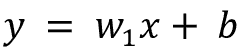

这里，参数(偏差单位)， *b* 代表 *y* 轴截距，*w*1 为解释变量的权重系数。我们的目标是学习线性方程的权重来描述解释变量和目标变量之间的关系，然后可以用它来预测不属于训练数据集的新解释变量的响应。

根据我们之前定义的线性方程，线性回归可以理解为通过训练示例找到最佳拟合直线，如图*图 9.1* 所示:


图 9.1:一个简单的一元线性回归示例

这条最佳拟合线也被称为**回归线**，从回归线到训练样本的垂直线是所谓的**偏移**或**残差**——我们预测的误差。

## 多元线性回归

前面的部分介绍了简单线性回归，这是带有一个解释变量的线性回归的特例。当然，我们也可以将线性回归模型推广到多个解释变量；这个过程叫做**多元线性回归**:

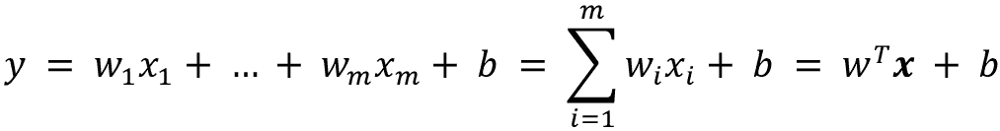

*图 9.2* 显示了具有两个特征的多元线性回归模型的二维拟合超平面:

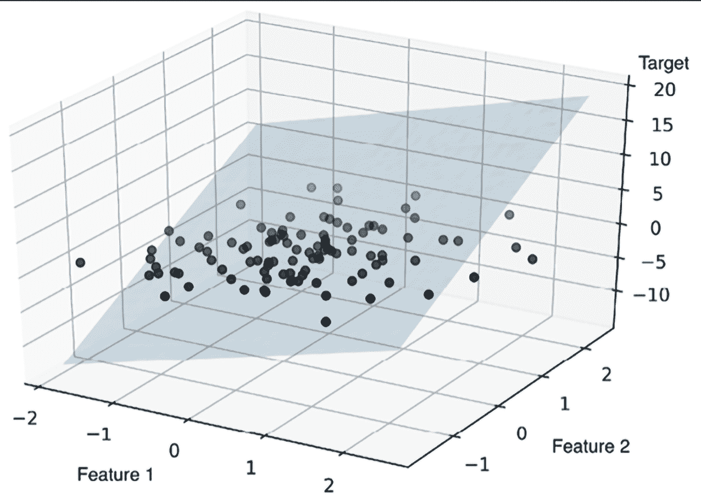

图 9.2:双特征线性回归模型

如您所见，在查看静态图时，三维散点图中的多元线性回归超平面的可视化已经很难解释了。由于我们没有在散点图中可视化二维超平面的好方法(多元线性回归模型适合具有三个或更多特征的数据集)，本章中的示例和可视化将主要集中在使用简单线性回归的单变量情况。然而，简单和多元线性回归是基于相同的概念和相同的评估技术；我们将在本章中讨论的代码实现也与这两种类型的回归模型兼容。

# 探索埃姆斯住宅数据集

在我们实现第一个线性回归模型之前，我们将讨论一个新的数据集，Ames Housing 数据集，它包含了从 2006 年到 2010 年爱荷华州 Ames 的个人住宅物业的信息。该数据集由 Dean De Cock 于 2011 年收集，其他信息可通过以下链接获得:

*   描述数据集的报告:[http://jse.amstat.org/v19n3/decock.pdf](http://jse.amstat.org/v19n3/decock.pdf)
*   关于数据集特征的详细文档:[http://jse.amstat.org/v19n3/decock/DataDocumentation.txt](http://jse.amstat.org/v19n3/decock/DataDocumentation.txt)
*   制表符分隔格式的数据集:[http://jse.amstat.org/v19n3/decock/AmesHousing.txt](http://jse.amstat.org/v19n3/decock/AmesHousing.txt)

与每个新数据集一样，通过简单的可视化来探索数据总是有帮助的，以便更好地了解我们正在处理的内容，这是我们将在以下小节中做的事情。

## 将 Ames Housing 数据集加载到数据框架中

在本节中，我们将使用 pandas `read_csv`函数加载 Ames Housing 数据集，该函数快速且功能多样，是处理以明文格式存储的表格数据的推荐工具。

Ames Housing 数据集由 2930 个示例和 80 个特征组成。为简单起见，我们将只使用功能的子集，如下表所示。但是，如果您有兴趣，请点击本节开头提供的完整数据集描述的链接，我们鼓励您在阅读本章后探索该数据集中的其他变量。

我们将使用的功能，包括目标变量，如下所示:

*   从 1(非常差)到 10(非常好)对房屋的整体材料和装修进行评级
*   从 1(非常差)到 10(非常好)对房屋整体状况的评分
*   `Gr Liv Area`:地上(地面)居住面积，平方英尺
*   `Central Air`:中央空调(N =否，Y =是)
*   `Total Bsmt SF`:地下室总面积平方英尺
*   `SalePrice`:美元售价

在本章的其余部分，我们将把销售价格(`SalePrice`)作为我们的目标变量——我们希望使用五个解释变量中的一个或多个来预测的变量。在我们进一步探索这个数据集之前，让我们将它加载到一个 pandas `DataFrame`中:

```py
import pandas as pd

columns = ['Overall Qual', 'Overall Cond', 'Gr Liv Area',

           'Central Air', 'Total Bsmt SF', 'SalePrice']

df = pd.read_csv('http://jse.amstat.org/v19n3/decock/AmesHousing.txt', 

                 sep='\t',

                 usecols=columns)

df.head() 
```

为了确认数据集加载成功，我们可以显示数据集的前五行，如图 9.3 所示:


图 9.3:住房数据集的前五行

在加载数据集之后，我们还要检查`DataFrame`的尺寸，以确保它包含预期的行数:

```py
>>> df.shape

(2930, 6) 
```

正如我们所见， `DataFrame`包含 2930 行，正如所料。

我们必须注意的另一个方面是`'Central Air'`变量，它被编码为类型`string`，正如我们在*图 9.3* 中看到的。正如我们在*第 4 章*、*构建良好的训练数据集——数据预处理*中所了解到的，我们可以使用`.map`方法来转换`DataFrame`列。下面的代码将字符串`'` `Y'`转换为整数 1，并将字符串`'N'`转换为整数 0:

```py
>>> df['Central Air'] = df['Central Air'].map({'N': 0, 'Y': 1}) 
```

最后，让我们检查是否有任何数据框列包含缺失值:

```py
>>> df.isnull().sum()

Overall Qual     0

Overall Cond     0

Total Bsmt SF    1

Central Air      0

Gr Liv Area      0

SalePrice        0

dtype: int64 
```

正如我们所见，`Total Bsmt SF`特征变量包含一个缺失值。由于我们有一个相对大的数据集，最简单的处理这个缺失特征值的方法是从数据集中删除相应的例子(替代方法，请参见*第 4 章*):

```py
>>> df = df.dropna(axis=0)

>>> df.isnull().sum()

Overall Qual     0

Overall Cond     0

Total Bsmt SF    0

Central Air      0

Gr Liv Area      0

SalePrice        0

dtype: int64 
```

## 可视化数据集的重要特征

**探索性数据分析** ( **EDA** )是机器学习模型训练前的重要且推荐的第一步。在本节的其余部分，我们将使用图形 EDA 工具箱中的一些简单而有用的技术，这些技术可以帮助我们直观地检测异常值的存在、数据的分布以及特性之间的关系。

首先，我们将创建一个**散点图矩阵**，它允许我们在一个地方可视化该数据集中不同特征之间的成对相关性。为了绘制散点图矩阵，我们将使用 mlxtend 库(【http://rasbt.github.io/mlxtend/】)中的`scatterplotmatrix`函数，这是一个 Python 库，包含了 Python 中用于机器学习和数据科学应用的各种便利函数。

您可以通过`conda install mlxtend`或`pip install mlxtend`安装`mlxtend`包。对于本章，我们使用 mlxtend 版本 0.19.0。

安装完成后，您可以导入软件包并创建散点图矩阵，如下所示:

```py
>>> import matplotlib.pyplot as plt

>>> from mlxtend.plotting import scatterplotmatrix

>>> scatterplotmatrix(df.values, figsize=(12, 10), 

...                   names=df.columns, alpha=0.5)

>>> plt.tight_layout()

plt.show() 
```

正如您在*图 9.4* 中所看到的，散点图矩阵为我们提供了一个数据集关系的有用图形摘要:


图 9.4:我们数据的散点图矩阵

使用这个散点图矩阵，我们现在可以快速看到数据是如何分布的，以及它是否包含异常值。例如，我们可以看到(最下面一行左起第五列)，地面以上居住面积(`Gr Liv Area`)与销售价格(`SalePrice`)之间存在某种线性关系。

此外，我们可以在直方图(散点图矩阵的右下方子图)中看到,`SalePrice`变量似乎被几个异常值扭曲了。

**线性回归的正态性假设**

请注意，与普遍看法相反，训练线性回归模型不要求解释变量或目标变量呈正态分布。正态假设只是某些统计和假设检验的要求，超出了本书的范围(关于这个主题的更多信息，请参考*道格拉斯·c·蒙哥马利*、*伊丽莎白·a·佩克*和*g·杰弗里·维宁*、*威利*，第 318-319 页，2012)。

## 使用相关矩阵查看关系

在上一节中，我们以直方图和散点图的形式可视化了 Ames Housing 数据集变量的数据分布。接下来，我们将创建一个相关矩阵来量化和总结变量之间的线性关系。相关矩阵与协方差矩阵密切相关，我们在*第 5 章*、*通过降维压缩数据*中的*通过主成分分析进行无监督降维*一节中已经介绍过。我们可以将相关矩阵解释为协方差矩阵的重新缩放版本。事实上，相关矩阵等同于根据标准化特征计算的协方差矩阵。

相关矩阵是一个方阵，包含**皮尔逊积矩相关系数**(通常缩写为**皮尔逊的 r** )，它测量特征对之间的线性相关性。相关系数在–1 到 1 的范围内。如果 *r* = 1，则两个特征完全正相关；如果 *r* = 0，则不相关；如果*r*=–1，则完全负相关。如前所述，皮尔逊相关系数可以简单地计算为两个特征之间的协方差， *x* 和 *y* (分子)，除以其标准偏差的乘积(分母):

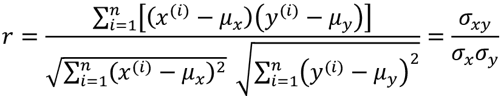

这里，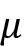表示对应特征的均值，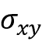是特征 *x* 和 *y* 之间的协方差，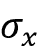和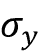是特征的标准差。

**标准化特征的协方差与相关性**

我们可以证明，一对标准化特征之间的协方差实际上等于它们的线性相关系数。为了说明这一点，让我们首先标准化特征 *x* 和 *y* 以获得它们的 z 分数，我们将分别表示为*x’*和*y’*:

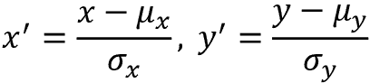

请记住，我们计算两个要素之间的(总体)协方差，如下所示:

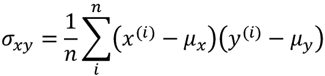

由于标准化使特征变量以均值零为中心，我们现在可以如下计算缩放后的特征之间的协方差:

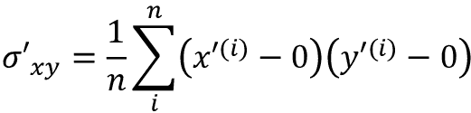

通过重置，我们得到以下结果:

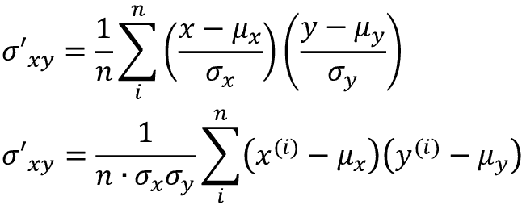

最后，我们可以将这个等式简化如下:

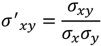

在下面的代码示例中，我们将对之前在散点图矩阵中可视化的五个特性列使用 NumPy 的`corrcoef`函数，并使用 mlxtend 的`heatmap`函数将相关矩阵数组绘制为热图:

```py
>>> import numpy as np

>>> from mlxtend.plotting import heatmap

>>> cm = np.corrcoef(df.values.T)

>>> hm = heatmap(cm, row_names=df.columns, column_names=df.columns)

>>> plt.tight_layout()

>>> plt.show() 
```

正如您在*图 9.5* 中看到的，相关性矩阵为我们提供了另一个有用的汇总图，可以帮助我们根据各自的线性相关性选择特征:


图 9.5:所选变量的相关矩阵

为了拟合线性回归模型，我们对那些与我们的目标变量`SalePrice`高度相关的特征感兴趣。查看前面的相关矩阵，我们可以看到`SalePrice`显示了与`Gr Liv Area`变量(`0.71`)的最大相关性，这似乎是一个探索性变量的好选择，以在下面的部分中引入简单线性回归模型的概念。

# 实现普通最小二乘线性回归模型

在本章的开头，我们提到线性回归可以理解为通过我们训练数据的例子获得最佳拟合的直线。然而，我们既没有定义术语*最佳拟合*，也没有讨论拟合这种模型的不同技术。在下面的小节中，我们将使用**普通最小二乘法** ( **OLS** )方法(有时也称为**线性最小二乘法**的)来估计线性回归线的参数，以最小化到训练示例的垂直距离(残差或误差)的平方和，从而填充这个难题的缺失部分。

## 用梯度下降法求解回归参数的回归

考虑我们的实现**自适应线性神经元** ( **Adaline** )来自*第二章*，*训练简单机器学习算法进行分类*。你会记得人工神经元使用线性激活函数。此外，我们定义了一个损失函数， *L* ( **w** )，我们通过优化算法使其最小化以学习权重，例如如**梯度下降** ( **GD** )和**随机梯度下降** ( **SGD** )。

Adaline 中的这个损失函数是的**均方误差** ( **MSE** )，这与我们用于 OLS 的损失函数相同:

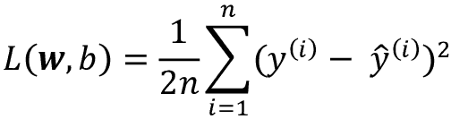

这里，是预测值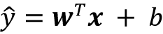(注意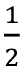这个术语只是为了方便推导 GD 的更新规则)。本质上，OLS 回归可以理解为没有阈值函数的 Adaline，以便我们获得连续的目标值，而不是类别标签`0`和`1`。为了证明这一点，让我们从第 2 章的*中选取 Adaline 的 GD 实现，并移除阈值函数来实现我们的第一个线性回归模型:*

```py
class LinearRegressionGD:

    def __init__(self, eta=0.01, n_iter=50, random_state=1):

        self.eta = eta

        self.n_iter = n_iter

        self.random_state = random_state

    def fit(self, X, y):

        rgen = np.random.RandomState(self.random_state)

        self.w_ = rgen.normal(loc=0.0, scale=0.01, size=X.shape[1])

        self.b_ = np.array([0.])

        self.losses_ = []

        for i in range(self.n_iter):

            output = self.net_input(X)

            errors = (y - output)

            self.w_ += self.eta * 2.0 * X.T.dot(errors) / X.shape[0]

            self.b_ += self.eta * 2.0 * errors.mean()

            loss = (errors**2).mean()

            self.losses_.append(loss)

        return self

    def net_input(self, X):

        return np.dot(X, self.w_) + self.b_

    def predict(self, X):

        return self.net_input(X) 
```

**梯度下降的重量更新**

如果你需要复习一下如何更新权重——在梯度的相反方向上迈出一步——请重温*第 2 章*中的*自适应线性神经元和学习收敛*部分。

为了查看我们的`LinearRegressionGD`回归变量的作用，让我们使用埃姆斯住房数据集中的`Gr Living Area`(地面以上居住面积的平方英尺)特征作为解释变量，并训练一个可以预测`SalePrice`的模型。此外，我们将标准化变量，以便更好地收敛 GD 算法。代码如下:

```py
>>> X = df[['Gr Liv Area']].values

>>> y = df['SalePrice'].values

>>> from sklearn.preprocessing import StandardScaler

>>> sc_x = StandardScaler()

>>> sc_y = StandardScaler()

>>> X_std = sc_x.fit_transform(X)

>>> y_std = sc_y.fit_transform(y[:, np.newaxis]).flatten()

>>> lr = LinearRegressionGD(eta=0.1)

>>> lr.fit(X_std, y_std) 
```

注意关于`y_std`的变通方法，使用`np.newaxis`和`flatten`。scikit-learn 中的大多数数据预处理类都希望数据存储在二维数组中。在前面的代码示例中，在`y[:, np.newaxis]`中使用`np.newaxis`为数组增加了一个新的维度。然后，在`StandardScaler`返回缩放后的变量后，为了方便起见，我们使用`flatten()`方法将其转换回原始的一维数组表示。

我们在*第 2 章*中讨论过，当我们使用优化算法(如 GD)来检查算法是否收敛到损失最小值(此处为*全局*损失最小值)时，将损失绘制为训练数据集上的历元数(完整迭代)的函数总是一个好主意:

```py
>>> plt.plot(range(1, lr.n_iter+1), lr.losses_)

>>> plt.ylabel('MSE')

>>> plt.xlabel('Epoch')

>>> plt.show() 
```

正如您在*图 9.6* 中看到的，GD 算法大约在第十个历元后收敛:


图 9.6:损失函数与历元数的关系

接下来，让我们看看线性回归线与训练数据的拟合程度。为此，我们将定义一个简单的帮助函数，该函数将绘制训练示例的散点图并添加回归线:

```py
>>> def lin_regplot(X, y, model):

...     plt.scatter(X, y, c='steelblue', edgecolor='white', s=70)

...     plt.plot(X, model.predict(X), color='black', lw=2) 
```

现在，我们将使用此`lin_regplot`函数绘制居住面积与销售价格的关系图:

```py
>>> lin_regplot(X_std, y_std, lr)

>>> plt.xlabel(' Living area above ground (standardized)')

>>> plt.ylabel('Sale price (standardized)')

>>> plt.show() 
```

从*图 9.7* 中可以看出，线性回归线反映了房价随着居住面积的增加而增加的总体趋势:


图 9.7:销售价格与居住面积的线性回归图

虽然这个观察有道理，但是数据也告诉我们，居住面积大小在很多情况下并不能很好的解释房价。在本章的后面，我们将讨论如何量化回归模型的性能。有趣的是，我们还可以观察到几个异常值，例如，对应于大于 6 的标准化居住面积的三个数据点。我们将在本章的后面讨论如何处理异常值。

在某些应用中，以原始尺度报告预测的结果变量也可能是重要的。为了将预测价格换算回以美元表示的原始*价格，我们可以简单地应用`StandardScaler`的`inverse_transform`方法:*

```py
>>> feature_std = sc_x.transform(np.array([[2500]]))

>>> target_std = lr.predict(feature_std)

>>> target_reverted = sc_y.inverse_transform(target_std.reshape(-1, 1))

>>> print(f'Sales price: ${target_reverted.flatten()[0]:.2f}')

Sales price: $292507.07 
```

在这个代码示例中，我们使用之前训练的线性回归模型来预测一栋地上居住面积为 2500 平方英尺的房子的价格。根据我们的模型，这样的房子将价值 292，507.07 美元。

顺便提一下，如果我们使用标准化变量，技术上我们不必更新截距参数(例如，偏差单位， *b* ),因为在这些情况下 *y* 轴截距总是 0。我们可以通过打印模型参数来快速确认这一点:

```py
>>> print(f'Slope: {lr.w_[0]:.3f}')

Slope: 0.707

>>> print(f'Intercept: {lr.b_[0]:.3f}')

Intercept: -0.000 
```

## 通过 scikit-learn 估计回归模型的系数

在前面的部分中，我们实现了一个用于回归分析的工作模型；然而，在现实世界的应用程序中，我们可能对更高效的实现感兴趣。例如，许多 scikit-learn 的回归估计器利用了 SciPy ( `scipy.linalg.lstsq`)中的最小二乘实现，而 SciPy 又使用了基于**线性代数包** ( **LAPACK** )的高度优化的代码优化。scikit-learn 中的线性回归实现也可以(更好地)处理非标准化变量，因为它不使用基于 GD 的优化，所以我们可以跳过标准化步骤:

```py
>>> from sklearn.linear_model import LinearRegression

>>> slr = LinearRegression()

>>> slr.fit(X, y)

>>> y_pred = slr.predict(X)

>>> print(f'Slope: {slr.coef_[0]:.3f}')

Slope: 111.666

>>> print(f'Intercept: {slr.intercept_:.3f}')

Intercept: 13342.979 
```

正如你从执行这段代码中看到的，scikit-learn 的`LinearRegression`模型，安装了非标准化的`Gr Liv Area`和`SalePrice`变量，产生了不同的模型系数，因为这些特性还没有标准化。然而，当我们通过将`SalePrice`与`Gr Liv Area`进行对比，将其与我们的 GD 实现进行比较时，我们可以定性地看到，它与数据吻合得同样好:

```py
>>> lin_regplot(X, y, slr)

>>> plt.xlabel('Living area above ground in square feet')

>>> plt.ylabel('Sale price in U.S. dollars')

>>> plt.tight_layout()

>>> plt.show() 
```

例如，我们可以看到整体结果看起来与我们的 GD 实现相同:


图 9.8:使用 scikit-learn 的线性回归图

**线性回归的解析解**

作为使用机器学习库的替代方法，还有一种解决 OLS 问题的封闭形式的解决方案，它涉及一个线性方程组，可以在大多数介绍性统计教科书中找到:

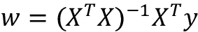

我们可以用 Python 实现它，如下所示:

```py
# adding a column vector of "ones"

>>> Xb = np.hstack((np.ones((X.shape[0], 1)), X))

>>> w = np.zeros(X.shape[1])

>>> z = np.linalg.inv(np.dot(Xb.T, Xb))

>>> w = np.dot(z, np.dot(Xb.T, y))

>>> print(f'Slope: {w[1]:.3f}')

Slope: 111.666

>>> print(f'Intercept: {w[0]:.3f}')

Intercept: 13342.979 
```

这种方法的优点是可以保证解析地找到最优解。但是，如果我们正在处理非常大的数据集，则在此公式(有时也称为正规方程)中求矩阵的逆在计算上可能太昂贵，或者包含训练示例的矩阵可能是奇异的(不可逆的)，这就是为什么我们在某些情况下可能更喜欢迭代方法。

如果您对如何获得正规方程的更多信息感兴趣，请查看 Stephen Pollock 博士在莱斯特大学演讲的章节*经典线性回归模型*，该章节可在[http://www . le . AC . uk/users/dsg P1/COURSES/MESOMET/ECMETXT/06 mes met . pdf](http://www.le.ac.uk/users/dsgp1/COURSES/MESOMET/ECMETXT/06mesmet.pdf)免费获得。

此外，如果您想要比较通过 GD、SGD、闭合形式解、QR 分解和奇异向量分解获得的线性回归解，您可以使用 mlxtend 中实现的`LinearRegression`类([http://rasbt . github . io/mlx tend/user _ guide/regressor/linear regression/](http://rasbt.github.io/mlxtend/user_guide/regressor/LinearRegression/))，它允许用户在这些选项之间切换。另一个值得推荐的 Python 回归建模库是 statsmodels，它实现了更高级的线性回归模型，如[https://www . stats models . org/stable/examples/index . html # regression](https://www.statsmodels.org/stable/examples/index.html#regression)所示。

# 用 RANSAC 拟合稳健回归模型

异常值的存在会严重影响线性回归模型。在某些情况下，我们数据的一个非常小的子集会对估计的模型系数产生很大的影响。许多统计测试可以用来检测异常值，但这些超出了本书的范围。然而，去除异常值总是需要我们作为数据科学家的判断以及我们的领域知识。

作为排除异常值的替代方法，我们将使用**随机样本共识** ( **兰萨克**)算法来研究一种稳健的回归方法，该算法将回归模型拟合到数据的一个子集，即所谓的**内因子**。

我们可以将迭代 RANSAC 算法总结如下:

1.  选择随机数量的示例作为内联器并符合模型。
2.  对照拟合的模型测试所有其他数据点，并将那些在用户给定容差范围内的点添加到内层。
3.  使用所有内嵌器重新装配模型。
4.  估计拟合模型相对于内层的误差。
5.  如果性能满足某个用户定义的阈值或者如果达到了固定的迭代次数，则终止算法；否则，返回到*步骤 1* 。

现在让我们将线性模型与在 scikit-learn 的`RANSACRegressor`类中实现的 RANSAC 算法结合使用:

```py
>>> from sklearn.linear_model import RANSACRegressor

>>> ransac = RANSACRegressor(

...     LinearRegression(), 

...     max_trials=100, # default value

...     min_samples=0.95, 

...     residual_threshold=None, # default value 

...     random_state=123)

>>> ransac.fit(X, y) 
```

我们将`RANSACRegressor`的最大迭代次数设置为 100，并使用`min_samples=0.95`，我们将随机选择的训练样本的最小数量设置为至少占数据集的 95%。

默认情况下(通过`residual_threshold=None`)，scikit-learn 使用 **MAD** 估计值来选择内层阈值，其中 MAD 代表目标值`y`的**中值绝对偏差**。然而，为 inlier 阈值选择合适的值是因问题而异的，这是 RANSAC 的一个缺点。

近年来已经开发了许多不同的方法来自动选择好的内联阈值。你可以在 *R .托尔多*和 *A .富塞罗*、*斯普林格*2009 年*鲁棒多结构拟合*中的【自动估计内层阈值】中找到详细的讨论(在*图像分析与处理-ICIAP 2009*中，第 123-131 页)。

一旦我们拟合了 RANSAC 模型，让我们从拟合的 RANSAC 线性回归模型中获得内点和外点，并将它们与线性拟合一起绘制:

```py
>>> inlier_mask = ransac.inlier_mask_

>>> outlier_mask = np.logical_not(inlier_mask)

>>> line_X = np.arange(3, 10, 1)

>>> line_y_ransac = ransac.predict(line_X[:, np.newaxis])

>>> plt.scatter(X[inlier_mask], y[inlier_mask],

...             c='steelblue', edgecolor='white',

...             marker='o', label='Inliers')

>>> plt.scatter(X[outlier_mask], y[outlier_mask],

...             c='limegreen', edgecolor='white',

...             marker='s', label='Outliers')

>>> plt.plot(line_X, line_y_ransac, color='black', lw=2)

>>> plt.xlabel('Living area above ground in square feet')

>>> plt.ylabel('Sale price in U.S. dollars')

>>> plt.legend(loc='upper left')

>>> plt.tight_layout()

>>> plt.show() 
```

如您在*图 9.9* 中所见，线性回归模型适用于检测到的一组内标，显示为圆圈:


图 9.9:通过 RANSAC 线性回归模型识别的内点和外点

当我们通过执行以下代码打印模型的斜率和截距时，线性回归线将与我们在上一节中不使用 RANSAC 获得的拟合略有不同:

```py
>>> print(f'Slope: {ransac.estimator_.coef_[0]:.3f}')

Slope: 106.348

>>> print(f'Intercept: {ransac.estimator_.intercept_:.3f}')

Intercept: 20190.093 
```

请记住，我们将`residual_threshold`参数设置为`None`，所以 RANSAC 使用 MAD 来计算阈值，以标记内点和外点。该数据集的 MAD 可计算如下:

```py
>>> def mean_absolute_deviation(data):

...     return np.mean(np.abs(data - np.mean(data)))

>>> mean_absolute_deviation(y)

58269.561754979375 
```

因此，如果我们想要将更少的数据点识别为异常值，我们可以选择一个大于前面 MAD 的`residual_threshold`值。例如，*图 9.10* 显示了残差阈值为 65，000 的 RANSAC 线性回归模型的内点和外点:


图 9.10:由具有较大残差阈值的 RANSAC 线性回归模型确定的内点和外点

使用 RANSAC，我们减少了该数据集中异常值的潜在影响，但我们不知道这种方法是否会对未知数据的预测性能产生积极影响。因此，在下一节中，我们将研究评估回归模型的不同方法，这是构建预测建模系统的关键部分。

# 评估线性回归模型的性能

在前面的部分中，您学习了如何根据训练数据拟合回归模型。但是，您在前面的章节中发现，在训练过程中未见过的数据上测试模型以获得其泛化性能的更无偏估计是至关重要的。

您可能还记得在*第 6 章*、*学习模型评估和超参数调整的最佳实践*中，我们希望将我们的数据集分成单独的训练和测试数据集，我们将使用前者来拟合模型，使用后者来评估其在未知数据上的性能，以估计泛化性能。我们现在将使用数据集中的所有五个要素，并训练一个多元回归模型，而不是继续使用简单回归模型:

```py
>>> from sklearn.model_selection import train_test_split

>>> target = 'SalePrice'

>>> features = df.columns[df.columns != target]

>>> X = df[features].values

>>> y = df[target].values

>>> X_train, X_test, y_train, y_test = train_test_split(

...     X, y, test_size=0.3, random_state=123) 

>>> slr = LinearRegression()

>>> slr.fit(X_train, y_train)

>>> y_train_pred = slr.predict(X_train)

>>> y_test_pred = slr.predict(X_test) 
```

由于我们的模型使用多个解释变量，我们无法在二维图中可视化线性回归线(准确地说是超平面)，但我们可以绘制残差(实际值和预测值之间的差异或垂直距离)与预测值的关系，以诊断我们的回归模型。**残差图**是诊断回归模型的常用图形工具。它们可以帮助检测非线性和异常值，并检查误差是否是随机分布的。

使用以下代码，我们现在将绘制一个残差图，其中我们只需从预测响应中减去真实目标变量:

```py
>>> x_max = np.max(

...     [np.max(y_train_pred), np.max(y_test_pred)])

>>> x_min = np.min(

...     [np.min(y_train_pred), np.min(y_test_pred)])

>>> fig, (ax1, ax2) = plt.subplots(

...     1, 2, figsize=(7, 3), sharey=True)

>>> ax1.scatter(

...     y_test_pred, y_test_pred - y_test,

...     c='limegreen', marker='s',

...     edgecolor='white',

...     label='Test data')

>>> ax2.scatter(

...     y_train_pred, y_train_pred - y_train,

...     c='steelblue', marker='o', edgecolor='white',

...     label='Training data')

>>> ax1.set_ylabel('Residuals')

>>> for ax in (ax1, ax2):

...     ax.set_xlabel('Predicted values')

...     ax.legend(loc='upper left')

...     ax.hlines(y=0, xmin=x_min-100, xmax=x_max+100,\

...         color='black', lw=2)

>>> plt.tight_layout()

>>> plt.show() 
```

执行代码后，我们应该看到测试和训练数据集的残差图，其中一条线穿过 *x* 轴原点，如图*图 9.11* 所示:


图 9.11:我们数据的残差图

在完美预测的情况下，残差将正好为零，这可能是我们在现实和实际应用中永远不会遇到的。然而，对于一个好的回归模型，我们期望误差是随机分布的，残差是围绕中心线随机分布的。如果我们在残差图中看到模式，这意味着我们的模型无法捕捉一些解释性信息，这些信息已经泄漏到残差中，正如您在我们之前的残差图中所看到的那样。此外，我们还可以使用残差图来检测异常值，异常值由偏离中心线较大的点表示。

另一个有用的衡量模型性能的定量指标是**均方误差** ( **MSE** )，我们之前讨论过它作为我们的损失函数，我们将其最小化以适应线性回归模型。以下是不带比例因子的 MSE 版本，该比例因子通常用于简化梯度下降中的损失导数:

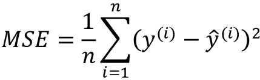

与分类环境中的预测准确性类似，我们可以使用 MSE 进行交叉验证和模型选择，如第 6 章中的*所述。*

像分类精度一样，MSE 也根据样本大小进行归一化， *n* 。这也使得跨不同样本大小的比较成为可能(例如，在学习曲线的环境中)。

现在让我们计算训练和测试预测的 MSE:

```py
>>> from sklearn.metrics import mean_squared_error

>>> mse_train = mean_squared_error(y_train, y_train_pred)

>>> mse_test = mean_squared_error(y_test, y_test_pred)

>>> print(f'MSE train: {mse_train:.2f}')

MSE train: 1497216245.85

>>> print(f'MSE test: {mse_test:.2f}')

MSE test: 1516565821.00 
```

我们可以看到训练数据集上的 MSE 大于测试集上的 MSE，这表明我们的模型在这种情况下稍微过度拟合了训练数据。请注意，在原始单位尺度上显示误差可能更直观(这里是美元而不是美元平方)，这就是为什么我们可以选择计算 MSE 的平方根，称为*均方根误差*，或**平均绝对误差** ( **MAE** ，这稍微强调了不正确的预测:

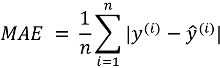

我们可以计算类似于 MSE 的 MAE:

```py
>>> from sklearn.metrics import mean_absolute_error

>>> mae_train = mean_absolute_error(y_train, y_train_pred)

>>> mae_test = mean_absolute_error(y_test, y_test_pred)

>>> print(f'MAE train: {mae_train:.2f}')

MAE train: 25983.03

>>> print(f'MAE test: {mae_test:.2f}')

MAE test: 24921.29 
```

基于测试集 MAE，我们可以说该模型平均产生大约 25，000 美元的误差。

例如，当我们使用 MAE 或 MSE 来比较模型时，我们需要意识到，与分类精度相比，它们是无限的。换句话说，MAE 和 MSE 的解释取决于数据集和要素比例。例如，如果销售价格表示为 1，000 的倍数(带有 K 后缀)，则与使用未缩放功能的模型相比，相同的模型将产生较低的 MAE。为了进一步说明这一点，

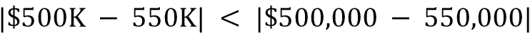

因此，报告**决定系数** ( *R* ² )有时可能更有用，这可以理解为 MSE 的标准化版本，以便更好地解释模型的性能。换句话说，*R*2 是模型捕捉到的响应方差的分数。*R*2 值定义为:

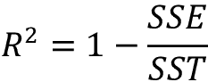

这里，SSE 是误差平方和，类似于 MSE，但不包括根据样本大小 *n* 进行的归一化:

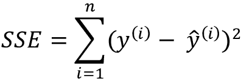

SST 是平方和:

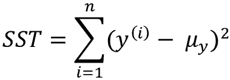

换句话说，SST 就是响应的方差。

现在，让我们简单地展示一下 *R* ² 确实只是 MSE 的一个重新缩放版本:

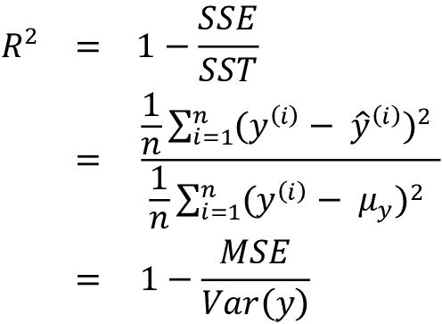

对于训练数据集， *R* ² 被限制在 0 和 1 之间，但是对于测试数据集，它可以变成负值。负的 *R* ² 意味着回归模型对数据的拟合不如代表样本均值的水平线。(在实践中，这经常发生在极端过度拟合的情况下，或者如果我们忘记以缩放训练集的相同方式缩放测试集。)如果 *R* ² = 1，则模型完美地拟合数据，对应的 *MSE* = 0。

根据训练数据评估，我们的模型的*R*2 是 0.77，这不是很大，但也不算太差，因为我们只处理一小部分功能。然而，测试数据集上的 *R* ² 仅略小，为 0.75，这表明模型仅略微过度拟合:

```py
>>> from sklearn.metrics import r2_score

>>> train_r2 = r2_score(y_train, y_train_pred)>>> test_r2 = r2_score(y_test, y_test_pred)

>>> print(f'R^2 train: {train_r2:.3f}, {test_r2:.3f}')

R^2 train: 0.77, test: 0.75 
```

# 使用正则化方法进行回归

正如我们在*第 3 章*、*使用 Scikit-Learn* 的机器学习分类器之旅中所讨论的，正则化是一种解决过度拟合问题的方法，它通过添加额外的信息，从而缩小模型的参数值，以降低复杂度。正则化线性回归最流行的方法是所谓的**岭回归**、**最小绝对收缩和选择算子** ( **套索**)和**弹性网**。

岭回归是一个 L2 惩罚模型，我们只需将权重的平方和添加到 MSE 损失函数中:

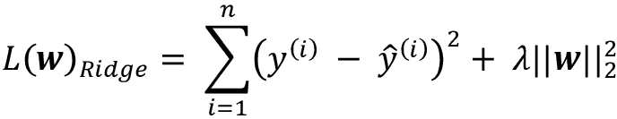

这里，L2 术语定义如下:

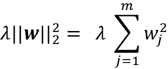

通过增加超参数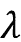的值，我们增加了正则化强度，从而缩小了我们的模型的权重。请注意，如第三章中*所述，偏置单元 *b* 没有被调整。*

另一种可以产生稀疏模型的方法是 LASSO。根据正则化强度，某些权重可能会变为零，这也使 LASSO 成为一种有用的监督要素选择技术:

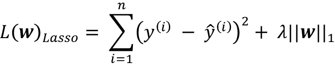

这里， LASSO 的 L1 罚被定义为模型权重的绝对值之和，如下所示:

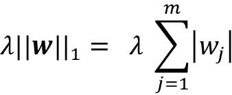

然而，LASSO 的一个限制是，如果 *m* > *n* ，它最多选择 *n* 个特征，其中 *n* 是训练样本的数量。这在特征选择的某些应用中可能是不希望的。然而，在实践中，LASSO 的这一特性往往是一个优势，因为它避免了饱和模型。如果训练样本的数量等于特征的数量，模型就会饱和，这是一种过度参数化的形式。因此，饱和模型总是能够完美地拟合训练数据，但仅仅是一种插值形式，因此不能很好地概括。

岭回归和 LASSO 之间的折衷是弹性网，其具有生成稀疏性的 L1 罚分和 L2 罚分，使得其可以用于选择超过 *n* 个特征，如果 *m* > *n* :

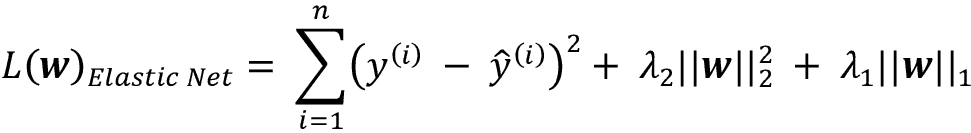

这些正则化回归模型都可以通过 scikit-learn 获得，它们的用法类似于正则回归模型，只是我们必须通过参数指定正则化强度，例如，通过 k-fold 交叉验证进行优化。

岭回归模型可以通过以下方式初始化:

```py
>>> from sklearn.linear_model import Ridge

>>> ridge = Ridge(alpha=1.0) 
```

注意，正则化强度由参数`alpha`调节，该参数类似于参数。同样，我们可以从`linear_model`子模块中初始化一个 LASSO 回归器:

```py
>>> from sklearn.linear_model import Lasso

>>> lasso = Lasso(alpha=1.0) 
```

最后，`ElasticNet`实现允许我们改变 L1 与 L2 的比率:

```py
>>> from sklearn.linear_model import ElasticNet

>>> elanet = ElasticNet(alpha=1.0, l1_ratio=0.5) 
```

例如，如果我们将`l1_ratio`设置为 1.0，`ElasticNet`回归变量将等于套索回归。有关线性回归不同实现的更多详细信息，请参考 http://scikit-learn.org/stable/modules/linear_model.htmlT2 的文档。

# 将线性回归模型转化为曲线-多项式回归

在前面的章节中，我们假设了解释变量和响应变量之间的线性关系。解释违反线性假设的一种方法是通过添加多项式项来使用多项式回归模型:

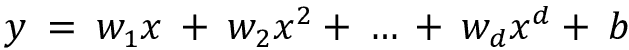

这里， *d* 表示多项式的次数。尽管我们可以使用多项式回归来模拟非线性关系，但由于线性回归系数 **w** ，它仍被视为多元线性回归模型。在接下来的小节中，我们将看到如何方便地将这样的多项式项添加到现有的数据集中，并拟合多项式回归模型。

## 使用 scikit-learn 添加多项式项

我们现在将学习如何使用 scikit 中的`PolynomialFeatures` transformer 类——学习将一个二次项( *d* = 2)添加到一个带有一个解释变量的简单回归问题中。然后，我们将通过以下步骤比较多项式拟合和线性拟合:

1.  增加一个二次多项式项:

    ```py
    >>> from sklearn.preprocessing import PolynomialFeatures

    >>> X = np.array([ 258.0, 270.0, 294.0, 320.0, 342.0,

    ...                368.0, 396.0, 446.0, 480.0, 586.0])\

    ...              [:, np.newaxis]

    >>> y = np.array([ 236.4, 234.4, 252.8, 298.6, 314.2,

    ...                342.2, 360.8, 368.0, 391.2, 390.8])

    >>> lr = LinearRegression()

    >>> pr = LinearRegression()

    >>> quadratic = PolynomialFeatures(degree=2)

    >>> X_quad = quadratic.fit_transform(X) 
    ```

2.  拟合简单的线性回归模型进行比较:

    ```py
    >>> lr.fit(X, y)

    >>> X_fit = np.arange(250, 600, 10)[:, np.newaxis]

    >>> y_lin_fit = lr.predict(X_fit) 
    ```

3.  将一个多元回归模型拟合到多项式回归的变换特征上:

    ```py
    >>> pr.fit(X_quad, y)

    >>> y_quad_fit = pr.predict(quadratic.fit_transform(X_fit)) 
    ```

4.  绘制结果:

    ```py
    >>> plt.scatter(X, y, label='Training points')

    >>> plt.plot(X_fit, y_lin_fit,

    ...          label='Linear fit', linestyle='--')

    >>> plt.plot(X_fit, y_quad_fit,

    ...          label='Quadratic fit')

    >>> plt.xlabel('Explanatory variable')

    >>> plt.ylabel('Predicted or known target values')

    >>> plt.legend(loc='upper left')

    >>> plt.tight_layout()

    >>> plt.show() 
    ```

在结果图中，您可以看到多项式拟合比线性拟合更好地捕捉了响应变量和解释变量之间的关系:


图 9.12:线性和二次模型的比较

接下来，我们将计算 MSE 和*R*2 评估指标:

```py
>>> y_lin_pred = lr.predict(X)

>>> y_quad_pred = pr.predict(X_quad)

>>> mse_lin = mean_squared_error(y, y_lin_pred)

>>> mse_quad = mean_squared_error(y, y_quad_pred)

>>> print(f'Training MSE linear: {mse_lin:.3f}'

          f', quadratic: {mse_quad:.3f}')

Training MSE linear: 569.780, quadratic: 61.330

>>> r2_lin = r2_score(y, y_lin_pred)

>>> r2_quad = r2_score(y, y_quad_pred)

>>> print(f'Training R^2 linear: {r2_lin:.3f}'

          f', quadratic: {r2_quad:.3f}')

Training R^2 linear: 0.832, quadratic: 0.982 
```

执行代码后可以看到，MSE 从 570(线性拟合)下降到 61(二次拟合)；此外，在这个特定的玩具问题中，决定系数反映了二次模型( *R* ² = 0.982)的更接近拟合，而不是线性拟合( *R* ² = 0.832)。

## 埃姆斯住宅数据集中的非线性关系建模

在前面的小节中，您学习了如何构建多项式特征来拟合玩具问题中的非线性关系；现在让我们看一个更具体的例子，并将这些概念应用于 Ames Housing 数据集中的数据。通过执行以下代码，我们将使用二次(二次)和三次(三次)多项式对销售价格和地上居住面积之间的关系进行建模，并将其与线性拟合进行比较。

我们首先移除居住面积大于 4000 平方英尺的三个异常值，我们可以在之前的图中看到，例如图 9.8 中的*，这样这些异常值就不会影响我们的回归拟合:*

```py
>>> X = df[['Gr Liv Area']].values

>>> y = df['SalePrice'].values

>>> X = X[(df['Gr Liv Area'] < 4000)]

>>> y = y[(df['Gr Liv Area'] < 4000)] 
```

接下来，我们拟合回归模型:

```py
>>> regr = LinearRegression()

>>> # create quadratic and cubic features

>>> quadratic = PolynomialFeatures(degree=2)

>>> cubic = PolynomialFeatures(degree=3)

>>> X_quad = quadratic.fit_transform(X)

>>> X_cubic = cubic.fit_transform(X)

>>> # fit to features

>>> X_fit = np.arange(X.min()-1, X.max()+2, 1)[:, np.newaxis]

>>> regr = regr.fit(X, y)

>>> y_lin_fit = regr.predict(X_fit)

>>> linear_r2 = r2_score(y, regr.predict(X))

>>> regr = regr.fit(X_quad, y)

>>> y_quad_fit = regr.predict(quadratic.fit_transform(X_fit))

>>> quadratic_r2 = r2_score(y, regr.predict(X_quad))

>>> regr = regr.fit(X_cubic, y)

>>> y_cubic_fit = regr.predict(cubic.fit_transform(X_fit))

>>> cubic_r2 = r2_score(y, regr.predict(X_cubic))

>>> # plot results

>>> plt.scatter(X, y, label='Training points', color='lightgray')

>>> plt.plot(X_fit, y_lin_fit, 

...          label=f'Linear (d=1), $R^2$={linear_r2:.2f}',

...          color='blue', 

...          lw=2, 

...          linestyle=':')

>>> plt.plot(X_fit, y_quad_fit, 

...          label=f'Quadratic (d=2), $R^2$={quadratic_r2:.2f}',

...          color='red', 

...          lw=2,

...          linestyle='-')

>>> plt.plot(X_fit, y_cubic_fit, 

...          label=f'Cubic (d=3), $R^2$={cubic_r2:.2f}',

...          color='green', 

...          lw=2,

...          linestyle='--')

>>> plt.xlabel('Living area above ground in square feet')

>>> plt.ylabel('Sale price in U.S. dollars')

>>> plt.legend(loc='upper left')

>>> plt.show() 
```

得到的图显示为*图 9.13* 中的:


图 9.13:销售价格和居住面积数据拟合的不同曲线的比较

正如我们可以看到的，使用二次或三次特征并没有真正的效果。这是因为两个变量之间的关系似乎是线性的。那么，我们来看看另一个特性，即`Overall Qual`。`Overall Qual`变量对房屋材料和装修的整体质量进行评级，从 1 到 10 分不等，其中 10 分最好:

```py
>>> X = df[['Overall Qual']].values

>>> y = df['SalePrice'].values 
```

指定`X`和`y`变量后，我们可以重用之前的代码，得到*图 9.14* 中的图:


图 9.14:销售价格和房屋质量数据的线性、二次和三次拟合

正如你所看到的，二次和三次拟合比线性拟合更好地捕捉了销售价格和房子整体质量之间的关系。但是，您应该意识到，添加越来越多的多项式要素会增加模型的复杂性，从而增加过度拟合的可能性。因此，在实践中，总是建议在单独的测试数据集上评估模型的性能，以估计泛化性能。

# 使用随机森林处理非线性关系

在这一部分，我们将看看**随机森林**回归，它在概念上与本章前面的回归模型不同。随机森林是多个**决策树**的集合，可以理解为分段线性函数的总和，这与我们之前讨论的全局线性和多项式回归模型不同。换句话说，通过决策树算法，我们将输入空间细分成更容易管理的更小的区域。

## 决策树回归

决策树算法的一个优点是，它可以处理任意特征，如果我们正在处理非线性数据，不需要对特征进行任何转换，因为决策树一次分析一个特征，而不是考虑加权组合。(同样，决策树不需要标准化或规范化特征。)正如在*第 3 章*、*使用 Scikit-Learn* 的机器学习分类器之旅中提到的，我们通过迭代分裂其节点来生长决策树，直到叶子是纯的或者满足停止标准。当我们使用决策树进行分类时，我们将熵定义为杂质的度量，以确定哪个特征分裂最大化了的**信息增益** ( **IG** )，对于二进制分裂可以定义如下:

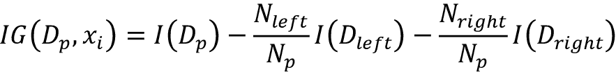

这里， *x* [i] 是执行拆分的特征， *N* [p] 是父节点中训练样本的数量， *I* 是杂质函数， *D* [p] 是父节点中训练样本的子集， *D* [左]和 *D* [右]是记住我们的目标是找到最大化信息增益的特征分裂；换句话说，我们希望找到最能减少子节点中杂质的特征分裂。在第 3 章的*中，我们讨论了作为杂质度量的基尼系数和熵，它们都是有用的分类标准。然而，为了使用决策树进行回归，我们需要适合于连续变量的杂质度量，因此我们将节点的杂质度量 *t* 定义为 MSE:*

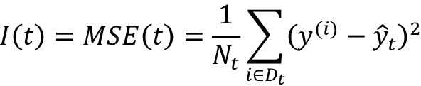

这里， *N* [t] 为节点 *t* 的训练样本数，*D*t 为节点 *t* 的训练子集，为真实目标值，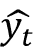为预测目标值(样本均值):

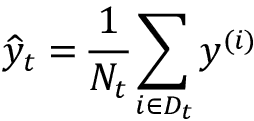

在决策树回归的上下文中，MSE 通常被称为**节点内方差**，这就是为什么分裂标准也被更好地称为方差缩减。

为了查看决策树的线条看起来像什么，让我们使用 scikit-learn 中实现的`DecisionTreeRegressor`来建模`SalePrice`和`Gr Living Area`变量之间的关系。注意`SalePrice`和`Gr Living Area`不一定代表非线性关系，但是这个特征组合仍然很好地展示了回归树的一般方面:

```py
>>> from sklearn.tree import DecisionTreeRegressor

>>> X = df[['Gr Liv Area']].values

>>> y = df['SalePrice'].values

>>> tree = DecisionTreeRegressor(max_depth=3)

>>> tree.fit(X, y)

>>> sort_idx = X.flatten().argsort()

>>> lin_regplot(X[sort_idx], y[sort_idx], tree)

>>> plt.xlabel('Living area above ground in square feet')

>>> plt.ylabel('Sale price in U.S. dollars')>>> plt.show() 
```

正如您在结果图中看到的，决策树捕获了数据的总体趋势。我们可以想象，回归树也可以相对较好地捕捉非线性数据的趋势。然而，这个模型的一个限制是它不能捕捉期望预测的连续性和可微性。此外，我们需要小心地为树的深度选择一个合适的值，以免数据过拟合或欠拟合；在这里，深度 3 似乎是一个不错的选择。


图 9.15:决策树回归图

我们鼓励您尝试更深层次的决策树。注意，`Gr Living Area`和`SalePrice`之间的关系是相当线性的，所以也鼓励你将决策树应用于`Overall Qual`变量。

在下一节中，我们将研究一种更健壮的拟合回归树的方法:随机森林。

## 随机森林回归

正如您在第 3 章中所了解到的，随机森林算法是一种组合多个决策树的集成技术。由于随机性，随机森林通常比单个决策树具有更好的泛化性能，这有助于减少模型的方差。随机森林的其他优点是，它们对数据集中的异常值不太敏感，并且不需要太多的参数调整。在随机森林中，我们通常需要试验的唯一参数是集合中的树的数量。用于回归的基本随机森林算法与我们在第 3 章的*中讨论的用于分类的随机森林算法几乎相同。唯一的区别是，我们使用 MSE 标准来生长单个决策树，而预测的目标变量是作为所有决策树的平均预测来计算的。*

现在，让我们使用 Ames Housing 数据集中的所有功能，在 70%的示例上拟合随机森林回归模型，并在剩余的 30%上评估其性能，就像我们之前在*评估线性回归模型的性能*一节中所做的那样。代码如下:

```py
>>> target = 'SalePrice'

>>> features = df.columns[df.columns != target]

>>> X = df[features].values

>>> y = df[target].values

>>> X_train, X_test, y_train, y_test = train_test_split(

...     X, y, test_size=0.3, random_state=123)

>>> from sklearn.ensemble import RandomForestRegressor

>>> forest = RandomForestRegressor(

...     n_estimators=1000, 

...     criterion='squared_error', 

...     random_state=1, 

...     n_jobs=-1)

>>> forest.fit(X_train, y_train)

>>> y_train_pred = forest.predict(X_train)

>>> y_test_pred = forest.predict(X_test)

>>> mae_train = mean_absolute_error(y_train, y_train_pred)

>>> mae_test = mean_absolute_error(y_test, y_test_pred)

>>> print(f'MAE train: {mae_train:.2f}')

MAE train: 8305.18

>>> print(f'MAE test: {mae_test:.2f}')

MAE test: 20821.77

>>> r2_train = r2_score(y_train, y_train_pred)

>>> r2_test =r2_score(y_test, y_test_pred)

>>> print(f'R^2 train: {r2_train:.2f}')

R^2 train: 0.98

>>> print(f'R^2 test: {r2_test:.2f}')

R^2 test: 0.85 
```

不幸的是，你可以看到随机森林倾向于过度拟合训练数据。但是，它仍然能够相对较好地解释目标变量和解释变量之间的关系(测试数据集上的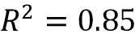)。相比之下，上一节中的线性模型*评估线性回归模型*的性能，该模型适合相同的数据集，过拟合较少，但在测试集上的性能更差(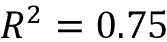)。

最后，让我们看看预测的残差:

```py
>>> x_max = np.max([np.max(y_train_pred), np.max(y_test_pred)])

>>> x_min = np.min([np.min(y_train_pred), np.min(y_test_pred)])

>>> fig, (ax1, ax2) = plt.subplots(1, 2, figsize=(7, 3), sharey=True)

>>> ax1.scatter(y_test_pred, y_test_pred - y_test,

...             c='limegreen', marker='s', edgecolor='white',

...             label='Test data')

>>> ax2.scatter(y_train_pred, y_train_pred - y_train,

...             c='steelblue', marker='o', edgecolor='white',

...             label='Training data')

>>> ax1.set_ylabel('Residuals')

>>> for ax in (ax1, ax2):

...     ax.set_xlabel('Predicted values')

...     ax.legend(loc='upper left')

...     ax.hlines(y=0, xmin=x_min-100, xmax=x_max+100,

...               color='black', lw=2)

>>> plt.tight_layout()

>>> plt.show() 
```

由于已经通过*R*2 系数对进行了总结，您可以看到，该模型比测试数据更好地拟合了训练数据，如在 *y* 轴方向上的异常值所示。此外，残差的分布在零中心点周围似乎不是完全随机的，这表明该模型不能捕捉所有的探索性信息。然而，残差图表明，与我们在本章前面绘制的线性模型的残差图相比，有了很大的改进。


图 9.16:随机森林回归的残差

理想情况下，我们的模型误差应该是随机的或者不可预测的。换句话说，预测的误差不应与解释变量中包含的任何信息相关；相反，它应该反映真实世界分布或模式的随机性。如果我们发现预测误差中的模式，例如，通过检查残差图，这意味着残差图包含预测信息。这种情况的一个常见原因可能是解释性信息泄漏到这些残差中。

不幸的是，没有一个通用的方法来处理残差图中的非随机性，这需要实验。根据我们可以获得的数据，我们可以通过转换变量、调整学习算法的超参数、选择更简单或更复杂的模型、删除异常值或包含额外的变量来改进模型。

# 摘要

在本章的开始，你学习了简单的线性回归分析来模拟单个解释变量和连续响应变量之间的关系。然后，我们讨论了一种有用的解释性数据分析技术来查看数据中的模式和异常，这是预测建模任务中重要的第一步。

我们通过使用基于梯度的优化方法实现线性回归来构建我们的第一个模型。然后，您看到了如何利用 scikit-learn 的线性模型进行回归，以及如何实现健壮的回归技术(RANSAC)作为处理异常值的方法。为了评估回归模型的预测性能，我们计算了均方误差和相关的 *R* ² 指标。此外，我们还讨论了一个有用的诊断回归模型问题的图形方法:残差图。

在我们探讨了如何将正则化应用于回归模型以降低模型复杂性并避免过度拟合之后，我们还介绍了几种用于建模非线性关系的方法，包括多项式特征变换和随机森林回归。

我们在前面的章节中详细讨论了监督学习、分类和回归分析。在下一章中，我们将了解机器学习的另一个有趣的子领域，无监督学习，以及如何在缺少目标变量的情况下使用聚类分析来发现数据中的隐藏结构。

# 加入我们书的不和谐空间

加入该书的 Discord workspace，每月与作者进行一次*向我提问*会议:

[https://packt.link/MLwPyTorch](https://packt.link/MLwPyTorch)

