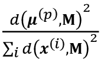

# Ten

# 处理未标记的数据–聚类分析

在前面的章节中，我们使用监督学习技术来建立机器学习模型，使用答案已知的数据-类别标签已经在我们的训练数据中可用。在这一章中，我们将切换话题，探索聚类分析，这是一种**无监督学习**技术，它允许我们在事先不知道正确答案的情况下发现数据中的隐藏结构。**聚类**的目标是在数据中找到一个自然的分组，使得同一个聚类中的项目彼此之间比来自不同聚类的项目更相似。

鉴于其探索性质，聚类是一个令人兴奋的主题，在本章中，您将了解以下概念，这些概念可以帮助我们将数据组织成有意义的结构:

*   使用流行的 k-means 算法寻找相似中心
*   采用自底向上的方法构建分层聚类树
*   使用基于密度的聚类方法识别任意形状的对象

# 使用 k-means 根据相似性对对象进行分组

在本节中，我们将了解最流行的聚类算法之一，k-means，它在学术界和工业界都被广泛使用。聚类(或称聚类分析)是一种技术，它允许我们找到相似对象的组，这些对象彼此之间的相关性比其他组中的对象更大。面向业务的集群应用程序的示例包括按不同主题对文档、音乐和电影进行分组，或者基于共同的购买行为来寻找具有相似兴趣的客户，以此作为推荐引擎的基础。

## 使用 scikit-learn 的 k 均值聚类

正如你马上会看到的， k-means 算法非常容易实现，但是与其他聚类算法相比，它的计算效率非常高，这可能解释了它的流行。 k-means 算法属于**基于原型聚类**的类。

我们将在本章的后面讨论另外两类聚类、**分层**和**基于密度的聚类**。

基于原型的聚类意味着每个聚类由一个原型来表示，该原型通常是具有连续特征的相似点的**形心** ( *平均值*)，或者是在分类特征的情况下的**形心**(最具*代表性的*或与属于特定聚类的所有其他点的距离最小的点)。虽然 k-means 非常擅长识别具有球形形状的聚类，但是这种聚类算法的一个缺点是我们必须指定聚类的数量， *k* ，*先验地*。对 *k* 选择不当会导致聚类性能不佳。在本章的后面，我们将讨论**肘**方法和**剪影图**，它们是评估聚类质量的有用技术，有助于我们确定最佳聚类数 *k* 。

虽然 k-means 聚类可以应用于更高维度的数据，但是为了可视化的目的，我们将使用一个简单的二维数据集来完成以下示例:

```py
>>> from sklearn.datasets import make_blobs

>>> X, y = make_blobs(n_samples=150,

...                   n_features=2,

...                   centers=3,

...                   cluster_std=0.5,

...                   shuffle=True,

...                   random_state=0)

>>> import matplotlib.pyplot as plt

>>> plt.scatter(X[:, 0],

...             X[:, 1],

...             c='white',

...             marker='o',

...             edgecolor='black',

...             s=50)

>>> plt.xlabel('Feature 1')

>>> plt.ylabel('Feature 2')

>>> plt.grid()

>>> plt.tight_layout()

>>> plt.show() 
```

我们刚刚创建的数据集由 150 个随机生成的点组成，这些点大致分为三个密度较高的区域，通过二维散点图显示:


图 10.1:未标记数据集的散点图

在聚类的实际应用中，我们没有关于这些例子的任何基本事实类别信息(作为经验证据而不是推断提供的信息)；如果给我们一个类别标签，这个任务就属于监督学习的范畴。因此，我们的目标是根据特征相似性对示例进行分组，这可以使用 k-means 算法来实现，概括为以下四个步骤:

1.  从示例中随机选取 *k* 个质心作为初始聚类中心
2.  将每个示例分配到最近的质心
3.  将质心移动到指定给它的示例的中心
4.  重复*步骤 2* 和 *3* ，直到集群分配不变或达到用户定义的容差或最大迭代次数

现在，下一个问题是，*我们如何测量对象之间的相似性*？我们可以将相似性定义为距离的反义词，对于具有连续特征的聚类示例，一个常用的距离是在 *m* 维空间中，两点 **x** 和 **y** 之间的**平方欧氏距离**:


注意，在前面的等式中，索引 *j* 指的是示例输入的第 *j* 维(特征列) **x** 和 **y** 。在本节的其余部分，我们将使用上标 *i* 和 *j* 分别指代示例(数据记录)的索引和集群索引。

基于这种欧几里德距离度量，我们可以将 k-means 算法描述为一个简单的优化问题，一种用于最小化类内**误差平方和** ( **SSE** )的迭代方法，有时也称为**类惯性**:


这里，是集群 *j* 的代表点(质心)。 *w* ^( ( ) ^( i ) ^， ^( j ) ^( ) ) = 1 如果举例，**x**^(^I^)，则在聚类 *j* ，否则为 0。


既然您已经了解了简单的 k-means 算法是如何工作的，让我们使用 scikit-learn 的`cluster`模块中的`KMeans`类将它应用到我们的示例数据集:

```py
>>> from sklearn.cluster import KMeans

>>> km = KMeans(n_clusters=3,

...             init='random',

...             n_init=10,

...             max_iter=300,

...             tol=1e-04,

...             random_state=0)

>>> y_km = km.fit_predict(X) 
```

使用前面的代码，我们将所需集群的数量设置为`3`；k-means 的局限性之一是必须事先指定聚类数*。我们设置`n_init=10`独立运行 k-means 聚类算法 10 次，使用不同的随机质心选择最终模型作为 SSE 最低的模型。通过`max_iter`参数，我们指定每次运行的最大迭代次数(这里是`300`)。请注意，如果在达到最大迭代次数之前收敛，scikit-learn 中的 k-means 实现会提前停止。然而，对于特定的运行，k-means 可能不会达到收敛，如果我们为`max_iter`选择相对较大的值，这可能是有问题的(计算开销)。处理收敛问题的一种方式是为`tol`选择更大的值，T5 是一个参数，其控制关于群内 SSE 中的变化的容限，以宣告收敛。在前面的代码中，我们选择了公差`1e-04` (=0.0001)。*

 *k-means 的一个问题是一个或多个聚类可能是空的。注意这个问题对于 k-medoids 或模糊 C-means 是不存在的，这是一个我们将在本节稍后讨论的算法。然而，在 scikit-learn 中的当前 k-means 实现中考虑到了这个问题。如果一个聚类是空的，该算法将搜索离空聚类的质心最远的例子。然后，它会将质心重新分配到这个最远的点。

**特征缩放**

当我们使用欧氏距离度量将 k-means 应用于真实世界的数据时，我们希望确保在相同的比例下测量要素，并在必要时应用 z 得分标准化或最小-最大缩放。

预测了聚类标签`y_km`，并讨论了 k-means 算法的一些挑战，现在让我们可视化 k-means 在数据集中识别的聚类以及聚类质心。这些存储在适合的`KMeans`对象的`cluster_centers_`属性下:

```py
>>> plt.scatter(X[y_km == 0, 0],

...             X[y_km == 0, 1],

...             s=50, c='lightgreen',

...             marker='s', edgecolor='black',

...             label='Cluster 1')

>>> plt.scatter(X[y_km == 1, 0],

...             X[y_km == 1, 1],

...             s=50, c='orange',

...             marker='o', edgecolor='black',

...             label='Cluster 2')

>>> plt.scatter(X[y_km == 2, 0],

...             X[y_km == 2, 1],

...             s=50, c='lightblue',

...             marker='v', edgecolor='black',

...             label='Cluster 3')

>>> plt.scatter(km.cluster_centers_[:, 0],

...             km.cluster_centers_[:, 1],

...             s=250, marker='*',

...             c='red', edgecolor='black',

...             label='Centroids')

>>> plt.xlabel('Feature 1')

>>> plt.ylabel('Feature 2')

>>> plt.legend(scatterpoints=1)

>>> plt.grid()

>>> plt.tight_layout()

>>> plt.show() 
```

在*图 10.2* 中，您可以看到 k-means 将三个质心放置在每个球体的中心，这看起来像是给定该数据集的合理分组:


图 10.2:k 均值聚类及其质心

虽然 k-means 在这个玩具数据集上工作得很好，但我们仍然有一个缺点，那就是必须指定聚类的数量， *k* ，*先验*。在现实世界的应用程序中，要选择的聚类数量可能并不总是那么明显，尤其是当我们处理一个无法可视化的高维数据集时。k-means 的其他性质是聚类不重叠，不分层，我们还假设每个聚类中至少有一个项目。在本章的后面，我们将遇到不同类型的聚类算法，层次聚类和基于密度的聚类。这两种算法都不要求我们预先指定聚类的数量，也不要求我们在数据集中假设球形结构。

在下一小节中，我们将介绍经典 k-means 算法的一个流行变体，称为 **k-means++** 。虽然它没有解决上一段中讨论的那些假设和 k-means 的缺点，但它可以通过更聪明地播种初始聚类中心来大大改善聚类结果。

## 使用 k-means++放置初始聚类质心的更聪明的方法

到目前为止，我们已经讨论了经典 k-means 算法，它使用一个随机种子来放置初始质心，如果初始质心选择不当，有时会导致糟糕的聚类或缓慢的收敛。解决这个问题的一种方法是在数据集上多次运行 k-means 算法，并选择 SSE 方面性能最佳的模型。

另一种策略是通过 k-means++算法将初始质心放置在彼此远离的位置，这比经典的 k-means ( *k-means++:小心播种的优点*由 *D .亚瑟*和 *S .瓦西维茨基*在第十八届 ACM-SIAM 离散算法研讨会的*会议录第 1027-1035 页中提出。*工业和应用数学学会*，2007)。*

k-means++中的初始化可以总结如下:

1.  初始化一个空集， **M** ，存储被选择的 *k* 质心。
2.  从输入示例中随机选择第一个质心，并将其分配给 **M** 。
3.  对于每个例子，**x**^(^I^)，即不在 **M** 中，求最小平方距离，*d*(**x**^(^I^)， **M** ) ² ，到**M**中任意一个质心****
4.  为了随机选择下一个质心，使用等于的加权概率分布。例如，我们收集一个数组中的所有点，并选择加权随机采样，这样距离的平方越大，一个点越有可能被选为质心。
5.  重复*步骤* *3* 和 *4* 直到 *k* 质心被选择。
6.  继续经典的 k-means 算法。

要将 k-means++用于 scikit-learn 的`KMeans`对象，我们只需将`init`参数设置为`'k-means++'`。事实上，`'k-means++'`是`init`参数的缺省参数，这在实践中是强烈推荐的。在前一个例子中我们没有使用它的唯一原因是不要一次引入太多的概念。本节关于 k-means 的其余部分将使用 k-means++，但是鼓励您更多地尝试两种不同的方法(通过`init='random'`的经典 k-means 和通过`init='k-means++'`的 k-means++)来放置初始聚类质心。

## 硬集群与软集群

**硬聚类**描述了算法家族，其中数据集中的每个示例都被分配到一个聚类中，就像我们在本章前面讨论的 k-means 和 k-means++算法一样。相比之下，**软聚类**(有时也被称为**模糊聚类**的算法将一个例子分配给一个或多个聚类。软聚类的一个流行例子是模糊 C 均值 ( **FCM** )算法(也称为**软 k 均值**或**模糊 k 均值**)。最初的想法可以追溯到 20 世纪 70 年代，当时 Joseph C. Dunn 首先提出了模糊聚类的早期版本，以改进 k-means(*iso data 过程的一种模糊相关，及其在检测紧密且分离良好的聚类中的使用*，1973)。近十年后，James C. Bedzek 发表了他对模糊聚类算法的改进工作，该算法现在被称为 FCM 算法(*使用模糊目标函数算法的模式识别*，*Springer Science+Business Media*，2013)。

FCM 过程非常类似于 k-means。然而，我们用属于每个聚类的每个点的概率来代替硬聚类分配。在 k-means 中，我们可以用二进制值的稀疏向量来表示一个示例的聚类成员关系， *x* :


这里，值为 1 的索引位置指示该示例被分配到的聚类质心(假设 *k* = 3，)。相反，FCM 中的隶属向量可以表示如下:


这里，每个值都落在范围[0，1]内，并表示相应聚类质心的成员概率。给定示例的成员总数等于 1。与 k-means 算法一样，我们可以将 FCM 算法总结为四个关键步骤:

1.  指定 *k* 个质心的数量，并为每个点随机分配聚类成员
2.  计算群集质心，
3.  更新每个点的集群成员资格
4.  重复*步骤 2* 和 *3* ，直到隶属系数不变或达到用户定义的容差或最大迭代次数

FCM 的目标函数——我们将其缩写为*J*m—看起来非常类似于我们在 k-means 中最小化的类内 SSE:


但是，请注意，隶属度指示符*w*T2(^I^， ^j ^) 不是 k-means ( )中的二进制值，而是表示聚类隶属度概率的实数值()。你可能也注意到了，我们给*w*(^I^， ^( j ) ^( ) 【T25)增加了一个额外的指数；指数 *m* ，任何大于或等于 1 的数(一般为 *m* = 2)，就是所谓的**模糊系数**(或简称为**模糊器**，它控制着*模糊的程度*。)

*m* 的值越大，聚类成员数 *w* ^( ^i ^， ^j ^) 越小，导致聚类越模糊。聚类成员概率本身的计算如下:


例如，如果我们选择三个聚类中心，如在前面的 k-means 示例中，我们可以如下计算属于聚类的的成员:


聚类本身的中心被计算为所有实例的平均值，该平均值通过每个实例属于该聚类的程度()来加权:


只要看一下计算聚类成员的等式，我们就可以说 FCM 中的每次迭代都比 k-means 中的迭代更昂贵。另一方面，FCM 通常需要较少的迭代来达到收敛。然而，在实践中已经发现，k-means 和 FCM 产生非常相似的聚类输出，如一项研究中所述( *S. Ghosh* 和 *S. K. Dubey* ，*ij CsA*，2013 年 4:35–38 的*比较分析 k-means 和模糊 C-Means 算法*)。不幸的是，FCM 算法目前没有在 scikit-learn 中实现，但感兴趣的读者可以从 scikit-fuzzy 包中尝试 FCM 实现，该包可在[https://github.com/scikit-fuzzy/scikit-fuzzy](https://github.com/scikit-fuzzy/scikit-fuzzy)获得。

## 用肘法寻找最佳聚类数

无监督学习的主要挑战之一是我们不知道确定的答案。在我们的数据集中，没有允许我们应用在*第 6 章*、*学习模型评估和超参数调整的最佳实践*中使用的技术，来评估受监督模型的性能。因此，为了量化聚类的质量，我们需要使用内在的度量标准，例如类内 SSE(失真)，来比较不同 k-means 聚类模型的性能。

方便的是，当我们使用 scikit-learn 时，不需要显式计算集群内 SSE，因为在拟合`KMeans`模型后，已经可以通过`inertia_`属性访问它:

```py
>>> print(f'Distortion: {km.inertia_:.2f}')

Distortion: 72.48 
```

基于集群内 SSE，我们可以使用一个图形工具，即所谓的**肘方法**，来估计给定任务的最优集群数量 *k* 。我们可以说，如果 *k* 增加，失真就会减少。这是因为示例将更接近它们被分配到的质心。肘形法背后的思想是确定失真开始增加最快的 *k* 的值，如果我们绘制不同的 *k* 值的失真，这将变得更加清楚:

```py
>>> distortions = []

>>> for i in range(1, 11):

...     km = KMeans(n_clusters=i,

...                 init='k-means++',

...                 n_init=10,

...                 max_iter=300,

...                 random_state=0)

...     km.fit(X)

...     distortions.append(km.inertia_)

>>> plt.plot(range(1,11), distortions, marker='o')

>>> plt.xlabel('Number of clusters')

>>> plt.ylabel('Distortion')

>>> plt.tight_layout()

>>> plt.show() 
```

正如您在*图 10.3* 中看到的那样，*肘*位于 *k* = 3，因此这是支持证据，表明 *k* = 3 确实是该数据集的一个好选择:


图 10.3:使用肘方法寻找最佳聚类数

## 通过轮廓图量化聚类质量

另一个评估聚类质量的内在指标是**剪影分析**，它也可以应用于除 k-means 之外的聚类算法，我们将在本章稍后讨论。剪影分析可作为一种图形工具，用于绘制一个度量值，以衡量聚类中的示例分组有多紧密。为了计算数据集中单个示例的**轮廓系数**，我们可以应用以下三个步骤:

1.  计算**，*a*^(^I^)，作为一个例子，**^(^I^)和同一聚类中所有其他点之间的平均距离。****
*****   计算**、 *b* 、 ^( ^i ^) ，距离下一个最近的聚类作为该实例、**【x**^(^I^)和最近的聚类中所有实例之间的平均距离。*****   Calculate the silhouette, *s*^(^i^), as the difference between cluster cohesion and separation divided by the greater of the two, as shown here:

    ****** 

 ******轮廓系数限制在–1 到 1 的范围内。基于上式，我们可以看到，如果簇的分离度和内聚度相等(*b*^(^I^)=*a*^(^I^))。此外，如果*b*^(^I^)>>*a*^(^I^)，我们就接近于理想的轮廓系数 1，因为*b*^(^I^)量化了一个例子是如何不同的

剪影系数可从 scikit-learn 的`metric`模块中以`silhouette_samples`的形式获得，为了方便起见，也可以选择导入`silhouette_scores`函数。`silhouette_scores`函数计算所有示例的平均轮廓系数，相当于`numpy.mean(silhouette_samples(...))`。通过执行以下代码，我们现在将创建一个 k 均值聚类的轮廓系数图，其中 *k* = 3:

```py
>>> km = KMeans(n_clusters=3,

...             init='k-means++',

...             n_init=10,

...             max_iter=300,

...             tol=1e-04,

...             random_state=0)

>>> y_km = km.fit_predict(X)

>>> import numpy as np

>>> from matplotlib import cm

>>> from sklearn.metrics import silhouette_samples

>>> cluster_labels = np.unique(y_km)

>>> n_clusters = cluster_labels.shape[0]

>>> silhouette_vals = silhouette_samples(

...     X, y_km, metric='euclidean'

... )

>>> y_ax_lower, y_ax_upper = 0, 0

>>> yticks = []

>>> for i, c in enumerate(cluster_labels):

...     c_silhouette_vals = silhouette_vals[y_km == c]

...     c_silhouette_vals.sort()

...     y_ax_upper += len(c_silhouette_vals)

...     color = cm.jet(float(i) / n_clusters)

...     plt.barh(range(y_ax_lower, y_ax_upper),

...              c_silhouette_vals,

...              height=1.0,

...              edgecolor='none',

...              color=color)

...     yticks.append((y_ax_lower + y_ax_upper) / 2.)

...     y_ax_lower += len(c_silhouette_vals)

>>> silhouette_avg = np.mean(silhouette_vals)

>>> plt.axvline(silhouette_avg,

...             color="red",

...             linestyle="--")

>>> plt.yticks(yticks, cluster_labels + 1)

>>> plt.ylabel('Cluster')

>>> plt.xlabel('Silhouette coefficient')

>>> plt.tight_layout()

>>> plt.show() 
```

通过对轮廓图的视觉检查，我们可以快速检查不同簇的大小，并识别包含*异常值*的簇:


图 10.4:聚类的一个好例子的轮廓图

然而，正如您在前面的轮廓图中所看到的，轮廓系数不接近 0，并且与平均轮廓分数的距离大致相等，在这种情况下，平均轮廓分数是*良好*聚类的指标。此外，为了总结我们聚类的优点，我们将平均轮廓系数添加到图中(虚线)。

要查看相对差的聚类的轮廓图是什么样子，让我们用只有两个质心的 k-means 算法播种:

```py
>>> km = KMeans(n_clusters=2,

...             init='k-means++',

...             n_init=10,

...             max_iter=300,

...             tol=1e-04,

...             random_state=0)

>>> y_km = km.fit_predict(X)

>>> plt.scatter(X[y_km == 0, 0],

...             X[y_km == 0, 1],

...             s=50, c='lightgreen',

...             edgecolor='black',

...             marker='s',

...             label='Cluster 1')

>>> plt.scatter(X[y_km == 1, 0],

...             X[y_km == 1, 1],

...             s=50,

...             c='orange',

...             edgecolor='black',

...             marker='o',

...             label='Cluster 2')

>>> plt.scatter(km.cluster_centers_[:, 0],

...             km.cluster_centers_[:, 1],

...             s=250,

...             marker='*',

...             c='red',

...             label='Centroids')

>>> plt.xlabel('Feature 1')

>>> plt.ylabel('Feature 2')

>>> plt.legend()

>>> plt.grid()

>>> plt.tight_layout()

>>> plt.show() 
```

正如您在*图 10.5* 中看到的，其中一个质心落在输入数据的三个球形分组中的两个之间。

尽管集群看起来并不完全糟糕，但它并不是最理想的:


图 10.5:集群的次优示例

请记住,在现实世界的问题中，我们通常没有在二维散点图中可视化数据集的奢侈，因为我们通常使用更高维度的数据。因此，接下来，我们将创建轮廓图来评估结果:

```py
>>> cluster_labels = np.unique(y_km)

>>> n_clusters = cluster_labels.shape[0]

>>> silhouette_vals = silhouette_samples(

...     X, y_km, metric='euclidean'

... )

>>> y_ax_lower, y_ax_upper = 0, 0

>>> yticks = []

>>> for i, c in enumerate(cluster_labels):

...     c_silhouette_vals = silhouette_vals[y_km == c]

...     c_silhouette_vals.sort()

...     y_ax_upper += len(c_silhouette_vals)

...     color = cm.jet(float(i) / n_clusters)

...     plt.barh(range(y_ax_lower, y_ax_upper),

...              c_silhouette_vals,

...              height=1.0,

...              edgecolor='none',

...              color=color)

...     yticks.append((y_ax_lower + y_ax_upper) / 2.)

...     y_ax_lower += len(c_silhouette_vals)

>>> silhouette_avg = np.mean(silhouette_vals)

>>> plt.axvline(silhouette_avg, color="red", linestyle="--")

>>> plt.yticks(yticks, cluster_labels + 1)

>>> plt.ylabel('Cluster')

>>> plt.xlabel('Silhouette coefficient')

>>> plt.tight_layout()

>>> plt.show() 
```

正如您在*图 10.6* 中看到的，轮廓现在有明显不同的长度和宽度，这是相对*差*或至少*次优*聚类的证据:


图 10.6:次优聚类示例的轮廓图

现在，在我们很好地理解了聚类是如何工作的之后，下一节将介绍层次聚类作为 k-means 的替代方法。

# 将集群组织为分层树

在这一节中，我们将看看基于原型的集群的另一种方法:**层次集群**。层次聚类算法的一个优势是它允许我们绘制**树状图**(二进制层次聚类的可视化)，这可以通过创建有意义的分类法来帮助解释结果。这种分层方法的另一个优点是我们不需要预先指定集群的数量。

层次聚类的两种主要方法是**聚集**和**分裂**层次聚类。在分裂层次聚类中，我们从一个包含完整数据集的聚类开始，我们迭代地将该聚类分成更小的聚类，直到每个聚类只包含一个例子。在这一节中，我们将重点关注聚集聚类，它采用相反的方法。我们从每个例子作为一个单独的聚类开始，合并最接近的聚类对，直到只剩下一个聚类。

## 以自下而上的方式对集群进行分组

凝聚层次聚类的两个标准算法是**单连锁**和**完全连锁**。使用单链接，我们计算每对聚类的最相似成员之间的距离，并合并最相似成员之间的距离最小的两个聚类。完全链接方法类似于单个链接，但是我们不是比较每对集群中最相似的成员，而是比较最不相似的成员来执行合并。如图*图 10.7* 所示:


图 10.7:完整的链接方法

**替代类型的连杆机构**

凝聚层次聚类的其他常用算法包括平均连锁和沃德连锁。在平均链接中，我们根据两个集群中所有组成员之间的最小平均距离来合并集群对。在沃德的联系中，导致集群内 SSE 总量最小增长的两个集群被合并。

在这一节中，我们将使用完全链接方法重点介绍凝聚聚类。分层完全连锁聚类是一个迭代过程，可通过以下步骤进行总结:

1.  计算所有示例的成对距离矩阵。
2.  将每个数据点表示为一个单独的集群。
3.  根据最不相似(较远)成员之间的距离合并两个最近的聚类。
4.  更新集群关联矩阵。
5.  重复*步骤 2-4* 直到剩下一个单独的簇。

接下来，我们将讨论如何计算距离矩阵(*步骤 1* )。但是首先，让我们生成一个随机的数据样本。行代表不同的观察值(id0-4)，列是这些例子的不同特征(`X`、`Y`、`Z`):

```py
>>> import pandas as pd

>>> import numpy as np

>>> np.random.seed(123)

>>> variables = ['X', 'Y', 'Z']

>>> labels = ['ID_0', 'ID_1', 'ID_2', 'ID_3', 'ID_4']

>>> X = np.random.random_sample([5, 3])*10

>>> df = pd.DataFrame(X, columns=variables, index=labels)

>>> df 
```

在执行了前面的代码后，我们现在应该看到下面的`DataFrame`包含了随机生成的示例:


图 10.8:随机生成的数据样本

## 对距离矩阵进行层次聚类

为了计算距离矩阵作为层次聚类算法的输入，我们将使用 SciPy 的`spatial.distance`子模块中的`pdist`函数:

```py
>>> from scipy.spatial.distance import pdist, squareform

>>> row_dist = pd.DataFrame(squareform(

...                         pdist(df, metric='euclidean')),

...                         columns=labels, index=labels)

>>> row_dist 
```

使用前面的代码，我们根据特征`X`、`Y`和`Z`计算了数据集中每对输入示例之间的欧几里德距离。

我们提供了压缩的距离矩阵(由`pdist`返回)作为`squareform`函数的输入，以创建成对距离的对称矩阵，如下所示:


图 10.9:我们数据的计算成对距离

接下来，我们将使用 SciPy 的`cluster.hierarchy`子模块中的`linkage`函数将完整的链接聚集应用到我们的集群，该函数返回一个所谓的**链接矩阵**。

然而，在我们调用`linkage`函数之前，让我们仔细看看函数文档:

```py
>>> from scipy.cluster.hierarchy import linkage

>>> help(linkage)

[...]

Parameters:

  y : ndarray

    A condensed or redundant distance matrix. A condensed

    distance matrix is a flat array containing the upper

    triangular of the distance matrix. This is the form

    that pdist returns. Alternatively, a collection of m

    observation vectors in n dimensions may be passed as

    an m by n array.

  method : str, optional

    The linkage algorithm to use. See the Linkage Methods

    section below for full descriptions.

  metric : str, optional

    The distance metric to use. See the distance.pdist

    function for a list of valid distance metrics.

  Returns:

  Z : ndarray

    The hierarchical clustering encoded as a linkage matrix.

[...] 
```

根据函数描述，我们知道可以使用来自`pdist`函数的压缩距离矩阵(上三角)作为输入属性。或者，我们也可以向提供初始数据数组，并使用和`'euclidean'`度量作为`linkage`中的函数参数。然而，我们不应该使用我们之前定义的`squareform`距离矩阵，因为它会产生与预期不同的距离值。总而言之，这里列出了三种可能的情况:

*   **不正确的方法**:使用如下代码片段所示的`squareform`距离矩阵会导致不正确的结果:

    ```py
    >>> row_clusters = linkage(row_dist,

    ...                        method='complete',

    ...                        metric='euclidean') 
    ```

*   **正确的方法**:使用如下代码示例所示的压缩距离矩阵产生正确的链接矩阵:

    ```py
    >>> row_clusters = linkage(pdist(df, metric='euclidean'),

    ...                        method='complete') 
    ```

*   **正确的方法**:使用完整的输入示例矩阵(所谓的设计矩阵)，如下面的代码片段所示，也可以得到与前面的方法类似的正确的链接矩阵:

    ```py
    >>> row_clusters = linkage(df.values,

    ...                        method='complete',

    ...                        metric='euclidean') 
    ```

为了更仔细地查看聚类结果，我们可以将这些结果转换成熊猫图`DataFrame`(最好在 Jupyter 笔记本中查看)，如下所示:

```py
>>> pd.DataFrame(row_clusters,

...              columns=['row label 1',

...                       'row label 2',

...                       'distance',

...                       'no. of items in clust.'],

...              index=[f'cluster {(i + 1)}' for i in

...                     range(row_clusters.shape[0])]) 
```

如图*图 10.10* 所示，连接矩阵由几行组成，每行代表一个合并。第一和第二列表示每个集群中最不相似的成员，第三列报告这些成员之间的距离。

最后一列返回每个集群中的成员数:


图 10.10:关联矩阵

既然我们已经计算了连锁矩阵，我们可以用树状图的形式来显示结果:

```py
>>> from scipy.cluster.hierarchy import dendrogram

>>> # make dendrogram black (part 1/2)

>>> # from scipy.cluster.hierarchy import set_link_color_palette

>>> # set_link_color_palette(['black'])

>>> row_dendr = dendrogram(

...     row_clusters,

...     labels=labels,

...     # make dendrogram black (part 2/2)

...     # color_threshold=np.inf

... )

>>> plt.tight_layout()

>>> plt.ylabel('Euclidean distance')

>>> plt.show() 
```

如果您正在执行前面的代码或阅读本书的电子书版本，您会注意到生成的树状图中的分支以不同的颜色显示。配色方案是从 Matplotlib 颜色列表中派生出来的，这些颜色针对树状图中的距离阈值进行循环。例如，要以黑色显示树状图，您可以取消前面代码中插入的各个部分的注释:


图 10.11:我们数据的树状图

这种树状图总结了在聚集的层次聚类期间形成的不同聚类；例如，您可以看到示例`ID_0`和`ID_4`，随后是`ID_1`和`ID_2`，它们是基于欧几里德距离度量的最相似的示例。

## 将树状图附加到热点图

在实际应用中，分层聚类树状图经常与**热图**结合使用，热图允许我们用颜色代码表示包含我们的训练示例的数据数组或矩阵中的单个值。在本节中，我们将讨论如何将一个树状图附加到一个热图中，并相应地对热图中的行进行排序。

然而，将树状图附加到热图可能有点棘手，所以让我们一步一步地完成这个过程:

1.  我们创建一个新的`figure`对象，并通过`add_axes`属性定义树状图的 *x* 轴位置、 *y* 轴位置、宽度和高度。此外，我们逆时针旋转树状图 90 度。代码如下:

    ```py
    >>> fig = plt.figure(figsize=(8, 8), facecolor='white')

    >>> axd = fig.add_axes([0.09, 0.1, 0.2, 0.6])

    >>> row_dendr = dendrogram(row_clusters,

    ...                        orientation='left')

    >>> # note: for matplotlib < v1.5.1, please use

    >>> # orientation='right' 
    ```

2.  接下来，我们根据可以通过`leaves`键从`dendrogram`对象(本质上是一个 Python 字典)访问的聚类标签，对初始`DataFrame`中的数据进行重新排序。代码如下:

    ```py
    >>> df_rowclust = df.iloc[row_dendr['leaves'][::-1]] 
    ```

3.  现在，我们从重新排序的`DataFrame`构建热图，并将其放在树状图的旁边:

    ```py
    >>> axm = fig.add_axes([0.23, 0.1, 0.6, 0.6])

    >>> cax = axm.matshow(df_rowclust,

    ...                   interpolation='nearest',

    ...                   cmap='hot_r') 
    ```

4.  最后，我们通过删除轴记号和隐藏轴刺来修改树状图的美观性。此外，我们添加一个颜色条，并将特征和数据记录名称分别分配给 *x* 和 *y* 轴记号标签:

    ```py
    >>> axd.set_xticks([])

    >>> axd.set_yticks([])

    >>> for i in axd.spines.values():

    ...     i.set_visible(False)

    >>> fig.colorbar(cax)

    >>> axm.set_xticklabels([''] + list(df_rowclust.columns))

    >>> axm.set_yticklabels([''] + list(df_rowclust.index))

    >>> plt.show() 
    ```

完成前面的步骤后，热图应该会显示出来，并附有树状图:


图 10.12:我们数据的热图和树状图

如您所见，热图中的行顺序反映了树状图中示例的聚类。除了简单的树状图之外，热图中每个示例和要素的彩色编码值为我们提供了数据集的良好摘要。

## 通过 scikit-learn 应用凝聚聚类

在上一小节中，您看到了如何使用 SciPy 执行凝聚层次聚类。然而，在 scikit-learn 中还有一个`AgglomerativeClustering`实现，它允许我们选择我们想要返回的集群数量。如果我们想要修剪层次聚类树，这是很有用的。

通过将`n_cluster`参数设置为`3`，我们现在将使用与之前相同的基于欧几里德距离度量的完整链接方法将输入示例聚类为三组:

```py
>>> from sklearn.cluster import AgglomerativeClustering

>>> ac = AgglomerativeClustering(n_clusters=3,

...                              affinity='euclidean',

...                              linkage='complete')

>>> labels = ac.fit_predict(X)

>>> print(f'Cluster labels: {labels}')

Cluster labels: [1 0 0 2 1] 
```

查看预测的集群标签，我们可以看到第一个和第五个示例(`ID_0`和`ID_4`)被分配到一个集群(标签`1`)，而示例`ID_1`和`ID_2`被分配到第二个集群(标签`0`)。示例`ID_3`被放入它自己的集群中(标签为`2`)。总的来说，这个结果与我们在树状图中观察到的结果是一致的。然而，我们应该注意到`ID_3`更类似于`ID_4`和`ID_0`而不是`ID_1`和`ID_2`，如前面的树状图中的所示；从 scikit-learn 的聚类结果来看，这一点并不清楚。现在让我们在下面的代码片段中使用`n_cluster=2`重新运行`AgglomerativeClustering`:

```py
>>> ac = AgglomerativeClustering(n_clusters=2,

...                              affinity='euclidean',

...                              linkage='complete')

>>> labels = ac.fit_predict(X)

>>> print(f'Cluster labels: {labels}')

Cluster labels: [0 1 1 0 0] 
```

正如你所看到的，在这个*修剪过的*聚类层次中，标签`ID_3`被分配到与`ID_0`和`ID_4`相同的聚类中，这是意料之中的。

# 通过 DBSCAN 定位高密度区域

虽然我们无法在本章中涵盖大量不同的聚类算法，但让我们至少包括一种新的聚类方法:**基于密度的带噪声应用空间聚类** ( **DBSCAN** )，它不会像 k-means 一样对球形聚类进行假设，也不会将数据集划分为需要手动分界点的层次。顾名思义，基于密度的聚类根据点的密集区域分配聚类标签。在 DBSCAN 中，密度的概念被定义为指定半径内的点数。

根据 DBSCAN 算法，使用以下标准为每个示例(数据点)分配一个特殊标签:

*   如果至少指定数量(MinPts)的相邻点落在指定半径内，则该点被认为是核心点
*   一个**边界点**是一个点，它比内的最小点具有更少的邻居，但是位于一个核心点的半径内
*   所有其他既不是核心点也不是边界点的点被认为是噪声点(T2)

将点标记为核心、边界或噪声后，DBSCAN 算法可以总结为两个简单的步骤:

1.  为每个核心点或核心点的连接组形成一个单独的集群。(核心点距离不超过则连接。)
2.  将每个边界点分配给其对应核心点的聚类。

为了更好地理解 DBSCAN 的结果，在开始实现之前，让我们总结一下我们刚刚了解到的*图 10.13* 中的核心点、边界点和噪声点:


图 10.13:DBS can 的核心、噪声和边界点

使用 DBSCAN 的一个主要优点是，它不像 k-means 那样假设聚类是球形的。此外，DBSCAN 不同于 k-means 和层次聚类，因为它不一定将每个点分配给一个聚类，而是能够去除噪声点。

作为一个更具说明性的示例，让我们创建一个半月形结构的新数据集来比较 k-means 聚类、层次聚类和 DBSCAN:

```py
>>> from sklearn.datasets import make_moons

>>> X, y = make_moons(n_samples=200,

...                   noise=0.05,

...                   random_state=0)

>>> plt.scatter(X[:, 0], X[:, 1])

>>> plt.xlabel('Feature 1')

>>> plt.ylabel('Feature 2')

>>> plt.tight_layout()

>>> plt.show() 
```

正如您在结果图中看到的，有两个可见的半月形组，每个组由 100 个示例(数据点)组成:


图 10.14:双特征半月形数据集

我们将从使用 k-means 算法开始，并完成连锁聚类，以查看先前讨论的聚类算法之一是否能够成功地将半月形识别为单独的聚类。代码如下:

```py
>>> f, (ax1, ax2) = plt.subplots(1, 2, figsize=(8, 3))

>>> km = KMeans(n_clusters=2,

...             random_state=0)

>>> y_km = km.fit_predict(X)

>>> ax1.scatter(X[y_km == 0, 0],

...             X[y_km == 0, 1],

...             c='lightblue',

...             edgecolor='black',

...             marker='o',

...             s=40,

...             label='cluster 1')

>>> ax1.scatter(X[y_km == 1, 0],

...             X[y_km == 1, 1],

...             c='red',

...             edgecolor='black',

...             marker='s',

...             s=40,

...             label='cluster 2')

>>> ax1.set_title('K-means clustering')

>>> ax1.set_xlabel('Feature 1')

>>> ax1.set_ylabel('Feature 2')

>>> ac = AgglomerativeClustering(n_clusters=2,

...                              affinity='euclidean',

...                              linkage='complete')

>>> y_ac = ac.fit_predict(X)

>>> ax2.scatter(X[y_ac == 0, 0],

...             X[y_ac == 0, 1],

...             c='lightblue',

...             edgecolor='black',

...             marker='o',

...             s=40,

...             label='Cluster 1')

>>> ax2.scatter(X[y_ac == 1, 0],

...             X[y_ac == 1, 1],

...             c='red',

...             edgecolor='black',

...             marker='s',

...             s=40,

...             label='Cluster 2')

>>> ax2.set_title('Agglomerative clustering')

>>> ax2.set_xlabel('Feature 1')

>>> ax2.set_ylabel('Feature 2')

>>> plt.legend()

>>> plt.tight_layout()

>>> plt.show() 
```

基于可视化的聚类结果，我们可以看到 k-means 算法无法将两个聚类分开，并且层次聚类算法受到这些复杂形状的挑战:


图 10.15:半月形数据集上的 k 均值和凝聚聚类

最后，让我们在这个数据集上尝试 DBSCAN 算法，看看它是否能够使用基于密度的方法找到两个半月形集群:

```py
>>> from sklearn.cluster import DBSCAN

>>> db = DBSCAN(eps=0.2,

...             min_samples=5,

...             metric='euclidean')

>>> y_db = db.fit_predict(X)

>>> plt.scatter(X[y_db == 0, 0],

...             X[y_db == 0, 1],

...             c='lightblue',

...             edgecolor='black',

...             marker='o',

...             s=40,

...             label='Cluster 1')

>>> plt.scatter(X[y_db == 1, 0],

...             X[y_db == 1, 1],

...             c='red',

...             edgecolor='black',

...             marker='s',

...             s=40,

...             label='Cluster 2')

>>> plt.xlabel('Feature 1')

>>> plt.ylabel('Feature 2')

>>> plt.legend()

>>> plt.tight_layout()

>>> plt.show() 
```

DBSCAN 算法可以成功检测半月形，这突出了 DBSCAN 的优势之一，即聚类任意形状的数据:


图 10.16:半月形数据集上的 DBSCAN 聚类

然而，我们也应该注意到 DBSCAN 的一些缺点。随着我们数据集中特征数量的增加——假设训练样本数量固定——维数灾难的负面影响也会增加。如果我们使用欧几里得距离度量，这尤其是一个问题。然而，维数灾难的问题并不是 DBSCAN 独有的:它也影响使用欧几里德距离度量的其他聚类算法，例如 k-means 和层次聚类算法。此外，我们在 DBSCAN 中有两个超参数(MinPts 和)需要优化以产生良好的聚类结果。如果数据集中的密度差异相对较大，找到 MinPts 和的良好组合可能会有问题。

**基于图形的聚类**

到目前为止，我们已经看到了聚类算法的三个最基本的类别:基于原型的 k-means 聚类、凝聚层次聚类和基于密度的 DBSCAN 聚类。然而，还有第四类更高级的聚类算法，我们在本章中没有涉及:基于图的聚类。基于图的聚类家族中最突出的成员可能是谱聚类算法。

尽管谱聚类有许多不同的实现，但它们的共同点是都使用相似性或距离矩阵的特征向量来导出聚类关系。由于谱聚类超出了本书的范围，您可以阅读 Ulrike von Luxburg 的优秀教程来了解有关该主题的更多信息(*关于谱聚类的教程*、*统计和计算*，17(4): 395-416，2007)。它可以在 http://arxiv.org/pdf/0711.0189v1.pdf[的 arXiv 上免费获得。](http://arxiv.org/pdf/0711.0189v1.pdf)

请注意，在实践中，对于给定的数据集，哪种聚类算法的性能最好并不总是显而易见的，尤其是当数据来自多个维度，从而很难或不可能可视化时。此外，重要的是要强调，成功的聚类不仅取决于算法及其超参数；相反，选择合适的距离度量和使用领域知识来帮助指导实验设置可能更加重要。

在维数灾难的背景下，通常的做法是在执行聚类之前应用降维技术。这种针对无监督数据集的降维技术包括主成分分析和 t-SNE，我们在*第 5 章*、*中讨论了通过降维压缩数据*。此外，通常将数据集压缩到二维子空间，这允许我们使用二维散点图来可视化聚类和分配的标签，这对于评估结果特别有帮助。

# 摘要

在本章中，您学习了三种不同的聚类算法，它们可以帮助我们发现数据中隐藏的结构或信息。我们从一个基于原型的方法开始，k-means，它根据指定数量的聚类质心将样本聚类成球形。由于聚类是一种无监督的方法，我们不享受奢侈的地面真相标签来评估模型的性能。因此，我们使用内在的性能指标，如肘方法或剪影分析，作为量化聚类质量的尝试。

然后，我们研究了一种不同的聚类方法:凝聚层次聚类。分层聚类不需要预先指定聚类的数量，结果可以在树状图中可视化，这有助于解释结果。我们在本章中介绍的最后一个聚类算法是 DBSCAN，这是一种基于局部密度对点进行分组的算法，能够处理异常值并识别非球形形状。

在进入无监督学习领域之后，现在是时候介绍一些最令人兴奋的监督学习机器学习算法了:多层人工神经网络。经过最近的复兴，神经网络再次成为机器学习研究中最热门的话题。由于最近开发的深度学习算法，神经网络被认为是许多复杂任务的最先进技术，如图像分类、自然语言处理和语音识别。在*第十一章*、*从零开始实现多层人工神经网络*中，我们将构建自己的多层神经网络。在*第 12 章*、*用 PyTorch* 并行化神经网络训练中，我们将使用 PyTorch 库，它专门通过利用图形处理单元非常高效地训练多层神经网络模型。

# 加入我们书的不和谐空间

加入该书的 Discord workspace，每月与作者进行一次*向我提问*会议:

[https://packt.link/MLwPyTorch](https://packt.link/MLwPyTorch)

*******