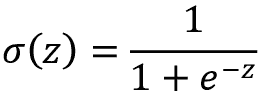

# Eleven

# 从头开始实现多层人工神经网络

正如你可能知道的，深度学习受到了媒体的大量关注，毫无疑问，它是机器学习领域最热门的话题。深度学习可以理解为机器学习的一个子领域，它涉及有效地训练具有许多层的人工**神经网络** ( **NNs** )。在本章中，您将学习人工神经网络的基本概念，以便为接下来的章节做好准备，这些章节将介绍先进的基于 Python 的深度学习库和**深度神经网络** ( **DNN** )架构，它们特别适合图像和文本分析。

我们将在本章中涉及的主题如下:

*   从概念上理解多层神经网络
*   从零开始实现神经网络训练的基本反向传播算法
*   训练用于图像分类的基本多层神经网络

# 用人工神经网络模拟复杂函数

在本书的开头，我们在*第二章*、*用人工神经元开始了我们通过机器学习算法的旅程，训练简单的机器学习算法进行分类*。人工神经元代表了我们将在本章讨论的多层人工神经网络的构建模块。

人工神经网络背后的基本概念建立在假设和人类大脑如何解决复杂问题任务的模型之上。虽然人工神经网络近年来很受欢迎，但对神经网络的早期研究可以追溯到 20 世纪 40 年代，当时沃伦麦卡洛克和沃尔特皮茨首次描述了神经元的工作方式。(*神经活动*中内在思想的逻辑演算，作者 *W. S .麦卡洛克*和 *W .皮茨*，*《数学生物物理学通报*，5(4):115–133，1943 年。)

然而，在第一次实现**麦卡洛克-皮茨神经元**模型(20 世纪 50 年代罗森布拉特的感知机)之后的几十年里，许多研究人员和机器学习实践者开始慢慢对神经网络失去兴趣，因为没有人有一个好的解决方案来训练多层神经网络。最终，在 1986 年，当 D.E. Rumelhart、G.E. Hinton 和 R.J. Williams 参与(重新)发现和推广反向传播算法以更有效地训练神经网络时，对神经网络的兴趣被重新点燃，我们将在本章后面更详细地讨论这一点(*通过反向传播误差学习表示*、D.E. Rumelhart 、G.E. Hinton 和 r . j . Williams*还鼓励对**人工智能** ( **AI** )、机器学习和神经网络的历史感兴趣的读者阅读维基百科关于所谓的 *AI winters* 的文章，所谓的*AI winters*是指研究界很大一部分人对神经网络的研究(【https://en.wikipedia.org/wiki/AI_winter】)失去兴趣的时间段。*

然而，由于在过去十年中取得的许多突破，神经网络今天比以往任何时候都更受欢迎，这导致了我们现在所说的深度学习算法和架构——由许多层组成的神经网络。神经网络不仅是学术研究的热门话题，也是大型科技公司的热门话题，如脸书、微软、亚马逊、优步、谷歌等许多公司都在人工神经网络和深度学习研究方面进行了大量投资。

截至今天，由深度学习算法驱动的复杂神经网络被认为是解决图像和语音识别等复杂问题的最先进解决方案。最近的一些应用包括:

*   从一系列 X 射线预测新冠肺炎的资源需求([https://arxiv.org/abs/2101.04909](https://arxiv.org/abs/2101.04909))
*   模拟病毒突变([https://science.sciencemag.org/content/371/6526/284](https://science.sciencemag.org/content/371/6526/284)
*   利用来自社交媒体平台的数据来管理极端天气事件([https://online library . Wiley . com/doi/ABS/10.1111/1468-5973.12311](https://onlinelibrary.wiley.com/doi/abs/10.1111/1468-5973.12311)
*   为盲人或视障人士改善照片描述([https://tech . FB . com/how-Facebook-is-use-ai-to-improve-photo-description-for-people of the-blind-or-visual-defined/](https://tech.fb.com/how-facebook-is-using-ai-to-improve-photo-descriptions-for-people-who-are-blind-or-visually-impaired/))

## 单层神经网络概述

这一章是关于多层神经网络，它们如何工作，以及如何训练它们解决复杂的问题。然而，在我们更深入地挖掘特定的多层 NN 架构之前，让我们简单地重申一下我们在*第二章*中介绍的单层 NN的一些概念，即**自适应线性神经元** ( **Adaline** 算法，如图*图 11.1* 所示:


图 11.1:Adaline 算法

在*第 2 章*中，我们实现了 Adaline 算法来执行二元分类，我们使用梯度下降优化算法来学习模型的权重系数。在每个时期(经过训练数据集)，我们使用以下更新规则更新权重向量 **w** 和偏差单元 *b* :


其中和为偏置单位和权重向量 **w** 中的各个权重*w*j。

换句话说，我们基于整个训练数据集计算梯度，并通过在损失梯度的相反方向上迈出一步来更新模型的权重。(为简单起见，我们将重点讨论权重，并在以下段落中省略偏差单位；然而，正如你在*第二章*中所记得的，同样的概念也适用。)为了找到模型的最佳权重，我们优化了一个目标函数，我们将其定义为**均方误差** ( **MSE** )损失函数 *L* ( **w** )。此外，我们将梯度乘以一个因子，即**学习速率** ，我们必须仔细选择该因子，以平衡学习速度和超过损失函数全局最小值的风险。

在梯度下降优化中，我们在每个时期之后同时更新所有权重，并且我们在权重向量 **w** 中为每个权重 *w* [j] 定义偏导数，如下:


这里，*y*^(^I^)是特定样本的目标类标签*x*^(^I^)，*a*^(^I【T22)是神经元的激活，在 Adaline 的特殊情况下是线性函数。

此外，我们将激活函数定义如下:


这里，净输入 *z* 是连接输入层和输出层的权重的线性组合:


当我们使用激活来计算梯度更新时，我们实现了一个阈值函数来将连续值输出压缩成用于预测的二进制类标签:


**单层命名约定**

请注意，虽然 Adaline 由两层组成，一个输入层和一个输出层，但它被称为单层网络，因为它在输入层和输出层之间只有一条链路。

还有，我们学习了加速模型学习的某个*招数*，所谓的**随机梯度下降** ( **SGD** )优化。SGD 近似于单个训练样本(在线学习)或训练样本子集(小批量学习)的损失。当我们实现和训练一个**多层感知器** ( **MLP** )时，我们将在本章后面使用这个概念。除了更快的学习——由于与梯度下降相比更频繁的权重更新——当训练具有非线性激活函数的多层神经网络时，它的噪声性质也被认为是有益的，其不具有凸损失函数。这里，增加的噪声有助于避开局部损耗最小值，但我们将在本章后面更详细地讨论这个话题。

## 介绍多层神经网络体系结构

在本节中，您将学习如何将多个单个神经元连接到一个多层前馈神经网络；这种特殊类型的*全连接*网络也被称为 **MLP** 。

*图 11.2* 展示了由两层组成的 MLP 的概念:


图 11.2:两层 MLP

在数据输入旁边，*图 11.2* 中描绘的 MLP 有一个隐藏层和一个输出层。隐藏层中的单元完全连接到输入要素，输出层完全连接到隐藏层。如果这样的网络有不止一个隐藏层的，我们也称之为**深 NN** 。(注意，在某些情况下，输入也被视为一个层。然而，在这种情况下，它会使 Adaline 模型(单层神经网络)变成两层神经网络，这可能是违反直觉的。)

**添加附加隐藏层**

我们可以向 MLP 添加任意数量的隐藏层来创建更深层次的网络架构。实际上，我们可以将神经网络中的层数和单元数视为额外的超参数，我们希望使用交叉验证技术对给定的问题任务进行优化，我们在第 6 章*和*学习模型评估和超参数调整的最佳实践*中对此进行了讨论。*

然而，用于更新网络参数的损耗梯度(我们稍后将通过反向传播来计算)将随着更多层被添加到网络而变得越来越小。这个消失的梯度问题使得模型学习更具挑战性。因此，已经开发了特殊的算法来帮助训练这样的 DNN 结构；这被称为**深度学习**，我们将在接下来的章节中更详细地讨论。

如*图 11.2* 所示，我们将第 *l* 层的第 *i* 个激活单元表示为。为了使数学和代码实现更加直观，我们将不会使用数字索引来引用图层，但是我们将使用上标中的*作为输入要素，使用 *h* 上标作为隐藏图层，使用 *out* 上标作为输出图层。例如，是指第 *i* 个输入特征值，是指隐藏层的第 *i* 个单元，是指输出层的第 *i* 个单元。注意*图 11.2* 中的 **b** 表示偏置单元。实际上，**b**^(^h^)和**b**^(^(out)^)都是元素个数等于所对应层中节点个数的向量。例如，**b**^(^h^)存储 *d* 偏差单位，其中 *d* 为隐藏层的节点数。如果这听起来令人困惑，不要担心。稍后查看代码实现，其中我们初始化权重矩阵和偏差单位向量，将有助于澄清这些概念。*

层 *l* 中的每个节点通过权重系数连接到层 *l* + 1 中的所有节点。例如，层 *l* 中第 *k* 个单元到层 *l* + 1 中第 *j* 个单元之间的连接将被写成。回头参考*图 11.2* ，我们将连接输入到隐藏层的权重矩阵表示为**W**(^h^)，将连接隐藏层到输出层的矩阵表示为**W**^(^(out)^)。

虽然输出层中的一个单元足以完成二进制分类任务，但我们在上图中看到了一种更通用的 NN 形式，它允许我们通过推广**一对一对全部** ( **OvA** )技术来执行多类分类。为了更好地理解这是如何工作的，请记住我们在*第 4 章*、*构建良好的训练数据集-数据预处理*中介绍的分类变量的**一次性**表示法。

例如，我们可以对熟悉的虹膜数据集中的三个类别标签(0= *Setosa* ，1= *Versicolor* ，2= *Virginica* )进行如下编码:


这种独一无二的向量表示允许我们利用训练数据集中存在的任意数量的唯一类标签来处理分类任务。

如果您不熟悉 NN 表示法，那么索引符号(下标和上标)可能一开始看起来有点混乱。当我们对神经网络表示进行矢量化时，最初看起来过于复杂的内容将在后面的章节中变得更有意义。如前所述，我们用一个 *d* × *m* 维矩阵**W**^(^h^)来概括连接输入层和隐藏层的权重，其中 *d* 是隐藏单元的数量， *m* 是输入单元的数量。

## 通过前向传播激活神经网络

在本节中，我们将描述**正向传播**计算 MLP 模型输出的过程。为了理解如何适应学习 MLP 模型的环境，让我们将 MLP 学习程序总结为三个简单的步骤:

1.  从输入层开始，我们通过网络向前传播训练数据的模式，以生成输出。
2.  基于网络的输出，我们使用稍后将描述的损耗函数来计算我们想要最小化的损耗。
3.  我们反向传播损失，找到它相对于网络中每个权重和偏差单元的导数，并更新模型。

最后，在对多个历元重复这三个步骤并了解 MLP 的权重和偏差参数后，我们使用前向传播来计算网络输出，并应用阈值函数来获取我们在上一节中描述的一键表示中的预测类标签。

现在，让我们遍历正向传播的各个步骤，从训练数据中的模式生成输出。由于隐藏层中的每个单元都连接到输入层中的所有单元，我们首先计算隐藏层的激活单元如下:


这里，是净输入，是激活函数，其必须是可微分的，以使用基于梯度的方法学习连接神经元的权重。为了能够解决图像分类等复杂问题，我们需要在我们的 MLP 模型中使用非线性激活函数，例如，我们在*第 3 章*、*使用 Scikit-Learn* 的机器学习分类器之旅中关于逻辑回归的章节中记得的 sigmoid(逻辑)激活函数:



您可能还记得，sigmoid 函数是一条 *S* 形曲线，它将净输入 *z* 映射到 0 到 1 范围内的逻辑分布上，该分布在 *z* = 0 处切割 *y* 轴，如图*图 11.3* 所示:


图 11.3:乙状结肠激活函数

MLP 是前馈人工神经网络的典型例子。术语**前馈**指的是每一层都作为下一层的输入而没有循环，这与递归神经网络形成对比——这是一种架构，我们将在本章稍后讨论，并在*第 15 章*、*中更详细地讨论使用递归神经网络*对序列数据建模。术语*多层感知器*可能听起来有点混乱，因为这种网络架构中的人工神经元通常是 sigmoid 单元，而不是感知器。我们可以将 MLP 中的神经元视为逻辑回归单元，其返回值在 0 和 1 之间的连续范围内。

出于代码效率和可读性的目的，我们现在将使用基本线性代数的概念以更紧凑的形式编写激活，这将允许我们通过 NumPy 向量化我们的代码实现，而不是编写多个嵌套且计算量大的 Python `for`循环:


这里，**z**^(^h^)是我们的 1× *m* 维特征向量。**W**^(^h^)是一个 *d* × *m* 维权重矩阵其中 *d* 是隐藏层的单元数；因此，转置矩阵**W**(^h^)^T是 *m* × *d* 维的。偏置向量**b**^(^h^)由 *d* 个偏置单元组成(每个隐藏节点一个偏置单元)。

矩阵向量相乘后得到 1× *d* 维净输入向量**z**^(^h^)计算激活**a**^(^h^)(其中)。

此外，我们可以将此计算推广到训练数据集中的所有 *n* 个示例:

**Z**^(^h^)=**X**^(^)**W**^(^(【T22)^T+**b**^(^h)

这里，**X**^(^(中的))现在是一个 *n* × *m* 矩阵，矩阵相乘会产生一个 *n* × *d* 维网输入矩阵，**Z**^(^h^)。最后，我们将激活函数应用于净输入矩阵中的每个值，以获得下一层(这里是输出层)中的 *n* × *d* 激活矩阵:


类似地，对于多个示例，我们可以将输出层的激活写成矢量化形式:

**Z** ^( ^(出局)^)=**A**^(^h^)**W**^(^(出局)^)^T+**b**^(^(出局)

这里我们将 *t* × *d* 矩阵**W**^(^(out)^)(*t*为输出单位数)乘以 *n* × *d* 维矩阵，**A**^(^h^) 并将 *t* 维偏向量**b**^(^(out)^)相加得到 *n* × *t* ，**Z**^(^(out)^)。 (该矩阵中的列代表每个样本的输出。)

最后，我们应用 sigmoid 激活函数来获得网络的连续值输出:


类似于**Z**^(^(out)^)，**A**^(^(out)^)是一个 *n* × *t* 维矩阵。

# 分类手写数字

在上一节中，我们讨论了很多关于神经网络的理论，如果你是这个话题的新手，这可能会有点让人不知所措。在我们继续讨论学习 MLP 模型权重的算法(反向传播)之前，让我们从理论上稍作休息，看看一个正在运行的神经网络。

**关于反向传播的额外资源**

神经网络理论可能相当复杂；因此，我们希望为读者提供额外的资源，更详细地或从不同的角度涵盖我们在本章中讨论的一些主题:

*   *第六章*、*深度前馈网络*、*深度学习*，作者 *I. Goodfellow* 、 *Y. Bengio* 、 *A .库维尔*，麻省理工出版社，2016 年(手稿可在[http://www.deeplearningbook.org](http://www.deeplearningbook.org)免费获取)。
*   *模式识别和机器学习*，作者 *C. M. Bishop* ，Springer New York，2006。
*   Lecture video slides from Sebastian Raschka’s deep learning course:

    [https://sebastianraschka . com/blog/2021/dl-course . html # l08-多项式-逻辑回归-soft max-回归](https://sebastianraschka.com/blog/2021/dl-course.html#l08-multinomial-logistic-regression--softmax-regression)

    [https://sebastianraschka . com/blog/2021/dl-course . html # l09-多层感知器和反向传播](https://sebastianraschka.com/blog/2021/dl-course.html#l09-multilayer-perceptrons-and-backpropration)

在本节中，我们将实现并训练我们的第一个多层神经网络来对来自流行的**混合国家标准与技术研究所** ( **MNIST** )数据集的手写数字进行分类，该数据集已由 Yann LeCun 等人构建，并用作机器学习算法的流行基准数据集(*基于梯度的学习应用于文档识别*由 *Y. LeCun* ， *L. Bottou* ， *Y. Bengio* ，

## 获取和准备 MNIST 数据集

http://yann.lecun.com/exdb/mnist/的[公开发布了 MNIST 数据集](http://yann.lecun.com/exdb/mnist/)，该数据集由以下的四部分组成:

1.  **训练数据集图像** : `train-images-idx3-ubyte.gz` (9.9 MB，47 MB 解压缩，60，000 个示例)
2.  **训练数据集标签** : `train-labels-idx1-ubyte.gz` (29 KB，60 KB 解压缩，60000 个标签)
3.  **测试数据集图像** : `t10k-images-idx3-ubyte.gz` (1.6 MB，解压缩后 7.8 MB，以及 10，000 个示例)
4.  **测试数据集标签** : `t10k-labels-idx1-ubyte.gz` (5 KB，10 KB 解压缩，10000 个标签)

MNIST 数据集是由美国国家标准技术研究院的两个数据集构建而成的。训练数据集由 250 个不同的人的手写数字组成，其中 50%是高中生，50%是人口普查局的员工。注意，测试数据集包含来自不同人的手写数字，遵循相同的分割。

我们将使用 scikit-learn 的新`fetch_openml`函数，它允许我们更方便地加载 MNIST 数据集，而不是下载上述数据集文件并自己预处理到 NumPy 数组中:

```py
>>> from sklearn.datasets import fetch_openml

>>> X, y = fetch_openml('mnist_784', version=1,

...                     return_X_y=True)

>>> X = X.values

>>> y = y.astype(int).values 
```

在 scikit-learn 中，`fetch_openml`函数从 OpenML([https://www.openml.org/d/554](https://www.openml.org/d/554))下载 MNIST 数据集作为熊猫`DataFrame`和系列对象，这就是为什么我们使用`.values`属性来获取底层 NumPy 数组。(如果您使用的是早于 1.0 的 scikit-learn 版本，`fetch_openml`直接下载 NumPy 数组，因此您可以省略使用`.values`属性。)n × *m* 维`X`数组由 70，000 幅图像组成，每幅图像有 784 个像素，`y`数组存储了相应的 70，000 个类别标签，我们可以通过检查数组的维数来确认，如下所示:

```py
>>> print(X.shape)

(70000, 784)

>>> print(y.shape)

(70000,) 
```

MNIST 数据集中的图像由 28×28 像素组成，每个像素由一个灰度强度值表示。这里，`fetch_openml`已经将 28×28 像素展开成一维的行向量，这些向量代表了我们上面的`X`数组中的行(每行或每幅图像 784)。由`fetch_openml`函数返回的第二个数组(`y`)包含相应的目标变量，即手写数字的类别标签(整数 0-9)。

接下来，让我们通过下面的代码行将 MNIST 中的像素值规范化到范围–1 到 1(最初是 0 到 255):

```py
>>> X = ((X / 255.) - .5) * 2 
```

这背后的原因是基于梯度的优化在这些条件下更加稳定，如第 2 章中所述。请注意，我们是在逐个像素的基础上缩放图像的，这与我们在前面章节中采用的特征缩放方法不同。

以前，我们从训练数据集中导出缩放参数，并使用这些参数来缩放训练数据集中的每一列和测试数据集中的每一列。然而，当处理图像像素时，将它们居中于零并将它们重新缩放到[–1，1]范围也是常见的，并且通常在实践中工作良好。

为了了解 MNIST 的这些图像看起来如何，让我们在将来自我们的特征矩阵的 784 像素向量重新整形为原始的 28×28 图像后，可视化数字 0-9 的示例，我们可以通过 Matplotlib 的`imshow`函数绘制该图像:

```py
>>> import matplotlib.pyplot as plt

>>> fig, ax = plt.subplots(nrows=2, ncols=5,

...                        sharex=True, sharey=True)

>>> ax = ax.flatten()

>>> for i in range(10):

...     img = X[y == i][0].reshape(28, 28)

...     ax[i].imshow(img, cmap='Greys')

>>> ax[0].set_xticks([])

>>> ax[0].set_yticks([])

>>> plt.tight_layout()

>>> plt.show() 
```

我们现在应该看到一个 2×5 子图形的图，显示了每个唯一数字的代表性图像:


图 11.4:从每个类别中随机选择一个手写数字

此外，让我们也画出相同数字的多个例子，看看每个例子的笔迹到底有多不同:

```py
>>> fig, ax = plt.subplots(nrows=5,

...                        ncols=5,

...                        sharex=True,

...                        sharey=True)

>>> ax = ax.flatten()

>>> for i in range(25):

...     img = X[y == 7][i].reshape(28, 28)

...     ax[i].imshow(img, cmap='Greys')

>>> ax[0].set_xticks([])

>>> ax[0].set_yticks([])

>>> plt.tight_layout()

>>> plt.show() 
```

执行完代码后，我们现在应该看到数字 7 的前 25 个变体:


图 11.5:手写数字 7 的不同变体

最后，让我们将数据集分为训练、验证和测试子集。以下代码将拆分数据集，以便 55，000 张图像用于训练，5，000 张图像用于验证，10，000 张图像用于测试:

```py
>>> from sklearn.model_selection import train_test_split

>>> X_temp, X_test, y_temp, y_test = train_test_split(

...     X, y, test_size=10000, random_state=123, stratify=y

... )

>>> X_train, X_valid, y_train, y_valid = train_test_split(

...     X_temp, y_temp, test_size=5000,

...     random_state=123, stratify=y_temp

... ) 
```

## 实现多层感知器

在这一小节中，我们将从头开始实现一个 MLP 来对 MNIST 数据集中的图像进行分类。为了简单起见，我们将实现一个只有一个隐藏层的 MLP。由于这种方法初看起来有点复杂，我们鼓励您从 Packt Publishing 网站或 GitHub([https://github.com/rasbt/machine-learning-book](https://github.com/rasbt/machine-learning-book))下载本章的示例代码，这样您就可以查看这个带有注释和语法突出显示的 MLP 实现，以获得更好的可读性。

如果您没有运行随附 Jupyter 笔记本文件中的代码，或者没有访问互联网的权限，请将本章中的`NeuralNetMLP`代码复制到当前工作目录中的 Python 脚本文件(例如`neuralnet.py)`)中，然后您可以通过以下命令将其导入到当前 Python 会话中:

```py
from neuralnet import NeuralNetMLP 
```

代码将包含我们还没有谈到的部分，比如反向传播算法。如果不是所有的代码都对你有直接意义，不要担心；我们将在本章的后面跟进某些部分。然而，在这个阶段检查代码可以使后面的理论更容易理解。

因此，让我们看一下 MLP 的以下实现，从计算逻辑 sigmoid 激活和将整数类标签数组转换为独热编码标签的两个辅助函数开始:

```py
import numpy as np

def sigmoid(z):

    return 1\. / (1\. + np.exp(-z))

def int_to_onehot(y, num_labels):

    ary = np.zeros((y.shape[0], num_labels))

    for i, val in enumerate(y):

        ary[i, val] = 1

    return ary 
```

下面，我们为我们的 MLP 实现主类，我们称之为`NeuralNetMLP`。有三种类方法，`.__init__()`、`.forward()`和`.backward()`，我们将从`__init__`构造函数开始逐一讨论:

```py
class NeuralNetMLP:

    def __init__(self, num_features, num_hidden,

                 num_classes, random_seed=123):

        super().__init__()

        self.num_classes = num_classes

        # hidden

        rng = np.random.RandomState(random_seed)

        self.weight_h = rng.normal(

            loc=0.0, scale=0.1, size=(num_hidden, num_features))

        self.bias_h = np.zeros(num_hidden)

        # output

        self.weight_out = rng.normal(

            loc=0.0, scale=0.1, size=(num_classes, num_hidden))

        self.bias_out = np.zeros(num_classes) 
```

`__init__`构造器为隐藏层和输出层实例化权重矩阵和偏差向量。接下来，让我们看看如何在`forward`方法中使用这些来进行预测:

```py
 def forward(self, x):

        # Hidden layer

        # input dim: [n_hidden, n_features]

        #        dot [n_features, n_examples] .T

        # output dim: [n_examples, n_hidden]

        z_h = np.dot(x, self.weight_h.T) + self.bias_h

        a_h = sigmoid(z_h)

        # Output layer

        # input dim: [n_classes, n_hidden]

        #        dot [n_hidden, n_examples] .T

        # output dim: [n_examples, n_classes]

        z_out = np.dot(a_h, self.weight_out.T) + self.bias_out

        a_out = sigmoid(z_out)

        return a_h, a_out 
```

`forward`方法接受一个或多个训练示例并返回预测。事实上，它返回隐藏层和输出层的激活值，`a_h`和`a_out`。虽然`a_out`表示我们可以转换成我们关心的类标签的类成员概率，但是我们还需要来自隐藏层`a_h`的激活值来优化模型参数；即隐藏层和输出层的权重和偏置单位。

最后，我们来谈谈`backward`方法，它更新神经网络的权值和偏差参数:

```py
 def backward(self, x, a_h, a_out, y):

        #########################

        ### Output layer weights

        #########################

        # one-hot encoding

        y_onehot = int_to_onehot(y, self.num_classes)

        # Part 1: dLoss/dOutWeights

        ## = dLoss/dOutAct * dOutAct/dOutNet * dOutNet/dOutWeight

        ## where DeltaOut = dLoss/dOutAct * dOutAct/dOutNet

        ## for convenient re-use

        # input/output dim: [n_examples, n_classes]

        d_loss__d_a_out = 2.*(a_out - y_onehot) / y.shape[0]

        # input/output dim: [n_examples, n_classes]

        d_a_out__d_z_out = a_out * (1\. - a_out) # sigmoid derivative

        # output dim: [n_examples, n_classes]

        delta_out = d_loss__d_a_out * d_a_out__d_z_out

        # gradient for output weights

        # [n_examples, n_hidden]

        d_z_out__dw_out = a_h

        # input dim: [n_classes, n_examples]

        #           dot [n_examples, n_hidden]

        # output dim: [n_classes, n_hidden]

        d_loss__dw_out = np.dot(delta_out.T, d_z_out__dw_out)

        d_loss__db_out = np.sum(delta_out, axis=0)

        #################################

        # Part 2: dLoss/dHiddenWeights

        ## = DeltaOut * dOutNet/dHiddenAct * dHiddenAct/dHiddenNet

        #    * dHiddenNet/dWeight

        # [n_classes, n_hidden]

        d_z_out__a_h = self.weight_out

        # output dim: [n_examples, n_hidden]

        d_loss__a_h = np.dot(delta_out, d_z_out__a_h)

        # [n_examples, n_hidden]

        d_a_h__d_z_h = a_h * (1\. - a_h) # sigmoid derivative

        # [n_examples, n_features]

        d_z_h__d_w_h = x

        # output dim: [n_hidden, n_features]

        d_loss__d_w_h = np.dot((d_loss__a_h * d_a_h__d_z_h).T,

                                d_z_h__d_w_h)

        d_loss__d_b_h = np.sum((d_loss__a_h * d_a_h__d_z_h), axis=0)

        return (d_loss__dw_out, d_loss__db_out,

                d_loss__d_w_h, d_loss__d_b_h) 
```

`backward`方法实现了所谓的*反向传播*算法，该算法计算损失相对于权重和偏差参数的梯度。类似于 Adaline，这些梯度然后用于通过梯度下降更新这些参数。请注意，多层神经网络比单层神经网络更复杂，在讨论完代码后，我们将在后面的部分中讨论如何计算梯度的数学概念。现在，只考虑将`backward`方法作为一种用于梯度下降更新的梯度计算方法。为简单起见，该推导所基于的损失函数与我们在 Adaline 中使用的 MSE 损失相同。在后面的章节中，我们将着眼于替代损失函数，例如多类别交叉熵损失，这是二元逻辑回归损失向多个类别的推广。

查看这个`NeuralNetMLP`类的代码实现，您可能已经注意到这个面向对象的实现不同于我们熟悉的以`.fit()`和`.predict()`方法为中心的 scikit-learn API。相反，`NeuralNetMLP`类的主要方法是`.forward()`和`.backward()`方法。这背后的一个原因是，就信息如何在网络中流动而言，它使复杂的神经网络更容易理解。

另一个原因是，这种实现相对类似于 PyTorch 等更高级的深度学习库的运行方式，我们将在接下来的章节中介绍并使用这些库来实现更复杂的神经网络。

在我们实现了`NeuralNetMLP`类之后，我们使用下面的代码实例化一个新的`NeuralNetMLP`对象:

```py
>>> model = NeuralNetMLP(num_features=28*28,

...                      num_hidden=50,

...                      num_classes=10) 
```

对于 10 个整数类(数字 0-9)，`model`接受被整形为 784 维向量的 MNIST 图像(以`X_train`、`X_valid`或`X_test`的格式，我们之前定义过)。隐藏层由 50 个节点组成。此外，正如你可以从前面定义的`.forward()`方法中了解到的，我们在第一个隐藏层和输出层之后使用了一个 sigmoid 激活函数来保持简单。在后面的章节中，我们将了解隐藏层和输出层的可选激活功能。

*图 11.6* 总结了我们上面举例说明的神经网络架构:


图 11.6:标注手写数字的神经网络结构

在下一小节中，我们将实现训练函数，我们可以使用该函数通过反向传播对小批量数据进行网络训练。

## 编码神经网络训练循环

现在我们已经实现了前面小节中的`NeuralNetMLP`类并初始化了一个模型，下一步是训练模型。我们将分多步解决这个问题。首先，我们将为数据加载定义一些辅助函数。第二，我们将把这些函数嵌入到训练循环中，该循环在多个时期中迭代数据集。

我们要定义的第一个函数是一个小批量生成器，它接收我们的数据集，并将其分成所需大小的小批量，用于随机梯度下降训练。代码如下:

```py
>>> import numpy as np

>>> num_epochs = 50

>>> minibatch_size = 100

>>> def minibatch_generator(X, y, minibatch_size):

...     indices = np.arange(X.shape[0])

...     np.random.shuffle(indices)

...     for start_idx in range(0, indices.shape[0] - minibatch_size

...                            + 1, minibatch_size):

...         batch_idx = indices[start_idx:start_idx + minibatch_size]

...         yield X[batch_idx], y[batch_idx] 
```

在我们继续下一个功能之前，让我们确认小批量生成器是否按预期工作，并产生所需大小的小批量。下面的代码将尝试遍历数据集，然后我们将打印小批量的维度。注意，在下面的代码示例中，我们将删除`break`语句。代码如下:

```py
>>> # iterate over training epochs

>>> for i in range(num_epochs):

...     # iterate over minibatches

...     minibatch_gen = minibatch_generator(

...         X_train, y_train, minibatch_size)

...     for X_train_mini, y_train_mini in minibatch_gen:

...         break

...     break

>>> print(X_train_mini.shape)

(100, 784)

>>> print(y_train_mini.shape)

(100,) 
```

正如我们所看到的，网络按照预期返回 100 个小批量。

接下来，我们必须定义我们的损失函数和性能度量，我们可以使用它们来监控训练过程和评估模型。MSE 损耗和精度函数可以实现如下:

```py
>>> def mse_loss(targets, probas, num_labels=10):

...     onehot_targets = int_to_onehot(

...         targets, num_labels=num_labels

...     )

...     return np.mean((onehot_targets - probas)**2)

>>> def accuracy(targets, predicted_labels):

...     return np.mean(predicted_labels == targets) 
```

让我们测试前面的函数，并计算我们在上一节中实例化的模型的初始验证集 MSE 和准确性:

```py
>>> _, probas = model.forward(X_valid)

>>> mse = mse_loss(y_valid, probas)

>>> print(f'Initial validation MSE: {mse:.1f}')

Initial validation MSE: 0.3

>>> predicted_labels = np.argmax(probas, axis=1)

>>> acc = accuracy(y_valid, predicted_labels)

>>> print(f'Initial validation accuracy: {acc*100:.1f}%')

Initial validation accuracy: 9.4% 
```

在这个代码示例中，注意`model.forward()`返回隐藏和输出层激活。记住我们有 10 个输出节点(一个对应于一个唯一的类标签)。因此，当计算 MSE 时，我们首先在`mse_loss()`函数中将类标签转换成一个热编码的类标签。在实践中，无论我们首先对平方差矩阵的行还是列进行平均都没有区别，所以我们简单地调用`np.mean()`而不指定任何轴，以便它返回一个标量。

因为我们使用了逻辑 sigmoid 函数，所以输出层激活是范围[0，1]内的值。对于每个输入，输出层产生范围[0，1]中的 10 个值，因此我们使用`np.argmax()`函数来选择最大值的索引位置，这产生了预测的类标签。然后，我们将真实标签与预测的类别标签进行比较，以通过我们定义的`accuracy()`函数来计算准确度。正如我们从前面的输出中看到的，精确度不是很高。但是，假设我们有一个包含 10 个类的平衡数据集，那么对于一个产生随机预测的未经训练的模型来说，我们所期望的预测准确率大约是 10%。

使用前面的代码，我们可以计算整个训练集的性能，例如，如果我们提供`y_train`作为目标的输入，并通过向模型提供`X_train`来预测标签。然而，在实践中，我们的计算机内存通常是一个限制因素，限制了模型在一次向前传递中可以接收多少数据(由于大量的矩阵乘法)。因此，我们基于之前的小批量生成器来定义我们的 MSE 和精度计算。以下函数将通过一次迭代一个小批量数据集来增量计算 MSE 和精度，以提高内存效率:

```py
>>> def compute_mse_and_acc(nnet, X, y, num_labels=10,

...                         minibatch_size=100):

...     mse, correct_pred, num_examples = 0., 0, 0

...     minibatch_gen = minibatch_generator(X, y, minibatch_size)

...     for i, (features, targets) in enumerate(minibatch_gen):

...         _, probas = nnet.forward(features)

...         predicted_labels = np.argmax(probas, axis=1)

...         onehot_targets = int_to_onehot(

...             targets, num_labels=num_labels

...         )

...         loss = np.mean((onehot_targets - probas)**2)

...         correct_pred += (predicted_labels == targets).sum()

...         num_examples += targets.shape[0]

...         mse += loss

...     mse = mse/i

...     acc = correct_pred/num_examples

...     return mse, acc 
```

在我们实现训练循环之前，让我们测试该函数，并计算我们在上一节中实例化的模型的初始训练集 MSE 和准确性，并确保它按预期工作:

```py
>>> mse, acc = compute_mse_and_acc(model, X_valid, y_valid)

>>> print(f'Initial valid MSE: {mse:.1f}')

Initial valid MSE: 0.3

>>> print(f'Initial valid accuracy: {acc*100:.1f}%')

Initial valid accuracy: 9.4% 
```

正如我们从结果中看到的，我们的生成器方法产生了与之前定义的 MSE 和精度函数相同的结果，除了 MSE 中的小舍入误差(0.27 对 0.28)，这对于我们的目的来说是可以忽略的。

现在让我们进入主要部分，实现代码来训练我们的模型:

```py
>>> def train(model, X_train, y_train, X_valid, y_valid, num_epochs,

...           learning_rate=0.1):

...     epoch_loss = []

...     epoch_train_acc = []

...     epoch_valid_acc = []

...

...     for e in range(num_epochs):

...         # iterate over minibatches

...         minibatch_gen = minibatch_generator(

...             X_train, y_train, minibatch_size)

...         for X_train_mini, y_train_mini in minibatch_gen:

...             #### Compute outputs ####

...             a_h, a_out = model.forward(X_train_mini)

...             #### Compute gradients ####

...             d_loss__d_w_out, d_loss__d_b_out, \

...             d_loss__d_w_h, d_loss__d_b_h = \

...                 model.backward(X_train_mini, a_h, a_out,

...                                y_train_mini)

...

...             #### Update weights ####

...             model.weight_h -= learning_rate * d_loss__d_w_h

...             model.bias_h -= learning_rate * d_loss__d_b_h

...             model.weight_out -= learning_rate * d_loss__d_w_out

...             model.bias_out -= learning_rate * d_loss__d_b_out

...         

...         #### Epoch Logging ####

...         train_mse, train_acc = compute_mse_and_acc(

...             model, X_train, y_train

...         )

...         valid_mse, valid_acc = compute_mse_and_acc(

...             model, X_valid, y_valid

...         )

...         train_acc, valid_acc = train_acc*100, valid_acc*100

...         epoch_train_acc.append(train_acc)

...         epoch_valid_acc.append(valid_acc)

...         epoch_loss.append(train_mse)

...         print(f'Epoch: {e+1:03d}/{num_epochs:03d} '

...               f'| Train MSE: {train_mse:.2f} '

...               f'| Train Acc: {train_acc:.2f}% '

...               f'| Valid Acc: {valid_acc:.2f}%')

...

...     return epoch_loss, epoch_train_acc, epoch_valid_acc 
```

在高层次上，`train()`函数在多个时期上迭代，并且在每个时期中，它使用先前定义的`minibatch_generator()`函数在整个训练集上以小批量迭代，用于随机梯度下降训练。在小批量生成器`for`循环中，我们通过`.forward()`方法获得模型`a_h`和`a_out`的输出。然后，我们通过模型的`.backward()`方法计算损耗梯度——该理论将在后面的章节中解释。使用损失梯度，我们通过加上负梯度乘以学习率来更新权重。这与我们之前讨论 Adaline 的概念相同。例如，为了更新隐藏层的模型权重，我们定义了以下行:

```py
model.weight_h -= learning_rate * d_loss__d_w_h 
```

对于单个权重， *w* [j] ，这对应于以下基于偏导数的更新:


最后，前面代码的最后一部分计算训练集和测试集的损失和预测精度，以跟踪训练进度。

现在，让我们执行此函数来为我们的模型训练 50 个历元，这可能需要几分钟才能完成:

```py
>>> np.random.seed(123) # for the training set shuffling

>>> epoch_loss, epoch_train_acc, epoch_valid_acc = train(

...     model, X_train, y_train, X_valid, y_valid,

...     num_epochs=50, learning_rate=0.1) 
```

在培训过程中，我们应该看到以下输出:

```py
Epoch: 001/050 | Train MSE: 0.05 | Train Acc: 76.17% | Valid Acc: 76.02%

Epoch: 002/050 | Train MSE: 0.03 | Train Acc: 85.46% | Valid Acc: 84.94%

Epoch: 003/050 | Train MSE: 0.02 | Train Acc: 87.89% | Valid Acc: 87.64%

Epoch: 004/050 | Train MSE: 0.02 | Train Acc: 89.36% | Valid Acc: 89.38%

Epoch: 005/050 | Train MSE: 0.02 | Train Acc: 90.21% | Valid Acc: 90.16%

...

Epoch: 048/050 | Train MSE: 0.01 | Train Acc: 95.57% | Valid Acc: 94.58%

Epoch: 049/050 | Train MSE: 0.01 | Train Acc: 95.55% | Valid Acc: 94.54%

Epoch: 050/050 | Train MSE: 0.01 | Train Acc: 95.59% | Valid Acc: 94.74% 
```

我们打印所有这些输出的原因是，在 NN 训练中，比较训练和验证的准确性非常有用。这有助于我们在给定架构和超参数的情况下判断网络模型是否表现良好。例如，如果我们观察到较低的训练和验证准确性，则可能是训练数据集有问题，或者超参数的设置不理想。

一般来说，与我们到目前为止讨论的其他模型相比，训练(深度)神经网络相对昂贵。因此，我们希望在某些情况下尽早停止它，并使用不同的超参数设置重新开始。另一方面，如果我们发现它越来越倾向于过度拟合训练数据(训练和验证数据集性能之间的差距越来越明显)，我们可能也希望尽早停止训练。

在下一小节中，我们将更详细地讨论我们的神经网络模型的性能。

## 评估神经网络性能

在我们讨论反向传播(NNs 的训练过程)之前，在下一节中更详细地讨论，让我们看看我们在上一小节中训练的模型的性能。

在`train()`中，我们收集了每个时期的训练损失以及训练和验证精度，以便我们可以使用 Matplotlib 可视化结果。我们先来看看训练 MSE 损失:

```py
>>> plt.plot(range(len(epoch_loss)), epoch_loss)

>>> plt.ylabel('Mean squared error')

>>> plt.xlabel('Epoch')

>>> plt.show() 
```

前面的代码绘制了 50 个时期的损耗，如图*图 11.7* 所示:


图 11.7:根据训练历元数绘制的 MSE 图

正如我们所看到的，在前 10 个时期，损失显著减少，在后 10 个时期似乎缓慢收敛。然而，时期 40 和时期 50 之间的小斜率表明损失将随着额外时期的训练而进一步减少。

接下来，让我们看看培训和验证的准确性:

```py
>>> plt.plot(range(len(epoch_train_acc)), epoch_train_acc,

...          label='Training')

>>> plt.plot(range(len(epoch_valid_acc)), epoch_valid_acc,

...          label='Validation')

>>> plt.ylabel('Accuracy')

>>> plt.xlabel('Epochs')

>>> plt.legend(loc='lower right')

>>> plt.show() 
```

前面的代码示例绘制了 50 个训练时期的精度值，如图*图 11.8* 所示:


图 11.8:根据训练时期数的分类准确度

该图显示，随着我们训练更多的时期，训练和验证准确性之间的差距增大。在大约第 25 个时期，训练和验证精度值几乎相等，然后，网络开始稍微过拟合训练数据。

**减少过拟合**

减少过度拟合影响的一种方法是通过 L2 正则化来增加正则化强度，我们在第 3 章、*使用 Scikit-Learn 的机器学习分类器之旅*中介绍了这种方法。另一个解决神经网络过拟合的有用技术是丢失，这将在*第 14 章*、*用深度卷积神经网络分类图像*中讨论。

最后，让我们通过计算测试数据集上的预测精度来评估模型的泛化性能:

```py
>>> test_mse, test_acc = compute_mse_and_acc(model, X_test, y_test)

>>> print(f'Test accuracy: {test_acc*100:.2f}%')

Test accuracy: 94.51% 
```

我们可以看到，测试精度非常接近于对应于上一个时期的验证集精度(94.74%)，这是我们在上一小节的训练期间报告的。此外，相应的训练准确度仅略高于 95.59%，再次证明我们的模型仅略微过拟合训练数据。

为了进一步微调模型，我们可以改变隐藏单元的数量、学习率，或者使用其他各种多年来发展起来的技巧，但这超出了本书的范围。在*第 14 章*、*用深度卷积神经网络对图像进行分类*中，您将了解一种不同的神经网络架构，这种架构因其在图像数据集上的良好性能而闻名。

此外，本章还将介绍其他增强性能的技巧，如自适应学习率、更复杂的基于 SGD 的优化算法、批处理规范化和辍学。

其他超出以下章节范围的常见技巧包括:

*   添加了跳过连接，这是残差神经网络的主要贡献(*深度残差学习用于图像识别*，作者:k .何、【x .张、 *S .任*、 *J .孙*、*IEEE 计算机视觉与模式识别会议论文集*，第 770-778 页，2016 年)
*   使用在训练期间改变学习率的学习率调度器(*用于训练神经网络的循环学习率*作者 *L.N. Smith* ， *2017 年 IEEE 计算机视觉应用冬季会议(WACV)* ，2017 年第 464-472 页)
*   将损失函数附加到网络中的早期层，正如在流行的 Inception v3 架构中所做的那样(*c . Szegedy*、 *V. Vanhoucke* 、 *S. Ioffe* 、 *J. Shlens* 和 *Z. Wojna* 、*IEEE 计算机视觉和模式识别会议论文集*，第 2818-2826 页

最后，让我们通过从测试集中提取并绘制前 25 个错误分类的样本，来看看我们的 MLP 正在努力处理的一些图像:

```py
>>> X_test_subset = X_test[:1000, :]

>>> y_test_subset = y_test[:1000]

>>> _, probas = model.forward(X_test_subset)

>>> test_pred = np.argmax(probas, axis=1)

>>> misclassified_images = \

...      X_test_subset[y_test_subset != test_pred][:25]

>>> misclassified_labels = test_pred[y_test_subset != test_pred][:25]

>>> correct_labels = y_test_subset[y_test_subset != test_pred][:25]

>>> fig, ax = plt.subplots(nrows=5, ncols=5,

...                        sharex=True, sharey=True,

...                        figsize=(8, 8))

>>> ax = ax.flatten()

>>> for i in range(25):

...     img = misclassified_images[i].reshape(28, 28)

...     ax[i].imshow(img, cmap='Greys', interpolation='nearest')

...     ax[i].set_title(f'{i+1}) '

...                     f'True: {correct_labels[i]}\n'

...                     f' Predicted: {misclassified_labels[i]}')

>>> ax[0].set_xticks([])

>>> ax[0].set_yticks([])

>>> plt.tight_layout()

>>> plt.show() 
```

我们现在应该看到一个 5×5 的子情节矩阵，其中字幕中的第一个数字表示情节索引，第二个数字表示真实的类别标签(`True`)，第三个数字表示预测的类别标签(`Predicted`):


图 11.9:模型未能正确分类的手写数字

正如我们在*图 11.9* 中所看到的，除其他外，网络发现当 7 包括一条水平线时具有挑战性，如示例 19 和 20。回顾本章前面的图,我们绘制了数字 7 的不同训练示例，我们可以假设带有水平线的手写数字 7 在我们的数据集中没有得到充分体现，并且经常被错误分类。

# 训练人工神经网络

既然我们已经看到了 NN 的运行，并通过查看代码对它的工作方式有了基本的了解，那么让我们更深入地挖掘一些概念，比如损失计算和我们为学习模型参数而实现的反向传播算法。

## 计算损失函数

如前所述，我们使用 MSE 损失(如 Adaline 中)来训练多层 NN，因为它使梯度的推导更容易遵循。在后面的章节中，我们将讨论其他损失函数，例如多类别交叉熵损失(二元逻辑回归损失的推广)，这是训练 NN 分类器更常见的选择。

在上一节中，我们实现了一个用于多类分类的 MLP，它返回一个由 *t* 个元素组成的输出向量，我们需要将该向量与独热编码表示中的 *t* ×1 维目标向量进行比较。如果我们使用这个 MLP 来预测具有类别标签 2 的输入图像的类别标签，则第三层和目标的激活可能看起来像这样:


因此，除了对数据集或小批量中的 *n* 个示例求平均之外，我们的 MSE 损失还必须对网络中的 *t* 个激活单元求和或求平均:


这里，同样，上标[ *i* 是我们的训练数据集中一个特定示例的索引。

记住我们的目标是最小化损失函数*L*(**W**)；因此，我们需要计算参数 **W** 相对于网络中每一层的每个权重的偏导数:


在下一节中，我们将讨论反向传播算法，它允许我们计算那些偏导数来最小化损失函数。

注意 **W** 由多个矩阵组成。在具有一个隐藏层的 MLP 中，我们有权重矩阵，**W**^(^h^)，它将输入连接到隐藏层，以及**W**^(^(out)^)，它将隐藏层连接到输出层。在*图 11.10* 中提供了三维张量 **W** 的可视化:


图 11.10:三维张量的可视化

在这个简化的图中，看起来似乎**W**^(^h^)和**W**^(^(out)^)具有相同数量的行和列，除非我们用相同数量的隐藏单元、输出单元和输入特征来初始化 MLP，否则通常不会出现这种情况。

如果这听起来令人困惑，请继续关注下一节，我们将在反向传播算法的上下文中更详细地讨论**W**^(^h^)和**W**^(^(out)^)的维数。此外，我们鼓励您再次通读`NeuralNetMLP`的代码，其中注释了关于不同矩阵和向量转换的维度的有用注释。

## 发展你对反向传播的理解

虽然反向传播是在 30 多年前引入神经网络社区的(*通过反向传播误差*、D.E .鲁梅尔哈特、 *G.E .辛顿*和 *R.J .威廉姆斯*、 *Nature* 、323: 6088、533–536 页，1986)，但它仍然是训练人工神经网络最广泛使用的算法之一如果您对有关反向传播历史的其他参考资料感兴趣，Juergen Schmidhuber 写了一篇很好的调查文章，*谁发明了反向传播？*，你可以在[网上找到 http://people . id sia . ch/~ juergen/who-invented-back propagation . html](http://people.idsia.ch/~juergen/who-invented-backpropagation.html)。

在我们深入研究更多的数学细节之前，这一部分将提供一个简短、清晰的总结，以及这个迷人的算法如何工作的更大图景。本质上，我们可以认为反向传播是计算多层神经网络中复杂的非凸损失函数的偏导数的非常有效的方法。这里，我们的目标是使用这些导数来学习参数化这样一个多层人工神经网络的权重系数。神经网络参数化的挑战是，我们通常在高维特征空间中处理大量的模型参数。与我们在前面章节中看到的 Adaline 或 logistic 回归等单层神经网络的损失函数相比，神经网络损失函数的误差表面相对于参数不是凸的或光滑的。为了找到损失函数的全局最小值，我们必须克服这个高维损失曲面(局部最小值)中的许多凸起。

你可能还记得微积分入门课上的链式法则的概念。链式法则是一种计算复杂嵌套函数导数的方法，如 *f* ( *g* ( *x* ))，如下所示:


类似地，我们可以对任意长的函数组合使用链规则。举个例子，假设我们有五个不同的函数， *f* ( *x* )， *g* ( *x* )， *h* ( *x* )， *u* ( *x* )，以及 *v* ( *x 【T20)，设 *F* 为函数组成:？应用链式法则，我们可以如下计算该函数的导数:*


在计算机代数的背景下，一套被称为**自动微分**的技术已经被开发出来，可以非常有效地解决这类问题。如果你有兴趣了解更多关于机器学习应用中的自动微分，请阅读 A.G. Baydin 和 B.A. Pearlmutter 的文章，*机器学习的算法的自动微分*，arXiv 预印本 arXiv:1404.7456，2014，在 arXiv 上可以免费获得[http://arxiv.org/pdf/1404.7456.pdf](http://arxiv.org/pdf/1404.7456.pdf)。

自动微分有两种模式，正向和反向模式；反向传播只是反向模式自动微分的一个特例。关键是在前向模式中应用链规则可能相当昂贵，因为我们将不得不为每一层乘以大矩阵(雅可比矩阵),我们最终将乘以一个向量来获得输出。

反向模式的诀窍是我们从右向左遍历链式法则。我们将一个矩阵乘以一个向量，得到另一个向量，再乘以下一个矩阵，依此类推。矩阵-向量乘法在计算上比矩阵-矩阵乘法便宜得多，这就是为什么反向传播是在 NN 训练中使用的最流行的算法之一。

**基础微积分复习课程**

为了充分理解反向传播，我们需要借用微分学中的某些概念，这超出了本书的范围。但是，您可以参考最基本概念的回顾章节，这可能对您有所帮助。它讨论函数导数，偏导数，梯度和雅可比。该文本可在[https://sebastianraschka . com/pdf/books/dlb/appendix _ d _ calculus . pdf](https://sebastianraschka.com/pdf/books/dlb/appendix_d_calculus.pdf)免费获取。如果你不熟悉微积分或者需要一个简短的复习，在阅读下一节之前，考虑阅读这篇文章作为额外的支持资源。

## 通过反向传播训练神经网络

在本节中，我们将通过反向传播的数学来理解如何高效地学习神经网络中的权重。根据你对数学表示的熟悉程度，下面的等式一开始可能看起来相对复杂。

在上一节中，我们看到了如何将损失计算为最后一层的激活与目标类标签之间的差异。现在，我们将从数学的角度来看反向传播算法如何更新我们的 MLP 模型中的权重，这是我们在`NeuralNetMLP()`类的`.backward()`方法中实现的。正如我们从本章开始回忆的那样，我们首先需要应用前向传播来获得输出层的激活，我们用公式表示如下:


简而言之，我们只是通过网络中的连接向前传播输入特征，如图 11.11 中的箭头所示，网络具有两个输入特征、三个隐藏节点和两个输出节点:


图 11.11:前向传播神经网络的输入特征

在反向传播中，我们从右向左传播误差。我们可以将此视为链规则在正向计算中的应用，以计算相对于模型权重(和偏差单位)的损失梯度。为简单起见，我们将针对用于更新输出层权重矩阵中第一个权重的偏导数来说明此过程。我们反向传播的计算路径通过下面的粗体箭头突出显示:


图 11.12:反向传播神经网络的误差

如果我们明确包括净输入 *z* ，上图所示的偏导数计算展开如下:


为了计算用于更新的偏导数，我们可以计算三个单独的偏导数项，并将结果相乘。为简单起见，我们将省略对小批量中的单个示例求平均，因此我们从以下等式中去掉了平均项。

让我们从开始，它是 MSE 损失(如果我们忽略小批量维度，则简化为平方误差)相对于第一个输出节点的预测输出分数的偏导数:


下一项是我们在输出层使用的逻辑 sigmoid 激活函数的导数:


最后，我们计算净输入相对于重量的导数:


将所有这些放在一起，我们得到以下结果:


然后，我们使用该值通过熟悉的随机梯度下降更新来更新权重，学习速率为:


在我们的代码实现`NeuralNetMLP()`中，我们在`.backward()`方法中以矢量化形式实现了计算，如下所示:

```py
 # Part 1: dLoss/dOutWeights

        ## = dLoss/dOutAct * dOutAct/dOutNet * dOutNet/dOutWeight

        ## where DeltaOut = dLoss/dOutAct * dOutAct/dOutNet for convenient re-use

        # input/output dim: [n_examples, n_classes]

        d_loss__d_a_out = 2.*(a_out - y_onehot) / y.shape[0]

        # input/output dim: [n_examples, n_classes]

        d_a_out__d_z_out = a_out * (1\. - a_out) # sigmoid derivative

        # output dim: [n_examples, n_classes]

        delta_out = d_loss__d_a_out * d_a_out__d_z_out # "delta (rule)

                                                       # placeholder"

        # gradient for output weights

        # [n_examples, n_hidden]

        d_z_out__dw_out = a_h

        # input dim: [n_classes, n_examples] dot [n_examples, n_hidden]

        # output dim: [n_classes, n_hidden]

        d_loss__dw_out = np.dot(delta_out.T, d_z_out__dw_out)

        d_loss__db_out = np.sum(delta_out, axis=0) 
```

正如上面代码片段中的注释，我们创建了下面的“delta”占位符变量:


这是因为项也涉及计算隐藏层权重的偏导数(或梯度);因此，我们可以重用。

说到隐藏层权重，图 11.13 说明了如何计算损失相对于隐藏层第一个权重的偏导数:


图 11.13:计算损失相对于第一个隐藏层权重的偏导数

需要强调的是，由于权重连接到两个输出节点，我们必须使用*多变量*链规则来对用粗体箭头突出显示的两条路径求和。和以前一样，我们可以将其扩展到包括净输入 *z* ，然后求解各个项:


请注意，如果我们重复使用之前计算的,该等式可以简化如下:


前面的项可以相对容易地单独求解，就像我们之前所做的那样，因为不涉及新的导数。例如，是乙状结肠激活的派生物，即，以此类推。我们将把解决单个部分留给您作为可选练习。

# 关于神经网络中的收敛

你可能想知道为什么我们不使用常规梯度下降，而是使用小批量学习来训练我们的神经网络进行早期的手写数字分类。您可能还记得我们在 SGD 上的讨论，我们曾用它来实现在线学习。在在线学习中，我们每次基于单个训练示例( *k* = 1)来计算梯度，以执行权重更新。尽管这是一种随机方法，但它通常会导致非常精确的解，并且比常规梯度下降法收敛得快得多。小批量学习是 SGD 的一种特殊形式，其中我们基于带有 1 个< *k* < *n* 的 *n* 训练示例的子集 *k* 来计算梯度。小批量学习比在线学习更有优势，因为我们可以利用我们的矢量化实现来提高计算效率。然而，我们可以比常规梯度下降法更快地更新权重。直观上，您可以将小批量学习视为通过只询问人口中有代表性的子集而不是询问全部人口(这相当于进行实际的选举)来预测总统选举的投票率。

多层神经网络比 Adaline、逻辑回归或支持向量机等简单算法更难训练。在多层神经网络中，我们通常需要优化数百、数千甚至数十亿个权重。不幸的是，输出函数表面粗糙，优化算法很容易陷入局部极小，如图*图 11.14* 所示:


图 11.14:优化算法可能陷入局部最小值

请注意，这种表示是非常简化的，因为我们的神经网络有许多维度；这使得人眼无法看到实际的损失面。这里，我们只显示了单个重量在 *x* 轴上的损失面。然而，主要的信息是我们不希望我们的算法陷入局部最小值。通过提高学习率，我们可以更容易地逃离这种局部极小值。另一方面，如果学习率太大，我们也会增加超过全局最优的机会。因为我们随机初始化权重，所以我们从一个通常是错误的优化问题的解决方案开始。

# 关于神经网络实现的最后几句话

你可能想知道为什么我们经历了所有这些理论，只是为了实现一个简单的多层人工网络，可以对手写数字进行分类，而不是使用开源的 Python 机器学习库。事实上，我们将在接下来的章节中介绍更复杂的神经网络模型，我们将使用开源 PyTorch 库(【https://pytorch.org】)对其进行训练。

虽然本章中从头开始的实现一开始看起来有点乏味，但对于理解反向传播和 NN 训练背后的基础知识来说，这是一个很好的练习。对算法的基本理解对于正确和成功地应用机器学习技术是至关重要的。

现在你已经了解了前馈神经网络如何工作，我们准备使用 PyTorch 探索更复杂的 dnn，这允许我们更有效地构建神经网络，正如我们将在*第 12 章*、*中看到的用 PyTorch* 并行化神经网络训练。

PyTorch 最初于 2016 年 9 月发布，在机器学习研究人员中获得了很大的人气，他们用它来构建 DNNs，因为它能够优化数学表达式，以便利用**图形处理单元**(**GPU**)在多维数组上进行计算。

最后，我们应该注意到scikit-learn 还包括一个基本的 MLP 实现`MLPClassifier`，你可以在[https://scikit-learn . org/stable/modules/generated/sk learn . neural _ network 找到它。MLPClassifier.html](https://scikit-learn.org/stable/modules/generated/sklearn.neural_network.MLPClassifier.html)。虽然这种实现对于训练基本的 MLP 来说非常好并且非常方便，但是我们强烈推荐专门的深度学习库，例如 PyTorch，用于实现和训练多层神经网络。

# 摘要

在本章中，您已经学习了多层人工神经网络背后的基本概念，这是目前机器学习研究中最热门的话题。在*第 2 章*、*训练简单的机器学习算法进行分类*中，我们从简单的单层神经网络结构开始了我们的旅程，现在我们已经将多个神经元连接到一个强大的神经网络架构，以解决复杂的问题，如手写数字识别。我们揭开了流行的反向传播算法的神秘面纱，它是许多用于深度学习的神经网络模型的构建模块之一。在本章中学习了反向传播算法之后，我们已经为探索更复杂的 DNN 体系结构做好了准备。在剩余的章节中，我们将涵盖更高级的深度学习概念和 PyTorch，这是一个开源库，允许我们更有效地实现和训练多层神经网络。

# 加入我们书的不和谐空间

加入该书的 Discord workspace，每月与作者进行一次*向我提问*会议:

[https://packt.link/MLwPyTorch](https://packt.link/MLwPyTorch)

