<title>Chapter_12</title> <link href="../Styles/epub.css" rel="stylesheet" type="text/css"> <link href="../Styles/syntax-highlighting.css" rel="stylesheet" type="text/css">

# Twelve

# 用 PyTorch 并行化神经网络训练

在本章中，我们将从机器学习和深度学习的数学基础转移到 PyTorch。PyTorch 是目前可用的最受欢迎的深度学习库之一，它让我们实现**神经网络** ( **NNs** )比我们之前的任何 NumPy 实现都要高效得多。在这一章中，我们将开始使用 PyTorch，并了解它如何为培训绩效带来显著的好处。

本章将开始我们进入机器学习和深度学习之旅的下一阶段，我们将探讨以下主题:

*   PyTorch 如何提高训练绩效
*   与 PyTorch 的`Dataset`和`DataLoader`一起构建输入管道并实现高效的模型训练
*   使用 PyTorch 编写优化的机器学习代码
*   使用`torch.nn`模块方便地实现常见的深度学习架构
*   人工神经网络激活函数的选择

# PyTorch 与训练绩效

PyTorch 可以显著加快我们的机器学习任务。为了理解它是如何做到这一点的，让我们从讨论我们在硬件上执行昂贵的计算时通常会遇到的一些性能挑战开始。然后，我们将在本章中从高层次了解 PyTorch 是什么以及我们的学习方法是什么。

## 性能挑战

当然，近年来计算机处理器的性能一直在不断提高。这允许我们训练更强大和复杂的学习系统，这意味着我们可以提高我们机器学习模型的预测性能。即使是目前最便宜的台式电脑硬件也配有多核处理器。

在前几章中，我们看到 scikit-learn 中的许多函数允许我们将这些计算分散到多个处理单元上。然而，默认情况下，由于**全局解释器锁** ( **GIL** )，Python 被限制在一个内核上执行。因此，尽管我们确实利用了 Python 的多处理库来将我们的计算分布到多个内核上，但我们仍然必须考虑到，最先进的桌面硬件很少配备超过 8 或 16 个这样的内核。

你会回忆起*第 11 章*、*从零开始实现多层人工神经网络*，我们实现了一个非常简单的**多层感知器** ( **MLP** )，只有一个由 100 个单元组成的隐藏层。对于一个非常简单的图像分类任务，我们必须优化大约 80，000 个权重参数([784*100 + 100] + [100 * 10] + 10 = 79，510)。MNIST 中的图像相当小(28×28)，如果我们想要添加额外的隐藏层或处理具有更高像素密度的图像，我们只能想象参数数量的爆炸。对于单个处理单元来说，这样的任务将很快变得不可行。接下来的问题是，我们如何更有效地解决这些问题？

这个问题最明显的解决方案是使用**图形处理单元**(**GPU**)，它们是真正的主力。你可以把显卡想象成你机器内部的一个小型计算机集群。另一个优势是，与最先进的**中央处理器**(**CPU**)相比，现代 GPU非常有价值，正如您在以下概述中看到的:

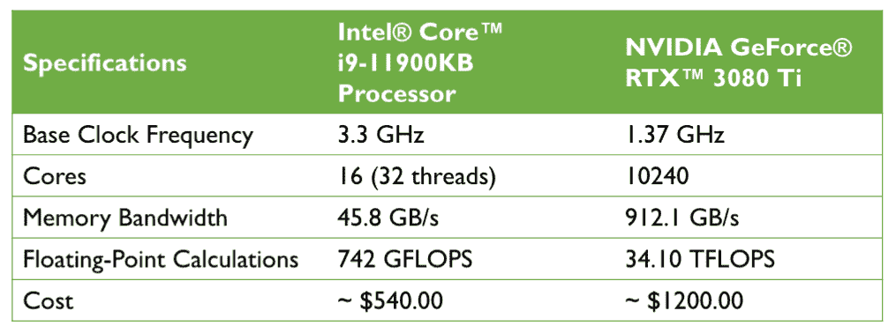

图 12.1:最先进的 CPU 和 GPU 的比较

*图 12.1* 中的信息来源为以下网站(访问日期:2021 年 7 月):

*   [https://ark . Intel . com/content/www/us/en/ark/products/215570/Intel-core-i9-11900 kb-processor-24m-cache-up-to-4-90-GHz . html](https://ark.intel.com/content/www/us/en/ark/products/215570/intel-core-i9-11900kb-processor-24m-cache-up-to-4-90-ghz.html)
*   [https://www . NVIDIA . com/en-us/geforce/graphics-cards/30 系列/rtx-3080-3080ti/](https://www.nvidia.com/en-us/geforce/graphics-cards/30-series/rtx-3080-3080ti/)

价格是现代 CPU 的 2.2 倍，我们可以得到一个拥有 640 倍内核的 GPU，每秒钟的浮点计算能力约为 46 倍。那么，是什么阻碍了我们利用 GPU 来完成机器学习任务呢？挑战在于，为目标 GPU 编写代码并不像在我们的解释器中执行 Python 代码那样简单。有一些特殊的包，如 CUDA 和 OpenCL，允许我们针对 GPU。然而，在 CUDA 或 OpenCL 中编写代码可能不是实现和运行机器学习算法的最方便的方式。好消息是 PyTorch 正是为此而开发的！

## PyTorch 是什么？

PyTorch 是一个可扩展的多平台编程接口，用于实现和运行机器学习算法，包括用于深度学习的便利包装器。PyTorch 最初是由来自**脸书人工智能研究** ( **FAIR** )实验室的研究人员和工程师开发的。它的发展也涉及到社区的许多贡献。PyTorch 最初于 2016 年 9 月发布，在修改后的 BSD 许可下免费开源。许多来自学术界和工业界的机器学习研究人员和实践者都改编了 PyTorch 来开发深度学习解决方案，如 Tesla Autopilot、优步的 Pyro 和 Hugging Face 的 Transformers([https://pytorch.org/ecosystem/](https://pytorch.org/ecosystem/))。

为了提高训练机器学习模型的性能，PyTorch 允许在 CPU、GPU 和 XLA 设备(如 TPU)上执行。然而，当使用 GPU 和 XLA 设备时，可以发现其最大的性能能力。PyTorch 正式支持支持 CUDA 和 ROCm 的 GPU。PyTorch 的开发基于 Torch 库( [www.torch.ch](http://torch.ch/) )。顾名思义，Python 接口是 PyTorch 的主要开发重点。

PyTorch 是围绕由一组节点组成的计算图构建的。每个节点代表一个可能有零个或多个输入或输出的操作。PyTorch 提供了一个命令式编程环境，可以评估操作、执行计算并立即返回具体值。因此，PyTorch 中的计算图是隐式定义的，而不是预先构建并在之后执行的。

数学上，张量可以理解为标量、向量、矩阵等的推广。更具体地，标量可以被定义为秩 0 张量，向量可以被定义为秩 1 张量，矩阵可以被定义为秩 2 张量，并且在第三维中堆叠的矩阵可以被定义为秩 3 张量。PyTorch 中的张量类似于 NumPy 的数组，只是张量针对自动微分进行了优化，可以在 GPU 上运行。

为了使张量的概念更清楚，考虑图 12.2 ，它在第一行表示 0 和 1 级的张量，在第二行表示 2 和 3 级的张量:


图 12.2:py torch 中不同类型的张量

现在我们知道 PyTorch 是什么，让我们看看如何使用它。

## 我们将如何学习 PyTorch

首先，我们将介绍 PyTorch 的编程模型，特别是创建和操作张量。然后，我们将看到如何加载数据和利用`torch.utils.data`模块，这将允许我们高效地遍历数据集。此外，我们将在`torch.utils.data.Dataset`子模块中讨论现有的现成数据集，并学习如何使用它们。

了解了这些基础知识之后，就要介绍 PyTorch 神经网络`torch.nn`模块了。然后，我们将继续构建机器学习模型，学习如何构建和训练模型，以及如何将训练好的模型保存在磁盘上以供将来评估。

# PyTorch 的第一步

在本节中，我们将开始使用低级 PyTorch API。安装 PyTorch 后，我们将介绍如何在 PyTorch 中创建张量，以及操作它们的不同方式，比如改变它们的形状、数据类型等等。

## 安装 PyTorch

要安装 PyTorch，我们建议咨询官方[https://pytorch.org](https://pytorch.org)网站上的最新说明。下面，我们将概述适用于大多数系统的基本步骤。

根据您的系统设置，您通常可以使用 Python 的`pip`安装程序，并通过在终端上执行以下命令从 PyPI 安装 PyTorch:

```py
pip install torch torchvision 
```

这样会安装最新的*稳定*版本，写的时候是 1.9.0。要安装 1.9.0 版本(保证与以下代码示例兼容),可以按如下方式修改前面的命令:

```py
pip install torch==1.9.0 torchvision==0.10.0 
```

如果要用 GPU(推荐)，需要兼容的支持 CUDA 和 cuDNN 的 NVIDIA 显卡。如果您的计算机满足这些要求，您可以安装支持 GPU 的 PyTorch，如下所示:

```py
pip install torch==1.9.0+cu111 torchvision==0.10.0+cu111 -f https://download.pytorch.org/whl/torch_stable.html 
```

对于 CUDA 11.1 或:

```py
pip install torch==1.9.0 torchvision==0.10.0\  -f https://download.pytorch.org/whl/torch_stable.html 
```

截至本文撰写之时，CUDA 10.2。

由于 macOS 二进制不支持 CUDA，你可以从源码:[https://pytorch.org/get-started/locally/#mac-from-source](https://pytorch.org/get-started/locally/#mac-from-source)安装。

有关安装和设置过程的更多信息，请参见在[https://pytorch.org/get-started/locally/](https://pytorch.org/get-started/locally/)的官方建议。

请注意 PyTorch 正在积极开发中；因此，每隔几个月，就会发布有重大变化的新版本。您可以从终端验证您的 PyTorch 版本，如下所示:

```py
python -c 'import torch; print(torch.__version__)' 
```

**py torch 安装故障排除**

如果您在安装过程中遇到问题，请阅读更多关于系统和平台的建议，这些建议在[https://pytorch.org/get-started/locally/](https://pytorch.org/get-started/locally/)提供。注意，本章所有的代码都可以在你的 CPU 上运行；使用 GPU 完全是可选的，但如果您想充分享受 PyTorch 的好处，建议使用 GPU。例如，在 CPU 上训练一些神经网络模型可能需要一周时间，而在现代 GPU 上只需几个小时就可以训练出相同的模型。如果您有显卡，请参考安装页面进行适当设置。此外，您可能会发现这本安装指南很有帮助，它解释了如何在 Ubuntu 上安装 NVIDIA 显卡驱动程序、CUDA 和 cuDNN(在 GPU 上运行 PyTorch 不是必需的，而是推荐的要求):[https://sebastianraschka . com/pdf/books/dlb/appendix _ h _ cloud-computing . pdf](https://sebastianraschka.com/pdf/books/dlb/appendix_h_cloud-computing.pdf)。此外，正如你将在*第 17 章*、*合成新数据的生成对抗网络*中看到的，你也可以通过 Google Colab 使用 GPU 免费训练你的模型。

## 在 PyTorch 中创建张量

现在，让考虑几种不同的创建张量的方法，然后看看它们的一些属性以及如何操作它们。首先，我们可以简单地使用`torch.tensor`或`torch.from_numpy`函数从列表或 NumPy 数组中创建一个张量，如下所示:

```py
>>> import torch

>>> import numpy as np

>>> np.set_printoptions(precision=3)

>>> a = [1, 2, 3]

>>> b = np.array([4, 5, 6], dtype=np.int32)

>>> t_a = torch.tensor(a)

>>> t_b = torch.from_numpy(b)

>>> print(t_a)

>>> print(t_b)

tensor([1, 2, 3])

tensor([4, 5, 6], dtype=torch.int32) 
```

这导致了张量`t_a`和`t_b`中的，它们的属性`shape=(3,)`和`dtype=int32`取自它们的源。与 NumPy 数组类似，我们也可以看到这些属性:

```py
>>> t_ones = torch.ones(2, 3)

>>> t_ones.shape

torch.Size([2, 3])

>>> print(t_ones)

tensor([[1., 1., 1.],

        [1., 1., 1.]]) 
```

最后，创建随机值的张量可以如下完成:

```py
>>> rand_tensor = torch.rand(2,3)

>>> print(rand_tensor)

tensor([[0.1409, 0.2848, 0.8914],

        [0.9223, 0.2924, 0.7889]]) 
```

## 操作张量的数据类型和形状

学习操纵张量的方法对于使它们兼容模型或操作的输入是必要的。在本节中，您将学习如何通过几个 PyTorch 函数来处理张量数据类型和形状，这些函数可以进行转换、整形、转置和挤压(删除维度)。

`torch.to()`函数可用于将张量的数据类型更改为所需的类型:

```py
>>> t_a_new = t_a.to(torch.int64)

>>> print(t_a_new.dtype)

torch.int64 
```

所有其他数据类型见[https://pytorch.org/docs/stable/tensor_attributes.html](https://pytorch.org/docs/stable/tensor_attributes.html)。

正如你将在接下来的章节中看到的，某些运算要求输入张量有一定数量的维度(即秩)与一定数量的元素(形状)相关联。因此，我们可能需要改变张量的形状，增加一个新的维度，或是压缩一个不必要的维度。PyTorch 提供了有用的函数(或操作)来实现这一点，比如`torch.transpose()`、`torch.reshape()`和`torch.squeeze()`。让我们来看一些例子:

*   转置张量:

    ```py
    >>> t = torch.rand(3, 5)

    >>> t_tr = torch.transpose(t, 0, 1)

    >>> print(t.shape, ' --> ', t_tr.shape)

    torch.Size([3, 5])  -->  torch.Size([5, 3]) 
    ```

*   重塑张量(例如，从 1D 向量到 2D 数组):

    ```py
    >>> t = torch.zeros(30)

    >>> t_reshape = t.reshape(5, 6)

    >>> print(t_reshape.shape)

    torch.Size([5, 6]) 
    ```

*   删除不必要的尺寸(尺寸为 1 的尺寸，不需要):

    ```py
    >>> t = torch.zeros(1, 2, 1, 4, 1)

    >>> t_sqz = torch.squeeze(t, 2)

    >>> print(t.shape, ' --> ', t_sqz.shape)

    torch.Size([1, 2, 1, 4, 1])  -->  torch.Size([1, 2, 4, 1]) 
    ```

## 对张量应用数学运算

应用数学运算，尤其是线性代数运算，对于构建大多数机器学习模型是必要的。在这个小节中，我们将涵盖一些广泛使用的线性代数运算，例如元素乘积、矩阵乘法和计算张量的范数。

首先，让我们实例化两个随机张量，一个在范围[–1，1]内均匀分布，另一个具有标准正态分布:

```py
>>> torch.manual_seed(1)

>>> t1 = 2 * torch.rand(5, 2) - 1

>>> t2 = torch.normal(mean=0, std=1, size=(5, 2)) 
```

请注意，`torch.rand`返回一个张量，其中填充了来自[0，1]范围内均匀分布的随机数。

请注意`t1`和`t2`具有相同的形状。现在，为了计算`t1`和`t2`的元素乘积，我们可以使用下面的公式:

```py
>>> t3 = torch.multiply(t1, t2)

>>> print(t3)

tensor([[ 0.4426, -0.3114], 

        [ 0.0660, -0.5970], 

        [ 1.1249,  0.0150], 

        [ 0.1569,  0.7107], 

        [-0.0451, -0.0352]]) 
```

要计算某个轴(或多个轴)的平均值、总和以及标准偏差，我们可以使用`torch.mean()`、`torch.sum()`和`torch.std()`。例如，`t1`中每列的平均值可以计算如下:

```py
>>> t4 = torch.mean(t1, axis=0)

>>> print(t4)

tensor([-0.1373,  0.2028]) 
```

`t1`和`t2`之间的矩阵-矩阵乘积(即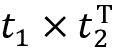，其中上标 T 表示转置)可以使用`torch.matmul()`函数计算如下:

```py
>>> t5 = torch.matmul(t1, torch.transpose(t2, 0, 1))

>>> print(t5)

tensor([[ 0.1312,  0.3860, -0.6267, -1.0096, -0.2943],

        [ 0.1647, -0.5310,  0.2434,  0.8035,  0.1980],

        [-0.3855, -0.4422,  1.1399,  1.5558,  0.4781],

        [ 0.1822, -0.5771,  0.2585,  0.8676,  0.2132],

        [ 0.0330,  0.1084, -0.1692, -0.2771, -0.0804]]) 
```

另一方面，在中，通过转置`t1`来执行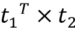的计算，从而得到大小为 2×2 的数组:

```py
>>> t6 = torch.matmul(torch.transpose(t1, 0, 1), t2)

>>> print(t6)

tensor([[ 1.7453,  0.3392],

        [-1.6038, -0.2180]]) 
```

最后，`torch.linalg.norm()`函数对于计算张量的*L*p 范数是有用的。例如，我们可以计算`t1`的*L*2 范数如下:

```py
>>> norm_t1 = torch.linalg.norm(t1, ord=2, dim=1)

>>> print(norm_t1)

tensor([0.6785, 0.5078, 1.1162, 0.5488, 0.1853]) 
```

为了验证这段代码正确地计算了`t1`的 *L* ² 范数，您可以将结果与下面的 NumPy 函数进行比较:`np.sqrt(np.sum(np.square(t1.numpy()), axis=1))`。

## 分割、堆叠和连接张量

在这一小节中，我们将讨论 PyTorch 运算，将一个张量分解成多个张量，或者反过来:将多个张量堆叠并连接成一个张量。

假设我们有一个单一的张量，我们想把它拆分成两个或更多的张量。为此，PyTorch 提供了一个方便的`torch.chunk()`函数，该函数将一个输入张量分成一系列大小相等的张量。我们可以使用`chunks`参数将张量沿着`dim`参数指定的期望维度进行分割，从而将期望的分割数确定为一个整数。在这种情况下，输入张量沿指定维度的总大小必须能被所需的分裂数整除。或者，我们可以使用`torch.split()`函数在列表中提供所需的尺寸。让我们来看一个这两种选项的例子:

*   Providing the number of splits:

    ```py
    >>> torch.manual_seed(1)

    >>> t = torch.rand(6)

    >>> print(t)

    tensor([0.7576, 0.2793, 0.4031, 0.7347, 0.0293, 0.7999])

    >>> t_splits = torch.chunk(t, 3)

    >>> [item.numpy() for item in t_splits]

    [array([0.758, 0.279], dtype=float32),

     array([0.403, 0.735], dtype=float32),

     array([0.029, 0.8  ], dtype=float32)] 
    ```

    在这个例子中，大小为 6 的张量被分成三个大小为 2 的张量。如果张量大小不能被`chunks`值整除，那么最后一个块会更小。

*   Providing the sizes of different splits:

    或者，代替定义分裂数的，我们也可以直接指定输出张量的大小。这里，我们将大小为`5`的张量分解成大小为`3`和`2`的张量:

    ```py
    >>> torch.manual_seed(1)

    >>> t = torch.rand(5)

    >>> print(t)

    tensor([0.7576, 0.2793, 0.4031, 0.7347, 0.0293])

    >>> t_splits = torch.split(t, split_size_or_sections=[3, 2])

    >>> [item.numpy() for item in t_splits]

    [array([0.758, 0.279, 0.403], dtype=float32),

     array([0.735, 0.029], dtype=float32)] 
    ```

有时，我们在处理多个张量，需要连接或堆叠它们来创建一个张量。在这种情况下，`torch.stack()`、`torch.cat()`等 PyTorch 函数就派上用场了。例如，让我们创建一个包含大小为`3,`的 1 的 1D 张量`A`和一个包含大小为`2,`的 0 的 1D 张量`B`，并将它们连接成大小为`5`的 1D 张量`C`:

```py
>>> A = torch.ones(3)

>>> B = torch.zeros(2)

>>> C = torch.cat([A, B], axis=0)

>>> print(C)

tensor([1., 1., 1., 0., 0.]) 
```

如果我们创建 1D 张量`A`和`B`，两者的大小都是`3`，那么我们可以将它们叠加在一起，形成一个 2D 张量`S`:

```py
>>> A = torch.ones(3)

>>> B = torch.zeros(3)

>>> S = torch.stack([A, B], axis=1)

>>> print(S)

tensor([[1., 0.],

        [1., 0.],

        [1., 0.]]) 
```

PyTorch API 有许多操作可以用来构建模型、处理数据等等。然而，涵盖每一个功能都超出了本书的范围，在本书中我们将关注最基本的功能。关于操作和功能的完整列表，您可以参考位于 https://pytorch.org/docs/stable/index.html[的 PyTorch 的文档页面。](https://pytorch.org/docs/stable/index.html)

# 在 PyTorch 中构建输入管道

当我们训练深度神经网络模型时，我们通常使用迭代优化算法(如随机梯度下降)增量训练模型，正如我们在前面章节中看到的那样。

正如本章开头提到的,`torch.nn`是一个构建 NN 模型的模块。在训练数据集相当小并且可以作为张量加载到存储器中的情况下，我们可以直接使用该张量进行训练。然而，在典型的用例中，当数据集太大而不适合计算机内存时，我们将需要从主存储设备(例如，硬盘驱动器或固态驱动器)中成批地加载数据，即一批一批地加载。(注意在本章中使用术语“批处理”而不是“小批处理”,以接近 PyTorch 术语。)此外，我们可能需要构建一个数据处理管道，对我们的数据应用某些转换和预处理步骤，如均值居中、缩放或添加噪声，以增加训练过程并防止过度拟合。

每次手动应用预处理函数会非常麻烦。幸运的是，PyTorch 提供了一个特殊的类来构建高效便捷的预处理管道。在本节中，我们将看到构建 PyTorch `Dataset`和`DataLoader`以及实现数据加载、混排和批处理的不同方法的概述。

## 从现有张量创建 PyTorch 数据加载器

如果数据已经以张量对象、Python 列表或 NumPy 数组的形式存在，我们可以使用`torch.utils.data.DataLoader()`类轻松地创建数据集加载器。它返回一个`DataLoader`类的对象，我们可以用它来遍历输入数据集中的单个元素。举个简单的例子，考虑下面的代码，它从 0 到 5 的值列表中创建一个数据集:

```py
>>> from torch.utils.data import DataLoader

>>> t = torch.arange(6, dtype=torch.float32)

>>> data_loader = DataLoader(t) 
```

我们可以轻松地逐个条目地遍历数据集，如下所示:

```py
>>> for item in data_loader:

...     print(item)

tensor([0.])

tensor([1.])

tensor([2.])

tensor([3.])

tensor([4.])

tensor([5.]) 
```

如果我们想从这个数据集中创建批处理，具有期望的批处理大小`3`，我们可以使用如下的`batch_size`参数:

```py
>>> data_loader = DataLoader(t, batch_size=3, drop_last=False)

>>> for i, batch in enumerate(data_loader, 1):

...    print(f'batch {i}:', batch)

batch 1: tensor([0., 1., 2.])

batch 2: tensor([3., 4., 5.]) 
```

这将从该数据集创建两个批次，其中前三个元素进入批次#1，其余元素进入批次#2。可选的`drop_last`参数在张量中的元素数量不能被期望的批量大小整除的情况下很有用。我们可以通过将`drop_last`设置为`True`来丢弃最后一个非满批次。`drop_last`的默认值为`False`。

我们总是可以直接遍历数据集，但是正如您刚才看到的，`DataLoader`为数据集提供了自动和可定制的批处理。

## 将两个张量组合成一个联合数据集

通常，我们可能有两个(或更多)张量的数据。例如，我们可以用一个张量表示特征，一个张量表示标签。在这种情况下，我们需要建立一个组合这些张量的数据集，这将允许我们在元组中检索这些张量的元素。

假设我们有两个张量，`t_x`和`t_y`。张量`t_x`保存我们的特征值，每个特征值的大小为`3`，`t_y`存储类别标签。对于这个例子，我们首先创建这两个张量如下:

```py
>>> torch.manual_seed(1)

>>> t_x = torch.rand([4, 3], dtype=torch.float32)

>>> t_y = torch.arange(4) 
```

现在，我们想从这两个张量创建一个联合数据集。我们首先需要创建一个`Dataset`类，如下所示:

```py
>>> from torch.utils.data import Dataset

>>> class JointDataset(Dataset):

...     def __init__(self, x, y):

...         self.x = x

...         self.y = y

...        

...     def __len__(self):

...         return len(self.x)

...

...     def __getitem__(self, idx):

...         return self.x[idx], self.y[idx] 
```

自定义`Dataset`类必须包含以下方法，供数据加载器稍后使用:

*   `__init__()`:这是初始逻辑发生的地方，比如读取现有数组、加载文件、过滤数据等等。
*   `__getitem__()`:返回给定索引对应的样本。

然后我们用自定义的`Dataset`类创建一个`t_x`和`t_y`的联合数据集，如下所示:

```py
>>> joint_dataset = JointDataset(t_x, t_y) 
```

最后，我们可以按如下方式打印联合数据集的每个示例:

```py
>>> for example in joint_dataset:

...     print('  x: ', example[0], '  y: ', example[1])

  x:  tensor([0.7576, 0.2793, 0.4031])   y:  tensor(0)

  x:  tensor([0.7347, 0.0293, 0.7999])   y:  tensor(1)

  x:  tensor([0.3971, 0.7544, 0.5695])   y:  tensor(2)

  x:  tensor([0.4388, 0.6387, 0.5247])   y:  tensor(3) 
```

如果第二个数据集是张量形式的标记数据集，我们也可以简单地使用`torch.utils.data.TensorDataset`类。因此，不使用我们自定义的`Dataset`类`JointDataset`，我们可以如下创建一个联合数据集:

```py
>>> joint_dataset = JointDataset(t_x, t_y) 
```

注意一个常见的错误来源可能是原始特征( *x* )和标签( *y* )之间的元素对应可能会丢失(例如，如果两个数据集被分别打乱)。但是，一旦它们被合并到一个数据集中，就可以安全地应用这些操作。

如果我们有一个从磁盘上的图像文件名列表创建的数据集，我们可以定义一个函数从这些文件名中加载图像。在本章的后面，您将看到一个对数据集应用多重转换的示例。

## 洗牌、分批和重复

正如在*第二章*、*训练简单的机器学习算法进行分类*中提到的，当使用随机梯度下降优化训练一个 NN 模型时，重要的是将训练数据作为随机混洗的批次馈送。您已经看到了如何使用数据加载器对象的`batch_size`参数来指定批处理大小。现在，除了创建批处理之外，您还将看到如何在数据集上移动和重复。我们将继续使用先前的联合数据集。

首先，让我们从`joint_dataset`数据集创建一个混洗版本数据加载器:

```py
>>> torch.manual_seed(1) 

>>> data_loader = DataLoader(dataset=joint_dataset, batch_size=2, shuffle=True) 
```

这里，每批包含两个数据记录( *x* )和相应的标签( *y* )。现在，我们逐个条目地遍历数据加载器，如下所示:

```py
>>> for i, batch in enumerate(data_loader, 1):

...     print(f'batch {i}:', 'x:', batch[0],

              '\n         y:', batch[1])

batch 1: x: tensor([[0.4388, 0.6387, 0.5247],

        [0.3971, 0.7544, 0.5695]]) 

         y: tensor([3, 2])

batch 2: x: tensor([[0.7576, 0.2793, 0.4031],

        [0.7347, 0.0293, 0.7999]]) 

         y: tensor([0, 1]) 
```

各行被打乱，而不会失去`x`和`y`中条目之间的一一对应关系。

此外，当为多个时期训练模型时，我们需要按照期望的时期数在数据集上洗牌和迭代。因此，让我们对批处理数据集迭代两次:

```py
>>> for epoch in range(2): 

>>>     print(f'epoch {epoch+1}')

>>>     for i, batch in enumerate(data_loader, 1):

...         print(f'batch {i}:', 'x:', batch[0], 

                  '\n         y:', batch[1])

epoch 1

batch 1: x: tensor([[0.7347, 0.0293, 0.7999],

        [0.3971, 0.7544, 0.5695]]) 

         y: tensor([1, 2])

batch 2: x: tensor([[0.4388, 0.6387, 0.5247],

        [0.7576, 0.2793, 0.4031]]) 

         y: tensor([3, 0])

epoch 2

batch 1: x: tensor([[0.3971, 0.7544, 0.5695],

        [0.7576, 0.2793, 0.4031]]) 

         y: tensor([2, 0])

batch 2: x: tensor([[0.7347, 0.0293, 0.7999],

        [0.4388, 0.6387, 0.5247]]) 

         y: tensor([1, 3]) 
```

此导致两组不同的批次。在第一个时期中，第一批包含一对值`[y=1, y=2]`，第二批包含一对值`[y=3, y=0]`。在第二个纪元中，两个批次分别包含一对值`[y=2, y=0]`和`[y=1, y=3]`。对于每次迭代，批次中的元素也会被打乱。

## 从本地存储磁盘上的文件创建数据集

在本节中，我们将从存储在磁盘上的图像文件构建一个数据集。有一个图像文件夹与本章的在线内容相关联。下载文件夹后，你应该能看到六张 JPEG 格式的猫狗图片。

这个小数据集将展示如何从存储的文件构建数据集。为此，我们将使用两个额外的模块:`PIL`中的`Image`来读取图像文件内容，以及`torchvision`中的`transforms`来解码原始内容并调整图像大小。

`PIL.Image`和`torchvision.transforms`模块提供了许多额外的有用的功能，这超出了本书的范围。我们鼓励您浏览官方文档以了解有关这些功能的更多信息:

[https://pillow . readthe docs . io/en/stable/reference/image . html](https://pillow.readthedocs.io/en/stable/reference/Image.html)为`PIL.Image`

[https://pytorch.org/vision/stable/transforms.html](https://pytorch.org/vision/stable/transforms.html)为`torchvision.transforms`

在开始之前，让我们看一下这些文件的内容。我们将使用`pathlib`库来生成图像文件列表:

```py
>>> import pathlib

>>> imgdir_path = pathlib.Path('cat_dog_images')

>>> file_list = sorted([str(path) for path in

... imgdir_path.glob('*.jpg')])

>>> print(file_list)

['cat_dog_images/dog-03.jpg', 'cat_dog_images/cat-01.jpg', 'cat_dog_images/cat-02.jpg', 'cat_dog_images/cat-03.jpg', 'cat_dog_images/dog-01.jpg', 'cat_dog_images/dog-02.jpg'] 
```

接下来，我们将使用 Matplotlib 可视化这些图像示例:

```py
>>> import matplotlib.pyplot as plt

>>> import os

>>> from PIL import Image

>>> fig = plt.figure(figsize=(10, 5))

>>> for i, file in enumerate(file_list):

...     img = Image.open(file)

...     print('Image shape:', np.array(img).shape)

...     ax = fig.add_subplot(2, 3, i+1)

...     ax.set_xticks([]); ax.set_yticks([])

...     ax.imshow(img)

...     ax.set_title(os.path.basename(file), size=15)

>>> plt.tight_layout()

>>> plt.show()

Image shape: (900, 1200, 3)

Image shape: (900, 1200, 3)

Image shape: (900, 1200, 3)

Image shape: (900, 742, 3)

Image shape: (800, 1200, 3)

Image shape: (800, 1200, 3) 
```

*图 12.3* 显示了示例图像:

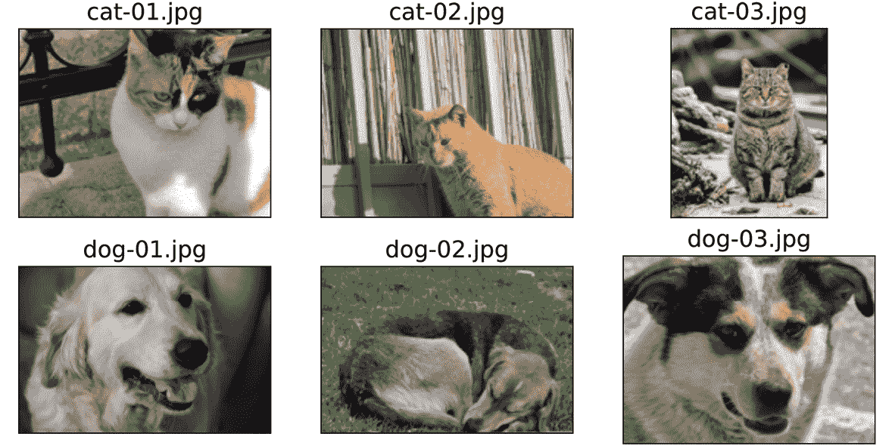

图 12.3:猫和狗的图像

仅从这个可视化和打印的图像形状，我们已经可以看到图像具有不同的纵横比。如果您打印这些图像的纵横比(或数据数组形状)，您会看到有些图像是 900 像素高和 1200 像素宽(900×1200)，有些是 800×1200，还有一个是 900×742。稍后，我们将对这些图像进行预处理，使其大小一致。另一点要考虑的是，这些图像的标签是在它们的文件名中提供的。因此，我们从文件名列表中提取这些标签，将标签`1`分配给狗，将标签`0`分配给猫:

```py
>>> labels = [1 if 'dog' in 

...              os.path.basename(file) else 0

...                      for file in file_list]

>>> print(labels)

[0, 0, 0, 1, 1, 1] 
```

现在，我们有两个列表:文件名列表(或者每个图像的路径)和标签列表。在上一节中，您学习了如何从两个数组创建联合数据集。在这里，我们将执行以下操作:

```py
>>> class ImageDataset(Dataset):

...     def __init__(self, file_list, labels):

...         self.file_list = file_list

...         self.labels = labels

... 

...     def __getitem__(self, index):

...         file = self.file_list[index]

...         label = self.labels[index]

...         return file, label

...

...     def __len__(self):

...         return len(self.labels)

>>> image_dataset = ImageDataset(file_list, labels)

>>> for file, label in image_dataset:

...     print(file, label)

cat_dog_images/cat-01.jpg 0

cat_dog_images/cat-02.jpg 0

cat_dog_images/cat-03.jpg 0

cat_dog_images/dog-01.jpg 1

cat_dog_images/dog-02.jpg 1

cat_dog_images/dog-03.jpg 1 
```

联合数据集具有文件名和标签。

接下来，我们需要对这个数据集应用转换:从图像的文件路径加载图像内容，解码原始内容，并将其调整到所需的大小，例如 80×120。正如前面提到的，我们使用`torchvision.transforms`模块来调整图像的大小，并将加载的像素转换成张量，如下所示:

```py
>>> import torchvision.transforms as transforms 

>>> img_height, img_width = 80, 120

>>> transform = transforms.Compose([

...     transforms.ToTensor(),

...     transforms.Resize((img_height, img_width)),

... ]) 
```

现在我们用刚刚定义的`transform`更新`ImageDataset`类:

```py
>>> class ImageDataset(Dataset):

...     def __init__(self, file_list, labels, transform=None):

...         self.file_list = file_list

...         self.labels = labels

...         self.transform = transform

...

...     def __getitem__(self, index):

...         img = Image.open(self.file_list[index])

...         if self.transform is not None:

...             img = self.transform(img)

...         label = self.labels[index]

...         return img, label

...

...     def __len__(self):

...         return len(self.labels)

>>> 

>>> image_dataset = ImageDataset(file_list, labels, transform) 
```

最后，我们使用 Matplotlib 可视化这些转换后的图像示例:

```py
>>> fig = plt.figure(figsize=(10, 6))

>>> for i, example in enumerate(image_dataset):

...     ax = fig.add_subplot(2, 3, i+1)

...     ax.set_xticks([]); ax.set_yticks([])

...     ax.imshow(example[0].numpy().transpose((1, 2, 0)))

...     ax.set_title(f'{example[1]}', size=15)

...

>>> plt.tight_layout()

>>> plt.show() 
```

此导致检索到的示例图像及其标签的以下可视化:

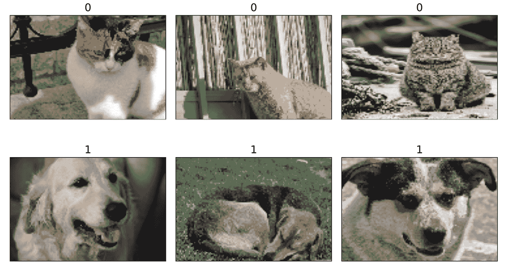

图 12.4:图像被标记

`ImageDataset`类中的`__getitem__`方法将所有四个步骤封装到一个函数中，包括加载原始内容(图像和标签)、将图像解码为张量以及调整图像大小。然后，该函数返回一个数据集，我们可以对其进行迭代，并通过数据加载器应用我们在前面章节中了解到的其他操作，如洗牌和批处理。

## 从 torchvision.datasets 库中获取可用数据集

`torchvision.datasets`库提供了一个很好的免费图像数据集集合，用于训练或评估深度学习模型。类似地，`torchtext.datasets`库为自然语言提供数据集。这里，我们以`torchvision.datasets`为例。

`torchvision`数据集(【https://pytorch.org/vision/stable/datasets.html】)的格式很好，并带有信息丰富的描述，包括要素和标注的格式及其类型和维度，以及到数据集原始来源的链接。另一个好处是，这些数据集都是`torch.utils.data.Dataset`的子类，所以我们在前面章节中涉及的所有函数都可以直接使用。那么，让我们看看如何使用这些数据集。

首先，如果您之前没有将`torchvision`与 PyTorch 一起安装，那么您需要通过命令行中的`pip`来安装`torchvision`库:

```py
pip install torchvision 
```

你可以在 https://pytorch.org/vision/stable/datasets.html 查看可用数据集列表。

在下面的段落中，我们将介绍如何获取两个不同的数据集:CelebA ( `celeb_a`)和 MNIST 数字数据集。

让我们首先使用 CelebA 数据集(【http://mmlab.ie.cuhk.edu.hk/projects/CelebA.html】)和`torchvision.datasets.CelebA`()。`torchvision.datasets.CelebA`的描述提供了一些有用的信息来帮助我们理解这个数据集的结构:

*   数据库有三个子集，`'train'`、`'valid'`和`'test'`。我们可以选择一个特定的子集，或者用`split`参数加载所有的子集。
*   图像以`PIL.Image`格式存储。我们可以使用定制的`transform`函数，比如`transforms.ToTensor`和`transforms.Resize`，获得一个转换后的版本。
*   我们可以使用不同类型的目标，包括`'attributes'`、`'identity'`和`'landmarks'`。`'attributes'`是图像中人的 40 个面部属性，如面部表情、妆容、发型等；`'identity'`是图像的人物 ID；而`'` `landmarks'`指的是字典中提取的面部点，比如眼睛、鼻子等等的位置。

接下来，我们将调用`torchvision.datasets.CelebA`类来下载数据，将其存储在磁盘上的指定文件夹中，并将其加载到一个`torch.utils.data.Dataset`对象中:

```py
>>> import torchvision 

>>> image_path = './' 

>>> celeba_dataset = torchvision.datasets.CelebA(

...     image_path, split='train', target_type='attr', download=True

... )

1443490838/? [01:28<00:00, 6730259.81it/s]

26721026/? [00:03<00:00, 8225581.57it/s]

3424458/? [00:00<00:00, 14141274.46it/s]

6082035/? [00:00<00:00, 21695906.49it/s]

12156055/? [00:00<00:00, 12002767.35it/s]

2836386/? [00:00<00:00, 3858079.93it/s] 
```

你可能会遇到一个`BadZipFile: File is not a zip file`错误，或者`RuntimeError: The daily quota of the file img_align_celeba.zip is exceeded and it can't be downloaded. This is a limitation of Google Drive and can only be overcome by trying again later`；这只是意味着 Google Drive 的每日最大配额被 CelebA 文件超过了。要解决这个问题，您可以手动从源代码:[http://mmlab.ie.cuhk.edu.hk/projects/CelebA.html](http://mmlab.ie.cuhk.edu.hk/projects/CelebA.html)下载文件。在下载的文件夹`celeba/`中，可以解压`img_align_celeba.zip`文件。`image_path`是下载文件夹的根目录`celeba/`。如果你已经下载了一次文件，你可以简单地设置`download=False`。如需更多信息和指导，我们强烈建议查看随附的代码笔记本，网址为[https://github . com/rasbt/machine-learning-book/blob/main/ch12/ch12 _ part 1 . ipynb](https://github.com/rasbt/machine-learning-book/blob/main/ch12/ch12_part1.ipynb)。

现在我们已经实例化了数据集，让我们检查对象是否属于`torch.utils.data.Dataset`类:

```py
>>> assert isinstance(celeba_dataset, torch.utils.data.Dataset) 
```

如前所述，数据集已经分为训练、测试和验证数据集，我们只加载训练集。我们只使用`'attributes'`目标。为了查看数据示例的样子，我们可以执行以下代码:

```py
>>> example = next(iter(celeba_dataset))

>>> print(example)

(<PIL.JpegImagePlugin.JpegImageFile image mode=RGB size=178x218 at 0x120C6C668>, tensor([0, 1, 1, 0, 0, 0, 0, 0, 0, 0, 0, 1, 0, 0, 0, 0, 0, 0, 1, 1, 0, 1, 0, 0, 1, 0, 0, 1, 0, 0, 0, 1, 1, 0, 1, 0, 1, 0, 0, 1])) 
```

注意，这个数据集中的样本来自一个元组`(PIL.Image, attributes)`。如果我们想在训练时将这个数据集传递给有监督的深度学习模型，我们必须将其重新格式化为一个`(features tensor, label)`的元组。对于标签，我们将使用属性中的`'Smiling'`类别作为示例，它是第 31 个元素。

最后，让我们从其中取出前 18 个例子，用它们的`'Smiling'`标签来形象化它们:

```py
>>> from itertools import islice

>>> fig = plt.figure(figsize=(12, 8))

>>> for i, (image, attributes) in islice(enumerate(celeba_dataset), 18):

...     ax = fig.add_subplot(3, 6, i+1)

...     ax.set_xticks([]); ax.set_yticks([])

...     ax.imshow(image)

...     ax.set_title(f'{attributes[31]}', size=15)

>>> plt.show() 
```

从`celeba_dataset`检索的示例及其标签如图*图 12.5* 所示:


图 12.5:模型预测微笑的名人

这就是我们获取和使用 CelebA 图像数据集所需要做的全部工作。

接下来，我们将继续处理来自`torchvision.datasets.MNIST`([https://pytorch.org/vision/stable/datasets.html#mnist](https://pytorch.org/vision/stable/datasets.html#mnist))的第二个数据集。让我们看看如何使用它来获取 MNIST 数字数据集:

*   数据库有两个分区，`'train'`和`'test'`。我们需要选择一个特定的子集来加载。
*   图像以`PIL.Image`格式存储。我们可以使用定制的`transform`函数，比如`transforms.ToTensor`和`transforms.Resize`，获得一个转换后的版本。
*   目标有 10 个等级，从`0`到`9`。

现在，我们可以下载`'train'`分区，将元素转换为元组，并可视化 10 个示例:

```py
>>> mnist_dataset = torchvision.datasets.MNIST(image_path, 'train', download=True)

>>> assert isinstance(mnist_dataset, torch.utils.data.Dataset)

>>> example = next(iter(mnist_dataset))

>>> print(example)

(<PIL.Image.Image image mode=L size=28x28 at 0x126895B00>, 5)

>>> fig = plt.figure(figsize=(15, 6))

>>> for i, (image, label) in  islice(enumerate(mnist_dataset), 10):

...     ax = fig.add_subplot(2, 5, i+1)

...     ax.set_xticks([]); ax.set_yticks([])

...     ax.imshow(image, cmap='gray_r')

...     ax.set_title(f'{label}', size=15)

>>> plt.show() 
```

从该数据集中检索到的示例手写数字如下所示:

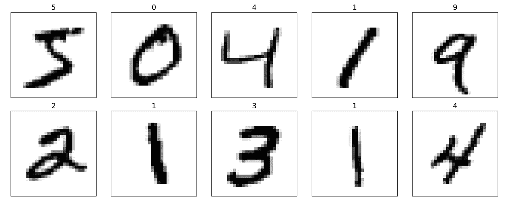

图 12.6:正确识别手写数字

我们构建和操作数据集以及从`torchvision.datasets`库中获取数据集的内容到此结束。接下来，我们将看到如何在 PyTorch 中构建 NN 模型。

# 在 PyTorch 中建立神经网络模型

到目前为止，在这一章中，你已经学习了 PyTorch 的基本工具组件，用于操作张量和将数据组织成我们可以在训练中迭代的格式。在本节中，我们将最终在 PyTorch 中实现我们的第一个预测模型。由于 PyTorch 比 scikit-learn 等机器学习库更灵活，但也更复杂，我们将从一个简单的线性回归模型开始。

## PyTorch 神经网络模块(torch.nn)

`torch.nn`是一个设计优雅的模块，旨在帮助创建和培训神经网络。它只需要几行代码就可以实现简单的原型制作和复杂模型的构建。

为了充分利用模块的能力并针对您的问题定制它，您需要了解它在做什么。为了发展这种理解，我们将首先在一个玩具数据集上训练一个基本的线性回归模型，而不使用来自`torch.nn`模块的任何特征；我们只使用基本的 PyTorch 张量运算。

然后，我们将从`torch.nn`和`torch.optim`逐渐增加特性。正如您将在下面的小节中看到的，这些模块使得构建神经网络模型变得极其容易。我们还将利用 PyTorch 中支持的数据集管道功能，例如`Dataset`和`DataLoader`，您在上一节中已经了解了这些功能。在本书中，我们将使用`torch.nn`模块来构建神经网络模型。

在 PyTorch 中构建神经网络最常用的方法是通过`nn.Module`，它允许层堆叠起来形成一个网络。这给了我们更多向前传球的控制。我们将看到使用`nn.Module`类构建神经网络模型的例子。

最后，正如您将在下面的小节中看到的，一个经过训练的模型可以被保存并重新加载以供将来使用。

## 构建线性回归模型

在本小节中，我们将构建一个简单的模型来解决线性回归问题。首先，让我们在 NumPy 中创建一个玩具数据集，并将其可视化:

```py
>>> X_train = np.arange(10, dtype='float32').reshape((10, 1))

>>> y_train = np.array([1.0, 1.3, 3.1, 2.0, 5.0, 

...                     6.3, 6.6,7.4, 8.0,

...                     9.0], dtype='float32')

>>> plt.plot(X_train, y_train, 'o', markersize=10)

>>> plt.xlabel('x')

>>> plt.ylabel('y')

>>> plt.show() 
```

因此，训练示例将显示在散点图中，如下所示:

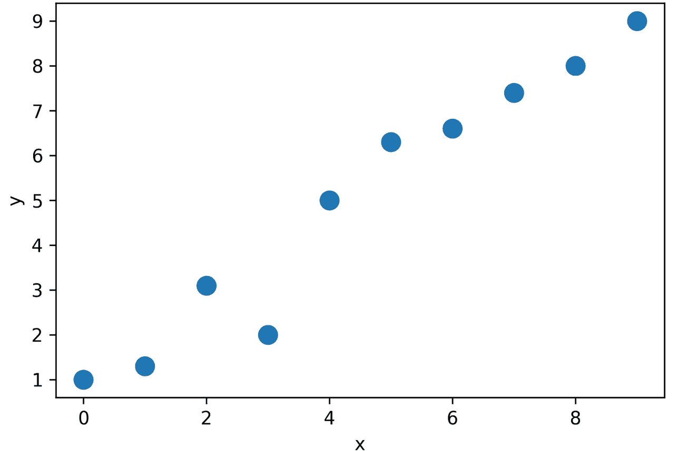

图 12.7:训练示例的散点图

接下来，我们将标准化这些特征(意思是居中并除以标准偏差)并为训练集创建一个 PyTorch `Dataset`和一个对应的`DataLoader`:

```py
>>> from torch.utils.data import TensorDataset

>>> X_train_norm = (X_train - np.mean(X_train)) / np.std(X_train)

>>> X_train_norm = torch.from_numpy(X_train_norm)

>>> y_train = torch.from_numpy(y_train)

>>> train_ds = TensorDataset(X_train_norm, y_train)

>>> batch_size = 1

>>> train_dl = DataLoader(train_ds, batch_size, shuffle=True) 
```

这里，我们为`DataLoader`设置一个`1`的批量。

现在，我们可以将线性回归的模型定义为 *z* = *wx* + *b* 。这里，我们将使用`torch.nn`模块。它为构建复杂的神经网络模型提供了预定义的层，但首先，您将学习如何从头开始定义模型。在本章的后面，你将看到如何使用这些预定义的层。

对于这个回归问题，我们将从头定义一个线性回归模型。我们将定义我们的模型的参数，`weight`和`bias`，它们分别对应于权重和偏差参数。最后，我们将定义`model()`函数来确定这个模型如何使用输入数据来生成它的输出:

```py
>>> torch.manual_seed(1)

>>> weight = torch.randn(1)

>>> weight.requires_grad_()

>>> bias = torch.zeros(1, requires_grad=True)

>>> def model(xb):

...     return xb @ weight + bias 
```

定义模型后，我们可以定义我们希望最小化的损失函数，以找到最佳模型权重。这里，我们将选择**均方误差** ( **MSE** )作为我们的损失函数:

```py
>>> def loss_fn(input, target):

...     return (input-target).pow(2).mean() 
```

此外，为了学习模型的权重参数，我们将使用随机梯度下降。在这一小节中，我们将自己通过随机梯度下降过程来实现这一训练，但是在下一小节中，我们将使用优化包`torch.optim`中的`SGD`方法来做同样的事情。

为了实现随机梯度下降算法，我们需要计算梯度。我们将使用 PyTorch 的`torch.autograd.backward`函数，而不是手动计算梯度。我们将在*第 13 章*、*更深入 PyTorch 的机制*中介绍`torch.autograd`及其实现自动微分的不同类和功能。

现在，我们可以设置学习率，并对模型进行 200 个纪元的训练。针对数据集的批处理版本对模型进行定型的代码如下:

```py
>>> learning_rate = 0.001

>>> num_epochs = 200

>>> log_epochs = 10

>>> for epoch in range(num_epochs):

...     for x_batch, y_batch in train_dl:

...         pred = model(x_batch)

...         loss = loss_fn(pred, y_batch)

...         loss.backward()

...     with torch.no_grad():

...         weight -= weight.grad * learning_rate

...         bias -= bias.grad * learning_rate

...         weight.grad.zero_() 

...         bias.grad.zero_()   

...     if epoch % log_epochs==0:

...         print(f'Epoch {epoch}  Loss {loss.item():.4f}')

Epoch 0  Loss 5.1701

Epoch 10  Loss 30.3370

Epoch 20  Loss 26.9436

Epoch 30  Loss 0.9315

Epoch 40  Loss 3.5942

Epoch 50  Loss 5.8960

Epoch 60  Loss 3.7567

Epoch 70  Loss 1.5877

Epoch 80  Loss 0.6213

Epoch 90  Loss 1.5596

Epoch 100  Loss 0.2583

Epoch 110  Loss 0.6957

Epoch 120  Loss 0.2659

Epoch 130  Loss 0.1615

Epoch 140  Loss 0.6025

Epoch 150  Loss 0.0639

Epoch 160  Loss 0.1177

Epoch 170  Loss 0.3501

Epoch 180  Loss 0.3281

Epoch 190  Loss 0.0970 
```

让我们看看训练好的模型，并绘制它。对于测试数据，我们将创建一个 NumPy 数组,其中的值在 0 和 9 之间均匀分布。由于我们用标准化的特征训练了我们的模型，我们也将同样的标准化应用于测试数据:

```py
>>> print('Final Parameters:', weight.item(), bias.item())

Final Parameters:  2.669806480407715 4.879569053649902

>>> X_test = np.linspace(0, 9, num=100, dtype='float32').reshape(-1, 1)

>>> X_test_norm = (X_test - np.mean(X_train)) / np.std(X_train)

>>> X_test_norm = torch.from_numpy(X_test_norm)

>>> y_pred = model(X_test_norm).detach().numpy()

>>> fig = plt.figure(figsize=(13, 5))

>>> ax = fig.add_subplot(1, 2, 1)

>>> plt.plot(X_train_norm, y_train, 'o', markersize=10)

>>> plt.plot(X_test_norm, y_pred, '--', lw=3)

>>> plt.legend(['Training examples', 'Linear reg.'], fontsize=15)

>>> ax.set_xlabel('x', size=15)

>>> ax.set_ylabel('y', size=15)

>>> ax.tick_params(axis='both', which='major', labelsize=15)

>>> plt.show() 
```

*图 12.8* 显示了训练样本和训练好的线性回归模型的散点图:

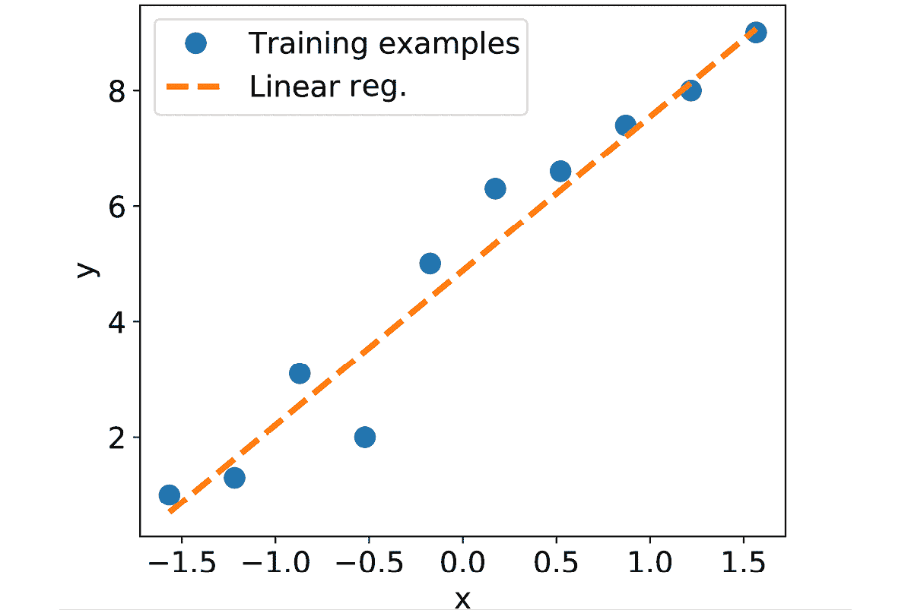

图 12.8:线性回归模型很好地拟合了数据

## 通过 torch.nn 和 torch.optim 模块进行模型训练

在之前的例子中，我们看到了如何通过编写自定义损失函数`loss_fn()`和应用随机梯度下降优化来训练模型。然而，编写损失函数和梯度更新可能是跨不同项目的可重复任务。`torch.nn`模块提供了一组损失函数，`torch.optim`支持最常用的优化算法，可以调用这些算法根据计算出的梯度更新参数。为了了解它们是如何工作的，让我们创建一个新的 MSE 损失函数和一个随机梯度下降优化器:

```py
>>> import torch.nn as nn

>>> loss_fn = nn.MSELoss(reduction='mean')

>>> input_size = 1

>>> output_size = 1

>>> model = nn.Linear(input_size, output_size)

>>> optimizer = torch.optim.SGD(model.parameters(), lr=learning_rate) 
```

注意，这里我们使用`torch.nn.Linear`类作为线性层，而不是手动定义它。

现在，我们可以简单地调用`optimizer`的`step()`方法来训练模型。我们可以传递一个批处理的数据集(比如前面例子中创建的`train_dl`):

```py
>>> for epoch in range(num_epochs):

...     for x_batch, y_batch in train_dl:

...         # 1\. Generate predictions

...         pred = model(x_batch)[:, 0]

...         # 2\. Calculate loss

...         loss = loss_fn(pred, y_batch)

...         # 3\. Compute gradients

...         loss.backward()

...         # 4\. Update parameters using gradients

...         optimizer.step()

...         # 5\. Reset the gradients to zero

...         optimizer.zero_grad()    

...     if epoch % log_epochs==0:

...         print(f'Epoch {epoch}  Loss {loss.item():.4f}') 
```

模型定型后，将结果可视化，并确保它们与之前方法的结果相似。要获得权重和偏差参数，我们可以执行以下操作:

```py
>>> print('Final Parameters:', model.weight.item(), model.bias.item())

Final Parameters: 2.646660089492798 4.883835315704346 
```

## 构建多层感知器用于虹膜数据集中的花卉分类

在前面的例子中，您看到了如何从头构建一个模型。我们使用随机梯度下降优化来训练这个模型。虽然我们从最简单的例子开始了我们的旅程，但是您可以看到，从头开始定义模型，即使对于这样一个简单的例子，既不吸引人，也不是好的实践。PyTorch 通过`torch.nn`提供已经定义的层，这些层可以很容易地用作神经网络模型的构建模块。在本节中，您将学习如何使用这些层来解决使用鸢尾花数据集(识别三种鸢尾)的分类任务，并使用`torch.nn`模块构建一个两层感知器。首先，让我们从`sklearn.datasets`获取数据:

```py
>>> from sklearn.datasets import load_iris

>>> from sklearn.model_selection import train_test_split 

>>> iris = load_iris()

>>> X = iris['data']

>>> y = iris['target']

>>> X_train, X_test, y_train, y_test = train_test_split(

...    X, y, test_size=1./3, random_state=1) 
```

这里，我们随机选择 100 个样本(2/3)用于训练，50 个样本(1/3)用于测试。

接下来，我们标准化这些特征(平均居中并除以标准偏差)并为训练集创建 PyTorch `Dataset`和相应的`DataLoader`:

```py
>>> X_train_norm = (X_train - np.mean(X_train)) / np.std(X_train)

>>> X_train_norm = torch.from_numpy(X_train_norm).float()

>>> y_train = torch.from_numpy(y_train) 

>>> train_ds = TensorDataset(X_train_norm, y_train)

>>> torch.manual_seed(1)

>>> batch_size = 2

>>> train_dl = DataLoader(train_ds, batch_size, shuffle=True) 
```

这里，我们将`DataLoader`的批量大小设置为`2`。

现在，我们准备使用`torch.nn`模块高效地构建一个模型。特别是，使用`nn.Module`类，我们可以堆叠几层，构建一个 NN。你可以在[https://pytorch.org/docs/stable/nn.html](https://pytorch.org/docs/stable/nn.html)看到所有可用图层的列表。对于这个问题，我们将使用`Linear`层，它也被称为全连接层或密集层，并且可以由*f*(*w*×*x*+*b*最佳表示，其中 *x* 表示包含输入特征的张量， *w* 和 *b* 是权重矩阵和偏置向量， *f 【T20*

神经网络中的每一层接收来自前一层的输入；因此，它的维数(等级和形状)是固定的。通常，我们只需要在设计神经网络架构时关心输出的维度。这里，我们想要定义一个具有两个隐藏层的模型。第一个接收四个特征的输入，并将它们投射到 16 个神经元。第二层接收前一层的输出(其大小为 *16* )并将它们投射到三个输出神经元，因为我们有三个类别标签。这可以通过以下方式完成:

```py
>>> class Model(nn.Module):

...     def __init__(self, input_size, hidden_size, output_size):

...         super().__init__()

...         self.layer1 = nn.Linear(input_size, hidden_size)

...         self.layer2 = nn.Linear(hidden_size, output_size)

...     def forward(self, x):

...         x = self.layer1(x)

...         x = nn.Sigmoid()(x)

...         x = self.layer2(x)

...         x = nn.Softmax(dim=1)(x)

...         return x

>>> input_size = X_train_norm.shape[1]

>>> hidden_size = 16

>>> output_size = 3 

>>> model = Model(input_size, hidden_size, output_size) 
```

这里，我们对第一层使用 sigmoid 激活函数，对最后一层(输出层)使用 softmax 激活。最后一层中的 Softmax 激活用于支持多类分类，因为我们这里有三个类标签(这就是为什么我们在输出层中有三个神经元)。我们将在本章后面讨论不同的激活函数及其应用。

接下来，我们将损失函数指定为交叉熵损失，将优化器指定为 Adam:

Adam optimizer 是一种健壮的、基于梯度的优化方法，我们将在*第 14 章*、*用深度卷积神经网络分类图像*中详细讨论。

```py
>>> learning_rate = 0.001

>>> loss_fn = nn.CrossEntropyLoss()

>>> optimizer = torch.optim.Adam(model.parameters(), lr=learning_rate) 
```

现在，我们可以训练模型了。我们将指定历元的数量为`100`。训练花卉分类模型的代码如下:

```py
>>> num_epochs = 100

>>> loss_hist = [0] * num_epochs

>>> accuracy_hist = [0] * num_epochs

>>> for epoch in range(num_epochs):

...     for x_batch, y_batch in train_dl:

...         pred = model(x_batch)

...         loss = loss_fn(pred, y_batch)

...         loss.backward()

...         optimizer.step()

...         optimizer.zero_grad()

...         loss_hist[epoch] += loss.item()*y_batch.size(0)

...         is_correct = (torch.argmax(pred, dim=1) == y_batch).float()

...         accuracy_hist[epoch] += is_correct.mean()

...      loss_hist[epoch] /= len(train_dl.dataset)

...      accuracy_hist[epoch] /= len(train_dl.dataset) 
```

`loss_hist`和`accuracy_hist`列表保存每个历元后的训练损失和训练精度。我们可以用它来可视化学习曲线，如下所示:

```py
>>> fig = plt.figure(figsize=(12, 5))

>>> ax = fig.add_subplot(1, 2, 1)

>>> ax.plot(loss_hist, lw=3)

>>> ax.set_title('Training loss', size=15)

>>> ax.set_xlabel('Epoch', size=15)

>>> ax.tick_params(axis='both', which='major', labelsize=15)

>>> ax = fig.add_subplot(1, 2, 2)

>>> ax.plot(accuracy_hist, lw=3)

>>> ax.set_title('Training accuracy', size=15)

>>> ax.set_xlabel('Epoch', size=15)

>>> ax.tick_params(axis='both', which='major', labelsize=15)

>>> plt.show() 
```

学习曲线(训练损失和训练准确度)如下:

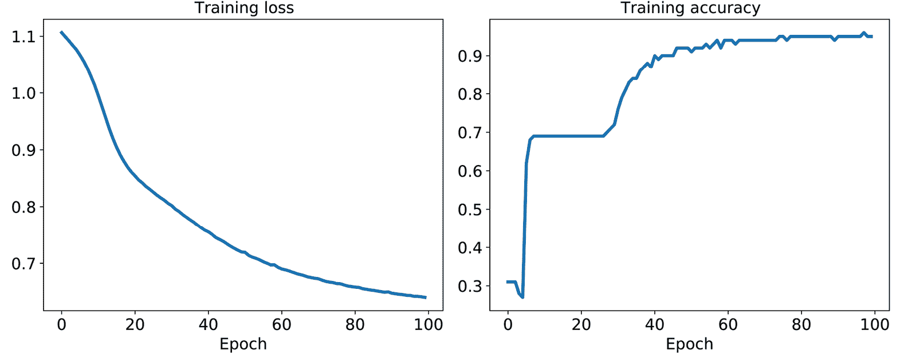

图 12.9:训练损失和准确度曲线

## 在测试数据集上评估训练的模型

我们现在可以在测试数据集上评估训练模型的分类准确性:

```py
>>> X_test_norm = (X_test - np.mean(X_train)) / np.std(X_train)

>>> X_test_norm = torch.from_numpy(X_test_norm).float()

>>> y_test = torch.from_numpy(y_test) 

>>> pred_test = model(X_test_norm)

>>> correct = (torch.argmax(pred_test, dim=1) == y_test).float()

>>> accuracy = correct.mean()

>>> print(f'Test Acc.: {accuracy:.4f}')

Test Acc.: 0.9800 
```

由于我们用标准化的特性训练了我们的模型，我们也将同样的标准化应用到测试数据中。分类精度为 0.98(即 98%)。

## 保存并重新加载已训练的模型

训练好的模型可以保存在磁盘上以备将来使用。这可以通过以下方式完成:

```py
>>> path = 'iris_classifier.pt'

>>> torch.save(model, path) 
```

调用`save(model)`将保存模型架构和所有学习到的参数。按照惯例，我们可以使用`'pt'`或`'pth'`文件扩展名来保存模型。

现在，让我们重新加载保存的模型。由于我们已经保存了模型架构和权重，我们可以轻松地在一行代码中重建和重新加载参数:

```py
>>> model_new = torch.load(path) 
```

尝试通过调用`model_new.eval()`来验证模型架构:

```py
>>> model_new.eval()

Model(

  (layer1): Linear(in_features=4, out_features=16, bias=True)

  (layer2): Linear(in_features=16, out_features=3, bias=True)

) 
```

最后，让我们评估这个在测试数据集上重新加载的新模型，以验证结果是否与之前相同:

```py
>>> pred_test = model_new(X_test_norm)

>>> correct = (torch.argmax(pred_test, dim=1) == y_test).float()

>>> accuracy = correct.mean() 

>>> print(f'Test Acc.: {accuracy:.4f}')

Test Acc.: 0.9800 
```

如果您只想保存学习的参数，您可以如下使用`save(model.state_dict())`:

```py
>>> path = 'iris_classifier_state.pt'

>>> torch.save(model.state_dict(), path) 
```

要重新加载保存的参数，我们首先需要像以前一样构建模型，然后将加载的参数提供给模型:

```py
>>> model_new = Model(input_size, hidden_size, output_size)

>>> model_new.load_state_dict(torch.load(path)) 
```

# 多层神经网络激活函数的选择

为简单起见，到目前为止，我们仅讨论了多层前馈神经网络背景下的 sigmoid 激活函数；我们已经在第十一章的 MLP 实现中的隐藏层和输出层使用了它。

注意在本书中，为了简洁起见，sigmoid 逻辑函数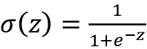被称为 *sigmoid* 函数，这在机器学习文献中很常见。在下面的小节中，您将了解更多关于对实现多层神经网络有用的替代非线性函数。

在技术上，我们可以在多层神经网络中使用任何函数作为激活函数，只要它是可微的。我们甚至可以使用线性激活函数，比如在 Adaline ( *第二章*，*训练简单的机器学习算法进行分类*)。然而，在实践中，对隐藏层和输出层都使用线性激活函数不是很有用，因为我们希望在典型的人工神经网络中引入非线性，以便能够处理复杂的问题。线性函数的和最终产生一个线性函数。

我们在*第 11 章*中使用的逻辑(sigmoid)激活函数可能最接近地模拟了大脑中神经元的概念——我们可以将其视为神经元是否放电的概率。然而，如果我们有高度负的输入，逻辑(sigmoid)激活函数可能会有问题，因为在这种情况下，sigmoid 函数的输出将接近于零。如果 sigmoid 函数返回接近于零的输出，则 NN 将学习得非常慢，并且它将更有可能在训练期间陷入损失图的局部最小值。这就是为什么人们通常更喜欢使用双曲正切作为隐藏层中的激活函数。

在讨论双曲正切函数之前，让我们简要回顾一下逻辑函数的一些基础知识，并了解一下使其更适用于多标签分类问题的一个概括。

## 物流功能概述

正如在本节介绍中提到的，逻辑函数实际上是 sigmoid 函数的一个特例。您可能还记得第三章、*中关于逻辑回归的章节，使用 Scikit-Learn* 的机器学习分类器之旅，我们可以使用逻辑函数来模拟样本 *x* 属于二元分类任务中的正类(类`1`)的概率。

给定的净输入值 *z* 如下式所示:

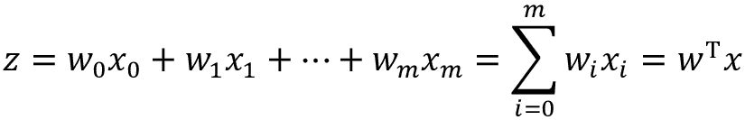

逻辑(sigmoid)函数将计算以下内容:

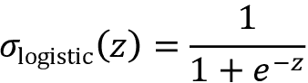

注意， *w* [0] 为偏置单位(*y*-轴截距，即 *x* [0] = 1)。为了提供一个更具体的例子，让我们采用一个二维数据点的模型， *x* ，以及一个具有分配给 *w* 向量的以下权重系数的模型:

```py
>>> import numpy as np

>>> X = np.array([1, 1.4, 2.5]) ## first value must be 1

>>> w = np.array([0.4, 0.3, 0.5])

>>> def net_input(X, w):

...     return np.dot(X, w)

>>> def logistic(z):

...     return 1.0 / (1.0 + np.exp(-z))

>>> def logistic_activation(X, w):

...     z = net_input(X, w)

...     return logistic(z)

>>> print(f'P(y=1|x) = {logistic_activation(X, w):.3f}')

P(y=1|x) = 0.888 
```

如果我们计算净输入( *z* )并使用它来激活具有那些特定特征值和权重系数的逻辑神经元，我们得到值`0.888`，我们可以将其解释为这个特定样本 *x* 属于正类的 88.8%的概率。

在*第十一章*、*T3 中，我们使用了一热编码技术来表示多类地面真值标签，并设计了由多个逻辑激活单元组成的输出层。但是，如以下代码示例所示，由多个逻辑激活单元组成的输出图层不会生成有意义、可解释的概率值:*

```py
>>> # W : array with shape = (n_output_units, n_hidden_units+1)

>>> #     note that the first column are the bias units

>>> W = np.array([[1.1, 1.2, 0.8, 0.4],

...               [0.2, 0.4, 1.0, 0.2],

...               [0.6, 1.5, 1.2, 0.7]])

>>> # A : data array with shape = (n_hidden_units + 1, n_samples)

>>> #     note that the first column of this array must be 1

>>> A = np.array([[1, 0.1, 0.4, 0.6]])

>>> Z = np.dot(W, A[0])

>>> y_probas = logistic(Z)

>>> print('Net Input: \n', Z)

Net Input:

[1.78  0.76  1.65]

>>> print('Output Units:\n', y_probas)

Output Units:

[ 0.85569687  0.68135373  0.83889105] 
```

正如您在输出中看到的，结果值不能被解释为三类问题的概率。这是因为它们的总和不是 1。然而，事实上，如果我们使用我们的模型仅预测类标签而不是类成员概率，这不是一个大问题。根据之前获得的输出单位预测分类标注的一种方法是使用最大值:

```py
>>> y_class = np.argmax(Z, axis=0)

>>> print('Predicted class label:', y_class) 

Predicted class label: 0 
```

在某些情况下，为多类预测计算有意义的类概率会很有用。在下一节中，我们将看一下逻辑函数的一个一般化——`softmax`函数，它可以帮助我们完成这个任务。

## 用 softmax 函数估计多类分类中的类概率

在上一节中，您看到了我们如何使用`argmax`函数获得一个类标签。之前，在*构建多层感知器用于对虹膜数据集*部分中的花朵进行分类时，我们在 MLP 模型的最后一层确定了`activation='softmax'`。`softmax`函数是`argmax`函数的软形式；它不是给出一个单一的类指数，而是提供每个类的概率。因此，它允许我们在多类设置中计算有意义的类概率(多项逻辑回归)。

在`softmax`中，具有净输入 *z* 的特定样本属于第 *i* 类的概率可以用分母中的归一化项来计算，即指数加权线性函数之和:

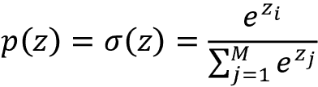

要查看`softmax`的运行情况，让我们用 Python 编写代码:

```py
>>> def softmax(z):

...     return np.exp(z) / np.sum(np.exp(z))

>>> y_probas = softmax(Z)

>>> print('Probabilities:\n', y_probas)

Probabilities:

[ 0.44668973  0.16107406  0.39223621]

>>> np.sum(y_probas)

1.0 
```

如你所见，正如我们所料，预测的类别概率现在总计为 1。同样值得注意的是，预测的类标签与我们将`argmax`函数应用于逻辑输出时是相同的。

将`softmax`函数的结果视为*归一化*输出可能会有所帮助，该输出对于在多类设置中获得有意义的类成员关系预测是有用的。因此，当我们在 PyTorch 中构建多类分类模型时，我们可以使用`torch.softmax()`函数来估计一批输入示例的每个类成员的概率。为了了解如何在 PyTorch 中使用`torch.softmax()`激活函数，我们将在下面的代码中将`Z`转换为张量，并为批处理大小保留一个额外的维度:

```py
>>> torch.softmax(torch.from_numpy(Z), dim=0)

tensor([0.4467, 0.1611, 0.3922], dtype=torch.float64) 
```

## 使用双曲正切加宽输出光谱

在人工神经网络的隐藏层中经常使用的另一个 s 形函数是**双曲正切**(通常被称为 **tanh** )，它可以被解释为逻辑函数的重新缩放版本:

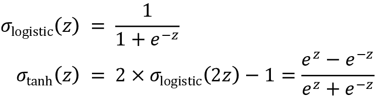

双曲正切相对于 logistic 函数的优势在于其在开区间(–1，1)具有更宽的输出频谱范围，可以改善反向传播算法的收敛性(*模式识别神经网络*， *C. M. Bishop* ，*牛津大学出版社*，页数:500-501， *1995* )。

相反，逻辑函数返回开放区间(0，1)范围内的输出信号。为了简单比较逻辑函数和双曲正切函数，让我们绘制两个 s 形函数:

```py
>>> import matplotlib.pyplot as plt

>>> def tanh(z):

...     e_p = np.exp(z)

...     e_m = np.exp(-z)

...     return (e_p - e_m) / (e_p + e_m)

>>> z = np.arange(-5, 5, 0.005)

>>> log_act = logistic(z)

>>> tanh_act = tanh(z)

>>> plt.ylim([-1.5, 1.5])

>>> plt.xlabel('net input $z$')

>>> plt.ylabel('activation $\phi(z)$')

>>> plt.axhline(1, color='black', linestyle=':')

>>> plt.axhline(0.5, color='black', linestyle=':')

>>> plt.axhline(0, color='black', linestyle=':')

>>> plt.axhline(-0.5, color='black', linestyle=':')

>>> plt.axhline(-1, color='black', linestyle=':')

>>> plt.plot(z, tanh_act,

...          linewidth=3, linestyle='--',

...          label='tanh')

>>> plt.plot(z, log_act,

...          linewidth=3,

...          label='logistic')

>>> plt.legend(loc='lower right')

>>> plt.tight_layout()

>>> plt.show() 
```

正如所见，两条 s 形曲线的形状看起来非常相似；然而，`tanh`功能的输出空间是`logistic`功能的两倍:

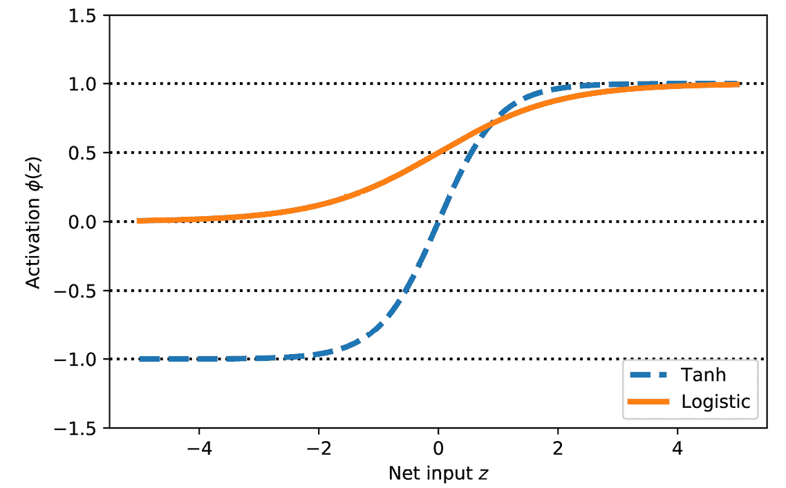

图 12.10:双曲正切函数和逻辑函数的比较

注意，为了便于说明，我们之前实现了`logistic`和`tanh`函数。在实践中，我们可以使用 NumPy 的`tanh`函数。

或者，当构建神经网络模型时，我们可以在 PyTorch 中使用`torch.tanh(x)`来获得相同的结果:

```py
>>> np.tanh(z)

array([-0.9999092 , -0.99990829, -0.99990737, ...,  0.99990644,

        0.99990737,  0.99990829])

>>> torch.tanh(torch.from_numpy(z))

tensor([-0.9999, -0.9999, -0.9999,  ...,  0.9999,  0.9999,  0.9999],

       dtype=torch.float64) 
```

此外，SciPy 的`special`模块中提供了逻辑功能:

```py
>>> from scipy.special import expit

>>> expit(z)

array([0.00669285, 0.00672617, 0.00675966, ..., 0.99320669, 0.99324034,

       0.99327383]) 
```

类似地，我们可以使用 PyTorch 中的`torch.sigmoid()`函数进行相同的计算，如下所示:

```py
>>> torch.sigmoid(torch.from_numpy(z))

tensor([0.0067, 0.0067, 0.0068,  ..., 0.9932, 0.9932, 0.9933],

       dtype=torch.float64) 
```

注意，使用`torch.sigmoid(x)`产生的结果等同于我们之前使用的`torch.nn.Sigmoid()(x)`。`torch.nn.Sigmoid`是一个类，你可以传入参数来构造一个对象以控制行为。相比之下，`torch.sigmoid`是一个函数。

## 整流器线性单元激活

**整流线性单元** ( **ReLU** )是深度 NNs 中经常使用的另一个激活功能。在我们深入研究 ReLU 之前，我们应该退一步理解双曲正切和逻辑激活的消失梯度问题。

为了理解这个问题，让我们假设我们最初有净输入 *z* [1] = 20，这就变成了 *z* [2] = 25。计算双曲正切激活，我们得到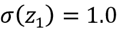和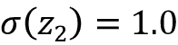，这表明输出没有变化(由于双曲正切函数的渐近行为和数值误差)。

这意味着激活相对于净输入的导数随着 *z* 变大而减小。结果，在训练阶段学习权重变得非常慢，因为梯度项可能非常接近于零。ReLU 激活解决了这个问题。数学上，ReLU 定义如下:

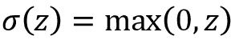

ReLU 还是一个非线性的函数，对于学习带 NNs 的复杂函数很有好处。此外，对于正输入值，ReLU 相对于其输入的导数始终为 1。因此，它解决了消失梯度的问题，使其适用于深层神经网络。在 PyTorch 中，我们可以如下应用 ReLU 激活`torch.relu()`:

```py
>>> torch.relu(torch.from_numpy(z))

tensor([0.0000, 0.0000, 0.0000,  ..., 4.9850, 4.9900, 4.9950],

       dtype=torch.float64) 
```

我们将在下一章使用 ReLU 激活函数作为多层卷积神经网络的激活函数。

现在，我们对人工神经网络中常用的不同激活函数有了更多的了解，让我们以本书中到目前为止遇到的不同激活函数的概述来结束本节:


图 12.11:本书中涉及的激活功能

你可以在[https://py torch . org/docs/stable/nn . functional . html # non-linear-activation-functions](https://pytorch.org/docs/stable/nn.functional.html#non-linear-activation-functions)找到`torch.nn`模块中可用的所有激活函数列表。

# 摘要

在本章中，您学习了如何使用 PyTorch，这是一个用于数值计算的开源库，特别关注深度学习。虽然 PyTorch 比 NumPy 使用起来更不方便，但由于它支持 GPU 的额外复杂性，它允许我们非常有效地定义和训练大型、多层神经网络。

此外，您还了解了如何使用`torch.nn`模块来构建复杂的机器学习和神经网络模型，并高效地运行它们。我们通过 PyTorch 张量的基本功能从头开始定义模型，探索了 PyTorch 中的模型构建。当我们必须在矩阵向量乘法的层次上编程并定义每个操作的每个细节时，实现模型可能是乏味的。然而，这样做的好处是，作为开发人员，我们可以将这些基本操作结合起来，构建更复杂的模型。然后我们探索了`torch.nn`，这使得构建 NN 模型比从头实现它们容易得多。

最后，您学习了不同的激活功能，并了解了它们的行为和应用。具体来说，在本章中，我们讨论了 tanh、softmax 和 ReLU。

在下一章中，我们将继续我们的旅程并深入 PyTorch，在那里我们将发现自己正在使用 PyTorch 计算图和自动微分包。在这个过程中，你会学到许多新概念，比如梯度计算。

# 加入我们书的不和谐空间

加入该书的 Discord workspace，每月与作者进行一次*向我提问*会议:

[https://packt.link/MLwPyTorch](https://packt.link/MLwPyTorch)

