# 十三、更深入 PyTorch 的机制

在*第 12 章*、*用 PyTorch* 并行化神经网络训练中，我们讲述了如何定义和操作张量，并与`torch.utils.data`模块一起构建输入管道。我们进一步构建并训练了一个多层感知器，以使用 PyTorch 神经网络模块(`torch.nn`)对虹膜数据集进行分类。

现在我们已经有了一些 PyTorch 神经网络训练和机器学习的实践经验，是时候更深入地研究 PyTorch 库并探索它丰富的功能集，这将允许我们在接下来的章节中实现更高级的深度学习模型。

在这一章中，我们将使用 PyTorch 的 API 的不同方面来实现 NNs。特别是，我们将再次使用`torch.nn`模块，它提供了多层抽象，使得标准架构的实现非常方便。它还允许我们实现定制的 NN 层，这在需要更多定制的研究型项目中非常有用。在本章的后面，我们将实现这样一个自定义层。

为了说明使用`torch.nn`模块建立模型的不同方式，我们还将考虑经典的**异或** ( **XOR** )问题。首先，我们将使用`Sequential`类构建多层感知器。然后，我们将考虑其他方法，如子类化`nn.Module`来定义自定义层。最后，我们将致力于两个真实世界的项目，涵盖从原始输入到预测的机器学习步骤。

我们将涉及的主题如下:

*   理解和使用 PyTorch 计算图
*   使用 PyTorch 张量对象
*   解决经典 XOR 问题并了解模型容量
*   使用 PyTorch 的`Sequential`类和`nn.Module`类构建复杂的神经网络模型
*   使用自动微分和`torch.autograd`计算梯度

# PyTorch 的主要特点

在前一章中，我们看到 PyTorch 为我们提供了一个可扩展的、多平台的编程接口来实现和运行机器学习算法。PyTorch 在 2016 年首次发布和 2018 年 1.0 发布后，已经发展成为深度学习的两个最受欢迎的框架之一。它使用动态计算图，与静态图相比，动态计算图具有更灵活的优势。动态计算图调试友好:PyTorch 允许交错图声明和图评估步骤。您可以逐行执行代码，同时完全访问所有变量。这是一个非常重要的特征，使得 NNs 的开发和训练非常方便。

PyTorch 是一个开源库，每个人都可以免费使用，它的开发是由脸书资助和支持的。这涉及到一个庞大的软件工程师团队，他们不断地扩展和改进库。由于 PyTorch 是一个开源库，它还得到了脸书以外的其他开发者的大力支持，他们热心地贡献并提供用户反馈。这使得 PyTorch 库对学术研究人员和开发人员都更有用。这些因素的另一个后果是 PyTorch 有大量的文档和教程来帮助新用户。

PyTorch 的另一个关键特性在前一章中也提到过，那就是它能够与单个或多个图形处理单元(**GPU**)协同工作。这使得用户可以在大数据集和大规模系统上非常高效地训练深度学习模型。

最后但同样重要的是，PyTorch 支持移动部署，这也使它成为非常适合生产的工具。

在下一节中，我们将看看 PyTorch 中的张量和函数是如何通过计算图相互连接的。

# PyTorch 的计算图

PyTorch 基于**有向无环图** ( **DAG** )执行计算。在本节中，我们将看到如何为简单的算术计算定义这些图形。然后，我们将看到动态图形范例，以及如何在 PyTorch 中动态创建图形。

## 理解计算图

PyTorch 依赖于在其核心构建一个计算图，它使用这个计算图从输入一直到输出导出张量之间的关系。假设我们有秩为 0(标量)的张量 *a* 、 *b* 和 *c* ，我们想要计算*z*= 2×(*a*–*b*)+*c*。

这个评估可以用一个计算图来表示，如图*图 13.1* 所示:

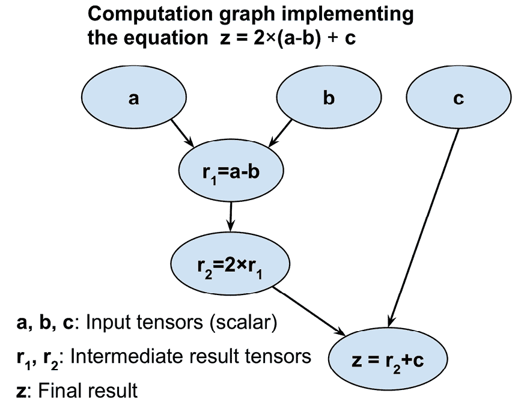

图 13.1:计算图如何工作

如您所见，计算图只是一个节点网络。每个节点类似于一个操作，将一个函数应用于其输入张量，并返回零个或多个张量作为输出。PyTorch 构建了这个计算图，并使用它来相应地计算梯度。在下一小节中，我们将看到一些使用 PyTorch 为这个计算创建图形的例子。

## 在 PyTorch 中创建图表

让我们来看一个简单的例子，它说明了如何在 PyTorch 中创建一个图来计算*z*= 2×(*a*–*b*)+*c*，如上图所示。变量 *a* 、 *b* 和 *c* 是标量(单个数字)，我们将它们定义为 PyTorch 张量。为了创建这个图，我们可以简单地定义一个常规的 Python 函数，用`a`、`b`和`c`作为它的输入参数，例如:

```py
>>> import torch

>>> def compute_z(a, b, c):

...     r1 = torch.sub(a, b)

...     r2 = torch.mul(r1, 2)

...     z = torch.add(r2, c)

...     return z 
```

现在，为了进行计算，我们可以简单地用张量对象作为函数参数来调用这个函数。注意PyTorch 函数如`add`、`sub`(或`subtract`)、`mul`(或`multiply`)也允许我们以 py torch 张量对象的形式提供更高级别的输入。在下面的代码示例中，我们提供了标量输入(秩 0)以及秩 1 和秩 2 输入，如列表所示:

```py
>>> print('Scalar Inputs:', compute_z(torch.tensor(1),

...       torch.tensor(2), torch.tensor(3)))

Scalar Inputs: tensor(1)

>>> print('Rank 1 Inputs:', compute_z(torch.tensor([1]),

...       torch.tensor([2]), torch.tensor([3])))

Rank 1 Inputs: tensor([1])

>>> print('Rank 2 Inputs:', compute_z(torch.tensor([[1]]),

...       torch.tensor([[2]]), torch.tensor([[3]])))

Rank 2 Inputs: tensor([[1]]) 
```

在本节中，您看到了在 PyTorch 中创建计算图是多么简单。接下来，我们将看看 PyTorch 张量，它可用于存储和更新模型参数。

# 用于存储和更新模型参数的 PyTorch 张量对象

我们在第 12 章、*中讨论了张量对象，用 PyTorch* 并行化神经网络训练。在 PyTorch 中，需要计算梯度的特殊张量对象允许我们在训练期间存储和更新模型的参数。这样的张量可以通过在用户指定的初始值上将`requires_grad`分配给`True`来创建。注意，截至目前(2021 年年中)，只有浮点和复数`dtype`的张量可以要求梯度。在下面的代码中，我们将生成类型为`float32`的张量对象:

```py
>>> a = torch.tensor(3.14, requires_grad=True)

>>> print(a)

tensor(3.1400, requires_grad=True)

>>> b = torch.tensor([1.0, 2.0, 3.0], requires_grad=True)

>>> print(b)

tensor([1., 2., 3.], requires_grad=True) 
```

注意`requires_grad`默认设置为`False`。该值可以通过运行`requires_grad_()`有效地设置为`True`。

`method_()`是 PyTorch 中的就地方法，用于不复制输入的操作。

让我们看一下下面的例子:

```py
>>> w = torch.tensor([1.0, 2.0, 3.0])

>>> print(w.requires_grad)

False

>>> w.requires_grad_()

>>> print(w.requires_grad)

True 
```

您将回忆起，对于 NN 模型，用随机权重初始化模型参数对于在反向传播期间打破对称性是必要的——否则，多层 NN 将不会比像逻辑回归这样的单层 NN 更有用。当创建 PyTorch 张量时，我们也可以使用随机初始化方案。PyTorch 可以基于各种概率分布生成随机数(参见 https://pytorch.org/docs/stable/torch.html#random-sampling)。在下面的例子中，我们将看看在`torch.nn.init`模块中也可用的一些标准初始化方法(参见 https://pytorch.org/docs/stable/nn.init.html[)。](https://pytorch.org/docs/stable/nn.init.html)

那么，让我们看看如何使用 Glorot 初始化来创建张量，这是一种经典的随机初始化方案，由 Xavier Glorot 和 Yoshua Bengio 提出。为此，我们首先创建一个空张量和一个名为`init`的操作符作为类`GlorotNormal`的对象。然后，我们通过调用`xavier_normal_()`方法，根据 Glorot 初始化用值填充这个张量。在下面的例子中，我们初始化一个形状为 2×3 的张量:

```py
>>> import torch.nn as nn

>>> torch.manual_seed(1)

>>> w = torch.empty(2, 3)

>>> nn.init.xavier_normal_(w)

>>> print(w)

tensor([[ 0.4183,  0.1688,  0.0390],

        [ 0.3930, -0.2858, -0.1051]]) 
```

**Xavier(或 Glorot)初始化**

在深度学习的早期发展中，人们观察到随机均匀或随机正态权重初始化往往会导致训练期间模型性能不佳。

2010 年，Glorot 和 Bengio 研究了初始化的影响，并提出了一种新的、更鲁棒的初始化方案，以促进深度网络的训练。Xavier 初始化背后的一般思想是大致平衡不同层之间的梯度变化。否则，一些层可能在训练中获得过多的关注，而其他层则落后。

根据 Glorot 和 Bengio 的研究论文，如果我们想要初始化均匀分布中的权重，我们应该如下选择该均匀分布的区间:

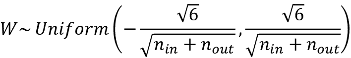

这里，中的 *n* [是乘以权值后的输入神经元数，*n*out]是馈入下一层的输出神经元数。为了初始化高斯(正态)分布的权重，我们建议您选择该高斯分布的标准差为:

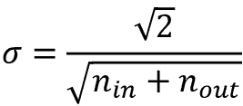

PyTorch 支持权重的均匀分布和正态分布的 Xavier 初始化。

关于 Glorot 和 Bengio 的初始化方案的更多信息，包括基本原理和数学动机，我们推荐原始论文(*理解深度前馈神经网络的困难*、 *Xavier Glorot* 和 *Yoshua Bengio* ，2010)，可在[http://proceedings.mlr.press/v9/glorot10a/glorot10a.pdf](http://proceedings.mlr.press/v9/glorot10a/glorot10a.pdf)免费获得。

现在，为了把它放到一个更实际的用例的上下文中，让我们看看如何在基类`nn.Module`中定义两个`Tensor`对象:

```py
>>> class MyModule(nn.Module):

...     def __init__(self):

...         super().__init__()

...         self.w1 = torch.empty(2, 3, requires_grad=True)

...         nn.init.xavier_normal_(self.w1)

...         self.w2 = torch.empty(1, 2, requires_grad=True)

...         nn.init.xavier_normal_(self.w2) 
```

然后，这两个张量可以用作权重，其梯度将通过自动微分来计算。

# 通过自动微分计算梯度

正如你已经知道的，优化神经网络需要计算神经网络权重的损失梯度。这是**随机梯度下降** ( **SGD** )等优化算法所需要的。此外，梯度还有其他应用，如诊断网络以找出为什么神经网络模型对测试示例进行特定预测。因此，在本节中，我们将讨论如何计算相对于输入变量的计算梯度。

## 计算损失相对于可训练变量的梯度

PyTorch 支持*自动微分*，可以认为是计算嵌套函数梯度的*链规则*的实现。注意，为了简单起见，我们将使用术语*梯度*来指代偏导数和梯度。

**偏导数和梯度**

偏导数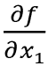可以理解为多元函数的变化率——一个多输入的函数，*f*(*x*1，*x*2，...)，相对于它的一个输入(这里:*x*1)。函数的梯度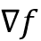是由所有输入的偏导数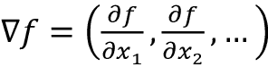组成的向量。

当我们定义一系列导致一些输出或者甚至中间张量的操作时，PyTorch 提供了一个上下文来计算这些计算的张量相对于它在计算图中的从属节点的梯度。为了计算这些梯度，我们可以从`torch.autograd`模块中调用`backward`方法。它根据图中的叶节点(终端节点)计算给定张量的梯度和。

让我们来看一个简单的例子，我们将计算 *z* = *wx* + *b* ，并将损失定义为目标 *y* 和预测 *z* ，*损失*=(*y*–*z*)²之间的平方损失。在更一般的情况下，我们可能有多个预测和目标，我们将损失计算为误差平方和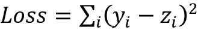。为了在 PyTorch 中实现这个计算，我们将把模型参数 *w* 和 *b* 定义为变量(将`requires_gradient`属性设置为`True`的张量)，把输入 *x* 和 *y* 定义为默认张量。我们将计算损失张量并使用它来计算模型参数的梯度， *w* 和 *b* ，如下:

```py
>>> w = torch.tensor(1.0, requires_grad=True)

>>> b = torch.tensor(0.5, requires_grad=True)

>>> x = torch.tensor([1.4])

>>> y = torch.tensor([2.1])

>>> z = torch.add(torch.mul(w, x), b)

>>> loss = (y-z).pow(2).sum()

>>> loss.backward()

>>> print('dL/dw : ', w.grad)

>>> print('dL/db : ', b.grad)

dL/dw :  tensor(-0.5600)

dL/db :  tensor(-0.4000) 
```

计算值 *z* 是 NN 中的一个正向传递。我们在`loss`张量上使用`backward`方法来计算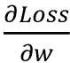和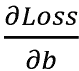。由于这是一个非常简单的例子，我们可以象征性地获得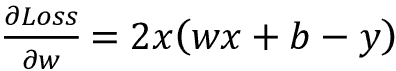来验证计算出的梯度与我们在前面的代码示例中获得的结果相匹配:

```py
>>> # verifying the computed gradient

>>> print(2 * x * ((w * x + b) - y))

tensor([-0.5600], grad_fn=<MulBackward0>) 
```

我们将对 *b* 的验证留给读者作为练习。

## 理解自动微分

自动微分代表一组用于计算任意算术运算的梯度的计算技术。在此过程中，通过重复应用链式法则来累积梯度，从而获得计算的梯度(表示为一系列操作)。为了更好地理解自动微分背后的概念，让我们考虑一系列嵌套计算，*y*=*f*(*g*(*h*(*x*))，输入 *x* ，输出 *y* 。这可以分为一系列步骤:

*   *u*0=*x*
*   *u*1=*h*(*x*)
*   *u*2=*g*(*u*1)
*   *u*[3]=*f*(*u*2)=*y*

导数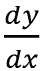可以用两种不同的方法计算:从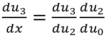开始的正向累加和从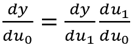开始的反向累加。注意【PyTorch 用的是后一种，反向累加，实现反向传播效率更高。

## 对立的例子

计算损失相对于输入实例的梯度用于生成*对抗实例*(或*对抗攻击*)。在计算机视觉中，对立示例是通过向输入示例添加一些小的、察觉不到的噪声(或扰动)而生成的示例，这导致深度神经网络对它们进行错误分类。涵盖对立的例子超出了本书的范围，但是如果你感兴趣，你可以在[https://arxiv.org/pdf/1312.6199.pdf](https://arxiv.org/pdf/1312.6199.pdf)找到*克里斯蒂安·塞格迪等人*、*神经网络*的有趣性质的原始论文。

# 通过 torch.nn 模块简化常见架构的实现

你已经看到了构建前馈神经网络模型(例如，多层感知器)和使用`nn.Module`类定义一系列层的例子。在我们更深入地研究`nn.Module`之前，让我们简单地看看通过`nn.Sequential`召唤这些层的另一种方法。

## 基于神经网络的实现模型。连续的

用`nn.Sequential`([https://py torch . org/docs/master/generated/torch . nn . sequential . html # sequential](https://pytorch.org/docs/master/generated/torch.nn.Sequential.html#sequential))将模型内部存储的各层级联起来。在以下示例中，我们将构建一个具有两个紧密(完全)连接的层的模型:

```py
>>> model = nn.Sequential(

...     nn.Linear(4, 16),

...     nn.ReLU(),

...     nn.Linear(16, 32),

...     nn.ReLU()

... )

>>> model

Sequential(

  (0): Linear(in_features=4, out_features=16, bias=True)

  (1): ReLU()

  (2): Linear(in_features=16, out_features=32, bias=True)

  (3): ReLU()

) 
```

在将层传递给`nn.Sequential`类之后，我们指定了层并实例化了`model`。第一个全连接层的输出被用作第一个 ReLU 层的输入。第一个 ReLU 层的输出成为第二个全连接层的输入。最后，第二个全连接层的输出被用作第二个 ReLU 层的输入。

我们可以进一步配置这些层，例如，通过对参数应用不同的激活函数、初始化器或正则化方法。可以在官方文档中找到大多数这些类别的可用选项的全面完整列表:

*   选择激活函数:[https://py torch . org/docs/stable/nn . html #非线性-激活-加权-和-非线性](https://pytorch.org/docs/stable/nn.html#non-linear-activations-weighted-sum-nonlinearity)
*   通过`nn.init`:[https://pytorch.org/docs/stable/nn.init.html](https://pytorch.org/docs/stable/nn.init.html)初始化图层参数
*   通过`torch.optim`:【https://pytorch.org/docs/stable/optim.html】中一些优化器的参数`weight_decay`对图层参数应用 L2 正则化(防止过拟合)
*   通过将 L1 惩罚项添加到损失张量，将 L1 正则化应用到层参数(以防止过拟合)，这将在接下来实现

在下面的代码示例中，我们将通过指定权重的初始值分布来配置第一个完全连接的层。然后，我们将通过计算权重矩阵的 L1 罚项来配置第二个全连接层:

```py
>>> nn.init.xavier_uniform_(model[0].weight)

>>> l1_weight = 0.01

>>> l1_penalty = l1_weight * model[2].weight.abs().sum() 
```

这里，我们用 Xavier 初始化来初始化第一个线性层的权重。并且我们计算了第二线性层的权重的 L1 范数。

此外，我们还可以指定优化器的类型和用于训练的损失函数。同样，可以在官方文档中找到所有可用选项的完整列表:

*   通过`torch.optim`:[https://pytorch.org/docs/stable/optim.html#algorithms](https://pytorch.org/docs/stable/optim.html#algorithms)进行优化
*   损失函数:[https://pytorch.org/docs/stable/nn.html#loss-functions](https://pytorch.org/docs/stable/nn.html#loss-functions)

## 选择损失函数

关于优化算法的选择，SGD 和 Adam 是使用最广泛的方法。损失函数的选择取决于任务；例如，对于回归问题，可以使用均方误差损失。

交叉熵损失函数家族为分类任务提供了可能的选择，这在*第 14 章*、*使用深度卷积神经网络分类图像*中有详细讨论。

此外，您可以使用您在前面章节中学到的技术(例如第 6 章*中的模型评估技术，以及*学习模型评估和超参数调整的最佳实践*)结合问题的适当度量。例如，精确度和召回率、准确度、曲线下的**面积** ( **AUC** )以及假阴性和假阳性分数是评估分类模型的适当度量。*

在本例中，我们将使用 SGD 优化器和交叉熵损失进行二进制分类:

```py
>>> loss_fn = nn.BCELoss()

>>> optimizer = torch.optim.SGD(model.parameters(), lr=0.001) 
```

接下来，我们将看一个更实际的例子:解决经典的异或分类问题。首先，我们将使用`nn.Sequential()`类来构建模型。在此过程中，您还将了解模型处理非线性决策边界的能力。然后，我们将介绍如何通过`nn.Module`构建一个模型，这将为我们提供更多的灵活性和对网络各层的控制。

## 解决异或分类问题

XOR 分类问题是一个经典问题，用于分析模型在捕获两个类别之间的非线性决策边界方面的能力。我们生成 200 个训练示例的玩具数据集，这些训练示例具有两个特征(*x*0，*x*1)，从[–1，1]之间的均匀分布中提取。然后，我们根据以下规则为训练示例 *i* 分配基础事实标签:

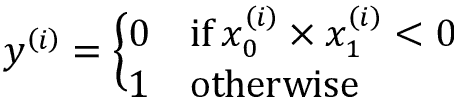

我们将使用一半的数据(100 个训练示例)进行训练，另一半用于验证。用于生成数据并将其拆分为训练数据集和验证数据集的代码如下:

```py
>>> import matplotlib.pyplot as plt

>>> import numpy as np

>>> torch.manual_seed(1)

>>> np.random.seed(1)

>>> x = np.random.uniform(low=-1, high=1, size=(200, 2))

>>> y = np.ones(len(x))

>>> y[x[:, 0] * x[:, 1]<0] = 0

>>> n_train = 100

>>> x_train = torch.tensor(x[:n_train, :], dtype=torch.float32)

>>> y_train = torch.tensor(y[:n_train], dtype=torch.float32)

>>> x_valid = torch.tensor(x[n_train:, :], dtype=torch.float32)

>>> y_valid = torch.tensor(y[n_train:], dtype=torch.float32)

>>> fig = plt.figure(figsize=(6, 6))

>>> plt.plot(x[y==0, 0], x[y==0, 1], 'o', alpha=0.75, markersize=10)

>>> plt.plot(x[y==1, 0], x[y==1, 1], '<', alpha=0.75, markersize=10)

>>> plt.xlabel(r'$x_1$', size=15)

>>> plt.ylabel(r'$x_2$', size=15)

>>> plt.show() 
```

代码产生以下训练和验证示例的散点图，根据其类别标签用不同的标记显示:

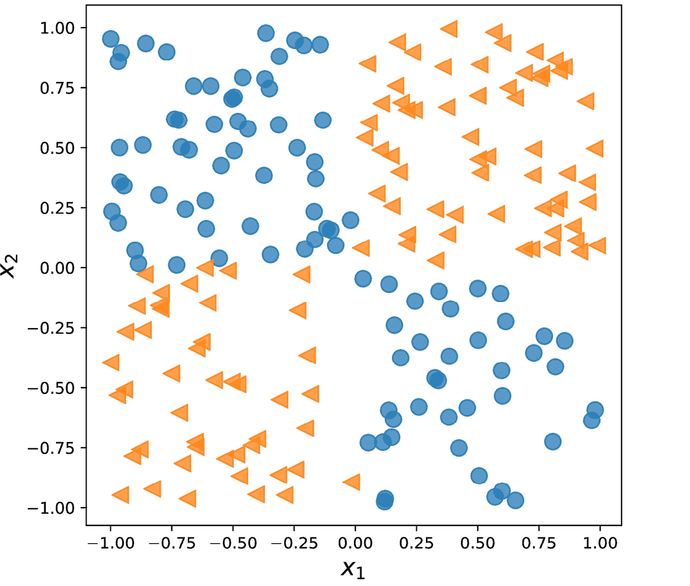

图 13.2:训练和验证示例的散点图

在前一小节中，我们介绍了在 PyTorch 中实现分类器所需的基本工具。我们现在需要决定我们应该为这个任务和数据集选择什么样的架构。一般来说，我们拥有的层越多，每层中的神经元越多，模型的容量就越大。在这里，模型容量可以被认为是模型近似复杂函数的难易程度的度量。虽然拥有更多参数意味着网络可以适应更复杂的函数，但更大的模型通常更难训练(并且容易过度拟合)。在实践中，从一个简单的模型作为基线开始总是一个好主意，例如，像逻辑回归这样的单层神经网络:

```py
>>> model = nn.Sequential(

...     nn.Linear(2, 1),

...     nn.Sigmoid()

... )

>>> model

Sequential(

  (0): Linear(in_features=2, out_features=1, bias=True)

  (1): Sigmoid()

) 
```

在定义模型之后，我们将初始化二进制分类的交叉熵损失函数和 SGD 优化器:

```py
>>> loss_fn = nn.BCELoss()

>>> optimizer = torch.optim.SGD(model.parameters(), lr=0.001) 
```

接下来，我们将创建一个数据加载器，对训练数据使用批量大小 2:

```py
>>> from torch.utils.data import DataLoader, TensorDataset

>>> train_ds = TensorDataset(x_train, y_train)

>>> batch_size = 2

>>> torch.manual_seed(1)

>>> train_dl = DataLoader(train_ds, batch_size, shuffle=True) 
```

现在，我们将为 200 个时期训练模型，并记录训练时期的历史:

```py
>>> torch.manual_seed(1)

>>> num_epochs = 200

>>> def train(model, num_epochs, train_dl, x_valid, y_valid):

...     loss_hist_train = [0] * num_epochs

...     accuracy_hist_train = [0] * num_epochs

...     loss_hist_valid = [0] * num_epochs

...     accuracy_hist_valid = [0] * num_epochs

...     for epoch in range(num_epochs):

...         for x_batch, y_batch in train_dl:

...             pred = model(x_batch)[:, 0]

...             loss = loss_fn(pred, y_batch)

...             loss.backward()

...             optimizer.step()

...             optimizer.zero_grad()

...             loss_hist_train[epoch] += loss.item()

...             is_correct = ((pred>=0.5).float() == y_batch).float()

...             accuracy_hist_train[epoch] += is_correct.mean()

...         loss_hist_train[epoch] /= n_train

...         accuracy_hist_train[epoch] /= n_train/batch_size

...         pred = model(x_valid)[:, 0]

...         loss = loss_fn(pred, y_valid)

...         loss_hist_valid[epoch] = loss.item()

...         is_correct = ((pred>=0.5).float() == y_valid).float()

...         accuracy_hist_valid[epoch] += is_correct.mean()

...     return loss_hist_train, loss_hist_valid, \

...            accuracy_hist_train, accuracy_hist_valid

>>> history = train(model, num_epochs, train_dl, x_valid, y_valid) 
```

注意训练时期的历史包括训练损失和验证损失以及训练准确度和验证准确度，这对训练后的目视检查很有用。在下面的代码中，我们将绘制学习曲线，包括训练和验证损失，以及它们的准确性。

以下代码将绘制训练性能:

```py
>>> fig = plt.figure(figsize=(16, 4))

>>> ax = fig.add_subplot(1, 2, 1)

>>> plt.plot(history[0], lw=4)

>>> plt.plot(history[1], lw=4)

>>> plt.legend(['Train loss', 'Validation loss'], fontsize=15)

>>> ax.set_xlabel('Epochs', size=15)

>>> ax = fig.add_subplot(1, 2, 2)

>>> plt.plot(history[2], lw=4)

>>> plt.plot(history[3], lw=4)

>>> plt.legend(['Train acc.', 'Validation acc.'], fontsize=15)

>>> ax.set_xlabel('Epochs', size=15) 
```

结果如下图所示，损耗和精度有两个单独的面板:

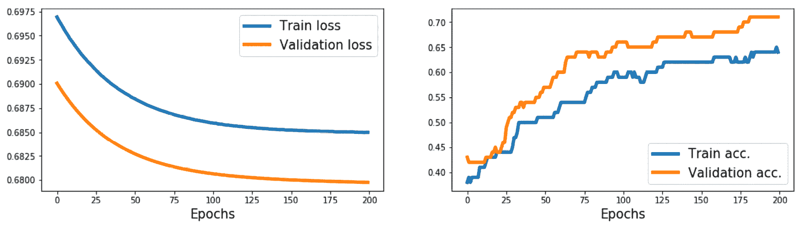

图 13.3:损失和准确性结果

如你所见，一个没有隐藏层的简单模型只能导出一个线性的决策边界，这是无法解决异或问题的。因此，我们可以观察到训练和验证数据集的损失项都非常高，而分类精度非常低。

为了导出非线性决策边界，我们可以添加一个或多个通过非线性激活函数连接的隐藏层。通用近似定理表明，具有单个隐藏层和相对较大数量的隐藏单元的前馈神经网络可以相对较好地近似任意连续函数。因此，更令人满意地解决 XOR 问题的一种方法是添加一个隐藏层，并比较不同数量的隐藏单元，直到我们在验证数据集上观察到满意的结果。添加更多的隐藏单元将对应于增加层的宽度。

或者，我们也可以添加更多的隐藏层，这将使模型更深。使网络更深而不是更宽的优点是，需要更少的参数来实现可比较的模型容量。

然而，深度模型(与宽模型相比)的一个缺点是，深度模型容易消失和爆发梯度，这使得它们更难训练。

作为练习，尝试添加一个、两个、三个和四个隐藏层，每个层有四个隐藏单元。在下面的例子中，我们将看看具有两个隐藏层的前馈神经网络的结果:

```py
>>> model = nn.Sequential(

...     nn.Linear(2, 4),

...     nn.ReLU(),

...     nn.Linear(4, 4),

...     nn.ReLU(),

...     nn.Linear(4, 1),

...     nn.Sigmoid()

... )

>>> loss_fn = nn.BCELoss()

>>> optimizer = torch.optim.SGD(model.parameters(), lr=0.015)

>>> model

Sequential(

  (0): Linear(in_features=2, out_features=4, bias=True)

  (1): ReLU()

  (2): Linear(in_features=4, out_features=4, bias=True)

  (3): ReLU()

  (4): Linear(in_features=4, out_features=1, bias=True)

  (5): Sigmoid()

)

>>> history = train(model, num_epochs, train_dl, x_valid, y_valid) 
```

我们可以重复前面的可视化代码，产生以下结果:

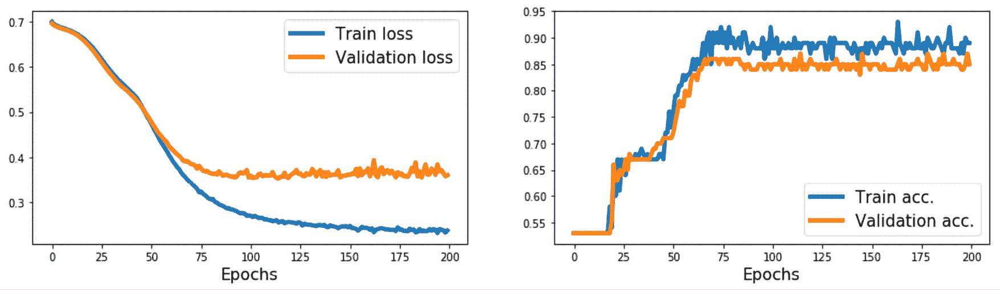

图 13.4:添加两个隐藏层后的损失和准确性结果

现在，我们可以看到该模型能够导出该数据的非线性决策边界，并且该模型在训练数据集上达到 100%的准确性。验证数据集的准确率为 95 %,这表明该模型略有过度拟合。

## 利用神经网络使建模更加灵活。组件

在前面的示例中，我们使用 PyTorch `Sequential`类创建了一个具有多层的全连接 NN。这是一种非常常见和方便的建模方式。然而，不幸的是，它不允许我们创建具有多个输入、输出或中间分支的更复杂的模型。这就是`nn.Module`派上用场的地方。

构建复杂模型的另一种方法是子类化。在这种方法中，我们创建了一个从`nn.Module`派生的新类，并将方法`__init__()`定义为构造函数。`forward()`方法用于指定正向传递。在构造函数`__init__()`中，我们将层定义为类的属性，这样就可以通过`self`引用属性来访问它们。然后，在`forward()`方法中，我们指定如何在 NN 的正向传递中使用这些层。定义实现前面模型的新类的代码如下:

```py
>>> class MyModule(nn.Module):

...     def __init__(self):

...         super().__init__()

...         l1 = nn.Linear(2, 4)

...         a1 = nn.ReLU()

...         l2 = nn.Linear(4, 4)

...         a2 = nn.ReLU()

...         l3 = nn.Linear(4, 1)

...         a3 = nn.Sigmoid()

...         l = [l1, a1, l2, a2, l3, a3]

...         self.module_list = nn.ModuleList(l)

...

...     def forward(self, x):

...         for f in self.module_list:

...             x = f(x)

...         return x 
```

注意我们把所有的图层都放在了`nn.ModuleList`对象中，这只是一个由`nn.Module`项组成的`list`对象。这个使得代码可读性更强，更容易理解。

一旦我们定义了这个新类的实例，我们就可以像以前一样训练它:

```py
>>> model = MyModule()

>>> model

MyModule(

  (module_list): ModuleList(

    (0): Linear(in_features=2, out_features=4, bias=True)

    (1): ReLU()

    (2): Linear(in_features=4, out_features=4, bias=True)

    (3): ReLU()

    (4): Linear(in_features=4, out_features=1, bias=True)

    (5): Sigmoid()

  )

)

>>> loss_fn = nn.BCELoss()

>>> optimizer = torch.optim.SGD(model.parameters(), lr=0.015)

>>> history = train(model, num_epochs, train_dl, x_valid, y_valid) 
```

接下来，除了训练历史，我们将使用 mlxtend 库来可视化验证数据和决策边界。

Mlxtend 可以通过`conda`或`pip`安装，如下所示:

```py
conda install mlxtend -c conda-forge

pip install mlxtend 
```

为了让计算我们模型的决策边界，我们需要在`MyModule`类中添加一个`predict()`方法:

```py
>>>     def predict(self, x):

...         x = torch.tensor(x, dtype=torch.float32)

...         pred = self.forward(x)[:, 0]

...         return (pred>=0.5).float() 
```

它将返回样本的预测类别(0 或 1)。

以下代码将绘制训练性能以及决策区域偏差:

```py
>>> from mlxtend.plotting import plot_decision_regions

>>> fig = plt.figure(figsize=(16, 4))

>>> ax = fig.add_subplot(1, 3, 1)

>>> plt.plot(history[0], lw=4)

>>> plt.plot(history[1], lw=4)

>>> plt.legend(['Train loss', 'Validation loss'], fontsize=15)

>>> ax.set_xlabel('Epochs', size=15)

>>> ax = fig.add_subplot(1, 3, 2)

>>> plt.plot(history[2], lw=4)

>>> plt.plot(history[3], lw=4)

>>> plt.legend(['Train acc.', 'Validation acc.'], fontsize=15)

>>> ax.set_xlabel('Epochs', size=15)

>>> ax = fig.add_subplot(1, 3, 3)

>>> plot_decision_regions(X=x_valid.numpy(),

...                       y=y_valid.numpy().astype(np.integer),

...                       clf=model)

>>> ax.set_xlabel(r'$x_1$', size=15)

>>> ax.xaxis.set_label_coords(1, -0.025)

>>> ax.set_ylabel(r'$x_2$', size=15)

>>> ax.yaxis.set_label_coords(-0.025, 1)

>>> plt.show() 
```

这产生了图 13.5(T1)中的*，其中有三个单独的面板，分别显示了验证示例的损耗、精度和散点图，以及决策边界:*

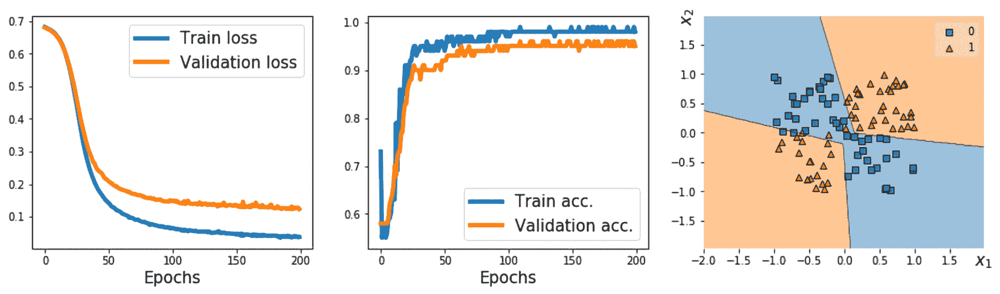

图 13.5:结果，包括散点图

## 在 PyTorch 中编写自定义图层

在的情况下，我们想要定义一个 PyTorch 还不支持的新层，我们可以定义一个从`nn.Module`类派生的新类。这在设计新图层或自定义现有图层时特别有用。

为了说明实现定制层的概念，让我们考虑一个简单的例子。假设我们想要定义一个新的计算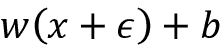的线性层，其中将一个随机变量称为噪声变量。为了实现这个计算，我们定义了一个新类作为`nn.Module`的子类。对于这个新类，我们必须定义构造函数`__init__()`方法和`forward()`方法。在构造函数中，我们为自定义层定义变量和其他所需的张量。如果将`input_size`给构造函数，我们可以创建变量并在构造函数中初始化它们。或者，我们可以延迟变量初始化(例如，如果我们事先不知道确切的输入形状)，并将其委托给另一个方法用于后期变量创建。

来看一个具体的例子，我们将定义一个名为`NoisyLinear`的新层，这个层实现了计算，这在前面的段落中已经提到:

```py
>>> class NoisyLinear(nn.Module):

...     def __init__(self, input_size, output_size,

...                  noise_stddev=0.1):

...         super().__init__()

...         w = torch.Tensor(input_size, output_size)

...         self.w = nn.Parameter(w)  # nn.Parameter is a Tensor

...                                   # that's a module parameter.

...         nn.init.xavier_uniform_(self.w)

...         b = torch.Tensor(output_size).fill_(0)

...         self.b = nn.Parameter(b)

...         self.noise_stddev = noise_stddev

...

...     def forward(self, x, training=False):

...         if training:

...             noise = torch.normal(0.0, self.noise_stddev, x.shape)

...             x_new = torch.add(x, noise)

...         else:

...             x_new = x

...         return torch.add(torch.mm(x_new, self.w), self.b) 
```

在构造函数中，我们添加了一个参数`noise_stddev`，来指定的分布的标准偏差，它是从高斯分布中采样的。此外，注意在`forward()`方法中，我们使用了一个额外的参数`training=False`。我们使用它来区分该层是在训练期间使用还是仅用于预测(这有时也称为*推断*)或评估。此外，某些方法在训练和预测模式下的表现也有所不同。在接下来的章节中，你将会遇到这种方法的一个例子`Dropout`。在前面的代码片段中，我们还指定了随机向量仅在训练期间生成并添加到输入中，而不用于推断或评估。

在我们进一步在模型中使用我们的定制`NoisyLinear`层之前，让我们在一个简单例子的上下文中测试它。

1.  In the following code, we will define a new instance of this layer, and execute it on an input tensor. Then, we will call the layer three times on the same input tensor:

    ```py
    >>> torch.manual_seed(1)

    >>> noisy_layer = NoisyLinear(4, 2)

    >>> x = torch.zeros((1, 4))

    >>> print(noisy_layer(x, training=True))

    tensor([[ 0.1154, -0.0598]], grad_fn=<AddBackward0>)

    >>> print(noisy_layer(x, training=True))

    tensor([[ 0.0432, -0.0375]], grad_fn=<AddBackward0>)

    >>> print(noisy_layer(x, training=False))

    tensor([[0., 0.]], grad_fn=<AddBackward0>) 
    ```

    注意，前两次调用的输出不同，因为`NoisyLinear`层向输入张量添加了随机噪声。第三个调用输出[0，0]，因为我们没有通过指定`training=False`添加噪声。

2.  现在，让我们创建一个类似于前一个的新模型来解决 XOR 分类任务。和以前一样，我们将使用`nn.Module`类来建立模型，但是这一次，我们将使用我们的`NoisyLinear`层作为多层感知器的第一个隐藏层。代码如下:

    ```py
    >>> class MyNoisyModule(nn.Module):

    ...     def __init__(self):

    ...         super().__init__()

    ...         self.l1 = NoisyLinear(2, 4, 0.07)

    ...         self.a1 = nn.ReLU()

    ...         self.l2 = nn.Linear(4, 4)

    ...         self.a2 = nn.ReLU()

    ...         self.l3 = nn.Linear(4, 1)

    ...         self.a3 = nn.Sigmoid()

    ...

    ...     def forward(self, x, training=False):

    ...         x = self.l1(x, training)

    ...         x = self.a1(x)

    ...         x = self.l2(x)

    ...         x = self.a2(x)

    ...         x = self.l3(x)

    ...         x = self.a3(x)

    ...         return x

    ...

    ...     def predict(self, x):

    ...         x = torch.tensor(x, dtype=torch.float32)

    ...         pred = self.forward(x)[:, 0]

    ...         return (pred>=0.5).float()

    ...

    >>> torch.manual_seed(1)

    >>> model = MyNoisyModule()

    >>> model

    MyNoisyModule(

      (l1): NoisyLinear()

      (a1): ReLU()

      (l2): Linear(in_features=4, out_features=4, bias=True)

      (a2): ReLU()

      (l3): Linear(in_features=4, out_features=1, bias=True)

      (a3): Sigmoid()

    ) 
    ```

3.  同样，我们将像之前一样训练模型。此时，为了计算训练批次上的预测，我们使用`pred = model(x_batch, True)[:, 0]`代替`pred = model(x_batch)[:, 0]` :

    ```py
    >>> loss_fn = nn.BCELoss()

    >>> optimizer = torch.optim.SGD(model.parameters(), lr=0.015)

    >>> torch.manual_seed(1)

    >>> loss_hist_train = [0] * num_epochs

    >>> accuracy_hist_train = [0] * num_epochs

    >>> loss_hist_valid = [0] * num_epochs

    >>> accuracy_hist_valid = [0] * num_epochs

    >>> for epoch in range(num_epochs):

    ...     for x_batch, y_batch in train_dl:

    ...         pred = model(x_batch, True)[:, 0]

    ...         loss = loss_fn(pred, y_batch)

    ...         loss.backward()

    ...         optimizer.step()

    ...         optimizer.zero_grad()

    ...         loss_hist_train[epoch] += loss.item()

    ...         is_correct = (

    ...             (pred>=0.5).float() == y_batch

    ...         ).float()

    ...         accuracy_hist_train[epoch] += is_correct.mean()

    ...     loss_hist_train[epoch] /= 100/batch_size

    ...     accuracy_hist_train[epoch] /= 100/batch_size

    ...     pred = model(x_valid)[:, 0]

    ...     loss = loss_fn(pred, y_valid)

    ...     loss_hist_valid[epoch] = loss.item()

    ...     is_correct = ((pred>=0.5).float() == y_valid).float()

    ...     accuracy_hist_valid[epoch] += is_correct.mean() 
    ```

4.  在模型被训练后，我们可以画出损失、精确度和决策边界:

    ```py
    >>> fig = plt.figure(figsize=(16, 4))

    >>> ax = fig.add_subplot(1, 3, 1)

    >>> plt.plot(loss_hist_train, lw=4)

    >>> plt.plot(loss_hist_valid, lw=4)

    >>> plt.legend(['Train loss', 'Validation loss'], fontsize=15)

    >>> ax.set_xlabel('Epochs', size=15)

    >>> ax = fig.add_subplot(1, 3, 2)

    >>> plt.plot(accuracy_hist_train, lw=4)

    >>> plt.plot(accuracy_hist_valid, lw=4)

    >>> plt.legend(['Train acc.', 'Validation acc.'], fontsize=15)

    >>> ax.set_xlabel('Epochs', size=15)

    >>> ax = fig.add_subplot(1, 3, 3)

    >>> plot_decision_regions(

    ...     X=x_valid.numpy(),

    ...     y=y_valid.numpy().astype(np.integer),

    ...     clf=model

    ... )

    >>> ax.set_xlabel(r'$x_1$', size=15)

    >>> ax.xaxis.set_label_coords(1, -0.025)

    >>> ax.set_ylabel(r'$x_2$', size=15)

    >>> ax.yaxis.set_label_coords(-0.025, 1)

    >>> plt.show() 
    ```

5.  The resulting figure will be as follows: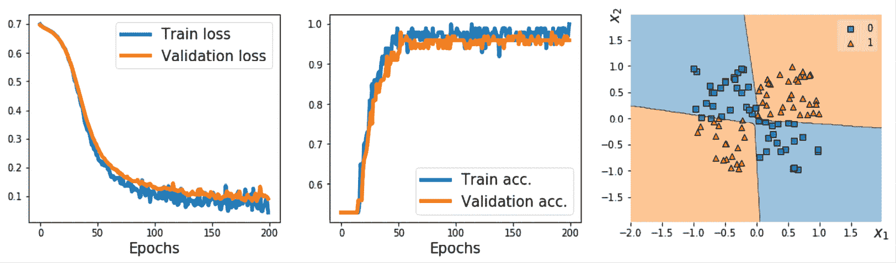

    图 13.6:使用非线性作为第一个隐藏层的结果

在这里，我们的目标是学习如何定义一个从`nn.Module`子类化的新定制层，并像使用任何其他标准`torch.nn`层一样使用。尽管在这个特殊的例子中，`NoisyLinear`并没有帮助提高性能，但是请记住，我们的目标主要是学习如何从头开始编写一个定制层。一般来说，编写一个新的定制层在其他应用程序中可能是有用的，例如，如果您开发一个新算法，它依赖于现有层之外的一个新层。

# 项目一——预测汽车的燃油效率

到目前为止，在本章中，我们主要关注于`torch.nn`模块。为了简单起见，我们使用`nn.Sequential`到来构建模型。然后，我们使用`nn.Module`使模型构建更加灵活，并实现了前馈神经网络，我们在其中添加了定制层。在这一节中，我们将进行一个现实世界的项目，以每加仑英里数(MPG)来预测汽车的燃油效率。我们将涵盖机器学习任务中的底层步骤，如数据预处理、特征工程、训练、预测(推理)和评估。

## 使用要素列

在机器学习和深度学习应用中，我们可以遇到各种不同类型的特征:连续的、无序的分类(名义上的)和有序的分类(顺序的)。您应该还记得，在*第 4 章*、*构建良好的训练数据集——数据预处理*中，我们讨论了不同类型的特性，并学习了如何处理每种类型。请注意，虽然数字数据可以是连续的，也可以是离散的，但在使用 PyTorch 进行机器学习的情况下，“数字”数据特别是指浮点类型的连续数据。

有时，特征集合由不同特征类型的混合组成。例如，考虑一个有七个不同特征的场景，如图*图 13.7* 所示:

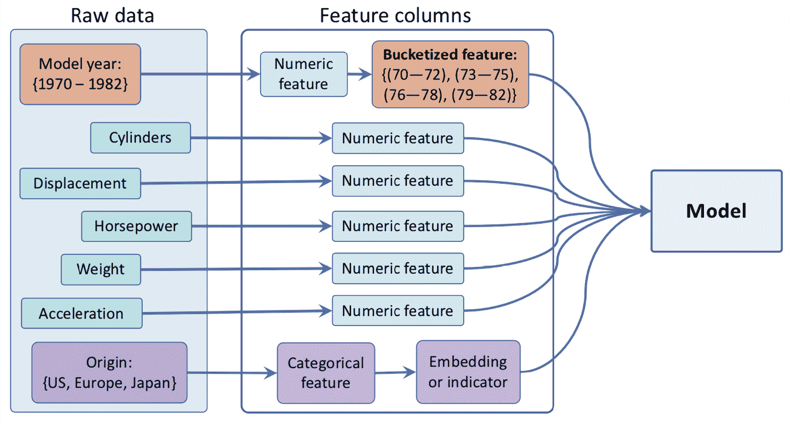

图 13.7:自动 MPG 数据结构

图中显示的特征(模型年、气缸、排量、马力、重量、加速度和原点)是从 Auto MPG 数据集获得的，Auto MPG 数据集是一个常见的机器学习基准数据集，用于预测汽车在 MPG 中的燃油效率。完整的数据集及其描述可从位于 https://archive.ics.uci.edu/ml/datasets/auto+mpg 的 UCI 机器学习库获得。

我们将把汽车 MPG 数据集中的五个特征(气缸数、排量、马力、重量和加速度)视为“数字”(这里是连续的)特征。模型年可视为有序分类(序数)特征。最后，制造产地可以被视为一个无序的分类(名义)特征，具有三个可能的离散值 1、2 和 3，分别对应于美国、欧洲和日本。

让我们首先加载数据并应用必要的预处理步骤，包括丢弃不完整的行、将数据集划分为训练数据集和测试数据集，以及标准化连续特征:

```py
>>> import pandas as pd

>>> url = 'http://archive.ics.uci.edu/ml/' \

...       'machine-learning-databases/auto-mpg/auto-mpg.data'

>>> column_names = ['MPG', 'Cylinders', 'Displacement', 'Horsepower',

...                 'Weight', 'Acceleration', 'Model Year', 'Origin']

>>> df = pd.read_csv(url, names=column_names,

...                  na_values = "?", comment='\t',

...                  sep=" ", skipinitialspace=True)

>>>

>>> ## drop the NA rows

>>> df = df.dropna()

>>> df = df.reset_index(drop=True)

>>>

>>> ## train/test splits:

>>> import sklearn

>>> import sklearn.model_selection

>>> df_train, df_test = sklearn.model_selection.train_test_split(

...     df, train_size=0.8, random_state=1

... )

>>> train_stats = df_train.describe().transpose()

>>>

>>> numeric_column_names = [

...     'Cylinders', 'Displacement',

...     'Horsepower', 'Weight',

...     'Acceleration'

... ]

>>> df_train_norm, df_test_norm = df_train.copy(), df_test.copy()

>>> for col_name in numeric_column_names:

...     mean = train_stats.loc[col_name, 'mean']

...     std  = train_stats.loc[col_name, 'std']

...     df_train_norm.loc[:, col_name] = \

...         (df_train_norm.loc[:, col_name] - mean)/std

...     df_test_norm.loc[:, col_name] = \

...         (df_test_norm.loc[:, col_name] - mean)/std

>>> df_train_norm.tail() 
```

这将导致以下结果:

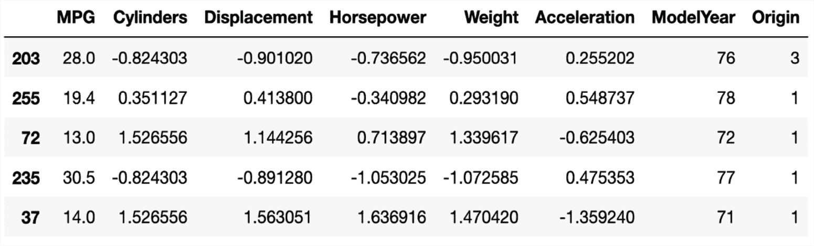

图 13.8:预处理的自动 MG 数据

我们通过前面的代码片段创建的熊猫`DataFrame`包含五列类型为`float`的值。这些柱子将构成连续的特征。

接下来，让我们将相当细粒度的模型年份(`ModelYear`)信息分组到桶中，以简化我们稍后将要训练的模型的学习任务。具体来说，我们将把每辆车分配到四个*年*桶中的一个，如下所示:

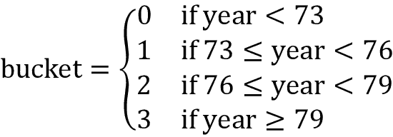

请注意，选择的间隔是任意选择的，以说明“分桶”的概念为了将汽车归入这些类别，我们将首先为年款特征定义三个临界值:[73，76，79]。这些截止值用于指定半闭区间，例如，(–∞，73)，[73，76]，[76，79]和[76，∞)。然后，原始的数字特征将被传递给`torch.bucketize`函数([https://py torch . org/docs/stable/generated/torch . bucket ize . html](https://pytorch.org/docs/stable/generated/torch.bucketize.html))来生成桶的指数。代码如下:

```py
>>> boundaries = torch.tensor([73, 76, 79])

>>> v = torch.tensor(df_train_norm['Model Year'].values)

>>> df_train_norm['Model Year Bucketed'] = torch.bucketize(

...     v, boundaries, right=True

... )

>>> v = torch.tensor(df_test_norm['Model Year'].values)

>>> df_test_norm['Model Year Bucketed'] = torch.bucketize(

...     v, boundaries, right=True

... )

>>> numeric_column_names.append('Model Year Bucketed') 
```

我们将这个分桶的特性列添加到 Python 列表`numeric_column_names`中。

接下来，我们将继续为无序分类特征`Origin`定义一个列表。在 PyTorch 中，有两种方法来处理分类特性:通过`nn.Embedding`([https://py torch . org/docs/stable/generated/torch . nn . embedding . html](https://pytorch.org/docs/stable/generated/torch.nn.Embedding.html))使用嵌入层，或者使用一个热编码的向量(也称为*指示器*)。例如，在编码方法中，索引 0 将被编码为[1，0，0]，索引 1 将被编码为[0，1，0]，等等。另一方面，嵌入层将每个索引映射到一个`float`类型的随机数向量，这个向量是可以训练的。(您可以将嵌入层视为一次性编码乘以可训练权重矩阵的更有效实现。)

当类别数较大时，使用维数小于类别数的嵌入层可以提高性能。

在下面的代码片段中，我们将对分类特征使用一次性编码方法，以便将其转换为密集格式:

```py
>>> from torch.nn.functional import one_hot

>>> total_origin = len(set(df_train_norm['Origin']))

>>> origin_encoded = one_hot(torch.from_numpy(

...     df_train_norm['Origin'].values) % total_origin)

>>> x_train_numeric = torch.tensor(

...     df_train_norm[numeric_column_names].values)

>>> x_train = torch.cat([x_train_numeric, origin_encoded], 1).float()

>>> origin_encoded = one_hot(torch.from_numpy(

...     df_test_norm['Origin'].values) % total_origin)

>>> x_test_numeric = torch.tensor(

...     df_test_norm[numeric_column_names].values)

>>> x_test = torch.cat([x_test_numeric, origin_encoded], 1).float() 
```

将分类特征编码成三维密集特征后，我们将它与上一步中处理的数字特征连接起来。最后，我们将根据地面真实 MPG 值创建标签张量，如下所示:

```py
>>> y_train = torch.tensor(df_train_norm['MPG'].values).float()

>>> y_test = torch.tensor(df_test_norm['MPG'].values).float() 
```

在本节中，我们介绍了在 PyTorch 中预处理和创建特性的最常见方法。

## 训练 DNN 回归模型

现在，在构建了强制特性和标签之后，我们将创建一个数据加载器，它对列车数据使用 8 的批量大小:

```py
>>> train_ds = TensorDataset(x_train, y_train)

>>> batch_size = 8

>>> torch.manual_seed(1)

>>> train_dl = DataLoader(train_ds, batch_size, shuffle=True) 
```

接下来，我们将构建一个具有两个完全连接的层的模型，其中一个具有 8 个隐藏单元，另一个具有 4 个隐藏单元:

```py
>>> hidden_units = [8, 4]

>>> input_size = x_train.shape[1]

>>> all_layers = []

>>> for hidden_unit in hidden_units:

...     layer = nn.Linear(input_size, hidden_unit)

...     all_layers.append(layer)

...     all_layers.append(nn.ReLU())

...     input_size = hidden_unit

>>> all_layers.append(nn.Linear(hidden_units[-1], 1))

>>> model = nn.Sequential(*all_layers)

>>> model

Sequential(

  (0): Linear(in_features=9, out_features=8, bias=True)

  (1): ReLU()

  (2): Linear(in_features=8, out_features=4, bias=True)

  (3): ReLU()

  (4): Linear(in_features=4, out_features=1, bias=True)

) 
```

定义模型后，我们将定义回归的 MSE 损失函数，并使用随机梯度下降进行优化:

```py
>>> loss_fn = nn.MSELoss()

>>> optimizer = torch.optim.SGD(model.parameters(), lr=0.001) 
```

现在我们将训练模型 200 个时期，并显示每 20 个时期的列车损失:

```py
>>> torch.manual_seed(1)

>>> num_epochs = 200

>>> log_epochs = 20

>>> for epoch in range(num_epochs):

...     loss_hist_train = 0

...     for x_batch, y_batch in train_dl:

...         pred = model(x_batch)[:, 0]

...         loss = loss_fn(pred, y_batch)

...         loss.backward()

...         optimizer.step()

...         optimizer.zero_grad()

...         loss_hist_train += loss.item()

...     if epoch % log_epochs==0:

...         print(f'Epoch {epoch}  Loss '

...               f'{loss_hist_train/len(train_dl):.4f}')

Epoch 0  Loss 536.1047

Epoch 20  Loss 8.4361

Epoch 40  Loss 7.8695

Epoch 60  Loss 7.1891

Epoch 80  Loss 6.7062

Epoch 100  Loss 6.7599

Epoch 120  Loss 6.3124

Epoch 140  Loss 6.6864

Epoch 160  Loss 6.7648

Epoch 180  Loss 6.2156 
```

200 个历元后，列车损耗在 5 左右。我们现在可以在测试数据集上评估训练模型的回归性能。为了预测新数据点的目标值，我们可以将它们的特征输入到模型中:

```py
>>> with torch.no_grad():

...     pred = model(x_test.float())[:, 0]

...     loss = loss_fn(pred, y_test)

...     print(f'Test MSE: {loss.item():.4f}')

...     print(f'Test MAE: {nn.L1Loss()(pred, y_test).item():.4f}')

Test MSE: 9.6130

Test MAE: 2.1211 
```

测试集上的 MSE 为 9.6，**平均绝对误差** ( **MAE** )为 2.1。在这个回归项目之后，我们将在下一部分进行一个分类项目。

# 项目二——分类 MNIST 手写数字

对于这个分类项目，我们将对 MNIST 手写数字进行分类。在上一节中，我们详细介绍了 PyTorch 中机器学习的四个基本步骤，我们将在本节中重复这些步骤。

你会记得在*第 12 章*中，你学习了从`torchvision`模块加载可用数据集的方法。首先，我们将使用`torchvision`模块加载 MNIST 数据集。

1.  The setup step includes loading the dataset and specifying hyperparameters (the size of the train set and test set, and the size of mini-batches):

    ```py
    >>> import torchvision

    >>> from torchvision import transforms

    >>> image_path = './'

    >>> transform = transforms.Compose([

    ...     transforms.ToTensor()

    ... ])

    >>> mnist_train_dataset = torchvision.datasets.MNIST(

    ...     root=image_path, train=True,

    ...     transform=transform, download=False

    ... )

    >>> mnist_test_dataset = torchvision.datasets.MNIST(

    ...     root=image_path, train=False,

    ...     transform=transform, download=False

    ... )

    >>> batch_size = 64

    >>> torch.manual_seed(1)

    >>> train_dl = DataLoader(mnist_train_dataset,

    ...                       batch_size, shuffle=True) 
    ```

    这里，我们构建了一个包含 64 个样本的数据加载器。接下来，我们将预处理加载的数据集。

2.  We preprocess the input features and the labels. The features in this project are the pixels of the images we read from **Step 1**. We defined a custom transformation using `torchvision.transforms.Compose`. In this simple case, our transformation consisted only of one method, `ToTensor()`. The `ToTensor()` method converts the pixel features into a floating type tensor and also normalizes the pixels from the [0, 255] to [0, 1] range. In *Chapter 14*, *Classifying Images with Deep Convolutional Neural Networks*, we will see some additional data transformation methods when we work with more complex image datasets. The labels are integers from 0 to 9 representing ten digits. Hence, we don’t need to do any scaling or further conversion. Note that we can access the raw pixels using the `data` attribute, and don’t forget to scale them to the range [0, 1].

    一旦数据经过预处理，我们将在下一步构建模型。

3.  Construct the NN model:

    ```py
    >>> hidden_units = [32, 16]

    >>> image_size = mnist_train_dataset[0][0].shape

    >>> input_size = image_size[0] * image_size[1] * image_size[2]

    >>> all_layers = [nn.Flatten()]

    >>> for hidden_unit in hidden_units:

    ...     layer = nn.Linear(input_size, hidden_unit)

    ...     all_layers.append(layer)

    ...     all_layers.append(nn.ReLU())

    ...     input_size = hidden_unit

    >>> all_layers.append(nn.Linear(hidden_units[-1], 10))

    >>> model = nn.Sequential(*all_layers)

    >>> model

    Sequential(

      (0): Flatten(start_dim=1, end_dim=-1)

      (1): Linear(in_features=784, out_features=32, bias=True)

      (2): ReLU()

      (3): Linear(in_features=32, out_features=16, bias=True)

      (4): ReLU()

      (5): Linear(in_features=16, out_features=10, bias=True)

    ) 
    ```

    请注意，该模型从展平图层开始，该图层将输入图像展平为一维张量。这是因为输入图像是[1，28，28]的形状。该模型有两个隐藏层，分别有 32 个和 16 个单元。它以表示十个类的十个单元的输出层结束，由 softmax 函数激活。下一步，我们将在训练集上训练该模型，并在测试集上对其进行评估。

4.  Use the model for training, evaluation, and prediction:

    ```py
    >>> loss_fn = nn.CrossEntropyLoss()

    >>> optimizer = torch.optim.Adam(model.parameters(), lr=0.001)

    >>> torch.manual_seed(1)

    >>> num_epochs = 20

    >>> for epoch in range(num_epochs):

    ...     accuracy_hist_train = 0

    ...     for x_batch, y_batch in train_dl:

    ...         pred = model(x_batch)

    ...         loss = loss_fn(pred, y_batch)

    ...         loss.backward()

    ...         optimizer.step()

    ...         optimizer.zero_grad()

    ...         is_correct = (

    ...             torch.argmax(pred, dim=1) == y_batch

    ...         ).float()

    ...         accuracy_hist_train += is_correct.sum()

    ...     accuracy_hist_train /= len(train_dl.dataset)

    ...     print(f'Epoch {epoch}  Accuracy '

    ...           f'{accuracy_hist_train:.4f}')

    Epoch 0  Accuracy 0.8531

    ...

    Epoch 9  Accuracy 0.9691

    ...

    Epoch 19  Accuracy 0.9813 
    ```

    我们使用交叉熵损失函数进行多类分类，使用 Adam 优化器进行梯度下降。我们将在第 14 章中讨论 Adam 优化器。我们对模型进行了 20 个时期的训练，并显示了每个时期的训练精度。经过训练的模型在训练集上达到了 96.3%的准确率，我们将在测试集上对其进行评估:

    ```py
    >>> pred = model(mnist_test_dataset.data / 255.)

    >>> is_correct = (

    ...     torch.argmax(pred, dim=1) ==

    ...     mnist_test_dataset.targets

    ... ).float()

    >>> print(f'Test accuracy: {is_correct.mean():.4f}')

    Test accuracy: 0.9645 
    ```

测试的准确率为 95.6%。您已经学习了如何使用 PyTorch 解决分类问题。

# 高级 py torch API:py torch-Lightning 简介

近年来，PyTorch 社区在 PyTorch 的基础上开发了几个不同的库和 API。值得注意的例子有fastai([https://docs.fast.ai/](https://docs.fast.ai/))Catalyst([https://github.com/catalyst-team/catalyst](https://github.com/catalyst-team/catalyst))[py torch](https://www.pytorchlightning.ai)Lightning([https://www . pytorchlightning . ai](https://www.pytorchlightning.ai))[https://Lightning-flash . readthedocs . io/en/latest/quick start . html](https://lightning-flash.readthedocs.io/en/latest/quickstart.html))PyTorch-Ignite([https://github.com/pytorch/ignite](https://github.com/pytorch/ignite))。

在本节中，我们将探索 PyTorch Lightning(简称 Lightning)，这是一个广泛使用的 PyTorch 库，它通过删除大量样板代码来简化深度神经网络的训练。然而，虽然 Lightning 的重点在于简单性和灵活性，但它也允许我们使用许多高级功能，如多 GPU 支持和快速低精度训练，这些你可以在 https://pytorch-lightning.rtfd.io/en/latest/的官方文档中了解到。

在[https://github . com/rasbt/machine-learning-book/blob/main/ch13/ch13 _ part 4 _ Ignite . ipynb](https://github.com/rasbt/machine-learning-book/blob/main/ch13/ch13_part4_ignite.ipynb)还有 PyTorch-Ignite 的额外介绍。

在前面的章节中，*项目二——分类 MNIST 手写数字*,我们实现了一个多层感知器来分类 MNIST 数据集中的手写数字。在接下来的小节中，我们将使用 Lightning 重新实现这个分类器。

**安装 PyTorch Lightning**

Lightning 可以通过 pip 或 conda 安装，这取决于您的偏好。例如，通过 pip 安装 Lightning 的命令如下:

```py
pip install pytorch-lightning 
```

以下是通过 conda 安装 Lightning 的命令:

```py
conda install pytorch-lightning -c conda-forge 
```

以下小节中的代码基于 PyTorch Lightning 版本 1.5，您可以通过在这些命令中将`pytorch-lightning`替换为`pytorch-lightning==1.5`来安装该版本。

## 建立 PyTorch 闪电模型

我们从实现模型开始，我们将在接下来的小节中训练它。为 Lightning 定义一个模型相对简单，因为它基于常规的 Python 和 PyTorch 代码。实现 Lightning 模型所需要的就是使用`LightningModule`而不是常规的 PyTorch 模块。为了利用 PyTorch 的便利功能，例如 trainer API 和自动日志记录，我们只定义了几个专门命名的方法，我们将在下面的代码中看到:

```py
import pytorch_lightning as pl

import torch 

import torch.nn as nn 

from torchmetrics import Accuracy

class MultiLayerPerceptron(pl.LightningModule):

    def __init__(self, image_shape=(1, 28, 28), hidden_units=(32, 16)):

        super().__init__()

        # new PL attributes:

        self.train_acc = Accuracy()

        self.valid_acc = Accuracy()

        self.test_acc = Accuracy()

        # Model similar to previous section:

        input_size = image_shape[0] * image_shape[1] * image_shape[2]

        all_layers = [nn.Flatten()]

        for hidden_unit in hidden_units: 

            layer = nn.Linear(input_size, hidden_unit) 

            all_layers.append(layer) 

            all_layers.append(nn.ReLU()) 

            input_size = hidden_unit 

        all_layers.append(nn.Linear(hidden_units[-1], 10))  

        self.model = nn.Sequential(*all_layers)

    def forward(self, x):

        x = self.model(x)

        return x

    def training_step(self, batch, batch_idx):

        x, y = batch

        logits = self(x)

        loss = nn.functional.cross_entropy(self(x), y)

        preds = torch.argmax(logits, dim=1)

        self.train_acc.update(preds, y)

        self.log("train_loss", loss, prog_bar=True)

        return loss

    def training_epoch_end(self, outs):

        self.log("train_acc", self.train_acc.compute())

    def validation_step(self, batch, batch_idx):

        x, y = batch

        logits = self(x)

        loss = nn.functional.cross_entropy(self(x), y)

        preds = torch.argmax(logits, dim=1)

        self.valid_acc.update(preds, y)

        self.log("valid_loss", loss, prog_bar=True)

        self.log("valid_acc", self.valid_acc.compute(), prog_bar=True)

        return loss

    def test_step(self, batch, batch_idx):

        x, y = batch

        logits = self(x)

        loss = nn.functional.cross_entropy(self(x), y)

        preds = torch.argmax(logits, dim=1)

        self.test_acc.update(preds, y)

        self.log("test_loss", loss, prog_bar=True)

        self.log("test_acc", self.test_acc.compute(), prog_bar=True)

        return loss

    def configure_optimizers(self):

        optimizer = torch.optim.Adam(self.parameters(), lr=0.001)

        return optimizer 
```

现在让我们逐一讨论不同的方法。如您所见，`__init__`构造函数包含了我们在前面小节中使用的相同的模型代码。新的是我们增加了`self.train_acc = Accuracy()`等精度属性。这些将允许我们在训练期间跟踪准确性。`Accuracy`是从`torchmetrics`模块导入的，应该是自动安装了雷电。如果无法导入`torchmetrics`，可以尝试通过`pip install torchmetrics`安装。更多信息可以在[https://torch metrics . readthe docs . io/en/latest/pages/quick start . html](https://torchmetrics.readthedocs.io/en/latest/pages/quickstart.html)找到。

`forward`方法实现了一个简单的正向传递，当我们对输入数据调用我们的模型时，它返回 logits(在 softmax 层之前的最后一个完全连接的网络层的输出)。通过调用`self(x)`经由`forward`方法计算的逻辑用于训练、验证和测试步骤，我们将在下面描述。

`training_step`、`training_epoch_end`、`validation_step`、`test_step`和`configure_optimizers`方法是闪电特别识别的方法。例如，`training_step`定义了训练期间的单次向前传球，其中我们还记录了准确性和损失，以便我们可以在以后进行分析。请注意，我们通过`self.train_acc.update(preds, y)`计算精度，但还没有记录下来。`training_step`方法在训练期间对每个单独的批次执行，通过在每个训练时期结束时执行的`training_epoch_end`方法，我们从通过训练积累的精度值计算训练集精度。

类似于`training_step`方法，`validation_step`和`test_step`方法定义了如何计算验证和测试评估过程。与`training_step`类似，每个`validation_step`和`test_step`接收一个批次，这就是为什么我们通过从`torchmetric`的`Accuracy`派生的各自精度属性来记录精度。然而，注意到`validation_step`仅在特定的间隔被调用，例如，在每个训练时期之后。这就是为什么我们在验证步骤中记录验证精度，而对于训练精度，我们在每个训练时期后记录，否则，我们稍后检查的精度图看起来会太嘈杂。

最后，通过`configure_optimizers`方法，我们指定用于训练的优化器。接下来的两个小节将讨论如何建立数据集以及如何训练模型。

## 为 Lightning 设置数据加载器

我们有三种主要的方法为闪电准备数据集。我们可以:

*   使数据集成为模型的一部分
*   像往常一样设置数据加载器，并将它们提供给 Lightning 训练器的`fit`方法——训练器将在下一小节中介绍
*   创建一个`LightningDataModule`

这里，我们将使用一个`LightningDataModule`，这是最有条理的方法。`LightningDataModule`由五个主要方法组成，如下所示:

```py
from torch.utils.data import DataLoader

from torch.utils.data import random_split

from torchvision.datasets import MNIST

from torchvision import transforms

class MnistDataModule(pl.LightningDataModule):

    def __init__(self, data_path='./'):

        super().__init__()

        self.data_path = data_path

        self.transform = transforms.Compose([transforms.ToTensor()])

    def prepare_data(self):

        MNIST(root=self.data_path, download=True) 

    def setup(self, stage=None):

        # stage is either 'fit', 'validate', 'test', or 'predict'

        # here note relevant

        mnist_all = MNIST( 

            root=self.data_path,

            train=True,

            transform=self.transform,  

            download=False

        ) 

        self.train, self.val = random_split(

            mnist_all, [55000, 5000], generator=torch.Generator().manual_seed(1)

        )

        self.test = MNIST( 

            root=self.data_path,

            train=False,

            transform=self.transform,  

            download=False

        ) 

    def train_dataloader(self):

        return DataLoader(self.train, batch_size=64, num_workers=4)

    def val_dataloader(self):

        return DataLoader(self.val, batch_size=64, num_workers=4)

    def test_dataloader(self):

        return DataLoader(self.test, batch_size=64, num_workers=4) 
```

在`prepare_data`方法中，我们定义了一般步骤，比如下载数据集。在`setup`方法中，我们定义了用于训练、验证和测试的数据集。请注意，MNIST 没有专门的验证拆分，这就是为什么我们使用`random_split`函数将 60，000 个样本的训练集划分为 55，000 个用于训练的样本和 5，000 个用于验证的样本。

数据加载器方法是不言自明的，它定义了如何加载各个数据集。现在，我们可以初始化数据模块，并在接下来的小节中使用它进行培训、验证和测试:

```py
torch.manual_seed(1) 

mnist_dm = MnistDataModule() 
```

## 使用 PyTorch 闪电训练器类训练模型

现在，我们可以从使用专门命名的方法以及 Lightning 数据模块建立模型中获得回报。Lightning 实现了一个`Trainer`类，通过照顾所有的中间步骤，例如为我们调用`zero_grad()`、`backward()`和`optimizer.step()`，使得训练模型超级方便。另外，它还让我们可以轻松地指定一个或多个要使用的 GPU(如果可用的话):

```py
mnistclassifier = MultiLayerPerceptron()

if torch.cuda.is_available(): # if you have GPUs

    trainer = pl.Trainer(max_epochs=10, gpus=1)

else:

    trainer = pl.Trainer(max_epochs=10)

trainer.fit(model=mnistclassifier, datamodule=mnist_dm) 
```

通过前面的代码，我们训练我们的多层感知器 10 个时期。在训练过程中，我们会看到一个方便的进度条，用于跟踪纪元和核心指标，如训练和验证损失:

```py
Epoch 9: 100% 939/939 [00:07<00:00, 130.42it/s, loss=0.1, v_num=0, train_loss=0.260, valid_loss=0.166, valid_acc=0.949] 
```

培训结束后，我们还可以更详细地检查我们记录的指标，我们将在下一小节中看到。

## 使用 TensorBoard 评估模型

在上一节中，我们体验了`Trainer`类的便利性。Lightning 的另一个很好的特性是它的日志功能。回想一下，我们之前在 Lightning 模型中指定了几个`self.log`步骤。之后，甚至在训练期间，我们可以在 TensorBoard 中想象它们。(注意，Lightning 也支持其他记录器；更多信息请见[https://py torch-lightning . readthe docs . io/en/latest/common/loggers . html](https://pytorch-lightning.readthedocs.io/en/latest/common/loggers.html)的官方文档。)

**安装张量板**

TensorBoard 可以通过 pip 或 conda 安装，具体取决于您的喜好。例如，通过 pip 安装 TensorBoard 的命令如下:

```py
pip install tensorboard 
```

以下是通过 conda 安装 Lightning 的命令:

```py
conda install tensorboard -c conda-forge 
```

以下小节中的代码基于 TensorBoard 版本 2.4，您可以通过用这些命令中的`tensorboard==2.4`替换`tensorboard`中的来安装该版本。

默认情况下，Lightning 在名为`lightning_logs`的子文件夹中跟踪训练。为了可视化训练运行，您可以在命令行终端中执行以下代码，这将在您的浏览器中打开 TensorBoard:

```py
tensorboard --logdir lightning_logs/ 
```

或者，如果您在 Jupyter 笔记本中运行代码，您可以将以下代码添加到 Jupyter 笔记本单元格中，以直接在笔记本中显示 TensorBoard 仪表板:

```py
%load_ext tensorboard

%tensorboard --logdir lightning_logs/ 
```

*图 13.9* 显示了带有记录的训练和验证精度的张量板仪表盘。注意左下角有一个`version_0`开关。如果您多次运行训练代码，Lightning 会将它们作为单独的子文件夹进行跟踪:`version_0`、`version_1`、`version_2`等等:


图 13.9: TensorBoard 仪表板

通过查看*图 13.9* 中的训练和验证精度，我们可以假设为模型训练几个额外的时期可以提高性能。

Lightning 允许我们加载一个经过训练的模型，并方便地为其他时期训练它。如前所述，Lightning 通过子文件夹跟踪单个训练跑步。在*图 13.10* 中，我们看到了`version_0`子文件夹的内容，它包含日志文件和一个用于重新加载模型的模型检查点:

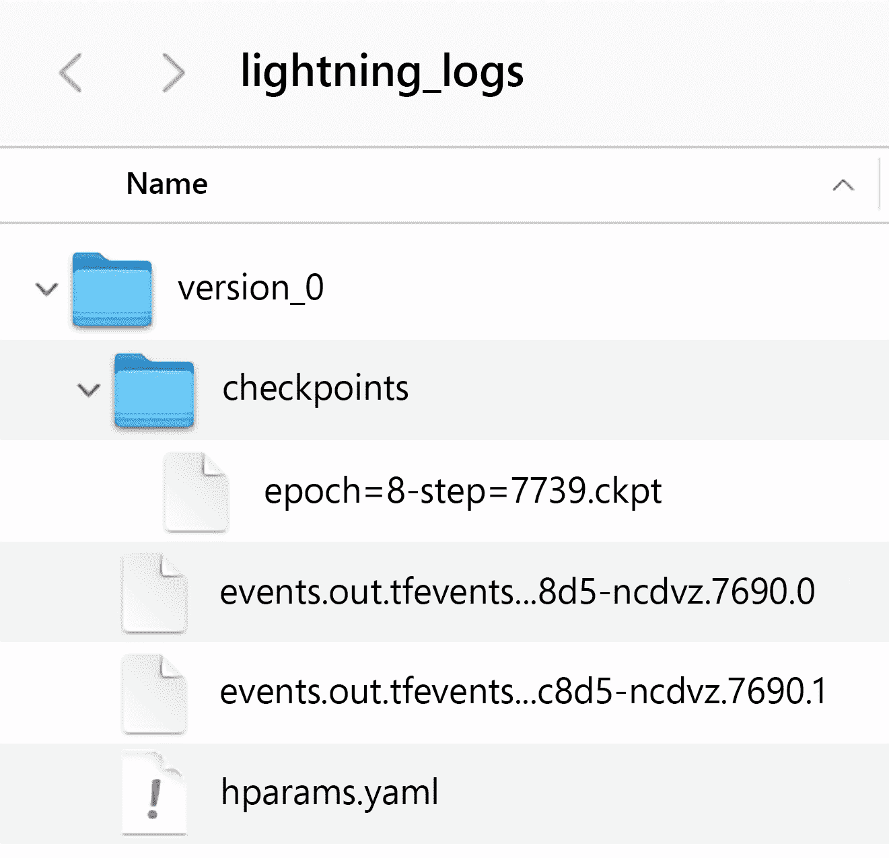

图 13.10: PyTorch 闪电日志文件

例如，我们可以使用下面的代码从这个文件夹中加载最新的模型检查点，并通过`fit`训练模型:

```py
if torch.cuda.is_available(): # if you have GPUs

    trainer = pl.Trainer(max_epochs=15, resume_from_checkpoint='./lightning_logs/version_0/checkpoints/epoch=8-step=7739.ckpt', gpus=1)

else:

    trainer = pl.Trainer(max_epochs=15, resume_from_checkpoint='./lightning_logs/version_0/checkpoints/epoch=8-step=7739.ckpt')

trainer.fit(model=mnistclassifier, datamodule=mnist_dm) 
```

这里，我们将`max_epochs`设置为`15`，它为模型训练了 5 个额外的时期(以前，我们训练了 10 个时期)。

现在，让我们看看图 13.11 中的张量板仪表板，看看是否值得为模型训练几个额外的历元:


图 13.11:再训练五个时期后的 TensorBoard 仪表板

正如我们在*图 13.11* 中看到的，TensorBoard 允许我们在之前的(`version_0`)旁边显示来自额外训练时段(`version_1`)的结果，这非常方便。事实上，我们可以看到，再训练五个纪元提高了验证的准确性。在这一点上，我们可能会决定为更多的时代训练模型，这是我们留给你的一个练习。

一旦我们完成了训练，我们可以使用下面的代码在测试集上评估模型:

```py
trainer.test(model=mnistclassifier, datamodule=mnist_dm) 
```

在总共训练 15 个时期之后，最终的测试集性能大约为 95 %:

```py
[{'test_loss': 0.14912301301956177, 'test_acc': 0.9499600529670715}] 
```

注意 PyTorch Lightning 也为我们自动保存了模型。如果您希望以后重用该模型，您可以通过下面的代码方便地加载它:

```py
model = MultiLayerPerceptron.load_from_checkpoint("path/to/checkpoint.ckpt") 
```

**了解更多关于 PyTorch Lightning 的信息**

要了解更多关于 Lightning 的知识，请访问官方网站，其中包含教程和示例，网址为[https://py torch-Lightning . readthedocs . io](https://pytorch-lightning.readthedocs.io)。

Lightning 在 Slack 上也有一个活跃的社区，欢迎新用户和贡献者。如需了解更多信息，请访问闪电官方网站[https://www . pytorchlightning . ai](https://www.pytorchlightning.ai)。

# 摘要

在这一章中，我们讨论了 PyTorch 最基本和最有用的特性。我们从讨论 PyTorch 的动态计算图开始，这使得实现计算非常方便。我们还讨论了将 PyTorch 张量对象定义为模型参数的语义。

在我们考虑了计算任意函数的偏导数和梯度的概念之后，我们更详细地讨论了`torch.nn`模块。它为我们构建更复杂的深度神经网络模型提供了一个用户友好的界面。最后，我们通过使用我们到目前为止所讨论的内容解决一个回归和分类问题来结束本章。

现在我们已经讨论了 PyTorch 的核心机制，下一章将介绍用于深度学习的**卷积神经网络** ( **CNN** )架构背后的概念。CNN 是强大的模型，在计算机视觉领域表现出色。

# 加入我们书的不和谐空间

加入该书的 Discord workspace，每月与作者进行一次*向我提问*会议:

[https://packt.link/MLwPyTorch](https://packt.link/MLwPyTorch)

