<title>Chapter_14</title> <link href="../Styles/epub.css" rel="stylesheet" type="text/css"> <link href="../Styles/syntax-highlighting.css" rel="stylesheet" type="text/css">

# Fourteen

# 用深度卷积神经网络对图像进行分类

在前一章中，我们深入研究了 PyTorch 神经网络和自动微分模块的不同方面，您已经熟悉了张量和装饰函数，并学习了如何使用`torch.nn`。在这一章中，你现在将学习用于图像分类的**卷积神经网络**(**CNN**)的。我们将使用自下而上的方法，从讨论 CNN 的基本构件开始。然后，我们将更深入地研究 CNN 架构，并探索如何在 PyTorch 中实现 CNN。在本章中，我们将讨论以下主题:

*   一维和二维卷积运算
*   CNN 架构的构建模块
*   在 PyTorch 中实现深度 CNN
*   提高泛化性能的数据扩充技术
*   实现面部 CNN 分类器以识别某人是否在微笑

# CNN 的组成部分

CNN 是一个模型家族,最初的灵感来自于人类大脑视觉皮层在识别物体时的工作方式。Cnn 的发展可以追溯到 20 世纪 90 年代，当时 Yann LeCun 和他的同事提出了一种新的 NN 架构，用于从图像中分类手写数字(由 *Y. LeCun* 和同事于 1989 年在*神经信息处理系统(NeurIPS)* 会议上发表的*用反向传播网络*进行手写数字识别)。

**人类的视觉皮层**

1959 年，大卫·H·哈贝尔和托尔斯滕·威塞尔首次发现了我们大脑的视觉皮层是如何运作的，当时他们将一个微电极插入了一只被麻醉的猫的初级视觉皮层。他们观察到，在猫面前投射不同模式的光后，神经元会有不同的反应。这最终导致了视觉皮层不同层次的发现。初级层主要检测边缘和直线，而高阶层更侧重于提取复杂的形状和图案。

由于CNN 在图像分类任务中的出色表现，这种特殊类型的前馈神经网络获得了很多关注，并导致了计算机视觉机器学习的巨大进步。几年后，在 2019 年，Yann LeCun 因其对**人工智能** ( **AI** )的领域的贡献获得了图灵奖(计算机科学领域最负盛名的奖项)，与他一起的还有另外两名研究人员 Yoshua Bengio 和 Geoffrey Hinton，他们的名字你在前面的章节中见过。

在下面几节中，我们将讨论 CNN 的更广泛的概念，以及为什么卷积架构经常被描述为“特征提取层”然后，我们将深入研究 CNN 中常用的卷积运算类型的理论定义，并浏览计算一维和二维卷积的示例。

## 了解 CNN 和特征层次

成功提取**显著的** ( **相关** ) **特征**是任何机器学习算法性能的关键，而传统的机器学习模型依赖于输入特征，这些输入特征可能来自领域专家或基于计算特征提取技术。

某些类型的神经网络，如 CNN，可以从原始数据中自动学习对特定任务最有用的特征。出于这个原因，通常将 CNN 层视为特征提取器:早期层(那些紧接在输入层之后的层)从原始数据中提取**低级特征**，后期层(通常是**全连接层**，如在**多层感知器** ( **MLP** ))使用这些特征预测连续的目标值或类别标签。

某些类型的多层神经网络，尤其是深层神经网络，通过以逐层方式组合低级特征以形成高级特征的来构建所谓的**特征层级**。例如，如果我们正在处理图像，那么从早期的层中提取低级特征，例如边缘和斑点，这些特征被组合以形成高级特征。这些高级特征可以形成更复杂的形状，例如建筑物、猫或狗等物体的大致轮廓。

正如你在*图 14.1* 中看到的，CNN 从输入图像的中计算出**特征图**，其中每个元素都来自输入图像中的局部像素:

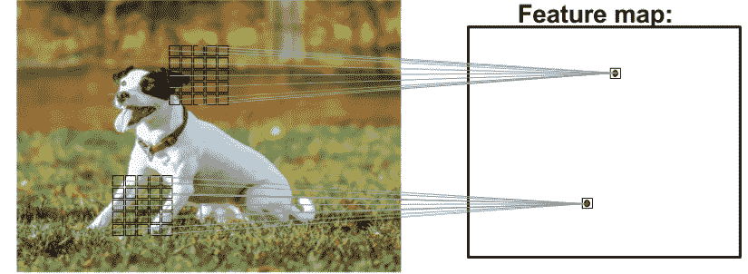

图 14.1:从图像创建特征地图(图片由 Alexander Dummer 在 Unsplash 上拍摄)

这个局部像素块被称为**局部感受野**。CNN 通常在与图像相关的任务上表现很好，这主要是由于两个重要的想法:

*   **稀疏连接**:特征图中的单个元素只与一小块像素相连。(这与在 MLPs 的情况下连接到整个输入图像非常不同。在*第 11 章*、*从零开始实现多层人工神经网络*中，回顾并比较我们如何实现连接到整个图像的全连接网络可能会有所帮助。)
*   **参数共享**:输入图像的不同块使用相同的权重。

作为这两个想法的直接结果，用卷积层取代传统的全连接 MLP 大大减少了网络中的权重(参数)数量，我们将看到捕捉*显著*特征的能力得到提高。在图像数据的上下文中，假设邻近的像素通常比彼此远离的像素更相关是有意义的。

通常，CNN 由几个**卷积**和子采样层组成，后面是一个或多个完全连接的层。完全连接的层本质上是一个 MLP，其中每个输入单元 *i* 连接到每个输出单元 *j* ，权重为*w*ij(我们在*第 11 章*中有更详细的介绍)。

请注意，子采样层，通常被称为**池层**，没有任何可学习的参数；例如，在池层中没有权重或偏差单位。然而，卷积层和全连接层都具有在训练期间优化的权重和偏差。

在下面几节中，我们将更详细地研究卷积层和池层，看看它们是如何工作的。为了理解卷积运算是如何工作的，让我们从一维卷积开始，它有时用于处理某些类型的序列数据，如文本。讨论完一维卷积后，我们将学习通常应用于二维图像的典型二维卷积。

## 执行离散卷积

一个**离散卷积**(或者简称为**卷积**)是 CNN 中的一个基本操作。因此，理解这个操作是如何工作的很重要。在这一节中，我们将介绍数学上的定义，并讨论一些**朴素的**算法来计算一维张量(向量)和二维张量(矩阵)的卷积。

请注意，本节中的公式和描述仅用于理解 CNN 中卷积运算的工作原理。事实上，更有效的卷积运算实现已经存在于 PyTorch 之类的包中，你将在本章后面看到。

**数学符号**

在这一章中，我们将使用下标来表示多维数组(张量)的大小；例如，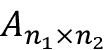是一个大小为*n*[1]×*n*[2]的二维数组。我们使用方括号[ ]来表示多维数组的索引。例如， *A* [ *i* ， *j* 是指矩阵 *A* 的索引 *i* ， *j* 处的元素。此外，请注意，我们使用一个特殊符号来表示两个向量或矩阵之间的卷积运算，不要与 Python 中的乘法运算符`*`混淆。

### 一维离散卷积

让我们从一些我们将要使用的基本定义和符号开始。两个向量 **x** 和 **w** 的离散卷积用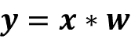表示，其中向量 **x** 是我们的输入(有时称为**信号**)**w**是称为的**滤波器**或**内核**。离散卷积的数学定义如下:


如前所述，方括号[ ]用于表示向量元素的索引。索引 *i* ，贯穿输出向量 **y** 的每个元素。在前面的公式中有两件奇怪的事情需要我们澄清:–∞到+∞指数和 **x** 的负指数。

总和贯穿从–∞到+∞的指数的事实看起来很奇怪，主要是因为在机器学习应用中，我们总是处理有限的特征向量。例如，如果 **x** 有 10 个特征，索引分别为 0、1、2、...，8，9，然后索引–∞:–1 和 10: +∞超出了 **x** 的范围。因此，为了正确计算上式中所示的总和，假设 **x** 和 **w** 被填充了零。这将产生一个输出向量， **y** ，它的大小也是无限的，也有许多零。因为这在实际情况中没有用，所以 **x** 只用有限数量的零填充。

这个过程叫做**补零**或者简称**补零**。这里，在每一侧填充的零的数量由 *p* 表示。图 14.2 中显示了一维向量 **x** 的填充示例:

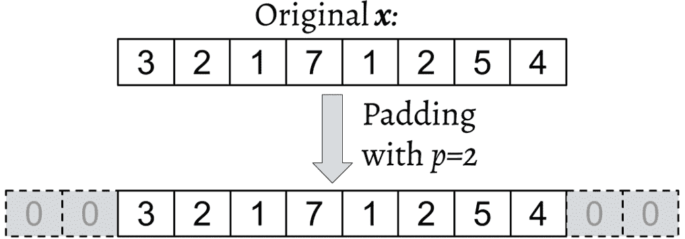

图 14.2:填充示例

让我们假设原始输入， **x** ，以及滤波器， **w** ，分别具有 *n* 和 *m* 元素，其中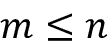。因此，填充向量*x*p 的大小为 *n* + 2 *p* 。计算离散卷积的实用公式将变为如下:

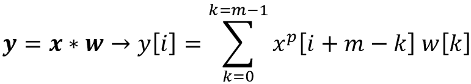

现在我们已经解决了无限索引问题，第二个问题是用*I*+*m*–*k*索引 **x** 。这里需要注意的重要一点是 **x** 和 **w** 在该求和中的索引方向不同。计算一个索引反向的和等价于计算两个索引正向的和，在翻转这些向量中的一个后，填充它们。然后，我们可以简单地计算它们的点积。假设我们翻转(旋转)滤镜， **w** ，得到旋转后的滤镜，**w**r。然后，点积，*x*[*I*:*I*+*m*。 **w** ^r ，计算得到一个元素， *y* [ *i* ，其中**x**[*I*:*I*+*m*是一个 **x** 的面片，大小为 *m* 。像在滑动窗口方法中一样重复这个操作，以获得所有的输出元素。

下图提供了一个带有 **x** = [3 2 1 7 1 2 5 4]和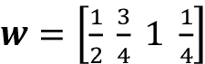的示例，以便计算前三个输出元素:

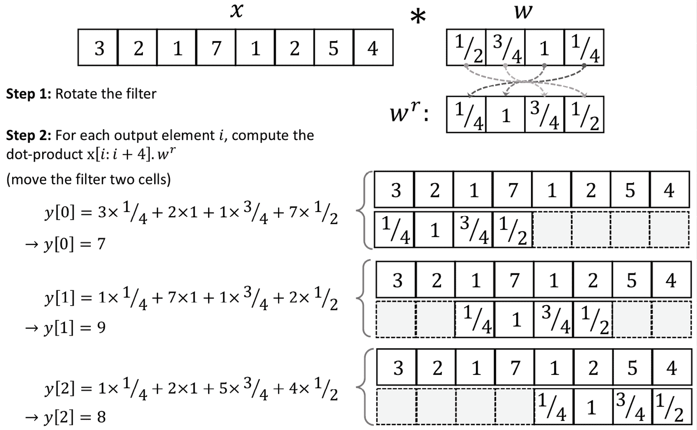

图 14.3:计算离散卷积的步骤

您可以在前面的示例中看到，填充大小为零( *p* = 0)。注意，每次我们**移动**时，旋转的滤波器**w**r 移动两个单元。这个移位是卷积的另一个超参数，即**步距**、 *s* 。在本例中，步距为 2， *s* = 2。请注意，步幅必须是小于输入向量大小的正数。我们将在下一节中更多地讨论填充和步幅。

**互相关**

输入向量和滤波器之间的互相关(或简单相关)由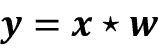表示，非常像卷积的兄弟，只有一点不同:在互相关中，乘法在相同的方向上执行。因此，不需要在每个维度上旋转滤波器矩阵 *w* 。数学上，互相关定义如下:

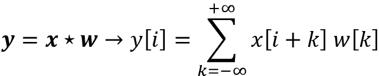

用于填充和步幅的相同规则也可以应用于互相关。请注意，大多数深度学习框架(包括 PyTorch)实现了互相关，但将其称为卷积，这是深度学习领域的常见约定。

### 填充输入以控制输出要素地图的大小

到目前为止，我们只在卷积中使用了零填充来计算有限大小的输出向量。技术上，任何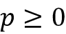都可以应用填充。根据对 *p* 的选择，边界单元可能与位于 **x** 中间的单元有所不同。

现在，考虑一个例子，其中 *n* = 5 并且 *m* = 3。那么， *p* = 0， *x* [0]仅用于计算一个输出元素(例如， *y* [0])，而 *x* [1】用于计算两个输出元素(例如， *y* [0】和 *y* [1】)。因此，你可以看到对元素 **x** 的不同处理可以人为地强调中间元素*x*【2】，因为它出现在大多数计算中。如果我们选择 *p* = 2 就可以避免这个问题，这样的话 **x** 的每个元素都会参与到 **y** 的三个元素的计算中。

此外，输出的大小 **y** 也取决于我们使用的填充策略的选择。

实践中常用的填充方式有三种:*满*、*同*、*有效*。

在全模式下，填充参数 *p* 被设置为*p*=*m*–1。完全填充增加了输出的尺寸；因此，它很少用于 CNN 架构。

通常使用相同的填充模式来确保输出向量具有与输入向量相同的大小， **x** 。在这种情况下，填充参数 *p* 根据滤波器大小以及输入大小和输出大小相同的要求来计算。

最后，计算有效模式下的卷积是指 *p* = 0(无填充)的情况。

*图 14.4* 显示了一个简单的 5×5 像素输入的三种不同填充模式，其内核大小为 3×3，步长为 1:


图 14.4:填充的三种模式

CNN 中最常用的填充模式是 same padding。与其他填充模式相比，它的一个优势是相同的填充保留了向量的大小，或者当我们在计算机视觉中处理与图像相关的任务时，保留了输入图像的高度和宽度，这使得设计网络架构更加方便。

与完全填充和相同填充相比，有效填充的一个大缺点是，在具有许多层的 nn 中，张量的量将显著减少，这可能对网络的性能有害。在实践中，您应该对卷积层使用相同的填充来保留空间大小，并通过合并层或步长为 2 的卷积层来减小空间大小，如 2015 年([https://arxiv.org/abs/1412.6806](https://arxiv.org/abs/1412.6806))的作者*约斯特·托拜厄斯·斯普林根贝格*、*阿列克谢·多索维茨基*等人在*努力简化:全卷积网* ICLR(研讨会专题讲座)中所述。

至于完全填充，其大小导致输出大于输入大小。全填充通常用于信号处理应用中，在这种应用中，将边界效应降至最低非常重要。然而，在深度学习环境中，边界效应通常不是问题，所以我们很少看到在实践中使用完全填充。

### 确定卷积输出的大小

卷积的输出大小取决于我们沿着输入向量移动滤波器的总次数 **w** 。假设输入向量的大小为 *n* ，滤波器的大小为 *m* 。然后，通过填充 *p* 和步距 *s* ，从得到的输出大小将确定如下:

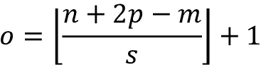

这里，表示*楼层*运行。

**楼层操作**

floor 运算返回等于或小于输入的最大整数，例如:

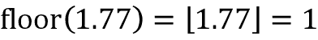

考虑以下两种情况:

*   Compute the output size for an input vector of size 10 with a convolution kernel of size 5, padding 2, and stride 1:

    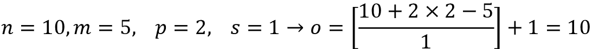

    (注意，在这种情况下，输出大小与输入大小相同；因此，我们可以断定这是相同的填充模式。)

*   How does the output size change for the same input vector when we have a kernel of size 3 and stride 2?

    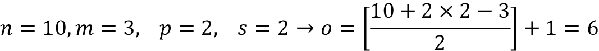

如果你有兴趣了解更多关于卷积输出大小的信息，我们推荐由*文森特·杜穆林*和*弗朗切斯科·维辛*撰写的手稿*深度学习卷积算法指南*，可以在[https://arxiv.org/abs/1603.07285](https://arxiv.org/abs/1603.07285)免费获得。

最后，为了让了解如何计算一维卷积，下面的代码块显示了一个简单的实现，并将结果与`numpy.convolve`函数进行了比较。代码如下:

```
>>> import numpy as np

>>> def conv1d(x, w, p=0, s=1):

...     w_rot = np.array(w[::-1])

...     x_padded = np.array(x)

...     if p > 0:

...         zero_pad = np.zeros(shape=p)

...         x_padded = np.concatenate([

...             zero_pad, x_padded, zero_pad

...         ])

...     res = []

...     for i in range(0, int((len(x_padded) - len(w_rot))) + 1, s):

...         res.append(np.sum(x_padded[i:i+w_rot.shape[0]] * w_rot))

...     return np.array(res)

>>> ## Testing:

>>> x = [1, 3, 2, 4, 5, 6, 1, 3]

>>> w = [1, 0, 3, 1, 2]

>>> print('Conv1d Implementation:',

...       conv1d(x, w, p=2, s=1))

Conv1d Implementation: [ 5\. 14\. 16\. 26\. 24\. 34\. 19\. 22.]

>>> print('NumPy Results:',

...       np.convolve(x, w, mode='same'))

NumPy Results: [ 5 14 16 26 24 34 19 22] 
```

到目前为止，我们主要关注向量的卷积(1D 卷积)。为了使概念更容易理解，我们从 1D 的例子开始。在下一节中，我们将更详细地介绍 2D 卷积，它是用于图像相关任务的 CNN 的构造块。

### 在 2D 执行离散卷积

你在前面几节学到的概念很容易扩展到 2D。当我们处理 2D 输入时，例如矩阵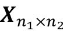和滤波器矩阵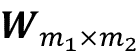，其中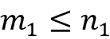和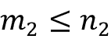，那么矩阵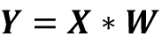是 **X** 和 **W** 之间的 2D 卷积的结果。这在数学上定义如下:

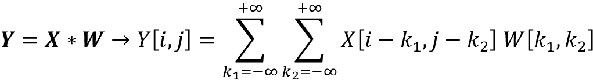

请注意，如果您省略其中一个维度，剩下的公式与我们之前在 1D 计算卷积时使用的公式完全相同。事实上，所有前面提到的技术，例如零填充、旋转滤波器矩阵和使用步长，也适用于 2D 卷积，只要它们独立地扩展到两个维度。*图 14.5* 展示了使用 3×3 核的 8×8 输入矩阵的 2D 卷积。输入矩阵用零填充，p = 1。结果，2D 卷积的输出将具有 8×8 的大小:


图 14.5:2D 卷积的输出

以下示例说明了输入矩阵 **X** [3×3] 和核矩阵 **W** [3×3] 之间的 2D 卷积的计算，使用填充 *p* = (1，1)和步长 *s* = (2，2)。根据指定的填充，在输入矩阵的每一侧添加一层零，这产生了填充矩阵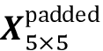，如下所示:

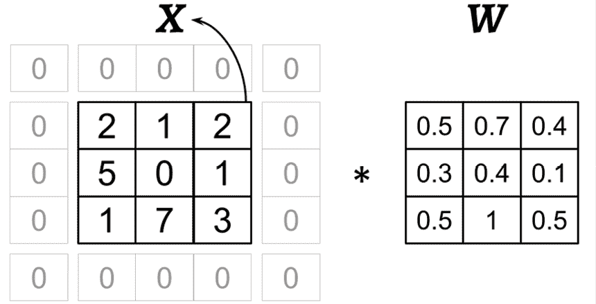

图 14.6:计算输入和核矩阵之间的 2D 卷积

使用前面的滤镜，旋转后的滤镜将为:

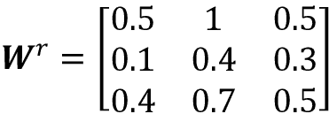

注意，这种旋转不同于转置矩阵。为了在 NumPy 中得到旋转的过滤器，我们可以写`W_rot=W[::-1,::-1]`。接下来，我们可以像滑动窗口一样，沿着填充的输入矩阵**X**填充的移动旋转后的滤波器矩阵，并计算元素乘积的和，这由图 14.7 中的*运算符表示:*

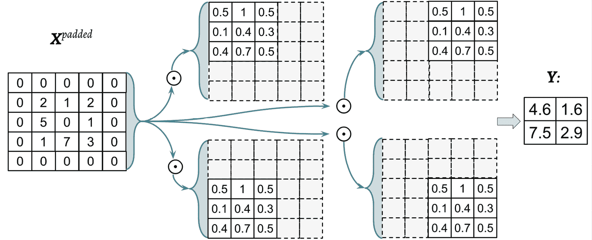

图 14.7:计算元素乘积的和

结果将是 2×2 矩阵， **Y** 。

让我们也根据描述的*朴素*算法实现2D 卷积。`scipy.signal`包提供了一种通过`scipy.signal.convolve2d`函数计算 2D 卷积的方法:

```
>>> import numpy as np

>>> import scipy.signal

>>> def conv2d(X, W, p=(0, 0), s=(1, 1)):

...     W_rot = np.array(W)[::-1,::-1]

...     X_orig = np.array(X)

...     n1 = X_orig.shape[0] + 2*p[0]

...     n2 = X_orig.shape[1] + 2*p[1]

...     X_padded = np.zeros(shape=(n1, n2))

...     X_padded[p[0]:p[0]+X_orig.shape[0],

...              p[1]:p[1]+X_orig.shape[1]] = X_orig

...

...     res = []

...     for i in range(0,

...             int((X_padded.shape[0] - \

...             W_rot.shape[0])/s[0])+1, s[0]):

...         res.append([])

...         for j in range(0,

...                 int((X_padded.shape[1] - \

...                 W_rot.shape[1])/s[1])+1, s[1]):

...             X_sub = X_padded[i:i+W_rot.shape[0],

...                              j:j+W_rot.shape[1]]

...             res[-1].append(np.sum(X_sub * W_rot))

...     return(np.array(res))

>>> X = [[1, 3, 2, 4], [5, 6, 1, 3], [1, 2, 0, 2], [3, 4, 3, 2]]

>>> W = [[1, 0, 3], [1, 2, 1], [0, 1, 1]]

>>> print('Conv2d Implementation:\n',

...       conv2d(X, W, p=(1, 1), s=(1, 1)))

Conv2d Implementation:

[[ 11\.  25\.  32\.  13.]

 [ 19\.  25\.  24\.  13.]

 [ 13\.  28\.  25\.  17.]

 [ 11\.  17\.  14\.   9.]]

>>> print('SciPy Results:\n',

...       scipy.signal.convolve2d(X, W, mode='same'))

SciPy Results:

[[11 25 32 13]

 [19 25 24 13]

 [13 28 25 17]

 [11 17 14  9]] 
```

**计算卷积的高效算法**

为了理解这些概念，我们提供了一个简单的实现来计算 2D 卷积。然而，就存储器需求和计算复杂性而言，这种实现是非常低效的。因此，它不应用于现实世界的神经网络应用程序。

一个方面是，在 PyTorch 等大多数工具中，滤镜矩阵实际上是不旋转的。此外，近年来，已经开发了使用傅立叶变换来计算卷积的更有效的算法。同样重要的是要注意，在 NNs 的上下文中，卷积核的大小通常比输入图像的大小小得多。

例如，现代 CNN 通常使用诸如 1×1、3×3 或 5×5 的核大小，针对这些核大小，已经设计了可以更有效地执行卷积运算的有效算法，例如 Winograd 的最小滤波算法。这些算法超出了本书的范围，但如果你有兴趣了解更多，可以阅读 2015 年*安德鲁·拉文*和*斯科特·格雷*的手稿*卷积神经网络*快速算法，在[https://arxiv.org/abs/1509.09308](https://arxiv.org/abs/1509.09308)可以免费获得。

在下一节中，我们将讨论子采样或池，这是 CNN 中经常使用的另一个重要操作。

## 子采样层

子采样通常应用于 CNN 中两种形式的池操作:**最大池**和**平均池**(也称为**平均池**)。池层通常用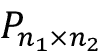表示。这里，下标决定了执行最大值或平均值运算的邻域的大小(每个维度中相邻像素的数量)。我们将这样的邻域称为、**池大小**。

操作在*图 14.8* 中描述。这里，最大池从像素邻域中取最大值，平均值池计算它们的平均值:

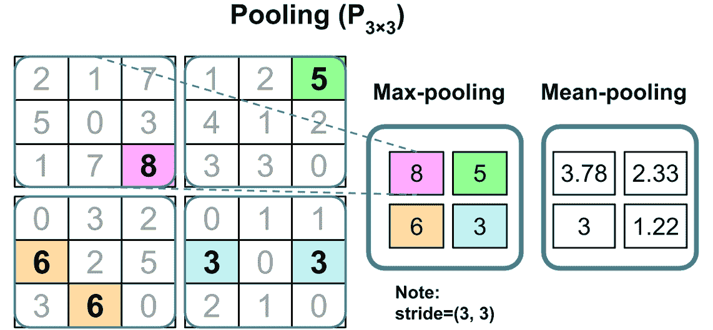

图 14.8:最大池和平均池的例子

合用的优势有两个:

*   Pooling (max-pooling) introduces a local invariance. This means that small changes in a local neighborhood do not change the result of max-pooling. Therefore, it helps with generating features that are more robust to noise in the input data. Refer to the following example, which shows that the max-pooling of two different input matrices, **X**[1] and **X**[2], results in the same output:

    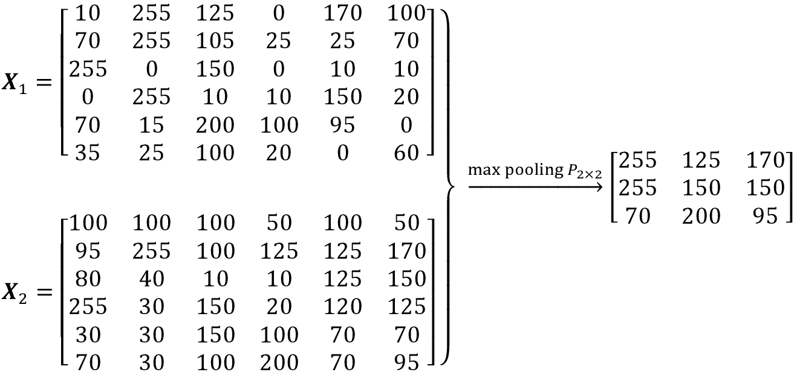

*   池减小了特征的大小，从而提高了计算效率。此外，减少特征的数量也可以减少过度拟合的程度。

**重叠与非重叠池**

传统上，池被假定为非重叠的。池化通常在非重叠的邻域上执行，这可以通过将 stride 参数设置为等于池化大小来实现。例如，一个非重叠的池层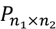，需要一个步距参数*s*=(*n*1， *n* [2] )。另一方面，如果步幅小于池大小，则会发生重叠池。由 *A. Krizhevsky* 、 *I. Sutskever* 和 *G. Hinton* 于 2012 年在*ImageNet Classification with Deep convolution Neural Networks*中描述了在卷积网络中使用重叠池的示例，该示例可在[https://papers . nips . cc/paper/4824-ImageNet-Classification-with-Deep-convolutionary-Neural-Networks](https://papers.nips.cc/paper/4824-imagenet-classification-with-deep-convolutional-neural-networks)上免费获得。

虽然池仍然是许多 CNN 体系结构的基本部分，但是也已经开发了一些不使用池层的 CNN 体系结构。研究人员使用步幅为 2 的卷积层，而不是使用池层来减小特征尺寸。

在某种意义上，您可以将步长为 2 的卷积层视为具有可学习权重的池层。如果您对使用和不使用池层开发的不同 CNN 架构的经验比较感兴趣，我们推荐阅读研究文章*力求简单:所有卷积网络*作者*约斯特·托拜厄斯·斯普林根贝格*、*阿列克谢·多索维茨基*、*托马斯·布罗克斯*和*马丁·里德米勒*。这篇文章可以在 https://arxiv.org/abs/1412.6806[免费获得。](https://arxiv.org/abs/1412.6806)

# 将所有东西放在一起——实现 CNN

到目前为止，你已经了解了 CNN 的基本组成部分。本章阐述的概念并不比传统的多层神经网络更难。我们可以说，传统神经网络中最重要的运算是矩阵乘法。例如，我们使用矩阵乘法来计算预激活(或净输入)，如 **z** = **Wx** + *b* 。这里， **x** 是表示像素的列向量(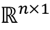矩阵)，而 **W** 是将像素输入连接到每个隐藏单元的权重矩阵。

在 CNN 中，这一操作被卷积操作所取代，如在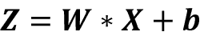中，其中 **X** 是一个矩阵，表示在*高度* × *宽度*排列中的像素。在这两种情况下，预激活被传递给激活函数以获得隐藏单元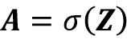的激活，其中是激活函数。此外，您还记得二次采样是 CNN 的另一个组成部分，它可能以池的形式出现，如前一节所述。

## 使用多个输入或颜色通道

卷积层的输入可以包含一个或多个 2D 阵列或矩阵，其尺寸为*N*[1]×*N*[2](例如，以像素为单位的图像高度和宽度)。这些*N*[1]×*N*[2]矩阵称为*通道*。卷积层的传统实现期望秩为 3 的张量表示作为输入，例如，三维数组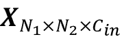，其中中的*C*是输入通道的数量。例如，让我们考虑将图像输入到 CNN 的第一层。如果图像是彩色的并且使用 RGB 颜色模式，那么中的*C*= 3(用于 RGB 中的红色、绿色和蓝色通道)。然而，如果图像是灰度的，那么我们有 *C* [ in ] = 1，因为只有一个通道具有灰度像素强度值。

**读取图像文件**

当我们处理图像时，我们可以使用`uint8`(无符号 8 位整数)数据类型将图像读入 NumPy 数组，以减少内存使用，例如，与 16 位、32 位或 64 位整数类型相比。

无符号 8 位整数取值范围为[0，255]，足以存储 RGB 图像中的像素信息，RGB 图像也取相同范围内的值。

在*第十二章*、*用 PyTorch* 并行化神经网络训练中，你看到 PyTorch 提供了一个通过`torchvision`加载/存储和操作图像的模块。让我们回顾一下如何读取图像(本示例 RGB 图像位于本章提供的代码包文件夹中):

```
>>> import torch

>>> from torchvision.io import read_image

>>> img = read_image('example-image.png')

>>> print('Image shape:', img.shape)

Image shape: torch.Size([3, 252, 221])

>>> print('Number of channels:', img.shape[0])

Number of channels: 3

>>> print('Image data type:', img.dtype)

Image data type: torch.uint8

>>> print(img[:, 100:102, 100:102])

tensor([[[179, 182],

         [180, 182]],

        [[134, 136],

         [135, 137]],

        [[110, 112],

         [111, 113]]], dtype=torch.uint8) 
```

注意使用`torchvision`，输入和输出图像张量是`Tensor[channels, image_height, image_width]`的格式。

现在您已经熟悉了输入数据的结构，下一个问题是，我们如何将多个输入通道合并到我们在前面章节中讨论的卷积运算中？答案非常简单:我们分别对每个通道执行卷积运算，然后使用矩阵求和将结果相加。与每个通道( *c* )相关联的卷积具有其自己的内核矩阵，如 *W* [:，:， *c* ]。

总预激活结果通过以下公式计算:

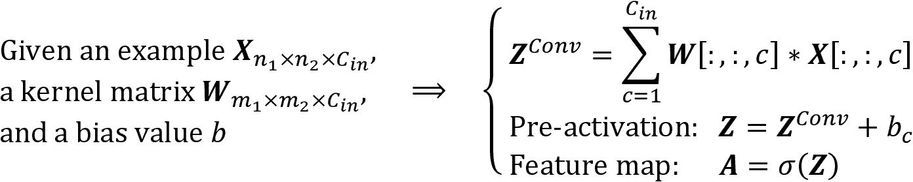

最后的结果， **A** ，就是一张特征图。通常，CNN 的卷积层具有不止一个特征图。如果使用多个特征图，核张量就变成四维:*宽度* × *高度*×*C*[in]×*C*[out]。这里，*宽度* × *高度*为内核大小，中的*C*为输入通道数，*C*out 为输出特征图数。因此，现在让我们将输出要素地图的数量包括在前面的公式中并进行更新，如下所示:

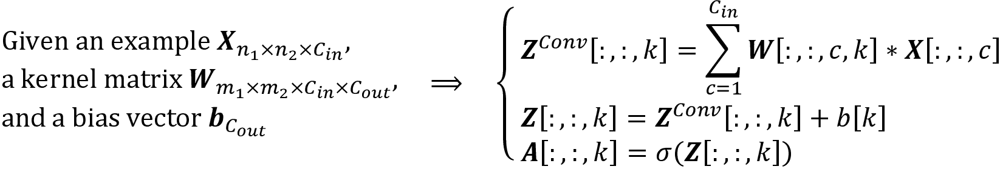

为了结束我们在 NNs 环境中计算卷积的讨论，让我们看一下*图 14.9* 中的例子，它显示了一个卷积层，后面是一个池层。在本例中，有三个输入通道。核张量是四维的。每个核矩阵表示为*m*[1]×*m*[2]，共有三个，每个输入通道一个。此外，有五个这样的核，占五个输出特征图。最后，还有一个用于对要素地图进行二次采样的池图层:

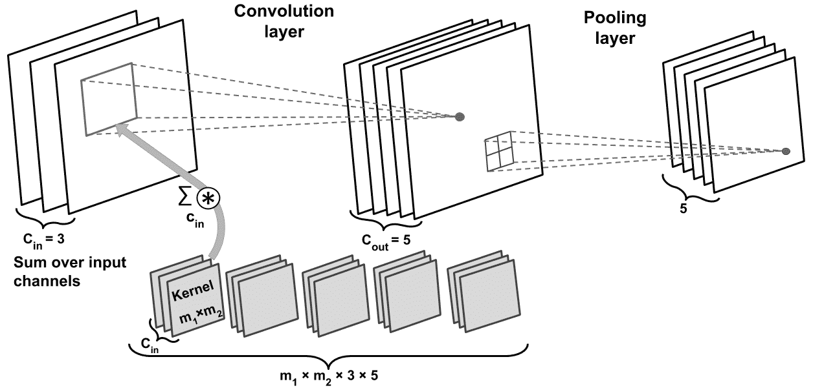

图 14.9:实现 CNN

**在前面的例子中有多少可训练参数？**

为了说明卷积、参数共享和稀疏连接的优势，我们来看一个例子。*图 14.9* 所示网络中的卷积层是一个四维张量。所以，有*m*[1]×*m*[2]×3×5 个参数与内核相关联。此外，卷积层的每个输出特征图都有一个偏差向量。因此，偏移向量的大小是 5。池层没有任何(可训练的)参数；因此，我们可以这样写:

*m*1×*m*2×3×5+5

如果输入张量的大小为*n*[1]×*n*[2]×3，假设卷积以相同填充模式进行，那么输出特征图的大小将为*n*[1]×*n*[2]×5。

注意，如果我们用全连接层代替卷积层，这个数字会大很多。在全连接图层的情况下，权重矩阵达到相同数量的输出单元的参数数量如下:

(*n*[1]×*n*[2]×3)×(*n*[1]×12】n×14】2×5)=(*n*×18】1×*n*[2【T23)²×3]

另外，偏置向量的大小为*n*[1]×*n*[2]×5(每个输出单元一个偏置元素)。鉴于*m*[1]<*n*[1]和*m*[2]<*n*[2]，我们可以看到可训练参数的数量差异是显著的。

最后，如已经提到的，卷积运算通常通过将具有多个颜色通道的输入图像作为矩阵的堆叠来进行；也就是说，我们分别对每个矩阵执行卷积，然后将结果相加，如上图所示。然而，如果您正在处理 3D 数据集，卷积也可以扩展到 3D 体积，例如，如 2015 年由*丹尼尔·马图拉纳*和*塞巴斯蒂安·舍雷尔*撰写的论文 *VoxNet:用于实时对象识别的 3D 卷积神经网络*中所示，该论文可以在[https://www . ri . CMU . edu/pub _ files/2015/9/vox net _ Maturana _ Scherer _ iros 15 . pdf](https://www.ri.cmu.edu/pub_files/2015/9/voxnet_maturana_scherer_iros15.pdf)中访问。

在下一节，我们将讨论如何正则化一个神经网络。

## 用 L2 正则化和舍弃正则化神经网络

选择网络的大小，无论我们是在处理传统的(全连接)神经网络还是 CNN，一直是一个具有挑战性的问题。例如，需要调整权重矩阵的大小和层数，以实现合理的良好性能。

您可能还记得*第 13 章*、*更深入——py torch*的机制，没有隐藏层的简单网络只能捕捉线性决策边界，这不足以处理异或(或异或)或类似问题。网络的*容量*指的是它可以学习逼近的函数的复杂程度。小型网络，或参数数量相对较少的网络，容量较低，因此可能*不足*，导致性能不佳，因为它们无法学习复杂数据集的底层结构。然而，非常大的网络可能会导致*过拟合*，此时网络会记住训练数据，在训练数据集上表现非常好，而在保留的测试数据集上表现不佳。当我们处理现实世界的机器学习问题时，我们事先并不知道网络应该有多大。

解决此问题的一种方法是构建一个容量相对较大的网络(实际上，我们希望选择比所需容量稍大的容量)，以便在训练数据集上表现良好。然后，为了防止过度拟合，我们可以应用一个或多个正则化方案来实现对新数据(如保留测试数据集)的良好泛化性能。

在第 3 章和第 4 章中，我们讨论了 L1 和 L2 的正规化。这两种技术都可以通过在训练期间对导致权重参数收缩的损失增加惩罚来防止或减少过度拟合的影响。虽然 L1 和 L2 正则化也可用于神经网络，L2 是两者中更常见的选择，但还有其他正则化神经网络的方法，如我们在本节中讨论的辍学。但在我们继续讨论丢失之前，要在卷积或全连接网络中使用 L2 正则化(回想一下，全连接层是通过 PyTorch 中的`torch.nn.Linear`实现的)，您可以简单地将特定层的 L2 惩罚添加到 PyTorch 中的损失函数，如下所示:

```
>>> import torch.nn as nn

>>> loss_func = nn.BCELoss()

>>> loss = loss_func(torch.tensor([0.9]), torch.tensor([1.0]))

>>> l2_lambda = 0.001

>>> conv_layer = nn.Conv2d(in_channels=3,

...                        out_channels=5,

...                        kernel_size=5)

>>> l2_penalty = l2_lambda * sum(

...     [(p**2).sum() for p in conv_layer.parameters()]

... )

>>> loss_with_penalty = loss + l2_penalty

>>> linear_layer = nn.Linear(10, 16)

>>> l2_penalty = l2_lambda * sum(

...     [(p**2).sum() for p in linear_layer.parameters()]

... )

>>> loss_with_penalty = loss + l2_penalty 
```

**权重衰减与 L2 正则化**

使用 L2 正则化的另一种方法是通过将 PyTorch 优化器中的`weight_decay`参数设置为正值，例如:

```
optimizer = torch.optim.SGD(

    model.parameters(),

    weight_decay=l2_lambda,

    ...

) 
```

虽然 L2 正则化和`weight_decay`并不严格相同，但在使用**随机梯度下降** ( **SGD** )优化器时，可以证明它们是等价的。感兴趣的读者可以在 2019 年*伊利亚* *洛希洛夫*和*弗兰克* *胡特*的文章*解耦权重衰减正则化*中找到更多信息，该文章可在[https://arxiv.org/abs/1711.05101](https://arxiv.org/abs/1711.05101)免费获取。

近年来， **dropout** 已经成为一种用于正则化(深度)神经网络以避免过度拟合的流行技术，从而提高了泛化性能( *Dropout:一种防止神经网络过度拟合的简单方法*作者 *N. Srivastava* 、 *G. Hinton* 、 *A. Krizhevsky* 、 *I. Sutskever* 和*r . Salakhutdinov【4】丢弃通常应用于较高层的隐藏单元，其工作方式如下:在 NN 的训练阶段，在每次迭代中，以概率 *p* [drop] (或保持概率*p*[keep]= 1-*p*[drop])随机丢弃一部分隐藏单元。这种丢失概率由用户决定，常见的选择是 *p* = 0.5，如之前提到的 2014 年 Nitish Srivastava*等人的文章所述。当丢弃输入神经元的某一部分时，与剩余神经元相关联的权重被重新调整，以考虑丢失(丢弃)的神经元。**

这种随机丢失的影响是网络被迫学习数据的冗余表示。因此，网络不能依赖于任何一组隐藏单元的激活，因为它们可能在训练期间的任何时候被关闭，并且被迫从数据中学习更一般和鲁棒的模式。

这种随机剔除可以有效防止过拟合。*图 14.10* 显示了一个在训练阶段应用概率 *p* = 0.5 的丢弃的例子，其中一半的神经元将随机变为不活动(丢弃的单元在训练的每个前向通道中随机选择)。然而，在预测期间，所有神经元都将有助于计算下一层的预激活:

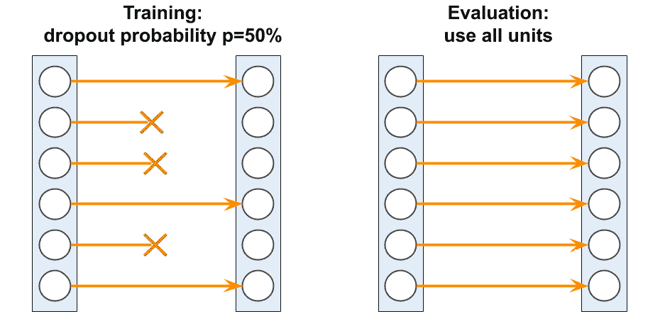

图 14.10:在培训阶段应用辍学

如此处所示，需要记住的重要一点是，单元可能仅在训练期间随机下降，而对于评估(推断)阶段，所有隐藏的单元必须是活动的(例如， *p* [下降] = 0 或 *p* [保持] = 1)。为了确保在训练和预测期间整体激活处于相同的规模，必须适当地缩放活动神经元的激活(例如，如果退出概率被设置为 *p* = 0.5，则通过将激活减半)。

然而，由于在进行预测时总是缩放激活是不方便的，PyTorch 和其他工具在训练期间缩放激活(例如，如果退出概率被设置为 *p* = 0.5，则通过加倍激活)。这种方法通常被称为*逆辍学*。

虽然这种关系并不明显，但退出可以被解释为所有模型的共识(平均)。正如在*第七章*、*中讨论的，结合不同的模型进行集成学习*，在集成学习中，我们独立训练几个模型。在预测过程中，我们使用所有已训练模型的共识。我们已经知道模型集合比单一模型表现更好。然而，在深度学习中，训练几个模型并收集和平均多个模型的输出在计算上是昂贵的。在这里，dropout 提供了一种变通方法，一次训练许多模型并在测试或预测时计算它们的平均预测值的有效方法。

如前所述，模联和辍学之间的关系并不明显。但是，考虑到在 dropout 中，我们对每个小批量有不同的模型(由于在每次向前传递时将权重随机设置为零)。

然后，通过对小批量进行迭代，我们实质上对 *M* = 2 ^h 模型进行采样，其中 *h* 是隐藏单元的数量。

然而，将辍学与常规集合区分开来的限制和方面是，我们在这些“不同的模型”上共享权重，这可以被视为一种正则化形式。然后，在“推断”期间(例如，预测测试数据集中的标签)，我们可以对我们在训练期间采样的所有这些不同的模型进行平均。不过，这很贵。

然后，平均模型，即计算由模型返回的类成员概率的几何平均值， *i* ，可以计算如下:

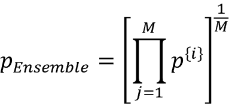

现在，辍学背后的技巧是，模型集合(这里是 *M* 模型)的几何均值可以通过将训练期间采样的最后(或最终)模型的预测缩放 1/(1-*p*的因子来近似，这比使用前面的等式显式计算几何均值便宜得多。(实际上，如果我们考虑线性模型，近似与真正的几何平均是完全等价的。)

## 分类损失函数

在*第十二章*、*用 PyTorch* 并行化神经网络训练中，我们看到了不同的激活函数，比如 ReLU、sigmoid、tanh。其中一些激活函数，如 ReLU，主要用于神经网络的中间(隐藏)层，以增加模型的非线性。但是其他的，像 sigmoid(对于二进制)和 softmax(对于多类)被添加到最后(输出)层，这导致类成员概率作为模型的输出。如果 sigmoid 或 softmax 激活未包含在输出图层中，则模型将计算 logits 而不是类成员概率。

这里关注分类问题，根据问题的类型(二进制对多类)和输出的类型(逻辑对概率)，我们应该选择合适的损失函数来训练我们的模型。**二元交叉熵**是二元分类的损失函数(具有单个输出单元)，而**范畴交叉熵**是多类分类的损失函数。在`torch.nn`模块中，分类交叉熵损失以整数形式接受基本事实标签(例如， *y* =2，来自三个类，0、1 和 2)。

*图 14.11* 描述了`torch.nn`中可用于处理两种情况的两个损失函数:二分类和带有整数标签的多类。这两个损失函数中的每一个也可以选择接收逻辑或类别成员概率形式的预测:


图 14.11:py torch 中损失函数的两个例子

请注意，由于数值稳定性的原因，通过提供对数而不是类成员概率来计算交叉熵损失通常是优选的。对于二进制分类，我们可以提供逻辑值作为损失函数`nn.BCEWithLogitsLoss()`的输入，或者基于逻辑值计算概率并将其提供给损失函数`nn.BCELoss()`。对于多类分类，我们可以提供对数作为损失函数`nn.CrossEntropyLoss()`的输入，或者根据对数计算对数概率，并将其输入负对数似然损失函数`nn.NLLLoss()`。

以下代码将向您展示如何使用两种不同格式的损失函数，其中逻辑值或类别成员概率作为损失函数的输入给出:

```
>>> ####### Binary Cross-entropy

>>> logits = torch.tensor([0.8])

>>> probas = torch.sigmoid(logits)

>>> target = torch.tensor([1.0])

>>> bce_loss_fn = nn.BCELoss()

>>> bce_logits_loss_fn = nn.BCEWithLogitsLoss()

>>> print(f'BCE (w Probas): {bce_loss_fn(probas, target):.4f}')

BCE (w Probas): 0.3711

>>> print(f'BCE (w Logits): '

...       f'{bce_logits_loss_fn(logits, target):.4f}')

BCE (w Logits): 0.3711

>>> ####### Categorical Cross-entropy

>>> logits = torch.tensor([[1.5, 0.8, 2.1]])

>>> probas = torch.softmax(logits, dim=1)

>>> target = torch.tensor([2])

>>> cce_loss_fn = nn.NLLLoss()

>>> cce_logits_loss_fn = nn.CrossEntropyLoss()

>>> print(f'CCE (w Probas): '

...       f'{cce_logits_loss_fn(logits, target):.4f}')

CCE (w Probas): 0.5996

>>> print(f'CCE (w Logits): '

...       f'{cce_loss_fn(torch.log(probas), target):.4f}')

CCE (w Logits): 0.5996 
```

请注意，有时，您可能会遇到一种使用类别交叉熵损失进行二进制分类的实现。通常，当我们有一个二进制分类任务时，模型为每个示例返回一个输出值。我们把这个单一模型的输出解释为正类的概率(例如类 1)， *P* (类= 1| **x** )。在一个二元分类问题中，隐含着*P*(class = 0 |**x**)= 1—*P*(class = 1 |**x**)；因此，我们不需要第二个输出单元来获得负类的概率。然而，有时实践者选择为每个训练示例返回两个输出，并将它们解释为每个类的概率: *P* (class = 0| **x** )对 *P* (class = 1| **x** )。然后，在这种情况下，建议使用 softmax 函数(而不是逻辑 sigmoid)来归一化输出(以便它们的总和为 1)，分类交叉熵是合适的损失函数。

# 使用 PyTorch 实现深度 CNN

在第十三章的*中，你可能还记得，我们使用`torch.nn`模块解决了手写数字识别问题。您可能还记得，我们使用具有两个线性隐藏层的神经网络实现了大约 95.6%的准确性。*

现在，让我们实现一个 CNN，看看它是否能比以前的手写数字分类模型获得更好的预测性能。请注意，我们在第 13 章中看到的全连接层能够很好地解决这个问题。然而，在一些应用中，例如从手写数字中读取银行账号，即使是微小的错误也可能代价高昂。因此，尽可能减少这种误差至关重要。

## 多层 CNN 架构

我们将要实现的网络架构如图*图 14.12* 所示。输入是 28×28 灰度图像。考虑到通道数(灰度图像为 1)和一批输入图像，输入张量的维数将为 *batchsize* ×28×28×1。

输入数据经过两个内核大小为 5×5 的卷积层。第一个卷积有 32 个输出特征图，第二个卷积有 64 个输出特征图。每个卷积层之后是以最大池操作形式的子采样层， *P* [2×2] 。然后，全连接层将输出传递到第二个全连接层，该层充当最终的 *softmax* 输出层。我们将要实施的网络架构如图*图 14.12* 所示:

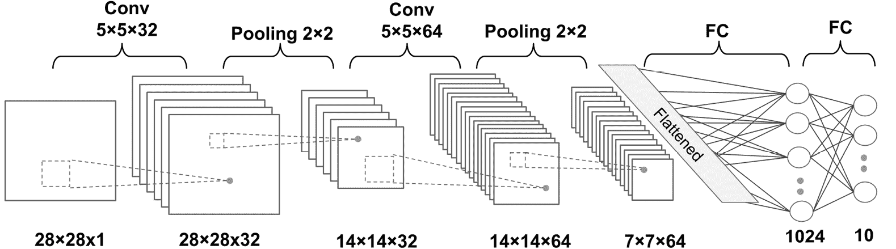

图 14.12:深度 CNN

每层张量的维数如下:

*   输入:[*批处理大小*x 28×28×1]
*   conv _ 1:[*batch size*x 28×28×32]
*   pooling _ 1:[*batch size*×14×14×32]
*   conv _ 2:[*batch size*x 14×14×64]
*   pooling _ 2:[*batch size*×7×7×64]
*   fc _ 1:[*batch size*x 1024]
*   FC_2 和 softmax 层:[ *batchsize* ×10]

对于卷积核，我们正在使用`stride=1`，使得输入维度保留在结果特征图中。对于汇集图层，我们使用`kernel_size=2`对图像进行二次采样，并缩小输出特征地图的大小。我们将使用 PyTorch NN 模块实现这个网络。

## 加载和预处理数据

首先，我们将使用`torchvision`模块加载 MNIST 数据集，并构建训练和测试集，正如我们在*第 13 章*中所做的:

```
>>> import torchvision

>>> from torchvision import transforms

>>> image_path = './'

>>> transform = transforms.Compose([

...     transforms.ToTensor()

... ])

>>> mnist_dataset = torchvision.datasets.MNIST(

...     root=image_path, train=True,

...     transform=transform, download=True

... )

>>> from torch.utils.data import Subset

>>> mnist_valid_dataset = Subset(mnist_dataset,

...                              torch.arange(10000))

>>> mnist_train_dataset = Subset(mnist_dataset,

...                              torch.arange(

...                                  10000, len(mnist_dataset)

...                              ))

>>> mnist_test_dataset = torchvision.datasets.MNIST(

...     root=image_path, train=False,

...     transform=transform, download=False

... ) 
```

MNIST 数据集带有预先指定的训练和测试数据集分区方案，但我们也希望从训练分区创建一个验证分割。因此，我们使用前 10，000 个训练样本进行验证。注意，这些图像没有按照类标签排序，所以我们不必担心这些验证集图像是否来自同一个类。

接下来，我们将为训练集和验证集分别构建包含 64 幅图像的数据加载器:

```
>>> from torch.utils.data import DataLoader

>>> batch_size = 64

>>> torch.manual_seed(1)

>>> train_dl = DataLoader(mnist_train_dataset,

...                       batch_size,

...                       shuffle=True)

>>> valid_dl = DataLoader(mnist_valid_dataset,

...                       batch_size,

...                       shuffle=False) 
```

我们读取的特征的值在范围[0，1]内。此外，我们已经将图像转换为张量。标签是从 0 到 9 的整数，代表十个数字。因此，我们不需要做任何缩放或进一步的转换。

现在，在准备好数据集之后，我们准备好实现我们刚刚描述的 CNN。

## 使用 torch.nn 模块实现 CNN

为了在 PyTorch 中实现一个 CNN，我们使用`torch.nn` `Sequential`类来堆叠不同的层，比如卷积、池化和丢弃，以及完全连接的层。`torch.nn`模块为每一个提供了类:`nn.Conv2d`为二维卷积层；`nn.MaxPool2d`和`nn.AvgPool2d`用于二次抽样(最大池和平均池)；和`nn.Dropout`用于使用丢失的正则化。我们将更详细地讨论每一个类。

### 在 PyTorch 中配置 CNN 图层

用`Conv2d`类构造一个层需要我们指定输出通道的数量(相当于输出特征图的数量，或者输出滤镜的数量)和内核大小。

此外，我们还可以使用可选参数来配置卷积层。最常用的是步幅(在 *x* 、 *y* 维度中默认值均为 1)和填充，它控制两个维度上的隐式填充量。其他配置参数在官方文档中列出:[https://py torch . org/docs/stable/generated/torch . nn . conv2d . html](https://pytorch.org/docs/stable/generated/torch.nn.Conv2d.html)。

值得一提的是，通常，当我们读取图像时，通道的默认维度是张量阵列的第一维度(或者考虑到批量维度的第二维度)。这被称为 NCHW 格式，其中 *N* 代表批中图像的数量， *C* 代表通道， *H* 和 *W* 分别代表高度和宽度。

注意，`Conv2D`类默认假设输入是 NCHW 格式的。(其他工具，如 TensorFlow，使用 NHWC 格式。)但是，如果您遇到一些通道位于最后一个维度的数据，您将需要交换数据中的轴，以将通道移动到第一个维度(或第二个维度，考虑到批处理维度)。层构造好后，可以通过提供一个四维张量来调用，第一维留给一批例子；第二维对应于通道；另外两个维度是空间维度。

如我们要构建的 CNN 模型的架构所示，每个卷积层后面都有一个用于子采样的池层(减少特征图的大小)。`MaxPool2d`和`AvgPool2d`类分别构建最大池和平均池层。`kernel_size`参数决定了用于计算最大值或平均值运算的窗口(或邻域)的大小。此外，正如我们前面讨论的那样，`stride`参数可以用来配置池层。

最后，`Dropout`类将构造正则化的丢弃层，参数`p`表示丢弃概率*p*drop，它用于确定训练期间丢弃输入单元的概率，正如我们前面所讨论的。当调用该层时，可以通过`model.train()`和`model.eval()`控制其行为，以指定该调用是在训练过程中进行还是在推理过程中进行。使用 dropout 时，在这两种模式之间交替对于确保其正确运行至关重要；例如，节点只是在训练过程中被随机删除，而不是评估或推断。

### 在 PyTorch 中构建 CNN

现在你已经了解了这些类的，我们可以构建上图所示的 CNN 模型。在下面的代码中，我们将使用`Sequential`类并添加卷积和池层:

```
>>> model = nn.Sequential()

>>> model.add_module(

...     'conv1',

...     nn.Conv2d(

...         in_channels=1, out_channels=32,

...         kernel_size=5, padding=2

...     )

... )

>>> model.add_module('relu1', nn.ReLU())

>>> model.add_module('pool1', nn.MaxPool2d(kernel_size=2))

>>> model.add_module(

...     'conv2',

...     nn.Conv2d(

...         in_channels=32, out_channels=64,

...         kernel_size=5, padding=2

...     )

... )

>>> model.add_module('relu2', nn.ReLU())

>>> model.add_module('pool2', nn.MaxPool2d(kernel_size=2)) 
```

到目前为止，我们已经为模型添加了两个卷积层。对于每个卷积层，我们使用大小为 5×5 的核和`padding=2`。如前所述，使用相同的填充模式保留了特征图的空间维度(垂直和水平维度)，使得输入和输出具有相同的高度和宽度(并且通道的数量可能仅在所使用的滤波器的数量方面有所不同)。如前所述，输出要素地图的空间维度计算如下:

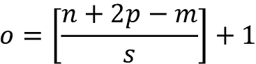

其中 *n* 是输入特征图的空间维度， *p* 、 *m* 和 *s* 分别表示填充、内核大小和步幅。我们得到 *p* = 2 是为了实现 *o* = *i* 。

池大小为 2×2、跨度为 2 的最大池层会将空间维度减少一半。(注意，如果在`MaxPool2D`中没有指定`stride`参数，默认情况下，它被设置为等于池内核大小。)

虽然我们可以在这个阶段手动计算特征图的大小，但是 PyTorch 为我们提供了一个方便的计算方法:

```
>>> x = torch.ones((4, 1, 28, 28))

>>> model(x).shape

torch.Size([4, 64, 7, 7]) 
```

通过将输入的形状作为元组`(4, 1, 28, 28)`(批中的 4 个图像，1 个通道，图像大小 28×28)提供，我们计算出输出具有形状`(4, 64, 7, 7)`，指示具有 64 个通道和 7×7 空间大小的特征图。第一个维度对应于批处理维度，对此我们任意使用 4。

我们要添加的下一层是一个全连接层，用于在卷积层和池层之上实现分类器。该层的输入必须具有秩 2，即 shape[*batch size*×*input _ units*。因此，我们需要展平先前层的输出，以满足全连接层的这一要求:

```
>>> model.add_module('flatten', nn.Flatten())

>>> x = torch.ones((4, 1, 28, 28))

>>> model(x).shape

torch.Size([4, 3136]) 
```

如输出形状所示，完全连接层的输入尺寸设置正确。接下来，我们将添加两个完全连接的层，中间有一个分离层:

```
>>> model.add_module('fc1', nn.Linear(3136, 1024))

>>> model.add_module('relu3', nn.ReLU())

>>> model.add_module('dropout', nn.Dropout(p=0.5))

>>> model.add_module('fc2', nn.Linear(1024, 10)) 
```

最后一个完全连接的图层名为`'fc2'`，对于 MNIST 数据集中的 10 个类标签，它有 10 个输出单元。在实践中，我们通常使用 sofmax 激活来获得每个输入例子的类成员概率，假设类是互斥的，那么每个例子的概率总和为 1。然而，softmax 函数已经在 PyTorch 的`CrossEntropyLoss`实现内部使用，这就是为什么不需要显式地将它作为一个层添加到上面的输出层之后。下面的代码将为模型创建损失函数和优化器:

```
>>> loss_fn = nn.CrossEntropyLoss()

>>> optimizer = torch.optim.Adam(model.parameters(), lr=0.001) 
```

**Adam 优化器**

注意，在这个实现中，我们使用了`torch.optim.Adam`类来训练 CNN 模型。Adam optimizer 是一种稳健的基于梯度的优化方法，适用于非凸优化和机器学习问题。两个流行的优化方法启发了亚当:`RMSProp`和`AdaGrad`。

Adam 的主要优势在于选择从梯度矩的移动平均值导出的更新步长。请随意阅读手稿中关于亚当优化器的更多信息，*迪德里克·p·金马*和*吉米·巴雷*于 2014 年撰写的*亚当:一种随机优化的方法*。这篇文章可以在 https://arxiv.org/abs/1412.6980 免费获得。

现在，我们可以通过定义以下函数来训练模型:

```
>>> def train(model, num_epochs, train_dl, valid_dl):

...     loss_hist_train = [0] * num_epochs

...     accuracy_hist_train = [0] * num_epochs

...     loss_hist_valid = [0] * num_epochs

...     accuracy_hist_valid = [0] * num_epochs

...     for epoch in range(num_epochs):

...         model.train()

...         for x_batch, y_batch in train_dl:

...             pred = model(x_batch)

...             loss = loss_fn(pred, y_batch)

...             loss.backward()

...             optimizer.step()

...             optimizer.zero_grad()

...             loss_hist_train[epoch] += loss.item()*y_batch.size(0)

...             is_correct = (

...                 torch.argmax(pred, dim=1) == y_batch

...             ).float()

...             accuracy_hist_train[epoch] += is_correct.sum()

...         loss_hist_train[epoch] /= len(train_dl.dataset)

...         accuracy_hist_train[epoch] /= len(train_dl.dataset)

...

...         model.eval()

...         with torch.no_grad():

...             for x_batch, y_batch in valid_dl:

...                 pred = model(x_batch)

...                 loss = loss_fn(pred, y_batch)

...                 loss_hist_valid[epoch] += \

...                     loss.item()*y_batch.size(0)

...                 is_correct = (

...                     torch.argmax(pred, dim=1) == y_batch

...                 ).float()

...                 accuracy_hist_valid[epoch] += is_correct.sum()

...         loss_hist_valid[epoch] /= len(valid_dl.dataset)

...         accuracy_hist_valid[epoch] /= len(valid_dl.dataset)

...

...         print(f'Epoch {epoch+1} accuracy: '

...               f'{accuracy_hist_train[epoch]:.4f} val_accuracy: '

...               f'{accuracy_hist_valid[epoch]:.4f}')

...     return loss_hist_train, loss_hist_valid, \

...            accuracy_hist_train, accuracy_hist_valid 
```

请注意，使用指定的设置进行训练`model.train()`和评估`model.eval()`将自动设置辍学层的模式，并适当地重新调整隐藏单元的比例，因此我们根本不必担心这一点。接下来，我们将训练这个 CNN 模型，并使用我们为监控学习进度而创建的验证数据集:

```
>>> torch.manual_seed(1)

>>> num_epochs = 20

>>> hist = train(model, num_epochs, train_dl, valid_dl)

Epoch 1 accuracy: 0.9503 val_accuracy: 0.9802

...

Epoch 9 accuracy: 0.9968 val_accuracy: 0.9892

...

Epoch 20 accuracy: 0.9979 val_accuracy: 0.9907 
```

一旦完成了 20 个时期的训练，我们就可以看到学习曲线:

```
>>> import matplotlib.pyplot as plt

>>> x_arr = np.arange(len(hist[0])) + 1

>>> fig = plt.figure(figsize=(12, 4))

>>> ax = fig.add_subplot(1, 2, 1)

>>> ax.plot(x_arr, hist[0], '-o', label='Train loss')

>>> ax.plot(x_arr, hist[1], '--<', label='Validation loss')

>>> ax.legend(fontsize=15)

>>> ax = fig.add_subplot(1, 2, 2)

>>> ax.plot(x_arr, hist[2], '-o', label='Train acc.')

>>> ax.plot(x_arr, hist[3], '--<',

...         label='Validation acc.')

>>> ax.legend(fontsize=15)

>>> ax.set_xlabel('Epoch', size=15)

>>> ax.set_ylabel('Accuracy', size=15)

>>> plt.show() 
```

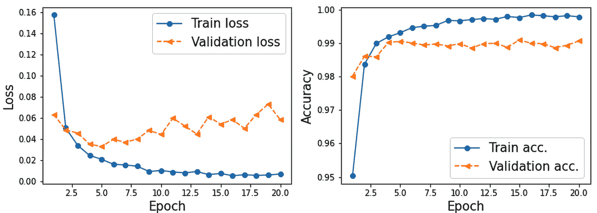

图 14.13:训练和验证数据的损失和准确性图表

现在，我们在测试数据集上评估训练好的模型:

```
>>> pred = model(mnist_test_dataset.data.unsqueeze(1) / 255.)

>>> is_correct = (

...     torch.argmax(pred, dim=1) == mnist_test_dataset.targets

... ).float()

>>> print(f'Test accuracy: {is_correct.mean():.4f}')

Test accuracy: 0.9914 
```

CNN 模型达到了 99.07%的准确率。请记住，在第 13 章中，我们仅使用全连接(而不是卷积)层就获得了大约 95%的准确性。

最后，我们可以得到类别成员概率形式的预测结果，并通过使用`torch.argmax`函数找到具有最大概率的元素，将它们转换为预测标签。我们将对一批 12 个示例执行此操作，并可视化输入和预测标签:

```
>>> fig = plt.figure(figsize=(12, 4))

>>> for i in range(12):

...     ax = fig.add_subplot(2, 6, i+1)

...     ax.set_xticks([]); ax.set_yticks([])

...     img = mnist_test_dataset[i][0][0, :, :]

...     pred = model(img.unsqueeze(0).unsqueeze(1))

...     y_pred = torch.argmax(pred)

...     ax.imshow(img, cmap='gray_r')

...     ax.text(0.9, 0.1, y_pred.item(),

...             size=15, color='blue',

...             horizontalalignment='center',

...             verticalalignment='center',

...             transform=ax.transAxes)

>>> plt.show() 
```

*图 14.14* 显示了手写输入及其预测标签:

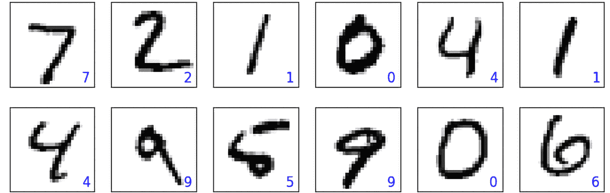

图 14.14:手写数字的预测标签

在这组绘制的示例中，所有预测的标签都是正确的。

我们把展示一些错误分类的数字的任务留给读者，就像我们在第十一章*、*从头实现一个多层人工神经网络*中所做的那样。*

 *# 基于 CNN 的人脸图像微笑分类

在这一部分，我们将使用 CelebA 数据集实现一个 CNN 来对人脸图像进行微笑分类。正如你在第 12 章中看到的，CelebA 数据集包含了 202，599 张名人的面部图像。此外，每张照片有 40 个二元面部属性，包括名人是否微笑以及他们的年龄(年轻还是年老)。

根据您目前所学，本节的目标是建立和训练一个 CNN 模型，用于从这些面部图像中预测微笑属性。这里，为了简单起见，我们将只使用一小部分训练数据(16，000 个训练示例)来加速训练过程。然而，为了提高泛化性能和减少在如此小的数据集上的过度拟合，我们将使用一种叫做**数据扩充**的技术。

## 加载 CelebA 数据集

首先，让我们像在上一节中对 MNIST 数据集所做的那样加载数据。CelebA 数据分为三部分:训练数据集、验证数据集和测试数据集。接下来，我们将计算每个分区中示例的数量:

```
>>> image_path = './'

>>> celeba_train_dataset = torchvision.datasets.CelebA(

...     image_path, split='train',

...     target_type='attr', download=True

... )

>>> celeba_valid_dataset = torchvision.datasets.CelebA(

...     image_path, split='valid',

...     target_type='attr', download=True

... )

>>> celeba_test_dataset = torchvision.datasets.CelebA(

...     image_path, split='test',

...     target_type='attr', download=True

... )

>>>

>>> print('Train set:', len(celeba_train_dataset))

Train set:  162770

>>> print('Validation set:', len(celeba_valid_dataset))

Validation: 19867

>>> print('Test set:', len(celeba_test_dataset))

Test set:   19962 
```

**下载 CelebA 数据集的替代方法**

CelebA 数据集相对较大(大约 1.5 GB)，而`torchvision`下载链接是出了名的不稳定。如果您在执行前面的代码时遇到问题，您可以手动从 CelebA 官方网站([https://mmlab.ie.cuhk.edu.hk/projects/CelebA.html](https://mmlab.ie.cuhk.edu.hk/projects/CelebA.html))下载文件，或者使用我们的下载链接:[https://drive . Google . com/file/d/1 M8-ebpgi 5 rubrm 6 iqjafk 2 qmhdbmsfj/view？usp =分享](https://drive.google.com/file/d/1m8-EBPgi5MRubrm6iQjafK2QMHDBMSfJ/view?usp=sharing)。如果您使用我们的下载链接，它将下载一个`celeba.zip`文件，您需要在运行代码的当前目录中解压该文件。同样，在下载并解压`celeba`文件夹后，你需要用设置`download=False`而不是`download=True`重新运行上面的代码。如果您在使用这种方法时遇到问题，请不要犹豫，在[https://github.com/rasbt/machine-learning-book](https://github.com/rasbt/machine-learning-book)提出新问题或开始讨论，以便我们可以为您提供更多信息。

接下来，我们将讨论作为提高深度神经网络性能的技术的数据扩充。

## 图像变换和数据扩充

数据扩充总结了一套广泛的技术，用于处理训练数据有限的情况。例如，某些数据增强技术允许我们修改甚至人工合成更多数据，从而通过减少过度拟合来提高机器或深度学习模型的性能。虽然数据扩充不仅适用于图像数据，还有一组专门适用于图像数据的变换，例如裁剪图像的某些部分、翻转以及更改对比度、亮度和饱和度。让我们看看通过`torchvision.transforms`模块可以实现的一些转换。在下面的代码块中，我们将首先从`celeba_train_dataset`数据集中获取五个示例，并应用五种不同类型的变换:1)将图像裁剪到边界框，2)水平翻转图像，3)调整对比度，4)调整亮度，5)居中裁剪图像，并将结果图像的大小调整回其原始大小(218，178)。在下面的代码中，我们将可视化这些转换的结果，在单独的列中显示每个结果以进行比较:

```
>>> fig = plt.figure(figsize=(16, 8.5))

>>> ## Column 1: cropping to a bounding-box

>>> ax = fig.add_subplot(2, 5, 1)

>>> img, attr = celeba_train_dataset[0]

>>> ax.set_title('Crop to a \nbounding-box', size=15)

>>> ax.imshow(img)

>>> ax = fig.add_subplot(2, 5, 6)

>>> img_cropped = transforms.functional.crop(img, 50, 20, 128, 128)

>>> ax.imshow(img_cropped)

>>> 

>>> ## Column 2: flipping (horizontally)

>>> ax = fig.add_subplot(2, 5, 2)

>>> img, attr = celeba_train_dataset[1]

>>> ax.set_title('Flip (horizontal)', size=15)

>>> ax.imshow(img)

>>> ax = fig.add_subplot(2, 5, 7)

>>> img_flipped = transforms.functional.hflip(img)

>>> ax.imshow(img_flipped)

>>> 

>>> ## Column 3: adjust contrast

>>> ax = fig.add_subplot(2, 5, 3)

>>> img, attr = celeba_train_dataset[2]

>>> ax.set_title('Adjust constrast', size=15)

>>> ax.imshow(img)

>>> ax = fig.add_subplot(2, 5, 8)

>>> img_adj_contrast = transforms.functional.adjust_contrast(

...     img, contrast_factor=2

... )

>>> ax.imshow(img_adj_contrast)

>>> 

>>> ## Column 4: adjust brightness

>>> ax = fig.add_subplot(2, 5, 4)

>>> img, attr = celeba_train_dataset[3]

>>> ax.set_title('Adjust brightness', size=15)

>>> ax.imshow(img)

>>> ax = fig.add_subplot(2, 5, 9)

>>> img_adj_brightness = transforms.functional.adjust_brightness(

...     img, brightness_factor=1.3

... )

>>> ax.imshow(img_adj_brightness)

>>> 

>>> ## Column 5: cropping from image center

>>> ax = fig.add_subplot(2, 5, 5)

>>> img, attr = celeba_train_dataset[4]

>>> ax.set_title('Center crop\nand resize', size=15)

>>> ax.imshow(img)

>>> ax = fig.add_subplot(2, 5, 10)

>>> img_center_crop = transforms.functional.center_crop(

...     img, [0.7*218, 0.7*178]

... )

>>> img_resized = transforms.functional.resize(

...     img_center_crop, size=(218, 178)

... )

>>> ax.imshow(img_resized)

>>> plt.show() 
```

*图 14.15* 显示了结果:

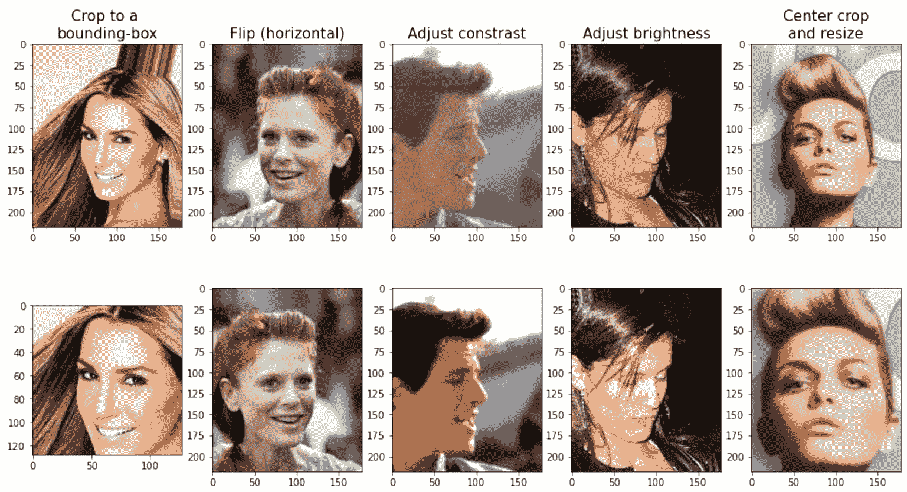

图 14.15:不同的图像变换

在*图 14.15* 中，原始图像显示在第一行，它们的变换版本显示在第二行。请注意，对于第一个转换(最左边的列)，边界框由四个数字指定:边界框左上角的坐标(这里是 *x* =20， *y* =50)，以及该框的宽度和高度(宽度=128，高度=128)。还要注意 PyTorch(以及其他包，如`imageio`)加载的图像的原点(坐标为(0，0))是图像的左上角。

前面代码块中的转换是确定性的。然而，所有这样的转换也可以是随机化的，这是在模型训练期间推荐用于数据扩充的。例如，可以从图像中裁剪出随机边界框(其中左上角的坐标是随机选择的)，可以以 0.5 的概率沿着水平轴或垂直轴随机翻转图像，或者可以随机改变图像的对比度，其中从一系列值中随机选择`contrast_factor`，但是具有均匀分布。此外，我们可以创建这些转换的管道。

例如，我们可以首先随机裁剪图像，然后随机翻转它，最后，将其调整到所需的大小。代码如下(因为我们有随机元素，所以我们为可再现性设置了随机种子):

```
>>> torch.manual_seed(1)

>>> fig = plt.figure(figsize=(14, 12))

>>> for i, (img, attr) in enumerate(celeba_train_dataset):

...     ax = fig.add_subplot(3, 4, i*4+1)

...     ax.imshow(img)

...     if i == 0:

...         ax.set_title('Orig.', size=15)

...

...     ax = fig.add_subplot(3, 4, i*4+2)

...     img_transform = transforms.Compose([

...         transforms.RandomCrop([178, 178])

...     ])

...     img_cropped = img_transform(img)

...     ax.imshow(img_cropped)

...     if i == 0:

...         ax.set_title('Step 1: Random crop', size=15)

...

...     ax = fig.add_subplot(3, 4, i*4+3)

...     img_transform = transforms.Compose([

...         transforms.RandomHorizontalFlip()

...     ])

...     img_flip = img_transform(img_cropped)

...     ax.imshow(img_flip)

...     if i == 0:

...         ax.set_title('Step 2: Random flip', size=15)

...

...     ax = fig.add_subplot(3, 4, i*4+4)

...     img_resized = transforms.functional.resize(

...         img_flip, size=(128, 128)

...     )

...     ax.imshow(img_resized)

...     if i == 0:

...         ax.set_title('Step 3: Resize', size=15)

...     if i == 2:

...         break

>>> plt.show() 
```

*图 14.16* 显示了对三个示例图像的随机变换:

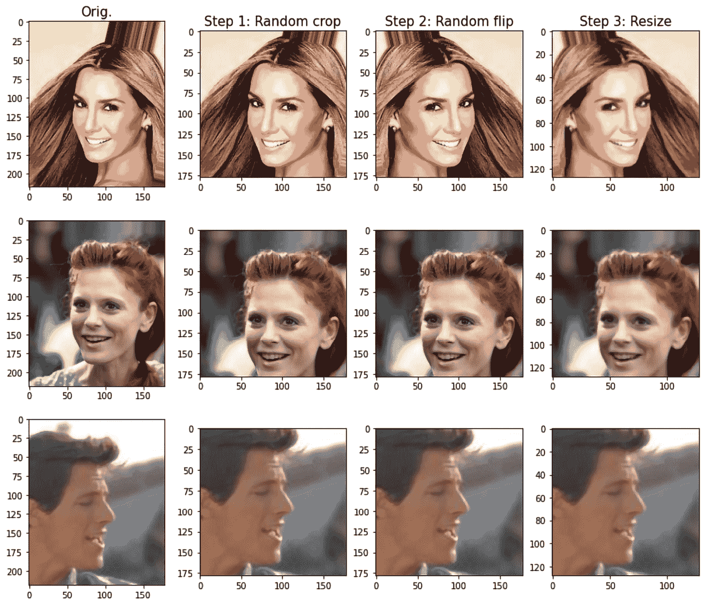

图 14.16:随机图像变换

注意，每次我们迭代这些三个例子时，由于随机变换，我们得到的图像略有不同。

为了方便起见，我们可以定义转换函数，在数据集加载期间使用这个管道进行数据扩充。在下面的代码中，我们将定义函数`get_smile`，该函数将从`'attributes'`列表中提取微笑标签:

```
>>> get_smile = lambda attr: attr[18] 
```

我们将定义产生转换图像的`transform_train`函数(我们将首先随机裁剪图像，然后随机翻转图像，最后将其调整到所需的 64×64 大小):

```
>>> transform_train = transforms.Compose([

...     transforms.RandomCrop([178, 178]),

...     transforms.RandomHorizontalFlip(),

...     transforms.Resize([64, 64]),

...     transforms.ToTensor(),

... ]) 
```

然而，我们将只对训练示例应用数据扩充,而不对验证或测试图像应用。验证或测试集的代码如下(我们将首先简单地裁剪图像，然后将其调整到所需的 64×64 大小):

```
>>> transform = transforms.Compose([

...     transforms.CenterCrop([178, 178]),

...     transforms.Resize([64, 64]),

...     transforms.ToTensor(),

... ]) 
```

现在，为了查看数据扩充的运行情况，让我们将`transform_train`函数应用于我们的训练数据集，并在数据集上迭代五次:

```
>>> from torch.utils.data import DataLoader

>>> celeba_train_dataset = torchvision.datasets.CelebA(

...     image_path, split='train',

...     target_type='attr', download=False,

...     transform=transform_train, target_transform=get_smile

... )

>>> torch.manual_seed(1)

>>> data_loader = DataLoader(celeba_train_dataset, batch_size=2)

>>> fig = plt.figure(figsize=(15, 6))

>>> num_epochs = 5

>>> for j in range(num_epochs):

...     img_batch, label_batch = next(iter(data_loader))

...     img = img_batch[0]

...     ax = fig.add_subplot(2, 5, j + 1)

...     ax.set_xticks([])

...     ax.set_yticks([])

...     ax.set_title(f'Epoch {j}:', size=15)

...     ax.imshow(img.permute(1, 2, 0))

...

...     img = img_batch[1]

...     ax = fig.add_subplot(2, 5, j + 6)

...     ax.set_xticks([])

...     ax.set_yticks([])

...     ax.imshow(img.permute(1, 2, 0))

>>> plt.show() 
```

*图 14.17* 显示了两个示例图像上数据扩充的五个结果转换:

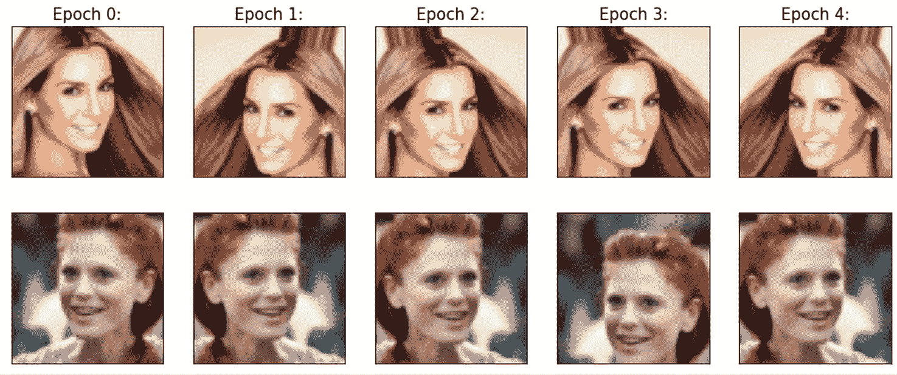

图 14.17:五种图像变换的结果

接下来，我们将把`transform`函数应用于我们的验证和测试数据集:

```
>>> celeba_valid_dataset = torchvision.datasets.CelebA(

...     image_path, split='valid',

...     target_type='attr', download=False,

...     transform=transform, target_transform=get_smile

... )

>>> celeba_test_dataset = torchvision.datasets.CelebA(

...     image_path, split='test',

...     target_type='attr', download=False,

...     transform=transform, target_transform=get_smile

... ) 
```

此外，我们将采用 16，000 个训练示例和 1，000 个示例的子集进行验证，而不是使用所有可用的训练和验证数据，因为我们在这里的目标是有意用一个小数据集来训练我们的模型:

```
>>> from torch.utils.data import Subset

>>> celeba_train_dataset = Subset(celeba_train_dataset,

...                               torch.arange(16000))

>>> celeba_valid_dataset = Subset(celeba_valid_dataset,

...                               torch.arange(1000))

>>> print('Train set:', len(celeba_train_dataset))

Train set: 16000

>>> print('Validation set:', len(celeba_valid_dataset))

Validation set: 1000 
```

现在，我们可以为三个数据集创建数据加载器:

```
>>> batch_size = 32

>>> torch.manual_seed(1)

>>> train_dl = DataLoader(celeba_train_dataset,

...                       batch_size, shuffle=True)

>>> valid_dl = DataLoader(celeba_valid_dataset,

...                       batch_size, shuffle=False)

>>> test_dl = DataLoader(celeba_test_dataset,

...                      batch_size, shuffle=False) 
```

既然数据加载器已经准备好了，我们将开发一个 CNN 模型，并在下一节中对其进行训练和评估。

## 训练 CNN 微笑分类器

到目前为止，用`torch.nn`模块构建一个模型并训练它应该很简单。我们的 CNN 的设计如下:CNN 模型接收大小为 3×64×64 的输入图像(图像具有三个颜色通道)。

输入数据经过四个卷积层，使用内核大小为 3×3 且相同填充为 1 的滤波器来制作 32、64、128 和 256 个特征图。前三个卷积层之后是 max-pooling， *P* [2×2] 。正则化还包括两个漏失层:

```
>>> model = nn.Sequential()

>>> model.add_module(

...     'conv1',

...     nn.Conv2d(

...         in_channels=3, out_channels=32,

...         kernel_size=3, padding=1

...     )

... )

>>> model.add_module('relu1', nn.ReLU())

>>> model.add_module('pool1', nn.MaxPool2d(kernel_size=2))

>>> model.add_module('dropout1', nn.Dropout(p=0.5))

>>> 

>>> model.add_module(

...     'conv2',

...     nn.Conv2d(

...         in_channels=32, out_channels=64,

...         kernel_size=3, padding=1

...     )

... )

>>> model.add_module('relu2', nn.ReLU())

>>> model.add_module('pool2', nn.MaxPool2d(kernel_size=2))

>>> model.add_module('dropout2', nn.Dropout(p=0.5))

>>> 

>>> model.add_module(

...     'conv3',

...     nn.Conv2d(

...         in_channels=64, out_channels=128,

...         kernel_size=3, padding=1

...     )

... )

>>> model.add_module('relu3', nn.ReLU())

>>> model.add_module('pool3', nn.MaxPool2d(kernel_size=2))

>>> 

>>> model.add_module(

...     'conv4',

...     nn.Conv2d(

...         in_channels=128, out_channels=256,

...         kernel_size=3, padding=1

...     )

... )

>>> model.add_module('relu4', nn.ReLU()) 
```

让我们看看使用玩具批量输入(任意四个图像)应用这些图层后输出特征图的形状:

```
>>> x = torch.ones((4, 3, 64, 64))

>>> model(x).shape

torch.Size([4, 256, 8, 8]) 
```

有 256 个大小为 8×8 的特征图(或通道)。现在，我们可以添加一个完全连接的图层，以便使用单个单元到达输出图层。如果我们重塑(展平)要素地图，则此全连接图层的输入单元数将为 8 × 8 × 256 = 16，384。或者，让我们考虑一个新的层，称为*全局* *平均池*，它分别计算每个特征地图的平均值，从而将隐藏单元减少到 256 个。然后，我们可以添加一个完全连接的层。虽然我们没有明确讨论全局平均池，但它在概念上与其他池层非常相似。事实上，当池大小等于输入要素地图大小时，全局平均池可视为平均池的一种特殊情况。

为了理解这一点，考虑*图 14.18* ，显示了形状*批次大小* ×8×64×64 的输入特征图的示例。通道编号为 *k* =0，1，..., 7.全局平均池操作计算每个通道的平均值，这样输出将具有[*batch size*×8]的形状。在此之后，我们将挤压全球平均池层的产量。

如果没有对输出进行压缩，形状将是[*batch size*×8×1×1]，因为全局平均池会将 64×64 的空间维度减少到 1×1:

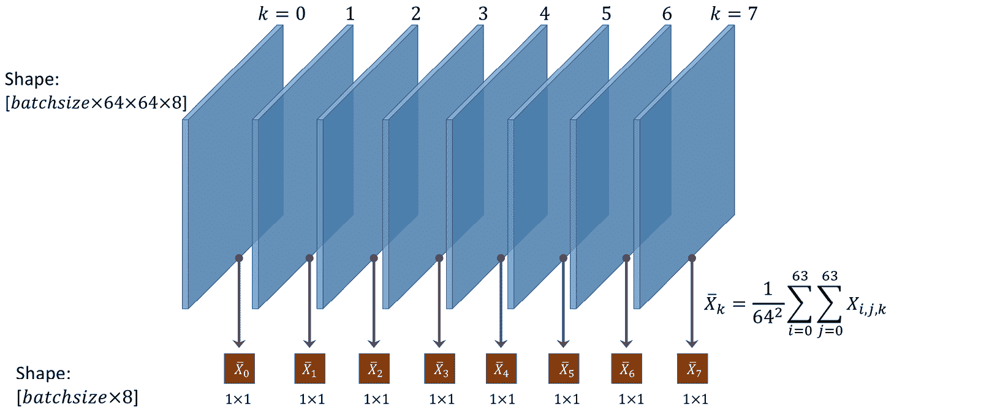

图 14.18:输入特征地图

因此，假设在我们的例子中，该层之前的特征图的形状是[ *batchsize* ×256×8×8]，我们期望得到 256 个单位作为输出，即输出的形状将是[ *batchsize* ×256]。让我们添加这一层，并重新计算输出形状，以验证这是真的:

```
>>> model.add_module('pool4', nn.AvgPool2d(kernel_size=8))

>>> model.add_module('flatten', nn.Flatten())

>>> x = torch.ones((4, 3, 64, 64))

>>> model(x).shape

torch.Size([4, 256]) 
```

最后，我们可以添加一个全连接层，得到单个输出单元。在这种情况下，我们可以指定激活函数为`'sigmoid'`:

```
>>> model.add_module('fc', nn.Linear(256, 1))

>>> model.add_module('sigmoid', nn.Sigmoid())

>>> x = torch.ones((4, 3, 64, 64))

>>> model(x).shape

torch.Size([4, 1])

>>> model

Sequential(

  (conv1): Conv2d(3, 32, kernel_size=(3, 3), stride=(1, 1), padding=(1, 1))

  (relu1): ReLU()

  (pool1): MaxPool2d(kernel_size=2, stride=2, padding=0, dilation=1, ceil_mode=False)

  (dropout1): Dropout(p=0.5, inplace=False)

  (conv2): Conv2d(32, 64, kernel_size=(3, 3), stride=(1, 1), padding=(1, 1))

  (relu2): ReLU()

  (pool2): MaxPool2d(kernel_size=2, stride=2, padding=0, dilation=1, ceil_mode=False)

  (dropout2): Dropout(p=0.5, inplace=False)

  (conv3): Conv2d(64, 128, kernel_size=(3, 3), stride=(1, 1), padding=(1, 1))

  (relu3): ReLU()

  (pool3): MaxPool2d(kernel_size=2, stride=2, padding=0, dilation=1, ceil_mode=False)

  (conv4): Conv2d(128, 256, kernel_size=(3, 3), stride=(1, 1), padding=(1, 1))

  (relu4): ReLU()

  (pool4): AvgPool2d(kernel_size=8, stride=8, padding=0)

  (flatten): Flatten(start_dim=1, end_dim=-1)

  (fc): Linear(in_features=256, out_features=1, bias=True)

  (sigmoid): Sigmoid()

) 
```

下一步是创建一个损失函数和优化器(还是 Adam 优化器)。对于具有单一概率输出的二元分类，我们使用`BCELoss`作为损失函数:

```
>>> loss_fn = nn.BCELoss()

>>> optimizer = torch.optim.Adam(model.parameters(), lr=0.001) 
```

现在我们可以通过定义以下函数来训练模型:

```
>>> def train(model, num_epochs, train_dl, valid_dl):

...     loss_hist_train = [0] * num_epochs

...     accuracy_hist_train = [0] * num_epochs

...     loss_hist_valid = [0] * num_epochs

...     accuracy_hist_valid = [0] * num_epochs

...     for epoch in range(num_epochs):

...         model.train()

...         for x_batch, y_batch in train_dl:

...             pred = model(x_batch)[:, 0]

...             loss = loss_fn(pred, y_batch.float())

...             loss.backward()

...             optimizer.step()

...             optimizer.zero_grad()

...             loss_hist_train[epoch] += loss.item()*y_batch.size(0)

...             is_correct = ((pred>=0.5).float() == y_batch).float()

...             accuracy_hist_train[epoch] += is_correct.sum()

...         loss_hist_train[epoch] /= len(train_dl.dataset)

...         accuracy_hist_train[epoch] /= len(train_dl.dataset)

...

...         model.eval()

...         with torch.no_grad():

...             for x_batch, y_batch in valid_dl:

...                 pred = model(x_batch)[:, 0]

...                 loss = loss_fn(pred, y_batch.float())

...                 loss_hist_valid[epoch] += \

...                     loss.item() * y_batch.size(0)

...                 is_correct = \

...                     ((pred>=0.5).float() == y_batch).float()

...                 accuracy_hist_valid[epoch] += is_correct.sum()

...         loss_hist_valid[epoch] /= len(valid_dl.dataset)

...         accuracy_hist_valid[epoch] /= len(valid_dl.dataset)

...

...         print(f'Epoch {epoch+1} accuracy: '

...               f'{accuracy_hist_train[epoch]:.4f} val_accuracy: '

...               f'{accuracy_hist_valid[epoch]:.4f}')

...     return loss_hist_train, loss_hist_valid, \

...            accuracy_hist_train, accuracy_hist_valid 
```

接下来，我们将训练这个 CNN 模型 30 个时期，并使用我们创建的验证数据集来监控学习进度:

```
>>> torch.manual_seed(1)

>>> num_epochs = 30

>>> hist = train(model, num_epochs, train_dl, valid_dl)

Epoch 1 accuracy: 0.6286 val_accuracy: 0.6540

...

Epoch 15 accuracy: 0.8544 val_accuracy: 0.8700

...

Epoch 30 accuracy: 0.8739 val_accuracy: 0.8710 
```

现在让我们将学习曲线可视化，并比较每个时期后的训练和验证损失和准确度:

```
>>> x_arr = np.arange(len(hist[0])) + 1

>>> fig = plt.figure(figsize=(12, 4))

>>> ax = fig.add_subplot(1, 2, 1)

>>> ax.plot(x_arr, hist[0], '-o', label='Train loss')

>>> ax.plot(x_arr, hist[1], '--<', label='Validation loss')

>>> ax.legend(fontsize=15)

>>> ax = fig.add_subplot(1, 2, 2)

>>> ax.plot(x_arr, hist[2], '-o', label='Train acc.')

>>> ax.plot(x_arr, hist[3], '--<',

...         label='Validation acc.')

>>> ax.legend(fontsize=15)

>>> ax.set_xlabel('Epoch', size=15)

>>> ax.set_ylabel('Accuracy', size=15)

>>> plt.show() 
```

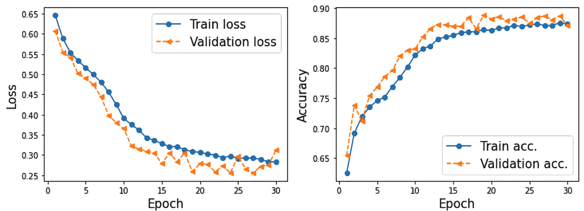

图 14.19:训练和验证结果的比较

一旦我们对学习曲线感到满意，我们就可以在坚持测试数据集上评估模型:

```
>>> accuracy_test = 0

>>> model.eval()

>>> with torch.no_grad():

...     for x_batch, y_batch in test_dl:

...         pred = model(x_batch)[:, 0]

...         is_correct = ((pred>=0.5).float() == y_batch).float()

...         accuracy_test += is_correct.sum()

>>> accuracy_test /= len(test_dl.dataset)

>>> print(f'Test accuracy: {accuracy_test:.4f}')

Test accuracy: 0.8446 
```

最后，我们已经知道如何在一些测试例子上得到预测结果。在下面的代码中，我们将从最后一批预处理的测试数据集(`test_dl`)中抽取 10 个例子的子集。然后，我们将计算每个示例来自类别 1(基于 CelebA 中提供的标签，对应于*微笑*)的概率，并可视化这些示例及其基本事实标签和预测概率:

```
>>> pred = model(x_batch)[:, 0] * 100

>>> fig = plt.figure(figsize=(15, 7))

>>> for j in range(10, 20):

...     ax = fig.add_subplot(2, 5, j-10+1)

...     ax.set_xticks([]); ax.set_yticks([])

...     ax.imshow(x_batch[j].permute(1, 2, 0))

...     if y_batch[j] == 1:

...         label='Smile'

...     else:

...         label = 'Not Smile'

...     ax.text(

...         0.5, -0.15,

...         f'GT: {label:s}\nPr(Smile)={pred[j]:.0f}%',

...         size=16,

...         horizontalalignment='center',

...         verticalalignment='center',

...         transform=ax.transAxes

...     )

>>> plt.show() 
```

在*图 14.20* 中，您可以看到 10 个示例图像以及它们的基本事实标签和它们属于第 1 类的概率，微笑:

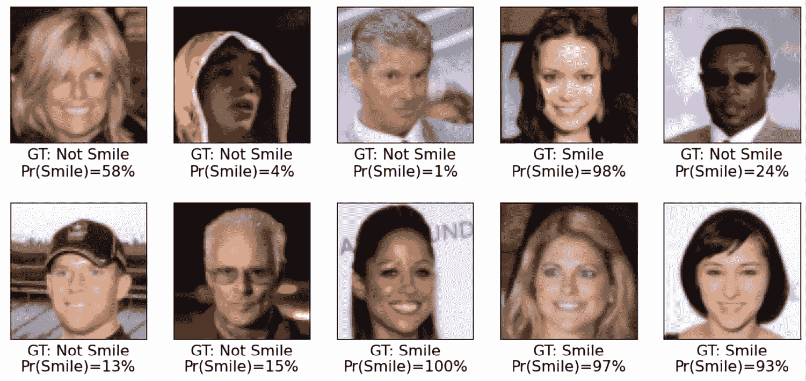

图 14.20:图像标签及其属于类别 1 的概率

每张图片下方提供了第 1 类(即 CelebA 的*微笑*)的概率。如你所见，我们训练的模型在这 10 个测试例子上是完全准确的。

作为一个可选练习，我们鼓励您尝试使用整个训练数据集，而不是我们创建的小子集。此外，您可以更改或修改 CNN 架构。例如，您可以更改不同卷积层中的丢弃概率和滤波器数量。此外，您可以用完全连接的层来替换全局平均池。如果您使用我们在本章中训练的 CNN 架构的整个训练数据集，您应该能够达到 90%以上的准确率。

# 摘要

在这一章中，我们学习了 CNN 及其主要组件。我们从卷积运算开始，研究了 1D 和 2D 的实现。然后，我们讨论了几种常见 CNN 架构中的另一种层:二次采样或所谓的池层。我们主要关注两种最常见的池形式:最大池和平均池。

接下来，将所有这些单独的概念放在一起，我们使用`torch.nn`模块实现了深度 CNN。我们实现的第一个网络应用于我们已经熟悉的 MNIST 手写数字识别问题。

然后，我们在由人脸图像组成的更复杂的数据集上实现了第二个 CNN，并训练 CNN 进行微笑分类。在这个过程中，您还了解了数据扩充和不同的转换，我们可以使用`torchvision.transforms`模块将它们应用到人脸图像中。

在下一章，我们将继续讨论**递归神经网络** ( **RNNs** )。rnn 用于学习序列数据的结构，它们有一些迷人的应用，包括语言翻译和图像字幕。

# 加入我们书的不和谐空间

加入该书的 Discord workspace，每月与作者进行一次*向我提问*会议:

[https://packt.link/MLwPyTorch](https://packt.link/MLwPyTorch)

*