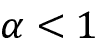

# 十五、使用循环神经网络建模序列数据

在前一章中，我们重点讨论了**卷积神经网络** ( **CNNs** )。我们介绍了 CNN 架构的构建模块，以及如何在 PyTorch 中实现深度 CNN。最后，您学习了如何使用中枢神经系统进行图像分类。在本章中，我们将探索**循环神经网络** ( **RNNs** )并看看它们在时序数据建模中的应用。

我们将讨论以下主题:

*   引入顺序数据
*   用于建模序列的 RNNs
*   长短期记忆
*   通过时间的截断反向传播
*   在 PyTorch 中实现用于序列建模的多层 RNN
*   项目一:IMDb 电影评论数据集的 RNN 情感分析
*   项目二:用儒勒·凡尔纳的*神秘岛*中的文本数据，用 LSTM 细胞进行 RNN 字符级语言建模
*   使用渐变剪辑避免渐变爆炸

# 引入顺序数据

让我们从查看序列数据的性质开始我们对 RNNs 的讨论，它通常被称为序列数据或**序列**。我们将着眼于序列的独特属性，这些属性使它们不同于其他类型的数据。然后，我们将了解如何表示顺序数据，并探索顺序数据模型的各种类别，这些类别基于模型的输入和输出。这将有助于我们在本章中探索 RNNs 和序列之间的关系。

## 顺序数据建模——顺序问题

与其他类型的数据相比，序列的独特之处在于，序列中的元素以一定的顺序出现，并且不是相互独立的。监督学习的典型机器学习算法假设输入为**独立同分布** ( **IID** )数据，这意味着训练样本为*相互独立*且底层分布相同。在这点上，基于相互独立的假设，训练示例被给予模型的顺序是不相关的。比如我们有一个由 *n* 个训练样本组成的样本， **x** ^((1)) ， **x** ^((2)) ，...、**x**^(^n^)，我们使用数据来训练我们的机器学习算法的顺序并不重要。这种情况的一个例子是我们之前使用的 Iris 数据集。在 Iris 数据集中，每朵花都是独立测量的，一朵花的测量值不会影响另一朵花的测量值。

然而，当我们处理序列时，这个假设是不成立的——根据定义，顺序很重要。预测特定股票的市场价值就是这种情况的一个例子。例如，假设我们有一个由 *n* 个训练样本组成的样本，其中每个训练样本代表某一天某支股票的市场价值。如果我们的任务是预测未来三天的股票市场价值，那么按照日期排序的顺序考虑以前的股票价格以得出趋势，而不是按照随机顺序利用这些训练示例，这将是有意义的。

## 顺序数据与时间序列数据

时间序列数据是一种特殊类型的时序数据，其中每个例子都与一个时间维度相关联。在时间序列数据中，样本是在连续的时间戳处获取的，因此，时间维度决定了数据点之间的顺序。例如，股票价格和声音或语音记录都是时间序列数据。

另一方面，并非所有顺序数据都具有时间维度。对于示例，在文本数据或 DNA 序列中，示例是有序的，但文本或 DNA 不符合时间序列数据的条件。正如你将看到的，在这一章中，我们将重点关注自然语言处理(NLP)和文本建模的例子，它们不是时间序列数据。但是，请注意，RNNs 也可以用于时间序列数据，这超出了本书的范围。

## 表示序列

我们已经确定，数据点之间的顺序在顺序数据中很重要，因此我们接下来需要找到一种方法，在机器学习模型中利用这种排序信息。在本章中，我们将序列表示为。上标索引表示实例的顺序，序列的长度为 *T* 。对于序列的合理示例，考虑时间序列数据，其中每个示例点，*x*^(^t^)，属于特定时间， *t* 。*图 15.1* 显示了一个时间序列数据的例子，其中输入特征(**x**s)和目标标签(**y**s)自然地遵循时间轴的顺序；因此， **x** 和 **y** 都是序列。


图 15.1:时间序列数据的一个例子

正如我们已经提到的，我们到目前为止所涉及的标准 NN 模型，如用于图像数据的**多层感知器** ( **MLPs** )和CNN，假设训练示例彼此独立，因此不包含*排序信息*。我们可以说，这样的模型没有对之前看到的训练例子的记忆。例如，样本通过前馈和反向传播步骤，权重的更新独立于训练样本的处理顺序。

相比之下，rnn 是为序列建模而设计的，能够记住过去的信息并相应地处理新事件，这在处理序列数据时是一个明显的优势。

## 序列建模的不同类别

序列建模有许多令人着迷的应用，例如语言翻译(例如，将文本从英语翻译成德语)、图像字幕和文本生成。然而，为了选择合适的架构和方法，我们必须理解并能够区分这些不同的序列建模任务。*图 15.2* ，基于*安德烈·卡帕西*2015([http://karpathy.github.io/2015/05/21/rnn-effectiveness/](http://karpathy.github.io/2015/05/21/rnn-effectiveness/))的优秀文章*循环神经网络*的不合理有效性中的解释，总结了最常见的序列建模任务，这些任务依赖于输入输出数据的关系类别。


图 15.2:最常见的排序任务

让我们更详细地讨论输入和输出数据之间的不同关系类别，这在上图中有所描述。如果输入和输出数据都不代表序列，那么我们处理的是标准数据，我们可以简单地使用一个多层感知器(或者本书前面提到的另一个分类模型)来模拟这样的数据。但是，如果输入或输出是一个序列，建模任务可能属于以下类别之一:

*   **多对一**:输入数据是一个序列，但输出是一个固定大小的向量或标量，而不是序列。例如，在情感分析中，输入是基于文本的(例如，电影评论)，输出是类别标签(例如，表示评论者是否喜欢该电影的标签)。
*   **一对多**:输入数据是标准格式，不是序列，但输出是序列。这种类型的一个例子是图像字幕——输入是图像，输出是总结该图像内容的英语短语。
*   **多对多**:两个输入输出数组都是序列。这个类别可以根据输入和输出是否同步来进一步划分。同步多对多建模任务的一个例子是视频分类，其中视频中的每一帧都被标记。一个*延迟*多对多建模任务的例子是将一种语言翻译成另一种语言。例如，一个完整的英语句子在翻译成德语之前必须被机器阅读和处理。

现在，在总结了序列建模的三大类别之后，我们可以继续讨论 RNN 的结构。

# 用于建模序列的 RNNs

在本节中，在我们开始在 PyTorch 中实现 RNNs 之前，我们将讨论 RNNs 的主要概念。我们将从 RNN 的典型结构开始，它包括一个递归组件来模拟序列数据。然后，我们将检查在典型的 RNN 中神经元激活是如何计算的。这将为我们讨论培训 rnn 的共同挑战创造一个背景，然后我们将讨论这些挑战的解决方案，如 LSTM 和**门控循环单元** ( **GRUs** )。

## 了解 RNNs 中的数据流

让我们从 RNN 的架构开始。*图 15.3* 并排显示了标准前馈神经网络和 RNN 中的数据流，用于比较:


图 15.3:标准前馈神经网络和 RNN 的数据流

这两个网络都只有一个隐藏层。在这个表示中，没有显示单位，但是我们假设输入层( **x** )、隐藏层( **h** )和输出层( **o** )是包含许多单位的向量。

**确定 RNN 的输出类型**

这种通用 RNN 架构可以对应于两种序列建模类别，其中输入是序列。通常情况下，递归层可以返回一个序列作为输出，，或者简单地返回最后一个输出(在 *t* = *T* ，即**o**^(^T^))。因此，它可以是多对多，也可以是多对一，例如，如果我们只使用最后一个元素**o**^(^T^)作为最终输出。

稍后我们将看到 PyTorch `torch.nn`模块是如何处理的，当我们详细查看递归层关于返回序列作为输出的行为时。

在标准的前馈网络中，信息从输入流向隐藏层，然后从隐藏层流向输出层。另一方面，在 RNN 中，隐藏层从当前时间步长的输入层和前一时间步长的隐藏层接收输入。

隐藏层中相邻时间步长的信息流允许网络具有对过去事件的记忆。这种信息流通常显示为一个循环，在图形符号中也被称为循环边**，这就是这种通用 RNN 架构的名称。**

 **类似于多层感知器，RNNs 可以由多个隐藏层组成。请注意，通常将具有一个隐藏层的 RNNs 称为*单层 RNN* ，这不要与没有隐藏层的单层 NNs 混淆，例如 Adaline 或逻辑回归。*图 15.4* 展示了一个有一个隐藏层的 RNN(上)和一个有两个隐藏层的 RNN(下):


图 15.4:具有一个和两个隐藏层的 RNN 示例

为了检查 RNNs 的架构和信息流，可以展开一个带有递归边的紧凑表示，如图 15.4 所示。

众所周知，标准神经网络中的每个隐藏单元只接收一个输入——与输入层相关的网络预激活。相比之下，RNN 中的每个隐藏单元接收两组*不同的*输入——来自输入层的预激活和来自前一时间步的同一隐藏层的激活，*t*–1。

在第一时间步， *t* = 0，隐藏单元被初始化为零或小的随机值。然后，在 *t* > 0 的时间步，隐藏单元接收来自当前时间数据点的输入，**x**^(^t^)，以及隐藏单元在*t*–1 的先前值，表示为**h**^(^t^(–1))。

类似地，在多层 RNN 的情况下，我们可以将信息流总结如下:

*   *层* = 1:在这里，隐藏层被表示为，它从数据点**x**(^t^)接收其输入，以及同一层中的隐藏值，但是在先前的时间步。
*   *层* = 2:第二个隐藏层，在当前时间步()接收来自下一层输出的输入，以及来自前一时间步的自己的隐藏值。

由于在这种情况下，每个递归层必须接收一个序列作为输入，所以除了最后一个递归层之外的所有递归层都必须*返回一个序列作为输出*(也就是说，我们稍后必须设置`return_sequences=True`)。最后一个重现层的行为取决于问题的类型。

## 计算 RNN 中的激活

现在您已经理解了 RNN 中的结构和一般信息流，让我们更具体地计算隐藏层和输出层的实际激活。为了简单起见，我们将只考虑一个隐藏层；然而，相同的概念适用于多层 rnn。

我们刚刚看到的 RNN 表示中的每条有向边(方框之间的连接)都与一个权重矩阵相关联。这些权重不依赖于时间。因此，它们是跨时间轴共享的。单层 RNN 中的不同权重矩阵如下:

*   **W** [xh] :输入、**x**^(^t^)、隐藏层、 **h** 之间的权重矩阵
*   **W** [hh] :与递归边相关联的权重矩阵
*   **W** [ho] :隐含层和输出层之间的权重矩阵

这些权重矩阵在*图 15.5* 中描述:


图 15.5:对单层 RNN 应用权重

在某些实现中，您可以观察到权重矩阵 **W** [xh] 和 **W** [hh] 被连接成组合矩阵**W**[h]=[**W**[xh]；**W**hh。在本节的后面，我们也将使用这种符号。

计算激活非常类似于标准多层感知器和其他类型的前馈神经网络。对于隐藏层，通过线性组合计算净输入， **z** [h] (预激活)；也就是说，我们计算权重矩阵与相应向量的乘积之和，并加上偏差单位:


然后，隐藏单元在时间步长 *t* 的激活计算如下:


这里， **b** [h] 是隐藏单元的偏置向量，是隐藏层的激活函数。

如果你想使用串接的权重矩阵，**W**[h]=[**W**[xh]； **W**


一旦计算出当前时间步长的隐藏单元的激活，则输出单元的激活将被计算，如下所示:


为了进一步澄清这一点，*图 15.6* 显示了用两种公式计算这些激活的过程:


图 15.6:计算激活

**使用时间反向传播(BPTT)训练 RNNs】**

RNNs 的学习算法于 1990 年推出:*穿越时间的反向传播:它做什么以及如何做* ( *保罗·沃博斯*，*IEEE 会议录*，78(10): 1550-1560，1990)。

梯度的推导可能有点复杂，但基本思想是总损失 *L* 是所有损失函数在时间 *t* = 1 到 *t* = *T* 的总和:


由于时间 *t* 处的损失取决于所有先前时间步长 1 : *t* 处的隐藏单元，梯度将计算如下:


这里，被计算为相邻时间步长的乘积:


## 隐藏循环与输出循环

到目前为止，你已经看到了循环网络，其中隐藏层具有递归属性。但是，请注意，有一个替代模型，其中循环连接来自输出层。在这种情况下，可以通过以下两种方式之一添加前一时间步中来自输出层的净激活量**o**^t^(–1):

*   到当前时间步的隐藏层， **h** ^t (如图*15.7*所示为输出到隐藏的递归)
*   到当前时间步的输出层， **o** ^t (如图*15.7*所示为输出到输出的递归)


图 15.7:不同的循环连接模型

如图*图 15.7* 所示，在循环连接中可以清楚地看到这些架构之间的差异。按照我们的符号，对于隐藏到隐藏的递归，与递归连接相关联的权重将由 **W** [hh] 表示，对于输出到隐藏的递归，由 **W** [oh] 表示，对于输出到输出的递归，由 **W** [oo] 表示。在文献中的一些文章中，与循环连接相关联的权重也由**W**rec 表示。

为了了解这个在实践中是如何工作的，让我们手动计算这些递归类型之一的向前传递。使用`torch.nn`模块，可通过`RNN`定义递归层，类似于隐藏到隐藏递归。在下面的代码中，我们将从`RNN`创建一个递归层，并对长度为 3 的输入序列执行正向传递来计算输出。我们还将手动计算向前传球，并将结果与`RNN`的结果进行比较。

首先，让我们创建图层，并为手动计算分配权重和偏差:

```py
>>> import torch

>>> import torch.nn as nn

>>> torch.manual_seed(1)

>>> rnn_layer = nn.RNN(input_size=5, hidden_size=2,

...                    num_layers=1, batch_first=True)

>>> w_xh = rnn_layer.weight_ih_l0

>>> w_hh = rnn_layer.weight_hh_l0

>>> b_xh = rnn_layer.bias_ih_l0

>>> b_hh = rnn_layer.bias_hh_l0

>>> print('W_xh shape:', w_xh.shape)

>>> print('W_hh shape:', w_hh.shape)

>>> print('b_xh shape:', b_xh.shape)

>>> print('b_hh shape:', b_hh.shape)

W_xh shape: torch.Size([2, 5])

W_hh shape: torch.Size([2, 2])

b_xh shape: torch.Size([2])

b_hh shape: torch.Size([2]) 
```

该层的输入形状是`(batch_size, sequence_length, 5)`，其中第一个维度是批次维度(如我们设置的`batch_first=True`)，第二个维度对应于序列，最后一个维度对应于特征。注意，我们将输出一个序列，对于，长度为 3 的输入序列将产生输出序列。另外，`RNN`默认使用一个图层，你可以设置`num_layers`将多个 RNN 图层叠加在一起，形成一个叠加的 RNN。

现在，我们将调用`rnn_layer`上的正向传递，手动计算每个时间步的输出，并进行比较:

```py
>>> x_seq = torch.tensor([[1.0]*5, [2.0]*5, [3.0]*5]).float()

>>> ## output of the simple RNN:

>>> output, hn = rnn_layer(torch.reshape(x_seq, (1, 3, 5)))

>>> ## manually computing the output:

>>> out_man = []

>>> for t in range(3):

...     xt = torch.reshape(x_seq[t], (1, 5))

...     print(f'Time step {t} =>')

...     print('   Input           :', xt.numpy())

...     

...     ht = torch.matmul(xt, torch.transpose(w_xh, 0, 1)) + b_hh

...     print('   Hidden          :', ht.detach().numpy()

...     

...     if t > 0:

...         prev_h = out_man[t-1]

...     else:

...         prev_h = torch.zeros((ht.shape))

...     ot = ht + torch.matmul(prev_h, torch.transpose(w_hh, 0, 1)) \

...             + b_hh

...     ot = torch.tanh(ot)

...     out_man.append(ot)

...     print('   Output (manual) :', ot.detach().numpy())

...     print('   RNN output      :', output[:, t].detach().numpy())

...     print()

Time step 0 =>

   Input           : [[1\. 1\. 1\. 1\. 1.]]

   Hidden          : [[-0.4701929  0.5863904]]

   Output (manual) : [[-0.3519801   0.52525216]]

   RNN output      : [[-0.3519801   0.52525216]]

Time step 1 =>

   Input           : [[2\. 2\. 2\. 2\. 2.]]

   Hidden          : [[-0.88883156  1.2364397 ]]

   Output (manual) : [[-0.68424344  0.76074266]]

   RNN output      : [[-0.68424344  0.76074266]]

Time step 2 =>

   Input           : [[3\. 3\. 3\. 3\. 3.]]

   Hidden          : [[-1.3074701  1.886489 ]]

   Output (manual) : [[-0.8649416   0.90466356]]

   RNN output      : [[-0.8649416   0.90466356]] 
```

在我们的手动正向计算中，我们使用双曲正切(tanh)激活函数，因为它也用于`RNN`(默认激活)。从打印的结果可以看出，手动正向计算的输出与每个时间步的`RNN`层的输出完全匹配。希望这个实际操作的任务已经启发了你关于循环网络的秘密。

## 学习远程互动的挑战

前面简单提到的 BPTT 带来了一些新的挑战。由于乘法因子，在计算损失函数的梯度时，出现了所谓的**消失**和**爆发**梯度问题。

这些问题由*图 15.8* 中的例子解释，为简单起见，图中显示了一个只有一个隐藏单元的 RNN:


图 15.8:计算损失函数梯度的问题

基本上，有*t*—*k*次乘法；因此，将权重、 *w、*本身乘以*t*–*k*倍，得到一个因子，*w*^t^–^k。因此，如果| * w * | < 1，当*t*–*k*较大时，这个因子变得很小。另一方面，如果递归边的权重是| * w * | > 1，那么*w*^t^–^k在*t*–*k*较大时变得非常大。请注意，大的*t*–*k*指的是长程相关性。我们可以看到，通过确保| * w * | = 1，可以实现避免渐变消失或爆炸的简单解决方案。如果你有兴趣并想更详细地研究这个问题，请阅读*r . Pascanu*、 *T. Mikolov* 和 *Y. Bengio* ，2012([https://arxiv.org/pdf/1211.5063.pdf](https://arxiv.org/pdf/1211.5063.pdf))关于训练循环神经网络的难度。

实际上，这个问题至少有三种解决方案:

*   渐变剪辑
*   **截断反向传播通过时间** ( **TBPTT** )
*   LSTM

使用渐变剪辑，我们为渐变指定一个截止值或阈值，并将该截止值分配给超过该值的渐变值。相比之下，TBPTT 只是限制信号在每次正向传递后可以反向传播的时间步长数。例如，即使序列有 100 个元素或步骤，我们也只能反向传播最近的 20 个时间步骤。

虽然梯度裁剪和 TBPTT 都可以解决爆炸梯度问题，但截断限制了梯度可以有效回流和正确更新权重的步骤数。另一方面，由 Sepp Hochreiter 和 Jürgen Schmidhuber 在 1997 年设计的 LSTM，在通过使用记忆单元模拟长程相关性时，在消失和爆炸梯度问题方面更为成功。让我们更详细地讨论 LSTM。

## 长短期记忆细胞

如前所述，首先引入 LSTMs 是为了克服消失梯度问题(S. Hochreiter 和 J. Schmidhuber 、*神经计算*，9(8): 1735-1780，1997 年*的*长短期记忆*)。一个 LSTM 的构建模块是一个**存储单元**，它本质上代表或取代了标准 rnn 的隐藏层。*

如我们所讨论的，在每个存储单元中，存在具有期望权重的循环边， *w* = 1，以克服消失和爆炸梯度问题。与该循环边相关的值被统称为，称为**单元状态**。现代 LSTM 电池的展开结构如图*图 15.9* 所示:


图 15.9:LSTM 细胞的结构

注意，上一时间步的单元状态，**C**^(^t^(–1))，被修改为获得当前时间步的单元状态，**C**^(^t^)，而没有直接乘以任何权重因子。该存储单元中的信息流由几个计算单元(通常称为*门*)控制，这里将对其进行描述。图中，是指**逐元素乘积**(逐元素乘法)是指**逐元素求和**(逐元素加法)。再者，**x**^(^t^)是指在时间 *t* ，**h**^(^t^(–1))表示在*t*–1 时间的隐藏单元。四个方框用一个激活函数表示，或者是 sigmoid 函数()或者是 tanh，以及一组权重；这些框通过对它们的输入执行矩阵向量乘法来应用线性组合(它们是**h**^(^t^(–1))和**x**^(^t^))。这些具有 sigmoid 激活函数的计算单元，其输出单元通过被称为门。

在 LSTM 单元中，有三种不同类型的门，即遗忘门、输入门和输出门:

**遗忘门** ( **f** [t] )允许存储单元重置单元状态，而不会无限增长。事实上，遗忘门决定了哪些信息被允许通过，哪些信息被抑制。现在，**f**t 计算如下:


请注意，遗忘门不是最初的 LSTM 细胞的一部分；几年后，它被添加进来以改进原始模型(*学会遗忘:与 LSTM 的持续预测*作者 *F .格斯*、 *J .施密德胡伯*和 *F .康明斯*、*神经计算 12* ，2451-2471，2000)。

**输入门** ( **i** [t] )和**候选值** ( )负责更新单元状态。它们计算如下:


在时间 *t* 的单元状态计算如下:


**输出门** ( **o** [t] )决定如何更新隐藏单元的值:


鉴于此，当前时间步长的隐藏单位计算如下:


一个 LSTM 单元的结构和它的底层计算可能看起来非常复杂并且难以实现。然而，好消息是 PyTorch 已经在优化的包装器函数中实现了一切，这使得我们可以轻松有效地定义我们的 LSTM 单元。在本章的后面，我们将把 RNNs 和 LSTMs 应用于真实世界的数据集。

**其他先进的 RNN 模型**

LSTMs 为序列中的长程相关性建模提供了一种基本方法。然而，值得注意的是，文献中描述了 LSTMs 的许多变体(*Rafal Jozefowicz*、 *Wojciech Zaremba* 和 *Ilya Sutskever* 、*ICML 会议录*，2342-2350，2015)。同样值得注意的是一种更近的方法，**门控循环单元** ( **GRU** )，这是在 2014 年提出的。gru 的架构比 LSTMs 更简单；因此，它们的计算效率更高，而在某些任务中，如复音音乐建模，它们的性能与 LSTMs 相当。如果您有兴趣了解更多关于这些现代 RNN 架构的信息，请参考 2014 年 *Junyoung Chung* 等人的论文*门控循环神经网络对序列建模的实证评估*([https://arxiv.org/pdf/1412.3555v1.pdf](https://arxiv.org/pdf/1412.3555v1.pdf))。

# 在 PyTorch 中实现 RNNs 序列建模

现在我们已经讨论了 RNNs 背后的理论，我们准备进入本章更实际的部分:在 PyTorch 中实现 RNNs。在本章的其余部分，我们将把 RNNs 应用于两个常见的问题任务:

1.  情感分析
2.  语言建模

这两个项目，我们将在接下来的几页中一起浏览，都很吸引人，但也很复杂。因此，我们将把实现分成几个步骤，并详细讨论代码，而不是一次性提供所有代码。如果您希望有一个大的概览，并希望在深入讨论之前一次看到所有代码，那么先看一下代码实现。

## 项目一——预测 IMDb 电影评论的情感

您可能还记得*第 8 章*、*将机器学习应用于情感分析*，情感分析与分析句子或文本文档表达的观点有关。在这一节和接下来的小节中，我们将使用多对一架构为情感分析实现一个多层 RNN。

在下一节中，我们将为语言建模应用程序实现多对多 RNN。虽然选择的例子是为了简单介绍 RNNs 的主要概念，但语言建模有广泛的有趣应用，例如构建聊天机器人——使计算机能够直接与人类对话和交互。

### 准备电影评论数据

在*第八章*中，我们对评论数据集进行了预处理和清洗。我们现在也会这样做。首先，我们将导入必要的模块并从`torchtext`读取数据(我们将通过`pip install torchtext`安装它)；从 2021 年末开始使用版本 0.10.0)，如下所示:

```py
>>> from torchtext.datasets import IMDB

>>> train_dataset = IMDB(split='train')

>>> test_dataset = IMDB(split='test') 
```

每组有 25000 个样本。并且数据集的每个样本由两个元素组成，表示我们想要预测的目标标签的情感标签(`neg`指负面情感，`pos`指正面情感)，以及电影评论文本(输入特征)。这些电影评论的文本成分是单词序列，RNN 模型将每个序列分类为正面(`1`)或负面(`0`)评论。

但是，在将数据输入 RNN 模型之前，我们需要应用几个预处理步骤:

1.  将定型数据集拆分为单独的定型分区和验证分区。
2.  识别训练数据集中的唯一单词
3.  将每个唯一的单词映射到一个唯一的整数，并将评论文本编码成编码整数(每个唯一单词的索引)
4.  将数据集分成小批，作为模型的输入

让我们继续第一步:从我们之前读到的`train_dataset`创建一个训练和验证分区:

```py
>>> ## Step 1: create the datasets

>>> from torch.utils.data.dataset import random_split

>>> torch.manual_seed(1)

>>> train_dataset, valid_dataset = random_split(

...     list(train_dataset), [20000, 5000]) 
```

原始训练数据集包含 25，000 个示例。随机选择 20，000 个样本进行训练，5，000 个样本进行验证。

为了准备输入到神经网络的数据，我们需要将它编码成数值，正如在*步骤 2* 和*步骤 3* 中提到的。为此，我们将首先在训练数据集中找到唯一的单词(标记)。虽然寻找唯一令牌是一个我们可以使用 Python 数据集的过程，但使用来自`collections`包的`Counter`类可能更有效，它是 Python 标准库的一部分。

在下面的代码中，我们将实例化一个新的`Counter`对象(`token_counts`)，它将收集唯一的词频。请注意，在这个特定的应用程序中(与单词袋模型相反)，我们只对唯一的单词集感兴趣，不需要单词计数，这是作为副产品创建的。为了将文本分割成单词(或记号)，我们将重用我们在*第 8 章*中开发的`tokenizer`函数，它也删除了 HTML 标记以及标点和其他非字母字符:

收集唯一令牌的代码如下:

```py
>>> ## Step 2: find unique tokens (words)

>>> import re

>>> from collections import Counter, OrderedDict

>>> 

>>> def tokenizer(text):

...     text = re.sub('<[^>]*>', '', text)

...     emoticons = re.findall(

...         '(?::|;|=)(?:-)?(?:\)|\(|D|P)', text.lower()

...     )

...     text = re.sub('[\W]+', ' ', text.lower()) +\

...         ' '.join(emoticons).replace('-', '')

...     tokenized = text.split()

...     return tokenized

>>> 

>>> token_counts = Counter()

>>> for label, line in train_dataset:

...     tokens = tokenizer(line)

...     token_counts.update(tokens)

>>> print('Vocab-size:', len(token_counts))

Vocab-size: 69023 
```

如果你想了解更多关于`Counter`的内容，可以参考它在[https://docs . python . org/3/library/collections . html # collections 的文档。柜台](https://docs.python.org/3/library/collections.html#collections.Counter)。

接下来，我们将把每个唯一的单词映射到一个唯一的整数。这可以使用 Python 字典手动完成，其中键是唯一的标记(单词)，与每个键相关联的值是唯一的整数。然而，`torchtext`包已经提供了一个类`Vocab`，我们可以用它来创建这样一个映射并对整个数据集进行编码。首先，我们将创建一个`vocab`对象，将有序字典映射标记传递给它们相应的出现频率(有序字典是排序后的`token_counts`)。其次，我们将在词汇表前添加两个特殊的标记——填充标记和未知标记:

```py
>>> ## Step 3: encoding each unique token into integers

>>> from torchtext.vocab import vocab

>>> sorted_by_freq_tuples = sorted(

...     token_counts.items(), key=lambda x: x[1], reverse=True

... )

>>> ordered_dict = OrderedDict(sorted_by_freq_tuples)

>>> vocab = vocab(ordered_dict)

>>> vocab.insert_token("<pad>", 0)

>>> vocab.insert_token("<unk>", 1)

>>> vocab.set_default_index(1) 
```

为了演示如何使用`vocab`对象，我们将把一个示例输入文本转换成一个整数值列表:

```py
>>> print([vocab[token] for token in ['this', 'is',

...     'an', 'example']])

[11, 7, 35, 457] 
```

请注意，验证或测试数据中可能有一些令牌不存在于训练数据中，因此不包括在映射中。如果我们有 *q* 令牌(也就是传递给`Vocab`的`token_counts`的大小，在本例中是 69023)，那么所有以前没有见过的令牌，也就是没有包含在`token_counts`中的令牌，将被赋予整数 1(未知令牌的占位符)。换句话说，索引 1 是为未知单词保留的。另一个保留值是整数 0，它充当占位符，即所谓的*填充标记*，用于调整序列长度。稍后，当我们在 PyTorch 中构建 RNN 模型时，我们将更详细地考虑这个占位符 0。

我们可以定义`text_pipeline`函数来相应地转换数据集中的每个文本，定义`label_pipeline`函数来将每个标签转换为 1 或 0:

```py
>>> ## Step 3-A: define the functions for transformation

>>> text_pipeline =\

...      lambda x: [vocab[token] for token in tokenizer(x)]

>>> label_pipeline = lambda x: 1\. if x == 'pos' else 0. 
```

我们将使用`DataLoader`生成批量样本，并将之前声明的数据处理管道传递给参数`collate_fn`。我们将把文本编码和标签转换函数包装到`collate_batch`函数中:

```py
>>> ## Step 3-B: wrap the encode and transformation function

... def collate_batch(batch):

...     label_list, text_list, lengths = [], [], []

...     for _label, _text in batch:

...         label_list.append(label_pipeline(_label))

...         processed_text = torch.tensor(text_pipeline(_text),

...                                       dtype=torch.int64)

...         text_list.append(processed_text)

...         lengths.append(processed_text.size(0))

...     label_list = torch.tensor(label_list)

...     lengths = torch.tensor(lengths)

...     padded_text_list = nn.utils.rnn.pad_sequence(

...         text_list, batch_first=True)

...     return padded_text_list, label_list, lengths

>>> 

>>> ## Take a small batch

>>> from torch.utils.data import DataLoader

>>> dataloader = DataLoader(train_dataset, batch_size=4,

...                         shuffle=False, collate_fn=collate_batch) 
```

到目前为止，我们已经将单词序列转换为整数序列，并将标签`pos`或`neg`转换为 1 或 0。然而，有一个问题我们需要解决——序列目前有不同的长度(如执行以下四个示例代码的结果所示)。尽管一般来说，RNNs 可以处理不同长度的序列，但我们仍然需要确保小批量中的所有序列都具有相同的长度，以便有效地将它们存储在张量中。

PyTorch 提供了一个有效的方法`pad_sequence()`，它将自动用占位符值(0)填充要合并到一个批处理中的连续元素，这样一个批处理中的所有序列将具有相同的形状。在前面的代码中，我们已经从训练数据集创建了一个小批量的数据加载器，并应用了`collate_batch`函数，该函数本身包含了一个`pad_sequence()`调用。

但是，为了说明填充是如何工作的，我们将首先打印第一批元素的大小，然后再将这些元素组合成小批，以及生成的小批的尺寸:

```py
>>> text_batch, label_batch, length_batch = next(iter(dataloader))

>>> print(text_batch)

tensor([[   35,  1742,     7,   449,   723,     6,   302,     4,

...

0,     0,     0,     0,     0,     0,     0,     0]],

>>> print(label_batch)

tensor([1., 1., 1., 0.])

>>> print(length_batch)

tensor([165,  86, 218, 145])

>>> print(text_batch.shape)

torch.Size([4, 218]) 
```

从打印的张量形状中可以看出，第一批中的列数是 218，这是将前四个示例合并成一批并使用这些示例的最大大小的结果。这意味着这一批中的其他三个示例(它们的长度分别为 165、86 和 145)将根据需要进行填充以匹配这个大小。

最后，让我们将所有三个数据集分成批量大小为 32 的数据加载器:

```py
>>> batch_size = 32

>>> train_dl = DataLoader(train_dataset, batch_size=batch_size,

...                       shuffle=True, collate_fn=collate_batch)

>>> valid_dl = DataLoader(valid_dataset, batch_size=batch_size,

...                       shuffle=False, collate_fn=collate_batch)

>>> test_dl = DataLoader(test_dataset, batch_size=batch_size,

...                      shuffle=False, collate_fn=collate_batch) 
```

现在，数据的格式适合 RNN 模型，我们将在下面的小节中实现它。然而，在下一小节中，我们将首先讨论特征**嵌入**，这是一个可选但强烈推荐的预处理步骤，用于降低单词向量的维度。

### 句子编码的嵌入层

在前面步骤的数据准备过程中，我们生成了相同长度的序列。这些序列的元素是整数，对应于唯一单词的索引*和*。这些单词索引可以以几种不同的方式转换成输入特征。一种简单的方法是应用独热编码将索引转换成 0 和 1 的向量。然后，每个单词将被映射到一个向量，该向量的大小是整个数据集中唯一单词的数量。假设唯一单词的数量(词汇量的大小)可以是 10⁴–10⁵的数量级，这也将是我们的输入特征的数量，在这些特征上训练的模型可能会遭受**维数灾难**。此外，这些特征非常稀疏，因为除了一个之外，所有特征都是零。

更好的方法是将每个单词映射到一个具有实值元素(不一定是整数)的固定大小的向量。与独热编码向量相反，我们可以使用有限大小的向量来表示无限数量的实数。(理论上，我们可以从一个给定的区间中抽取无限个实数，例如[–1，1]。)

这是嵌入背后的思想，这是一种特征学习技术，我们可以在这里利用它来自动学习显著的特征，以表示我们数据集中的单词。给定唯一单词的数量， *n* [单词]，我们可以选择嵌入向量的大小(也称为嵌入维度)比唯一单词的数量(*embedding _ dim*<<*n*[单词])小得多，以表示作为输入特征的整个词汇。

嵌入相对于一键编码的优势如下:

*   降低特征空间的维数以减少维数灾难的影响
*   由于神经网络中的嵌入层可以被优化(或学习),所以显著特征的提取可以被优化

下面的示意图显示了嵌入是如何通过将令牌索引映射到可训练嵌入矩阵来工作的:


图 15.10:嵌入工作原理的分解

给定一组大小为 *n* + 2 ( *n* 是记号集的大小，加上索引 0 是为填充占位符保留的，1 是为记号集中不存在的单词保留的)，将创建大小为(*n*+2)×*embedding _ dim*的嵌入矩阵，其中该矩阵的每一行表示与记号相关联的数字特征。因此，当整数索引 *i* 作为嵌入的输入时，它将在索引 *i* 处查找矩阵的相应行，并返回数字特征。嵌入矩阵作为我们的神经网络模型的输入层。实际上，使用`nn.Embedding`可以简单地创建一个嵌入层。让我们看一个例子，我们将创建一个嵌入层，并将其应用于一批两个样本，如下所示:

```py
>>> embedding = nn.Embedding(

...     num_embeddings=10,

...     embedding_dim=3,

...     padding_idx=0)

>>> # a batch of 2 samples of 4 indices each

>>> text_encoded_input = torch.LongTensor([[1,2,4,5],[4,3,2,0]])

>>> print(embedding(text_encoded_input))

tensor([[[-0.7027,  0.3684, -0.5512],

         [-0.4147,  1.7891, -1.0674],

         [ 1.1400,  0.1595, -1.0167],

         [ 0.0573, -1.7568,  1.9067]],

        [[ 1.1400,  0.1595, -1.0167],

         [-0.8165, -0.0946, -0.1881],

         [-0.4147,  1.7891, -1.0674],

         [ 0.0000,  0.0000,  0.0000]]], grad_fn=<EmbeddingBackward>) 
```

这个模型(嵌入层)的输入必须具有秩 2，维数为*批次大小* × *输入长度*，其中*输入长度*是序列的长度(这里是 4)。例如，小批量中的输入序列可以是< 1，5，9，2 >，其中该序列的每个元素都是唯一字的索引。输出将具有维度*batch size*×*input _ length*×*embedding _ dim*，其中 *embedding_dim* 是嵌入特征的大小(这里设置为 3)。提供给嵌入层的另一个参数`num_embeddings`，对应于模型将接收作为输入的唯一整数值(例如， *n* + 2，这里设置为 10)。因此，在这种情况下，嵌入矩阵的大小为 10×6。

`padding_idx`表示填充的标记索引(此处为 0)，如果指定，其将不会在训练期间对梯度更新有所贡献。在我们的例子中，第二个样本的原始序列的长度是 3，我们用 1 个元素 0 填充它。填充元素的嵌入输出为[0，0，0]。

### 建立一个 RNN 模型

现在我们准备建立一个 RNN 模型。使用`nn.Module`类，我们可以组合嵌入层、RNN 的递归层和完全连接的非递归层。对于递归层，我们可以使用以下任何一种实现:

*   `RNN`:正则 RNN 层，即全连通递归层
*   `LSTM`:长短期记忆 RNN，对捕捉长期依赖很有用
*   `GRU`:具有门控递归单元的递归层，如由 *K. Cho* 等人于 2014 年([https://arxiv.org/abs/1406.1078v3](https://arxiv.org/abs/1406.1078v3))在*使用用于统计机器翻译的 RNN 编码器-解码器的学习短语表示*中提出的，作为 LSTMs 的替代

为了了解如何使用这些重现层之一构建多层 RNN 模型，在下面的示例中，我们将创建一个具有两个类型为`RNN`的重现层的 RNN 模型。最后，我们将添加一个非递归全连接图层作为输出图层，该图层将返回一个输出值作为预测值:

```py
>>> class RNN(nn.Module):

...     def __init__(self, input_size, hidden_size):

...         super().__init__()

...         self.rnn = nn.RNN(input_size, hidden_size, num_layers=2,

...                           batch_first=True)

...         # self.rnn = nn.GRU(input_size, hidden_size, num_layers,

...         #                   batch_first=True)

...         # self.rnn = nn.LSTM(input_size, hidden_size, num_layers,

...         #                    batch_first=True)

...         self.fc = nn.Linear(hidden_size, 1)

...

...     def forward(self, x):

...         _, hidden = self.rnn(x)

...         out = hidden[-1, :, :] # we use the final hidden state

...                                # from the last hidden layer as

...                                # the input to the fully connected

...                                # layer

...         out = self.fc(out)

...         return out

>>>

>>> model = RNN(64, 32)

>>> print(model)

>>> model(torch.randn(5, 3, 64))

RNN(

  (rnn): RNN(64, 32, num_layers=2, batch_first=True)

  (fc): Linear(in_features=32, out_features=1, bias=True)

)

tensor([[ 0.0010],

        [ 0.2478],

        [ 0.0573],

        [ 0.1637],

        [-0.0073]], grad_fn=<AddmmBackward>) 
```

正如你所见，使用这些递归层构建一个 RNN 模型非常简单。在下一小节中，我们将回到我们的情感分析任务，并建立一个 RNN 模型来解决这个问题。

### 为情感分析任务构建 RNN 模型

因为我们有很长的序列，我们将使用 LSTM 层来考虑长程效应。我们将创建用于情感分析的 RNN 模型，从产生特征大小为 20 ( `embed_dim=20`)的单词嵌入的嵌入层开始。然后，将添加一个 LSTM 类型的循环层。最后，我们将添加一个完全连接的图层作为隐藏图层，并添加另一个完全连接的图层作为输出图层，这将通过逻辑 sigmoid 激活返回单个类成员概率值作为预测:

```py
>>> class RNN(nn.Module):

...     def __init__(self, vocab_size, embed_dim, rnn_hidden_size,

...                  fc_hidden_size):

...         super().__init__()

...         self.embedding = nn.Embedding(vocab_size,

...                                       embed_dim,

...                                       padding_idx=0)

...         self.rnn = nn.LSTM(embed_dim, rnn_hidden_size,

...                            batch_first=True)

...         self.fc1 = nn.Linear(rnn_hidden_size, fc_hidden_size)

...         self.relu = nn.ReLU()

...         self.fc2 = nn.Linear(fc_hidden_size, 1)

...         self.sigmoid = nn.Sigmoid()

...

...     def forward(self, text, lengths):

...         out = self.embedding(text)

...         out = nn.utils.rnn.pack_padded_sequence(

...             out, lengths.cpu().numpy(), enforce_sorted=False, batch_first=True

...         )

...         out, (hidden, cell) = self.rnn(out)

...         out = hidden[-1, :, :]

...         out = self.fc1(out)

...         out = self.relu(out)

...         out = self.fc2(out)

...         out = self.sigmoid(out)

...         return out

>>> 

>>> vocab_size = len(vocab)

>>> embed_dim = 20

>>> rnn_hidden_size = 64

>>> fc_hidden_size = 64

>>> torch.manual_seed(1)

>>> model = RNN(vocab_size, embed_dim,

                rnn_hidden_size, fc_hidden_size)

>>> model

RNN(

  (embedding): Embedding(69025, 20, padding_idx=0)

  (rnn): LSTM(20, 64, batch_first=True)

  (fc1): Linear(in_features=64, out_features=64, bias=True)

  (relu): ReLU()

  (fc2): Linear(in_features=64, out_features=1, bias=True)

  (sigmoid): Sigmoid()

) 
```

现在我们将开发`train`函数来训练给定数据集上一个时期的模型，并返回分类精度和损失:

```py
>>> def train(dataloader):

...     model.train()

...     total_acc, total_loss = 0, 0

...     for text_batch, label_batch, lengths in dataloader:

...         optimizer.zero_grad()

...         pred = model(text_batch, lengths)[:, 0]

...         loss = loss_fn(pred, label_batch)

...         loss.backward()

...         optimizer.step()

...         total_acc += (

...             (pred >= 0.5).float() == label_batch

...         ).float().sum().item()

...         total_loss += loss.item()*label_batch.size(0)

...     return total_acc/len(dataloader.dataset), \

...            total_loss/len(dataloader.dataset) 
```

类似地，我们将开发`evaluate`函数来测量模型在给定数据集上的性能:

```py
>>> def evaluate(dataloader):

...     model.eval()

...     total_acc, total_loss = 0, 0

...     with torch.no_grad():

...         for text_batch, label_batch, lengths in dataloader:

...             pred = model(text_batch, lengths)[:, 0]

...             loss = loss_fn(pred, label_batch)

...             total_acc += (

...                 (pred>=0.5).float() == label_batch

...             ).float().sum().item()

...             total_loss += loss.item()*label_batch.size(0)

...     return total_acc/len(dataloader.dataset), \

...            total_loss/len(dataloader.dataset) 
```

下一步是创建一个损失函数和优化器(Adam optimizer)。对于具有单一类别成员概率输出的二元分类，我们使用二元交叉熵损失(`BCELoss`)作为损失函数:

```py
>>> loss_fn = nn.BCELoss()

>>> optimizer = torch.optim.Adam(model.parameters(), lr=0.001) 
```

现在，我们将训练 10 个时期的模型，并显示训练和验证性能:

```py
>>> num_epochs = 10

>>> torch.manual_seed(1)

>>> for epoch in range(num_epochs):

...     acc_train, loss_train = train(train_dl)

...     acc_valid, loss_valid = evaluate(valid_dl)

...     print(f'Epoch {epoch} accuracy: {acc_train:.4f}'

...           f' val_accuracy: {acc_valid:.4f}')

Epoch 0 accuracy: 0.5843 val_accuracy: 0.6240

Epoch 1 accuracy: 0.6364 val_accuracy: 0.6870

Epoch 2 accuracy: 0.8020 val_accuracy: 0.8194

Epoch 3 accuracy: 0.8730 val_accuracy: 0.8454

Epoch 4 accuracy: 0.9092 val_accuracy: 0.8598

Epoch 5 accuracy: 0.9347 val_accuracy: 0.8630

Epoch 6 accuracy: 0.9507 val_accuracy: 0.8636

Epoch 7 accuracy: 0.9655 val_accuracy: 0.8654

Epoch 8 accuracy: 0.9765 val_accuracy: 0.8528

Epoch 9 accuracy: 0.9839 val_accuracy: 0.8596 
```

在训练该模型 10 个时期后，我们将在测试数据上对其进行评估:

```py
>>> acc_test, _ = evaluate(test_dl)

>>> print(f'test_accuracy: {acc_test:.4f}')

test_accuracy: 0.8512 
```

它显示了 85%的准确率。(请注意，与 IMDb 数据集上使用的最先进的方法相比，此结果并不是最佳的。目标仅仅是展示 RNN 如何在 PyTorch 中工作。)

#### 更多关于双向 RNN 的信息

此外，我们将将`LSTM`的`bidirectional`配置设置为`True`，这将使递归层从两个方向通过输入序列，从开始到结束，以及相反的方向:

```py
>>> class RNN(nn.Module):

...     def __init__(self, vocab_size, embed_dim,

...                  rnn_hidden_size, fc_hidden_size):

...         super().__init__()

...         self.embedding = nn.Embedding(

...             vocab_size, embed_dim, padding_idx=0

...         )

...         self.rnn = nn.LSTM(embed_dim, rnn_hidden_size,

...                            batch_first=True, bidirectional=True)

...         self.fc1 = nn.Linear(rnn_hidden_size*2, fc_hidden_size)

...         self.relu = nn.ReLU()

...         self.fc2 = nn.Linear(fc_hidden_size, 1)

...         self.sigmoid = nn.Sigmoid()

...

...     def forward(self, text, lengths):

...         out = self.embedding(text)

...         out = nn.utils.rnn.pack_padded_sequence(

...             out, lengths.cpu().numpy(), enforce_sorted=False, batch_first=True

...         )

...         _, (hidden, cell) = self.rnn(out)

...         out = torch.cat((hidden[-2, :, :],

...                          hidden[-1, :, :]), dim=1)

...         out = self.fc1(out)

...         out = self.relu(out)

...         out = self.fc2(out)

...         out = self.sigmoid(out)

...         return out

>>> 

>>> torch.manual_seed(1)

>>> model = RNN(vocab_size, embed_dim,

...             rnn_hidden_size, fc_hidden_size)

>>> model

RNN(

  (embedding): Embedding(69025, 20, padding_idx=0)

  (rnn): LSTM(20, 64, batch_first=True, bidirectional=True)

  (fc1): Linear(in_features=128, out_features=64, bias=True)

  (relu): ReLU()

  (fc2): Linear(in_features=64, out_features=1, bias=True)

  (sigmoid): Sigmoid()

) 
```

双向 RNN 层对每个输入序列进行两次传递:一次正向传递和一次反向或反向传递(注意，这不要与反向传播上下文中的正向和反向传递混淆)。这些向前和向后传递的结果隐藏状态通常被连接成单个隐藏状态。其他合并模式包括求和、乘法(将两遍的结果相乘)和平均(取两遍的平均值)。

我们也可以尝试其他类型的轮回层，比如常规的`RNN`。然而，事实证明，使用常规递归层构建的模型将无法达到良好的预测性能(即使是在训练数据上)。例如，如果您尝试用单向`nn.RNN`(而不是`nn.LSTM`)层替换先前代码中的双向 LSTM 层，并在全长序列上训练模型，您可能会发现在训练期间损耗甚至不会减少。原因是该数据集中的序列太长，因此具有`RNN`层的模型无法学习长期依赖关系，并且可能遭受消失或爆炸梯度问题。

## 项目二 PyTorch 中的字符级语言建模

语言建模是一个迷人的应用程序，它使机器能够执行人类语言相关的任务，例如生成英语句子。这个领域中一个有趣的研究是*用循环神经网络生成文本*作者*伊利亚·苏茨基弗*、*詹姆斯·马腾斯*和*杰弗里·e·辛顿*、*第 28 届机器学习国际会议论文集(ICML-11)* 、2011([https://pdfs . semantic scholar . org/93 C2/0 e 38 c 85 b 69 fc 2 EB 314 B3 c 12](https://pdfs.semanticscholar.org/93c2/0e38c85b69fc2d2eb314b3c1217913f7db11.pdf)

在我们现在将要构建的模型中，输入是一个文本文档，我们的目标是开发一个可以生成与输入文档风格相似的新文本的模型。这种输入的例子是特定编程语言的书籍或计算机程序。

在字符级语言建模中，输入被分解成一系列字符，一次一个字符地输入到我们的网络中。网络将处理中的每个新字符，并结合之前看到的字符的记忆来预测下一个字符。

*图 15.11* 显示了一个字符级语言建模的例子(注意 EOS 代表“序列结束”):


图 15.11:字符级语言建模

我们可以将这个实现分成三个独立的步骤:准备数据、构建 RNN 模型、执行下一个字符预测和采样以生成新文本。

### 预处理数据集

在本节中，我们将为字符级语言建模准备数据。

要获得输入数据，请访问位于 https://www.gutenberg.org/的古腾堡计划网站，该网站提供数千本免费电子书。举个例子，你可以从 https://www.gutenberg.org/files/1268/1268-0.txt 的[下载儒勒·凡尔纳的书*神秘岛*(1874 年出版)的纯文本格式。](https://www.gutenberg.org/files/1268/1268-0.txt)

请注意，此链接会将您直接带到下载页面。如果您使用的是 macOS 或 Linux 操作系统，您可以在终端中使用以下命令下载该文件:

```py
curl -O https://www.gutenberg.org/files/1268/1268-0.txt 
```

如果将来这个资源变得不可用，这个文本的一个副本也会包含在本章的代码目录中，该目录位于 https://github.com/rasbt/machine-learning-book 的代码库。

一旦我们下载了数据集，我们就可以以纯文本的形式将它读入 Python 会话。使用下面的代码，我们将直接从下载的文件中读取文本，并删除开头和结尾的部分(这些部分包含对 Gutenberg 项目的某些描述)。然后，我们将创建一个 Python 变量`char_set`，它表示在本文中观察到的一组*独特的*字符:

```py
>>> import numpy as np

>>> ## Reading and processing text

>>> with open('1268-0.txt', 'r', encoding="utf8") as fp:

...     text=fp.read()

>>> start_indx = text.find('THE MYSTERIOUS ISLAND')

>>> end_indx = text.find('End of the Project Gutenberg')

>>> text = text[start_indx:end_indx]

>>> char_set = set(text)

>>> print('Total Length:', len(text))

Total Length: 1112350

>>> print('Unique Characters:', len(char_set))

Unique Characters: 80 
```

在下载并预处理文本后，我们有一个总共由 1，112，350 个字符和 80 个唯一字符组成的序列。然而，大多数神经网络库和 RNN 实现不能处理字符串格式的输入数据，这就是为什么我们必须将文本转换成数字格式。为此，我们将创建一个简单的 Python 字典，将每个字符映射到一个整数`char2int`。我们还需要一个反向映射来将模型的结果转换回文本。虽然使用将整数键与字符值相关联的字典可以实现相反的操作，但是使用 NumPy 数组并索引该数组以将索引映射到那些唯一的字符会更有效。*图 15.12* 显示了一个将字符转换成整数的例子，以及单词`"Hello"`和`"world"`的反向转换:


图 15.12:字符和整数映射

构建字典以将字符映射到整数，并通过索引 NumPy 数组进行反向映射，如上图所示，如下所示:

```py
>>> chars_sorted = sorted(char_set)

>>> char2int = {ch:i for i,ch in enumerate(chars_sorted)}

>>> char_array = np.array(chars_sorted)

>>> text_encoded = np.array(

...     [char2int[ch] for ch in text],

...     dtype=np.int32

... )

>>> print('Text encoded shape:', text_encoded.shape)

Text encoded shape: (1112350,)

>>> print(text[:15], '== Encoding ==>', text_encoded[:15])

>>> print(text_encoded[15:21], '== Reverse ==>',

...       ''.join(char_array[text_encoded[15:21]]))

THE MYSTERIOUS == Encoding ==> [44 32 29  1 37 48 43 44 29 42 33 39 45 43  1]

[33 43 36 25 38 28] == Reverse ==> ISLAND 
```

`text_encoded` NumPy 数组包含文本中所有字符的编码值。现在，我们将打印出该数组中前五个字符的映射:

```py
>>> for ex in text_encoded[:5]:

...     print('{} -> {}'.format(ex, char_array[ex]))

44 -> T

32 -> H

29 -> E

1 ->  

37 -> M 
```

现在，让我们后退一步，看看我们正在努力做的事情的全貌。对于文本生成任务，我们可以将问题公式化为分类任务。

假设我们有一组不完整的文本字符序列，如图*图 15.13* 所示:


图 15.13:预测文本序列的下一个字符

在*图 15.13* 中，我们可以认为左边方框中显示的序列是输入。为了生成新的文本，我们的目标是设计一个可以预测给定输入序列的下一个字符的模型，其中输入序列表示一个不完整的文本。例如，在看到“深度学习”之后，模型应该预测“我”是下一个字符。假设我们有 80 个独特的字符，这个问题就变成了一个多类分类任务。

从长度为 1 的序列(即一个字母)开始，我们可以基于这种多类分类方法迭代生成新文本，如图*图 15.14* 所示:


图 15.14:基于这种多类分类方法生成下一个文本

为了在 PyTorch 中实现文本生成任务，让我们首先将序列长度剪成 40。这意味着输入张量， **x** ，由 40 个记号组成。实际上，序列长度会影响生成文本的质量。更长的序列可以产生更有意义的句子。然而，对于较短的序列，该模型可能专注于正确捕捉单个单词，而忽略了大部分上下文。尽管更长的序列通常会产生更有意义的句子，如上所述，对于长序列，RNN 模型在捕捉长程相关性方面会有问题。因此，在实践中，为序列长度找到一个最佳点和好的值是一个超参数优化问题，我们必须根据经验进行评估。在这里，我们将选择 40，因为它提供了一个很好的权衡。

正如您在前面的图中看到的，输入 **x** 和目标 **y** 偏移了一个字符。因此，我们将文本分成大小为 41 的块:前 40 个字符将形成输入序列， **x** ，后 40 个元素将形成目标序列， **y** 。

我们已经在`text_encoded`中按照原始顺序存储了整个编码文本。我们将首先创建每个包含 41 个字符的文本块。如果最后一个块少于 41 个字符，我们将进一步删除它。因此，名为`text_chunks`的新分块数据集将总是包含大小为 41 的序列。这 41 个字符的块将用于构造序列 **x** (即输入)，以及序列 **y** (即目标)，这两个序列都有 40 个元素。例如，序列 **x** 将由索引为[0，1，..., 39].此外，由于序列 **y** 将相对于 **x** 移动一个位置，其对应的索引将为[1，2，..., 40].然后，我们将通过应用一个自定义的`Dataset`类将结果转换成一个`Dataset`对象:

```py
>>> import torch

>>> from torch.utils.data import Dataset

>>> seq_length = 40

>>> chunk_size = seq_length + 1

>>> text_chunks = [text_encoded[i:i+chunk_size]

...                for i in range(len(text_encoded)-chunk_size)]

>>> from torch.utils.data import Dataset

>>> class TextDataset(Dataset):

...     def __init__(self, text_chunks):

...         self.text_chunks = text_chunks

...

...     def __len__(self):

...         return len(self.text_chunks)

...

...     def __getitem__(self, idx):

...         text_chunk = self.text_chunks[idx]

...         return text_chunk[:-1].long(), text_chunk[1:].long()

>>>

>>> seq_dataset = TextDataset(torch.tensor(text_chunks)) 
```

让我们看一看来自这个转换数据集的一些示例序列:

```py
>>> for i, (seq, target) in enumerate(seq_dataset):

...     print(' Input (x): ',

...           repr(''.join(char_array[seq])))

...     print('Target (y): ',

...           repr(''.join(char_array[target])))

...     print()

...     if i == 1:

...         break

 Input (x): 'THE MYSTERIOUS ISLAND ***\n\n\n\n\nProduced b'

Target (y): 'HE MYSTERIOUS ISLAND ***\n\n\n\n\nProduced by'

 Input (x): 'HE MYSTERIOUS ISLAND ***\n\n\n\n\nProduced by'

Target (y): 'E MYSTERIOUS ISLAND ***\n\n\n\n\nProduced by ' 
```

最后，准备数据集的最后一步是将数据集转换成小批量:

```py
>>> from torch.utils.data import DataLoader

>>> batch_size = 64

>>> torch.manual_seed(1)

>>> seq_dl = DataLoader(seq_dataset, batch_size=batch_size,

...                     shuffle=True, drop_last=True) 
```

### 构建角色级别的 RNN 模型

既然数据集已经准备好了，构建模型就相对简单了:

```py
>>> import torch.nn as nn

>>> class RNN(nn.Module):

...     def __init__(self, vocab_size, embed_dim, rnn_hidden_size):

...         super().__init__()

...         self.embedding = nn.Embedding(vocab_size, embed_dim)

...         self.rnn_hidden_size = rnn_hidden_size

...         self.rnn = nn.LSTM(embed_dim, rnn_hidden_size,

...                            batch_first=True)

...         self.fc = nn.Linear(rnn_hidden_size, vocab_size)

...

...     def forward(self, x, hidden, cell):

...         out = self.embedding(x).unsqueeze(1)

...         out, (hidden, cell) = self.rnn(out, (hidden, cell))

...         out = self.fc(out).reshape(out.size(0), -1)

...         return out, hidden, cell

...

...     def init_hidden(self, batch_size):

...         hidden = torch.zeros(1, batch_size, self.rnn_hidden_size)

...         cell = torch.zeros(1, batch_size, self.rnn_hidden_size)

...         return hidden, cell 
```

请注意，我们需要将 logits 作为模型的输出，以便我们可以从模型预测中进行采样，从而生成新的文本。我们稍后将讨论采样部分。

然后，我们可以指定模型参数并创建一个 RNN 模型:

```py
>>> vocab_size = len(char_array)

>>> embed_dim = 256

>>> rnn_hidden_size = 512

>>> torch.manual_seed(1)

>>> model = RNN(vocab_size, embed_dim, rnn_hidden_size)

>>> model

RNN(

  (embedding): Embedding(80, 256)

  (rnn): LSTM(256, 512, batch_first=True)

  (fc): Linear(in_features=512, out_features=80, bias=True)

  (softmax): LogSoftmax(dim=1)

) 
```

下一步是创建一个损失函数和优化器(Adam optimizer)。对于每个目标字符有一个 logits 输出的多类分类(我们有`vocab_size=80`个类),我们使用`CrossEntropyLoss`作为损失函数:

```py
>>> loss_fn = nn.CrossEntropyLoss()

>>> optimizer = torch.optim.Adam(model.parameters(), lr=0.001) 
```

现在我们将对模型进行 10000 个纪元的训练。在每个时期，我们将只使用从数据加载器`seq_dl`中随机选择的一个批次。我们还将显示每 500 个时期的训练损失:

```py
>>> num_epochs = 10000

>>> torch.manual_seed(1)

>>> for epoch in range(num_epochs):

...     hidden, cell = model.init_hidden(batch_size)

...     seq_batch, target_batch = next(iter(seq_dl))

...     optimizer.zero_grad()

...     loss = 0

...     for c in range(seq_length):

...         pred, hidden, cell = model(seq_batch[:, c], hidden, cell)

...         loss += loss_fn(pred, target_batch[:, c])

...     loss.backward()

...     optimizer.step()

...     loss = loss.item()/seq_length

...     if epoch % 500 == 0:

...         print(f'Epoch {epoch} loss: {loss:.4f}')

Epoch 0 loss: 1.9689

Epoch 500 loss: 1.4064

Epoch 1000 loss: 1.3155

Epoch 1500 loss: 1.2414

Epoch 2000 loss: 1.1697

Epoch 2500 loss: 1.1840

Epoch 3000 loss: 1.1469

Epoch 3500 loss: 1.1633

Epoch 4000 loss: 1.1788

Epoch 4500 loss: 1.0828

Epoch 5000 loss: 1.1164

Epoch 5500 loss: 1.0821

Epoch 6000 loss: 1.0764

Epoch 6500 loss: 1.0561

Epoch 7000 loss: 1.0631

Epoch 7500 loss: 0.9904

Epoch 8000 loss: 1.0053

Epoch 8500 loss: 1.0290

Epoch 9000 loss: 1.0133

Epoch 9500 loss: 1.0047 
```

接下来，我们可以评估模型以生成新的文本，从给定的短字符串开始。在下一节中，我们将定义一个函数来评估训练好的模型。

### 评估阶段-生成新的文本段落

我们在上一节中训练的 RNN 模型为每个独特的字符返回大小为 80 的逻辑。通过 softmax 函数，可以很容易地将这些逻辑转换成某个特定字符将作为下一个字符出现的概率。为了预测序列中的下一个字符，我们可以简单地选择具有最大 logit 值的元素，这相当于选择概率最高的字符。然而，我们不是总是选择可能性最大的字符，而是希望(随机地)从输出中抽取*；否则，模型将总是产生相同的文本。PyTorch 已经提供了一个类`torch.distributions.categorical.Categorical`，我们可以用它从分类分布中抽取随机样本。为了了解这是如何工作的，让我们从三个类别[0，1，2]中生成一些随机样本，输入 logits，1，1]:*

```py
>>> from torch.distributions.categorical import Categorical

>>> torch.manual_seed(1)

>>> logits = torch.tensor([[1.0, 1.0, 1.0]])

>>> print('Probabilities:',

...       nn.functional.softmax(logits, dim=1).numpy()[0])

Probabilities: [0.33333334 0.33333334 0.33333334]

>>> m = Categorical(logits=logits)

>>> samples = m.sample((10,))

>>> print(samples.numpy())

[[0]

 [0]

 [0]

 [0]

 [1]

 [0]

 [1]

 [2]

 [1]

 [1]] 
```

如您所见，对于给定的逻辑，类别具有相同的概率(即，等概率类别)。因此，如果我们使用一个大样本量( *num_samples* → ∞)，我们会期望每个类别的出现次数达到样本量的 1/3。如果我们将 logits 更改为[1，1，3]，那么我们将会观察到类别 2 的更多出现(当从该分布中抽取大量示例时):

```py
>>> torch.manual_seed(1)

>>> logits = torch.tensor([[1.0, 1.0, 3.0]])

>>> print('Probabilities:', nn.functional.softmax(logits, dim=1).numpy()[0])

Probabilities: [0.10650698 0.10650698 0.78698605]

>>> m = Categorical(logits=logits)

>>> samples = m.sample((10,))

>>> print(samples.numpy())

[[0]

 [2]

 [2]

 [1]

 [2]

 [1]

 [2]

 [2]

 [2]

 [2]] 
```

使用`Categorical`，我们可以根据模型计算的逻辑生成示例。

我们将定义一个函数`sample()`，它接收一个短的起始字符串`starting_str`，并生成一个新的字符串`generated_str`，它最初被设置为输入字符串。`starting_str`被编码成整数序列，`encoded_input`。`encoded_input`被一次一个字符地传递给 RNN 模型以更新隐藏状态。`encoded_input`的最后一个角色传递给模型，生成一个新角色。注意，RNN 模型的输出表示在通过模型观察输入序列之后下一个字符的逻辑数(这里是大小为 80 的向量，这是可能的字符总数)。

这里我们只使用`logits`输出(即**o**T5(^T^)，传递给`Categorical`类生成一个新的样本。这个新的样本被转换成一个字符，然后被追加到生成的字符串`generated_text`的末尾，其长度增加 1。然后，重复这个过程，直到生成的字符串的长度达到期望值。使用生成的序列作为生成新元素的输入的过程称为自回归**。**

 **`sample()`功能的代码如下:

```py
>>> def sample(model, starting_str,

...            len_generated_text=500,

...            scale_factor=1.0):

...     encoded_input = torch.tensor(

...         [char2int[s] for s in starting_str]

...     )

...     encoded_input = torch.reshape(

...         encoded_input, (1, -1)

...     )

...     generated_str = starting_str

...

...     model.eval()

...     hidden, cell = model.init_hidden(1)

...     for c in range(len(starting_str)-1):

...         _, hidden, cell = model(

...             encoded_input[:, c].view(1), hidden, cell

...         )

...    

...     last_char = encoded_input[:, -1]

...     for i in range(len_generated_text):

...         logits, hidden, cell = model(

...             last_char.view(1), hidden, cell

...         )

...         logits = torch.squeeze(logits, 0)

...         scaled_logits = logits * scale_factor

...         m = Categorical(logits=scaled_logits)

...         last_char = m.sample()

...         generated_str += str(char_array[last_char])

...

...     return generated_str 
```

现在让我们生成一些新的文本:

```py
>>> torch.manual_seed(1)

>>> print(sample(model, starting_str='The island'))

The island had been made

and ovylore with think, captain?" asked Neb; "we do."

It was found, they full to time to remove. About this neur prowers, perhaps ended? It is might be

rather rose?"

"Forward!" exclaimed Pencroft, "they were it? It seems to me?"

"The dog Top--"

"What can have been struggling sventy."

Pencroft calling, themselves in time to try them what proves that the sailor and Neb bounded this tenarvan's feelings, and then

still hid head a grand furiously watched to the dorner nor his only 
```

正如您所看到的，该模型生成了大多数正确的单词，并且在某些情况下，句子是部分有意义的。您可以进一步调整训练参数，例如用于训练的输入序列的长度，以及模型架构。

此外，为了控制生成的样本的可预测性(即，根据从训练文本中学习到的模式生成文本，而不是增加更多的随机性)，由 RNN 模型计算的逻辑可以在被传递到`Categorical`进行采样之前进行缩放。比例因子可以解释为物理学中温度的模拟。较高的温度导致更多的熵或随机性，而在较低的温度下行为更容易预测。通过使用缩放对数，softmax 函数计算的概率变得更加一致，如以下代码所示:

```py
>>> logits = torch.tensor([[1.0, 1.0, 3.0]])

>>> print('Probabilities before scaling:        ',

...       nn.functional.softmax(logits, dim=1).numpy()[0])

>>> print('Probabilities after scaling with 0.5:',

...       nn.functional.softmax(0.5*logits, dim=1).numpy()[0])

>>> print('Probabilities after scaling with 0.1:',

...       nn.functional.softmax(0.1*logits, dim=1).numpy()[0])

Probabilities before scaling:         [0.10650698 0.10650698 0.78698604]

Probabilities after scaling with 0.5: [0.21194156 0.21194156 0.57611688]

Probabilities after scaling with 0.1: [0.31042377 0.31042377 0.37915245] 
```

正如你所看到的，用缩放的逻辑导致了近乎一致的概率【0.31，0.31，0.38】。现在，我们可以将生成的文本与和进行比较，如下几点所示:

*    :

    ```py
    >>> torch.manual_seed(1)

    >>> print(sample(model, starting_str='The island',

    ...              scale_factor=2.0))

    The island is one of the colony?" asked the sailor, "there is not to be able to come to the shores of the Pacific."

    "Yes," replied the engineer, "and if it is not the position of the forest, and the marshy way have been said, the dog was not first on the shore, and

    found themselves to the corral.

    The settlers had the sailor was still from the surface of the sea, they were not received for the sea. The shore was to be able to inspect the windows of Granite House.

    The sailor turned the sailor was the hor 
    ```

*    :

    ```py
    >>> torch.manual_seed(1)

    >>> print(sample(model, starting_str='The island',

    ...              scale_factor=0.5))

    The island

    deep incomele.

    Manyl's', House, won's calcon-sglenderlessly," everful ineriorouins., pyra" into

    truth. Sometinivabes, iskumar gave-zen."

    Bleshed but what cotch quadrap which little cedass

    fell oprely

    by-andonem. Peditivall--"i dove Gurgeon. What resolt-eartnated to him

    ran trail.

    Withinhe)tiny turns returned, after owner plan bushelsion lairs; they were

    know? Whalerin branch I

    pites, Dougg!-iteun," returnwe aid masses atong thoughts! Dak,

    Hem-arches yone, Veay wantzer? Woblding,

    Herbert, omep 
    ```

结果显示用(增加温度)缩放逻辑生成更多随机文本。在生成的文本的新颖性和正确性之间有一个权衡。

在本节中，我们使用了字符级文本生成，这是一个序列到序列(seq2seq)建模任务。虽然这个例子本身可能不是很有用，但是很容易想到这些类型的模型的几个有用的应用程序；例如，一个类似的 RNN 模型可以被训练成聊天机器人，帮助用户进行简单的查询。

# 摘要

在本章中，您首先学习了序列的属性，这些属性使序列不同于其他类型的数据，如结构化数据或图像。然后，我们讨论了用于序列建模的 RNNs 的基础。您了解了基本 RNN 模型的工作原理，并讨论了它在获取序列数据的长期相关性方面的局限性。接下来，我们介绍了 LSTM 单元，它由一个门控机制组成，用于减少基本 RNN 模型中常见的爆炸和消失梯度问题的影响。

在讨论了 RNNs 背后的主要概念之后，我们使用 PyTorch 实现了几个具有不同递归层的 RNN 模型。特别是，我们实现了一个用于情感分析的 RNN 模型，以及一个用于生成文本的 RNN 模型。

在下一章中，我们将看到如何用一种注意机制来增强 RNN，这有助于它在翻译任务中建立长期依赖模型。然后，我们将介绍一种新的深度学习架构，称为 *transformer* ，它最近被用于进一步推动自然语言处理领域的最新发展。

# 加入我们书的不和谐空间

加入该书的 Discord workspace，每月与作者进行一次*向我提问*会议:

[https://packt.link/MLwPyTorch](https://packt.link/MLwPyTorch)

****