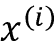
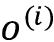
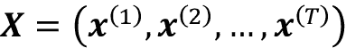

# Sixteen

# 变形金刚——利用注意力机制改善自然语言处理

在前一章中，我们通过一个情感分析项目了解了**递归神经网络** ( **RNNs** )及其在**自然语言处理** ( **NLP** )中的应用。然而，最近出现了一种新的架构，它在几个 NLP 任务中表现出了优于基于RNN**序列到序列** ( **seq2seq** )模型的性能。这就是所谓的**变压器**架构。

变形金刚彻底改变了自然语言处理，并一直处于许多令人印象深刻的应用的最前沿，从自动语言翻译([https://AI . Google blog . com/2020/06/recent-advances-in-Google-translate . html](https://ai.googleblog.com/2020/06/recent-advances-in-google-translate.html))和模拟蛋白质序列的基本属性([https://www.pnas.org/content/118/15/e2016239118.short](https://www.pnas.org/content/118/15/e2016239118.short))到创建一个帮助人们编写代码的人工智能([https://github . blog/2021-06-29-introducing-github-copilot-AI-pair)](https://github.blog/2021-06-29-introducing-github-copilot-ai-pair-programmer)

在这一章中，你将了解到*注意力*和*自我注意力*的基本机制，并了解它们是如何在最初的 transformer 架构中使用的。然后，在了解变压器如何工作的基础上，我们将探索从该架构中出现的一些最有影响力的 NLP 模型，并学习如何在 PyTorch 中使用大规模语言模型，即所谓的 BERT 模型。

我们将讨论以下主题:

*   用注意机制改进 RNNs
*   引入独立的自我关注机制
*   了解原始变压器架构
*   比较基于 transformer 的大规模语言模型
*   用于情感分类的微调 BERT

# 向 RNNs 添加注意机制

在本节中，我们将讨论开发**注意力机制**背后的动机，这有助于预测模型更多地关注输入序列的某些部分，以及它最初是如何在 RNNs 环境中使用的。请注意，这一节提供了一个历史的视角，解释了为什么注意机制被开发出来。如果个别数学细节看起来很复杂，你可以随意跳过它们，因为下一节解释变形金刚的自我关注机制时不需要它们，这是本章的重点。

## 注意力帮助 RNNs 获取信息

为了理解注意力机制的发展，考虑传统的 RNN 模型，用于像语言翻译的 **seq2seq 任务**，它在产生翻译之前解析整个输入序列(例如，一个或多个句子)，如图*图 16.1* 所示:


图 16.1:seq 2 seq 建模任务的传统 RNN 编码器-解码器架构

为什么 RNN 在产生第一个输出之前解析整个输入句子？这是因为逐字翻译句子可能会导致语法错误，如图*图 16.2* 所示:


图 16.2:逐字翻译句子会导致语法错误

然而，如图*图 16.2* 所示，这种 seq2seq 方法的一个限制是，RNN 在翻译之前试图通过一个单独的隐藏单元记住整个输入序列。将所有信息压缩到一个隐藏单元中可能会导致信息丢失，尤其是对于长序列。因此，类似于人类翻译句子的方式，在每个时间步访问整个输入序列可能是有益的。

与常规的 RNN 相比，注意力机制让 RNN 在每个给定的时间步访问所有的输入元素。然而，在每个时间步访问所有的输入序列元素是非常困难的。因此，为了帮助 RNN 关注输入序列中最相关的元素，注意力机制为每个输入元素分配不同的注意力权重。这些注意力权重指定给定输入序列元素在给定时间步长的重要性或相关性。例如，重新查看图 16.2 ，单词“mir，helfen，zu”可能比单词“kannst，du，”更适合生成输出单词“help”

下一小节将介绍一个 RNN 架构，它配备了一个注意力机制来帮助语言翻译处理长序列。

## RNNs 的原始注意机制

在这一小节中，我们将总结最初为语言翻译开发并首次出现在以下论文中的注意力机制的机制:*神经机器翻译通过联合学习对齐和翻译*由 *Bahdanau，d .，Cho，k .，Bengio，y .，* 2014，[https://arxiv.org/abs/1409.0473](https://arxiv.org/abs/1409.0473)。

给定一个输入序列，注意力机制给每个元素(或者更具体地说，它的隐藏表示)分配一个权重，并帮助模型识别它应该关注输入的哪一部分。比如，假设我们的输入是一个句子，权重较大的词对我们理解整个句子的贡献更大。带有注意机制的 RNN 如图*图 16.3* (仿照前面提到的论文)所示，说明了生成第二个输出字的总体概念:


图 16.3:具有注意机制的 RNN

图中描述的基于注意力的架构由两个 RNN 模型组成，我们将在接下来的小节中解释。

## 使用双向 RNN 处理输入

*图 16.3* 中基于注意力的 RNN 的第一个 RNN (RNN #1)是一个生成上下文向量的双向 RNN。您可以将上下文向量看作输入向量的扩充版本。换句话说，输入向量还通过注意机制整合了来自所有其他输入元素的信息。正如我们在*图 16.3* 中看到的，RNN #2 然后使用这个由 RNN #1 准备的上下文向量来生成输出。在这一小节的剩余部分，我们将讨论 RNN #1 是如何工作的，我们将在下一小节再次讨论 RNN #2。

双向 RNN #1 以常规的正向()和反向()处理输入序列 *x* 。反向解析序列与反转原始输入序列具有相同的效果——想象一下以相反的顺序阅读一个句子。这背后的基本原理是捕获额外的信息，因为当前输入可能依赖于在句子中出现在它之前或之后的序列元素，或者两者都有。

因此，从读取输入序列两次(即向前和向后)，我们对每个输入序列元素有两个隐藏状态。例如，对于第二个输入序列元素，我们通过向前传递获得隐藏状态，通过向后传递获得隐藏状态。这两个隐藏状态然后被连接以形成隐藏状态。例如，如果和都是 128 维向量，则级联的隐藏状态将由 256 个元素组成。我们可以将这种连接的隐藏状态视为源单词的“注释”,因为它包含两个方向上第 *j* 个单词的信息。

在下一节中，我们将看到第二个 RNN 如何进一步处理和使用这些级联的隐藏状态来生成输出。

## 从上下文向量生成输出

在*图 16.3* 中，我们可以认为 RNN #2 是产生输出的主 RNN。除了隐藏状态，它还接收所谓的上下文向量作为输入。上下文向量是级联隐藏状态的加权版本，它是我们在前一小节中从 RNN #1 获得的。我们可以将第 *i* 个输入的上下文向量计算为加权和:


这里，表示在第 *i* 个输入序列元素的上下文中，输入序列上的注意力权重。注意，每个第 *i* 个输入序列元素具有唯一的一组注意力权重。我们将在下一小节讨论注意力权重的计算。

对于本小节的剩余部分，让我们讨论如何通过上图中的第二个 RNN(RNN # 2)使用上下文向量。就像普通的 RNN 一样，RNN #2 也使用隐藏状态。考虑到上述“注释”和最终输出之间的隐藏层，让我们将时间处的隐藏状态表示为。现在，RNN #2 在每个时间步 *i* 接收前述上下文向量作为输入。

在*图 16.3* 中，我们看到隐藏状态依赖于前一个隐藏状态、前一个目标词和上下文向量，用于在时间 *i* 生成目标词的预测输出。注意，序列向量指的是表示训练期间可用的输入序列的正确翻译的序列向量。训练时，真标签(单词)被送入下一个状态；因为这个真实的标签信息不可用于预测(推断)，所以我们提供预测输出,如上图所示。

总结一下我们刚刚在上面讨论的内容，基于注意力的 RNN 由两个 rnn 组成。RNN #1 从输入序列元素准备上下文向量，而 RNN #2 接收上下文向量作为输入。通过对输入进行加权求和来计算上下文向量，其中权重是注意力权重下一小节将讨论我们如何计算这些注意力权重。

## 计算注意力权重

最后，让我们来看看拼图中最后一个缺失的部分——注意力重量。因为这些权重成对地连接输入(注释)和输出(上下文)，每个注意力权重有两个下标: *j* 指输入的索引位置， *i* 对应输出索引位置。注意力权重是校准分数的归一化版本，其中校准分数评估位置 *j* 周围的输入与位置 *i* 处的输出的匹配程度。更具体地说，注意力权重是通过如下归一化对齐分数来计算的:


注意，这个等式类似于 softmax 函数，我们在*第 12 章*、*用 PyTorch* 并行化神经网络训练、在*部分通过 softmax 函数*估计多类分类中的类概率中讨论了这个函数。因此，注意力权重...合计 1。

现在，总结一下，我们可以把基于注意力的 RNN 模型分为三个部分。第一部分计算输入的双向注释。第二部分由递归块组成，它非常像原始的 RNN，除了它使用上下文向量而不是原始输入。最后一部分涉及注意力权重和上下文向量的计算，它们描述了每对输入和输出元素之间的关系。

transformer 架构也利用了一种注意机制，但与基于注意的 RNN 不同，它只依赖于**自我注意**机制，不包括 RNN 中发现的循环过程。换句话说，transformer 模型一次处理整个输入序列，而不是一次读取和处理一个元素。在下一节中，我们将介绍自我关注机制的基本形式，然后在下一节中更详细地讨论转换器架构。

# 引入自我关注机制

在上一节中，我们看到注意机制可以帮助 RNNs 在处理长序列时记住上下文。正如我们将在下一节看到的，我们可以拥有一个完全基于注意力的架构，没有 RNN 的重复部分。这种基于注意力的架构被称为**转换器**，我们将在后面详细讨论。

其实变形金刚乍一看可以显得有点复杂。所以，在我们下一节讨论变形金刚之前，让我们深入了解一下变形金刚中使用的**自我关注**机制。事实上，正如我们将会看到的，这种自我注意机制只是我们在上一节中讨论的注意机制的一种不同的味道。我们可以把前面讨论的注意机制看作是连接两个不同模块的操作，即 RNN 的编码器和解码器。正如我们将看到的，自我注意只关注输入，只捕捉输入元素之间的依赖关系。而不连接两个模块。

在第一小节中，我们将介绍一种没有任何学习参数的自我注意的基本形式，这非常像对输入的预处理步骤。然后在第二小节中，我们将介绍在 transformer 架构中使用的自我关注的常见版本，它包含可学习的参数。

## 从自我关注的基本形式开始

为了介绍自我关注，让我们假设我们有一个长度为 *T* 、的输入序列和一个输出序列。为了避免混淆，我们将使用作为整个 transformer 模型的最终输出，使用作为自关注层的输出，因为它是模型中的中间步骤。

这些序列中的第 *i* 个元素和是大小为 *d* (即)的向量，表示位置 *i* 处输入的特征信息，类似于 RNNs。然后，对于 seq2seq 任务，自我关注的目标是模拟当前输入元素对所有其他输入元素的依赖性。为了实现这一点，自我注意机制由三个阶段组成。首先，我们基于当前元素和序列中所有其他元素之间的相似性来导出重要性权重。第二，我们归一化权重，这通常涉及到使用已经熟悉的 softmax 函数。第三，我们结合相应的序列元素使用这些权重来计算关注值。

更正式的说法是，自我注意的输出，是所有 *T* 输入序列，(其中)的加权和。例如，对于第 *i* 个输入元素，相应的输出值计算如下:


因此，我们可以将视为输入向量中的上下文感知嵌入向量，该向量涉及所有其他输入序列元素，这些元素通过它们各自的注意力权重进行加权。这里，注意力权重是基于当前输入元素和输入序列中所有其他元素之间的相似性来计算的。更具体地说，这种相似性是在下面段落中解释的两个步骤中计算的。

首先，我们计算当前输入元素和输入序列中另一个元素之间的点积:


在我们归一化值以获得注意力权重之前，让我们用一个代码示例来说明如何计算值。这里，假设我们有一个输入句子“你能帮我翻译这个句子吗”已经通过字典映射到一个整数表示，如*第 15 章*，*使用递归神经网络建模序列数据*中所述:

```py
>>> import torch

>>> sentence = torch.tensor(

>>>     [0, # can

>>>      7, # you     

>>>      1, # help

>>>      2, # me

>>>      5, # to

>>>      6, # translate

>>>      4, # this

>>>      3] # sentence

>>> )

>>> sentence

tensor([0, 7, 1, 2, 5, 6, 4, 3]) 
```

让我们也假设我们已经通过嵌入层将这个句子编码成一个实数向量表示。这里，我们的嵌入大小是 16，我们假设字典大小是 10。下面的代码将产生我们的八个单词的单词嵌入:

```py
>>> torch.manual_seed(123)

>>> embed = torch.nn.Embedding(10, 16)

>>> embedded_sentence = embed(sentence).detach()

>>> embedded_sentence.shape

torch.Size([8, 16]) 
```

现在，我们可以将计算为第 *i* 和第 *j* 个单词嵌入之间的点积。我们可以对所有的值进行如下操作:

```py
>>> omega = torch.empty(8, 8)

>>> for i, x_i in enumerate(embedded_sentence):

>>>     for j, x_j in enumerate(embedded_sentence):

>>>         omega[i, j] = torch.dot(x_i, x_j) 
```

虽然前面的代码易于阅读和理解，但是`for`循环可能非常低效，所以让我们使用矩阵乘法来计算:

```py
>>> omega_mat = embedded_sentence.matmul(embedded_sentence.T) 
```

我们可以使用`torch.allclose`函数来检查这个矩阵乘法是否产生了预期的结果。如果两个张量包含相同的值，`torch.allclose`返回`True`，正如我们在这里看到的:

```py
>>> torch.allclose(omega_mat, omega)

True 
```

我们已经学习了如何为序列中的第 *i* 个输入和所有输入计算基于相似性的权重(到),“原始”权重(到)。我们可以通过熟悉的 softmax 函数归一化值来获得注意力权重，如下所示:


注意，分母包括所有输入元素的总和()。因此，由于应用了这个 softmax 函数，在这个归一化之后，权重将总计为 1，也就是说，


我们可以使用 PyTorch 的 softmax 函数计算注意力权重，如下所示:

```py
>>> import torch.nn.functional as F

>>> attention_weights = F.softmax(omega, dim=1)

>>> attention_weights.shape

torch.Size([8, 8]) 
```

注意，`attention_weights`是一个矩阵，其中每个元素代表一个注意力权重。例如，如果我们正在处理第 *i* 个输入单词，这个矩阵的第 *i* 行包含句子中所有单词的相应注意力权重。这些注意力权重表明每个单词与第*个单词的相关程度。因此，这个注意力矩阵中的列的总和应该是 1，我们可以通过下面的代码来确认这一点:*

```py
>>> attention_weights.sum(dim=1)

tensor([1.0000, 1.0000, 1.0000, 1.0000, 1.0000, 1.0000, 1.0000, 1.0000]) 
```

现在我们已经看到了如何计算注意力权重，让我们回顾和总结自我注意力操作背后的三个主要步骤:

1.  对于给定的输入元素，和集合{1，...， *T* }，计算点积，
2.  通过使用 softmax 函数归一化点积，获得注意力权重
3.  计算输出，作为整个输入序列的加权和:

这些步骤在*图 16.4* 中进一步说明:


图 16.4:用于说明目的的基本自我注意过程

最后，让我们看一个计算上下文向量的代码示例，作为输入的注意力加权和(图 16.4 中*的步骤 3)。特别地，让我们假设我们正在计算第二个输入单词的上下文向量，即:*

```py
>>> x_2 = embedded_sentence[1, :]

>>> context_vec_2 = torch.zeros(x_2.shape)

>>> for j in range(8):

...     x_j = embedded_sentence[j, :]

...     context_vec_2 += attention_weights[1, j] * x_j 

>>> context_vec_2

tensor([-9.3975e-01, -4.6856e-01,  1.0311e+00, -2.8192e-01,  4.9373e-01, -1.2896e-02, -2.7327e-01, -7.6358e-01,  1.3958e+00, -9.9543e-01,

-7.1288e-04,  1.2449e+00, -7.8077e-02,  1.2765e+00, -1.4589e+00,

-2.1601e+00]) 
```

同样，我们可以通过使用矩阵乘法更有效地实现这一点。使用下面的代码，我们计算所有八个输入单词的上下文向量:

```py
>>> context_vectors = torch.matmul(

...     attention_weights, embedded_sentence) 
```

类似于存储在`embedded_sentence`中的输入单词嵌入，`context_vectors`矩阵具有维度。该矩阵的第二行包含第二个输入单词的上下文向量，我们可以再次使用`torch.allclose()`来检查实现:

```py
>>> torch.allclose(context_vec_2, context_vectors[1])

True 
```

正如我们所看到的，第二个上下文向量的手动`for`循环和矩阵计算产生了相同的结果。

本节实现了一种基本形式的自我关注，在下一节中，我们将使用可学习的参数矩阵来修改这种实现，这些参数矩阵可以在神经网络训练期间进行优化。

## 自我注意机制的参数化:标度点积注意

既然已经向您介绍了自我关注背后的基本概念，本小节总结了在 transformer 架构中使用的更高级的自我关注机制，称为**比例点积关注**。注意，在前面的小节中，我们在计算输出时没有涉及任何可学习的参数。换句话说，使用先前引入的基本自关注机制，转换器模型在如何在给定序列的模型优化期间更新或改变关注值方面相当有限。为了使自我注意机制更灵活，更适合模型优化，我们将引入三个额外的权重矩阵，它们可以作为模型训练期间的模型参数。我们将这三个权重矩阵表示为、和。它们用于将输入投影到查询、键和值序列元素中，如下所示:

*   **查询顺序**:的
*   **按键顺序**:对应的
*   **值序列**:的

*图 16.5* 说明了如何使用这些单独的组件来计算对应于第二个输入元素的上下文感知嵌入向量:


图 16.5:计算第二个序列元素的上下文感知嵌入向量

**查询、关键字和值术语**

最初的 transformer 文章中使用的术语查询、键和值是受信息检索系统和数据库的启发。例如，如果我们输入一个查询，它将与检索到的特定值的键值进行匹配。

这里，和都是大小为的向量。因此，投影矩阵和具有形状，而具有形状。(注意是每个词向量的维度，。)为了简单起见，我们可以将这些向量设计成具有相同的形状，例如，使用。为了通过代码提供额外的直觉，我们可以如下初始化这些投影矩阵:

```py
>>> torch.manual_seed(123)

>>> d = embedded_sentence.shape[1]

>>> U_query = torch.rand(d, d)

>>> U_key = torch.rand(d, d)

>>> U_value = torch.rand(d, d) 
```

使用查询投影矩阵，我们可以计算查询序列。对于这个例子，考虑第二个输入元素作为我们的查询，如图*图 16.5* 所示:

```py
>>> x_2 = embedded_sentence[1]

>>> query_2 = U_query.matmul(x_2) 
```

以类似的方式，我们可以计算键和值序列，和:

```py
>>> key_2 = U_key.matmul(x_2)

>>> value_2 = U_value.matmul(x_2) 
```

然而，正如我们从*图 16.5* 中看到的，我们还需要所有其他输入元素的键和值序列，我们可以计算如下:

```py
>>> keys = U_key.matmul(embedded_sentence.T).T

>>> values = U_value.matmul(embedded_sentence.T).T 
```

在键矩阵中， *i* 第行对应于第 *i* 个输入元素的键序列，这同样适用于值矩阵。我们可以通过再次使用`torch.allclose()`来确认这一点，它应该返回`True`:

```py
>>> keys = U_key.matmul(embedded_sentence.T).T

>>> torch.allclose(key_2, keys[1])

>>> values = U_value.matmul(embedded_sentence.T).T

>>> torch.allclose(value_2, values[1]) 
```

在上一节中，我们计算了非标准化权重，作为给定输入序列元素和第 *j* 个序列元素之间的成对点积。现在，在这个自我关注的参数化版本中，我们将计算为查询和键之间的点积:


例如，以下代码计算未标准化的关注权重，即我们的查询和第三个输入序列元素之间的点积:

```py
>>> omega_23 = query_2.dot(keys[2])

>>> omega_23

tensor(14.3667) 
```

因为我们以后会需要这些，所以我们可以将这种计算扩大到所有键:

```py
>>> omega_2 = query_2.matmul(keys.T)

>>> omega_2

tensor([-25.1623,   9.3602,  14.3667,  32.1482,  53.8976,  46.6626,  -1.2131, -32.9391]) 
```

自我关注的下一步是使用 softmax 函数，从非标准化的关注权重到标准化的关注权重。然后，在通过 softmax 函数对进行归一化之前，我们可以进一步使用来缩放，如下所示:


注意，将缩放为，其中典型的是，确保了权重向量的欧几里德长度将大致在相同的范围内。

以下代码用于实现这种标准化，以计算整个输入序列相对于作为查询的第二个输入元素的关注权重:

```py
>>> attention_weights_2 = F.softmax(omega_2 / d**0.5, dim=0)

>>> attention_weights_2

tensor([2.2317e-09, 1.2499e-05, 4.3696e-05, 3.7242e-03, 8.5596e-01, 1.4025e-01, 8.8896e-07, 3.1936e-10]) 
```

最后输出的是值序列的加权平均值:，可以实现如下:

```py
>>> context_vector_2 = attention_weights_2.matmul(values)

>>> context_vector_2

tensor([-1.2226, -3.4387, -4.3928, -5.2125, -1.1249, -3.3041, 

-1.4316, -3.2765, -2.5114, -2.6105, -1.5793, -2.8433, -2.4142, 

-0.3998, -1.9917, -3.3499]) 
```

在本节中，我们介绍了一种具有可训练参数的自我注意机制，它允许我们通过涉及所有输入元素来计算上下文感知的嵌入向量，这些元素由它们各自的注意分数来加权。在下一节中，我们将了解 transformer 架构，这是一种以本节介绍的自我关注机制为中心的神经网络架构。

# 我们需要的只是关注:介绍原始的 transformer 架构

有趣的是，最初的 transformer 架构是基于一种注意力机制，这种机制首次用于 RNN。最初，使用注意机制的目的是提高 RNNs 在处理长句时的文本生成能力。然而，在对 RNNs 的注意力机制进行实验仅几年后，研究人员发现，当删除循环层时，基于注意力的语言模型甚至更强大。这导致了和**变压器架构**的发展，这也是本章和其余章节的主题。

NeurIPS 2017 年的论文*中首次提出了变压器架构*由 *A .瓦斯瓦尼*和同事([https://arxiv.org/abs/1706.03762](https://arxiv.org/abs/1706.03762))提出。由于自我关注机制，transformer 模型可以捕获输入序列中元素之间的长期依赖关系——在 NLP 上下文中；例如，这有助于模型更好地“理解”输入句子的含义。

虽然这个 transformer 架构最初是为语言翻译设计的，但是它可以推广到其他任务，比如英语选区解析、文本生成和文本分类。稍后，我们将讨论流行的语言模型，如伯特和 GPT，它们都是从这个原始的变压器架构中派生出来的。*图 16.6* 是我们从最初的 transformer 论文改编而来的，说明了我们将在本节讨论的主要架构和组件:


图 16.6:原始的变压器架构

在接下来的小节中，我们将把这个原始的 transformer 模型分解成两个主要模块:编码器和解码器。编码器接收原始顺序输入，并使用多头自关注模块对嵌入进行编码。解码器接收经过处理的输入，并使用*屏蔽*形式的自我关注输出结果序列(例如，翻译的句子)。

## 通过多头注意力编码上下文嵌入

**编码器**模块的总体目标是接收顺序输入并将其映射为连续表示，然后传递给解码器。

编码器是六个相同层的堆叠。六在这里不是一个神奇的数字，而仅仅是在最初的 transformer 论文中选择的一个超参数。您可以根据模型性能调整层数。在这些相同的层中，有两个子层:一个计算多头自我关注，我们将在下面讨论，另一个是完全连接的层，你已经在前面的章节中遇到过。

先说一下**多头自我关注**，这是本章前面提到的比例点积关注的简单修改。在缩放的点积注意力中，我们使用三个矩阵(对应于查询、值和键)来转换输入序列。在多头注意力的背景下，我们可以把这组三个矩阵想象成一个注意力*头*。正如其名称所示，在多头注意力中，我们现在有多个这样的头(查询、值和键矩阵的集合)，类似于卷积神经网络可以有多个内核。

为了更详细地解释用头的多头自我关注的概念，让我们把它分解成以下步骤。

首先，我们读入顺序输入。假设每个元素被一个长度为 *d* 的向量嵌入。这里，输入可以嵌入到一个矩阵中。然后，我们创建查询、键和值学习参数矩阵的集合:

*   
*   
*   ...
*   

因为我们使用这些权重矩阵来投影每个元素，以便在矩阵乘法中进行所需的维度匹配，所以和都具有形状，而具有形状。因此，结果序列 query 和 key 的长度都是，结果值序列的长度是。在实践中，人们往往为了简单而选择。

为了在代码中说明多头自我关注堆栈，首先考虑我们如何在前面的小节中创建单个查询投影矩阵，*参数化自我关注机制:缩放的点积关注*:

```py
>>> torch.manual_seed(123)

>>> d = embedded_sentence.shape[1]

>>> one_U_query = torch.rand(d, d) 
```

现在，假设我们有八个类似于原始变压器的注意力头，即:

```py
>>> h = 8

>>> multihead_U_query = torch.rand(h, d, d)

>>> multihead_U_key = torch.rand(h, d, d)

>>> multihead_U_value = torch.rand(h, d, d) 
```

正如我们在代码中看到的，只需添加一个额外的维度，就可以添加多个注意力头。

**在多个注意力头上分割数据**

实际上，transformer 实现对所有注意力头使用一个矩阵，而不是对每个注意力头使用一个单独的矩阵。注意力头部然后被组织到该矩阵中逻辑上分离的区域中，这些区域可以通过布尔掩码来访问。这使得更有效地实现多头注意力成为可能，因为多个矩阵乘法可以实现为单个矩阵乘法。然而，为了简单起见，我们在本节中省略了这个实现细节。

在初始化投影矩阵后，我们可以计算投影序列，类似于在缩放的点积注意力中的操作。现在，我们需要计算它们的 *h* 集合，而不是计算一组查询、键和值序列。更正式地，例如，涉及对第 *j* 个头中的第 *i* 个数据点的查询投影的计算可以写成如下:


然后，我们对所有头部重复这一计算。

在代码中，对于作为查询的第二个输入单词，如下所示:

```py
>>> multihead_query_2 = multihead_U_query.matmul(x_2)

>>> multihead_query_2.shape

torch.Size([8, 16]) 
```

`multihead_query_2`矩阵有八行，每行对应第 *j* 个注意力头。

类似地，我们可以计算每个头的键和值序列:

```py
>>> multihead_key_2 = multihead_U_key.matmul(x_2)

>>> multihead_value_2 = multihead_U_value.matmul(x_2)

>>> multihead_key_2[2]

tensor([-1.9619, -0.7701, -0.7280, -1.6840, -1.0801, -1.6778,  0.6763,  0.6547,

         1.4445, -2.7016, -1.1364, -1.1204, -2.4430, -0.5982, -0.8292, -1.4401]) 
```

代码输出通过第三个注意头显示第二个输入元素的键向量。

然而，请记住，我们需要对所有输入序列元素重复计算键和值，而不仅仅是`x_2`——我们稍后需要用它来计算自我关注。一种简单且说明性的方法是将输入序列嵌入扩展到大小为 8 的第一维度，这是注意头的数量。我们为此使用了`.repeat()`方法:

```py
>>> stacked_inputs = embedded_sentence.T.repeat(8, 1, 1)

>>> stacked_inputs.shape

torch.Size([8, 16, 8]) 
```

然后，我们可以通过`torch.bmm()`进行批量矩阵乘法，用注意头计算所有键:

```py
>>> multihead_keys = torch.bmm(multihead_U_key, stacked_inputs)

>>> multihead_keys.shape

torch.Size([8, 16, 8]) 
```

在这段代码中，我们现在有了一个张量，它将指向其第一维中的八个注意力。第二维和第三维分别指嵌入大小和字数。让我们交换第二维度和第三维度，以便按键具有更直观的表示，即与原始输入序列`embedded_sentence`相同的维度:

```py
>>> multihead_keys = multihead_keys.permute(0, 2, 1)

>>> multihead_keys.shape

torch.Size([8, 8, 16]) 
```

重新排列后，我们可以访问第二个注意头中的第二个键值，如下所示:

```py
>>> multihead_keys[2, 1] 

tensor([-1.9619, -0.7701, -0.7280, -1.6840, -1.0801, -1.6778,  0.6763,  0.6547,

         1.4445, -2.7016, -1.1364, -1.1204, -2.4430, -0.5982, -0.8292, -1.4401]) 
```

我们可以看到，这与我们之前通过`multihead_key_2[2]`获得的键值相同，这表明我们复杂的矩阵操作和计算是正确的。因此，让我们对值序列重复一遍:

```py
>>> multihead_values = torch.matmul(

        multihead_U_value, stacked_inputs)

>>> multihead_values = multihead_values.permute(0, 2, 1) 
```

我们按照单个头部注意力计算的步骤来计算上下文向量，如*参数化自我注意力机制:比例点积注意力*部分所述。为了简洁起见，我们将跳过中间步骤，并假设我们已经计算了作为查询的第二个输入元素的上下文向量和八个不同的注意头，我们通过随机数据将其表示为`multihead_z_2`:

```py
>>> multihead_z_2 = torch.rand(8, 16) 
```

注意，第一维索引覆盖八个注意头，上下文向量与输入句子相似，是 16 维向量。如果这看起来很复杂，就把`multihead_z_2`想象成*图 16.5* 中所示的的八个副本；也就是说，八个注意力头中的每一个都有一个。

然后，我们将这些向量连接成一个长度为的长向量，并使用线性投影(通过完全连接的层)将其映射回长度为的向量。这个过程如图*图 16.7* 所示:


图 16.7:将缩放后的点积注意力向量连接成一个向量，并通过线性投影传递

在代码中，我们可以如下实现连接和压缩:

```py
>>> linear = torch.nn.Linear(8*16, 16)

>>> context_vector_2 = linear(multihead_z_2.flatten())

>>> context_vector_2.shape

torch.Size([16]) 
```

总而言之，多头自我关注是并行多次重复缩放的点积关注计算，并组合结果。它在实践中非常有效，因为多个头部有助于模型从输入的不同部分捕获信息，这与多个内核如何在卷积网络中产生多个通道非常相似，其中每个通道可以捕获不同的特征信息。最后，虽然多头注意力听起来计算量很大，但请注意，计算可以并行完成，因为多头之间没有依赖性。

## 学习语言模型:解码器和掩蔽多头注意力

与编码器类似，**解码器**也包含几个重复层。除了我们在前面的编码器部分已经介绍过的两个子层(多头自关注层和全连接层)，每个重复层还包含一个被屏蔽的多头关注子层。

掩蔽注意力是原始注意力机制的一种变体，其中掩蔽注意力仅通过“掩蔽”掉一定数量的单词来将有限的输入序列传递到模型中。例如，如果我们正在建立一个带有标签数据集的语言翻译模型，在训练过程中，在序列位置 *i* ，我们只从位置 1、…、 *i* -1 输入正确的输出单词。所有其他的单词(例如，那些在当前位置之后的单词)对模型隐藏，以防止模型“作弊”这也符合文本生成的本质:虽然训练时知道真实的翻译单词，但在实践中对地面真实情况一无所知。因此，我们只能在位置 *i* 向模型提供它已经生成的解决方案。

*图 16.8* 说明了解码器模块中各层的排列方式:


图 16.8:解码器部分的层排列

首先，将先前的输出单词(输出嵌入)传递到掩蔽的多头注意力层。然后，第二层将来自编码器块的编码输入和被掩蔽的多头关注层的输出接收到多头关注层中。最后，我们将多头注意力输出传递到一个完全连接的层，该层生成整个模型输出:一个对应于输出单词的概率向量。

请注意，我们可以使用 argmax 函数从这些单词概率中获得预测单词，类似于我们在第十五章、*中*使用递归神经网络*对序列数据建模中在递归神经网络中采用的整体方法。*

将解码器与编码器模块进行比较，主要区别在于模型可以处理的序列元素的范围。在编码器中，对于每个给定的单词，在句子中的所有单词上计算注意力，这可以被认为是双向输入解析的一种形式。解码器还从编码器接收双向解析的输入。然而，当涉及到输出序列时，解码器只考虑当前输入位置之前的那些元素，这可以被解释为单向输入解析的一种形式。

## 实现细节:位置编码和层规范化

在这一小节中，我们将讨论到目前为止已经浏览过但值得一提的一些变形金刚的实现细节。

首先，让我们考虑一下**位置编码**，是来自*图 16.6* 的原始变压器架构的一部分。位置编码有助于捕获有关输入序列排序的信息，并且是 transformers 的重要组成部分，因为缩放的点积注意力图层和全连接图层都是排列不变的。这意味着，如果没有位置编码，单词的顺序将被忽略，并且对基于注意力的编码没有任何影响。然而，我们知道词序对于理解一个句子是至关重要的。例如，考虑下面两句话:

1.  玛丽给了约翰一朵花
2.  约翰给了玛丽一朵花

两个句子中出现的单词完全相同；然而，这两个词的意思非常不同。

变换器通过在编码器和解码器块的开始处向输入嵌入添加小值向量，使得不同位置的相同字具有稍微不同的编码。具体来说，原始变压器架构使用所谓的正弦编码:


这里是单词的位置，并且 *k* 表示编码向量的长度，其中我们选择 *k* 具有与输入单词嵌入相同的维数，使得位置编码和单词嵌入可以相加在一起。正弦函数用于防止位置编码变得过大。例如，如果我们使用绝对位置 1，2，3…， *n* 作为位置编码，它们将支配单词编码并使单词嵌入值可以忽略。

一般来说，有两种类型的位置编码，一种是*绝对*编码(如前面公式所示)，一种是*相对*编码。前者将记录单词的绝对位置，并对句子中的单词移位敏感。也就是说，绝对位置编码是每个给定位置的固定向量。另一方面，相对编码只保持单词的相对位置，对句子移位不变。

接下来我们来看**层归一化**机制，该机制由 J. Ba、J.R. Kiros、G.E. Hinton 于 2016 年在同名论文*层归一化*(网址:[https://arxiv.org/abs/1607.06450](https://arxiv.org/abs/1607.06450))中首次提出。虽然批处理规范化(我们将在第 17 章、*合成新数据的生成对抗网络*中详细讨论)在计算机视觉环境中是一种流行的选择，但在句子长度可变的 NLP 环境中，层规范化是首选。*图 16.9* 并列说明了层和批归一化的主要区别:


图 16.9:批标准化和层标准化的比较

传统上，图层规范化是针对给定要素中的所有元素针对每个要素独立执行的，而 transformers 中使用的图层规范化扩展了这一概念，并针对每个训练示例独立计算所有特征值的规范化统计数据。

由于层标准化计算每个训练示例的平均值和标准偏差，它放松了小批量大小的约束或依赖性。与批量归一化相比，层归一化因此能够从小批量和不同长度的数据中学习。但是，请注意，原始的 transformer 架构没有变长输入(句子在需要时被填充)，并且与 RNNs 不同，在模型中没有递归。那么，我们如何证明层规范化的使用优于批规范化呢？变压器通常在非常大的文本语料库上训练，这需要并行计算；这对于批量标准化来说可能很难实现，因为批量标准化在训练示例之间具有依赖性。层规范化没有这种依赖性，因此对于变形器来说是更自然的选择。

# 利用未标记数据构建大规模语言模型

在本节中，我们将讨论从原始变压器发展而来的流行大型变压器模型。这些转换器的一个共同主题是，它们在非常大的无标签数据集上进行了预训练，然后针对各自的目标任务进行了微调。首先，我们将介绍基于变压器的模型的通用训练程序，并解释与最初的变压器有何不同。接下来，将重点介绍流行的大型语言模型，包括**生成式预训练变换器**(**GPT**)**来自变换器** ( **BERT** )的双向编码器表示，以及**双向自回归变换器** ( **BART** )。

## 预训练和微调变压器模型

在前面的章节中，*注意力是我们所需要的:介绍原始的 transformer 架构*，我们讨论了如何将原始的 transformer 架构用于语言翻译。语言翻译是一项受监督的任务，需要一个带标签的数据集，这可能是非常昂贵的。缺乏大型、有标签的数据集是深度学习中的一个长期存在的问题，尤其是像 transformer 这样的模型的，这些模型比其他深度学习架构更需要数据。然而，鉴于每天都会产生大量的文本(书籍、网站和社交媒体帖子)，一个有趣的问题是我们如何使用这些未标记的数据来改善模型训练。

我们是否可以利用《变形金刚》中未标记数据的答案是*是的*，诀窍是一个叫做**自我监督学习**的过程:我们可以从纯文本本身的监督学习中生成“标签”。例如，给定一个大的、未标记的文本语料库，我们训练模型执行**下一个单词预测**，这使模型能够学习单词的概率分布，并可以形成成为强大的语言模型的强大基础。

自我监督学习传统上被称为也称为**无监督预训练**，对于现代基于变压器的模型的成功至关重要。无监督预训练中的“无监督”应该是指我们使用未标记数据的事实；然而，由于我们使用数据的结构来生成标签(例如前面提到的下一个单词预测任务)，所以它仍然是一个有监督的学习过程。

为了进一步阐述无监督预训练和下一个单词预测是如何工作的，如果我们有一个包含 *n* 个单词的句子，预训练过程可以分解为以下三个步骤:

1.  在时间*第一步*，输入真相词 1，…， *i* -1。
2.  请模型预测位置 *i* 处的单词，并将其与基础单词 *i* 进行比较。
3.  更新模型和时间步长， *i* := *i* +1。回到步骤 1，重复直到所有单词都被处理。

我们应该注意到，在下一次迭代中，我们总是给模型提供真实(正确)的单词，而不是模型在前一轮中生成的单词。

预训练的主要思想是利用纯文本，然后转移和微调模型，以执行一些特定的任务，这些任务有(较小的)标记数据集可用。现在，有许多不同类型的预训练技术。例如，前面提到的下一个单词预测任务可以被认为是单向的预训练方法。稍后，我们将介绍在不同语言模型中使用的附加预训练技术，以实现各种功能。

基于转换器的模型的完整训练过程包括两个部分:(1)在大的、未标记的数据集上进行预训练，以及(2)使用标记数据集为特定的下游任务训练(即，微调)模型。在第一步中，预训练模型不是为任何特定任务设计的，而是作为“通用”语言模型训练的。然后，通过第二步，它可以通过在标记数据集上的常规监督学习推广到任何定制的任务。

利用可以从预训练模型获得的表示，主要有两种策略来将模型转移和采用到特定任务:(1)基于特征的方法(T1)和(2)T2 微调方法(T3)。(在这里，我们可以将这些表示视为模型最后一层的隐藏层激活。)

基于特征的方法使用预训练的表示作为标注数据集的附加特征。这就需要我们学会如何从预先训练好的模型中提取句子特征。这种特征提取方法的一个早期模型是由 Peters 和他的同事在 2018 年的论文*深度语境化单词表示*中提出的 **ELMo** ( **来自语言模型的嵌入**)(URL:[https://arxiv.org/abs/1802.05365](https://arxiv.org/abs/1802.05365))。ELMo 是一个预先训练好的双向语言模型，以一定的比率屏蔽单词。具体来说，它在预训练时随机屏蔽了百分之十五的输入单词，建模任务就是填充这些空白，也就是预测缺失(屏蔽)的单词。这不同于我们之前介绍的单向方法，它在时间步 *i* 隐藏所有未来单词。双向掩蔽使模型能够从两端学习，因此可以捕获关于句子的更全面的信息。预先训练的 ELMo 模型可以生成高质量的句子表示，这些句子表示稍后将作为特定任务的输入特征。换句话说，我们可以认为基于特征的方法是一种基于模型的特征提取技术，类似于主成分分析，我们在第 5 章、*通过降维压缩数据*中讨论过。

另一方面，微调方法通过反向传播以常规的监督方式更新预训练的模型参数。与基于特征的方法不同，我们通常还向预训练模型添加另一个完全连接的层，以完成某些任务，如分类，然后根据标记训练集的预测性能更新整个模型。遵循这种方法的一个流行模型是 BERT，它是一个预先训练为双向语言模型的大规模 transformer 模型。我们将在接下来的小节中更详细地讨论 BERT。此外，在本章的最后一节，我们将看到一个代码示例，展示如何使用我们在*第 8 章*、*将机器学习应用于情感分析*和*第 15 章*、*使用递归神经网络*对序列数据建模中使用的电影评论数据集，对预训练的 BERT 模型进行情感分类。

在我们进入下一节并开始讨论流行的基于 transformer 的语言模型之前，下图总结了训练 transformer 模型的两个阶段，并说明了基于功能的方法和微调方法之间的区别:

­­­­

图 16.10:为下游任务采用预训练转换器的两种主要方式

## 利用 GPT 的未标记数据

**生成式预训练转换器** ( **GPT** )是 OpenAI 开发的生成文本的流行系列大型语言模型。最新的模型 GPT-3 于 2020 年 5 月发布，产生了惊人的结果。GPT-3 生成的文本质量很难与人类生成的文本区分开来。在这一节中，我们将讨论 GPT 模型在高层次上是如何工作的，以及它是如何在这些年中发展的。

如*表 16.1* 所列，GPT 车型系列的一个明显变化是参数数量:

| 

**型号**

 | 

**发布年份**

 | 

**参数数量**

 | 

**Title**

 | 

**论文链接**

 |
| GPT 一号 | Two thousand and eighteen | 1.1 亿 | 通过生成性预训练提高语言理解能力 | [https://www . cs . UBC . ca/~ amuham 01/ling 530/papers/radford 2018 improving . pdf](https://www.cs.ubc.ca/~amuham01/LING530/papers/radford2018improving.pdf) |
| GPT-2 | Two thousand and nineteen | 15 亿 | 语言模型是无人监督的多任务学习者 | [https://www . semantic scholar . org/paper/Language-Models-are-Unsupervised-multi task-leaders-9405 cc0d 6169988371 b 2755 e 573 cc 28650d 14 dfe](https://www.semanticscholar.org/paper/Language-Models-are-Unsupervised-Multitask-Learners-Radford-Wu/9405cc0d6169988371b2755e573cc28650d14dfe) |
| GPT-3 | Two thousand and twenty | 1750 亿 | 语言模型是一次性学习者 | [https://arxiv.org/pdf/2005.14165.pdf](https://arxiv.org/pdf/2005.14165.pdf) |

表 16.1:GPT 模型概述

但是我们不要言之过早，先仔细看看 2018 年发布的 GPT-1 模型。它的训练过程可以分解为两个阶段:

1.  对大量未标记的纯文本进行预训练
2.  监督微调

如图 16.11 所示(改编自 GPT-1 的论文)，我们可以将 GPT-1 视为一个转换器，由(1)一个解码器(没有编码器模块)和(2)一个附加层组成，该附加层是后来添加的，用于监督微调以完成特定任务:


图 16.11:GPT 一号变压器

在图中，注意如果我们的任务是*文本预测*(预测下一个单词)，那么在预训练步骤之后，模型就准备好了。否则，例如，如果我们的任务与分类或回归相关，那么就需要有监督的微调。

在预训练期间，GPT-1 利用了一种变压器解码器结构，其中，在给定的字位置，模型仅依靠前面的字来预测下一个字。GPT-1 利用单向的自我关注机制，而不是像伯特那样的双向机制(我们将在本章后面介绍)，因为 GPT-1 专注于文本生成而不是分类。在文本生成过程中，它以自然的从左到右的方向一个接一个地生成单词。这里还有一个值得强调的方面:在训练过程中，对于每个位置，我们总是将正确的单词从先前的位置输入到模型中。然而，在推理过程中，我们只是将模型生成的任何单词输入模型，以便能够生成新的文本。

获得预训练模型(上图中标为 *Transformer* 的模块)后，我们将它插入输入预处理模块和线性层之间，其中线性层用作输出层(类似于我们在本书前面讨论的深度神经网络模型)。对于分类任务，微调非常简单，首先对输入进行表征，然后将其输入到预训练模型和新添加的线性图层中，之后是 softmax 激活函数。然而，对于更复杂的任务，例如问题回答，输入以一定的格式组织，该格式不一定匹配预先训练的模型，这需要为每个任务定制额外的处理步骤。鼓励对具体修改感兴趣的读者阅读 GPT-1 论文以了解更多详细信息(前表中提供了链接)。

GPT-1 在零射击任务 T2 上的表现也令人惊讶，这证明了它有能力成为一个通用语言模型，可以为不同类型的任务定制，只需针对特定任务进行最小的微调。零射击学习通常描述机器学习中的特殊情况，其中在测试和推断期间，模型需要对来自训练期间未观察到的类的样本进行分类。在 GPT 的上下文中，零射击设置指的是看不见的任务。

GPT 的适应性启发研究人员摆脱特定任务的输入和模型设置，这导致了 GPT-2 的开发。与其前身不同，GPT-2 在输入或微调阶段不再需要任何额外的修改。GPT-2 不是重新排列序列以匹配所需的格式，而是可以区分不同类型的输入，并通过较小的提示(即所谓的“上下文”)执行相应的下游任务这是通过模拟以输入和任务类型为条件的输出概率来实现的，而不是只以输入为条件。例如，如果上下文包括`translate to French, English text, French text`，则模型被期望识别翻译任务。

这听起来比 GPT 更“人工智能”，而且确实是除了模型大小之外最显著的改进。正如其对应论文的题目所表明的(*语言模型是无监督的多任务学习器*)，一个无监督的语言模型可能是零射学习的关键，GPT-2 充分利用了零射任务迁移来构建这个多任务学习器。

与 GPT-2 相比，GPT-3 没有那么“雄心勃勃”，因为它将重点从零转移到一次和**通过上下文学习的少量学习**。虽然不提供特定任务的训练示例似乎过于严格，但少量多次学习不仅更现实，而且更像人类:人类通常需要看到一些示例才能学习新任务。顾名思义，少次学习意味着模型看到任务的几个*例子，而一次学习仅限于一个例子。*

*图 16.12* 说明了零触发、单触发、少触发和微调程序之间的区别:


图 16.12:零发射、一次发射和少量发射学习的比较

除了 100 倍的参数大小增加和使用稀疏变压器之外，GPT-3 的模型架构与 GPT-2 几乎相同。在我们之前讨论的原始(密集)注意机制中，每个元素都关注输入中的所有其他元素，这与复杂性成比例。**稀疏注意力**通过只关注有限大小的元素的子集来提高效率，通常与成比例。感兴趣的读者可以通过访问稀疏变压器论文来了解更多关于具体子集选择的信息:*用稀疏变压器生成长序列 Rewon Child 等人*。2019(网址:[https://arxiv.org/abs/1904.10509](https://arxiv.org/abs/1904.10509))。

## 使用 GPT-2 生成新文本

在我们进入下一个 transformer 架构之前，让我们看一下如何使用最新的 GPT 模型来生成新文本。请注意，GPT-3 仍然相对较新，目前只能通过 https://openai.com/blog/openai-api/[的 OpenAI API 获得测试版。然而，GPT-2 的实现已经由拥抱脸(一个流行的 NLP 和机器学习公司；http://huggingface.co](https://openai.com/blog/openai-api/)[，我们就用这个。](http://huggingface.co)

我们将通过`transformers`访问 GPT-2，这是一个非常全面的 Python 库，由 Hugging Face 创建，提供各种基于 transformer 的模型，用于预训练和微调。用户还可以在论坛上讨论和分享他们定制的模型。如果您感兴趣，可以随时查看并参与社区:[https://discuss.huggingface.co](https://discuss.huggingface.co)。

**安装变压器版本 4.9.1**

因为这个包发展迅速，你可能无法复制下面小节中的结果。作为参考，本教程使用 2021 年 6 月发布的 4.9.1 版本。要安装我们在本书中使用的版本，您可以在终端中执行以下命令，从 PyPI 安装它:

```py
pip install transformers==4.9.1 
```

我们还建议查看官方安装页面上的最新说明:

[https://huggingface.co/transformers/installation.html](https://huggingface.co/transformers/installation.html)

一旦我们安装了`transformers`库，我们可以运行下面的代码来导入一个预训练的 GPT 模型，它可以生成新的文本:

```py
>>> from transformers import pipeline, set_seed

>>> generator = pipeline('text-generation', model='gpt2') 
```

然后，我们可以用一个文本片段提示模型，并要求它根据输入片段生成新的文本:

```py
>>> set_seed(123)

>>> generator("Hey readers, today is",

...           max_length=20,

...           num_return_sequences=3)

[{'generated_text': "Hey readers, today is not the last time we'll be seeing one of our favorite indie rock bands"},

 {'generated_text': 'Hey readers, today is Christmas. This is not Christmas, because Christmas is so long and I hope'},

 {'generated_text': "Hey readers, today is CTA Day!\n\nWe're proud to be hosting a special event"}] 
```

从输出中我们可以看到，该模型根据我们的文本片段生成了三个合理的句子。如果您想探索更多的例子，请随意更改随机种子和最大序列长度。

此外，正如前面图 16.10 中*所示的，我们可以使用一个 transformer 模型来生成用于训练其他模型的特征。以下代码说明了如何使用 GPT-2 根据输入文本生成要素:*

```py
>>> from transformers import GPT2Tokenizer

>>> tokenizer = GPT2Tokenizer.from_pretrained('gpt2')

>>> text = "Let us encode this sentence"

>>> encoded_input = tokenizer(text, return_tensors='pt')

>>> encoded_input

{'input_ids': tensor([[ 5756,   514, 37773,   428,  6827]]), 'attention_mask': tensor([[1, 1, 1, 1, 1]])} 
```

这段代码将输入的句子文本编码成 GPT-2 模型的标记化格式。正如我们所看到的，它将字符串映射为整数表示形式，并将注意掩码设置为全 1，这意味着当我们将编码的输入传递给模型时，所有单词都将被处理，如下所示:

```py
>>> from transformers import GPT2Model

>>> model = GPT2Model.from_pretrained('gpt2')

>>> output = model(**encoded_input) 
```

`output`变量存储最后一个隐藏状态，也就是我们输入句子的基于 GPT 2 的特征编码:

```py
>>> output['last_hidden_state'].shape

torch.Size([1, 5, 768]) 
```

为了抑制冗长的输出，我们只显示了张量的形状。它的第一个维度是批量(我们只有一个输入文本)，其次是句子长度和特征编码的大小。这里，五个单词中的每一个都被编码成一个 768 维向量。

现在，我们可以将这种特征编码应用于给定的数据集，并基于基于 GPT-2 的特征表示来训练下游分类器，而不是使用在*第 8 章*、*将机器学习应用于情感分析*中讨论的词袋模型。

此外，使用大型预训练语言模型的另一种方法是微调，正如我们前面讨论的那样。我们将在本章的后面看到一个微调的例子。

如果您对使用 GPT-2 的更多细节感兴趣，我们推荐以下文档页面:

*   [https://huggingface.co/gpt2](https://huggingface.co/gpt2)
*   [https://huggingface.co/docs/transformers/model_doc/gpt2](https://huggingface.co/docs/transformers/model_doc/gpt2)

## 使用 BERT 进行双向预训练

**BERT** ，其全称是来自变形金刚的**双向编码器表示，由谷歌研究团队在 2018 年创建( *BERT:深度双向变形金刚语言理解预训练*，作者 *J. Devlin，M. Chang，K. Lee，*和 *K. Toutanova* ，[https://arxiv.org/abs/1810.04805](https://arxiv.org/abs/1810.04805))。作为参考，即使我们不能直接比较 GPT 和伯特，因为它们是不同的架构，伯特有 3.45 亿个参数(这使它仅比 GPT-1 略大，其大小仅为 GPT-2 的 1/5)。**

顾名思义，BERT 有一个基于转换器-编码器的模型结构，它利用了一个双向训练过程。(或者，更准确地说，我们可以认为 BERT 使用了“非定向”训练，因为它一次读入所有输入元素。)在这种设置下，特定单词的编码取决于前面和后面的单词。回想一下，在 GPT，输入元素以自然的从左到右的顺序读入，这有助于形成强大的生成语言模型。双向训练禁用了 BERT 逐字生成句子的能力，但为其他任务(如分类)提供了更高质量的输入编码，因为该模型现在可以双向处理信息。

回想一下，在转换器的编码器中，令牌编码是位置编码和令牌嵌入的总和。在 BERT 编码器中，有一个附加的段嵌入来指示这个令牌属于哪个段。这意味着每个令牌表示包含三种成分，如图*图 16.13* 所示:


图 16.13:为 BERT 编码器准备输入

为什么我们在 BERT 中需要这些额外的细分信息？对这种片段信息的需求源于 BERT 的特殊预训练任务，称为*下一句预测*。在这个预训练任务中，每个训练示例包括两个句子，因此需要特殊的段符号来表示它是属于第一个还是第二个句子。

现在，让我们更详细地看看 BERT 的训练前任务。类似于所有其他基于 transformer 的语言模型，BERT 有两个训练阶段:预训练和微调。并且预训练包括两个无监督的任务:*掩蔽语言建模*和*下一句预测*。

在**掩码语言模型** ( **MLM** )中，记号被随机替换为所谓的*掩码记号*、`[MASK]`，并要求模型预测这些隐藏的单词。与 GPT 的下一个单词预测相比，BERT 中的 MLM 更类似于“填空”，因为该模型可以处理句子中的所有标记(除了被屏蔽的标记)。然而，简单地屏蔽单词会导致预训练和微调之间的不一致，因为`[MASK]`标记不会出现在常规文本中。为了减轻这种情况，对被选择用于屏蔽的单词有进一步的修改。例如，BERT 中 15%的单词被标记为屏蔽。然后，这 15%的随机选择的单词被进一步处理如下:

1.  10%的时间保持单词不变
2.  在 10%的情况下，用随机单词替换原始单词标记
3.  在 80%的情况下，用掩码标记`[MASK]`替换原来的单词标记

除了避免前面提到的在训练过程中引入`[MASK]`标记时预训练和微调之间的不一致，这些修改还有其他好处。首先，不变词包含了保持原令牌信息的可能性；否则，模型只能从上下文中学习，而不能从屏蔽的单词中学习。第二，10%的随机单词防止模型变得懒惰，例如，除了返回给它的东西之外什么也不学。掩蔽、随机化和保持单词不变的概率是通过消融研究选择的(参见 GPT-2 论文)；例如，作者测试了不同的设置，发现这种组合效果最好。

*图 16.14* 举例说明了一个的例子，其中单词 *fox* 被屏蔽，并且以一定的概率保持不变或者被`[MASK]`或 *coffee* 替代。然后要求模型预测被屏蔽(突出显示)的单词是什么，如图*图 16.14* 所示:


图 16.14:MLM 的一个例子

考虑到 BERT 的双向编码，下一句预测是下一个单词预测任务的自然修改。事实上，许多重要的 NLP 任务，如问答，都依赖于文档中两个句子之间的关系。这种关系很难通过常规语言模型来捕捉，因为由于输入长度的限制，下一个单词的预测训练通常发生在单句水平上。

在下一个句子预测任务中，给模型两个句子，A 和 B，格式如下:

CLS A[SEP]B[SEP]

[CLS]是一个分类标记，用作解码器输出中预测标签的占位符，以及表示句子开始的标记。另一方面，附加的[SEP]标记表示每个句子的结尾。然后要求模型对 B 是否是 A 的下一句(“IsNext”)进行分类。为了给模型提供平衡的数据集，50%的样本被标记为“IsNext”，而剩余的样本被标记为“NotNext”

伯特同时接受了这两项任务的预训练，即掩蔽句和下一句预测。这里，BERT 的训练目标是最小化两个任务的组合损失函数。

从预先训练的模型开始，在微调阶段，需要针对不同的下游任务进行特定的修改。每个输入的例子需要匹配一定的格式；例如，如果它由多个句子组成，应该以[CLS]标记开始，并用[SEP]标记分隔。

粗略来说，BERT 可以在四类任务上进行微调:(a)句对分类；(b)单句分类；回答问题；(d)单句标记。

其中，(a)和(b)是序列级分类任务，只需要在[CLS]令牌的输出表示中增加一个额外的 softmax 层。另一方面,( c)和(d)是令牌级分类任务。这意味着该模型将所有相关令牌的输出表示传递给 softmax 层，以预测每个单独令牌的类别标签。

**问题回答**

任务(c)，问题回答，与其他流行的分类任务如情感分类或语音标注相比，似乎较少被讨论。在问题回答中，每个输入示例可以分成两部分，问题和帮助回答问题的段落。该模型需要指出段落中形成问题的正确答案的开始和结束标记。这意味着模型需要为段落中的每个标记生成一个标签，指示这个标记是开始标记还是结束标记，或者都不是。另外，值得一提的是，输出可能包含出现在开始标记之前的结束标记，这将导致在生成答案时发生冲突。这种输出将被认为是问题的“无答案”。

如图*图 16.15* 所示，模型微调设置有一个非常简单的结构:一个输入编码器附加到一个预训练的 BERT 上，并添加一个 softmax 层用于分类。一旦建立了模型结构，所有的参数都将随着学习过程进行调整。


图 16.15:使用 BERT 微调不同的语言任务

## 两全其美:巴特

**双向自回归变换器**，缩写为 **BART** ，由脸书人工智能研究院研究人员于 2019 年开发: *BART:去噪序列到序列预训练，用于自然语言生成、翻译和理解*， *Lewis* 及其同事，[https://arxiv.org/abs/1910.13461](https://arxiv.org/abs/1910.13461)。回想一下，在前面的章节中，我们讨论过 GPT 使用转换器的解码器结构，而伯特使用转换器的编码器结构。这两个模型因此能够很好地执行不同的任务:GPT 的专长是生成文本，而伯特在分类任务上表现更好。巴特可以被看作是 GPT 和伯特的概括。正如本节的标题所示，BART 能够完成这两项任务，即生成文本和对文本进行分类。它能够很好地处理这两项任务的原因是，该模型带有一个双向编码器以及一个从左到右的自回归解码器。

你可能想知道这和原来的变压器有什么不同。模型大小有一些变化，还有一些小的变化，如激活功能的选择。然而，更有趣的变化之一是 BART 可以处理不同的模型输入。最初的 transformer 模型是为语言翻译设计的，因此有两个输入:编码器要翻译的文本(源序列)和解码器的翻译(目标序列)。此外，解码器还接收编码的源序列，如前面的*图 16.6* 所示。然而，在 BART 中，输入格式被一般化，使得它仅使用源序列作为输入。BART 可以执行更广泛的任务，包括语言翻译，其中仍然需要目标序列来计算损失和微调模型，但没有必要将其直接输入解码器。

现在让我们仔细看看巴特的模型结构。如前所述，BART 由双向编码器和自回归解码器组成。在以纯文本形式接收训练示例时，输入将首先被“破坏”,然后被编码器编码。然后，这些输入编码将与生成的令牌一起传递给解码器。将计算编码器输出和原始文本之间的交叉熵损失，然后通过学习过程进行优化。想象一个转换器，其中我们有两种不同语言的文本作为解码器的输入:要翻译的初始文本(源文本)和目标语言的生成文本。BART 可以理解为用损坏的文本替换前者，用输入文本本身替换后者。


图 16.16:巴特的模型结构

为了更详细地解释这一步，回想一下，伯特和 GPT 是通过重构掩蔽词来进行预训练的:伯特是在“填空”，GPT 是在“预测下一个词”这些预训练任务也可以被识别为重构损坏的句子，因为掩蔽单词是损坏句子的一种方式。BART 提供了以下可应用于明文的破坏方法:

*   令牌屏蔽
*   令牌删除
*   文本填充
*   句子排列
*   文档旋转

上面列出的一种或多种技术可以应用于同一个句子；在最坏的情况下，所有的信息都被污染和破坏，文本变得毫无用处。因此，编码器的效用有限，并且只有解码器模块正常工作，该模型本质上将变得更类似于单向语言。

BART 可以在广泛的下游任务上进行微调，包括(a)序列分类，(b)标记分类，(c)序列生成，以及(d)机器翻译。与 BERT 一样，为了执行不同的任务，需要对输入进行微小的更改。

在序列分类任务中，需要在输入中附加一个标记作为生成的标签标记，类似于 BERT 中的[CLS]标记。此外，未被破坏的输入被送入编码器和解码器，而不是干扰输入，因此模型可以充分利用输入。

对于记号分类，额外的记号变得不必要，并且模型可以直接使用为每个记号生成的表示来进行分类。

由于编码器的存在，BART 中的序列生成与 GPT 略有不同。通过 BART 的序列生成任务更类似于摘要，而不是从头开始生成文本，在摘要中，模型被给予一个上下文语料库，并被要求生成对某些问题的摘要或抽象答案。为此，整个输入序列被送入编码器，而解码器自回归产生输出。

最后，考虑到 BART 和原始变压器之间的相似性，BART 执行机器翻译是很自然的。然而，研究人员没有遵循与训练原始变压器完全相同的程序，而是考虑了将整个 BART 模型作为预训练解码器的可能性。为了完成翻译模型，添加一组新的随机初始化参数作为新的附加编码器。然后，微调阶段可以分两步完成:

1.  首先，冻结除编码器以外的所有参数
2.  然后，更新模型中的所有参数

BART 在几个基准数据集上针对各种任务进行了评估，与其他著名的语言模型(如 BERT)相比，它获得了非常有竞争力的结果。特别是，对于包括抽象问题回答、对话响应和摘要任务在内的生成任务，BART 实现了最先进的结果。

# 在 PyTorch 中微调 BERT 模型

既然我们已经介绍并讨论了原始 transformer 和流行的基于 transformer 的模型背后的所有必要概念和理论，现在是时候来看看更实用的部分了！在本节中，您将学习如何在 PyTorch 中为**情感分类**微调 BERT 模型。

请注意，虽然有许多其他基于 transformer 的模型可供选择，但 BERT 在模型流行度和具有可管理模型大小的之间提供了一个良好的平衡，以便可以在单个 GPU 上进行微调。还要注意的是，从零开始预先训练一个 BERT 是很痛苦的，而且考虑到 Hugging Face 提供的`transformers` Python 包的可用性，这是完全没有必要的，该包包括一堆预先训练好的模型，可以随时进行微调。

在接下来的部分中，您将看到如何准备和表征 IMDb 电影评论数据集，并微调提取的 BERT 模型以执行情感分类。我们特意选择情感分类作为一个简单但经典的例子，尽管语言模型还有许多其他有趣的应用。此外，通过使用熟悉的 IMDb 电影评论数据集，我们可以通过将其与第 8 章*、*中的逻辑回归模型*以及第 15 章*、*中的 RNN*、*、*中的使用递归神经网络对序列数据建模进行比较，来更好地了解 BERT 模型的预测性能。

## 加载 IMDb 电影评论数据集

在这一小节中，我们将从加载所需的包和数据集开始，分为训练集、验证集和测试集。

对于本教程中与 BERT 相关的部分，我们将主要使用我们在上一节中安装的由 Hugging Face 创建的开源`transformers`库([https://huggingface.co/transformers/](https://huggingface.co/transformers/)),*使用 GPT-2 生成新文本*。

我们在本章中使用的 **DistilBERT** 模型是一个轻量级的 transformer 模型，它是通过提取一个预先训练好的 BERT 基础模型而创建的。原始的无外壳 BERT 基本模型包含超过 1.1 亿个参数，而 DistilBERT 的参数减少了 40%。此外，在 GLUE 语言理解基准测试中，DistilBERT 运行速度提高了 60 %,但仍保持了 BERT 95%的性能。

以下代码导入了我们将在本章中用来准备数据和微调 DistilBERT 模型的所有包:

```py
>>> import gzip

>>> import shutil

>>> import time

>>> import pandas as pd

>>> import requests

>>> import torch

>>> import torch.nn.functional as F

>>> import torchtext

>>> import transformers

>>> from transformers import DistilBertTokenizerFast

>>> from transformers import DistilBertForSequenceClassification 
```

接下来，我们指定一些常规设置，包括我们训练网络的时期数、设备规格和随机种子。要重现结果，请确保设置一个特定的随机种子，如`123`:

```py
>>> torch.backends.cudnn.deterministic = True

>>> RANDOM_SEED = 123

>>> torch.manual_seed(RANDOM_SEED)

>>> DEVICE = torch.device('cuda' if torch.cuda.is_available() else 'cpu')

>>> NUM_EPOCHS = 3 
```

我们将致力于 IMDb 电影评论数据集，你已经在第 8 章和第 15 章中看到了。以下代码获取压缩的数据集并将其解压缩:

```py
>>> url = ("https://github.com/rasbt/"

...        "machine-learning-book/raw/"

...        "main/ch08/movie_data.csv.gz")

>>> filename = url.split("/")[-1]

>>> with open(filename, "wb") as f:

...     r = requests.get(url)

...     f.write(r.content)

>>> with gzip.open('movie_data.csv.gz', 'rb') as f_in:

...     with open('movie_data.csv', 'wb') as f_out:

...         shutil.copyfileobj(f_in, f_out) 
```

如果你的硬盘上还有第八章中的`movie_data.csv`文件，你可以跳过这个下载和解压程序。

接下来，我们将数据加载到一个熊猫`DataFrame`中，并确保它看起来一切正常:

```py
>>> df = pd.read_csv('movie_data.csv')

>>> df.head(3) 
```


图 16.17:IMDb 电影评论数据集的前三行

下一步是将数据集分成单独的训练集、验证集和测试集。这里，我们将 70%的评论用于训练集，10%用于验证集，剩下的 20%用于测试:

```py
>>> train_texts = df.iloc[:35000]['review'].values

>>> train_labels = df.iloc[:35000]['sentiment'].values

>>> valid_texts = df.iloc[35000:40000]['review'].values

>>> valid_labels = df.iloc[35000:40000]['sentiment'].values

>>> test_texts = df.iloc[40000:]['review'].values

>>> test_labels = df.iloc[40000:]['sentiment'].values 
```

## 对数据集进行符号化

到目前为止，我们已经获得了训练集、验证集和测试集的文本和标签。现在，我们将使用从预训练模型类继承的标记器实现将文本标记为单个单词标记:

```py
>>> tokenizer = DistilBertTokenizerFast.from_pretrained(

...     'distilbert-base-uncased'

... )

>>> train_encodings = tokenizer(list(train_texts), truncation=True, padding=True)

>>> valid_encodings = tokenizer(list(valid_texts), truncation=True, padding=True)

>>> test_encodings = tokenizer(list(test_texts), truncation=True, padding=True) 
```

**选择不同的记号赋予器**

如果你对应用不同类型的记号赋予器感兴趣，可以随意探索的`tokenizers`包(【https://huggingface.co/docs/tokenizers/python/latest/】)也是由拥抱脸构建和维护的。然而，继承的标记器保持预训练模型和数据集之间的一致性，这节省了我们寻找与模型对应的特定标记器的额外努力。换句话说，如果您想要微调预先训练好的模型，使用继承的标记器是推荐的方法。

最后，让我们将所有东西打包到一个名为`IMDbDataset`的类中，并创建相应的数据加载器。这样一个自定义的数据集类允许我们以`DataFrame`格式为我们的自定义电影评论数据集定制所有相关的特性和功能:

```py
>>> class IMDbDataset(torch.utils.data.Dataset):

...     def __init__(self, encodings, labels):

...         self.encodings = encodings

...         self.labels = labels

>>>     def __getitem__(self, idx):

...         item = {key: torch.tensor(val[idx]) 

...                 for key, val in self.encodings.items()}

...         item['labels'] = torch.tensor(self.labels[idx])

...         return item

>>>     def __len__(self):

...         return len(self.labels)

>>> train_dataset = IMDbDataset(train_encodings, train_labels)

>>> valid_dataset = IMDbDataset(valid_encodings, valid_labels)

>>> test_dataset = IMDbDataset(test_encodings, test_labels)

>>> train_loader = torch.utils.data.DataLoader(

...     train_dataset, batch_size=16, shuffle=True) 

>>> valid_loader = torch.utils.data.DataLoader(

...     valid_dataset, batch_size=16, shuffle=False) 

>>> test_loader = torch.utils.data.DataLoader(

...     test_dataset, batch_size=16, shuffle=False) 
```

虽然数据加载器的总体设置在前面的章节中应该很熟悉，但是一个值得注意的细节是`__getitem__`方法中的`item`变量。我们之前生成的编码存储了大量关于标记化文本的信息。通过我们用来将字典分配给`item`变量的字典理解，我们只提取最相关的信息。例如，生成的字典条目包括`input_ids`(词汇中对应于标记的唯一整数)、`labels`(类标签)和`attention_mask`。这里，`attention_mask`是一个具有二进制值(0 和 1)的张量，表示模型应该关注哪些记号。特别地，0 对应于用于将序列填充到相等长度的标记，并且被模型忽略；1 对应于实际的文本标记。

## 加载和微调预训练的 BERT 模型

完成数据准备后，在本小节中，您将看到如何加载预训练的 DistilBERT 模型，并使用我们刚刚创建的数据集对其进行微调。加载预训练模型的代码如下:

```py
>>> model = DistilBertForSequenceClassification.from_pretrained(

...     'distilbert-base-uncased')

>>> model.to(DEVICE)

>>> model.train()

>>> optim = torch.optim.Adam(model.parameters(), lr=5e-5) 
```

`DistilBertForSequenceClassification`指定我们想要微调模型的下游任务，在本例中是序列分类。如前所述，`'distilbert-base-uncased'`是 BERT 无外壳基础模型的轻量级版本，具有可管理的大小和良好的性能。注意，“不区分大小写”意味着模型不区分大写和小写字母。

**使用其他预先训练好的变压器**

*变形金刚*包还提供了许多其他预训练模型和各种下游任务进行微调。在 https://huggingface.co/transformers/的[检查他们。](https://huggingface.co/transformers/)

现在，是时候训练这个模型了。我们可以把它分成两部分。首先，我们需要定义一个精度函数来评估模型性能。注意，这个精度函数计算传统的分类精度。怎么这么啰嗦？在这里，我们逐批加载数据集，以解决在处理大型深度学习模型时 RAM 或 GPU 内存(VRAM)的限制:

```py
>>> def compute_accuracy(model, data_loader, device):

...         with torch.no_grad():

...             correct_pred, num_examples = 0, 0

...             for batch_idx, batch in enumerate(data_loader):

...                 ### Prepare data

...                 input_ids = batch['input_ids'].to(device)

...                 attention_mask = \

...                     batch['attention_mask'].to(device)

...                 labels = batch['labels'].to(device)

...                 outputs = model(input_ids,

...                    attention_mask=attention_mask)

...                 logits = outputs['logits']

...                 predicted_labels = torch.argmax(logits, 1)

...                 num_examples += labels.size(0)

...                 correct_pred += \

...                     (predicted_labels == labels).sum()

...         return correct_pred.float()/num_examples * 100 
```

在`compute_accuracy`函数中，我们加载一个给定的批次，然后从输出中获得预测的标签。在这样做的时候，我们通过`num_examples`跟踪例子的总数。类似地，我们通过`correct_pred`变量跟踪正确预测的数量。最后，在我们迭代完整的数据集之后，我们计算正确预测的标签的比例的准确度。

总的来说，通过`compute_accuracy`函数，您已经可以看到我们如何使用 transformer 模型来获得类标签。也就是说，我们将`input_ids`和`attention_mask`信息一起提供给模型，在这里，这些信息表示一个标记是一个实际的文本标记还是一个用于将序列填充到相等长度的标记。然后，`model`调用返回输出，这是一个特定于 transformer 库的`SequenceClassifierOutput`对象。从这个对象中，我们可以获得 logitss，我们通过`argmax`函数将这些 logit 转换成类标签，就像我们在前面章节中所做的那样。

最后，让我们进入主要部分:训练(或者说，微调)循环。你会注意到，从*变形金刚*库中微调一个模型非常类似于从零开始在 pure PyTorch 中训练一个模型:

```py
>>> start_time = time.time()

>>> for epoch in range(NUM_EPOCHS):

...     model.train()

...     for batch_idx, batch in enumerate(train_loader):

...         ### Prepare data

...         input_ids = batch['input_ids'].to(DEVICE)

...         attention_mask = batch['attention_mask'].to(DEVICE)

...         labels = batch['labels'].to(DEVICE)

...         ### Forward pass

...         outputs = model(input_ids, 

...                         attention_mask=attention_mask,

...                         labels=labels)

...         loss, logits = outputs['loss'], outputs['logits']

...         ### Backward pass

...         optim.zero_grad()

...         loss.backward()

...         optim.step()

...         ### Logging

...         if not batch_idx % 250:

...             print(f'Epoch: {epoch+1:04d}/{NUM_EPOCHS:04d}' 

...                     f' | Batch' 

...                     f'{batch_idx:04d}/'

...                     f'{len(train_loader):04d} | '

...                     f'Loss: {loss:.4f}')

...     model.eval()

...     with torch.set_grad_enabled(False):

...         print(f'Training accuracy: '

...              f'{compute_accuracy(model, train_loader, DEVICE):.2f}%'

...              f'\nValid accuracy: '

...              f'{compute_accuracy(model, valid_loader, DEVICE):.2f}%')

...     print(f'Time elapsed: {(time.time() - start_time)/60:.2f} min')

... print(f'Total Training Time: {(time.time() - start_time)/60:.2f} min')

... print(f'Test accuracy: {compute_accuracy(model, test_loader, DEVICE):.2f}%') 
```

前面的代码产生的输出如下所示(注意，代码不是完全确定的，这就是为什么您得到的结果可能略有不同):

```py
Epoch: 0001/0003 | Batch 0000/2188 | Loss: 0.6771

Epoch: 0001/0003 | Batch 0250/2188 | Loss: 0.3006

Epoch: 0001/0003 | Batch 0500/2188 | Loss: 0.3678

Epoch: 0001/0003 | Batch 0750/2188 | Loss: 0.1487

Epoch: 0001/0003 | Batch 1000/2188 | Loss: 0.6674

Epoch: 0001/0003 | Batch 1250/2188 | Loss: 0.3264

Epoch: 0001/0003 | Batch 1500/2188 | Loss: 0.4358

Epoch: 0001/0003 | Batch 1750/2188 | Loss: 0.2579

Epoch: 0001/0003 | Batch 2000/2188 | Loss: 0.2474

Training accuracy: 96.32%

Valid accuracy: 92.34%

Time elapsed: 20.67 min

Epoch: 0002/0003 | Batch 0000/2188 | Loss: 0.0850

Epoch: 0002/0003 | Batch 0250/2188 | Loss: 0.3433

Epoch: 0002/0003 | Batch 0500/2188 | Loss: 0.0793

Epoch: 0002/0003 | Batch 0750/2188 | Loss: 0.0061

Epoch: 0002/0003 | Batch 1000/2188 | Loss: 0.1536

Epoch: 0002/0003 | Batch 1250/2188 | Loss: 0.0816

Epoch: 0002/0003 | Batch 1500/2188 | Loss: 0.0786

Epoch: 0002/0003 | Batch 1750/2188 | Loss: 0.1395

Epoch: 0002/0003 | Batch 2000/2188 | Loss: 0.0344

Training accuracy: 98.35%

Valid accuracy: 92.46%

Time elapsed: 41.41 min

Epoch: 0003/0003 | Batch 0000/2188 | Loss: 0.0403

Epoch: 0003/0003 | Batch 0250/2188 | Loss: 0.0036

Epoch: 0003/0003 | Batch 0500/2188 | Loss: 0.0156

Epoch: 0003/0003 | Batch 0750/2188 | Loss: 0.0114

Epoch: 0003/0003 | Batch 1000/2188 | Loss: 0.1227

Epoch: 0003/0003 | Batch 1250/2188 | Loss: 0.0125

Epoch: 0003/0003 | Batch 1500/2188 | Loss: 0.0074

Epoch: 0003/0003 | Batch 1750/2188 | Loss: 0.0202

Epoch: 0003/0003 | Batch 2000/2188 | Loss: 0.0746

Training accuracy: 99.08%

Valid accuracy: 91.84%

Time elapsed: 62.15 min

Total Training Time: 62.15 min

Test accuracy: 92.50% 
```

在这段代码中，我们迭代了多个时期。在每个时期，我们执行以下步骤:

1.  将输入加载到我们正在使用的设备中(GPU 或 CPU)
2.  计算模型输出和损耗
3.  通过反向传播损失来调整权重参数
4.  评估训练集和验证集上的模型性能

请注意，不同设备的训练时间可能会有所不同。经过三个时期后，测试数据集的准确率达到了 93%左右，与 RNN 在第 15 章中达到的 85%的测试准确率相比，这是一个实质性的提高。

## 使用训练器 API 更方便地微调变压器

在前面的小节中，我们在 PyTorch 中手动实现了训练循环，以说明微调变压器模型与从头开始训练 RNN 或 CNN 模型没有太大区别。然而，请注意,`transformers`库包含了几个非常好的额外特性，比如 Trainer API，我们将在这一小节中介绍。

拥抱脸提供的训练器 API 针对 transformer 模型进行了优化，具有广泛的训练选项和各种内置功能。当使用 Trainer API 时，我们可以跳过自己编写训练循环的工作，训练或微调 transformer 模型就像函数(或方法)调用一样简单。让我们看看这在实践中是如何工作的。

通过加载预训练模型后

```py
>>> model = DistilBertForSequenceClassification.from_pretrained(

...     'distilbert-base-uncased')

>>> model.to(DEVICE)

>>> model.train(); 
```

上一节中的训练循环可以替换为以下代码:

```py
>>> optim = torch.optim.Adam(model.parameters(), lr=5e-5)

>>> from transformers import Trainer, TrainingArguments

>>> training_args = TrainingArguments(

...     output_dir='./results', 

...     num_train_epochs=3,     

...     per_device_train_batch_size=16, 

...     per_device_eval_batch_size=16,   

...     logging_dir='./logs',

...     logging_steps=10,

... )

>>> trainer = Trainer(

...    model=model,

...    args=training_args,

...    train_dataset=train_dataset,

...    optimizers=(optim, None) # optim and learning rate scheduler

... ) 
```

在前面的代码片段中，我们首先定义了定型参数，这些参数是关于输入和输出位置、时期数和批处理大小的相对自明的设置。我们试图让设置尽可能简单；但是，还有许多其他设置可用，我们建议咨询`TrainingArguments`文档页面以了解更多详细信息:[https://hugging face . co/transformers/main _ classes/trainer . html # training arguments](https://huggingface.co/transformers/main_classes/trainer.html#trainingarguments)。

然后我们将这些`TrainingArguments`设置传递给`Trainer`类来实例化一个新的`trainer`对象。在使用设置、要微调的模型以及训练和评估集初始化`trainer`之后，我们可以通过调用`trainer.train()`方法来训练模型(我们稍后将进一步使用这个方法)。就这样，使用 Trainer API 就像前面的代码一样简单，不需要更多的样板代码。

然而，您可能已经注意到测试数据集并没有包含在这些代码片段中，并且我们在这一小节中没有指定任何评估指标。这是因为训练器 API 只显示训练损失，默认情况下不提供训练过程中的模型评估。有两种方法可以显示最终的模型性能，我们将在下面举例说明。

评估最终模型的第一种方法是定义一个评估函数作为另一个`Trainer`实例的`compute_metrics`参数。`compute_metrics`函数将模型的测试预测作为逻辑(这是模型的默认输出)和测试标签进行操作。为了实例化这个函数，我们建议通过`pip install datasets`安装拥抱脸的`datasets`库，并如下使用它:

```py
>>> from datasets import load_metric

>>> import numpy as np

>>> metric = load_metric("accuracy")

>>> def compute_metrics(eval_pred):

...       logits, labels = eval_pred

...       # note: logits are a numpy array, not a pytorch tensor

...       predictions = np.argmax(logits, axis=-1)

...       return metric.compute(

...           predictions=predictions, references=labels) 
```

更新后的`Trainer`实例化(现在包括`compute_metrics`)如下所示:

```py
>>> trainer=Trainer(

...     model=model,        

...     args=training_args,

...     train_dataset=train_dataset,

...     eval_dataset=test_dataset,

...     compute_metrics=compute_metrics,

...     optimizers=(optim, None) # optim and learning rate scheduler

... ) 
```

现在，让我们训练模型(再次注意，代码不是完全确定的，这就是为什么您可能会得到稍微不同的结果):

```py
>>> start_time = time.time()

>>> trainer.train()

***** Running training *****

  Num examples = 35000

  Num Epochs = 3

  Instantaneous batch size per device = 16

  Total train batch size (w. parallel, distributed & accumulation) = 16

  Gradient Accumulation steps = 1

  Total optimization steps = 6564

Step  Training Loss

10    0.705800

20    0.684100

30    0.681500

40    0.591600

50    0.328600

60    0.478300

...

>>> print(f'Total Training Time: ' 

...       f'{(time.time() - start_time)/60:.2f} min')

Total Training Time: 45.36 min 
```

训练完成后，根据您的 GPU，可能需要一个小时，我们可以调用`trainer.evaluate()`来获得测试集上的模型性能:

```py
>>> print(trainer.evaluate())

***** Running Evaluation *****

Num examples = 10000

Batch size = 16

100%|█████████████████████████████████████████| 625/625 [10:59<00:00,  1.06s/it]

{'eval_loss': 0.30534815788269043,

 'eval_accuracy': 0.9327,

 'eval_runtime': 87.1161,

 'eval_samples_per_second': 114.789,

 'eval_steps_per_second': 7.174,

 'epoch': 3.0} 
```

正如我们可以看到的，评估准确率大约为 94%，类似于我们自己以前使用的 PyTorch 训练循环。(注意，我们已经跳过了训练步骤，因为在前面的`trainer.train()`调用之后，`model`已经被微调了。)在我们的手动训练方法和使用`Trainer`类之间有一个小的差异，因为`Trainer`类使用一些不同的和一些附加的设置。

我们可以用来计算最终测试集精度的第二种方法是重用我们在上一节中定义的`compute_accuracy`函数。我们可以通过运行以下代码，在测试数据集上直接评估微调模型的性能:

```py
>>> model.eval()

>>> model.to(DEVICE)

>>> print(f'Test accuracy: {compute_accuracy(model, test_loader, DEVICE):.2f}%')

Test accuracy: 93.27% 
```

事实上，如果您想在训练期间定期检查模型的性能，您可以通过如下定义训练参数，要求训练者在每个时期后打印模型评估:

```py
>>> from transformers import TrainingArguments

>>> training_args = TrainingArguments("test_trainer", 

...     evaluation_strategy="epoch", ...) 
```

但是，如果您计划更改或优化超参数，并多次重复微调过程，我们建议为此使用验证集，以保持测试集的独立性。我们可以通过使用`valid_dataset`实例化`Trainer`来实现这一点:

```py
>>> trainer=Trainer(

...     model=model,        

...     args=training_args,

...     train_dataset=train_dataset,

...     eval_dataset=valid_dataset,

...     compute_metrics=compute_metrics,

... ) 
```

在这一节中，我们看到了如何微调用于分类的 BERT 模型。这与使用其他深度学习架构如 RNNs 不同，我们通常从零开始训练。然而，除非我们正在进行研究，并试图开发新的变压器架构——这是一项非常昂贵的工作——否则没有必要预先训练变压器模型。由于 transformer 模型是在通用的、未标记的数据集资源上训练的，因此我们自己对它们进行预训练可能不是对我们的时间和资源的良好利用；微调是必由之路。

# 摘要

在这一章中，我们介绍了一种全新的自然语言处理模型架构，即 transformer 架构。transformer 架构建立在一个叫做自我关注的概念之上，我们开始一步一步地引入这个概念。首先，我们看了一个为了提高长句翻译能力而配备了注意力的 RNN。然后，我们轻轻地介绍了自我关注的概念，并解释了它是如何在变压器内的多头关注模块中使用的。

自最初的 transformer 于 2017 年发布以来，transformer 架构的许多不同衍生产品已经出现并发展。在这一章中，我们重点介绍了一些最受欢迎的模型:GPT 模型族、伯特模型和巴特模型。GPT 模型是一个单向模型，特别擅长生成新文本。BERT 采用双向方法，这更适合其他类型的任务，例如分类。最后，BART 结合了 BERT 公司的双向编码器和 GPT 公司的单向解码器。感兴趣的读者可以通过以下两篇调查文章了解更多基于变压器的架构:

1.  *自然语言处理预训练模型:*邱*及其同事的调查*，2020。在 https://arxiv.org/abs/2003.08271[有售](https://arxiv.org/abs/2003.08271)
2.  *AMMUS:*Kayan*及其同事于 2021 年对自然语言处理*中基于变压器的预训练模型的调查。在 https://arxiv.org/abs/2108.05542[有售](https://arxiv.org/abs/2108.05542)

变压器模型通常比 rnn 更需要数据，并且需要大量数据进行预训练。预训练利用大量未标记的数据来构建通用语言模型，然后可以通过在较小的标记数据集上进行微调来专门用于特定任务。

为了了解这在实践中是如何工作的，我们从拥抱脸`transformers`库中下载了一个预先训练好的 BERT 模型，并在 IMDb 电影评论数据集上对其进行了微调以进行情感分类。

在下一章，我们将讨论生成敌对网络。顾名思义，生成对立网络是可以用来生成新数据的模型，类似于我们在本章中讨论的 GPT 模型。然而，我们现在将自然语言建模主题抛在身后，将在计算机视觉和生成新图像的背景下研究生成对抗网络，这是这些网络最初设计的任务。

# 加入我们书的不和谐空间

加入该书的 Discord workspace，每月与作者进行一次*向我提问*会议:

[https://packt.link/MLwPyTorch](https://packt.link/MLwPyTorch)

