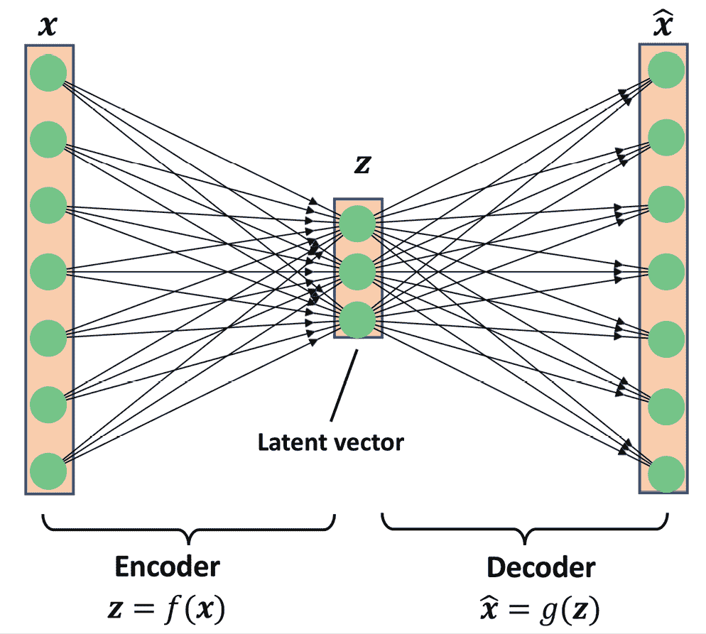
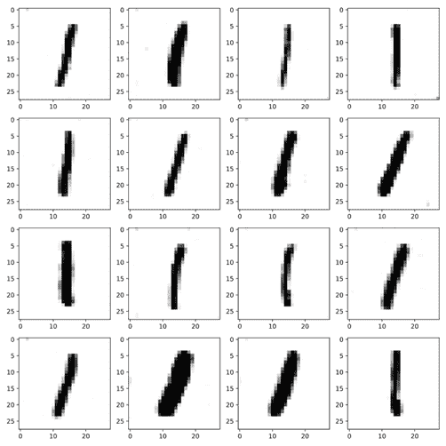

# Seventeen

# 用于合成新数据的生成对抗网络

在前一章中，我们关注了用于建模序列的**递归神经网络**。在这一章中，我们将探索**生成对抗网络** ( **GANs** )，并看到它们在合成新数据样本中的应用。GANs 被认为是深度学习中最重要的突破之一，它允许计算机生成新数据(例如新图像)。

在本章中，我们将讨论以下主题:

*   介绍用于合成新数据的生成模型
*   自动编码器、变分自动编码器及其与 GANs 的关系
*   了解 gan 的构建模块
*   实现简单的 GAN 模型以生成手写数字
*   理解转置卷积和批量**和**归一化
*   改进 GANs:深度卷积 GANs 和使用 Wasserstein 距离的 GANs

# 引入生成性对抗网络

我们先来看看 GAN 模型的基础。GAN 的总体目标是合成与训练数据集具有相同分布的新数据。因此，原始形式的 gan 被认为是机器学习任务的无监督学习类别，因为不需要标记的数据。然而，值得注意的是，对原始 GAN 的扩展可以位于半监督域和监督域中。

2014 年，Ian Goodfellow 和他的同事首次提出了广义 GAN 概念，作为一种使用深度**神经网络** ( **NNs** ) ( *生成对抗网络*)合成新图像的方法，发表在由 I. Goodfellow 、 *J. Pouget-Abadie* 、 *M. Mirza* 、 *B. Xu 虽然本文中提出的初始 GAN 架构基于完全连接的层，类似于多层感知器架构，并经过训练以生成低分辨率的类似 MNIST 的手写数字，但它更多地是作为概念证明来展示这种新方法的可行性。*

然而，自从它被引入以来，最初的作者以及许多其他研究人员已经在工程和科学的不同领域提出了许多改进和各种应用；例如，在计算机视觉中，gan 用于图像到图像的转换(学习如何将输入图像映射到输出图像)、图像超分辨率(从低分辨率版本制作高分辨率图像)、图像修复(学习如何重建图像的缺失部分)以及许多其他应用。例如，GAN 研究的最新进展导致了能够生成新的高分辨率人脸图像的模型。这种高分辨率图像的例子可以在[https://www.thispersondoesnotexist.com/](https://www.thispersondoesnotexist.com/)上找到，它展示了由 GAN 生成的合成人脸图像。

## 从自动编码器开始

在我们讨论 GANs 如何工作之前，我们将首先从自动编码器开始，它可以压缩和解压缩训练数据。虽然标准自动编码器不能生成新数据，但理解它们的功能将有助于您在下一节中浏览 GANs。

自动编码器由两个连接在一起的网络组成:一个编码器网络和一个解码器网络。编码器网络接收与示例 **x** (即)相关联的 *d* 维输入特征向量，并将其编码成 *p* 维向量、 **z** (即)。换句话说，编码器的作用就是学习如何建模函数**z**=*f*(**x**)。编码矢量 **z** ，也被称为**潜在矢量**，或者潜在特征表示。典型地，潜在向量的维数小于输入样本的维数；换句话说， *p* < *d* 。因此，我们可以说编码器起到了数据压缩的作用。然后，解码器从低维潜向量 **z** 中解压，这里我们可以把解码器想象成一个函数。一个简单的自动编码器架构如图*图 17.1* 所示，其中编码器和解码器部分各由一个完全连接的层组成:



图 17.1:自动编码器的架构

**自动编码器和降维之间的联系**

在*第五章*、*降维压缩数据*中，你学习了降维技术，如**主成分分析**(**PCA**)**线性判别分析** ( **LDA** )。自动编码器也可以用作降维技术。事实上，当两个子网络(编码器和解码器)中的任何一个都不存在非线性时，那么自动编码器方法*几乎与 PCA*相同。

在这种情况下，如果我们假设单层编码器(无隐含层，无非线性激活函数)的权重由矩阵 *U* 表示，那么编码器模型**z**=**U**^T**x**。类似地，单层线性解码器模型。将这两个组件放在一起，我们就有了。这正是 PCA 所做的，除了 PCA 有一个额外的正交约束:**UU**^T=**I**[n][×][n]。

虽然*图 17.1* 描述了编码器和解码器中没有隐藏层的自动编码器，但我们当然可以添加多个具有非线性的隐藏层(如在多层神经网络中)，以构建一个深度自动编码器，它可以学习更有效的数据压缩和重建功能。另外，请注意，本节中提到的自动编码器使用完全连接的层。然而，当我们处理图像时，我们可以用卷积层代替完全连接的层，正如你在第十四章*，*用深度卷积神经网络分类图像*中所学的。*

**基于潜在空间大小的其他类型的自动编码器**

如前所述，自动编码器的潜在空间的维度通常低于输入的维度( *p* < *d* )，这使得自动编码器适合于降维。出于这个原因，潜在向量也经常被称为“瓶颈”，自动编码器的这种特殊配置也被称为**欠完成**。然而，有一种不同类别的自动编码器，称为**过完全**，其中潜在向量 *z* 的维度实际上大于输入示例的维度( *p* > *d* )。

当训练过完备自动编码器时，有一个简单的解决方案，编码器和解码器可以简单地学习将输入特征复制(记忆)到它们的输出层。显然，这种解决方案不是很有用。然而，通过对训练程序进行一些修改，过完备自动编码器可以用于*降噪*。

在这种情况下，在训练期间，随机噪声被添加到输入样本，并且网络学习从有噪声的信号中重构干净的样本 *x* 。然后，在评估时，我们提供自然有噪声的新示例(也就是说，噪声已经存在，因此没有添加额外的人为噪声，以便从这些示例中移除现有噪声。这种特殊的自动编码器架构和训练方法被称为*去噪自动编码器*。

如果你感兴趣，你可以在 2010 年(【http://www.jmlr.org/papers/v11/vincent10a.html】)帕斯卡尔·文森特及其同事撰写的研究文章*堆叠去噪自动编码器:在具有局部去噪标准的深度网络中学习有用的表示法*中了解更多信息。

## 合成新数据的生成模型

自动编码器是确定性模型，这意味着在自动编码器被训练之后，给定一个输入， **x** ，它将能够在一个低维空间中从其压缩版本中重建该输入。因此，除了通过压缩表示的变换重建其输入之外，它不能生成新数据。

另一方面，生成模型可以从随机向量 **z** (对应于潜在表示)中生成新的示例。下图显示了创成式模型的示意图。随机向量 **z** 来自一个具有完全已知特征的分布，因此我们可以很容易地从这样的分布中进行采样。例如， **z** 的每个元素可能来自范围[–1，1]中的均匀分布(我们写为)或者来自标准正态分布(在这种情况下，我们写为):


图 17.2:生成模型

当我们将注意力从自动编码器转移到生成模型时，您可能已经注意到自动编码器的解码器组件与生成模型有一些相似之处。特别是，它们都接收一个潜在向量， **z** 作为输入，并在与 **x** 相同的空间中返回一个输出。(对于自动编码器，是输入的重构， **x** ，对于生成模型，是合成样本。)

然而，两者之间的主要区别在于，我们不知道自动编码器中 **z** 的分布，而在生成模型中， **z** 的分布是完全可表征的。然而，将自动编码器归纳成生成模型是可能的。一种方法是**变分自动编码器** ( **VAE** )。

在接收输入示例 **x** 的 VAE 中，编码器网络被修改为计算潜在向量分布的两个矩:平均值和方差。在训练 VAE 的过程中，网络被迫将这些矩与标准正态分布(即，零均值和单位方差)的矩进行匹配。然后，在 VAE 模型被训练之后，编码器被丢弃，并且我们可以使用解码器网络通过馈送来自“学习的”高斯分布的随机 **z** 向量来生成新的示例。

除了 VAEs，还有其他类型的生成模型，例如，*自回归模型*和*归一化流量模型*。然而，在这一章中，我们将只关注 GAN 模型，它是深度学习中最新和最流行的生成模型类型之一。

**什么是生成模型？**

注意，生成模型传统上被定义为对数据输入分布、 *p* ( *x* )或者输入数据和相关目标、 *p* ( *x* 、 *y* )的联合分布进行建模的算法。根据定义，这些模型还能够从某个特征**x**I 中采样，以另一个特征**x**j 为条件，这被称为**条件推理**。然而，在深度学习的背景下，术语**生成模型**通常用于指生成逼真数据的模型。这意味着我们可以从输入分布中取样， *p* ( *x* )，但是我们不一定能够执行条件推理。

## 使用 gan 生成新样品

为了简单地理解 GANs 做什么，让我们首先假设我们有一个网络，它接收从已知分布中采样的随机向量、 **z** ，并生成输出图像 **x** 。我们将这个网络**发生器** ( *G* )称为并使用符号来指代生成的输出。假设我们的目标是生成一些图像，例如，人脸图像，建筑物图像，动物图像，甚至手写数字，如 MNIST。

像往常一样，我们将用随机权重初始化这个网络。因此，在这些权重被调整之前，第一输出图像将看起来像白噪声。现在，想象有一个可以评估图像质量的函数(姑且称之为*评估函数*)。

如果这样的函数存在，我们可以使用来自该函数的反馈来告诉我们的生成器网络如何调整其权重以提高生成的图像的质量。通过这种方式，我们可以基于来自评估器功能的反馈来训练生成器，使得生成器学习改进其输出以产生看起来逼真的图像。

虽然上一段所述的评估器功能会使图像生成任务变得非常容易，但问题是是否存在这种评估图像质量的通用功能，如果存在，如何定义。显然，作为人类，当我们观察网络的输出时，我们可以很容易地评估输出图像的质量；虽然，我们还不能将结果从我们的大脑反向传播到网络中。现在，如果我们的大脑可以评估合成图像的质量，我们是否可以设计一个 NN 模型来做同样的事情？事实上，这就是 GAN 的总体思路。

如图*图 17.3* 所示，GAN 模型包括一个额外的 NN，称为**鉴别器** ( *D* )，它是一个学习从真实图像 **x** 中检测合成图像的分类器:


图 17.3:鉴别器区分真实图像和生成器生成的图像

在 GAN 模型中，发生器和鉴别器这两个网络一起训练。首先，在初始化模型权重之后，生成器创建看起来不真实的图像。类似地，鉴别器在区分真实图像和生成器合成的图像方面表现不佳。但是随着时间的推移(也就是通过训练)，两个网络在相互作用时都会变得更好。事实上，这两个网络在玩一个对抗性的游戏，在这个游戏中，发电机学习提高其输出，以便能够欺骗鉴别器。同时，鉴别器在检测合成图像方面变得更好。

## 理解 GAN 模型中发生器和鉴别器网络的损耗函数

如 *I. Goodfellow* 及其同事([https://papers . nips . cc/paper/5423-Generative-Adversarial-Nets . pdf](https://papers.nips.cc/paper/5423-generative-adversarial-nets.pdf))的原始论文*Generative Adversarial-Nets*中所述，GANs 的目标函数如下:


这里，是被称为**价值函数**的，可以把解释为一个收益:我们要最大化它相对于鉴别器( *D* )的值，而最小化它相对于生成器( *G* )的值，也就是。 *D* ( **x** )是表示输入的例子 **x** 是真的还是假的(即生成)的概率。表达式是指括号中的量相对于数据分布(真实例子的分布)中的例子的期望值；指相对于输入、 **z、**矢量分布的量的期望值。

具有这种价值函数的 GAN 模型的一个训练步骤需要两个优化步骤:(1)最大化鉴别器的收益，以及(2)最小化生成器的收益。训练 GANs 的实际方法是在这两个优化步骤之间交替:(1)固定(冻结)一个网络的参数并优化另一个网络的权重，以及(2)固定第二个网络并优化第一个网络。这个过程应该在每个训练迭代中重复。假设发生器网络是固定的，我们要优化鉴别器。价值函数中的两项都有助于优化鉴别器，其中第一项对应于与真实示例相关联的损失，第二项是虚假示例的损失。因此，当 *G* 固定时，我们的目标是*最大化*T5，这意味着使鉴别器更好地区分真实图像和生成图像。

在使用真假样本的损失项优化鉴别器之后，我们接着修复鉴别器并优化发生器。在这种情况下，只有中的第二项对发电机的梯度有贡献。因此，当 *D* 固定时，我们的目标是*最小化*T5，可以写成。正如 Goodfellow 和他的同事在 GAN 的原始论文中提到的，这个函数在早期训练阶段遭受消失梯度。其原因是，在学习过程的早期，输出 *G* ( **z** )看起来一点也不像真实的例子，因此*D*(*G*(**z**))将以高置信度接近于零。这种现象被称为**饱和**。为了解决这个问题，我们可以将最小化目标改写为。

这种替换意味着，为了训练生成器，我们可以交换真实和虚假示例的标签，并执行常规的函数最小化。换句话说，即使生成器合成的例子是假的，因此被标记为 0，我们也可以通过将标签 1 分配给这些例子来翻转标签，并且*最小化*这些新标签的二进制交叉熵损失，而不是最大化。

现在，我们已经介绍了训练 GAN 模型的一般优化过程，让我们来探索训练 GAN 时可以使用的各种数据标签。假设鉴别器是二进制分类器(假图像和真实图像的类别标签分别为 0 和 1)，我们可以使用二进制交叉熵损失函数。因此，我们可以如下确定鉴频器损耗的基本事实标签:


训练发电机的标签呢？因为我们希望生成器合成真实的图像，所以当它的输出没有被鉴别器归类为真实的时，我们希望惩罚生成器。这意味着，当计算发电机的损失函数时，我们将假设发电机的输出的基础事实标签为 1。

综上所述，下图显示了简单 GAN 模型中的各个步骤:


图 17.4:构建 GAN 模型的步骤

在下一节中，我们将从头实现一个 GAN 来生成新的手写数字。

# 从头开始实施 GAN

在本节中，我们将介绍如何实现和训练 GAN 模型来生成新图像，例如 MNIST 数字。由于在普通的**中央处理器** ( **CPU** )上的训练可能需要很长时间，在接下来的小节中，我们将介绍如何设置Google Colab 环境，这将允许我们在**图形处理器**(**GPU**)上运行计算。

## 在 Google Colab 上训练 GAN 模型

本章中的一些代码示例可能需要大量的计算资源,超出了没有 GPU 的传统笔记本电脑或工作站的能力。如果你已经有一台支持 NVIDIA GPU 的计算机器，安装了 CUDA 和 cuDNN 库，你可以用它来加速计算。

然而，由于我们中的许多人无法访问高性能计算资源，我们将使用 Google Colaboratory 环境(通常称为 Google Colab)，这是一种免费的云计算服务(在大多数国家都可用)。

Google Colab 提供运行在云上的 Jupyter 笔记本实例；笔记本可以保存在 Google Drive 或 GitHub 上。虽然该平台提供了各种不同的计算资源，如 CPU、GPU，甚至**张量处理单元** ( **TPUs** )，但需要强调的是，执行时间目前仅限于 12 小时。因此，任何运行时间超过 12 小时的笔记本都会被中断。

本章中的代码块最多需要两到三个小时的计算时间，所以这不成问题。但是，如果您决定将 Google Colab 用于其他耗时超过 12 小时的项目，请确保使用检查点并保存中间检查点。

**Jupyter 笔记型电脑**

Jupyter Notebook 是一个图形用户界面(GUI ),用于交互式地运行代码，并将其与文本文档和图形交错。由于其多功能性和易用性，它已成为数据科学中最受欢迎的工具之一。

有关通用 Jupyter 笔记本 GUI 的更多信息，请在[https://jupyter-notebook.readthedocs.io/en/stable/](https://jupyter-notebook.readthedocs.io/en/stable/)查看官方文档。本书中的所有代码也以 Jupyter 笔记本的形式提供，在第一章的代码目录中可以找到简短的介绍。

最后，我们强烈推荐 *Adam Rule* 等人的文章*关于在科研项目中有效使用 Jupyter Notebook 的十个简单规则*，该文章可在 https://journals.plos.org/ploscompbiol/article?[免费获得 id = 10.1371/journal . pcbi . 1007007](https://journals.plos.org/ploscompbiol/article?id=10.1371/journal.pcbi.1007007)。

访问 Google Colab 非常简单。你可以访问[https://colab.research.google.com](https://colab.research.google.com)，它会自动把你带到一个提示窗口，在那里你可以看到你现有的 Jupyter 笔记本。在这个提示窗口中，点击 **Google Drive** 选项卡，如图*图 17.5* 所示。这是您将在 Google Drive 上保存笔记本的位置。

然后，要创建新笔记本，请点击提示窗口底部的**新笔记本**链接:


图 17.5:在 Google Colab 中创建新的 Python 笔记本

这将为您创建并打开一个新笔记本。您在该笔记本中编写的所有代码示例都将被自动保存，以后您可以从 Google Drive 中的一个名为 **Colab Notebooks** 的目录中访问该笔记本。

在下一步中，我们希望利用 GPU 来运行笔记本中的代码示例。为此，在笔记本菜单栏的**运行时**选项中，点击**更改运行时类型**，选择 **GPU** ，如图*图 17.6* 所示:


图 17.6:在 Google Colab 中利用 GPU

最后一步，我们只需要安装本章需要的 Python 包。Colab 笔记本环境已经附带了某些包，比如 NumPy、SciPy 和 PyTorch 的最新稳定版本。在撰写本文时，Google Colab 上最新的稳定版本是 PyTorch 1.9。

现在，我们可以使用以下代码测试安装并验证 GPU 是否可用:

```py
>>> import torch

>>> print(torch.__version__)

1.9.0+cu111

>>> print("GPU Available:", torch.cuda.is_available())

GPU Available: True

>>> if torch.cuda.is_available():

...     device = torch.device("cuda:0")

... else:

...     device = "cpu"

>>> print(device)

cuda:0 
```

此外，如果您想将模型保存到您的个人 Google Drive，或者传输或上传其他文件，您需要安装 Google Drive。为此，在笔记本的新单元格中执行以下操作:

```py
>>> from google.colab import drive

>>> drive.mount('/content/drive/') 
```

这将提供一个链接来验证访问您的 Google Drive 的 Colab 笔记本。在遵循认证的指示之后，它将提供一个认证代码，您需要将该代码复制并粘贴到您刚刚执行的单元格下方的指定输入字段中。然后，您的 Google Drive 将在`/content/drive/My Drive`安装并可用。或者，您可以通过 GUI 界面安装它，如图*图 17.7* 所示:


图 17.7:安装你的 Google Drive

## 实现发生器和鉴别器网络

我们将开始实施我们的第一个 GAN 模型，将生成器和鉴别器作为具有一个或多个隐藏层的两个完全连接的网络，如图*图 17.8* 所示:


图 17.8:一个 GAN 模型，其中一个发生器和一个鉴别器是两个完全连接的网络

*图 17.8* 描绘了基于全连接层的原始 GAN，我们称之为*香草 GAN* 。

在这个模型中，对于每个隐藏层，我们将应用泄漏 ReLU 激活函数。使用 ReLU 会产生稀疏的梯度，当我们想要获得输入值全范围的梯度时，这可能不合适。在鉴别器网络中，每个隐藏层后面还有一个漏失层。此外，生成器中的输出层使用双曲正切(tanh)激活函数。(建议对发电机网络使用双曲正切激活，因为它有助于学习。)

鉴别器中的输出层没有激活函数(即线性激活)来获取 logits。或者，我们可以使用 sigmoid 激活函数来获得概率作为输出。

**泄漏整流线性单元(ReLU)激活功能**

在第 12 章、*的*用 PyTorch* 并行化神经网络训练中，我们介绍了可以在神经网络模型中使用的不同非线性激活函数。如果您还记得，ReLU 激活功能被定义为，它抑制负(预激活)输入；也就是说，负输入被设置为零。因此，使用 ReLU 激活函数可能会导致反向传播过程中的稀疏梯度。稀疏梯度并不总是有害的，甚至有利于分类模型。然而，在某些应用中，例如 GANs，获得输入值的整个范围的梯度可能是有益的，我们可以通过对 ReLU 函数进行轻微修改，使其输出负输入的小值来实现。ReLU 函数的这个修改版本也被称为**泄漏 ReLU** 。简而言之，漏 ReLU 激活函数也允许负输入的非零梯度，因此，它使网络整体更具表现力。*

泄漏 ReLU 激活函数定义如下:


图 17.9:泄漏 ReLU 激活函数

这里，决定了负(预激活)输入的斜率。

我们将为两个网络中的每一个定义两个助手函数，从 PyTorch `nn.Sequential`类中实例化一个模型，并按照描述添加层。代码如下:

```py
>>> import torch.nn as nn

>>> import numpy as np

>>> import matplotlib.pyplot as plt

>>> ## define a function for the generator:

>>> def make_generator_network(

...         input_size=20,

...         num_hidden_layers=1,

...         num_hidden_units=100,

...         num_output_units=784):

...     model = nn.Sequential()

...     for i in range(num_hidden_layers):

...         model.add_module(f'fc_g{i}',

...                          nn.Linear(input_size, num_hidden_units))

...         model.add_module(f'relu_g{i}', nn.LeakyReLU())

...         input_size = num_hidden_units

...     model.add_module(f'fc_g{num_hidden_layers}',

...                      nn.Linear(input_size, num_output_units))

...     model.add_module('tanh_g', nn.Tanh())

...     return model

>>> 

>>> ## define a function for the discriminator:

>>> def make_discriminator_network(

...         input_size,

...         num_hidden_layers=1,

...         num_hidden_units=100,

...         num_output_units=1):

...     model = nn.Sequential()

...     for i in range(num_hidden_layers):

...         model.add_module(

...             f'fc_d{i}',

...             nn.Linear(input_size, num_hidden_units, bias=False)

...         )

...         model.add_module(f'relu_d{i}', nn.LeakyReLU())

...         model.add_module('dropout', nn.Dropout(p=0.5))

...         input_size = num_hidden_units

...     model.add_module(f'fc_d{num_hidden_layers}',

...                      nn.Linear(input_size, num_output_units))

...     model.add_module('sigmoid', nn.Sigmoid())

...     return model 
```

接下来，我们将指定模型的训练设置。正如您在前面章节中所记得的，MNIST 数据集中的图像大小是 28×28 像素。(只有一个颜色通道，因为 MNIST 只包含灰度图像。)我们将进一步指定输入向量的大小， **z** 为 20。由于我们正在实施一个非常简单的 GAN 模型，仅用于说明目的，并使用完全连接的层，因此我们将在每个网络中仅使用一个具有 100 个单元的隐藏层。在下面的代码中，我们将指定并初始化两个网络，并打印它们的摘要信息:

```py
>>> image_size = (28, 28)

>>> z_size = 20

>>> gen_hidden_layers = 1

>>> gen_hidden_size = 100

>>> disc_hidden_layers = 1

>>> disc_hidden_size = 100

>>> torch.manual_seed(1)

>>> gen_model = make_generator_network(

...     input_size=z_size,

...     num_hidden_layers=gen_hidden_layers,

...     num_hidden_units=gen_hidden_size,

...     num_output_units=np.prod(image_size)

... )

>>> print(gen_model)

Sequential(

  (fc_g0): Linear(in_features=20, out_features=100, bias=False)

  (relu_g0): LeakyReLU(negative_slope=0.01)

  (fc_g1): Linear(in_features=100, out_features=784, bias=True)

  (tanh_g): Tanh()

)

>>> disc_model = make_discriminator_network(

...     input_size=np.prod(image_size),

...     num_hidden_layers=disc_hidden_layers,

...     num_hidden_units=disc_hidden_size

... )

>>> print(disc_model)

Sequential(

  (fc_d0): Linear(in_features=784, out_features=100, bias=False)

  (relu_d0): LeakyReLU(negative_slope=0.01)

  (dropout): Dropout(p=0.5, inplace=False)

  (fc_d1): Linear(in_features=100, out_features=1, bias=True)

  (sigmoid): Sigmoid()

) 
```

## 定义训练数据集

下一步，我们将从 PyTorch 加载 MNIST 数据集，并应用必要的预处理步骤。由于生成器的输出层使用双曲正切激活函数，合成图像的像素值将在范围(–1，1)内。然而，MNIST 图像的输入像素在范围[0，255]内(数据类型为`PIL.Image.Image`)。因此，在预处理步骤中，我们将使用`torchvision.transforms.ToTensor`函数将输入图像张量转换为张量。因此，除了改变数据类型，调用该函数还会将输入像素强度的范围改变为【0，1】。然后，我们可以将它们移动–0.5，并将它们缩放 0.5 倍，这样像素强度将被重新缩放到范围[–1，1]内，这可以改进基于梯度下降的学习:

```py
>>> import torchvision

>>> from torchvision import transforms

>>> image_path = './'

>>> transform = transforms.Compose([

...     transforms.ToTensor(),

...     transforms.Normalize(mean=(0.5), std=(0.5)),

... ])

>>> mnist_dataset = torchvision.datasets.MNIST(

...     root=image_path, train=True,

...     transform=transform, download=False

... )

>>> example, label = next(iter(mnist_dataset))

>>> print(f'Min: {example.min()} Max: {example.max()}')

>>> print(example.shape)

Min: -1.0 Max: 1.0

torch.Size([1, 28, 28]) 
```

此外，我们还将创建一个随机向量， **z** ，它基于期望的随机分布(在这个代码示例中，均匀分布或正态分布是最常见的选择):

```py
>>> def create_noise(batch_size, z_size, mode_z):

...     if mode_z == 'uniform':

...         input_z = torch.rand(batch_size, z_size)*2 - 1

...     elif mode_z == 'normal':

...         input_z = torch.randn(batch_size, z_size)

...     return input_z 
```

让我们检查一下我们创建的数据集对象。在下面的代码中，我们将获取一批示例，并打印这个输入向量和图像示例的数组形状。此外，为了理解我们的 GAN 模型的整体数据流，在下面的代码中，我们将为我们的生成器和鉴别器处理一个正向传递。

首先，我们将输入的批次， **z** ，向量馈送到生成器，并获得其输出，`g_output`。这将是一批假样本，它们将被馈送到鉴别器模型，以获得该批假样本的概率，`d_proba_fake`。此外，我们从数据集对象获得的经过处理的图像将被馈送到鉴别器模型，这将产生真实例子的概率，`d_proba_real`。代码如下:

```py
>>> from torch.utils.data import DataLoader

>>> batch_size = 32

>>> dataloader = DataLoader(mnist_dataset, batch_size, shuffle=False)

>>> input_real, label = next(iter(dataloader))

>>> input_real = input_real.view(batch_size, -1)

>>> torch.manual_seed(1)

>>> mode_z = 'uniform'  # 'uniform' vs. 'normal'

>>> input_z = create_noise(batch_size, z_size, mode_z)

>>> print('input-z -- shape:', input_z.shape)

>>> print('input-real -- shape:', input_real.shape)

input-z -- shape: torch.Size([32, 20])

input-real -- shape: torch.Size([32, 784])

>>> g_output = gen_model(input_z)

>>> print('Output of G -- shape:', g_output.shape)

Output of G -- shape: torch.Size([32, 784])

>>> d_proba_real = disc_model(input_real)

>>> d_proba_fake = disc_model(g_output)

>>> print('Disc. (real) -- shape:', d_proba_real.shape)

>>> print('Disc. (fake) -- shape:', d_proba_fake.shape)

Disc. (real) -- shape: torch.Size([32, 1])

Disc. (fake) -- shape: torch.Size([32, 1]) 
```

两个概率`d_proba_fake`和`d_proba_real`将用于计算训练模型的损失函数。

## 训练 GAN 模型

下一步，我们将创建一个实例`nn.BCELoss`作为我们的损失函数，并使用它来计算与我们刚刚处理的批处理相关的生成器和鉴别器的二进制交叉熵损失。为此，我们还需要每个输出的基本事实标签。对于生成器，我们将创建一个 1 的向量，其形状与包含生成图像的预测概率的向量`d_proba_fake`相同。对于鉴别器损失，我们有两个术语:检测到涉及`d_proba_fake`的假样本的损失和检测到基于`d_proba_real`的真样本的损失。

虚假术语的基本事实标签将是一个 0 的向量，我们可以通过`torch.zeros()`(或`torch.zeros_like()`)函数生成该向量。类似地，我们可以通过`torch.ones()`(或`torch.ones_like()`)函数生成真实图像的地面真实值，这将创建一个 1 的向量:

```py
>>> loss_fn = nn.BCELoss()

>>> ## Loss for the Generator

>>> g_labels_real = torch.ones_like(d_proba_fake)

>>> g_loss = loss_fn(d_proba_fake, g_labels_real)

>>> print(f'Generator Loss: {g_loss:.4f}')

Generator Loss: 0.6863

>>> ## Loss for the Discriminator

>>> d_labels_real = torch.ones_like(d_proba_real)

>>> d_labels_fake = torch.zeros_like(d_proba_fake)

>>> d_loss_real = loss_fn(d_proba_real, d_labels_real)

>>> d_loss_fake = loss_fn(d_proba_fake, d_labels_fake)

>>> print(f'Discriminator Losses: Real {d_loss_real:.4f} Fake {d_loss_fake:.4f}')

Discriminator Losses: Real 0.6226 Fake 0.7007 
```

前面的代码示例显示了不同损失项的逐步计算，目的是理解训练 GAN 模型背后的整体概念。下面的代码将建立 GAN 模型并实现训练循环，其中我们将在`for`循环中包含这些计算。

我们将首先为真实数据集、生成器和鉴别器模型设置数据加载器，并为这两个模型分别设置一个单独的 Adam 优化器:

```py
>>> batch_size = 64

>>> torch.manual_seed(1)

>>> np.random.seed(1)

>>> mnist_dl = DataLoader(mnist_dataset, batch_size=batch_size,

...                       shuffle=True, drop_last=True)

>>> gen_model = make_generator_network(

...     input_size=z_size,

...     num_hidden_layers=gen_hidden_layers,

...     num_hidden_units=gen_hidden_size,

...     num_output_units=np.prod(image_size)

... ).to(device)

>>> disc_model = make_discriminator_network(

...     input_size=np.prod(image_size),

...     num_hidden_layers=disc_hidden_layers,

...     num_hidden_units=disc_hidden_size

... ).to(device)

>>> loss_fn = nn.BCELoss()

>>> g_optimizer = torch.optim.Adam(gen_model.parameters())

>>> d_optimizer = torch.optim.Adam(disc_model.parameters()) 
```

此外，我们将计算相对于模型权重的损耗梯度，并使用两个独立的 Adam 优化器优化发生器和鉴别器的参数。我们将编写两个实用函数来训练鉴别器和生成器，如下所示:

```py
>>> ## Train the discriminator

>>> def d_train(x):

...     disc_model.zero_grad()

...     # Train discriminator with a real batch

...     batch_size = x.size(0)

...     x = x.view(batch_size, -1).to(device)

...     d_labels_real = torch.ones(batch_size, 1, device=device)

...     d_proba_real = disc_model(x)

...     d_loss_real = loss_fn(d_proba_real, d_labels_real)

...     # Train discriminator on a fake batch

...     input_z = create_noise(batch_size, z_size, mode_z).to(device)

...     g_output = gen_model(input_z)

...     d_proba_fake = disc_model(g_output)

...     d_labels_fake = torch.zeros(batch_size, 1, device=device)

...     d_loss_fake = loss_fn(d_proba_fake, d_labels_fake)

...     # gradient backprop & optimize ONLY D's parameters

...     d_loss = d_loss_real + d_loss_fake

...     d_loss.backward()

...     d_optimizer.step()

...     return d_loss.data.item(), d_proba_real.detach(), \

...            d_proba_fake.detach()

>>>

>>> ## Train the generator

>>> def g_train(x):

...     gen_model.zero_grad()

...     batch_size = x.size(0)

...     input_z = create_noise(batch_size, z_size, mode_z).to(device)

...     g_labels_real = torch.ones(batch_size, 1, device=device)

... 

...     g_output = gen_model(input_z)

...     d_proba_fake = disc_model(g_output)

...     g_loss = loss_fn(d_proba_fake, g_labels_real)

...     # gradient backprop & optimize ONLY G's parameters

...     g_loss.backward()

...     g_optimizer.step()

...     return g_loss.data.item() 
```

接下来，我们将在生成器和鉴别器的训练之间交替进行 100 个时期。对于每个时期，我们将分别记录发生器的损失、鉴别器的损失以及真实数据和虚假数据的损失。此外，在每个时期之后，我们将通过调用`create_samples()`函数，使用当前生成器模型从固定噪声输入中生成一些示例。我们将把合成图像存储在一个 Python 列表中。代码如下:

```py
>>> fixed_z = create_noise(batch_size, z_size, mode_z).to(device)

>>> def create_samples(g_model, input_z):

...     g_output = g_model(input_z)

...     images = torch.reshape(g_output, (batch_size, *image_size))

...     return (images+1)/2.0

>>> 

>>> epoch_samples = []

>>> all_d_losses = []

>>> all_g_losses = []

>>> all_d_real = []

>>> all_d_fake = []

>>> num_epochs = 100

>>> 

>>> for epoch in range(1, num_epochs+1):

...     d_losses, g_losses = [], []

...     d_vals_real, d_vals_fake = [], []

...     for i, (x, _) in enumerate(mnist_dl):

...         d_loss, d_proba_real, d_proba_fake = d_train(x)

...         d_losses.append(d_loss)

...         g_losses.append(g_train(x))

...         d_vals_real.append(d_proba_real.mean().cpu())

...         d_vals_fake.append(d_proba_fake.mean().cpu())

...         

...     all_d_losses.append(torch.tensor(d_losses).mean())

...     all_g_losses.append(torch.tensor(g_losses).mean())

...     all_d_real.append(torch.tensor(d_vals_real).mean())

...     all_d_fake.append(torch.tensor(d_vals_fake).mean())

...     print(f'Epoch {epoch:03d} | Avg Losses >>'

...           f' G/D {all_g_losses[-1]:.4f}/{all_d_losses[-1]:.4f}'

...           f' [D-Real: {all_d_real[-1]:.4f}'

...           f' D-Fake: {all_d_fake[-1]:.4f}]')

...     epoch_samples.append(

...         create_samples(gen_model, fixed_z).detach().cpu().numpy()

...     )

Epoch 001 | Avg Losses >> G/D 0.9546/0.8957 [D-Real: 0.8074 D-Fake: 0.4687]

Epoch 002 | Avg Losses >> G/D 0.9571/1.0841 [D-Real: 0.6346 D-Fake: 0.4155]

Epoch ...

Epoch 100 | Avg Losses >> G/D 0.8622/1.2878 [D-Real: 0.5488 D-Fake: 0.4518] 
```

使用 Google Colab 上的 GPU ，我们在前面的代码块中实现的训练过程应该在不到一个小时的时间内完成。(如果你有一个最新的 CPU 和一个 GPU，它在你的个人电脑上可能会更快。)模型训练完成后，绘制鉴别器和发电机损耗图通常有助于分析两个子网络的行为并评估它们是否收敛。

绘制由鉴别器在每次迭代中计算的一批真实和虚假样本的平均概率也是有帮助的。我们预计这些概率约为 0.5，这意味着鉴别者无法自信地区分真实图像和伪造图像:

```py
>>> import itertools

>>> fig = plt.figure(figsize=(16, 6))

>>> ## Plotting the losses

>>> ax = fig.add_subplot(1, 2, 1)

>>> plt.plot(all_g_losses, label='Generator loss')

>>> half_d_losses = [all_d_loss/2 for all_d_loss in all_d_losses]

>>> plt.plot(half_d_losses, label='Discriminator loss')

>>> plt.legend(fontsize=20)

>>> ax.set_xlabel('Iteration', size=15)

>>> ax.set_ylabel('Loss', size=15)

>>> 

>>> ## Plotting the outputs of the discriminator

>>> ax = fig.add_subplot(1, 2, 2)

>>> plt.plot(all_d_real, label=r'Real: $D(\mathbf{x})$')

>>> plt.plot(all_d_fake, label=r'Fake: $D(G(\mathbf{z}))$')

>>> plt.legend(fontsize=20)

>>> ax.set_xlabel('Iteration', size=15)

>>> ax.set_ylabel('Discriminator output', size=15)

>>> plt.show() 
```

*图 17.10* 显示了结果:


图 17.10:鉴别器性能

从上图中的鉴别器输出可以看出，在训练的早期阶段，鉴别器能够很快学会相当准确地区分真实和虚假示例之间的；也就是说，假例子的概率接近 0，真例子的概率接近 1。原因是假的例子和真的一点也不像；因此，辨别真假是相当容易的。随着训练的进一步进行，生成器将在合成真实图像方面变得更好，这将导致真实和虚假示例的概率接近 0.5。

此外，我们还可以看到生成器的输出，即合成图像，在训练过程中是如何变化的。在下面的代码中，我们将可视化生成器为选定的时期生成的一些图像:

```py
>>> selected_epochs = [1, 2, 4, 10, 50, 100]

>>> fig = plt.figure(figsize=(10, 14))

>>> for i,e in enumerate(selected_epochs):

...     for j in range(5):

...         ax = fig.add_subplot(6, 5, i*5+j+1)

...         ax.set_xticks([])

...         ax.set_yticks([])

...         if j == 0:

...             ax.text(

...                 -0.06, 0.5, f'Epoch {e}',

...                 rotation=90, size=18, color='red',

...                 horizontalalignment='right',

...                 verticalalignment='center',

...                 transform=ax.transAxes

...             )

...         

...         image = epoch_samples[e-1][j]

...         ax.imshow(image, cmap='gray_r')

...     

>>> plt.show() 
```

*图 17.11* 显示了产生的图像:


图 17.11:生成器生成的图像

从*图 17.11* 中可以看出，随着训练的进行，生成器网络产生了越来越逼真的图像。然而，即使在 100 个时代之后，产生的图像看起来仍然与 MNIST 数据集中包含的手写数字非常不同。

在本节中，我们设计了一个非常简单的 GAN 模型，只有一个完全连接的隐藏层用于发生器和鉴别器。在 MNIST 数据集上训练 GAN 模型后，我们能够利用新的手写数字获得有希望的结果，尽管还不令人满意。

正如我们在*第 14 章*、*用深度卷积神经网络对图像进行分类*中了解到的，在图像分类方面，具有卷积层的 NN 架构比全连接层有几个优势。同样，在我们的 GAN 模型中添加卷积层来处理图像数据可能会改善结果。在下一节中，我们将实现一个**深度卷积 GAN** ( **DCGAN** )，它将卷积层用于发生器和鉴别器网络。

# 使用卷积和 Wasserstein GAN 提高合成图像的质量

在此部分，我们将实施一个 DCGAN，将使我们能够提高我们在之前的 GAN 示例中看到的性能。此外，我们将简要介绍一个额外的关键技术，**wasser stein GAN**(**WGAN**)。

我们将在本节中介绍的技术包括以下内容:

*   转置卷积
*   批处理规范化(BatchNorm)
*   WGAN

DCGAN 是 2016 年由 *A .拉德福德*、 *L .梅斯*和 *S .钦塔拉*在他们的文章*深度卷积生成对抗网络的无监督表示学习*中提出的，该文章在[https://arxiv.org/pdf/1511.06434.pdf](https://arxiv.org/pdf/1511.06434.pdf)免费提供。在这篇文章中，研究人员建议对生成器和鉴别器网络都使用卷积层。从一个随机向量 **z** 开始，DCGAN 首先使用一个完全连接的层将 **z** 投影到一个具有适当大小的新向量中，以便它可以被整形为一个空间卷积表示(*h*×*w*×*c*)，该空间卷积表示小于输出图像大小。然后，一系列被称为**转置卷积**的卷积层被用于将特征图上采样到期望的输出图像尺寸。

## 转置卷积

在第 14 章中，你学习了一维和二维空间中的卷积运算。特别是，我们研究了填充和步幅的选择如何改变输出特征图。虽然卷积操作通常用于对特征空间进行下采样(例如，通过将跨距设置为 2，或者通过在卷积层之后添加池层)，但是*转置卷积*操作通常用于对特征空间进行*上采样*。

为了理解转置卷积运算，我们来做一个简单的思维实验。假设我们有一个大小为 *n* × *n* 的输入特征图。然后，我们对这个 *n* × *n* 输入应用具有特定填充和步幅参数的 2D 卷积运算，产生大小为 *m* × *m* 的输出特征图。现在的问题是，我们如何应用另一个卷积运算从这个 *m* × *m* 输出特征图中获得初始维数为 *n* × *n* 的特征图，同时保持输入和输出之间的连接模式？注意，只有 *n* × *n* 输入矩阵的形状被恢复，而不是实际的矩阵值。

这就是转置卷积的作用，如图*图 17.12* 所示:


图 17.12:转置卷积

**转置卷积与反卷积**

转置卷积也叫称为**分数步长卷积**。在深度学习文献中，另一个用来指代转置卷积的常用术语是**去卷积**。但是，请注意，反卷积最初被定义为对特征图 **x** 进行卷积运算 *f* 的逆运算，带有权重参数 **w** ，产生特征图**x′**，*f*[w](**x**)=**x′**。一个反卷积函数，*f*^(–1)，可以定义为。然而，注意转置卷积仅仅关注于恢复特征空间的维度，而不是实际值。

使用转置卷积对特征图进行上采样的工作原理是在输入特征图的元素之间插入 0。*图 17.13* 显示了对大小为 4×4 的输入应用转置卷积的示例，步长为 2×2，核大小为 2×2。中间大小为 9×9 的矩阵显示了将这样的 0 插入输入特征图后的结果。然后，使用步长为 1 的 2×2 内核执行普通卷积，得到大小为 8×8 的输出。我们可以通过对步长为 2 的输出执行常规卷积来验证向后方向，这将产生大小为 4×4 的输出特征图，与原始输入大小相同:


图 17.13:对 4×4 输入应用转置卷积

*图 17.13* 显示了转置卷积的一般工作方式。在各种情况下，输入大小、内核大小、步幅和填充变化都会改变输出。如果你想了解所有这些不同的案例，请参考 2018 年【https://arxiv.org/pdf/1603.07285.pdf[文森特·杜穆林和*弗朗切斯科·维辛*的教程*深度学习卷积算法指南*。)](https://arxiv.org/pdf/1603.07285.pdf)

## 批量标准化

**BatchNorm** 是 Sergey Ioffe 和 Christian Szegedy 于 2015 年在文章*Batch normal:Accelerating Deep Network Training by Reducing Internal co variable Shift*中介绍的，你可以在[https://arxiv.org/pdf/1502.03167.pdf](https://arxiv.org/pdf/1502.03167.pdf)通过 arXiv 访问。BatchNorm 背后的一个主要思想是标准化层输入，并防止它们在训练期间的分布发生变化，从而实现更快更好的收敛。

BatchNorm 基于计算出的统计数据对小批量要素进行变换。假设我们在四维张量中有一个卷积层后得到的净预激活特征图， **Z** ，形状为[*m*×*c*×*h*×*w*]，其中 *m* 是批量中的样本数(即批量大小)， *h* × *w* 是特征图的空间维数，而 BatchNorm 可以总结为三个步骤，如下所示:

1.  Compute the mean and standard deviation of the net inputs for each mini-batch:

    

    其中和都具有尺寸 *c* 。

2.  Standardize the net inputs for all examples in the batch:

    

    其中是数值稳定的小数值(即避免被零除)。

3.  Scale and shift the normalized net inputs using two learnable parameter vectors,  and , of size *c* (number of channels):

    

*图 17.14* 说明了该过程:


图 17.14:批量标准化的过程

在 BatchNorm 的第一步中，计算小批量的平均值和标准偏差。和都是大小为 *c* 的向量(其中 *c* 是通道的数量)。然后，在*步骤 2* 中使用这些统计数据，通过 z 分数标准化(标准化)来缩放每个小批量中的样本，从而产生标准化的净输入。因此，这些净输入以平均值为中心，并具有*单位方差*，这通常是基于梯度下降的优化的有用属性。另一方面，总是归一化净输入，使得它们在不同的小批量中具有相同的属性，这可能是不同的，会严重影响神经网络的代表能力。这可以通过考虑一个特性来理解，该特性在 sigmoid 激活到后，导致值接近 0 的线性区域。因此，在步骤 3 中，可学习参数和是大小为 *c* 的向量(通道数)，允许 BatchNorm 控制归一化特征的移动和扩展。

在训练期间，计算运行平均值和运行方差，它们与调整参数和一起使用，以在评估时标准化测试示例。

【BatchNorm 为什么有助于优化？

最初，开发 BatchNorm 是为了减少所谓的**内部协方差偏移**，内部协方差偏移被定义为由于训练期间更新的网络参数而导致的层激活分布的变化。

为了用一个简单的例子来解释这一点，考虑在时段 1 通过网络的固定批次。我们记录这一批每一层的激活。在遍历整个训练数据集并更新模型参数之后，我们开始第二个时期，其中先前固定的批次通过网络。然后，我们比较第一个和第二个时期的层激活。由于网络参数已经改变，我们观察到激活也已经改变。这种现象被称为**内部协方差移动**，被认为会减缓 NN 训练。

然而，在 2018 年，s·桑图尔卡、d·齐普拉斯、a·易勒雅斯和 a·马德瑞进一步研究了 BatchNorm 如此有效的原因。在他们的研究中，研究人员观察到 BatchNorm 对内部协方差移动的影响是微不足道的。基于他们的实验结果，他们假设 BatchNorm 的有效性是基于损失函数的更平滑的表面，这使得非凸优化更健壮。

如果你有兴趣进一步了解这些结果，通读原文，*批处理规范化如何帮助优化？*，可在[http://papers . nips . cc/paper/7515-how-does-batch-normalization-help-optimization . pdf](http://papers.nips.cc/paper/7515-how-does-batch-normalization-help-optimization.pdf)免费获取。

PyTorch API 提供了一个类，`nn.BatchNorm2d()` ( `nn.BatchNorm1d()`用于 1D 输入)，当定义我们的模型时，我们可以将它用作一个层；它将执行我们为 BatchNorm 描述的所有步骤。注意，更新可学习参数和的行为取决于模型是否是训练模型。这些参数仅在训练期间学习，然后在评估期间用于标准化。

## 实现生成器和鉴别器

至此，我们已经介绍了 DCGAN 模型的主要组件，现在我们将实现它。发生器和鉴频器网络的架构总结在下面的两个图中。

生成器将大小为 100 的向量 **z** 作为输入。然后，使用`nn.ConvTranspose2d()`的一系列转置卷积对特征图进行上采样，直到结果特征图的空间维度达到 28×28。在每个转置卷积层之后，通道的数量减少一半，除了最后一个，其仅使用一个输出滤波器来生成灰度图像。每个转置卷积层之后是 BatchNorm 和 leaky ReLU 激活函数，最后一个除外，它使用 tanh 激活(没有 BatchNorm)。

生成器的架构(每层后的特征映射)如图*图 17.15* 所示:


图 17.15:发电机网络

鉴别器接收大小为 1×28×28 的图像，这些图像通过四个卷积层。前三个卷积层将空间维度减少了 4，同时增加了特征图的通道数量。每个卷积层之后还有 BatchNorm 和 leaky ReLU 激活。最后一个卷积层使用大小为 7×7 的核和一个单个滤波器将输出的空间维度降低到 1×1×1。最后，卷积输出后跟一个 sigmoid 函数，并被压缩到一维:


图 17.16:鉴别器网络

**卷积 gan 的架构设计考虑**

注意到数量的特征图遵循发生器和鉴别器之间的不同趋势。在生成器中，我们从大量的特征地图开始，并随着向最后一层的推进而减少。另一方面，在鉴别器中，我们从少量通道开始，并向最后一层增加。这是设计特征地图的数量和特征地图的空间大小以相反顺序排列的 CNN 的重要一点。当特征图的空间尺寸增加时，特征图的数量减少，反之亦然。

此外，请注意，通常不建议在 BatchNorm 图层之后的图层中使用偏差单位。在这种情况下，使用偏差单位是多余的，因为 BatchNorm 已经有一个移位参数。通过在`nn.ConvTranspose2d`或`nn.Conv2d`中设置`bias=False`，可以省略给定层的偏置单位。

帮助器函数生成生成器和鉴别器网络类的代码如下:

```py
>>> def make_generator_network(input_size, n_filters):

...     model = nn.Sequential(

...         nn.ConvTranspose2d(input_size, n_filters*4, 4,

...                            1, 0, bias=False),

...         nn.BatchNorm2d(n_filters*4),

...         nn.LeakyReLU(0.2),

...         nn.ConvTranspose2d(n_filters*4, n_filters*2,

...                            3, 2, 1, bias=False),

...         nn.BatchNorm2d(n_filters*2),

...         nn.LeakyReLU(0.2),

...         nn.ConvTranspose2d(n_filters*2, n_filters,

...                            4, 2, 1, bias=False),

...         nn.BatchNorm2d(n_filters),

...         nn.LeakyReLU(0.2),

...         nn.ConvTranspose2d(n_filters, 1, 4, 2, 1,

...                            bias=False),

...         nn.Tanh()

...     )

...     return model

>>> 

>>> class Discriminator(nn.Module):

...     def __init__(self, n_filters):

...         super().__init__()

...         self.network = nn.Sequential(

...             nn.Conv2d(1, n_filters, 4, 2, 1, bias=False),

...             nn.LeakyReLU(0.2),

...             nn.Conv2d(n_filters, n_filters*2,

...                       4, 2, 1, bias=False),

...             nn.BatchNorm2d(n_filters * 2),

...             nn.LeakyReLU(0.2),

...             nn.Conv2d(n_filters*2, n_filters*4,

...                       3, 2, 1, bias=False),

...             nn.BatchNorm2d(n_filters*4),

...             nn.LeakyReLU(0.2),

...             nn.Conv2d(n_filters*4, 1, 4, 1, 0, bias=False),

...             nn.Sigmoid()

...         )

... 

...     def forward(self, input):

...         output = self.network(input)

...         return output.view(-1, 1).squeeze(0) 
```

有了 helper 函数和类，您可以构建一个 DCGAN 模型，并通过使用我们在前面的部分中实现简单的全连接 GAN 时初始化的相同的 MNIST 数据集对象来训练它。我们可以使用 helper 函数创建生成器网络，并将其架构打印如下:

```py
>>> z_size = 100

>>> image_size = (28, 28)

>>> n_filters = 32

>>> gen_model = make_generator_network(z_size, n_filters).to(device)

>>> print(gen_model)

Sequential(

  (0): ConvTranspose2d(100, 128, kernel_size=(4, 4), stride=(1, 1), bias=False)

  (1): BatchNorm2d(128, eps=1e-05, momentum=0.1, affine=True, track_running_stats=True)

  (2): LeakyReLU(negative_slope=0.2)

  (3): ConvTranspose2d(128, 64, kernel_size=(3, 3), stride=(2, 2), padding=(1, 1), bias=False)

  (4): BatchNorm2d(64, eps=1e-05, momentum=0.1, affine=True, track_running_stats=True)

  (5): LeakyReLU(negative_slope=0.2)

  (6): ConvTranspose2d(64, 32, kernel_size=(4, 4), stride=(2, 2), padding=(1, 1), bias=False)

  (7): BatchNorm2d(32, eps=1e-05, momentum=0.1, affine=True, track_running_stats=True)

  (8): LeakyReLU(negative_slope=0.2)

  (9): ConvTranspose2d(32, 1, kernel_size=(4, 4), stride=(2, 2), padding=(1, 1), bias=False)

  (10): Tanh()

) 
```

类似地，我们可以生成鉴别器网络并查看其架构:

```py
>>> disc_model = Discriminator(n_filters).to(device)

>>> print(disc_model)

Discriminator(

  (network): Sequential(

    (0): Conv2d(1, 32, kernel_size=(4, 4), stride=(2, 2), padding=(1, 1), bias=False)

    (1): LeakyReLU(negative_slope=0.2)

    (2): Conv2d(32, 64, kernel_size=(4, 4), stride=(2, 2), padding=(1, 1), bias=False)

    (3): BatchNorm2d(64, eps=1e-05, momentum=0.1, affine=True, track_running_stats=True)

    (4): LeakyReLU(negative_slope=0.2)

    (5): Conv2d(64, 128, kernel_size=(3, 3), stride=(2, 2), padding=(1, 1), bias=False)

    (6): BatchNorm2d(128, eps=1e-05, momentum=0.1, affine=True, track_running_stats=True)

    (7): LeakyReLU(negative_slope=0.2)

    (8): Conv2d(128, 1, kernel_size=(4, 4), stride=(1, 1), bias=False)

    (9): Sigmoid()

  )

) 
```

此外，我们可以使用与在*训练 GAN 模型*小节中相同的损失函数和优化器:

```py
>>> loss_fn = nn.BCELoss()

>>> g_optimizer = torch.optim.Adam(gen_model.parameters(), 0.0003)

>>> d_optimizer = torch.optim.Adam(disc_model.parameters(), 0.0002) 
```

我们将对训练程序做一些小的修改。用于产生随机输入的`create_noise()`函数必须改变以输出四维张量而不是矢量:

```py
>>> def create_noise(batch_size, z_size, mode_z):

...     if mode_z == 'uniform':

...         input_z = torch.rand(batch_size, z_size, 1, 1)*2 - 1

...     elif mode_z == 'normal':

...         input_z = torch.randn(batch_size, z_size, 1, 1)

...     return input_z 
```

用于训练鉴别器的`d_train()`函数不需要对输入图像进行整形:

```py
>>> def d_train(x):

...     disc_model.zero_grad()

...     # Train discriminator with a real batch

...     batch_size = x.size(0)

...     x = x.to(device)

...     d_labels_real = torch.ones(batch_size, 1, device=device)

...     d_proba_real = disc_model(x)

...     d_loss_real = loss_fn(d_proba_real, d_labels_real)

...     # Train discriminator on a fake batch

...     input_z = create_noise(batch_size, z_size, mode_z).to(device)

...     g_output = gen_model(input_z)

...     d_proba_fake = disc_model(g_output)

...     d_labels_fake = torch.zeros(batch_size, 1, device=device)

...     d_loss_fake = loss_fn(d_proba_fake, d_labels_fake)

...     # gradient backprop & optimize ONLY D's parameters

...     d_loss = d_loss_real + d_loss_fake

...     d_loss.backward()

...     d_optimizer.step()

...     return d_loss.data.item(), d_proba_real.detach(), \

...            d_proba_fake.detach() 
```

接下来，我们将在生成器和鉴别器的训练之间交替进行 100 个时期。在每个时期之后，我们将通过调用`create_samples()`函数，使用当前生成器模型，从固定噪声输入中生成一些示例。代码如下:

```py
>>> fixed_z = create_noise(batch_size, z_size, mode_z).to(device)

>>> epoch_samples = []

>>> torch.manual_seed(1)

>>> for epoch in range(1, num_epochs+1):

...     gen_model.train()

...     for i, (x, _) in enumerate(mnist_dl):

...         d_loss, d_proba_real, d_proba_fake = d_train(x)

...         d_losses.append(d_loss)

...         g_losses.append(g_train(x))

...     print(f'Epoch {epoch:03d} | Avg Losses >>'

...           f' G/D {torch.FloatTensor(g_losses).mean():.4f}'

...           f'/{torch.FloatTensor(d_losses).mean():.4f}')

...     gen_model.eval()

...     epoch_samples.append(

...         create_samples(

...             gen_model, fixed_z

...         ).detach().cpu().numpy()

...     )

Epoch 001 | Avg Losses >> G/D 4.7016/0.1035

Epoch 002 | Avg Losses >> G/D 5.9341/0.0438

...

Epoch 099 | Avg Losses >> G/D 4.3753/0.1360

Epoch 100 | Avg Losses >> G/D 4.4914/0.1120 
```

最后，让我们将保存的示例在一些时期可视化，以查看模型如何学习，以及合成示例的质量在学习过程中如何变化:

```py
>>> selected_epochs = [1, 2, 4, 10, 50, 100]

>>> fig = plt.figure(figsize=(10, 14))

>>> for i,e in enumerate(selected_epochs):

...     for j in range(5):

...         ax = fig.add_subplot(6, 5, i*5+j+1)

...         ax.set_xticks([])

...         ax.set_yticks([])

...         if j == 0:

...             ax.text(-0.06, 0.5,  f'Epoch {e}',

...                     rotation=90, size=18, color='red',

...                     horizontalalignment='right',

...                     verticalalignment='center',

...                     transform=ax.transAxes)

...         

...         image = epoch_samples[e-1][j]

...         ax.imshow(image, cmap='gray_r')

>>> plt.show() 
```

*图 17.17* 显示了的结果:


图 17.17:从 DCGAN 生成的图像

我们使用与 vanilla GAN 部分相同的代码来可视化结果。对比这些新的例子可以看出，DCGAN 可以生成质量更高的图像。

你可能想知道我们如何评估 GAN 生成器的结果。最简单的方法是视觉评估，它包括在目标领域和项目目标的上下文中评估合成图像的质量。此外，已经提出了几种更复杂的评估方法，这些方法不太主观，也不太受领域知识的限制。详细调查见*甘评价方法利弊:新发展*([【https://arxiv.org/abs/2103.09396】)。本文将发电机的评价归纳为定性和定量两个方面。](https://arxiv.org/abs/2103.09396)

有一种理论观点认为，训练生成器应该寻求最小化在真实数据中观察到的分布和在合成示例中观察到的分布之间的不相似性。因此，当使用交叉熵作为损失函数时，我们当前的架构不会表现得很好。

在下一小节中，我们将介绍 WGAN，它使用一种基于所谓的 Wasserstein-1(或地球推进器)的真实和虚假图像分布之间的距离的改进损失函数来提高训练性能。

## 两个分布之间的相异度

我们将首先看到计算两个分布之间的差异的不同度量。然后，我们将看到这些度量中的哪一个已经嵌入到原始 GAN 模型中。最后，在 GANs 中转换这个度量将导致我们实现 WGAN。

正如本章开始时提到的，生成模型的目标是学习如何合成与训练数据集分布相同的新样本。设 *P* ( *x* )和 *Q* ( *x* )代表一个随机变量的分布， *x* ，如下图所示。

首先，让我们看看一些方法，如图 17.18 所示，我们可以用它们来测量两个分布之间的差异， *P* 和 *Q* :


图 17.18:测量分布 *P* 和 *Q* 之间不相似性的方法

在**总变差** ( **TV** )度量中使用的函数上确界 *sup* ( *S* ，是指大于 *S* 所有元素的最小值。换句话说， *sup* ( *S* )是 *S* 的最小上界。反之亦然，EM 距离中使用的下确界函数， *inf* ( *S* )是指小于 *S* 所有元素的最大值(最大下界)。

让我们通过用简单的词语简要陈述这些措施试图达到的目的来了解这些措施:

*   第一个是电视距离，测量每个点上两个分布之间的最大差异。
*   EM 距离可以解释为将一种分布转换为另一种分布所需的最小工作量。EM 距离中的下确界函数被接管，它是所有边缘为 *P* 或 *Q* 的联合分布的集合。然后，是一个转移计划，它表明我们如何将地球从位置 *u* 重新分配到 *v* 处，在这种转移之后，要遵守一些保持有效分配的约束。计算 EM 距离本身就是一个优化问题，就是寻找最优转移方案，。
*   **kull back-lei bler**(**KL**)和**Jensen-Shannon**(**JS**)散度测度来自于信息论的领域。注意 KL 发散不是对称的，也就是说与 JS 发散相反。

图 17.18 中提供的相异度方程对应于连续分布，但可以扩展到离散情况。在*图 17.19* 中举例说明了用两个简单的离散分布计算这些不同相异度的方法:


图 17.19:计算不同相异度度量的例子

注意，在 EM 距离的情况下，对于这个简单的例子，我们可以看到在 *x* = 2 处的 *Q* ( *x* )具有超过值，而在另外两个 *x* 处的 *Q* 的值低于 1/3。因此，最小工作量是当我们将 *x* = 2 处的额外值转移到 *x* = 1 和 *x* = 3 时，如图*图 17.19* 所示。对于这个简单的例子，很容易看出这些转移将导致所有可能的转移中工作量最小。然而，对于更复杂的情况，这可能是不可行的。

**KL 散度和交叉熵的关系**

KL 散度测量分布 *P* 相对于参考分布 *Q* 的相对熵。KL 散度的公式可以扩展为:


此外，对于离散分布，KL 散度可以写成:


这可以类似地扩展为:


基于扩展的公式(离散的或连续的)，KL 散度被视为 *P* 和 *Q* (前面方程中的第一项)之间的交叉熵减去 *P* (第二项)的(自)熵，即。

现在，回到我们对 GANs 的讨论，让我们看看这些不同的距离度量如何与 GANs 的损失函数相关。从数学上可以看出，原始 GAN 中的损失函数确实*最小化了真实和伪造示例*的分布之间的 JS 散度。但是，正如*马丁·阿约夫斯基*和他的同事(*瓦瑟斯坦生成对抗网络*，[http://proceedings . MLR . press/v 70/Arjovsky 17a/Arjovsky 17a . pdf](http://proceedings.mlr.press/v70/arjovsky17a/arjovsky17a.pdf))在一篇文章中所讨论的那样，JS 散度在训练 GAN 模型方面存在问题，因此，为了改善训练，研究人员提议使用 EM 距离作为真实和虚假例子分布之间差异的衡量标准。

**使用 EM 距离有什么好处？**

为了回答这个问题，我们可以考虑前面提到的 Martin Arjovsky 及其同事的文章中给出的一个例子。简单来说，假设我们有两个分布， *P* 和 *Q* ，这是两条平行线。一条线固定在 *x* = 0，另一条线可以移动穿过 *x* 轴，但最初位于，这里是。

可以看出，KL、TV 和 JS 相异度度量是、和。这些相异度度量都不是参数的函数，因此，它们不能相对于进行区分，以使分布 *P* 和 *Q* 变得彼此相似。另一方面，EM 距离为，其相对于的梯度存在，并能将 *Q* 推向 *P* 。

现在，让我们将注意力集中在如何使用 EM 距离来训练 GAN 模型。让我们假设 *P* [r] 是真实例子的分布，而 *P* [g] 表示假(生成的)例子的分布。*P*r 和 *P* 和 [g] 代替 EM 距离等式中的 *P* 和 *Q* 。如前所述，计算 EM 距离本身就是一个优化问题；因此，这在计算上变得难以处理，尤其是如果我们想要在 GAN 训练循环的每次迭代中重复这种计算。不过幸运的是，EM 距离的计算可以使用一个叫做 **Kantorovich-Rubinstein 对偶**的定理来简化，如下所示:


这里，上确界涵盖了所有由表示的 *1-Lipschitz* 连续函数。

**李普希茨连续性**

基于 1-Lipschitz 连续性，函数， *f* ，必须满足以下性质:


此外，满足性质的实函数 *f* : *R* → *R*


被称为**的 K-Lipschitz 连续**。

## 在 GANs 实践中使用 EM 距离

现在的问题是，我们如何找到这样一个 1-Lipschitz 连续函数来计算 GAN 的真实( *P* [r] )和虚假( *P* [g] )输出分布之间的瓦瑟斯坦距离？虽然 WGAN 方法背后的理论概念初看起来可能很复杂，但这个问题的答案比看起来要简单。回想一下，我们认为深度神经网络是通用函数逼近器。这意味着我们可以简单地训练一个 NN 模型来逼近 Wasserstein 距离函数。正如您在上一节中看到的，简单的 GAN 使用分类器形式的鉴别器。对于 WGAN，可以将鉴别器改为表现为一个*评论家*，它返回一个标量分数而不是一个概率值。我们可以将这个分数解释为输入图像的逼真程度(就像艺术评论家给画廊中的艺术品打分一样)。

为了使用 Wasserstein 距离训练 GAN，鉴频器的损耗 *D* 和发生器的损耗 *G* 定义如下。批评家(即鉴别器网络)返回其对该批真实图像实例和该批合成实例的输出。我们分别使用符号 *D* ( **x** )和*D*(*G*(**z**))。

然后，可以定义以下损失术语:

*   The real component of the discriminator’s loss:

    

*   The fake component of the discriminator’s loss:

    

*   The loss for the generator:

    

这就是 WGAN 的全部内容，除了我们需要确保 critic 函数的 1-Lipschitz 属性在训练期间得到保留。为此，WGAN 论文提出将权重箝位到一个小区域，例如[–0.01，0.01]。

## 梯度惩罚

在 Arjovsky 及其同事的论文中，建议对鉴别器(或评论家)的 1-Lipschitz 属性进行权重裁剪。然而，在 2017 年由*伊桑·古尔拉贾尼*及其同事发表的另一篇题为*改善瓦瑟斯坦·甘斯*的训练的论文中，伊桑·古尔拉贾尼及其同事表明，削减重量会导致梯度爆炸和消失。此外，权重削减还会导致容量利用不足，这意味着 critic 网络仅限于学习一些简单的函数，而不是更复杂的函数。因此，Ishaan Gulrajani 和他的同事们没有削减权重，而是提出了**梯度惩罚** ( **GP** )作为替代解决方案。结果就是带梯度惩罚的**WGAN**(**WGAN-GP**)。

每次迭代中添加的 GP 的程序可总结为以下步骤序列:

1.  对于给定批次中的每一对真假样品，从均匀分布中随机抽取一个数字，即。
2.  在真假例子之间计算一个插值:，得到一批插值的例子。
3.  计算所有插值示例的鉴别器(critic)输出，。
4.  计算评论家的输出相对于每个插值示例的梯度，即。
5.  Compute the GP as:

    

鉴频器的总损耗如下:


这里，是可调超参数。

## 实现 WGAN-GP 训练 DCGAN 模型

我们已经定义了为 DCGAN 创建生成器和鉴别器网络的助手函数和类(`make_generator_network()`和`Discriminator()`)。建议在 WGAN 中使用图层归一化，而不是批量归一化。图层归一化通过要素归一化输入，而不是通过批处理归一化中的批处理维度。构建 WGAN 模型的代码如下:

```py
>>> def make_generator_network_wgan(input_size, n_filters):

...     model = nn.Sequential(

...         nn.ConvTranspose2d(input_size, n_filters*4, 4,

...                            1, 0, bias=False),

...         nn.InstanceNorm2d(n_filters*4),

...         nn.LeakyReLU(0.2),

... 

...         nn.ConvTranspose2d(n_filters*4, n_filters*2,

...                            3, 2, 1, bias=False),

...         nn.InstanceNorm2d(n_filters*2),

...         nn.LeakyReLU(0.2),

... 

...         nn.ConvTranspose2d(n_filters*2, n_filters, 4,

...                            2, 1, bias=False),

...         nn.InstanceNorm2d(n_filters),

...         nn.LeakyReLU(0.2),

... 

...         nn.ConvTranspose2d(n_filters, 1, 4, 2, 1, bias=False),

...         nn.Tanh()

...     )

...     return model

>>> 

>>> class DiscriminatorWGAN(nn.Module):

...     def __init__(self, n_filters):

...         super().__init__()

...         self.network = nn.Sequential(

...             nn.Conv2d(1, n_filters, 4, 2, 1, bias=False),

...             nn.LeakyReLU(0.2),

... 

...             nn.Conv2d(n_filters, n_filters*2, 4, 2, 1,

...                       bias=False),

...             nn.InstanceNorm2d(n_filters * 2),

...             nn.LeakyReLU(0.2),

... 

...             nn.Conv2d(n_filters*2, n_filters*4, 3, 2, 1,

...                       bias=False),

...             nn.InstanceNorm2d(n_filters*4),

...             nn.LeakyReLU(0.2),

... 

...             nn.Conv2d(n_filters*4, 1, 4, 1, 0, bias=False),

...             nn.Sigmoid()

...     )

... 

...     def forward(self, input):

...         output = self.network(input)

...         return output.view(-1, 1).squeeze(0) 
```

现在我们可以如下启动网络及其优化器:

```py
>>> gen_model = make_generator_network_wgan(

...     z_size, n_filters

... ).to(device)

>>> disc_model = DiscriminatorWGAN(n_filters).to(device)

>>> g_optimizer = torch.optim.Adam(gen_model.parameters(), 0.0002)

>>> d_optimizer = torch.optim.Adam(disc_model.parameters(), 0.0002) 
```

接下来，我们将定义计算 GP 组件的函数，如下所示:

```py
>>> from torch.autograd import grad as torch_grad

>>> def gradient_penalty(real_data, generated_data):

...     batch_size = real_data.size(0)

... 

...     # Calculate interpolation

...     alpha = torch.rand(real_data.shape[0], 1, 1, 1,

...                        requires_grad=True, device=device)

...     interpolated = alpha * real_data + \

...                    (1 - alpha) * generated_data

... 

...     # Calculate probability of interpolated examples

...     proba_interpolated = disc_model(interpolated)

... 

...     # Calculate gradients of probabilities

...     gradients = torch_grad(

...         outputs=proba_interpolated, inputs=interpolated,

...         grad_outputs=torch.ones(proba_interpolated.size(),

...                                 device=device),

...         create_graph=True, retain_graph=True

...     )[0]

... 

...     gradients = gradients.view(batch_size, -1)

...     gradients_norm = gradients.norm(2, dim=1)

...     return lambda_gp * ((gradients_norm - 1)**2).mean() 
```

鉴频器和发电机训练功能的 WGAN 版本如下:

```py
>>> def d_train_wgan(x):

...     disc_model.zero_grad()

... 

...     batch_size = x.size(0)

...     x = x.to(device)

... 

...     # Calculate probabilities on real and generated data

...     d_real = disc_model(x)

...     input_z = create_noise(batch_size, z_size, mode_z).to(device)

...     g_output = gen_model(input_z)

...     d_generated = disc_model(g_output)

...     d_loss = d_generated.mean() - d_real.mean() + \

...              gradient_penalty(x.data, g_output.data)

...     d_loss.backward()

...     d_optimizer.step()

...     return d_loss.data.item()

>>> 

>>> def g_train_wgan(x):

...     gen_model.zero_grad()

...     

...     batch_size = x.size(0)

...     input_z = create_noise(batch_size, z_size, mode_z).to(device)

...     g_output = gen_model(input_z)

...     

...     d_generated = disc_model(g_output)

...     g_loss = -d_generated.mean()

... 

...     # gradient backprop & optimize ONLY G's parameters

...     g_loss.backward()

...     g_optimizer.step()

...     return g_loss.data.item() 
```

然后我们将训练模型 100 个时期，并记录固定噪声输入的发电机输出:

```py
>>> epoch_samples_wgan = []

>>> lambda_gp = 10.0

>>> num_epochs = 100

>>> torch.manual_seed(1)

>>> critic_iterations = 5

>>> for epoch in range(1, num_epochs+1):

...     gen_model.train()

...     d_losses, g_losses = [], []

...     for i, (x, _) in enumerate(mnist_dl):

...         for _ in range(critic_iterations):

...             d_loss = d_train_wgan(x)

...         d_losses.append(d_loss)

...         g_losses.append(g_train_wgan(x))

...     

...     print(f'Epoch {epoch:03d} | D Loss >>'

...           f' {torch.FloatTensor(d_losses).mean():.4f}')

...     gen_model.eval()

...     epoch_samples_wgan.append(

...         create_samples(

...             gen_model, fixed_z

...         ).detach().cpu().numpy()

...     ) 
```

最后，让我们在一些时期可视化保存的示例，以查看 WGAN 模型如何学习，以及合成示例的质量如何在学习过程中变化。下图显示了结果，显示图像质量略好于 DCGAN 模型生成的图像质量:


图 17.20:使用 WGAN 生成的图像

## 模式崩溃

由于 GAN 模型的对抗性，训练它们是出了名的困难。训练 GANs 失败的一个常见原因是当生成器陷入一个小的子空间并学习生成相似的样本时。这称为**模崩溃**，图 17.21 中*给出了一个例子。*

这个图中的综合例子不是精心挑选的。这表明生成器未能学习整个数据分布，而是采取了一种专注于子空间的懒惰方法:



图 17.21:模式崩溃的一个例子

除了我们之前看到的消失和爆炸梯度问题，还有一些其他方面也可能使 GAN 模型的训练变得困难(实际上，这是一门艺术)。这里有几个来自甘艺术家的建议技巧。

一种方法被称为**小批量鉴别**，这是基于这样一个事实，即只包含真实或虚假样品的的批次被单独送入鉴别器。在小批量鉴别中，我们让鉴别器跨这些批次比较样本，以查看一个批次是真的还是假的。如果一个模型遭受模式崩溃，那么仅由真实例子组成的批次的多样性很可能高于假批次的多样性。

另一种常用于稳定 GAN 训练的技术是*特征匹配*。在特征匹配中，我们通过添加额外的项来对生成器的目标函数进行轻微的修改，该额外的项基于鉴别器的中间表示(特征图)来最小化原始图像和合成图像之间的差异。我们鼓励你在 https://arxiv.org/pdf/1711.11585.pdf的*高分辨率图像合成和语义处理*的原创文章中阅读更多关于这种技术的内容。

在训练过程中，GAN 模型也可能卡在几个模式中，并在它们之间跳跃。为了避免这种行为，您可以存储一些旧的示例并将它们提供给鉴别器，以防止生成器重新访问以前的模式。这种技术被称为*体验回放*。此外，你可以用不同的随机种子来训练多个 gan，这样所有这些 gan 的组合比它们中的任何一个覆盖了数据分布的更大部分。

# 其他 GAN 应用

在这一章中，我们主要关注使用 GANs 生成示例，并研究了一些技巧和技术来提高合成输出的质量。GANs 的应用正在迅速扩展，包括计算机视觉、机器学习，甚至其他科学和工程领域。不同氮化镓模型和应用领域的列表可以在[https://github.com/hindupuravinash/the-gan-zoo](https://github.com/hindupuravinash/the-gan-zoo)找到。

值得一提的是，我们以无人监督的方式介绍了 GANs 也就是说，在本章涉及的模型中没有使用类标签信息。然而，GAN 方法也可以推广到半监督和监督任务。例如*迈赫迪·米尔扎*和*西蒙·奥森德罗*在论文*中提出的**条件生成对抗网***，2014([https://arxiv.org/pdf/1411.1784.pdf](https://arxiv.org/pdf/1411.1784.pdf))利用类标签信息，学习合成以提供的标签为条件的新图像，即—应用于 MNIST。这允许我们有选择地生成 0-9 范围内的不同数字。此外，条件 GANs 允许我们进行图像到图像的翻译，即学习如何将特定领域的图像转换到另一个领域。在这种背景下，一个有趣的工作是 Pix2Pix 算法，发表在由*菲利普·伊索拉*及其同事于 2018 年([https://arxiv.org/pdf/1611.07004.pdf](https://arxiv.org/pdf/1611.07004.pdf))发表的论文*使用条件对抗网络进行图像到图像的翻译*。值得一提的是，在 Pix2Pix 算法中，鉴别器为整个图像的多个补片提供真实/虚假预测，而不是为整个图像提供单个预测。

CycleGAN 是构建在 cGAN 之上的另一个有趣的 GAN 模型，也用于图像到图像的转换。但是，请注意，在 CycleGAN 中，来自两个域的训练示例是不成对的，这意味着输入和输出之间没有一对一的对应关系。例如，使用 CycleGAN，我们可以将一张照片的季节从夏天改为冬天。在 2020 年【https://arxiv.org/pdf/1703.10593.pdf】*和他的同事发表的论文*使用循环一致的对抗网络*进行不成对的图像到图像的翻译中，一个令人印象深刻的例子显示了马被转化成斑马。*

 *# 摘要

在这一章中，你首先了解了深度学习中的生成模型及其总体目标:合成新数据。然后，我们介绍了 GAN 模型如何使用一个生成器网络和一个鉴别器网络，它们在一个对抗性的训练环境中相互竞争，以提高彼此的能力。接下来，我们实现了一个简单的 GAN 模型，仅使用完全连接的层作为发生器和鉴别器。

我们还讨论了如何改进 GAN 模型。首先，您看到了一个 DCGAN，它将深度卷积网络用于生成器和鉴别器。在这个过程中，您还了解了两个新概念:转置卷积(用于对特征图的空间维度进行上采样)和 BatchNorm(用于在训练过程中改善收敛)。

然后我们看一个 WGAN，它使用 EM 距离来测量真实和虚假样本分布之间的距离。最后，我们讨论了 WGAN 与 GP 保持 1-Lipschitz 属性，而不是剪裁权重。

在下一章中，我们将研究图形神经网络。以前，我们一直专注于表格和图像数据集。相比之下，图形神经网络是为图形结构数据设计的，它允许我们处理社会科学、工程和生物学中普遍存在的数据集。图形结构数据的常见例子包括社会网络图和由共价键连接的原子组成的分子。

# 加入我们书的不和谐空间

加入该书的 Discord workspace，每月与作者进行一次*向我提问*会议:

[https://packt.link/MLwPyTorch](https://packt.link/MLwPyTorch)

*