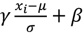

# Eighteen

# 用于捕获图结构数据中依赖关系的图神经网络

在本章中，我们将介绍一类对图形数据进行操作的深度学习模型，即**图形神经网络** ( **GNNs** )。GNNs 是近年来快速发展的一个领域。根据 2021 年的*人工智能状态*报告([https://www.stateof.ai/2021-report-launch.html](https://www.stateof.ai/2021-report-launch.html))，遗传神经网络已经“从小众领域发展成为人工智能研究的最热门领域之一”

全球导航卫星系统已应用于多个领域，包括以下领域:

*   文本分类([https://arxiv.org/abs/1710.10903](https://arxiv.org/abs/1710.10903))
*   推荐系统([https://arxiv.org/abs/1704.06803](https://arxiv.org/abs/1704.06803))
*   交通预测([https://arxiv.org/abs/1707.01926](https://arxiv.org/abs/1707.01926))
*   药物发现([https://arxiv.org/abs/1806.02473](https://arxiv.org/abs/1806.02473))

虽然我们不能涵盖这个快速发展空间中的每一个新想法，但我们将提供一个基础来理解 gnn 如何工作以及如何实现它们。此外，我们将介绍 **PyTorch Geometric** 库，它提供了用于管理深度学习的图形数据的资源，以及许多不同类型的图形层的实现，您可以在您的深度学习模型中使用。

本章将涉及的主题如下:

*   图形数据的介绍以及如何表示它以用于深度神经网络
*   图卷积的解释，它是普通 gnn 的主要构件
*   演示如何使用 PyTorch Geometric 实现用于分子性质预测的 GNNs 的教程
*   GNN 领域前沿方法概述

# 图表数据简介

概括地说，图表代表了我们描述和捕捉数据关系的一种方式。图是一种特殊的数据结构，它是非线性和抽象的。由于图形是抽象对象，因此需要定义一个具体的表示，以便对图形进行操作。此外，可以将图定义为具有某些可能需要不同表示的属性。*图 18.1* 总结了常见的图形类型，我们将在以下小节中详细讨论:


图 18.1:常见的图表类型

## 无向图

一个**无向图**由通过边连接的**节点**(在图论中也经常被称为**顶点**)组成，其中节点的顺序和它们的连接无关紧要。*图 18.2* 画出了无向图的两个典型例子，一个朋友图和一个由通过化学键连接的原子组成的化学分子图(我们将在后面的章节中更详细地讨论这种分子图):


图 18.2:无向图的两个例子

可以表示为无向图的其他常见数据示例包括图像、蛋白质相互作用网络和点云。

数学上，无向图 *G* 是一对( *V* ， *E* )，其中 *V* 是图的一组节点， *E* 是组成成对节点的边的集合。然后可以将该图编码为|*V*|×|*V*|**邻接矩阵** **A** 。矩阵 **A** 中的每个元素*x*ij 不是 1 就是 0，1 表示节点 *i* 和 *j* 之间的一条边(反之，0 表示没有边)。由于图是无向的，所以 **A** 的一个附加性质是*x*ij=*x*Ji。

## 有向图

**有向图**，与上一节讨论的无向图不同，通过*有向*边连接节点。在数学上，它们的定义与无向图相同，除了边的集合 *E* 是有序的*对的集合。因此， **A** 的元素*x*ij 不需要等于*x*Ji。*

有向图的一个例子是引用网络，其中节点是出版物，节点的边指向给定论文引用的论文的节点。


图 18.3:一个有向图的例子

## 标记图

我们感兴趣的许多图都有额外的信息与它们的每个节点和边相关联。例如，如果考虑前面显示的咖啡因分子，分子可以表示为图形，其中每个节点是一种化学元素(例如，O、C、N 或 H 原子)，每个边是其两个节点之间的键类型(例如，单键或双键)。这些节点和边缘特征需要以某种容量进行编码。给定图 *G* ，由节点集和边集元组( *V* ， *E* )定义，我们定义一个|*V*|×*f*[V]节点特征矩阵 **X** ，其中 *f* [V] 为每个节点的标签向量长度。对于边缘标签，我们定义了一个|*E*|×*f*[E]边缘特征矩阵 **X** [E] ，其中 *f* [E] 为每条边缘的标签向量的长度。

分子是数据的一个很好的例子，可以用标记为**的图**来表示，我们将在整个章节中使用分子数据。因此，我们将借此机会在下一节详细讨论它们的表示。

## 用图形表示分子

作为化学概述，分子可以被认为是由化学键结合在一起的原子团。不同的原子对应不同的化学元素，例如，常见的元素包括碳(C)、氧(O)、氮(N)和氢(H)。此外，有不同种类的键形成原子之间的连接，例如单键或双键。

我们可以用一个无向图来表示一个分子，图中有一个节点标签矩阵，每一行都是相关节点的原子类型的一次编码。此外，还有一个边标签矩阵，其中每一行都是相关边的焊接类型的一键编码。为了简化这种表示，氢原子有时是隐含的，因为它们的位置可以用基本的化学规则来推断。考虑到我们之前看到的咖啡因分子，一个隐含氢原子的图示示例如图*图 18.4* 所示:


图 18.4:咖啡因分子的图示

# 理解图形卷积

上一节展示了如何表示图形数据。下一个合乎逻辑的步骤是讨论我们有什么工具可以有效地利用这些表示。

在接下来的小节中，我们将介绍图卷积，它是构建 gnn 的关键组件。在这一节中，我们将了解为什么要在图上使用卷积，并讨论我们希望这些卷积具有什么属性。然后，我们将通过一个实现示例来介绍图卷积。

## 使用图卷积背后的动机

为了帮助解释图形卷积，让我们简要回顾一下卷积神经网络(CNN)中如何使用卷积，我们在第 14 章、*用深度卷积神经网络分类图像*中讨论过。在图像的情况下，我们可以将卷积视为在图像上滑动卷积滤波器的过程，其中，在每一步，计算滤波器和感受野(当前位于其上的图像部分)之间的加权和。

正如 CNN 章节中所讨论的，该滤波器可以被视为特定功能的检测器。这种特征检测方法非常适合于图像，原因有几个，例如，我们可以对图像数据设置以下先验:

1.  **平移不变性**:我们仍然可以识别图像中的特征，而不管它位于何处(例如，在平移之后)。无论猫在图像的左上、右下或其他部分，都可以被识别为猫。
2.  **地点**:附近像素密切相关。
3.  层次结构:一幅图像的较大部分通常可以被分解成相关的较小部分的组合。猫有头和腿；头部有眼睛和鼻子；眼睛有瞳孔和虹膜。

感兴趣的读者可以在 2019 年的文章*中找到对这些先验以及 GNNs 假设的先验的更正式的描述，该文章由 *N. Dehmamy* 、 *A.-L. Barabasi* 和*于荣*([https://arxiv.org/abs/1907.05008](https://arxiv.org/abs/1907.05008))撰写。*

卷积非常适合处理图像的另一个原因是可训练参数的数量不依赖于输入的维度。例如，您可以在 256×256 或 9×9 图像上训练一系列 3×3 卷积滤波器。(然而，如果相同的图像以不同的分辨率呈现，感受野以及因此提取的特征将会不同。对于更高分辨率的图像，我们可能希望选择更大的内核或添加额外的层来有效地提取有用的特征。)

像图像一样，图形也有证明卷积方法的自然先验。图像和图形这两种数据都共享局部性先验。然而，我们如何定义局部性是不同的。在图像中，先验是 2D 空间中的局部性，而在图中，先验是结构局部性。直观上，这意味着一条边之外的节点比五条边之外的节点更有可能相关。例如，在引用图中，一个被直接引用的出版物(在一个边缘之外)比具有多个分离度的出版物更有可能具有相似的主题。

图形数据的严格先验是**置换不变性**，这意味着节点的排序不会影响输出。这在*图 18.5* 中有所说明，其中改变图的节点顺序并不会改变图的结构:


图 18.5:代表同一个图的不同邻接矩阵

由于同一个图可以由多个邻接矩阵表示，如图 18.5 所示，因此，任何图的卷积都需要是置换不变的。

卷积方法对于图形也是理想的，因为它可以在不同大小的图形中使用固定的参数集。可以说，这个特性对于图形来说比图像更重要。例如，有许多具有固定分辨率的图像数据集，其中完全连接的方法(例如，使用多层感知器)是可能的，正如我们在第十一章*和*从头开始实施多层人工神经网络*中看到的。相比之下，大多数图表数据集包含不同大小的图表。*

虽然图像卷积算子是标准化的，但是有许多不同种类的图卷积，并且新的图卷积的开发是非常活跃的研究领域。我们的重点是提供一般的想法，以便读者可以合理化他们希望利用的 gnn。为此，以下小节将展示如何在 PyTorch 中实现基本的图形卷积。然后，在下一节中，我们将从头开始在 PyTorch 中构建一个简单的 GNN。

## 实现基本的图形卷积

在这一小节中，我们将介绍一个基本的图卷积函数，并看看当它应用于一个图时会发生什么。考虑下图及其表示法:


图 18.6:一个图表的表示

*图 18.6* 描绘了一个无向图，其节点标签由 *n* × *n* 邻接矩阵 **A** 和 *n* × *f* [在]节点特征矩阵 **X** 中指定，其中唯一的特征是每个节点颜色的一键表示——绿色(G)、蓝色(B)或橙色(O)。

用于图形操作和可视化的最通用的库之一是 NetworkX，我们将使用它来说明如何从标签矩阵 **X** 和节点矩阵 **A** 构建图形。

**安装网络 X**

NetworkX 是一个方便的 Python 库，用于操作和可视化图形。可以通过`pip`安装:

```py
pip install networkx 
```

在本章中，我们使用 2.6.2 版创建了图形可视化。更多信息请访问官方网站[https://networkx.org](https://networkx.org)。

使用 NetworkX，我们可以构建*图 18.6* 所示的图如下:

```py
>>> import numpy as np

>>> import networkx as nx

>>> G = nx.Graph()

... # Hex codes for colors if we draw graph

>>> blue, orange, green = "#1f77b4", "#ff7f0e", "#2ca02c"

>>> G.add_nodes_from([

...     (1, {"color": blue}),

...     (2, {"color": orange}),

...     (3, {"color": blue}),

...     (4, {"color": green})

... ])

>>> G.add_edges_from([(1,2), (2,3), (1,3), (3,4)])

>>> A = np.asarray(nx.adjacency_matrix(G).todense())

>>> print(A)

[[0 1 1 0]

[1 0 1 0]

[1 1 0 1]

[0 0 1 0]]

>>> def build_graph_color_label_representation(G, mapping_dict):

...     one_hot_idxs = np.array([mapping_dict[v] for v in

...         nx.get_node_attributes(G, 'color').values()])

>>>     one_hot_encoding = np.zeros(

...         (one_hot_idxs.size, len(mapping_dict)))

>>>     one_hot_encoding[

...         np.arange(one_hot_idxs.size), one_hot_idxs] = 1

>>>     return one_hot_encoding

>>> X = build_graph_color_label_representation(

...     G, {green: 0, blue: 1, orange: 2})

>>> print(X)

[[0., 1., 0.],

[0., 0., 1.],

[0., 1., 0.],

[1., 0., 0.]] 
```

要绘制在上述代码中构建的图形，我们可以使用以下代码:

```py
>>> color_map = nx.get_node_attributes(G, 'color').values()

>>> nx.draw(G,with_labels=True, node_color=color_map) 
```

在前面的代码示例中，我们首先从 NetworkX 启动了一个新的`Graph`对象。然后，我们添加了节点 1 到 4 以及颜色规格，以便可视化。添加节点后，我们指定它们的连接(边)。使用 NetworkX 的`adjacency_matrix`构造函数，我们创建了邻接矩阵 **A** ，我们的自定义`build_graph_color_label_representation`函数从我们之前添加到`Graph`对象的信息中创建了节点标签矩阵 **X** 。

使用图卷积，我们可以将每一行 **X** 解释为存储在对应于该行的节点上的信息的嵌入。图卷积基于它们的邻居和它们自己的嵌入更新每个节点的嵌入。对于我们的示例实现，图形卷积将采用以下形式:


这里，是节点 *i* 的更新嵌入；**W**1 和**W**2 是中的*f*×*f*中的 [out] 可学习的滤波器权重矩阵；并且 *b* 是长度为*f*out 的可学习偏置向量。

两个权重矩阵 **W** [1] 和 **W** [2] 可以被认为是滤波器组，其中每列是单独的滤波器。注意，当图形数据上的局部先验成立时，这种过滤器设计是最有效的。如果一个节点上的值与许多边之外的另一个节点上的值高度相关，则单个卷积无法捕捉到这种关系。堆积卷积将捕获更远的关系，如图*图 18.7* 所示(为简单起见，我们将偏差设置为零):


图 18.7:从图表中捕捉关系

*图 18.7* 中所示的图形卷积的设计符合我们对图形数据的先验知识，但可能不清楚如何以矩阵形式实现邻居求和。这就是我们利用邻接矩阵 **A** 的地方。这个卷积的矩阵形式是**XW**1+**AXW**2。这里，由 1 和 0 组成的邻接矩阵充当选择节点和计算所需和的掩码。在 NumPy 中，初始化该层并计算前一图的正向传递可以写成如下:

```py
>>> f_in, f_out = X.shape[1], 6

>>> W_1 = np.random.rand(f_in, f_out)

>>> W_2 = np.random.rand(f_in, f_out)

>>> h = np.dot(X, W_1)+ np.dot(np.dot(A,X), W_2) 
```

计算图卷积的正向传递就是这么简单。

最终，我们希望图形卷积层通过利用由 **A** 提供的结构(连接性)信息来更新以 **X** 编码的节点信息的表示。有许多潜在的方法可以做到这一点，这在已经开发的各种图形卷积中得到了体现。

说到不同的图卷积，一般来说，它们最好有一个统一的框架。令人欣慰的是，这样一个框架在 2017 年由*贾斯汀·吉尔默*及其同事[https://arxiv.org/abs/1704.01212](https://arxiv.org/abs/1704.01212)撰写的*量子化学*神经信息传递中提出。

在这个**消息传递**框架中，图中的每个节点都有一个关联的隐藏状态，其中 *i* 是节点在时间步 *t* 的索引。初始值定义为**X**I，是与节点 *i* 关联的 **X** 的行。

每个图卷积可以被分割成消息传递阶段和节点更新阶段。设 *N* ( *i* )为节点 *i* 的邻居。对于无向图， *N* ( *i* )是与节点 *i* 共享一条边的节点的集合。对于有向图， *N* ( *i* )是具有端点为节点 *i* 的边的节点集合。消息传递阶段可以表述如下:


这里， *M* [t] 是一个消息函数。在我们的示例层中，我们将这个消息函数定义为。更新函数为*U*t 的节点更新阶段为。在我们的示例层中，这个更新是。

*图 18.8* 可视化了消息传递的思想，并总结了我们已经实现的卷积:


图 18.8:在图和消息表单上实现的卷积

在下一节中，我们将把这个图形卷积层合并到 PyTorch 中实现的 GNN 模型中。

# 从头开始在 PyTorch 中实现 GNN

上一节重点介绍了理解和实现图形卷积运算。在这一节中，我们将带您浏览一个图形神经网络的基本实现，以说明如果您从零开始，如何将这些方法应用于图形。如果这种方法显得复杂，不要担心；gnn 是实现起来相对复杂的模型。因此，我们将在后面的部分中介绍 PyTorch Geometric，它提供了简化图形神经网络的实现和数据管理的工具。

## 定义节点网络模型

我们将从展示一个 GNN 的 PyTorch 实现开始本节。我们将采取自上而下的方法，从我们称之为`NodeNetwork`的主神经网络模型开始，然后我们将填入各个细节:

```py
import networkx as nx

import torch

from torch.nn.parameter import Parameter

import numpy as np

import math

import torch.nn.functional as F

class NodeNetwork(torch.nn.Module):

    def __init__(self, input_features):

        super().__init__()

        self.conv_1 = BasicGraphConvolutionLayer (

            input_features, 32)

        self.conv_2 = BasicGraphConvolutionLayer(32, 32)

        self.fc_1 = torch.nn.Linear(32, 16)

        self.out_layer = torch.nn.Linear(16, 2)

    def forward(self, X, A, batch_mat):

        x = F.relu(self.conv_1(X, A))

        x = F.relu(self.conv_2(x, A))

        output = global_sum_pool(x, batch_mat)

        output = self.fc_1(output)

        output = self.out_layer(output)

        return F.softmax(output, dim=1) 
```

我们刚刚定义的的`NodeNetwork`模型可以总结如下:

1.  执行两次图形卷积(`self.conv_1`和`self.conv_2`)
2.  通过`global_sum_pool`汇集所有的节点嵌入，我们将在后面定义
3.  通过两个完全连接的层(`self.fc_1`和`self.out_layer`)运行池化嵌入
4.  通过 softmax 输出类别成员概率

图 18.9 总结了网络的结构以及每层所做工作的可视化:


图 18.9:每个神经网络层的可视化

各个方面，如图形卷积层和全局池，将在接下来的小节中讨论。

## 编码节点网络的图形卷积层

现在，让我们定义之前的`NodeNetwork`类 *:* 中使用的图形卷积运算(`BasicGraphConvolutionLayer` )

```py
class BasicGraphConvolutionLayer(torch.nn.Module):

    def __init__(self, in_channels, out_channels):

        super().__init__()

        self.in_channels = in_channels

        self.out_channels = out_channels

        self.W2 = Parameter(torch.rand(

            (in_channels, out_channels), dtype=torch.float32))

        self.W1 = Parameter(torch.rand(

            (in_channels, out_channels), dtype=torch.float32))

        self.bias = Parameter(torch.zeros(

                out_channels, dtype=torch.float32))

    def forward(self, X, A):

        potential_msgs = torch.mm(X, self.W2)

        propagated_msgs = torch.mm(A, potential_msgs)

        root_update = torch.mm(X, self.W1)

        output = propagated_msgs + root_update + self.bias

        return output 
```

与全连接层和图像卷积层一样，我们添加了一个偏置项，以便层输出的线性组合的截距(在应用 ReLU 等非线性之前)可以变化。`forward()`方法实现了前向传递的矩阵形式，我们在前面的小节中讨论过，增加了一个偏差项。

为了测试`BasicGraphConvolutionLayer`，让我们将它应用到我们在前面*实现基本图形卷积*一节中定义的图形和邻接矩阵:

```py
>>> print('X.shape:', X.shape)X.shape: (4, 3)

>>> print('A.shape:', A.shape)

A.shape: (4, 4)

>>> basiclayer = BasicGraphConvolutionLayer(3, 8)

>>> out = basiclayer(

...     X=torch.tensor(X, dtype=torch.float32),

...     A=torch.tensor(A, dtype=torch.float32)

... )

>>> print('Output shape:', out.shape)

Output shape: torch.Size([4, 8]) 
```

基于上面的代码示例，我们可以看到我们的`BasicGraphConvolutionLayer`将包含三个特性的四节点图转换成了包含八个特性的表示。

## 添加一个全局池层来处理不同的图形大小

接下来，我们定义在`NodeNetwork`类中使用的`global_sum_pool()`函数，其中`global_sum_pool()` 实现了一个全局池层。全局池层将图形的所有节点嵌入聚合到固定大小的输出中。如图*图 18.9* ，`global_sum_pool()` 求和一个图的所有节点嵌入。我们注意到，这种全局池相对来说类似于 CNN 中使用的全局平均池，它在数据通过完全连接的层之前使用，正如我们在*第 14 章*、*使用深度卷积神经网络对图像进行分类*中看到的那样。

对所有嵌入的节点求和会导致信息的丢失，因此最好对数据进行整形，但是由于图形可以有不同的大小，所以这是不可行的。全局池可以用任何排列不变函数来完成，例如，`sum`、`max`和`mean`。下面是`global_sum_pool()`的实现:

```py
def global_sum_pool(X, batch_mat):

    if batch_mat is None or batch_mat.dim() == 1:

        return torch.sum(X, dim=0).unsqueeze(0)

    else:

        return torch.mm(batch_mat, X) 
```

如果数据没有被批量处理或者批量大小为 1，这个函数只对当前节点嵌入求和。否则，嵌入与`batch_mat`相乘，它具有基于图形数据如何被批处理的结构。

当数据集中的所有数据都具有相同的维度时，对数据进行批处理就像通过堆叠数据来添加维度一样简单。(边注:PyTorch 中默认批处理函数中调用的函数，字面上叫做`stack`。)由于图形大小不同，除非使用填充，否则这种方法对于图形数据是不可行的。然而，在图形大小变化很大的情况下，填充可能是低效的。通常，处理变化的图大小的更好的方法是将每个批视为单个图，其中批中的每个图都是与其他图不相连的子图。这在*图 18.10* 中有所说明:


图 18.10:如何处理变化的图形大小

为了更正式地描述*图 18.10* ，假设给我们图形 *G* [1] ，...，*G*k 的尺寸*n*1，...，*n*k 每个节点具有 *f* 个特征。此外，我们还给出了相应的邻接矩阵**A**1，...、 **A** [k] 和特征矩阵 **X** [1] 、...、**X**k。设 *N* 为节点总数，， *s* [ 1 ] = 0，*s*[I]=*s*[I][–1]+*N*[I][–1]为。如图所示，我们用 *N* × *N* 邻接矩阵 **A** [B] 和 *N* × *f* 特征矩阵 **X** [B] 定义一个图*G*×B。使用 Python 索引符号，**A**[B][*s*[I]:*s*[I]+*n*[I]，*s*[I]+*n*[I]=另外，**X**[B]*s*[I]:*s*[I]+*n*[I]，:] = ** X ** [i] 。

通过设计，断开的节点永远不会在图卷积的相同感受域中。因此，当通过图形卷积反向传播 *G* [B] 的梯度时，批中每个图形的梯度将是独立的。这意味着如果我们把一组图的卷积看成一个函数 *f* ，如果*h*B=*f*(*X*B， *A* [B] )和*h*[I]=*f*(*X*T29) 然后*h*B[*s*I:*s*I+*n*，:]=*h*I。 如果 sum 全局池从 *h* [B] 中提取每个 *h* [i] 的和作为单独的向量，则通过完全连接的层传递向量堆栈将在整个反向传播过程中保持批中每个项目的梯度是单独的。

这就是`global_sum_pool()`中的`batch_mat`的目的——作为图形选择掩码，使批处理中的图形保持分离。我们可以为大小为*n*1 的图形生成这个掩码，...， *n* [k] 用下面的代码:

```py
def get_batch_tensor(graph_sizes):

    starts = [sum(graph_sizes[:idx])

              for idx in range(len(graph_sizes))]

    stops = [starts[idx] + graph_sizes[idx]

             for idx in range(len(graph_sizes))]

    tot_len = sum(graph_sizes)

    batch_size = len(graph_sizes)

    batch_mat = torch.zeros([batch_size, tot_len]).float()

    for idx, starts_and_stops in enumerate(zip(starts, stops)):

        start = starts_and_stops[0]

        stop = starts_and_stops[1]

        batch_mat[idx,start:stop] = 1

    return batch_mat 
```

因此，给定一个批处理大小， *b* ，`batch_mat`是一个 *b* × *N* 矩阵，其中 batch _ mat[*I*–1，*s*[I]:*s*[I]+*N*[I]= 1 表示，并且这些索引集之外的元素为 0。下面是一个 collate 函数，用于构造某个*G*B 的表示和相应的批处理矩阵:

```py
# batch is a list of dictionaries each containing

# the representation and label of a graph

def collate_graphs(batch):

    adj_mats = [graph['A'] for graph in batch]

    sizes = [A.size(0) for A in adj_mats]

    tot_size = sum(sizes)

    # create batch matrix

    batch_mat = get_batch_tensor(sizes)

    # combine feature matrices

    feat_mats = torch.cat([graph['X'] for graph in batch], dim=0)

    # combine labels

    labels = torch.cat([graph['y'] for graph in batch], dim=0)

    # combine adjacency matrices

    batch_adj = torch.zeros([tot_size, tot_size], dtype=torch.float32)

    accum = 0

    for adj in adj_mats:

        g_size = adj.shape[0]

        batch_adj[accum:accum+g_size,accum:accum+g_size] = adj

        accum = accum + g_size

    repr_and_label = {'A': batch_adj,

            'X': feat_mats, 'y': labels,

            'batch': batch_mat}

    return repr_and_label 
```

## 准备数据加载器

在这一节中，我们将看到前面小节中的代码是如何组合在一起的。首先，我们将生成一些图形，并将它们放入 PyTorch `Dataset`中。然后，我们将在 GNN 的`DataLoader`中使用我们的`collate`函数。

但是在我们定义图形之前，让我们实现一个函数来构建一个字典表示，我们稍后会用到它:

```py
def get_graph_dict(G, mapping_dict):

    # Function builds dictionary representation of graph G

    A = torch.from_numpy(

        np.asarray(nx.adjacency_matrix(G).todense())).float()

    # build_graph_color_label_representation()

    # was introduced with the first example graph

    X = torch.from_numpy(

      build_graph_color_label_representation(

               G, mapping_dict)).float()

    # kludge since there is not specific task for this example

    y = torch.tensor([[1,0]]).float()

    return {'A': A, 'X': X, 'y': y, 'batch': None} 
```

这个函数获取一个 NetworkX 图并返回一个字典，其中包含它的邻接矩阵`A`、它的节点特征矩阵`X`和一个二进制标签`y`。因为我们实际上不会在现实世界的任务中训练这个模型，所以我们只是随意地设置标签。然后，`nx.adjacency_matrix()`获取一个 NetworkX 图并返回一个稀疏表示，我们使用`todense()`将其转换为密集的`np.array`形式。

我们现在将构建图形，并使用`get_graph_dict`函数将 NetworkX 图形转换为我们的网络可以处理的格式:

```py
>>> # building 4 graphs to treat as a dataset

>>> blue, orange, green = "#1f77b4", "#ff7f0e","#2ca02c"

>>> mapping_dict= {green:0, blue:1, orange:2}

>>> G1 = nx.Graph()

>>> G1.add_nodes_from([

...     (1,{"color": blue}),

...     (2,{"color": orange}),

...     (3,{"color": blue}),

...     (4,{"color": green})

... ])

>>> G1.add_edges_from([(1, 2), (2, 3), (1, 3), (3, 4)])

>>> G2 = nx.Graph()

>>> G2.add_nodes_from([

...     (1,{"color": green}),

...     (2,{"color": green}),

...     (3,{"color": orange}),

...     (4,{"color": orange}),

...     (5,{"color": blue})

... ])

>>> G2.add_edges_from([(2, 3),(3, 4),(3, 1),(5, 1)])

>>> G3 = nx.Graph()

>>> G3.add_nodes_from([

...     (1,{"color": orange}),

...     (2,{"color": orange}),

...     (3,{"color": green}),

...     (4,{"color": green}),

...     (5,{"color": blue}),

...     (6,{"color":orange})

... ])

>>> G3.add_edges_from([(2,3), (3,4), (3,1), (5,1), (2,5), (6,1)])

>>> G4 = nx.Graph()

>>> G4.add_nodes_from([

...     (1,{"color": blue}),

...     (2,{"color": blue}),

...     (3,{"color": green})

... ])

>>> G4.add_edges_from([(1, 2), (2, 3)])

>>> graph_list = [get_graph_dict(graph, mapping_dict) for graph in

...     [G1, G2, G3, G4]] 
```

该代码生成的图形在*图 18.11* 中可视化:


图 18.11:四个生成的图表

这个代码块构造了四个 NetworkX 图，并将它们存储在一个列表中。这里，`nx.Graph()`的构造器初始化一个空图，`add_nodes_from()`从元组列表中向空图添加节点。每个元组中的第一项是节点的名称，第二项是该节点属性的字典。

图的`add_edges_from()`方法采用元组列表，其中每个元组定义其元素(节点)之间的边。现在，我们可以为这些图形构建一个 PyTorch `Dataset`:

```py
from torch.utils.data import Dataset

class ExampleDataset(Dataset):

    # Simple PyTorch dataset that will use our list of graphs

    def __init__(self, graph_list):

        self.graphs = graph_list

    def __len__(self):

        return len(self.graphs)

    def __getitem__(self,idx):

        mol_rep = self.graphs[idx]

        return mol_rep 
```

虽然使用自定义的`Dataset`看起来像是不必要的努力，但它允许我们展示如何在`DataLoader`中使用`collate_graphs()`和:

```py
>>> from torch.utils.data import DataLoader

>>> dset = ExampleDataset(graph_list)

>>> # Note how we use our custom collate function

>>> loader = DataLoader(

...     dset, batch_size=2, shuffle=False,

...     collate_fn=collate_graphs) 
```

## 使用节点网络进行预测

在我们定义了所有必要的函数并设置了`DataLoader`之后，我们现在初始化一个新的`NodeNetwork`并将其应用于我们的图形数据:

```py
>>> node_features = 3

>>> net = NodeNetwork(node_features)

>>> batch_results = []

>>> for b in loader:

...     batch_results.append(

...         net(b['X'], b['A'], b['batch']).detach()) 
```

注意，为了简洁，我们没有包括训练循环；然而，GNN 模型可以通过计算预测和真实类别标签之间的损失，通过`.backward()`反向传播损失，并通过基于梯度下降的优化器更新模型权重，以常规方式进行训练。我们将此作为读者的可选练习。在下一节中，我们将展示如何使用 PyTorch Geometric 的 GNN 实现来实现这一点，它实现了更复杂的 GNN 代码。

继续我们之前的代码，现在让我们直接为模型提供一个单一的输入图，没有`DataLoader`:

```py
>>> G1_rep = dset[1]

>>> G1_single = net(

...     G1_rep['X'], G1_rep['A'], G1_rep['batch']).detach() 
```

我们现在可以将 GNN 应用于单个图表(`G1_single`)的结果与来自`DataLoader`(也是第一个图表，`G1`)的第一个图表的结果进行比较，我们保证了这一点，因为我们设置了`shuffle=False`来复查批处理加载器是否正常工作。正如我们通过使用`torch.isclose()`(考虑舍入误差)所看到的，结果是等价的，正如我们所希望的:

```py
>>> G1_batch = batch_results[0][1]

>>> torch.all(torch.isclose(G1_single, G1_batch))

tensor(True) 
```

恭喜你。现在，您已经了解了如何构建、设置和运行基本的 GNN。然而，从这篇介绍中，您可能意识到管理和操作图形数据可能有些费力。此外，我们甚至没有建立一个使用边标签的图形卷积，这将使事情进一步复杂化。幸运的是，PyTorch Geometric 是一个软件包，它通过提供许多 GNN 层的实现使这变得更加容易。在下一小节中，我们将通过一个在分子数据上实现和训练更复杂的 GNN 的端到端例子来介绍这个库。

# 使用 PyTorch 几何库实现 GNN

在本节中，我们将使用 PyTorch 几何库实现一个 GNN，它简化了训练 gnn 的过程。我们将 GNN 应用于由小分子组成的数据集 QM9，以预测各向同性极化率，这是一种衡量分子电荷被电场扭曲的趋势的指标。

**安装 PyTorch 几何图形**

PyTorch 几何可通过 conda 或 pip 安装。我们建议您访问官方文档网站[https://py torch-geometric . readthedocs . io/en/latest/notes/installation . html](https://pytorch-geometric.readthedocs.io/en/latest/notes/installation.html)，选择推荐您的操作系统使用的安装命令。对于本章，我们使用 pip 来安装版本 2.0.2 及其`torch-scatter`和`torch-sparse`依赖项:

```py
pip install torch-scatter==2.0.9

pip install torch-sparse==0.6.12

pip install torch-geometric==2.0.2 
```

让我们从加载小分子数据集开始，看看 PyTorch Geometric 如何存储数据:

```py
>>> # For all examples in this section we use the following imports.

>>> # Note that we are using torch_geometric's DataLoader.

>>> import torch

>>> from torch_geometric.datasets import QM9

>>> from torch_geometric.loader import DataLoader

>>> from torch_geometric.nn import NNConv, global_add_pool

>>> import torch.nn.functional as F

>>> import torch.nn as nn

>>> import numpy as np

>>> # let's load the QM9 small molecule dataset

>>> dset = QM9('.')

>>> len(dset)

130831

>>> # Here's how torch geometric wraps data

>>> data = dset[0]

>>> data

Data(edge_attr=[8, 4], edge_index=[2, 8], idx=[1], name="gdb_1", pos=[5, 3], x=[5, 11], y=[1, 19], z=[5])

>>> # can access attributes directly

>>> data.z

tensor([6, 1, 1, 1, 1])

>>> # the atomic number of each atom can add attributes

>>> data.new_attribute = torch.tensor([1, 2, 3])

>>> data

Data(edge_attr=[8, 4], edge_index=[2, 8], idx=[1], name="gdb_1", new_attribute=[3], pos=[5, 3], x=[5, 11], y=[1, 19], z=[5])

>>> # can move all attributes between devices

>>> device = torch.device(

...     "cuda:0" if torch.cuda.is_available() else "cpu"

... )

>>> data.to(device)

>>> data.new_attribute.is_cuda

True 
```

对象是一个方便、灵活的图形数据包装器。请注意，许多 PyTorch 几何对象需要数据对象中的某些关键字才能正确处理它们。具体来说，`x`应该包含节点特征，`edge_attr`应该包含边特征，`edge_index`应该包含边列表，`y` 应该包含标签。QM9 数据包含一些需要注意的附加属性:3D 网格中每个分子原子的位置`pos`，以及分子中每个原子的原子序数`z`。QM9 中的标签是分子的一系列物理属性，如偶极矩、自由能、焓或各向同性极化。我们将实现一个 GNN，并在 QM9 上训练它来预测各向同性极化。

**QM9 数据集**

QM9 数据集包含 133，885 个有机小分子，分别标有几何、能量、电子和热力学属性。QM9 是一个通用基准数据集，用于开发预测化学结构-性质关系的方法和混合量子力学/机器学习方法。关于数据集的更多信息可以在 http://quantum-machine.org/datasets/的[找到。](http://quantum-machine.org/datasets/)

分子的键类型很重要；也就是说，哪些原子通过特定的键类型连接，例如单键或双键，这很重要。因此，我们希望使用可以利用边特征的图形卷积。为此，我们将使用`torch_geometric.nn.NNConv`层。(如果你对实现细节感兴趣，可以在[https://py torch-geometric . readthe docs . io/en/latest/_ modules/torch _ geometric/nn/conv/nn _ conv . html # nn conv](https://pytorch-geometric.readthedocs.io/en/latest/_modules/torch_geometric/nn/conv/nn_conv.html#NNConv)找到它的源代码。)

`NNConv`层中的卷积采用以下形式:


这里， *h* 是由一组权重参数化的神经网络， **W** 是节点标签的权重矩阵。这个图形卷积与我们之前从头实现的非常相似:


唯一真正的区别是，神经网络 *h* 的**W**2 等价物基于边缘标签被参数化，这允许权重对于不同的边缘标签而变化。通过下面的代码，我们利用两个这样的图卷积层(`NNConv`)实现了 GNN:

```py
class ExampleNet(torch.nn.Module):

    def __init__(self, num_node_features, num_edge_features):

        super().__init__()

        conv1_net = nn.Sequential(

            nn.Linear(num_edge_features, 32),

            nn.ReLU(),

            nn.Linear(32, num_node_features*32))

        conv2_net = nn.Sequential(

            nn.Linear(num_edge_features, 32),

            nn.ReLU(),

            nn.Linear(32, 32*16))

        self.conv1 = NNConv(num_node_features, 32, conv1_net)

        self.conv2 = NNConv(32,16, conv2_net)

        self.fc_1 = nn.Linear(16, 32)

        self.out = nn.Linear(32, 1)

    def forward(self, data):

        batch, x, edge_index, edge_attr = (

            data.batch, data.x, data.edge_index, data.edge_attr)

        # First graph conv layer

        x = F.relu(self.conv1(x, edge_index, edge_attr))

        # Second graph conv layer

        x = F.relu(self.conv2(x, edge_index, edge_attr))

        x = global_add_pool(x,batch)

        x = F.relu(self.fc_1(x))

        output = self.out(x)

        return output 
```

我们将训练这个 GNN 来预测分子的各向同性极化率，这是一种衡量分子电荷分布被外部电场扭曲的相对趋势的指标。我们将 QM9 数据集分成训练集、验证集和测试集，并使用 PyTorch Geometric `DataLoader`。注意，这些不需要特殊的 collate 函数，但是需要一个具有适当命名属性的`Data`对象。

接下来，让我们拆分数据集:

```py
>>> from torch.utils.data import random_split

>>> train_set, valid_set, test_set = random_split(

...     dset,[110000, 10831, 10000])

>>> trainloader = DataLoader(train_set, batch_size=32, shuffle=True)

>>> validloader = DataLoader(valid_set, batch_size=32, shuffle=True)

>>> testloader = DataLoader(test_set, batch_size=32, shuffle=True) 
```

以下代码将在 GPU(如果可用)上初始化和训练网络:

```py
>>> # initialize a network

>>> qm9_node_feats, qm9_edge_feats = 11, 4

>>> net = ExampleNet(qm9_node_feats, qm9_edge_feats)

>>> # initialize an optimizer with some reasonable parameters

>>> optimizer = torch.optim.Adam(

...     net.parameters(), lr=0.01)

>>> epochs = 4

>>> target_idx = 1 # index position of the polarizability label

>>> device = torch.device("cuda:0" if

...                       torch.cuda.is_available() else "cpu")

>>> net.to(device) 
```

如下面的代码所示，训练循环遵循我们在之前的 PyTorch 章节中遇到的熟悉模式，所以我们可以跳过的解释细节。然而，值得强调的一个细节是，这里我们计算的是均方误差(MSE)损失，而不是交叉熵，因为极化率是一个连续的目标，而不是一个类别标签:

```py
>>> for total_epochs in range(epochs):

...     epoch_loss = 0

...     total_graphs = 0

...     net.train()

...     for batch in trainloader:

...         batch.to(device)

...         optimizer.zero_grad()

...         output = net(batch)

...         loss = F.mse_loss(

...             output,batch.y[:, target_idx].unsqueeze(1))

...         loss.backward()

...         epoch_loss += loss.item()

...         total_graphs += batch.num_graphs

...         optimizer.step()

...     train_avg_loss = epoch_loss / total_graphs

...     val_loss = 0

...     total_graphs = 0

...     net.eval()

...     for batch in validloader:

...         batch.to(device)

...         output = net(batch)

...         loss = F.mse_loss(

...             output,batch.y[:, target_idx].unsqueeze(1))

...         val_loss += loss.item()

...         total_graphs += batch.num_graphs

...     val_avg_loss = val_loss / total_graphs

...     print(f"Epochs: {total_epochs} | "

...           f"epoch avg. loss: {train_avg_loss:.2f} | "

...           f"validation avg. loss: {val_avg_loss:.2f}")

Epochs: 0 | epoch avg. loss: 0.30 | validation avg. loss: 0.10

Epochs: 1 | epoch avg. loss: 0.12 | validation avg. loss: 0.07

Epochs: 2 | epoch avg. loss: 0.10 | validation avg. loss: 0.05

Epochs: 3 | epoch avg. loss: 0.09 | validation avg. loss: 0.07 
```

在前四个训练时期，训练和验证损失都在减少。数据集很大，在 CPU 上训练可能需要一点时间，所以我们在四个时期后停止训练。但是，如果我们进一步训练模型，损失会继续改善。您可以为其他时期训练模型，以查看如何改变性能。

下面的代码预测测试数据的值，并收集真正的标签:

```py
>>> net.eval()

>>> predictions = []

>>> real = []

>>> for batch in testloader:

...     output = net(batch.to(device))

...     predictions.append(output.detach().cpu().numpy())

...     real.append(

...             batch.y[:,target_idx] .detach().cpu().numpy())

>>> real = np.concatenate(real)

>>> predictions = np.concatenate(predictions) 
```

现在我们可以用测试数据的子集做一个散点图。由于测试数据集相对较大(10，000 个分子)，结果可能有点混乱，为了简单起见，我们只绘制前 500 个预测和目标:

```py
>>> import matplotlib.pyplot as plt

>>> plt.scatter(real[:500], predictions[:500])

>>> plt.xlabel('Isotropic polarizability')

>>> plt.ylabel('Predicted isotropic polarizability') 
```

结果图如下所示:


图 18.12:预测的各向同性极化率与实际各向同性极化率的对比图

基于该图，假设点相对靠近对角线，我们简单的 GNN 似乎在预测各向同性偏振值方面做得不错，即使没有超参数调谐。

**torch drug——基于 PyTorch 的药物发现库**

PyTorch Geometric 是一个全面的通用图形库，包括分子，正如您在本节中看到的。如果您对更深入的分子工作和药物发现感兴趣，我们还建议考虑最近开发的 TorchDrug 库，它为使用分子进行提供了许多方便的实用程序。你可以在这里找到更多关于火炬接力的信息:[https://torchdrug.ai/](https://torchdrug.ai/)。

# 其他 GNN 层和最近的发展

除了为提供该领域的一些最新发展的高层次概述之外，本节还将介绍一些可以在 GNNs 中使用的附加层。虽然我们将提供这些层及其实现背后的直觉背景，但从数学上讲，这些概念可能会变得有点复杂，但不要气馁。这些是可选主题，没有必要掌握所有这些实现的细节。理解这些层背后的一般思想将足以实验我们引用的 PyTorch 几何实现。

以下小节将介绍光谱图卷积图层、图表池图层和图表的归一化图层。最后，最后一小节将提供一些更高级的图形神经网络的鸟瞰图。

## 光谱图卷积

到目前为止，我们使用的图卷积本质上都是空间的。这意味着它们基于与图相关联的拓扑空间聚集信息，这只是空间卷积在节点的局部邻域上操作的一种花哨说法。因此，如果利用空间卷积的 GNN 需要捕获图形数据中复杂的全局模式，那么网络将需要堆叠多个空间卷积。在这些全局模式很重要，但网络深度需要限制的情况下，谱图卷积是一种可供选择的卷积。

光谱图卷积的操作不同于空间图卷积。谱图卷积通过利用图的谱(其特征值集)来操作，通过计算称为*图拉普拉斯*的图的邻接矩阵的归一化版本的特征分解来操作。最后一句话可能看起来很难，所以让我们把它分解，一步一步地复习。

对于无向图，图的拉普拉斯矩阵定义为**L**=**D**–**A**，其中 **A** 是图的邻接矩阵 **D** 是度矩阵。度矩阵是对角矩阵，其中索引为 *i* 的行中对角线上的元素是与邻接矩阵的第 *i* 行相关联的节点的进出边数。

**L** 为实值对称矩阵，已证明实值对称矩阵可分解为，其中 **Q** 为正交矩阵，其列为 **L** 的特征向量，为对角矩阵，其元素为 **L** 的特征值。您可以将 **Q** 视为提供了图形结构的底层表示。与使用由 **A** 定义的图的局部邻域的空间卷积不同，谱卷积利用来自 **Q** 的结构的替代表示来更新节点嵌入。

频谱卷积的以下示例利用了*对称归一化图拉普拉斯*的特征分解，其针对图定义如下:


这里， **I** 是单位矩阵。这是因为图拉普拉斯的归一化可以帮助稳定基于梯度的训练过程，类似于特征标准化。

假设是**L**sym 的本征分解，则图卷积定义如下:


这里， **W** 是可训练的权重矩阵。括号内实际上是将 **X** 和 **W** 乘以一个矩阵，该矩阵对图中的结构关系进行编码。这里的操作符表示内部项的元素乘法，而外部的 **Q** 将结果映射回原始基。这个卷积有一些不期望的特性，因为计算图的特征分解的计算复杂度是*O*(*n*3)。这意味着它很慢，而且由于它是结构化的， **W** 依赖于图形的大小。因此，谱卷积只能应用于相同大小的图形。此外，这个卷积的感受野是整个图形，这在当前的公式中是无法调整的。然而，已经开发了各种技术和卷积来解决这些问题。

例如，布鲁纳和他的同事([https://arxiv.org/abs/1312.6203](https://arxiv.org/abs/1312.6203))引入了一种平滑方法，通过用一组函数逼近 **W** 来解决的尺寸依赖性，每个函数都乘以它们自己的标量参数。也就是说，给定函数组*f*1，...、 *f* [n] 、。这组函数使得维数可以变化。然而，由于保持标量，卷积参数空间可以独立于图形大小。

其他值得一提的谱卷积包括切比雪夫图卷积([https://arxiv.org/abs/1606.09375](https://arxiv.org/abs/1606.09375))，它可以以较低的时间复杂度逼近原始谱卷积，并且可以具有不同大小的感受野。Kipf 和 Welling([https://arxiv.org/abs/1609.02907](https://arxiv.org/abs/1609.02907))引入了一种卷积，其性质类似于切比雪夫卷积，但参数负担减少。PyTorch Geometric 中提供了这两个的实现，如`torch_geometric.nn.ChebConv` 和`torch_geometric.nn.GCNConv`，如果您想玩谱卷积，这是一个合理的起点。

## 联营

我们将简要讨论一些为图形开发的池层的例子。虽然由池层提供的下采样在 CNN 架构中是有益的，但是在 GNNs 中下采样的好处还没有被清楚地认识到。

影像数据的池图层(ab)使用空间位置，这是图表所不具备的。如果提供了图中节点的集群，我们可以定义图池层应该如何池化节点。然而，还不清楚如何定义最佳聚类，并且不同的聚类方法可能适合不同的上下文。即使在聚类被确定之后，如果节点被向下采样，则不清楚剩余的节点应该如何连接。虽然这些仍然是开放的研究问题，但我们将查看一些图形池层，并指出它们解决上述问题的方法。

与 CNN 一样，也有适用于 GNNs 的平均和最大池层。如图*图 18.13* 所示，给定一个节点集群，每个集群成为新图形中的一个节点:


图 18.13:将最大池应用于图形

每个簇的嵌入等于簇中节点嵌入的平均值或最大值。为了解决连通性问题，集群被分配集群中所有边索引的并集。例如，如果将节点 *i* 、 *j* 、 *k* 分配给集群 *c* [1] ，则与 *i* 、 *j* 或 *k* 共享一条边的任何节点或包含节点的集群都将与 *c* [1] 共享一条边。

一个更复杂的池层，*diff pool*(【https://arxiv.org/abs/1806.08804】T2)，试图同时解决聚类和缩减采样。该层学习软集群分配矩阵，该矩阵将 *n* 节点嵌入分布到 *c* 集群中。(有关软聚类与硬聚类的复习，请参考第 10 章*中的*硬聚类与软聚类*部分，*处理未标记数据-聚类分析*。)以此， **X** 更新为**X**′=**S**^T**X**和 **A** 为**A【T30′=**S**TA**TT**S**。值得注意的是， **A** 不再包含离散值，而是可以被视为边权重的矩阵。随着时间的推移， *DiffPool* 收敛到具有可解释结构的几乎硬的聚类分配。*

另一种池化方法 top- *k* pooling 从图中删除节点，而不是聚集它们，这避免了集群和连接问题。虽然这似乎伴随着被丢弃节点中信息的丢失，但是在网络环境中，只要在汇集之前发生卷积，网络就可以学会避免这种情况。使用相对于可学习向量 *p* 的投影分数来选择丢弃的节点。要计算的实际公式(**X**′，**A**′)，如针对稀疏层次图分类器([https://arxiv.org/abs/1811.01287](https://arxiv.org/abs/1811.01287))的*中所述，为:*


这里 top- *k* 选择 **y** 的索引，top *k* 的值和索引向量 *i* 用于丢弃 **X** 和 **A** 的行。Top- *k* pooling 在 PyTorch Geometric 中实现为`torch_geometric.nn.TopKPooling`。此外，最大和平均池分别实现为`torch_geometric.nn.max_pool_x`和 `torch_geometric.nn.avg_pool_x`。

## 正常化

在许多种类的神经网络中使用标准化技术来帮助稳定和/或加速训练过程。许多方法，如批量规范化(在第 17 章、*合成新数据的生成对抗网络*中讨论)，通过适当的簿记可以很容易地应用于 GNNs。在本节中，我们将简要介绍一些专为图表数据设计的规范化图层。

作为归一化的快速回顾，我们的意思是给定一组特征值*x*1，...， *x* [n] ，我们用更新数值，其中是一组数值的平均值，是标准偏差。通常，大多数神经网络归一化方法采用一般形式，其中和是可学习的参数，方法之间的差异与归一化所应用的特征集有关。

*GraphNorm:加速图神经网络训练的原理方法*由*天乐蔡*和*T5*2020([https://arxiv.org/abs/2009.03294](https://arxiv.org/abs/2009.03294))的同事发现，图卷积中聚合后的均值统计量可以包含有意义的信息，因此将其完全丢弃可能是不可取的。为了解决这个问题，他们引入了 GraphNorm。**

 *借用原稿的符号，设 *h* 为节点嵌入矩阵。设*h*I[，] [j] 为节点*v*I 的第 *j* 个特征值，其中 *i* = 1，...， *n* ， *j* = 1，...， *d* 。 *GraphNorm* 采用以下形式:


这里，和。关键的附加参数是可学习的参数，它可以控制丢弃多少均值统计量。

另一种图归一化技术是 *MsgNorm，*由*李国豪*和同事在稿件*DeeperGCN:2020 年[https://arxiv.org/abs/2006.07739](https://arxiv.org/abs/2006.07739)你需要训练更深的 GCNs* 。 *MsgNorm* 对应于本章前面提到的图卷积的消息传递公式。使用消息传递网络命名法(在实现基本图卷积的小节*的末尾定义)，在图卷积已经在*M*t[t]上求和并且产生了*M*I 之后，但是在更新嵌入有*U*t 的节点之前， *MsgNorm* 用*


这里， *s* 是一个可学习的比例因子，这种方法背后的直觉是在图形卷积中标准化聚合消息的特征。虽然没有理论支持这种规范化方法，但它在实践中效果很好。

我们已经讨论过的规范化层都是通过 PyTorch Geometric 实现的，分别为`BatchNorm`、`GroupNorm`和`MessageNorm`。欲了解更多信息，请访问 PyTorch 几何文档，网址为[https://py torch-Geometric . readthe docs . io/en/latest/modules/nn . html # normalization-layers](https://pytorch-geometric.readthedocs.io/en/latest/modules/nn.html#normalization-layers)。

与可能需要额外聚类设置的图表池图层不同，图表规范化图层可以更容易地插入到现有的 GNN 模型中。在模型开发和优化过程中测试各种标准化方法是一种合理且值得推荐的方法。

## 高级图形神经网络文献的链接

专注于图的深度学习领域正在快速发展，有许多方法我们无法在这一介绍性章节中合理详细地涵盖。因此，在我们结束这一章之前，我们想为感兴趣的读者提供一些值得注意的文献，以便更深入地研究这一主题。

你可能还记得*第 16 章*、*变形金刚——用注意机制改善自然语言处理*，注意机制可以通过提供额外的上下文来提高模型的能力。在这方面，已经开发了多种用于 GNNs 的注意方法。用注意力增强的 gnn 的例子包括*图注意力网络*，由*佩塔*韦利科维奇及其同事，2017([https://arxiv.org/abs/1710.10903](https://arxiv.org/abs/1710.10903))和*关系图注意力网络*由*丹·布斯布里奇*及其同事，2019([https://arxiv.org/abs/1904.05811](https://arxiv.org/abs/1904.05811))。

最近，这些注意机制还被用于由*宋俊云*及其同事提出的图变换器、2020()和由*胡*及其同事提出的异构图变换器、2020*()。*

 *除了前面提到的图形转换器之外，其他深度生成模型已经被开发出来专门用于图形。有图形变分自编码器，如 2016 年[https://arxiv.org/abs/1611.07308](https://arxiv.org/abs/1611.07308)的*基普夫*和*韦林*的*变分图形自编码器*中介绍的，刘琦及其同事的*用于分子设计的*约束图形变分自编码器，2018*T11[https://arxiv.org/abs/1805.09076](https://arxiv.org/abs/1805.09076)以及*西蒙的【GraphVAE:使用变分自编码器*生成小图形另一个应用于分子生成的值得注意的图形变分自编码器是由*https://arxiv.org/abs/1802.04364*及其同事于 2019 年[提出的*用于分子图形生成的连接树变分自编码器*。](https://arxiv.org/abs/1802.04364)*

一些 GANs 被设计用来生成图形数据，但是在撰写本文时，GANs 在图形上的表现远不如在图像领域中的表现令人信服。例子有 *GraphGAN:用生成对抗网的图表示学习*作者:*及其同事，2017()和 *MolGAN:小分子图的隐式生成模型*作者:*曹*和 *Kipf* ，2018()。*

 *gnn 也被整合到深度强化学习模型中——你将在下一章学到更多关于强化学习的知识。例子包括*图卷积策略网络用于目标导向的分子图生成*由*稼轩优*及其同事，2018()和深度 Q 网络在*通过深度强化学习优化分子*由*周*及其同事，2018()提出，其利用了应用于分子生成任务的 GNN。

最后，虽然不是技术上的图形数据，3D 点云有时使用距离截止来创建边缘。图网络在这个空间的应用包括*点-GNN:图神经网络用于点云中的 3D 物体检测*由*魏京石*和他的同事，2020([https://arxiv.org/abs/2003.01251](https://arxiv.org/abs/2003.01251))在激光雷达点云中检测 3D 物体。此外，2019 年([https://arxiv.org/abs/1905.08705](https://arxiv.org/abs/1905.08705))的*陈灿*及其同事提出的*gap net:Graph Attention based Point Neural Network for exploining the Local features of Point Cloud*旨在检测点云数据中的局部特征，这对于其他深度架构来说一直具有挑战性。

# 摘要

随着我们能够访问的数据量不断增加，我们也需要了解数据之间的相互关系。虽然这可以通过多种方式来实现，但图表是这些关系的一种提炼表示，因此可用的图表数据量只会增加。

在这一章中，我们通过实现一个图形卷积层和一个 GNN 从头开始解释了图形神经网络。我们看到，由于图形数据的性质，实现 GNNs 实际上相当复杂。因此，为了将 GNNs 应用于现实世界的例子，例如预测分子极化，我们学习了如何利用 PyTorch 几何库，它提供了我们需要的许多构建模块的实现。最后，我们回顾了一些著名的文学作品，以便更深入地探究 GNN 文学。

希望这一章介绍了如何利用深度学习来学习图表。这一领域的方法目前是研究的热点，我们提到的许多方法都是在过去几年中发表的。以这篇文章为起点，也许空间的下一个进步可以由你来完成。

在下一章中，我们将研究强化学习，这是一种与我们在本书中迄今为止所涵盖的完全不同的机器学习类别。

# 加入我们书的不和谐空间

加入该书的 Discord workspace，每月与作者进行一次*向我提问*会议:

[https://packt.link/MLwPyTorch](https://packt.link/MLwPyTorch)

***