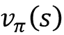
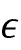

<title>Chapter_19</title> <link href="../Styles/epub.css" rel="stylesheet" type="text/css"> <link href="../Styles/syntax-highlighting.css" rel="stylesheet" type="text/css">

# Nineteen

# 复杂环境下决策的强化学习

在前面的章节中，我们重点介绍了有监督和无监督的机器学习。我们还学习了如何利用人工神经网络和深度学习来解决这些类型的机器学习遇到的问题。正如您所记得的，监督学习侧重于从给定的输入特征向量预测类别标签或连续值。无监督学习侧重于从数据中提取模式，使其对数据压缩(*第 5 章*、*通过降维压缩数据*)、聚类(*第 10 章*、*处理未标记数据——聚类分析*)或近似训练集分布以生成新数据(*第 17 章*、*生成对抗网络以合成新数据*)。

在这一章中，我们将注意力转向机器学习的一个独立类别，**强化学习** ( **RL** )，它与之前的类别不同，因为它专注于学习*一系列用于优化整体奖励的动作*——例如，在一场国际象棋比赛中获胜。总之，本章将涵盖以下主题:

*   学习强化学习的基础知识，熟悉代理人/环境的相互作用，理解奖励过程是如何工作的，以帮助在复杂的环境中做出决策
*   介绍不同类别的 RL 问题、基于模型和无模型的学习任务、蒙特卡罗和时间差分学习算法
*   以表格形式实现 Q 学习算法
*   理解用于解决 RL 问题的函数逼近，并通过实现*深度* Q 学习算法将 RL 与深度学习相结合

RL 是一个复杂而广阔的研究领域，这一章主要关注基础知识。因为这一章只是一个介绍，为了让我们的注意力集中在重要的方法和算法上，我们将主要用一些基本的例子来说明主要的概念。然而，在本章的结尾，我们将回顾一个更具挑战性的例子，并将深度学习架构用于一种称为深度 Q 学习的特定 RL 方法。

# 简介-从经验中学习

在本节中，我们将首先介绍作为机器学习的一个分支的 RL 的概念，并了解它与机器学习的其他任务相比的主要差异。之后，我们将介绍 RL 系统的基本组件。然后，我们将看到基于马尔可夫决策过程的 RL 数学公式。

## 理解强化学习

到目前为止，这本书主要关注的是*有监督的*和*无监督的*学习。回想一下，在*监督的*学习中，我们依赖于由监督人或人类专家提供的带标签的训练样本，目标是训练一个可以很好地推广到看不见的、无标签的测试样本的模型。这意味着受监督的学习模型应该学会给给定的输入示例分配与监督人类专家相同的标签或值。另一方面，在*无监督*学习中，的目标是学习或捕获数据集的底层结构，例如在聚类和降维方法中；或者学习如何生成具有相似基础分布的新的合成训练样本。RL 与监督和非监督学习有本质的不同，因此 RL 通常被视为“第三类机器学习”

将 RL 与机器学习的其他子任务(如监督和非监督学习)区分开来的关键要素是，RL 是以通过交互进行*学习的概念为中心的。这意味着在 RL 中，模型从与环境的交互中学习，以最大化*奖励函数*。*

虽然最大化奖励函数与监督学习中最小化损失函数的概念有关，但在 RL 中，学习一系列行为的*正确*标签并不知道或事先定义——相反，它们需要通过与环境的交互来学习，以实现某种期望的结果——例如在游戏中获胜。通过 RL，模型(也称为**代理**)与其环境交互，并通过这样做生成一系列交互，这些交互合起来称为**剧集**。通过这些互动，代理人收集了一系列由环境决定的奖励。这些奖励可以是积极的，也可以是消极的，有时直到一集结束才透露给代理人。

例如，想象一下，我们想教一台计算机下国际象棋，并战胜人类棋手。计算机下的每一步棋的标记(奖励)直到游戏结束时才知道，因为在游戏过程中，我们不知道特定的一步棋会导致游戏的输赢。只有在游戏结束时，反馈才被确定。如果电脑赢得了游戏，那么这个反馈很可能是一个积极的奖励，因为代理人已经达到了预期的结果；反之亦然，如果计算机输掉了游戏，可能会给出负奖励。

此外，考虑下棋的例子，输入是当前的配置，例如，棋盘上各个棋子的排列。给定大量可能的输入(系统的状态)，不可能将每个配置或状态标记为正或负。因此，为了定义一个学习过程，我们在每场比赛结束时提供奖励(或惩罚)，当我们知道我们是否达到了预期的结果——无论我们是否赢得了比赛。

这就是 RL 的精髓。在 RL 中，我们不能或不教代理、计算机或机器人*如何*做事；我们只能指定*我们希望代理实现什么*。然后，根据特定试验的结果，我们可以根据代理人的成功或失败来确定奖励。这使得 RL 对于复杂环境中的决策非常有吸引力，尤其是当解决问题的任务需要一系列未知、难以解释或难以定义的步骤时。

除了在游戏和机器人方面的应用，RL 的例子也可以在自然界中找到。例如，训练一只狗涉及 RL——当它完成某些令人满意的动作时，我们会给它奖励(款待)。或者考虑一只训练有素的医疗犬，它会警告它的伴侣疾病即将发作。在这种情况下，我们不知道狗能够检测到即将到来的癫痫发作的确切机制，我们当然也不能定义一系列学习癫痫发作检测的步骤，即使我们对这种机制有精确的了解。然而，如果狗成功地检测到癫痫发作，我们可以奖励它一份食物来加强这种行为。

虽然 RL 为学习任意一系列动作以实现某个目标提供了一个强大的框架，但请记住，RL 仍然是一个相对年轻和活跃的研究领域，有许多未解决的挑战。使训练 RL 模型特别具有挑战性的一个方面是随后的模型输入依赖于先前采取的行动。这会导致各种各样的问题，通常会导致不稳定的学习行为。此外，RL 中的这种序列依赖性产生了所谓的*延迟效应*，这意味着在时间步长 *t* 采取的行动可能会导致未来的奖励出现在任意数量的步长之后。

## 定义强化学习系统的主体-环境界面

在所有 RL 的例子中，我们可以找到两个不同的实体:代理和环境。从形式上来说，**代理**被定义为一个实体，它学习如何做出决策，并通过采取行动与周围环境进行交互。反过来，作为采取行动的结果，代理人接收到由环境控制的观察和奖励信号。**环境**是代理之外的任何东西。环境与代理通信，并为代理的行为及其观察确定奖励信号。

**奖励信号**是智能体从与环境的互动中获得的反馈，通常以标量值的形式提供，可以是正的，也可以是负的。奖励的目的是告诉代理它的表现有多好。代理接受奖励的频率取决于给定的任务或问题。例如，在国际象棋比赛中，奖励将在一局比赛结束后根据所有棋步的结果决定:赢或输。另一方面，我们可以定义一个迷宫，这样在每一个时间步之后奖励都是确定的。在这样一个迷宫中，代理人然后试图在其一生中最大化其累积的回报——其中一生描述了一集的持续时间。

*图 19.1* 说明了代理和环境之间的交互和通信:


图 19.1:代理及其环境之间的交互

如图*图 19.1* 所示，代理的状态是其所有变量的集合(1)。例如，在机器人无人机的情况下，这些变量可以包括无人机的当前位置(经度、纬度和高度)、无人机的剩余电池寿命、每个风扇的速度等等。在每个时间步，代理通过一组可用的动作**[t](2)与环境交互。基于由**A**t 表示的代理所采取的动作，当处于状态**S**t 时，代理将接收到一个奖励信号**R**t+1(3)，其状态将变为**S**t+1(4)。**

 **在学习过程中，代理必须尝试不同的动作(**探索**)，以便它可以逐步学习更喜欢和更经常执行的动作(**开发**)，以便最大化总的累积奖励。为了理解这个概念，让我们考虑一个非常简单的例子，一个专注于软件工程的新计算机科学毕业生正在考虑是开始在公司工作(剥削)还是继续攻读硕士或博士学位以学习更多关于数据科学和机器学习的知识(探索)。一般来说，开发会导致选择有更大短期回报的行动，而探索可能会带来更大的长期总回报。人们已经广泛研究了勘探和开发之间的权衡，然而，对于这一决策难题，并没有普遍的答案。

# RL 的理论基础

在我们跳到一些实际的例子并开始训练一个 RL 模型之前，我们将在本章的后面做，让我们首先理解一些 RL 的理论基础。接下来的章节将首先检查**马尔可夫决策过程**的数学公式、阶段性与持续性任务、一些关键的 RL 术语，以及使用**贝尔曼方程**的动态编程。让我们从马尔可夫决策过程开始。

## 马尔可夫决策过程

一般来说，RL 处理的类问题通常被公式化为**马尔可夫决策过程** ( **MDPs** )。解决 MDP 问题的标准方法是使用动态编程，但是 RL 提供了一些优于动态编程的关键优势。

**动态编程**

动态编程是指理查德·贝尔曼在 20 世纪 50 年代开发的一套计算机算法和编程方法。在某种意义上，动态编程是关于递归问题解决的——通过将相对复杂的问题分解成更小的子问题来解决它们。

递归和动态编程之间的关键区别在于，动态编程存储子问题的结果(通常作为字典或其他形式的查找表)，以便在将来再次遇到子问题时可以在恒定时间内访问它们(而不是重新计算它们)。

计算机科学中用动态规划解决的一些著名问题的例子包括序列比对和计算从 A 点到 b 点的最短路径。

然而，当状态的大小(即，可能的配置的数量)相对较大时，动态编程不是可行的方法。在这种情况下，RL 被认为是求解 MDP 的一种更加有效和实用的替代方法。

### 马尔可夫决策过程的数学表述

需要学习交互式和顺序决策过程的类问题，其中在时间步 *t* 的决策影响后续情况，在数学上被形式化为 MDP。

在 RL 中的代理/环境交互的情况下，如果我们将代理的开始状态表示为*S*0，则代理和环境之间的交互产生如下序列:

{ *S* [0] ， *A* [0] ， *R* [1] }，{ *S* [1] ， *A* [1] ，*R*T22}，{ *S* [2] ，*...*

请注意，括号仅作为视觉辅助。这里， *S* [t] 和 *A* [t] 代表状态和在时间步 *t* 采取的动作。*R*[t][+1]表示执行动作 *A* [t] 后从环境获得的奖励。请注意， *S* [t] 、*R*[t][+1]和 *A* [t] 是与时间相关的随机变量，它们分别从由、和表示的预定义有限集中取值。在 MDP 中，这些与时间相关的随机变量， *S* [t] 和*R*[t][+1]，它们的概率分布只取决于它们在前一时间步*t*–1 的值。*S*[t][+1]=*S*′和*R*[t][+1]=*R*的概率分布可以写成前一状态( *S* [t] )和所采取行动(【T69


该概率分布完全定义了环境(或环境模型)的**动态，因为基于该分布，可以计算环境的所有转移概率。因此，环境动力学是对不同 RL 方法进行分类的中心标准。与到*无模型*方法相反，要求环境模型或试图学习环境模型(即环境动力学)的 RL 方法类型被称为*基于模型的*方法。**

**无模型和基于模型的 RL**

当概率已知时，那么学习任务可以用动态规划来解决。但是当环境的动态未知时，正如许多现实世界问题中的情况，那么我们将需要通过与环境交互来获取大量样本，以补偿未知的环境动态。

处理这个问题的两个主要方法是无模型**蒙特卡罗** ( **MC** )和**时间差分** ( **TD** )方法。下图显示了两个主要的类别和每种方法的分支:


图 19.2:基于环境动态使用的不同模型

在这一章中，我们将涵盖这些不同的方法及其从理论到实际算法的分支。

如果总是或从不采取给定状态的特定动作，即，则可以认为环境动态是确定性的。否则，在更一般的情况下，环境将具有随机行为。

为了理解这种随机行为，让我们考虑在当前状态 *S* [t] = *s* 和执行的动作*A*[t]=*A*的条件下，观察未来状态*S*[t][+1]=*S*的概率。这表示为:


它可以通过对所有可能的回报求和来计算边际概率:


这个概率称为**状态转移概率**。基于状态转移概率，如果环境动态是确定性的，那么这意味着当主体在状态*S*[t]=*S*采取行动*A*t=*A*时，到下一个状态*S*[t][+1]=*S*的转移将是 100%

### 马尔可夫过程的可视化

马尔可夫过程可以表示为有向循环图，其中图中的节点表示环境的不同状态。图的边(即节点之间的连接)表示状态之间的转移概率。

例如，让我们考虑一个学生在三种不同的情况下做出决定:(A)在家准备考试，(B)在家玩电子游戏，或者(C)在图书馆学习。此外，还有一个进入睡眠的终端状态(T)。每个小时都会做出决定，在做出决定后，学生将在那个特定的小时里保持在选定的情境中。然后，假设当呆在家里时(状态 A)，学生有 50%的可能性将活动转换为玩视频游戏。另一方面，当学生处于状态 B(玩视频游戏)时，该学生在随后的几个小时内继续玩视频游戏的可能性相对较高(80%)。

学生行为的动态在*图 19.3* 中显示为马尔可夫过程，包括循环图和转移表:


图 19.3:学生的马尔可夫过程

图表的边上的值代表学生行为的转移概率，它们的值也显示在右边的表格中。当考虑表中的行时，请注意每个状态(节点)的转移概率总和总是 1。

## 偶发任务与持续任务

当主体与环境交互时，观察或状态的序列形成轨迹。有两种类型的轨迹。如果一个代理的轨迹可以被分成子部分，使得每个子部分在时间 *t* = 0 开始，并在终止状态 *S* [T] (在 *t* = *T* )结束，则该任务被称为一个*情节任务*。

另一方面，如果轨迹是无限连续的而没有终止状态，则该任务被称为*继续任务*。

与国际象棋游戏的学习代理相关的任务是一个偶发的任务，而保持房屋整洁的清洁机器人通常是在执行一个连续的任务。在这一章中，我们只考虑偶发的任务。

在情节任务中，**情节**是代理从起始状态*S*0 到终止状态*S*T 的序列或轨迹:

*S* [0] ， *A* [0] ， *R* [1] ， *S* [1] ， *A* [1] ， *R* [2] ，...、*S*t、*A*t、*R*t[+1]、...，*S*[t][–1]，*A*[t][–1]， *R* [t] ， *S* [t]

对于*图 19.3* 中所示的马尔可夫过程，该过程描述了学生为考试而学习的任务，我们可能会遇到类似以下三个例子的情况:


## RL 术语:回报、政策和价值函数

接下来，让我们定义一些额外的特定于 RL 的术语，我们将在本章的剩余部分用到它们。

### 回归

所谓在 *t* 时刻的*回报*，就是从一集的整个时长中获得的累积奖励。回想一下*R*[t][+1]=*R*是执行一个动作后获得的*即时奖励*， *A* [t] ，在时间*t*；*后续*奖励为*R*[t][+2]、 *R* 、T33【t[+3]，以此类推。

在时间 *t* 的回报可以从即时奖励和后续奖励中计算出来，如下所示:


这里，是在[0，1]范围内的*贴现因子*。参数表示在当前时刻(时间 *t* )未来奖励“值”多少。注意，通过设置，我们暗示不关心未来的奖励。这种情况下，回报会等于眼前的奖励，忽略了 *t* + 1 之后的后续奖励，代理人就会短视。另一方面，如果，回报将是所有后续奖励的未加权总和。

此外，请注意，可以通过使用*递归*以更简单的方式表达返回的等式，如下所示:


这意味着在时间 *t* 的回报等于即时回报 *r* 加上时间 *t* + 1 的贴现未来回报。这是一个非常重要的属性，有助于计算回报。

**折扣系数背后的直觉**

为了理解贴现因子，请看图 19.4(T1)，它显示了今天挣 100 美元与一年后挣 100 美元相比的价值。在某些经济情况下，比如通货膨胀，现在赚这 100 美元可能比将来赚更有价值:


图 19.4:一个基于一张 100 美元钞票价值的贴现因子的例子

因此，我们说，如果这张钞票现在值 100 美元，那么用贴现因子计算，它在一年后将值 90 美元。

让我们为之前学生示例中的剧集计算不同时间步长的回报。假设并且给出的唯一奖励是基于考试的结果(通过考试+1，失败-1)。中间时间步长的奖励为 0。

:

*   

    

*   
*   
*   ...
*   
*   

:

*   
*   
*   ...
*   
*   

我们把计算第三集的回报留给读者做练习。

### 政策

通常由表示的*策略*是确定要采取的下一个动作的函数，该函数可以是确定性的或随机的(即采取下一个动作的概率)。于是，随机策略就有了一个在给定状态下代理可以采取的行动的概率分布:


在学习过程中，随着代理获得更多经验，策略可能会改变。例如，代理可以从随机策略开始，其中所有动作的概率是一致的；与此同时，代理将有希望学会优化其策略，以达到最优策略。*最优政策* 是产生最高回报的政策。

### 价值函数

*价值函数*，也被称为*状态价值函数*，测量每个状态的*善度*—换句话说，在一个特定的状态中有多好或多坏。注意，好的标准是基于回报的。

现在，基于收益 *G* [t] ，我们将状态 *s* 的价值函数定义为遵循策略 的*之后的期望收益(所有可能事件的平均收益):*


在实际实现中，我们通常使用查找表来估计值函数，因此我们不必多次重新计算它。(这是动态编程方面。)例如，在实践中，当我们使用这样的表格方法来估计价值函数时，我们将所有的状态值存储在由 *V* ( *s* 表示的表格中。在 Python 实现中，这可以是一个列表或一个 NumPy 数组，其索引指向不同的状态；或者，它可以是一个 Python 字典，字典键将状态映射到相应的值。

此外，我们还可以为每个状态-动作对定义一个值，称为*动作-值函数*，用表示为。行动值函数是指当代理人处于状态*S*t=*S*并采取行动*A*t=*A*时的期望收益*G*t。

将状态-值函数的定义扩展到状态-动作对，我们得到以下结果:


这类似于将最优策略称为、和也表示最优状态值和动作值函数。

估计价值函数是 RL 方法的基本组成部分。我们将在本章后面介绍计算和估计状态-值函数和动作-值函数的不同方法。

**奖励、回报和价值函数之间的差异**

*奖励*是给定当前环境状态下代理采取行动的结果。换句话说，奖励是代理人在执行从一个状态转换到下一个状态的动作时收到的信号。然而，请记住，并不是每个动作都会产生积极或消极的奖励——回想一下我们的象棋例子，只有在赢得比赛时才会收到积极的奖励，而所有中间动作的奖励都是零。

一个状态本身有一个特定的值，我们给它赋值，来衡量这个状态是好是坏——这就是*值函数*发挥作用的地方。通常情况下，具有“高”或“好”值的州是那些具有高预期*回报*并将可能在特定政策下产生高回报的州。

例如，让我们再一次考虑一台下棋的计算机。只有当计算机赢得游戏时，才会在游戏结束时给予肯定的奖励。如果电脑输了游戏，就没有(积极的)奖励。现在，想象计算机执行一个特定的国际象棋步骤，在不对计算机产生任何负面后果的情况下，捕获对手的皇后。由于计算机只获得赢得游戏的奖励，所以它不会通过做出这种抓住对手皇后的举动来获得即时奖励。然而，新的状态(捕获女王后的棋盘状态)可能具有高值，这可能会产生奖励(如果后来赢得了游戏)。直觉上，我们可以说，与捕获对手的皇后相关联的高价值与这样一个事实相关联，即捕获皇后通常会导致赢得游戏，从而获得高预期回报或价值。但是，注意，抓住对方的皇后并不一定能赢得游戏；因此，代理人很可能会得到正的回报，但这并不保证。

简而言之，回报是一整集奖励的加权总和，它将等于我们象棋示例中贴现的最终奖励(因为只有一个奖励)。价值函数是对所有可能情节的期望，它基本上计算了平均来说，做某个动作有多“有价值”。

在我们直接进入一些 RL 算法之前，让我们简要回顾一下贝尔曼方程的推导，我们可以用它来实现策略评估。

## 使用贝尔曼方程的动态规划

贝尔曼方程是许多 RL 算法的核心要素之一。贝尔曼方程简化了价值函数的计算，因此它不是在多个时间步长上求和，而是使用类似于计算回报的递归的递归。

基于总回报的递归方程，我们可以将价值函数改写如下:


请注意，即时回报 *r* 被从期望值中剔除，因为它在时间 *t* 是一个恒定的已知量。

类似地，对于动作值函数，我们可以写成:


我们可以通过将下一个状态 *s* 和相应的回报 *r* 的所有概率相加，使用环境动力学来计算期望值:


现在，我们可以看到，收益的期望，本质上是状态值函数。所以，我们可以把写成的函数:


这被称为**贝尔曼方程**，其中将一个状态的价值函数 *s* 与其后续状态的价值函数*s*’联系起来。这极大地简化了价值函数的计算，因为它消除了沿时间轴的迭代循环。

# 强化学习算法

在本节中，我们将介绍一系列学习算法。我们将从动态规划开始，它假设转变动态——或环境动态，即—是已知的。然而，在大多数 RL 问题中，情况并非如此。为了应对未知的环境动态，RL 技术被开发出来，它通过与环境互动来学习。这些技术包括**蒙特卡洛** ( **MC** )、**时间差** ( **TD** )学习，以及越来越流行的 Q 学习和深度 Q 学习方法。

*图 19.5* 描述了从动态编程到 Q-learning 推进 RL 算法的过程:


图 19.5:不同类型的 RL 算法

在本章的以下部分，我们将逐步介绍这些 RL 算法。我们将从动态规划开始，然后转到 MC，最后转到 TD 和它的分支，即政策上的 **SARSA** ( **状态-行动-奖励-状态-行动**)和政策外的 Q-学习。我们还将在构建一些实用模型的同时，进入深度 Q 学习。

## 动态规划

在本节中，我们将关注在以下假设下解决 RL 问题:

*   我们对环境动力学有充分的了解；也就是说，所有的转移概率—都是已知的。
*   代理人的状态具有马尔可夫性质，这意味着下一个动作和奖励只取决于当前状态和我们在这一时刻或当前时间步做出的动作选择。

使用**马尔可夫决策过程** ( **MDP** )的 RL 问题的数学公式在本章前面已经介绍过了。如果您需要复习，请参考标题为*马尔可夫决策过程的数学公式*的章节，其中介绍了遵循策略的价值函数的正式定义，以及使用环境动力学推导的贝尔曼方程。

我们应该强调，动态规划不是解决 RL 问题的实用方法。使用动态编程的问题是，它假设完全了解环境动态，这对于大多数现实世界的应用程序来说通常是不合理或不切实际的。然而，从教育的角度来看，动态编程有助于以简单的方式引入 RL，并鼓励使用更高级和复杂的 RL 算法。

以下小节中描述的任务有两个主要目标:

1.  获得真实状态值函数，；该任务也称为预测任务，通过*策略评估*完成。
2.  找到最优值函数，这是通过*广义策略迭代*完成的。

### 政策评估——用动态规划预测价值函数

基于 Bellman 方程，当环境动态已知时，我们可以用动态规划计算一个任意政策的价值函数。为了计算这个值函数，我们可以采用迭代解决方案，其中我们从开始，它被初始化为每个状态的零值。然后，在每次迭代 *i* + 1 时，我们基于贝尔曼方程更新每个状态的值，该方程又基于来自前一次迭代 *i* 的状态值，如下所示:


可以看出，随着迭代增加到无穷大，收敛到真实的状态值函数，。

此外，请注意，我们不需要与环境互动。这是因为我们已经准确地了解了环境动态。因此，我们可以利用这些信息，轻松地估计价值函数。

在计算价值函数之后，一个明显的问题是，如果我们的政策仍然是随机政策，那么价值函数如何对我们有用。答案是，我们实际上可以使用这个计算出的来改进我们的政策，正如我们接下来将看到的。

### 使用估计值函数改进策略

既然我们已经按照现有策略通过计算了价值函数，我们想要使用并改进现有策略。这意味着我们想要找到一个新的策略，，对于每个状态， *s* ，在之后，将产生比使用当前策略更高或至少相等的值。在数学方面，我们可以将改进策略的目标表达为:


首先，回想一下，当代理处于状态 *s* 时，策略决定了选择每个动作 *a* 的概率。现在，为了找到对于每个状态总是具有更好或相等值的，我们首先使用值函数基于所计算的状态值，为每个状态 *s* 和动作 *a* 计算动作值函数。我们遍历所有的状态，对于每个状态， *s* ，我们比较下一个状态， *s* 的值，如果选择了动作 *a* ，就会发生下一个状态。

在我们通过评估所有状态-动作对获得最高状态值后，我们可以将相应的动作与当前策略选择的动作进行比较。如果当前策略建议的动作(即)不同于动作值函数建议的动作(即)，那么我们可以通过重新分配动作的概率来更新策略，以匹配给出最高动作值的动作。这被称为*策略改进*算法。

### 策略迭代

使用前一小节中描述的策略改进算法，可以表明策略改进将严格产生更好的策略，除非当前策略已经是最优的(这意味着对于每个有)。因此，如果我们迭代地执行策略评估，然后进行策略改进，我们就能保证找到最优的策略。

注意，这种技术被称为**广义策略迭代** ( **GPI** )，这在许多 RL 方法中很常见。我们将在本章的后面部分使用 GPI 作为 MC 和 TD 学习方法。

### 价值迭代

我们看到，通过重复策略评估(计算和)和策略改进(发现使得，我们可以达到最优策略。但是，如果我们将政策评估和政策改进这两项任务合并成一个步骤，效率会更高。下面的等式基于使下一个状态值的加权和及其即时回报()最大化的动作来更新迭代 *i* + 1(由表示)的值函数:


在这种情况下，通过从所有可能的动作中选择最佳动作来最大化的更新值，而在策略评估中，更新值使用所有动作的加权和。

**状态值和动作值函数的表格估计符号**

在大多数 RL 文献和教科书中，小写的和分别用于指代真实状态值和真实动作值函数，作为数学函数。

同时，对于实际的实现，这些值函数被定义为查找表。这些价值函数的列表估计由和表示。我们也将在本章中使用这种符号。

## 蒙特卡罗强化学习

正如我们在前面的章节中看到的，动态编程依赖于一个简单的假设，即环境的动态特性是完全已知的。离开动态编程方法，我们现在假设我们没有任何关于环境动态的知识。

也就是说，我们不知道环境的状态转移概率，相反，我们希望代理通过与环境的交互来学习。使用 MC 方法，学习过程基于所谓的*模拟体验*。

对于基于 MC 的 RL，我们定义了一个遵循概率策略的代理类，并且基于这个策略，我们的代理在每一步采取一个动作。这导致了一个模拟事件。

在前面，我们定义了状态值函数，这样一个状态的值指示了从该状态的期望回报。在动态编程中，这种计算依赖于环境动力学的知识，即。

然而，从现在开始，我们将开发不需要环境动力学的算法。基于 MC 的方法通过生成代理与环境交互的模拟情节来解决这个问题。从这些模拟场景中，我们将能够计算出模拟场景中每个州的平均回报。

### 基于 MC 的状态值函数估计

在生成一组片段后，对于每个状态、 *s* ，计算状态 *s* 的值时考虑所有经过状态 *s* 的一组片段。假设使用查找表来获得对应于值函数的值。用于估计价值函数的 MC 更新基于从第一次访问状态 *s* 开始在该情节中获得的总回报。这个算法叫做*首次蒙特卡罗*值预测。

### 使用 MC 的动作值函数估计

当环境动态已知时，我们可以通过向前看一步找到给出最大值的动作，很容易地从状态值函数推断出动作值函数，如*动态规划*部分所示。然而，如果环境动态未知，这是不可行的。

为了解决这个问题，我们可以扩展用于估计首次访问 MC 状态值预测的算法。例如，我们可以使用动作值函数来计算每个状态-动作对的*估计的*回报。为了获得这个估计的回报，我们考虑访问每个状态-动作对( *s* 、 *a* )，这是指访问状态 *s* 并采取动作 *a* 。

然而，问题出现了，因为一些动作可能永远不会被选择，导致不充分的探索。有几种方法可以解决这个问题。最简单的方法被称为*探索性开始*，它假设每个状态-动作对在情节开始时都有非零概率。

处理这种缺乏探索问题的另一种方法被称为 - *贪婪政策*，这将在下一个关于政策改进的章节中讨论。

### 使用 MC 控制寻找最优策略

*MC 控制*指的是改进策略的优化程序。类似于上一节中的策略迭代方法(*动态规划*)，我们可以在策略评估和策略改进之间反复交替，直到我们达到最优策略。因此，从随机策略开始，策略评估和策略改进之间的交替过程可以如下所示:


### 策略改进——根据行动价值函数计算贪婪策略

给定一个动作值函数， *q* ( *s* ， *a* ，我们可以生成一个贪婪(确定性)策略，如下所示:


为了避免缺乏探索的问题，并考虑前面讨论的未访问的状态-动作对，我们可以让非最优动作有很小的机会()被选择。这被称为-贪婪策略，根据该策略，在状态 *s* 的所有非最优行动具有最小被选择的概率(而不是 0)，最优行动具有概率(而不是 1)。

## 时间差异学习

到目前为止，我们已经看到了两种基本的 RL 技术——动态编程和基于 MC 的学习。回想一下，动态编程依赖于对环境动态的完整和准确的了解。另一方面，基于 MC 的方法通过模拟经验来学习。在本节中，我们现在将介绍第三种 RL 方法，称为 *TD 学习*，它可以被视为基于 MC 的 RL 方法的改进或扩展。

类似于 MC 技术，TD 学习也基于经验学习，因此不需要任何环境动态和转移概率的知识。TD 和 MC 技术的主要区别在于，在 MC 中，我们必须等到一集结束时才能计算总回报。

然而，在 TD 学习中，我们可以利用一些学习到的属性来在到达剧集结尾之前更新估计值。这被称为 *bootstrapping* (在 RL 的上下文中，术语 *bootstrapping* 不要与我们在*第 7 章*、*中使用的结合不同模型进行集成学习的 bootstrap 估计混淆*)。

类似于动态规划方法和基于 MC 的学习，我们将考虑两个任务:估计值函数(也称为值预测)和改进策略(也称为控制任务)。

### TD 预测

我们先来重温一下 MC 的数值预测。在每集结束时，我们能够估算出每个时间步 *t* 的收益 *G* [t] 。因此，我们可以更新对被访问州的估计，如下所示:


这里， *G* [t] 作为*目标收益*来更新估计值，(*G*[t]–*V*(*S*[t]))是一个*修正*项加到我们当前估计的值*V*(*S*[t]值是表示学习率的超参数，在学习过程中保持不变。

注意，在 MC 中，修正项使用的是*实际*返回， *G* [t] ，这要到剧集结束时才知道。为了澄清这一点，我们可以将实际返回结果*G*T 重命名为*G*T[T]T[:]T，其中下标 *t* : *T* 表示这是在时间步 *t* 获得的返回结果，同时考虑了从时间步 *t* 到最终时间步发生的所有事件

在 TD 学习中，我们用一个新的目标收益率，*G*[T][:][T][+1]来代替实际收益率，*G*[T][:][T]:*G*[T][:][T]+1，这大大简化了对 value 函数的更新，*V*(*S*[T])。基于 TD 学习的更新公式如下:


这里的目标回报，是用观察到的回报 *R* [ t ] [+1] ，和下一个直接步骤的估计值。注意 MC 和 TD 的区别。在 MC 中，*G*[T][:][T]直到剧集结束才可用，所以我们要根据需要执行尽可能多的步骤才能到达那里。相反，在 TD 中，我们只需要先行一步，就能获得目标回报。这也称为 TD(0)。

此外，TD(0)算法可以推广到所谓的 *n 步 TD* 算法，它包含了更多的未来步骤——更准确地说，是 *n* 未来步骤的加权和。如果我们定义 *n* = 1，那么 n 步 TD 过程与 TD(0)相同，这在上一段中已有描述。然而，如果，n 步 TD 算法将与 MC 算法相同。n 步 TD 的更新规则如下:


而*G*[t][:][t][+][n]定义为:


**MC 与 TD:哪种方法收敛更快？**

虽然这个问题的精确答案仍然未知，但在实践中，经验表明 TD 比 MC 收敛得更快。如果你感兴趣，你可以在由*理查德·萨顿*和*安德鲁·g·巴尔托*合著的名为*强化学习:简介*的书中找到更多关于 MC 和 TD 趋同的细节。

现在我们已经使用 TD 算法完成了预测任务，我们可以继续控制任务了。我们将介绍 TD 控制的两种算法:一种*开启策略*控制和一种*关闭策略*控制。在这两种情况下，我们都使用在动态规划和 MC 算法中使用的 GPI。在基于策略的 TD 控制中，基于来自代理所遵循的相同策略的动作来更新值函数；而在非策略算法中，基于当前策略之外的动作来更新值函数。

### 保单 TD 控制(SARSA)

为简单起见，我们只考虑一步 TD 算法，即 TD(0)。然而，基于策略的 TD 控制算法可以容易地推广到*n*-步骤 TD。我们将从扩展定义状态值函数的预测公式来描述动作值函数开始。为此，我们使用一个查找表，即一个列表式 2D 数组， *Q* ( *S* [t] ， *A* [t] )，它代表每个状态-动作对的动作-值函数。在这种情况下，我们将拥有以下内容:


这个算法通常被称为 SARSA，指的是所使用的五元组( *S* [t] ， *A* [t] ， *R* [t] [+1] ，*S*[t][+1]，*A*[t][+1])

正如我们在前面描述动态编程和 MC 算法的章节中所看到的，我们可以使用 GPI 框架，从随机策略开始，我们可以重复估计当前策略的动作值函数，然后使用基于当前动作值函数的-贪婪策略来优化策略。

### 非策略 TD 控制(Q-learning)

我们看到，当使用之前的策略 TD 控制算法时，我们如何估计动作值函数是基于模拟情节中使用的策略。在更新了动作值函数之后，通过采取具有更高值的动作来执行策略改进的单独步骤。

另一种(也是更好的)方法是结合这两个步骤。换句话说，想象代理正在遵循策略，用当前过渡五元组( *S* [t] ， *A* [t] ，*R*[t][+1]，*S*[t][+1]， *A* [t] 代替使用由代理采取的动作值*A*[t][+1]来更新动作值函数，我们可以找到最佳动作，即使它不是由遵循当前策略的代理实际选择的。(这就是为什么这被认为是一个*非策略*算法。)

为此，我们可以修改更新规则，通过改变下一个直接状态中的不同动作来考虑最大 Q 值。用于更新 Q 值的修正公式如下:


我们鼓励您将这里的更新规则与 SARSA 算法的更新规则进行比较。如你所见，我们找到了下一个状态的最佳行动， *S* [t] [+1] ，并在修正项中使用它来更新我们对 *Q* ( *S* [t] ， *A* [t] )的估计。

为了正确看待这些材料，在下一节中，我们将看到如何实现 Q 学习算法来解决一个*网格世界问题*。

# 实现我们的第一个 RL 算法

在这一节中，我们将介绍 Q-learning 算法的实现，以解决一个*网格世界问题*(网格世界是一个二维的、基于细胞的环境，其中代理人向四个方向移动以收集尽可能多的奖励)。为此，我们使用 OpenAI 健身房工具包。

## 介绍 OpenAI 健身房工具包

OpenAI Gym 是一个促进 RL 模型开发的专用工具包。OpenAI Gym 附带了几个预定义的环境。一些基本的例子是横拉杆和登山车，它们的任务分别是平衡一根杆子和移动一辆车上山，顾名思义。还有许多先进的机器人环境，用于训练机器人在工作台上取、推和够物品，或者训练机器人手定位积木、球或笔。此外，OpenAI Gym 为开发新环境提供了一个方便、统一的框架。更多信息可在其官网查询:[https://gym.openai.com/](https://gym.openai.com/)。

为了遵循下一节中的 OpenAI Gym 代码示例，您需要安装`gym`库(在撰写本文时，使用的是版本 0.20.0 ),这可以使用`pip`轻松完成:

```py
pip install gym==0.20 
```

如果您需要额外的安装帮助，请参考位于[https://gym.openai.com/docs/#installation](https://gym.openai.com/docs/#installation)的官方安装指南。

### 在 OpenAI Gym 中使用现有环境

为了在健身房环境中练习，让我们从`CartPole-v1`中创建一个环境，它已经存在于 OpenAI 健身房中。在这个示例环境中，有一根杆连接到可以水平移动的推车上，如图*图 19.6* 所示:


图 19.6:体操中的横翻筋斗

杆子的运动受物理定律支配，RL 代理的目标是学习如何移动手推车来稳定杆子，防止它向任何一侧翻倒。

现在，让我们看看 RL 环境中 CartPole 环境的一些属性，例如它的状态(或观察)空间、动作空间以及如何执行动作:

```py
>>> import gym

>>> env = gym.make('CartPole-v1')

>>> env.observation_space

Box(-3.4028234663852886e+38, 3.4028234663852886e+38, (4,), float32)

>>> env.action_space

Discrete(2) 
```

在前面的代码中，我们为横竿问题创建了一个环境。这个环境的观察空间是`Box(4,)`(浮点值从`-inf`到`inf`)，代表一个四维空间，对应四个实数值:大车的位置、大车的速度、杆子的角度、杆子尖端的速度。动作空间是一个离散的空间，`Discrete(2)`，有两个选择:向左或向右推小车。

我们之前通过调用`gym.make('CartPole-v1')`创建的环境对象`env`有一个`reset()`方法，我们可以用它在每集之前重新初始化环境。调用`reset()`方法基本上会设置极点的起始状态(*S*0):

```py
>>> env.reset()

array([-0.03908273, -0.00837535,  0.03277162, -0.0207195 ]) 
```

由`env.reset()`方法调用返回的数组中的值意味着小车的初始位置是–0.039，速度是–0.008，杆的角度是 0.033 弧度，而其尖端的角速度是–0.021。在调用`reset()`方法时，这些值被初始化为均匀分布在[–0.05，0.05]范围内的随机值。

重置环境后，我们可以通过选择一个动作并通过将该动作传递给`step()`方法来执行它，从而与环境进行交互:

```py
>>> env.step(action=0)

(array([-0.03925023, -0.20395158,  0.03235723,  0.28212046]), 1.0, False, {})

>>> env.step(action=1)

(array([-0.04332927, -0.00930575,  0.03799964, -0.00018409]), 1.0, False, {}) 
```

通过之前的两个命令，`env.step(action=0)`和`env.step(action=1)`，我们分别将推车推到左边(`action=0`)和右边(`action=1`)。基于所选的动作，手推车和它的杆子可以按照物理定律来移动。每次我们调用`env.step()`，它都会返回一个由四个元素组成的元组:

*   新状态(或观察值)的数组
*   奖励(类型为`float`的标量值)
*   终止标志(`True`或`False`)
*   包含辅助信息的 Python 字典

`env`对象也有一个`render()`方法，我们可以在每一步(或一系列步骤)后执行该方法，以可视化环境以及杆和车随时间的移动。

当柱子相对于假想垂直轴的角度大于 12 度(从任一侧)时，或者当手推车的位置距离中心位置超过 2.4 个单位时，该情节终止。本例中定义的回报是最大化小车和杆子在有效区域内稳定的时间，换句话说，总回报(即回报)可以通过最大化剧集长度来最大化。

### 网格世界的例子

在介绍了 CartPole 环境作为使用 OpenAI Gym toolkit 的热身练习之后，我们现在将切换到一个不同的环境。我们将使用一个网格世界的例子，这是一个简单的环境，有 *m* 行和 *n* 列。考虑到 *m* = 5 和 *n* = 6，我们可以将这种环境概括为*图 19.7* 所示:


图 19.7:网格世界环境的一个例子

在这个环境中，有 30 种不同的可能状态。这些状态中的四个是终结状态:状态 16 的一罐金子和状态 10、15 和 22 的三个陷阱。降落在这四个终端状态中的任何一个都将结束这一集，但是黄金状态和陷阱状态之间有所不同。停留在黄金状态会产生正奖励+1，而将代理移动到陷阱状态会产生负奖励-1。所有其他州的奖励为 0。代理始终从状态 0 开始。因此，每次我们重置环境时，代理都会回到状态 0。动作空间由四个方向组成:上、下、左、右。

当代理处于网格的外部边界时，选择将导致离开网格的动作不会改变状态。

接下来，我们将看到如何使用 OpenAI Gym 包在 Python 中实现这个环境。

### 在 OpenAI 体育馆中实现网格世界环境

为了通过 OpenAI Gym 对网格世界环境进行实验,强烈建议使用脚本编辑器或 IDE，而不是交互式地执行代码。

首先，我们创建一个名为`gridworld_env.py`的新 Python 脚本，然后导入必要的包和两个我们为构建环境可视化而定义的助手函数。

为了可视化的目的渲染环境，OpenAI Gym 库使用 pyglet 库，并为我们提供包装类和函数。在下面的代码示例中，我们将使用这些包装类来可视化网格世界环境。关于这些包装器类的更多细节可以在[https://github . com/open ai/gym/blob/58ed 658d 9 b 15 FD 410 c 50 D1 fdb 25 a 7 CAD 9 ACB 7 fa 4/gym/envs/classic _ control/rendering . py](https://github.com/openai/gym/blob/58ed658d9b15fd410c50d1fdb25a7cad9acb7fa4/gym/envs/classic_control/rendering.py)找到。

下面的代码示例使用这些包装类:

```py
## Script: gridworld_env.py

import numpy as np

from gym.envs.toy_text import discrete

from collections import defaultdict

import time

import pickle

import os

from gym.envs.classic_control import rendering

CELL_SIZE = 100

MARGIN = 10

def get_coords(row, col, loc='center'):

    xc = (col+1.5) * CELL_SIZE

    yc = (row+1.5) * CELL_SIZE

    if loc == 'center':

        return xc, yc

    elif loc == 'interior_corners':

        half_size = CELL_SIZE//2 - MARGIN

        xl, xr = xc - half_size, xc + half_size

        yt, yb = xc - half_size, xc + half_size

        return [(xl, yt), (xr, yt), (xr, yb), (xl, yb)]

    elif loc == 'interior_triangle':

        x1, y1 = xc, yc + CELL_SIZE//3

        x2, y2 = xc + CELL_SIZE//3, yc - CELL_SIZE//3

        x3, y3 = xc - CELL_SIZE//3, yc - CELL_SIZE//3

        return [(x1, y1), (x2, y2), (x3, y3)]

def draw_object(coords_list):

    if len(coords_list) == 1: # -> circle

        obj = rendering.make_circle(int(0.45*CELL_SIZE))

        obj_transform = rendering.Transform()

        obj.add_attr(obj_transform)

        obj_transform.set_translation(*coords_list[0])

        obj.set_color(0.2, 0.2, 0.2) # -> black

    elif len(coords_list) == 3: # -> triangle

        obj = rendering.FilledPolygon(coords_list)

        obj.set_color(0.9, 0.6, 0.2) # -> yellow

    elif len(coords_list) > 3: # -> polygon

        obj = rendering.FilledPolygon(coords_list)

        obj.set_color(0.4, 0.4, 0.8) # -> blue

    return obj 
```

**使用 Gym 0.22 或更新版本**

请注意，`gym`目前正在进行一些内部重组。在 0.22 及更高版本中，您可能需要更新之前的代码示例(来自`gridworld_env.py`)并替换以下代码行

```py
from gym.envs.classic_control import rendering 
```

使用以下代码:

```py
from gym.utils import pyglet_rendering 
```

更多详细信息，请参考位于[https://github . com/rasbt/machine-learning-book/tree/main/ch19](https://github.com/rasbt/machine-learning-book/tree/main/ch19)的代码库

第一个辅助函数`get_coords()`返回几何形状的坐标，我们将使用这些几何形状来注释网格世界环境，例如显示黄金的三角形或显示陷阱的圆形。坐标列表被传递给`draw_object()`，它根据输入的坐标列表的长度决定绘制圆形、三角形或多边形。

现在，我们可以定义网格世界环境。在同一个文件(`gridworld_env.py`)中，我们定义了一个名为`GridWorldEnv`的类，它继承了 OpenAI Gym 的`DiscreteEnv`类。该类最重要的功能是构造函数方法`__init__()`，在这里我们定义动作空间，指定每个动作的角色，并确定终端状态(gold 和 traps)，如下所示:

```py
class GridWorldEnv(discrete.DiscreteEnv):

    def __init__(self, num_rows=4, num_cols=6, delay=0.05):

        self.num_rows = num_rows

        self.num_cols = num_cols

        self.delay = delay

        move_up = lambda row, col: (max(row-1, 0), col)

        move_down = lambda row, col: (min(row+1, num_rows-1), col)

        move_left = lambda row, col: (row, max(col-1, 0))

        move_right = lambda row, col: (

            row, min(col+1, num_cols-1))

        self.action_defs={0: move_up, 1: move_right,

                          2: move_down, 3: move_left}

        ## Number of states/actions

        nS = num_cols*num_rows

        nA = len(self.action_defs)

        self.grid2state_dict={(s//num_cols, s%num_cols):s

                              for s in range(nS)}

        self.state2grid_dict={s:(s//num_cols, s%num_cols)

                              for s in range(nS)}

        ## Gold state

        gold_cell = (num_rows//2, num_cols-2)

        ## Trap states

        trap_cells = [((gold_cell[0]+1), gold_cell[1]),

                       (gold_cell[0], gold_cell[1]-1),

                       ((gold_cell[0]-1), gold_cell[1])]

        gold_state = self.grid2state_dict[gold_cell]

        trap_states = [self.grid2state_dict[(r, c)]

                       for (r, c) in trap_cells]

        self.terminal_states = [gold_state] + trap_states

        print(self.terminal_states)

        ## Build the transition probability

        P = defaultdict(dict)

        for s in range(nS):

            row, col = self.state2grid_dict[s]

            P[s] = defaultdict(list)

            for a in range(nA):

                action = self.action_defs[a]

                next_s = self.grid2state_dict[action(row, col)]

                ## Terminal state

                if self.is_terminal(next_s):

                    r = (1.0 if next_s == self.terminal_states[0]

                         else -1.0)

                else:

                    r = 0.0

                if self.is_terminal(s):

                    done = True

                    next_s = s

                else:

                    done = False

                P[s][a] = [(1.0, next_s, r, done)]

        ## Initial state distribution

        isd = np.zeros(nS)

        isd[0] = 1.0

        super().__init__(nS, nA, P, isd)

        self.viewer = None

        self._build_display(gold_cell, trap_cells)

    def is_terminal(self, state):

        return state in self.terminal_states

    def _build_display(self, gold_cell, trap_cells):

        screen_width = (self.num_cols+2) * CELL_SIZE

        screen_height = (self.num_rows+2) * CELL_SIZE

        self.viewer = rendering.Viewer(screen_width,

                                       screen_height)

        all_objects = []

        ## List of border points' coordinates

        bp_list = [

            (CELL_SIZE-MARGIN, CELL_SIZE-MARGIN),

            (screen_width-CELL_SIZE+MARGIN, CELL_SIZE-MARGIN),

            (screen_width-CELL_SIZE+MARGIN,

             screen_height-CELL_SIZE+MARGIN),

            (CELL_SIZE-MARGIN, screen_height-CELL_SIZE+MARGIN)

        ]

        border = rendering.PolyLine(bp_list, True)

        border.set_linewidth(5)

        all_objects.append(border)

        ## Vertical lines

        for col in range(self.num_cols+1):

            x1, y1 = (col+1)*CELL_SIZE, CELL_SIZE

            x2, y2 = (col+1)*CELL_SIZE,\

                     (self.num_rows+1)*CELL_SIZE

            line = rendering.PolyLine([(x1, y1), (x2, y2)], False)

            all_objects.append(line)

        ## Horizontal lines

        for row in range(self.num_rows+1):

            x1, y1 = CELL_SIZE, (row+1)*CELL_SIZE

            x2, y2 = (self.num_cols+1)*CELL_SIZE,\

                     (row+1)*CELL_SIZE

            line=rendering.PolyLine([(x1, y1), (x2, y2)], False)

            all_objects.append(line)

        ## Traps: --> circles

        for cell in trap_cells:

            trap_coords = get_coords(*cell, loc='center')

            all_objects.append(draw_object([trap_coords]))

        ## Gold: --> triangle

        gold_coords = get_coords(*gold_cell,

                                 loc='interior_triangle')

        all_objects.append(draw_object(gold_coords))

        ## Agent --> square or robot

        if (os.path.exists('robot-coordinates.pkl') and

                CELL_SIZE==100):

            agent_coords = pickle.load(

                open('robot-coordinates.pkl', 'rb'))

            starting_coords = get_coords(0, 0, loc='center')

            agent_coords += np.array(starting_coords)

        else:

            agent_coords = get_coords(

                0, 0, loc='interior_corners')

        agent = draw_object(agent_coords)

        self.agent_trans = rendering.Transform()

        agent.add_attr(self.agent_trans)

        all_objects.append(agent)

        for obj in all_objects:

            self.viewer.add_geom(obj)

    def render(self, mode='human', done=False):

        if done:

            sleep_time = 1

        else:

            sleep_time = self.delay

        x_coord = self.s % self.num_cols

        y_coord = self.s // self.num_cols

        x_coord = (x_coord+0) * CELL_SIZE

        y_coord = (y_coord+0) * CELL_SIZE

        self.agent_trans.set_translation(x_coord, y_coord)

        rend = self.viewer.render(

             return_rgb_array=(mode=='rgb_array'))

        time.sleep(sleep_time)

        return rend

    def close(self):

        if self.viewer:

            self.viewer.close()

            self.viewer = None 
```

这段代码实现了网格世界环境，从中我们可以创建这个环境的实例。然后，我们可以用类似于扁担例子中的方式与它进行交互。实现的类`GridWorldEnv`继承了一些方法，比如用于重置状态的`reset()`和用于执行动作的`step()`。实现的细节如下:

*   我们使用 lambda 函数定义了四个不同的动作:`move_up()`、`move_down()`、`move_left()`和`move_right()`。
*   NumPy 数组`isd`保存了开始状态的概率，因此当调用`reset()`方法(来自父类)时，将基于这个分布选择一个随机状态。因为我们总是从状态 0(网格世界的左下角)开始，所以我们将状态 0 的概率设置为 1.0，将所有其他 29 个状态的概率设置为 0.0。
*   Python 字典`P`中定义的转移概率决定了当选择一个动作时从一个状态转移到另一个状态的概率。这允许我们有一个概率环境，在这个环境中，根据环境的随机性，采取一个行动可能会有不同的结果。为了简单起见，我们只使用一个单一的结果，即在所选动作的方向上改变状态。最后，`env.step()`函数将使用这些转移概率来确定下一个状态。
*   此外，`_build_display()`函数将建立环境的初始可视化，`render()`函数将显示代理的移动。

请注意，在学习过程中，我们不知道转移概率，目标是通过与环境交互来学习。因此，我们不能在类定义之外访问`P`。

现在，我们可以通过创建一个新的环境来测试这个实现，并通过在每个状态采取随机行动来可视化一个随机事件。在同一个 Python 脚本(`gridworld_env.py`)的末尾包含以下代码，然后执行该脚本:

```py
if __name__ == '__main__':

    env = GridWorldEnv(5, 6)

    for i in range(1):

        s = env.reset()

        env.render(mode='human', done=False)

        while True:

            action = np.random.choice(env.nA)

            res = env.step(action)

            print('Action  ', env.s, action, ' -> ', res)

            env.render(mode='human', done=res[2])

            if res[2]:

                break

    env.close() 
```

在执行脚本之后，您应该会看到一个网格世界环境的可视化，如图*图 19.8* 所示:


图 19.8:我们的网格世界环境的可视化

## 用 Q-learning 解决网格世界问题

在关注 RL 算法的理论和开发过程，以及通过 OpenAI Gym toolkit 建立环境之后，我们现在将实现当前最流行的 RL 算法，Q-learning。为此，我们将使用已经在脚本`gridworld_env.py`中实现的网格世界示例。

现在，我们创建一个新的脚本并命名为`agent.py`。在这个`agent.py`脚本中，我们定义了一个与环境交互的代理，如下所示:

```py
## Script: agent.py

from collections import defaultdict

import numpy as np

class Agent:

    def __init__(

            self, env,

            learning_rate=0.01,

            discount_factor=0.9,

            epsilon_greedy=0.9,

            epsilon_min=0.1,

            epsilon_decay=0.95):

        self.env = env

        self.lr = learning_rate

        self.gamma = discount_factor

        self.epsilon = epsilon_greedy

        self.epsilon_min = epsilon_min

        self.epsilon_decay = epsilon_decay

        ## Define the q_table

        self.q_table = defaultdict(lambda: np.zeros(self.env.nA))

    def choose_action(self, state):

        if np.random.uniform() < self.epsilon:

            action = np.random.choice(self.env.nA)

        else:

            q_vals = self.q_table[state]

            perm_actions = np.random.permutation(self.env.nA)

            q_vals = [q_vals[a] for a in perm_actions]

            perm_q_argmax = np.argmax(q_vals)

            action = perm_actions[perm_q_argmax]

        return action

    def _learn(self, transition):

        s, a, r, next_s, done = transition

        q_val = self.q_table[s][a]

        if done:

            q_target = r

        else:

            q_target = r + self.gamma*np.max(self.q_table[next_s])

        ## Update the q_table

        self.q_table[s][a] += self.lr * (q_target - q_val)

        ## Adjust the epsilon

        self._adjust_epsilon()

    def _adjust_epsilon(self):

        if self.epsilon > self.epsilon_min:

            self.epsilon *= self.epsilon_decay 
```

`__init__()`构造器设置各种超参数，例如学习率、折扣因子()和贪婪策略的参数。最初，我们从一个高值开始，但是`_adjust_epsilon()`方法降低它，直到它达到最小值。`choose_action()`方法根据-贪婪策略选择一个动作，如下所示。基于动作值函数，选择一个随机统一数来确定是否应该随机选择动作。`_learn()`方法实现了 Q 学习算法的更新规则。它为每个过渡接收一个元组，该元组由当前状态( *s* )、选择的动作( *a* )、观察到的奖励( *r* )、下一个状态(*s*’)以及用于确定是否已经到达剧集结尾的标志组成。如果这被标记为剧集结束，则目标值等于观察到的报酬( *r* );否则，目标就是。

最后，对于我们的下一步，我们创建一个新的脚本`qlearning.py`，把所有的东西放在一起，使用 Q-learning 算法训练代理。

在下面的代码中，我们定义了一个函数`run_qlearning()`，它实现了 Q-learning 算法，通过调用代理的`_choose_action()`方法并执行环境来模拟一个情节。然后，转移元组被传递给代理的`_learn()`方法来更新动作值函数。此外，为了监控学习过程，我们还存储了每集的最终奖励(可能是–1 或+1)，以及每集的长度(代理从每集开始到结束所走的步数)。

然后使用`plot_learning_history()`功能绘制奖励列表和移动次数:

```py
## Script: qlearning.py

from gridworld_env import GridWorldEnv

from agent import Agent

from collections import namedtuple

import matplotlib.pyplot as plt

import numpy as np

np.random.seed(1)

Transition = namedtuple(

    'Transition', ('state', 'action', 'reward',

                   'next_state', 'done'))

def run_qlearning(agent, env, num_episodes=50):

    history = []

    for episode in range(num_episodes):

        state = env.reset()

        env.render(mode='human')

        final_reward, n_moves = 0.0, 0

        while True:

            action = agent.choose_action(state)

            next_s, reward, done, _ = env.step(action)

            agent._learn(Transition(state, action, reward,

                                    next_s, done))

            env.render(mode='human', done=done)

            state = next_s

            n_moves += 1

            if done:

                break

            final_reward = reward

        history.append((n_moves, final_reward))

        print(f'Episode {episode}: Reward {final_reward:.2} '

              f'#Moves {n_moves}')

    return history

def plot_learning_history(history):

    fig = plt.figure(1, figsize=(14, 10))

    ax = fig.add_subplot(2, 1, 1)

    episodes = np.arange(len(history))

    moves = np.array([h[0] for h in history])

    plt.plot(episodes, moves, lw=4,

             marker='o', markersize=10)

    ax.tick_params(axis='both', which='major', labelsize=15)

    plt.xlabel('Episodes', size=20)

    plt.ylabel('# moves', size=20)

    ax = fig.add_subplot(2, 1, 2)

    rewards = np.array([h[1] for h in history])

    plt.step(episodes, rewards, lw=4)

    ax.tick_params(axis='both', which='major', labelsize=15)

    plt.xlabel('Episodes', size=20)

    plt.ylabel('Final rewards', size=20)

    plt.savefig('q-learning-history.png', dpi=300)

    plt.show()

if __name__ == '__main__':

    env = GridWorldEnv(num_rows=5, num_cols=6)

    agent = Agent(env)

    history = run_qlearning(agent, env)

    env.close()

    plot_learning_history(history) 
```

执行这个脚本将运行 Q-learning 程序50 集。代理的行为将被可视化，您可以看到，在学习过程的开始，代理大部分都处于陷阱状态。但随着时间的推移，它会从失败中吸取教训，最终找到黄金州(例如，第七集第一次)。*图 19.9* 显示了代理的移动次数和奖励:


图 19.9:代理的移动次数和奖励

在前面的图中显示的绘制的学习历史表明，在 30 集之后，代理学习了一条到达黄金状态的捷径。因此，第 30 集之后的剧集长度大致相同，由于的贪婪政策，略有偏差。

# 深度 Q 学习一瞥

在前面的代码中，我们看到了网格世界示例中流行的 Q-learning 算法的实现。这个例子由一个大小为 30 的离散状态空间组成，它足以在 Python 字典中存储 Q 值。

然而，我们应该注意到，有时状态的数量可以变得非常大，可能几乎无限大。此外，我们可能正在处理一个连续的状态空间，而不是处理离散的状态。此外，有些状态在训练期间可能根本不会被访问，这在以后推广代理来处理这种看不见的状态时可能会有问题。

为了解决这些问题，不是以类似于 *V* ( *S* [t] )或 *Q* ( *S* [t] ， *A* [t] 的表格格式来表示价值函数，而是对于动作-价值函数，我们使用一种*函数近似*方法。这里我们定义一个参数函数，*v*[w](*x*[s])，可以学习逼近真值函数，即，其中 *x* [s] 是一组输入特征(或“特征化”状态)。

当逼近器函数，*Q*[w](*x*[s]， *a* )，是一个**深度神经网络** ( **DNN** ，得到的模型称为一个**深度 Q-网络** ( **DQN** )。为了训练 DQN 模型，根据 Q 学习算法更新权重。图 19.10 显示了一个 DQN 模型的例子，其中状态被表示为传递给第一层的特征:


图 19.10:一个 DQN 的例子

现在，让我们看看如何使用*深度 Q 学习*算法来训练 DQN。总的来说，主要的方法非常类似于表格 Q-学习方法。主要的区别是，我们现在有一个计算动作值的多层神经网络。

## 根据 Q 学习算法训练 DQN 模型

在本节中，我们描述使用 Q 学习算法训练 DQN 模型的程序。深度 Q 学习方法要求我们对以前实现的标准 Q 学习方法进行一些修改。

其中一个修改是在代理的`choose_action()`方法中，在前面 Q-learning 部分的代码中，它只是访问存储在字典中的动作值。现在，这个函数应该被更改为执行 NN 模型的正向传递，以计算动作值。

深度 Q 学习算法所需的其他修改将在以下两个小节中描述。

### 重放记忆

使用前面的 Q-learning 表格方法，我们可以更新特定状态-动作对的值，而不影响其他的值。然而，现在我们用一个神经网络模型来逼近 *q* ( *s* ， *a* )，更新一个状态-动作对的权重可能也会影响其他状态的输出。当使用随机梯度下降为监督任务(例如，分类任务)训练神经网络时，我们使用多个历元多次迭代训练数据，直到它收敛。

这在 Q-learning 中是不可行的，因为在训练期间情节会改变，因此，在训练的早期阶段被访问的一些状态将变得不太可能在以后被访问。

再者，另一个问题是，我们在训练一个 NN 时，假设训练样本是 **IID** ( **独立同分布**)。然而，从《特工》一集中提取的样本并不是 IID，因为它们形成了一系列的过渡。

为了解决这些问题，当代理与环境交互并生成一个五元组转换时*q*[w](*x*[s]， *a* )，我们在一个内存缓冲区中存储大量(但有限)这样的转换，通常称为重放内存。在每次新的交互之后(也就是说，代理选择一个动作并在环境中执行它)，产生的新转换五元组被附加到内存中。

为了限制内存的大小，最早的转换将从内存中删除(例如，如果它是一个 Python 列表，我们可以使用`pop(0)`方法删除列表的第一个元素)。然后，从存储缓冲器中随机选择一个小批量的样本，用于计算损耗和更新网络参数。*图 19.11* 说明了这个过程:


图 19.11:重放记忆过程

**实现重放存储器**

可以使用 Python list 实现 replay 内存，其中每当我们向列表中添加新元素时，我们都需要检查列表的大小，并在需要时调用`pop(0)`。

或者，我们可以使用 Python `collections`库中的`deque`数据结构，这允许我们指定一个可选参数`max_len`。通过指定`max_len`参数，我们将得到一个有界的队列。因此，当对象已满时，追加新元素会导致自动从中移除一个元素。

注意，这比使用 Python 列表更有效，因为使用`pop(0)`删除列表的第一个元素的复杂度是 O(n ),而 deque 的运行时复杂度是 O(1)。您可以从官方文档中了解有关 deque 实现的更多信息，该文档位于[https://docs . python . org/3.9/library/collections . html # collections . deque](https://docs.python.org/3.9/library/collections.html#collections.deque)。

### 确定计算损失的目标值

表格 Q-学习方法的另一个需要的改变是如何调整用于训练 DQN 模型参数的更新规则。回想一下，存储在示例批中的一个转换五元组 *T* 包含。

如图*图 19.12* 所示，我们对 DQN 模型进行了两次正向传递。第一次向前传递使用当前状态的特征(*x*s)。然后，第二次向前传递使用下一个状态的特征()。因此，我们将分别从第一次和第二次正向传递中获得估计动作值和。(这里，符号表示中所有动作的 Q 值向量。)从转换五元组中，我们知道代理选择了动作 *a* 。

因此，根据 Q-learning 算法，我们需要用标量目标值更新状态-动作对( *x* 、 s 、 *a* )对应的动作值。我们将创建一个目标动作值向量，保留其他动作的动作值，，而不是形成一个标量目标值，如图*图 19.12* 所示:


图 19.12:使用 DQN 确定目标值

我们将此视为一个回归问题，使用以下三个量:

*   当前预测值，
*   如上所述的目标值向量
*   标准的**均方误差** ( **MSE** )损失函数

结果，除了*和*之外，每个动作的损失都为零。最后，计算的损耗将被反向传播以更新网络参数。

## 实现深度 Q 学习算法

最后，我们将使用所有这些技术来实现深度 Q 学习算法。这一次，我们使用前面介绍的 OpenAI Gym 环境中的 CartPole 环境。回想一下，CartPole 环境有一个大小为 4 的连续状态空间。在下面的代码中，我们定义了一个类`DQNAgent`，它构建模型并指定各种超参数。

与之前基于表格 Q-learning 的代理相比，这个类有两个额外的方法。`remember()`方法将把一个新的过渡五元组附加到内存缓冲区中，而`replay()`方法将创建一个小批量的示例过渡，并将其传递给`_learn()`方法以更新网络的权重参数:

```py
import gym

import numpy as np

import torch

import torch.nn as nn

import random

import matplotlib.pyplot as plt

from collections import namedtuple

from collections import deque

np.random.seed(1)

torch.manual_seed(1)

Transition = namedtuple(

            'Transition', ('state', 'action', 'reward',

                           'next_state', 'done'))

class DQNAgent:

    def __init__(

            self, env, discount_factor=0.95,

            epsilon_greedy=1.0, epsilon_min=0.01,

            epsilon_decay=0.995, learning_rate=1e-3,

            max_memory_size=2000):

        self.env = env

        self.state_size = env.observation_space.shape[0]

        self.action_size = env.action_space.n

        self.memory = deque(maxlen=max_memory_size)

        self.gamma = discount_factor

        self.epsilon = epsilon_greedy

        self.epsilon_min = epsilon_min

        self.epsilon_decay = epsilon_decay

        self.lr = learning_rate

        self._build_nn_model()

    def _build_nn_model(self):

        self.model = nn.Sequential(nn.Linear(self.state_size, 256),

                          nn.ReLU(),

                          nn.Linear(256, 128),

                          nn.ReLU(),

                          nn.Linear(128, 64),

                          nn.ReLU(),

                          nn.Linear(64, self.action_size))

        self.loss_fn = nn.MSELoss()

        self.optimizer = torch.optim.Adam(

                                self.model.parameters(), self.lr)

    def remember(self, transition):

        self.memory.append(transition)

    def choose_action(self, state):

        if np.random.rand() <= self.epsilon:

            return np.random.choice(self.action_size)

        with torch.no_grad():

            q_values = self.model(torch.tensor(state,

                              dtype=torch.float32))[0]

        return torch.argmax(q_values).item()  # returns action

    def _learn(self, batch_samples):

        batch_states, batch_targets = [], []

        for transition in batch_samples:

            s, a, r, next_s, done = transition

            with torch.no_grad():

                if done:

                    target = r

                else:

                    pred = self.model(torch.tensor(next_s,

                                  dtype=torch.float32))[0]

                    target = r + self.gamma * pred.max()

            target_all = self.model(torch.tensor(s,

                                    dtype=torch.float32))[0]

            target_all[a] = target

            batch_states.append(s.flatten())

            batch_targets.append(target_all)

            self._adjust_epsilon()

            self.optimizer.zero_grad()

            pred = self.model(torch.tensor(batch_states,

                              dtype=torch.float32))

            loss = self.loss_fn(pred, torch.stack(batch_targets))

            loss.backward()

            self.optimizer.step()

        return loss.item()

    def _adjust_epsilon(self):

        if self.epsilon > self.epsilon_min:

            self.epsilon *= self.epsilon_decay

    def replay(self, batch_size):

        samples = random.sample(self.memory, batch_size)

        return self._learn(samples) 
```

最后，使用下面的代码，我们为 200 集训练模型，最后使用`plot_learning_history()`函数可视化学习历史:

```py
def plot_learning_history(history):

    fig = plt.figure(1, figsize=(14, 5))

    ax = fig.add_subplot(1, 1, 1)

    episodes = np.arange(len(history))+1

    plt.plot(episodes, history, lw=4,

             marker='o', markersize=10)

    ax.tick_params(axis='both', which='major', labelsize=15)

    plt.xlabel('Episodes', size=20)

    plt.ylabel('Total rewards', size=20)

    plt.show()

## General settings

EPISODES = 200

batch_size = 32

init_replay_memory_size = 500

if __name__ == '__main__':

    env = gym.make('CartPole-v1')

    agent = DQNAgent(env)

    state = env.reset()

    state = np.reshape(state, [1, agent.state_size])

    ## Filling up the replay-memory

    for i in range(init_replay_memory_size):

        action = agent.choose_action(state)

        next_state, reward, done, _ = env.step(action)

        next_state = np.reshape(next_state, [1, agent.state_size])

        agent.remember(Transition(state, action, reward,

                                  next_state, done))

        if done:

            state = env.reset()

            state = np.reshape(state, [1, agent.state_size])

        else:

            state = next_state

    total_rewards, losses = [], []

    for e in range(EPISODES):

        state = env.reset()

        if e % 10 == 0:

            env.render()

        state = np.reshape(state, [1, agent.state_size])

        for i in range(500):

            action = agent.choose_action(state)

            next_state, reward, done, _ = env.step(action)

            next_state = np.reshape(next_state,

                                    [1, agent.state_size])

            agent.remember(Transition(state, action, reward,

                                      next_state, done))

            state = next_state

            if e % 10 == 0:

                env.render()

            if done:

                total_rewards.append(i)

                print(f'Episode: {e}/{EPISODES}, Total reward: {i}')

                break

            loss = agent.replay(batch_size)

            losses.append(loss)

    plot_learning_history(total_rewards) 
```

在对代理人进行了 200 集的培训后，我们看到代理人确实学会了随着时间的推移增加总回报，如图 19.13 所示:


图 19.13:代理人的奖励随着时间的推移而增加

请注意，在一集中获得的总奖励等于代理能够平衡极点的时间量。该图中绘制的学习历史表明，在大约 30 集之后，代理学习如何平衡杆子并保持超过 200 个时间步。

# 章节和书籍摘要

在这一章中，我们讨论了 RL 的基本概念，从基础开始，以及 RL 如何支持复杂环境中的决策。

我们学习了主体-环境交互和**马尔可夫决策过程** ( **MDPs** )，并且我们考虑了解决 RL 问题的三种主要方法:动态编程、MC 学习和 TD 学习。我们讨论了这样一个事实，即动态规划算法假设环境动力学的全部知识都是可用的，这一假设对于大多数现实世界的问题来说通常是不正确的。

然后，我们看到了基于 MC 和 TD 的算法如何通过允许代理与环境交互并生成模拟体验来学习。在讨论了基础理论之后，我们实现了 Q-learning 算法，作为 TD 算法的一个非策略子类，用于解决网格世界的例子。最后，我们讨论了函数逼近的概念，特别是深度 Q 学习，它可以用于大型或连续状态空间的问题。

我们希望你喜欢 *Python 机器学习*的最后一章，以及我们激动人心的机器学习和深度学习之旅。在本书的整个旅程中，我们已经涵盖了该领域必须提供的基本主题，现在您应该已经准备好将这些技术应用于解决现实世界的问题。

我们在第一章、*开始了我们的旅程，赋予计算机从数据中学习的能力*，简要概述了不同类型的学习任务:监督学习、强化学习和非监督学习。

然后我们讨论了几种不同的可以用于分类的学习算法，从第二章*中的*简单单层神经网络开始，训练简单的机器学习算法用于分类*。*

我们在*第 3 章*、*中继续讨论高级分类算法，并在*第 4 章*、*构建良好的训练数据集——数据预处理*和*第 5 章*、*通过降维压缩数据*中了解了机器学习管道的最重要方面。*

请记住，即使是最先进的算法也会受到它要学习的训练数据中的信息的限制。因此，在*第 6 章*、*学习模型评估和超参数调整的最佳实践*中，我们了解了构建和评估预测模型的最佳实践，这是机器学习应用的另一个重要方面。

如果一个单一的学习算法没有达到我们期望的性能，有时创建一个专家集合来进行预测会很有帮助。我们在*第 7 章*、*中探讨了这一点，结合不同的模型进行集成学习*。

然后，在*第八章*、*将机器学习应用于情感分析*中，我们应用机器学习来分析当今时代最受欢迎和最有趣的数据形式之一，它由互联网上的社交媒体平台主导——文本文档。

在很大程度上，我们的重点是分类算法，这可能是机器学习最流行的应用。然而，这并不是我们旅程的终点！在*第九章*、*用回归分析预测连续目标变量*中，我们探索了回归分析预测连续目标变量的几种算法。

机器学习的另一个令人兴奋的子领域是聚类分析，它可以帮助我们找到数据中的隐藏结构，即使我们的训练数据没有正确的答案可供学习。我们在*第 10 章*、*处理未标记数据——聚类分析*中讨论过这个问题。

然后我们将注意力转移到整个机器学习领域最令人兴奋的算法之一——人工神经网络。我们从用 NumPy 从零开始实现一个多层感知器开始，在*第 11 章* , *从零开始实现一个多层人工神经网络*。

PyTorch 对于深度学习的好处在*第 12 章*、*使用 PyTorch* 并行化神经网络训练中变得显而易见，其中我们使用 PyTorch 来简化构建 NN 模型的过程，使用 PyTorch `Dataset`对象，并学习如何对数据集应用预处理步骤。

我们在第十三章*中更深入地研究了 PyTorch 的机制，*更深入——PyTorch 的机制*，并讨论了 py torch 的不同方面和机制，包括张量对象、计算的计算梯度以及神经网络模块`torch.nn`。*

在*第 14 章*、*用深度卷积神经网络对图像进行分类*中，我们一头扎进了卷积神经网络，目前卷积神经网络在计算机视觉中得到了广泛应用，这是由于它们在图像分类任务中的出色表现。

在*第 15 章*、*使用递归神经网络建模序列数据*中，我们学习了使用 RNNs 进行序列建模。

在*第十六章*、*变形金刚——用注意力机制改善自然语言处理*中，我们引入了注意力机制来解决 RNNs 的一个弱点，即在处理长序列时记住之前的输入元素。然后，我们探索了各种各样的变压器架构，这些架构是以自我关注机制为中心的深度学习架构，构成了创建大规模语言模型的艺术状态。

在*第 17 章*、*合成新数据的生成对抗网络*中，我们看到了如何使用 GANs 生成新图像，同时，我们还学习了自动编码器、批量标准化、转置卷积和 Wasserstein GANs。

前面的章节围绕表格数据集以及文本和图像数据。在*第 18 章*、*用于捕获图结构数据中依赖关系的图神经网络*中，我们专注于图结构数据的深度学习，这是社交网络和分子(化学化合物)的常用数据表示。此外，我们了解了所谓的图形神经网络，这是一种与此类数据兼容的深度神经网络。

最后，在本章中，我们讨论了机器学习任务的一个单独类别，并看到了如何开发通过奖励过程与环境交互来学习的算法。

虽然对深度学习的全面研究远远超出了本书的范围，但我们希望我们已经点燃了你的兴趣，足以跟随深度学习领域的最新进展。

如果你正在考虑机器学习的职业生涯，或者你只想跟上该领域的最新进展，我们可以建议你关注该领域最近发表的文献。以下是一些我们认为特别有用的资源:

*   一个致力于学习机器学习的 subreddit 和社区:[https://www.reddit.com/r/learnmachinelearning/](https://www.reddit.com/r/learnmachinelearning/)
*   上传到 arXiv 预印本服务器的最新机器学习手稿的每日更新列表:[https://arxiv.org/list/cs.LG/recent](https://arxiv.org/list/cs.LG/recent)
*   基于 arXiv 构建的论文推荐引擎:[http://www.arxiv-sanity.com](http://www.arxiv-sanity.com)

最后，你可以在这些网站上找到我们这些作者在做什么:

*   sebastian raschka:[https://sebastiaanraska . com](https://sebastianraschka.com)
*   刘海登:
*   vahid mirjalili:[http://vahidmirjalili . com](http://vahidmirjalili.com)

如果你对这本书有任何问题，或者你需要一些关于机器学习的通用提示，随时欢迎你联系我们。

# 加入我们书的不和谐空间

加入该书的 Discord workspace，每月与作者进行一次*向我提问*会议:

[https://packt.link/MLwPyTorch](https://packt.link/MLwPyTorch)

**