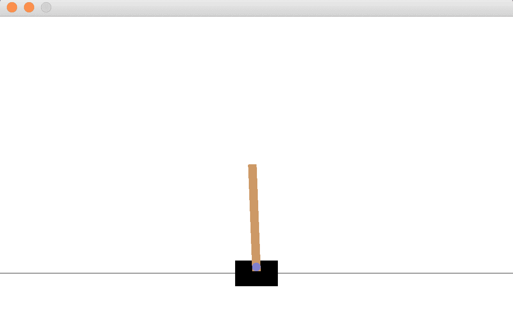

# 强化学习和 PyTorch 入门

我们用基本但重要的强化学习算法开始了我们的实践强化学习和 PyTorch 之旅，包括随机搜索、爬山和策略梯度。我们将从设置工作环境和 OpenAI 健身房开始，您将通过 Atari 和 CartPole 操场熟悉强化学习环境。我们也将展示如何逐步开发算法来解决横竿问题。此外，我们将回顾 PyTorch 的要点，并为即将到来的学习示例和项目做准备。

本章包含以下配方:

*   设置工作环境
*   安装开放式健身房
*   模拟 Atari 环境
*   模拟电线杆环境
*   回顾 PyTorch 的基本原理
*   实施和评估随机搜索策略
*   开发爬山算法
*   开发策略梯度算法


# 设置工作环境

让我们从设置工作环境开始，包括 Python 和 Anaconda 的正确版本，以及整本书使用的主要框架 PyTorch。

Python 是我们用来实现全书中所有强化学习算法和技术的语言。在本书中，我们将使用 Python 3，或者更确切地说，3.6 或更高版本。如果你是 Python 2 用户，现在是你转用 Python 3 的最佳时机，因为 2020 年后将不再支持 Python 2。不过，过渡非常顺利，所以不要惊慌。

Anaconda 是用于数据科学和机器学习的开源 Python 发行版(【www.anaconda.com/distribution/】)的**。我们将使用 Anaconda 的包管理器`conda`和`pip`来安装 Python 包。**

**py Torch**([https://pytorch.org/](https://pytorch.org/))，主要由脸书 AI Research (FAIR)集团开发，是基于 Torch([http://torch.ch/](http://torch.ch/))的新潮机器学习库。PyTorch 中的张量取代了 NumPy 的`ndarrays`，提供了更多的灵活性和与 GPU 的兼容性。由于强大的计算图形和简单友好的界面，PyTorch 社区每天都在扩大，并被越来越多的科技巨头大量采用。

让我们看看如何正确设置所有这些组件。


# 怎么做...

我们将从安装 Anaconda 开始。如果您的系统上已经运行了 Anaconda for Python 3.6 或 3.7，那么您可以跳过这一步。否则，您可以遵循[https://docs.anaconda.com/anaconda/install/](https://docs.anaconda.com/anaconda/install/)中针对您的操作系统的说明，如下所示:


设置完成后，您可以随意使用 PyTorch。为了验证您已经正确设置了 Anaconda 和 Python，您可以在 Linux/Mac 的终端或 Windows 的命令提示符下输入下面一行代码(从现在开始，我们称之为终端):

```py
python
```

它将显示您的 Python Anaconda 环境。您应该会看到类似于以下截图的内容:


如果没有提到 Anaconda 和 Python 3.x，请检查系统路径或 Python 运行的路径。

接下来要做的是安装 PyTorch。首先，转到[https://pytorch.org/get-started/locally/](https://pytorch.org/get-started/locally/)，从下表中选择对您环境的描述:


这里我们以 **Mac** 、 **Conda** 、 **Python 3.7** 、本地运行(无 CUDA)为例，在终端输入结果命令行:

```py
conda install pytorch torchvision -c pytorch
```

要确认 PyTorch 安装正确，请在 Python 中运行以下代码行:

```py
>>> import torch
>>> x = torch.empty(3, 4)
>>> print(x)
tensor([[ 0.0000e+00,  2.0000e+00, -1.2750e+16, -2.0005e+00],
 [ 9.8742e-37,  1.4013e-45, 9.9222e-37,  1.4013e-45],
 [ 9.9220e-37,  1.4013e-45, 9.9225e-37,  2.7551e-40]])
```

如果显示 3 x 4 矩阵，这意味着 PyTorch 安装正确。

现在，我们已经成功地设置了工作环境。


# 它是如何工作的...

我们刚刚在 PyTorch 中创建了一个大小为 3 x 4 的张量。它是一个空矩阵。通过说`empty`，这并不意味着所有的元素都是值`Null`。相反，它们是一堆被认为是占位符的无意义的浮动。用户需要稍后设置所有值。这和 NumPy 的空数组很像。


# 还有更多...

你们中的一些人可能会质疑安装 Anaconda 和使用`conda`来管理包的必要性，因为使用`pip`安装包很容易。事实上，`conda`是比`pip`更好的打包工具。我们使用`conda`主要有以下四个原因:

*   **它很好地处理了库依赖关系**:用`conda`安装一个包会自动下载它所有的依赖关系。然而，用`pip`这样做将导致警告，安装将被中止。
*   **优雅地解决了包冲突**:如果安装一个包需要另一个特定版本的包(比如 2.3 或更高版本)，`conda`会自动更新另一个包的版本。
*   **轻松创建虚拟环境**:虚拟环境是一个自包含的包目录树。不同的应用程序或项目可以使用不同的虚拟环境。所有虚拟环境都是相互隔离的。建议使用虚拟环境，以便我们为一个应用程序所做的任何事情都不会影响我们的系统环境或任何其他环境。
*   **它也与 pip** 兼容:我们仍然可以通过以下命令在`conda`中使用`pip`:

```py
conda install pip
```


# 请参见

如果您有兴趣了解更多关于`conda`的信息，请随时查阅以下资源:

*   **Conda 用户指南**:[https://Conda . io/projects/Conda/en/latest/user-guide/index . html](https://conda.io/projects/conda/en/latest/user-guide/index.html)
*   **使用 conda 创建和管理虚拟环境**:[https://conda . io/projects/conda/en/latest/user-guide/tasks/manage-environments . html](https://conda.io/projects/conda/en/latest/user-guide/tasks/manage-environments.html)

如果你想更熟悉 PyTorch，可以去 https://pytorch.org/tutorials/#getting-started 的[看官方教程的*入门*部分。我们建议您至少完成以下工作:](https://pytorch.org/tutorials/#getting-started)

*   **什么是 py torch**:[https://py torch . org/tutorials/初学者/blitz/tensor _ tutorial . html # sphx-glr-初学者-blitz-tensor-tutorial-py](https://pytorch.org/tutorials/beginner/blitz/tensor_tutorial.html#sphx-glr-beginner-blitz-tensor-tutorial-py)
*   **用实例学习 py torch**:[https://py torch . org/tutorials/初学者/pytorch_with_examples.html](https://pytorch.org/tutorials/beginner/pytorch_with_examples.html)


# 安装开放式健身房

设置好工作环境后，我们现在可以安装 OpenAI Gym 了。如果不使用 OpenAI Gym，你就无法进行强化学习，open ai Gym 为你提供了各种开发学习算法的环境。

**open ai**(【https://openai.com/】T2)是一家非营利性研究公司，专注于构建安全的**人工通用智能** ( **AGI** )并确保其造福人类。 **OpenAI Gym** 是一个强大的开源工具包，用于开发和比较强化学习算法。它提供了各种强化学习模拟和任务的界面，从步行到登月，从赛车到玩雅达利游戏。参见[https://gym.openai.com/envs/](https://gym.openai.com/envs/)获取完整的环境列表。我们可以编写**代理**来使用任何数值计算库(如 PyTorch、TensorFlow 或 Keras)与 OpenAI 健身房环境进行交互。


# 怎么做...

有两种方法安装健身房。第一种是使用`pip`，如下:

```py
pip install gym
```

对于`conda`用户，记得在使用`pip`安装 Gym 之前，先使用以下命令在`conda`中安装`pip`:

```py
conda install pip
```

这是因为截止到 2019 年初，Gym 还没有在`conda`正式上线。

另一种方法是从源代码构建:

1.  首先，直接从它的 Git 存储库中克隆这个包:

```py
git clone https://github.com/openai/gym
```

2.  转到下载文件夹，从那里安装 Gym:

```py
cd gym
pip install -e .
```

现在你可以走了。随意摆弄`gym`。

3.  您还可以通过键入以下代码行来检查可用的`gym`环境:

```py
>>> from gym import envs
>>> print(envs.registry.all())
dict_values([EnvSpec(Copy-v0), EnvSpec(RepeatCopy-v0), EnvSpec(ReversedAddition-v0), EnvSpec(ReversedAddition3-v0), EnvSpec(DuplicatedInput-v0), EnvSpec(Reverse-v0), EnvSpec(CartPole-v0), EnvSpec(CartPole-v1), EnvSpec(MountainCar-v0), EnvSpec(MountainCarContinuous-v0), EnvSpec(Pendulum-v0), EnvSpec(Acrobot-v1), EnvSpec(LunarLander-v2), EnvSpec(LunarLanderContinuous-v2), EnvSpec(BipedalWalker-v2), EnvSpec(BipedalWalkerHardcore-v2), EnvSpec(CarRacing-v0), EnvSpec(Blackjack-v0)
...
...
```

如果你正确安装了 Gym，这会给你一个很长的环境列表。我们将在下一个配方中使用其中的一些，模拟 Atari 环境。


# 它是如何工作的...

与安装 Gym 的简单`pip`方法相比，如果您想要添加新环境和修改 Gym 本身，第二种方法提供了更多的灵活性。


# 还有更多...

你可能想知道为什么我们需要在健身房的环境中测试强化学习算法，因为我们工作的实际环境可能会有很大的不同。你会回忆起强化学习并没有对环境做出很多假设，但是它通过与环境的互动来更多地了解环境。此外，在比较不同算法的性能时，我们需要将它们应用到标准化的环境中。Gym 是一个完美的基准，涵盖了许多多功能和易于使用的环境。这类似于我们经常在监督和非监督学习中用作基准的数据集，如 MNIST、Imagenet、MovieLens 和汤森路透新闻。


# 请参见

看看 https://gym.openai.com/docs/体育馆的官方文件。


# 模拟 Atari 环境

要开始使用 Gym，让我们用它玩一些 Atari 游戏。

雅达利环境([https://gym.openai.com/envs/#atari](https://gym.openai.com/envs/#atari))是各种各样的**雅达利 2600** 视频游戏，比如《异形》、《空袭》、《乒乓》和《太空竞赛》。如果你曾经玩过雅达利游戏，这个食谱应该会对你有意思，因为你将会玩一个雅达利游戏，太空入侵者。但是，会有代理人代表您行事。


# 怎么做...

让我们按照以下步骤模拟 Atari 环境:

1.  为了第一次运行任何`atari`环境，我们需要通过在终端中运行以下命令来安装`atari`依赖项:

```py
pip install gym[atari]
```

或者，如果您使用前一个配方中的第二种方法来`install gym`，您可以改为运行以下命令:

```py
pip install -e '.[atari]'
```

2.  安装 Atari 依赖项后，我们导入 Python 中的`gym`库:

```py
>>> import gym
```

3.  创建一个`SpaceInvaders`环境的实例:

```py
>>> env = gym.make('SpaceInvaders-v0')
```

4.  重置环境:

```py
>>> env.reset()
 array([[[ 0,  0, 0],
         [ 0, 0,  0],
         [ 0, 0,  0],
         ...,
         ...,
         [80, 89, 22],
         [80, 89, 22],
         [80, 89, 22]]], dtype=uint8)
```

如您所见，这也返回了环境的初始状态。

5.  渲染环境:

```py
>>> env.render()
True
```

您将看到弹出一个小窗口，如下所示:


从游戏窗口可以看到，飞船以三条生命开始(红色飞船)。

6.  随机选择一个可能的移动并执行该动作:

```py
>>> action = env.action_space.sample()
>>> new_state, reward, is_done, info = env.step(action)
```

`step()`方法返回一个动作执行后发生的情况，包括以下内容:

*   **新状态**:新观察。
*   **奖励**:在该状态下与该动作相关联的奖励。
*   **完成**:表示游戏是否结束的标志。在一个`SpaceInvaders`环境中，如果宇宙飞船已经没有生命或者所有的外星人都消失了，这将是`True`;否则，它仍将是`False`。
*   **信息**:与环境相关的额外信息。这大约是本案中剩下的生命数量。这对调试很有用。

让我们来看看`is_done`旗和`info`:

```py
>>> print(is_done)
False
>>> print(info)
{'ale.lives': 3}
```

现在我们渲染环境:

```py
>>> env.render()
 True
```

游戏窗口变成如下:


你不会在游戏窗口中注意到太多的不同，因为飞船只是动了一下。

7.  现在，让我们做一个`while`循环，让代理执行尽可能多的动作:

```py
>>> is_done = False
>>> while not is_done:
...     action = env.action_space.sample()
...     new_state, reward, is_done, info = env.step(action)
...     print(info)
...     env.render()
{'ale.lives': 3}
True
{'ale.lives': 3}
True
……
……
{'ale.lives': 2}
True
{'ale.lives': 2}
True
……
……
{'ale.lives': 1}
True
{'ale.lives': 1}
True
```

同时，你会看到游戏在运行，飞船在不停地移动和射击，外星人也是。看起来也很有趣。最后，当游戏结束时，窗口如下所示:


如你所见，这场比赛我们得了 150 分。您可能会得到比这更高或更低的分数，因为代理执行的操作都是随机选择的。

我们也确认没有人会留下最后一条信息:

```py
>>> print(info)
{'ale.lives': 0}
```


# 它是如何工作的...

使用 Gym，我们可以通过调用`make()`方法，以环境的名称作为参数，轻松地创建一个环境实例。

您可能已经注意到，代理执行的动作是使用`sample()`方法随机选择的。

请注意，通常情况下，我们会有一个由强化学习算法指导的更复杂的代理。在这里，我们刚刚演示了如何模拟一个环境，以及代理如何采取行动而不管结果如何。

运行几次，看看我们得到了什么:

```py
>>> env.action_space.sample()
0
>>> env.action_space.sample()
3
>>> env.action_space.sample()
0
>>> env.action_space.sample()
4
>>> env.action_space.sample()
2
>>> env.action_space.sample()
1
>>> env.action_space.sample()
4
>>> env.action_space.sample()
5
>>> env.action_space.sample()
1
>>> env.action_space.sample()
0
```

总共有六种可能的操作。通过运行以下命令，我们也可以看到这一点:

```py
>>> env.action_space
Discrete(6)
```

从 0 到 5 的动作分别代表无操作、开火、上、右、左、下，这是游戏中飞船能做的所有动作。

`step()`方法将让代理采取被指定为其参数的动作。`render()`方法将根据对环境的最新观察更新显示窗口。

环境的观察值`new_state`由 210×160×3 矩阵表示，如下所示:

```py
>>> print(new_state.shape)
(210, 160, 3)
```

这意味着显示屏的每一帧都是大小为 210 x 160 的 RGB 图像。


# 还有更多...

你可能想知道为什么我们需要安装 Atari 依赖项。其实不伴随`gym`安装的环境还有几个，比如 Box2d，Classic control，MuJoCo，Robotics。

以`Box2d`环境为例；在首次运行环境之前，我们需要安装`Box2d`依赖项。同样，两种安装方法如下:

```py
pip install gym[box2d]
pip install -e '.[box2d]'
```

之后，我们可以使用`LunarLander`环境，如下所示:

```py
>>> env = gym.make('LunarLander-v2')
>>> env.reset()
array([-5.0468446e-04,  1.4135642e+00, -5.1140346e-02,  1.1751971e-01,
 5.9164839e-04,  1.1584054e-02, 0.0000000e+00,  0.0000000e+00],
 dtype=float32)
>>> env.render()
```

将弹出一个游戏窗口:


# 请参见

如果你想模拟一个环境，但不确定应该在`make()`方法中使用什么名字，你可以在[https://github.com/openai/gym/wiki/Table-of-environments](https://github.com/openai/gym/wiki/Table-of-environments)的环境列表中找到。除了用于调用环境的名称之外，该表还显示了观察矩阵的大小和可能动作的数量。享受与环境玩耍的乐趣。


# 模拟电线杆环境

在这份食谱中，我们将致力于模拟多一个环境，以便更熟悉健身房。CartPole 环境是强化学习研究中的经典环境。

CartPole 是一项传统的强化学习任务，在这项任务中，一根杆子被直立放置在一辆手推车的顶部。代理在一个时间步长内将购物车向左或向右移动 1 个单位。目标是平衡杆子，防止它倒下。如果杆与垂直方向的角度超过 12 度，或者手推车从原点移动 2.4 个单位，则认为杆已经倒下。当出现以下任何情况时，一集终止:

*   杆子倒了
*   时间步长的数量达到 200


# 怎么做...

让我们按照以下步骤模拟`CartPole`环境:

1.  要运行 CartPole 环境，让我们首先在[https://github.com/openai/gym/wiki/Table-of-environments](https://github.com/openai/gym/wiki/Table-of-environments)的环境表中搜索它的名字。我们得到了`'CartPole-v0'`并且还了解到观察空间用一个 4 维数组表示，并且有两个可能的动作(这是有意义的)。
2.  我们导入健身房库并创建一个`CartPole`环境的实例:

```py
 >>> import gym >>> env = gym.make('CartPole-v0')
```

3.  重置环境:

```py
 >>> env.reset() array([-0.00153354,  0.01961605, -0.03912845, -0.01850426])
```

如您所见，这也返回了由四个浮点数组成的数组所表示的初始状态。

4.  渲染环境:

```py
 >>> env.render() True
```

您将看到弹出一个小窗口，如下所示:



5.  现在，让我们做一个`while`循环，让代理执行尽可能多的随机动作:

```py
 >>> is_done = False >>> while not is_done:
 ...     action = env.action_space.sample()
 ...     new_state, reward, is_done, info = env.step(action)
 ...     print(new_state)
 ...     env.render()
 ...
 [-0.00114122 -0.17492355 -0.03949854  0.26158095]
 True
 [-0.00463969 -0.36946006 -0.03426692  0.54154857]
 True
 ……
 ……
 [-0.11973207 -0.41075106  0.19355244 1.11780626]
 True
 [-0.12794709 -0.21862176  0.21590856 0.89154351]
 True
```

同时，你会看到小车和杆子在移动。最后，你会看到他们都停了下来。该窗口如下所示:


这一集只持续几个步骤，因为左边或右边的动作是随机选择的。我们能不能把整个过程录下来，以便以后重播？在 Gym 中我们只用两行代码就可以做到，如*步骤 7* 所示。如果使用的是 Mac 或 Linux 系统，需要先完成*第 6 步*；否则，可以跳到*第 7 步*。

6.  要录制视频，我们需要安装`ffmpeg`包。对于 Mac，可以通过以下命令进行安装:

```py
brew install ffmpeg
```

对于 Linux，以下命令应该可以做到:

```py
sudo apt-get install ffmpeg
```

7.  在创建了`CartPole`实例之后，添加这两行:

```py
>>> video_dir = './cartpole_video/' >>> env = gym.wrappers.Monitor(env, video_dir)
```

这将记录窗口中显示的内容，并将其存储在指定的目录中。

现在重新运行从*步骤 3* 到*步骤 5* 的代码。一集结束后，我们可以看到在`video_dir`文件夹中创建了一个`.mp4`文件。视频挺短的；可能持续 1 秒左右。


# 它是如何工作的...

在这个配方中，我们打印出每个步骤的状态数组。但是数组中的每个浮点数是什么意思呢？我们可以在 Gym 的 GitHub 维基页面上找到更多关于 CartPole 的信息:[https://github.com/openai/gym/wiki/CartPole-v0](https://github.com/openai/gym/wiki/CartPole-v0)。原来，这四个浮点表示以下内容:

*   推车位置:这个范围从-2.4 到 2.4，任何超出这个范围的位置都会触发剧集终止。
*   推车速度。
*   极角:任何小于-0.209 (-12 度)或大于 0.209 (12 度)的值都将触发剧集终止。
*   尖端的极点速度。

就动作而言，它要么是 0，要么是 1，分别对应于向左和向右推购物车。

这种环境下的**奖励**在剧集结束前的每个时间步长都是+1。我们也可以通过打印出每一步的奖励来验证这一点。总回报就是时间步长的数量。


# 还有更多...

到目前为止，我们只播放了一集。为了评估代理的表现，我们可以模拟许多集，然后平均每个集的总报酬。平均总报酬会告诉我们采取随机行动的代理人的表现。

让我们设定 10，000 集:

```py
 >>> n_episode = 10000
```

在每集中，我们通过累计每步的奖励来计算总奖励:

```py
 >>> total_rewards = [] >>> for episode in range(n_episode):
 ...     state = env.reset()
 ...     total_reward = 0
 ...     is_done = False
 ...     while not is_done:
 ...         action = env.action_space.sample()
 ...         state, reward, is_done, _ = env.step(action)
 ...         total_reward += reward
 ...     total_rewards.append(total_reward)
```

最后，我们计算平均总报酬:

```py
 >>> print('Average total reward over {} episodes: {}'.format( n_episode, sum(total_rewards) / n_episode))
 Average total reward over 10000 episodes: 22.2473
```

平均而言，采取一个随机行动得分为 22.25。

我们都知道，采取随机行动是不够复杂的，我们将在即将到来的食谱中实施先进的政策。但是对于下一个食谱，让我们休息一下，回顾一下 PyTorch 的基础知识。


# 回顾 PyTorch 的基本原理

正如我们已经提到的，PyTorch 是我们在本书中用来实现强化学习算法的数值计算库。

PyTorch 是由脸书开发的一个流行的科学计算和机器学习(包括深度学习)库。张量是 PyTorch 中最核心的数据结构，类似于 NumPy 的`ndarrays`。PyTorch 和 NumPy 在科学计算方面不相上下。但是，PyTorch 在数组操作和数组遍历方面比 NumPy 快。这主要是因为 PyTorch 中数组元素的访问速度更快。因此，越来越多的人认为 PyTorch 将取代 NumPy。


# 怎么做...

让我们快速回顾一下 PyTorch 中的基本编程，以便更加熟悉它:

1.  我们在之前的配方中创建了一个未初始化的矩阵。随机初始化的怎么样？请参见以下命令:

```py
 >>> import torch >>> x = torch.rand(3, 4)
 >>> print(x)
 tensor([[0.8052, 0.3370, 0.7676, 0.2442],
        [0.7073, 0.4468, 0.1277, 0.6842],
        [0.6688, 0.2107, 0.0527, 0.4391]])
```

生成区间(0，1)中均匀分布的随机浮点数。

2.  我们可以指定返回张量的所需数据类型。例如，双精度类型的张量(`float64`)返回如下:

```py
 >>> x = torch.rand(3, 4, dtype=torch.double) >>> print(x)
 tensor([[0.6848, 0.3155, 0.8413, 0.5387],
        [0.9517, 0.1657, 0.6056, 0.5794],
        [0.0351, 0.3801, 0.7837, 0.4883]], dtype=torch.float64)
```

默认情况下，`float`是返回的数据类型。

3.  接下来，让我们创建一个充满 0 的矩阵和一个充满 1 的矩阵:

```py
 >>> x = torch.zeros(3, 4) >>> print(x)
    tensor([[0., 0., 0., 0.],
           [0., 0., 0., 0.],
           [0., 0., 0., 0.]])
    >>> x = torch.ones(3, 4)
    >>> print(x)
    tensor([[1., 1., 1., 1.],
           [1., 1., 1., 1.],
           [1., 1., 1., 1.]])
```

4.  要获得张量的大小，请使用以下代码:

```py
 >>> print(x.size()) torch.Size([3, 4])
```

`torch.Size`实际上是一个元组。

5.  要重塑张量，我们可以使用`view()`方法:

```py
 >>> x_reshaped = x.view(2, 6) >>> print(x_reshaped)
 tensor([[1., 1., 1., 1., 1., 1.],
         [1., 1., 1., 1., 1., 1.]])
```

6.  我们可以直接从数据中创建张量，包括单个值、列表和嵌套列表:

```py
 >>> x1 = torch.tensor(3) >>> print(x1)
 tensor(3)
 >>> x2 = torch.tensor([14.2, 3, 4])
 >>> print(x2)
 tensor([14.2000,  3.0000, 4.0000])
 >>> x3 = torch.tensor([[3, 4, 6], [2, 1.0, 5]])
 >>> print(x3)
 tensor([[3., 4., 6.],
         [2., 1., 5.]])
```

7.  要访问不止一个元素的张量中的元素，我们可以以类似于 NumPy 的方式使用索引:

```py
 >>> print(x2[1]) tensor(3.)
 >>> print(x3[1, 0])
 tensor(2.)
 >>> print(x3[:, 1])
 tensor([4., 1.])
 >>> print(x3[:, 1:])
 tensor([[4., 6.],
         [1., 5.]])
```

与单元素张量一样，我们通过使用`item()`方法来实现:

```py
 >>> print(x1.item()) 3
```

8.  张量和 NumPy 数组可以相互转换。使用`numpy()`方法将张量转换为 NumPy 数组:

```py
 >>> x3.numpy() array([[3., 4., 6.],
        [2., 1., 5.]], dtype=float32)
```

使用`from_numpy()`将 NumPy 数组转换为张量:

```py
>>> import numpy as np >>> x_np = np.ones(3)
>>> x_torch = torch.from_numpy(x_np)
>>> print(x_torch)
tensor([1., 1., 1.], dtype=torch.float64)
```

请注意，如果输入 NumPy 数组是 float 数据类型，则输出张量将是 double 类型。有时可能需要类型转换。

看看下面的例子，双精度类型的张量被转换成一个`float`:

```py
 >>> print(x_torch.float())
 tensor([1., 1., 1.])
```

9.  PyTorch 中的操作也类似于 NumPy。以加法为例；我们可以简单地做到以下几点:

```py
>>> x4 = torch.tensor([[1, 0, 0], [0, 1.0, 0]]) >>> print(x3 + x4)
tensor([[4., 4., 6.],
         [2., 2., 5.]])
```

或者我们可以使用如下的`add()`方法:

```py
 >>> print(torch.add(x3, x4)) tensor([[4., 4., 6.],
         [2., 2., 5.]])
```

10.  PyTorch 支持就地操作，这将使张量对象发生变异。例如，让我们运行以下命令:

```py
 >>> x3.add_(x4) tensor([[4., 4., 6.],
         [2., 2., 5.]])
```

你会看到`x3`变成了原来的`x3`加上`x4`的结果:

```py
 >>> print(x3) tensor([[4., 4., 6.],
         [2., 2., 5.]])
```


# 还有更多...

任何带有 **_** 的方法都表示它是一个就地操作，用结果值更新张量。


# 请参见

PyTorch 中张量运算的完整列表，请访问 https://pytorch.org/docs/stable/torch.html 的官方文档。如果您遇到 PyTorch 编程问题，这是搜索信息的最佳位置。


# 实施和评估随机搜索策略

在对 PyTorch 编程进行一些练习之后，从这个食谱开始，我们将致力于更复杂的策略来解决 CartPole 问题，而不是纯粹的随机行为。我们从这个食谱中的随机搜索策略开始。

一种简单而有效的方法是将一个观察映射到一个由两个数字组成的向量，这两个数字代表两个动作。将选择具有较高值的动作。线性映射由大小为 4×2 的权重矩阵来描述，因为在这种情况下观察是 4 维的。在每集中，权重是随机生成的，用于计算本集每步的动作。然后计算总奖励。这个过程会重复很多次，最终，能够获得最高总回报的权重将成为习得的策略。这种方法被称为**随机搜索**，因为权重是在每次试验中随机选取的，希望通过大量试验找到最佳权重。


# 怎么做...

让我们用 PyTorch 实现一个随机搜索算法:

1.  导入 Gym 和 PyTorch 包并创建一个环境实例:

```py
>>> import gym >>> import torch
>>> env = gym.make('CartPole-v0')
```

2.  获取观察和行动空间的尺寸:

```py
>>> n_state = env.observation_space.shape[0] >>> n_state
 4
>>> n_action = env.action_space.n
>>> n_action
 2
```

当我们为权重矩阵定义大小为 4 x 2 的张量时，将会用到这些。

3.  定义一个函数，在给定输入权重的情况下模拟一集，并返回总奖励:

```py
 >>> def run_episode(env, weight): ...     state = env.reset()
 ...     total_reward = 0
 ...     is_done = False
 ...     while not is_done:
 ...         state = torch.from_numpy(state).float()
 ...         action = torch.argmax(torch.matmul(state, weight))
 ...         state, reward, is_done, _ = env.step(action.item())
 ...         total_reward += reward
 ...     return total_reward
```

这里，我们将状态数组转换为浮点类型的张量，因为我们需要为线性映射计算状态和权重张量的乘积`torch.matmul(state, weight)`。使用`torch.argmax()`操作选择具有较高值的动作。不要忘了使用`.item()`来取结果作用张量的值，因为它是一元张量。

4.  指定剧集的数量:

```py
>>> n_episode = 1000
```

5.  我们需要随时跟踪最佳总报酬，以及相应的权重。因此，我们指定它们的起始值:

```py
>>> best_total_reward = 0 >>> best_weight = None
```

我们还将记录每集的总奖励:

```py
>>> total_rewards = []
```

6.  现在，我们可以运行`n_episode`。对于每集，我们做以下工作:

*   随机选择重量
*   让代理根据线性映射采取行动
*   一集结束并返回总奖励
*   如有必要，更新最佳总报酬和最佳权重
*   此外，记录总奖励

将此代码如下所示:

```py
 >>> for episode in range(n_episode): ...     weight = torch.rand(n_state, n_action)
 ...     total_reward = run_episode(env, weight)
 ...     print('Episode {}: {}'.format(episode+1, total_reward))
 ...     if total_reward > best_total_reward:
 ...         best_weight = weight
 ...         best_total_reward =  total_reward
 ...     total_rewards.append(total_reward)
 ...
 Episode 1: 10.0
 Episode 2: 73.0
 Episode 3: 86.0
 Episode 4: 10.0
 Episode 5: 11.0
 ……
 ……
 Episode 996: 200.0
 Episode 997: 11.0
 Episode 998: 200.0
 Episode 999: 200.0
 Episode 1000: 9.0
```

我们通过 1，000 次随机搜索获得了最佳策略。最佳策略由`best_weight`参数化。

7.  在我们测试出测试集中的最佳策略之前，我们可以通过随机线性映射来计算平均总回报:

```py
 >>> print('Average total reward over {} episode: {}'.format( n_episode, sum(total_rewards) / n_episode))
 Average total reward over 1000 episode: 47.197
```

这是我们从随机行动策略(22.25)中得到的两倍多。

8.  现在，让我们来看看学习策略在 100 个新剧集中的表现:

```py
 >>> n_episode_eval = 100 >>> total_rewards_eval = []
 >>> for episode in range(n_episode_eval):
 ...     total_reward = run_episode(env, best_weight)
 ...     print('Episode {}: {}'.format(episode+1, total_reward))
 ...     total_rewards_eval.append(total_reward)
 ...
 Episode 1: 200.0
 Episode 2: 200.0
 Episode 3: 200.0
 Episode 4: 200.0
 Episode 5: 200.0
 ……
 ……
 Episode 96: 200.0
 Episode 97: 188.0
 Episode 98: 200.0
 Episode 99: 200.0
 Episode 100: 200.0
 >>> print('Average total reward over {} episode: {}'.format(
           n_episode, sum(total_rewards_eval) / n_episode_eval))
 Average total reward over 1000 episode: 196.72
```

令人惊讶的是，测试集的平均奖励接近学习策略的最大值 200 步。请注意，该值可能变化很大。可能在 160 到 200 之间。


# 它是如何工作的...

随机搜索算法之所以如此有效，主要是因为我们的 CartPole 环境非常简单。它的观测状态仅由四个变量组成。你会回忆起雅达利太空入侵者游戏里的观测是 10 万多(也就是 210 * 160 * 3)。CartPole 中动作状态的维数是《太空入侵者》中的三分之一。一般来说，简单的算法适用于简单的问题。在我们的例子中，我们简单地从随机池中搜索从观察到行动的最佳线性映射。

我们注意到的另一个有趣的事情是，在我们选择和部署最佳策略(最佳线性映射)之前，随机搜索也优于随机行动。这是因为随机线性映射确实考虑了观测值。随着来自环境的更多信息，随机搜索策略中做出的决策比完全随机的决策更加智能。


# 还有更多...

我们还可以绘制训练阶段每集的总奖励:

```py
>>> import matplotlib.pyplot as plt >>> plt.plot(total_rewards)
>>> plt.xlabel('Episode')
>>> plt.ylabel('Reward')
>>> plt.show()
```

这将生成以下图:


如果尚未安装 matplotlib，可以通过以下命令进行安装:

```py
conda install matplotlib
```

我们可以看到每一集的奖励都是随机的，而且在我们浏览每一集的时候都没有改善的趋势。这基本上是我们所期望的。

在奖励对剧集的剧情中，我们可以看到有一些剧集的奖励达到了 200。无论何时出现这种情况，我们都可以结束培训阶段，因为已经没有改进的余地了。结合这一变化，我们现在在培训阶段有以下内容:

```py
 >>> n_episode = 1000 >>> best_total_reward = 0
 >>> best_weight = None
 >>> total_rewards = []
 >>> for episode in range(n_episode):
 ...     weight = torch.rand(n_state, n_action)
 ...     total_reward = run_episode(env, weight)
 ...     print('Episode {}: {}'.format(episode+1, total_reward))
 ...     if total_reward > best_total_reward:
 ...         best_weight = weight
 ...         best_total_reward = total_reward
 ...     total_rewards.append(total_reward)
 ...     if best_total_reward == 200:
 ...         break
 Episode 1: 9.0
 Episode 2: 8.0
 Episode 3: 10.0
 Episode 4: 10.0
 Episode 5: 10.0
 Episode 6: 9.0
 Episode 7: 17.0
 Episode 8: 10.0
 Episode 9: 43.0
 Episode 10: 10.0
 Episode 11: 10.0
 Episode 12: 106.0
 Episode 13: 8.0
 Episode 14: 32.0
 Episode 15: 98.0
 Episode 16: 10.0
 Episode 17: 200.0
```

实现最大回报的政策可以在第 17 集找到。同样，这可能变化很大，因为权重是为每集随机生成的。为了计算所需训练集的期望值，我们可以重复前面的训练过程 1000 次，并取训练集的平均值:

```py
 >>> n_training = 1000 >>> n_episode_training = []
 >>> for _ in range(n_training):
 ...     for episode in range(n_episode):
 ...         weight = torch.rand(n_state, n_action)
 ...         total_reward = run_episode(env, weight)
 ...         if total_reward == 200:
 ...             n_episode_training.append(episode+1)
 ...             break
 >>> print('Expectation of training episodes needed: ',
            sum(n_episode_training) / n_training)
 Expectation of training episodes needed:  13.442
```

平均而言，我们预计大约需要 13 集才能找到最佳策略。


# 开发爬山算法

在随机搜索策略中我们可以看到，每集都是独立的。事实上，随机搜索中的所有剧集都可以并行运行，最终会选出达到最佳性能的权重。我们也用《奖励与插曲》的情节验证了这一点，其中没有上升趋势。在这个菜谱里，我们会开发一个不同的算法，一个爬山算法，把一集学到的知识转移到下一集。

在爬山算法中，我们也从随机选择的权重开始。但是在这里，对于每一集，我们都给权重加上一些噪声。如果总回报提高了，我们就用新的来更新权重；否则，我们保持原来的重量。在这种方法中，权重随着我们在剧集中的进展而逐渐提高，而不是在每一集里跳来跳去。


# 怎么做...

让我们继续用 PyTorch 实现爬山算法:

1.  和前面一样，导入必要的包，创建一个环境实例，并获得观察和操作空间的维度:

```py
>>> import gym >>> import torch
>>> env = gym.make('CartPole-v0')
>>> n_state = env.observation_space.shape[0]
>>> n_action = env.action_space.n
```

2.  我们将重用我们在前面的配方中定义的`run_episode`函数，所以这里不再重复。同样，给定输入权重，它模拟一集并返回总报酬。
3.  让我们现在把它定为 1000 集:

```py
>>> n_episode = 1000
```

4.  我们需要随时跟踪最佳总报酬，以及相应的权重。因此，让我们指定它们的起始值:

```py
>>> best_total_reward = 0 >>> best_weight = torch.rand(n_state, n_action)
```

我们还将记录每集的总奖励:

```py
>>> total_rewards = []
```

5.  正如我们提到的，我们将为每集的权重添加一些噪声。事实上，我们将对噪音应用一个标度，这样噪音就不会压倒重量。这里，我们将选择 0.01 作为噪声比例:

```py
>>> noise_scale = 0.01
```

6.  现在，我们可以运行`n_episode`函数。在我们随机选择初始权重后，对于每一集，我们执行以下操作:

*   向权重添加随机噪声
*   让代理根据线性映射采取行动
*   一集结束并返回总奖励
*   如果当前奖励大于迄今获得的最佳奖励，则更新最佳奖励和权重
*   否则，最佳奖励和权重保持不变
*   此外，记录总奖励

将此代码如下所示:

```py
 >>> for episode in range(n_episode): ...     weight = best_weight +
                     noise_scale * torch.rand(n_state, n_action)
 ...     total_reward = run_episode(env, weight)
 ...     if total_reward >= best_total_reward:
 ...         best_total_reward = total_reward
 ...         best_weight = weight
 ...     total_rewards.append(total_reward)
 ...     print('Episode {}: {}'.format(episode + 1, total_reward))
 ...
 Episode 1: 56.0
 Episode 2: 52.0
 Episode 3: 85.0
 Episode 4: 106.0
 Episode 5: 41.0
 ……
 ……
 Episode 996: 39.0
 Episode 997: 51.0
 Episode 998: 49.0
 Episode 999: 54.0
 Episode 1000: 41.0
```

我们还计算了爬山版线性映射所获得的平均总回报:

```py
 >>> print('Average total reward over {} episode: {}'.format( n_episode, sum(total_rewards) / n_episode))
 Average total reward over 1000 episode: 50.024
```

7.  为了使用爬山算法评估训练，我们多次重复训练过程(通过多次运行从*步骤 4* 到*步骤 6* 的代码)。我们观察到平均总报酬波动很大。以下是我们运行 10 次后得到的结果:

```py
Average total reward over 1000 episode: 9.261   
Average total reward over 1000 episode: 88.565
Average total reward over 1000 episode: 51.796
Average total reward over 1000 episode: 9.41
Average total reward over 1000 episode: 109.758
Average total reward over 1000 episode: 55.787
Average total reward over 1000 episode: 189.251
Average total reward over 1000 episode: 177.624
Average total reward over 1000 episode: 9.146
Average total reward over 1000 episode: 102.311
```

是什么导致了这种差异？事实证明，如果初始权重不好，在小范围内添加噪声对提高性能的作用不大。这样会造成衔接不畅。另一方面，如果初始权重很好，大规模添加噪声可能会使权重偏离最佳权重，并危及性能。怎样才能让爬山模型的训练更加稳定可靠？我们实际上可以使噪声尺度适应性能，就像梯度下降中的自适应学习速率一样。更多细节请看*第 8 步*。

8.  为了使噪声自适应，我们执行以下操作:

*   指定起始噪音等级。
*   如果某一集的表现有所改善，请降低噪波比例。在我们的例子中，我们取一半的比例，但是将`0.0001`设置为下限。
*   如果某集的性能下降，请增加噪波比例。在我们的例子中，我们将比例加倍，但是将`2`设置为上限。

把这个放进代码里:

```py
 >>> noise_scale = 0.01 >>> best_total_reward = 0
 >>> total_rewards = []
 >>> for episode in range(n_episode):
 ...     weight = best_weight +
                       noise_scale * torch.rand(n_state, n_action)
 ...     total_reward = run_episode(env, weight)
 ...     if total_reward >= best_total_reward:
 ...         best_total_reward = total_reward
 ...         best_weight = weight
 ...         noise_scale = max(noise_scale / 2, 1e-4)
 ...     else:
 ...         noise_scale = min(noise_scale * 2, 2)
 ...     print('Episode {}: {}'.format(episode + 1, total_reward))
 ...     total_rewards.append(total_reward)
 ...
 Episode 1: 9.0
 Episode 2: 9.0
 Episode 3: 9.0
 Episode 4: 10.0
 Episode 5: 10.0
 ……
 ……
 Episode 996: 200.0
 Episode 997: 200.0
 Episode 998: 200.0
 Episode 999: 200.0
 Episode 1000: 200.0
```

随着剧集的进展，奖励也在增加。它在前 100 集内达到最大值 200，并保持不变。平均总报酬看起来也很有希望:

```py
 >>> print('Average total reward over {} episode: {}'.format( n_episode, sum(total_rewards) / n_episode))
 Average total reward over 1000 episode: 186.11
```

我们还将每集的总报酬绘制如下:

```py
>>> import matplotlib.pyplot as plt >>> plt.plot(total_rewards)
>>> plt.xlabel('Episode')
>>> plt.ylabel('Reward')
>>> plt.show()
```

在结果图中，我们可以看到在达到最大值之前有一个明显的上升趋势:


请随意运行几次新的培训流程。与用恒定噪声标度学习相比，结果非常稳定。

9.  现在，让我们来看看学习策略在 100 个新剧集中的表现:

```py
 >>> n_episode_eval = 100 >>> total_rewards_eval = []
 >>> for episode in range(n_episode_eval):
 ...     total_reward = run_episode(env, best_weight)
 ...     print('Episode {}: {}'.format(episode+1, total_reward))
 ...     total_rewards_eval.append(total_reward)
 ...
 Episode 1: 200.0
 Episode 2: 200.0
 Episode 3: 200.0
 Episode 4: 200.0
 Episode 5: 200.0
 ……
 ……
 Episode 96: 200.0
 Episode 97: 200.0
 Episode 98: 200.0
 Episode 99: 200.0
 Episode 100: 200.0 
```

让我们看看平均表现:

```py
>>> print('Average total reward over {} episode: {}'.format(n_episode, sum(total_rewards) / n_episode)) Average total reward over 1000 episode: 199.94
```

测试集的平均奖励接近我们通过学习策略获得的最大值 200。您可以多次重新运行评估。结果相当一致。


# 它是如何工作的...

通过简单地给每集添加自适应噪声，我们能够用爬山算法比用随机搜索获得更好的性能。我们可以把它看作一种特殊的没有目标变量的梯度下降。额外的噪声是梯度，尽管是随机的。噪声尺度是学习率，它自适应于上一集的奖励。爬山的目标变量变成了获得最高奖励。总之，爬山算法中的代理不是孤立每一集，而是利用从每一集学到的知识，并在下一集执行更可靠的动作。正如爬山这个名字所暗示的，随着体重逐渐向最佳值移动，奖励会随着情节的进行而上升。


# 还有更多...

我们可以观察到，奖励在前 100 集内可以达到最大值。当奖励达到 200 时，我们可以停止训练吗，就像我们对随机搜索策略所做的那样？这可能不是一个好主意。请记住，代理人在爬山方面不断取得进步。即使它找到了产生最大回报的权重，它仍然可以在这个权重周围搜索最优点。这里，我们将最优策略定义为能够解决 CartPole 问题的策略。根据下面的维基页面，[https://github.com/openai/gym/wiki/CartPole-v0](https://github.com/openai/gym/wiki/CartPole-v0)，“解决”意味着连续 100 集的平均奖励不低于 195。

我们相应地改进了停止标准:

```py
 >>> noise_scale = 0.01 >>> best_total_reward = 0
 >>> total_rewards = []
 >>> for episode in range(n_episode):
 ...     weight = best_weight + noise_scale * torch.rand(n_state, n_action)
 ...     total_reward = run_episode(env, weight)
 ...     if total_reward >= best_total_reward:
 ...         best_total_reward = total_reward
 ...         best_weight = weight
 ...         noise_scale = max(noise_scale / 2, 1e-4)
 ...     else:
 ...         noise_scale = min(noise_scale * 2, 2)
 ...     print('Episode {}: {}'.format(episode + 1, total_reward))
 ...     total_rewards.append(total_reward)
 ...     if episode >= 99 and sum(total_rewards[-100:]) >= 19500:
 ...         break
 ...
 Episode 1: 9.0
 Episode 2: 9.0
 Episode 3: 10.0
 Episode 4: 10.0
 Episode 5: 9.0
 ……
 ……
 Episode 133: 200.0
 Episode 134: 200.0
 Episode 135: 200.0
 Episode 136: 200.0
 Episode 137: 200.0
```

在第 137 集，问题被认为解决了。


# 请参见

如果您有兴趣了解有关爬山算法的更多信息，以下资源很有用:

*   [https://en.wikipedia.org/wiki/Hill_climbing](https://en.wikipedia.org/wiki/Hill_climbing)
*   [https://www . geeks forgeeks . org/简介-爬山-人工智能/](https://www.geeksforgeeks.org/introduction-hill-climbing-artificial-intelligence/)


# 开发策略梯度算法

第一章的最后一个配方是关于用策略梯度算法求解 CartPole 环境。这可能比我们解决这个简单问题所需的更复杂，在这个问题中，随机搜索和爬山算法就足够了。然而，这是一个很好的学习算法，我们将在本书后面的更复杂的环境中使用它。

在策略梯度算法中，模型权重在每集结束时向梯度方向移动。我们将在下一节解释梯度的计算。此外，在每一步中，它**基于使用状态和权重计算的概率从策略中采样**动作。与随机搜索和爬山(通过采取获得更高分数的行动)相比，它不再确定地采取行动。因此，政策从确定性转变为**随机性**。


# 怎么做...

现在，是时候用 PyTorch 实现策略梯度算法了:

1.  和前面一样，导入必要的包，创建一个环境实例，并获得观察和操作空间的维度:

```py
>>> import gym >>> import torch
>>> env = gym.make('CartPole-v0')
>>> n_state = env.observation_space.shape[0]
>>> n_action = env.action_space.n
```

2.  我们定义了`run_episode`函数，它模拟给定输入权重的一集，并返回总报酬和计算出的梯度。更具体地说，它在每个步骤中执行以下任务:

*   基于当前状态和输入权重计算两个动作的概率`probs`
*   基于结果概率对动作`action`进行采样
*   以概率作为输入，计算`softmax`函数的导数`d_softmax`
*   将得到的导数`d_softmax`除以概率 probs，以获得关于策略的对数项的导数`d_log`
*   应用链规则计算权重的梯度`grad`
*   记录产生的梯度
*   执行动作，累积奖励，并更新状态

将所有这些放入代码中，我们得到以下内容:

```py
 >>> def run_episode(env, weight): ...     state = env.reset()
 ...     grads = []
 ...     total_reward = 0
 ...     is_done = False
 ...     while not is_done:
 ...         state = torch.from_numpy(state).float()
 ...         z = torch.matmul(state, weight)
 ...         probs = torch.nn.Softmax()(z)
 ...         action = int(torch.bernoulli(probs[1]).item())
 ...         d_softmax = torch.diag(probs) -
                             probs.view(-1, 1) * probs
 ...         d_log = d_softmax[action] / probs[action]
 ...         grad = state.view(-1, 1) * d_log
 ...         grads.append(grad)
 ...         state, reward, is_done, _ = env.step(action)
 ...         total_reward += reward
 ...         if is_done:
 ...             break
 ...     return total_reward, grads
```

在一集结束后，它返回在这一集获得的总奖励和为每个步骤计算的梯度。这两个输出将用于更新权重。

3.  让我们现在把它定为 1000 集:

```py
>>> n_episode = 1000
```

这意味着我们将运行`run_episode`和`n_episode`次。

4.  启动重量:

```py
>>> weight = torch.rand(n_state, n_action)
```

我们还将记录每集的总奖励:

```py
>>> total_rewards = []
```

5.  在每集的结尾，我们需要使用计算出的梯度来更新权重。每集每走一步，权重移动的幅度为该*步中计算的*学习率*梯度**剩余步骤中的总*奖励。这里，我们选择`0.001`作为学习率:

```py
>>> learning_rate = 0.001
```

现在，我们可以播放`n_episode`集了:

```py
 >>> for episode in range(n_episode): ...     total_reward, gradients = run_episode(env, weight)
 ...     print('Episode {}: {}'.format(episode + 1, total_reward))
 ...     for i, gradient in enumerate(gradients):
 ...         weight += learning_rate * gradient * (total_reward - i)
 ...     total_rewards.append(total_reward)
 ……
 ……
 Episode 101: 200.0
 Episode 102: 200.0
 Episode 103: 200.0
 Episode 104: 190.0
 Episode 105: 133.0
 ……
 ……
 Episode 996: 200.0
 Episode 997: 200.0
 Episode 998: 200.0
 Episode 999: 200.0
 Episode 1000: 200.0
```

6.  现在，我们计算由策略梯度算法实现的平均总报酬:

```py
 >>> print('Average total reward over {} episode: {}'.format( n_episode, sum(total_rewards) / n_episode))
 Average total reward over 1000 episode: 179.728
```

7.  我们还将每集的总报酬绘制如下:

```py
 >>> import matplotlib.pyplot as plt >>> plt.plot(total_rewards)
 >>> plt.xlabel('Episode')
 >>> plt.ylabel('Reward')
 >>> plt.show()
```

在结果图中，我们可以看到在它停留在最大值之前有一个明显的上升趋势:


我们还可以看到，即使在它收敛后，回报也会振荡。这是因为策略梯度算法是一种随机策略。

8.  现在，让我们来看看学习策略在 100 个新剧集中的表现:

```py
 >>> n_episode_eval = 100 >>> total_rewards_eval = []
 >>> for episode in range(n_episode_eval):
 ...     total_reward, _ = run_episode(env, weight)
 ...     print('Episode {}: {}'.format(episode+1, total_reward))
 ...     total_rewards_eval.append(total_reward)
 ...
 Episode 1: 200.0
 Episode 2: 200.0
 Episode 3: 200.0
 Episode 4: 200.0
 Episode 5: 200.0
 ……
 ……
 Episode 96: 200.0
 Episode 97: 200.0
 Episode 98: 200.0
 Episode 99: 200.0
 Episode 100: 200.0
```

让我们看看平均表现:

```py
>>> print('Average total reward over {} episode: {}'.format(n_episode, sum(total_rewards) / n_episode)) Average total reward over 1000 episode: 199.78
```

测试集的平均奖励接近于所学策略的最大值 200。您可以多次重新运行评估。结果相当一致。


# 它是如何工作的...

策略梯度算法通过采取小步骤来训练代理，并在一集结束时基于与这些步骤相关联的奖励来更新权重。让代理运行一整集，然后根据获得的奖励更新策略的技术被称为**蒙特卡洛**策略梯度。

基于基于当前状态和模型权重计算的概率分布来选择动作。例如，如果左和右动作的概率是[0.6，0.4]，这意味着左动作有 60%的时间被选择；这并不意味着像在随机搜索和爬山算法中一样，选择了左边的动作。

我们知道在一集结束之前，每一步的回报是 1。因此，我们用来计算每一步政策梯度的未来回报是剩余的步数。在每一集之后，我们将梯度历史乘以未来回报，以使用随机梯度上升方法更新权重。这样一集越长，权重更新越大。这样最终会增加获得更大总奖励的机会。

正如我们在本节开始时所提到的，策略梯度算法对于像 CartPole 这样的简单环境来说可能有些矫枉过正，但是它应该让我们为更复杂的问题做好准备。


# 还有更多...

如果我们考察奖励/剧集剧情，似乎也可以在已经解决的情况下，在训练中提前停止——连续 100 集以上的平均奖励不低于 195。我们只是将以下代码行添加到培训会话中:

```py
 >>> if episode >= 99 and sum(total_rewards[-100:]) >= 19500: ...     break
```

重新运行培训课程。您应该会看到类似下面这样的内容，在几百集之后就停止了:

```py
Episode 1: 10.0 Episode 2: 27.0
Episode 3: 28.0
Episode 4: 15.0
Episode 5: 12.0
……
……
Episode 549: 200.0
Episode 550: 200.0
Episode 551: 200.0
Episode 552: 200.0
Episode 553: 200.0
```


# 请参见

查看[http://www.scholarpedia.org/article/Policy_gradient_methods](http://www.scholarpedia.org/article/Policy_gradient_methods)了解更多关于政策梯度方法的信息。