# 马尔可夫决策过程和动态规划

在本章中，我们将通过查看**马尔可夫决策过程** ( **MDPs** )和动态编程，继续我们的 PyTorch 强化学习实践之旅。本章将从创建马尔可夫链和 MDP 开始，这是大多数强化学习算法的核心。通过练习政策评估，你也将更加熟悉贝尔曼方程。然后，我们将继续应用两种方法来解决 MDP:价值迭代和策略迭代。我们将以 FrozenLake 环境为例。在本章的最后，我们将逐步演示如何用动态规划来解决有趣的抛硬币赌博问题。

本章将介绍以下配方:

*   创建马尔可夫链
*   创建 MDP
*   执行策略评估
*   模拟冰冻湖环境
*   用数值迭代算法求解 MDP
*   用策略迭代算法求解 MDP
*   解决抛硬币赌博问题


# 技术要求

您需要在系统上安装以下程序，以成功执行本章中的配方:

*   Python 3.6、3.7 或更高版本
*   蟒蛇
*   PyTorch 1.0 或以上
*   OpenAI Gym


# 创建马尔可夫链

让我们从创建一个马尔可夫链开始，MDP 就是在这个马尔可夫链上发展起来的。

马尔可夫链描述了符合**马尔可夫属性**的事件序列。它由一组可能的状态定义， *S = {s0，s1，...，sm}* ，以及转移矩阵 *T(s，s’)*，由状态 *s* 转移到状态 s’的概率组成。根据马尔可夫特性，给定当前状态，过程的未来状态有条件地独立于过去的状态。换句话说，在 *t+1* 的过程状态仅取决于在 *t* 的状态。这里，我们以学习和睡眠的过程为例，并基于两种状态创建马尔可夫链， *s0* (学习)和 *s1* (睡眠)。假设我们有以下转换矩阵:

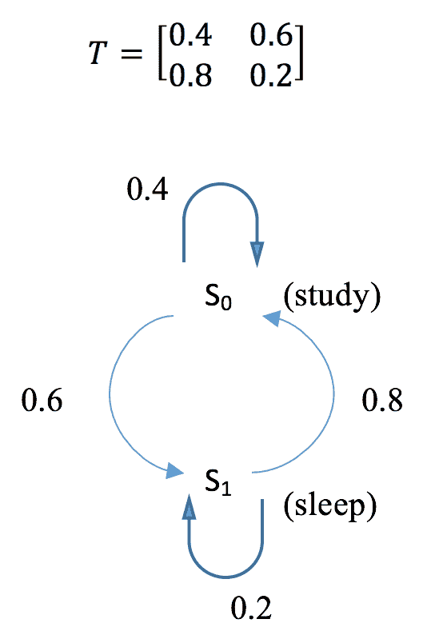

在下一节中，我们将计算 k 个步骤后的转移矩阵，以及在给定初始状态分布的情况下处于每个状态的概率，例如 *[0.7，0.3]* ，这意味着该过程有 70%的可能性从学习开始，有 30%的可能性从睡眠开始。


# 怎么做...

要为学习和睡眠过程创建马尔可夫链并对其进行分析，请执行以下步骤:

1.  导入库并定义转换矩阵:

```py
>>> import torch
>>> T = torch.tensor([[0.4, 0.6],
...                   [0.8, 0.2]])
```

2.  计算 k 步后的转移概率。这里，我们以 k = `2`、`5`、`10`、`15`、`20`为例:

```py
>>> T_2 = torch.matrix_power(T, 2)
>>> T_5 = torch.matrix_power(T, 5)
>>> T_10 = torch.matrix_power(T, 10)
>>> T_15 = torch.matrix_power(T, 15)
>>> T_20 = torch.matrix_power(T, 20)
```

3.  定义两种状态的初始分布:

```py
>>> v = torch.tensor([[0.7, 0.3]])
```

4.  计算 k = `1`、`2`、`5`、`10`、`15`、`20`步骤后的状态分布:

```py
>>> v_1 = torch.mm(v, T)
>>> v_2 = torch.mm(v, T_2)
>>> v_5 = torch.mm(v, T_5)
>>> v_10 = torch.mm(v, T_10)
>>> v_15 = torch.mm(v, T_15)
>>> v_20 = torch.mm(v, T_20)
```


# 它是如何工作的...

在*第二步*中，我们计算了 k 步后的转移概率，也就是转移矩阵的 k 次^幂。您将看到以下输出:

```py
>>> print("Transition probability after 2 steps:\n{}".format(T_2))
Transition probability after 2 steps:
tensor([[0.6400, 0.3600],
 [0.4800, 0.5200]])
>>> print("Transition probability after 5 steps:\n{}".format(T_5))
Transition probability after 5 steps:
tensor([[0.5670, 0.4330],
 [0.5773, 0.4227]])
>>> print(
"Transition probability after 10 steps:\n{}".format(T_10))
Transition probability after 10 steps:
tensor([[0.5715, 0.4285],
 [0.5714, 0.4286]])
>>> print(
"Transition probability after 15 steps:\n{}".format(T_15))
Transition probability after 15 steps:
tensor([[0.5714, 0.4286],
 [0.5714, 0.4286]])
>>> print(
"Transition probability after 20 steps:\n{}".format(T_20))
Transition probability after 20 steps:
tensor([[0.5714, 0.4286],
 [0.5714, 0.4286]])
```

我们可以看到，在 10 到 15 步之后，跃迁概率收敛。这意味着，无论进程处于什么状态，都有相同的概率过渡到 s0 (57.14%)和 s1 (42.86%)。

在*步骤 4* 中，我们计算了 k = `1`、`2`、`5`、`10`、`15`、`20`步骤后的状态分布，它是初始状态分布和转移概率的乘积。你可以在这里看到结果:

```py
>>> print("Distribution of states after 1 step:\n{}".format(v_1))
Distribution of states after 1 step:
tensor([[0.5200, 0.4800]])
>>> print("Distribution of states after 2 steps:\n{}".format(v_2))
Distribution of states after 2 steps:
tensor([[0.5920, 0.4080]])
>>> print("Distribution of states after 5 steps:\n{}".format(v_5))
Distribution of states after 5 steps:
tensor([[0.5701, 0.4299]])
>>> print(
 "Distribution of states after 10 steps:\n{}".format(v_10))
Distribution of states after 10 steps:
tensor([[0.5714, 0.4286]])
>>> print(
 "Distribution of states after 15 steps:\n{}".format(v_15))
Distribution of states after 15 steps:
tensor([[0.5714, 0.4286]])
>>> print(
 "Distribution of states after 20 steps:\n{}".format(v_20))
Distribution of states after 20 steps:
tensor([[0.5714, 0.4286]])
```

我们可以看到，10 步之后，状态分布收敛。在 s0 的概率(57.14%)和在 s1 的概率(42.86%)长期不变。

从[0.7，0.3]开始，一次迭代后的状态分布变成[0.52，0.48]。其计算细节如下图所示:

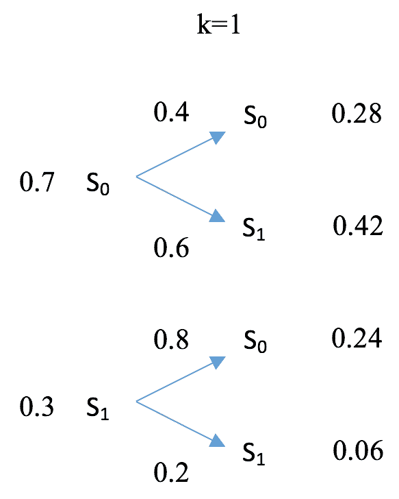

经过另一次迭代后，状态分布变为[0.592，0.408]，如下图所示:

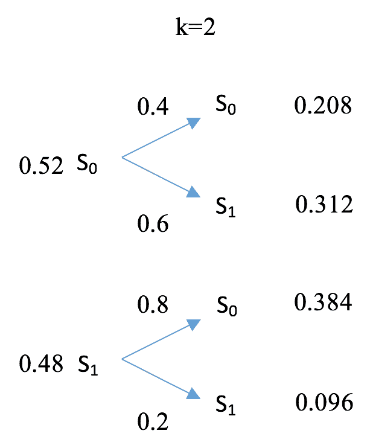

随着时间的推移，状态分布达到平衡。


# 还有更多...

事实上，不管进程的初始状态是什么，状态分布总是收敛到[0.5714，0.4286]。您可以使用其他初始发行版进行测试，比如[0.2，0.8]和[1，0]。10 步之后分布将保持[0.5714，0.4286]。

马尔可夫链不一定收敛，尤其是当它包含瞬态或当前状态时。但如果它确实收敛了，不管起始分布如何，它都会达到相同的均衡。


# 请参见

如果你想了解更多关于马尔可夫链的知识，下面是两篇很棒的博客文章，有很好的可视化效果:

*   [https://brilliant.org/wiki/markov-chains/](https://brilliant.org/wiki/markov-chains/)
*   [http://setosa.io/ev/markov-chains/](http://setosa.io/ev/markov-chains/)


# 创建 MDP

基于马尔可夫链开发的 MDP 包括一个代理和一个决策过程。让我们继续开发 MDP 并计算最优策略下的价值函数。

除了一组可能的状态外， *S = {s0，s1，...，sm}* ，一个 MDP 由一组动作定义， *A = {a0，a1，...，an }*；一个过渡模型， *T(s，a，s’)*；一个奖励函数，*R(s)*；和一个贴现因子，𝝲.转移矩阵 *T(s，a，s’)*包含从状态 s 采取行动 a 然后到达 s’的概率。贴现因子𝝲控制着未来回报和眼前回报之间的权衡。

为了使我们的 MDP 稍微复杂一点，我们用一个状态来扩展学习和睡眠过程，`s2 play` games。假设我们有两个动作，`a0 work` 和`a1 slack`。 *3 * 2 * 3* 转移矩阵 *T(s，a，s’)*如下:

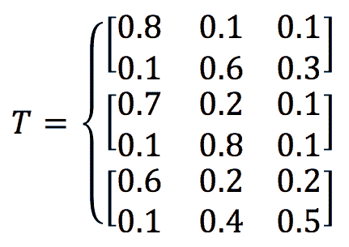

这意味着，例如，当从状态 s0 研究中采取 a1 懈怠行动时，有 60%的可能性会变成 s1 睡眠(可能会累)，有 30%的可能性会变成 s2 玩游戏(可能想放松)，有 10%的可能性会继续学习(可能是真正的工作狂)。我们将三种状态的奖励函数定义为[+1，0，-1]，以补偿辛苦的工作。显然，在这种情况下，**最优策略**是为每一步选择 0 工作(继续学习——没有付出就没有收获，对吗？).此外，我们首先选择 0.5 作为折扣系数。在下一节中，我们将计算最优策略下的**状态-价值函数**(也称为**价值函数**，简称**值**，或**期望效用**)。


# 怎么做...

创建 MDP 可通过以下步骤完成:

1.  导入 PyTorch 并定义转换矩阵:

```py
 >>> import torch
 >>> T = torch.tensor([[[0.8, 0.1, 0.1],
 ...                    [0.1, 0.6, 0.3]],
 ...                   [[0.7, 0.2, 0.1],
 ...                    [0.1, 0.8, 0.1]],
 ...                   [[0.6, 0.2, 0.2],
 ...                    [0.1, 0.4, 0.5]]]
 ...                  )
```

2.  定义奖励函数和折扣系数:

```py
 >>> R = torch.tensor([1., 0, -1.])
 >>> gamma = 0.5
```

3.  这种情况下的最佳策略是在所有情况下选择动作`a0`:

```py
>>> action = 0
```

4.  我们在以下函数中使用**矩阵求逆**方法计算最优策略的值`V`:

```py
 >>> def cal_value_matrix_inversion(gamma, trans_matrix, rewards):
 ...     inv = torch.inverse(torch.eye(rewards.shape[0]) 
 - gamma * trans_matrix)
 ...     V = torch.mm(inv, rewards.reshape(-1, 1))
 ...     return V
```

我们将在下一节中演示如何导出该值。

5.  我们将所有的变量输入到函数中，包括与动作`a0`相关的转移概率:

```py
 >>> trans_matrix = T[:, action]
 >>> V = cal_value_matrix_inversion(gamma, trans_matrix, R)
 >>> print("The value function under the optimal 
 policy is:\n{}".format(V))
 The value function under the optimal policy is:
 tensor([[ 1.6787],
 [ 0.6260],
 [-0.4820]])
```


# 它是如何工作的...

在这个过于简化的学习-睡眠-游戏过程中，最优策略，即获得最高总报酬的策略，在所有步骤中都选择行动 a0。然而，在大多数情况下，事情不会那么简单。此外，每个步骤中采取的行动不一定相同。它们通常依赖于状态。因此，我们必须通过在现实世界中寻找最优策略来解决 MDP 问题。

给定所遵循的策略，策略的价值函数测量代理在每个状态下有多好。数值越大，状态越好。

在*步骤 4* 中，我们使用**矩阵求逆**计算最优策略的值`V`。根据**贝尔曼方程**，步骤 *t+1* 处的值与步骤 *t* 处的值之间的关系可以表示为:


当值收敛时，这意味着 *Vt+1 = Vt* ，我们可以导出值`V`，如下所示:

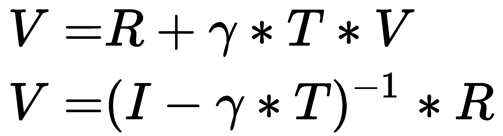

这里， *I* 是主对角线上为 1 的单位矩阵。

用矩阵求逆求解 MDP 的一个优点是你总能得到精确的答案。但是缺点是它的可扩展性。由于我们需要计算 m * m 矩阵的逆矩阵(其中 *m* 是可能状态的数量)，如果有大量的状态，计算将变得昂贵。


# 还有更多...

我们决定试验不同的折扣因子值。让我们从 0 开始，这意味着我们只关心眼前的回报:

```py
 >>> gamma = 0
 >>> V = cal_value_matrix_inversion(gamma, trans_matrix, R)
 >>> print("The value function under the optimal policy is:\n{}".format(V))
 The value function under the optimal policy is:
 tensor([[ 1.],
 [ 0.],
 [-1.]])
```

这与奖励函数是一致的，因为我们只看下一步棋得到的奖励。

随着折扣系数向 1 增加，将考虑未来的奖励。让我们看看𝝲=0.99:

```py
 >>> gamma = 0.99
 >>> V = cal_value_matrix_inversion(gamma, trans_matrix, R)
 >>> print("The value function under the optimal policy is:\n{}".format(V))
 The value function under the optimal policy is:
 tensor([[65.8293],
 [64.7194],
 [63.4876]])
```


# 请参见

本备忘单[https://cs-cheat sheet . readthedocs . io/en/latest/subjects/ai/mdp . html](https://cs-cheatsheet.readthedocs.io/en/latest/subjects/ai/mdp.html)是 MDP 的快速参考。


# 执行策略评估

我们刚刚开发了一个 MDP，并使用矩阵求逆计算了最优策略的价值函数。我们也提到了 m * m 矩阵求大 m 值(比如说 1000，10000，或者 100000)的逆矩阵的局限性。在这个菜谱中，我们将讨论一种更简单的方法，称为**策略评估**。

策略评估是一种迭代算法。它从任意策略值开始，然后基于**贝尔曼期望方程**迭代更新这些值，直到它们收敛。在每次迭代中，对于状态 *s* ，策略的值 *π* 被更新如下:

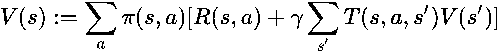

这里， *π(s，a)* 表示在策略 *π* 下，在状态 *s* 采取行动 *a* 的概率。 *T(s，a，s’)*是通过采取行动 *a* 从状态 *s* 到状态*s’*的转移概率，并且 *R(s，a)* 是通过采取行动 *a* 在状态 *s* 中收到的奖励。

有两种方法可以终止迭代更新过程。一种是通过设置固定的迭代次数，比如 1，000 和 10，000，这有时可能很难控制。另一种方法包括指定一个阈值(通常为 0.0001、0.00001 或类似的值)，并且只有当所有状态的值变化到低于指定阈值的程度时才终止该过程。

在下一节中，我们将在最优策略和随机策略下对学习-睡眠-游戏过程进行策略评估。


# 怎么做...

让我们开发一个策略评估算法，并将其应用于我们的学习-睡眠-游戏流程，如下所示:

1.  导入 PyTorch 并定义转换矩阵:

```py
 >>> import torch
 >>> T = torch.tensor([[[0.8, 0.1, 0.1],
 ...                    [0.1, 0.6, 0.3]],
 ...                   [[0.7, 0.2, 0.1],
 ...                    [0.1, 0.8, 0.1]],
 ...                   [[0.6, 0.2, 0.2],
 ...                    [0.1, 0.4, 0.5]]]
 ...                  )
```

2.  定义奖励函数和折扣因子(现在我们用`0.5`):

```py
 >>> R = torch.tensor([1., 0, -1.])
 >>> gamma = 0.5
```

3.  定义用于确定何时停止评估流程的阈值:

```py
 >>> threshold = 0.0001
```

4.  定义在所有情况下选择行动 a0 的最佳策略:

```py
 >>> policy_optimal = torch.tensor([[1.0, 0.0],
 ...                                [1.0, 0.0],
 ...                                [1.0, 0.0]])
```

5.  开发一个政策评估函数，该函数包含政策、转移矩阵、奖励、折扣系数和阈值，并计算`value`函数:

```py
>>> def policy_evaluation(
 policy, trans_matrix, rewards, gamma, threshold):
...     """
...     Perform policy evaluation
...     @param policy: policy matrix containing actions and their 
 probability in each state
...     @param trans_matrix: transformation matrix
...     @param rewards: rewards for each state
...     @param gamma: discount factor
...     @param threshold: the evaluation will stop once values 
 for all states are less than the threshold
...     @return: values of the given policy for all possible states
...     """
...     n_state = policy.shape[0]
...     V = torch.zeros(n_state)
...     while True:
...         V_temp = torch.zeros(n_state)
...         for state, actions in enumerate(policy):
...             for action, action_prob in enumerate(actions):
...                 V_temp[state] += action_prob * (R[state] + 
 gamma * torch.dot(
 trans_matrix[state, action], V))
...         max_delta = torch.max(torch.abs(V - V_temp))
...         V = V_temp.clone()
...         if max_delta <= threshold:
...             break
...     return V
```

6.  现在让我们插入最优策略和所有其他变量:

```py
>>> V = policy_evaluation(policy_optimal, T, R, gamma, threshold)
>>> print(
 "The value function under the optimal policy is:\n{}".format(V)) The value function under the optimal policy is:
tensor([ 1.6786,  0.6260, -0.4821])
```

这几乎和我们用矩阵求逆得到的一样。

7.  我们现在试验另一种策略，一种随机策略，其中以相同的概率选择动作:

```py
>>> policy_random = torch.tensor([[0.5, 0.5],
...                               [0.5, 0.5],
...                               [0.5, 0.5]])
```

8.  插入随机策略和所有其他变量:

```py
>>> V = policy_evaluation(policy_random, T, R, gamma, threshold)
>>> print(
 "The value function under the random policy is:\n{}".format(V))
The value function under the random policy is:
tensor([ 1.2348,  0.2691, -0.9013])
```


# 它是如何工作的...

我们刚刚看到了使用策略评估来计算策略的价值是多么有效。这是一种简单的收敛迭代方法，在**动态规划族**中，或者更具体地说，**近似动态规划**。它从对值的随机猜测开始，然后根据贝尔曼期望方程迭代地更新它们，直到它们收敛。

在步骤 5 中，策略评估功能执行以下任务:

*   将策略值初始化为全零。
*   基于贝尔曼期望方程更新值。
*   计算所有状态值的最大变化。
*   如果最大变化大于阈值，它会不断更新值。否则，它终止评估过程并返回最新值。

由于策略评估使用迭代近似，其结果可能与使用精确计算的矩阵求逆方法的结果不完全相同。事实上，我们真的不需要价值函数那么精确。此外，它可以解决维度的**诅咒** **问题，这可以导致将计算规模扩大到数十万个状态。因此，我们通常更喜欢政策评估。**

还有一点要记住的是，政策评估是用来**预测**我们将从一个给定的政策中获得多大的好处；它不是用于**控制**的问题。


# 还有更多...

为了进一步了解，我们还绘制了整个评估过程中的策略值。

我们首先需要记录`policy_evaluation`函数中每次迭代的值:

```py
>>> def policy_evaluation_history(
 policy, trans_matrix, rewards, gamma, threshold):
...     n_state = policy.shape[0]
...     V = torch.zeros(n_state)
...     V_his = [V]
...     i = 0
...     while True:
...         V_temp = torch.zeros(n_state)
...         i += 1
...         for state, actions in enumerate(policy):
...             for action, action_prob in enumerate(actions):
...                 V_temp[state] += action_prob * (R[state] + gamma * 
 torch.dot(trans_matrix[state, action], V))
...         max_delta = torch.max(torch.abs(V - V_temp))
...         V = V_temp.clone()
...         V_his.append(V)
...         if max_delta <= threshold:
...             break
...     return V, V_his
```

现在，我们向`policy_evaluation_history`函数输入最优策略、贴现因子`0.5`和其他变量:

```py
>>> V, V_history = policy_evaluation_history(
 policy_optimal, T, R, gamma, threshold)
```

然后，我们使用以下代码行绘制结果值的历史记录:

```py
>>> import matplotlib.pyplot as plt
>>> s0, = plt.plot([v[0] for v in V_history])
>>> s1, = plt.plot([v[1] for v in V_history])
>>> s2, = plt.plot([v[2] for v in V_history])
>>> plt.title('Optimal policy with gamma = {}'.format(str(gamma)))
>>> plt.xlabel('Iteration')
>>> plt.ylabel('Policy values')
>>> plt.legend([s0, s1, s2],
...            ["State s0",
...             "State s1",
...             "State s2"], loc="upper left")
>>> plt.show()
```

我们看到以下结果:

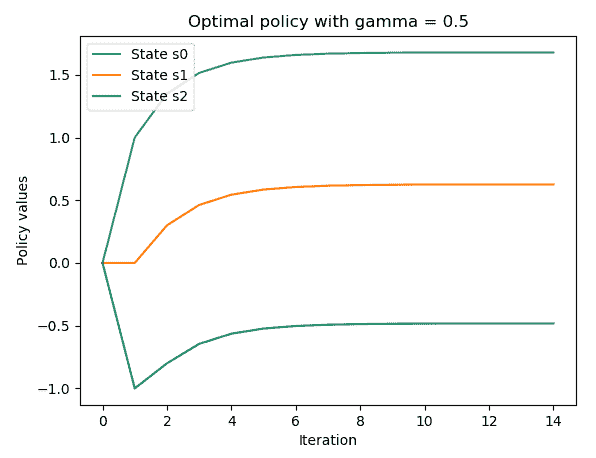

有趣的是在收敛期间看到迭代 10 到 14 之间的稳定。

接下来，我们运行相同的代码，但是使用两个不同的折扣因子，0.2 和 0.99。我们得到了贴现因子为 0.2 的下图:

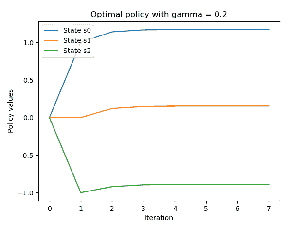

将折扣系数为 0.5 的图与此图进行比较，我们可以看到，系数越小，策略值收敛越快。

我们还得到了贴现因子为 0.99 的下图:

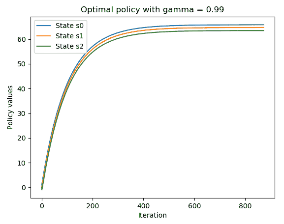

通过比较折扣因子为 0.5 的图和折扣因子为 0.99 的图，我们可以看到，因子越大，策略值收敛所需的时间越长。折扣因子是现在的奖励和未来的奖励之间的权衡。


# 模拟冰冻湖环境

到目前为止，我们处理的 MDP 的最佳策略是非常直观的。然而，在大多数情况下不会那么简单，比如 FrozenLake 环境。在这个食谱中，让我们玩玩 FrozenLake 环境，并为即将到来的食谱做好准备，在那里我们将找到它的最佳策略。

FrozenLake 是一个典型的健身房环境，具有一个**离散的**状态空间。它是关于在一个网格世界中将一个代理从起始位置移动到目标位置，同时避免陷阱。网格要么是四乘四(【https://gym.openai.com/envs/FrozenLake-v0/】)要么是八乘八。

t([https://gym.openai.com/envs/FrozenLake8x8-v0/](https://gym.openai.com/envs/FrozenLake8x8-v0/))。网格由以下四种类型的单幅图块组成:

*   **S** :起始位置
*   **G** :目标位置，结束一集
*   **F** :冰冻的瓷砖，这是一个可以行走的位置
*   **H** :结束一集的洞位

很明显，有四个动作:向左移动(0)、向下移动(1)、向右移动(2)和向上移动(3)。如果代理成功到达目标位置，奖励为+1，否则为 0。还有，观察空间用 16 维整数数组表示，有 4 个可能的动作(有意义)。

在这种环境下，棘手的是，由于冰面很滑，代理人不会总是朝着它想要的方向移动。例如，当它打算向下移动时，它可以向左或向右移动。


# 做好准备

要运行 FrozenLake 环境，让我们首先在这里的环境表中搜索它:[https://github.com/openai/gym/wiki/Table-of-environments](https://github.com/openai/gym/wiki/Table-of-environments)。搜索给了我们`FrozenLake-v0`。


# 怎么做...

让我们按照以下步骤模拟四乘四的 FrozenLake 环境:

1.  我们导入`gym`库并创建一个 FrozenLake 环境的实例:

```py
>>> import gym
>>> import torch
>>> env = gym.make("FrozenLake-v0")
>>> n_state = env.observation_space.n
>>> print(n_state)
16
>>> n_action = env.action_space.n
>>> print(n_action)
4
```

2.  重置环境:

```py
>>> env.reset()
0
```

代理从状态`0`开始。

3.  渲染环境:

```py
>>> env.render()
```

4.  让我们做一个向下的运动，因为它是可以行走的:

```py
>>> new_state, reward, is_done, info = env.step(1)
>>> env.render()
```

6.  打印出所有返回信息，确认代理以 33.33%的概率降落在状态`4`:

```py
>>> print(new_state)
4
>>> print(reward)
0.0
>>> print(is_done)
False
>>> print(info)
{'prob': 0.3333333333333333}
```

你得到`0`作为奖励，因为它还没有达到目标，这一集还没有完成。同样，你可能会看到代理降落在状态 1，或停留在状态 0，因为光滑的表面。

7.  为了演示在冰冻的湖面上行走有多困难，实施随机策略并计算 1000 集以上的平均总奖励。首先，定义一个函数，模拟给定策略的 FrozenLake 情节，并返回总报酬(我们知道它不是 0 就是 1):

```py
>>> def run_episode(env, policy):
...     state = env.reset()
...     total_reward = 0
...     is_done = False
...     while not is_done:
...         action = policy[state].item()
...         state, reward, is_done, info = env.step(action)
...         total_reward += reward
...         if is_done:
...             break
...     return total_reward
```

8.  现在运行`1000`集，将随机生成一个策略，并将在每集中使用:

```py
>>> n_episode = 1000
>>> total_rewards = []
>>> for episode in range(n_episode):
...     random_policy = torch.randint(
 high=n_action, size=(n_state,))
...     total_reward = run_episode(env, random_policy)
...     total_rewards.append(total_reward)
...
>>> print('Average total reward under random policy: {}'.format(
 sum(total_rewards) / n_episode))
Average total reward under random policy: 0.014
```

这基本上意味着，如果我们随机行动，代理人平均只有 1.4%的机会达到目标。

9.  接下来，我们用随机搜索策略进行实验。在训练阶段，我们随机生成一组策略，并记录第一个达到目标的策略:

```py
>>> while True:
...     random_policy = torch.randint(
 high=n_action, size=(n_state,))
...     total_reward = run_episode(env, random_policy)
...     if total_reward == 1:
...         best_policy = random_policy
...         break
```

10.  看一看最佳策略:

```py
>>> print(best_policy)
tensor([0, 3, 2, 2, 0, 2, 1, 1, 3, 1, 3, 0, 0, 1, 1, 1])
```

11.  现在用我们刚刚挑选的策略运行 1000 集:

```py
>>> total_rewards = []
>>> for episode in range(n_episode):
...     total_reward = run_episode(env, best_policy)
...     total_rewards.append(total_reward)
...
>>> print('Average total reward under random search 
     policy: {}'.format(sum(total_rewards) / n_episode))
Average total reward under random search policy: 0.208
```

使用随机搜索算法，平均有 20.8%的机会达到目标。

请注意，这个结果可能会有很大的变化，因为我们选择的策略可能会因为光滑的冰而碰巧达到目标，并且可能不是最佳的。


# 它是如何工作的...

在这个菜谱中，我们随机生成了一个策略，它由 16 个州的 16 个操作组成。请记住，在 FrozenLake 中，移动方向只是部分取决于所选的动作。这增加了控制的不确定性。

在运行了*步骤 4* 中的代码后，您将看到如下 4 * 4 的矩阵，代表冻结的湖和代理所在的瓦片(状态 0):

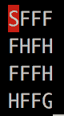

在运行了*步骤 5* 中的代码行之后，您将看到如下的结果网格，其中代理向下移动到状态 4:

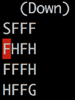

如果满足以下两个条件中的任何一个，剧集将会终止:

*   移动到 H 图块(状态 5、7、11、12)。这将产生总奖励 0。
*   移动到 G 瓦片(状态 15)。这将产生+1 的总奖励。


# 还有更多...

我们可以通过使用 P 属性来查看 FrozenLake 环境的细节，包括每个状态和动作的转换矩阵和奖励。例如，对于状态 6，我们可以执行以下操作:

```py
>>> print(env.env.P[6])
{0: [(0.3333333333333333, 2, 0.0, False), (0.3333333333333333, 5, 0.0, True), (0.3333333333333333, 10, 0.0, False)], 1: [(0.3333333333333333, 5, 0.0, True), (0.3333333333333333, 10, 0.0, False), (0.3333333333333333, 7, 0.0, True)], 2: [(0.3333333333333333, 10, 0.0, False), (0.3333333333333333, 7, 0.0, True), (0.3333333333333333, 2, 0.0, False)], 3: [(0.3333333333333333, 7, 0.0, True), (0.3333333333333333, 2, 0.0, False), (0.3333333333333333, 5, 0.0, True)]}
```

这将返回一个包含键 0、1、2 和 3 的字典，代表四种可能的操作。该值是采取动作后的动作列表。移动列表的格式如下:(转化概率，新状态，收到奖励，完成)。例如，如果代理驻留在状态 6 并且打算采取动作 1(向下)，则有 33.33%的机会它将到达状态 5，接收奖励 0 并且终止该情节；有 33.33%的几率降落在状态 10，获得奖励 0；并且有 33.33%的几率降落在状态 7，获得奖励 0，终止剧集。

对于状态 11，我们可以执行以下操作:

```py
>>> print(env.env.P[11])
{0: [(1.0, 11, 0, True)], 1: [(1.0, 11, 0, True)], 2: [(1.0, 11, 0, True)], 3: [(1.0, 11, 0, True)]}
```

由于踩一个洞会终止一集，之后它不会有任何动作。

请随意查看其他州。


# 用数值迭代算法求解 MDP

如果找到了 MDP 的最优策略，则认为该问题已解决。在这个菜谱中，我们将使用一个**值迭代**算法来计算出 FrozenLake 环境的最佳策略。

价值迭代背后的思想与政策评估非常相似。它也是一种迭代算法。它从任意策略值开始，然后基于**贝尔曼最优方程**迭代更新这些值，直到它们收敛。因此，在每次迭代中，它不是取所有操作的期望值(平均值)，而是选取实现最大策略值的操作:


这里，V*(s)表示最优值，即最优策略的值；T(s，a，s’)是通过采取动作 a 从状态 s 到状态 s’的转移概率；R(s，a)是在状态 s 采取行动 a 得到的回报。

一旦计算出最优值，我们就可以很容易地获得相应的最优策略:


# 怎么做...

让我们使用值迭代算法求解 FrozenLake 环境，如下所示:

1.  我们导入必要的库并创建一个 FrozenLake 环境的实例:

```py
>>> import torch
>>> import gym
>>> env = gym.make('FrozenLake-v0')
```

2.  现在将`0.99`设为折扣因子，将`0.0001`设为收敛阈值:

```py
>>> gamma = 0.99
>>> threshold = 0.0001
```

3.  现在定义基于值迭代算法计算最佳值的函数:

```py
>>> def value_iteration(env, gamma, threshold):
...     """
...     Solve a given environment with value iteration algorithm
...     @param env: OpenAI Gym environment
...     @param gamma: discount factor
...     @param threshold: the evaluation will stop once values for 
 all states are less than the threshold
...     @return: values of the optimal policy for the given 
 environment
...     """
...     n_state = env.observation_space.n
...     n_action = env.action_space.n
...     V = torch.zeros(n_state)
...     while True:
...         V_temp = torch.empty(n_state)
...         for state in range(n_state):
...             v_actions = torch.zeros(n_action)
...             for action in range(n_action):
...                 for trans_prob, new_state, reward, _ in 
 env.env.P[state][action]:
...                     v_actions[action] += trans_prob * (reward 
 + gamma * V[new_state])
...             V_temp[state] = torch.max(v_actions)
...         max_delta = torch.max(torch.abs(V - V_temp))
...         V = V_temp.clone()
...         if max_delta <= threshold:
...             break
...     return V
```

4.  插入环境、折扣因子和收敛阈值，然后打印最佳值:

```py
>>> V_optimal = value_iteration(env, gamma, threshold)
>>> print('Optimal values:\n{}'.format(V_optimal))
Optimal values:
tensor([0.5404, 0.4966, 0.4681, 0.4541, 0.5569, 0.0000, 0.3572, 0.0000, 0.5905,
 0.6421, 0.6144, 0.0000, 0.0000, 0.7410, 0.8625, 0.0000])
```

5.  现在我们有了最佳值，我们开发了从中提取最佳策略的函数:

```py
>>> def extract_optimal_policy(env, V_optimal, gamma):
...     """
...     Obtain the optimal policy based on the optimal values
...     @param env: OpenAI Gym environment
...     @param V_optimal: optimal values
...     @param gamma: discount factor
...     @return: optimal policy
...     """
...     n_state = env.observation_space.n
...     n_action = env.action_space.n
...     optimal_policy = torch.zeros(n_state)
...     for state in range(n_state):
...         v_actions = torch.zeros(n_action)
...         for action in range(n_action):
...             for trans_prob, new_state, reward, _ in 
                                   env.env.P[state][action]:
...                 v_actions[action] += trans_prob * (reward 
 + gamma * V_optimal[new_state])
...         optimal_policy[state] = torch.argmax(v_actions)
...     return optimal_policy
```

6.  插入环境、折扣系数和最优值，然后打印最优策略:

```py
>>> optimal_policy = extract_optimal_policy(env, V_optimal, gamma)
>>> print('Optimal policy:\n{}'.format(optimal_policy))
Optimal policy:
tensor([0., 3., 3., 3., 0., 3., 2., 3., 3., 1., 0., 3., 3., 2., 1., 3.])
```

7.  我们想衡量最优策略有多好。所以，让我们用最优策略运行 1000 集，并检查平均回报。这里，我们将重用我们在前一个配方中定义的`run_episode`函数:

```py
>>> n_episode = 1000
>>> total_rewards = []
>>> for episode in range(n_episode):
...     total_reward = run_episode(env, optimal_policy)
...     total_rewards.append(total_reward)
>>> print('Average total reward under the optimal 
 policy: {}'.format(sum(total_rewards) / n_episode))
Average total reward under the optimal policy: 0.75
```

在最优策略下，代理平均有 75%的机会达到目标。这是我们能得到的最好的了，因为冰很滑。


# 它是如何工作的...

在值迭代算法中，我们通过迭代应用贝尔曼最优性方程来获得最优值函数。

下面是贝尔曼最优方程的另一个版本，它可以处理奖励部分依赖于新状态的环境:

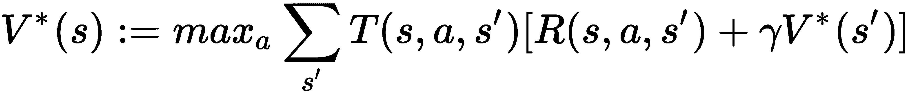

这里，R(s，a，s’)是通过采取行动 a 从状态 s 移动到状态 s’的结果所收到的奖励。由于这个版本更兼容，我们根据它开发了我们的`value_iteration`函数。正如您在*步骤 3* 中看到的，我们执行以下任务:

*   将策略值初始化为全零。
*   根据贝尔曼最优方程更新这些值。
*   计算所有状态值的最大变化。
*   如果最大变化大于阈值，我们就不断更新这些值。否则，我们将终止评估过程，并将最新值作为最佳值返回。


# 还有更多...

我们获得了 75%的成功率，折扣系数为 0.99。贴现因子如何影响业绩？让我们做一些不同因素的实验，包括`0`、`0.2`、`0.4`、`0.6`、`0.8`、`0.99`和`1.`:

```py
>>> gammas = [0, 0.2, 0.4, 0.6, 0.8, .99, 1.]
```

对于每个折扣系数，我们计算 10，000 集的平均成功率:

```py
>>> avg_reward_gamma = []
>>> for gamma in gammas:
...     V_optimal = value_iteration(env, gamma, threshold)
...     optimal_policy = extract_optimal_policy(env, V_optimal, gamma)
...     total_rewards = []
...     for episode in range(n_episode):
...         total_reward = run_episode(env, optimal_policy)
...         total_rewards.append(total_reward)
...     avg_reward_gamma.append(sum(total_rewards) / n_episode)
```

我们绘制了平均成功率与折现系数的关系图:

```py
>>> import matplotlib.pyplot as plt
>>> plt.plot(gammas, avg_reward_gamma)
>>> plt.title('Success rate vs discount factor')
>>> plt.xlabel('Discount factor')
>>> plt.ylabel('Average success rate')
>>> plt.show()
```

我们得到如下的情节:

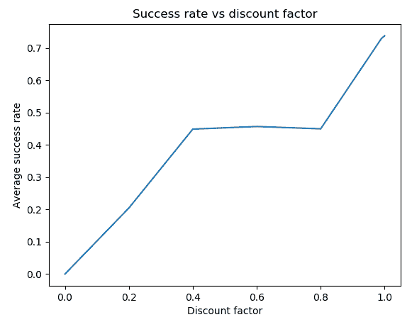

结果表明，当折扣因子增加时，性能提高。这验证了一个事实，即小的折扣因子重视现在的回报，而大的折扣因子重视未来更好的回报。


# 用策略迭代算法求解 MDP

解决 MDP 的另一种方法是使用**策略迭代**算法，我们将在本菜谱中讨论。

策略迭代算法可以细分为两个部分:策略评估和策略改进。它始于一项武断的政策。在每次迭代中，它首先根据贝尔曼期望方程计算给定最新策略的策略值；然后，它根据贝尔曼最优方程从结果策略值中提取一个改进的策略。它迭代地评估策略并生成一个改进的版本，直到策略不再改变。

让我们开发一个策略迭代算法，并用它来解决 FrozenLake 环境。之后，我们将解释它是如何工作的。


# 怎么做...

让我们使用如下策略迭代算法来求解 FrozenLake 环境:

1.  我们导入必要的库并创建一个 FrozenLake 环境的实例:

```py
>>> import torch
>>> import gym
>>> env = gym.make('FrozenLake-v0')
```

2.  现在将`0.99`设为折扣因子，将`0.0001`设为收敛阈值:

```py
>>> gamma = 0.99
>>> threshold = 0.0001
```

3.  现在我们定义`policy_evaluation`函数，它计算给定策略的值:

```py
>>> def policy_evaluation(env, policy, gamma, threshold):
...     """
...     Perform policy evaluation
...     @param env: OpenAI Gym environment
...     @param policy: policy matrix containing actions and 
 their probability in each state
...     @param gamma: discount factor
...     @param threshold: the evaluation will stop once values 
 for all states are less than the threshold
...     @return: values of the given policy
...     """
...     n_state = policy.shape[0]
...     V = torch.zeros(n_state)
...     while True:
...         V_temp = torch.zeros(n_state)
...         for state in range(n_state):
...             action = policy[state].item()
...             for trans_prob, new_state, reward, _ in 
 env.env.P[state][action]:
...                 V_temp[state] += trans_prob * (reward 
 + gamma * V[new_state])
...         max_delta = torch.max(torch.abs(V - V_temp))
...         V = V_temp.clone()
...         if max_delta <= threshold:
...             break
...     return V
```

这类似于我们在*执行政策评估*方法中所做的，但是使用健身房环境作为输入。

4.  接下来，我们开发策略迭代算法的第二个主要组件，即策略改进部分:

```py
>>> def policy_improvement(env, V, gamma):
...     """
...     Obtain an improved policy based on the values
...     @param env: OpenAI Gym environment
...     @param V: policy values
...     @param gamma: discount factor
...     @return: the policy
...     """
...     n_state = env.observation_space.n
...     n_action = env.action_space.n
...     policy = torch.zeros(n_state)
...     for state in range(n_state):
...         v_actions = torch.zeros(n_action)
...         for action in range(n_action):
...             for trans_prob, new_state, reward, _ in 
 env.env.P[state][action]:
...                 v_actions[action] += trans_prob * (reward 
 + gamma * V[new_state])
...         policy[state] = torch.argmax(v_actions)
...     return policy
```

这基于贝尔曼最优方程从给定的策略值中提取改进的策略。

5.  现在我们已经准备好了两个组件，我们开发策略迭代算法如下:

```py
>>> def policy_iteration(env, gamma, threshold):
...     """
...     Solve a given environment with policy iteration algorithm
...     @param env: OpenAI Gym environment
...     @param gamma: discount factor
...     @param threshold: the evaluation will stop once values 
 for all states are less than the threshold
...     @return: optimal values and the optimal policy for the given 
 environment
...     """
...     n_state = env.observation_space.n
...     n_action = env.action_space.n
...     policy = torch.randint(high=n_action, size=(n_state,)).float()
...     while True:
...         V = policy_evaluation(env, policy, gamma, threshold)
...         policy_improved = policy_improvement(env, V, gamma)
...         if torch.equal(policy_improved, policy):
...             return V, policy_improved
...         policy = policy_improved
```

6.  插入环境、折扣系数和收敛阈值:

```py
>>> V_optimal, optimal_policy = 
 policy_iteration(env, gamma, threshold)
```

7.  我们已经获得了最优值和最优策略。让我们来看看它们:

```py
>>> print('Optimal values:\n{}'.format(V_optimal))
Optimal values:
tensor([0.5404, 0.4966, 0.4681, 0.4541, 0.5569, 0.0000, 0.3572, 0.0000, 0.5905,
 0.6421, 0.6144, 0.0000, 0.0000, 0.7410, 0.8625, 0.0000])
>>> print('Optimal policy:\n{}'.format(optimal_policy))
Optimal policy:
tensor([0., 3., 3., 3., 0., 3., 2., 3., 3., 1., 0., 3., 3., 2., 1., 3.])
```

它们与我们使用值迭代算法得到的结果完全相同。


# 它是如何工作的...

策略迭代在每次迭代中结合了策略评估和策略改进。在策略评估中，给定策略(非最佳策略)的值是基于贝尔曼期望方程计算的，直到它们收敛:


这里，a = π(s)，这是在状态 s 下根据策略π采取的行动。

在策略改进中，基于贝尔曼最优方程，使用所得的收敛策略值 V(s)来更新策略:


这将重复策略评估和策略改进步骤，直到策略收敛。在收敛时，最新的策略及其价值函数是最优策略和最优价值函数。因此，在步骤 5 中，`policy_iteration`函数执行以下任务:

*   初始化随机策略。
*   使用策略评估算法计算策略的值。
*   基于策略值获取改进的策略。
*   如果新策略与旧策略不同，它会更新策略并运行另一个迭代。否则，它终止迭代过程，并返回策略值和策略。


# 还有更多...

我们刚刚用策略迭代算法解决了 FrozenLake 环境。因此，您可能想知道什么时候使用策略迭代比使用值迭代更好，反之亦然。基本上有三种情况，其中一种比另一种有优势:

*   如果有大量的操作，使用策略迭代，因为它可以更快地收敛。
*   如果有少量的动作，使用值迭代。
*   如果已经有一个可行的策略(通过直觉或者领域知识获得)，使用策略迭代。

在那些场景之外，策略迭代和价值迭代通常是可比较的。

在下一个食谱中，我们将应用每个算法来解决掷硬币赌博问题。我们将看到哪个算法收敛得更快。


# 请参见

随意使用我们在这两个食谱中学到的知识来解决一个更大的冰格，即`FrozenLake8x8-v0`环境([https://gym.openai.com/envs/FrozenLake8x8-v0/](https://gym.openai.com/envs/FrozenLake8x8-v0/))。


# 解决抛硬币赌博问题

抛硬币赌博，大家应该听起来很熟悉。在游戏的每一轮中，游戏者可以打赌掷硬币是否会正面朝上。如果结果是正面朝上，赌徒将赢得与他们下注相同的金额；否则，他们将失去这笔钱。游戏继续进行，直到赌徒输了(最终一无所有)或赢了(比如赢了 100 多美元)。假设硬币是不公平的，它有 40%的机会正面朝上。为了最大化获胜的机会，赌徒应该在每一轮中根据他们当前的资本下注多少？这肯定会是一个有趣的问题需要解决。

如果硬币落在头上的几率超过 50%，那就没什么好讨论的了。赌徒可以每轮只赌一美元，大部分时间应该会赢。如果这是一个公平的硬币，赌徒可以每轮赌一美元，最终赢得大约 50%的机会。当正面的概率低于 50%时，事情就变得棘手了；安全下注策略将不再有效。随机策略也不行。我们需要借助我们在本章中学到的强化学习技术来进行明智的押注。

让我们从将抛硬币赌博问题公式化为 MDP 开始。它基本上是一个未贴现的、情节性的、有限的 MDP，具有以下性质:

*   以美元计算，国家是赌徒的资本。共有 101 种状态:0、1、2、…、98、99 和 100+。
*   达到状态 100+奖励 1；否则，奖励为 0。
*   动作是游戏者在一轮中可能下的赌注。给定状态 s，可能的动作包括 1，2，…，和 min(s，100 - s)。例如，当赌徒有 60 美元时，他们可以下注 1 到 40 之间的任何金额。任何高于 40 的数额都没有任何意义，因为它增加了损失，并没有增加获胜的机会。
*   采取行动后的下一个状态取决于硬币正面朝上的概率。假设是 40%。所以，状态 s 在采取行动 *a* 之后的下一个状态将是*s+a*40%，*s-a*60%。
*   该过程在状态 0 和状态 100+处终止。


# 怎么做...

我们首先通过使用值迭代算法并执行以下步骤来解决抛硬币赌博问题:

1.  汇入游标:

```py
>>> import torch
```

2.  指定折扣系数和收敛阈值:

```py
>>> gamma = 1
>>> threshold = 1e-10
```

这里，我们设置 1 为贴现因子，因为 MDP 是一个不贴现的过程；我们设置一个小的阈值，因为我们期望小的策略值，因为除了最后一个状态，所有的奖励都是 0。

3.  定义以下环境变量。

总共有 101 个州:

```py
>>> capital_max = 100
>>> n_state = capital_max + 1
```

相应的奖励显示如下:

```py
>>> rewards = torch.zeros(n_state)
>>> rewards[-1] = 1
>>> print(rewards)
tensor([0., 0., 0., 0., 0., 0., 0., 0., 0., 0., 0., 0., 0., 0., 0., 0., 0., 0.,
 0., 0., 0., 0., 0., 0., 0., 0., 0., 0., 0., 0., 0., 0., 0., 0., 0., 0.,
 0., 0., 0., 0., 0., 0., 0., 0., 0., 0., 0., 0., 0., 0., 0., 0., 0., 0.,
 0., 0., 0., 0., 0., 0., 0., 0., 0., 0., 0., 0., 0., 0., 0., 0., 0., 0.,
 0., 0., 0., 0., 0., 0., 0., 0., 0., 0., 0., 0., 0., 0., 0., 0., 0., 0.,
 0., 0., 0., 0., 0., 0., 0., 0., 0., 0., 1.])
```

假设获得正面的概率是 40%:

```py
>>> head_prob = 0.4
```

将这些变量放入字典中:

```py
>>> env = {'capital_max': capital_max,
...        'head_prob': head_prob,
...        'rewards': rewards,
...        'n_state': n_state}
```

4.  现在，我们开发一个基于值迭代算法计算最佳值的函数:

```py
>>> def value_iteration(env, gamma, threshold):
...     """
...     Solve the coin flipping gamble problem with 
 value iteration algorithm
...     @param env: the coin flipping gamble environment
...     @param gamma: discount factor
...     @param threshold: the evaluation will stop once values 
 for all states are less than the threshold
...     @return: values of the optimal policy for the given 
 environment
...     """
...     head_prob = env['head_prob']
...     n_state = env['n_state']
...     capital_max = env['capital_max']
...     V = torch.zeros(n_state)
...     while True:
...         V_temp = torch.zeros(n_state)
...         for state in range(1, capital_max):
...             v_actions = torch.zeros(
 min(state, capital_max - state) + 1)
...             for action in range(
 1, min(state, capital_max - state) + 1):
...                 v_actions[action] += head_prob * (
 rewards[state + action] +
 gamma * V[state + action])
...                 v_actions[action] += (1 - head_prob) * (
 rewards[state - action] +
 gamma * V[state - action])
...             V_temp[state] = torch.max(v_actions)
...         max_delta = torch.max(torch.abs(V - V_temp))
...         V = V_temp.clone()
...         if max_delta <= threshold:
...             break
...     return V
```

我们只需要计算状态 1 到 99 的值，因为状态 0 和状态 100+的值都是 0。并且给定状态 *s* ，可能的动作可以是从 1 到 *min(s，100 - s)* 的任何值。在计算贝尔曼最优方程时，我们应该记住这一点。

5.  接下来，我们开发一个基于最佳值提取最佳策略的函数:

```py
>>> def extract_optimal_policy(env, V_optimal, gamma):
...     """
...     Obtain the optimal policy based on the optimal values
...     @param env: the coin flipping gamble environment
...     @param V_optimal: optimal values
...     @param gamma: discount factor
...     @return: optimal policy
...     """
...     head_prob = env['head_prob']
...     n_state = env['n_state']
...     capital_max = env['capital_max']
...     optimal_policy = torch.zeros(capital_max).int()
...     for state in range(1, capital_max):
...         v_actions = torch.zeros(n_state)
...         for action in range(1, 
 min(state, capital_max - state) + 1):
...             v_actions[action] += head_prob * (
 rewards[state + action] +
 gamma * V_optimal[state + action])
...             v_actions[action] += (1 - head_prob) * (
 rewards[state - action] +
 gamma * V_optimal[state - action])
...         optimal_policy[state] = torch.argmax(v_actions)
...     return optimal_policy
```

6.  最后，我们可以插入环境、折扣因子和收敛阈值来计算最优值和最优策略。还有，我们计时用价值迭代解决赌博 MDP 需要多长时间；我们将此与策略迭代完成所需的时间进行比较:

```py
>>> import time
>>> start_time = time.time()
>>> V_optimal = value_iteration(env, gamma, threshold)
>>> optimal_policy = extract_optimal_policy(env, V_optimal, gamma)
>>> print("It takes {:.3f}s to solve with value 
 iteration".format(time.time() - start_time))
It takes 4.717s to solve with value iteration
```

我们在`4.717`秒内用值迭代解决了赌博问题。

7.  看看最优策略值和我们得到的最优策略:

```py
>>> print('Optimal values:\n{}'.format(V_optimal))
>>> print('Optimal policy:\n{}'.format(optimal_policy))
```

8.  我们可以绘制策略值与状态的关系，如下所示:

```py
>>> import matplotlib.pyplot as plt
>>> plt.plot(V_optimal[:100].numpy())
>>> plt.title('Optimal policy values')
>>> plt.xlabel('Capital')
>>> plt.ylabel('Policy value')
>>> plt.show()
```

现在我们已经用价值迭代解决了赌博问题，那么策略迭代呢？让我们看看。

9.  我们首先开发`policy_evaluation`函数，它计算给定策略的值:

```py
>>> def policy_evaluation(env, policy, gamma, threshold):
...     """
...     Perform policy evaluation
...     @param env: the coin flipping gamble environment
...     @param policy: policy tensor containing actions taken 
 for individual state
...     @param gamma: discount factor
...     @param threshold: the evaluation will stop once values 
 for all states are less than the threshold
...     @return: values of the given policy
...     """
...     head_prob = env['head_prob']
...     n_state = env['n_state']
...     capital_max = env['capital_max']
...     V = torch.zeros(n_state)
...     while True:
...         V_temp = torch.zeros(n_state)
...         for state in range(1, capital_max):
...             action = policy[state].item()
...             V_temp[state] += head_prob * (
 rewards[state + action] +
 gamma * V[state + action])
...             V_temp[state] += (1 - head_prob) * (
 rewards[state - action] +
 gamma * V[state - action])
...         max_delta = torch.max(torch.abs(V - V_temp))
...         V = V_temp.clone()
...         if max_delta <= threshold:
...             break
...     return V
```

10.  接下来，我们开发策略迭代算法的另一个主要组件，策略改进部分:

```py
>>> def policy_improvement(env, V, gamma):
...     """
...     Obtain an improved policy based on the values
...     @param env: the coin flipping gamble environment
...     @param V: policy values
...     @param gamma: discount factor
...     @return: the policy
...     """
...     head_prob = env['head_prob']
...     n_state = env['n_state']
...     capital_max = env['capital_max']
...     policy = torch.zeros(n_state).int()
...     for state in range(1, capital_max):
...         v_actions = torch.zeros(
 min(state, capital_max - state) + 1)
...         for action in range(
 1, min(state, capital_max - state) + 1):
...             v_actions[action] += head_prob * (
 rewards[state + action] + 
 gamma * V[state + action])
...             v_actions[action] += (1 - head_prob) * (
 rewards[state - action] +
 gamma * V[state - action])
...         policy[state] = torch.argmax(v_actions)
...     return policy
```

11.  准备好这两个组件后，我们可以开发策略迭代算法的主要条目，如下所示:

```py
>>> def policy_iteration(env, gamma, threshold):
...     """
...     Solve the coin flipping gamble problem with policy 
 iteration algorithm
...     @param env: the coin flipping gamble environment
...     @param gamma: discount factor
...     @param threshold: the evaluation will stop once values
 for all states are less than the threshold
...     @return: optimal values and the optimal policy for the 
 given environment
...     """
...     n_state = env['n_state']
...     policy = torch.zeros(n_state).int()
...     while True:
...         V = policy_evaluation(env, policy, gamma, threshold)
...         policy_improved = policy_improvement(env, V, gamma)
...         if torch.equal(policy_improved, policy):
...             return V, policy_improved
...         policy = policy_improved
```

12.  最后，我们插入环境、折扣因子和收敛阈值来计算最优值和最优策略。我们还记录了求解 MDP 花费的时间:

```py
>>> start_time = time.time()
>>> V_optimal, optimal_policy 
 = policy_iteration(env, gamma, threshold)
>>> print("It takes {:.3f}s to solve with policy 
 iteration".format(time.time() - start_time))
It takes 2.002s to solve with policy iteration
```

13.  查看我们刚刚获得的最佳值和最佳策略:

```py
>>> print('Optimal values:\n{}'.format(V_optimal))
>>> print('Optimal policy:\n{}'.format(optimal_policy))
```


# 它是如何工作的...

在执行了*步骤 7* 中的代码行后，您将看到最佳策略值:

```py
Optimal values:
tensor([0.0000, 0.0021, 0.0052, 0.0092, 0.0129, 0.0174, 0.0231, 0.0278, 0.0323,
 0.0377, 0.0435, 0.0504, 0.0577, 0.0652, 0.0695, 0.0744, 0.0807, 0.0866,
 0.0942, 0.1031, 0.1087, 0.1160, 0.1259, 0.1336, 0.1441, 0.1600, 0.1631,
 0.1677, 0.1738, 0.1794, 0.1861, 0.1946, 0.2017, 0.2084, 0.2165, 0.2252,
 0.2355, 0.2465, 0.2579, 0.2643, 0.2716, 0.2810, 0.2899, 0.3013, 0.3147,
 0.3230, 0.3339, 0.3488, 0.3604, 0.3762, 0.4000, 0.4031, 0.4077, 0.4138,
 0.4194, 0.4261, 0.4346, 0.4417, 0.4484, 0.4565, 0.4652, 0.4755, 0.4865,
 0.4979, 0.5043, 0.5116, 0.5210, 0.5299, 0.5413, 0.5547, 0.5630, 0.5740,
 0.5888, 0.6004, 0.6162, 0.6400, 0.6446, 0.6516, 0.6608, 0.6690, 0.6791,
 0.6919, 0.7026, 0.7126, 0.7248, 0.7378, 0.7533, 0.7697, 0.7868, 0.7965,
 0.8075, 0.8215, 0.8349, 0.8520, 0.8721, 0.8845, 0.9009, 0.9232, 0.9406,
 0.9643, 0.0000])
```

您还将看到最佳策略:

```py
Optimal policy:
tensor([ 0,  1, 2, 3, 4,  5, 6, 7, 8, 9, 10, 11, 12, 13, 14, 15, 16, 17,
 18, 19, 20, 21, 22, 23, 24, 25, 26, 27, 22, 29, 30, 31, 32, 33,  9, 35,
 36, 37, 38, 11, 40,  9, 42, 43, 44, 5, 4,  3, 2, 1, 50, 1, 2, 47,
 4, 5, 44,  7, 8, 9, 10, 11, 38, 12, 36, 35, 34, 17, 32, 19, 30,  4,
 3, 2, 26, 25, 24, 23, 22, 21, 20, 19, 18, 17, 16, 15, 14, 13, 12, 11,
 10, 9, 8,  7, 6, 5, 4,  3, 2, 1], dtype=torch.int32)
```

*第 8 步*为最佳策略值生成以下图表:

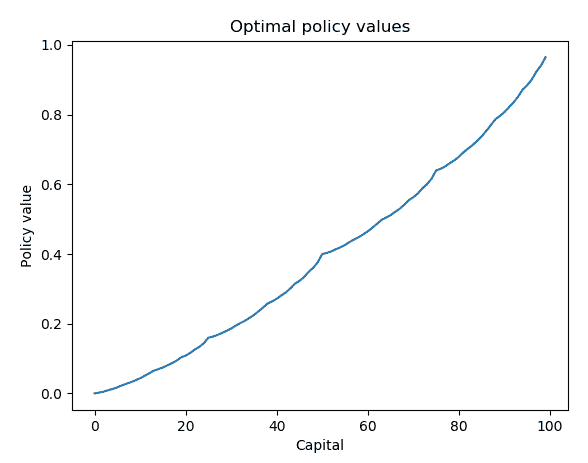

我们可以看到，随着资本(状态)的增加，估计的报酬(保单价值)也增加，这是有道理的。

我们在*步骤 9* 中所做的与我们在*中用策略迭代算法*解决 MDP 的方法非常相似，但这次是在抛硬币的赌博环境中。

在*步骤 10* 中，策略改进功能基于贝尔曼最优方程从给定的策略值中提取改进的策略。

正如您在*步骤 12* 中看到的，我们在`2.002`秒内用策略迭代解决了赌博问题，这比用值迭代花费的时间少了一半。

我们从*步骤 13* 中得到的结果包括以下最佳值:

```py
Optimal values:
tensor([0.0000, 0.0021, 0.0052, 0.0092, 0.0129, 0.0174, 0.0231, 0.0278, 0.0323,
 0.0377, 0.0435, 0.0504, 0.0577, 0.0652, 0.0695, 0.0744, 0.0807, 0.0866,
 0.0942, 0.1031, 0.1087, 0.1160, 0.1259, 0.1336, 0.1441, 0.1600, 0.1631,
 0.1677, 0.1738, 0.1794, 0.1861, 0.1946, 0.2017, 0.2084, 0.2165, 0.2252,
 0.2355, 0.2465, 0.2579, 0.2643, 0.2716, 0.2810, 0.2899, 0.3013, 0.3147,
 0.3230, 0.3339, 0.3488, 0.3604, 0.3762, 0.4000, 0.4031, 0.4077, 0.4138,
 0.4194, 0.4261, 0.4346, 0.4417, 0.4484, 0.4565, 0.4652, 0.4755, 0.4865,
 0.4979, 0.5043, 0.5116, 0.5210, 0.5299, 0.5413, 0.5547, 0.5630, 0.5740,
 0.5888, 0.6004, 0.6162, 0.6400, 0.6446, 0.6516, 0.6608, 0.6690, 0.6791,
 0.6919, 0.7026, 0.7126, 0.7248, 0.7378, 0.7533, 0.7697, 0.7868, 0.7965,
 0.8075, 0.8215, 0.8349, 0.8520, 0.8721, 0.8845, 0.9009, 0.9232, 0.9406,
 0.9643, 0.0000])
```

它们还包括最优策略:

```py
Optimal policy:
tensor([ 0,  1, 2, 3, 4,  5, 6, 7, 8, 9, 10, 11, 12, 13, 14, 15, 16, 17,
 18, 19, 20, 21, 22, 23, 24, 25, 26, 27, 22, 29, 30, 31, 32, 33,  9, 35,
 36, 37, 38, 11, 40,  9, 42, 43, 44, 5, 4,  3, 2, 1, 50, 1, 2, 47,
 4, 5, 44,  7, 8, 9, 10, 11, 38, 12, 36, 35, 34, 17, 32, 19, 30,  4,
 3, 2, 26, 25, 24, 23, 22, 21, 20, 19, 18, 17, 16, 15, 14, 13, 12, 11,
 10, 9, 8,  7, 6, 5, 4,  3, 2, 1, 0], dtype=torch.int32)
```

价值迭代和策略迭代这两种方法的结果是一致的。

我们已经通过使用值迭代和策略迭代解决了赌博问题。要处理强化学习问题，最棘手的任务之一是将过程公式化为 MDP。在我们的例子中，政策通过下注某些赌注(行动)从当前资本(州)转换到新资本(新州)。最优策略最大化游戏获胜概率(+1 奖励)，评估最优策略下的获胜概率。

另一件有趣的事情是，在我们的例子中，转换概率和新状态是如何在贝尔曼方程中确定的。在状态 s 中采取行动 a(拥有资本 s 并下注 1 美元)将有两种可能的结果:

*   移动到新的状态 s+a，如果硬币正面朝上。因此，转换概率等于正面概率。
*   如果硬币落在反面，则移动到新的州 s-a。因此，转换概率等于尾部的概率。

这与 FrozenLake 环境非常相似，在该环境中，代理只以一定的概率落在预期的瓷砖上。

我们还验证了在这种情况下，策略迭代比值迭代收敛得更快。这是因为有多达 50 个可能的动作，比 FrozenLake 中的 4 个动作多。对于具有大量操作的 MDP，用策略迭代求解比用值迭代求解更有效。


# 还有更多...

你可能想知道最优策略是否真的有效。让我们像聪明的赌徒一样，玩一万集游戏。我们将最优策略与另外两种策略进行比较:保守策略(每轮下注一美元)和随机策略(下注随机金额):

1.  我们首先定义前面提到的三种下注策略。

我们首先定义最优策略:

```py
>>> def optimal_strategy(capital):
...     return optimal_policy[capital].item()
```

然后我们定义保守策略:

```py
>>> def conservative_strategy(capital):
...     return 1
```

最后，我们定义随机策略:

```py
>>> def random_strategy(capital):
...     return torch.randint(1, capital + 1, (1,)).item()
```

2.  定义一个包装函数，该函数运行一集的策略并返回游戏是否获胜:

```py
>>> def run_episode(head_prob, capital, policy):
...     while capital > 0:
...         bet = policy(capital)
...         if torch.rand(1).item() < head_prob:
...             capital += bet
...             if capital >= 100:
...                 return 1
...         else:
...             capital -= bet
...     return 0
```

3.  指定一笔启动资金(比如说`50`美元)和若干集(`10000`):

```py
>>> capital = 50
>>> n_episode = 10000
```

4.  运行 10，000 集并记录获奖次数:

```py
>>> n_win_random = 0
>>> n_win_conservative = 0
>>> n_win_optimal = 0
>>> for episode in range(n_episode):
...     n_win_random += run_episode(
 head_prob, capital, random_strategy)
...     n_win_conservative += run_episode(
 head_prob, capital, conservative_strategy)
...     n_win_optimal += run_episode(
 head_prob, capital, optimal_strategy)
```

5.  打印出三种策略的获胜概率:

```py
>>> print('Average winning probability under the random 
 policy: {}'.format(n_win_random/n_episode))
Average winning probability under the random policy: 0.2251
>>> print('Average winning probability under the conservative 
 policy: {}'.format(n_win_conservative/n_episode))
Average winning probability under the conservative policy: 0.0
>>> print('Average winning probability under the optimal 
 policy: {}'.format(n_win_optimal/n_episode))
Average winning probability under the optimal policy: 0.3947
```

我们的最优策略显然是赢家！