# 进行数值估算的蒙特卡罗方法

在前一章中，我们用**动态规划** ( **DP** )评估并求解了一个**马尔可夫决策过程** ( **MDP** )。基于模型的方法，如动态规划，有一些缺点。他们要求环境是完全已知的，包括转移矩阵和报酬矩阵。它们的可伸缩性也有限，尤其是对于有大量状态的环境。

在这一章中，我们将通过一种无模型方法继续我们的学习之旅，即**蒙特卡罗** ( **MC** )方法，这种方法不需要环境的先验知识，并且比 DP 更具可扩展性。我们将从用蒙特卡罗方法估计圆周率的值开始。接下来，我们将讨论如何使用 MC 方法以首次访问和每次访问的方式预测状态值和状态动作值。我们将演示如何使用蒙特卡罗方法训练一个代理玩 21 点纸牌游戏。此外，我们将实现策略上和策略外的 MC 控制，以找到 21 点的最佳策略。还将介绍具有ε-贪婪策略和加权重要性采样的高级 MC 控制。

本章将介绍以下配方:

*   用蒙特卡罗方法计算圆周率
*   执行蒙特卡罗策略评估
*   用蒙特卡洛预测玩 21 点
*   执行策略上的蒙特卡罗控制
*   用ε-贪婪策略发展蒙特卡罗控制
*   执行非策略蒙特卡罗控制
*   用加权重要抽样开发 MC 控制


# 用蒙特卡罗方法计算圆周率

让我们从一个简单的项目开始:使用蒙特卡罗方法估计π的值，这是无模型强化学习算法的核心。

一个**蒙特卡罗方法**是任何利用随机性解决问题的方法。该算法重复适当的**随机** **采样**，并观察服从特定属性的样本部分，以便进行数值估计。

让我们做一个有趣的练习，用 MC 方法近似π的值。我们将在宽度= 2 (-1

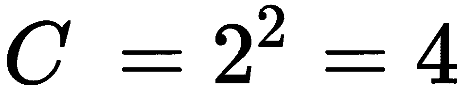

圆的面积是:

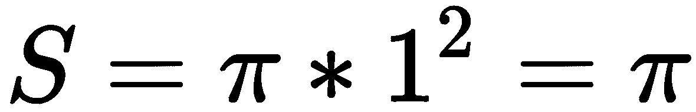

如果我们用圆的面积除以正方形的面积，我们得到如下结果:

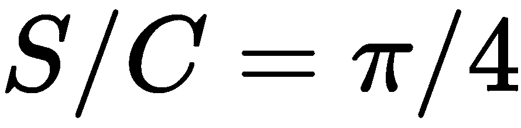

*S/C* 可以通过落入圆内的点的分数来测量。因此，π的值可以估计为四倍 *S/C* 。


# 怎么做...

我们使用 MC 方法估计π的值，如下所示:

1.  导入必要的模块，包括 PyTorch、`math`用于π的真值，以及`matplotlib`用于绘制正方形中的随机点:

```py
>>> import torch
>>> import math
>>> import matplotlib.pyplot as plt
```

2.  我们在正方形内随机生成 1000 个点，范围为-1

```py
>>> n_point = 1000
>>> points = torch.rand((n_point, 2)) * 2 - 1
```

3.  初始化单位圆内的点数，以及存储这些点的列表:

```py
>>> n_point_circle = 0
>>> points_circle = []
```

4.  对于每个随机点，计算到原点的距离。如果距离小于 1:

```py
>>> for point in points:
...     r = torch.sqrt(point[0] ** 2 + point[1] ** 2)
...     if r <= 1:
...         points_circle.append(point)
...         n_point_circle += 1
```

5.  计算圆中的点数，并记录这些点数:

```py
>>> points_circle = torch.stack(points_circle)
```

6.  绘制所有随机点，并为圆圈中的点使用不同的颜色:

```py
>>> plt.plot(points[:, 0].numpy(), points[:, 1].numpy(), 'y.')
>>> plt.plot(points_circle[:, 0].numpy(), points_circle[:, 1].numpy(), 'c.')
```

7.  画圆以便更好地观察:

```py
>>> i = torch.linspace(0, 2 * math.pi)
>>> plt.plot(torch.cos(i).numpy(), torch.sin(i).numpy())
>>> plt.axes().set_aspect('equal')
>>> plt.show()
```

8.  最后，计算π的值:

```py
>>> pi_estimated = 4 * (n_point_circle / n_point)
>>> print('Estimated value of pi is:', pi_estimated)
```


# 它是如何工作的...

在*步骤 5* 中，您将看到下面的图，其中圆点被随机放置在圆圈内:

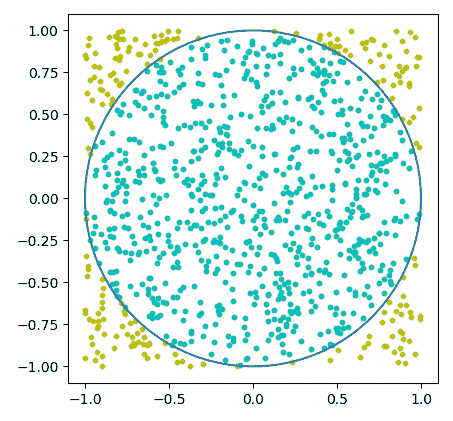

蒙特卡洛方法如此强大要感谢**大数定律** ( **LLN** )。在 LLN 下，大量重复事件或动作的平均表现最终会收敛到期望值。在我们这种情况下，有了大量的随机点，`4 * (n_point_circle / n_point)`最终会收敛到π的真值。

最后，在*步骤 8* 中，我们打印 pi 的估计值，得到如下结果:

```py
Estimated value of pi is: 3.156 
```

使用蒙特卡罗方法近似的π值非常接近其真实值(3.14159...).


# 还有更多...

我们可以通过 1000 次以上的迭代来进一步改进我们的估计。在这里，我们将实验 10，000 次迭代。在每次迭代中，我们在正方形内随机生成一个点，看它是否在圆内；我们基于落入圆内的现有点的分数来动态估计π的值。

然后，我们绘制估计历史以及π的真实值。将这些放入以下函数中:

```py
>>> def estimate_pi_mc(n_iteration):
...     n_point_circle = 0
...     pi_iteration = []
...     for i in range(1, n_iteration+1):
...         point = torch.rand(2) * 2 - 1
...         r = torch.sqrt(point[0] ** 2 + point[1] ** 2)
...         if r <= 1:
...             n_point_circle += 1
...         pi_iteration.append(4 * (n_point_circle / i))
...     plt.plot(pi_iteration)
...     plt.plot([math.pi] * n_iteration, '--')
...     plt.xlabel('Iteration')
...     plt.ylabel('Estimated pi')
...     plt.title('Estimation history')
...     plt.show()
...     print('Estimated value of pi is:', pi_iteration[-1]) The estimated value of pi is: 3.1364
```

我们用 10，000 次迭代来调用这个函数:

```py
>>> estimate_pi_mc(10000)
```

请参考以下图表，了解由此产生的估计历史:

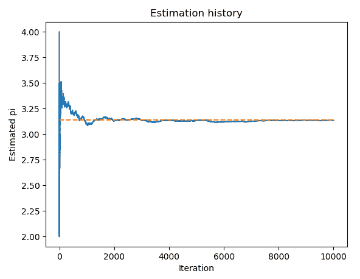

我们可以看到，随着迭代次数的增加，π的估计值越来越接近真实值。一个事件或行动总会有一些变化。更多的重复可以帮助它变得平滑。


# 请参见

如果您有兴趣了解蒙特卡罗方法的更多应用，这里有一些有趣的应用:

*   *玩围棋*、*哈瓦纳*、*和战舰*、*等游戏用 MC 树搜索*、*哪个搜索最好走法*:[https://en.wikipedia.org/wiki/Monte_Carlo_tree_search](https://en.wikipedia.org/wiki/Monte_Carlo_tree_search)
*   *评估投资和投资组合*:[https://en . Wikipedia . org/wiki/Monte _ Carlo _ methods _ in _ finance](https://en.wikipedia.org/wiki/Monte_Carlo_methods_in_finance)
*   *用 MC 模拟研究生物系统*:[https://en . Wikipedia . org/wiki/Bayesian _ inference _ in _ phylogency](https://en.wikipedia.org/wiki/Bayesian_inference_in_phylogeny)


# 执行蒙特卡罗策略评估

在[第二章](4e7c9eb4-8260-4d8c-890c-5c7d2d046d0b.xhtml)、*马尔可夫决策过程和动态规划*中，我们应用 DP 进行策略评估，这是一个策略的价值(或状态-价值)函数。它确实工作得很好，但是有一些限制。从根本上说，它需要一个完全已知的环境，包括转移矩阵和回报矩阵。然而，大多数实际情况下的转移矩阵事先并不知道。需要已知 MDP 的强化学习算法被归类为基于**模型的**算法。另一方面，一种不需要先验知识的转换和奖励算法被称为**无模型**算法。基于蒙特卡罗的强化学习是一种无模型的方法。

在本菜谱中，我们将使用蒙特卡罗方法评估价值函数。我们将再次使用 FrozenLake 环境作为例子，假设我们不能访问它的转换和奖励矩阵。您将回忆起一个过程的**回报**，它是长期的总回报，如下所示:

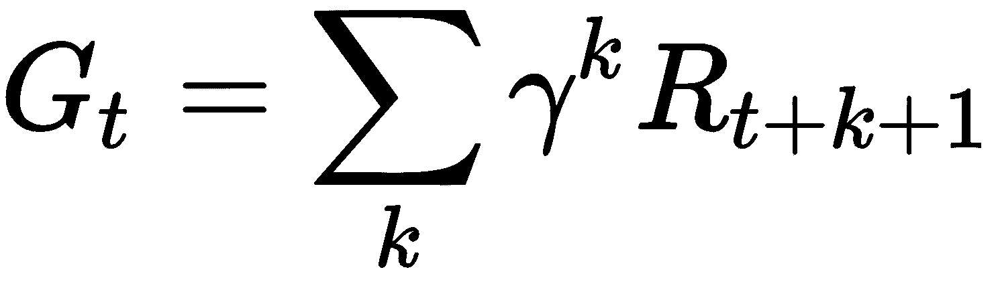

MC 政策评估使用**经验均值** **收益**而不是**预期收益**(如 DP 中)来估计价值函数。有两种方法可以执行 MC 策略评估。一个是**首次访问 MC 预测**，它对一个状态 s 在一集内**第一次出现**的返回**唯一**进行平均。另一个是**every-visit MC prediction**，它对一个状态 *s* 在一集中的每次出现**的返回进行平均。显然，首次就诊 MC 预测的计算量比每次就诊版本少得多，因此使用频率更高。**


# 怎么做...

我们对 FrozenLake 的最优策略进行首次 MC 预测，如下所示:

1.  导入 PyTorch 和 Gym 库，并创建 FrozenLake 环境的实例:

```py
>>> import torch
>>> import gym >>> env = gym.make("FrozenLake-v0")
```

2.  要使用蒙特卡罗方法评估策略，我们首先需要定义一个函数，在给定策略的情况下模拟 FrozenLake 事件，并返回每一步的奖励和状态:

```py
>>> def run_episode(env, policy):
 ...     state = env.reset()
 ...     rewards = []
 ...     states = [state]
 ...     is_done = False
 ...     while not is_done:
 ...         action = policy[state].item()
 ...         state, reward, is_done, info = env.step(action)
 ...         states.append(state)
 ...         rewards.append(reward)
 ...         if is_done:
 ...             break
 ...     states = torch.tensor(states)
 ...     rewards = torch.tensor(rewards)
 ...     return states, rewards
```

同样，在蒙特卡洛设置中，我们需要跟踪所有步骤的状态和回报，因为我们无法访问完整的环境，包括转移概率和回报矩阵。

3.  现在，定义使用首次就诊 MC 评估给定策略的函数:

```py
>>> def mc_prediction_first_visit(env, policy, gamma, n_episode):
...     n_state = policy.shape[0]
...     V = torch.zeros(n_state)
...     N = torch.zeros(n_state)
...     for episode in range(n_episode):
...         states_t, rewards_t = run_episode(env, policy)
...         return_t = 0
...         first_visit = torch.zeros(n_state)
...         G = torch.zeros(n_state)
...         for state_t, reward_t in zip(reversed(states_t)[1:], 
                                            reversed(rewards_t)):
...             return_t = gamma * return_t + reward_t
...             G[state_t] = return_t
...             first_visit[state_t] = 1
...         for state in range(n_state):
...             if first_visit[state] > 0:
...                 V[state] += G[state]
...                 N[state] += 1
...     for state in range(n_state):
...         if N[state] > 0:
...             V[state] = V[state] / N[state]
...     return V
```

4.  为了便于计算，我们将贴现率指定为 1，并模拟 10，000 集:

```py
>>> gamma = 1
>>> n_episode = 10000
```

5.  我们使用上一章计算的最优策略、*马尔科夫* *决策过程和动态规划*，并将其与其他参数一起提供给首次访问 MC 函数:

```py
>>> optimal_policy = torch.tensor([0., 3., 3., 3., 0., 3., 2., 3., 3., 1., 0., 3., 3., 2., 1., 3.])
>>> value = mc_prediction_first_visit(env, optimal_policy, gamma, n_episode)
>>> print('The value function calculated by first-visit MC prediction:\n', value)
The value function calculated by first-visit MC prediction:
tensor([0.7463, 0.5004, 0.4938, 0.4602, 0.7463, 0.0000, 0.3914, 0.0000, 0.7463, 0.7469, 0.6797, 0.0000, 0.0000, 0.8038, 0.8911, 0.0000])
```

我们刚刚使用首次访问 MC 预测解决了最优策略的价值函数。


# 它是如何工作的...

在*步骤 3* 中，我们在 MC 预测中执行以下任务:

*   我们播放`n_episode`集
*   对于每集，我们计算每个州的第一次访问的回报
*   对于每个州，我们通过平均所有剧集的第一个回报来获得该值

如您所见，在基于 MC 的预测中，不需要了解环境的完整模型。事实上，在大多数现实情况下，转移矩阵和回报矩阵事先并不知道，或者极难获得。想象下棋或下围棋有多少种可能的状态，有多少种可能的动作；几乎不可能算出转移矩阵和回报矩阵。无模型强化学习是通过与环境交互从经验中学习。

在我们的例子中，我们只考虑可以观察到的东西，包括每一步中的新状态和奖励，并使用蒙特卡罗方法进行预测。请注意，我们模拟的情节越多，我们可以获得的预测就越准确。如果你绘制每集之后更新的值，你会看到它如何随时间收敛，这与我们在估计π的值时看到的类似。


# 还有更多...

我们决定也对 FrozenLake 的最优策略执行每次访问 MC 预测:

1.  我们定义了用每次访问 MC 评估给定策略的函数:

```py
>>> def mc_prediction_every_visit(env, policy, gamma, n_episode):
...     n_state = policy.shape[0]
...     V = torch.zeros(n_state)
...     N = torch.zeros(n_state)
...     G = torch.zeros(n_state)
...     for episode in range(n_episode):
...         states_t, rewards_t = run_episode(env, policy)
...         return_t = 0
...         for state_t, reward_t in zip(reversed(states_t)[1:],  
                                            reversed(rewards_t)):
...             return_t = gamma * return_t + reward_t
...             G[state_t] += return_t
...             N[state_t] += 1
...     for state in range(n_state):
...         if N[state] > 0:
...             V[state] = G[state] / N[state]
...     return V
```

与首次就诊 MC 类似，每次就诊功能执行以下任务:

*   它播放了`n_episode`集
*   对于每一集，它计算一个州的每次访问的回报
*   对于每个州，它通过平均所有剧集的所有回报来获得该值

2.  通过在函数中输入策略和其他参数来计算值:

```py
>>> value = mc_prediction_every_visit(env, optimal_policy, gamma, n_episode)
```

3.  显示结果值:

```py
>>> print('The value function calculated by every-visit MC prediction:\n', value)
The value function calculated by every-visit MC prediction:
tensor([0.6221, 0.4322, 0.3903, 0.3578, 0.6246, 0.0000, 0.3520, 0.0000, 0.6428, 0.6759, 0.6323, 0.0000, 0.0000, 0.7624, 0.8801, 0.0000])
```


# 用蒙特卡洛预测玩 21 点

在这个食谱中，我们将玩 21 点(也称为 21 点)，并评估我们认为可能有效的政策。您将通过 21 点的例子更加熟悉蒙特卡洛预测，并准备在即将到来的食谱中使用蒙特卡洛控制搜索最佳策略。

二十一点是一种流行的纸牌游戏，目标是让牌的总数尽可能接近 21 而不超过 21。J、K 和 Q 牌的分值为 10，从 2 到 10 的牌的分值为 2 到 10。王牌可以是 1 分，也可以是 11 分；当选择后一个值时，它被称为可用的**ace。玩家与庄家竞争。开始时，双方都被给予两张随机的牌，但只有一张庄家的牌会透露给玩家。玩家可以要求额外的卡(称为**击**)或停止接收任何更多的卡(称为**棒**)。玩家粘住后，庄家继续抽牌，直到牌和大于等于 17。在玩家叫出**棍**之前，如果他们的牌的和超过 21(叫走**半身像**)，玩家输。否则，如果庄家的牌数总和超过 21，玩家获胜。**

如果双方都没有破产，得分最高的一方将获胜，或者可能是平局。健身房中的 21 点环境如下所示:

*   二十一点有限 MDP 的一集开始时，每一方有两张牌，只能看到庄家的一张牌。
*   一集的结局要么是一方获胜，要么是双方平局。如果玩家赢了，一集的最终奖励是+1，如果玩家输了，奖励是-1，如果平局，奖励是 0。
*   在每一轮中，玩家可以采取两个动作，击中(1)和坚持(0)，这意味着请求另一张牌和请求不再接收任何牌。

我们将首先试验一个简单的策略，只要总点数少于 18(或者 19 或 20，如果你喜欢的话)，我们就不断添加新卡。


# 怎么做...

让我们从模拟 21 点环境开始，探索它的状态和动作:

1.  导入 PyTorch 和 Gym，并创建一个`Blackjack`实例:

```py
>>> import torch
>>> import gym
>>> env = gym.make('Blackjack-v0')
```

2.  重置环境:

```py
>>> env.reset()
>>> env.reset()
(20, 5, False)
```

它返回三个状态变量:

*   玩家的点数(本例中为`20`)
*   庄家的点数(本例中为`5`)
*   玩家是否有可用的 a(本例中为`False`)

一张可用的 a 意味着玩家有一张可以被计为 11 的 a 而不会破产。如果玩家没有 a，或者有 a 但是让他们半身像，状态参数会变成`False`。

看看下面这一集:

```py
>>> env.reset()
(18, 6, True)
```

18 分和`True`表示玩家有一张 ace 和一张 7，ace 计为 11。

3.  让我们采取一些行动，看看 21 点的环境是如何工作的。首先，我们受到打击(请求额外的卡),因为我们有一个可用的 ace，这提供了一些灵活性:

```py
>>> env.step(1)
((20, 6, True), 0, False, {})
```

这将返回三个状态变量`(20, 6, True)`，一个奖励(目前为`0`)，以及该集是否结束(目前为`False`)。

然后我们停止抽牌:

```py
>>> env.step(0)
 ((20, 6, True), 1, True, {})
```

我们刚刚赢了这一集，因此奖励是`1`，现在这一集结束。同样，一旦玩家调用**棒**，庄家将采取他们的行动。

4.  有时候我们会输；例如:

```py
>>> env.reset()
(15, 10, False)
>>> env.step(1)
((25, 10, False), -1, True, {})
```

接下来，我们将预测一个简单策略的值，当分数达到 18 时，我们将停止添加新卡:

5.  和往常一样，我们首先需要定义一个函数，在一个简单的策略下模拟 21 点事件:

```py
>>> def run_episode(env, hold_score):
 ...     state = env.reset()
 ...     rewards = []
 ...     states = [state]
 ...     is_done = False
 ...     while not is_done:
 ...         action = 1 if state[0] < hold_score else 0
 ...         state, reward, is_done, info = env.step(action)
 ...         states.append(state)
 ...         rewards.append(reward)
 ...         if is_done:
 ...             break
 ...     return states, rewards
```

6.  现在，我们定义一个函数来评估一个简单的 21 点策略和一个第一次拜访的 MC:

```py
>>> from collections import defaultdict
>>> def mc_prediction_first_visit(env, hold_score, gamma, 
                                                 n_episode):
 ...     V = defaultdict(float)
 ...     N = defaultdict(int)
 ...     for episode in range(n_episode):
 ...         states_t, rewards_t = run_episode(env, hold_score)
 ...         return_t = 0
 ...         G = {}
 ...         for state_t, reward_t in zip(states_t[1::-1], 
                                             rewards_t[::-1]):
 ...             return_t = gamma * return_t + reward_t
 ...             G[state_t] = return_t
 ...         for state, return_t in G.items():
 ...             if state[0] <= 21:
 ...                 V[state] += return_t
 ...                 N[state] += 1
 ...     for state in V:
 ...         V[state] = V[state] / N[state]
 ...     return V
```

7.  我们指定`hold_score`为 18，折扣率为 1，模拟 50 万集:

```py
>>> hold_score = 18
>>> gamma = 1
>>> n_episode = 500000
```

8.  现在，让我们通过插入所有变量来执行 MC 预测:

```py
>>> value = mc_prediction_first_visit(env, hold_score, gamma, n_episode)
```

我们尝试打印结果值函数:

```py
>>> print('The value function calculated by first-visit MC prediction:\n', value)
```

我们刚刚计算了所有可能状态的值:

```py
>>> print('Number of states:', len(value))
Number of states: 280
```

总共有 280 个州。


# 它是如何工作的...

如你所见，在*第 4 步*中，我们的点数超过了 21，所以我们输了。同样，21 点中的状态实际上是一个三元元组。第一要素是玩家的分数；第二个元素是来自庄家牌组的显示牌，其值可以从 1 到 10；第三个要素是关于是否有一个可重用的 ace。

值得注意的是，在*第五步*中，每一轮的一集里，代理人根据当前得分采取一击或一棍，小于`hold_score`则一棍，否则一击。同样，在蒙特卡洛设置中，我们跟踪所有步骤的状态和奖励。

执行*步骤 8* 中的代码行，您将看到以下结果:

```py
The value function calculated by first-visit MC prediction:
defaultdict(<class 'float'>, {(20, 6, False): 0.6923485653560042, (17, 5, False): -0.24390243902439024, (16, 5, False): -0.19118165784832453, (20, 10, False): 0.4326379146490474, (20, 7, False): 0.7686220540168588, (16, 6, False): -0.19249478804725503,
 ……
 ……
(5, 9, False): -0.20612244897959184, (12, 7, True): 0.058823529411764705, (6, 4, False): -0.26582278481012656, (4, 8, False): -0.14937759336099585, (4, 3, False): -0.1680327868852459, (4, 9, False): -0.20276497695852536, (4, 4, False): -0.3201754385964912, (12, 8, True): 0.11057692307692307})
```

我们刚刚体验了使用 MC 预测在 21 点环境中计算 280 个状态的值函数是多么有效。在*步骤 2* 的 MC 预测功能中，我们执行了以下任务:

*   我们在简单的 21 点策略下运行了`n_episode`集
*   对于每一集，我们计算每个州的第一次访问的回报
*   对于每个州，我们通过平均所有剧集的第一次回报来获得该值

注意，我们忽略了参与人的和大于 21 的状态，因为我们知道它们都是-1。

事先并不知道 21 点环境的模型，包括转移矩阵和回报矩阵。此外，获得两个状态之间的转移概率是极其昂贵的。事实上，转移矩阵的大小将是 280 * 280 * 2，这将需要大量的计算。在基于 MC 的解决方案中，我们只需要模拟足够多的剧集，并且对于每一集，计算回报并相应地更新价值函数。

下次你用简单的策略玩 21 点(如果总数达到一定水平就坚持)，使用预测值来决定每局的出价会很有趣。


# 还有更多...

因为在这种情况下有如此多的状态，所以很难逐个读取它们的值。我们实际上可以通过制作三维曲面图来可视化价值函数。状态是三维的，第三维有两个可能的选项(有没有可用的 ace)。我们可以把图分成两部分:一部分是有可用 ace 的状态，另一部分是没有可用 ace 的状态。在每个剧情中， *x* 轴是玩家的和， *y* 轴是庄家露出的牌， *z* 轴是数值。

让我们按照以下步骤来创建可视化:

1.  在 matplotlib 中导入可视化所需的所有模块:

```py
>>> import matplotlib
>>> import matplotlib.pyplot as plt
>>> from mpl_toolkits.mplot3d import Axes3D
```

2.  定义创建 3D 表面图的效用函数:

```py
>>> def plot_surface(X, Y, Z, title):
...     fig = plt.figure(figsize=(20, 10))
...     ax = fig.add_subplot(111, projection='3d')
...     surf = ax.plot_surface(X, Y, Z, rstride=1, cstride=1,
...             cmap=matplotlib.cm.coolwarm, vmin=-1.0, vmax=1.0)
...     ax.set_xlabel('Player Sum')
...     ax.set_ylabel('Dealer Showing')
...     ax.set_zlabel('Value')
...     ax.set_title(title)
...     ax.view_init(ax.elev, -120)
...     fig.colorbar(surf)
...     plt.show()
```

3.  接下来，我们定义一个函数，该函数构造要沿三维绘制的数组，并调用`plot_surface`来分别可视化有和没有可用 ace 的值:

```py
>>> def plot_blackjack_value(V):
...     player_sum_range = range(12, 22)
...     dealer_show_range = range(1, 11)
...     X, Y = torch.meshgrid([torch.tensor(player_sum_range), 
                torch.tensor(dealer_show_range)])
...     values_to_plot = torch.zeros((len(player_sum_range),  
                                  len(dealer_show_range), 2))
...     for i, player in enumerate(player_sum_range):
...         for j, dealer in enumerate(dealer_show_range):
...             for k, ace in enumerate([False, True]):
...                 values_to_plot[i, j, k] = 
                               V[(player, dealer, ace)]
...     plot_surface(X, Y, values_to_plot[:,:,0].numpy(), 
                "Blackjack Value Function Without Usable Ace")
...     plot_surface(X, Y, values_to_plot[:,:,1].numpy(), 
                "Blackjack Value Function With Usable Ace")
```

我们只对玩家分数超过 11 的状态感兴趣，我们创建了一个`values_to_plot`张量来存储这些值。

4.  最后，我们调用`plot_blackjack_value`函数:

```py
>>> plot_blackjack_value(value)
```

没有可用 ace 的状态的结果值图如下:


并且具有可用 ace 的状态的值函数如下所示:

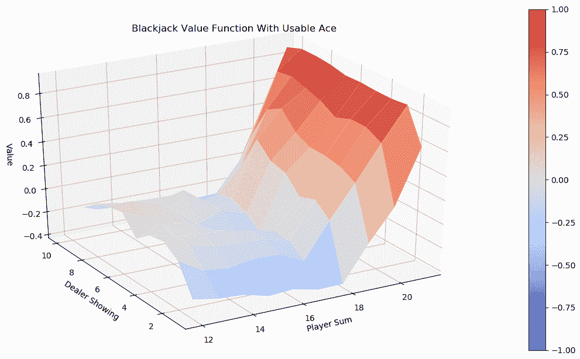

随意摆弄一下`hold_score`的值，看看它是如何影响值函数的。


# 请参见

如果你对 21 点环境还比较陌生，可以从[https://github . com/open ai/gym/blob/master/gym/envs/toy _ text/black jack . py](https://github.com/openai/gym/blob/master/gym/envs/toy_text/blackjack.py)的源代码中了解更多。

有时候，阅读代码比阅读简单的英文描述更容易。


# 执行策略上的蒙特卡罗控制

在前面的方法中，我们预测了当分数达到 18 时代理持有的策略的值。这是一个简单的政策，每个人都可以很容易地想出，虽然显然不是最优的。在这个食谱中，我们将使用策略上的蒙特卡罗控制来寻找玩 21 点的最佳策略。

蒙特卡洛预测用于评估给定政策的价值，而**蒙特卡洛控制** ( **MC 控制**)用于在没有给定政策时寻找最优政策。MC 控制基本上分为两类:策略上的和策略外的。**基于策略的**方法通过执行策略并对其进行评估和改进来了解最佳策略，而**不基于策略的**方法使用另一个策略生成的数据来了解最佳策略。基于策略的 MC 控制的工作方式非常类似于动态编程中的策略迭代，它有两个阶段，评估和改进:

*   在评估阶段，它评估动作值，而不是评估值函数(也称为**状态值**，或**实用程序**)。**动作值**更频繁地被称为 **Q 函数**，它是一个状态动作对 *(s，a)* 在给定策略下通过在状态 *s* 采取动作 a 的效用。同样，评估可以以首次就诊或每次就诊的方式进行。
*   在改进阶段，通过为每个状态分配最佳操作来更新策略:

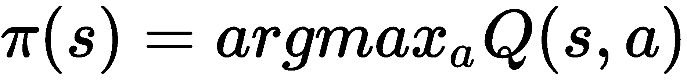

通过对大量迭代交替两个阶段，将获得最佳策略。


# 怎么做...

让我们通过采取以下步骤来搜索具有策略 MC 控制的最佳 21 点策略:

1.  导入必要的模块并创建一个 21 点实例:

```py
>>> import torch
>>> import gym
>>> env = gym.make('Blackjack-v0')
```

2.  接下来，让我们开发一个运行一集并在 Q 函数下采取行动的函数。这是改进阶段:

```py
>>> def run_episode(env, Q, n_action):
 ...     """
 ...     Run a episode given a Q-function
 ...     @param env: OpenAI Gym environment
 ...     @param Q: Q-function
 ...     @param n_action: action space
 ...     @return: resulting states, actions and rewards for the entire episode
 ...     """
 ...     state = env.reset()
 ...     rewards = []
 ...     actions = []
 ...     states = []
 ...     is_done = False
 ...     action = torch.randint(0, n_action, [1]).item()
 ...     while not is_done:
 ...         actions.append(action)
 ...         states.append(state)
 ...         state, reward, is_done, info = env.step(action)
 ...         rewards.append(reward)
 ...         if is_done:
 ...             break
 ...         action = torch.argmax(Q[state]).item()
 ...     return states, actions, rewards
```

3.  现在，我们开发基于策略的 MC 控制算法:

```py
 >>> from collections import defaultdict
 >>> def mc_control_on_policy(env, gamma, n_episode):
 ...     """
 ...     Obtain the optimal policy with on-policy MC control method
 ...     @param env: OpenAI Gym environment
 ...     @param gamma: discount factor
 ...     @param n_episode: number of episodes
 ...     @return: the optimal Q-function, and the optimal policy
 ...     """ ...     n_action = env.action_space.n
 ...     G_sum = defaultdict(float)
 ...     N = defaultdict(int)
 ...     Q = defaultdict(lambda: torch.empty(env.action_space.n))
 ...     for episode in range(n_episode):
 ...         states_t, actions_t, rewards_t = run_episode(env, Q, n_action) 
 ...         return_t = 0
 ...         G = {}
 ...         for state_t, action_t, reward_t in zip(states_t[::-1], 
                     actions_t[::-1], rewards_t[::-1]):
 ...             return_t = gamma * return_t + reward_t
 ...             G[(state_t, action_t)] = return_t
 ...         for state_action, return_t in G.items():
 ...             state, action = state_action
 ...             if state[0] <= 21:
 ...                 G_sum[state_action] += return_t
 ...                 N[state_action] += 1
 ...                 Q[state][action] = G_sum[state_action] 
                                         / N[state_action]
 ...      policy = {}
 ...      for state, actions in Q.items():
 ...          policy[state] = torch.argmax(actions).item()
 ...      return Q, policy
```

4.  我们指定折扣率为 1，将使用 500，000 集:

```py
>>> gamma = 1
>>> n_episode = 500000
```

5.  执行政策 MC 控制，以获得最佳 Q 函数和政策:

```py
>>> optimal_Q, optimal_policy = mc_control_on_policy(env, gamma, n_episode) >>> print(optimal_policy)
```

6.  我们还可以计算最优策略的价值函数，并打印出最优值，如下所示:

```py
>>> optimal_value = defaultdict(float)
>>> for state, action_values in optimal_Q.items():
 ...     optimal_value[state] = torch.max(action_values).item() >>> print(optimal_value)
```

7.  使用`plot_blackjack_value`和我们在前一个配方中开发的`plot_surface`函数可视化该值，*用蒙特卡洛预测玩 21 点*:

```py
>>> plot_blackjack_value(optimal_value)
```


# 它是如何工作的...

在这个配方中，我们通过探索开始来解决带有策略 MC 控制的 21 点游戏。这通过在我们模拟的每个情节中交替进行评估和改进来实现我们的策略优化目标。

在*步骤 2* 中，我们运行一集，并通过执行以下任务在 Q 功能下采取行动:

*   我们开始一集。
*   我们采取随机行动作为探索的开始。
*   在第一个动作之后，我们根据当前的 Q 函数采取动作，即 [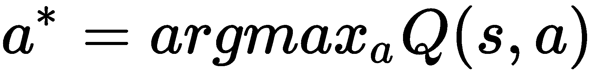] 。
*   我们记录下剧集中所有步骤的状态、动作和奖励，这些将用于评估阶段。

值得注意的是，第一个动作是随机选取的，因为 MC 控制算法只有在这种情况下才会收敛到最优解。以 MC 算法中的随机动作开始一集叫做**探索开始**。

在探索开始设置中，随机选择剧集中的第一个动作，以确保策略收敛到最优解。否则，一些状态永远不会被访问，因此它们的状态-动作值永远不会被优化，并且策略最终会变成次优的。

*第 2 步*是改进阶段，*第 3 步*是 MC 控制，我们执行以下任务:

*   用任意小值初始化 Q 函数。
*   运行`n_episode`集。
*   针对每一集，进行政策改进，获取状态、行动、奖励；并且使用基于结果状态、动作和奖励的首次访问 MC 预测来执行策略评估，这更新了 Q 函数。
*   最后，确定最优 Q 函数，并通过对最优 Q 函数中的每个状态采取最佳行动来获得最优策略。

在每次迭代中，我们通过相对于当前动作值函数 Q(即 [] )采取最优动作，使策略变得贪婪。因此，我们将能够获得一个最优策略，即使我们从一个任意的策略开始。

在*步骤 5* 中，您可以看到产生的最优策略，如下所示:

```py
{(16, 8, True): 1, (11, 2, False): 1, (15, 5, True): 1, (14, 9, False): 1, (11, 6, False): 1, (20, 3, False): 0, (9, 6, False): 0, (12, 9, False): 0, (21, 2, True): 0, (16, 10, False): 1, (17, 5, False): 0, (13, 10, False): 1, (12, 10, False): 1, (14, 10, False): 0, (10, 2, False): 1, (20, 4, False): 0, (11, 4, False): 1, (16, 9, False): 0, (10, 8,
 ……
 ……
1, (18, 6, True): 0, (12, 2, True): 1, (8, 3, False): 1, (13, 3, True): 0, (4, 7, False): 1, (18, 8, True): 0, (6, 5, False): 1, (17, 6, True): 0, (19, 9, True): 0, (4, 4, False): 0, (14, 5, True): 1, (12, 6, True): 0, (4, 9, False): 1, (13, 4, True): 1, (4, 8, False): 1, (14, 3, True): 1, (12, 4, True): 1, (4, 6, False): 0, (12, 5, True): 0, (4, 2, False): 1, (4, 3, False): 1, (5, 4, False): 1, (4, 1, False): 0}
```

在*步骤 6* 中，您可以看到最佳策略的结果值，如下所示:

```py
{(21, 8, False): 0.9262458682060242, (11, 8, False): 0.16684606671333313, (16, 10, False): -0.4662476181983948, (16, 10, True): -0.3643564283847809, (14, 8, False): -0.2743947207927704, (13, 10, False): -0.3887477219104767, (12, 9, False): -0.22795115411281586
 ……
 ……
(4, 3, False): -0.18421052396297455, (4, 8, False): -0.16806723177433014, (13, 2, True): 0.05485232174396515, (5, 5, False): -0.09459459781646729, (5, 8, False): -0.3690987229347229, (20, 2, True): 0.6965699195861816, (17, 2, True): -0.09696969389915466, (12, 2, True): 0.0517241396009922}
```

在*步骤 7* 中，您将看到没有可用 ace 的状态的结果值图，如下所示:

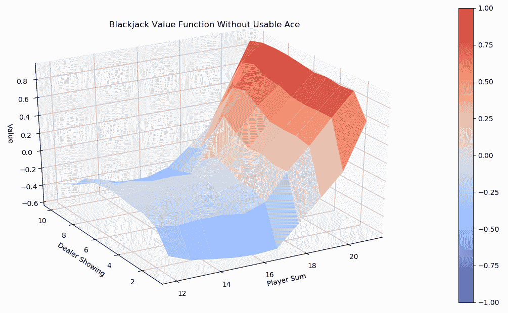

并且具有可用 ace 的状态的值函数如下所示:

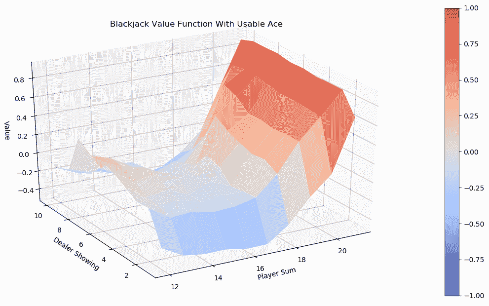

# 还有更多...

您可能想知道最优策略是否真的比简单策略更有效。现在让我们分别在最优策略和简单策略下模拟 100，000 次 21 点游戏。我们将比较这两种策略的胜败几率:

1.  首先，我们定义一个简单的策略，当分数达到 18:

```py
>>> hold_score = 18
>>> hold_policy = {}
>>> player_sum_range = range(2, 22)
>>> for player in range(2, 22):
...     for dealer in range(1, 11):
...         action = 1 if player < hold_score else 0
...         hold_policy[(player, dealer, False)] = action
...         hold_policy[(player, dealer, True)] = action
```

2.  接下来，我们定义一个包装器函数，它在给定的策略下运行一集，并返回最终的奖励:

```py
>>> def simulate_episode(env, policy):
...     state = env.reset()
...     is_done = False
...     while not is_done:
...         action = policy[state]
...         state, reward, is_done, info = env.step(action)
...         if is_done:
...             return reward
```

3.  然后，我们指定剧集的数量(100，000)，并开始计算输赢:

```py
>>> n_episode = 100000
>>> n_win_optimal = 0
>>> n_win_simple = 0
>>> n_lose_optimal = 0
>>> n_lose_simple = 0
```

4.  然后，我们运行 100，000 集并记录输赢:

```py
>>> for _ in range(n_episode):
...     reward = simulate_episode(env, optimal_policy)
...     if reward == 1:
...         n_win_optimal += 1
...     elif reward == -1:
...         n_lose_optimal += 1
...     reward = simulate_episode(env, hold_policy)
...     if reward == 1:
...         n_win_simple += 1
...     elif reward == -1:
...         n_lose_simple += 1
```

5.  最后，我们打印出我们得到的结果:

```py
>>> print('Winning probability under the simple policy: {}'.format(n_win_simple/n_episode))
Winning probability under the simple policy: 0.39923
>>> print('Winning probability under the optimal policy: {}'.format(n_win_optimal/n_episode))
Winning probability under the optimal policy: 0.41281
```

在最优策略下玩有 41.28%的胜算，在简单策略下玩有 39.92%的胜算。那么，我们有输的概率:

```py
>>> print('Losing probability under the simple policy: {}'.format(n_lose_simple/n_episode))
Losing probability under the simple policy: 0.51024
>>> print('Losing probability under the optimal policy: {}'.format(n_lose_optimal/n_episode))
Losing probability under the optimal policy: 0.493
```

另一方面，在最优策略下玩有 49.3%的几率输，在简单策略下玩有 51.02%的几率输。

我们的最优策略显然是赢家！


# 用ε-贪婪策略开发 MC 控制

在前面的配方中，我们使用 MC 控制和贪婪搜索来搜索最佳策略，其中选择了具有最高状态-动作值的动作。然而，早期事件中可用的最佳选择并不能保证最优的解决方案。如果我们只关注暂时的最佳选择，而忽略整体问题，我们将陷入局部最优，而不是达到全局最优。解决方法是ε贪婪策略。

在采用**ε-贪婪策略**的 MC 控制中，我们不再一直利用最佳行动，而是在一定概率下随机选择一个行动。顾名思义，该算法有两层含义:

*   ε:给定一个参数ε，其值从 *0* 到 *1* ，每一个动作被采取的概率计算如下:

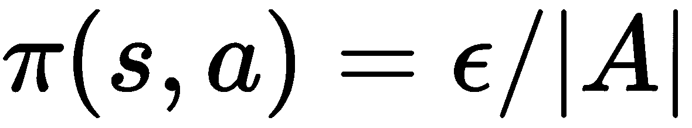

这里，|A|是可能动作的数量。

*   贪婪:优先选择状态-行动值最高的行动，其被选中的概率增加 *1-ε* :

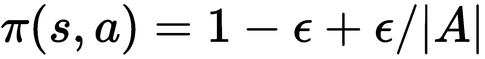

Epsilon-greedy 策略在大多数情况下利用最佳行动，并不时探索不同的行动。


# 怎么做...

让我们使用ε贪婪策略来解决 21 点环境:

1.  导入必要的模块并创建一个 21 点实例:

```py
>>> import torch
>>> import gym
>>> env = gym.make('Blackjack-v0')
```

2.  接下来，让我们开发一个运行一集并执行 epsilon-greedy 的函数:

```py
>>> def run_episode(env, Q, epsilon, n_action):
...     """
...     Run a episode and performs epsilon-greedy policy
...     @param env: OpenAI Gym environment
...     @param Q: Q-function
...     @param epsilon: the trade-off between exploration and exploitation
...     @param n_action: action space
...     @return: resulting states, actions and rewards for the entire episode
...     """
...     state = env.reset()
...     rewards = []
...     actions = []
...     states = []
...     is_done = False
...     while not is_done:
...         probs = torch.ones(n_action) * epsilon / n_action
...         best_action = torch.argmax(Q[state]).item()
...         probs[best_action] += 1.0 - epsilon
...         action = torch.multinomial(probs, 1).item()
...         actions.append(action)
...         states.append(state)
...         state, reward, is_done, info = env.step(action)
...         rewards.append(reward)
...         if is_done:
...             break
...     return states, actions, rewards
```

3.  现在，使用 epsilon-greedy 开发保单 MC 控制:

```py
>>> from collections import defaultdict
>>> def mc_control_epsilon_greedy(env, gamma, n_episode, epsilon):
...     """
...     Obtain the optimal policy with on-policy MC control with epsilon_greedy
...     @param env: OpenAI Gym environment
...     @param gamma: discount factor
...     @param n_episode: number of episodes
...     @param epsilon: the trade-off between exploration and exploitation
...     @return: the optimal Q-function, and the optimal policy
...     """
...     n_action = env.action_space.n
...     G_sum = defaultdict(float)
...     N = defaultdict(int)
...     Q = defaultdict(lambda: torch.empty(n_action))
...     for episode in range(n_episode):
...         states_t, actions_t, rewards_t = 
                     run_episode(env, Q, epsilon, n_action)
...         return_t = 0
...         G = {}
...         for state_t, action_t, reward_t in zip(states_t[::-1], 
                                 actions_t[::-1], rewards_t[::-1]):
...             return_t = gamma * return_t + reward_t
...             G[(state_t, action_t)] = return_t
...         for state_action, return_t in G.items():
...             state, action = state_action
...             if state[0] <= 21:
...                 G_sum[state_action] += return_t
...                 N[state_action] += 1
...                 Q[state][action] = 
                         G_sum[state_action] / N[state_action]
...     policy = {}
...     for state, actions in Q.items():
...         policy[state] = torch.argmax(actions).item()
...     return Q, policy
```

4.  我们指定折扣率为 1，ε为 0.1，将使用 500，000 集:

```py
>>> gamma = 1
>>> n_episode = 500000
>>> epsilon = 0.1
```

5.  使用ε-贪婪策略执行 MC 控制，以获得最佳 Q 函数和策略:

```py
>>> optimal_Q, optimal_policy = mc_control_epsilon_greedy(env, gamma, n_episode, epsilon)
```

随意打印出最佳值，并使用我们开发的`plot_blackjack_value`和`plot_surface`函数将其可视化。我们在此不重复该过程。

6.  最后，我们想知道ε-贪婪方法是否真的更好。同样，我们在 epsilon-greedy 生成的最佳策略下模拟了 100，000 次 21 点游戏，并计算了输赢的几率:

```py
>>> n_episode = 100000
>>> n_win_optimal = 0
>>> n_lose_optimal = 0
>>> for _ in range(n_episode):
...     reward = simulate_episode(env, optimal_policy)
...     if reward == 1:
...         n_win_optimal += 1
...     elif reward == -1:
...         n_lose_optimal += 1
```

这里，我们重用了上一个配方中的`simulate_episode`函数。


# 它是如何工作的...

在这个配方中，我们用ε-贪婪的策略 MC 控制来解决 21 点游戏。

在*步骤 2* 中，我们运行一集并执行以下任务的 epsilon-greedy:

*   我们开始一集。
*   我们计算选择个体行动的概率:对于基于当前 Q 函数的最佳行动，概率是 [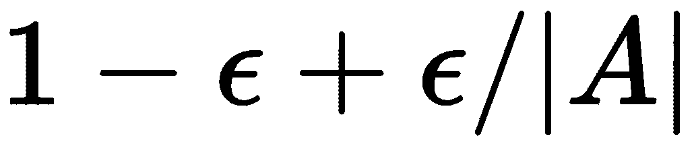、]，否则，概率是[、、]。
*   我们记录下剧集中所有步骤的状态、动作和奖励，这些将用于评估阶段。

ε-greedy 通过利用概率为 [] 的最佳动作，同时允许概率为 [] 的其他随机动作的探索，胜过贪婪搜索方法。超参数ε是开采和勘探之间的权衡。如果它的值为 0，则算法变得完全贪婪；如果值是 *1* ，那么每个动作都是平均选择的，所以算法只是做随机探索。

ε的值需要根据实验进行调整，不存在对所有实验都最有效的普适值。话虽如此，一般来说，我们可以选择 0.1、0.2 或 0.3 开始。另一种方法是从稍大的值(如 0.5 或 0.7)开始，随时间逐渐减小(如每集衰减 0.999)。通过这种方式，政策将在开始时侧重于探索不同的行动，随着时间的推移，它将倾向于利用好的行动。

最后，在执行*步骤 6* 后，对 100，000 集的结果进行平均，并打印获胜概率，我们现在有以下结果:

```py
>>> print('Winning probability under the optimal policy: {}'.format(n_win_optimal/n_episode))
Winning probability under the optimal policy: 0.42436
```

ε-贪婪方法得到的最优策略有 42.44%的胜算，高于不使用ε-贪婪的胜算(41.28%)。

然后，我们还打印了失败的概率:

```py
>>> print('Losing probability under the optimal policy: {}'.format(n_lose_optimal/n_episode))
Losing probability under the optimal policy: 0.48048
```

如你所见，ε-贪婪方法的失败几率更低(48.05%对没有ε-贪婪的 49.3%)。


# 执行非策略蒙特卡罗控制

解决 MDP 的另一种基于 MC 的方法是使用**非策略**控制，我们将在本食谱中讨论。

**非策略**方法优化**目标策略** **，** π，使用由另一个策略生成的数据，称为**行为策略**，b。目标策略始终执行利用，而行为策略用于探索目的。这意味着目标策略相对于其当前的 Q 函数是贪婪的，并且行为策略生成行为，使得目标策略具有要学习的数据。行为策略可以是任何东西，只要所有状态中的所有动作都可以以非零概率被选择，这保证了行为策略可以探索所有的可能性。

因为我们在非策略方法中处理两个不同的策略，所以我们只能在两个策略中发生的事件中使用**公共**步骤。这意味着我们从最新的步骤开始，该步骤在行为策略下采取的动作不同于在贪婪策略下采取的动作。为了了解另一个策略的目标策略，我们使用了一种称为**重要性抽样**的技术，这种技术通常用于在给定从不同分布生成的样本的情况下，估计某个分布下的期望值。状态-动作对的加权重要性计算如下:

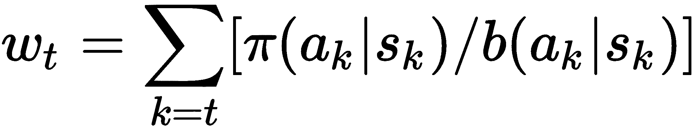

这里π ( *ak* | *sk* )是目标策略下状态 *sk* 下采取行动 *ak* 的概率；*b*(*AK*|*sk*)是行为策略下的概率；并且权重 *wt* 是从步骤 *t* 到剧集结束的这两个概率之间的比值的乘积。在步骤 *t* 将权重 *wt* 应用于返回。


# 怎么做...

让我们通过使用以下步骤来搜索具有非策略 MC 控制的最佳二十一点策略:

1.  导入必要的模块并创建一个 21 点实例:

```py
>>> import torch
>>> import gym
>>> env = gym.make('Blackjack-v0')
```

2.  我们从定义行为策略开始，在我们的例子中，行为策略随机选择一个具有相同概率的动作:

```py
>>> def gen_random_policy(n_action):
...     probs = torch.ones(n_action) / n_action
...     def policy_function(state):
...         return probs
...     return policy_function
>>> random_policy = gen_random_policy(env.action_space.n)
```

行为策略可以是任何东西，只要它以非零概率选择所有状态中的所有动作。

3.  接下来，让我们开发一个函数，它运行一个情节并根据行为策略采取行动:

```py
>>> def run_episode(env, behavior_policy):
...     """
...     Run a episode given a behavior policy
...     @param env: OpenAI Gym environment
...     @param behavior_policy: behavior policy
...     @return: resulting states, actions and rewards for the entire episode
...     """
...     state = env.reset()
...     rewards = [] ...     actions = []
...     states = []
...     is_done = False
...     while not is_done:
...         probs = behavior_policy(state)
...         action = torch.multinomial(probs, 1).item()
...         actions.append(action)
...         states.append(state)
...         state, reward, is_done, info = env.step(action)
...         rewards.append(reward)
...         if is_done:
...             break
...     return states, actions, rewards
```

它记录了情节中所有步骤的状态、行动和奖励，将用作目标策略的学习数据。

4.  现在，我们将开发离线 MC 控制算法:

```py
>>> from collections import defaultdict
>>> def mc_control_off_policy(env, gamma, n_episode, behavior_policy):
...     """
...     Obtain the optimal policy with off-policy MC control method
...     @param env: OpenAI Gym environment
...     @param gamma: discount factor
...     @param n_episode: number of episodes
...     @param behavior_policy: behavior policy
...     @return: the optimal Q-function, and the optimal policy
...     """
...     n_action = env.action_space.n
...     G_sum = defaultdict(float)
...     N = defaultdict(int)
...     Q = defaultdict(lambda: torch.empty(n_action))
...     for episode in range(n_episode):
...         W = {}
...         w = 1
...         states_t, actions_t, rewards_t = 
                     run_episode(env, behavior_policy)
...         return_t = 0 ...         G = {}
...         for state_t, action_t, reward_t in zip(states_t[::-1], 
                                 actions_t[::-1], rewards_t[::-1]):
...             return_t = gamma * return_t + reward_t
...             G[(state_t, action_t)] = return_t
...             if action_t != torch.argmax(Q[state_t]).item():
...                 break
...             w *= 1./ behavior_policy(state_t)[action_t]
...         for state_action, return_t in G.items():
...             state, action = state_action
...             if state[0] <= 21:
...                 G_sum[state_action] += 
                                 return_t * W[state_action]
...                 N[state_action] += 1
...                 Q[state][action] = 
                             G_sum[state_action] / N[state_action]
...     policy = {}
...     for state, actions in Q.items():
...         policy[state] = torch.argmax(actions).item()
...     return Q, policy
```

5.  我们指定折扣率为 1，将使用 500，000 集:

```py
>>> gamma = 1
>>> n_episode = 500000
```

6.  使用`random_policy`行为策略执行偏离策略 MC 控制，以获得最佳 Q 函数和策略:

```py
>>> optimal_Q, optimal_policy = mc_control_off_policy(env, gamma, n_episode, random_policy)
```


# 它是如何工作的...

在这个食谱中，我们用不符合策略的 MC 来解决 21 点游戏。

在*步骤 4* 中，偏离策略 MC 控制算法执行以下任务:

*   它用任意小的值初始化 Q 函数。
*   它播放了`n_episode`集。
*   对于每一集，它执行行为策略来生成状态、动作和奖励；它使用基于**公共**步骤的首次访问 MC 预测对目标策略执行策略评估；并且它基于加权回报更新 Q 函数。
*   最后，确定最优 Q 函数，并通过对最优 Q 函数中的每个状态采取最佳行动来获得最优策略。

它通过观察另一个代理并重用从另一个策略生成的经验来了解目标策略。目标策略以贪婪的方式优化，而行为策略不断探索不同的选项。它将行为策略的回报与它们在目标策略中的概率的重要性比率进行平均。你可能会奇怪为什么π ( *ak* | *sk* )在计算重要度比 *wt* 时总是等于 1。回想一下，我们只考虑行为策略和大概目标策略下采取的共同步骤，目标策略总是贪婪的。因此，π ( *a* | *s* ) = 1 始终为真。


# 还有更多...

我们实际上可以以增量的方式实现 MC 方法。在一集里，我们可以即时计算 Q 函数，而不是存储每个首次出现的状态-动作对的回报和重要性比率。以非增量的方式，最后用 n 集内所有存储的回报计算 Q 函数:

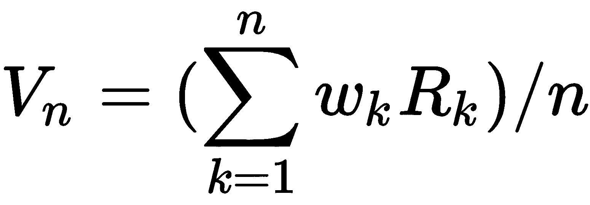

而在增量方法中，Q 函数在一集的每个步骤中更新如下:

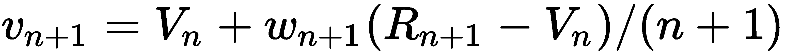

增量等效更有效，因为它减少了内存消耗，并且更具可伸缩性。让我们开始实施吧:

```py
>>> def mc_control_off_policy_incremental(env, gamma, n_episode, behavior_policy):
...     n_action = env.action_space.n
...     N = defaultdict(int)
...     Q = defaultdict(lambda: torch.empty(n_action))
...     for episode in range(n_episode):
...         W = 1.
...         states_t, actions_t, rewards_t = 
                             run_episode(env, behavior_policy)
...         return_t = 0.
...         for state_t, action_t, reward_t in 
                     zip(states_t[::-1], actions_t[::-1], rewards_t[::-1]):
...             return_t = gamma * return_t + reward_t
...             N[(state_t, action_t)] += 1
...             Q[state_t][action_t] += (W / N[(state_t, action_t)]) * (return_t - Q[state_t][action_t])
...             if action_t != torch.argmax(Q[state_t]).item():
...                 break
...             W *= 1./ behavior_policy(state_t)[action_t]
...     policy = {}
...     for state, actions in Q.items():
...         policy[state] = torch.argmax(actions).item()
...     return Q, policy
```

我们可以调用这个增量版本来获得最优策略:

```py
>>> optimal_Q, optimal_policy = mc_control_off_policy_incremental(env, gamma, n_episode, random_policy)
```


# 请参见

关于重要性抽样的详细解释，以下是一个很好的资源:

[https://statweb.stanford.edu/~owen/mc/Ch-var-is.pdf](https://statweb.stanford.edu/~owen/mc/Ch-var-is.pdf)


# 用加权重要抽样开发 MC 控制

在前面的配方中，我们简单地将行为策略的回报与它们在目标策略中的概率的重要性比率进行平均。这种技术正式称为**普通重要性抽样**。众所周知，它具有很高的方差，因此，我们通常更喜欢重要性抽样的加权版本，这一点我们将在本食谱中讨论。

加权重要性抽样与普通重要性抽样的不同之处在于它对回报进行平均的方式。它不是简单的平均，而是对回报率进行加权平均:

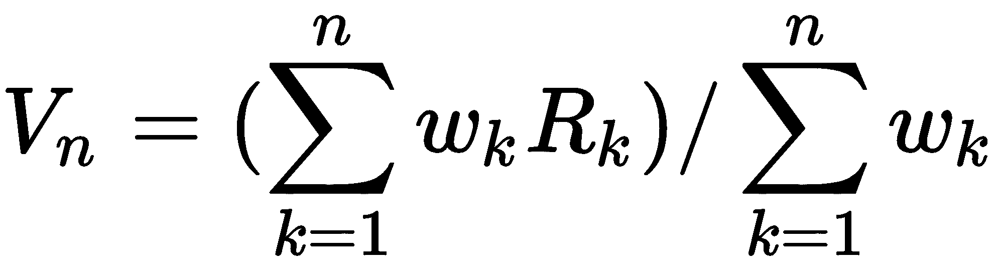

与普通版本相比，它通常具有低得多的方差。如果你对 21 点进行过普通重要性抽样实验，你会发现每次实验的结果都有很大不同。


# 怎么做...

让我们通过使用以下步骤，使用加权重要性抽样来解决带有非策略 MC 控制的 21 点:

1.  导入必要的模块并创建一个 21 点实例:

```py
>>> import torch
>>> import gym
>>> env = gym.make('Blackjack-v0')
```

2.  我们从定义行为策略开始，在我们的例子中，行为策略随机选择一个具有相同概率的动作:

```py
>>> random_policy = gen_random_policy(env.action_space.n)
```

3.  接下来，我们重用`run_episode`函数，它运行一个片段并根据行为策略采取行动。

3.  现在，我们开发具有加权重要性采样的非策略 MC 控制算法:

```py
>>> from collections import defaultdict
>>> def mc_control_off_policy_weighted(env, gamma, n_episode, behavior_policy):
...     """
...     Obtain the optimal policy with off-policy MC control method with weighted importance sampling
...     @param env: OpenAI Gym environment
...     @param gamma: discount factor
...     @param n_episode: number of episodes
...     @param behavior_policy: behavior policy
...     @return: the optimal Q-function, and the optimal policy
...     """
...     n_action = env.action_space.n
...     N = defaultdict(float)
...     Q = defaultdict(lambda: torch.empty(n_action))
...     for episode in range(n_episode):
...         W = 1.
...         states_t, actions_t, rewards_t = 
                             run_episode(env, behavior_policy)
...         return_t = 0.
...         for state_t, action_t, reward_t in zip(states_t[::-1], 
                                 actions_t[::-1], rewards_t[::-1]):
...             return_t = gamma * return_t + reward_t
...             N[(state_t, action_t)] += W
...             Q[state_t][action_t] += (W / N[(state_t, action_t)]) 
                                 * (return_t - Q[state_t][action_t])
...             if action_t != torch.argmax(Q[state_t]).item():
...                 break
...             W *= 1./ behavior_policy(state_t)[action_t]
...     policy = {}
...     for state, actions in Q.items():
...         policy[state] = torch.argmax(actions).item()
...     return Q, policy
```

请注意，这是 MC 控件的增量版本。

5.  我们指定折扣率为 1，将使用 500，000 集:

```py
>>> gamma = 1
>>> n_episode = 500000
```

6.  使用`random_policy`行为策略执行偏离策略 MC 控制，以获得最佳 Q 函数和策略:

```py
>>> optimal_Q, optimal_policy = mc_control_off_policy_weighted(env, gamma, n_episode, random_policy)
```


# 它是如何工作的...

在这个配方中，我们已经使用带加权重要性抽样的非策略 MC 控制解决了 21 点问题。它与普通的重要性抽样非常相似，但它不是按比率缩放收益并对结果求平均值，而是使用加权平均值缩放收益。而且，在实践中，加权重要性抽样的方差比普通重要性抽样低得多，因此是非常可取的。


# 还有更多...

最后，我们为什么不模拟几集，看看在由此产生的最优策略下，胜负几率会是多少？

我们重复使用我们在*中开发的`simulate_episode`函数，执行政策上的蒙特卡洛控制*方法，并模拟 100，000 集:

```py
>>> n_episode = 100000
>>> n_win_optimal = 0
>>> n_lose_optimal = 0
>>> for _ in range(n_episode):
...     reward = simulate_episode(env, optimal_policy)
...     if reward == 1:
...         n_win_optimal += 1
...     elif reward == -1:
...         n_lose_optimal += 1
```

然后，我们打印出我们得到的结果:

```py
>>> print('Winning probability under the optimal policy: {}'.format(n_win_optimal/n_episode))
Winning probability under the optimal policy: 0.43072
>>> print('Losing probability under the optimal policy: {}'.format(n_lose_optimal/n_episode))
Losing probability under the optimal policy: 0.47756
```


# 请参见

为了证明加权重要性抽样优于普通重要性抽样这一事实，请随意查看以下内容:

*   赫斯伯格， *T* 。 *C* 。，*重要性抽样的进展*， *Ph* 。 *D* 。*论文*，*统计系*，*斯坦福大学*，1988 年
*   *干酪乳杆菌*， *G* 。，*罗伯特*， *C* 。*、*、*岗位* - *处理接受* - *不合格样品* : *回收并重新计量*。*计算与图形统计杂志*，*7*(*2*):*139–157*， *1988*
*   *预剪*， *D* 。，*萨顿*， *R. S* 。、 *Singh* 、 *S、合格痕迹为 off* - *保单保单评估*。*第 17 届机器学习国际会议论文集*，*第 759 页*—*第 766 页*， *2000 年*