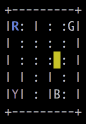
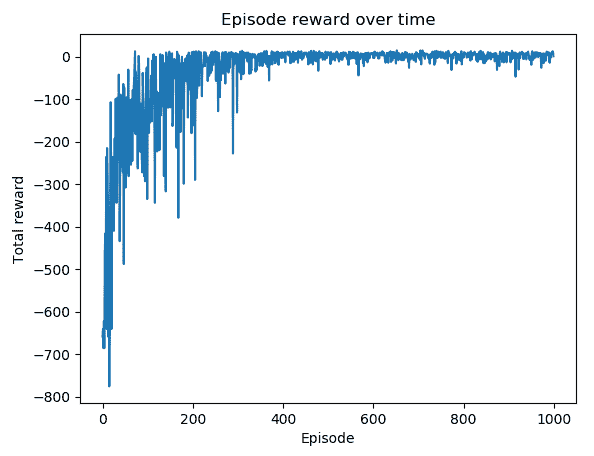

# 四、时间差分和 Q 学习

在前一章中，我们通过蒙特卡罗方法求解 MDPs，这是一种无模型方法，不需要环境的先验知识。但是在 MC 学习中，价值函数和 Q 函数通常会更新到一集结束。这可能会有问题，因为有些进程非常长，甚至无法终止。我们将在本章中使用**时差** ( **TD** )方法来解决这个问题。在 TD 方法中，我们在每集的每个时间步中更新动作值，这显著提高了学习效率。

本章将从设置悬崖行走和风 Gridworld 环境操场开始，这将在 TD 控制方法中使用，是本章的主要讨论点。通过我们的分步指南，读者将获得策略外控制的 Q-learning 和策略内控制的 SARSA 的实践经验。我们还将研究一个有趣的项目，出租车问题，并演示如何分别使用 Q-learning 和 SARSA 算法来解决它。最后，我们将额外介绍双 Q 学习算法。

我们将介绍以下食谱:

*   设置悬崖步行环境游乐场
*   开发 Q 学习算法
*   建立风的网格世界环境游乐场
*   开发 SARSA 算法
*   用 Q-learning 解决出租车问题
*   用 SARSA 解决出租车问题
*   开发双 Q 学习算法


# 设置悬崖步行环境游乐场

在第一个食谱中，我们将从熟悉悬崖行走环境开始，我们将在接下来的食谱中用 TD 方法解决这个问题。

《悬崖漫步》是一个典型的`gym`环境，情节很长，没有终止的保证。是 4 * 12 板的网格问题。一个代理人一步一步地向上、向右、向下、向左移动。左下方的磁贴是代理的起点，右下方是获胜点，如果到达该点，一集将在该点结束。最后一行剩下的瓷砖是悬崖，代理人踩上其中任何一个后都会被重置到起始位置，但剧集还会继续。代理人每走一步都会得到-1 奖励，除了踩在悬崖上，会得到-100 奖励。


# 做好准备

要运行悬崖漫步环境，让我们首先在[https://github.com/openai/gym/wiki/Table-of-environments](https://github.com/openai/gym/wiki/Table-of-environments)的环境列表中搜索它的名字。我们得到`CliffWalking-v0`并且还知道观察空间由范围从 0(左上平铺)到 47(右下目标平铺)的整数表示，并且有四种可能的动作(上= 0，右= 1，下= 2，左= 3)。


# 怎么做...

让我们通过执行以下步骤来模拟悬崖行走环境:

1.  我们导入健身房库并创建悬崖行走环境的实例:

```py
>>> import gym
>>> env = gym.make("CliffWalking-v0")
>>> n_state = env.observation_space.n
>>> print(n_state)
48
>>> n_action = env.action_space.n
>>> print(n_action)
4
```

2.  然后，我们重置环境:

```py
>>> env.reset()
 0
```

代理从左下角的状态 36 开始。

3.  然后，我们渲染环境:

```py
>>> env.render()
```

4.  不管怎样，现在让我们做一个向下的运动，即使它是不可行走的:

```py
>>> new_state, reward, is_done, info = env.step(2)
>>> env.render()
 o  o  o  o  o  o  o  o  o  o  o  o
 o  o  o  o  o  o  o  o  o  o  o  o
 o  o  o  o  o  o  o  o  o  o  o  o
 x  C  C  C  C  C  C  C  C  C  C  T
```

代理保持不动。现在，打印出我们刚刚获得的内容:

```py
>>> print(new_state)
36
>>> print(reward)
-1
```

同样，每一次移动都会得到-1 奖励:

```py
>>> print(is_done)
 False
```

该集尚未结束，因为代理尚未达到他们的目标:

```py
>>> print(info)
 {'prob': 1.0}
```

这意味着运动是确定的。

现在，让我们执行向上运动，因为它是可行走的:

```py
>>> new_state, reward, is_done, info = env.step(0)
>>> env.render()
 o  o  o  o  o  o  o  o  o  o  o  o
 o  o  o  o  o  o  o  o  o  o  o  o
 x  o  o  o  o  o  o  o  o  o  o  o
 o  C  C  C  C  C  C  C  C  C  C  T
```

打印出我们刚刚获得的内容:

```py
>>> print(new_state)
 24
```

代理向上移动:

```py
>>> print(reward)
 -1
```

这招致-1 奖励。

5.  现在让我们试着做一个向右和向下的动作:

```py
>>> new_state, reward, is_done, info = env.step(1)
>>> new_state, reward, is_done, info = env.step(2)
>>> env.render()
 o  o  o  o  o  o  o  o  o  o  o  o
 o  o  o  o  o  o  o  o  o  o  o  o
 o  o  o  o  o  o  o  o  o  o  o  o
 x  C  C  C  C  C  C  C  C  C  C  T
```

代理人踩在悬崖上，所以被重置到起点，获得了-100 的奖励:

```py
>>> print(new_state)
36
>>> print(reward)
-100
>>> print(is_done)
False
```

6.  最后，让我们试着走最短的路到达目标:

```py
 >>> new_state, reward, is_done, info = env.step(0)
 >>> for _ in range(11):
 ...     env.step(1)
 >>> new_state, reward, is_done, info = env.step(2)
 >>> env.render()
 o  o  o  o  o  o  o  o  o  o  o  o
 o  o  o  o  o  o  o  o  o  o  o  o
 o  o  o  o  o  o  o  o  o  o  o  o
 o  C  C  C  C  C  C  C  C  C  C  x
 >>> print(new_state)
 47
 >>> print(reward)
 -1
 >>> print(is_done)
 True
```


# 它是如何工作的...

在*步骤 1* 中，我们导入健身房库并创建一个悬崖行走环境的实例。然后，我们在*步骤 2* 中重置环境。

在*步骤 3* 中，我们渲染环境，您将看到一个 4 * 12 的矩阵，如下所示，代表一个网格，其中包含代理站立的起始图块(x)、目标图块(T)、10 个悬崖图块(C)和常规图块(o):


在*第 4 步*、*第 5 步*、*第 6 步*中，我们做出了各种动作，看到了这些动作的各种结果以及得到的奖励。

正如你所想象的，一个悬崖行走的情节可能会很长，甚至没有尽头，因为踩在悬崖上会重置游戏。而且目标达成的越早越好，因为每一步都会导致-1 或者-100 的奖励。在下一个食谱中，我们将借助时间差分法来解决悬崖行走问题。


# 开发 Q 学习算法

时间差分(TD)学习也是一种无模型的学习算法，就像 MC 学习一样。您会记得，在 MC 学习中，Q-function 会在整集结束时更新(无论是在首次访问还是每次访问模式下)。TD 学习的主要优点是它为一集的每一步更新 Q 函数。

在这份食谱中，我们将研究一种流行的 TD 方法，叫做 **Q-** **学习**。Q-learning 是一种非策略学习算法。它根据以下等式更新 Q 函数:


这里，s '是采取行动后的结果状态，a，处于状态 s；r 是相关的奖励；α是学习率；γ是贴现因子。此外， [] 意味着行为策略是贪婪的，其中选择状态 s’中的最高 Q 值来生成学习数据。在 Q-learning 中，根据ε-贪婪策略采取行动。


# 怎么做...

我们执行 Q-learning 来解决悬崖行走环境，如下所示:

1.  导入 PyTorch 和 Gym 库，并创建悬崖行走环境的实例:

```py
>>> import torch
>>> import gym >>> env = gym.make("CliffWalking-v0")
>>> from collections import defaultdict
```

2.  让我们从定义ε-贪婪策略开始:

```py
>>> def gen_epsilon_greedy_policy(n_action, epsilon):
 ...     def policy_function(state, Q):
 ...         probs = torch.ones(n_action) * epsilon / n_action
 ...         best_action = torch.argmax(Q[state]).item()
 ...         probs[best_action] += 1.0 - epsilon
 ...         action = torch.multinomial(probs, 1).item()
 ...         return action
 ...     return policy_function
```

3.  现在，定义执行 Q 学习的函数:

```py
>>> def q_learning(env, gamma, n_episode, alpha):
 ...     """
 ...     Obtain the optimal policy with off-policy Q-learning method
 ...     @param env: OpenAI Gym environment
 ...     @param gamma: discount factor
 ...     @param n_episode: number of episodes
 ...     @return: the optimal Q-function, and the optimal policy
 ...     """
 ...     n_action = env.action_space.n
 ...     Q = defaultdict(lambda: torch.zeros(n_action))
 ...     for episode in range(n_episode):
 ...         state = env.reset()
 ...         is_done = False
 ...         while not is_done:
 ...             action = epsilon_greedy_policy(state, Q)
 ...             next_state, reward, is_done, info = 
                                         env.step(action)
 ...             td_delta = reward + 
                             gamma * torch.max(Q[next_state])
                             - Q[state][action]
 ...             Q[state][action] += alpha * td_delta
 ...             if is_done:
 ...                 break
 ...             state = next_state
 ...     policy = {}
 ...     for state, actions in Q.items():
 ...         policy[state] = torch.argmax(actions).item()
 ...     return Q, policy
```

4.  我们指定贴现率为`1`，学习率为`0.4`，ε为`0.1`；我们模拟了 500 集:

```py
>>> gamma = 1
>>> n_episode = 500
>>> alpha = 0.4
>>> epsilon = 0.1
```

5.  接下来，我们创建ε贪婪策略的一个实例:

```py
>>> epsilon_greedy_policy = gen_epsilon_greedy_policy(env.action_space.n, epsilon)
```

6.  最后，我们使用之前定义的输入参数执行 Q-learning，并打印出最佳策略:

```py
>>> optimal_Q, optimal_policy = q_learning(env, gamma, n_episode, alpha) >>> print('The optimal policy:\n', optimal_policy)
 The optimal policy:
 {36: 0, 24: 1, 25: 1, 13: 1, 12: 2, 0: 3, 1: 1, 14: 2, 2: 1, 26: 1, 15: 1, 27: 1, 28: 1, 16: 2, 4: 2, 3: 1, 29: 1, 17: 1, 5: 0, 30: 1, 18: 1, 6: 1, 19: 1, 7: 1, 31: 1, 32: 1, 20: 2, 8: 1, 33: 1, 21: 1, 9: 1, 34: 1, 22: 2, 10: 2, 23: 2, 11: 2, 35: 2, 47: 3}
```


# 它是如何工作的...

在*步骤 2* 中，ε-greedy 策略接受一个参数ε，其值从 0 到 1，以及|A|，即可能动作的数量。以ε/|A|的概率采取每个动作，以 1-ε+ε/|A|的概率选择状态-动作值最高的动作。

在*步骤 3* 中，我们在以下任务中执行 Q-learning:

*   我们用全零初始化 Q 表。
*   在每一集里，我们让代理遵循ε贪婪策略来选择采取什么行动。我们为每一步更新 Q 函数。
*   我们播放`n_episode`集。
*   我们得到了基于最优 Q 函数的最优策略。

在*第 6 步*中，再次，上= 0，右= 1，下= 2，左= 3；因此，遵循最优策略，代理从状态 36 开始，然后向上移动到状态 24，然后一直移动到状态 35，最后通过向下移动达到目标:


正如您在 Q-learning 中看到的，它通过学习另一个策略产生的经验来优化 Q 函数。这与非策略 MC 控制方法非常相似。不同的是，它即时更新 Q 函数，而不是在整集之后更新。这被认为对于具有长情节的环境是有利的，在这种环境中，将学习延迟到情节结束是低效的。在 Q-learning(或任何其他 TD 方法)的每一步中，我们都会获得更多关于环境的信息，并使用这些信息来立即更新值。在我们的例子中，我们仅通过运行 500 个学习片段就获得了最优策略。


# 还有更多...

事实上，最佳策略是在 50 集左右之后获得的。我们可以画出每集的时长来验证这一点。一段时间内每集获得的总奖励也是一个选项。

1.  我们定义了两个列表来分别存储每集的长度和总奖励:

```py
>>> length_episode = [0] * n_episode
>>> total_reward_episode = [0] * n_episode
```

2.  我们在学习过程中记录每集的时长和总奖励。以下是`q_learning`的更新版本:

```py
>>> def q_learning(env, gamma, n_episode, alpha):
 ...     n_action = env.action_space.n
 ...     Q = defaultdict(lambda: torch.zeros(n_action))
 ...     for episode in range(n_episode):
 ...         state = env.reset()
 ...         is_done = False
 ...         while not is_done:
 ...             action = epsilon_greedy_policy(state, Q)
 ...             next_state, reward, is_done, info = 
                                        env.step(action)
 ...             td_delta = reward + 
                        gamma * torch.max(Q[next_state])
                        - Q[state][action]
 ...             Q[state][action] += alpha * td_delta
 ...             length_episode[episode] += 1
 ...             total_reward_episode[episode] += reward
 ...             if is_done:
 ...                 break
 ...             state = next_state
 ...      policy = {}
 ...      for state, actions in Q.items():
 ...          policy[state] = torch.argmax(actions).item()
 ...      return Q, policy
```

3.  现在，显示一段时间内每集长度的曲线图:

```py
>>> import matplotlib.pyplot as plt
>>> plt.plot(length_episode)
>>> plt.title('Episode length over time')
>>> plt.xlabel('Episode')
>>> plt.ylabel('Length')
>>> plt.show()
```

这将导致以下情节:


4.  显示一段时间内剧集奖励的剧情:

```py
>>> plt.plot(total_reward_episode)
>>> plt.title('Episode reward over time')
>>> plt.xlabel('Episode')
>>> plt.ylabel('Total reward')
>>> plt.show()
```

这将导致以下情节:


同样，如果你降低ε的值，你会看到更小的波动，这是ε贪婪政策中随机探索的影响。


# 建立风的网格世界环境游乐场

在前一个方法中，我们解决了一个相对简单的环境，在这个环境中我们可以很容易地获得最优策略。在这个食谱中，让我们模拟一个更复杂的网格环境，Windy Gridworld，在这个环境中，外力将代理从某些瓷砖上移开。这将为我们在下一个配方中使用 TD 方法搜索最优策略做好准备。

Windy Gridworld 是一个 7 * 10 板的网格问题，显示如下:


一个代理人一步一步地向上、向右、向下、向左移动。图块 30 是代理的起点，图块 37 是获胜点，如果到达该点，一集将在该点结束。代理人每走一步都会得到-1 的奖励。

这种环境的复杂性在于，第 4 至第 9 列有额外的风力。从这些列上的图块开始移动，代理将经历额外的向上推动。第七、八列风力为 1，第四、五、六、九列风力为 2。例如，如果代理人试图从州 43 向右移动，他们将到达州 34；如果代理人试图从州 48 向左移动，他们将在州 37 着陆；如果代理人试图从状态 67 向上移动，他们将在状态 37 着陆，因为代理人接收到额外的 2 单位向上的力；如果代理人试图从状态 27 向下移动，他们将到达状态 17，因为向上的 2 个额外的力抵消了向下的 1 个力。

目前，Windy Gridworld 不包含在健身房环境中。我们将以悬崖漫步环境为参考来实现:[https://github . com/open ai/gym/blob/master/gym/envs/toy _ text/Cliff Walking . py](https://github.com/openai/gym/blob/master/gym/envs/toy_text/cliffwalking.py)。


# 怎么做...

让我们开发 Windy Gridworld 环境:

1.  从 Gym 导入必要的模块、NumPy 和`discrete`类:

```py
>>> import numpy as np
>>> import sys
>>> from gym.envs.toy_text import discrete
```

2.  定义四个动作:

```py
>>> UP = 0
>>> RIGHT = 1
>>> DOWN = 2
>>> LEFT = 3
```

3.  让我们从定义`WindyGridworldEnv` 类中的`__init__` 方法开始:

```py
>>> class WindyGridworldEnv(discrete.DiscreteEnv):
 ...     def __init__(self):
 ...         self.shape = (7, 10)
 ...         nS = self.shape[0] * self.shape[1]
 ...         nA = 4
 ...         # Wind locations
 ...         winds = np.zeros(self.shape)
 ...         winds[:,[3,4,5,8]] = 1
 ...         winds[:,[6,7]] = 2
 ...         self.goal = (3, 7)
 ...         # Calculate transition probabilities and rewards
 ...         P = {}
 ...         for s in range(nS):
 ...             position = np.unravel_index(s, self.shape)
 ...             P[s] = {a: [] for a in range(nA)}
 ...             P[s][UP] = self._calculate_transition_prob(
                                       position, [-1, 0], winds)
 ...             P[s][RIGHT] = self._calculate_transition_prob(
                                       position, [0, 1], winds)
 ...             P[s][DOWN] = self._calculate_transition_prob(
                                       position, [1, 0], winds)
 ...             P[s][LEFT] = self._calculate_transition_prob(
                                       position, [0, -1], winds)
 ...         # Calculate initial state distribution
 ...         # We always start in state (3, 0)
 ...         isd = np.zeros(nS)
 ...         isd[np.ravel_multi_index((3,0), self.shape)] = 1.0
 ...         super(WindyGridworldEnv, self).__init__(nS, nA, P, isd)
```

这定义了观察空间、风区域和风力、转换和回报矩阵以及初始状态。

4.  接下来，我们定义`_calculate_transition_prob`方法来确定动作的结果，包括概率(为 1)、新状态、奖励(总是为-1)以及它是否完成:

```py
...     def _calculate_transition_prob(self, current, 
                                                delta, winds):
 ...         """
 ...         Determine the outcome for an action. Transition 
                                             Prob is always 1.0.
 ...         @param current: (row, col), current position 
                                                 on the grid
 ...         @param delta: Change in position for transition
 ...         @param winds: Wind effect
 ...         @return: (1.0, new_state, reward, is_done)
 ...         """
 ...         new_position = np.array(current) + np.array(delta) 
                     + np.array([-1, 0]) * winds[tuple(current)]
 ...         new_position = self._limit_coordinates( new_position).astype(int)
 ...         new_state = np.ravel_multi_index( tuple(new_position), self.shape)
 ...         is_done = tuple(new_position) == self.goal
 ...         return [(1.0, new_state, -1.0, is_done)]
```

这将根据当前状态、运动和风的影响来计算状态，并确保新位置在网格内。最后，它检查代理是否已经达到目标状态。

5.  接下来，我们定义了`_limit_coordinates`方法，它防止代理脱离网格世界:

```py
...     def _limit_coordinates(self, coord):
 ...         coord[0] = min(coord[0], self.shape[0] - 1)
 ...         coord[0] = max(coord[0], 0)
 ...         coord[1] = min(coord[1], self.shape[1] - 1)
 ...         coord[1] = max(coord[1], 0)
 ...         return coord
```

6.  最后，我们添加了`render`方法来显示代理和网格环境:

```py
...     def render(self):
 ...         outfile = sys.stdout
 ...         for s in range(self.nS):
 ...             position = np.unravel_index(s, self.shape)
 ...             if self.s == s:
 ...                 output = " x "
 ...             elif position == self.goal:
 ...                 output = " T "
 ...             else:
 ...                 output = " o "
 ...             if position[1] == 0:
 ...                 output = output.lstrip()
 ...             if position[1] == self.shape[1] - 1:
 ...                 output = output.rstrip()
 ...                 output += "\n"
 ...             outfile.write(output)
 ...         outfile.write("\n")
```

`X`表示代理的当前位置，`T`是目标区块，其余区块表示为`o`。

现在，让我们通过以下步骤模拟 Windy Gridworld 环境:

1.  创建 Windy Gridworld 环境的一个实例:

```py
>>> env = WindyGridworldEnv()
```

2.  重置并渲染环境:

```py
>>> env.reset()
 >>> env.render()
 o  o  o  o  o  o  o  o  o  o
 o  o  o  o  o  o  o  o  o  o
 o  o  o  o  o  o  o  o  o  o
 x  o  o  o  o  o  o  T  o  o
 o  o  o  o  o  o  o  o  o  o
 o  o  o  o  o  o  o  o  o  o
 o  o  o  o  o  o  o  o  o  o
```

代理从状态 30 开始。

3.  做一个正确的运动:

```py
>>> print(env.step(1))
 >>> env.render()
 (31, -1.0, False, {'prob': 1.0})
 o  o  o  o  o  o  o  o  o  o
 o  o  o  o  o  o  o  o  o  o
 o  o  o  o  o  o  o  o  o  o
 o  x  o  o  o  o  o  T  o  o
 o  o  o  o  o  o  o  o  o  o
 o  o  o  o  o  o  o  o  o  o
 o  o  o  o  o  o  o  o  o  o
```

代理降落在 31 州，奖励为-1。

4.  做两个正确的动作:

```py
>>> print(env.step(1))
>>> print(env.step(1))
>>> env.render()
 (32, -1.0, False, {'prob': 1.0})
 (33, -1.0, False, {'prob': 1.0})
 o  o  o  o  o  o  o  o  o  o
 o  o  o  o  o  o  o  o  o  o
 o  o  o  o  o  o  o  o  o  o
 o  o  o  x  o  o  o  T  o  o
 o  o  o  o  o  o  o  o  o  o
 o  o  o  o  o  o  o  o  o  o
 o  o  o  o  o  o  o  o  o  o
```

5.  现在，再向右走一步:

```py
>>> print(env.step(1))
 >>> env.render()
 (24, -1.0, False, {'prob': 1.0})
 o  o  o  o  o  o  o  o  o  o
 o  o  o  o  o  o  o  o  o  o
 o  o  o  o  x  o  o  o  o  o
 o  o  o  o  o  o  o  T  o  o
 o  o  o  o  o  o  o  o  o  o
 o  o  o  o  o  o  o  o  o  o
 o  o  o  o  o  o  o  o  o  o
```

随着 1 个单位的向上风，代理在状态 24 着陆。

随意摆弄环境，直到达到目标。


# 它是如何工作的...

我们刚刚开发了一个类似悬崖漫步的网格环境。多风的 Gridworld 和悬崖漫步的区别在于额外的向上推力。在风 Gridworld 一集中的每一个动作都会导致-1 的奖励。因此，最好早点达到目标。在下一个菜谱中，我们将使用另一种 TD 控制方法来解决 Windy Gridworld 问题。


# 开发 SARSA 算法

您将回忆起 Q-learning 是一种非策略的 TD 学习算法。在这个菜谱中，我们将使用一个基于策略的 TD 学习算法来解决一个 MDP，称为**状态-动作-奖励-状态-动作** ( **SARSA** )。

与 Q-learning 类似，SARSA 侧重于状态-动作值。它根据以下等式更新 Q 函数:


这里，`s'`是采取动作后的结果状态，a，处于状态 s；r 是相关的奖励；α是学习率；γ是贴现因子。您会记得，在 Q-learning 中，一个行为贪婪策略， [] ，用于更新 Q 值。在 SARSA 中，我们简单地选择下一个动作`a'`，也遵循ε-贪婪策略来更新 Q 值。并且在下一步中采取动作 a’。因此，SARSA 是一个基于策略的算法。


# 怎么做...

我们执行 SARSA 来解决多风的 Gridworld 环境，如下所示:

1.  导入 PyTorch 和`WindyGridworldEnvmodule`(假设它在一个名为`windy_gridworld.py`的文件中)，并创建 Windy Gridworld 环境的一个实例:

```py
>>> import torch
>>> from windy_gridworld import WindyGridworldEnv >>> env = WindyGridworldEnv()
```

2.  让我们从定义ε-贪婪行为策略开始:

```py
>>> def gen_epsilon_greedy_policy(n_action, epsilon):
 ...     def policy_function(state, Q):
 ...         probs = torch.ones(n_action) * epsilon / n_action
 ...         best_action = torch.argmax(Q[state]).item()
 ...         probs[best_action] += 1.0 - epsilon
 ...         action = torch.multinomial(probs, 1).item()
 ...         return action
 ...     return policy_function
```

3.  我们指定剧集的数量，并初始化两个变量，用于跟踪每集的时长和总报酬:

```py
>>> n_episode = 500
>>> length_episode = [0] * n_episode
>>> total_reward_episode = [0] * n_episode
```

4.  现在，我们定义执行 SARSA 的函数:

```py
>>> from collections import defaultdict
>>> def sarsa(env, gamma, n_episode, alpha):
 ...     """
 ...     Obtain the optimal policy with on-policy SARSA algorithm
 ...     @param env: OpenAI Gym environment
 ...     @param gamma: discount factor
 ...     @param n_episode: number of episodes
 ...     @return: the optimal Q-function, and the optimal policy
 ...     """
 ...     n_action = env.action_space.n
 ...     Q = defaultdict(lambda: torch.zeros(n_action))
 ...     for episode in range(n_episode):
 ...         state = env.reset()
 ...         is_done = False
 ...         action = epsilon_greedy_policy(state, Q)
 ...         while not is_done:
 ...             next_state, reward, is_done, info 
                                            = env.step(action)
 ...             next_action = epsilon_greedy_policy(next_state, Q)
 ...             td_delta = reward + 
                          gamma * Q[next_state][next_action]
                          - Q[state][action]
 ...             Q[state][action] += alpha * td_delta
 ...             length_episode[episode] += 1
 ...             total_reward_episode[episode] += reward
 ...             if is_done:
 ...                 break
 ...             state = next_state
 ...             action = next_action
 ...     policy = {}
 ...     for state, actions in Q.items():
 ...         policy[state] = torch.argmax(actions).item()
 ...     return Q, policy
```

5.  我们指定贴现率为 1，学习率为 0.4，ε为 0.1:

```py
>>> gamma = 1
>>> alpha = 0.4
>>> epsilon = 0.1
```

6.  接下来，我们创建ε贪婪策略的一个实例:

```py
>>> epsilon_greedy_policy = gen_epsilon_greedy_policy(env.action_space.n, epsilon)
```

7.  最后，我们使用前面步骤中定义的输入参数执行 SARSA，并打印出最佳策略:

```py
>>> optimal_Q, optimal_policy = sarsa(env, gamma, n_episode, alpha) >>> print('The optimal policy:\n', optimal_policy)
 The optimal policy:
 {30: 2, 31: 1, 32: 1, 40: 1, 50: 2, 60: 1, 61: 1, 51: 1, 41: 1, 42: 1, 20: 1, 21: 1, 62: 1, 63: 2, 52: 1, 53: 1, 43: 1, 22: 1, 11: 1, 10: 1, 0: 1, 33: 1, 23: 1, 12: 1, 13: 1, 2: 1, 1: 1, 3: 1, 24: 1, 4: 1, 5: 1, 6: 1, 14: 1, 7: 1, 8: 1, 9: 2, 19: 2, 18: 2, 29: 2, 28: 1, 17: 2, 39: 2, 38: 1, 27: 0, 49: 3, 48: 3, 37: 3, 34: 1, 59: 2, 58: 3, 47: 2, 26: 1, 44: 1, 15: 1, 69: 3, 68: 1, 57: 2, 36: 1, 25: 1, 54: 2, 16: 1, 35: 1, 45: 1}
```


# 它是如何工作的...

在*步骤 4* 中，SARSA 函数执行以下任务:

*   它用全零初始化 Q 表。
*   在每一集里，它让代理遵循ε贪婪策略来选择采取什么行动。并且对于每一步，它基于等式 [] 更新 Q 函数，其中`a'`是基于ε-贪婪策略选择的。然后，在新状态`s'`中采取新动作 a’。
*   我们播放`n_episode`集。
*   我们得到了基于最优 Q 函数的最优策略。

正如您在 SARSA 方法中看到的，它通过采取在相同策略(ε贪婪策略)下选择的操作来优化 Q 函数。这与保单 MC 控制方法非常相似。不同之处在于，它通过单个步骤中的小导数来更新 Q 函数，而不是在整个情节之后。这被认为对于具有长情节的环境是有利的，在这种环境中，将学习延迟到情节结束是低效的。在 SARSA 的每一步中，我们都会获得更多关于环境的信息，并使用这些信息来立即更新值。在我们的例子中，我们仅通过运行 500 个学习片段就获得了最优策略。


# 还有更多...

事实上，最佳策略是在 200 集左右之后获得的。我们可以绘制每集的时长和总报酬来验证这一点:

1.  显示一段时间内剧集长度的图表:

```py
>>> import matplotlib.pyplot as plt
>>> plt.plot(length_episode)
>>> plt.title('Episode length over time')
>>> plt.xlabel('Episode')
>>> plt.ylabel('Length')
>>> plt.show()
```

这将导致以下情节:


可以看到 200 集之后剧集长度开始饱和。注意，那些小波动是由于ε-贪婪策略中的随机探索。

2.  显示一段时间内剧集奖励的图表:

```py
>>> plt.plot(total_reward_episode)
>>> plt.title('Episode reward over time')
>>> plt.xlabel('Episode')
>>> plt.ylabel('Total reward')
>>> plt.show()
```

这将导致以下情节:


同样，如果你降低ε的值，你会看到更小的波动，这是ε贪婪政策中随机探索的影响。

在接下来的两个食谱中，我们将使用我们刚刚学习的两个 TD 方法来解决一个具有更多可能状态和动作的更复杂的环境。先说 Q-learning。


# 用 Q-learning 解决出租车问题

出租车问题([https://gym.openai.com/envs/Taxi-v2/](https://gym.openai.com/envs/Taxi-v2/))是另一个流行的网格世界问题。在一个 5 * 5 的网格中，代理充当出租车司机，在一个地点搭载乘客，然后将乘客送到目的地。看一下下面的例子:


彩色瓷砖有以下含义:

*   **黄色**:出租车的起始位置。每集的起始地点都是随机的。
*   **蓝色**:乘客的位置。也是每集随机选取的。
*   **紫色**:乘客的目的地。还是那句话，每集随机抽取。
*   **绿色**:载有乘客的出租车的位置。

四个字母 R、Y、B 和 G 表示只允许乘客上下车的瓷砖。一个是目的地，一个是乘客所在的位置。

出租车可以采取以下六种确定性措施:

*   **0** :向南移动
*   **1** :向北移动
*   **2** :向东移动
*   **3** :向西移动
*   **4** :搭载乘客
*   **5** :乘客跌落

两块瓷砖之间有一根柱子，可以防止出租车从一块瓷砖移动到另一块瓷砖。

每一步的奖励一般为-1，以下情况除外:

*   **+20** :乘客被送到目的地。一集就结束了。
*   **-10** :试图非法取车或落车(不在 R、Y、B 或 G 上)。

还有一点要注意的是，观察空间比 25 (5*5)大得多，因为我们还应该考虑乘客和目的地的位置，以及出租车是空的还是满的。因此，观察空间应为 25 * 5(乘客的 4 个可能位置或已经在出租车内)* 4(目的地)= 500 个维度。


# 做好准备

要运行出租车环境，让我们首先在环境表中搜索它的名称，[https://github.com/openai/gym/wiki/Table-of-environments](https://github.com/openai/gym/wiki/Table-of-environments)。我们得到 Taxi-v2，也知道观察空间用 0 到 499 范围内的整数表示，有四种可能的动作(上= 0，右= 1，下= 2，左= 3)。


# 怎么做...

让我们通过以下步骤来模拟出租车环境:

1.  我们导入健身房库并创建出租车环境的实例:

```py
>>> import gym
>>> env = gym.make('Taxi-v2')
>>> n_state = env.observation_space.n
>>> print(n_state)
 500
>>> n_action = env.action_space.n
>>> print(n_action)
 6
```

2.  然后，我们重置环境:

```py
>>> env.reset()
 262
```

3.  然后，我们渲染环境:

```py
>>> env.render()
```

您将看到一个类似的 5 * 5 矩阵，如下所示:



乘客在 R 位置，目的地在 y，你会看到一些不同，因为初始状态是随机产生的。

4.  现在让我们去接乘客，向西走三个瓦片，向北走两个瓦片(您可以根据您的初始状态来调整)，然后执行接车。然后，我们再次渲染环境:

```py
>>> print(env.step(3))
 (242, -1, False, {'prob': 1.0})
>>> print(env.step(3))
 (222, -1, False, {'prob': 1.0})
>>> print(env.step(3))
 (202, -1, False, {'prob': 1.0})
>>> print(env.step(1))
 (102, -1, False, {'prob': 1.0})
>>> print(env.step(1))
 (2, -1, False, {'prob': 1.0})
>>> print(env.step(4))
 (18, -1, False, {'prob': 1.0})
 Render the environment:
>>> env.render()
```

5.  您将看到最新的矩阵更新(同样，根据您的初始状态，您可能会得到不同的输出):


出租车变绿了。

6.  现在，我们通过向南行驶四个图块(您可以将其调整为初始状态)到达目的地，然后执行下降:

```py
>>> print(env.step(0))
 (118, -1, False, {'prob': 1.0})
>>> print(env.step(0))
 (218, -1, False, {'prob': 1.0})
>>> print(env.step(0))
 (318, -1, False, {'prob': 1.0})
>>> print(env.step(0))
 (418, -1, False, {'prob': 1.0})
>>> print(env.step(5))
 (410, 20, True, {'prob': 1.0})
```

它最终获得+20 奖励，这一集结束。

现在，我们渲染环境:

```py
>>> env.render()
```

您将看到以下更新后的矩阵:


我们现在将执行 Q-learning 来求解出租车环境，如下所示:

1.  导入 PyTorch 库:

```py
>>> import torch
```

2.  然后，开始定义ε-贪婪策略。我们将重用在开发 Q 学习算法配方的*中定义的`gen_epsilon_greedy_policy`函数。*
3.  现在，我们指定剧集的数量，并初始化用于跟踪每集时长和总奖励的两个变量:

```py
>>> n_episode = 1000
>>> length_episode = [0] * n_episode
>>> total_reward_episode = [0] * n_episode
```

4.  接下来，我们定义执行 Q 学习的函数。我们将重用在*开发 Q 学习算法*配方中定义的`q_learning`函数。

5.  现在，我们指定其余的参数，包括贴现率、学习率和ε，并创建ε贪婪策略的实例:

```py
>>> gamma = 1
>>> alpha = 0.4
>>> epsilon = 0.1 >>> epsilon_greedy_policy = gen_epsilon_greedy_policy(env.action_space.n, epsilon)
```

6.  最后，我们执行 Q 学习以获得出租车问题的最优策略:

```py
>>> optimal_Q, optimal_policy = q_learning(env, gamma, n_episode, alpha)
```


# 它是如何工作的...

在这个菜谱中，我们通过非策略 Q 学习来解决出租车问题。

在*第 6 步*之后，你可以绘制出每集随时间的长度和总奖励，以验证模型是否收敛。剧集长度随时间变化的曲线图如下所示:


剧集奖励随时间变化的剧情如下:



你可以看到优化在 400 集后开始饱和。

滑行环境是一个相对复杂的网格问题，有 500 个离散状态和 6 个可能的动作。Q-learning 通过从贪婪策略产生的经验中学习来优化一集的每一步中的 Q 函数。我们在学习过程中获得关于环境的信息，并通过遵循ε-贪婪策略使用这些信息来立即更新值。


# 用 SARSA 解决出租车问题

在这个配方中，我们将使用 SARSA 算法求解滑行环境，并使用网格搜索算法微调超参数。

我们将从 SARSA 模型下的一组默认超参数值开始。这些都是根据直觉和大量试验挑选出来的。继续前进，我们将得出最佳的价值观。


# 怎么做...

我们执行 SARSA 来解决出租车环境问题，如下所示:

1.  导入 PyTorch 和`gym`模块，并创建 Taxi 环境的实例:

```py
>>> import torch
>>> import gym >>> env = gym.make('Taxi-v2')
```

2.  然后，开始定义ε-贪婪行为策略。我们将重用在开发 SARSA 算法配方的*中定义的`gen_epsilon_greedy_policy`函数。*
3.  然后，我们指定剧集的数量，并初始化两个变量，用于跟踪每集的时长和总报酬:

```py
>>> n_episode = 1000 >>> length_episode = [0] * n_episode
>>> total_reward_episode = [0] * n_episode
```

4.  现在，我们定义执行 SARSA 的函数。我们将重用在开发 SARSA 算法配方的*中定义的`sarsa`函数。*
5.  我们指定贴现率为`1`，默认学习率为`0.4`，默认ε为`0.1`:

```py
>>> gamma = 1
>>> alpha = 0.4
>>> epsilon = 0.01
```

6.  接下来，我们创建ε贪婪策略的一个实例:

```py
>>> epsilon_greedy_policy = gen_epsilon_greedy_policy(env.action_space.n, epsilon)
```

7.  最后，我们使用前面步骤中定义的输入参数执行 SARSA:

```py
>>> optimal_Q, optimal_policy = sarsa(env, gamma, n_episode, alpha)
```


# 它是如何工作的...

在*第 7 步*之后，你可以绘制出每集随时间的长度和总奖励，以验证模型是否收敛。一段时间内的剧集长度图显示如下:


剧集奖励随时间变化的剧情如下:


这个 SARSA 模型工作得很好，但不一定是最好的。我们稍后将使用网格搜索来搜索 SARSA 模型下的最佳超参数集。

滑行环境是一个相对复杂的网格问题，有 500 个离散状态和 6 个可能的动作。SARSA 算法通过学习和优化目标策略来优化剧集中每一步的 Q 函数。我们在学习过程中获得关于环境的信息，并通过遵循ε-贪婪策略使用这些信息来立即更新值。


# 还有更多...

网格搜索是一种为强化学习中的超参数找到最佳值集的编程方式。每组超参数的性能通过以下三个指标来衡量:

*   前几集的平均总奖励:我们希望尽早获得最大的奖励。
*   前几集的平均剧集长度:我们希望出租车尽快到达目的地。
*   前几集每个时间步的平均奖励:我们想尽快得到最大的奖励。

让我们开始实现吧:

1.  我们在此使用三个α候选值[0.4、0.5 和 0.6]和三个ε候选值[0.1、0.03 和 0.01]，并且仅考虑前 500 集:

```py
>>> alpha_options = [0.4, 0.5, 0.6]
>>> epsilon_options = [0.1, 0.03, 0.01]
>>> n_episode = 500
```

2.  我们通过用每组超参数训练 SARSA 模型并评估相应的性能来执行网格搜索:

```py
>>> for alpha in alpha_options:
 ...     for epsilon in epsilon_options:
 ...         length_episode = [0] * n_episode
 ...         total_reward_episode = [0] * n_episode
 ...         sarsa(env, gamma, n_episode, alpha)
 ...         reward_per_step = [reward/float(step) for 
                               reward, step in zip(
                            total_reward_episode, length_episode)]
 ...         print('alpha: {}, epsilon: {}'.format(alpha, epsilon))
 ...         print('Average reward over {} episodes: {}'.format( n_episode, sum(total_reward_episode) / n_episode))
 ...         print('Average length over {} episodes: {}'.format( n_episode, sum(length_episode) / n_episode))
 ...         print('Average reward per step over {} episodes: 
        {}\n'.format(n_episode, sum(reward_per_step) / n_episode))
```

运行上述代码会生成以下结果:

```py
alpha: 0.4, epsilon: 0.1
 Average reward over 500 episodes: -75.442
 Average length over 500 episodes: 57.682
 Average reward per step over 500 episodes: -0.32510755063660324
 alpha: 0.4, epsilon: 0.03
 Average reward over 500 episodes: -73.378
 Average length over 500 episodes: 56.53
 Average reward per step over 500 episodes: -0.2761201410280632
 alpha: 0.4, epsilon: 0.01
 Average reward over 500 episodes: -78.722
 Average length over 500 episodes: 59.366
 Average reward per step over 500 episodes: -0.3561815084186654
 alpha: 0.5, epsilon: 0.1
 Average reward over 500 episodes: -72.026
 Average length over 500 episodes: 55.592
 Average reward per step over 500 episodes: -0.25355404831497264
 alpha: 0.5, epsilon: 0.03
 Average reward over 500 episodes: -67.562
 Average length over 500 episodes: 52.706
 Average reward per step over 500 episodes: -0.20602525679639022
 alpha: 0.5, epsilon: 0.01
 Average reward over 500 episodes: -75.252
 Average length over 500 episodes: 56.73
 Average reward per step over 500 episodes: -0.2588407558703358
 alpha: 0.6, epsilon: 0.1
 Average reward over 500 episodes: -62.568
 Average length over 500 episodes: 49.488
 Average reward per step over 500 episodes: -0.1700284221229244
 alpha: 0.6, epsilon: 0.03
 Average reward over 500 episodes: -68.56
 Average length over 500 episodes: 52.804
 Average reward per step over 500 episodes: -0.24794191768600077
 alpha: 0.6, epsilon: 0.01
 Average reward over 500 episodes: -63.468
 Average length over 500 episodes: 49.752
 Average reward per step over 500 episodes: -0.14350124172091722
```

我们可以看到，这种情况下的最佳超参数集是 alpha: 0.6，epsilon: 0.01，实现了每步奖励最大，平均奖励大，平均剧集长度短。


# 开发双 Q 学习算法

这是一个额外的配方，在这一章中我们将开发双 Q 学习算法。

Q-learning 是一种强大而流行的 TD 控制强化学习算法。但是，在某些情况下，它的性能可能会很差，这主要是因为贪婪组件 *maxa'Q(s '，a')* 。它可能会高估动作值，导致性能不佳。发明双 Q 学习是为了通过利用两个 Q 函数来克服这个问题。我们将两个 Q 函数表示为 *Q1* 和 *Q2* 。在每一步中，随机选择一个 Q 函数进行更新。如果选择了 *Q1* ，则 *Q1* 更新如下:


如果选择了 Q2，则更新如下:


这意味着在贪婪搜索之后，每个 Q 函数从另一个 Q 函数更新，这减少了使用单个 Q 函数对动作值的高估。


# 怎么做...

我们现在开发双 Q 学习来解决出租车环境，如下所示:

1.  导入所需的库并创建 Taxi 环境的实例:

```py
>>> import torch >>> import gym
>>> env = gym.make('Taxi-v2')
```

2.  然后，开始定义ε-贪婪策略。我们将重用在*开发 Q 学习算法*配方中定义的`gen_epsilon_greedy_policy`函数。

3.  然后，我们指定剧集的数量，并初始化两个变量，用于跟踪每集的时长和总报酬:

```py
>>> n_episode = 3000
>>> length_episode = [0] * n_episode
>>> total_reward_episode = [0] * n_episode
```

这里，我们模拟 3000 集，因为双 Q 学习需要更多集来收敛。

4.  接下来，我们定义执行双 Q 学习的函数:

```py
>>> def double_q_learning(env, gamma, n_episode, alpha):
 ...     """
 ...     Obtain the optimal policy with off-policy double 
         Q-learning method
 ...     @param env: OpenAI Gym environment
 ...     @param gamma: discount factor
 ...     @param n_episode: number of episodes
 ...     @return: the optimal Q-function, and the optimal policy
 ...     """
 ...     n_action = env.action_space.n
 ...     n_state = env.observation_space.n
 ...     Q1 = torch.zeros(n_state, n_action)
 ...     Q2 = torch.zeros(n_state, n_action)
 ...     for episode in range(n_episode):
 ...         state = env.reset()
 ...         is_done = False
 ...         while not is_done:
 ...             action = epsilon_greedy_policy(state, Q1 + Q2)
 ...             next_state, reward, is_done, info 
                                     = env.step(action)
 ...             if (torch.rand(1).item() < 0.5):
 ...                 best_next_action = torch.argmax(Q1[next_state])
 ...                 td_delta = reward + 
                           gamma * Q2[next_state][best_next_action]
                           - Q1[state][action]
 ...                 Q1[state][action] += alpha * td_delta
 ...             else:
 ...                 best_next_action = torch.argmax(Q2[next_state])
 ...                 td_delta = reward + 
                           gamma * Q1[next_state][best_next_action]
                           - Q2[state][action]
 ...                 Q2[state][action] += alpha * td_delta
 ...             length_episode[episode] += 1
 ...             total_reward_episode[episode] += reward
 ...             if is_done:
 ...                 break
 ...             state = next_state
 ...     policy = {}
 ...     Q = Q1 + Q2
 ...     for state in range(n_state):
 ...         policy[state] = torch.argmax(Q[state]).item()
 ...     return Q, policy
```

5.  然后，我们指定其余的参数，包括贴现率、学习率和ε，并创建ε贪婪策略的实例:

```py
>>> gamma = 1
>>> alpha = 0.4
>>> epsilon = 0.1 >>> epsilon_greedy_policy = gen_epsilon_greedy_policy(env.action_space.n, epsilon)
```

6.  最后，我们执行双 Q 学习来获得出租车问题的最优策略:

```py
>>> optimal_Q, optimal_policy = double_q_learning(env, gamma, n_episode, alpha)
```


# 它是如何工作的...

我们已经在这个食谱中使用双 Q 学习算法解决了出租车问题。

在*步骤 4* 中，我们通过以下任务进行双 Q 学习:

*   用全零初始化两个 Q 表。
*   在一集的每一步，我们随机选择一个 Q 函数进行更新。让代理遵循ε-greedy 策略来选择采取什么动作，并使用另一个 Q 函数来更新所选的 Q 函数。
*   运行`n_episode`集。
*   通过对两个 Q 函数求和(或求平均值)获得基于最优 Q 函数的最优策略。

在*第 6 步*之后，你可以绘制出每集随时间的长度和总奖励，以验证模型是否收敛。剧集长度随时间变化的曲线图如下所示:


剧集奖励随时间变化的剧情如下:


双 Q 学习克服了单 Q 学习在复杂环境中的潜在缺点。它在两个 Q 函数上随机旋转并更新它们，这防止来自一个 Q 函数的动作值被高估。同时，它可能低估了 Q 函数，因为它不会随着时间的推移更新相同的 Q 函数。因此，我们可以看到，最佳行动值需要更多的插曲来收敛。


# 请参见

对于双 Q 学习背后的理论，请查看 Hado van Hasselt 的原始论文[https://papers.nips.cc/paper/3964-double-q-learning](https://papers.nips.cc/paper/3964-double-q-learning)，发表在*神经信息处理系统进展 23* (NIPS 2010)，2613-2621，2010。