# 六、利用函数近似扩展学习

到目前为止，我们已经在 MC 和 TD 方法中以查找表的形式表示了值函数。TD 方法能够在一集期间动态更新 Q 函数，这被认为是 MC 方法的一个进步。然而，对于具有许多状态和/或动作的问题，TD 方法仍然没有足够的可扩展性。使用 TD 方法学习单个状态和动作对的太多值会非常慢。

本章将集中讨论函数近似，它可以克服 TD 方法中的比例问题。我们将从建立山地汽车环境游乐场开始。在开发线性函数估计器之后，我们将把它合并到 Q 学习和 SARSA 算法中。然后，我们将使用经验重放来改进 Q 学习算法，并尝试使用神经网络作为函数估计器。最后，我们将从整体上讲述如何利用我们在本章中学到的知识解决横竿问题。

本章将介绍以下配方:

*   设置山地汽车环境游乐场
*   用梯度下降近似法估计 Q 函数
*   用线性函数近似发展 Q 学习
*   用线性函数近似开发 SARSA
*   使用经验回放合并批处理
*   用神经网络函数近似发展 Q 学习
*   用函数近似法解决极点问题


# 设置山地汽车环境游乐场

TD 方法可以在一集期间学习 Q 函数，但是不可扩展。例如，国际象棋游戏中的状态数约为 1，040，围棋游戏中的状态数约为 1，070。此外，使用 TD 方法学习连续状态的值似乎是不可行的。因此，我们需要使用**函数近似(FA)** 来解决这样的问题，它使用一组特征来近似状态空间。

在第一个配方中，我们将从熟悉山地汽车环境开始，在接下来的配方中，我们将借助 FA 方法来解决这个问题。

山地车([https://gym.openai.com/envs/MountainCar-v0/](https://gym.openai.com/envs/MountainCar-v0/))是一个典型的状态连续的健身房环境。如下图所示，它的目标是让汽车到达山顶:

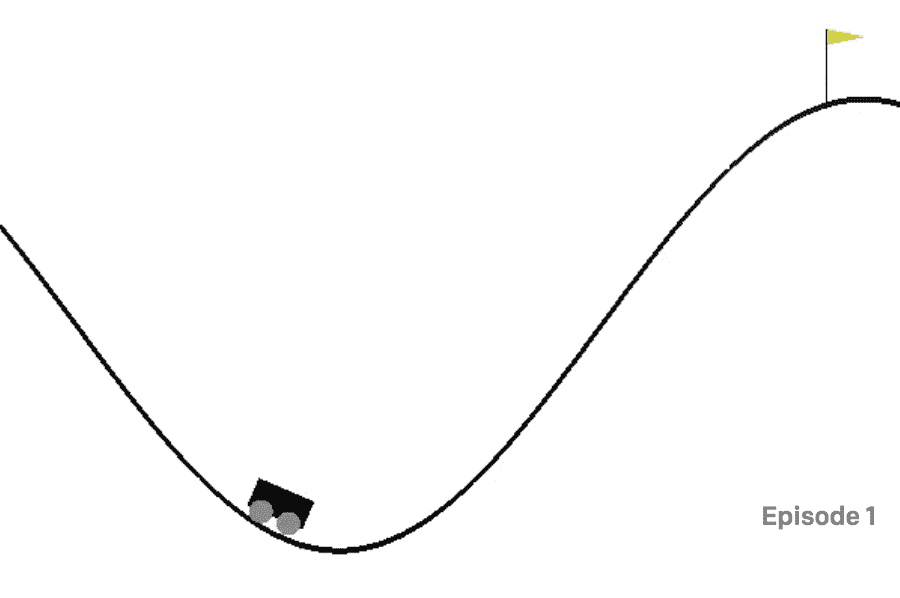

在一维赛道上，赛车位于-1.2(最左边)到 0.6(最右边)之间，球门(黄旗)位于 0.5。汽车的引擎不够强劲，不能一次过把它开到顶，所以要来回开才能造势。因此，每个步骤都有三个独立的动作:

*   向左推(0)
*   无推送(1)
*   向右推(2)

环境有两种状态:

*   汽车的位置:这是一个从-1.2 到 0.6 的连续变量。
*   汽车的速度:这是一个从-0.07 到 0.07 的连续变量。

与每一步相关联的奖励是-1，直到汽车到达目标(0.5 的位置)。

一集在车到达目标位置(很明显)，或者 200 步后结束。


# 做好准备

要运行山地汽车环境，让我们首先在环境表中搜索它的名称—[https://github.com/openai/gym/wiki/Table-of-environments](https://github.com/openai/gym/wiki/Table-of-environments)。我们得到`MountainCar-v0`并且还知道观察空间由两个浮点数表示，并且有三个可能的动作(左= 0，无推= 1，右= 2)。


# 怎么做...

让我们按照以下步骤模拟山地汽车环境:

1.  我们导入体育馆库并创建山地汽车环境的实例:

```py
>>> import gym
>>> env = gym.envs.make("MountainCar-v0")
>>> n_action = env.action_space.n
>>> print(n_action)
3
```

2.  重置环境:

```py
>>> env.reset()
array([-0.52354759,  0\. ])
```

汽车从一个状态`[-0.52354759, 0.]`出发，这意味着初始位置在-0.5 左右，速度为 0。您可能会看到不同的初始位置，因为它是从-0.6 到-0.4 随机生成的。

3.  现在让我们采取一种天真的方法:我们只是一直把车推到右边，希望它能到达顶部:

```py
>>> is_done = False
 >>> while not is_done:
 ...     next_state, reward, is_done, info = env.step(2)
 ...     print(next_state, reward, is_done)
 ...     env.render()
 >>> env.render()
 [-0.49286453  0.00077561] -1.0 False
 [-0.4913191   0.00154543] -1.0 False
 [-0.48901538  0.00230371] -1.0 False
 [-0.48597058  0.0030448 ] -1.0 False
 ......
 ......
 [-0.29239555 -0.0046231 ] -1.0 False
 [-0.29761694 -0.00522139] -1.0 False
 [-0.30340632 -0.00578938] -1.0 True
```

4.  关闭环境:

```py
env.close()
```


# 它是如何工作的...

在*步骤 3* 中，状态(位置和速度)保持相应变化，每一步的奖励为-1。

您还会在视频中看到，汽车反复向右和向左移动，但最终没有到达顶部:

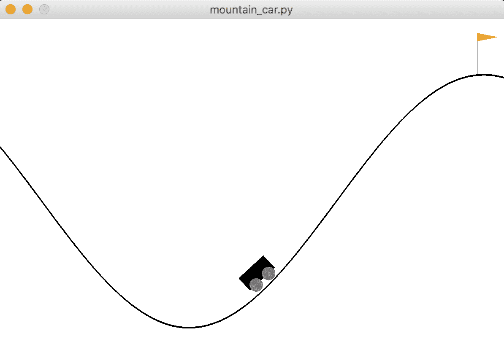

可想而知，山地车问题并没有你想象的那么简单。我们需要来回驾驶汽车来增加动力。而且状态变量是连续的，这意味着一个表`lookup` / `update`的方法(比如 TD 方法)是行不通的。在下一个食谱中，我们将使用 FA 方法解决山地车问题。


# 用梯度下降近似法估计 Q 函数

从这个菜谱开始，我们将开发 FA 算法来解决具有连续状态变量的环境。我们将从使用线性函数和梯度下降来近似 Q 函数开始。

**FA** 的主要思想是利用一组**特征**来估计 Q 值。这对于具有较大状态空间的进程非常有用，在这种情况下，Q 表会变得很大。有几种方法将特征映射到 Q 值；例如，线性近似是特征和神经网络的线性组合。对于线性近似，动作的状态值函数由以下特征的加权和表示:

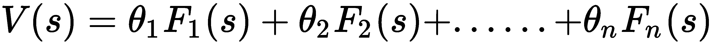

这里，F1(s)，F2(s)，……，Fn(s)是给定输入状态 s 的一组特征；θ1, θ2,......，θn 是应用于相应特征的权重。或者我们可以把它表述为 V(s)=θF(s)。

正如我们在 TD 方法中看到的，我们有以下公式来计算未来状态:

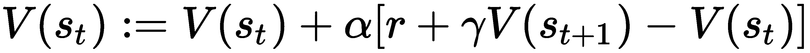

这里 r 是从状态 st 转换到 st+1 得到的关联报酬，α是学习率，γ是折现因子。让我们将δ表示为 TD 误差项，现在我们得到:

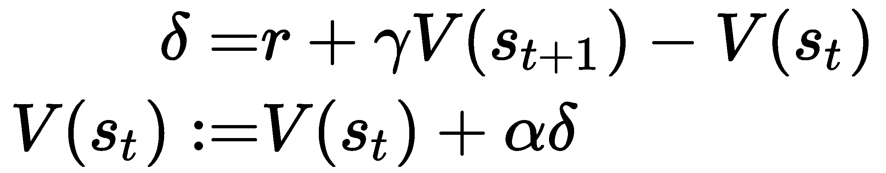

这是梯度下降的精确形式。因此，学习的目标是找到最佳权重θ，以最佳地近似每个可能动作的状态值函数 V(s)。在这种情况下，我们试图最小化的损失函数类似于回归问题中的损失函数，即实际值和估计值之间的均方误差。在每集的每一步之后，我们都有一个真实状态值的新估计，并且我们将权重θ向其最佳值移动一步。

另一个需要注意的是给定输入状态 s 的特征集 F(s ),一个好的特征集能够捕捉不同输入的动态。通常，我们可以在各种参数下使用一组高斯函数生成一组特征，包括均值和标准差。


# 怎么做...

我们基于线性函数开发 Q 函数近似器如下:

1.  导入所有必需的包:

```py
>>> import torch
>>> from torch.autograd import Variable
>>> import math
```

该变量包装张量并支持反向传播。

2.  然后，启动线性函数的`Estimator`类的`__init__method`:

```py
>>> class Estimator():
 ...     def __init__(self, n_feat, n_state, n_action, lr=0.05):
 ...         self.w, self.b = self.get_gaussian_wb(n_feat, n_state)
 ...         self.n_feat = n_feat
 ...         self.models = []
 ...         self.optimizers = []
 ...         self.criterion = torch.nn.MSELoss()
 ...         for _ in range(n_action):
 ...             model = torch.nn.Linear(n_feat, 1)
 ...             self.models.append(model)
 ...             optimizer = torch.optim.SGD(model.parameters(), lr)
 ...             self.optimizers.append(optimizer)
```

它接受三个参数:特征的数量，`n_feat`；状态的数量；以及动作次数。它首先从高斯分布中为特征函数 F(s)生成一组系数`w`和`b`，我们将在后面定义。然后它初始化`n_action`线性模型，其中每个模型对应一个动作，并相应地初始化`n_action`优化器。对于线性模型，我们这里使用 PyTorch 的线性模块。它接收`n_feat`个单元并生成一个输出，这是一个动作的预测状态值。随机梯度下降优化器也与每个线性模型一起被初始化。每个优化器的学习率是 0.05。损失函数是均方误差。

3.  我们现在继续定义`get_gaussian_wb`方法，它为特征函数 F(s)生成一组系数 w 和 b:

```py
>>>     def get_gaussian_wb(self, n_feat, n_state, sigma=.2):
 ...         """
 ...         Generate the coefficients of the feature set from 
             Gaussian distribution
 ...         @param n_feat: number of features
 ...         @param n_state: number of states
 ...         @param sigma: kernel parameter
 ...         @return: coefficients of the features
 ...         """
 ...         torch.manual_seed(0)
 ...         w = torch.randn((n_state, n_feat)) * 1.0 / sigma
 ...         b = torch.rand(n_feat) * 2.0 * math.pi
 ...         return w, b
```

系数`w`是由`n_state`矩阵构成的`n_feat`，其值由参数 sigma 定义的方差的高斯分布生成；偏差 b 是从[0，2π]的均匀分布产生的`n_feat`值的列表。

请注意，设置一个特定的随机种子(`torch.manual_seed(0)`)非常重要，这样，在不同的运行中，一个状态总是可以映射到相同的特征。

4.  接下来，我们开发基于`w`和`b`将状态空间映射到特征空间的函数:

```py
>>>     def get_feature(self, s):
 ...         """
 ...         Generate features based on the input state
 ...         @param s: input state
 ...         @return: features
 ...         """
 ...         features = (2.0 / self.n_feat) ** .5 * torch.cos(
                  torch.matmul(torch.tensor(s).float(), self.w) 
                  + self.b)
 ...         return features
```

状态 s 的特征生成如下:

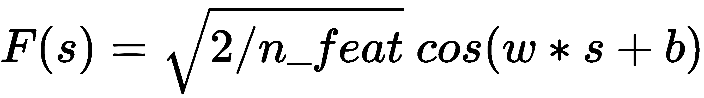

使用余弦变换确保无论输入状态值如何，特征都在[-1，1]的范围内。

5.  由于我们已经定义了模型和特征生成，现在我们开发训练方法，该方法使用数据点更新线性模型:

```py
>>>     def update(self, s, a, y):
 ...         """
 ...         Update the weights for the linear estimator with 
             the given training sample
 ...         @param s: state
 ...         @param a: action
 ...         @param y: target value
 ...         """
 ...         features = Variable(self.get_feature(s))
 ...         y_pred = self.models[a](features)
 ...         loss = self.criterion(y_pred, 
                     Variable(torch.Tensor([y])))
 ...         self.optimizers[a].zero_grad()
 ...         loss.backward()
 ...         self.optimizers[a].step()
```

给定一个训练数据点，它首先用`get_feature`方法将状态转换到特征空间。然后将结果特征输入给定动作的当前线性模型`a`。预测结果与目标值一起用于计算损耗和梯度。然后通过反向传播更新权重θ。

6.  下一个操作涉及使用当前模型预测给定状态下每个动作的状态值:

```py
>>>     def predict(self, s):
 ...         """
 ...         Compute the Q values of the state using 
                 the learning model
 ...         @param s: input state
 ...         @return: Q values of the state
 ...         """
 ...         features = self.get_feature(s)
 ...         with torch.no_grad():
 ...             return torch.tensor([model(features) 
                                     for model in self.models])
```

`Estimator` 班到此为止。

7.  现在，让我们玩一些虚拟数据。首先，创建一个`Estimator`对象，它将一个二维状态映射到一个 10 维特征，并使用 1 个可能的动作:

```py
>>> estimator = Estimator(10, 2, 1)
```

8.  现在，从状态[0.5，0.1]中生成特征:

```py
>>> s1 = [0.5, 0.1]
>>> print(estimator.get_feature(s1))
tensor([ 0.3163, -0.4467, -0.0450, -0.1490,  0.2393, -0.4181, -0.4426, 0.3074,
         -0.4451,  0.1808])
```

如您所见，结果特征是一个 10 维向量。

9.  在状态列表和目标状态值上训练估计器(在这个例子中我们只有一个动作):

```py
>>> s_list = [[1, 2], [2, 2], [3, 4], [2, 3], [2, 1]]
>>> target_list = [1, 1.5, 2, 2, 1.5]
>>> for s, target in zip(s_list, target_list):
...     feature = estimator.get_feature(s)
...     estimator.update(s, 0, target)
```

10.  最后，我们使用经过训练的线性模型来预测新状态的值:

```py
>>> print(estimator.predict([0.5, 0.1]))
 tensor([0.6172])
>>> print(estimator.predict([2, 3]))
 tensor([0.8733])
```

状态[0.5，0.1]和动作的预测值是 0.5847，而[2，3]的预测值是 0.7969。


# 它是如何工作的...

FA 方法用比 TD 方法中用 Q 表计算精确值更紧凑的模型来近似状态值。FA 首先将状态空间映射到特征空间，然后使用回归模型估计 Q 值。这样，学习过程就受到了监督。类型回归模型包括线性模型和神经网络。在这个配方中，我们开发了一个基于线性回归的估计器。它根据从高斯分布中采样的系数生成特征。它通过梯度下降更新给定训练数据的线性模型的权重，并预测给定状态的 Q 值。

FA 极大地减少了要学习的状态的数量，而在 TD 方法中学习数百万个状态是不可行的。更重要的是，它能够推广到看不见的状态，因为状态值是由给定输入状态的估计函数参数化的。


# 请参见

如果您不熟悉线性回归或梯度下降，请查阅以下材料:

*   [https://towards data science . com/step-by-step-by-step-tutorial-on-linear-regression-with-random-gradient-descent-1 d35b 088 a843](https://towardsdatascience.com/step-by-step-tutorial-on-linear-regression-with-stochastic-gradient-descent-1d35b088a843)
*   [https://machine learning mastery . com/simple-linear-regression-tutorial-for-machine-learning/](https://machinelearningmastery.com/simple-linear-regression-tutorial-for-machine-learning/)


# 用线性函数近似发展 Q 学习

在前一个配方中，我们开发了一个基于线性回归的价值估计器。作为我们 FA 旅程的一部分，我们将在 Q-learning 中使用估计器。

如我们所见，Q-learning 是一种非策略学习算法，它基于以下等式更新 Q 函数:


这里， *s'* 是采取行动后的结果状态， *a* ，in 状态，*s*； *r* 是关联奖励；α是学习率；γ是贴现因子。此外， [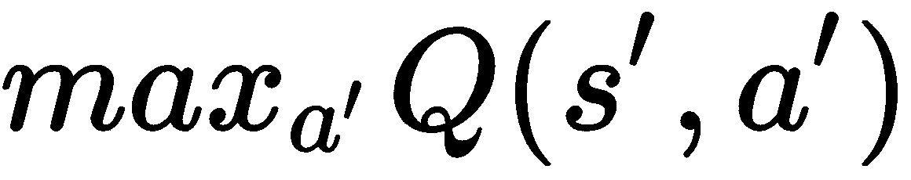] 意味着行为策略是贪婪的，其中选择状态`s'`中的最高 Q 值来生成学习数据。在 Q-learning 中，基于ε-贪婪策略采取行动。类似地，使用 FA 的 Q 学习具有以下误差项:

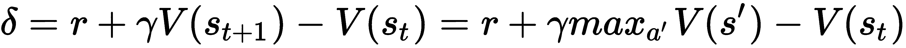

我们的学习目标是将误差项降至零，这意味着估计的 V(st)应满足以下等式:

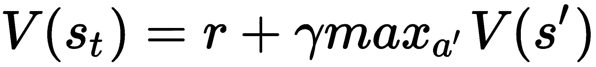

现在，目标变成寻找最佳权重θ，如 V(s)=θF(s ),以最好地近似每个可能动作的状态值函数 V(s)。在这种情况下，我们试图最小化的损失函数类似于回归问题中的损失函数，即实际值和估计值之间的均方误差。


# 怎么做...

让我们从`linear_estimator.py`中使用线性估计器`Estimator`来开发 FA 的 Q 学习，我们在之前的配方*中开发了线性估计器`Estimator`，使用梯度下降近似估计 Q 函数*:

1.  导入必要的模块并创建山地汽车环境:

```py
>>> import gym
>>> import torch
>>> from linear_estimator import Estimator >>> env = gym.envs.make("MountainCar-v0")
```

2.  然后，开始定义ε-贪婪策略:

```py
>>> def gen_epsilon_greedy_policy(estimator, epsilon, n_action):
 ...     def policy_function(state):
 ...         probs = torch.ones(n_action) * epsilon / n_action
 ...         q_values = estimator.predict(state)
 ...         best_action = torch.argmax(q_values).item()
 ...         probs[best_action] += 1.0 - epsilon
 ...         action = torch.multinomial(probs, 1).item()
 ...         return action
 ...     return policy_function
```

它接受一个参数ε，其值从 0 到 1，|A|，可能的动作数量，以及用于预测状态-动作值的估计器。以ε/ |A|的概率采取每个动作，以 1- ε + ε/ |A|的概率选择具有最高预测状态-动作值的动作。

3.  现在，定义使用 FA 执行 Q 学习的函数:

```py
>>> def q_learning(env, estimator, n_episode, gamma=1.0, 
                    epsilon=0.1, epsilon_decay=.99):
 ...     """
 ...     Q-Learning algorithm using Function Approximation
 ...     @param env: Gym environment
 ...     @param estimator: Estimator object
 ...     @param n_episode: number of episodes
 ...     @param gamma: the discount factor
 ...     @param epsilon: parameter for epsilon_greedy
 ...     @param epsilon_decay: epsilon decreasing factor
 ...     """
 ...     for episode in range(n_episode):
 ...         policy = gen_epsilon_greedy_policy(estimator, 
                   epsilon * epsilon_decay ** episode, n_action)
 ...         state = env.reset()
 ...         is_done = False
 ...         while not is_done:
 ...             action = policy(state)
 ...             next_state, reward, is_done, _ = env.step(action)
 ...             q_values_next = estimator.predict(next_state)
 ...             td_target = reward + 
                             gamma * torch.max(q_values_next)
 ...             estimator.update(state, action, td_target)
 ...             total_reward_episode[episode] += reward
 ...
 ...             if is_done:
 ...                 break
 ...             state = next_state
```

`q_learning()`功能执行以下任务:

*   在每一集，创建一个ε因子衰减到 99%的ε贪婪策略(例如，如果第一集的ε为 0.1，则第二集的ε为 0.099)。
*   运行一集:在每一步中，采取一个动作， *a* ，与ε贪婪策略保持一致；使用当前估计器计算新状态的 *Q* 值；然后，计算目标值 [] ，并使用它来训练估计器。
*   运行`n_episode`集并记录每集的总奖励。

4.  我们将特征的数量指定为`200`，将学习速率指定为`0.03`，并相应地创建一个估计器:

```py
>>> n_state = env.observation_space.shape[0]
>>> n_action = env.action_space.n
>>> n_feature = 200
>>> lr = 0.03 >>> estimator = Estimator(n_feature, n_state, n_action, lr)
```

5.  我们与 FA 一起进行了 300 集的 Q-learning，并且还记录了每集的总奖励:

```py
>>> n_episode = 300
>>> total_reward_episode = [0] * n_episode
>>> q_learning(env, estimator, n_episode, epsilon=0.1)
```

6.  然后，我们展示了剧集长度随时间变化的曲线图:

```py
>>> import matplotlib.pyplot as plt
>>> plt.plot(total_reward_episode)
>>> plt.title('Episode reward over time')
>>> plt.xlabel('Episode')
>>> plt.ylabel('Total reward')
>>> plt.show()
```


# 它是如何工作的...

如您所见，在使用 FA 的 Q 学习中，它试图学习近似模型的最佳权重，以便最好地估计 Q 值。它类似于 TD Q-learning，因为它们都从另一个策略生成学习数据。它更适合于具有大状态空间的环境，因为 Q 值由一组回归模型和潜在特征来近似，而 TD Q 学习需要精确的表查找来更新 Q 值。具有 FA 的 Q 学习在每一步之后更新回归模型的事实也使得它类似于 TD Q 学习方法。

在 Q 学习模型被训练之后，我们只需要使用回归模型来预测所有可能动作的状态-动作值，并挑选给定状态下具有最大值的动作。在*第 6 步*中，我们导入`pyplot`来绘制所有的奖励，这将导致如下图:

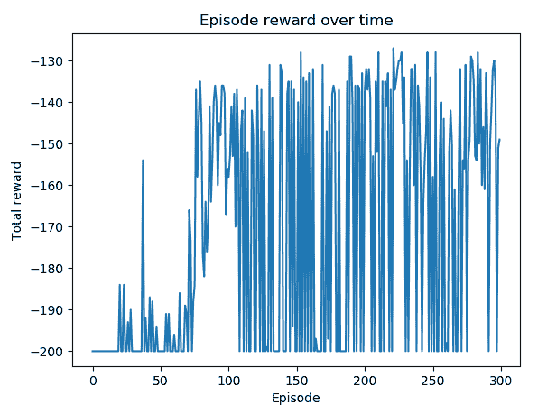

你可以看到，在大多数剧集中，在最初的 25 次迭代后，汽车在大约 130 到 160 步内到达山顶。


# 用线性函数近似开发 SARSA

我们刚刚使用前一个配方中的非策略 Q 学习算法解决了山地汽车问题。现在，我们将使用策略上的**状态-行为-奖励-状态-行为** ( **SARSA** )算法(当然是 FA 版本)。

一般而言，SARSA 算法基于以下等式更新 Q 函数:

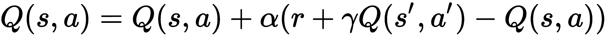

这里， *s'* 是采取行动后的结果状态， *a* ，处于状态*s*； *r* 是关联奖励；α是学习率；γ是贴现因子。我们简单地选取下一个动作 a’，也是通过遵循ε-贪婪策略来更新 *Q* 值。并且在下一步中采取动作*a’*。因此，带 FA 的 SARSA 具有以下误差项:

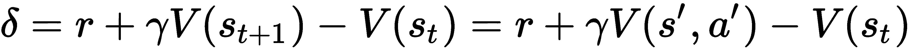

我们的学习目标是将误差项降至零，这意味着估计的 V(st)应满足以下等式:

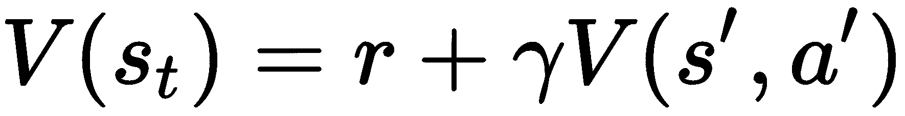

现在，目标变成寻找最佳权重θ，如 V(s)=θF(s ),以最好地近似每个可能动作的状态值函数 V(s)。在这种情况下，我们试图最小化的损失函数类似于回归问题中的损失函数，即实际值和估计值之间的均方误差。


# 怎么做...

让我们使用来自`linear_estimator.py`的线性估计量`Estimator`来开发具有 FA 的 SARSA，我们在配方*中开发了该线性估计量，使用梯度下降近似法估计 Q 函数*:

1.  导入必要的模块并创建山地汽车环境:

```py
>>> import gym
>>> import torch
>>> from linear_estimator import Estimator >>> env = gym.envs.make("MountainCar-v0")
```

2.  我们将重用在之前的配方中开发的ε贪婪策略函数，*使用线性函数近似开发 Q 学习*。
3.  现在，用 FA 定义执行 SARSA 算法的函数:

```py
>>> def sarsa(env, estimator, n_episode, gamma=1.0, 
                 epsilon=0.1, epsilon_decay=.99):
 ...     """
 ...     SARSA algorithm using Function Approximation
 ...     @param env: Gym environment
 ...     @param estimator: Estimator object
 ...     @param n_episode: number of episodes
 ...     @param gamma: the discount factor
 ...     @param epsilon: parameter for epsilon_greedy
 ...     @param epsilon_decay: epsilon decreasing factor
 ...     """
 ...     for episode in range(n_episode):
 ...         policy = gen_epsilon_greedy_policy(estimator, 
                             epsilon * epsilon_decay ** episode,
                             env.action_space.n)
 ...         state = env.reset()
 ...         action = policy(state)
 ...         is_done = False
 ...
 ...         while not is_done:
 ...             next_state, reward, done, _ = env.step(action)
 ...             q_values_next = estimator.predict(next_state)
 ...             next_action = policy(next_state)
 ...             td_target = reward + 
                             gamma * q_values_next[next_action]
 ...             estimator.update(state, action, td_target)
 ...             total_reward_episode[episode] += reward
 ...
 ...             if done:
 ...                 break
 ...             state = next_state
 ...             action = next_action
```

`sarsa()`功能执行以下任务:

*   在每集中，创建一个ε因子衰减到 99%的ε贪婪策略。
*   运行一集:在每一步中，采取一个动作， *a* ，与ε贪婪策略保持一致；在新的状态下，根据ε-贪婪策略选择新的动作；然后，使用当前估计器计算新状态的 Q 值；计算目标值， [] ，并使用它来更新估计器。
*   运行`n_episode`集并记录每集的总奖励。

4.  我们指定特征的数量为 200，学习率为 0.03，并相应地创建一个估计器:

```py
>>> n_state = env.observation_space.shape[0]
>>> n_action = env.action_space.n
>>> n_feature = 200
>>> lr = 0.03
>>> estimator = Estimator(n_feature, n_state, n_action, lr)
```

5.  然后，我们与 FA 一起执行 SARSA 300 集，并记录每集的总奖励:

```py
>>> n_episode = 300
>>> total_reward_episode = [0] * n_episode
>>> sarsa(env, estimator, n_episode, epsilon=0.1)
```

6.  然后，我们展示了剧集长度随时间变化的曲线图:

```py
>>> import matplotlib.pyplot as plt
>>> plt.plot(total_reward_episode)
>>> plt.title('Episode reward over time')
>>> plt.xlabel('Episode')
>>> plt.ylabel('Total reward')
>>> plt.show()
```


# 它是如何工作的...

具有 FA 的 SARSA 试图学习近似模型的最佳权重，以便最好地估计 Q 值。它通过采取在相同策略下选择的行动来优化估计，而不是在 Q-learning 中从另一个策略中学习经验。

类似地，在 SARSA 模型被训练之后，我们只需要使用回归模型来预测所有可能动作的状态-动作值，并挑选给定状态下具有最大值的动作。

在*第 6 步*中，我们用`pyplot`绘制奖励，这将导致如下图:

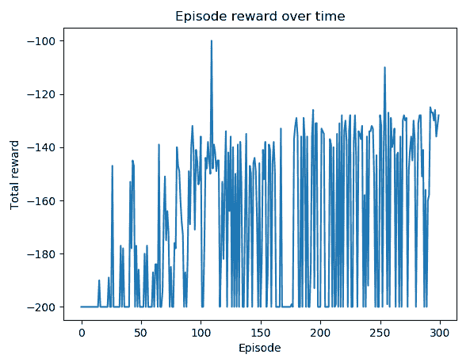

你可以看到，在大多数剧集中，在第一个 100 集之后，汽车到达山顶大约需要 130 到 160 步。


# 使用经验回放合并批处理

在前两个配方中，我们开发了两个 FA 学习算法:分别是基于策略的和基于策略的。在这个方法中，我们将通过引入经验重放来提高非策略 Q 学习的性能。

**体验回放**意味着我们存储代理在一集期间的体验，而不是运行 Q-learning。经验重放的学习阶段变成两个阶段:获得经验和在一集结束后基于获得的经验更新模型。具体来说，体验(也称为缓冲，或记忆)包括过去的状态，采取的行动，收到的奖励，以及一集中单个步骤的下一个状态。

在学习阶段，从经验中随机抽取一定数量的数据点，用于训练学习模型。经验回放可以通过提供一组低相关性的样本来稳定训练，从而提高学习效率。


# 怎么做...

让我们使用来自`linear_estimator.py`的线性估计器`Estimator`将经验回放应用于 FA Q 学习，这是我们在之前的配方*中开发的，使用梯度下降近似估计 Q 函数*:

1.  导入必要的模块并创建山地汽车环境:

```py
>>> import gym
 >>> import torch
 >>> from linear_estimator import Estimator
 >>> from collections import deque
 >>> import random >>> env = gym.envs.make("MountainCar-v0")
```

2.  我们将重用在前面的*中开发的ε贪婪策略函数，使用线性函数近似*配方开发 Q 学习。
3.  然后，指定特征的数量为`200`，学习速率为`0.03`，并相应地创建一个估计器:

```py
>>> n_state = env.observation_space.shape[0]
 >>> n_action = env.action_space.n
 >>> n_feature = 200
 >>> lr = 0.03
 >>> estimator = Estimator(n_feature, n_state, n_action, lr)
```

4.  接下来，定义保存体验的缓冲区:

```py
>>> memory = deque(maxlen=400)
```

只要队列中有超过 400 个样本，新的样本将被添加到队列中，旧的样本将被删除。

5.  现在，定义使用经验回放执行 FA Q-learning 的函数:

```py
>>> def q_learning(env, estimator, n_episode, replay_size, 
                 gamma=1.0, epsilon=0.1, epsilon_decay=.99):
 ...     """
 ...     Q-Learning algorithm using Function Approximation, 
             with experience replay
 ...     @param env: Gym environment
 ...     @param estimator: Estimator object
 ...     @param replay_size: number of samples we use to 
                             update the model each time
 ...     @param n_episode: number of episode
 ...     @param gamma: the discount factor
 ...     @param epsilon: parameter for epsilon_greedy
 ...     @param epsilon_decay: epsilon decreasing factor
 ...     """
 ...     for episode in range(n_episode):
 ...         policy = gen_epsilon_greedy_policy(estimator, 
                             epsilon * epsilon_decay ** episode,
                             n_action)
 ...         state = env.reset()
 ...         is_done = False
 ...         while not is_done:
 ...             action = policy(state)
 ...             next_state, reward, is_done, _ = env.step(action)
 ...             total_reward_episode[episode] += reward
 ...             if is_done:
 ...                 break
 ...
 ...             q_values_next = estimator.predict(next_state)
 ...             td_target = reward + 
                             gamma * torch.max(q_values_next)
 ...             memory.append((state, action, td_target))
 ...             state = next_state
 ...
 ...         replay_data = random.sample(memory, 
                              min(replay_size, len(memory)))
 ...         for state, action, td_target in replay_data:
 ...             estimator.update(state, action, td_target)
```

该功能执行以下任务:

*   在每一集，创建一个ε因子衰减到 99%的ε贪婪策略(例如，如果第一集的ε为 0.1，则第二集的ε为 0.099)。
*   运行一集:在每一步中，采取一个动作， *a* ，与ε贪婪策略保持一致；使用当前估计器计算新状态的 *Q* 值；然后，计算目标值 [] ，并将状态、动作和目标值元组存储在缓冲存储器中。

*   每集之后，从缓冲存储器中随机选择`replay_size`个样本，并使用它们来训练估计器。
*   运行`n_episode`集并记录每集的总奖励。

6.  我们通过 1000 集的经验回放来执行 Q-learning:

```py
>>> n_episode = 1000
```

我们需要更多的剧集，只是因为模型没有得到足够的训练，所以代理在早期剧集中采取随机步骤。

我们将重放样本大小设置为 190:

```py
>>> replay_size = 190
```

我们还记录每集的总奖励:

```py
>>> total_reward_episode = [0] * n_episode
>>> q_learning(env, estimator, n_episode, replay_size, epsilon=0.1)
```

7.  现在，我们展示剧集长度随时间变化的曲线图:

```py
>>> import matplotlib.pyplot as plt
>>> plt.plot(total_reward_episode)
>>> plt.title('Episode reward over time')
>>> plt.xlabel('Episode')
>>> plt.ylabel('Total reward')
>>> plt.show()
```

这将导致以下情节:

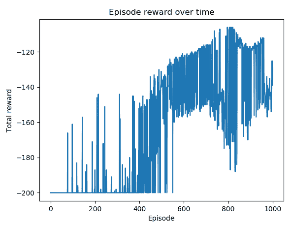

你可以看到，带有经验重放的 Q-learning 的性能变得稳定得多。前 500 集之后大部分剧集的奖励都停留在-160 到-120 的范围内。


# 它是如何工作的...

在这个食谱中，我们在 FA Q-learning 的帮助下解决了山地车问题，同时还有经验回放。它优于纯粹的 FA Q-learning，因为我们通过经验重放收集较少的校正训练数据。我们没有冲进去训练估计器，而是先将我们在发作期间观察到的数据点存储在一个缓冲区中，然后我们从缓冲区中随机选择一批样本并训练估计器。这形成了一个输入数据集，其中样本彼此更加独立，从而使训练更加稳定和有效。


# 用神经网络函数近似发展 Q 学习

正如我们之前提到的，我们也可以使用神经网络作为近似函数。在这个食谱中，我们将使用 Q 学习和神经网络近似来解决山地汽车环境。

FA 的目标是使用一组特征通过回归模型来估计 Q 值。使用神经网络作为估计模型，我们通过增加灵活性(神经网络中的多层)和由隐藏层中的非线性激活引入的非线性来增加回归能力。Q 学习模型的其余部分与线性近似模型非常相似。我们还使用梯度下降来训练网络。学习的最终目标是为每个可能的动作找到网络的最佳权重，以最佳地近似状态值函数 V(s)。我们试图最小化的损失函数也是实际值和估计值之间的均方误差。


# 怎么做...

让我们从实现基于神经网络的估计器开始。我们将重复使用我们在*用梯度下降近似法*估计 Q 函数中开发的线性估计器的大部分。不同的是，我们用一个隐藏层连接输入层和输出层，后面是一个激活函数，在这种情况下是一个 ReLU(整流线性单位)函数。所以，我们只需要修改`__init__`方法如下:

```py
>>> class Estimator():
 ...     def __init__(self, n_feat, n_state, n_action, lr=0.05):
 ...         self.w, self.b = self.get_gaussian_wb(n_feat, n_state)
 ...         self.n_feat = n_feat
 ...         self.models = []
 ...         self.optimizers = []
 ...         self.criterion = torch.nn.MSELoss()
 ...         for _ in range(n_action):
 ...             model = torch.nn.Sequential(
 ...                              torch.nn.Linear(n_feat, n_hidden),
 ...                              torch.nn.ReLU(),
 ...                              torch.nn.Linear(n_hidden, 1)
 ...             )
 ...             self.models.append(model)
 ...             optimizer = torch.optim.Adam(model.parameters(), lr)
 ...             self.optimizers.append(optimizer)
```

如您所见，隐藏层有`n_hidden`个节点，一个 ReLU 激活`torch.nn.ReLU()`出现在隐藏层之后，随后是产生估计值的输出层。

神经网络`Estimator`的其他部分与线性`Estimator`相同。你可以把它们复制到`nn_estimator.py`文件中。

现在，我们继续使用具有如下经验重放的神经网络进行 Q 学习:

1.  从我们刚刚开发的`nn_estimator.py`导入必要的模块，包括神经网络估计器`Estimator`，并创建山地汽车环境:

```py
>>> import gym
>>> import torch
>>> from nn_estimator import Estimator
>>> from collections import deque
>>> import random >>> env = gym.envs.make("MountainCar-v0")
```

2.  我们将重复使用在*使用线性函数近似法开发 Q 学习*中开发的ε贪婪策略函数。
3.  然后，我们指定特征的数量为 200，学习率为 0.001，隐藏层的大小为 50，并相应地创建一个估计器:

```py
>>> n_state = env.observation_space.shape[0]
>>> n_action = env.action_space.n
>>> n_feature = 200
>>> n_hidden = 50
>>> lr = 0.001 
>>> estimator = Estimator(n_feature, n_state, n_action, n_hidden, lr)
```

4.  接下来，定义保存体验的缓冲区:

```py
>>> memory = deque(maxlen=300)
```

只要队列中有超过 300 个样本，新的样本将被添加到队列中，旧的样本将被删除。

5.  我们将重用我们在之前的配方中开发的`q_learning`函数，*使用经验回放合并批处理。*它通过经验回放来执行 FA Q-learning。

6.  我们使用 1000 集的经验重放来执行 Q-learning，并将重放样本大小设置为 200。

```py
>>> n_episode = 1000
>>> replay_size = 200
```

我们还记录每集的总奖励:

```py
>>> total_reward_episode = [0] * n_episode
>>> q_learning(env, estimator, n_episode, replay_size, epsilon=0.1)
```

7.  然后，我们展示了剧集长度随时间变化的曲线图:

```py
>>> import matplotlib.pyplot as plt
>>> plt.plot(total_reward_episode)
>>> plt.title('Episode reward over time')
>>> plt.xlabel('Episode')
>>> plt.ylabel('Total reward')
>>> plt.show()
```


# 它是如何工作的...

使用神经网络的 FA 非常类似于线性函数近似。它不使用简单的线性函数，而是使用神经网络将特征映射到目标值。该算法的其余部分本质上是相同的，但是由于神经网络和非线性激活的更复杂的架构，因此它具有更高的灵活性，并且因此具有更高的预测能力。

在*步骤 7* 中，我们绘制了一段时间内的剧集长度，这将导致以下绘图:

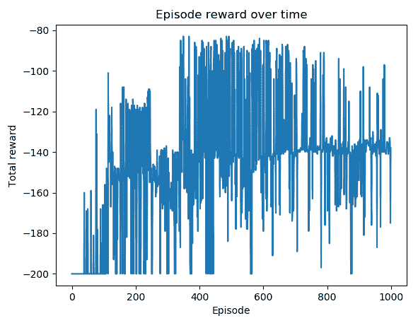

你可以看到，使用神经网络的 Q-learning 的性能优于使用线性函数。前 500 集之后大部分剧集的奖励都停留在-140 到-85 的范围内。


# 请参见

如果你想重温你的神经网络知识，请查阅以下材料:

*   [https://py torch . org/tutorials/初学者/blitz/neural _ networks _ tutorial . html](https://pytorch.org/tutorials/beginner/blitz/neural_networks_tutorial.html)
*   [https://www . cs . Toronto . edu/~ jlu cas/teaching/CSC 411/lections/tut 5 _ 讲义. pdf](https://www.cs.toronto.edu/~jlucas/teaching/csc411/lectures/tut5_handout.pdf)


# 用函数近似法解决极点问题

这是本章的额外配方，我们将使用 FA 解决横竿问题。

正如我们在[第 1 章](61027c1b-6d3a-4406-b069-7320c1818093.xhtml)、*强化学习入门和 PyTorch* 中看到的，我们在*模拟 CartPole 环境*的配方中模拟了 CartPole 环境，并分别使用随机搜索、爬山和策略梯度算法求解环境，在配方中包括*实现和评估随机搜索策略*、*开发爬山算法*和*开发策略梯度算法*。现在，让我们试着用我们在这一章中谈到的方法来解决这个问题。


# 怎么做...

我们演示了基于神经网络的无经验回放的 FAs 解决方案，如下所示:

1.  导入必要的模块，包括神经网络`Estimator`，来自我们在之前的配方中开发的`nn_estimator.py`、*使用神经网络函数近似开发 Q-learning*，并创建一个 CartPole 环境:

```py
>>> import gym
>>> import torch
>>> from nn_estimator import Estimator >>> env = gym.envs.make("CartPole-v0")
```

2.  我们将重用在之前的配方中开发的ε贪婪策略函数，*使用线性函数近似开发 Q 学习*。

3.  然后，我们指定特征的数量为 400(注意，CartPole 环境的状态空间是 4 维的)，学习率为 0.01，隐藏层的大小为 100，并相应地创建神经网络估计器:

```py
>>> n_state = env.observation_space.shape[0]
 >>> n_action = env.action_space.n
 >>> n_feature = 400
 >>> n_hidden = 100
 >>> lr = 0.01 
 >>> estimator = Estimator(n_feature, n_state, n_action, n_hidden, lr)
```

4.  我们将重用我们在之前的配方中开发的`q_learning`函数，*用线性函数近似*开发 Q 学习。这执行 FA Q 学习。

5.  我们与 FA 一起执行了 1000 集的 Q-learning，并且还记录了每集的总奖励:

```py
>>> n_episode = 1000
 >>> total_reward_episode = [0] * n_episode
 >>> q_learning(env, estimator, n_episode, epsilon=0.1)
```

6.  最后，我们展示了剧集长度随时间变化的曲线图:

```py
>>> import matplotlib.pyplot as plt
 >>> plt.plot(total_reward_episode)
 >>> plt.title('Episode reward over time')
 >>> plt.xlabel('Episode')
 >>> plt.ylabel('Total reward')
 >>> plt.show()
```


# 它是如何工作的...

在这个配方中，我们用神经网络的 FA 算法解决了 CartPole 问题。请注意，该环境有一个四维观察空间，是山地汽车的两倍，因此我们直观地加倍了我们使用的功能数量，以及相应的隐藏层的大小。随意用神经网络来试验 SARSA，或者用经验重放来试验 Q-learning，看看它们中的哪一个表现更好。

在*步骤 6* 中，我们绘制了一段时间内的剧集长度，这将导致以下图形:

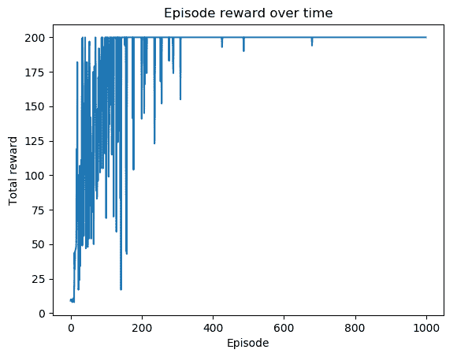

可以看到前 300 集之后大部分剧集的总奖励都是+200 的最大值。