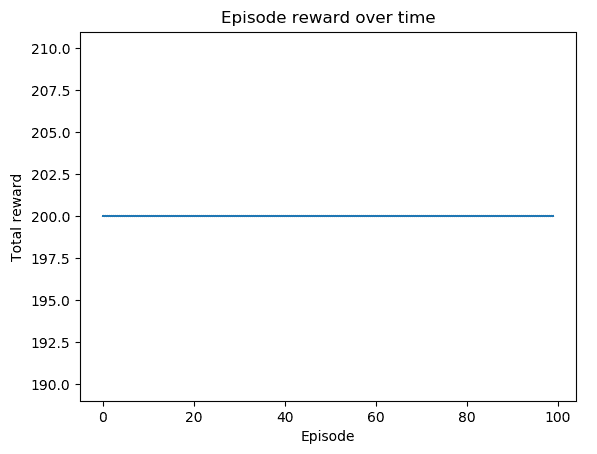

# 八、实现策略梯度和策略优化

在这一章中，我们将关注策略梯度方法，它是近年来最流行的强化学习技术之一。我们将从实现基本的增强算法开始，并继续改进算法基线。我们还将实现一个更强大的算法 actor-critic 及其变体，并应用它来解决翻筋斗和悬崖行走问题。我们还会经历一个有连续动作空间的环境，求助于高斯分布来求解。作为最后一个有趣的部分，我们将训练一个基于交叉熵方法的智能体来玩掷骰子游戏。

本章将介绍以下配方:

*   实现增强算法
*   用基线开发强化算法
*   实现演员-评论家算法
*   用演员-评论家算法解决悬崖行走
*   设置连续山地汽车环境
*   用优势行动者-批评家网络解决连续山地汽车环境
*   用交叉熵方法玩钢管舞


# 实现增强算法

最近的一份出版物规定，政策梯度方法越来越受欢迎。他们的学习目标是优化行动的概率分布，以便给定一个状态，更有回报的行动将具有更高的概率值。在本章的第一个配方中，我们将讨论增强算法，它是高级策略梯度方法的基础。

**增强**算法也被称为**蒙特卡洛策略梯度**，因为它基于蒙特卡洛方法优化策略。具体而言，它使用其当前策略从一集收集轨迹样本，并将其用于策略参数θ。策略梯度的学习目标函数如下:


其梯度可推导如下:


这里， [] 是收益，是到时间 t 为止的累计贴现回报， [] 是随机策略，决定在给定状态下采取某种行动的概率。由于策略更新是在整个情节结束并且收集了所有样本之后进行的，所以加强是一种偏离策略的算法。

在我们计算策略梯度之后，我们使用反向传播来更新策略参数。使用更新的策略，我们推出一集，收集一组样本，并使用它们来重复更新策略参数。

我们现在将开发增强算法来解决 cart pole([https://gym.openai.com/envs/CartPole-v0/](https://gym.openai.com/envs/CartPole-v0/))环境。


# 怎么做...

我们开发了增强算法来解决 CartPole 环境，如下所示:

1.  导入所有必需的包并创建一个 CartPole 实例:

```py
>>> import gym
>>> import torch
>>> import torch.nn as nn >>> env = gym.make('CartPole-v0')
```

2.  让我们从`PolicyNetwork` 类的`__init__method`开始，它使用神经网络近似策略:

```py
>>> class PolicyNetwork():
 ...     def __init__(self, n_state, n_action, n_hidden=50, lr=0.001):
 ...         self.model = nn.Sequential(
 ...                         nn.Linear(n_state, n_hidden),
 ...                         nn.ReLU(),
 ...                         nn.Linear(n_hidden, n_action),
 ...                         nn.Softmax(),
 ...                 )
 ...         self.optimizer = torch.optim.Adam( self.model.parameters(), lr)
```

3.  接下来，添加`predict`方法，该方法计算估计的策略:

```py
>>>     def predict(self, s):
 ...         """
 ...         Compute the action probabilities of state s using 
                 the learning model
 ...         @param s: input state
 ...         @return: predicted policy
 ...         """
 ...         return self.model(torch.Tensor(s))
```

4.  我们现在开发训练方法，该方法用在一集中收集的样本更新神经网络:

```py
>>>     def update(self, returns, log_probs):
 ...         """
 ...         Update the weights of the policy network given 
                 the training samples
 ...         @param returns: return (cumulative rewards) for 
                 each step in an episode
 ...         @param log_probs: log probability for each step
 ...         """
 ...         policy_gradient = []
 ...         for log_prob, Gt in zip(log_probs, returns):
 ...             policy_gradient.append(-log_prob * Gt)
 ...
 ...         loss = torch.stack(policy_gradient).sum()
 ...         self.optimizer.zero_grad()
 ...         loss.backward()
 ...         self.optimizer.step()
```

5.  `PolicyNetwork`类的最后一个方法是`get_action`，它根据预测的策略对给定状态的动作进行采样:

```py
>>>     def get_action(self, s):
 ...         """
 ...         Estimate the policy and sample an action, 
                 compute its log probability
 ...         @param s: input state
 ...         @return: the selected action and log probability
 ...         """
 ...         probs = self.predict(s)
 ...         action = torch.multinomial(probs, 1).item()
 ...         log_prob = torch.log(probs[action])
 ...         return action, log_prob
```

它还返回所选操作的对数概率，该概率将用作训练样本的一部分。

`PolicyNetwork`课到此为止！

6.  现在，我们可以继续开发带有策略网络模型的**增强**算法:

```py
>>> def reinforce(env, estimator, n_episode, gamma=1.0):
 ...     """
 ...     REINFORCE algorithm
 ...     @param env: Gym environment
 ...     @param estimator: policy network
 ...     @param n_episode: number of episodes
 ...     @param gamma: the discount factor
 ...     """
 ...     for episode in range(n_episode):
 ...         log_probs = []
 ...         rewards = []
 ...         state = env.reset()
 ...         while True:
 ...             action, log_prob = estimator.get_action(state)
 ...             next_state, reward, is_done, _ = env.step(action)
 ...             total_reward_episode[episode] += reward
 ...             log_probs.append(log_prob)
 ...             rewards.append(reward)
 ...
 ...             if is_done:
 ...                 returns = []
 ...                 Gt = 0
 ...                 pw = 0
 ...                 for reward in rewards[::-1]:
 ...                     Gt += gamma ** pw * reward
 ...                     pw += 1
 ...                     returns.append(Gt)
 ...                 returns = returns[::-1]
 ...                 returns = torch.tensor(returns)
 ...                 returns = (returns - returns.mean()) / (
 ...                     returns.std() + 1e-9)
 ...                 estimator.update(returns, log_probs)
 ...                 print('Episode: {}, total reward: {}'.format( episode, total_reward_episode[episode]))
 ...                 break
 ...
 ...             state = next_state
```

7.  我们指定策略网络的大小(输入、隐藏和输出层)、学习速率，然后相应地创建一个`PolicyNetwork`实例:

```py
>>> n_state = env.observation_space.shape[0]
>>> n_action = env.action_space.n
>>> n_hidden = 128
>>> lr = 0.003
>>> policy_net = PolicyNetwork(n_state, n_action, n_hidden, lr)
```

我们将贴现因子设为`0.9`:

```py
>>> gamma = 0.9
```

8.  我们使用刚刚开发的 500 集策略网络，通过强化算法进行学习，我们还跟踪每集的总奖励:

```py
>>> n_episode = 500
>>> total_reward_episode = [0] * n_episode
>>> reinforce(env, policy_net, n_episode, gamma)
```

9.  现在我们来展示一段时间内剧集奖励的剧情:

```py
>>> import matplotlib.pyplot as plt
>>> plt.plot(total_reward_episode)
>>> plt.title('Episode reward over time')
>>> plt.xlabel('Episode') >>> plt.ylabel('Total reward')
>>> plt.show()
```


# 它是如何工作的...

在*步骤 2* 中，为了简单起见，我们使用一个具有一个隐藏层的神经网络。策略网络的输入是一个状态，后面是一个隐藏层，而输出是采取可能的个体行动的概率。因此，我们使用 softmax 函数作为输出层的激活。

*步骤 4* 用于更新网络参数:给定一集内收集的所有数据，包括所有步骤的回报和对数概率，我们计算策略梯度，然后通过反向传播相应地更新策略参数。

在*步骤 6* 中，增强算法执行以下任务:

*   它运行一个片段:对于片段中的每一步，它基于当前估计的策略对一个动作进行采样；它存储每一步的奖励和日志策略。
*   每集结束后，它会计算每一步的折扣累积奖励；它通过减去它们的平均值，然后除以它们的标准偏差，将得到的回报标准化。
*   它使用收益和对数概率计算策略梯度，然后更新策略参数。我们还显示每集的总奖励。
*   它通过重复上述步骤运行`n_episode`集。

*步骤 8* 将生成以下培训日志:

```py
Episode: 0, total reward: 12.0
 Episode: 1, total reward: 18.0
 Episode: 2, total reward: 23.0
 Episode: 3, total reward: 23.0
 Episode: 4, total reward: 11.0
 ……
 ……
 Episode: 495, total reward: 200.0
 Episode: 496, total reward: 200.0
 Episode: 497, total reward: 200.0
 Episode: 498, total reward: 200.0
 Episode: 499, total reward: 200.0
```

您将在*步骤 9* 中观察到以下情节:


可以看到后 200 集大部分都有奖励，最高值+200。

加强算法是一系列策略梯度方法，通过以下规则直接更新策略参数:


这里，α是学习率， [] ，作为动作的概率映射， [] ，作为累计折扣奖励，是一集收集的经验。由于训练样本集仅在完整情节完成后构建，因此在强化中的学习是以非策略方式进行的。学习过程可以总结如下:

1.  随机初始化策略参数， *θ* 。
2.  通过基于当前策略选择操作来执行剧集。

3.  在每一步，存储所选行动的对数概率以及由此产生的奖励。
4.  计算每个步骤的回报。
5.  使用对数概率和回报计算策略梯度，并通过反向传播更新策略参数θ。
6.  重复*步骤 2* 至*步骤 5* 。

同样，由于增强算法依赖于随机策略生成的完整轨迹，因此它构成了蒙特卡罗方法。


# 请参见

推导政策梯度方程相当棘手。它利用了对数导数技巧。如果你想知道，这里有一个详细的解释:

*   [http://www.1-4-5.net/~dmm/ml/log_derivative_trick.pdf](http://www.1-4-5.net/~dmm/ml/log_derivative_trick.pdf)


# 用基线开发强化算法

在 enhanced 算法中，蒙特卡罗方法会在一个小插曲中展现出整个轨迹，然后用来更新保单。然而，随机策略在不同的事件中可能会对同一状态采取不同的行动。这可能会混淆训练，因为一个采样的经验想要增加选择一个动作的概率，而另一个采样的经验可能想要降低它。为了减少香草强化中的高方差问题，我们将在此配方中开发一种变异算法，即基线强化。

在使用基线进行增强时，我们从返回 g 中减去基线状态值。因此，我们在梯度更新中使用了优势函数 A，如下所述:


这里，V(s)是估计给定状态的状态值的值函数。通常，我们可以使用线性函数或神经网络来近似状态值。通过引入基线值，我们可以根据给定状态下的平均行为来校准奖励。

我们开发了使用两个神经网络的基线增强算法，一个用于策略，另一个用于价值估计，以解决 CartPole 环境。


# 怎么做...

我们使用基线增强算法求解 CartPole 环境，如下所示:

1.  导入所有必需的包并创建一个 CartPole 实例:

```py
>>> import gym
>>> import torch
>>> import torch.nn as nn >>> from torch.autograd import Variable
>>> env = gym.make('CartPole-v0')
```

2.  对于策略网络部分，它基本上与我们在实现增强算法方法的*中使用的`PolicyNetwork`类相同。请记住，优势值用于`update` 方法:*

```py
>>> def update(self, advantages, log_probs):
 ...     """
 ...     Update the weights of the policy network given 
             the training samples
 ...     @param advantages: advantage for each step in an episode
 ...     @param log_probs: log probability for each step
 ...     """
 ...     policy_gradient = []
 ...     for log_prob, Gt in zip(log_probs, advantages):
 ...         policy_gradient.append(-log_prob * Gt)
 ...
 ...     loss = torch.stack(policy_gradient).sum()
 ...     self.optimizer.zero_grad()
 ...     loss.backward()
 ...     self.optimizer.step()
```

3.  对于价值网络部分，我们使用具有一个隐藏层的回归神经网络:

```py
>>> class ValueNetwork():
 ...     def __init__(self, n_state, n_hidden=50, lr=0.05):
 ...         self.criterion = torch.nn.MSELoss()
 ...         self.model = torch.nn.Sequential(
 ...                         torch.nn.Linear(n_state, n_hidden),
 ...                         torch.nn.ReLU(),
 ...                         torch.nn.Linear(n_hidden, 1)
 ...                 )
 ...         self.optimizer = torch.optim.Adam( self.model.parameters(), lr)
```

它的学习目标是近似状态值；因此，我们使用均方误差作为损失函数。

`update` 方法用一组输入状态和目标输出训练价值回归模型，当然是通过反向传播:

```py
...     def update(self, s, y):
 ...         """
 ...         Update the weights of the DQN given a training sample
 ...         @param s: states
 ...         @param y: target values
 ...         """
 ...         y_pred = self.model(torch.Tensor(s))
 ...         loss = self.criterion(y_pred, Variable(torch.Tensor(y)))
 ...         self.optimizer.zero_grad()
 ...         loss.backward()
 ...         self.optimizer.step()
```

并且`predict` 方法估计状态值:

```py
...     def predict(self, s):
 ...         """
 ...         Compute the Q values of the state for all actions 
                 using the learning model
 ...         @param s: input state
 ...         @return: Q values of the state for all actions
 ...         """
 ...         with torch.no_grad():
 ...             return self.model(torch.Tensor(s))
```

4.  现在，我们可以继续开发带有策略和价值网络模型的强化基线算法:

```py
>>> def reinforce(env, estimator_policy, estimator_value, 
                     n_episode, gamma=1.0):
 ...     """
 ...     REINFORCE algorithm with baseline
 ...     @param env: Gym environment
 ...     @param estimator_policy: policy network
 ...     @param estimator_value: value network
 ...     @param n_episode: number of episodes
 ...     @param gamma: the discount factor
 ...     """
 ...     for episode in range(n_episode):
 ...         log_probs = []
 ...         states = []
 ...         rewards = []
 ...         state = env.reset()
 ...         while True:
 ...             states.append(state)
 ...             action, log_prob = 
                     estimator_policy.get_action(state)
 ...             next_state, reward, is_done, _ = env.step(action)
 ...             total_reward_episode[episode] += reward
 ...             log_probs.append(log_prob)
 ...             rewards.append(reward)
 ...
 ...             if is_done:
 ...                 Gt = 0
 ...                 pw = 0
 ...                 returns = []
 ...                 for t in range(len(states)-1, -1, -1):
 ...                     Gt += gamma ** pw * rewards[t]
 ...                     pw += 1
 ...                     returns.append(Gt)
 ...                 returns = returns[::-1]
 ...                 returns = torch.tensor(returns)
 ...                 baseline_values = 
                         estimator_value.predict(states)
 ...                 advantages = returns - baseline_values
 ...                 estimator_value.update(states, returns)
 ...                 estimator_policy.update(advantages, log_probs)
 ...                 print('Episode: {}, total reward: {}'.format( episode, total_reward_episode[episode]))
 ...                 break
 ...             state = next_state
```

5.  我们指定策略网络的大小(输入、隐藏和输出层)、学习速率，然后相应地创建一个`PolicyNetwork`实例:

```py
>>> n_state = env.observation_space.shape[0]
>>> n_action = env.action_space.n
>>> n_hidden_p = 64
>>> lr_p = 0.003
>>> policy_net = PolicyNetwork(n_state, n_action, n_hidden_p, lr_p)
```

至于价值网络，我们也设置它的大小并创建一个实例:

```py
>>> n_hidden_v = 64
>>> lr_v = 0.003
>>> value_net = ValueNetwork(n_state, n_hidden_v, lr_v)
```

我们将贴现因子设为`0.9`:

```py
>>> gamma = 0.9
```

6.  我们使用强化基线算法对 2，000 集进行学习，我们还跟踪每集的总奖励:

```py
>>> n_episode = 2000
>>> total_reward_episode = [0] * n_episode
>>> reinforce(env, policy_net, value_net, n_episode, gamma)
```

7.  现在，我们显示剧集奖励随时间变化的情况:

```py
>>> import matplotlib.pyplot as plt
>>> plt.plot(total_reward_episode)
>>> plt.title('Episode reward over time')
>>> plt.xlabel('Episode')
>>> plt.ylabel('Total reward')
>>> plt.show()
```


# 它是如何工作的...

加强主要依靠蒙特卡罗方法来生成一个完整的轨迹，用于训练政策网络。然而，在相同的随机政策下，不同的事件可能采取不同的行动。为了减少采样体验的方差，我们从返回中减去状态值。结果优势衡量相对于平均行动的回报，将用于梯度更新。

在*步骤 4* 中，用基线算法强化执行以下任务:

*   它运行一集——即每一步的状态、奖励和日志策略。
*   每集结束后，它会计算每一步的折扣累积奖励；它使用价值网络估计基线值；它通过从回报中减去基线值来计算优势值。
*   它使用优势值和对数概率计算策略梯度，并更新策略和值网络。我们还显示每集的总奖励。
*   它通过重复上述步骤运行`n_episode`集。

执行*步骤 7* 中的代码将会产生如下图:


可以看到 1200 集左右，表现非常稳定。

有了附加值基线，我们能够重新校准奖励，并减少梯度估计的差异。


# 实现演员-评论家算法

在用基线增强算法中，有两个独立的组件，策略模型和值函数。我们实际上可以组合这两个组件的学习，因为学习价值函数的目标是更新策略网络。这就是**演员-评论家**算法所做的，也是我们将在这个菜谱中开发的。

演员-评论家算法的网络由以下两部分组成:

*   **Actor** :接收输入状态，输出动作概率。本质上，它通过使用评论家提供的信息更新模型来学习最优策略。
*   **评论家**:这个通过计算价值函数来评估在输入状态下有多好。该值指导参与者应该如何调整。

这两个组件共享网络中的输入层和隐藏层的参数，因为以这种方式学习比单独学习更有效。因此，损失函数是两个部分的总和，具体地说，衡量行动者的行动的负对数似然性，以及衡量批评者的估计和计算回报之间的均方误差。

演员-评论家算法的一个更流行的版本是**优势演员-评论家** ( **A2C** )。顾名思义，critic 部分计算优势值，而不是状态值，这类似于用基线增强。它评估某个状态下的某个操作与其他操作相比有多好，并且可以减少策略网络中的差异。


# 怎么做...

我们开发了 actor-critic 算法，以便如下解决 CartPole 环境:

1.  导入所有必需的包并创建一个 CartPole 实例:

```py
>>> import gym
>>> import torch
>>> import torch.nn as nn
>>> import torch.nn.functional as F >>> env = gym.make('CartPole-v0')
```

2.  让我们从演员-评论家神经网络模型开始:

```py
>>> class ActorCriticModel(nn.Module):
 ...     def __init__(self, n_input, n_output, n_hidden):
 ...         super(ActorCriticModel, self).__init__()
 ...         self.fc = nn.Linear(n_input, n_hidden)
 ...         self.action = nn.Linear(n_hidden, n_output)
 ...         self.value = nn.Linear(n_hidden, 1)
 ...
 ...     def forward(self, x):
 ...         x = torch.Tensor(x)
 ...         x = F.relu(self.fc(x))
 ...         action_probs = F.softmax(self.action(x), dim=-1)
 ...         state_values = self.value(x)
 ...         return action_probs, state_values
```

3.  我们继续使用演员-评论家神经网络的`PolicyNetwork` 类的`__init__`方法:

```py
>>> class PolicyNetwork():
 ...     def __init__(self, n_state, n_action, 
                     n_hidden=50, lr=0.001):
 ...         self.model = ActorCriticModel( n_state, n_action, n_hidden)
 ...         self.optimizer = torch.optim.Adam( self.model.parameters(), lr)
 ...         self.scheduler = torch.optim.lr_scheduler.StepLR( self.optimizer, step_size=10, gamma=0.9)
```

注意，我们在这里使用学习率降低器，其允许根据学习进度的动态学习率。

4.  接下来，我们添加`predict`方法，它计算估计的动作概率和状态值:

```py
>>>     def predict(self, s):
 ...         """
 ...         Compute the output using the Actor Critic model
 ...         @param s: input state
 ...         @return: action probabilities, state_value
 ...         """
 ...         return self.model(torch.Tensor(s))
```

5.  我们现在开发了`training`方法，它用一集里收集的样本更新神经网络:

```py
>>>     def update(self, returns, log_probs, state_values):
 ...         """
 ...         Update the weights of the Actor Critic network 
                 given the training samples
 ...         @param returns: return (cumulative rewards) for 
                 each step in an episode
 ...         @param log_probs: log probability for each step
 ...         @param state_values: state-value for each step
 ...         """
 ...         loss = 0
 ...         for log_prob, value, Gt in zip( log_probs, state_values, returns):
 ...             advantage = Gt - value.item()
 ...             policy_loss = -log_prob * advantage
 ...             value_loss = F.smooth_l1_loss(value, Gt)
 ...             loss += policy_loss + value_loss
 ...         self.optimizer.zero_grad()
 ...         loss.backward()
 ...         self.optimizer.step()
```

6.  `PolicyNetwork`类的最后一个方法是 get_action，它根据预测的策略对给定状态的动作进行采样:

```py
>>>     def get_action(self, s):
 ...         """
 ...         Estimate the policy and sample an action, 
                     compute its log probability
 ...         @param s: input state
 ...         @return: the selected action and log probability
 ...         """
 ...         action_probs, state_value = self.predict(s)
 ...         action = torch.multinomial(action_probs, 1).item()
 ...         log_prob = torch.log(action_probs[action])
 ...         return action, log_prob, state_value
```

它还返回所选动作的对数概率，以及估计的状态值。

`PolicyNetwork` 课到此结束！

7.  现在，我们可以继续开发主要功能，训练一个演员-评论家模型:

```py
>>> def actor_critic(env, estimator, n_episode, gamma=1.0):
 ...     """
 ...     Actor Critic algorithm
 ...     @param env: Gym environment
 ...     @param estimator: policy network
 ...     @param n_episode: number of episodes
 ...     @param gamma: the discount factor
 ...     """
 ...     for episode in range(n_episode):
 ...         log_probs = []
 ...         rewards = []
 ...         state_values = []
 ...         state = env.reset()
 ...         while True:
 ...             action, log_prob, state_value = 
                         estimator.get_action(state)
 ...             next_state, reward, is_done, _ = env.step(action)
 ...             total_reward_episode[episode] += reward
 ...             log_probs.append(log_prob)
 ...             state_values.append(state_value)
 ...             rewards.append(reward)
 ...
 ...             if is_done:
 ...                 returns = []
 ...                 Gt = 0
 ...                 pw = 0
 ...                 for reward in rewards[::-1]:
 ...                     Gt += gamma ** pw * reward
 ...                     pw += 1
 ...                     returns.append(Gt)
 ...                 returns = returns[::-1]
 ...                 returns = torch.tensor(returns)
 ...                 returns = (returns - returns.mean()) / 
                                     (returns.std() + 1e-9)
 ...                 estimator.update( returns, log_probs, state_values)
 ...                 print('Episode: {}, total reward: {}'.format( episode, total_reward_episode[episode]))
 ...                 if total_reward_episode[episode] >= 195:
 ...                     estimator.scheduler.step()
 ...                 break
 ...
 ...             state = next_state
```

8.  我们指定策略网络的大小(输入、隐藏和输出层)、学习速率，然后相应地创建一个`PolicyNetwork`实例:

```py
>>> n_state = env.observation_space.shape[0]
>>> n_action = env.action_space.n
>>> n_hidden = 128
>>> lr = 0.03
>>> policy_net = PolicyNetwork(n_state, n_action, n_hidden, lr)
```

我们将贴现因子设为`0.9`:

```py
>>> gamma = 0.9
```

9.  我们使用刚刚为 1000 集开发的策略网络，通过演员-评论家算法进行学习，我们还跟踪每集的总回报:

```py
>>> n_episode = 1000
>>> total_reward_episode = [0] * n_episode
>>> actor_critic(env, policy_net, n_episode, gamma)
```

10.  最后，我们展示剧集奖励随时间变化的情节:

```py
>>> import matplotlib.pyplot as plt
>>> plt.plot(total_reward_episode)
>>> plt.title('Episode reward over time')
>>> plt.xlabel('Episode')
>>> plt.ylabel('Total reward')
>>> plt.show()
```


# 它是如何工作的...

正如你在*步骤 2* 中看到的，演员和评论家共享输入和隐藏层的参数；行动者的输出由采取个体行动的概率组成，批判者的输出是输入状态的估计值。

在*步骤 5* 中，我们计算优势值及其负对数似然。actor-critic 中的损失函数是收益和估计状态值之间的负对数优势可能性和均方误差的组合。注意，我们使用`smooth_l1_loss`，它是一个平方项，如果绝对误差低于 1，则为绝对误差。

在*步骤 7* 中，演员-评论家模型的训练功能执行以下任务:

*   它运行一个片段:对于片段中的每一步，它基于当前估计的策略对一个动作进行采样；它存储每个步骤的奖励、日志策略和估计的状态值。
*   每集结束后，它会计算每一步的折扣累积奖励；它通过减去它们的平均值，然后除以它们的标准偏差，将得到的回报标准化。
*   它使用回报、对数概率和状态值来更新策略参数。我们还显示每集的总奖励。
*   如果一集的总奖励超过+195，我们稍微降低学习率。
*   它通过重复上述步骤运行`n_episode`集。

在执行了*步骤 9* 中的培训后，您将会看到以下日志:

```py
Episode: 0, total reward: 18.0
Episode: 1, total reward: 9.0
Episode: 2, total reward: 9.0
Episode: 3, total reward: 10.0
Episode: 4, total reward: 10.0
...
...
Episode: 995, total reward: 200.0
Episode: 996, total reward: 200.0
Episode: 997, total reward: 200.0
Episode: 998, total reward: 200.0
Episode: 999, total reward: 200.0
```

以下图形是*步骤 10* 的结果:


可以看到 400 集左右后的奖励停留在+200 的最大值。

在 advantage actor-critic 算法中，我们将学习分解为两部分——actor 和 critic。A2C 的评论家评估一个动作在一个状态下有多好，这指导演员应该如何反应。优势值再次计算为 A(s，a) = Q(s，a) -V(s)，这意味着从 Q 值中减去状态值。演员根据评论家的指导估计行动的可能性。优势的引入可以减少方差，因此，A2C 被认为是一个比标准的演员-评论家更稳定的模型。正如我们在横竿环境中看到的，经过几百集的训练，A2C 的表现一直很稳定。它的表现优于强化基线。


# 用演员-评论家算法解决悬崖行走

在这个食谱中，让我们用 A2C 算法来解决一个更复杂的悬崖行走环境。

悬崖漫步是一个典型的健身房环境，情节很长，没有终止的保证。是 4 * 12 板的网格问题。一个代理人一步一步地向上、向右、向下和向左移动。左下方的磁贴是代理的起点，右下方是获胜点，如果到达该点，一集将在该点结束。最后一行剩下的瓷砖是悬崖，代理人踩上其中任何一个后都会被重置到起始位置，但剧集还会继续。代理人每走一步都会得到-1 奖励，除了在悬崖上，会得到-100 奖励。

状态是一个从 0 到 47 的整数，表示代理所在的位置，如图所示:


这样的值不包含数字意义。例如，处于状态 30 并不意味着它与处于状态 10 有 3 倍的不同。因此，在将状态提供给策略网络之前，我们将首先将其转换为独热编码向量。


# 怎么做...

我们使用 A2C 算法解决悬崖行走，如下所示:

1.  导入所有必需的包并创建一个 CartPole 实例:

```py
>>> import gym
>>> import torch
>>> import torch.nn as nn
>>> import torch.nn.functional as F >>> env = gym.make('CliffWalking-v0')
```

2.  随着状态变成 48 维，我们使用更复杂的演员-评论家神经网络，具有两个隐藏层:

```py
>>> class ActorCriticModel(nn.Module):
 ...     def __init__(self, n_input, n_output, n_hidden):
 ...         super(ActorCriticModel, self).__init__()
 ...         self.fc1 = nn.Linear(n_input, n_hidden[0])
 ...         self.fc2 = nn.Linear(n_hidden[0], n_hidden[1])
 ...         self.action = nn.Linear(n_hidden[1], n_output)
 ...         self.value = nn.Linear(n_hidden[1], 1)
 ...
 ...     def forward(self, x):
 ...         x = torch.Tensor(x)
 ...         x = F.relu(self.fc1(x))
 ...         x = F.relu(self.fc2(x))
 ...         action_probs = F.softmax(self.action(x), dim=-1)
 ...         state_values = self.value(x)
 ...         return action_probs, state_values
```

同样，演员和评论家共享输入层和隐藏层的参数。

3.  我们继续使用我们刚刚在*步骤 2* 中开发的演员-评论家神经网络来学习`PolicyNetwork`类。它与实现演员-评论家算法配方的*中的`PolicyNetwork` 类相同。*
4.  接下来，我们开发主函数，训练一个演员-评论家模型。它几乎与*中实现演员-评论家算法*的方法相同，只是将状态转换成一个独热码编码向量:

```py
>>> def actor_critic(env, estimator, n_episode, gamma=1.0):
 ...     """
 ...     Actor Critic algorithm
 ...     @param env: Gym environment
 ...     @param estimator: policy network
 ...     @param n_episode: number of episodes
 ...     @param gamma: the discount factor
 ...     """
 ...     for episode in range(n_episode):
 ...         log_probs = []
 ...         rewards = []
 ...         state_values = []
 ...         state = env.reset()
 ...         while True:
 ...             one_hot_state = [0] * 48
 ...             one_hot_state[state] = 1
 ...             action, log_prob, state_value = 
                     estimator.get_action(one_hot_state)
 ...             next_state, reward, is_done, _ = env.step(action)
 ...             total_reward_episode[episode] += reward
 ...             log_probs.append(log_prob)
 ...             state_values.append(state_value)
 ...             rewards.append(reward)
 ...
 ...             if is_done:
 ...                 returns = []
 ...                 Gt = 0
 ...                 pw = 0
 ...                 for reward in rewards[::-1]:
 ...                     Gt += gamma ** pw * reward
 ...                     pw += 1
 ...                     returns.append(Gt)
 ...                 returns = returns[::-1]
 ...                 returns = torch.tensor(returns)
 ...                 returns = (returns - returns.mean()) / 
                                 (returns.std() + 1e-9)
 ...                 estimator.update( returns, log_probs, state_values)
 ...                 print('Episode: {}, total reward: {}'.format( episode, total_reward_episode[episode]))
 ...                 if total_reward_episode[episode] >= -14:
 ...                     estimator.scheduler.step()
 ...                 break
 ...
 ...             state = next_state
```

5.  我们指定策略网络的大小(输入、隐藏和输出层)、学习速率，然后相应地创建一个`PolicyNetwork`实例:

```py
>>> n_state = 48
>>> n_action = env.action_space.n
>>> n_hidden = [128, 32]
>>> lr = 0.03
>>> policy_net = PolicyNetwork(n_state, n_action, n_hidden, lr)
```

我们将贴现因子设为`0.9`:

```py
>>> gamma = 0.9
```

6.  我们使用刚刚为 1000 集开发的策略网络，通过演员-评论家算法进行学习，我们还跟踪每集的总回报:

```py
>>> n_episode = 1000
>>> total_reward_episode = [0] * n_episode
>>> actor_critic(env, policy_net, n_episode, gamma)
```

7.  现在，我们显示从第 100 集开始的一段时间内的剧集奖励:

```py
>>> import matplotlib.pyplot as plt
>>> plt.plot(range(100, n_episode), total_reward_episode[100:])
>>> plt.title('Episode reward over time')
>>> plt.xlabel('Episode')
>>> plt.ylabel('Total reward')
>>> plt.show()
```


# 它是如何工作的...

你可能会注意到在*步骤 4* 中，如果一集的总奖励超过-14，我们会稍微降低学习率。通过 36-24-25-26-27-28-29-30-31-32-33-34-35-47 的路径，我们能够实现的最大值是-13 的奖励。

在执行了*步骤 6* 中的培训后，您将会看到以下日志:

```py
Episode: 0, total reward: -85355
 Episode: 1, total reward: -3103
 Episode: 2, total reward: -1002
 Episode: 3, total reward: -240
 Episode: 4, total reward: -118
 ...
 ...
 Episode: 995, total reward: -13
 Episode: 996, total reward: -13
 Episode: 997, total reward: -13
 Episode: 998, total reward: -13
 Episode: 999, total reward: -13
```

下面的图是第 7 步的结果:


我们可以观察到，在第 180 集左右之后，大部分剧集的奖励都达到了最优值，-13。

在这个食谱中，我们用 A2C 算法解决了悬崖行走问题。由于从 0 到 47 的整数状态表示代理在 4*12 板中的位置，不包含数值意义，我们首先将其转换为 48 维的一键编码向量。为了处理 48 维的输入，我们使用一个稍微复杂一点的神经网络，有两个隐藏层。在我们的实验中，A2C 被证明是一种稳定的政策方法。


# 设置连续山地汽车环境

到目前为止，我们工作过的环境都有离散的动作值，比如 0 或 1，代表向上或向下，向左或向右。在这个食谱中，我们将体验一个连续动作的山地汽车环境。

连续山地车([https://github.com/openai/gym/wiki/MountainCarContinuous-v0](https://github.com/openai/gym/wiki/MountainCarContinuous-v0))是具有连续动作的山地车环境，其值从-1 到 1。如下面的截图所示，它的目标是让汽车到达右边的山顶:


在一维赛道中，赛车位于-1.2(最左边)到 0.6(最右边)之间，球门(黄旗)位于 0.5。汽车的引擎不够强劲，不能一次过把它开到顶，所以要来回开才能造势。因此，该动作是一个浮点数，如果它是从-1 到 0 的负值，则表示向左推动汽车的力；如果它是从 0 到 1 的正值，则表示向右推动汽车的力。

环境有两种状态:

*   **汽车位置**:这是一个从-1.2 到 0.6 的连续变量
*   **车速**:为-0.07 ~ 0.07 的连续变量

起始状态由-0.6 到-0.4 之间的位置和速度 0 组成。

每一步对应的奖励是*-a²，其中 a 是动作。并且达到目标还有额外的+ 100 奖励。所以，它惩罚了每一步的力，直到汽车到达目标。当汽车到达目标位置时(很明显)，或者在 1000 步后，一集结束。*


# 怎么做...

让我们通过观察以下步骤来模拟连续山地汽车环境:

1.  我们导入体育馆库并创建连续山地汽车环境的实例:

```py
>>> import gym
>>> import torch
>>> env = gym.envs.make("MountainCarContinuous-v0")
```

2.  看一看行动空间:

```py
>>> print(env.action_space.low[0])
-1.0
>>> print(env.action_space.high[0])
1.0
```

3.  然后我们重置环境:

```py
>>> env.reset()
array([-0.56756635,  0\. ])
```

汽车启动状态[-0.56756635，0。]，表示初始位置在-0.56 左右，速度为 0。您可能会看到不同的初始位置，因为它是从-0.6 到-0.4 随机生成的。

4.  现在让我们采取一个简单的方法:我们只是从-1 到 1 采取一个随机的行动:

```py
>>> is_done = False
>>> while not is_done:
 ...     random_action = torch.rand(1) * 2 - 1
 ...     next_state, reward, is_done, info = env.step(random_action)
 ...     print(next_state, reward, is_done)
 ...     env.render()
 >>> env.render()
 [-0.5657432   0.00182313] -0.09924464356736849 False
 [-0.5622848   0.00345837] -0.07744002014160288 False
 [-0.55754507  0.00473979] -0.04372991690837722 False
 ......
 ......
```

状态(位置和速度)也随之不断变化，每走一步奖励是*-a²T3。*

你还会在视频中看到，汽车在反复地向右移动，又回到左边。


# 它是如何工作的...

可以想象，连续的山地汽车问题是一个具有挑战性的环境，甚至比原来只有三种不同可能行动的离散问题更具挑战性。我们需要来回驾驶汽车，用正确的力量和方向来增加动力。此外，动作空间是连续的，这意味着值查找/更新方法(如 TD 方法、DQN)将不起作用。在下一个配方中，我们将使用 A2C 算法的连续控制版本来解决连续山地车问题。


# 用优势行动者-批评家网络解决连续山地汽车环境

在这个食谱中，我们将使用优势行动者-批评家算法来解决连续山地汽车问题，当然这一次是连续版本。您将会看到它与分立版本的不同之处。

正如我们在 A2C 看到的，对于离散行动的环境，我们基于估计的概率对行动进行采样。既然我们不能对无数个连续的动作进行这样的采样，我们怎么能对一个连续的控件建模呢？我们实际上可以求助于高斯分布。我们可以假设动作值服从高斯分布:


这里，平均值 [] 和偏差是从策略网络中计算出来的。通过这种调整，我们可以根据当前平均值和偏差从构建的高斯分布中抽取动作样本。连续 A2C 中的损失函数类似于我们在离散控制中使用的函数，它是用高斯分布下的动作概率和优势值计算的负对数似然，以及实际返回值和估计状态值之间的回归误差的组合。

注意，一个高斯分布用于模拟一维的动作，因此，如果动作空间是 k 维的，我们需要使用 k 个高斯分布。在连续的山地车环境中，动作空间是一维的。A2C 在持续控制方面的主要困难是如何构建策略网络，因为它为高斯分布计算参数。


# 怎么做...

我们使用连续 A2C 来解决连续山地汽车问题，如下所示:

1.  导入所有必需的包并创建一个连续的山地汽车实例:

```py
>>> import gym
>>> import torch
>>> import torch.nn as nn
>>> import torch.nn.functional as F >>> env = gym.make('MountainCarContinuous-v0')
```

2.  让我们从演员-评论家神经网络模型开始:

```py
>>> class ActorCriticModel(nn.Module):
 ...     def __init__(self, n_input, n_output, n_hidden):
 ...         super(ActorCriticModel, self).__init__()
 ...         self.fc = nn.Linear(n_input, n_hidden)
 ...         self.mu = nn.Linear(n_hidden, n_output)
 ...         self.sigma = nn.Linear(n_hidden, n_output)
 ...         self.value = nn.Linear(n_hidden, 1)
 ...         self.distribution = torch.distributions.Normal
 ...
 ...     def forward(self, x):
 ...         x = F.relu(self.fc(x))
 ...         mu = 2 * torch.tanh(self.mu(x))
 ...         sigma = F.softplus(self.sigma(x)) + 1e-5
 ...         dist = self.distribution( mu.view(1, ).data, sigma.view(1, ).data)
 ...         value = self.value(x)
 ...         return dist, value
```

3.  我们继续使用我们刚刚开发的演员-评论家神经网络的`PolicyNetwork` 类的`__init__`方法:

```py
>>> class PolicyNetwork():
 ...     def __init__(self, n_state, n_action, 
                     n_hidden=50, lr=0.001):
 ...         self.model = ActorCriticModel( n_state, n_action, n_hidden)
 ...         self.optimizer = torch.optim.Adam( self.model.parameters(), lr)
```

4.  接下来，我们添加`predict`方法，它计算估计的动作概率和状态值:

```py
>>>     def predict(self, s):
 ...         """
 ...         Compute the output using the continuous Actor Critic model
 ...         @param s: input state
 ...         @return: Gaussian distribution, state_value
 ...         """
 ...         self.model.training = False
 ...         return self.model(torch.Tensor(s))
```

5.  我们现在开发训练方法，该方法使用在一个事件中收集的样本来更新策略网络。我们将重用在*实现演员-评论家算法*配方中开发的更新方法，这里不再重复。

6.  `PolicyNetwork`类的最后一个方法是`get_action`，它从给定状态的估计高斯分布中抽取一个动作:

```py
>>>     def get_action(self, s):
 ...         """
 ...         Estimate the policy and sample an action, 
                 compute its log probability
 ...         @param s: input state
 ...         @return: the selected action, log probability, 
                 predicted state-value
 ...         """
 ...         dist, state_value = self.predict(s)
 ...         action = dist.sample().numpy()
 ...         log_prob = dist.log_prob(action[0])
 ...         return action, log_prob, state_value
```

它还返回所选动作的对数概率和估计的状态值。

`PolicyNetwork` 类连续控制到此为止！

现在，我们可以继续开发主要功能，训练一个演员-评论家模型:

```py
>>> def actor_critic(env, estimator, n_episode, gamma=1.0):
 ...     """
 ...     continuous Actor Critic algorithm
 ...     @param env: Gym environment
 ...     @param estimator: policy network
 ...     @param n_episode: number of episodes
 ...     @param gamma: the discount factor
 ...     """
 ...     for episode in range(n_episode):
 ...         log_probs = []
 ...         rewards = []
 ...         state_values = []
 ...         state = env.reset()
 ...         while True:
 ...             state = scale_state(state)
 ...             action, log_prob, state_value = 
                         estimator.get_action(state)
 ...             action = action.clip(env.action_space.low[0],
 ...                                  env.action_space.high[0])
 ...             next_state, reward, is_done, _ = env.step(action)
 ...             total_reward_episode[episode] += reward
 ...             log_probs.append(log_prob)
 ...             state_values.append(state_value)
 ...             rewards.append(reward)
 ...             if is_done:
 ...                 returns = []
 ...                 Gt = 0
 ...                 pw = 0
 ...                 for reward in rewards[::-1]:
 ...                     Gt += gamma ** pw * reward
 ...                     pw += 1
 ...                     returns.append(Gt)
 ...                 returns = returns[::-1]
 ...                 returns = torch.tensor(returns)
 ...                 returns = (returns - returns.mean()) / 
                                 (returns.std() + 1e-9)
 ...                 estimator.update( returns, log_probs, state_values)
 ...                 print('Episode: {}, total reward: {}'.format( episode, total_reward_episode[episode]))
 ...                 break
 ...             state = next_state
```

7.  `scale_state`函数用于规范化(标准化)输入，以加快模型收敛。我们首先随机生成 10，000 个观察值，并用它们来训练一个定标器:

```py
>>> import sklearn.preprocessing
 >>> import numpy as np
 >>> state_space_samples = np.array(
 ...     [env.observation_space.sample() for x in range(10000)])
 >>> scaler = sklearn.preprocessing.StandardScaler()
 >>> scaler.fit(state_space_samples)
```

一旦定标器被训练，我们在`scale_state`函数中使用它来转换新的输入数据:

```py
>>> def scale_state(state):
 ...     scaled = scaler.transform([state])
 ...     return scaled[0]
```

8.  我们指定策略网络的大小(输入、隐藏和输出层)、学习速率，然后相应地创建一个`PolicyNetwork`实例:

```py
>>> n_state = env.observation_space.shape[0]
>>> n_action = 1
>>> n_hidden = 128
>>> lr = 0.0003
>>> policy_net = PolicyNetwork(n_state, n_action, n_hidden, lr)
```

我们将贴现因子设为`0.9`:

```py
>>> gamma = 0.9
```

9.  我们使用刚刚开发的 200 集策略网络，通过演员-评论家算法进行连续控制，我们还跟踪每集的总回报:

```py
>>> n_episode = 200
>>> total_reward_episode = [0] * n_episode
>>> actor_critic(env, policy_net, n_episode, gamma)
```

11.  现在，我们来展示一段时间内剧集奖励的剧情:

```py
>>> import matplotlib.pyplot as plt
>>> plt.plot(total_reward_episode)
>>> plt.title('Episode reward over time')
>>> plt.xlabel('Episode')
>>> plt.ylabel('Total reward')
>>> plt.show()
```


# 它是如何工作的...

在这个食谱中，我们使用高斯 A2C 来解决连续山地汽车环境。

在*步骤 2* 中，我们例子中的网络有一个隐藏层。输出层有三个独立的组件。它们是高斯分布的平均值和偏差，以及状态值。使用双曲正切激活函数，分布平均值的输出被缩放到[-1，1](或本例中的[-2，2])的范围。至于分布偏差，我们使用 softplus 作为激活函数，以确保正偏差。网络返回当前的高斯分布(actor)和估计的状态值(critic)。

在*步骤 7* 中的演员-评论家模型的训练函数与我们在*实现演员-评论家算法*配方中开发的非常相似。您可能会注意到，我们向采样动作添加了一个值剪辑，以便将其保持在[-1，1]范围内。我们将在接下来的步骤中解释`scale_state` 函数的作用。

在*步骤 10* 中执行培训后，您将看到以下日志:

```py
Episode: 0, total reward: 89.46417524456328
 Episode: 1, total reward: 89.54226159679301
 Episode: 2, total reward: 89.91828341346695
 Episode: 3, total reward: 90.04199470314816
 Episode: 4, total reward: 86.23157467747066
 ...
 ...
 Episode: 194, total reward: 92.71676277432059
 Episode: 195, total reward: 89.97484988523927
 Episode: 196, total reward: 89.26063135086025
 Episode: 197, total reward: 87.19460382302674
 Episode: 198, total reward: 79.86081433777699
 Episode: 199, total reward: 88.98075638481279
```

以下图是*步骤 11* 的结果:


根据[https://github.com/openai/gym/wiki/MountainCarContinuous-v0](https://github.com/openai/gym/wiki/MountainCarContinuous-v0)中的解决要求，获得+90 以上奖励视为环境被解决。我们有多集解决环境问题。

在连续 A2C 中，我们假设作用空间的每个维度都是高斯分布的。高斯分布的平均值和偏差是策略网络输出层的一部分。输出层的剩余部分用于状态值的估计。从由当前平均值和偏差参数化的高斯分布中采样一个动作(或一组动作)。连续 A2C 中的损失函数类似于其离散版本，它是用高斯分布下的动作概率和优势值计算的负对数似然的组合，以及实际返回值和估计的状态值之间的回归误差。


# 还有更多...

到目前为止，我们总是以随机方式对政策建模，从分布或计算的概率中抽取行动样本。作为奖励部分，我们将简要讨论**确定性政策梯度** ( **DPG** )，其中我们将政策建模为确定性决策。我们通过将输入状态直接映射到动作而不是动作的概率，简单地将确定性策略视为随机策略的特例。DPG 算法通常使用以下两组神经网络:

*   演员-评论家网络:这与我们经历过的 A2C 非常相似，但是以一种确定的方式。它预测状态值和要采取的行动。
*   **目标影评人网络**:这是一个定期复制的影评人网络，目的是稳定学习。显然，你不希望目标不断变化。这个网络为训练提供了延时目标。

正如你所看到的，DPG 没有太多新的东西，但是 A2C 和延时目标机制的完美结合。自己随意实现算法，用它来解决连续的山地车环境。


# 请参见

如果您不熟悉 softplus 激活，或者想了解更多关于 DPG 的信息，请查看以下材料:

*   soft plus:[https://en . Wikipedia . org/wiki/Rectifier _(neural _ networks)](https://en.wikipedia.org/wiki/Rectifier_(neural_networks))
*   DFP 的原始文件:[https://Hal . inria . fr/file/index/docid/938992/filename/DPG-icml 2014 . pdf](https://hal.inria.fr/file/index/docid/938992/filename/dpg-icml2014.pdf)


# 用交叉熵方法玩钢管舞

在这最后一个食谱中，作为一个额外的(有趣的)部分，我们将开发一个简单而强大的算法来求解 CartPole。它基于交叉熵，直接将输入状态映射到输出动作。事实上，它比本章中的所有其他策略梯度算法更简单。

我们应用了几种策略梯度算法来解决 CartPole 环境。他们使用复杂的神经网络架构和损失函数，这对于简单的环境(如横竿)可能是过度的。为什么我们不直接预测给定状态的行为？这背后的想法很简单:我们对从状态到行动的映射进行建模，并且只使用过去最成功的经验来训练它。我们只对正确的行动感兴趣。在这种情况下，目标函数是实际动作和预测动作之间的交叉熵。在横竿中，有两种可能的动作:左和右。为简单起见，我们可以用下面的模型图将其转化为一个二元分类问题:


# 怎么做...

我们使用交叉熵来解决 CartPole 问题，如下所示:

1.  导入所有必需的包并创建一个 CartPole 实例:

```py
>>> import gym
>>> import torch
>>> import torch.nn as nn
>>> from torch.autograd import Variable >>> env = gym.make('CartPole-v0')
```

2.  让我们从动作估计器开始:

```py
>>> class Estimator():
 ...     def __init__(self, n_state, lr=0.001):
 ...         self.model = nn.Sequential(
 ...                         nn.Linear(n_state, 1),
 ...                         nn.Sigmoid()
 ...                 )
 ...         self.criterion = torch.nn.BCELoss()
 ...         self.optimizer = torch.optim.Adam( self.model.parameters(), lr)
 ...
 ...     def predict(self, s):
 ...         return self.model(torch.Tensor(s))
 ...
 ...     def update(self, s, y):
 ...         """
 ...         Update the weights of the estimator given 
                 the training samples
 ...         """
 ...         y_pred = self.predict(s)
 ...         loss = self.criterion( y_pred, Variable(torch.Tensor(y)))
 ...         self.optimizer.zero_grad()
 ...         loss.backward()
 ...         self.optimizer.step()
```

3.  我们现在开发交叉熵算法的主要训练函数:

```py
>>> def cross_entropy(env, estimator, n_episode, n_samples):
 ...     """
 ...     Cross-entropy algorithm for policy learning
 ...     @param env: Gym environment
 ...     @param estimator: binary estimator
 ...     @param n_episode: number of episodes
 ...     @param n_samples: number of training samples to use
 ...     """
 ...     experience = []
 ...     for episode in range(n_episode):
 ...         rewards = 0
 ...         actions = []
 ...         states = []
 ...         state = env.reset()
 ...         while True:
 ...             action = env.action_space.sample()
 ...             states.append(state)
 ...             actions.append(action)
 ...             next_state, reward, is_done, _ = env.step(action)
 ...             rewards += reward
 ...             if is_done:
 ...                 for state, action in zip(states, actions):
 ...                     experience.append((rewards, state, action))
 ...                 break
 ...             state = next_state
 ...
 ...     experience = sorted(experience, 
                         key=lambda x: x[0], reverse=True)
 ...     select_experience = experience[:n_samples]
 ...     train_states = [exp[1] for exp in select_experience]
 ...     train_actions = [exp[2] for exp in select_experience]
 ...
 ...     for _ in range(100):
 ...         estimator.update(train_states, train_actions)
```

4.  然后，我们指定动作估计器的输入大小和学习速率:

```py
>>> n_state = env.observation_space.shape[0]
>>> lr = 0.01
```

然后我们相应地创建一个`Estimator` 实例:

```py
>>> estimator = Estimator(n_state, lr)
```

5.  我们将生成 5，000 个随机片段，并挑选出最佳的 10，000 个(状态、动作)对来训练评估者:

```py
>>> n_episode = 5000
>>> n_samples = 10000
>>> cross_entropy(env, estimator, n_episode, n_samples)
```

6.  模型训练好之后，我们来测试一下。我们用它来播放 100 集并记录总奖励:

```py
>>> n_episode = 100
>>> total_reward_episode = [0] * n_episode
>>> for episode in range(n_episode):
 ...     state = env.reset()
 ...     is_done = False
 ...     while not is_done:
 ...         action = 1 if estimator.predict(state).item() >= 0.5 else 0
 ...         next_state, reward, is_done, _ = env.step(action)
 ...         total_reward_episode[episode] += reward
 ...         state = next_state
```

7.  然后，我们将性能可视化如下:

```py
>>> import matplotlib.pyplot as plt
>>> plt.plot(total_reward_episode)
>>> plt.title('Episode reward over time')
>>> plt.xlabel('Episode')
>>> plt.ylabel('Total reward')
>>> plt.show()
```


# 它是如何工作的...

在*步骤 2* 中可以看到，动作估计器有两层——输入和输出层，后面是一个 sigmoid 激活函数，损失函数是二元交叉熵。

*步骤 3* 用于训练交叉熵模型。具体来说，对于每个训练集，我们采取随机行动，积累奖励，记录状态和行动。在经历了`n_episode` 集之后，我们取最成功的集(总回报最高)，提取`n_samples` 个(状态，动作)对作为训练样本。然后，我们在刚刚构建的训练集上训练估计器 100 次迭代。

执行*第 7 步*中的代码行将会产生如下图:



如你所见，所有测试剧集都有+200 奖励！

交叉熵非常简单，但是对于简单的环境非常有用。它直接模拟输入状态和输出动作之间的关系。一个控制问题被设计成一个分类问题，我们试图在所有的选择中预测正确的行动。诀窍在于，我们只从正确的经验中学习，这些经验根据给定状态下最有回报的行动应该是什么来指导模型。