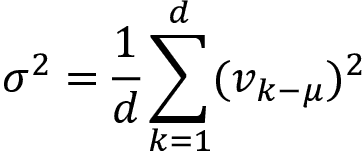

# 一、开始使用转换器的模型架构

语言是人类交流的本质。如果没有构成语言的单词序列，文明就不会诞生。我们现在大多生活在一个数字化语言的世界里。我们的日常生活依赖于**自然语言处理** ( **NLP** )数字化语言功能:网络搜索引擎、电子邮件、社交网络、帖子、推文、智能手机短信、翻译、网页、流媒体网站上的语音转文本、热线服务上的文本转语音，以及许多其他日常功能。

2017 年 12 月，由谷歌大脑成员和谷歌研究院撰写的开创性*瓦斯瓦尼*等人*注意力是你所需要的全部*文章发表了。转换器诞生了。该转换器优于现有的最先进的 NLP 模型。转换器比以前的架构训练得更快，并获得了更高的评估结果。转换器已经成为 NLP 的关键组件。

没有 NLP，数字世界就不会存在。如果没有人工智能，自然语言处理将保持原始和低效。然而，使用**循环神经网络** ( **RNNs** )和**卷积神经网络**(**CNN**)在计算和机器能力方面代价巨大。

在这一章中，我们将首先从导致转换器兴起的 NLP 的背景开始。我们将简要地从早期的 NLP 到 RNNs 和 CNN。然后我们将看到转换器如何推翻 RNNs 和 CNN 的统治，这种统治已经盛行了几十年的序列分析。

然后，我们将打开 *Vaswani* 等人(2017)描述的转换器模型的引擎盖，并检查其架构的关键组件。我们将探索注意力的迷人世界，并说明转换器的关键组件。

本章涵盖以下主题:

*   转换器的背景
*   转换器的架构
*   转换器的自我关注模型
*   编码和解码栈
*   输入和输出嵌入
*   位置嵌入
*   自我关注
*   多头注意力
*   掩蔽的多重注意
*   剩余连接
*   正常化
*   前馈网络
*   输出概率

我们的第一步将是探索转换器的背景。

# 转换器的背景

在这一节中，我们将了解 NLP 的背景，它导致了 Transformer 的出现。Google Research 发明的 Transformer 模型颠覆了几十年来自然语言处理的研究、开发和实现。

让我们首先看看当 NLP 达到一个需要新方法的临界极限时，这是如何发生的。

在过去的 100 多年里，许多伟大的思想家都致力于序列转导和语言建模。机器逐渐学会了如何预测可能的单词序列。需要一整本书来列举所有促成这一切的巨人。

在这一节里，我将和大家分享我最喜欢的研究人员，为转换器的到来做铺垫。

在 20 世纪早期，Andrey Markov 引入了随机值的概念，并创建了随机过程理论。我们在**人工智能** ( **AI** )中把它们称为**马尔可夫决策过程** ( **MDPs** )、马尔可夫链、马尔可夫过程。1902 年，Markov 证明了我们可以预测一个链的下一个元素，一个序列，仅仅使用那个链的最后一个过去的元素。1913 年，他将此应用于一个 20，000 个字母的数据集，使用过去的序列来预测一个链的未来字母。请记住，他没有计算机，但设法证明了他的理论，这一理论今天仍在人工智能中使用。

1948 年，克劳德·香农的*通信的数学理论*出版。他在构建序列建模的概率方法时多次引用了安德烈·马尔科夫的理论。克劳德香农为基于信源编码器、发射机和接收解码器或语义解码器的通信模型奠定了基础。

1950 年，艾伦·图灵发表了他的开创性文章:*计算机械和智能*。艾伦·图灵将这篇关于机器智能的文章建立在获得巨大成功的图灵机解密德国信息的基础上。约翰·麦卡锡在 1956 年首次使用了*人工智能*这个词。然而，艾伦·图灵在 20 世纪 40 年代正在实现人工智能，以解码德语的加密编码信息。

1954 年，乔治敦-IBM 实验使用计算机通过规则系统将俄语句子翻译成英语。规则系统是运行一系列规则的程序，这些规则将分析语言结构。规则系统仍然存在。然而，在我们的数字世界中，为数十亿种语言组合创建规则列表是一个有待应对的挑战。就目前而言，这似乎是不可能的。但是谁知道会发生什么？

1982 年，约翰·霍普菲尔德介绍了**循环神经网络** ( **RNNs** )，被称为霍普菲尔德网络或“联想”神经网络。约翰·霍普菲尔德受到了 W.A .利特尔的启发，他在 1974 年写了《大脑中持久状态的存在》。rnn 进化了，LSTMs 出现了，正如我们所知道的。RNN 有效地记忆序列的持久状态:


图 1.1:RNN 过程

每个状态 *S* [n] 捕获 *S* [n-1] 的信息当到达网络的末端时，函数 *F* 将执行一个动作:换能、建模或任何其他类型的基于序列的任务。

上世纪 80 年代，Yann Le Cun 设计了多功能**卷积神经网络** ( **CNN** )。他将 CNN 应用于文本序列，它们也被广泛用于序列转换和建模。它们也是基于*持久状态*逐层收集信息。在 90 年代，Yann Le Cun 总结了几年的工作，制作了 LeNet-5，这导致了我们今天所知道的许多 CNN 模型。在处理非常长和复杂的序列中的长期依赖性时，CNN 的其他高效架构面临问题。

我们还可以提到许多其他伟大的名字、论文和模型，让任何人工智能专家都相形见绌。这些年来，似乎人工智能的每个人都在正确的轨道上。马尔可夫场、rnn 和 CNN 发展成了多种其他模型。注意力的概念出现了:偷看序列中的其他记号，而不仅仅是最后一个。它被添加到 RNN 和 CNN 的模型中。

在那之后，如果人工智能模型需要来分析需要越来越多计算机能力的更长序列，人工智能开发者会使用更强大的机器，并找到优化梯度的方法。

似乎没有别的办法可以取得更大的进展了。三十年就这样过去了。然后，在 2017 年 12 月，出现了 Transformer，这种令人难以置信的创新似乎来自一个遥远的星球。Transformer 扫除了一切，在标准数据集上产生了令人印象深刻的分数。

让我们从这艘外星 NLP/NLU 飞船的设计开始探索转换器的架构吧！

# 转换器的崛起:你只需要关注

2017 年 12 月，*瓦斯瓦尼*等人发表了他们的开创性论文，*注意力就是你所需要的一切*。他们在谷歌研究院和谷歌大脑完成了他们的工作。在本章和本书中，我将把*中描述的模型*称为“原始转换器模型”。

在这一节中，我们将从外部查看他们构建的转换器模型。在接下来的部分中，我们将探索模型的每个组件内部是什么。

最初的转换器模型是 6 层的堆叠。层 *l* 的输出是层 *l* +1 的输入，直到达到最终预测。左侧是 6 层编码器堆栈，右侧是 6 层解码器堆栈:


图 1.2:转换器的架构

在左边，输入通过注意子层和**前馈网络** ( **FFN** )子层进入转换器的编码器侧。在右侧，目标输出通过两个注意力子层和一个 FFN 子层进入转换器的解码器端。我们立即注意到没有 RNN、LSTM 或 CNN。复发已被放弃。

注意力取代了递归，递归需要的运算次数随着两个词之间距离的增加而增加。注意机制是一种“字对字”的操作。注意机制将发现每个单词如何与序列中的所有其他单词相关，包括被分析的单词本身。让我们检查以下序列:

```py
The cat sat on the mat. 
```

注意力将在单词向量之间运行点积，并确定一个单词在所有其他单词中的最强关系，包括它本身(“`cat`”和“`cat`”):


图 1.3:注意所有的单词

注意机制将提供单词之间更深的关系，并产生更好的结果。

对于每个注意力子层，原始的 Transformer 模型并行运行不是一个而是八个注意力机制来加速计算。我们将在下一节探讨这种架构，*编码器堆栈*。这个过程被称为“多头注意力”，提供:

*   对序列进行更广泛的深入分析
*   递归的排除减少了计算操作
*   并行化的实现减少了培训时间
*   Each attention mechanism learns different perspectives of the same input sequence

    *注意力取代了复发*。然而，转换器还有其他几个创造性的方面，它们和注意力机制一样重要，当我们观察它的内部结构时，你会发现这一点。

    我们只是从外面看转换器。现在，让我们来看看转换器的每个组件。我们将从编码器开始。

    ## 编码器堆栈

    原始转换器模型的编码器和解码器的层数是*层*的堆叠。编码器堆栈的每一层都有如下结构:

    

    图 1.4:转换器的编码器堆栈层

    对于转换器模型的所有 *N=6* 层，原始编码器层结构保持不变。每层包含两个主要的子层:多头注意机制和全连接的位置式前馈网络。

    请注意，在转换器模型中，剩余连接围绕着每个主要的子层，*子层(x)* 。这些连接将子层的未处理输入 *x* 传输到层标准化函数。通过这种方式，我们可以确定位置编码等关键信息不会在途中丢失。因此，每层的归一化输出为:

    *层规范化(x +子层(x))*

    虽然编码器的 N=6 层中的每一层的结构是相同的，但是每一层的内容并不严格地与前一层相同。

    例如，嵌入子层只存在于堆栈的底层。其他五层不包含嵌入层，这保证了编码输入在所有层中都是稳定的。

    此外，多头注意力机制从第 1 层到第 6 层执行相同的功能。但是，它们执行的任务不同。每一层都从前一层学习，并探索将序列中的标记关联起来的不同方式。它寻找单词的各种关联，就像我们在解决纵横字谜时寻找字母和单词的不同关联一样。

    转换器的设计者引入了一个非常有效的约束。该模型的每个子层的输出具有恒定的维数，包括嵌入层和剩余连接。这个尺寸是*d*T2【模型】T3，可以根据您的目标设置为另一个值。在最初的转换器架构中，*d*T6 型号=512。

    *d* [模型]具有强大的影响力。几乎所有的关键操作都是点积。维度保持稳定，这减少了要计算的操作数量，降低了机器消耗，并且在信息流经模型时更容易跟踪信息。

    编码器的全局视图显示了转换器的高度优化架构。在接下来的章节中，我们将详细介绍每个子层和机制。

    我们将从嵌入子层开始。

    ### 输入嵌入

    输入嵌入子层使用原始变换器模型中的学习嵌入将输入令牌转换成维度为*d*模型 = 512 的向量。输入嵌入的结构是经典的:

    

    图 1.5:转换器的输入嵌入子层

    嵌入子层像其他标准转导模型一样工作。记号赋予器将把句子转换成记号。每个记号赋予器都有自己的方法，但是结果是相似的。例如，应用于序列“`the Transformer is an innovative NLP model!`”的记号赋予器将在一种类型的模型中产生以下记号:

    ```py
    ['the', 'transform', 'er', 'is', 'a', 'revolutionary', 'n', 'l', 'p', 'model', '!'] 
    ```

    您会注意到，这个标记器将字符串规范化为小写，并将其截断成子部分。标记器通常会提供一个整数表示，用于嵌入过程。例如:

    ```py
    Text = "The cat slept on the couch.It was too tired to get up."

    tokenized text= [1996, 4937, 7771, 2006, 1996, 6411, 1012, 2009, 2001, 2205, 5458, 2000, 2131, 2039, 1012] 
    ```

    在这一点上，分词的文本中没有足够的信息来继续。必须嵌入分词的文本。

    变换器包含一个学习嵌入子层。许多嵌入方法可以应用于分词的输入。

    我选择了 Google 在 2013 年推出的`word2vec`嵌入方法的 skip-gram 架构来说明 Transformer 的嵌入子层。跳格将聚焦于单词窗口中的中心单词，并预测上下文单词。例如，如果`word(i)`是两步窗口中的中心词，则跳格模型将分析`word(i-2)`、`word(i-1)`、`word(i+1)`和`word(i+2)`。然后，车窗将滑动并重复该过程。跳格模型通常包含输入层、权重、隐藏层和包含分词输入单词的单词嵌入的输出。

    假设我们需要为下面的句子执行嵌入:

    ```py
    The black cat sat on the couch and the brown dog slept on the rug. 
    ```

    我们将把集中在两个词上，`black`和`brown`。这两个单词的单词嵌入向量应该差不多。

    由于我们必须为每个单词产生大小为 *d* [model] = 512 的向量，我们将为每个单词获得大小为 *512* 的向量嵌入:

    ```py
    black=[[-0.01206071  0.11632373  0.06206119  0.01403395  0.09541149  0.10695464 0.02560172  0.00185677 -0.04284821  0.06146432  0.09466285  0.04642421 0.08680347  0.05684567 -0.00717266 -0.03163519  0.03292002 -0.11397766 0.01304929  0.01964396  0.01902409  0.02831945  0.05870414  0.03390711 -0.06204525  0.06173197 -0.08613958 -0.04654748  0.02728105 -0.07830904

        …

    0.04340003 -0.13192849 -0.00945092 -0.00835463 -0.06487109  0.05862355 -0.03407936 -0.00059001 -0.01640179  0.04123065 

    -0.04756588  0.08812257 0.00200338 -0.0931043  -0.03507337  0.02153351 -0.02621627 -0.02492662 -0.05771535 -0.01164199 

    -0.03879078 -0.05506947  0.01693138 -0.04124579 -0.03779858 

    -0.01950983 -0.05398201  0.07582296  0.00038318 -0.04639162 

    -0.06819214  0.01366171  0.01411388  0.00853774  0.02183574 

    -0.03016279 -0.03184025 -0.04273562]] 
    ```

    单词`black`现在由 *512* 尺寸表示。可以使用其他嵌入方法，并且*d*模型可以具有更高的维数。

    `brown`的文字嵌入也由 *512* 尺寸表示:

    ```py
    brown=[[ 1.35794589e-02 -2.18823571e-02  1.34526128e-02  6.74355254e-02

       1.04376070e-01  1.09921647e-02 -5.46298288e-02 -1.18385479e-02

       4.41223830e-02 -1.84863899e-02 -6.84073642e-02  3.21860164e-02

       4.09143828e-02 -2.74433400e-02 -2.47369967e-02  7.74542615e-02

       9.80964210e-03  2.94299088e-02  2.93895267e-02 -3.29437815e-02

    …

      7.20389187e-02  1.57317147e-02 -3.10291946e-02 -5.51304631e-02

      -7.03861639e-02  7.40829483e-02  1.04319192e-02 -2.01565702e-03

       2.43322570e-02  1.92969330e-02  2.57341694e-02 -1.13280728e-01

       8.45847875e-02  4.90090018e-03  5.33546880e-02 -2.31553353e-02

       3.87288055e-05  3.31782512e-02 -4.00604047e-02 -1.02028981e-01

       3.49597558e-02 -1.71501152e-02  3.55573371e-02 -1.77437533e-02

      -5.94457164e-02  2.21221056e-02  9.73121971e-02 -4.90022525e-02]] 
    ```

    为了验证为这两个单词产生的单词嵌入，我们可以使用余弦相似度来查看单词`black`和`brown`的单词嵌入是否相似。

    余弦相似度使用欧几里德(L2)范数在单位球面上创建矢量。我们比较的向量的点积是这两个向量的点之间的余弦。关于余弦相似性理论的更多信息，你可以参考 scikit-learn 的文档，以及许多其他来源:[https://sci kit-learn . org/stable/modules/metrics . html # cosine-similarity](https://scikit-learn.org/stable/modules/metrics.html#cosine-similarity)

    大小为 *d* [模型] = 512 的黑色向量和大小为 *d* [模型] = 512 的棕色向量在示例的嵌入中的余弦相似度为:

    ```py
    cosine_similarity(black, brown)= [[0.9998901]] 
    ```

    跳跃图产生了两个彼此非常接近的向量。它检测到`black`和`brown`形成单词字典的颜色子集。

    转换器的后续层不会空手开始。他们已经学会了单词嵌入，这些单词嵌入已经提供了单词如何关联的信息。

    然而，由于没有额外的向量或信息来指示单词在序列中的位置，因此丢失了一大块信息。

    转换器的设计者提出了另一个创新特性:位置编码。

    让我们看看位置编码是如何工作的。

    ### 位置编码

    我们输入转换器的这个位置编码函数，而不知道一个单词在序列中的位置:

    

    图 1.6:位置编码

    我们不能创建独立的位置向量，这将对转换器的训练速度产生很高的成本，并使注意力子层的处理非常复杂。这个想法是将一个位置编码值添加到输入嵌入中，而不是用额外的向量来描述序列中某个标记的位置。

    我们还知道对于位置编码函数输出的每个向量，转换器期望固定大小的*d*模型 = 512(或者模型的其他常量)。

    如果我们回到我们在单词嵌入子层中使用的句子，我们可以看到`black`和`brown`可能是相似的，但它们相距很远:

    ```py
    `The` `black` `cat sat on the couch` `and the` `brown` `dog slept on the rug`. 
    ```

    单词`black`在位置 2，`pos=2`，单词`brown`在位置 10，`pos=10`。

    我们的问题是找到一种方法，给每个单词的单词嵌入添加一个值，这样它就有了那个信息。但是，我们需要给 *d* [型号] = 512 尺寸加一个值！对于每一个单词嵌入向量，我们需要在`black`和`brown`的单词嵌入向量的值域(`0,512`)维中找到一种方法来提供信息给`i`。

    有很多方法可以达到这个目的。设计者发现了一个聪明的方法，用一个单位球来表示正弦和余弦值的位置编码，这样会保持较小但非常有用。

    *Vaswani* 等人(2017)提供了正弦和余弦函数，这样我们可以为单词嵌入向量的 *d* [模型] = 512 的每个位置和每个维度的**位置编码** ( **PE** )生成不同的频率:

    

    如果我们从单词嵌入向量的开头开始，我们将从一个常数`(512)`、`i=0`开始，以`i=511`结束。这意味着正弦函数将应用于偶数，余弦函数将应用于奇数。有些实现有不同的做法。在这种情况下，正弦函数的域可以是，余弦函数的域可以是。这将产生类似的结果。

    在本节中，我们将按照*瓦斯瓦尼*等人(2017)描述的方式使用这些函数。对 Python 的字面翻译会为位置`pos`的位置向量`pe[0][i]`生成以下代码:

    ```py
    def positional_encoding(pos,pe):

    for i in range(0, 512,2):

             pe[0][i] = math.sin(pos / (10000 ** ((2 * i)/d_model)))

             pe[0][i+1] = math.cos(pos / (10000 ** ((2 * i)/d_model)))

    return pe 
    ```

    在继续之前，您可能想看看正弦函数的曲线图，例如对于`pos=2`。

    你可以谷歌一下下面的情节，比如:

    `plot y=sin(2/10000^(2*x/512))`

    只需输入剧情要求:

    

    图 1.7:用谷歌绘图

    您将获得下图:

    

    图 1.8:图表

    如果我们回到我们正在分析的句子，我们可以看到`black`在位置`pos=2`而`brown`在位置`pos=10`:

    ```py
    `The` `black` `cat sat on the couch and the` `brown` `dog slept on the rug`. 
    ```

    如果我们对`pos=2`应用正弦和余弦函数，我们得到一个`size=512`位置编码向量:

    ```py
    PE(2)= 

    [[ 9.09297407e-01 -4.16146845e-01  9.58144367e-01 -2.86285430e-01

       9.87046242e-01 -1.60435960e-01  9.99164224e-01 -4.08766568e-02

       9.97479975e-01  7.09482506e-02  9.84703004e-01  1.74241230e-01

       9.63226616e-01  2.68690288e-01  9.35118318e-01  3.54335666e-01

       9.02130723e-01  4.31462824e-01  8.65725577e-01  5.00518918e-01

       8.27103794e-01  5.62049210e-01  7.87237823e-01  6.16649508e-01

       7.46903539e-01  6.64932430e-01  7.06710517e-01  7.07502782e-01

    …

       5.47683925e-08  1.00000000e+00  5.09659337e-08  1.00000000e+00

       4.74274735e-08  1.00000000e+00  4.41346799e-08  1.00000000e+00

       4.10704999e-08  1.00000000e+00  3.82190599e-08  1.00000000e+00

       3.55655878e-08  1.00000000e+00  3.30963417e-08  1.00000000e+00

       3.07985317e-08  1.00000000e+00  2.86602511e-08  1.00000000e+00

       2.66704294e-08  1.00000000e+00  2.48187551e-08  1.00000000e+00

       2.30956392e-08  1.00000000e+00  2.14921574e-08  1.00000000e+00]] 
    ```

    我们还获得位置 10 的位置编码向量`size=512`，`pos=10`:

    ```py
    PE(10)= 

    [[-5.44021130e-01 -8.39071512e-01  1.18776485e-01 -9.92920995e-01

       6.92634165e-01 -7.21289039e-01  9.79174793e-01 -2.03019097e-01

       9.37632740e-01  3.47627431e-01  6.40478015e-01  7.67976522e-01

       2.09077001e-01  9.77899194e-01 -2.37917677e-01  9.71285343e-01

      -6.12936735e-01  7.90131986e-01 -8.67519796e-01  4.97402608e-01

      -9.87655997e-01  1.56638563e-01 -9.83699203e-01 -1.79821849e-01

    …

      2.73841977e-07  1.00000000e+00  2.54829672e-07  1.00000000e+00

       2.37137371e-07  1.00000000e+00  2.20673414e-07  1.00000000e+00

       2.05352507e-07  1.00000000e+00  1.91095296e-07  1.00000000e+00

       1.77827943e-07  1.00000000e+00  1.65481708e-07  1.00000000e+00

       1.53992659e-07  1.00000000e+00  1.43301250e-07  1.00000000e+00

       1.33352145e-07  1.00000000e+00  1.24093773e-07  1.00000000e+00

       1.15478201e-07  1.00000000e+00  1.07460785e-07  1.00000000e+00]] 
    ```

    当我们查看我们通过将*瓦斯瓦尼*等人(2017)的函数直观直译成 Python 得到的结果时，我们现在想检查这些结果是否有意义。

    用于单词嵌入的余弦相似度函数便于更好地可视化位置的接近度:

    ```py
    cosine_similarity(pos(2), pos(10)= [[0.8600013]] 
    ```

    单词`black`和`brown`的位置之间的相似性和词汇域(在一起的单词组)相似性是不同的:

    ```py
    cosine_similarity(**black**, **brown**)= [[0.9998901]] 
    ```

    位置的编码显示了比单词嵌入相似度更低的相似度值。

    位置编码将这些单词分开。请记住，单词嵌入会随着用于训练它们的语料库而变化。

    现在的问题是如何将位置编码添加到单词嵌入向量中。

    #### 向嵌入向量添加位置编码

    Transformer 的作者发现了一种简单的方法，只需将位置编码向量添加到单词嵌入向量中:

    

    图 1.9:位置编码

    如果我们回过头来，以`black`的单词 embedding 为例，并将其命名为 *y1=black* ，我们准备将它添加到中，即我们用位置编码函数获得的位置向量 *pe(2)* 。我们将获得输入单词`black`的位置编码 *pc(黑色)*:

    *pc(黑色)=y1+pe(2)*

    解决方案很简单。然而，如果我们像所示的那样应用它，我们可能会丢失单词嵌入的信息，这将被位置编码向量最小化。

    增加 *y1* 的值有许多种可能性，以确保单词嵌入层的信息可以在后续层中有效使用。

    许多可能性之一是给 *y1* 加上一个任意值，即`black`的单词嵌入:

    *y*1 **math . sqrt*(*d*模型

    我们现在可以将位置向量添加到单词`black`的嵌入向量中，两者大小相同(`512`):

    ```py
    for i in range(0, 512,2):

              pe[0][i] = math.sin(pos / (10000 ** ((2 * i)/d_model)))

              pc[0][i] = (y[0][i]*math.sqrt(d_model))+ pe[0][i]

              pe[0][i+1] = math.cos(pos / (10000 ** ((2 * i)/d_model)))

              pc[0][i+1] = (y[0][i+1]*math.sqrt(d_model))+ pe[0][i+1] 
    ```

    得到的结果是尺寸为*d*型号 = 512 的最终位置编码矢量:

    ```py
    pc(black)=

    [[ 9.09297407e-01 -4.16146845e-01  9.58144367e-01 -2.86285430e-01

       9.87046242e-01 -1.60435960e-01  9.99164224e-01 -4.08766568e-02

       …

      4.74274735e-08  1.00000000e+00  4.41346799e-08  1.00000000e+00

       4.10704999e-08  1.00000000e+00  3.82190599e-08  1.00000000e+00

       2.66704294e-08  1.00000000e+00  2.48187551e-08  1.00000000e+00

       2.30956392e-08  1.00000000e+00  2.14921574e-08  1.00000000e+00]] 
    ```

    相同的操作应用于单词`brown`和序列中的所有其他单词。此算法的输出不是基于规则的，在每次运行时可能会略有不同。

    我们可以将余弦相似性函数应用于`black`和`brown`的位置编码向量:

    ```py
    cosine_similarity(pc(black), pc(brown)= [[0.9627094]] 
    ```

    现在，我们通过应用于代表单词`black`和`brown`的三个状态的三个余弦相似度函数，对位置编码过程有了清楚的了解:

    ```py
    [[0.99987495]] word similarity

    [[0.8600013]] positional encoding vector similarity

    [[0.9627094]] final positional encoding similarity 
    ```

    我们看到它们嵌入的初始单词相似度非常高，值为`0.99`。然后我们看到位置`2`和`10`的位置编码向量用更低的相似度值`0.86`将这两个单词分开。

    最后，我们将每个单词的单词嵌入向量添加到其各自的位置编码向量中。我们看到这给`0.96`带来了两个词的余弦相似度。

    每个单词的位置编码现在包含初始单词嵌入信息和位置编码值。

    拥抱脸和 Google Brain Trax 都为我们在单词嵌入部分和当前位置编码部分探索的功能提供了现成的库。因此，你不需要运行我在本章中使用的程序来检查转换器方程，这部分是独立的。然而，如果你想研究代码，你可以在 Google 合作实验室的`positional_encoding.ipynb`笔记本和本章 GitHub 库的`text.txt`文件中找到它。

    位置编码的输出是多头注意力子层。

    ### 子层 1:多头关注

    多头注意力子层包含八个头，之后是后层归一化，后层归一化将残差连接添加到子层的输出中，并将其归一化:

    

    图 1.10:多头注意力子层

    本节从关注层的架构开始。然后用 Python 在一个小模块中实现了一个多注意的例子。最后，描述层后标准化。

    先说多头注意力的架构。

    #### 多头注意力的架构

    编码器栈第一层的多关注子层的输入是一个向量，包含每个单词的嵌入和位置编码。堆栈的下一层不会重新开始这些操作。

    一个输入序列的每个单词的向量的维数 *x* [n] 为 *d* [模型] = 512:

    *PE*(x[n]=*d*= 9.09297407 e-01，*d*= 2-什么，*d*[512]= 1.00000000 e+00]

    每一个单词 x [n] 的表示都变成了一个*d*模型 = 512 维的向量。

    每个单词都被映射到所有其他单词，以确定它在序列中的位置。

    在下面的句子中，我们可以看到“it”可能与序列中的“cat”和“rug”相关:

    `Sequence =The cat sat on the rug and it was dry-cleaned.`

    该模型将进行训练，以找出`"it"`是否与`"cat"`或`"rug."`相关。我们可以通过使用目前的*d*模型 = 512 个维度来训练该模型，从而进行巨大的计算。

    然而，通过用一个*d*模型模块分析序列，我们一次只能得到一个观点。此外，寻找其他视角需要相当长的计算时间。

    更好的办法是将 *d* [模型] = 512 维每个字 *x* [n] of *x* (一个序列的所有字)分成 8 个 *d* [k] = 64 维。

    然后，我们可以并行运行 8 个`"heads"`来加速训练，并获得每个单词如何与另一个单词相关的 8 个不同表示子空间:

    

    图 1.11:多头表示

    您可以看到现在有 8 个头并行运行。一个负责人可能会决定`"it"` 与`"` `cat"`很合适，另一个`"it"`与`"rug"`很合适，而另一个`"rug"`与`"dry-cleaned."`很合适

    每个头的输出是一个形状为 x **d*k 的矩阵 *z* [i] 多注意力头的输出是 *Z* 定义为:

    *Z* = ( *z* [0] ， *z* [1] ， *z* [2] ， *z* [3] ， *z* [4] ，*Z*[5*Z*[6]]

    但是， *Z* 必须串接起来，这样多头子层的输出就不是维数的序列，而是 *xm*d* [模型]矩阵的一行。

    在退出多头注意力子层之前， *Z* 的元素被连接:

    *多头* ( *输出* ) = *串联* ( *z* [0] ， *z* [1] ， *z* [2] ， *z* [3] ， *z* [4] ， *z*

    请注意，每个头被连接成尺寸为*[型号] = 512 的 *z* 。多头层的输出遵守原始转换器模型的约束。*

     *在注意机制的每个头 *h* [n] 内部，每个词向量有三种表征:

    *   维度为*d*Q= 64 的查询向量( *Q* ，当单词向量*x*n 寻找其他单词向量的所有键值对，包括自我关注中的自己时，该查询向量被激活并被训练
    *   关键向量( *K* )，其维数为 *d* [k] = 64，将被训练以提供关注值
    *   具有维度为*d*V= 64 的值向量( *V* ，其将被训练以提供另一个注意力值

    注意力被定义为“成比例的点积注意力”，这在下面的等式中表示，其中我们插入 *Q* 、 *K* 和 *V* :

    

    向量都具有相同的维数，使得使用缩放的点积来获得每个头部的注意力值，然后连接 8 个头部的输出 *Z* 变得相对简单。

    为了获得 *Q* 、 *K* 和 *V* ，我们必须用它们各自的权重矩阵 *Q* [w] 、 *K* [w] 和 *V* [w] 来训练模型，它们有 *d* [k] = 64 列和 *d* [模型[例如， *Q* 由 *x* 和*Q*w]的点积得到。 *Q* 的尺寸为*d*k]= 64。

    您可以修改所有参数，如层数、头数、 *d* [型号]、 *d* [k] 以及转换器的其他变量，以适应您的型号。本章描述了 *Vaswani* 等人(2017)的原始转换器参数。在修改原始架构或探索他人设计的原始模型的变体之前，理解原始架构是至关重要的。

    拥抱脸和 Google Brain Trax 等提供了我们将在本书中使用的现成框架、库和模块。

    然而，让我们打开 Transformer 模型的盖子，用 Python 来说明我们刚刚探索的架构，以便用代码可视化模型，并用中间图像显示它。

    我们将在 10 个步骤中使用只有`numpy`和`softmax`函数的基本 Python 代码来运行注意机制的关键方面。

    现在让我们开始构建模型的第*步*来表示输入。

    #### 步骤 1:表示输入

    将`Multi_Head_Attention_Sub_Layer.ipynb`保存到您的 Google Drive(确保您有 Gmail 帐户),然后在 Google 协同实验室中打开它。本章的笔记本在 GitHub 库中。

    我们将从只使用最少的 Python 函数开始，通过注意力头的内部工作方式，在较低的层次上理解转换器。我们将使用基本代码探索多头注意力子层的内部工作方式:

    ```py
    import numpy as np

    from scipy.special import softmax 
    ```

    我们正在构建的注意力机制的输入被缩小到*d*T2【模型】T3 = 4 而不是*d*模型 = 512。这使得输入向量的维数 *x* 降低到 *d* [model] = 4，这更容易可视化。

    *x* 包含`3`个输入，每个输入有`4`个尺寸，而不是`512`:

    ```py
    print("Step 1: Input : 3 inputs, d_model=4")

    x =np.array([[1.0, 0.0, 1.0, 0.0],   # Input 1

                 [0.0, 2.0, 0.0, 2.0],   # Input 2

                 [1.0, 1.0, 1.0, 1.0]])  # Input 3

    print(x) 
    ```

    输出显示我们有 3 个向量*d*模型 = 4。

    ```py
    Step 1: Input : 3 inputs, d_model=4

    [[1\. 0\. 1\. 0.]

     [0\. 2\. 0\. 2.]

     [1\. 1\. 1\. 1.]] 
    ```

    我们模型的第一步已经准备好了:

    

    图 1.12:多头注意力子层的输入

    我们现在将权重矩阵添加到我们的模型中。

    #### 步骤 2:初始化权重矩阵

    每个输入有 3 个权重矩阵:

    *   *Q* [w] 来训练查询
    *   *K* [w] 训练琴键
    *   *V* [w] 训练值

    这 3 个权重矩阵将应用于该模型中的所有输入。

    *瓦斯瓦尼*等人(2017)描述的权重矩阵为 *d* [k] = 64 维。然而，让我们将矩阵缩小到 3。维度被缩小到 3*4 权重矩阵，以便能够更容易地可视化中间结果，并使用输入 *x* 执行点积。

    三个权重矩阵从查询权重矩阵开始初始化:

    ```py
    print("Step 2: weights 3 dimensions x d_model=4")

    print("w_query")

    w_query =np.array([[1, 0, 1],

                       [1, 0, 0],

                       [0, 0, 1],

                       [0, 1, 1]])

    print(w_query) 
    ```

    输出是`w_query`权重矩阵:

    ```py
    Step 2: weights 3 dimensions x d_model=4

    w_query

    [[1 0 1]

     [1 0 0]

     [0 0 1]

     [0 1 1]] 
    ```

    我们现在将初始化关键权重矩阵:

    ```py
    print("w_key")

    w_key =np.array([[0, 0, 1],

                     [1, 1, 0],

                     [0, 1, 0],

                     [1, 1, 0]])

    print(w_key) 
    ```

    输出是关键权重矩阵:

    ```py
    w_key

    [[0 0 1]

     [1 1 0]

     [0 1 0]

     [1 1 0]] 
    ```

    最后，我们初始化值权重矩阵:

    ```py
    print("w_value")

    w_value = np.array([[0, 2, 0],

                        [0, 3, 0],

                        [1, 0, 3],

                        [1, 1, 0]])

    print(w_value) 
    ```

    输出是价值权重矩阵:

    ```py
    w_value

    [[0 2 0]

     [0 3 0]

     [1 0 3]

     [1 1 0]] 
    ```

    我们模型的第二步已经准备好了:

    

    图 1.13:添加到模型中的权重矩阵

    我们现在将输入向量乘以权重，以获得 *Q* 、 *K* 和 *V* 。

    #### 步骤 3:矩阵乘法以获得 Q，K，V

    我们现在将将输入向量乘以权重矩阵，以获得每个输入的查询、键和值向量。

    在这个模型中，我们将假设所有输入有一个`w_query`、`w_key`和`w_value`权重矩阵。其他方法也是可能的。

    让我们首先用`w_query`权重矩阵乘以输入向量:

    ```py
    print("Step 3: Matrix multiplication to obtain Q,K,V")

    print("Query: x * w_query")

    Q=np.matmul(x,w_query)

    print(Q) 
    ```

    输出是*Q*[1]=【1，0，2】，*Q*[2]=【2，2，2】，*Q*[3]=【2，1，3】的向量:

    ```py
    Step 3: Matrix multiplication to obtain Q,K,V

    Query: x * w_query

    [[1\. 0\. 2.]

     [2\. 2\. 2.]

     [2\. 1\. 3.]] 
    ```

    我们现在将输入向量乘以`w_key`权重矩阵:

    ```py
    print("Key: x * w_key")

    K=np.matmul(x,w_key)

    print(K) 
    ```

    我们为 *K* [1] = [0，1，1]， *K* [2] = [4，4，0]， *K* [3] = [2，3，1]获得一个向量:

    ```py
    Key: x * w_key

    [[0\. 1\. 1.]

     [4\. 4\. 0.]

     [2\. 3\. 1.]] 
    ```

    最后，我们将输入向量乘以`w_value`权重矩阵:

    ```py
    print("Value: x * w_value")

    V=np.matmul(x,w_value)

    print(V) 
    ```

    我们为 *V* [1] = [1，2，3]， *V* [2] = [2，8，0]， *V* [3] = [2，6，3]获得一个向量:

    ```py
    Value: x * w_value

    [[1\. 2\. 3.]

     [2\. 8\. 0.]

     [2\. 6\. 3.]] 
    ```

    我们模型的第三步已经准备好了:

    

    图 1.14:生成了 Q、K 和 V

    我们有 *Q* 、 *K* 和 *V* 值，我们需要这些值来计算注意力分数。

    #### 第四步:分级注意力分数

    注意力头现在实现了原始的转换器等式:

    

    *第四步*重点介绍 *Q* 和 *K* :

    

    对于这个模型，我们将对取整，并将数值代入等式的 *Q* 和 *K* 部分:

    ```py
    print("Step 4: Scaled Attention Scores")

    k_d = 1   #square root of k_d=3 rounded down to 1 for this example

    attention_scores = (Q @ K.transpose())/k_d

    print(attention_scores) 
    ```

    中间结果显示如下:

    ```py
    Step 4: Scaled Attention Scores

    [[ 2\.  4\.  4.]

     [ 4\. 16\. 12.]

     [ 4\. 12\. 10.]] 
    ```

    步骤 4 现已完成。以为例，*x*1 的分数是横跨头部的 *K* 向量的【2，4，4】，如图所示:

    

    图 1.15:输入#1 的比例注意力分数

    注意力等式现在将 softmax 应用于每个向量的中间分数。

    #### 步骤 5:每个向量的缩放的 softmax 注意力分数

    我们现在将一个 softmax 函数应用于每个中间注意力分数。我们不做矩阵乘法，而是放大到每个单独的向量:

    ```py
    print("Step 5: Scaled softmax attention_scores for each vector")

    attention_scores[0]=softmax(attention_scores[0])

    attention_scores[1]=softmax(attention_scores[1])

    attention_scores[2]=softmax(attention_scores[2])

    print(attention_scores[0])

    print(attention_scores[1])

    print(attention_scores[2]) 
    ```

    我们为每个向量获得缩放的 softmax 注意力分数:

    ```py
    Step 5: Scaled softmax attention_scores for each vector

    [0.06337894 0.46831053 0.46831053]

    [6.03366485e-06 9.82007865e-01 1.79861014e-02]

    [2.95387223e-04 8.80536902e-01 1.19167711e-01] 
    ```

    步骤 5 现已完成。例如，所有键的 *x* [1] 的得分 softmax 为:

    

    图 1.16:所有键的输入#1 的 Softmax 得分

    我们现在可以用完整的等式来计算最终的关注值。

    #### 第六步:最终注意力表征

    我们现在可以通过插入 *V* 来最终确定注意力等式:

    

    我们先来计算*步骤 6* 和 *7* 的输入 *x* [1] 的关注度。我们为一个单词向量计算一个关注值。当我们到达*步骤 8* 时，我们将注意力计算推广到其他两个输入向量。

    为了获得 *x* [1] 的*注意力(Q，K，V)* ，我们将中间注意力分数与 3 个值向量逐一相乘，以缩小到等式的内部工作方式:

    ```py
    print("Step 6: attention value obtained by score1/k_d * V")

    print(V[0])

    print(V[1])

    print(V[2])

    print("Attention 1")

    attention1=attention_scores[0].reshape(-1,1)

    attention1=attention_scores[0][0]*V[0]

    print(attention1)

    print("Attention 2")

    attention2=attention_scores[0][1]*V[1]

    print(attention2)

    print("Attention 3")

    attention3=attention_scores[0][2]*V[2]

    print(attention3) 
    ```

    ```py
    Step 6: attention value obtained by score1/k_d * V

    [1\. 2\. 3.]

    [2\. 8\. 0.]

    [2\. 6\. 3.]

    Attention 1

    [0.06337894 0.12675788 0.19013681]

    Attention 2

    [0.93662106 3.74648425 0\.        ]

    Attention 3

    [0.93662106 2.80986319 1.40493159] 
    ```

    *第 6 步*完成。例如，已经计算了每个输入的*x*1 的 3 个关注值:

    Figure 1.17: Attention representations

    现在需要对关注值进行总结。

    #### 第七步:总结结果

    现在将对获得的输入#1 的 3 个注意值求和，以获得输出矩阵的第一行:

    ```py
    print("Step7: summed the results to create the first line of the output matrix")

    attention_input1=attention1+attention2+attention3

    print(attention_input1) 
    ```

    输出是输入#1 的输出矩阵的第一行:

    ```py
    Step 7: summed the results to create the first line of the output matrix

    [1.93662106 6.68310531 1.59506841]] 
    ```

    第二行将用于下一个输入的输出，例如输入#2。

    我们可以在*图 1.18* 中看到 *x* [1] 的总关注值:

    

    图 1.18:一个输入的总结果

    我们已经完成了输入#1 的步骤。我们现在需要将所有输入的结果添加到模型中。

    #### 步骤 8:所有输入的步骤 1 到 7

    转换器现在可以使用从*步骤 1* 到*步骤 7* 描述的相同方法为一个注意力头产生输入#2 和输入#3 的注意力值。

    从这一步开始，我们将假设我们有 3 个带有学习权重的注意力值，其中*d*模型 = 64。我们现在想看看原始尺寸到达子层输出时的样子。

    我们已经用一个小模型详细地看到了注意力表征过程。让我们直接看结果，假设我们已经生成了 3 个维度为*d*模型 = 64 的注意力表示:

    ```py
    print("Step 8: Step 1 to 7 for inputs 1 to 3")

    #We assume we have 3 results with learned weights (they were not trained in this example)

    #We assume we are implementing the original Transformer paper.We will have 3 results of 64 dimensions each

    attention_head1=np.random.random((3, 64))

    print(attention_head1) 
    ```

    以下输出显示了 *z* [0] 的模拟，代表了 *d* [型号] = 64 尺寸的机头 1 的 3 个输出向量:

    ```py
    Step 8: Step 1 to 7 for inputs 1 to 3

    [[0.31982626 0.99175996…(61 squeezed values)  ... 0.16233212]

     [0.99584327 0.55528662…(61 squeezed values)  ... 0.70160307]

     [0.14811583 0.50875291…(61 squeezed values)  ... 0.83141355]] 
    ```

    由于向量的随机生成，当您运行笔记本时，结果会有所不同。

    转换器现在有了一个磁头输入的输出向量。下一步是生成 8 个头的输出，以创建注意力子层的最终输出。

    #### 步骤 9:注意力子层的头部的输出

    我们假设我们已经训练了注意力子层的 8 个头部。转换器现在有三个输出向量(三个输入向量中的一个是单词或单词块)，分别为*d*模型 = 64 维；

    ```py
    print("Step 9: We assume we have trained the 8 heads of the attention sub-layer")

    z0h1=np.random.random((3, 64))

    z1h2=np.random.random((3, 64))

    z2h3=np.random.random((3, 64))

    z3h4=np.random.random((3, 64))

    z4h5=np.random.random((3, 64))

    z5h6=np.random.random((3, 64))

    z6h7=np.random.random((3, 64))

    z7h8=np.random.random((3, 64))

    print("shape of one head",z0h1.shape,"dimension of 8 heads",64*8) 
    ```

    输出显示了其中一个头的形状:

    ```py
    Step 9: We assume we have trained the 8 heads of the attention sub-layer

    shape of one head (3, 64) dimension of 8 heads 512 
    ```

    8 个头现在已经产生了 *Z* :

    *Z* = ( *z* [0] ， *z* [1] ， *z* [2] ， *z* [3] ， *z* [4] ，*Z*[5*Z*[6]]

    转换器现在将连接 *Z* 的 8 个元素，用于多头注意力子层的最终输出。

    #### 步骤 10:连接头部的输出

    转换器将 *Z* 的 8 个元素串联起来:

    *多头* ( *输出* ) = *串联* ( *z* [0] ， *z* [1] ， *z* [2] ， *z* [3] ， *z* [4] ， *z*

    注意 *Z* 乘以*W*0，这也是一个训练好的权重矩阵。在这个模型中，我们将假设*W*0 被训练并集成到串联函数中。

    *z* [0] 到 *z* [7] 被确定:

    ```py
    print("Step 10: Concantenation of heads 1 to 8 to obtain the original 8x64=512 ouput dimension of the model")

    output_attention=np.hstack((z0h1,z1h2,z2h3,z3h4,z4h5,z5h6,z6h7,z7h8))

    print(output_attention) 
    ```

    输出是 *Z* 的串联:

    ```py
    Step 10: Concatenation of heads 1 to 8 to obtain the original 8x64=512 output dimension of the model

    [[0.65218495 0.11961095 0.9555153  ... 0.48399266 0.80186221 0.16486792]

     [0.95510952 0.29918492 0.7010377  ... 0.20682832 0.4123836  0.90879359]

     [0.20211378 0.86541746 0.01557758 ... 0.69449636 0.02458972 0.889699  ]] 
    ```

    串联可以被视为并排堆叠 *Z* 的元素:

    

    图 1.19:注意子层输出

    拼接产生了标准的*d*模型 = 512 维输出:

    

    图 1.20:8 个头输出的连接

    层规范化现在将处理注意子层。

    #### 层后标准化

    转换器的每个注意子层和每个前馈子层之后是**后层归一化** ( **后 LN** ):

    

    图 1.21:图层后规范化

    后 LN 包含添加功能和层标准化过程。add 函数处理来自子层输入的剩余连接。剩余连接的目标是确保关键信息不会丢失。因此，LN 或层后归一化可以描述如下:

    层名(*x*+子层( *x* ))

    *子层(x)* 就是子层本身。 *x* 是在*子层(x)* 的输入步骤中可用的信息。

    *LayerNorm* 的输入是由 *x* + *子层(x)* 产生的矢量 *v* 。 *d*

    存在许多层标准化方法，并且从一个模型到另一个模型存在变化。 *v= x +子层(x)* 的基本概念可以由`LayerNorm(v)`定义:

    LayerNorm(v)= 

    这些变量是:

    *   是尺寸 *d* 的 *v* 的平均值。因此:

    

    *   是尺寸 *d* 的标准偏差 *v* 。因此:

    

    *   是一个缩放参数。
    *   是偏置向量。

    这个版本的 *LayerNorm(v)* 展示了许多可能的后 LN 方法的一般思想。

    下一个子层现在可以处理后 LN 层或*层 Norm(v)* 的输出。在这种情况下，子层是前馈网络。

    ### 子层 2:前馈网络

    FFN 的输入是前一子层的后置 LN 的*d*模型 = 512 输出:

    

    图 1.22:前馈子层

    FFN 子层可以描述如下:

    *   编码器和解码器中的 ffn 完全连接。
    *   FFN 是基于位置的网络。每个位置都以相同的方式单独处理。
    *   FFN 包含两层并应用 ReLU 激活功能。
    *   FFN 层的输入输出为 *d* [型号] = 512，但内层更大，为 *d* [ff] = 2048
    *   FFN 可以被视为执行两个内核大小为 1 的卷积。

    考虑到这个描述，我们可以将优化和标准化的 FFN 描述如下:

    *FFN* ( *x* ) = max(0，*xW*[1]+*b*[1])*W*[2]=*b*[2]

    如前所述，FFN 的输出进入后置 LN。然后，输出被发送到编码器堆栈的下一层和解码器堆栈的多头关注层。

    现在让我们来探索一下解码器堆栈。

    ## 解码器堆栈

    转换器模型的解码器的层是类似编码器层的层的*堆栈。解码器堆栈的每个层具有以下结构:*

    

    图 1.23:转换器的解码器堆栈层

    对于变换器模型的所有 *N=6* 层，解码器层的结构保持与编码器相同。每层包含三个子层:多头掩蔽注意机制、多头注意机制和全连接位置式前馈网络。

    解码器有第三个主要子层，这是掩蔽多头注意机制。在这个子层输出中，在给定的位置，下面的单词被屏蔽，使得变换器基于它的推断进行假设，而看不到序列的其余部分。这样，在这个模型中，它看不到序列的未来部分。

    剩余连接*子层(x)* 围绕着变换器模型中的三个主要子层中的每一个，类似于编码器堆栈:

    *层规范化(x +子层(x))*

    嵌入层子层仅出现在栈的底层，类似于编码器栈。解码器堆栈的每个子层的输出都具有恒定的维度， *d* [模型]类似于编码器堆栈，包括嵌入层和残差连接的输出。

    我们可以看到，设计人员努力创建对称的编码器和解码器堆栈。

    解码器各子层的结构和功能与编码器类似。在本节中，我们可以在需要时引用编码器的相同功能。我们将只关注解码器和编码器之间的差异。

    ### 输出嵌入和位置编码

    解码器子层的结构与编码器子层的结构基本相同。输出嵌入层和位置编码功能与编码器堆栈中的相同。

    在我们通过 *Vaswani* 等人(2017)提出的模型探索的转换器使用中，输出是我们需要学习的翻译。我选择用法语翻译:

    ```py
    Output=Le chat noir était assis sur le canapé et le chien marron dormait sur le tapis 
    ```

    这个输出是英语输入句子的法语翻译:

    ```py
    Input=The black cat sat on the couch and the brown dog slept on the rug. 
    ```

    输出字经过字嵌入层，然后是位置编码功能，就像编码器堆栈的第一层一样。

    我们来看看解码器堆栈的多头注意力层的具体属性。

    ### 注意力层次

    转换器是一个自回归模型。它使用先前的输出序列作为附加输入。解码器的多头注意力层使用与编码器相同的过程。

    然而，屏蔽的多头注意力子层 1 仅让注意力应用到直到并包括当前位置的位置。未来的单词对转换器是隐藏的，这迫使它学习如何预测。

    如在编码器中一样，后层归一化过程跟随掩蔽的多头注意力子层 1。

    多头关注子层 2 也只关注转换器正在预测的直到当前位置的位置，以避免看到它必须预测的序列。

    多头关注子层 2 通过在点积关注操作期间考虑*编码器(K，V)* 从编码器提取信息。该子层还通过在点积注意力操作期间也考虑子层 1(Q ),从掩蔽多头注意力子层 1(掩蔽注意力)中提取信息。因此，解码器使用编码器的训练信息。我们可以将解码器的自关注多头子层的输入定义为:

    *Input _ Attention =(Output _ decoder _ sub _ layer-1(Q)，Output_encoder_layer(K，V))*

    如在编码器中一样，后层归一化过程跟随掩蔽的多头注意力*子层 1* 。

    转换器然后去 FFN 子层，其次是后 LN 和线性层。

    ### FFN 子图层、后 LN 和线性图层

    FFN 子层具有与编码器堆栈的 FFN 相同的结构。FFN 的后 LN 作为编码器堆栈的层归一化。

    转换器一次只产生一个元素的输出序列:

    输出顺序= (y [1] ，y [2] ，… y [n]

    线性层产生具有线性函数的输出序列，该线性函数因模型而异，但依赖于标准方法:

    *y = w*x + b*

    *x* 和 *b* 是学习参数。

    因此，线性层将产生序列的下一个可能元素，softmax 函数将把该序列转换成可能元素。

    作为编码器层的解码器层将从层 *l* 到层 *l* +1，直到 *N=6 层*转换器堆栈的顶层。

    现在让我们看看转换器是如何被训练的，以及它获得的性能。

    # 培训和绩效

    最初的 Transformer 是在一个 450 万句子对的英德数据集和一个 3600 万句子的英法数据集上训练的。

    数据集来自**机器翻译工作坊** ( **WMT** )，如果你想探索 WMT 数据集，可以在以下链接找到:[http://www.statmt.org/wmt14/](http://www.statmt.org/wmt14/)

    最初的转换器基础模型的训练需要 12 个小时，在一台带有 8 个英伟达 P100 GPU 的机器上训练 100，000 步。大款 30 万步用了 3.5 天。

    原 Transformer 以 41.8 的 BLEU 评分超过了之前所有的机器翻译模型。该结果是在 WMT 英法语数据集上获得的。

    BLEU 代表双语评估替角。这是一种评估机器翻译结果质量的算法。

    谷歌研究和谷歌大脑团队应用优化策略来提高转换器的性能。例如，使用了 Adam 优化器，但是学习速率会发生变化，首先以线性速率经历预热状态，然后降低速率。

    不同类型的正则化技术被应用于嵌入的总和，例如剩余漏失和漏失。此外，转换器应用标签平滑，避免过度拟合过于自信的一键输出。它引入了不太准确的评估，并迫使模型进行更多更好的训练。

    其他几个 Transformer 模型变体导致了其他模型和用法，我们将在后续章节中探讨。

    在我们离开之前，让我们在拥抱脸中感受一下即用型转换器模型的简单性。

    ### 在我们结束这一章之前

    你在本章看到的一切都可以浓缩成一个现成的拥抱面部变形模型。请记住，拥抱脸，像所有其他解决方案一样，正在全速发展，以跟上研究实验室的步伐，所以你可能会在未来遇到反对的消息。

    有了拥抱脸，三行代码就能实现机器翻译！

    在 Google 协同实验室中打开`Multi_Head_Attention_Sub_Layer.ipynb`。将笔记本保存在 Google Drive 中(确保您有 Gmail 帐户)。转到最后两个单元格。

    我们首先确保安装了拥抱脸的转换器:

    ```py
    !pip -qq install transformers 
    ```

    第一个单元格导入拥抱面管道，其中包含几个 transformer 用法:

    ```py
    #@title Retrieve pipeline of modules and choose English to French translation

    from transformers import pipeline 
    ```

    然后，我们实现包含几个转换器用法的拥抱脸管道。管道包含现成的函数。在我们的例子中，为了说明本章的 Transformer 模型，我们激活 translator 模型并输入一个句子将英语翻译成法语:

    ```py
    translator = pipeline("translation_en_to_fr")

    #One line of code!

    print(translator("It is easy to translate languages with transformers", max_length=40)) 
    ```

    瞧！显示翻译:

    ```py
    [{'translation_text': 'Il est facile de traduire des langues avec des transformateurs.'}] 
    ```

    拥抱脸展示了如何转换器架构可以用在现成的模型。

    # 摘要

    在这一章中，我们首先从研究转换器架构可以揭示的令人兴奋的长距离依赖性开始。转换器可以执行从书面和口头序列到有意义的表示的转换，这在自然语言理解的历史上是前所未有的**(**)。****

     ****这两个维度，转导的扩展和实现的简化，正在把人工智能带到一个前所未有的高度。

    我们探索了从转导问题和序列建模中去除 rnn、LSTMs 和 CNN 以构建转换器架构的大胆方法。编码器和解码器的标准化尺寸的对称设计使得从一个子层到另一个子层的流动几乎无缝。

    我们看到，除了移除循环网络模型，transformers 还引入了并行层，减少了训练时间。我们发现了其他创新，如位置编码和掩蔽多头注意力。

    灵活、新颖的 Transformer 架构为许多其他创新变体提供了基础，为更强大的转换问题和语言建模开辟了道路。

    在接下来的章节中，当描述原始模型的许多变体时，我们将更深入地研究转换器架构的某些方面。

    转换器的到来标志着新一代即用型人工智能模型的开始。比如拥抱脸和谷歌大脑，用几行代码就让人工智能很容易实现。

    在下一章*微调 BERT 模型*中，我们将探索原始转换器模型的强大演变。

    # 问题

    1.  NLP 转导可以编码和解码文本表示。(对/错)
    2.  自然语言理解(NLU)是自然语言处理(NLP)的子集。(对/错)
    3.  语言建模算法基于输入序列生成可能的单词序列。(对/错)
    4.  转换器是一个带有 CNN 层的定制 LSTM。(对/错)
    5.  转换器不包含 LSTM 或 CNN 层。(对/错)
    6.  注意力检查序列中的所有记号，而不仅仅是最后一个。(对/错)
    7.  转换器使用位置向量，而不是位置编码。(对/错)
    8.  转换器包含一个前馈网络。(对/错)
    9.  变换器的解码器的掩蔽多头注意力组件防止解析给定位置的算法看到正被处理的序列的其余部分。(对/错)
    10.  转换器可以比 LSTMs 更好地分析长距离依赖性。(对/错)

    # 参考

    *   *阿希什·瓦斯瓦尼*、*诺姆·沙泽尔*、*尼基·帕尔马*、*雅各布·乌兹科雷特*、*利翁·琼斯*、*艾丹·戈麦斯*、*卢卡斯·凯泽*、*伊利亚·波洛舒欣*、2017、*关注就是你需要的全部* : 【T18
    *   抱紧脸转换器用途:[https://huggingface.co/transformers/usage.html](https://huggingface.co/transformers/usage.html)
    *   *曼努埃尔·罗梅罗*笔记本，链接到*莱米·卡里姆*:[https://colab . research . Google . com/drive/1 rpk 3 hrmvclqhh 7 uq 7 qys 4 oznddahpzf](https://colab.research.google.com/drive/1rPk3ohrmVclqhH7uQ7qys4oznDdAhpzF)
    *   谷歌语言研究:[https://research.google/teams/language/](https://research.google/teams/language/)
    *   谷歌大脑 Trax 文档:[https://trax-ml.readthedocs.io/en/latest/](https://trax-ml.readthedocs.io/en/latest/)
    *   拥抱脸研究:[https://huggingface.co/transformers/index.html](https://huggingface.co/transformers/index.html)
    *   *带注释的转换器*:【http://nlp.seas.harvard.edu/2018/04/03/attention.html 
    *   *杰·阿拉玛*，*图解转换器*:【http://jalammar.github.io/illustrated-transformer/】T4*****