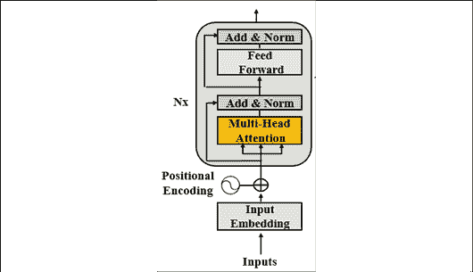
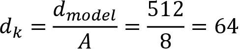
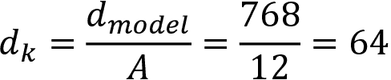
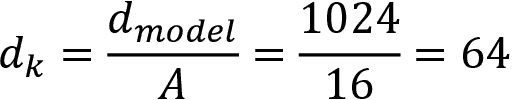
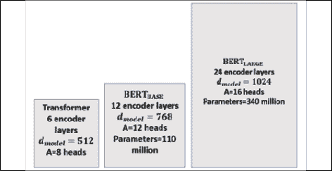
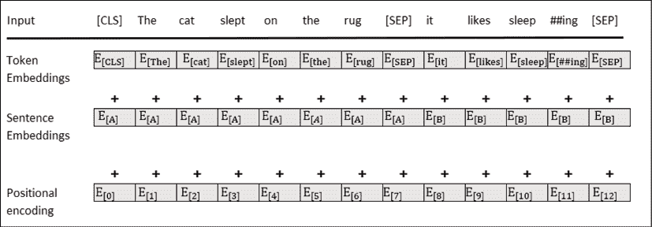
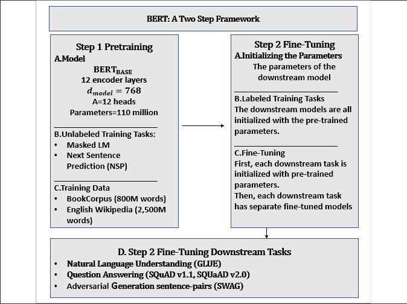
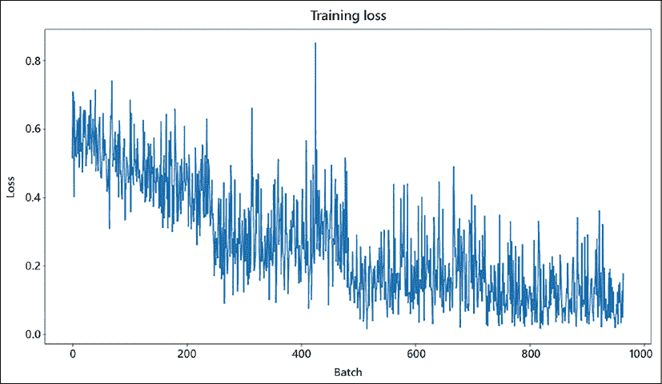
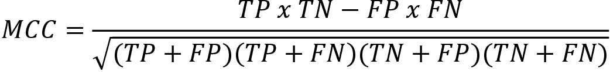

<title>Chapter_2</title> <link href="../Styles/syntax-highlighting.css" rel="stylesheet" type="text/css"> <link href="../Styles/epub.css" rel="stylesheet" type="text/css">

# Two

# 微调 BERT 模型

在*第 1 章*、*开始使用变压器*的模型架构中，我们定义了原始变压器架构的构建模块。把最初的变形金刚想象成一个用乐高^(和 T5 积木搭建的模型。构造集包含诸如编码器、解码器、嵌入层、位置编码方法、多头关注层、掩蔽多头关注层、后层归一化、前馈子层和线性输出层等砖块。砖块有各种尺寸和形状。你可以花上几个小时用同一个组装工具组装各种模型！有些建筑只需要一些砖块。其他建筑会增加一个新的部分，就像我们用乐高组件为一个模型获得额外的砖块一样。)

BERT 为变形金刚构建工具包添加了一个新的组件:双向多头注意力子层。当我们人类理解一个句子有问题时，我们不仅仅看过去的单词。伯特和我们一样，同时看同一个句子中的所有单词。

在这一章中，我们将首先探索来自变压器 ( **伯特**)的**双向编码器表示的架构。BERT 仅以新颖的方式使用变换器的编码器块，而不使用解码器堆栈。**

然后，我们将微调预训练的 BERT 模型。我们将微调的 BERT 模型由第三方训练，并上传到拥抱脸。变压器可以进行预训练。然后，例如，一个预训练的 BERT 可以在几个 NLP 任务上进行微调。我们将通过拥抱面模块来体验下游变压器使用的迷人体验。

本章涵盖以下主题:

*   变压器的双向编码器表示(BERT)
*   伯特的建筑
*   两步 BERT 框架
*   准备预训练环境
*   定义预训练编码器层
*   定义微调
*   下游多任务处理
*   构建微调 BERT 模型
*   加载可访问性判断数据集
*   创建注意力遮罩
*   伯特模型配置
*   测量微调模型的性能

我们的第一步将是探索变压器的背景。

# 伯特的建筑

BERT 引入了对变压器模型的双向关注。双向注意需要对原始的 Transformer 模型进行许多其他的更改。

我们将不再讨论第一章、*中描述的变压器的构建模块，开始使用变压器的模型架构*。你可以随时查阅*第 1 章*，复习变形金刚积木的某个方面。在这一节中，我们将关注 BERT 模型的具体方面。

我们将重点关注由 *Devlin* 等人(2018)设计的演进，这些演进描述了编码器堆栈。

我们将首先浏览编码器堆栈，然后准备预训练输入环境。然后我们将描述 BERT 的两步框架:预训练和微调。

让我们先来探索一下编码器堆栈。

## 编码器堆栈

我们将从原始 Transformer 模型中获取的第一个构建块是编码器层。*第一章*、*变压器*模型架构入门中描述的编码器层如图*图 2.1* 所示:



图 2.1:编码器层

BERT 模型不使用解码器层。BERT 模型有一个编码器堆栈，但没有解码器堆栈。屏蔽的记号(隐藏要预测的记号)在编码器的注意层中，当我们在下面的部分中放大 BERT 编码器层时，我们会看到这一点。

原变压器包含一叠 *N* =6 层。原变压器的尺寸数为*d*型号 = 512。原变压器的关注头数为 *A* =8。原变压器头部的尺寸为:



BERT 编码器层比原始变压器模型大。

可以用编码器层构建两种 BERT 模型:

*   BERT[BASE], which contains a stack of *N*=12 encoder layers. *d*[model] = 768 and can also be expressed as *H*=768, as in the BERT paper. A multi-head attention sub-layer contains *A*=12 heads. The dimensions of each head *z*[A] remains 64 as in the original Transformer model:

    在连接之前，每个多头注意力子层的输出将是 12 个头的输出:

    *output _ multi-head _ attention = { z*[0]， *z* [1] ， *z* [2] ，…，*z*[11]*}*

*   BERT[LARGE], which contains a stack of *N*=24 encoder layers. *d*[model] = 1024\. A multi-head attention sub-layer contains *A*=16 heads. The dimensions of each head *z*[A] also remains 64 as in the original Transformer model:

    在连接之前，每个多头注意力子层的输出将是 16 个头的输出:

    *output _ multi-head _ attention = { z*[0]， *z* [1] ， *z* [2] ，…，*z*[15]*}*

模型的大小可以总结如下:



图 2.2:变压器模型

大小和尺寸在伯特式预训练中起着至关重要的作用。伯特模型就像人类一样。BERT 模型用更多的工作记忆(维度)和更多的知识(数据)产生更好的结果。学习大量数据的大型变压器模型将更好地为下游 NLP 任务进行预训练。

现在让我们转到第一个子层，看看 BERT 模型中输入嵌入和位置编码的基本方面。

### 准备预训练输入环境

BERT 模型没有解码器层堆栈。因此，它没有被屏蔽的多头注意力子层。BERT 进一步指出，掩盖了序列其余部分的被掩盖的多头注意力层阻碍了注意力过程。

被屏蔽的多头关注层屏蔽当前位置之外的所有标记。例如，以下面的句子为例:

```
The cat sat on it because it was a nice rug. 
```

如果我们刚刚到达单词“it”，编码器的输入可能是:

```
The cat sat on it<masked sequence> 
```

这种方法的动机是防止模型看到它应该预测的输出。这种从左到右的方法产生相对较好的结果。

然而，模型无法通过这种方式学到很多东西。要知道`"it"`指的是什么，我们需要看完整个句子才能找到单词`"rug"`，并找出`"it"`就是地毯。

伯特的作者们想出了一个主意。为什么不预先训练模型，使用不同的方法进行预测呢？

伯特的作者提出了双向注意力，让一个注意力头从左到右和从右到左注意所有的单词。换句话说，编码器的自注意掩码可以完成工作，而不受解码器的被掩码的多头注意子层的阻碍。

该模型用两个任务来训练。第一种方法是**假面语言** **造型** ( **MLM** )。第二种方法是**下一句预测** ( **NSP** )。

先说掩码语言建模。

#### 掩蔽语言建模

屏蔽语言建模不需要用一系列可见单词后跟一个屏蔽序列来训练模型进行预测。

BERT 引入了*双向*分析，在句子的一个单词上使用随机掩码。

值得注意的是，BERT 对输入应用了`WordPiece`(一种子词切分方法，标记化)。它还使用学习位置编码，而不是正弦余弦方法。

潜在的输入序列可以是:

```
"The cat sat on it because it was a nice rug." 
```

在模型到达单词`"it"`后，解码器会屏蔽注意力序列:

```
"The cat sat on it <masked sequence>." 
```

但是 BERT 编码器屏蔽了一个随机标记来进行预测:

```
"The cat sat on it [MASK] it was a nice rug." 
```

多关注子层现在可以看到整个序列，运行自关注过程，并预测屏蔽令牌。

输入令牌以一种巧妙的方式被屏蔽*以迫使模型训练更长时间，但使用三种方法产生更好的结果*:

*   不屏蔽 10%的数据集上的单个令牌，让模型大吃一惊；例如:

    ```
    "The cat sat on it [because] it was a nice rug." 
    ```

*   通过在 10%的数据集上将令牌替换为随机令牌，让模型大吃一惊；例如:

    ```
    "The cat sat on it [often] it was a nice rug." 
    ```

*   在 80%的数据集上用`[MASK]`标记替换标记；比如:

    ```
    "The cat sat on it [MASK] it was a nice rug." 
    ```

作者的大胆方法避免了过度拟合，并迫使模型有效训练。

伯特还被训练进行下一句话预测。

#### 下一句预测

发现的第二种训练伯特的方法是**下一句预测** ( **NSP** )。输入包含两个句子。

添加了两个新令牌:

*   `[CLS]`是添加到第一个序列开头的二进制分类标记，用于预测第二个序列是否跟随第一个序列。正样本通常是从数据集中提取的一对连续的句子。使用来自不同文档的序列创建阴性样本。
*   `[SEP]`是表示序列结束的分隔符号。

例如，取自一本书的输入句子可以是:

```
"The cat slept on the rug. It likes sleeping all day." 
```

这两个句子将成为一个完整的输入序列:

```
[CLS] the cat slept on the rug [SEP] it likes sleep ##ing all day[SEP] 
```

这种方法需要额外的编码信息来区分序列 A 和序列 b

如果我们把整个嵌入过程放在一起，我们得到:



图 2.3:输入嵌入

输入嵌入是通过对标记嵌入、片段(句子、短语、单词)嵌入和位置编码嵌入求和而获得的。

BERT 模型的输入嵌入和位置编码子层可以总结如下:

*   一个单词序列被分解成`WordPiece`个记号。
*   一个`[MASK]`标记将随机替换用于掩蔽语言建模训练的初始单词标记。
*   出于分类目的，在序列的开头插入一个`[CLS]`分类标记。
*   一个`[SEP]`记号分隔两个句子(片段、短语)用于 NSP 训练。
*   在令牌嵌入中加入了句子嵌入，这样句子 A 和句子 b 的句子嵌入值就不一样了。
*   学习位置编码。不应用原始变换器的正弦-余弦位置编码方法。

一些额外的关键特征是:

*   BERT 在其所有多头注意力子层中使用双向注意力，打开了学习和理解标记之间关系的广阔视野。
*   BERT 介绍了无监督嵌入的场景，用无标签文本预训练模型。这迫使模型在多头注意力学习过程中更加努力地思考。这使得 BERT 能够学习语言是如何构建的，并将这些知识应用于下游任务，而不必每次都进行预训练。
*   BERT 还使用监督学习，涵盖了预训练过程中的所有基础。

伯特改善了变形金刚的训练环境。现在让我们看看预训练的动机以及它如何帮助微调过程。

## 预训练和微调 BERT 模型

BERT 是一个两步框架。第一步是预调，第二步是微调，如图*图 2.4* 所示:



图 2.4:BERT 框架

训练一个变形金刚模型可能需要几个小时，甚至几天。设计架构和参数，并选择合适的数据集来训练变压器模型需要花费相当多的时间。

预训练是 BERT 框架的第一步,可以分为两个子步骤:

*   定义模型的架构:层数、头数、维度和模型的其他构件
*   训练模式上**蒙面** **语言建模** ( **MLM** )和 NSP 任务

BERT 框架的第二步是微调，也可以分为两个子步骤:

*   用预训练的 BERT 模型的训练参数初始化选择的下游模型
*   微调特定下游任务的参数，例如**识别文本蕴涵** ( **RTE** )、问题回答(`SQuAD v1.1`、`SQuAD v2.0`)以及**具有对立世代的情况**(**SWAG**)

在本节中，我们介绍了微调 BERT 模型所需的信息。在接下来的章节中，我们将更深入地探讨我们在本节中提出的主题:

*   在*第 3 章*、*从头开始预训练一个 RoBERTa 模型*中，我们将用 15 个步骤从头开始预训练一个类似 BERT 的模型。我们甚至会编译自己的数据，训练一个分词器，然后训练模型。本章的目标是首先介绍 BERT 的具体构建模块，然后对现有模型进行微调。
*   在*第 4 章*、*变压器的下游 NLP 任务*中，我们将经历许多下游 NLP 任务，探索`GLUE`、`SQuAD v1.1`、`SQuAD`、`SWAG`、`BLEU`以及其他几个 NLP 评估数据集。我们将运行几个下游的 transformer 模型来说明关键任务。本章的目标是微调下游模型。
*   在*第 6 章*、*使用 OpenAI GPT-2 和 GPT-3 模型*生成文本中，我们将探索 Open AI `GPT`、`GPT-2`和`GPT-3`变形金刚的架构和用法。BERT [BASE] 被配置为接近 OpenAI `GPT`以显示其产生了更好的性能。然而，OpenAI 变形金刚也在不断进化！我们将看到如何。

在这一章中，我们将微调的 BERT 模型将在**语言可接受性语料库** ( **可乐**)上进行训练。下游任务基于 Alex Warstadt、Amanpreet Singh 和 Samuel R. Bowman 的*神经网络可接受性判断*。

我们将微调一个 BERT 模型，它将决定一个句子的语法可接受性。微调后的模型将获得一定水平的语言能力。

我们已经了解了 BERT 架构及其预训练和微调框架。现在让我们微调一个 BERT 模型。

# 微调伯特

在本节中，我们将微调一个 BERT 模型，以预测*可接受性判断*的下游任务，并用**马修斯相关系数** ( **MCC** )测量预测，这将在本章的*使用马修斯相关系数*评估部分中解释。

在 Google Colab 中打开`BERT_Fine_Tuning_Sentence_Classification_DR.ipynb`(确保你有一个电子邮件账户)。笔记本在这本书的 GitHub 资源库的`Chapter02`里。

笔记本中每个单元格的标题也是一样的，或者非常接近本章各小节的标题。

让我们开始确保 GPU 被激活。

## 激活 GPU

预训练多头注意力变压器模型需要 GPU 能够提供的并行处理。

该程序首先检查 GPU 是否已激活:

```
#@title Activating the GPU

# Main menu->Runtime->Change Runtime Type

import tensorflow as tf

device_name = tf.test.gpu_device_name()

if device_name != '/device:GPU:0':

  raise SystemError('GPU device not found')

print('Found GPU at: {}'.format(device_name)) 
```

输出应该是:

```
Found GPU at: /device:GPU:0 
```

该计划将使用拥抱脸模块。

## 为 BERT 安装拥抱脸 PyTorch 接口

拥抱脸提供了一个预训练的伯特模型。抱脸开发了一个名为`PreTrainedModel`的基类。通过安装这个类，我们可以从预训练的模型配置中加载一个模型。

拥抱脸在 TensorFlow 和 PyTorch 中提供模块。我建议开发人员对这两种环境都感到舒适。优秀的人工智能研究团队使用其中一种或两种环境。

在本章中，我们将安装所需的模块，如下所示:

```
#@title Installing the Hugging Face PyTorch Interface for Bert

!pip install -q transformers 
```

安装将运行，或者将显示满足要求的消息。

我们现在可以导入程序所需的模块。

## 导入模块

我们将导入所需的预训练模块，例如预训练`BERT tokenizer`和 BERT 模型的配置。`BERTAdam`优化器与序列分类模块一起导入:

```
#@title Importing the modules

import torch

from torch.utils.data import TensorDataset, DataLoader, RandomSampler, SequentialSampler

from keras.preprocessing.sequence import pad_sequences

from sklearn.model_selection import train_test_split

from transformers import BertTokenizer, BertConfig

from transformers import AdamW, BertForSequenceClassification, get_linear_schedule_with_warmup 
```

一个漂亮的进度条模块是从`tqdm`导入的:

```
from tqdm import tqdm, trange 
```

我们现在可以导入广泛使用的标准 Python 模块:

```
import pandas as pd

import io

import numpy as np

import matplotlib.pyplot as plt 
```

如果一切顺利，将不会显示任何消息，记住 Google Colab 已经在我们正在使用的 VM 上预装了这些模块。

## 指定 CUDA 作为 torch 的设备

我们现在将指定 torch 使用**计算统一设备架构** ( **CUDA** )将 NVIDIA 卡的并行计算能力用于我们的多头注意力模型:

```
#@title Specify CUDA as device for Torch

device = torch.device("cuda" if torch.cuda.is_available() else "cpu")

n_gpu = torch.cuda.device_count()

torch.cuda.get_device_name(0) 
```

我在 Google Colab 上运行的虚拟机显示了以下输出:

```
'Tesla P100-PCIE-16GB' 
```

输出可能因 Google Colab 配置而异。

我们现在将加载数据集。

## 加载数据集

我们现在将根据*沃斯塔特*等人(2018)的论文加载*可乐*。

**通用语言理解评估** ( **胶水**)将*语言可接受性*作为最优先的 NLP 任务。在*第 4 章*、*变压器的下游 NLP 任务*中，我们将探讨变压器必须执行的关键任务，以证明其效率。

使用 Google Colab 文件管理器上传`in_domain_train.tsv`和`out_of_domain_dev.tsv`，你可以在 GitHub 上找到这本书的存储库的`Chapter02`目录。

您应该会看到它们出现在文件管理器中:


图 2.5:上传数据集

现在程序将加载数据集:

```
#@title Loading the Dataset

#source of dataset : https://nyu-mll.github.io/CoLA/

df = pd.read_csv("in_domain_train.tsv", delimiter='\t', header=None, names=['sentence_source', 'label', 'label_notes', 'sentence'])

df.shape 
```

输出显示了我们导入的数据集的形状:

```
(8551, 4) 
```

显示一个 10 行样本，以可视化*可接受性判断*任务，并查看一个序列是否有意义:

```
df.sample(10) 
```

输出显示标记数据集的`10`行:

```
sentence_source	label	label_notes	sentence

1742	r-67		1	NaN		they said that tom would n't pay up , but pay ...

937	bc01		1	NaN		although he likes cabbage too , fred likes egg...

5655	c_13		1	NaN		wendy 's mother country is iceland .

500	bc01		0	*		john is wanted to win .

4596	ks08		1	NaN		i did n't find any bugs in my bed .

7412	sks13		1	NaN		the girl he met at the departmental party will...

8456	ad03		0	*		peter is the old pigs .

744	bc01		0	*		frank promised the men all to leave .

5420	b_73		0	*		i 've seen as much of a coward as frank .

5749	c_13		1	NaN		we drove all the way to buenos aires . 
```

`.tsv`文件中的每个样本包含四个制表符分隔的列:

*   第 1 列:句子的来源(代码)
*   第 2 栏:标签(`0`=不可接受，`1`=可接受)
*   第三栏:作者标注的标签
*   第 4 栏:要分类的句子

您可以在本地打开`.tsv`文件来读取数据集的一些样本。程序现在将处理 BERT 模型的数据。

## 创建句子、标签列表和添加 BERT 标记

程序现在将创建本章*准备预训练输入环境*部分中描述的语句:

```
#@ Creating sentence, label lists and adding Bert tokens

sentences = df.sentence.values

# Adding CLS and SEP tokens at the beginning and end of each sentence for BERT

sentences = ["[CLS] " + sentence + " [SEP]" for sentence in sentences]

labels = df.label.values 
```

现在已经添加了`[CLS]`和`[SEP]`。

程序现在激活记号赋予器。

## 激活 BERT 记号赋予器

在本节中，我们将初始化一个预训练的 BERT 记号赋予器。这将节省从头开始训练它的时间。

程序选择一个未区分大小写的标记器，激活它，并显示第一个标记化的句子:

```
#@title Activating the BERT Tokenizer

tokenizer = BertTokenizer.from_pretrained('bert-base-uncased', do_lower_case=True)

tokenized_texts = [tokenizer.tokenize(sent) for sent in sentences]

print ("Tokenize the first sentence:")

print (tokenized_texts[0]) 
```

输出包含分类标记和序列分段标记:

```
Tokenize the first sentence:

['[CLS]', 'our', 'friends', 'wo', 'n', "'", 't', 'buy', 'this', 'analysis', ',', 'let', 'alone', 'the', 'next', 'one', 'we', 'propose', '.', '[SEP]'] 
```

程序现在将处理数据。

## 处理数据

我们需要确定一个固定的最大长度，并为模型处理数据。数据集中的句子都很短。但是，为了确保这一点，程序将序列的最大长度设置为`512`,并对序列进行填充:

```
#@title Processing the data

# Set the maximum sequence length. The longest sequence in our training set is 47, but we'll leave room on the end anyway. 

# In the original paper, the authors used a length of 512.

MAX_LEN = 128

# Use the BERT tokenizer to convert the tokens to their index numbers in the BERT vocabulary

input_ids = [tokenizer.convert_tokens_to_ids(x) for x in tokenized_texts]

# Pad our input tokens

input_ids = pad_sequences(input_ids, maxlen=MAX_LEN, dtype="long", truncating="post", padding="post") 
```

序列已经被处理，现在程序创建注意屏蔽。

## 创建注意力遮罩

现在是过程中棘手的部分。我们填充了前一个单元格中的序列。但是我们希望防止模型对那些填充的标记执行注意！

这个想法是为每个标记应用一个值为`1`的掩码，后面跟着用于填充的`0` s:

```
#@title Create attention masks

attention_masks = []

# Create a mask of 1s for each token followed by 0s for padding

for seq in input_ids:

  seq_mask = [float(i>0) for i in seq]

  attention_masks.append(seq_mask) 
```

程序现在将拆分数据。

## 将数据拆分为训练集和验证集

程序现在执行将数据分成训练集和验证集的标准过程:

```
#@title Splitting data into train and validation sets

# Use train_test_split to split our data into train and validation sets for training

train_inputs, validation_inputs, train_labels, validation_labels = train_test_split(input_ids, labels, random_state=2018, test_size=0.1)

train_masks, validation_masks, _, _ = train_test_split(attention_masks, input_ids,random_state=2018, test_size=0.1) 
```

数据已经可以训练了，但是还需要适应 torch。

## 将所有数据转换成火炬张量

微调模型使用火炬张量。程序必须将数据转换成火炬张量:

```
#@title Converting all the data into torch tensors

# Torch tensors are the required datatype for our model

train_inputs = torch.tensor(train_inputs)

validation_inputs = torch.tensor(validation_inputs)

train_labels = torch.tensor(train_labels)

validation_labels = torch.tensor(validation_labels)

train_masks = torch.tensor(train_masks)

validation_masks = torch.tensor(validation_masks) 
```

转换结束了。现在我们需要创建一个迭代器。

## 选择批量大小并创建迭代器

在这个单元格中，程序选择一个批处理大小并创建一个迭代器。迭代器是避免将所有数据加载到内存中的循环的聪明方法。迭代器配合 torch `DataLoader`，可以批量训练庞大的数据集，而不会让机器内存崩溃。

在该模型中，批量大小为`32`:

```
#@title Selecting a Batch Size and Creating and Iterator

# Select a batch size for training. For fine-tuning BERT on a specific task, the authors recommend a batch size of 16 or 32

batch_size = 32

# Create an iterator of our data with torch DataLoader. This helps save on memory during training because, unlike a for loop, 

# with an iterator the entire dataset does not need to be loaded into memory

train_data = TensorDataset(train_inputs, train_masks, train_labels)

train_sampler = RandomSampler(train_data)

train_dataloader = DataLoader(train_data, sampler=train_sampler, batch_size=batch_size)

validation_data = TensorDataset(validation_inputs, validation_masks, validation_labels)

validation_sampler = SequentialSampler(validation_data)

validation_dataloader = DataLoader(validation_data, sampler=validation_sampler, batch_size=batch_size) 
```

数据已经过处理并全部设置。程序现在可以加载和配置 BERT 模型。

## 伯特模型配置

程序现在初始化一个 BERT 无壳配置:

```
#@title BERT Model Configuration

# Initializing a BERT bert-base-uncased style configuration

#@title Transformer Installation

try:

  import transformers

except:

  print("Installing transformers")

  !pip -qq install transformers

from transformers import BertModel, BertConfig

configuration = BertConfig()

# Initializing a model from the bert-base-uncased style configuration

model = BertModel(configuration)

# Accessing the model configuration

configuration = model.config

print(configuration) 
```

输出显示主要的拥抱脸参数，如下所示(库经常更新):

```
BertConfig {

  "attention_probs_dropout_prob": 0.1,

  "hidden_act": "gelu",

  "hidden_dropout_prob": 0.1,

  "hidden_size": 768,

  "initializer_range": 0.02,

  "intermediate_size": 3072,

  "layer_norm_eps": 1e-12,

  "max_position_embeddings": 512,

  "model_type": "bert",

  "num_attention_heads": 12,

  "num_hidden_layers": 12,

  "pad_token_id": 0,

  "type_vocab_size": 2,

  "vocab_size": 30522

} 
```

让我们来看看这些主要参数:

*   `attention_probs_dropout_prob` : `0.1`将`0.1`退出率应用于注意概率。
*   `hidden_act` : `"gelu"`是编码器中的非线性激活功能。它是一个*高斯误差线性单位*激活函数。输入按其幅度加权，这使得它是非线性的。
*   `hidden_dropout_prob` : `0.1`是应用于完全连接层的丢失概率。完整的连接可以在嵌入、编码器和池层中找到。pooler 在那里为分类任务转换序列张量，分类任务需要一个固定的维度来表示序列。因此，池程序会将序列张量转换为(批量大小，隐藏大小)，这是固定的参数。
*   `hidden_size` : `768`是编码层的维度，也是池层的维度。
*   `initializer_range` : `0.02`是初始化权重矩阵时的标准偏差值。
*   `intermediate_size` : `3072`为编码器前馈层的尺寸。
*   `layer_norm_eps` : `1e-12`是层归一化层的ε值。
*   `max_position_embeddings` : `512`是模型使用的最大长度。
*   `model_type` : `"bert"`是型号的名称。
*   `num_attention_heads` : `12`是人头数。
*   `num_hidden_layers` : `12`为层数。
*   `pad_token_id` : `0`是填充令牌的 ID，以避免训练填充令牌。
*   `type_vocab_size` : `2`是`token_type_ids`的大小，用来标识序列。例如，“the `dog[SEP]` The `cat.[SEP]`可以用`6`令牌 id:`[0,0,0, 1,1,1]`来表示。
*   `vocab_size` : `30522`是模型用来表示`input_ids`的不同令牌的数量。

有了这些参数，我们可以加载预训练的模型。

## 加载拥抱脸 BERT 无壳基本模型

程序现在加载预训练的 BERT 模型:

```
#@title Loading Hugging Face Bert uncased base model 

model = BertForSequenceClassification.from_pretrained("bert-base-uncased", num_labels=2)

model.cuda() 
```

如果需要，可以进一步训练这个预训练模型。详细探究该体系结构以可视化每个子层的参数是很有趣的，如以下摘录所示:

```
BertForSequenceClassification(

  (bert): BertModel(

    (embeddings): BertEmbeddings(

      (word_embeddings): Embedding(30522, 768, padding_idx=0)

      (position_embeddings): Embedding(512, 768)

      (token_type_embeddings): Embedding(2, 768)

      (LayerNorm): BertLayerNorm()

      (dropout): Dropout(p=0.1, inplace=False)

    )

    (encoder): BertEncoder(

      (layer): ModuleList(

        (0): BertLayer(

          (attention): BertAttention(

            (self): BertSelfAttention(

              (query): Linear(in_features=768, out_features=768, bias=True)

              (key): Linear(in_features=768, out_features=768, bias=True)

              (value): Linear(in_features=768, out_features=768, bias=True)

              (dropout): Dropout(p=0.1, inplace=False)

            )

            (output): BertSelfOutput(

              (dense): Linear(in_features=768, out_features=768, bias=True)

              (LayerNorm): BertLayerNorm()

              (dropout): Dropout(p=0.1, inplace=False)

            )

          )

          (intermediate): BertIntermediate(

            (dense): Linear(in_features=768, out_features=3072, bias=True)

          )

          (output): BertOutput(

            (dense): Linear(in_features=3072, out_features=768, bias=True)

            (LayerNorm): BertLayerNorm()

            (dropout): Dropout(p=0.1, inplace=False)

          )

        )

        (1): BertLayer(

          (attention): BertAttention(

            (self): BertSelfAttention(

              (query): Linear(in_features=768, out_features=768, bias=True)

              (key): Linear(in_features=768, out_features=768, bias=True)

              (value): Linear(in_features=768, out_features=768, bias=True)

              (dropout): Dropout(p=0.1, inplace=False)

            )

            (output): BertSelfOutput(

              (dense): Linear(in_features=768, out_features=768, bias=True)

              (LayerNorm): BertLayerNorm()

              (dropout): Dropout(p=0.1, inplace=False)

            )

          )

          (intermediate): BertIntermediate(

            (dense): Linear(in_features=768, out_features=3072, bias=True)

          )

          (output): BertOutput(

            (dense): Linear(in_features=3072, out_features=768, bias=True)

            (LayerNorm): BertLayerNorm()

            (dropout): Dropout(p=0.1, inplace=False)

          )

        ) 
```

现在让我们来看看优化器的主要参数。

## 优化器分组参数

程序现在将为模型的参数初始化优化器。微调模型从初始化预训练的模型参数值(不是它们的名称)开始。

优化器的参数包括权重衰减率以避免过度拟合，并且一些参数被过滤。

目标是为训练循环准备模型的参数:

```
##@title Optimizer Grouped Parameters

#This code is taken from:

# https://github.com/huggingface/transformers/blob/5bfcd0485ece086ebcbed2d008813037968a9e58/examples/run_glue.py#L102

# Don't apply weight decay to any parameters whose names include these tokens.

# (Here, the BERT doesn't have 'gamma' or 'beta' parameters, only 'bias' terms)

param_optimizer = list(model.named_parameters())

no_decay = ['bias', 'LayerNorm.weight']

# Separate the 'weight' parameters from the 'bias' parameters. 

# - For the 'weight' parameters, this specifies a 'weight_decay_rate' of 0.01\. 

# - For the 'bias' parameters, the 'weight_decay_rate' is 0.0\. 

optimizer_grouped_parameters = [

    # Filter for all parameters which *don't* include 'bias', 'gamma', 'beta'.

    {'params': [p for n, p in param_optimizer if not any(nd in n for nd in no_decay)],

     'weight_decay_rate': 0.1},

    # Filter for parameters which *do* include those.

    {'params': [p for n, p in param_optimizer if any(nd in n for nd in no_decay)],

     'weight_decay_rate': 0.0}

]

# Note - 'optimizer_grouped_parameters' only includes the parameter values, not 

# the names. 
```

参数已经准备好并且已经清理完毕。他们已经为训练循环做好了准备。

## 训练循环的超参数

训练循环的超参数是至关重要的，尽管它们看起来无关紧要。例如，亚当会激活体重衰减，也会经历一个热身阶段。

学习速率(`lr`)和预热速率(`warmup`)应在优化阶段的早期设置为非常小的值，并在一定次数的迭代后逐渐增加。这避免了大的梯度和超过优化目标。

一些研究人员认为，在层标准化之前，子层输出级别的梯度不需要预热率。解决这个问题需要多次实验。

优化器是 Adam 的 BERT 版本，名为`BertAdam`:

```
#@title The Hyperparameters for the Training Loop 

optimizer = BertAdam(optimizer_grouped_parameters,

                     lr=2e-5,

                     warmup=.1) 
```

该程序增加了一个精度测量功能，将预测值与标签进行比较:

```
#Creating the Accuracy Measurement Function

# Function to calculate the accuracy of our predictions vs labels

def flat_accuracy(preds, labels):

    pred_flat = np.argmax(preds, axis=1).flatten()

    labels_flat = labels.flatten()

    return np.sum(pred_flat == labels_flat) / len(labels_flat) 
```

数据准备好了，参数准备好了。是时候激活训练循环了！

## 训练循环

训练循环遵循标准学习流程。历元数设置为`4`，有一个损耗和精度的度量，将标绘出来。训练循环使用 dataloader 加载和训练批处理。对培训过程进行测量和评估。

代码从初始化`train_loss_set`开始，它将存储损耗和精度，并被绘制出来。它开始训练其历元，并运行标准训练循环，如以下摘录所示:

```
#@title The Training Loop

t = [] 

# Store our loss and accuracy for plotting

train_loss_set = []

# Number of training epochs (authors recommend between 2 and 4)

epochs = 4

# trange is a tqdm wrapper around the normal python range

for _ in trange(epochs, desc="Epoch"):

…./…

    tmp_eval_accuracy = flat_accuracy(logits, label_ids)

    eval_accuracy += tmp_eval_accuracy

    nb_eval_steps += 1

  print("Validation Accuracy: {}".format(eval_accuracy/nb_eval_steps)) 
```

输出显示带有`trange`包装器`for _ in trange(epochs, desc="Epoch")`的每个`epoch`的信息:

```
***output***

Epoch:   0%|          | 0/4 [00:00<?, ?it/s]

Train loss: 0.5381132976395461

Epoch:  25%|██▌       | 1/4 [07:54<23:43, 474.47s/it]

Validation Accuracy: 0.788966049382716

Train loss: 0.315329696132929

Epoch:  50%|█████     | 2/4 [15:49<15:49, 474.55s/it]

Validation Accuracy: 0.836033950617284

Train loss: 0.1474070605354314

Epoch:  75%|███████▌  | 3/4 [23:43<07:54, 474.53s/it]

Validation Accuracy: 0.814429012345679

Train loss: 0.07655430570461196

Epoch: 100%|██████████| 4/4 [31:38<00:00, 474.58s/it]

Validation Accuracy: 0.810570987654321 
```

Transformer 模型发展非常快，可能会出现弃用消息甚至错误。拥抱脸也不例外，当这种情况发生时，我们必须相应地更新我们的代码。

模型被训练。我们现在可以显示培训评估。

## 培训评估

损失和精度值存储在`train_loss_set`中，如训练循环开始时所定义的。

程序现在绘制测量值:

```
#@title Training Evaluation

plt.figure(figsize=(15,8))

plt.title("Training loss")

plt.xlabel("Batch")

plt.ylabel("Loss")

plt.plot(train_loss_set)

plt.show() 
```

输出是一个图表，显示培训过程进展顺利且高效:



图 2.6:每批培训损失

该模型已经过微调。我们现在可以运行预测。

## 使用维持数据集进行预测和评估

BERT 下游模型是用`in_domain_train.tsv`数据集训练的。该程序现在将使用包含在`out_of_domain_dev.tsv`文件中的 `holdout`(测试)数据集进行预测。目标是预测句子在语法上是否正确。

下面的代码摘录显示，应用于定型数据的数据准备过程在维持数据集的代码部分中重复进行:

```
#@title Predicting and Evaluating Using the Holdout Dataset 

df = pd.read_csv("out_of_domain_dev.tsv", delimiter='\t', header=None, names=['sentence_source', 'label', 'label_notes', 'sentence'])

# Create sentence and label lists

sentences = df.sentence.values

# We need to add special tokens at the beginning and end of each sentence for BERT to work properly

sentences = ["[CLS] " + sentence + " [SEP]" for sentence in sentences]

labels = df.label.values

tokenized_texts = [tokenizer.tokenize(sent) for sent in sentences]

.../... 
```

然后程序使用`dataloader`运行批量预测:

```
# Predict 

for batch in prediction_dataloader:

  # Add batch to GPU

  batch = tuple(t.to(device) for t in batch)

  # Unpack the inputs from our dataloader

  b_input_ids, b_input_mask, b_labels = batch

  # Telling the model not to compute or store gradients, saving memory and speeding up prediction

  with torch.no_grad():

    # Forward pass, calculate logit predictions

    logits = model(b_input_ids, token_type_ids=None, attention_mask=b_input_mask) 
```

预测的逻辑和标签被移动到 CPU:

```
 # Move logits and labels to CPU

  logits =  logits['logits'].detach().cpu().numpy()

  label_ids = b_labels.to('cpu').numpy() 
```

预测和它们的真实标签被存储:

```
 # Store predictions and true labels

  predictions.append(logits)

  true_labels.append(label_ids) 
```

该程序现在可以评估预测。

## 使用马修斯相关系数进行评估

**马修斯相关系数** ( **MCC** )最初被设计用来测量二进制分类的质量，而可以被修改为多类相关系数。在每次预测中，可以用四种概率进行两级分类:

*   TP =真阳性
*   TN =真阴性
*   FP =假阳性
*   FN =假阴性

生物化学家布莱恩·w·马修斯(Brian W. Matthews)在 1975 年设计了它，灵感来自于他的前辈们的 *phi* 函数。从那以后，它演变成了各种格式，如下所示:



MCC 产生的值在`-1`和`+1`之间。`+1`是一个预测的最大正值。`-1`是一个逆预测。`0`是一个平均随机预测。

GLUE 用 MCC 评估*的语言可接受性*。

MCC 从`sklearn.metrics`导入:

```
#@title Evaluating Using Matthew's Correlation Coefficient

# Import and evaluate each test batch using Matthew's correlation coefficient

from sklearn.metrics import matthews_corrcoef 
```

创建一组预测:

```
matthews_set = [] 
```

MCC 值被计算并存储在`matthews_set`中:

```
for i in range(len(true_labels)):

  matthews = matthews_corrcoef(true_labels[i],

                 np.argmax(predictions[i], axis=1).flatten())

  matthews_set.append(matthews) 
```

您可能会看到由于库和模块版本更改而产生的消息。最终分数将基于整个测试集，但是让我们看一下单个批次的分数，以了解批次之间度量的可变性。

## 个别批次的分数

让我们来看看各个批次的分数:

```
#@title Score of Individual Batches

matthews_set 
```

输出产生的 MCC 值在`-1`和`+1`之间，与预期一致:

```
[0.049286405809014416,

 -0.2548235957188128,

 0.4732058754737091,

 0.30508307783296046,

 0.3567530340063379,

 0.8050112948805689,

 0.23329882422520506,

 0.47519096331149147,

 0.4364357804719848,

 0.4700159919404217,

 0.7679476477883045,

 0.8320502943378436,

 0.5807564950208268,

 0.5897435897435898,

 0.38461538461538464,

 0.5716350506349809,

 0.0] 
```

几乎所有的 MCC 值都是正值，这是好消息。让我们看看对整个数据集的评估是什么。

## 整个数据集的 Matthews 评估

MCC 是评估分类模型的实用方法。

程序现在将聚合整个数据集的真值:

```
#@title Matthew's Evaluation on the Whole Dataset

# Flatten the predictions and true values for aggregate Matthew's evaluation on the whole dataset

flat_predictions = [item for sublist in predictions for item in sublist]

flat_predictions = np.argmax(flat_predictions, axis=1).flatten()

flat_true_labels = [item for sublist in true_labels for item in sublist]

matthews_corrcoef(flat_true_labels, flat_predictions) 
```

输出确认 MCC 为正，这表明该模型和数据集之间存在相关性:

```
0.45439842471680725 
```

在对 BERT 模型微调的最终积极评价中，我们对 BERT 培训框架有了一个总体的看法。

# 摘要

伯特给变形金刚带来双向关注。从左到右预测序列并屏蔽未来的标记来训练模型具有严重的局限性。如果被屏蔽的序列包含了我们要寻找的意义，那么模型就会产生错误。伯特同时关注一个序列的所有记号。

我们探索了 BERT 的架构，它仅使用变压器的编码器堆栈。BERT 被设计成一个两步框架。该框架的第一步是预训练模型。第二步，对模型进行微调。我们为一个*可接受性判断*下游任务建立了一个微调 BERT 模型。微调过程贯穿于整个过程的各个阶段。首先，我们加载数据集，并加载模型的必要的预训练模块。然后训练该模型，并测量其性能。

与从头开始训练下游任务相比，微调预训练模型需要更少的机器资源。微调模型可以执行各种任务。BERT 证明了我们只能在两个任务上预训练一个模型，这本身就很了不起。但是基于 BERT 预训练模型的训练参数产生多任务微调模型是非同寻常的。OpenAI GPT 公司以前就研究过这种方法，但是伯特把它带到了另一个层次！

在本章中，我们微调了一个 BERT 模型。在下一章*第 3 章*、*从头开始预训练 RoBERTa 模型*中，我们将更深入地挖掘 BERT 框架，并从头开始构建一个类似 BERT 的预训练模型。

# 问题

1.  BERT 代表来自变压器的双向编码器表示。(对/错)
2.  BERT 是一个两步框架。*步骤 1* 是预训练。*第二步*是微调。(对/错)
3.  微调 BERT 模型意味着从头开始训练参数。(对/错)
4.  BERT 仅使用所有下游任务进行预训练。(对/错)
5.  伯特用**蒙面** **语言建模** ( **MLM** )进行预训练。(对/错)
6.  伯特用**下一句预测** ( **NSP** )进行预训练。(对/错)
7.  伯特预先训练数学函数。(对/错)
8.  问答任务是下游任务。(对/错)
9.  BERT 预训练模型不需要标记化。(对/错)
10.  微调 BERT 模型比预训练花费的时间少。(对/错)

# 参考

*   *阿希什·瓦斯瓦尼*、*诺姆·沙泽尔*、*尼基·帕尔马*、*雅各布·乌兹科雷特*、*利翁·琼斯*、*艾丹·戈麦斯*、*卢卡斯·凯泽*、*伊利亚·波洛舒欣*、2017、*关注就是你需要的全部* : 【T18
*   *雅各布·德夫林*、*张明蔚*、*肯顿·李*、*克里斯蒂娜·图塔诺娃*2018、*伯特:语言理解深度双向变形金刚前期训练*:[https://arxiv.org/abs/1810.04805](https://arxiv.org/abs/1810.04805)
*   *亚历克斯·沃斯塔特*、*阿曼普里特·辛格*、*塞缪尔·r·鲍曼*2018、*神经网络可接受性判断*:[https://arxiv.org/abs/1805.12471](https://arxiv.org/abs/1805.12471 )
*   *语言可接受性语料库(可乐)*:【https://nyu-mll.github.io/CoLA/】T2
*   抱脸模特的文档:[https://huggingface.co/transformers/pretrained_models.html](https://huggingface.co/transformers/pretrained_models.html)、[https://huggingface.co/transformers/model_doc/bert.html](https://huggingface.co/transformers/model_doc/bert.html)、[https://huggingface.co/transformers/model_doc/roberta.html](https://huggingface.co/transformers/model_doc/roberta.html)、[https://Hugging Face . co/transformers/model _ doc/distil Bert . html](https://huggingface.co/transformers/model_doc/distilbert.html)。