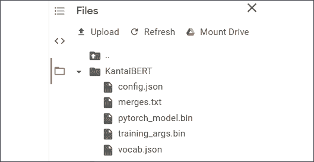

# three

# 从头开始预训练 RoBERTa 模型

在本章中，我们将从头开始构建一个 RoBERTa 模型。该模型将采用我们为 BERT 模型所需的变压器构造套件的砖块。此外，不会使用预先训练的记号赋予器或模型。RoBERTa 模型将按照本章描述的 15 个步骤来构建。

我们将使用在前几章中获得的转换器知识来构建一个模型，该模型可以一步一步地对屏蔽的标记执行语言建模。在*第 1 章*、*开始使用变压器的模型架构*中，我们浏览了原始变压器的构建模块。在*第 2 章*、*微调 BERT 模型*中，我们微调了一个预训练的 BERT 模型。

这一章将集中在使用基于拥抱脸的无缝模块的 Jupyter 笔记本从头开始构建一个预训练的变压器模型。该型号命名为`KantaiBERT`。

KantaiBERT 首先加载了为本章编写的伊曼纽尔·康德的书籍汇编。我们将了解数据是如何获得的。您将看到如何为这个笔记本创建自己的数据集。

KantaiBERT 从头开始训练自己的标记器。它将构建自己的合并和词汇文件，这些文件将在预训练过程中使用。

KantaiBERT 然后处理数据集，初始化训练器，并训练模型。

最后，KantaiBERT 使用训练好的模型来执行实验性的下游语言建模任务，并使用伊曼纽尔·康德的逻辑填充一个面具。

到本章结束时，您将知道如何从头开始构建一个 transformer 模型。

本章涵盖以下主题:

*   罗伯塔式和蒸馏式模型
*   如何从零开始训练一个记号赋予者
*   字节级字节对编码
*   将训练好的标记器保存到文件中
*   为预训练过程重新创建记号赋予器
*   从头开始初始化 RoBERTa 模型
*   探索模型的配置
*   探索模型的 8000 万个参数
*   为培训师构建数据集
*   初始化训练器
*   预训练模型
*   保存模型
*   将该模型应用于掩蔽语言建模的下游任务

我们的第一步将是描述我们将要构建的 transformer 模型。

# 训练标记器和预训练转换器

在这一章中，我们将训练一个名为`KantaiBERT`的转换器模型，使用抱紧脸为类似伯特的模型提供的积木。我们讨论了我们将在第 2 章*、*微调 BERT 模型*中使用的模型的构建模块的理论。*

我们将根据前几章学到的知识来描述 KantaiBERT。

KantaiBERT 是一种**稳健优化的 BERT 预训练方法** ( **罗伯塔**)-类似基于 BERT 架构的模型。

最初的 BERT 模型训练不足。RoBERTa 提高了下游任务的变压器预处理性能。罗伯塔改进了预训练过程的机制。比如，它不使用`WordPiece`分词而是下到字节级**字节对编码** ( **BPE** )。

在这一章中，KantaiBERT 和 BERT 一样，将使用掩蔽语言建模进行训练。

KantaiBERT 将被训练成一个有`6`层、`12`个头和 84，095，008 个参数的小模型。8400 万个参数似乎代表了大量的参数。但是，参数分布在 6 层 12 个头上，这使得它相对较小。一个小模型将使预训练体验变得流畅，这样每个步骤都可以实时查看，而不必等待几个小时才能看到结果。

KantaiBERT 是一个类似 DistilBERT 的模型，因为它具有 6 层和 12 个头的相同架构。DistilBERT 是 BERT 的蒸馏版本。我们知道大型号提供出色的性能。但是如果你想在智能手机上运行一个模型呢？小型化是技术发展的关键。在实施过程中，变压器必须遵循相同的路径。因此，使用伯特精华版的拥抱脸方法是一个很好的进步。蒸馏，或者将来的其他类似方法，是一种聪明的方法，可以充分利用预训练，并使其有效地满足许多下游任务的需要。

KantaiBERT 将实现一个字节级的字节对编码记号赋予器，就像 GPT-2 所使用的那样。这些特殊的代币将会是罗伯塔所使用的。BERT 模型通常使用工件记号赋予器。

没有令牌类型 id 来指示令牌属于段的哪一部分。这些段将用分隔标记`</s>`分隔。

KantaiBERT 将使用一个自定义数据集，训练一个标记器，训练 transformer 模型，保存它，并使用一个屏蔽语言建模示例运行它。

让我们开始从零开始构建一个变压器。

# 从头开始建造 KantaiBERT

我们将从头开始用 15 个步骤构建 KantaiBERT，然后在一个屏蔽语言建模示例上运行它。

打开谷歌合作实验室(你需要一个 Gmail 账户)。然后上传`KantaiBERT.ipynb`，在本章目录的 GitHub 上。

这一节的 15 个步骤的标题和笔记本的单元格标题差不多，很好理解。

让我们从加载数据集开始。

## 步骤 1:加载数据集

现成的数据集提供了一种训练和比较变压器的客观方法。在*第 4 章*、*使用转换器*的下游 NLP 任务中，我们将探索几个数据集。然而，本章的目标是理解具有笔记本单元的变压器的训练过程，该过程可以实时运行，而不必等待数小时才能获得结果。

我选择使用德国哲学家伊曼纽尔·康德(1724-1804)的作品，他是启蒙运动*时代*的缩影。这个想法是为下游推理任务引入类人逻辑和预训练推理。

古腾堡计划(Project Gutenberg)提供了一系列可以以文本格式下载的免费电子书。如果您想基于书籍创建自己的自定义数据集，可以使用其他书籍。

我把*伊曼纽尔·康德*的以下三本书编译成一个名为`kant.txt`的文本文件:

*   *纯粹理性批判*
*   *实践理性批判*
*   *道德形而上学的基本原则*

`kant.txt`提供一个小的训练数据集来训练本章的变压器模型。获得的结果仍然是实验性的。对于现实生活中的项目，我会添加*康德*、*勒内·笛卡尔*、*帕斯卡*和*莱布尼茨*的全集。

文本文件包含书籍的原始文本:

```py
…For it is in reality vain to profess _indifference_ in regard to such

inquiries, the object of which cannot be indifferent to humanity. 
```

数据集是自动从 GitHub 下载的:…

可以用 Colab 的文件管理器加载`kant.txt`，在 GitHub 上这一章的目录下。或者您可以使用`curl`从 GitHub 中检索它:

```py
#@title Step 1: Loading the Dataset

#1.Load kant.txt using the Colab file manager

#2.Downloading the file from GitHub

!curl -L https://raw.githubusercontent.com/PacktPublishing/Transformers-for-Natural-Language-Processing/master/Chapter03/kant.txt --output "kant.txt" 
```

加载或下载后，您可以在 Colab 文件管理器窗格中看到它:


图 3.1: Colab 文件管理器

请注意，当您重启虚拟机时，Google Colab 会删除这些文件。

数据集被定义和加载。

注意:没有`kant.txt`不要运行后续单元。训练数据是先决条件。

现在，该计划将安装拥抱脸转换器。

## 步骤 2:安装拥抱脸变压器

我们将需要安装拥抱面部变形器和记号赋予器，但是在 Google Colab VM 的这个实例中我们不需要 TensorFlow:

```py
#@title Step 2:Installing Hugging Face Transformers

# We won't need TensorFlow here

!pip uninstall -y tensorflow

# Install `transformers` from master

!pip install git+https://github.com/huggingface/transformers

!pip list | grep -E 'transformers|tokenizers'

# transformers version at notebook update --- 2.9.1

# tokenizers version at notebook update --- 0.7.0 
```

输出显示安装的版本:

```py
Successfully built transformers

tokenizers               0.7.0          

transformers             2.10.0 
```

转换器的版本发展速度相当快。您运行的版本可能会有所不同，显示也会有所不同。

这个项目现在将从训练一个标记器开始。

## 步骤 3:训练一个标记器

在本节中，程序不使用预训练的记号赋予器。例如，可以使用预训练的 GPT-2 分词器。然而，本章中的训练过程包括从头开始训练一个记号赋予器。

拥抱脸的`ByteLevelBPETokenizer()`将使用`kant.txt`进行训练。字节级记号赋予器将一个字符串或单词分解成子字符串或子单词。在众多优势中，有两个主要优势:

*   分词器可以把单词分解成最小的成分。然后它会把这些小成分合并成统计上有趣的成分。比如，“`smaller" and smallest`”可以变成“`small`”，“T2”，“T3”记号赋予器可以更进一步，例如，我们可以获得“`sm`”和“`all`”。在任何情况下，单词被分解为子单词标记和更小的子单词部分单元，例如“`sm`”和“`all`”，而不是简单的“`small`”
*   使用`WorkPiece`级编码分类为未知`unk_token`的字符串块将几乎消失。

在此模型中，我们将使用以下参数训练标记器:

*   `files=paths`是数据集的路径。
*   `vocab_size=52_000`是我们的分词器的模型长度的大小。
*   `min_frequency=2`是最小频率阈值。
*   `special_tokens=[]`是特殊令牌的列表。

在这种情况下，特殊令牌的列表是:

*   `<s>`:开始令牌
*   `<pad>`:填充令牌
*   `</s>`:结束令牌
*   未知的令牌
*   `<mask>`:语言建模的掩码标记

记号赋予器将被训练以生成合并的子串记号并分析它们的频率。

让我们把这两个词放在句子中间:

```py
…the tokenizer… 
```

第一步是对字符串进行标记:

```py
'Ġthe', 'Ġtoken',   'izer', 
```

该字符串现在被标记为带有`Ġ`(空白)信息的标记。

下一步是用它们的索引替换它们:

| 'Ġthe' | 'Ġtoken' | "伊泽勒" |
| One hundred and fifty | Five thousand four hundred and thirty | Four thousand seven hundred and twelve |

程序按预期运行记号赋予器:

```py
#@title Step 3: Training a Tokenizer

%%time

from pathlib import Path

from tokenizers import ByteLevelBPETokenizer

paths = [str(x) for x in Path(".").glob("**/*.txt")]

# Initialize a tokenizer

tokenizer = ByteLevelBPETokenizer()

# Customize training

tokenizer.train(files=paths, vocab_size=52_000, min_frequency=2, special_tokens=[

    "<s>",

    "<pad>",

    "</s>",

    "<unk>",

    "<mask>",

]) 
```

记号赋予器输出训练所花费的时间:

```py
CPU times: user 14.8 s, sys: 14.2 s, total: 29 s

Wall time: 7.72 s 
```

分词器经过训练，准备保存。

## 步骤 4:将文件保存到磁盘

训练时，记号赋予器将生成两个文件:

*   `merges.txt`，包含合并的分词子串
*   `vocab.json`，其包含分词的子串的索引

程序首先创建`KantaiBERT`目录，然后保存两个文件:

```py
#@title Step 4: Saving the files to disk

import os

token_dir = '/content/KantaiBERT'

if not os.path.exists(token_dir):

  os.makedirs(token_dir)

tokenizer.save_model('KantaiBERT') 
```

程序输出显示已经保存了两个文件:

```py
['KantaiBERT/vocab.json', 'KantaiBERT/merges.txt'] 
```

这两个文件应该出现在文件管理器窗格中:


图 3.2: Colab 文件管理器

这个例子中的文件很小。您可以双击它们来查看其内容。

`merges.txt`按计划包含分词的子字符串:

```py
#version: 0.2 - Trained by `huggingface/tokenizers`

Ġ t

h e

Ġ a

o n

i n

Ġ o

Ġt he

r e

i t

Ġo f 
```

`vocab.json`包含指数:

```py
[…,"Ġthink":955,"preme":956,"ĠE":957,"Ġout":958,"Ġdut":959,"aly":960,"Ġexp":961,…] 
```

已训练的令牌化数据集文件已准备好进行处理。

## 步骤 5:加载经过训练的记号赋予器文件

我们本可以加载预训练的记号赋予器文件。然而，我们训练了自己的记号赋予器，现在准备加载文件:

```py
#@title Step 5 Loading the Trained Tokenizer Files 

from tokenizers.implementations import ByteLevelBPETokenizer

from tokenizers.processors import BertProcessing

tokenizer = ByteLevelBPETokenizer(

    "./KantaiBERT/vocab.json",

    "./KantaiBERT/merges.txt",

) 
```

记号赋予器可以编码一个序列:

```py
tokenizer.encode("The Critique of Pure Reason.").tokens 
```

`"The Critique of Pure Reason"`将变成:

```py
['The', 'ĠCritique', 'Ġof', 'ĠPure', 'ĠReason', '.'] 
```

我们还可以要求查看以下序列中的令牌数:

```py
tokenizer.encode("The Critique of Pure Reason.") 
```

输出将显示序列中有 6 个令牌:

```py
Encoding(num_tokens=6, attributes=[ids, type_ids, tokens, offsets, attention_mask, special_tokens_mask, overflowing]) 
```

令牌化器现在处理令牌，以适应本笔记本中使用的 BERT 模型变体。后处理器将添加开始和结束标记，例如:

```py
tokenizer._tokenizer.post_processor = BertProcessing(

    ("</s>", tokenizer.token_to_id("</s>")),

    ("<s>", tokenizer.token_to_id("<s>")),

)

tokenizer.enable_truncation(max_length=512) 
```

让我们对后处理序列进行编码:

```py
tokenizer.encode("The Critique of Pure Reason.") 
```

输出显示我们现在有 8 个令牌:

```py
Encoding(num_tokens=8, attributes=[ids, type_ids, tokens, offsets, attention_mask, special_tokens_mask, overflowing]) 
```

如果我们想知道添加了什么，我们可以通过运行下面的单元格，要求记号赋予器对后处理的序列进行编码:

```py
tokenizer.encode("The Critique of Pure Reason.").tokens 
```

输出显示已经添加了开始和结束标记，这使得标记的数量达到 8 个，包括开始和结束标记:

```py
['<s>', 'The', 'ĠCritique', 'Ġof', 'ĠPure', 'ĠReason', '.', '</s>'] 
```

用于训练模型的数据现在已经准备好进行训练。我们现在将检查运行笔记本的计算机的系统信息。

## 步骤 6:检查资源约束:GPU 和 CUDA

KantaiBERT 通过**图形处理器** ( **GPU** )以最佳速度运行。

我们将首先运行一个命令来查看 NVIDIA GPU 卡是否存在:

```py
#@title Step 6: Checking Resource Constraints: GPU and NVIDIA 

!nvidia-smi 
```

输出显示卡上的信息和版本:


图 3.3:NVIDIA 卡上的信息

我们现在将检查以确保`PyTorch`看到`CUDA`:

```py
#@title Checking that PyTorch Sees CUDA

import torch

torch.cuda.is_available() 
```

结果应该是`True`:

```py
True 
```

**Compute Unified Device Architecture**(**CUDA**)是由 NVIDIA 开发的，利用其 NVIDIA 卡的并行计算能力。

我们现在准备定义模型的配置。

## 步骤 7:定义模型的配置

我们将使用与 DistilBERT 变压器相同的层数和头数对 RoBERTa 型变压器模型进行预训练。该模型将具有设置为 52，000 的词汇量、12 个注意头和 6 层:

```py
#@title Step 7: Defining the configuration of the Model

from transformers import RobertaConfig

config = RobertaConfig(

    vocab_size=52_000,

    max_position_embeddings=514,

    num_attention_heads=12,

    num_hidden_layers=6,

    type_vocab_size=1,

) 
```

我们将在*步骤 9:从零开始初始化模型*中更详细地探索配置。

让我们首先在模型中重新创建记号赋予器。

## 步骤 8:在 transformers 中重新加载标记器

我们现在准备好加载我们训练过的标记器，这是我们在`RobertaTokenizer.from_pretained()`中预先训练的标记器:

```py
#@title Step 8: Re-creating the Tokenizer in Transformers

from transformers import RobertaTokenizer

tokenizer = RobertaTokenizer.from_pretrained("./KantaiBERT", max_length=512) 
```

现在我们已经加载了训练好的标记器，让我们从头开始初始化一个 RoBERTa 模型。

## 步骤 9:从头开始初始化模型

在本节中，我们将从零开始初始化一个模型，并检查模型的大小。

该程序首先为语言建模导入一个 RoBERTa 掩码模型:

```py
#@title Step 9: Initializing a Model From Scratch

from transformers import RobertaForMaskedLM 
```

用*步骤 7* 中定义的配置初始化模型:

```py
model = RobertaForMaskedLM(config=config) 
```

如果我们打印模型，我们可以看到它是一个 6 层 12 个头的 BERT 模型:

```py
print(model) 
```

原始 Transformer 模型的编码器的构建模块具有不同的尺寸，如以下输出摘录所示:

```py
RobertaForMaskedLM(

  (roberta): RobertaModel(

    (embeddings): RobertaEmbeddings(

      (word_embeddings): Embedding(52000, 768, padding_idx=1)

      (position_embeddings): Embedding(514, 768, padding_idx=1)

      (token_type_embeddings): Embedding(1, 768)

      (LayerNorm): LayerNorm((768,), eps=1e-12, elementwise_affine=True)

      (dropout): Dropout(p=0.1, inplace=False)

    )

    (encoder): BertEncoder(

      (layer): ModuleList(

        (0): BertLayer(

          (attention): BertAttention(

            (self): BertSelfAttention(

              (query): Linear(in_features=768, out_features=768, bias=True)

              (key): Linear(in_features=768, out_features=768, bias=True)

              (value): Linear(in_features=768, out_features=768, bias=True)

              (dropout): Dropout(p=0.1, inplace=False)

            )

            (output): BertSelfOutput(

              (dense): Linear(in_features=768, out_features=768, bias=True)

              (LayerNorm): LayerNorm((768,), eps=1e-12, elementwise_affine=True)

              (dropout): Dropout(p=0.1, inplace=False)

            )

          )

          (intermediate): BertIntermediate(

            (dense): Linear(in_features=768, out_features=3072, bias=True)

          )

          (output): BertOutput(

            (dense): Linear(in_features=3072, out_features=768, bias=True)

            (LayerNorm): LayerNorm((768,), eps=1e-12, elementwise_affine=True)

            (dropout): Dropout(p=0.1, inplace=False)

          )

        )

…/… 
```

在继续之前，花一些时间浏览一下配置输出的细节。你会从内部了解这个模型。

转换器的乐高型积木，分析起来很好玩。例如，您会注意到，在整个子层中都存在漏失正则化。

现在，让我们探索参数。

### 探索参数

模型很小，包含 84，095，008 个参数。

我们可以检查它的大小:

```py
print(model.num_parameters()) 
```

输出显示了参数的大致数量，这些参数可能会因转换器版本的不同而有所不同:

```py
84095008 
```

现在让我们来看看参数。我们首先将参数存储在`LP`中，并计算参数列表的长度:

```py
#@title Exploring the Parameters

LP=list(model.parameters())

lp=len(LP)

print(lp) 
```

输出显示大约有`108`个矩阵和向量，这些矩阵和向量可能因变压器型号而异:

```py
108 
```

现在，让我们在包含它们的张量中显示`108`矩阵和向量:

```py
for p in range(0,lp):

  print(LP[p]) 
```

输出显示所有参数，如以下输出摘录所示:

```py
Parameter containing:

tensor([[-0.0175, -0.0210, -0.0334,  ...,  0.0054, -0.0113,  0.0183],

        [ 0.0020, -0.0354, -0.0221,  ...,  0.0220, -0.0060, -0.0032],

        [ 0.0001, -0.0002,  0.0036,  ..., -0.0265, -0.0057, -0.0352],

        ...,

        [-0.0125, -0.0418,  0.0190,  ..., -0.0069,  0.0175, -0.0308],

        [ 0.0072, -0.0131,  0.0069,  ...,  0.0002, -0.0234,  0.0042],

        [ 0.0008,  0.0281,  0.0168,  ..., -0.0113, -0.0075,  0.0014]],

       requires_grad=True) 
```

花几分钟时间看看这些参数，加深你对变压器构造的理解。

参数的数量是通过将模型中的所有参数相加得到的；例如:

*   词汇(52，000) x 维度(768)
*   许多向量的大小是`1 x 768`
*   发现的许多其他维度

你会注意到*d*型号 = 768。模型中有 12 个头。因此，每个头部的*d*k 的尺寸为。这再次展示了转换器积木的优化乐高概念。

我们现在将了解如何计算模型的参数数量，以及如何得出数字 84，095，008。

如果我们将鼠标悬停在笔记本中的 LP 上，我们将会看到火炬张量的一些形状:


图 3.4: LP

请注意，我们显示的所有数字可能会因我们使用的变压器模块的版本而异。

我们将进一步计算每个张量的参数个数。

首先，程序初始化一个名为`np`(参数个数)的参数计数器，并遍历参数列表中的`lp` ( `108`)个元素:

```py
#@title Counting the parameters

np=0

for p in range(0,lp):#number of tensors 
```

参数是不同大小的矩阵和向量；例如:

*   768 x 768
*   768 x 1
*   Seven hundred and sixty-eight

我们可以看到，有些参数是二维的，有些是一维的。

一种简单的方法是尝试查看列表`LP[p]`中的参数`p`是否是二维的:

```py
 PL2=True

  try:

    L2=len(LP[p][0]) #check if 2D

  except:

    L2=1             #not 2D but 1D

    PL2=False 
```

如果参数有两个维度，其第二个维度将是`L2>0`和`PL2=True (2 dimensions=True)`。如果参数只有一个维度，其第二个维度将是`L2=1`和`PL2=False (2 dimensions=False)`。

`L1`是参数的第一个维度的大小。`L3`是由下式定义的参数的大小:

```py
L1=len(LP[p])      

L3=L1*L2 
```

我们现在可以在循环的每一步添加参数:

```py
np+=L3             # number of parameters per tensor 
```

我们将获得参数的总和，但我们还想确切了解如何计算变压器模型的参数数量:

```py
 if PL2==True:

    print(p,L1,L2,L3)  # displaying the sizes of the parameters

  if PL2==False:

    print(p,L1,L3)  # displaying the sizes of the parameters

print(np)              # total number of parameters 
```

注意，如果一个参数只有一个维度`PL2=False`，那么我们只显示第一个维度。

输出是如何为模型中的所有张量计算参数数量的列表，如以下摘录所示:

```py
0 52000 768 39936000

1 514 768 394752

2 1 768 768

3 768 768

4 768 768

5 768 768 589824

6 768 768

7 768 768 589824

8 768 768

9 768 768 589824

10 768 768 
```

列表末尾显示了 RoBERTa 模型的参数总数:

```py
84,095,008 
```

参数的数量可能因所用库的版本而异。

我们现在准确地知道了变压器模型中参数的数量代表了什么。

花几分钟时间回过头来看看配置的输出，参数的内容，参数的大小。

此时，您将对模型的构建模块有一个精确的心理描述。

程序现在构建数据集。

## 步骤 10:构建数据集

程序现在将逐行加载数据集进行批量训练，其中`block_size=128`限制了示例的长度:

```py
#@title Step 10: Building the Dataset

%%time

from transformers import LineByLineTextDataset

dataset = LineByLineTextDataset(

    tokenizer=tokenizer,

    file_path="./kant.txt",

    block_size=128,

) 
```

输出显示，拥抱脸投入了大量资源来优化处理数据的时间:

```py
CPU times: user 8.48 s, sys: 234 ms, total: 8.71 s

Wall time: 3.88 s 
```

墙时间，即处理器活动的实际时间，得到了优化。

程序现在将定义一个数据排序器来创建一个用于反向传播的对象。

## 步骤 11:定义数据排序器

在初始化训练器之前，我们需要运行一个数据整理器。数据整理器将从数据集中提取样本，并将其整理成批次。结果是类似字典的对象。

我们正在通过设置`mlm=True`来准备**蒙版语言建模** ( **MLM** )的批量样本流程。

我们还设置了用于训练`mlm_probability=0.15`的屏蔽令牌的数量。这将决定在预训练过程中被屏蔽的令牌的百分比。

我们现在用我们的记号赋予器初始化`data_collator`，MLM 被激活，屏蔽记号的比例被设置为`0.15`:

```py
#@title Step 11: Defining a Data Collator

from transformers import DataCollatorForLanguageModeling

data_collator = DataCollatorForLanguageModeling(

    tokenizer=tokenizer, mlm=True, mlm_probability=0.15

) 
```

我们现在准备初始化训练器。

## 步骤 12:初始化训练器

前面的步骤已经准备好了初始化训练器所需的信息。数据集已被分词和加载。我们的模型建成了。数据排序器已创建。

程序现在可以初始化训练器。出于教育目的，该程序快速训练模型。历元的数量限制为一个。GPU 非常方便，因为我们可以共享批处理和多进程训练任务:

```py
#@title Step 12: Initializing the Trainer

from transformers import Trainer, TrainingArguments

training_args = TrainingArguments(

    output_dir="./KantaiBERT",

    overwrite_output_dir=True,

    num_train_epochs=1,

    per_device_train_batch_size=64,

    save_steps=10_000,

    save_total_limit=2,

)

trainer = Trainer(

    model=model,

    args=training_args,

    data_collator=data_collator,

    train_dataset=dataset,

) 
```

模型现在已经准备好接受训练了。

## 步骤 13:预训练模型

一切准备就绪。培训师启动时只有一行代码:

```py
#@title Step 13: Pre-training the Model

%%time

trainer.train() 
```

输出实时显示训练过程，显示`loss`、`learning rate`、`epoch`和步骤:

```py
Epoch: 100%

1/1 [17:59<00:00, 1079.91s/it]

Iteration: 100%

2672/2672 [17:59<00:00, 2.47it/s]

{"loss": 5.6455852394104005, "learning_rate": 4.06437125748503e-05, "epoch": 0.18712574850299402, "step": 500}

{"loss": 4.940259679794312, "learning_rate": 3.12874251497006e-05, "epoch": 0.37425149700598803, "step": 1000}

{"loss": 4.639936000347137, "learning_rate": 2.1931137724550898e-05, "epoch": 0.561377245508982, "step": 1500}

{"loss": 4.361462069988251, "learning_rate": 1.2574850299401197e-05, "epoch": 0.7485029940119761, "step": 2000}

{"loss": 4.228510192394257, "learning_rate": 3.218562874251497e-06, "epoch": 0.9356287425149701, "step": 2500}

CPU times: user 11min 36s, sys: 6min 25s, total: 18min 2s

Wall time: 17min 59s

TrainOutput(global_step=2672, training_loss=4.7226536670130885) 
```

这个模型已经被训练好了。是时候保存我们的工作了。

## 步骤 14:将最终模型(+tokenizer + config)保存到磁盘

我们现在将保存型号和配置:

```py
#@title Step 14: Saving the Final Model(+tokenizer + config) to disk

trainer.save_model("./KantaiBERT") 
```

点击文件管理器中的**刷新**，文件应该出现:



图 3.5: Colab 文件管理器

`config.json`、`pytorh_model.bin`和`training_args.bin`现在应该出现在文件管理器中。

`merges.txt`和`vocab.json`包含数据集的预训练分词。

我们从零开始建立了一个模型。

让我们导入管道，用我们预先训练的模型和标记器执行语言建模任务。

## 步骤 15:使用 FillMaskPipeline 进行语言建模

我们现在将导入一个语言建模`fill-mask task`。我们将使用我们的训练模型和训练标记器来执行屏蔽语言建模:

```py
#@title Step 15: Language Modeling with the FillMaskPipeline

from transformers import pipeline

fill_mask = pipeline(

    "fill-mask",

    model="./KantaiBERT",

    tokenizer="./KantaiBERT"

) 
```

我们现在可以要求我们的模型像伊曼纽尔·康德一样思考:

```py
fill_mask("Human thinking involves human <mask>.") 
```

输出可能会在每次运行后发生变化，因为我们是用有限的数据从头开始预训练模型。但是，这次运行获得的输出很有趣，因为它引入了概念语言建模:

```py
[{'score': 0.022831793874502182,

  'sequence': '<s> Human thinking involves human reason.</s>',

  'token': 393},

 {'score': 0.011635891161859035,

  'sequence': '<s> Human thinking involves human object.</s>',

  'token': 394},

 {'score': 0.010641072876751423,

  'sequence': '<s> Human thinking involves human priori.</s>',

  'token': 575},

 {'score': 0.009517930448055267,

  'sequence': '<s> Human thinking involves human conception.</s>',

  'token': 418},

 {'score': 0.00923212617635727,

  'sequence': '<s> Human thinking involves human experience.</s>',

  'token': 531}] 
```

每次运行和每次拥抱脸更新其模型时，预测可能会有所不同。

但是，通常会出现以下输出:

```py
Human thinking involves human `reason` 
```

这里的目标是看看如何训练一个 transformer 模型。我们可以看到非常有趣的类似人类的预测是可以实现的。

这些结果是实验性的，在训练过程中会有变化。每次我们再次训练模型时，它们都会改变。

这个模型需要来自其他启蒙时代思想家的更多数据。

然而，这个模型的目标是表明我们可以创建数据集来训练转换器完成特定类型的复杂语言建模任务。

多亏了转换器，我们才处于人工智能新时代的开端！

# 后续步骤

你从零开始训练了一个转换器。花些时间想象一下在你的个人或公司环境中你能做些什么。您可以为特定任务创建一个数据集，并从头开始训练它。使用您感兴趣的领域或公司项目来体验变压器构造套件的迷人世界！

一旦你做了一个你喜欢的模型，你可以把它分享到拥抱脸社区。你的模特将出现在拥抱脸模特页面:[https://huggingface.co/models](https://huggingface.co/models )

你可以按照本页的说明分几步上传你的模型:[https://huggingface.co/transformers/model_sharing.html](https://huggingface.co/transformers/model_sharing.html)

您还可以下载拥抱脸社区共享的模型，为您的个人和专业项目获得新的想法。

# 摘要

在这一章中，我们使用 Hugging Face 提供的构造块从头开始构建了一个类似 RoBERTa 的模型变压器`KantaiBERT`。

我们首先加载了一个定制的数据集，主题与伊曼纽尔·康德的作品相关。根据您的目标，您可以加载现有数据集或创建自己的数据集。我们看到，使用定制的数据集提供了对 transformer 模型思考方式的洞察。然而，这种实验方法有其局限性。训练一个超出教育目的的模型需要更大的数据集。

KantaiBERT 项目用于在`kant.txt`数据集上训练一个标记器。经过训练的`merges.txt`和`vocab.json`文件被保存。用我们预先训练的文件重新创建了一个记号赋予器。KantaiBERT 构建了自定义数据集，并定义了一个数据整理器来处理用于反向传播的训练批次。训练器被初始化，我们详细研究了 RoBERTa 模型的参数。模型被训练和保存。

最后，为下游语言建模任务加载保存的模型。目标是用伊曼纽尔·康德的逻辑来填补这个面具。

现在，您可以在现有的或定制的数据集上进行实验，看看您能获得什么结果。你可以在拥抱脸社区分享你的模型。变压器是数据驱动的。你可以利用这一点来发现使用变压器的新方法。

在下一章*变压器的下游 NLP 任务*中，我们将发现变压器的另一种创新架构。

# 问题

1.  RoBERTa 使用字节级字节对编码标记器。(对/错)
2.  一个训练有素的拥抱面部标记器产生`merges.txt`和`vocab.json`。(对/错)
3.  RoBERTa 不使用令牌类型 id。(对/错)
4.  蒸馏瓶有 6 层 12 个头。(对/错)
5.  一个有 8000 万个参数的变压器模型是巨大的。(对/错)
6.  我们不能训练一个符号化者。(对/错)
7.  类伯特模型有 6 个解码器层。(对/错)
8.  屏蔽语言建模预测包含在句子中的屏蔽标记中的单词。(对/错)
9.  类似伯特的模型没有自我关注的子层。(对/错)
10.  数据排序器有助于反向传播。(对/错)

# 参考

*   *RoBERTa:稳健优化的 BERT 预训练方法*由*【韩隐】刘*、*迈勒奥特*、*纳曼戈亚尔*、*匪警杜*、*曼达尔乔希*、*齐丹陈*、*奥迈尔列维*、*迈克·刘易斯*、*卢克泽特勒莫耶*和
**   拥抱脸 Tokenizer 文档:[https://hugging Face . co/transformers/main _ classes/Tokenizer . html？高亮显示=标记器](https://huggingface.co/transformers/main_classes/tokenizer.html?highlight=tokenizer)*   拥抱脸参考笔记本:[https://colab . research . Google . com/github/Hugging Face/blog/blob/master/notebooks/01 _ how _ to _ train . ipynb](https://colab.research.google.com/github/huggingface/blog/blob/master/notebooks/01_how_to_train.ipynb)*   拥抱脸参考博客:[https://colab . research . Google . com/github/Hugging Face/blog/blob/master/notebooks/01 _ how _ to _ train . ipynb](https://colab.research.google.com/github/huggingface/blog/blob/master/notebooks/01_how_to_train.ipynb)*   更多关于伯特的消息:[https://huggingface.co/transformers/model_doc/bert.html](https://huggingface.co/transformers/model_doc/bert.html)*   更多蒸馏器:[https://arxiv.org/pdf/1910.01108.pdf](https://arxiv.org/pdf/1910.01108.pdf)*   关于罗伯塔的更多信息:[https://huggingface.co/transformers/model_doc/roberta.html](https://huggingface.co/transformers/model_doc/roberta.html)*   关于 DistilBERT 的更多信息:[https://hugging face . co/transformers/model _ doc/distil Bert . html](https://huggingface.co/transformers/model_doc/distilbert.html)*