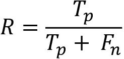
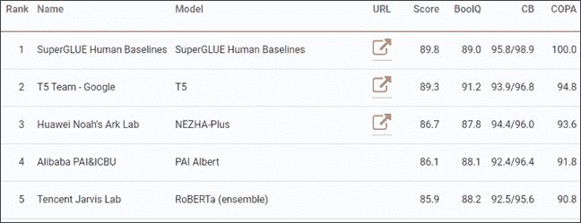

# 四、使用转换器的下游 NLP 任务

当我们释放预训练的模型并观看它们执行下游**自然语言理解** ( **NLU** )任务时，转换器展示了它们的全部潜力。预训练和微调转换器模型需要花费大量的时间和精力，但当我们看到一个 3.55 亿参数的转换器模型在一系列 NLU 任务中发挥作用时，这种努力是值得的。

我们将从寻求超越人类基线开始这一章。人类基线代表人类在 NLU 任务中的表现。人类在很小的时候就学习转导，并迅速发展归纳思维。我们人类直接用感官感知世界。机器智能完全依靠我们的感知来理解我们的语言。

然后，我们将了解如何测量转换器的性能。测量 NLP 任务仍然是一种简单的方法，包括基于真和假结果的各种形式的准确度分数。这些结果是通过基准任务和数据集获得的。例如，SuperGLUE 是一个很好的例子，说明了谷歌 DeepMind、脸书人工智能、纽约大学和华盛顿大学如何共同努力，为衡量自然语言处理性能设定高标准。

最后，我们将探索几个下游任务，如**标准情感树库** ( **SST-2** )、语言可接受性和 Winograd 模式。

通过在设计良好的基准测试任务上胜过其他模型，Transformers 正在迅速将 NLP 提升到一个新的水平。总有一天，另一个模型会出现，对于 NLP 任务来说，RNNs 的时代可能会结束。

本章涵盖以下主题:

*   机器与人类智能在转换和感应方面的对比
*   NLP 转导和诱导过程
*   测量转换器性能与人类基线的对比
*   测量方法(精确度、F1 分数和 MCC)
*   基准任务和数据集
*   强力胶下游任务
*   可乐的语言可接受性
*   用 SST-2 进行情感分析
*   Winograd 模式

我们先从理解人类和机器如何表示语言开始。

# 转换和转换器的感应遗传

转换器拥有独一无二的能力，可以将他们的知识应用到他们没有学到的任务中。例如，BERT 变换器通过序列到序列和屏蔽语言建模来获得语言。然后可以对 BERT transformer 进行微调，以执行下游任务，而不是从头开始学习。

在这一部分，我们将做一个思维实验。我们将使用转换器图来表示人类和机器如何使用语言理解信息。机器理解信息的方式与人类不同，但却能获得非常高效的结果。

下图是在 transformer 架构层和子层中设计的思维实验，展示了人类和机器之间欺骗性的相似性。让我们研究转换器模型的学习过程，以了解下游任务。


图 4.1:人类和机器的学习方法

对于我们的例子，`N=2`。因此，这个概念上的表示有两层。

## 人类智能栈

在*图 4.1* 左侧，我们可以看到对于人类来说，输入是对 0 层原始事件的感知，输出是语言。当我们还是孩子的时候，我们首先用我们的感官感知事件。渐渐地，输出变成了含糊的语言，然后是结构化的语言。

对于人类来说，*转导*要经历一个试错的过程。例如，转导意味着我们获取我们感知的结构，并用模式来代表它们。我们对应用于归纳思维的世界进行表述。我们的归纳思维依赖于我们转换的质量。

例如，小时候，我们经常被迫在下午早些时候睡午觉。著名儿童心理学家皮亚杰发现，这可能会导致一些孩子说，例如，“我没有午睡，所以现在不是下午。”孩子看到两个事件，用转导在两者之间建立联系，然后做出推论进行概括，做出归纳。

起初，人类通过转导注意到这些模式，并通过*归纳*加以推广。通过反复试验，我们认识到许多事件是相互关联的:

Trained _ related events = {日出–光，日落–暗，乌云–雨，蓝天–跑步，食物–好，火–暖，雪–冷}

随着时间的推移，我们被训练去理解数以百万计的相关事件。新一代的人类不必从头开始。它们只是被前几代产品针对许多任务进行了*微调。例如，他们被教导“火会灼伤你”。从那时起，一个孩子知道这种知识可以微调到任何形式的“火”:蜡烛、野火、火山和每一个“火”的实例*

最后，人类将他们知道的、想象的或预测的一切转录成书面语言。第 0 层的输出诞生了。

对人类来说，下一层，即第一层的输入是大量经过训练和微调的知识。最重要的是，人类感知大量的事件，然后通过转导、诱导、训练和微调子层以及先前转录的知识。

我们的无限接近循环从第 0 层到第 1 层，然后带着越来越多的原始和处理过的信息回到第 0 层。

结果令人着迷！我们不需要从头开始学习(训练)我们的母语来获得概括能力。我们使用我们预先训练的知识来调整(微调)摘要任务。

转换器经历相同的过程，但方式不同。

## 机器智能堆栈

在*图 4.1* 的右侧，我们可以看到对于机器的输入是以语言形式的二手信息。*我们的输出是机器分析语言的唯一输入*。

在人类和机器历史的这一点上，计算机视觉识别图像，但不包含语言的语法结构。语音识别将声音转换成文字，这将我们带回到书面语言。音乐模式识别无法得出用文字表达的客观概念。

机器一开始就有缺陷。我们给他们强加了一种人为的不利条件。机器必须依靠我们的随机质量语言输出来:

*   执行转换，将语言序列中出现的所有标记(子词)连接起来
*   从这些转换中建立感应
*   基于记号训练这些归纳以产生记号的模式

让我们在这一点上停下来，看看注意力子层的过程，它正在努力产生有效的诱导:

*   transformer 模型排除了以前基于序列的学习操作，并使用自我注意来提高模型的视觉效果
*   在这一点上，注意力子层比人类有优势:它们可以处理数百万个例子来进行归纳思维操作
*   像我们一样，他们通过转导和诱导找到模式
*   他们用存储在模型中的参数来记忆这些模式
*   他们已经通过使用他们的能力获得了语言理解:大量的数据量、优秀的 NLP 转换算法和计算机能力

转换器和人类一样，通过有限数量的任务获得语言理解。像我们一样，他们通过转导来检测连接，然后通过归纳运算来概括它们。

当转换器模型到达机器智能的微调子层时，它会像我们一样做出反应。它不会从零开始训练来执行一项新任务。像我们一样，它认为这是一个只需要微调的下游任务。如果它需要学习如何回答问题，它不会从头开始学习语言。转换器模型就像我们一样微调它的参数。

在这一部分，我们看到了转换器模型努力学习我们如何做。他们一开始就有障碍，因为目前他们依赖我们转录成语言的感知。然而，与我们拥有强大计算能力的人相比，他们可以访问无限多的数据。

现在让我们看看如何测量转换器性能与人类基线的对比。

# 转换器性能与人类基线

像人类一样，转换器可以通过继承预训练模型的属性进行微调，以执行下游任务。预训练模型通过其参数提供其架构和语言表示。

一个预先训练的模型在关键任务上训练，使它能够获得语言的一般知识。一个微调的模型对下游任务进行训练。并非每个 transformer 模型都使用相同的任务进行预训练。潜在地，任务都可以是预训练的或微调的任务。

每个 NLP 模型都需要用标准方法来评估。

在本节中，我们将首先介绍一些关键的测量方法。然后，我们将介绍一些主要的基准测试任务和数据集。

让我们从一些关键的度量方法开始。

## 用度量标准评估模型

如果没有使用度量标准的通用测量系统，就不可能将一个转换器模型与另一个转换器模型(或任何其他 NLP 模型)进行比较。

在本节中，我们将分析 GLUE 和 SuperGLUE 使用的三种测量评分方法。

### 准确度分数

无论您使用哪种变体，准确度分数都是一个实用的评估。score 函数为每个结果直接计算真值或假值。对于一组样本的给定子集*样本* [i] 而言，模型的输出要么与正确预测匹配，要么不匹配。基本功能是:


如果子集的结果是正确的，我们将获得`1`,如果是错误的，我们将获得`0`。

现在让我们来看看更灵活的 F1 分数。

### f1-分数

F1-score 引入了一种更加灵活的方法，在面对包含不均匀类别分布的数据集时可以有所帮助。

F1 分数使用精确度和召回率的加权值。它是精度和召回值的加权平均值:

*F1-得分= 2*(精度*召回)/(精度+召回)*

在这个等式中，真( *T* )阳性( *p* )、假( *F* )阳性( *p* )和假( *F* )阴性( *n* )被插入到精度( *P* )和召回( *R* )等式中:



因此，F1 分数可以被视为精确度( *P* )和回忆( *R* )的调和平均值(算术平均值的倒数):


现在让我们回顾一下 MCC 方法。

### 马修斯相关系数

MCC 在第二章*中的*使用马修斯相关系数*评估章节、*微调 BERT 模型*中描述并实现。MCC 使用真阳性( *TP* )、真阴性( *TN* )、假阳性( *FP* )和假阴性( *FN* )来计算测量值。*

MCC 可通过以下等式进行总结:


MCC 提供了一个优秀的二进制度量，即使类的大小不同。

我们现在有了一个好主意，如何测量一个给定的 transformer 模型的结果，并将它们与其他 transformer 模型或 NLP 模型进行比较。

考虑到度量评分方法，现在让我们来看看基准测试任务和数据集。

## 基准任务和数据集

要证明转换器已经达到最先进的性能，需要三个先决条件:

*   模特
*   数据集驱动的任务
*   在本章的*使用指标评估模型*一节中描述的指标

我们将探索 SuperGLUE 基准来说明转换器模型的评估过程。

### 从胶水到强力胶

强力胶基准由*王*等人(2019)设计并公开。*王*等(2019)首先设计了**通用语言理解评测** ( **胶水**)基准。

GLUE 基准测试的动机是为了表明 NLU 要有用，必须应用于广泛的任务。相对较小的胶合数据集被设计成鼓励 NLU 模型解决一组任务。

然而，在转换器到来的推动下，NLU 模型的性能开始超过普通人类的水平，我们可以在 GLUE 排行榜(2020 年 6 月)中看到。胶水排行榜、[https://gluebenchmark.com/leaderboard](https://gluebenchmark.com/leaderboard)展示了 NLU 人才的非凡表现，他们保留了一些前 RNN/CNN 的想法，同时主要关注开创性的转换器模型。

排行榜的以下摘录显示了前三名领导者以及 GLUE 的人类基线位置:


图 4.2: GLUE 排行榜–2020 年 12 月

人类基线排名会不断变化。这些排名只是让我们了解了经典的 NLP 和转换器带我们走了多远！

我们首先注意到 GLUE 人类基线排名#14，这表明 NLU 模型在 GLUE 任务上已经超过了非专家人类。这是一个问题。如果没有一个标准可以超越，那么寻找基准数据集来盲目地改进我们的模型将是一个挑战。

我们还注意到转换器型号已经领先。

最后，我们可以看到百度带着有趣的结果进入了 NLU 竞赛。 *Sun* 等人(2019)设计了一个名为 ERNIE 的转换器模型，该模型引入了连续增量预训练和多任务微调。由于广泛的预训练和微调多任务方法，产生的结果令人印象深刻。

我喜欢把胶水和强力胶看作是随着语言理解单词从混乱到有序的点。对我来说，*理解*是*胶水*，让单词组合在一起，成为一种语言。

GLUE 排行榜将随着 NLU 的发展而不断变化。然而，*王*等人(2019)引入了强力胶，为人类基线设定了更高的标准。

### 引入更高的人类基线标准

*王*等(2019)看到了胶水的极限。他们为更困难的 NLU 任务设计了强力胶。

SuperGLUE 立即将人类基线重新确立为排名第一(2020 年 12 月)，如以下排行榜摘录所示，[https://super.gluebenchmark.com/leaderboard](https://super.gluebenchmark.com/leaderboard):


图 4.3:强力胶排行榜 2.0–2020 年 12 月

随着我们生产更好的 NLU 模型，强力胶排行榜将会不断发展。2021 年初，转换器已经超越了人类的基线，而这仅仅是一个开始。注意华为诺亚艺术实验室带着转换器模型的到来。转换器走向全球！

AI 算法排名会不断变化。这些排名只是让人们了解 NLP 霸主地位的竞争有多激烈！

现在让我们看看评估过程是如何进行的。

### 强力胶评估流程

王等(2019) 为他们的强力胶基准选择了八个任务。这些任务的选择标准比胶水更严格。例如，这些任务不仅要理解文本，还要推理。推理水平不是顶级人类专家的水平。然而，性能水平足以取代许多人工任务。

这八项强力胶任务在一个现成的列表中列出:


图 4.4:强力胶任务

任务列表是交互式的:[https://super.gluebenchmark.com/tasks](https://super.gluebenchmark.com/tasks)。

每个任务包含执行任务所需信息的链接:

*   **名称**是微调预训练模型的下游任务的名称
*   **标识符**是名称的缩写或简称
*   **下载**是数据集的下载链接
*   **更多信息**可通过设计数据集驱动任务的团队的论文或网站链接获得
*   **指标**是用于评估模型的度量分数

SuperGLUE 提供了任务指令、软件、数据集以及描述要解决的问题的论文或网站。一旦团队运行基准测试任务并到达排行榜，就会显示结果:


图 4.5:强力胶任务分数

超级胶水显示总分数和每项任务的分数。

举个例子，就拿他们论文*表 6* 中**选择似是而非的答案** ( **COPA** )任务提供的指令 *王*等(2019)来说吧。

第一步是阅读由 *Roemmele* 等人(2011 年)撰写的卓越论文。简而言之，目标是让 NLU 模型展示其机器思维(当然不是人类思维)的潜力。在我们的例子中，转换者必须选择一个问题最合理的答案。数据集提供了一个前提，转换器模型必须找到最合理的答案。

例如:

`Premise: I knocked on my neighbor's door.`

`What happened as a result?`

`Alternative 1: My neighbor invited me in.`

`Alternative 2: My neighbor left his house.`

这个问题一个人类回答需要一两秒钟，可见它需要一些常识性的机器思维。`COPA.zip`，一个现成的数据集，可以直接从强力胶任务页面下载。所提供的度量使得该过程对于基准测试中的所有参与者都是平等和可靠的。

这些例子可能看起来很难。然而，最高排名的结果是由已经达到强力胶人类基线水平的转换器获得的:



图 4.6: COPA 强力胶转换器性能–2020 年 12 月

虽然看起来不可思议，但转换器正在很短的时间内爬上排行榜的阶梯！

我们已经看到了一项任务背后的内容。让我们定义其他七个超级胶水基准任务。

## 定义强力胶基准测试任务

任务可以是生成训练模型的预训练任务。该任务可以是另一个模型的下游任务，该模型将对其进行微调。然而， SuperGLUE 的目标是展示给定的 NLU 模型可以通过微调执行多个下游任务。多任务模型是证明转换器思维能力的模型。

任何 transformer 的强大之处在于它能够使用预先训练的模型执行多任务，然后将其应用于微调的下游任务。Transformer 模型现在引入了所有的粘合和强力胶任务。我们将继续关注强力胶下游任务，这是人类难以超越的底线。

在上一节中，我们介绍了 COPA。在本节中，我们将讨论 *Wang* 等人(2019)在其论文的*表 2* 中定义的其他七项任务。

让我们继续一个布尔问题任务。

### 布尔格

BoolQ 是布尔型 yes 或 no 回答任务。根据强力胶的定义，该数据集包含 15942 个自然发生的例子。`train.jsonl`数据集的第`#3`行的原始样本包含一段文字、一个问题和答案(`true`)

```py
{`"question"`: "is windows movie maker part of windows essentials"

`"passage"`: "Windows Movie Maker -- Windows Movie Maker (formerly known as Windows Live Movie Maker in Windows 7) is a discontinued video editing software by Microsoft. It is a part of Windows Essentials software suite and offers the ability to create and edit videos as well as to publish them on OneDrive, Facebook, Vimeo, YouTube, and Flickr.", "idx": 2, "label": true} 
```

所提供的数据集可能会随时间变化，但概念保持不变。

现在，让我们检查 CB，这是一项需要人类和机器都专注的任务。

### 承诺银行

**承诺银行** ( **CB** )是一个困难的*蕴涵*任务。我们要求 transformer 模型读取一个*前提*，然后检查一个建立在前提上的*假设*。比如假设会证实前提，也会反驳。然后转换器模型必须*将假设*标记为例如前提的*中性*、一个*蕴涵*或一个*矛盾*。

数据集包含自然话语。

以下样本`#77`，取自训练数据集`train.jsonl`，显示了 CB 任务的难度:

```py
{`"premise"`: "The Susweca. It means ''dragonfly'' in Sioux, you know. Did I ever tell you that's where Paul and I met?"

`"hypothesis"`: "Susweca is where she and Paul met,"

`"label"`: `"entailment"`, "idx": 77} 
```

我们现在来看看多句子问题。

### 多句子阅读理解

**多句阅读** **理解** ( **MultiRC** )要求模型阅读一段文字，并从几个可能的选项中进行选择。这项任务对人类和机器来说都很困难。该模型提供了一个*文本*，几个*问题*，以及每个问题可能的*答案*，标签为`0`(假)或`1`(真)*。*

 *让我们取`train.jsonl`中的第二个样本:

```py
"Text": "text": "The rally took place on October 17, the shooting on February 29\. Again, standard filmmaking techniques are interpreted as smooth distortion: \"Moore works by depriving you of context and guiding your mind to fill the vacuum -- with completely false ideas. It is brilliantly, if unethically, done.\" As noted above, the \"from my cold dead hands\" part is simply Moore's way to introduce Heston. Did anyone but Moore's critics view it as anything else? He certainly does not \"attribute it to a speech where it was not uttered\" and, as noted above, doing so twice would make no sense whatsoever if Moore was the mastermind deceiver that his critics claim he is. Concerning the Georgetown Hoya interview where Heston was asked about Rolland, you write: \"There is no indication that [Heston] recognized Kayla Rolland's case.\" This is naive to the extreme -- Heston would not be president of the NRA if he was not kept up to date on the most prominent cases of gun violence. Even if he did not respond to that part of the interview, he certainly knew about the case at that point. Regarding the NRA website excerpt about the case and the highlighting of the phrase \"48 hours after Kayla Rolland is pronounced dead\": This is one valid criticism, but far from the deliberate distortion you make it out to be; rather, it is an example for how the facts can sometimes be easy to miss with Moore's fast pace editing. The reason the sentence is highlighted is not to deceive the viewer into believing that Heston hurried to Flint to immediately hold a rally there (as will become quite obvious), but simply to highlight the first mention of the name \"Kayla Rolland\" in the text, which is in this paragraph. " 
```

该示例包含四个问题。为了说明这项任务，我们将只研究其中的两个。该模型必须预测正确的标签。请注意模型被要求获得的信息是如何分布在整个文本中的:

```py
`"question"`: "When was Kayla Rolland shot?"

`"answers"`:

[{"text": "February 17", "idx": 168, "label": 0}, 

`{"text": "February 29", "idx": 169, "label": 1},` 

{"text": "October 29", "idx": 170, "label": 0},

{"text": "October 17", "idx": 171, "label": 0},

{"text": "February 17", "idx": 172, "label": 0}], "idx": 26},

`{"question"`: "Who was president of the NRA on February 29?", 

`"answers": [{"text": "Charleton Heston", "idx": 173, "label": 1}`,

{"text": "Moore", "idx": 174, "label": 0},

{"text": "George Hoya", "idx": 175, "label": 0},

{"text": "Rolland", "idx": 176, "label": 0},

{"text": "Hoya", "idx": 177, "label": 0}, {"text": "Kayla", "idx": 178, "label": 0}], "idx": 27}, 
```

在这一点上，人们只能钦佩一个单一的微调，预训练模型在这些困难的下游任务的性能。

现在，让我们看看阅读理解任务。

### 用常识推理数据集(记录)进行阅读理解

使用常识推理数据集 ( **记录**)进行阅读理解代表了另一项挑战性的任务。数据集包含来自 70，000 多篇新闻文章的 120，000 多个查询。转换器必须使用常识推理来解决这个问题。

让我们检查一个来自`train.jsonl`的样本:

```py
`"source"`: "Daily mail"

A passage contains the text and indications as to where the entities are located.

A passage begins with the text:

`"passage"`: {

    `"text"`: "A Peruvian tribe once revered by the Inca's for their fierce hunting skills and formidable warriors are clinging on to their traditional existence in the coca growing valleys of South America, sharing their land with drug traffickers, rebels and illegal loggers. Ashaninka Indians are the largest group of indigenous people in the mountainous nation's Amazon region, but their settlements are so sparse that they now make up less than one per cent of Peru's 30 million population. Ever since they battled rival tribes for territory and food during native rule in the rainforests of South America, the Ashaninka have rarely known peace.\n@highlight\nThe Ashaninka tribe once shared the Amazon with the like of the Incas hundreds of years ago\n@highlight\nThey have been forced to share their land after years of conflict forced rebels and drug dealers into the forest\n@highlight\n. Despite settling in valleys rich with valuable coca, they live a poor pre-industrial existence", 
```

显示了*实体*，如以下摘录所示:

```py
 "entities": [{"start": 2,"end": 9}, …,"start": 711,"end": 715}] 
```

最后，模型必须*通过为*占位符*找到合适的值来回答*一个*查询*:

```py
{`"query"`: "Innocence of youth: Many of the `@placeholder's` younger generations have turned their backs on tribal life and moved to the cities where living conditions are better", 

`"answers"`:[{"start":263,"end":271,"text":"Ashaninka"},{"start":601,"end":609,"text":"Ashaninka"},{"start":651,"end":659,"text":"Ashaninka"}],"idx":9}],"idx":3} 
```

一旦 transformer 模型经历了这个问题，它现在必须面对一个包含任务。

### 识别文本蕴涵(RTE)

为了**识别文本蕴涵** ( **RTE** ，转换器模型必须读取*前提*，检查*假设*，并预测*蕴涵假设状态*的*标签*。

让我们检查一下`train.jsonl`数据集的样本`#19`:

```py
{`"premise"`: "U.S. crude settled $1.32 lower at $42.83 a barrel.", 

`"hypothesis"`: "Crude the light American lowered to the closing 1.32 dollars, to 42.83 dollars the barrel.", "label": `"not_entailment"`, >"idx": 19} 
```

RTE 需要理解和逻辑。现在让我们看看语境中的单词任务。

### 语境中的词

**语境中的单词** ( **WiC** )和下面的 Winograd 任务测试一个模型处理一个歧义单词的能力。在 WiC 中，多任务转换器必须分析两个句子，并确定目标单词在两个句子中是否具有相同的含义。

让我们检查一下`train.jsonl`数据集的第一个样本。

首先，指定目标单词:

```py
 "word": `"place"` 
```

该模型必须读取包含目标单词的两个句子:

```py
 "sentence1": "Do you want to come over to my place later?",

  "sentence2": "A political system with no `place` for the less prominent groups." 
```

`train.jsonl`指定样本索引、标签值以及目标词在`sentence1(start1, end1)`和`sentence2(start2, end2)`中的位置:

```py
 "idx": 0,

  "label": false,

  "start1": 31,

  "start2": 27,

  "end1": 36,

  "end2": 32, 
```

在这个艰巨的任务之后， transformer 模型又要面对 Winograd 任务了。

### 威诺格拉图式挑战赛(WSC)

Winograd 模式任务是以 Terry Winograd 的名字命名的。如果一个转换器训练有素，它应该能够解决歧义问题。

该数据集包含针对代词性别细微差异的句子。

这构成了一个共指解决问题，这是最具挑战性的任务之一。然而，允许自我关注的 Transformer 架构非常适合这个任务。

每个句子包含一个*职业*，一个*参与者*，一个*代词*。要解决的问题是找出代词*是否与职业或参与者*同指。

让我们检查一个取自`train.jsonl`的样本。

首先，示例要求模型读取一个*文本:*

```py
{`"text"`: >"I poured water from the bottle into the cup until it was full.",

The WSC ask the model to find the target *pronoun* token number 10 starting at 0: 

`"target"`: {`"span2_index"`: 10, 

Then it asks the model to determine if "it" refers to "the cup" or not: 

`"span1_index"`: 7,

`"span1_text"`: "the cup", 

`"span2_text"`: "it"}, 

`For sample index #4, the label is true:`

"idx": 4, `"label"`: true} 
```

我们已经完成了八项强力胶任务。还有很多其他的任务。

然而，一旦你理解了 transformers 的架构和基准任务的机制，你将很快适应任何模型和基准。

现在让我们运行一些下游任务。

# 运行下游任务

在这一节中，我们将跳进一些转换器汽车，开着它们四处转转，看看它们能做些什么。有许多模型和任务。我们将在本节中运行其中的一些。一旦你理解了运行一些任务的过程，你将很快理解所有的任务。*毕竟，所有这些任务的人类基线是我们！*

下游任务是一个微调的 transformer 任务，它从预调整的 transformer 模型继承了模型和参数。

因此，下游任务是运行微调任务的预训练模型的视角。这意味着，根据模型的不同，如果任务没有被用来完全预训练模型，那么它就是下游任务。在本节中，我们将所有任务视为下游任务，因为我们没有对它们进行预处理。

模型会不断发展，数据库、基准方法、准确性测量方法和排行榜标准也会不断发展。但是通过本章后面的任务反映出来的人类思维结构将会保留下来。

先说可乐。

## 语言可接受性语料库

语言可接受性语料库 ( **可乐**)，一个胶水任务[https://gluebenchmark.com/tasks](https://gluebenchmark.com/tasks)，包含数千个英语句子样本，这些样本被标注为语法可接受性。

Alex Warstadt 等人(2019)的目标是评估自然语言处理模型的语言能力，以判断句子的语言可接受性。NLP 模型被期望相应地对句子进行分类。

这些句子被分为合乎语法的和不合语法的。如果该句子在语法上不可接受，则该句子被标记为`0`。如果这个句子在语法上是可接受的，那么这个句子被标记为`1`。例如:

“我们喊哑了嗓子。”

“我们大声呼喊自己。”

你可以通过*第二章*、*微调 BERT 模型*中的`BERT_Fine_Tuning_Sentence_Classification_DR.ipynb`，查看我们在可乐数据集上微调的 BERT 模型。我们使用可乐数据:

```py
#@title Loading the Dataset

#source of dataset : https://nyu-mll.github.io/CoLA/

df = pd.read_csv("in_domain_train.tsv", delimiter='\t', header=None, names=['sentence_source', 'label', 'label_notes', 'sentence'])

df.shape 
```

我们还加载了一个预训练的 BERT 模型:

```py
#@title Loading the Hugging Face Bert Uncased Base Model 

model = BertForSequenceClassification.from_pretrained("bert-base-uncased", num_labels=2) 
```

最后，我们使用的测量方法或指标是 MCC，这在本章前面的*第 2 章*、*微调 BERT 模型*的*使用马修斯相关系数*评估部分有所描述。

您可以参考有关 MCC 的数学描述的部分，并在必要时花时间重新运行源代码。

一个句子可能在语法上不可接受，但仍然传达了一种情感。情感分析可以给机器增加某种形式的共鸣。

## 斯坦福情感树库(SST-2)

**斯坦福情感树库** ( **SST-2** )包含影评。在本节中，我们将描述 SST-2(二元分类)任务。然而，数据集超出了这一范围，可以将情感分类在 *0* (负)到 *n* (正)的范围内。

Socher 等人(2013 年)将情感分析超越了二元正负 NLP 分类。我们将在*第 11 章*、*中使用转换器模型探索 SST-2 多标签情感分类，检测客户情感以做出预测*。

在本节中，我们将在一个拥抱面转换器管道模型上运行一个取自 SST 的样本来说明二进制分类。

打开`Transformer_tasks.ipynb`并运行以下单元格，其中包含来自 SST 的正面和负面电影评论:

```py
#@title SST-2 Binary Classification

from transformers import pipeline

nlp = pipeline("sentiment-analysis")

print(nlp("If you sometimes like to go to the movies to have fun , Wasabi is a good place to start."),"If you sometimes like to go to the movies to have fun , Wasabi is a good place to start.")

print(nlp("Effective but too-tepid biopic."),"Effective but too-tepid biopic.") 
```

输出是准确的:

```py
[{'label': 'POSITIVE', 'score': 0.999825656414032}] If you sometimes like to go to the movies to have fun , Wasabi is a good place to start .

[{'label': 'NEGATIVE', 'score': 0.9974064230918884}] Effective but too-tepid biopic. 
```

SST-2 任务是用精度度量来评估的。

我们对一系列情感进行分类。现在让我们看看一个序列中的两个句子是不是释义。

## 微软研究院释义语料库(MRPC)

微软研究院释义语料库 ( **MRPC** )，一个胶合任务，包含从网上的新资源中提取的句子对。每一对都由人进行了注释，以指示基于两个密切相关的属性，句子是否等价:

*   意译等效物
*   语义等价(参见下一节 STS-B)

让我们使用拥抱脸 BERT 模型运行一个示例。打开`Transformer_tasks.ipynb`并转到以下单元格，然后运行从 MRPC 提取的样本:

```py
#@title Sequence Classification : paraphrase classification

from transformers import AutoTokenizer, TFAutoModelForSequenceClassification

import tensorflow as tf

tokenizer = AutoTokenizer.from_pretrained("bert-base-cased-finetuned-mrpc")

model = TFAutoModelForSequenceClassification.from_pretrained("bert-base-cased-finetuned-mrpc")

classes = ["not paraphrase", "is paraphrase"]

sequence_A = "The DVD-CCA then appealed to the state Supreme Court."

sequence_B = "The DVD CCA appealed that decision to the U.S. Supreme Court."

paraphrase = tokenizer.encode_plus(sequence_A, sequence_B, return_tensors="tf")

paraphrase_classification_logits = model(paraphrase)[0]

paraphrase_results = tf.nn.softmax(paraphrase_classification_logits, axis=1).numpy()[0]

print(sequence_B, "should be a paraphrase")

for i in range(len(classes)):

    print(f"{classes[i]}: {round(paraphrase_results[i] * 100)}%") 
```

输出是准确的，尽管您可能会收到警告您模型需要更多下游训练的消息:

```py
The DVD CCA appealed that decision to the U.S. Supreme Court. should be a paraphrase

not paraphrase: 8.0%

is paraphrase: 92.0% 
```

MRPC 任务采用 F1/准确度评分法进行测量。

现在让我们运行一个 Winograd 模式。

## Winograd 模式

我们在本章的*wino grad 模式挑战(WSC)* 部分描述了 Winograd 模式。训练集是英文的。

但是，如果我们让一个 transformer 模型来解决英法翻译中的代词性别问题，会发生什么呢？法语的名词有不同的拼法，有语法上的性别(阴性、阳性)。

下面的句子含有代词 it，可以指单词*汽车*或*车库*。转换器能消除这个代词的歧义吗？

打开`Transformer_tasks.ipynb`，进入`#Winograd`单元格，运行我们的示例:

```py
#@title Winograd

from transformers import pipeline

translator = pipeline("translation_en_to_fr")

print(translator("The car could not go in the garage because it was too big.", max_length=40)) 
```

翻译是完美的:

```py
[{'translation_text': "La voiture ne pouvait pas aller dans le garage parce qu'elle était trop grosse."}] 
```

转换器检测到 *it* 指的是 *car* 这个词，是阴性形式。阴性形式适用于 *it* 和形容词 *big* :

*   *elle* 在法语中是 *she* 的意思，是 *it* 的翻译。阳性形式应该是 *il* ，意思是 *he* 。
*   *grosse* 是 *big* 这个词翻译的阴性形式。否则，阳性形式应该是 *gros* 。

我们给转换器一个困难的 Winograd 模式来解决，它产生了正确的答案。

还有更多数据集驱动的 NLU 任务可用。我们将在本书中探索其中的一些，为我们的转换器工具箱添加更多的构件。

# 摘要

在这一章中，我们分析了人类语言表达过程和机器智能进行转换的方式之间的差异。我们看到转换器必须依靠我们用书面语言表达的极其复杂的思维过程的输出。语言仍然是表达大量信息的最精确的方式。机器没有感官，必须将语音转换为文本，才能从原始数据集中提取意义。

然后，我们探讨了如何测量多任务转换器的性能。在 NLP 的历史上，转换器为下游任务获得最高排名结果的能力是独一无二的。我们经历了艰难的强力胶任务，使转换器在胶水和强力胶排行榜上名列前茅。

BoolQ、CB、WiC 以及我们讨论的许多其他任务绝不容易处理，即使对人类来说也是如此。我们通过几个下游任务的例子展示了 transformer 模型在证明其效率时必须面对的困难。

转换器通过超越以前的 NLU 架构证明了它们的价值。为了说明实现下游微调任务是多么简单，我们随后使用 Hugging Face 的 transformers 管道在 Google 协作笔记本中运行了几个任务。

在 *Winograd schemas* 中，我们给转换器一个困难的任务，为英法翻译解决 Winograd 歧义消除问题。

在下一章，*第 5 章*，*用 Transformer* 进行机器翻译，我们将把翻译任务更进一步，用 Trax 建立一个翻译模型。

# 问题

1.  机器智能使用与人类相同的数据进行预测。(对/错)
2.  强力胶比 NLP 模型的胶水更难。(对/错)
3.  BoolQ 要求二进制答案。(对/错)
4.  WIC 代表语境中的词语。(对/错)
5.  **识别文本蕴涵** ( **RTE** )检测一个序列是否需要另一个序列。(对/错)
6.  Winograd 模式可以预测一个动词的拼写是否正确。(对/错)
7.  转换器模型现在占据了胶水和强力胶的顶级行列。(对/错)
8.  人类基线标准不是一劳永逸的。强力胶使它们变得更难得到。(对/错)
9.  转换器模型永远不会击败强力胶人类基线标准。(对/错)
10.  转换器模型的表现超过了 RNN 和 CNN 模型。(对/错)

# 参考

*   *王敬实*、*雅达·普鲁克萨库恩*、*尼基塔·南吉亚*、*阿曼普里特·辛格*、*朱利安·迈克尔*、*菲利克斯·希尔*、*奥默·利维*、*塞缪尔·r·鲍曼*、2019、*强力胶:通用语言理解系统更具粘性的基准*:[https://w4ngatang.github.io/static/papers/superglue.pdf【T19](https://w4ngatang.github.io/static/papers/superglue.pdf)
*   *王敬实*、*雅达·普鲁克萨库恩*、*尼基塔·南吉亚*、*阿曼普里特·辛格*、*朱利安·迈克尔*、*菲利克斯·希尔*、*奥默·利维*、*塞缪尔·r·鲍曼*、2019、 *GLUE:自然语言理解的多任务基准与分析平台*
*   *、*王硕焕*、*李宇坤*、*石坤峰*、*昊天*、*华武*、*王海峰*、2019、*厄尼 2.0:语言理解的持续预训练框架*:[https://arxiv.org/pdf/1907.12412.pdf](https://arxiv.org/pdf/1907.12412.pdf)*
**   *梅丽莎·罗梅勒*、*科斯明·阿德里安·贝扬*和*安德鲁·s·戈登*，2011 年*似是而非的选择:对常识性因果推理的评估*:[https://people . ICT . USC . edu/~ Gordon/publications/AAAI-斯普林 11A。PDF](https://people.ict.usc.edu/~gordon/publications/AAAI-SPRING11A.PDF)*   *Richard Socher* ， *Alex Perelygin* ， *Jean Y. Wu* ， *Jason Chuang* ， *Christopher D. Manning* ， *Andrew Y. Ng* ， *Christopher Potts* ，2013，*情感树库语义复合递归深度模型*:[https://nlp.stanford.edu/~socherr/EMNLP2013_RNTN.pdf](https://nlp.stanford.edu/~socherr/EMNLP2013_RNTN.pdf)*   *托马斯·沃尔夫*，*弗拉达利出道*，*维克多·桑*，*朱利安·肖蒙德*，*克莱门特·德兰格*，*安东尼·莫伊*，*皮尔里奇·西斯塔克*，*蒂姆·劳夫*，*雷米·卢夫*，*摩根·芬托维茨*，*杰米·布雷【T21**   *抱紧脸转换器用法*:【https://huggingface.co/transformers/usage.html **