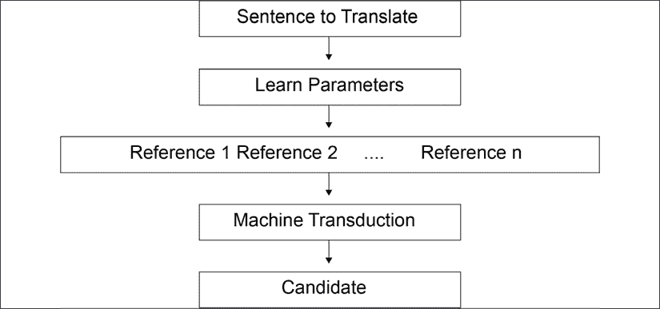
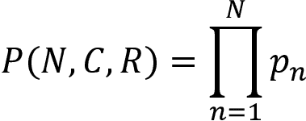
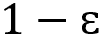
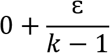

# five

# 用变压器进行机器翻译

人类掌握了序列转换，将一个表象转移到另一个物体上。我们可以很容易地想象一个序列的心理表征。如果有人说，“我花园里的花很漂亮”，我们可以很容易地想象出一个花园里有花。我们看到了花园的图像，尽管我们可能从未见过那个花园。我们甚至可以想象啁啾的鸟和花香。

机器必须从零开始学习用数字表示的转换。递归或卷积方法已经产生了有趣的结果，但是还没有达到显著的 BLEU 翻译评估分数。翻译需要将语言 *A* 转换成语言 *B* 的表述。

变压器模型的自我注意创新增加了机器智能的分析能力。在试图将其翻译成语言 *B* 之前，语言 *A* 中的序列被充分表示。自我关注带来了机器获得更好的 BLEU 分数所需的智能水平。

开创性的*“注意力是你所需要的”* Transformer 在 2017 年获得了英德和英法翻译的最佳结果。从那以后，分数被其他变形金刚提高了。

在本书的这一点上，我们已经涵盖了变形金刚的基本方面:变形金刚的*架构*、*从头开始训练*一个 RoBERTa 模型、*微调*一个 BERT、*评估*一个微调过的 BERT，以及用一些变形金刚的例子探索*下游任务*。

在本章中，我们将在三个附加主题中讨论机器翻译。我们将首先定义什么是机器翻译。然后，我们将预处理 WMT 数据集。最后，我们将看到如何实现机器翻译。

本章涵盖以下主题:

*   定义机器翻译
*   人类转导
*   机器转导
*   预处理 WMT 数据集
*   用 BLEU 评估机器翻译
*   几何评估
*   陈樱桃平滑
*   启用急切执行
*   用 Trax 初始化英语-德语问题

我们的第一步将是定义机器翻译。

# 定义机器翻译

*Vaswani* 等人(2017) 攻克了设计变压器最困难的 NLP 问题之一。机器翻译的人类基线对我们人机智能设计师来说似乎遥不可及。这并没有阻止*瓦斯瓦尼*等人(2017)发表变压器的架构并实现最先进的 BLEU 结果。

在本节中，我们将定义机器翻译。机器翻译是通过机器转换和输出来复制人工翻译的过程:



图 5.1:机器翻译过程

图 5.1 中*的总体思路是机器分几步完成以下操作:*

*   选择一个句子来翻译
*   通过数以百万计的参数了解单词之间的关系
*   学习单词相互指代的多种方式
*   使用机器转换将学习到的参数转换为新的序列
*   为单词或序列选择候选翻译

这个过程总是从从源语言翻译的句子开始，*一个*。该过程以输出翻译成语言 *B* 的句子结束。中间的计算包括转换。

## 人类的转换和翻译

例如，欧洲议会的人类口译员不会逐字翻译一个句子。逐字翻译通常没有意义，因为它们缺乏适当的*语法结构*，并且不能产生正确的翻译，因为每个单词的*上下文*被忽略了。

人类的转换将语言中的一个句子*转换成一个*，并建立一个句子意义的认知*表示*。然后，欧洲议会的口译员(口头翻译)或笔译员(书面翻译)会将这种转换转换成用语言 *B* 对那句话的解释。

我们将口译员或笔译员用语言 *B* 完成的翻译称为*参考*句子。

你会注意到在*图 5.1* 中描述的*机器翻译过程*中有几个引用。

在现实生活中，人类译者不会将句子 *A* 翻译成句子 *B* 好几次，而只会翻译一次。然而，在现实生活中，不止一个译者可以翻译句子*和*。例如，你可以找到蒙田用法语写的《随笔》的几个英译本。如果你从最初的法语版本中取出一个句子 *A* ，你会发现句子 *B* 的几个版本，被标注为引用`1`到`n`。

例如，如果你有一天去欧洲议会，你可能会注意到口译员只翻译有限的两个小时。然后另一个翻译接手。没有两个解释者有相同的风格，就像作家有不同的风格一样。源语言中的句子 *A* 可能会被同一个人在一天内重复几次，但是会被翻译成几个参考句 *B* 版本:

*参考={参考 1，参考 2…参考 n}*

机器必须找到一种和人类翻译一样的思考方式。

## 机器转换和翻译

原始变压器架构的转换过程使用编码器堆栈、解码器堆栈和所有模型参数来表示一个*参考序列*。我们将该输出序列称为*参考*。

为什么不直接说“产量预测”？问题是没有单一的产量预测。变形金刚和人类一样，会产生一个我们可以参考的结果，但是如果我们对它进行不同的训练或者使用不同的变形金刚模型，这种情况就会改变！

我们立即意识到，人类转导的人类基线，即语言序列的表示，是一个相当大的挑战。然而，已经取得了很大进展。

对机器翻译的评估证明了 NLP 的进步。为了确定一个解决方案优于另一个解决方案，每个 NLP 挑战者、每个实验室或组织必须引用相同的数据集，以使比较有效。

现在让我们来探索一个 WMT 数据集。

# 预处理 WMT 数据集

*Vaswani* 等人(2017)展示了变压器在 WMT 2014 年英德翻译任务和 WMT 2014 年英法翻译任务中的成果。变形金刚达到了最先进的 BLEU 评分。BLEU 将在本章的*用 BLEU* 评估机器翻译部分进行描述。

2014 年**机器翻译研讨会** ( **WMT** )包含几个欧洲语言数据集。其中一个数据集包含来自 Europarl 语料库第 7 版的数据。我们将使用来自 1996-2011 年*欧洲议会会议平行语料库*的法语-英语数据集。链接是[https://www.statmt.org/europarl/v7/fr-en.tgz](https://www.statmt.org/europarl/v7/fr-en.tgz)。

下载并提取文件后，我们将预处理这两个并行文件:

*   `europarl-v7.fr-en.en`
*   `europarl-v7.fr-en.fr`

我们将加载、清除和减少语料库的大小。

让我们开始预处理。

## 预处理原始数据

在本节中，我们将预处理`europarl-v7.fr-en.en`和`europarl-v7.fr-en.fr`。

打开`read.py`，在本章的 GitHub 目录下。

程序开始使用标准的 Python 函数和`pickle`来转储序列化的输出文件:

```py
import pickle

from pickle import dump 
```

然后，我们定义将文件加载到内存中的函数:

```py
# load doc into memory

def load_doc(filename):

        # open the file as read only

        file = open(filename, mode='rt', encoding='utf-8')

        # read all text

        text = file.read()

        # close the file

        file.close()

        return text 
```

加载的文档然后被分成句子:

```py
# split a loaded document into sentences

def to_sentences(doc):

        return doc.strip().split('\n') 
```

检索最短和最长的长度:

```py
# shortest and longest sentence lengths

def sentence_lengths(sentences):

        lengths = [len(s.split()) for s in sentences]

        return min(lengths), max(lengths) 
```

现在需要清理导入的句子行，以避免训练无用和嘈杂的令牌。这些行被规范化，在空格上标记，并转换成小写。从每个标记中删除标点符号，删除不可打印的字符，并排除包含数字的标记。清理后的行存储为字符串。程序运行清理功能并返回清理附加字符串:

```py
# clean lines

import re

import string

import unicodedata

def clean_lines(lines):

        cleaned = list()

        # prepare regex for char filtering

        re_print = re.compile('[^%s]' % re.escape(string.printable))

        # prepare translation table for removing punctuation

        table = str.maketrans('', '', string.punctuation)

        for line in lines:

                # normalize unicode characters

                line = unicodedata.normalize('NFD', line).encode('ascii', 'ignore')

                line = line.decode('UTF-8')

                # tokenize on white space

                line = line.split()

                # convert to lower case

                line = [word.lower() for word in line]

                # remove punctuation from each token

                line = [word.translate(table) for word in line]

                # remove non-printable chars form each token

                line = [re_print.sub('', w) for w in line]

                # remove tokens with numbers in them

                line = [word for word in line if word.isalpha()]

                # store as string

                cleaned.append(' '.join(line))

        return cleaned 
```

我们已经定义了准备数据集时将调用的关键函数。首先加载并清理英语数据:

```py
# load English data

filename = 'europarl-v7.fr-en.en'

doc = load_doc(filename)

sentences = to_sentences(doc)

minlen, maxlen = sentence_lengths(sentences)

print('English data: sentences=%d, min=%d, max=%d' % (len(sentences), minlen, maxlen))

cleanf=clean_lines(sentences) 
```

数据集现在是干净的，`pickle`将它转储到一个名为`English.pkl`的序列化文件中:

```py
filename = 'English.pkl'

outfile = open(filename,'wb')

pickle.dump(cleanf,outfile)

outfile.close()

print(filename," saved") 
```

输出显示了键的统计数据，并确认`English.pkl`已保存:

```py
English data: sentences=2007723, min=0, max=668

English.pkl  saved 
```

我们现在对法国数据重复相同的过程，并将其转储到一个名为`French.pkl`的序列化文件中:

```py
# load French data

filename = 'europarl-v7.fr-en.fr'

doc = load_doc(filename)

sentences = to_sentences(doc)

minlen, maxlen = sentence_lengths(sentences)

print('French data: sentences=%d, min=%d, max=%d' % (len(sentences), minlen, maxlen))

cleanf=clean_lines(sentences)

filename = 'French.pkl'

outfile = open(filename,'wb')

pickle.dump(cleanf,outfile)

outfile.close()

print(filename," saved") 
```

输出显示了法国数据集的关键统计数据，并确认保存了`French.pkl`。

主预处理完成。但我们仍然需要确保数据集不包含嘈杂和混乱的令牌。

## 完成数据集的预处理

现在打开`read_clean.py`。我们的流程现在定义了一个函数，该函数将加载在上一节中清理的数据集，然后在预处理完成后保存它们:

```py
from pickle import load

from pickle import dump

from collections import Counter

# load a clean dataset

def load_clean_sentences(filename):

        return load(open(filename, 'rb'))

# save a list of clean sentences to file

def save_clean_sentences(sentences, filename):

        dump(sentences, open(filename, 'wb'))

        print('Saved: %s' % filename) 
```

我们现在定义一个创建词汇计数器的函数。知道一个单词在我们将要解析的序列中使用了多少次是很重要的。举个例子，如果一个单词在包含两百万行的数据集中只使用一次，那么如果我们使用宝贵的 GPU 资源来学习它，我们就会浪费精力。让我们来定义计数器:

```py
# create a frequency table for all words

def to_vocab(lines):

        vocab = Counter()

        for line in lines:

                tokens = line.split()

                vocab.update(tokens)

        return vocab 
```

词汇计数器将检测频率低于`min_occurance`的单词:

```py
# remove all words with a frequency below a threshold

def trim_vocab(vocab, min_occurance):

        tokens = [k for k,c in vocab.items() if c >= min_occurance]

        return set(tokens) 
```

在这种情况下，`min_occurance=5`和低于或等于该阈值的单词已被移除，以避免浪费训练模型分析它们的时间。

我们现在不得不处理**未收录的** ( **OOV** )单词。OOV 单词可以是拼写错误的单词、缩写或任何不符合标准词汇表示的单词。我们可以使用自动拼写，但它不能解决所有的问题。对于这个例子，我们将简单地用`unk`(未知)标记替换 OOV 单词:

```py
# mark all OOV with "unk" for all lines

def update_dataset(lines, vocab):

        new_lines = list()

        for line in lines:

                new_tokens = list()

                for token in line.split():

                        if token in vocab:

                                new_tokens.append(token)

                        else:

                                new_tokens.append('unk')

                new_line = ' '.join(new_tokens)

                new_lines.append(new_line)

        return new_lines 
```

我们现在将运行英语数据集的函数，然后保存输出并显示`20`行:

```py
# load English dataset

filename = 'English.pkl'

lines = load_clean_sentences(filename)

# calculate vocabulary

vocab = to_vocab(lines)

print('English Vocabulary: %d' % len(vocab))

# reduce vocabulary

vocab = trim_vocab(vocab, 5)

print('New English Vocabulary: %d' % len(vocab))

# mark out of vocabulary words

lines = update_dataset(lines, vocab)

# save updated dataset

filename = 'english_vocab.pkl'

save_clean_sentences(lines, filename)

# spot check

for i in range(20):

        print("line",i,":",lines[i]) 
```

输出函数首先显示获得的词汇压缩:

```py
English Vocabulary: 105357

New English Vocabulary: 41746

Saved: english_vocab.pkl 
```

保存预处理过的数据集。然后，输出函数显示`20`行，如以下摘录所示:

```py
line 0 : resumption of the session

line 1 : i declare resumed the session of the european parliament adjourned on friday december and i would like once again to wish you a happy new year in the hope that you enjoyed a pleasant festive period

line 2 : although, as you will have seen, the dreaded millennium bug failed to materialise still the people in a number of countries suffered a series of natural disasters that truly were dreadful

line 3 : you have requested a debate on this subject in the course of the next few days during this partsession 
```

现在让我们运行法国数据集的函数，然后保存输出并显示`20`行:

```py
# load French dataset

filename = 'French.pkl'

lines = load_clean_sentences(filename)

# calculate vocabulary

vocab = to_vocab(lines)

print('French Vocabulary: %d' % len(vocab))

# reduce vocabulary

vocab = trim_vocab(vocab, 5)

print('New French Vocabulary: %d' % len(vocab))

# mark out of vocabulary words

lines = update_dataset(lines, vocab)

# save updated dataset

filename = 'french_vocab.pkl'

save_clean_sentences(lines, filename)

# spot check

for i in range(20):

        print("line",i,":",lines[i]) 
```

输出函数首先显示获得的词汇压缩:

```py
French Vocabulary: 141642

New French Vocabulary: 58800

Saved: french_vocab.pkl 
```

保存预处理过的数据集。然后，输出函数显示`20`行，如以下摘录所示:

```py
line 0 : reprise de la session

line 1 : je declare reprise la session du parlement europeen qui avait ete interrompue le vendredi decembre dernier et je vous renouvelle tous mes vux en esperant que vous avez passe de bonnes vacances

line 2 : comme vous avez pu le constater le grand bogue de lan ne sest pas produit en revanche les citoyens dun certain nombre de nos pays ont ete victimes de catastrophes naturelles qui ont vraiment ete terribles

line 3 : vous avez souhaite un debat a ce sujet dans les prochains jours au cours de cette periode de session 
```

本节说明在训练前必须如何处理原始数据。数据集现在可以插入到转换器中进行训练了。

法语数据集的每一行都是要翻译的*句*。英语数据集的每一行都是机器翻译模型的*参考*。机器翻译模型必须产生与*参考*匹配的英语*候选*翻译。

BLEU 提供了一种评估由机器翻译模型产生的*候选*翻译的方法。

# 用 BLEU 评估机器翻译

帕皮尼等人(2002 年)提出了一种有效的评估人类翻译的方法。人类基线很难定义。然而，他们意识到，如果我们逐字比较人工翻译和机器翻译，我们可以获得高效的结果。

*帕皮尼*等人(2002)将他们的方法命名为**双语评估替角评分** ( **BLEU** )。

在本节中，我们将使用**自然语言工具包** ( **NLTK** )来实现 BLEU:

[http://www . nltk . org/API/nltk . translate . html # nltk . translate . bleu _ score . sentence _ bleu](http://www.nltk.org/api/nltk.translate.html#nltk.translate.bleu_score.sentence_bleu)

我们将从几何评估开始。

## 几何评估

BLEU 方法将候选句子的各个部分与一个参考句子或几个参考句子进行比较。

打开`BLEU.py`，在本书 GitHub 库的章节目录下。

程序导入`nltk`模块:

```py
from nltk.translate.bleu_score import sentence_bleu

from nltk.translate.bleu_score import SmoothingFunction 
```

然后，它模拟由机器翻译模型产生的候选翻译和数据集中的实际翻译参考之间的比较。请记住，一个句子可能会重复多次，并由不同的译者以不同的方式翻译，这使得寻找有效的评估策略变得非常困难。

该程序可以评估一个或多个参考:

```py
#Example 1

reference = [['the', 'cat', 'likes', 'milk'], ['cat', 'likes' 'milk']]

candidate = ['the', 'cat', 'likes', 'milk']

score = sentence_bleu(reference, candidate)

print('Example 1', score)

#Example 2

reference = [['the', 'cat', 'likes', 'milk']]

candidate = ['the', 'cat', 'likes', 'milk']

score = sentence_bleu(reference, candidate)

print('Example 2', score) 
```

两个示例的输出都是`1`:

```py
Example 1 1.0

Example 2 1.0 
```

对候选者( *C* )、参考( *R* )和在 *C* ( *N* )中找到的正确记号的数量的直接的评估可以表示为几何函数:



如果您正在寻找 3 克重叠，这种几何方法是严格的，例如:

```py
#Example 3

reference = [['the', 'cat', 'likes', 'milk']]

candidate = ['the', 'cat', 'enjoys','milk']

score = sentence_bleu(reference, candidate)

print('Example 3', score) 
```

如果您正在寻找 3 克重叠，输出会很严重:

```py
Warning (from warnings module):

  File

"C:\Users\Denis\AppData\Local\Programs\Python\Python37\lib\site-packages\nltk\translate\bleu_score.py", line 490

    warnings.warn(_msg)

UserWarning: 

Corpus/Sentence contains 0 counts of 3-gram overlaps.

BLEU scores might be undesirable; use SmoothingFunction().

Example 3 0.7071067811865475 
```

人类可以看出分数应该是`1`而不是`0.7`。超参数可以改变，但方法保持不变。

Papineni 等人(2002 年)提出了一种改进的单字母组合方法。这个想法是统计单词在参考句子中的出现次数，并确保单词在候选句子中没有被过度评估。

考虑下面的例子 *Papineni* 等人(2002)解释说:

```py
Reference 1: The cat is on the mat.

Reference 2: There is a cat on the mat. 
```

现在考虑下面的候选序列:

```py
Candidate: the the the the the the the 
```

对于示例，我们现在寻找候选句子中的单词数(同一个单词“the”出现 7 次)，出现在`Reference 1`句子中的单词数(单词“the”出现 2 次)。

标准的单字精度应该是= `7/7`。

修改后的单字精度为= `2/7`。

注意，BLEU 函数输出警告同意并建议使用平滑。

让我们将平滑技术添加到 BLEU 工具包中。

## 应用平滑技术

*陈*、 *Cherry* (2014)介绍了一种平滑技术，改进了标准 BLEU 技术的几何评价方法。

平滑是一种非常有效的方法。BLEU 平滑可以追溯到标签平滑，应用于变压器中的 softmax 输出。

例如，假设我们必须预测以下序列中被屏蔽的单词是什么:

*猫【面膜】奶*。

想象输出结果是一个 softmax 向量:

```py
candidate_words=[drinks, likes, enjoys, appreciates]

candidate_softmax=[0.7, 0.1, 0.1,0.1]

candidate_one_hot=[1,0,0,0] 
```

这将是一种残忍的方法。标签平滑可以通过引入 epsilon = 让系统更加开明。

`candidate_softmax`的元素个数为 *k* =4。

对于标签平滑，我们可以将设置为`0.25`，例如。

几种平滑标签的方法之一可以是一个简单的函数:

*   首先，将`candidate_one_hot`的值减少。
*   将`0`值增加。

如果我们应用这种方法，我们会得到以下结果:

使输出对未来的转换和变化开放。

转换器使用标签平滑的变体。

BLEU 的一个变体是 chencherry 平滑。

### 陈樱桃平滑

*陈*和 *Cherry* (2014)介绍了一种有趣的平滑候选评估的方式，通过将加到或`0`值。有几种陈樱桃(*拳击陈* + *柯林樱桃*)的方法:[的](https://www.nltk.org/api/nltk.translate.html)。

让我们首先评估一个带有平滑的法语-英语示例:

```py
#Example 4

reference = [['je','vous','invite', 'a', 'vous', 'lever','pour', 'cette', 'minute', 'de', 'silence']]

candidate = ['levez','vous','svp','pour', 'cette', 'minute', 'de', 'silence']

score = sentence_bleu(reference, candidate)

print("without soothing score", score) 
```

虽然人类可以接受候选人，但输出分数很低:

```py
without smoothing score 0.37188004246466494 
```

现在，让我们在评估中增加一些开放性平滑:

```py
chencherry = SmoothingFunction()

r1=list('je vous invite a vous lever pour cette minute de silence')

candidate=list('levez vous svp pour cette minute de silence')

#sentence_bleu([reference1, reference2, reference3], hypothesis2,smoothing_function=chencherry.method1)

print("with smoothing score",sentence_bleu([r1], candidate,smoothing_function=chencherry.method1)) 
```

分数没有达到人类可接受的程度:

```py
with smoothing score 0.6194291765462159 
```

我们已经看到了数据集是如何预处理的，以及 BLEU 是如何评估机器翻译的。

让我们用 Trax 实现翻译。

# 使用 Trax 进行翻译

Google Brain 开发了**tensor 2 tensor**(**T2T**)让深度学习开发更容易。T2T 是 TensorFlow 的扩展，包含深度学习模型库，其中包含许多变压器示例。

虽然 T2T 是一个良好的开端，但谷歌大脑推出了 Trax，一个端到端的深度学习库。Trax 包含可应用于翻译的转换器模型。谷歌大脑团队目前维护着 Trax。

在本节中，我们将重点关注初始化 *Vaswani* 等人(2017)描述的英德问题的最小函数，以说明变压器的性能。

我们将使用预处理的英语和德语数据集来展示 Transformer 架构是语言无关的。

打开`Trax_Translation.ipynb`。

我们将从安装我们需要的模块开始。

## 安装 Trax

谷歌大脑已经使 Trax 易于安装和运行。我们将随 Trax 一起导入基本组件，Trax 可以安装在一行中:

```py
#@title Installing Trax

import os

import numpy as np

!pip install -q -U trax

import trax 
```

对，就是这么简单！

现在，让我们创建我们的变压器模型。

## 创建变压器模型

我们将创建原始 Transformer 模型，如*第 1 章*、*从 Transformer* 的模型架构开始。

我们的 Trax 函数将用几行代码检索预训练的模型配置:

```py
#@title Creating a Transformer model.

# Pre-trained model config in gs://trax-ml/models/translation/ende_wmt32k.gin

model = trax.models.Transformer(

    input_vocab_size=33300,

    d_model=512, d_ff=2048,

    n_heads=8, n_encoder_layers=6, n_decoder_layers=6,

    max_len=2048, mode='predict') 
```

型号是带有编码器和解码器堆栈的变压器。每个堆栈包含`6`层和`8`头。`d_model=512`如在最初的变形金刚的架构中。

变压器需要预先调整好的砝码才能运行。

## 使用预先训练的权重初始化模型

预训练的权重包含变压器的*智能*。权重构成了变换器的语言表示。权重可以表示为一些参数，这些参数将产生某种形式的*机器智能 IQ* 。

让我们通过初始化权重来赋予模型生命:

```py
#@title Initializing the model using pre-trained weights

model.init_from_file('gs://trax-ml/models/translation/ende_wmt32k.pkl.gz',

                     weights_only=True) 
```

机器配置及其*智能*现在准备运行。让我们来标记一个句子。

## 修饰句子

我们的机器翻译器已经准备好标记一个句子。笔记本使用 Trax 预处理的词汇。预处理方法类似于本章*预处理 WMT 数据集*一节中描述的方法。

这个句子现在将被分词:

```py
#@title Tokenize a sentence.

sentence = 'I am only a machine but I have machine intelligence.'

tokenized = list(trax.data.tokenize(iter([sentence]), # Operates on streams.

                                   vocab_dir='gs://trax-ml/vocabs/',

                                   vocab_file='ende_32k.subword'))[0] 
```

程序现在将对句子进行解码并产生翻译。

## 从变压器解码

转换器用英语对句子进行编码，然后用德语对进行解码。模型及其权重构成了它的能力集。

Trax 使解码功能变得直观易用:

```py
#@title Decoding from the Transformer

tokenized = tokenized[None, :]  # Add batch dimension.

tokenized_translation = trax.supervised.decoding.autoregressive_sample(

    model, tokenized, temperature=0.0)  # Higher temperature: more diverse results. 
```

请注意，正如本章的*定义机器翻译*一节所解释的，较高的温度会产生不同的结果，就像人类翻译一样。

最后，程序将去标记并显示翻译。

## 去标记和显示翻译

谷歌大脑已经用 Trax 制作了一个主流的、颠覆性的、直观的Transformer 实现。

该程序现在对翻译进行去标记，并显示为几行:

```py
#@title De-tokenizing and Displaying the Translation

tokenized_translation = tokenized_translation[0][:-1]  # Remove batch and EOS.

translation = trax.data.detokenize(tokenized_translation,

                                   vocab_dir='gs://trax-ml/vocabs/',

                                   vocab_file='ende_32k.subword')

print("The sentence:",sentence)

print("The translation:",translation) 
```

输出相当可观:

```py
The sentence: I am only a machine but I have machine intelligence.

The translation: Ich bin nur eine Maschine, aber ich habe Maschinenübersicht. 
```

变压器将`"machine intelligence"`翻译成`"Maschinübersicht."`

如果我们将*“Maschinübersicht”*解构为*“Maschin”*(机器)+*“übersicht”*(智能)，我们可以看到:

*   “über”字面意思是“结束”
*   “sicht”的意思是“视线”或“视野”

变形金刚告诉我们，虽然它是一台机器，但它有视觉。机器智能是通过变形金刚成长起来的，但不是人类智能。机器用自己的智能学习语言。

我们对 Trax 的实验到此结束。

# 摘要

在这一章中，我们介绍了原始变压器的三个附加的基本方面。

我们从定义机器翻译开始。人工翻译为机器设定了一个非常高的基准。我们看到英语-法语和英语-德语翻译意味着相当多的问题需要解决。《变形金刚》解决了这些问题，并创造了新的蓝调记录。

然后，我们预处理了来自欧洲议会的 WMT 法语-英语数据集，该数据集需要清洗。我们必须将数据集转换成线，并清理数据。完成后，我们通过抑制低于频率阈值的单词来减少数据集的大小。

机器翻译 NLP 模型需要相同的评估方法。在 WMT 数据集上训练模型需要 BLEU 评估。我们看到几何评估是给翻译评分的良好基础，但即使是修改的 BLEU 也有其局限性。因此我们增加了平滑技术来增强 BLEU。

最后，我们用 Google Brain 的端到端深度学习库 Trax 实现了一个英语到德语的翻译转换器。

现在，我们已经介绍了构建转换器的主要构件:架构、预训练、训练、预处理数据集和评估方法。

在下一章*open ai GPT-2 和 GPT-3 模型的文本生成*中，我们将发现另一种使用前几章探索的构建模块组装变压器的方法。

# 问题

1.  机器翻译现在已经超过了人类的基线。(对/错)
2.  机器翻译需要大型数据集。(对/错)
3.  没有必要使用相同的数据集来比较变压器模型。(对/错)
4.  BLEU 是蓝色的法语单词，是 NLP 指标的首字母缩写(对/错)
5.  平滑技术增强了 BERT。(对/错)
6.  德语-英语和英语-德语用于机器翻译是一样的。(对/错)
7.  原变压器多头关注子层有 2 个头。(对/错)
8.  原始的变压器编码器有 6 层。(对/错)
9.  原始的变压器编码器有 6 层，但只有 2 层解码器。(对/错)
10.  没有解码器也可以训练变形金刚。(对/错)

# 参考

*   *英德 BLEU 分数*附参考论文及代码:[https://papers with code . com/sota/machine-translation-on-wmt 2014-英德](https://paperswithcode.com/sota/machine-translation-on-wmt2014-english-german)
*   2014 年*机器翻译研讨会(WMT)*:[https://www.statmt.org/wmt14/translation-task.html](https://www.statmt.org/wmt14/translation-task.html)
*   *欧洲议会议事录平行语料库 1996-2011* ，法英平行语料库:【https://www.statmt.org/europarl/v7/fr-en.tgz】T2
*   *杰森·布朗利博士*，*如何为机器翻译准备法语到英语的数据集*:[https://machinelingmastery . com/Prepare-French-English-Dataset-Machine-Translation/](https://machinelearningmastery.com/prepare-french-english-dataset-machine-translation/)
*   *基肖尔·帕皮尼*，*萨利姆·鲁科斯*，*托德·沃德*，*魏-朱婧*，2002，*布鲁:一种自动评估机器翻译的方法*:[https://www.aclweb.org/anthology/P02-1040.pdf](https://www.aclweb.org/anthology/P02-1040.pdf)
*   *杰森·布朗利博士*，*用 Python 计算文本的 BLEU 分数的温和介绍*:[https://machinelingmastery . com/calculate-BLEU-Score-for-Text-Python/](https://machinelearningmastery.com/calculate-bleu-score-for-text-python/ )
*   *博兴陈与柯林切里(2014)* ，*语句级 BLEU 平滑技术的系统比较*:【http://acl2014.org/acl2014/W14-33/pdf/W14-3346.pdf】
*   *阿希什·瓦斯瓦尼*、*诺姆·沙泽尔*、*尼基·帕尔马*、*雅各布·乌兹科雷特*、*利翁·琼斯*、*艾丹·戈麦斯*、*卢卡斯·凯泽*、*伊利亚·波洛舒欣*、2017、*关注就是你需要的全部* : 【T18
*   Trax 存储库:[https://github.com/google/trax](https://github.com/google/trax)
*   Trax 教程:[https://trax-ml.readthedocs.io/en/latest/](https://trax-ml.readthedocs.io/en/latest/)