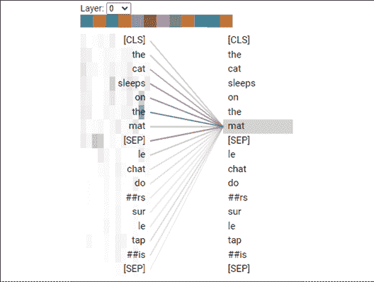
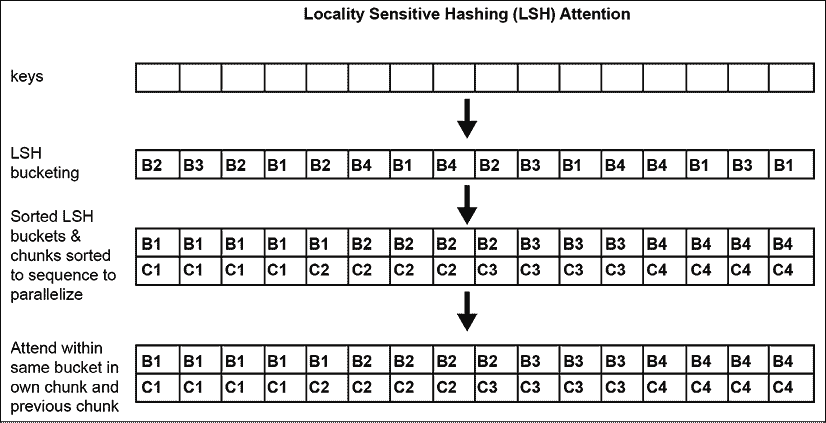
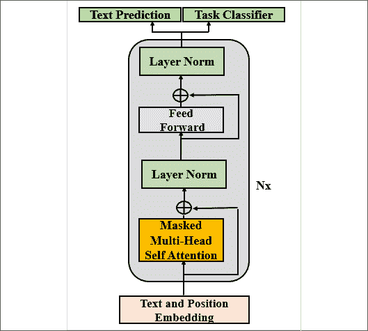
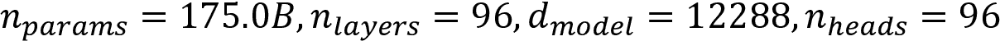
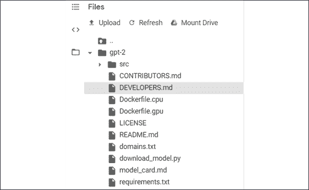
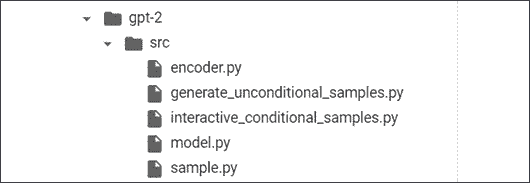
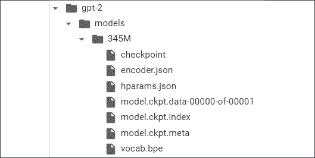

# six

# 使用 OpenAI GPT-2 和 GPT-3 模型生成文本

在 2020 年， *Brown* 等人(2020)描述了 OpenAI GPT-3 模型的训练，该模型在 50 petaflop/s 天内用大约一万亿个词训练了 1750 亿个参数。这表示每天对 4000 亿字节对编码的令牌进行大约 50*1020 次操作。与此同时，我们了解到 OpenAI 可以访问一台量身定制的超级计算机，其中包含 28 万个 CPU 和 1 万个 GPU。

一个新时代开始了。随着最近变压器的突破性智能和超级计算机的力量，一场巨人之战已经开始。微软、谷歌、脸书、百度、IBM 和其他公司每年都会产生几次改变游戏规则的人工智能资源。人工智能项目经理和开发人员需要不断地重新发明一种方法来理解、驯服和实现这些令人兴奋的创新。

OpenAI GPT-3 的机器智能和超级计算机的机器能力使布朗等人(2020 年)进行了零射击实验。这个想法是将训练好的模型用于下游任务，而不需要进一步训练参数。目标是让一个训练有素的模型直接进入多任务生产。OpenAI 决定将 GPT-3 模型的使用限制在特定用户。人工智能的未来很可能仅限于云用户。GPT-2 和 GPT-3 的规模和能力似乎已经把 NLP 带到了另一个水平。然而，这可能不是提高变压器性能的唯一途径。

这一章将首先从项目管理的角度研究规模和转换模型的发展。我们能接受一个只能用云 AI 模型实现人工智能的未来吗？这个评估正确吗？我们应该考虑 GPT 模式吗？我们将会看到，改革者的架构或者利用**模式的训练** ( **宠物**)方法是否会挑战巨型模型和超级计算机是我们唯一未来的断言。

一旦我们决定探索 GPT 模型，我们将研究使用经过训练的 transformer 模型的零射击挑战，该模型的参数很少或没有为下游任务进行微调。我们将探索 GPT 变压器模型的创新架构。

然后，我们将使用 OpenAI 的存储库在 TensorFlow 中实现一个 345M 参数的 GPT-2 转换器。我们将与该模型进行交互，以产生带有标准条件句的文本补全。我们需要像理解任何其他转换器模型一样理解 GPT-2，以便能够在正确的时间做出正确的选择。

然而，我们需要更进一步。所以最后，我们将建造一个 117 米的定制 GPT-2 模型。我们将在第 3 章*、*从头开始预训练罗伯塔模型*中，对用于训练罗伯塔模型的高级概念性`Kant`数据集进行分词。这次我们将使用 GPT-2 模型训练数据集。我们将与经过训练的模型进行交互，以获得相当令人惊讶的人类基线水平输出。*

在本章结束时，你将能够根据你的自定义数据训练 GPT-2 模型，并按照你的意愿与一台智能与日俱增的机器进行交互。

本章基于从第一章到第五章学到的知识。在阅读本章之前，花必要的时间再看一遍，确保你已经记住了模型的主要方面和评估基准。

本章涵盖以下主题:

*   原始变压器架构的限制
*   重整器如何解决变压器的限制
*   宠物如何解决训练转换器的限制
*   定义零触发变压器模型
*   从少拍到一拍的路径
*   GPT 2 型和 GPT 3 型
*   建立一个接近人类的 GPT-2 文本完成模型
*   实现并运行 345M 参数模型
*   用标准模型与 GPT-2 互动
*   训练一个语言建模 GPT-2 117M 参数模型
*   导入自定义的特定数据集
*   编码自定义数据集
*   调节模型
*   针对特定文本完成任务调节 GPT-2 模型

让我们先来看看过去几年转换器的发展。

# 十亿参数变压器模型的兴起

转换器从为 NLP 任务训练的小型模型发展到几乎不需要微调的模型的速度是惊人的。

*Vaswani* 等人(2017)推出了 Transformer，在 BLEU 任务上超越了 CNN 和 RNNs。*等(2018)推出了**生成式预训练模型** ( **GPT** )，可以微调执行下游任务。 *Devlin* 等人(2019)完善了 BERT 模型的微调。*拉德福德*等人(2019)用 GPT-2 模型走得更远。*

 *布朗等人(2020 年)定义了一种不需要微调的 GPT-3 零触发变压器方法！

与此同时， *Wang* 等人(2019)创建了 GLUE 来对 NLP 模型进行基准测试。但是转换器模型进化得如此之快，以至于超越了人类的基线！

王等人(2019，2020)迅速创造了强力胶，将人类基线设得更高，并使/NLP 任务更具挑战性。在写这本书的时候，转换器正在强力胶排行榜上快速前进。

这怎么会发生得这么快？

为了理解这种进化是如何发生的，我们将首先通过模型的大小来看这种进化的一个方面。

## 变压器型号越来越大

仅从 2017 年到 2020 年，个参数从原变压器模型的 65M 个参数增加到 GPT-3 模型的 175B 个参数，如*表 6.1* 所示:

| 变压器模型 | 纸 | 因素 |
| 变压器底座 | *Vaswani* 等人(2017 年) | 65 米 |
| 变压器大 | *Vaswani* 等人(2017 年) | 213 米 |
| 伯特基地 | *德弗林*等人(2019 年) | 110 米 |
| 伯特-拉奇 | *德弗林*等人(2019 年) | 340 米 |
| GPT-2 | *Radford* 等人(2019 年) | 117 米 |
| GPT-2 | *Radford* 等人(2019 年) | 345 米 |
| GPT-2 | *Radford* 等人(2019 年) | 1.5B |
| GPT-3 | *布朗*等人(2020 年) | 175B |

表 6.1:变压器参数数量的演变

*表 6.1* 仅包含在此短暂时间内设计的主要模型。出版日期在模型实际设计日期之后。此外，作者更新了论文和日期。例如，一旦最初的转换器启动了市场，转换器就从 Google Brain 和 Research、OpenAI 和脸书 AI 中涌现出来，并同时产生了新的模型。

此外，GPT-2 模型的某些尺寸大于较小的 GPT-3 模型。例如，GPT-3 小型模型包含 125M 参数，比 GPT-2 模型的 345M 参数小。

建筑的规模也在同时发展:

*   模型的层数从原始变压器的 6 层增加到 GPT-3 模型的 96 层。
*   一层的头数从最初的转换器模型的 8 个增加到 GPT-3 模型的 96 个。
*   上下文大小从最初的 Transformer 模型中的 512 个令牌增加到 GPT-3 模型中的 12，288 个令牌。

这种架构的规模解释了为什么有 96 层的 GPT-3 175B 比只有 40 层的 GPT-2 1542m 产生了更令人印象深刻的结果。两种型号的参数不相上下，但层数增加了一倍。

让我们从上下文大小来理解转换器快速进化的另一个方面。

### 上下文大小和最大路径长度

transformer 模型的基石在于注意力子层。反过来，注意力子层的关键属性是用于处理上下文大小的方法。

上下文大小是人类和机器学习语言的主要方式之一。上下文越大，我们就越能理解呈现给我们的序列。

然而，上下文大小的缺点是理解单词所指的距离。分析长期依赖关系的路径需要从循环层转变为关注层。

下面的句子需要很长的路径才能找到代词“它”所指的意思:

“我们的房子太小了，在这么小的空间里放不下一张大沙发、一张大桌子和其他我们想要的家具。我们考虑过待一段时间，但最后，我们决定卖掉*它*

“它”的意思只有在我们追溯到句子开头的单词“house”时才能得到解释。对于一台机器来说，那是一条相当长的路！

定义最大路径长度的函数的顺序可以总结为大 *O* 符号中的*表 6.2* 所示:

| 层类型 | 最大路径长度 | 上下文大小 |
| 自我关注 | 0(1) | one |
| 复发的 | 0(n) | Twelve thousand two hundred and eighty-eight |

表 6.2:最大路径长度

*Vaswani* 等(2017)优化了原 Transformer 模型中上下文分析的设计。注意力将操作归结为一对一的令牌操作。事实上，所有层都是相同的，这使得放大变压器模型的尺寸变得容易得多。具有 12，888 个令牌的上下文大小的 GPT-3 模型具有与变换器基本模型的 512 个令牌的上下文大小相同的最大长度路径。

例如，RNN 中的循环层必须逐步存储上下文的总长度。最大路径长度是上下文大小。处理 GPT-3 模型的上下文大小的 RNN 的最大长度大小将是 12，288 倍。此外，例如，RNN 不能将上下文分割成在并行机器架构上运行的 96 个头部，将操作分布在 96 个 GPU 上。

变压器灵活且优化的架构对其他几个因素产生了影响:

*   *Vaswani* 等人(2017)用 3600 万句话训练了一个最先进的转换器模型。*布朗*等人(2020)使用通用抓取数据集训练了一个拥有近万亿单词的 GPT-3 模型。
*   训练大型变压器模型需要的机器能力只有世界上有限的几个团队可以使用。 *Vaswani* 等人(2017)用 2.13 亿个参数训练变压器大模型消耗 2.3*10 ^(19) FLOPs。GPT-3 是在 50 千万亿次/秒的时间里训练出来的！
*   设计变压器的架构需要高素质的团队，而这些团队只能由世界上有限的几个组织提供资金。

规模和架构将继续发展和增加。超级计算机将继续提供必要的资源来训练转换器。

在介绍 OpenAI GPT 模型的主要方面之前，让我们暂停一下，看看我们在转换器、改革者、宠物方法或 GPT 模型之间的选择。

# 转换器，改革者，宠物，还是 GPT？

在使用 GPT 模型之前，我们需要停下来，从项目管理的角度来看一看《转换器》。对于给定的 NLP 项目，我们必须选择哪种模型和方法？我们应该相信他们中的任何一个吗？一旦我们考虑*成本管理*，*责任*随之而来，选择一个型号和一台机器成为一个项目的生死决策。在本节中，我们将在进入最近的 GPT-2 和巨大的 GPT-3(可能会有更多)模型之前停下来思考一下。

我们先后经历了:

*   *第 1 章*、*变压器的模型架构入门*中的带编码器和解码器堆栈的变压器的原始架构。
*   在*第二章*、*中微调一个预训练的只有编码器堆栈而没有解码器堆栈的 BERT 模型，微调 BERT 模型*。
*   在*第 3 章*、*中，训练一个类似 RoBERTa 的模型，只有一个编码器堆栈，没有解码器堆栈，从头开始预训练一个 RoBERTa 模型*。
*   第四章中的主要 NLP 任务*，*与转换器的下游 NLP 任务*。*
*   *第五章*中的重要翻译任务，*用变压器进行机器翻译*。
*   现在，我们面临着在未来的云人工智能平台上使用巨大的*只有解码器堆栈的 GPT-3 模型*的前景。

项目管理最佳实践迫使我们审视在微软 Azure 等收费云人工智能平台上仅使用 GPT-3 transformer 模型及其后续版本的前景。项目经理可以很容易地看到收费的云服务器，如预装的虚拟机，如何以合理的价格方便地外包强大机器的使用。

然而，被迫放弃控制我们自己的变压器的想法，只使用第三方收费的 GPT 变压器，例如，是做这个决定之前要考虑的事情。

在本节中，在使用 GPT 模型之前，我们将检查:

*   原始变压器模型的局限性。
*   针对变压器模型架构的可能限制的重整器解决方案。
*   训练模型的最佳解决方案。

让我们先来看看原始变压器架构的局限性。

## 原始变压器架构的限制

原始变压器模型的可能限制与导致更多机器功率的存储器问题有关。

让我们将注意力头形象化，以获得变压器模型限制的实用视图。

打开`head_view_bert.ipynb`实现`BertViz`，由*杰西·维格*设计，可视化几个转换器模型中的注意力头，比如转换器、伯特、GPT-2、罗伯塔等等。我们将运行 BERT 模型，因为任何模型都足以看出 Transformer 模型的局限性。

### 运行 beatriz

只需要四个步骤就可以可视化转换器注意力头，与它们互动，理解转换器模型的局限性。

先来安装`BertViz`和要求。

#### 步骤 1:安装 BertViz

笔记本安装`BertViz`，抱脸转换器，以及实现计划的其他基本要求:

```py
#@title Step 1: Installing BertViz and Requirements

import sys

!test -d bertviz_repo && echo "FYI: bertviz_repo directory already exists, to pull latest version uncomment this line: !rm -r bertviz_repo"

# !rm -r bertviz_repo # Uncomment if you need a clean pull from repo

!test -d bertviz_repo || git clone https://github.com/jessevig/bertviz bertviz_repo

if not 'bertviz_repo' in sys.path:

  sys.path += ['bertviz_repo']

!pip install regex

!pip install transformers 
```

我们现在将导入必要的模块。

#### 步骤 2:导入模块

`BertViz`已使模块无缝导入:

```py
#@title Step 2: Import BertViz Head Views and BERT

from bertviz import head_view

from transformers import BertTokenizer, BertModel 
```

就是这样！我们已经准备好 HTML 可视化界面了。

#### 步骤 3:定义 HTML 函数

`BertViz`现在准备好了出发。

笔记本实现了一个标准的 IPython HTML 函数:

```py
#@title Step 3: Defining the HTML Function

def call_html():

  import IPython

  display(IPython.core.display.HTML('''

        <script src="/static/components/requirejs/require.js"></script>

        <script>

          requirejs.config({

            paths: {

              base: '/static/base',

              "d3": "https://cdnjs.cloudflare.com/ajax/libs/d3/3.5.8/d3.min",

              jquery: '//ajax.googleapis.com/ajax/libs/jquery/2.0.0/jquery.min',

            },

          });

        </script>

        ''')) 
```

我们现在准备处理并显示注意头。

#### 步骤 4:处理和显示注意力头部

现在让我们处理一个翻译来显示注意头。我们可以使用任何变压器模型或任何任务。我们仍然会得出相同的结论。

笔记本使用预先训练的 BERT，处理要翻译的句子，并显示注意力头部活动:

```py
#@title Step 4: Processing and Displaying Attention Heads

model_version = 'bert-base-uncased'

do_lower_case = True

model = BertModel.from_pretrained(model_version, output_attentions=True)

tokenizer = BertTokenizer.from_pretrained(model_version, do_lower_case=do_lower_case)

sentence_a = "The cat sleeps on the mat"

sentence_b = "Le chat dors sur le tapis"

inputs = tokenizer.encode_plus(sentence_a, sentence_b, return_tensors='pt', add_special_tokens=True)

token_type_ids = inputs['token_type_ids']

input_ids = inputs['input_ids']

attention = model(input_ids, token_type_ids=token_type_ids)[-1]

input_id_list = input_ids[0].tolist() # Batch index 0

tokens = tokenizer.convert_ids_to_tokens(input_id_list)

call_html()

head_view(attention, tokens) 
```

输出显示一个交互式 HTML 界面，显示注意力头部活动:



图 6.1:可视化注意力头部

花几分钟时间摆弄一下注意力头。浏览 12 层(在下拉列表中选择一层)。悬停在每个单词上，查看连接和 12 个注意力标题(每个单词旁边的小方块)。

我们对注意力头的实证实验得出了一些重要的结论:

*   注意力过程考虑所有可能的单词对，以学习它们之间的联系。上下文窗口越大，分析的对就越多。
*   如果一个文本是 100K 单词长，这导致 100K 乘以 100K 单词对。也就是说每一步有 100 亿双鞋！实现这一过程的计算机能力令人惊叹，并且需要超级计算机来实现可接受的性能。
*   层数导致存储信息的大量内存需求，包括包含数千层的模型的膨胀前馈层达到数兆字节。
*   我们可能分析长序列的一个原因是为了转换器音乐生成，你可以在本章的*用转换器*生成音乐一节中听到。

在使用大量的计算机资源之前，标准的项目管理流程是在算法架构级别或培训级别检查几个解决方案。

谷歌人工智能提出了改革者，这可能是可能的解决方案之一。

## 改革家

*基塔耶夫*等人【2020】、[https://arxiv.org/abs/2001.04451](https://arxiv.org/abs/2001.04451)设计了重整器，解决注意力问题和记忆问题，给原始的转换器模型增加了功能。这种方法很有趣，尽管还有其他方法可以解决使用蒸馏的变压器的性能问题，例如，在本章的*模式利用训练(PET)* 一节中所解释的。

改革者首先用**位置敏感性哈希** ( **LSH** )桶和分块来解决注意力问题。

LSH 在数据集中搜索最近邻。哈希函数确定如果数据点 *q* 接近 *p* ，那么*哈希(q)* == *哈希(p)* 。在这种情况下，数据点是 transformer 模型头部的关键点。

LSH 函数在一个名为 LSH 分桶的过程中将关键字转换为 LSH *桶*(在本例中为 *B1* 到 *B4* )，就像一样，我们会将彼此相似的对象放入相同的分类桶中。排序后的桶被分成*块*(在本例中为 *C1* 到 *C4* )进行并行化。最后，注意力将仅应用于其组块和前一组块中的相同桶内。



图 6.2: LSH 注意头

LSH 分桶和分块大大降低了复杂度，从考虑所有词对的 *O* (L ² )到只考虑每个桶的内容的 *O* ( *L* log *L* )。

重整器还解决了重新计算每层输入的内存问题，而不是存储多层模型的信息。对于一些大型多层模型，重新计算是按需实现的，而不是消耗太多的内存。

你可以在 Hugging Face 上进一步探索重整器模型的文档和代码:[https://Hugging Face . co/transformers/model _ doc/Reformer . html？高亮显示=重整器](https://huggingface.co/transformers/model_doc/reformer.html?highlight=reformer)

然而，请记住，重整器并不是变压器极限的银弹。

本节介绍了 Reformer 的主要概念，它可以将大型训练模型降低到几 GB 的内存和一个 GPU。然而，这就是解决办法吗？或者 PET 是训练变压器模型的更好方法。

我们先了解一下什么是宠物再做决定。

## 模式开发训练(PET)

OpenAI 创建了大型模型，如 GPT-3，谷歌人工智能用重整器优化了变压器。但是如果 Google AI 和 OpenAI 全错了呢？

提莫·希克和 T2 写了一篇论文，对谷歌人工智能和 OpenAI 的方法提出了严重挑战。

席克和 T2 写的论文的标题不言自明:

不仅仅是尺寸有关系:小型语言模型也是很少接触的学习者:【https://arxiv.org/abs/2009.07118】T2

席克和*舒茨*认为，在强力胶排行榜上，一个 2.23 亿参数的变压器模型胜过了一个 GPT-3 1750 亿参数的模型。凭借一个只有巨大的 GPT-3 模型的一小部分，大约只有 0.001 的转换器模型，*提莫·席克*和*辛里奇·施策*用单个 GPU 和 11gb RAM 获得了不错的结果。

慕尼黑路德维希马克西米利安大学信息和语言处理中心的表现相当不错！与谷歌人工智能和微软支持的 OpenAI 相比，这一进展来自一个相对较小的研究中心是非常令人惊讶的。

*提莫·席克*在强力胶排行榜上名列第 9，GPT-3 仅名列第 12:


图 6.3:排行榜版本:2020 年 12 月 2.0

强力胶排行榜上的排名不断变化。但是在某个时间点上，*提莫·席克*和*辛里奇·舒尔茨*在**语言模型** ( **LMs** )的历史上发表了异常强烈的声明。

请注意，具有 PET 的双向 ALBERT 模型比 GPT-3 单向模型性能更好。

PET 似乎是一种需要考虑的方法。让我们过一遍基本概念。

### 模式开发训练的哲学

正如*席克*和*舒茨* (2020)所描述的，宠物依赖于一个核心原则:

*将一项培训任务改写成完形填空题*。

重新制定训练任务以优化训练过程增强了变换器模型的性能，同时减小了模型和数据集的大小。

我们在学校都遇到过完形填空的任务，比如:

用名词填空:

我住在一个 ____。

*正确答案是:房子*

完形填空题是转换器的天然选择，转换器使用掩蔽记号进行训练。

让:

*   *M* 是一个蒙面语言模特名叫 *MLM*
*   *T* 是 *MLM* 的词汇
*   ___  *T* 成为掩码令牌

PET 将输入映射到输出的过程需要一组**模式描述符对** ( **PVPs** )。

每个 PVP 对包含:

*   一个*模式 P* 将输入转换(映射)为包含单个掩码的完形填空问题。
*   一个*描述器 v* 将每个输出转换(映射)成一个单独的令牌。

有了这些信息，PET 旨在确定输出 *y* 对于输入 *x* 来说是正确的。

因此，PET 将确定 *v* ( *y* )在屏蔽位置 *P* ( *x* )成为正确标记的概率。

PET 将使用交叉熵来微调其过程。

我们可以看到这个过程可以和*知识提炼*联系在一起，知识提炼是把大的模型转化成更小的模型。PET 的一个变体是 iPET，这是一个迭代过程，通过该过程，模型使用数据集进行训练，这些数据集使用上一代产生的标签在每一代增加大小。

通过 iPET 进行蒸馏已经用一个相对较小的艾伯特模型证明了它的效率，该模型在强力胶排行榜上获得了比巨大的 GPT-3 模型更好的结果。

宠物可以在 GitHub 上获得:

[https://github.com/timoschick/pet](https://github.com/timoschick/pet)

我们可以看到 PET 在训练过程中引入了蒸馏，减少了对大型变压器模型和机器功率的需求。

在决定为一个项目设计什么样的架构时，这是值得考虑的。

# 是做决定的时候了

项目经理的决定是什么？我们已经看到了原始 Transformer 模型的局限性，这导致我们不得不选择一条道路:

*   接受原始 Transformer 模型的限制，并继续开发需要大量机器内存和计算能力的大型模型。
*   拒绝原始变压器的限制，用改革型方法调整其架构。
*   使用不同的培训方法，如 PET，一种有效的知识提炼方法。
*   使用这些方法的组合。
*   Design your own training methods and model architecture.

    市场上不断出现许多变压器模型方法。花必要的时间为你的项目找到正确的道路。

    在实际项目管理中，每种方法都将使用标准评估参数进行仔细评估:

    *   每个解决方案的成本
    *   每个解决方案的效率
    *   实施项目的人力和机器资源
    *   上市时间和生产时间

    在对项目的目标和成本进行仔细研究之前，我们不能排除任何解决方案。每个项目都会有自己的生命，没有什么注定的路径。

    我们可能需要一个成熟的 GPT-2 或 GPT-3 模型来实现我们的目标。

    现在让我们来看看 OpenAI GPT 模型的主要方面。

    # 开放式 GPT 模型的架构

    转换器从 2017 年底到 2020 年第一学期，不到 3 年的时间，从训练，微调，最后零拍模型。零射击 GPT-3 变压器模型不需要微调。经过训练的模型参数不会为下游多任务更新，这为 NLP/NLU 任务开启了一个新时代。

    在这一部分，我们将首先了解设计 GPT 模型的 OpenAI 团队的动机。我们将从微调到零拍摄模式开始。然后，我们将看到如何调整 transformer 模型，以生成令人兴奋的文本补全。最后，我们将探索 GPT 模型的架构。

    我们将首先介绍 OpenAI 团队的创建过程。

    ## 从微调到零拍模式

    从一开始，OpenAI 的研究团队，由*拉德福德*等人(2018)领导，想要把转换器从训练有素的模型带到 GPT 模型。目标是在无标签的数据上训练变压器。让注意力层从无人监督的数据中学习语言是明智之举。OpenAI 决定训练转换器学习一种语言，而不是教它们完成特定的 NLP 任务。

    OpenAI 想要创建一个任务无关的模型。他们开始根据原始数据训练变压器模型，而不是依赖专家标记的数据。标记数据非常耗时，并且大大降低了变压器的训练过程。

    第一步是从变压器模型中的无监督训练开始。然后，只对模型的监督学习进行微调。

    OpenAI 选择了 12 层解码器专用变压器，我们将在本部分的堆叠解码器层部分进行描述。结果的度量是令人信服的，并很快达到了 NLP 研究实验室的最佳 NLP 模型的水平。

    第一版 GPT 变压器模型的良好结果迅速促使*拉德福德*等人(2019)开始考虑零发射转移模型。他们哲学的核心是继续训练 GPT 模型从原始文本中学习。然后，他们的研究更进了一步，通过无监督分布的例子来关注语言建模:

    实例=( *x* [1] 、 *x* [2] 、 *x* [3] 、 *x* [n] )

    这些示例由符号序列组成:

    Sequences=( *s* [1] ， *s* [2] ， *s* [3] ， *s* [n] )

    这就产生了一个元模型，它可以表示为任何类型输入的概率分布:

    *p* ( *输出* / *输入*)

    我们的目标是，一旦经过强化训练的 GPT 模型理解了一种语言，就将这个概念推广到任何类型的下游任务。

    GPT 模型从 117 米参数迅速发展到 345 米参数，到其他尺寸，然后到 1542 米参数。1，000，000，000+参数变压器诞生了。微调的份额锐减。结果再次达到了最先进的指标。

    这鼓励了 OpenAI 走得更远，更远。 *Brown* 等人(2020 年)继续假设条件概率转换模型可以进行深度训练，并且能够在很少或没有微调的情况下为下游任务产生出色的结果:

    *p* ( *输出* / *多任务*)

    OpenAI 正在实现其目标，即训练一个模型，然后直接运行下游任务，无需进一步微调。这一惊人的进步可以分为四个阶段:

    *   **微调** ( **FT** )意在以我们在前几章已经探索过的方式进行。变压器模型被训练，然后在下游任务上被微调。拉德福德等人(2018)设计了许多微调任务。OpenAI 团队随后在接下来的步骤中将任务数量逐步减少到`0`。
    *   **少镜头** ( **FS** )代表着的巨大进步。GPT 训练有素。当模型需要作出推论时，它会以条件反射的方式展示要执行的任务。条件反射取代了体重更新，GPT 团队将其排除在流程之外。我们将通过我们提供的上下文对我们的模型应用条件，以获得我们将在本章中浏览的笔记本中的文本完成。
    *   **一击** ( **1S** )将的过程推进了一步。经过训练的 GPT 模型仅呈现了一个要执行的下游任务的演示。也不允许更新重量。
    *   **零射门** ( **ZS** )是最终的目标。经过训练的 GPT 模型没有显示要执行的下游任务。

    这些方法中的每一种都有不同程度的效率。OpenAI GPT 团队努力生产这些最先进的变压器模型。

    我们现在可以解释导致 GPT 模型架构的动机:

    *   教学变压器模型如何通过广泛的培训学习语言。
    *   通过语境调节关注语言建模。
    *   转换器获取上下文，并以一种新颖的方式生成文本补全。不管任务是什么，它都致力于理解输入并做出推论，而不是在学习下游任务上消耗资源。
    *   通过屏蔽部分输入序列来寻找训练模型的有效方法，以迫使转换器用机器智能进行思考。机器智能虽然不是人类，但很有效率。

    我们理解导致 GPT 模型架构的动机。让我们来看看只有解码器层的 GPT 模型。

    ## 堆叠解码器层

    我们现在了解到 OpenAI 团队专注于语言建模。保留掩蔽的注意力子层是有意义的。因此选择保留解码器堆栈并排除编码器堆栈。为了达到出色的结果，*布朗*等人(2020)大幅增加了只有解码器的变压器模型的尺寸。

    GPT 模型与 *Vaswani* 等人(2017)设计的原始变压器的解码器堆栈具有相同的结构。我们在*第 1 章*、*变压器*模型架构入门中描述了解码器堆栈。如有必要，花几分钟时间回顾一下原始变压器的架构。

    GPT 模型具有仅解码器架构，如图*图 6.1* 所示:

    

    图 6.4: GPT 解码器专用架构

    我们可以识别文本和位置嵌入子层、掩蔽多头自注意层、归一化子层、前馈子层和输出。有一个版本的 GPT-2 与文本预测和任务分类。

    OpenAI 团队定制了，并逐个型号地调整解码器。*拉德福德*等人(2019)提出了不少于四个 GPT 模型，*布朗*等人(2020)描述了不少于八个模型。

    GPT-3 175B 模型已经达到了一个独特的规模，它需要世界上很少有团队能够获得的计算机资源:

    

    本章将首先使用经过训练的 GPT-2 345M 模型来完成文本，该模型具有 24 个解码器层和 16 个头的自关注子层。

    然后，我们将训练一个 GPT-2 117M 模型，用于定制文本完成，具有 12 个解码器层和 12 个头的自我关注层。

    我们探索了从微调到零射击 GPT-3 模型的过程。尽管 GPT-3 模型只对全球少数用户可用，但 GPT-2 模型足够强大，足以理解 GPT 模型的内部运作。

    我们准备与 GPT-2 模型互动，然后训练它。让我们从 345M 参数的 GPT-2 模型开始。

    # 用 GPT-2 完成文本

    本节将克隆 OpenAI GPT-2 库，下载 345M 参数 GPT-2 变压器模型，并与之交互。我们将输入上下文句子并分析转换器生成的文本。目标是看它如何创造新的内容。

    本部分分为 9 个步骤。在 Google 协同实验室中打开`OpenAI_GPT_2.ipynb`。笔记本在这本书的 GitHub 资源库的章节里。您会注意到，笔记本也分为与本部分相同的 9 个步骤和单元格。

    一个单元一个单元地运行笔记本。这个过程是乏味的，但是克隆的 OpenAI GPT-2 库产生的结果是令人满意的。

    需要注意的是，我们运行的是低级别的 GPT-2 模型，而不是通过一行调用来获得结果。我们也在避免预包装的版本。我们正在尝试从头开始理解 GPT-2 的架构。您可能会收到一些反对消息。然而，这种努力是值得的。

    让我们从激活 GPU 开始。

    ## 步骤 1:激活 GPU

    我们必须激活 GPU 来训练我们的 GPT-2 345M 参数转换器模型。在写这本书的时候，我们还不能开源访问 OpenAI 的更大的模型，比如 GPT-3。OpenAI 已经开始提供转换器作为云服务。然而，在本章的宠物部分，我们看到，我们可能能够用标准机器运行小模型，而不需要通过云服务来运行强大的变压器 GPT-3。

    在本节中，我们将使用 GPT-2 模型，但不会对其进行培训。即使我们可以获得源代码，我们也无法训练大型 GPT 模型，因为我们大多数人缺乏这样做的计算能力。 *Vaswani* 等人(2017)已经使用 8 个 P100 GPU 来训练第一个“大”213M 参数变压器模型。我们将需要 petaflops 与最新的变压器模型！

    一个普通的开发人员无法获得这种水平的机器能力。比如 Google Cloud，Microsoft Azure，**Amazon Web Services**(**AWS**，可以将 teraflops 中一定级别的机器资源租给云客户。

    如果我们更进一步，在万亿次浮点运算中训练转换器就变得更难了。访问 petaflops 计算能力仅限于世界上有限数量的团队。

    然而，我们将看到，谷歌联合实验室虚拟机的有限能力为我们的 345 米参数 GPT-2 产生的结果是相当令人信服的。

    现在，我们已经了解了训练当今大型变压器模型需要什么，让我们激活**笔记本设置**中的 GPU，以充分利用虚拟机:

    

    图 6.5:GPU 硬件加速器

    我们可以看到，激活 GPU 是获得更好性能的先决条件，这将使我们能够进入 GPT 转换器的世界。现在让我们克隆开放 AI GPT-2 库。

    ## 步骤 2:克隆 OpenAI GPT-2 库

    OpenAI 仍然允许我们下载 GPT 2 号。这可能会在未来停止，或者我们可能会获得更多的资源。在这一点上，变压器及其使用的发展如此之快，没有人能预见市场将如何发展，即使是主要的研究实验室自己。

    我们将在我们的虚拟机上克隆 OpenAI 的 GitHub 目录:

    ```py
    #@title Step 2: Cloning the OpenAI GPT-2 Repository

    !git clone https://github.com/openai/gpt-2.git 
    ```

    克隆完成后，您应该会看到存储库出现在文件管理器中:

    

    图 6.6:克隆的 GPT-2 储存库

    点击 **src** ，您将看到我们需要从 OpenAI 运行我们的模型的 Python 文件已经安装:

    

    图 6.7:运行模型的 GPT-2 Python 文件

    你可以看到我们没有我们需要的 Python 训练文件。我们将在本章的*培训 GPT-2 语言模型*部分培训 GPT-2 模型时安装它们。

    现在让我们安装需求。

    ## 步骤 3:安装需求

    需求将被自动安装:

    ```py
    #@title Step 3: Installing the requirements

    import os          # when the VM restarts import os necessary

    os.chdir("/content/gpt-2")

    !pip3 install -r requirements.txt 
    ```

    当逐个单元运行时，我们可能不得不重启 VM，从而再次导入`os`。

    该笔记本的要求是:

    *   `Fire 0.1.3`生成**命令行界面** ( **CLIs** )
    *   `regex 2017.4.5`对于正则表达式的用法
    *   `Requests 2.21.0`，一个 HTTP 库
    *   `tqdm 4.31.1`显示循环的进度表

    您可能会被要求重启笔记本。

    *现在不要重启*。*让我们等着检查 TensorFlow* 的版本。

    ## 步骤 4:检查 TensorFlow 的版本

    OpenAI 提供的 GPT-2 transformer 345M 变压器模型使用 TensorFlow 1.x，这将导致在运行程序时出现几个警告。我们将忽略他们，用我们最普通的机器在训练 GPT 模型的薄冰上全速奔跑。2020 年，GPT 模型已经达到 1750 亿个参数，这使得我们在没有超级计算机的情况下不可能训练它们。

    企业巨头的研究实验室，如脸书人工智能和 OpenAI 以及谷歌研究/大脑，正在加速走向超级转换器，并留给我们他们可以让我们学习和理解的东西。他们没有时间回去更新他们共享的所有模型。

    这也是谷歌联合实验室虚拟机预装 TensorFlow 1.x 和 TensorFlow 2.x 版本的原因之一。

    我们将在本笔记本中使用 TensorFlow 1.x:

    ```py
    #@title Step 4: Checking the Version of TensorFlow 

    #Colab has tf 1.x and tf 2.x installed

    #Restart runtime using 'Runtime' -> 'Restart runtime...'

    %tensorflow_version 1.x

    import tensorflow as tf

    print(tf.__version__) 
    ```

    输出应该是:

    ```py
    TensorFlow 1.x selected.

    1.15.2 
    ```

    无论版本`tf 1.x`是否显示，重新运行单元进行确认，然后重启虚拟机。*在继续*之前，重新运行该单元以确认。

    *如果在此过程中遇到 TensforFlow 错误(忽略警告)，请重新运行此单元，重新启动虚拟机，然后重新运行以确保*。

    每次重新启动虚拟机时都要这样做。虚拟机的默认版本是`tf.2`。

    我们现在准备下载 GPT-2 模型。

    ## 步骤 5:下载 345M 参数 GPT-2 模型

    我们在本章的*open ai GPT 模型的架构*部分探讨了 GPT 模型。我们现在将下载一个经过训练的 345M 参数 GPT-2 模型:

    ```py
    #@title Step 5: Downloading the 345M parameter GPT-2 Model

    # run code and send argument

    import os # after runtime is restarted

    os.chdir("/content/gpt-2")

    !python3 download_model.py '345M' 
    ```

    模型目录的路径是:

    `/content/gpt-2/models/345M`

    它包含运行模型所需的信息:

    

    图 6.8:345m 参数模型的 GPT-2 Python 文件

    `hparams.json`文件包含 GPT-2 模型的定义:

    *   `"n_vocab"` : `50257`，模型的词汇量的大小
    *   `"n_ctx"` : `1024`，上下文大小
    *   `"n_embd"` : `1024`，嵌入尺寸
    *   `"n_head"` : `16`，头数
    *   `"n_layer"` : `24`，层数

    `encoder.json`和`vacab.bpe`包含分词词汇和 BPE 词对。如有必要，花几分钟时间回过头来阅读*第 3 章*、*中的*第 3 步:训练标记器*小节，从头开始训练 RoBERTa 模型*。

    `checkpoint`文件包含检查点的训练参数。例如，它可以包含 1000 个步骤的训练参数，正如我们将在本章的*训练 GPT-2 语言模型*一节中所做的。

    `checkpoint`文件与另外三个重要文件一起保存:

    *   `model.ckpt.meta`描述模型的图形结构。它包含`GraphDef`、`SaverDef`等等。我们可以用`tf.train.import_meta_graph([path]+'model.ckpt.meta')`检索信息。
    *   `model.ckpt.index`是字符串表。键包含一个张量的名称，值为`BundleEntryProto`，包含一个张量的元数据。
    *   `model.ckpt.data`包含一个 *TensorBundle 集合*中所有变量的值。

    我们已经下载了模型。在激活模型之前，我们将经历一些中间步骤。

    ## 步骤 6-7:中间指令

    在本节中，我们将从到*步骤 6* 、 *7* 和 *7a* ，它们是通向*步骤 8* 的中间步骤，在这些步骤中，我们将定义并激活模型。

    当我们与模型交互时，我们希望将 UTF 编码的文本打印到控制台:

    ```py
    #@title Step 6: Printing UTF encoded text to the console

    !export PYTHONIOENCODING=UTF-8 
    ```

    我们希望确保我们在`src`目录中:

    ```py
    #@title Step 7: Project Source Code

    import os # import after runtime is restarted

    os.chdir("/content/gpt-2/src") 
    ```

    我们已准备好与 GPT-2 模型互动。我们可以用一个命令直接运行它，就像我们将在本章的*训练 GPT-2 语言模型*部分所做的那样。然而，在这一节中，我们将介绍代码的主要方面。

    `interactive_conditional_samples.py`首先导入与模型交互所需的必要模块:

    ```py
    #@title Step 7a: Interactive Conditional Samples (src)

    #Project Source Code for Interactive Conditional Samples:

    # /content/gpt-2/src/interactive_conditional_samples.py file 

    import json

    import os

    import numpy as np

    import tensorflow as tf 
    ```

    我们已经完成了激活模型的中间步骤。

    ## 步骤 7b-8:导入和定义模型

    我们现在将激活与`interactive_conditional_samples.py`模型的交互。

    我们需要导入三个模块，它们也在`/content/gpt-2/src`中:

    ```py
    import model, sample, encoder 
    ```

    这三个程序是:

    *   `model.py`定义模型的结构:超参数、多关注点`tf.matmul`操作、激活函数和所有其他属性。
    *   `sample.py` processes the interaction and controls the sample that will be generated. It makes sure that the tokens are more meaningful.

        Softmax 值有时会很模糊，就像看到低清晰度的图像一样。`sample.py`包含一个名为 temperature 的变量，该变量将使值更清晰，增加较高的概率并软化较低的概率。

        `sample.py`可以激活 Top- *k* 采样。Top- *k* 采样对预测序列的概率分布进行排序。分布头部的较高概率值被过滤到第 k- *个*记号。包含较低概率的尾部被排除，防止模型预测低质量的令牌。

        `sample.py`也可以激活 Top- *p* 采样进行语言建模。Top- *p* 抽样不对概率分布进行排序。它选择具有高概率的单词，直到这个子集的概率之和或一个可能序列的核心超过 *p* 。

    *   `encoder.py`用定义的模型、`encoder.json`和`vocab.bpe`对样本序列进行编码。它包含一个 BPE 编码器和一个文本解码器。

    您可以打开这些程序，双击它们进行进一步的探索。

    `interactive_conditional_samples.py`将调用与模型交互所需的函数来初始化以下信息:来自`model.py`的定义模型的超参数，来自`sample.py`的样本序列参数。它会用`encode.py`对序列进行编码和解码。

    `interactive_conditional_samples.py`然后将恢复在*步骤 5:* *中定义的检查点数据，下载本节的 345M* *参数 GPT-2 模型*小节。

    您可以双击`interactive_conditional_samples.py`并试验其参数:

    *   `model_name`是型号名称，如`"124M"`或`"345M"`并依赖于`models_dir`。
    *   `models_dir`定义包含模型的目录。
    *   `seed`为随机生成器设置一个随机整数。种子可以被设置为再现结果。
    *   `nsamples`是要返回的样本数。如果设置为`0`，它将继续生成样品，直到您双击该单元的*运行*按钮或按下 *Ctrl* + *M* 。
    *   `batch_size`决定一个批次的大小，对内存和速度有影响。
    *   `length`是生成文本的标记数。如果设置为`none`，它依赖于模型的超参数。
    *   `temperature`确定波尔兹曼分布的等级。如果温度高，完井将更加随机。如果温度低，结果将变得更加确定。
    *   `top_k`控制 Top- *k* 在每一步考虑的令牌数量。`0`表示没有限制。`40`是推荐值。
    *   `top_p`控制 Top- *p* 。

    对于本节中的程序，我们刚刚探索的参数的场景将是:

    *   `model_name= "345M"`
    *   `seed = None`
    *   `nsamples= 1`
    *   `batch_size= 1`
    *   `length = 300`
    *   `temperature=1`
    *   `top_k=0`
    *   `models_dir='/content/gpt-2/models'`

    这些参数将影响模型的行为，影响它受上下文输入制约的方式，并生成文本完成序列。首先，用默认值运行笔记本。然后，您可以通过双击程序、编辑并保存它来更改代码的参数。每次重新启动虚拟机时，都会删除这些更改。如果您希望创建交互场景，请保存程序并重新加载它。

    程序现在准备好提示我们与它交互。

    ## 步骤 9:与 GPT-2 互动

    在本节中，我们将与 GPT-2 117M 模型互动。

    系统运行时会有更多的消息，但只要 Google Colaboratory 维护`tf 1.x`，我们就会用这个笔记本运行模型。无论如何，如果新的 GPT 模型对我们可用，我们可能需要在非常强大的云计算机上运行它们。

    同时，让我们与模型互动。

    要与模型交互，运行`interact_model`单元格:

    ```py
    #@title Step 9: Interacting with GPT-2

    interact_model('345M',None,1,1,300,1,0,'/content/gpt-2/models') 
    ```

    系统会提示您输入一些上下文:

    

    图 6.9:文本完成的上下文输入

    您可以尝试任何类型的上下文，因为这是一个标准的 GPT-2 模型。

    我们可以试试伊曼纽尔·康德写的一句话:

    ```py
    Human reason, in one sphere of its cognition, is called upon to

    consider questions, which it cannot decline, as they are presented by

    its own nature, but which it cannot answer, as they transcend every

    faculty of the mind. 
    ```

    按*回车*生成文本。由于 GPT-2 模型不是在我们的数据集上训练的，所以输出或多或少是随机的。

    让我们看看 GPT 模型生成的前几行:

    ```py
    "We may grant to this conception the peculiarity that it is the only causal logic. 

    In the second law of logic as in the third, experience is measured at its end: apprehension is afterwards closed in consciousness.

    The solution of scholastic perplexities, whether moral or religious, is not only impossible, but your own existence is blasphemous." 
    ```

    要停止该单元，双击该单元的运行按钮。

    您也可以键入 *Ctrl* + *M* 来停止生成文本，但是它可能会将代码转换成文本，您必须将它复制回程序单元格中。

    输出非常丰富，我们可以观察到几个事实:

    *   我们输入的上下文*决定了*模型生成的输出。
    *   上下文是模型的演示。它在不修改模型参数的情况下从模型中学习要说什么。
    *   文本完成受上下文的制约。这为不需要微调的变压器型号打开了大门。
    *   从语义的角度来看，输出可能更有趣。
    *   从语法角度来看，输出是令人信服的。

    让我们看看是否可以通过在自定义数据集上训练模型来获得更令人印象深刻的结果。

    # 训练 GPT-2 语言模型

    本节将在我们将要编码的自定义数据集上训练一个 GPT-2 模型。然后，我们将与我们的定制模型进行交互。我们将使用与*第 3 章*、*中相同的`kant.txt`数据集，从头开始预训练 RoBERTa 模型*。

    这一节指的是`Training_OpenAI_GPT_2.ipynb`的代码，在 GitHub 上这本书的本章目录里。

    需要注意的是，我们运行的是低级别的 GPT- 2 模型，而不是通过一行调用来获得结果。我们也在避免预包装的版本。我们正在尝试从头开始理解 GPT-2 的架构。您可能会收到一些反对消息。然而，这种努力是值得的。

    我们将打开笔记本，一个单元一个单元地运行。

    ## 步骤 1:先决条件

    本节中提到的文件可以在本书的 GitHub 库的章节目录中找到:

    *   按照本章【T2-2 文本补全章节的*步骤 1* 中的说明，激活笔记本运行时菜单中的 GPU。
    *   Upload the following Python files to Google Colaboratory with the built-in file manager: `train.py`, `load_dataset.py`, `encode.py`, `accumulate.py`,`memory_saving_gradients.py`.

        这些文件最初来自于 *N Shepperd* 的 GitHub 库:【https://github.com/nshepperd/gpt-2】T2。

        但是，您可以从本书的 GitHub 资源库中的`gpt-2-train_files`目录下载这些文件。

        GitHub 知识库为训练我们的 GPT-2 模型提供了必要的文件。我们不会克隆 N .谢泼德的仓库。我们将克隆 OpenAI 的存储库，并从 N Shepperd 的存储库中添加我们需要的五个训练文件。

    *   Upload `dset.txt` to Google Colaboratory with the in-built file manager. The dataset is named `dset.txt` so that you can replace its content without modifying the program with your customized inputs after you have read this chapter.

        这个数据集在本书的 GitHub 库中的`gpt-2-train_files`目录中。它是在*第三章*、*中使用的`kant.txt`数据集，用于从头开始预训练一个 RoBERTa 模型*。

    我们现在将经历培训过程的初始步骤。

    ## 步骤 2 到 6:培训过程的初始步骤

    这一小节将简要介绍*步骤 2* 到 *6* ，因为我们在本章的前几节已经介绍过了。然后，我们将数据集和模型复制到项目目录中。

    每个步骤都与本章的*用 GPT-2* 完成文本部分中描述的步骤相同。

    该程序现在克隆 OpenAI 的 GPT-2 库，而不是谢泼德的库:

    ```py
    #@title Step 2: Cloning the OpenAI GPT-2 Repository

    #!git clone https://github.com/nshepperd/gpt-2.git

    !git clone https://github.com/openai/gpt-2.git 
    ```

    我们已经从谢泼德的目录上传了训练 GPT-2 模型所需的文件。

    该程序现在安装要求:

    ```py
    #@title Step 3: Installing the requirements

    import os             #when the VM restarts import os necessary

    os.chdir("/content/gpt-2")    

    !pip3 install -r requirements.txt 
    ```

    这个笔记本需要`toposort`，这是一个拓扑排序算法:

    ```py
    !pip install toposort 
    ```

    *安装需求后不要重启笔记本。等到检查完 TensorFlow 版本后，在会话期间只重新启动一次虚拟机。然后在必要时重启*。

    我们现在检查 TensorFlow 版本，以确保我们运行的是版本`tf 1.x`:

    ```py
    #@title Step 4: Checking TensorFlow version

    #Colab has tf 1.x , and tf 2.x installed

    #Restart runtime using 'Runtime' -> 'Restart runtime...'

    %tensorflow_version 1.x

    import tensorflow as tf

    print(tf.__version__) 
    ```

    无论是否显示 tf 1.x 版本，都要重新运行该单元以进行确认，重新启动 VM，然后重新运行该单元。这样，您就可以确定您运行的是带有 tf 1.x 的 VM。

    该程序现在下载 117 米参数的 GPT-2 模型，我们将使用我们的数据集进行训练:

    ```py
    #@title Step 5: Downloading 117M parameter GPT-2 Model

    # run code and send argument

    import os # after runtime is restarted

    os.chdir("/content/gpt-2")

    !python3 download_model.py '117M' #creates model directory 
    ```

    我们将把数据集和 117M 参数 GPT-2 模型复制到`src`目录中:

    ```py
    #@title Step 6: Copying the Project Resources to src

    !cp /content/dset.txt /content/gpt-2/src/

    !cp -r /content/gpt-2/models/ /content/gpt-2/src/ 
    ```

    目标是将我们训练模型所需的所有资源分组到`src`项目目录中。

    我们现在将浏览 n 只绵羊的训练文件。

    ## 步骤 7:N Shepperd 培训文件

    我们将使用的训练文件来自 *N 谢泼德*的 GitHub 库。我们在本节的*步骤 1* : *先决条件*中上传了它们。我们现在将它们复制到我们的项目目录中:

    ```py
    #@title Step 7: Copying the N Shepperd Training Files

    #Referfence GitHub repository: https://github.com/nshepperd/gpt-2

    import os # import after runtime is restarted

    !cp /content/train.py /content/gpt-2/src/

    !cp /content/load_dataset.py /content/gpt-2/src/

    !cp /content/encode.py /content/gpt-2/src/

    !cp /content/accumulate.py /content/gpt-2/src/

    !cp /content/memory_saving_gradients.py /content/gpt-2/src/ 
    ```

    现在可以激活培训文件了。现在让我们从`encode.py`开始探索它们。

    ## 步骤 8:对数据集进行编码

    数据集必须在训练前进行编码。您可以双击`encoder.py`在 Google 协同实验室中显示该文件。

    `encoder.py`通过调用`load_dataset.py`中的`load_dataset`函数加载`dset.txt`:

    ```py
    from load_dataset import load_dataset

    …/…

    chunks = load_dataset(enc, args.in_text, args.combine, encoding=args.encoding) 
    ```

    `encoder.py`还加载 OpenAI 的编码程序`encoder.py`，对数据集进行编码:

    ```py
    import encoder

    …/…

    enc = encoder.get_encoder(args.model_name,models_dir) 
    ```

    编码的数据集保存在`NumPy`数组中，并存储在`out.npz`中。`npz`是编码器生成的数组的`NumPy` zip 存档:

    ```py
    import numpy as np

    np.savez_compressed(args.out_npz, *chunks) 
    ```

    当我们运行单元时，数据集被加载、编码并保存在`out.npz`中:

    ```py
    #@title Step 8:Encoding dataset

    import os # import after runtime is restarted

    os.chdir("/content/gpt-2/src/")

    model_name="117M"

    !python /content/gpt-2/src/encode.py dset.txt out.npz 
    ```

    我们的 GPT-2 117M 模型已经准备好接受训练。

    ## 步骤 9:训练模型

    我们现在将在我们的数据集上训练 GPT-2 117M 模型。我们将编码数据集的名称发送给程序:

    ```py
    #@title Step 9:Training the Model

    #Model saved after 1000 steps

    import os # import after runtime is restarted

    os.chdir("/content/gpt-2/src/")

    !python train.py --dataset out.npz 
    ```

    当你运行细胞，它会训练，直到你停止它。经过 1000 步后，保存训练好的模型。当训练超过 1000 步时，停止。保存的模型检查点在`/content/gpt-2/src/checkpoint/run1`中。您可以在笔记本的*步骤 10A* : *复制培训文件*单元格中查看这些文件的列表。

    双击单元的 run 按钮，可以停止训练。训练将结束，已训练的参数将被保存。

    你也可以用 *Ctrl* + *M* 在 1000 步后停止训练模型。程序将停止并保存已训练的参数。它会将代码转换成文本(您必须将其复制回代码单元格中),并显示以下消息:

    

    图 6.10:自动保存训练好的 GPT-2 模型

    该程序通过`/content/gpt-2/src/memory_saving_gradients.py`和`/content/gpt-2/src/accumulate.py`程序管理优化器和梯度。

    `train.py`包含一个完整的参数列表，可以通过调整来修改训练过程。运行笔记本，不要先更改它们。然后，如果您愿意，您可以试验训练参数，看看是否可以获得更好的结果。

    ## 步骤 10:创建培训模型目录

    这个部分将为我们的模型创建一个临时目录，存储我们需要的信息，并将其重命名以替换我们下载的 GPT-2 117M 模型的目录。

    我们首先创建一个名为`tgmodel`的临时目录:

    ```py
    #@title Step 10: Creating a Training Model directory

    #Creating a Training Model directory named 'tgmodel'

    import os

    run_dir = '/content/gpt-2/models/tgmodel'

    if not os.path.exists(run_dir):

      os.makedirs(run_dir) 
    ```

    然后，我们复制包含训练参数的检查点文件，这些参数是我们在本节的*步骤 9* : *训练模型*小节中训练模型时保存的:

    ```py
    #@title Step 10A: Copying training Files

    !cp /content/gpt-2/src/checkpoint/run1/model-1000.data-00000-of-00001 /content/gpt-2/models/tgmodel

    !cp /content/gpt-2/src/checkpoint/run1/checkpoint /content/gpt-2/models/tgmodel

    !cp /content/gpt-2/src/checkpoint/run1/model-1000.index /content/gpt-2/models/tgmodel

    !cp /content/gpt-2/src/checkpoint/run1/model-1000.meta /content/gpt-2/models/tgmodel 
    ```

    我们的`tgmodel`目录现在包含了我们的 GPT-2 模型的训练参数。

    我们在本章*文本补全与 GPT-2* 小节的*步骤 5* : *下载 345M 参数 GPT-2 型号*小节中描述了这些文件的内容。

    我们现在将从下载的 GPT-2 117M 模型中检索超参数和词汇文件:

    ```py
    #@title Step 10B: Copying the OpenAI GPT-2 117M Model files

    !cp /content/gpt-2/models/117M/encoder.json /content/gpt-2/models/tgmodel

    !cp /content/gpt-2/models/117M/hparams.json /content/gpt-2/models/tgmodel

    !cp /content/gpt-2/models/117M/vocab.bpe /content/gpt-2/models/tgmodel 
    ```

    我们的`tgmodel`目录现在包含我们完全定制的 GPT-2 117M 模型。

    我们的最后一步是重命名我们下载的原始 GPT-2 模型，并将我们模型的名称设置为`117M`:

    ```py
    #@title Step 10C: Renaming the model directories

    import os

    !mv /content/gpt-2/models/117M  /content/gpt-2/models/117M_OpenAI

    !mv /content/gpt-2/models/tgmodel  /content/gpt-2/models/117M 
    ```

    我们训练过的模型现在是克隆的 OpenAI GPT-2 库将运行的模型。让我们与我们的模型互动吧！

    # 上下文和完成示例

    在本节中，我们将与在我们的数据集上训练的 GPT-2 117M 模型进行交互。我们将首先生成一个无条件的样本，它不需要我们的输入。然后，我们将输入一个上下文段落，以从我们训练的模型中获得条件文本完成响应。

    让我们首先运行一个无条件样本:

    ```py
    #@title Step 11: Generating Unconditional Samples

    import os # import after runtime is restarted

    os.chdir("/content/gpt-2/src")

    !python generate_unconditional_samples.py --model_name '117M' 
    ```

    你不会被提示输入上下文句子，因为这是一个无条件的样本生成器。

    要停止单元格，双击单元格的运行按钮或键入 *Ctrl* + *M* 。

    结果是随机的，但从语法角度来看是有意义的。从语义的角度来看，结果并不有趣，因为我们没有提供上下文。但是，这个过程仍然是非凡的。它发明帖子，写标题，标注日期，发明组织和地址，产生主题，甚至想象网络链接！

    前几行相当不可思议:

    ```py
    Title: total_authority

    Category:

    Style: Printable

    Quote:

    Joined: July 17th, 2013

    Posts: 0

    Offtopic link: "Essential research, research that supports papers being peer reviewed, research that backs up one's claims for design, research that unjustifiably accommodates scientific uncertainties, and research that persuades opens doors for science and participation in science",

    href: https://groups.google.com/search?q=Author%3APj&src=ieKZP4CSg4GVWDSJtwQczgTWQhAWBO7+tKWn0jzz7o6rP4lEy&ssl=cTheory%20issue1&fastSource=posts&very=device

    Offline

    Joined: May 11th, 2014

    Posts: 1729

    Location: Montana AreaJoined: May 11th, 2014Posts: 1729Location: Montana

    Posted: Fri Dec 26, 2017 9:18 pm Post subject: click

    I. Synopsis of the established review group

    The "A New Research Paradigm" and Preferred Alternative (BREPG) group lead authors John Obi (Australian, USA and Chartered Institute of Tropical and Climate Change Research), Marco Xiao (China and Department of Sociology/Ajax, International Institute of Tropical and Climate Change Research, Shanghai University) and Jackie Gu (US/Pacific University, Interselicitas de NASA and Frozen Planet Research Research Center, Oak Ridge National Laboratory). Dr. Obi states: "Our conclusions indicate that the existence of the new peer reviewed asan-rubie study predisposes journal publishers to read scientific publishers constantly to seek a consignment of, and to be affiliated with, a large target certain of their persons. The current practice of supplying books with peer review by commonly-overruled specialists itself spreads from part to part, sufficient to spread the impact of peer reviews by experts to all levels of the organization, so as to increase the extent of exposure to the term of deviation that source profiles or findings require". 
    ```

    无条件文本生成器的结果很有趣，但没有说服力。

    我们现在将运行一个条件样本。我们输入的上下文将使模型按照我们希望的方式思考，通过生成定制的段落来完成文本。

    运行单元并探索神奇之处:

    ```py
    #@title Step 12: Interactive Context and Completion Examples

    import os # import after runtime is restarted

    os.chdir("/content/gpt-2/src")

    !python interactive_conditional_samples.py --temperature 0.8 --top_k 40 --model_name '117M' 
    ```

    如有必要，花几分钟时间回顾本章【T2-2 文本补全章节的*步骤 8* 中的参数。程序提示我们输入上下文:

    

    图 6.11:文本完成的上下文输入

    让我们输入由*伊曼纽尔·康德*撰写的同一段落，就像我们在本章的*文本补全与 GPT-2* 部分的*步骤 9* 中所做的那样:

    ```py
    Human reason, in one sphere of its cognition, is called upon to

    consider questions, which it cannot decline, as they are presented by

    its own nature, but which it cannot answer, as they transcend every

    faculty of the mind. 
    ```

    按下*回车*生成文本，就像我们之前做的那样。输出可能会从一次运行到另一次运行发生变化，尽管它是结构化的和符合逻辑的，这使得变压器很有吸引力。这一次的结果不是随机的，而是令人印象深刻的。

    让我们看看 GPT-2 模型生成的前几行:

    ```py
    "Now, what is the nature of the reason, except that it is of a kind and power of mind that is so called on to think, and to understand?

    The reason is the thing which apprehends, and seeks to understand, the objects of its minds, which apprehend and apprehend the things of itself. No one can speak of this reason without the understanding and the understanding of the human reason. But that knowledge and understanding which is the most natural of all the faculties, which, because it is understood by the human reason, is the most natural of all the faculties, is not without reason, but only without understanding. The human reason, who sees and knows the things which the natural sense, which, though in the natural sense, does not understand, is the source of every other knowledge which we understand. The reason is the thing which does not understand, but understands the things which we comprehend, and therefore, is not to be understood. I mean that the reason is the thing which does not understand, but knows only the things which we do understand…." 
    ```

    要停止该单元，双击该单元的运行按钮或输入 *Ctrl* + *M* 。

    哇！我怀疑任何人都能看出我们训练的 GPT-2 模型和人类产生的文本完成之间的差异。它还可能在每次运行时生成不同的输出。

    事实上，我认为我们的模型在哲学、理性和逻辑的抽象练习中可以胜过许多人！

    我们可以从实验中得出一些结论:

    *   一个训练有素的 transformer 模型可以产生人类水平的文本补全。
    *   在复杂和抽象推理的文本生成方面，GPT-2 模型几乎可以达到人类的水平。
    *   文本上下文是通过展示预期内容来调节模型的有效方式。
    *   如果提供上下文句子，文本完成是基于文本条件的文本生成。

    您可以尝试输入条件文本上下文示例来试验文本补全。你也可以用你自己的数据来训练我们的模型。把`dset.txt`文件的内容换成你的，看看会发生什么！

    您也可以按照本章【T2-2 文本补全章节的*步骤 8* 中的说明修改文本补全参数。

    请记住，我们训练过的 GPT-2 模型会像人类一样做出反应。如果你进入一个简短的、不完整的、无趣的或复杂的语境，你将会得到困惑或糟糕的结果。GPT-2 期望我们做到最好，就像在现实生活中一样！

    我们已经成功地与 GPT-2 模型进行了互动。OpenAI 的 GPT-3 模型要大得多，并在许多领域产生了令人兴奋的结果。

    在我们走之前，让我们听一些由转换器产生的音乐。

    # 用转换器创作音乐

    在我们走之前，体验一下语言建模如何通过转换器产生令人兴奋的音乐。

    Google AI 的音乐转换器使用转换器来创作音乐。

    点击以下链接，花几分钟时间欣赏样品:

    [https://magenta.tensorflow.org/music-transformer](https://magenta.tensorflow.org/music-transformer )

    亚马逊的 AWS DeepComposer 也使用转换器来创作音乐:

    [https://AWS . Amazon . com/blogs/machine-learning/using-transformers-to-create-music-in-AWS-deep composer-music-studio/](https://aws.amazon.com/blogs/machine-learning/using-transformers-to-create-music-in-aws-deepcomposer-music-studio/ )

    AWS DeepComposer 有一个虚拟键盘来输入音乐序列。

    音乐家现在可以创作音乐，并使用转换器来探索新的视野，提供灵感，并增强他们的艺术体验。

    现在是时候结束这一开创性的篇章，探索更多的变压器领域。

    # 摘要

    在这一章中，我们发现了在超级计算机上训练 100，000，000，000+参数的变压器模型的新时代。OpenAI 的 GPT 模型将 NLU 带到了大多数 NLP 开发团队无法企及的地方。

    我们首先从项目管理的角度研究了 transformer 模型，看看 transformer 是否可以被设计为只使用一个 GPU，并保持所有人都可以访问。我们看到，通过优化变压器模型的架构(重整器)和训练方法，如 PET，我们可以减少模型的大小，需要更少的机器功率。

    然后，我们探讨了 GPT 模型的设计，这些模型都建立在原始变压器的解码器堆栈上。掩蔽注意力子层延续了从左到右训练的哲学。然而，纯粹的计算能力和随后的自我关注子层使其效率极高。

    然后，我们用 TensorFlow 实现了一个 345M 参数的 GPT-2 模型。我们的目标是与一个训练有素的模型互动，看看我们能做到什么程度。我们看到所提供的环境制约了输出。然而，当输入来自 *Kant* 数据集的特定输入时，它没有达到预期的结果。

    最后，我们更进一步，在定制的数据集上训练了一个 117 米参数的 GPT-2 模型。与这个相对较小的训练模型的交互产生了有趣的结果。我们可以很容易地想象零射击模型在未来将如何运行。

    这是否意味着未来用户不再需要 AI NLP/NLU 开发者？用户会简单地将任务定义和输入文本上传到 cloud Transformer 模型并下载结果吗？

    真相可能在于将一般的多任务外包给云模型，并在必要时处理特定于任务的模型。在下一章*将 transformer 应用于法律和金融文档进行 AI 文本摘要*中，我们将把 transformer 模型作为多任务模型发挥到极致，并探索新的前沿。

    # 问题

    1.  零触发方法训练参数一次。(对/错)
    2.  运行零炮模型时执行梯度更新。(对/错)
    3.  GPT 型号只有一个解码器堆栈。(对/错)
    4.  不可能在本地机器上训练 117 米的 GPT 模型。(对/错)
    5.  用特定的数据集来训练 GPT-2 模型是不可能的。(对/错)
    6.  GPT-2 模型无法生成文本。(对/错)
    7.  GPT-2 模型可以分析输入的上下文并产生完成内容。(对/错)
    8.  我们无法在少于 8 个 GPU 的机器上与 345M GPT 参数模型进行交互。(对/错)
    9.  拥有 285000 个 CPU 的超级计算机是不存在的。(对/错)
    10.  拥有数千个 GPU 的超级计算机是人工智能的游戏规则改变者。(对/错)

    # 参考

    *   参考资料`BertViz` GitHub 知识库作者*杰西·维格*:[https://github.com/jessevig/bertviz](https://github.com/jessevig/bertviz)
    *   *改革者上的谷歌 AI 博客*:[https://AI . Google Blog . com/2020/01/Reformer-efficient-transformer . html](https://ai.googleblog.com/2020/01/reformer-efficient-transformer.html )
    *   *基塔耶夫*，*尤卡兹凯泽*，*安塞姆列夫斯卡娅*，2020，*改革家:高效变压器*:[https://arxiv.org/abs/2001.04451](https://arxiv.org/abs/2001.04451)
    *   *提莫·希克*，*辛里奇·舒茨*，2020，*不仅仅是体型重要* : *小语种模特也是很少接触的学习者*:[https://arxiv.org/abs/2009.07118](https://arxiv.org/abs/2009.07118)
    *   *阿希什·瓦斯瓦尼*、*诺姆·沙泽尔*、*尼基·帕尔马*、*雅各布·乌兹科雷特*、*利翁·琼斯*、*艾丹·戈麦斯*、*卢卡斯·凯泽*、*伊利亚·波洛舒欣*、2017、*关注就是你需要的全部* : 【T18
    *   *亚历克·拉德福德*、*卡尔蒂克·纳拉西姆汉*、*蒂姆·萨利曼斯*、*伊利亚·苏茨科夫*2018，通过生成性预训练提高*语言理解*:[https://cdn . open ai . com/research-covers/Language-unsupervised/Language _ Understanding _ paper . pdf](https://cdn.openai.com/research-covers/language-unsupervised/language_understanding_paper.pdf)
    *   *雅各布·德夫林*、*张明蔚*、*肯顿·李*、*克里斯蒂娜·图塔诺娃*2019、*伯特:语言理解深度双向转换器前期训练*:[https://arxiv.org/abs/1810.04805](https://arxiv.org/abs/1810.04805)
    *   *亚历克·拉德福德*、*杰弗里·吴*、*雷文·柴尔德*、*大卫·栾*、*达里奥·阿莫代伊*、*伊利亚·苏茨基弗*、2019、*语言模型是无监督的多任务学习者*:[https://cdn . open ai . com/better-Language-Models/Language _ Models _ are _ Unsupervised _ multask _ leaders . pdf](https://cdn.openai.com/better-language-models/language_models_are_unsupervised_multitask_learners.pdf)
    *   *汤姆·布朗*，*本杰明·曼*，*尼克·赖德*，*梅拉妮·苏比亚*，*贾里德·卡普兰尼*，*普拉富拉·达里瓦*，*阿文德·尼拉坎坦*，*普拉纳夫·希亚姆*，*吉里什·萨斯特里*，*阿曼达·阿斯克尔*， **丹尼尔·m·齐格勒*，*杰弗里·吴*，*克莱门斯·温特*，*克里斯托弗·黑塞*，*陈唐山*，*埃里克·西格勒*，*马特乌斯·利特温*，*斯科特·格雷*，*本杰明·西洋棋*，*杰克·克拉克*，*克里斯托弗·伯纳**
    *   *王敬实*、*雅达·普鲁克萨库恩*、*尼基塔·南吉亚*、*阿曼普里特·辛格*、*朱利安·迈克尔*、*菲利克斯·希尔*、*奥默·利维*、*塞缪尔·r·鲍曼*、2019、*强力胶:通用语言理解系统更具粘性的基准*:[https://w4ngatang.github.io/static/papers/superglue.pdf【T19](https://w4ngatang.github.io/static/papers/superglue.pdf)
    *   *王敬实*、*雅达·普鲁克萨库恩*、*尼基塔·南吉亚*、*阿曼普里特·辛格*、*朱利安·迈克尔*、*菲利克斯·希尔*、*奥默·利维*、*塞缪尔·r·鲍曼*、2019、 *GLUE:自然语言理解的多任务基准与分析平台*
    *   OpenAI GPT-2 GitHub 存储库:[https://github . com/open ai/GPT-2](https://github.com/openai/gpt-2)
    *   GitHub 库:【https://github.com/nshepperd/gpt-2】T2*