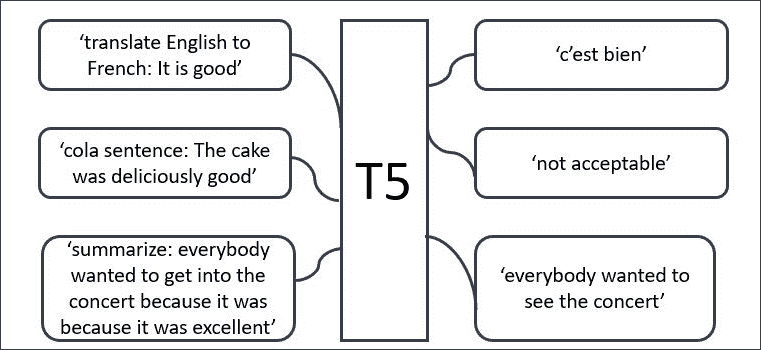
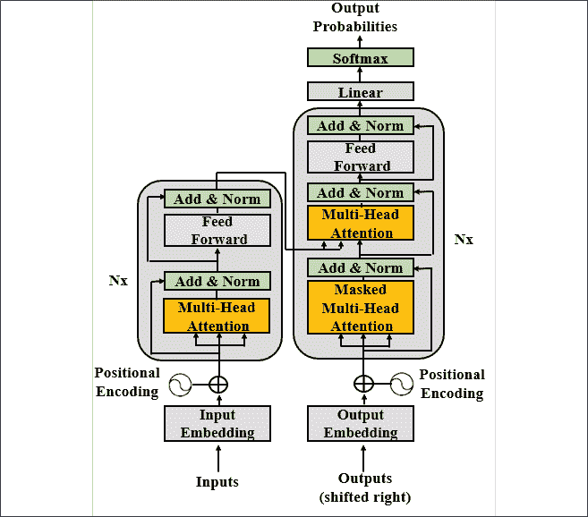
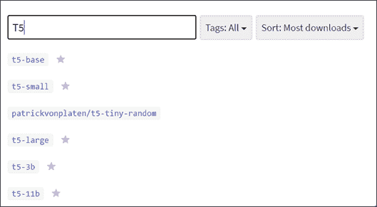
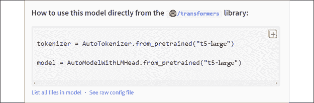

# seven

# 将变压器应用于法律和金融文档以进行人工智能文本摘要

在前六章中，我们探讨了转换器的架构以及如何训练转换器。我们还实现了预训练模型，可以通过微调执行下游任务。最后，在*第 6 章*、*用 OpenAI GPT-2 和 GPT-3 模型生成文本*中，我们发现 OpenAI 已经开始实验不需要微调的零镜头模型。

这种进化的基本概念依赖于转换器如何努力教会机器如何理解语言并以类似人类的方式表达自己。我们已经从训练模型发展到向机器教授语言。

Raffel 等人(2019)基于一个简单的断言设计了一个 transformer 元模型:每个 NLP 问题都可以表示为一个文本到文本的函数。每种类型的 NLP 任务都提供某种文本上下文，生成某种形式的文本响应。

任何 NLP 任务的文本到文本的表示提供了一个独特的框架来分析 transformers 的方法和实践。这个想法是让转换者通过文本到文本的方法在训练和微调阶段通过迁移学习来学习语言。

Raffel 等人(2019)将这种方法命名为**T**ext-**T**o-**T**ext**T**transfer**T**transformer。5t 变成了 **T5** ，新的模型诞生了。

本章一开始，我们将介绍 T5 变压器模型的概念和架构。然后，我们将应用 T5 来总结包含拥抱脸部模型的文档。我们将探索应用于变压器的迁移学习方法的局限性。

本章涵盖以下主题:

*   文本到文本转换器模型
*   T5 型号的架构
*   T5 方法
*   变压器模型从训练到学习的演变
*   拥抱面部变形模型
*   实现 T5 模型
*   概述法律文本
*   总结一篇金融文章
*   变压器模型的局限性

我们的第一步将是探索由 Raffel 等人(2019)定义的文本到文本的方法。

# 设计一个通用的文本到文本模型

谷歌的 NLP 技术革命始于 2017 年最初的转换器 *Vaswani* 等人(2017)。*“注意力是你所需要的一切”*颠覆了 30 多年来人工智能对 RNNs 和 CNN 应用于 NLP 任务的信念。在一场姗姗来迟的进化中，它把我们从 NLP/NLU 的石器时代带到了 21 世纪。

*第六章*，*用 OpenAI 的 GPT-2 和 GPT-3 模型*进行文本生成，总结了在谷歌*瓦斯瓦尼*等人(2017)的原始转换器和 OpenAI 的*布朗*等人(2020)的 GPT-3 转换器之间沸腾并爆发的第二次革命。最初的 Transformer 专注于性能，以证明注意力是我们完成 NLP/NLU 任务所需要的。

OpenAI 的第二次革命，通过 GPT-3，专注于将变压器模型从微调预训练模型转变为不需要微调的少量训练模型。第二次革命表明，机器可以学习语言，并像我们人类一样将其应用于下游任务。

了解这两次变革对于理解 T5 模型代表着什么至关重要。第一次革命是注意力技术。第二次革命是教机器理解一种语言(NLU)，然后让它像我们一样解决 NLP 问题。

2019 年，谷歌正在沿着与 OpenAI 相同的思路思考如何超越技术考虑感知转换器，并将它们带到自然语言理解的抽象层面。

这些革命变得具有破坏性。是时候安定下来，忘记源代码和机器资源，在更高的层次上分析变压器了。

Raffel 等人(2019 年)致力于设计一个概念性的文本到文本模型，然后实现它。

让我们来看看第二次转换器革命的表现:抽象模型。

## 文本到文本转换器模型的兴起

Raffel 等人(2019)作为先驱者开始了一场之旅，他们的目标只有一个:“用统一的文本到文本转换器探索迁移学习的极限。”从一开始，研究这种方法的 Google 团队就强调，它不会修改原始 Transformer 的基础架构。

在这一点上， *Raffel* 等人(2019)希望专注于概念，而不是技术。他们对生产最新的变压器模型没有兴趣，因为我们经常看到所谓的银弹变压器模型与 *n* 参数和层。这一次，T5 团队想要发现转换器在理解语言方面有多好。

人类学习一种语言，然后通过迁移学习将这种知识应用到广泛的 NLP 任务中。T5 模型的核心概念是找到一个抽象的模型，可以像我们一样做事。

当我们交流时，我们总是从一个序列(A)开始，然后是另一个序列(B)。b 依次成为导致另一个序列的开始序列，如图*图 7.1* 所示:


图 7.1:通信的序列到序列表示

我们也通过有组织声音的音乐进行交流。我们通过有组织的肢体动作跳舞来交流。我们通过用协调的形状和颜色绘画来表达自己。

我们通过语言用一个或一组词进行交流，我们称之为“文本”当我们试图理解一篇文章时，我们会注意句子中所有的单词在*所有的*方向上。我们试图衡量每一项的重要性。当我们不理解一个句子时，我们聚焦在一个单词上，*查询句子中剩余的*关键词*，以确定它们的*值*以及我们必须对它们给予的*关注*。这定义了转换器的注意力层次。*

花几秒钟的时间，让这个想法深入人心。这看起来很简单，对吗？然而，它花了 35 年以上的时间来推翻旧的信念周围的 RNNs，CNN，以及思维过程伴随着他们！

同时关注一个序列中所有符号的注意力层的技术革命导致了 T5 概念革命。

T5 模型可以概括为一个**T**ext-**T**o-**T**ext**T**transfer**T**transformer。每一个 NLP 任务都被表示为一个文本到文本的问题来解决。

## 前缀而不是特定于任务的格式

Raffel 等人(2019 年)仍然有一个问题需要解决:统一特定于任务的格式。想法是找到一种方法，让提交给转换器的每个任务都有一种输入格式。这样，模型参数将通过一种文本到文本的格式为所有类型的任务进行训练。

Google T5 团队提出了一个简单的解决方案:给输入序列添加前缀。如果不是某个早已被遗忘的天才发明了前缀,我们将需要许多语言中成千上万的额外词汇。例如，如果我们不使用“pre”作为前缀，我们将需要找到描述预付款、史前、前寒武纪的词，以及数以千计的其他词。

*拉弗尔*等人(2019)提出给输入序列添加一个*前缀*。在一些变压器模型中，T5 前缀不仅仅是用于分类的标签或指示符，如`[CLS]`。T5 前缀包含了转换器需要解决的任务的本质。前缀表达的意思如下例所示:

*   “将英语翻译成德语:+ [sequence]”进行翻译，就像我们在*第五章*、*中用变压器进行机器翻译*一样。
*   “CoLA sentence:+[sequence]”for*语言可接受性(CoLA* )的语料库，正如我们在*第二章*、*微调 BERT 模型*中使用的，当时我们微调了一个 BERT transformer 模型。
*   “stsb 句子 1:+[sequence]”用于语义文本相似性基准。自然语言推理和蕴涵是类似的问题，在第四章、*中有描述。*
*   “summary+[sequence]”对于文本摘要问题，我们将在本章的*文本摘要与 T5* 部分中解决。

我们现在已经获得了一个适用于各种 NLP 任务的统一格式，如*图 7.2* 所示:


图 7.2:统一转换器模型的输入格式

统一的输入格式导致转换器模型产生一个结果序列，无论它必须在**文本到文本转换转换器** ( **T5** )中解决哪个问题。很多 NLP 任务的输入输出已经统一，如图*图 7.3* 所示。



图 7.3:T5 文本到文本框架

统一过程使得对广泛的任务使用相同的模型、超参数和优化器成为可能。

我们已经完成了标准的文本到文本的输入输出格式。现在让我们看看 T5 变压器模型的架构。

## T5 型号

*Raffel* 等人(2019)专注于设计标准输入格式以获得文本输出。Google T5 团队不想尝试源自原始 Transformer 的新架构，例如类似 BERT 的仅编码层或类似 GPT 的仅解码层。团队的精力集中在以标准格式定义 NLP 任务上。

他们选择使用我们在*第 1 章*、*变压器模型架构入门*中定义的原始变压器模型，我们可以在*图 7.4* 中看到:



图 7.4:T5 使用的原始变压器模型

Raffel 等人(2019)保留了大部分原始变压器架构和术语的。然而，他们强调了一些关键方面。此外，他们做了一些轻微的词汇和功能变化。以下列表包含 T5 型号的一些主要方面:

*   编码器和解码器保留在模型中。编码器和解码器层成为“块”，而子层成为包含自关注层和前馈网络的“子组件”。在类似 Lego 的语言中使用单词“块”和“子组件”允许你组装“块”、块和组件来构建你的模型。变压器组件是标准的构建模块，可以用多种方式组装。一旦你理解了我们在*第 1 章*、*变压器*模型架构入门中所经历的基本构建模块，你就能理解任何变压器模型。
*   自我注意是“顺序独立的”，这意味着它在集合上执行操作。
*   最初的变压器将正弦和余弦信号应用于变压器。或者它使用学习的位置嵌入。T5 使用相对位置嵌入，而不是向输入添加任意位置。在 T5，位置编码依赖于自我注意延伸到两两关系之间的比较。更多信息，请参见本章*参考*部分的*肖*等人(2018)。
*   位置嵌入在模型的所有层中被共享和重新评估。

我们已经通过文本到文本的方法定义了 T5 变压器模型的输入的标准化。

现在让我们用 T5 来总结文档。

# T5 文本摘要

NLP 摘要任务提取文本的简洁部分。在这一节中，我们将首先介绍本章中用到的拥抱脸资源。然后我们将初始化一个`T5-large`变压器模型。最后，我们将看到如何使用 T5 来总结任何类型的文档，包括法律和公司文档。

让我们从使用拥抱脸的框架开始。

## 拥抱脸

拥抱脸设计了一个框架，在一个更高的层次上实现转换器。我们在*第二章*、*微调 BERT 模型*和*第三章*、*从零开始训练 RoBERTa 模型*中使用拥抱脸来微调 BERT 模型。

然而，我们需要探索其他方法，例如第五章的*中的`Trax`，使用转换器*的*机器翻译，以及第六章*中的*open ai 的 GitHub 库，使用 OpenAI GPT-2 和 GPT-3 模型*的*文本生成。*

在这一章中，我们将再次使用拥抱脸的框架，并解释更多关于网上可用的资源。

拥抱脸在其框架内提供了三个主要资源:模型、数据集和指标。

### 拥抱脸变压器资源

在这一小节中，我们将选择我们将在本章中实现的 T5 模型。

在拥抱脸模特页面上可以找到各种各样的模特，我们可以在*图 7.5* 中看到:


图 7.5:拥抱脸模型

在这个页面上，[https://huggingface.co/models](https://huggingface.co/models)，我们可以搜索一个模型。在我们的案例中，我们正在寻找 **t5-large** ，一个我们可以在谷歌实验室顺利运行的`t5-large`模型。

我们首先键入 **T5** 来搜索 T5 型号，然后获得我们可以从中选择的 T5 型号列表:



图 7.6:搜索 T5 型号

我们可以看到原来的五个 T5 变压器可用:

*   `Base`，这是基线模型。它被设计成类似于伯特[基地]，有 12 层和大约 2.2 亿个参数。
*   `Small`，它是一个更小的模型，有 6 层，6000 万个参数。
*   `Large`，设计类似伯特[大型]，12 层，7.7 亿个参数。
*   `3B`和`11B`，使用 24 层编码器和解码器，参数约 28 亿和 110 亿。

关于 BERT [BASE] 和 BERT [LARGE] 的更多描述，你可以现在或稍后花几分钟在*第 2 章*、*微调 BERT 模型*中回顾这些模型。

在我们的例子中，我们选择**t5-大**:



图 7.7:如何使用拥抱脸模型

*图 7.7* 展示了如何在我们将要编写的代码中使用模型。我们还可以查看模型中的文件列表和原始配置文件。我们将在本章*初始化 T5-大型变压器模型*一节中初始化模型时查看配置文件。

拥抱脸还提供数据集和指标:

*   数据集可以用来训练和测试你的模型:[https://huggingface.co/datasets](https://huggingface.co/datasets)
*   度量资源可用于衡量您的模型的性能:[https://huggingface.co/metrics](https://huggingface.co/metrics)

在本章中，我们不会实现这些数据集或指标。我们将重点讨论如何实现任何类型的文本摘要。

让我们从初始化 T5 变压器模型开始。

## 初始化 T5 大型变压器模型

在这一小节中，我们将初始化一个T5-大型模型。打开下面的笔记本，`Summarizing_Text_with_T5.ipynb`，你会在 GitHub 的本章目录中找到:

`Summarizing_Text_with_T5.ipynb`

先从 T5 开始吧！

### T5 入门

在这一小节中，我们将安装拥抱脸的框架，然后初始化一个 T5 模型。

我们将首先安装拥抱脸的转换器:

```py
!pip install transformers==4.0.0 
```

拥抱脸转换器 4.0.0 版本由于转换器的快速进化而被钉住，导致不断改变库和模块以适应市场。

我们还固定了`sentencepiece`的`0.1.94`版本，以尽可能保持使用拥抱脸的笔记本稳定:

```py
!pip install sentencepiece==0.1.94 
```

拥抱脸有一个可以克隆的 GitHub 库。然而，拥抱脸的框架提供了一系列我们可以实现的高级转换器功能。

在初始化模型时，我们可以选择显示或不显示模型的架构:

```py
display_architecture=False 
```

如果我们将`display_architecture`设置为`True`，将显示编码器层、解码器层和前馈子层的结构。

程序现在导入`torch`和`json`:

```py
import torch

import json 
```

研究变压器意味着对研究实验室与我们共享的许多变压器架构持开放态度。我建议尽可能使用 PyTorch 和 TensorFlow 来适应这两种环境。重要的是 transformer 模型的抽象级别(特定任务模型或零射击模型)及其整体性能。

让我们导入标记器、生成和配置类:

```py
from transformers import T5Tokenizer, T5ForConditionalGeneration, T5Config 
```

我们将在这里使用`T5-large`型号，但是您可以在我们在本章的拥抱面部部分中查看的拥抱面部列表中选择其他 T5 型号。

我们现在将导入`T5-large`条件生成模型来生成文本和 T5-large 标记器:

```py
model = T5ForConditionalGeneration.from_pretrained('t5-large')

tokenizer = T5Tokenizer.from_pretrained('t5-large') 
```

初始化一个预训练的标记器只需要一行代码。然而，没有什么能证明分词词典包含了我们需要的所有词汇。我们将在第八章*、*匹配记号化器和数据集*中研究记号化器和数据集之间的关系。*

程序现在用`'cpu'`初始化`torch.devic` e。这台笔记本一个 CPU 就够了。`torch.device`对象是将要分配火炬张量的设备；

```py
device = torch.device('cpu') 
```

我们准备探索 T5 模型的架构。

### 探索 T5 模型的架构

在这一小节中，我们将探索`T5-large`模型的架构和配置。

如果`display_architecture==true`，我们可以看到模型的配置:

```py
if (display_architecture==True:

  print(model.config) 
```

例如，我们可以看到模型的基本参数:

```py
…/…

"num_heads": 16,

"num_layers": 24,

…/… 
```

模型为 16 头 24 层 T5 变压器。

我们还可以看到 T5 的文本到文本实现，它为输入的句子添加了一个前缀*来触发任务的执行。*前缀*使得在不修改模型参数的情况下以文本到文本的格式表示大量任务成为可能。在我们的例子中，前缀是`summarization`:*

```py
"task_specific_params": {

    "summarization": {

      "early_stopping": true,

      "length_penalty": 2.0,

      "max_length": 200,

      "min_length": 30,

      "no_repeat_ngram_size": 3,

      "num_beams": 4,

      "prefix": "summarize: "

    }, 
```

我们可以看到 T5:

*   实现*波束搜索*，这将扩展四个最重要的文本完成预测。
*   当每批完成`num_beam`个句子时，应用提前停止。
*   确保不重复等于`no_repeat_ngram_size`的 ngrams。
*   用`min_length`和`max_length`控制样品的长度。
*   应用长度惩罚。

另一个有趣的参数是词汇量:

```py
"vocab_size": 32128 
```

词汇量本身就是一个话题。词汇太多会导致表示稀疏。词汇量太少会扭曲自然语言处理任务。我们将在第 8 章、*匹配记号化器和数据集*中进一步探讨这个问题。

我们还可以通过简单地打印`model`来查看 transformer 栈的细节:

```py
if(display_architecture==True):

  print(model) 
```

例如，我们可以窥视编码器堆栈(编号从`0`到`23`)的一个块(`layer`):

```py
(12): T5Block(

        (layer): ModuleList(

          (0): T5LayerSelfAttention(

            (SelfAttention): T5Attention(

              (q): Linear(in_features=1024, out_features=1024, bias=False)

              (k): Linear(in_features=1024, out_features=1024, bias=False)

              (v): Linear(in_features=1024, out_features=1024, bias=False)

              (o): Linear(in_features=1024, out_features=1024, bias=False)

            )

            (layer_norm): T5LayerNorm()

            (dropout): Dropout(p=0.1, inplace=False)

          )

          (1): T5LayerFF(

            (DenseReluDense): T5DenseReluDense(

              (wi): Linear(in_features=1024, out_features=4096, bias=False)

              (wo): Linear(in_features=4096, out_features=1024, bias=False)

              (dropout): Dropout(p=0.1, inplace=False)

            )

            (layer_norm): T5LayerNorm()

            (dropout): Dropout(p=0.1, inplace=False)

          )

        )

      ) 
```

我们可以看到，该模型对注意力子层的 1，024 个特征运行操作，对前馈网络子层的内部计算运行 4，096 个操作，这将产生 1，024 个特征的输出。变压器的对称结构通过所有层得以保持。

您可以花几分钟时间浏览编码器堆栈、解码器堆栈、注意力子层和前馈子层。

您也可以通过仅运行您希望的单元来选择模型的特定方面:

```py
if display_architecture==True:

  print(model.encoder)

if display_architecture==True:

  print(model.decoder)

if display_architecture==True:

  print(model.forward) 
```

我们已经初始化了 T5 变压器。现在让我们总结文档。

## 用 T5-large 汇总文档

在本节中，我们将创建一个汇总函数，您可以使用任何想要汇总的文本来调用它。我们将总结法律和金融方面的例子。最后，我们将定义该方法的限制。

我们将首先创建一个总结函数。

### 创建汇总功能

首先，让我们创建一个名为`summarize`的汇总函数。这样，我们将只把我们想要总结的文本发送给我们的函数。该函数有两个参数。第一个参数是`preprocess_text`，要汇总的文本。第二个参数是`ml`，总结文本的最大长度。这两个参数都是每次调用函数时发送给函数的变量:

```py
def summarize(text,ml): 
```

拥抱脸等等，提供了现成的汇总功能。但是，我建议学习如何构建自己的函数，以便在必要时定制这个关键任务。

然后，上下文文本或基本事实被去除了`\n`字符:

```py
preprocess_text = text.strip().replace("\n","") 
```

然后，我们将创新的`T5`任务*前缀* `"summarize"`应用于输入文本:

```py
t5_prepared_Text = "summarize: "+preprocess_text 
```

T5 模型有一个统一的结构，无论任务是什么都通过*前缀+输入序列*的方法。这似乎很简单，但它使 NLP transformer 模型更接近通用训练和零射击下游任务。

我们可以显示处理过的(剥离的)和准备好的文本(任务前缀):

```py
print ("Preprocessed and prepared text: \n", t5_prepared_text) 
```

简单吧？从 RNNs 和 CNN 到转换器花了 35 年多的时间。然后，世界上一些最聪明的研究团队从为特定任务设计的变压器发展到几乎不需要微调的多任务模型。最后，Google 研究团队为 transformer 的输入文本创建了一个标准格式，其中包含一个前缀，指示要解决的 NLP 问题。这是一个壮举！

显示的输出包含经过预处理和准备的文本:

```py
Preprocessed and prepared text: 

**summarize**: The United States Declaration of Independence 
```

我们可以看到表示要解决的任务的`summarize`前缀。

文本现在被编码为令牌 id，并作为 torch 张量返回:

```py
tokenized_text = tokenizer.encode(t5_prepared_Text, return_tensors="pt").to(device) 
```

编码后的文本准备好发送给模型，用我们在*T5*部分描述的参数生成一个摘要:

```py
# Summarize

  summary_ids = model.generate(tokenized_text,

                                      num_beams=4,

                                      no_repeat_ngram_size=2,

                                      min_length=30,

                                      max_length=ml,

                                      early_stopping=True) 
```

梁的数量与我们导入的模型中的数量相同。然而，`no_repeat_ngram_size`已经被降为`2`而不是`3`。

生成的输出现在用`tokenizer`解码:

```py
output = tokenizer.decode(summary_ids[0], skip_special_tokens=True)

return output 
```

我们导入、初始化并定义了总结函数。现在让我们用一个通用主题来试验 T5 模型。

### 一般主题示例

在这一小节中，我们将通过 T5 模型运行由*项目 Gutenberg* 编写的文本。我们将使用这个示例来对我们的汇总函数进行测试。您可以复制和粘贴任何其他文本，或者通过添加一些代码来加载文本。您还可以加载您选择的数据集，并在循环中调用汇总。

本章程序的目标是运行几个例子来看看 T5 是如何工作的。输入文本是包含美国*独立宣言*的*项目古腾堡*电子书的开头:

```py
text ="""

The United States Declaration of Independence was the first Etext

released by Project Gutenberg, early in 1971\.  The title was stored

in an emailed instruction set which required a tape or diskpack be

hand mounted for retrieval.  The diskpack was the size of a large

cake in a cake carrier, cost $1500, and contained 5 megabytes, of

which this file took 1-2%.  Two tape backups were kept plus one on

paper tape.  The 10,000 files we hope to have online by the end of

2001 should take about 1-2% of a comparably priced drive in 2001.

""" 
```

然后我们调用我们的`summarize`函数，并发送我们想要摘要的文本和摘要的最大长度:

```py
print("Number of characters:",len(text))

summary=summarize(text,50)

print ("\n\nSummarized text: \n",summary) 
```

输出显示我们发送了`534`个字符、经过预处理的原始文本(基本事实)和摘要(预测):

```py
Number of characters: 534

Preprocessed and prepared text: 

 summarize: The United States Declaration of Independence...

Summarized text: 

 the united states declaration of independence was the first etext published by project gutenberg, early in 1971\. the 10,000 files we hope to have online by the end of2001 should take about 1-2% of a comparably priced drive in 2001\. the united states declaration of independence was the first Etext released by project gutenberg, early in 1971 
```

现在让我们用 T5 来做一个更难的总结。

### 权利法案样本

下面的例子摘自*权利法案*，更难理解，因为它表达了一个人的确切权利:

```py
#Bill of Rights,V

text ="""

No person shall be held to answer for a capital, or otherwise infamous crime,

unless on a presentment or indictment of a Grand Jury,exceptin cases arising

 in the land or naval forces, or in the Militia, when in actual service

in time of War or public danger; nor shall any person be subject for

the same offense to be twice put in jeopardy of life or limb;

nor shall be compelled in any criminal case to be a witness against himself,

nor be deprived of life, liberty, or property, without due process of law;

nor shall private property be taken for public use without just compensation.

"""

print("Number of characters:",len(text))

summary=summarize(text,50)

print ("\n\nSummarized text: \n",summary) 
```

我们可以看到 T5 并没有真正总结输入文本，只是简单地将其缩短:

```py
Number of characters: 591

Preprocessed and prepared text: 

 summarize: No person shall be held to answer..

Summarized text: 

 no person shall be held to answer for a capital, or otherwise infamous crime. except in cases arisingin the land or naval forces or in the militia, when in actual service in time of war or public danger 
```

这个例子很重要，因为它显示了任何 transformer 模型或任何其他 NLP 模型在面对这样的文本时所面临的限制。我们不能只展示总是有效的样本，让用户相信转换器已经解决了我们面临的所有 NLP 挑战，不管它们有多创新。

也许我们应该提供一个更长的文本来总结，使用其他参数，使用更大的模型，或者改变 T5 模型的结构。然而，无论你多么努力地试图用一个 NLP 模型来总结一个困难的文本，你总是会发现模型不能总结的文档。

当一个模型在一项任务中失败了，我们需要谦虚并承认它。强力胶人类底线是一个很难打破的。我们需要耐心，更加努力地工作，并改进变压器模型，直到它们能够比今天表现得更好。还有很大的进步空间。

*Raffel* 等人(2018)选择了一个合适的标题来描述他们的 T5 方法:*“用统一的文本到文本转换器探索迁移学习的极限。”*

花必要的时间用你在法律文件中找到的自己的例子进行实验。作为现代 NLP 的先驱，探索迁移学习的极限！有时你会发现令人兴奋的结果，有时你会发现需要改进的地方。

现在，让我们尝试一个公司法样本。

### 公司法样本

公司法包含许多法律上的微妙之处，这使得总结任务相当棘手。

这个样本的输入是美国蒙大拿州公司法的摘录:

```py
#Montana Corporate Law

#https://corporations.uslegal.com/state-corporation-law/montana-corporation-law/#:~:text=Montana%20Corporation%20Law,carrying%20out%20its%20business%20activities.

Text ="""The law regarding corporations prescribes that a corporation can be incorporated in the state of Montana to serve any lawful purpose.  In the state of Montana, a corporation has all the powers of a natural person for carrying out its business activities.  The corporation can sue and be sued in its corporate name.  It has perpetual succession.  The corporation can buy, sell or otherwise acquire an interest in a real or personal property.  It can conduct business, carry on operations, and have offices and exercise the powers in a state, territory or district in possession of the U.S., or in a foreign country.  It can appoint officers and agents of the corporation for various duties and fix their compensation.

The name of a corporation must contain the word "corporation" or its abbreviation "corp."  The name of a corporation should not be deceptively similar to the name of another corporation incorporated in the same state.  It should not be deceptively identical to the fictitious name adopted by a foreign corporation having business transactions in the state.

The corporation is formed by one or more natural persons by executing and filing articles of incorporation to the secretary of state of filing.  The qualifications for directors are fixed either by articles of incorporation or bylaws.  The names and addresses of the initial directors and purpose of incorporation should be set forth in the articles of incorporation.  The articles of incorporation should contain the corporate name, the number of shares authorized to issue, a brief statement of the character of business carried out by the corporation, the names and addresses of the directors until successors are elected, and name and addresses of incorporators.  The shareholders have the power to change the size of board of directors.

"""

print("Number of characters:",len(text))

summary=summarize(text,50)

print ("\n\nSummarized text:\n",summary) 
```

结果令人满意:

```py
Number of characters: 1816

Preprocessed and prepared text: 

 summarize: The law regarding the corporation prescribes that a corporation...

Summarized text: 

 a corporations can be incorporated in the state of Montana to serve any lawful purpose. a corporation can sue and be sued in its corporate name, and it has perpetual succession. it can conduct business, carry on operations and have offices 
```

这一次 T5 找了一些课文的精华方面来总结。花些时间尝试整合你自己的样本，看看会发生什么。摆弄参数，看看是否会影响结果。

我们实现了 T5 来总结文本。是时候结束并继续我们的下一次冒险了！

# 摘要

在本章中，我们看到了 T5 变压器模型如何标准化原始变压器的编码器和解码器堆栈的输入。原始变换器架构对于编码器和解码器堆栈的每个块(或层)具有相同的结构。然而，最初的 Transformer 没有用于 NLP 任务的标准化输入格式。

Raffel 等人(2018 年)通过定义文本到文本模型，为广泛的自然语言处理任务设计了标准输入。他们给输入序列添加了一个前缀，表示要解决的 NLP 问题的类型。这导致了标准的文本到文本的格式。**文字转文字转换器** ( **T5** )诞生了。我们看到，这种看似简单的进化使得在广泛的 NLP 任务中使用相同的模型和超参数成为可能。T5 的发明将变压器模型的标准化进程向前推进了一步。

然后，我们实现了一个可以总结任何文本的 T5 模型。我们在不属于现成训练数据集的文本上测试了该模型。我们在宪法和公司样本上测试了这个模型。结果很有趣，但我们也发现了变压器模型的一些限制，正如 *Raffel* 等人(2018)所预测的那样。

总的来说，改进变压器和 NLP 需要在 NLP 任务处理的每个方面进行更多的研究。

在下一章*匹配记号化器和数据集*中，我们将探索记号化器的限制，并定义改进 NLP 任务的方法。

# 问题

1.  T5 型号只有类似 BERT 型号的编码器堆栈。(对/错)
2.  T5 型号具有编码器和解码器堆栈。(对/错)
3.  T5 型号使用相对位置编码，而不是绝对位置编码。(对/错)
4.  文本到文本模型仅设计用于摘要。(对/错)
5.  文本到文本模型将前缀应用于确定 NLP 任务的输入序列。(对/错)
6.  T5 模型要求每个任务都有特定的超参数。(对/错)
7.  文本到文本模型的优点之一是它们对所有 NLP 任务使用相同的超参数。(对/错)
8.  T5 变压器不包含前馈网络。(对/错)
9.  NLP 文本摘要适用于任何文本。(对/错)
10.  拥抱脸是一个让转换器更容易实现的框架。(对/错)

# 参考

*   *柯林·拉弗尔*、*诺姆·沙泽尔*、 *Adam Roberts* 、*凯瑟琳·李*、*莎兰·纳朗*、*迈克尔·马蒂娜*、*严琦·周*、*李玮*、*彼得·j·刘*、2019、*用统一的文本到文本转换器探索迁移学习的极限*
*   *阿希什·瓦斯瓦尼*、*诺姆·沙泽尔*、*尼基·帕尔马*、*雅各布·乌兹科雷特*、*利翁·琼斯*、*艾丹·戈麦斯*、*卢卡斯·凯泽*、*伊利亚·波洛舒欣*、2017、*关注就是你需要的全部* : 【T18
*   *彼得·肖*、*雅各布·乌兹科雷特*、*阿希什·瓦斯瓦尼*2018、*自我关注与相对位置表征*:[https://arxiv.org/abs/1803.02155](https://arxiv.org/abs/1803.02155)
*   抱脸框架及资源:[https://huggingface.co/](https://huggingface.co/)
*   美国法律，*蒙大拿州公司法*:[https://corporations . us Legal . com/state-corporation-law/Montana-corporation-law/#:~:text = Montana % 20 corporation % 20 law，开展% 20 out % 20 its % 20 business % 20 活动](https://corporations.uslegal.com/state-corporation-law/montana-corporation-law/#:~:text=Montana%20Corporation%20Law,carrying%20out%20its%20business%20activities)
*   *美国独立宣言*由*托马斯·杰弗逊*:[https://www.gutenberg.org/ebooks/1](https://www.gutenberg.org/ebooks/1)
*   *美国权利法案*由美国:【https://www.gutenberg.org/ebooks/2】T2*