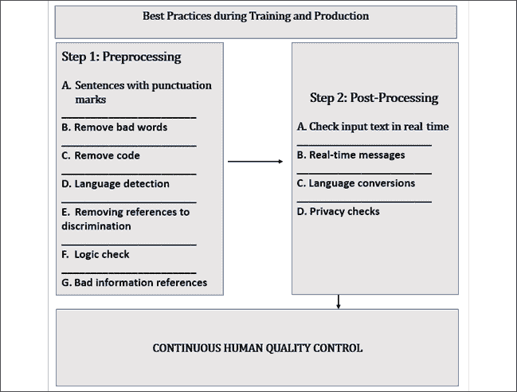
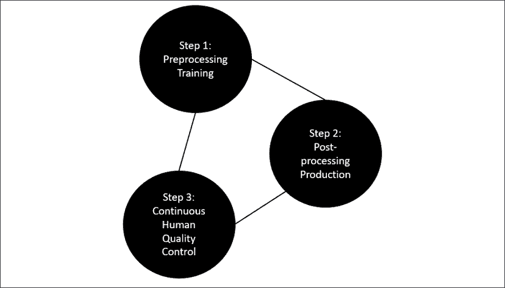
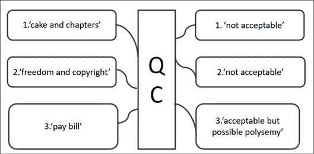

# 八、将分词器拟合到数据集

当研究 transformer 模型时，我们倾向于关注模型的架构和为训练它们而提供的数据集。我们研究了原始的转换器，微调了一个类似 BERT 的模型，训练了一个 RoBERTa 模型，训练了一个 GPT-2 模型，并实现了一个 T5 模型。我们还介绍了主要的基准测试任务和数据集。

我们训练了一个 RoBERTa 记号赋予器，并使用记号赋予器来编码数据。然而，我们没有探究分词器的限制来评估它们如何适合我们构建的模型。人工智能是数据驱动的。与本书引用的所有作者一样，Raffel 等人(2019 年)花时间为 transformer 模型准备数据集。

在这一章中，我们将讨论一些阻碍下游转换器任务质量的记号赋予器的限制。不要轻信预先训练的记号赋予者。您可能有一个您正在使用的单词的特定词典(例如，高级医学语言),其中包含未被通用预训练标记器处理的单词。

我们将首先介绍一些与记号赋予者无关的最佳实践来衡量记号赋予者的质量。我们将从分词的角度描述数据集和分词器的基本准则。

然后，我们将通过 word2vector tokenizer 来描述我们使用任何分词方法所面临的问题，从而了解分词器的局限性。这些限制将通过 Python 程序来说明。

我们将继续探索字节级 BPE 方法的局限性。我们将构建一个 Python 程序，显示由 GPT-2 记号赋予器产生的结果，并检查在数据编码过程中出现的问题。

最后，我们将回到我们在*第七章*、*将转换器应用于法律和金融文档进行人工智能文本摘要*中尝试用 T5 模型总结*权利法案*时所面临的总结问题。我们将应用本章中发现的想法来改进 T5 的总结。

本章涵盖以下主题:

*   控制记号赋予器输出的基本准则
*   原始数据策略和预处理数据策略
*   word 2 向量分词问题和限制
*   创建一个 Python 程序来评估 word2vector tokenizers
*   评估 GPT-2 令牌化器
*   构建 Python 程序来评估字节级 BPE 算法的输出
*   使用特定词汇自定义 NLP 任务
*   测试标准 T5 条件输入样本
*   改善数据集

我们的第一步将是探索由 Raffel 等人(2019)定义的文本到文本的方法。

# 匹配数据集和分词器

下载基准数据集来训练转换器有很多好处。数据已经准备好了，每个研究实验室都使用相同的参考资料。此外，转换器模型的性能可以与具有相同数据的另一个模型进行比较。

然而，还需要做更多的工作来提高转换器的性能。此外，在生产中实现转换器模型需要仔细的规划和定义最佳实践。

在本节中，我们将定义一些最佳实践来避免关键的绊脚石。

然后，我们将通过 Python 中的几个例子，使用余弦相似性来衡量分词和编码数据集的限制。

让我们从最佳实践开始。

## 最佳实践

*Raffel* 等人(2019)定义了一个标准文本-2-文本 T5 转换器模型。他们还走得更远。他们开始打破未经预处理就使用原始数据的神话。预处理数据减少了训练时间。例如，普通爬行包含通过网页提取获得的无标签文本。非文本和标记已从数据集中移除。

然而，谷歌 T5 团队发现，通过普通爬行获得的许多文本根本没有达到自然语言或英语的水平。他们决定在使用数据集之前需要对其进行清理。

我们将进一步采纳 Raffel 等人(2019)提出的建议，并将公司质量控制最佳实践应用于预处理和后处理阶段。所描述的例子，以及许多其他要应用的规则，给出了获得可接受的真实项目数据集所需的大量工作的想法。

*图 8.1* 列出了一些适用于数据集的关键质量控制流程:



图 8.1:转换器数据集的最佳实践

质量控制如图*图 8.1* 所示，分为转换器培训时的预处理阶段(*步骤 1* )和转换器生产时的后处理阶段(*步骤 2* )。

让我们看一下预处理阶段的一些主要方面。

### 步骤 1:预处理

Raffel 等人(2019)建议在数据集上训练模型之前对数据集进行预处理，我添加了一些额外的想法。

转换器成了语言学习者，我们成了他们的老师。但是要教一个学机器的学生一门语言，我们必须解释什么是真正的英语。

在使用数据集之前，我们需要对它们应用一些标准试探法:

*   **Sentences with punctuation marks**

    建议选择以标点符号结尾的句子，如句号或问号。

*   **Remove bad words**

    脏话要去掉。例如，可以在以下站点找到这些列表:[https://github . com/LDNOOBW/List-of-Dirty-Naughty-obscent-and-Otherwise-Bad-Words](https://github.com/LDNOOBW/List-of-Dirty-Naughty-Obscene-and-Otherwise-Bad-Words)

*   **Remove code**

    这是一个棘手的问题，因为有时代码就是我们要寻找的内容。但是，一般来说，最好从 NLP 任务的内容中删除代码。

*   **Language detection**

    有时网站包含带有默认“lorem ipsum”文本的页面。有必要确保数据集的所有内容都是我们希望的语言。一个很好的开始方式是使用`langdetect`，它可以检测 50 多种语言:[https://pypi.org/project/langdetect/](https://pypi.org/project/langdetect/)

*   **Removing references to discrimination**

    这是必须的。我的建议是用你能从网上或从你能得到的特定数据集中搜集到的一切建立一个知识库。禁止任何形式的歧视。你当然希望你的机器是合乎道德的！

*   **Logic check**

    这可能是一个好主意在数据集上运行一个经过训练的 transformer 模型，该模型执行**自然语言推理** ( **NLI** )来过滤没有意义的句子。

*   **Bad information references**

    删除指向无效链接、不道德网站或个人的文本。这是一项艰巨的工作，但非常值得。

该列表包含一些主要的最佳实践。还需要更多，例如过滤违反隐私法的行为，以及针对特定项目的其他操作。

例如，一旦一个转换器被训练学习正确的英语，我们需要帮助它在生产阶段检测输入文本中的问题。

### 第二步:后处理

一个训练有素的模特会表现得像一个学过语言的人。它将理解它能做什么，并从输入数据中学习。输入数据应经历与*步骤 1:预处理*相同的过程，并向训练数据集添加新信息。反过来，训练数据集可以成为企业项目中的知识库。用户将能够在数据集上运行 NLP 任务，并获得问题的可靠答案、特定文档的有用摘要等等。

我们应该将*步骤 1:预处理*中描述的最佳实践应用于实时输入数据。转换器可以根据用户输入或 NLP 任务(如汇总文档列表)运行。

转换器是有史以来最强大的 NLP 模型。因此，我们需要避免将他们执行的 NLP 任务武器化，以运行不可接受的任务。

让我们来看看一些最佳实践:

*   **Check input text in real time**

    不接受不良信息。实时解析输入并过滤不可接受的数据(参见*步骤 1* )。

*   **Real-time messages**

    存储被拒绝的数据及其被过滤的原因，以便用户可以查阅日志。如果要求转换器回答不合适的问题，则显示实时消息。

*   **Language conversions**

    有可能的话可以把生僻词汇转换成标准词汇。参见本章 *Word2Vec 分词*部分的*案例 4* 。这并不总是可能的。当它实现时，它可能代表着向前迈进了一步。

*   **Privacy checks**

    无论是将数据流式传输到转换器模型还是分析用户输入，都必须从数据集和任务中排除私有数据，除非转换器运行所在的用户或国家/地区授权。这是个棘手的话题。必要时咨询法律顾问。

我们刚刚经历了一些最佳实践。我们来看看为什么人的质量控制是强制性的。

### 持续的人员质量控制

转换器将逐步接管大多数复杂的自然语言处理任务。然而，人工干预仍然是强制性的。我们认为社交媒体巨头已经自动化了一切。然后我们发现有内容管理者决定什么对他们的平台是好的或坏的。

正确的方法是训练一个转换器，实现它，控制输出，并将重要的结果反馈给训练集。训练集将不断改进，转换器将继续学习。

*图 8.2* 显示了持续质量控制将如何帮助转换器的训练数据集增长并提高其在生产中的性能:



图 8.2:持续的人员质量控制

我们已经经历了*拉弗尔*等人(2019)描述的几个最佳实践，我也加入了我在企业人工智能项目管理方面的一些经验。

让我们看一个 Python 程序，用一些例子来说明记号赋予器遇到的一些限制。

## Word2Vec 分词

只要一切顺利，没人会考虑预先训练的记号赋予者。就像在现实生活中一样。我们可以开一辆车很多年而不用考虑发动机。然后，有一天我们的车抛锚了，我们试着找理由来解释这种情况。

预训练的记号赋予器也会发生同样的情况。有时候结果并不是我们预期的那样。有些词对就是不能组合在一起，正如我们在*图 8.3* 中看到的:



图 8.3:分词器计算错误的单词对

*图 8.3* 中显示的例子摘自*美国独立宣言*、*权利法案*和*英国大宪章*:

*   `"cake"`和`"chapters"`不匹配，尽管记号赋予器计算出它们具有高余弦相似值。
*   `"freedom"`例如指言论自由。`"Copyright"`指免费电子书的编辑写的笔记。
*   `"pay"`和`"bill"`在日常英语中合在一起。`"Polysemy"`是指一个词可以有几种意思。`"Bill"`指支付的金额，也指`"Bill of Rights"`。结果尚可，但可能纯粹是运气。

在继续之前，让我们花点时间澄清一些观点。QC 指的是质量控制。在任何战略性的公司项目中，质量控制都是强制性的。产出的质量将决定一个关键项目的成败。如果项目不是战略性的，错误有时是可以接受的。在战略项目中，即使几个错误也意味着风险管理审计的介入，以确定项目是应该继续还是放弃。

从质量控制和风险管理的角度来看，对不相关的数据集进行标记(太多无用的词或关键的词丢失)会混淆嵌入算法并产生“糟糕的结果”这就是为什么在本章中，我不严格地使用“分词”这个词，包括一些嵌入，因为一个对另一个有影响。

在一个战略人工智能项目中，“糟糕的结果”可能是一个具有严重后果的错误(特别是在医疗、飞机或火箭装配或其他关键领域)。

打开`Tokenizer.ipynb`，基于`positional_encoding.ipynb`，我们在*第一章*、*中创建的转换器*的模型架构入门。

首先安装并导入先决条件:

```py
#@title Pre-Requisistes

!pip install --upgrade gensim

import nltk

nltk.download('punkt')

import math

import numpy as np

from nltk.tokenize import sent_tokenize, word_tokenize 

import gensim 

from gensim.models import Word2Vec 

import numpy as np

from sklearn.metrics.pairwise import cosine_similarity

import matplotlib.pyplot as plt

import warnings 

warnings.filterwarnings(action = 'ignore') 
```

我们的数据集`text.txt`，包含*美国独立宣言*、*权利法案*、*大宪章*、伊曼纽尔·康德作品以及其他文本。

我们现在将标记`text.txt`并训练一个`word2vec`模型:

```py
#@title Word2Vec Tokenization

#'text.txt' file

sample = open("text.txt", "r")

s = sample.read()

# processing escape characters

f = s.replace("\n", " ")

data = []

# sentence parsing

for i in sent_tokenize(f):

  temp = [] 

  # tokenize the sentence into words

  for j in word_tokenize(i):

    temp.append(j.lower())

  data.append(temp)

# Creating Skip Gram model

model2 = gensim.models.Word2Vec(data, min_count = 1, size = 512,window = 5, sg = 1)

print(model2) 
```

`window=5`是一个有趣的参数。它限制输入句子中当前单词和预测的单词之间的*距离*。`sq=1`表示使用跳格训练算法。

输出显示词汇表的大小是`10816`，嵌入的维数是`512`，学习率被设置为`alpha=0.25`:

```py
Word2Vec(vocab=10816, size=512, alpha=0.025) 
```

我们有一个嵌入的单词表示模型，可以创建一个名为`similarity(word1,word2)`的余弦相似度函数。我们将把`word1`和`word2`发送给函数，该函数将返回`0`和`1`之间的余弦相似度值。

该功能将首先检测未知单词`[unk]`，并显示一条消息:

```py
#@title Cosine Similarity

def similarity(word1,word2):

        cosine=False #default value

        try:

                a=model2[word1]

                cosine=True

        except KeyError:     #The KeyError exception is raised

                print(word1, ":[unk] key not found in dictionary")#False implied

        try:

                b=model2[word2]#a=True implied

        except KeyError:       #The KeyError exception is raised

                cosine=False   #both a and b must be true

                print(word2, ":[unk] key not found in dictionary") 
```

余弦相似度只有在`cosine==True`时才会被计算，这意味着`word1`和`word2`都是已知的:

```py
if(cosine==True):

                b=model2[word2]

                # compute cosine similarity

                dot = np.dot(a, b)

                norma = np.linalg.norm(a)

                normb = np.linalg.norm(b)

                cos = dot / (norma * normb)

                aa = a.reshape(1,512)

                ba = b.reshape(1,512)

                #print("Word1",aa)

                #print("Word2",ba)

                cos_lib = cosine_similarity(aa, ba)

                #print(cos_lib,"word similarity")

        if(cosine==False):cos_lib=0;

        return cos_lib 
```

该函数将返回`cos_lib`，余弦相似度的计算值。

我们现在将讨论 6 个案例。我们将把`text.txt`命名为“数据集”

先从*案例 0* 说起。

### 案例 0:数据集中的单词和字典

单词`"freedom"`和`"liberty"`在数据集中，并且可以计算它们的余弦相似度:

```py
#@title Case 0: Words in text and dictionary

word1="freedom";word2="liberty"

print("Similarity",similarity(word1,word2),word1,word2) 
```

相似性仅限于`0.79`,因为从各种文本中插入了大量内容来探索函数的限制:

```py
Similarity [[0.79085565]] freedom liberty 
```

相似性算法不是迭代确定性计算。此部分的结果可能会随着数据集的内容、数据集在另一次运行后的大小或模块的版本而变化。

我们认为这种情况是可以接受的。

现在让我们看看当一个单词丢失时会发生什么。

### 案例 1:数据集中或字典中没有的单词

一个缺字在很多方面都意味着麻烦。在这种情况下，我们将`"corporations"`和`"rights"`发送给相似性函数:

```py
#@title Word(s) Case 1: Word not in text or dictionary

word1="corporations";word2="rights"

print("Similarity",similarity(word1,word2),word1,word2) 
```

字典中不包含单词`"corporations"`:

```py
corporations :[unk] key not found in dictionary

Similarity 0 corporations rights 
```

死胡同！这个单词是一个未知的`[unk]`标记。

缺少的单词将引发一系列事件和问题，如果这个单词很重要的话，将会扭曲 transformer 模型的输出。我们将把缺失的单词称为`unk`。

需要检查几种可能性，并回答一些问题:

*   `unk`在数据集中，但未被选入分词词典。
*   `unk`不在数据集中，单词`"corporations"`就是这种情况。这解释了为什么在这种情况下它不在字典中。
*   `unk`现在将出现在生产中，如果用户向转换器发送一个包含令牌且未被令牌化的输入。
*   `unk`对于数据集来说不是一个重要的词，但对于转换器的使用来说是一个重要的词。

如果转换器在某些情况下产生可怕的结果，问题的列表将继续增长。在训练阶段，我们可以认为`0.8`对于一个特定的下游任务来说是一个出色的性能。但是在现实生活中，谁愿意和一个 20%错误的系统一起工作:

*   医生吗？
*   律师？
*   核电厂维修队？

在社交媒体这样的模糊环境中，许多消息都缺乏适当的语言结构，这是令人满意的。

最糟糕的部分来了。假设一个 NLP 团队发现了这个问题，并试图用字节级 BPE 来解决它，就像我们在本书中一直做的那样。如有必要，花几分钟时间回到*第 3 章*、*从头开始预训练 RoBERTa 模型*、*步骤 3:训练标记器*。

如果团队只使用字节级 BPE 来解决问题，噩梦就开始了:

*   `unk`将被分解成单词块。例如，我们可能以`"corporations"`变成`"corp"` + `"o"` + `"ra"` + `"tion"` + `"s"`结束。这些标记中的一个或几个很有可能在数据集中被找到。
*   `unk`将成为一组子词，由数据集中存在的标记表示，但不传达原始标记的含义。
*   转换器会训练的很好，没有人会注意到`unk`被打成碎片，毫无意义的训练。
*   转换器甚至可能产生出色的结果，并将其性能从`0.8`提升到`0.9`。
*   每个人都会鼓掌，直到一个专业用户在危急情况下应用一个错误的结果。比如在英语中，`"corp"`可以表示`"corporation"`或者`"corporal"`。这可能会在`"corp"`和其他单词之间产生混淆和不良联想。

我们可以看到，社交媒体标准可能足以将转换器用于琐碎的话题。但是在现实生活中的公司项目中，要产生一个匹配数据集的预训练标记器需要付出艰苦的努力。在现实生活中，数据集每天都随着用户输入而增长。用户输入成为模型数据集的一部分，应该定期训练和更新。

例如，确保质量控制的一种方法是通过以下步骤:

*   用字节级 BPE 算法训练记号赋予器
*   用一个程序控制结果，比如我们将在本章的*控制分词数据*一节中创建的程序。
*   此外，用一个`word2vector`算法训练一个分词器，它将只用于质量控制，然后解析数据集，找到`unk`标记，并将它们存储在数据库中。运行查询以检查是否缺少关键词。

看起来似乎没有必要如此详细地检查过程，人们可能会倾向于依赖转换器的能力，用看不见的单词进行推断。

然而，在具有关键决策的战略项目中，我的建议是运行几种不同的质量控制方法。例如，在一部法律的法律摘要中，一个词可以决定一场官司的输赢。在一个航天项目(飞机、火箭)中，有一个`0`的容错标准。

*您运行的质量控制流程越多，您的转换器解决方案就越可靠。*

我们可以看到，要获得一个可靠的数据集，需要做大量的跑腿工作！每一篇关于转换器的论文都以这样或那样的方式提到了产生可接受的数据集所做的工作。

吵闹的关系也会带来问题。

### 案例 2:吵闹的关系

在这种情况下，数据集包含单词`"etext"`和`"declaration"`:

```py
#@title Case 2: Noisy Relationship

word1="etext";word2="declaration"

print("Similarity",similarity(word1,word2),word1,word2) 
```

此外，它们都出现在分词词典中:

```py
Similarity [[0.880751]] etext declaration 
```

更妙的是，它们的余弦相似度超过了`0.8`。

在琐碎或社交媒体层面，一切看起来都很好。

但是，在职业层面，结果是灾难性的！

`"etext"`指的是*古腾堡计划*在其网站上为每本电子书撰写的前言，如本章的*匹配数据集和标记器*部分所解释的。特定任务的转换器的目标是什么:

*   要看懂一个编辑的序言？
*   还是为了理解书的内容？

这取决于转换器的用途，可能需要几天时间来解决。例如，假设一个编辑器想要自动理解前言，并使用一个转换器来生成前言文本。要不要把内容拿出来？

`"declaration"`是一个与*独立宣言*的实际内容相关的有意义的词。

`"etext"`是古腾堡项目添加到其所有电子书的序言*的一部分。*

当要求转换器生成文本时，这可能会产生错误的自然语言推理，如“ *etext is a declaration* ”。

用生僻字来看我们面临的问题。

### 案例三:生僻字

生僻字会对转换器的输出产生毁灭性的影响，用于超越琐碎应用的特定任务。

管理生僻字扩展到自然语言的许多领域。例如:

*   罕见的单词可能出现在数据集中，但未被注意到，或者模型没有经过良好的训练来处理它们。
*   罕见词可以是医学、法律或工程术语，或者任何其他专业术语。
*   生僻字可以是俚语。
*   英语有数百种变体。例如，在美国、英国、新加坡、印度、澳大利亚和许多其他国家的某些地方使用不同的英语单词。
*   罕见的单词可能来自几个世纪前写的，被遗忘的或只有专家使用的文本。

例如，在这种情况下，我们使用单词`"justiciar"`:

```py
#@title Case 3: Rare words

word1="justiciar";word2="judgement"

print("Similarity",similarity(word1,word2),word1,word2) 
```

与`"judgment"`的相似度是合理的，但应该更高:

```py
Similarity [[0.6606605]] justiciar judgement 
```

有人可能会认为`"justiciar"`这个词有些牵强。记号赋予者从可追溯到 13 世纪早期的的大宪章中提取了它。

然而,*大宪章*的几个条款在 21 世纪^(的英国仍然有效！第 1、13、39 和 40 条仍然有效！)

*大宪章*中最著名的部分是以下摘录，在数据集中:

```py
(39) No free man shall be seized or imprisoned, or stripped of his

rights or possessions, or outlawed or exiled, or deprived of his

standing in any other way, nor will we proceed with force against him,

or send others to do so, except by the lawful judgement of his equals

or by the law of the land.

(40) To no one will we sell, to no one deny or delay right or justice. 
```

如果我们在律所实现一个 transformer 模型来总结文档或者其他任务，一定要慎重！

现在让我们来看一些我们可以用来解决一个罕见的单词问题的方法。

### 案例 4:替换生僻字

替换生僻字本身就代表了一个项目。这项工作是为特定的任务和项目保留的。例如，如果一个公司的预算能够涵盖拥有一个航空学知识库的成本，那么花必要的时间查询分词的目录来寻找它遗漏的单词是值得的。

问题可以按题目分组，解决，知识库会定期更新。

在*案例 3* 中，我们偶然发现了`"judiciar"`这个词。如果我们回到它的起源，我们可以看看它是否来自法语诺曼第语，是否是法语类拉丁语单词`"judicaire"`的词根。

我们可以用`"judge"`代替`"judiciar"`这个词，它传达了同样的元概念:

```py
#@title Case 4: Replacing words

word1="judge";word2="judgement"

print("Similarity",similarity(word1,word2),word1,word2) 
```

如果它产生一个有趣的结果:

```py
Similarity [[0.7962761]] judge judgement 
```

我们也可以保留作品`"justiciar"`，但尝试这个词的现代含义，并将其与`"judge"`进行比较。您可以尝试将以下示例添加到笔记本中:

```py
word1="justiciar";word2="judge"

print("Similarity",similarity(word1,word2),word1,word2) 
```

结果会令人满意:

```py
Similarity [[0.9659128]] justiciar judge 
```

例如，我们可以用替换词创建查询，一直运行到找到超过`0.9`的相关性。如果我们正在管理一个重要的法律项目，我们可以将包含任何种类的罕见单词的基本文档翻译成标准英语。转换器的 NLP 任务的性能将增加，并且公司的知识库将逐渐增加。

让我们看看如何使用余弦相似性进行蕴涵验证。

### 案例 5:限定继承

在这种情况下，我们对字典中的单词感兴趣，并按照固定的顺序进行测试。

例如，让我们看看`"pay"` + `"debt"`在我们的相似性函数中是否有意义:

```py
#@title Case 5: Entailment

word1="pay";word2="debt"

print("Similarity",similarity(word1,word2),word1,word2) 
```

结果是令人满意的:

```py
Similarity [[0.89891946]] pay debt 
```

我们可以用几个词对来检查数据集，并检查它们是否有意义。例如，这些词对可以从法律部门的电子邮件中提取。如果余弦相似度高于`0.9`，那么电子邮件可以被去除无用的信息，并且内容被添加到公司的知识库数据集中。

现在让我们看看预训练的记号赋予器与 NLP 任务的匹配程度。

# 具有特定词汇的标准 NLP 任务

本节重点介绍*情况 3:生僻字*和*情况 4:替换本章`Word2Vec`分词部分的生僻字*。

我们将使用`Training_OpenAI_GPT_2_CH08.ipynb`，这是我们在*第 6 章*、*使用 OpenAI GPT-2 和 GPT-3 模型*生成文本时用来训练数据集的笔记本的重命名版本。

对笔记本进行了两处更改:

*   数据集`dset`被重命名为`mdset`，包含医疗内容
*   添加了一个 Python 函数来控制使用字节级 BPE 进行分词的文本

我们就不详细描述`Training_OpenAI_GPT_2_CH08.ipynb`了。如有必要，花些时间回顾一下第 6 章*，*open ai GPT-2 和 GPT-3 型号*的文本生成。确保在开始之前上传必要的文件，如第 6 章中的*所述。文件在 GitHub 上的`Chapter08`的`gpt-2-train_files`目录下。尽管我们使用的笔记本与第 6 章*中的*相同，但请注意，数据集`dset`现在在目录和代码中被命名为`mdset`。**

 *让我们首先使用经过训练能够理解医疗内容的 GPT-2 模型生成一个无条件样本。

## 用 GPT-2 生成无条件样本

在*案例 3:生僻字*和*案例 4:替换生僻字*中，我们看到生僻字可能是在特定领域中使用的单词、古英语、世界各地英语的变体、俚语等等。

2020 年，新闻中充斥着与新冠肺炎疫情有关的医学术语。在本节中，我们将了解 GPT-2 转换器如何处理医学文本。

要编码和训练的数据集包含一篇由*玛蒂娜·康特*、*纳迪娅·洛伊* (2020)撰写的论文，名为*多线索动力学模型，对具有趋化性的纤维网络上的细胞迁移进行非局部传感*。

题目本身就不太好理解，包含生僻字。

加载位于`gpt-2-train_files`目录下的文件，包括`mdset.txt`。然后运行代码，如*第 6 章*、*open ai GPT-2 和 GPT-3 型号的文本生成*中所述。你可以使用第 6 章来指导你一个单元一个单元地运行这个代码。特别注意遵循说明，确保`tf 1.x`被激活。

在医疗数据集上训练模型后，您是否会到达无条件样本单元格，*步骤 11:生成无条件样本*:

```py
#@title Step 11: Generating Unconditional Samples

import os # import after runtime is restarted

os.chdir("/content/gpt-2/src")

!python generate_unconditional_samples.py --model_name '117M' 
```

运行手机。它将产生一个随机输出:

```py
community-based machinery facilitates biofilm growth. Community members place biochemistry as the main discovery tool to how the cell interacts with the environment and thus with themselves, while identifying and understanding all components for effective Mimicry.

2\. Ol Perception

Cytic double-truncation in phase changing (IP) polymerases (sometimes called "tcrecs") represents a characteristic pattern of double-crossing enzymes that alter the fundamental configuration that allows initiation and maintenance of process while chopping the plainNA with vibrational operator. Soon after radical modification that occurred during translational parasubstitution (TMT) achieved a more or less uncontrolled activation of SYX. TRSI mutations introduced autophosphorylation of TCMase sps being the most important one that was incorporated into cellular double-triad (DTT) signaling across all

cells, by which we allow R h and ofcourse an IC 2A- >

…/… 
```

如果我们仔细观察输出，我们会注意到以下几点:

*   生成的句子的结构是相对可接受的
*   输出的语法还不错
*   对于非专业人士来说，输出可能看起来像人类

然而，内容毫无意义。transformer 无法生成与我们训练的医学论文相关的真实内容。获得更好的结果需要努力。我们总是可以增加数据集的大小。但是它会包含我们正在寻找的东西吗？我们能从更多的数据中找到不好的相关性吗？设想一个涉及新冠肺炎的医疗项目，其数据集包含以下句子:

*   “新冠肺炎不是一种危险的病毒，但它就像普通的流感”
*   “新冠肺炎是一种非常危险的病毒”
*   “新冠肺炎不是病毒，而是实验室创造的东西”
*   “新冠肺炎肯定不是实验室创造的！”
*   “疫苗很危险！”
*   “疫苗是救命稻草！”
*   “政府没有正确管理疫情”
*   “政府做了必要的事情”

以及更多像这样矛盾的句子。

想象一下，你有一个数十亿字的数据集，但内容是如此的冲突和嘈杂，以至于无论你怎么努力都无法获得一个可靠的结果！

这可能意味着数据集必须更小，并且仅限于科学论文的内容。但即便如此，科学家们也经常意见不一。

这里的结论是，要产生可靠的结果，需要大量的辛勤工作和一个坚实的团队。

让我们进一步研究并控制分词的数据。

### 控制令牌化数据

在本节中，我们将阅读 GPT-2 模型用其预训练的标记器编码的第个单词。

我们将进入本章中正在使用的`Training_OpenAI_GPT_2_CH08.ipynb`笔记本的`Additional Tools: Controlling Tokenized Data`单元格。此单元格已添加到本章的笔记本中。

单元格首先解压缩`out.npz`，它包含数据集`mdset`中的编码医学论文:

```py
#@title Additional Tools : Controlling Tokenized Data

#Unzip out.npz

import zipfile

with zipfile.ZipFile('/content/gpt-2/src/out.npz', 'r') as zip_ref:

    zip_ref.extractall('/content/gpt-2/src/') 
```

`out.npz`被解压缩，我们可以读取`arr_0.npy`，NumPy 数组包含我们正在寻找的编码数据集:

```py
#Load arr_0.npy which contains encoded dset

import numpy as np

f=np.load('/content/gpt-2/src/arr_0.npy')

print(f)

print(f.shape)

for i in range(0,10):

    print(f[i]) 
```

输出是数组的前几个元素:

```py
[1212 5644  326 ...   13  198 2682] 
```

我们现在将打开`encoder.json`并将其转换成 Python 字典:

```py
#We first import encoder.json

import json

i=0

with open("/content/gpt-2/models/117M/encoder.json", "r") as read_file:

    print("Converting the JSON encoded data into a Python dictionary")

    developer = json.load(read_file) #converts the encoded data into a Python dictionary

    for key, value in developer.items(): #we parse the decoded json data

        i+=1

        if(i>10):

            break;

        print(key, ":", value) 
```

最后，我们显示编码数据集的前 500 个标记的键和值:

```py
#We will now search for the key and value for each encoded token

    for i in range(0,500):

        for key, value in developer.items():

            if f[i]==value:

                print(key, ":", value) 
```

`mdset.txt`的第一句话如下:

```py
This suggests that 
```

我添加这些单词是为了确保 GPT-2 预训练标记器能够轻松识别它们，事实就是这样:

```py
This : 1212

Ġsuggests : 5644

Ġthat : 326 
```

我们可以很容易地识别出以初始空白字符(`Ġ`)开头的初始标记。然而，让我们以医学论文中的下面这个词为例:

`amoeboid`

`"Amoeboid"`是一个罕见的词。我们可以看到 GPT-2 记号赋予器分解成子单词:

```py
Ġam : 716

o : 78

eb : 1765

oid : 1868 
```

让我们跳过空白，看看发生了什么。`"Amoeboid"`变成了`"am"` + `"o"` + `"eb"` + `"oid"`。我们必须同意没有未知的令牌:`[unk]`。这是因为使用了字节级 BPE 策略。

但是，变形人的注意力层可能会关联:

*   `"am"`与其他序列如`"I am"`
*   `"o"`与任何被拆开并包含一个`"o"`的序列
*   `"oid"`带有另一个包含`"oid"`的序列，可能是带有某些算法的`"tabloid"`

这根本不是什么好消息。让我们用下面的话来进一步说明这个问题:

`amoeboid and mesenchymal`

输出清晰显示`"and"`。至于其他部分，这些标记令人困惑:

```py
Ġam : 716

o : 78

eb : 1765

oid : 1868

Ġand : 290

Ġmes : 18842

ench : 24421

ym : 4948

al : 282 
```

有人可能想知道为什么这是一个问题。原因可以总结为一个字:`"polysemy"`。如果我们使用一个`word2vec`记号赋予器，字典可能不包含像`"amoeboid"`这样的稀有单词，我们将会得到一个未知的记号。

如果我们使用字节级 BPE，我们会获得更好的结果，因为我们排除了同一个单词的更少变体，比如`"go"`和`"go"` + `"ing"`。

然而，`"amoeboid"`中的`"am"`标记在低层次上将多义性带入了问题。`"am"`可以是一种前缀，比如`"I"` + `"am"`中的`"am"`，或者是`"am"` + `"bush"`中的子词。注意层可以将一个令牌的`"am"`与另一个`"am"`相关联，创建不存在的关系。这就定义了 NLU 一词多义的核心问题。

我们可以说正在取得进展，但我们需要更加努力地改进 NLP。

现在让我们来试着调节一下 GPT-2 模型。

## 生成训练好的条件样本

在本节中，我们移动到笔记本的*步骤 12:交互上下文和完成示例*单元，并运行它:

```py
#@title Step 12: Interactive Context and Completion Examples

import os # import after runtime is restarted

os.chdir("/content/gpt-2/src")

!python interactive_conditional_samples.py --temperature 0.8 --top_k 40 --model_name '117M' --length 50 
```

我们通过输入医学论文的一部分来调节 GPT-2 模型:

```py
During such processes, cells sense the environment and respond to external factors that induce a certain direction of motion towards specific targets (taxis): this results in a persistent migration in a certain preferential direction. The guidance cues leading to directed migration may be biochemical or biophysical. Biochemical cues can be, for example, soluble factors or growth factors that give rise to chemotaxis, which involves a mono-directional stimulus. Other cues generating mono-directional stimuli include, for instance, bound ligands to the substratum that induce haptotaxis, durotaxis, that involves migration towards regions with an increasing stiffness of the ECM, electrotaxis, also known as galvanotaxis, that prescribes a directed motion guided by an electric field or current, or phototaxis, referring to the movement oriented by a stimulus of light [34]. Important biophysical cues are some of the properties of the extracellular matrix (ECM), first among all the alignment of collagen fibers and its stiffness. In particular, the fiber alignment is shown to stimulate contact guidance [22, 21]. TL;DR: 
```

我们在输入文本的末尾添加了`TL;DR`:告诉 GPT-2 模型尝试总结我们对其进行条件处理的文本。输出在语法和语义上都有意义:

```py
the ECM of a single tissue is the ECM that is the most effective.

To address this concern, we developed a novel imaging and immunostaining scheme that, when activated, induces the conversion of a protein to its exogenous target 
```

结果更好，但需要更多的研究。

让我们看看另一个需要仔细分析的样本。

# T5 权利法案样本

下面的例子取自*权利法案*中的，更加困难，因为它表达了一个人的确切权利。

打开`Summarizing_Text_V2.ipynb`，我们在*第七章*、*将转换器应用于法律和金融文档进行 AI 文本摘要*中使用的`Summarizing_Text_with_T5.ipynb`笔记本的副本。

我们将首先运行 T5，不做任何更改。

## 概述权利法案，第 1 版

在本节中，我们将输入我们在*第 7 章*、*将 Transformers 应用于法律和金融文档进行人工智能文本摘要*中输入的相同文本:

```py
#Bill of Rights,V

text ="""

No person shall be held to answer for a capital, or otherwise infamous crime, unless on a presentment or indictment of a Grand Jury, exceptin cases arising in the land or naval forces, or in the Militia, when in actual service in time of War or public danger; nor shall any person be subject for the same offense to be twice put in jeopardy of life or limb; nor shall be compelled in any criminal case to be a witness against himself,nor be deprived of life, liberty, or property, without due process of law;nor shall private property be taken for public use without just compensation.

"""

print("Number of characters:",len(text))

summary=summarize(text,50)

print ("\n\nSummarized text: \n",summary) 
```

如在*第七章*、*将转换器应用于法律和金融文档进行 AI 文本摘要*中，我们可以看到 T5 并没有真正对输入文本进行摘要，只是简单地将其缩短:

```py
Number of characters: 591

Preprocessed and prepared text

No person shall be held to answer..

Summarized text: 

 no person shall be held to answer for a capital, or otherwise infamous crime. except in cases arisingin the land or naval forces or in the militia, when in actual service in time of war or public danger 
```

让我们转到第二版，看看为什么 T5 没有正确总结课文。

## 概述权利法案，第二版

权利法案*摘录中的词语看起来很现代，因为这就是现代英语。虽然单词并不罕见，但句子的语法结构复杂而混乱。*

 *预训练的 T5 模型用于现代日常英语。许多书是从古英语翻译成日常英语的。就这么办吧。让我们把输入的文本翻译成日常英语:

```py
#Bill of Rights,V

text ="""

A person must be indicted by a Grand Jury for a capital or infamous crime.

There are excpetions in time of war for a person in the army, navy, or national guard.

A person can not be judged twice for the same offense or put in a situation of double jeopardy of life.

A person can not be asked to be a witness against herself or himself.

A person cannot be deprived of life, liberty or property without due process of law.

A person must be compensated for property taken for public use.

"""

print("Number of characters:",len(text))

summary=summarize(text,50)

print ("\n\nSummarized text: \n",summary) 
```

结果会更好，尽管每次运行可能会有所不同。总结也没那么差:

```py
Number of characters: 485

Preprocessed and prepared text: 

 summarize: A person must be indicted by a Grand Jury for a capital

Summarized text: 

 there are exceptions in time of war for a person in the army, navy, or national guard. no person can be deprived of life, liberty or property without due process of law. there must be compensation for property taken for 
```

从这个例子和章节中我们可以得出的结论是，例如，在大量随机网络抓取数据上预先训练转换器模型，将教会转换器英语。然而，像我们一样，一个变形人也需要接受特定主题的培训，以成为该领域的专家。底线是，对于一个特定的项目，我们仍然需要在特定的数据集上训练转换器。

我们已经通过一些例子讲述了我们在现实生活项目中面临的许多日常问题。花点时间，尝试一些你认为有用的例子。

现在让我们结束这一章，并继续另一个 NLU 探索。

# 摘要

在本章中，我们测量了分词和后续数据编码过程对 transformer 模型的影响。转换器模型只能处理来自堆栈的嵌入和位置编码子层的标记。不管模型是编码器-解码器模型、仅编码器模型还是仅解码器模型。数据集是否足够好来训练并不重要。

如果令牌化过程失败，即使是部分失败，我们正在运行的 transformer 模型也会丢失关键令牌。

我们首先看到，对于标准语言任务，原始数据集可能足以训练一个转换器。

然而，我们发现，即使一个经过预训练的分词器已经处理了 10 亿个单词，它也只能用遇到的一小部分词汇创建一个词典。像我们一样，记号赋予者捕捉它正在学习的语言的本质，并且只捕捉最重要的单词，如果这些单词也经常被使用的话。这种方法适用于标准任务，但会给特定的任务和词汇带来问题。

然后，我们在众多想法中寻找一些想法，以解决标准记号赋予器的限制。我们应用了一种语言检查方法来修改我们想要总结的文本，比如如何标记器`"thinks"`和编码数据。

最后，我们将该方法应用于一个 T5 汇总问题，取得了一定的成功。还有很大的提升空间。

从这一章你可以学到的是，人工智能专家会在这里呆上相当长的一段时间！

在下一章*第九章*、*用基于 BERT 的变形器进行语义角色标注*中，我们将深入挖掘 NLU，用一个 BERT 模型让一个变形器解释一个句子的意思。

# 问题

1.  分词词典包含一种语言中存在的每个单词。(对/错)
2.  预训练的记号赋予器可以编码任何数据集。(对/错)
3.  在使用数据库之前检查它是一个很好的习惯。(对/错)
4.  从数据集中消除不良数据是一种很好的做法。(对/错)
5.  删除包含歧视性断言的数据是一个很好的做法。(对/错)
6.  原始数据集有时可能会产生嘈杂内容和有用内容之间的关系。(对/错)
7.  一个标准的预训练标记器包含了过去 700 年的英语词汇。(对/错)
8.  当用受过现代英语训练的记号赋予器对数据进行编码时，古英语会产生问题。(对/错)
9.  当用受过现代英语训练的记号赋予器对数据进行编码时，医学和其他类型的行话会产生问题。(对/错)
10.  控制由预训练的记号赋予器产生的编码数据的输出是一个好的实践。(对/错)

# 参考

*   *柯林·拉弗尔*、*诺姆·沙泽尔*、 *Adam Roberts* 、*凯瑟琳·李*、*莎兰·纳朗*、*迈克尔·马蒂娜*、*严琦·周*、*李玮*、*彼得·j·刘*、2019、*用统一的文本到文本转换器探索迁移学习的极限*
*   OpenAI GPT-2 GitHub 存储库:[https://github . com/open ai/GPT-2](https://github.com/openai/gpt-2)
*   GitHub 库:【https://github.com/nshepperd/gpt-2】T2
*   抱脸框架及资源:[https://huggingface.co/](https://huggingface.co/)
*   *美国法律*，*蒙大拿州公司法*:[https://corporations . us Legal . com/state-corporation-law/Montana-corporation-law/#:~:text = Montana % 20 corporation % 20 law，开展% 20 out % 20 its % 20 business % 20 活动](https://corporations.uslegal.com/state-corporation-law/montana-corporation-law/#:~:text=Montana%20Corporation%20Law,carrying%20out%20its%20business%20activities)
*   *玛蒂娜·康特*，*纳迪娅·洛伊*，2020，*多线索动力学模型，对具有趋化性的纤维网络上的细胞迁移进行非局部感知*:[https://arxiv.org/abs/2006.09707](https://arxiv.org/abs/2006.09707)
*   *美国独立宣言*由*托马斯·杰弗逊*:[https://www.gutenberg.org/ebooks/1](https://www.gutenberg.org/ebooks/1)
*   *美国权利法案*美国及相关文本:【https://www.gutenberg.org/ebooks/2】T2
*   *大宪章*:【https://www.gutenberg.org/ebooks/10000】T2
*   *纯粹理性批判*，*实践理性批判*，*道德形而上学的基本原理*:[https://www.gutenberg.org](https://www.gutenberg.org)**