<title>Chapter_9</title> <link href="../Styles/syntax-highlighting.css" rel="stylesheet" type="text/css"> <link href="../Styles/epub.css" rel="stylesheet" type="text/css">

# nine

# 基于 BERT 变换的语义角色标注

变形金刚在过去几年的进步超过了 NLP 在过去一代的进步。标准的 NLU 方法首先学习句法和词汇特征来解释句子的结构。在运行**语义角色标注** ( **SRL** )之前，以前的 NLP 模型将被训练成理解语言的基本语法。

史和林(2019)在论文的开头询问是否可以跳过初步的句法和词汇训练。一个基于 BERT 的模型能在不经过那些经典训练阶段的情况下表演 SRL 吗？答案是肯定的！

*石*、*林* (2019)建议可以考虑作为序列标注，提供标准化的输入格式。他们基于 BERT 的模型产生了令人惊讶的好结果。

在本章中，我们将使用艾伦研究所(Allen Institute for AI)基于*师*和*林* (2019)的论文提供的预训练的基于 BERT 的模型。石和林*通过放弃句法和词汇训练，将带入了一个新的层次。我们将看到这是如何实现的。*

我们将从定义 SRL 和序列标签输入格式的标准化开始。然后我们将从艾伦人工智能研究所提供的资源开始。我们将在 Google Colab 笔记本上运行 SRL 任务，并使用在线资源来了解结果。

最后，我们将通过运行 SRL 样本来挑战基于 BERT 的模型。首批样本将展示 SRL 是如何运作的。我们将运行一些更难的样本。我们将逐步把基于 BERT 的模型推向 SRL 的极限。找到模型的极限是确保 transformer 模型的实际实现保持现实和实用的最好方法。

本章涵盖以下主题:

*   定义语义角色标记
*   定义 SRL 输入格式的标准化
*   基于 BERT 的模型架构的主要方面
*   编码器堆栈如何只能管理屏蔽的 SRL 输入格式
*   基于 BERT 模型的 SRL 注意过程
*   从艾伦人工智能研究所提供的资源开始
*   构建 TensorFlow 笔记本来运行预训练的基于 BERT 的模型
*   在基本范例上测试句子标注
*   用困难的例子测试 SRL 并解释结果
*   将基于伯特的模型发挥到 SRL 的极限，并解释这是如何做到的。

我们的第一步将是探索由*石*和*林* (2019)定义的方法。

# SRL 入门

SRL 对人类和机器来说一样困难。然而，变形金刚又一次向我们人类的基线迈近了一步。

在这一节中，我们将首先定义 SRL 并可视化一个例子。然后，我们将运行一个预训练的基于 Bert 的模型。

让我们从定义 SRL 的问题任务开始。

## 定义语义角色标记

*石*、*林* (2019)进阶、证明了这样一个观点，即我们可以不依赖于词法或句法特征，就能发现谁在哪里做了什么。本章基于*师鹏*和*林志颖*在*滑铁卢*、*加州*的研究。他们展示了变形金刚如何通过注意力层更好地学习语言结构。

SRL 标注了一个单词或一组单词在句子中扮演的语义角色以及与谓语建立的关系。

*语义角色*是名词或名词短语在句子中相对于主要动词所扮演的角色。在句子`Marvin walked in the park`中，`Marvin`是句子中发生事件的*施事*。*代理*是事件的*执行者*。主要动词，或者说*支配动词*，是`walked`

*谓语*描述了主语或施事的一些情况。谓语可以是提供关于主语的特征或动作的信息的任何东西。在我们的方法中，我们将谓词称为主*动词*。在句子“`Marvin walked in the park`”中，谓语是限定形式的“`walked`”。

`in the park`*这几个字修饰*`walked`的意思，是*的修饰语*。

围绕谓语的名词或名词短语是*论元*或*论元术语*。例如，“`Marvin`”是*谓词*“`walked`”的一个*自变量*。

我们可以看到，SRL 不需要语法树或词法分析。

让我们想象一下我们例子中的 SRL。

### 想象 SRL

在本章中，我们将使用艾伦研究所的视觉和代码资源(参见*参考文献*部分了解更多信息)。艾伦人工智能研究所有很好的在线互动工具，比如我们在本章中用来形象地表现 SRL 的工具。你可以在 https://demo.allennlp.org/获得这些工具。

艾伦人工智能研究所倡导“为了共同利益的人工智能”我们将很好地利用我们积极分享的这种方法。本章中的所有图形都是使用 AllenNLP 工具创建的。

艾伦研究所提供不断发展的变压器模型。运行本章中的示例时，可能会产生不同的结果。从本章中获得最大收益的最佳方式是:

*   阅读并理解不仅仅是运行程序的概念。
*   花点时间去理解所提供的例子。
*   然后用本章中使用的工具用你选择的句子进行你自己的实验:[https://demo.allennlp.org/semantic-role-labeling](https://demo.allennlp.org/semantic-role-labeling)。

我们现在将 SRL 的例子形象化。*图 9.1* 是“`Marvin walked in the park`”的 SRL 表示:

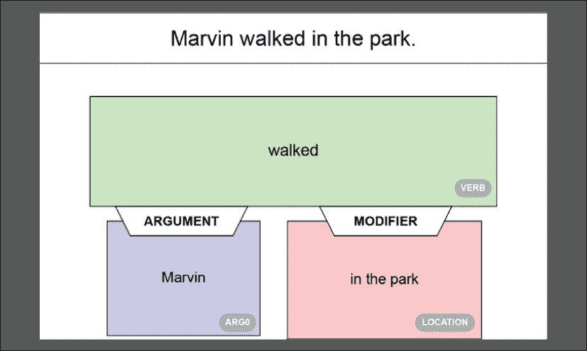

图 9.1:句子的 SRL 表征

我们可以观察到*图 9.1* 中的标签:

*   **动词**:句子的谓语。
*   **自变量**:名为 ARG0 的句子的一个自变量。
*   **修饰语**:句子的修饰语。在这种情况下，是一个位置。它可能是一个副词，一个形容词，或者任何修饰谓语意思的东西。

文本输出也很有趣，它包含视觉表示的标签的较短版本:

```py
**walked**: [ARG0: Marvin] [V: walked] [ARGM-LOC: in the park] 
```

我们已经定义了 SRL，并通过一个例子。是时候看看基于 BERT 的模型了。

## 运行预训练的基于 BERT 的模型

在这一节中，我们将从开始描述本章中使用的基于 BERT 的模型的架构。

然后，我们将定义使用伯特模型对 SRL 样本进行实验的方法。

让我们从基于 BERT 的模型的架构开始。

### 基于 BERT 模型的体系结构

AllenNLP 基于 BERT 的模型是一个 12 层的仅含编码器的 BERT 模型。AllenNLP 团队实施了 BERT 模型，如*师*和*林* (2019)所述，增加了一个线性分类层。

如果需要更多关于 BERT 模型的描述，请花几分钟时间回到第 2 章、*中的*。您也可以直接进入该章的 *BERT 模型配置*部分，该部分描述了我们在本章中运行的 BERT 模型的使用参数:

*   `BertForMaskedLM`
*   `attention_probs_dropout_prob: 0.1`
*   `hidden_act: "gelu"`
*   `hidden_dropout_prob: 0.1`
*   `hidden_size: 768`
*   `initializer_range: 0.02`
*   `intermediate_size: 3072`
*   `layer_norm_eps: 1e-12`
*   `max_position_embeddings: 512`
*   `model_type: "bert"`
*   `num_attention_heads: 12`
*   `num_hidden_layers: 12`
*   `pad_token_id: 0`
*   `type_vocab_size: 2`
*   `vocab_size: 30522`

基于 BERT 的模型通过简单的方法和架构充分利用了双向注意力。变形金刚的核心潜力在于注意力层。我们已经看到了带有编码器和解码器堆栈的变压器模型。我们还见过其他只有编码器层或解码器层的变压器。变形金刚的主要优势在于接近人类的注意力层次。

由*师*和*林* (2019)定义的谓词识别格式的输入格式显示了变形金刚在以标准化方式理解语言方面已经走了多远:

```py
[CLS] Marvin walked in the park.[SEP] walked [SEP] 
```

培训过程已经标准化:

*   `[CLS]`表示这是一次分类练习。
*   `[SEP]`是第一个分隔符，表示句子的结束。
*   `[SEP]`之后是作者设计的谓词识别。
*   `[SEP]`是第二个分隔符，表示谓词标识符的结束。

仅这种格式就足以训练 BERT 模型来识别和标记句子中的语义角色。

让我们设置运行 SRL 样本的环境。

### 设置伯特 SRL 环境

我们将使用谷歌 Colab 笔记本，在*定义语义角色标注*部分的【https://demo.allennlp.org/reading-comprehension】的[可以获得 SRL 的`AllenNLP`可视文本表示。](https://demo.allennlp.org/reading-comprehension)

我们将采用以下方法:

1.  打开`SRL.ipynb`，安装`AllenNLP`，运行每个样本。
2.  我们将显示 SRL 运行的原始输出。
3.  我们将使用 AllenNLP 的在线可视化工具来可视化输出
4.  我们将使用 AllenNLP 的在线文本可视化工具显示输出。

这一章是独立的。您可以通读它或按照描述运行示例。

当 AllenNLP 更改所用的变压器型号时，SRL 型号输出可能会有所不同。总体而言，AllenNLP 模型和变压器会不断接受培训和更新。此外，用于训练的数据集可能会发生变化。最后，这些不是每次都产生相同结果的基于规则的算法。从一次运行到另一次运行，输出可能会发生变化，如屏幕截图中所述。

让我们现在运行一些 SRL 实验。

# SRL 用基于伯特的模型进行实验

我们将使用本章*设置伯特 SRL 环境*一节中描述的方法运行我们的 SRL 实验。我们将从各种句子结构的基本范例开始。然后我们将用一些更难的样本来挑战基于 BERT 的模型，以探索系统的容量和极限。

打开`SRL.ipynb`并运行安装单元:

```py
!pip install allennlp==1.0.0 allennlp-models==1.0.0 
```

我们现在准备用一些基本的样品来热身。

# 基本样本

基本样品看似简单，但分析起来却很棘手。复合句、形容词、副词和情态动词不容易识别，即使对于非专业人员也是如此。

让我们从变压器的一个简单例子开始。

## 样本 1

第一个样本很长，但对变压器来说相对容易:

"`Did Bob really think he could prepare a meal for 50 people in only a few hours?`"

运行`SRL.ipynb`中的*样品 1* 池:

```py
!echo '{"sentence": "Did Bob really think he could prepare a meal for 50 people in only a few hours?"}' | \

allennlp predict https://storage.googleapis.com/allennlp-public-models/bert-base-srl-2020.03.24.tar.gz - 
```

例如，transformer 识别了动词“`think`”，我们可以在下面的单元格原始输出摘录中看到:

```py
prediction:  {"verbs": [{"verb": "think", "description": "Did [ARG0: Bob] [ARGM-ADV: really] [V: think] [ARG1: he could prepare a meal for 50 people in only a few hours] ?", 
```

如果我们在 AllenNLP 在线界面中运行该示例，我们将获得 SRL 任务的可视化表示。确定的第一个动词是“`think`”:

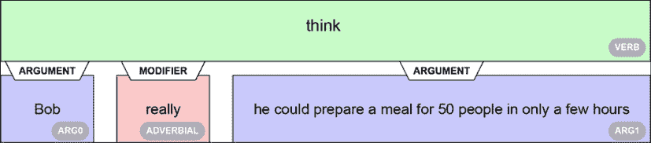

图 9.2:识别动词“思考”

如果我们仔细观察这种表示，我们可以发现简单的基于 BERT 的转换器的一些有趣的特性，即:

*   检测到动词"`think`"
*   避免了可能被解释为主动词的“`prepare`”陷阱。相反，“`prepare`”仍然是“`think`的论点的一部分
*   检测到一个副词并标记出来

然后，转换器转向动词“`prepare`”，对其进行标记，并分析其上下文:

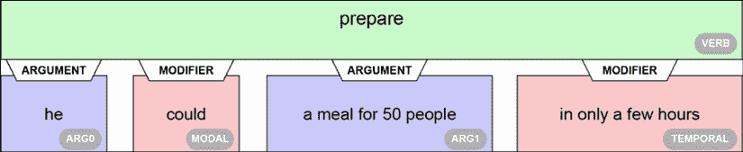

图 9.3:识别动词“准备”、参数和修饰语

同样，简单的基于 BERT 的 transformer 模型检测到大量关于句子语法结构的信息，并发现:

*   动词“`prepare`”并把它孤立出来
*   名词“`he`”并将其标记为一个参数，对“`a meal for 50 people`”也是如此这两个论点都正确地与动词“`prepare`”相关
*   那个“`in only a few hours`”是“`prepare`”的时间修饰语
*   那个“`could`”是一个情态修饰语，表示一个动词的情态，比如一个事件的可能性

AllenNLP 的文本输出总结了分析结果:

```py
**think**: Did [ARG0: Bob] [ARGM-ADV: really] [V: think] [ARG1: he could prepare a meal for 50 people in only a few hours] ?

**could**: Did Bob really think he [V: could] prepare a meal for 50 people in only a few hours ?

**prepare**: Did Bob really think [ARG0: he] [ARGM-MOD: could] [V: prepare] [ARG1: a meal for 50 people] [ARGM-TMP: in only a few hours] ? 
```

我们现在将分析另一个相对较长的句子。

## 样本 2

下面这个句子看起来很简单，但包含了几个动词:

"`Mrs. and Mr. Tomaso went to Europe for vacation and visited Paris and first went to visit the Eiffel Tower.`"

这句让人摸不着头脑的话会让变压器犹豫吗？让我们通过运行`SRL.ipynb`笔记本的*样本 2* 单元格来看看:

```py
!echo '{"sentence": "Mrs. And Mr. Tomaso went to Europe for vacation and visited Paris and first went to visit the Eiffel Tower."}' | \

allennlp predict https://storage.googleapis.com/allennlp-public-models/bert-base-srl-2020.03.24.tar.gz - 
```

输出的摘录证明转换器正确地识别了句子中的动词:

```py
prediction:  {"verbs": [{"verb": "went", "description": "[ARG0: Mrs. and Mr. Tomaso] [V: went] [ARG4: to Europe] [ARGM-PRP: for vacation] 
```

在 AllenNLP online 上运行示例显示，一个参数被确定为旅行的*目的*:

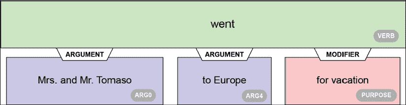

图 9.4:识别动词“去”，参数和修饰语

我们可以解释动词`went`的论元。然而，变压器发现动词的修饰语是旅行的目的。如果我们不知道*师*和*林* (2019)仅仅构建了一个简单的 BERT 模型来获得这种高质量的语法分析，这个结果就不会令人惊讶。

我们还可以注意到，“`went`”被正确地与“`Europe`”相关联。转换器正确地将动词“`visit`”识别为与“`Paris`”相关联:

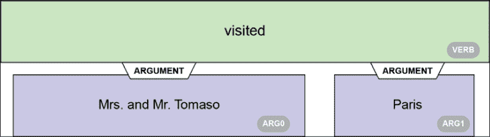

图 9.5:识别动词“已访问”和参数

转换器可以将动词“`visited`”直接与“`Eiffel Tower`”相关联。但事实并非如此。它坚持自己的立场，做出了正确的决定。

我们让转换器做的最后一项任务是识别动词“`went`”第二次使用的上下文。同样，它没有落入合并所有与句子中使用了两次的动词“`went`”相关的论点的陷阱。同样，它正确地分割了序列并产生了一个极好的结果:

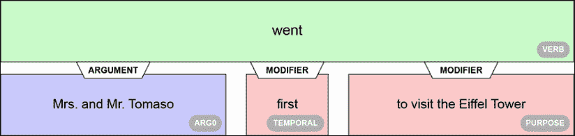

图 9.6:识别动词“去了”、论元和修饰语

动词“`went`”用了两次，但是变压器没有掉进陷阱。它甚至发现“`first`”是动词“`went`”的时间修饰语

AllenNLP 在线界面的格式化文本输出总结了此样本获得的出色结果:

```py
**went**: [ARG0: Mrs. and Mr. Tomaso] [V: went] [ARG4: to Europe] [ARGM-PRP: for vacation] and visited Paris and first went to visit the Eiffel Tower .

**visited**: [ARG0: Mrs. and Mr. Tomaso] went to Europe for vacation and [V: visited] [ARG1: Paris] and first went to visit the Eiffel Tower .

**went**: [ARG0: Mrs. and Mr. Tomaso] went to Europe for vacation and visited Paris and [ARGM-TMP: first] [V: went] [ARGM-PRP: to visit the Eiffel Tower] .

**visit**: [ARG0: Mrs. and Mr. Tomaso] went to Europe for vacation and visited Paris and first went to [V: visit] [ARG1: the Eiffel Tower] . 
```

让我们运行一个更加令人困惑的句子。

## 样本 3

样品 3 会让我们的变形金刚模型变得更加困难。以下示例包含四次动词“`drink`”:

"`John wanted to drink tea, Mary likes to drink coffee but Karim drank some cool water and Faiza would like to drink tomato juice.`"

让我们运行`SRL.ipynb`笔记本中的*样品 3* :

```py
!echo '{"sentence": "John wanted to drink tea, Mary likes to drink coffee but Karim drank some cool water and Faiza would like to drink tomato juice."}' | \

allennlp predict https://storage.googleapis.com/allennlp-public-models/bert-base-srl-2020.03.24.tar.gz - 
```

转换器找到了自己的路，如下面包含动词的原始输出的摘录所示:

```py
prediction: {"verbs": [{"verb": "wanted," "description": "[ARG0: John] [V: wanted] [ARG1: to drink tea] , Mary likes to drink coffee but Karim drank some cool water and Faiza would like to drink tomato juice."

{"verb": "likes," "description": "John wanted to drink tea , [ARG0: Mary] [V: likes] [ARG1: to drink coffee] but Karim drank some cool water and Faiza would like to drink tomato juice ."

{"verb": "drank," "description": "John wanted to drink tea , Mary likes to drink coffee but [ARG0: Karim] [V: drank] [ARG1: some cool water and Faiza] would like to drink tomato juice ."

{"verb": "would," "description": "John wanted to drink tea , Mary likes to drink coffee but Karim drank some cool water and Faiza [V: would] [ARGM-DIS: like] to drink tomato juice ." 
```

当我们在 AllenNLP 在线界面上运行句子时，我们获得了几个视觉表示。我们将研究其中的两个。

第一个很完美。它识别动词“`wanted`”并做出正确的联想:

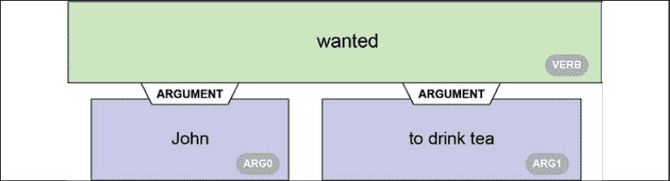

图 9.7:识别动词“想要”和参数

然而，当它识别出动词“`drank`”时，它将“`and Faiza`”作为一个参数插入:

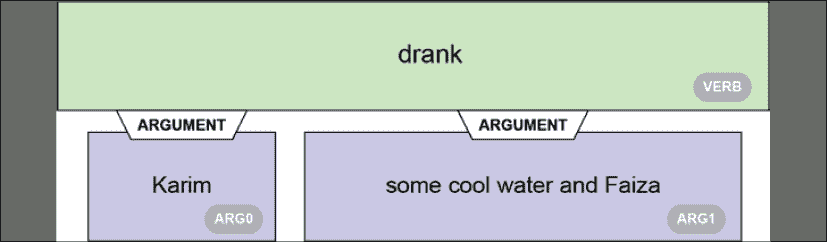

图 9.8:识别动词“喝了”和参数

的意思是“`Karim drank some cool water.`”、`and Faiza`、`drank`作为论元的存在是有争议的。

问题对“`Faiza would like to drink tomato juice`”有影响:

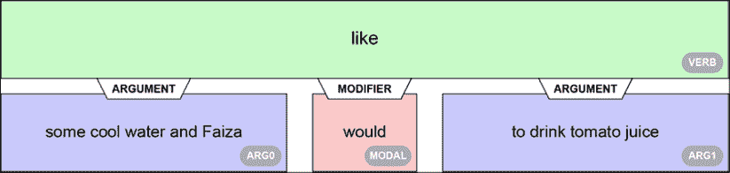

图 9.9:识别动词“like”、参数和修饰语

“`some cool water and`”的出现，不像那样是*的论证。只有“`Faiza`”是“`like.`的一个论点*

用 AllenNLP 得到的文本输出证实了这个问题:

```py
**wanted**: [ARG0: John] [V: wanted] [ARG1: to drink tea] , Mary likes to drink coffee but Karim drank some cool water and Faiza would like to drink tomato juice .

**drink**: [ARG0: John] wanted to [V: drink] [ARG1: tea] , Mary likes to drink coffee but Karim drank some cool water and Faiza would like to drink tomato juice .

**likes**: John wanted to drink tea , [ARG0: Mary] [V: likes] [ARG1: to drink coffee] but Karim drank some cool water and Faiza would like to drink tomato juice .

**drink**: John wanted to drink tea , [ARG0: Mary] likes to [V: drink] [ARG1: coffee] but Karim drank some cool water and Faiza would like to drink tomato juice .

**drank**: John wanted to drink tea , Mary likes to drink coffee but [ARG0: Karim] [V: drank] [ARG1: some cool water and Faiza] would like to drink tomato juice .

**would**: John wanted to drink tea , Mary likes to drink coffee but Karim drank some cool water and Faiza [V: would] [ARGM-DIS: like] to drink tomato juice .

**like**: John wanted to drink tea , Mary likes to drink coffee but Karim drank [ARG0: some cool water and Faiza] [ARGM-MOD: would] [V: like] [ARG1: to drink tomato juice] .

**drink**: John wanted to drink tea , Mary likes to drink coffee but Karim drank [ARG0: some cool water and Faiza] would like to [V: drink] [ARG1: tomato juice] . 
```

输出有点模糊。比如我们看到动词“`like`”的一个论元是那个“【T1”，很混乱:

```py
**like**: John wanted to drink tea , Mary likes to drink coffee but Karim drank [ARG0: some cool water and Faiza] [ARGM-MOD: would] [V: like] [ARG1: to drink tomato juice] . 
```

我们发现基于 BERT 的转换器在基本样本上产生相对较好的结果。让我们尝试一些更难的。

# 困难的样品

在这一节中，我们将运行包含基于 BERT 的转换器将首先解决的问题的示例。我们将以一个棘手的例子结束。

让我们从一个基于 BERT 的转换器可以分析的复杂样本开始。

## 样本 4

*样本 4* 带我们进入更棘手的 SRL 领域。该示例将"`Alice`"与动词"`liked`"分开，创建了一个必须跳过"`whose husband went jogging every Sunday.`"的长期依赖关系

句子是:

"`Alice, whose husband went jogging every Sunday, liked to go to a dancing class in the meantime.`"

人类可以分离出“`Alice`”并找到谓语:

`~~Alice, whose husband went jogging every Sunday,~~` `liked to go to a dancing class in the meantime.`

BERT 模型能像我们一样找到谓词吗？

让我们通过首先运行`SRL.ipynb`中的代码来找出答案:

```py
!echo '{"sentence": "Alice, whose husband went jogging every Sunday, liked to go to a dancing class in the meantime."}' | \

allennlp predict https://storage.googleapis.com/allennlp-public-models/bert-base-srl-2020.03.24.tar.gz - 
```

原始输出相当长，有详细的描述。让我们专注于我们感兴趣的部分，看看模型是否找到了谓词。确实如此。它找到了动词“`liked`”，如原始输出的摘录所示:

```py
[ARG0: Alice , whose husband went jogging every Sunday] , [V: liked] 
```

现在让我们看看在 AllenNLP 的在线 UI 上运行示例后模型分析的可视化表示。变形金刚首先找到了爱丽丝的丈夫:

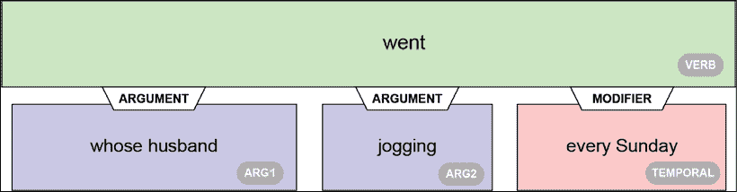

图 9.10:谓词“got”已经被识别

变压器解释说:

*   谓语或动词是“`went`”
*   “`whose husband`”是论证
*   “`jogging`”是与“`went`”相关的另一个论点
*   “`every Sunday`”是在原始输出中表示为`[ARGM-TMP: every Sunday]`的时间修饰符

然后变形金刚发现爱丽丝的丈夫在做什么:

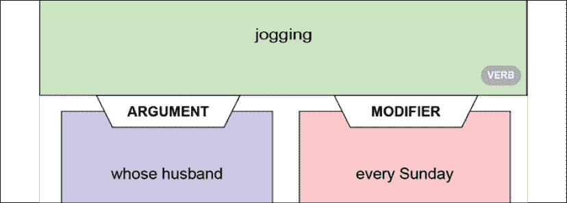

图 9.11:动词“慢跑”的 SRL 检测

我们可以看到，动词“`jogging`”被识别出来，并通过时间修饰语“`every Sunday`”与“`whose husband`”相关联

变压器不会就此停止。它现在检测爱丽丝喜欢什么:

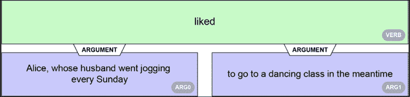

图 9.12:识别动词“喜欢”

描述爱丽丝的论点有点长，但正确。如果我们回到我们的`SRL.ipynb`笔记本中的原始输出，我们可以看到原始细节证实了分析是正确的:

```py
[ARG0: Alice , whose husband went jogging every Sunday] , [V: liked] [ARG1: to go to a dancing class in the meantime] 
```

转换器还正确地检测和分析动词“`go`”:

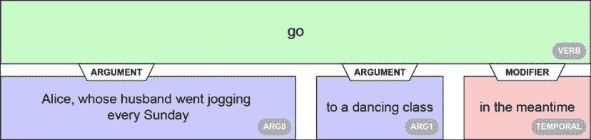

图 9.13:检测动词“go”、它的参数和修饰语

我们可以看到，时间修饰符“`in the meantime`”也被识别出来。当我们想到训练基于 BERT 的模型所用的简单序列+动词输入时，这是相当好的性能。

最后，转换器将最后一个动词“`dancing`”标识为与“`class`”相关:

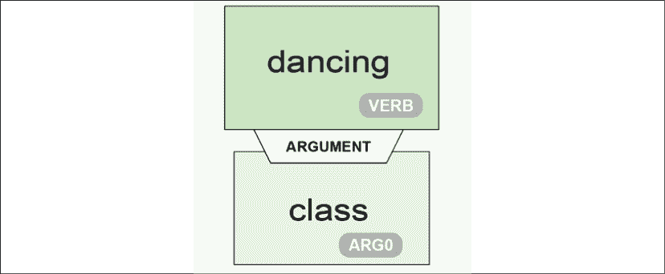

图 9.14:将参数“class”与动词“dancing”联系起来

我们现在来看看 AllenNLP 在线用户界面生成的格式文本输出:

```py
**went**: Alice , [ARG1: whose husband] [V: went] [ARG2: jogging] [ARGM-TMP: every Sunday] , liked to go to a dancing class in the meantime .

jogging: Alice , [ARG0: whose husband] went [V: jogging] [ARGM-TMP: every Sunday] , liked to go to a dancing class in the meantime .

**liked**: [ARG0: Alice , whose husband went jogging every Sunday] , [V: liked] [ARG1: to go to a dancing class in the meantime] .

**go**: [ARG0: Alice , whose husband went jogging every Sunday] , liked to [V: go] [ARG4: to a dancing class] [ARGM-TMP: in the meantime] .

**dancing**: Alice , whose husband went jogging every Sunday , liked to go to a [V: dancing] [ARG0: class] in the meantime . 
```

*样本 4* 产生的结果还是比较有说服力的！

让我们试着找出变压器模型的极限。

## 样品 5

*例句 5* 一个动词不重复几次。然而，*样本 5* 包含了一个可以有多种功能和意义的词。这超出了一词多义的范围，因为单词“`round`”可以有不同的意思和语法功能。单词“`round`”可以是名词、形容词、副词、及物动词或不及物动词。

作为及物动词或不及物动词，`round`可以表示达到完美或完成。从这个意义上讲，“`round`”可以和“`off`”搭配使用

下面这个句子用的是过去时的“`round`”:

"`The bright sun, the blue sky, the warm sand, the palm trees, everything round off.`"

Round 在某种意义上用于“使达到完美”。最好的语法形式应该是“rounded”，但是 transformer 找到了正确的动词，这个句子听起来很有诗意。

让我们在`SRL.ipynb`中运行*样本 5* :

```py
!echo '{"sentence": "The bright sun, the blue sky, the warm sand, the palm trees, everything round off."}' | \

allennlp predict https://storage.googleapis.com/allennlp-public-models/bert-base-srl-2020.03.24.tar.gz - 
```

输出显示没有动词。转换器无法识别谓词。事实上，它根本没有发现动词:

```py
prediction:  **{"verbs": []**, "words": ["The", "bright", "sun", ",", "the", "blue", "sky", ",", "the", "warm", "sand", ",", "the", "palm", "trees", ",", "everything", "round", "off", "."]} 
```

因为我们喜欢基于 BERT 的转换器，所以我们会善待它。让我们把这个句子从过去时改成现在时:

`The bright sun, the blue sky, the warm sand, the palm trees, everything` `rounds` `off`

让我们用现在时再试一次:

```py
!echo '{"sentence": "The bright sun, the blue sky, the warm sand, the palm trees, everything rounds off."}' | \

allennlp predict https://storage.googleapis.com/allennlp-public-models/bert-base-srl-2020.03.24.tar.gz - 
```

原始输出显示找到了谓词，如以下摘录所示:

```py
prediction:  {"verbs": [{"verb": "rounds", "description": "[ARG1: The bright sun …/… 
```

如果我们在 AllenNLP 上运行这个句子，我们会得到直观的解释:

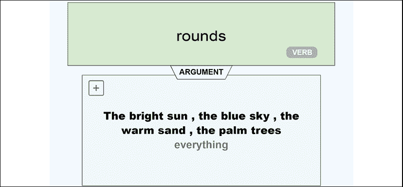

图 9.15:将单词“round”检测为动词

我们基于 BERT 的转换器表现很好，因为单词“`round`”可以用复数形式的“`rounds`”来表示。

伯特模型最初没有产生我们预期的结果。但是在朋友们的帮助下，这个样本一切都很好。

我们来试试另一个很难标注的句子。

## 样本 6

*样本 6* 取了一个我们经常认为只是名词的词。然而，比我们想象的更多的词既可以是名词也可以是动词。"`To ice`"是曲棍球中使用的一个动词，用来把一个"`puck`"一直射过冰场，越过对手的球门线。`puck`是曲棍球中使用的圆盘。

曲棍球教练可以通过告诉队员训练冰球来开始新的一天。当教练大喊时，我们就可以得到*祈使句*:

"`Now, ice pucks guys!`"

请注意，“`guys`”可以表示“T1”，与性别无关。

让我们运行*样本 6* 单元，看看会发生什么:

```py
!echo '{"sentence": "Now, ice pucks guys!"}' | \

allennlp predict https://storage.googleapis.com/allennlp-public-models/bert-base-srl-2020.03.24.tar.gz - 
```

转换器找不到动词:

```py
prediction:  {"verbs": [], "words": ["Now", ",", "ice", "pucks", "guys", "!"]} 
```

游戏结束！我们可以看到变形金刚已经取得了巨大的进步，但是开发者仍然有很大的空间来改进模型。人类还在游戏里！

尝试一些你自己的例子，看看 SRL 能做什么和这种方法的局限性。

# 摘要

在这一章中，我们探索了 SRL。SRL 任务对人类和机器来说都很困难。Transformer 模型表明，在一定程度上，许多 NLP 主题都可以达到人类基线。

我们发现一个简单的基于 BERT 的转换器可以执行谓词意义消歧。我们运行了一个简单的转换器，它可以识别一个动词(谓词)的含义，而不需要词法或语法标签。*石*和*林* (2019)使用标准的*“句子+动词”*输入格式来训练他们基于 BERT 的转换器。

我们发现，用精简的*“句子+谓词”*输入训练的变压器可以解决简单和复杂的问题。当我们使用相对罕见的动词形式时，就达到了极限。然而，这些限制不是最终的。如果将困难的问题添加到训练数据集中，研究团队可以改进模型。

我们还发现，有益于人类的人工智能是存在的。艾伦人工智能研究所已经提供了许多免费的人工智能资源。研究团队已经在 NLP 模型的原始输出中添加了视觉表示，以帮助用户理解 AI。我们看到解释 AI 和运行程序一样必不可少。视觉和文本表示清楚地展示了基于 BERT 的模型的潜力。

Transformers 将继续通过其分布式架构和输入格式来改进 NLP 的标准化。

在下一章，*第十章*，*让你的数据说话:故事、问题和答案*，我们将挑战变形金刚通常只有人类才能胜任的任务。我们将探索变形金刚在面对**命名实体识别**(**)和问答任务时的潜力。**

 **# 问题

1.  **语义角色标注** ( **SRL** )是一个文本生成任务。(对/错)
2.  谓语是名词。(对/错)
3.  动词是谓语。(对/错)
4.  争论可以描述谁和什么正在做某事。(对/错)
5.  修饰语可以是副词。(对/错)
6.  修改量可以是一个位置。(对/错)
7.  基于 BERT 的模型包含编码器和解码器堆栈。(对/错)
8.  基于 BERT 的 SRL 模型有标准的输入格式。(对/错)
9.  变形金刚可以解决任何 SRL 任务。(对/错)

# 参考

*   *师鹏*和*林志颖*2019*用于关系抽取和语义角色标注的简单 BERT 模型*:[https://arxiv.org/abs/1904.05255](https://arxiv.org/abs/1904.05255)
*   艾伦人工智能研究所:【https://allennlp.org/ 
*   *艾伦人工智能语义标注研究所资源*:[https://demo . allennlp . org/Semantic-role-Labeling/mje 4 NDE 1 na = =](https://demo.allennlp.org/semantic-role-labeling/MjE4NDE1NA==)**