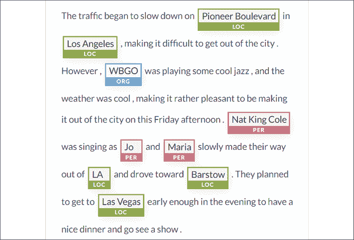
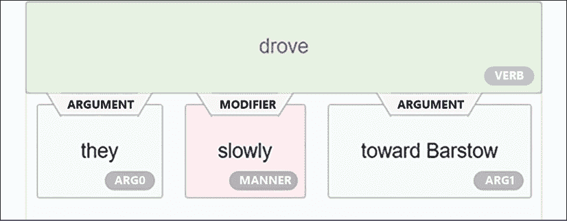
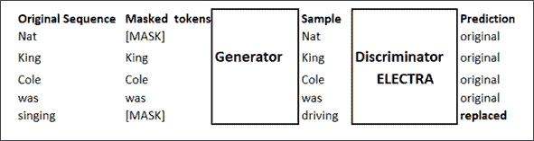
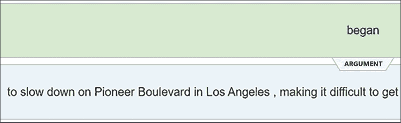
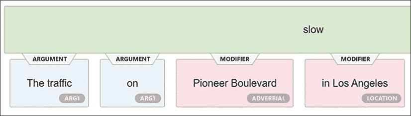
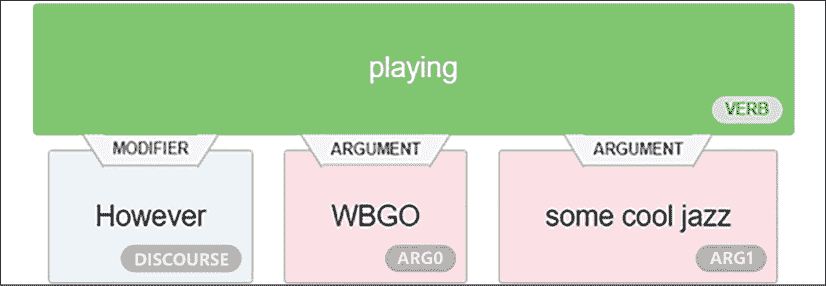
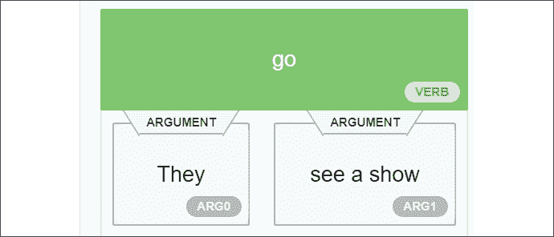
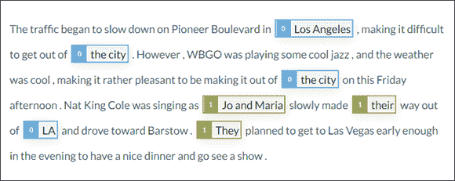

# Ten

# 让你的数据说话:故事、问题和答案

阅读理解需要很多技巧。当我们阅读一篇文章时，我们会注意到关键词和主要事件，并创建内容的心理表征。然后我们可以用我们对内容的了解和我们的表述来回答问题。我们还检查每个问题，以避免陷阱和犯错误。

转换器无论变得多么强大，都不能轻易回答公开的问题。一个开放的环境意味着某人可以就任何话题提出任何问题，而 transformer 会正确地回答。这仍然是不可能的。变压器通常在封闭的问答环境中使用通用领域训练数据集。例如，医疗保健和法律解释中的关键答案需要额外的 NLP 功能。

然而，无论训练环境是否用预处理的问答序列封闭，转换器都不能正确回答任何问题。如果一个序列包含不止一个主题和复合命题，transformer 模型可能会做出错误的预测。

这一章将着重于建立一个问题生成器的方法，这个生成器可以在其他 NLP 任务的帮助下在文本中找到明确的内容。问题生成器将展示一些可以用来实现问答的想法。

我们将首先展示提出随机问题并期望变压器每次都能做出良好响应是多么困难。

我们将通过引入建议合理问题的**命名实体识别**(**)函数来帮助 DistilBERT 模型回答问题。我们将为变压器的问题生成器打下基础。**

 **我们将向我们的问答工具箱中添加一个被预先训练为鉴别器的 ELECTRA 模型。

最后，我们将在文本生成器的蓝图中添加**语义角色标注**(**)函数。**

 **在我们离开本章之前，*后续步骤*部分将提供构建可靠问答解决方案的额外想法，包括实现`Haystack`框架。

在本章的结尾，你将会看到如何构建你自己的多任务 NLP 助手来回答问题。

本章涵盖以下主题:

*   随机问答的局限性
*   基于实体识别使用 NER 创建有意义的问题
*   开始设计变压器问题生成器的蓝图
*   测试 NER 发现的问题
*   介绍一种预训练为鉴别器的 ELECTRA 编码器
*   用标准问题测试 ELECTRA 模型
*   基于谓词识别使用 SRL 创建有意义的问题
*   实现问答式变压器的项目管理指南
*   分析如何使用 SRL 生成问题
*   使用 NER 和 SRL 的输出来定义变压器的问题生成器的蓝图
*   用 RoBERTa 探索 Haystack 的问答框架

让我们从分析问答任务中问题生成的方法开始。

# 方法学

问答主要表现为一个 NLP 练习，涉及一个转换器和一个数据集，该数据集包含准备提问的问题并提供这些问题的答案。转换器被训练来回答这个封闭环境中的问题。

然而，在更复杂的情况下，可靠的转换器模型实现需要定制的方法。

## 变压器和方法

不存在用于问答或任何其他 NLP 任务的完美且高效的通用 transformer 模型。项目的最佳模型是为特定数据集和任务产生最佳输出的模型。

*第 6 章*，*用 OpenAI GPT-2 和 GPT-3 模型*生成的文本表明，应用于小阿尔伯特模型的**模式开发训练** ( **PET** )方法超过了大得多的 GPT-3 *模型*的性能。

在许多案例中，该方法优于模型。具有平均模型的合适方法通常会比具有优秀模型的有缺陷方法产生更有效的结果。在本章中，我们将运行 DistilBERT、ELECTRA 和 RoBERTa 模型。一些人比其他人有更好的*表现*。

然而，“*性能*”并不能保证关键领域的结果。

例如，在太空火箭和宇宙飞船生产项目中，向 NLP 机器人提问意味着获得一个精确的答案。

假设用户需要在一份长达 100 页的报告中提出一个问题，该报告是关于一枚火箭的再生冷却式*喷嘴和燃烧室的状态。问题可以是具体的，例如“`Is the cooling status reliable or not?`”，这是用户想要从 NLP 机器人获得的底线信息。*

长话短说，让 NLP 机器人，无论是不是 transformer 模型，在没有质量和认知控制的情况下做出字面上的统计答案，风险太大，不会发生。可信的 NLP 机器人将连接到包含数据和规则的知识库，以在后台运行基于规则的专家系统来检查 NLP 机器人的答案。NLP transformer 模型机器人将产生流畅、可靠的自然语言回答，可能带有人声。

适合所有需求的通用变压器*型号*和*方法*并不存在。每个项目都需要特定的功能和定制的方法，并且根据用户的期望会有很大的不同。

这一章将关注问答的一般约束，而不仅仅是特定的变压器模型选择。本章不是一个问答项目指南，而是一个关于如何使用 transformers 进行问答的介绍。

我们将着重于在开放的环境中使用问答，在这种环境中，问题不是事先准备好的。Transformer 模型需要其他 NLP 任务和经典程序的帮助。我们将探索一些方法来说明如何组合任务以达到项目的目标:

*   *方法 0* 探索随机提问的试错法。
*   *方法 1* 介绍 NER 帮助准备问答任务。
*   *方法 2* 尝试用 ELECTRA 变压器模型帮助默认变压器。它还介绍了 SRL，以帮助变压器准备问题。

对这三种方法的介绍表明，单一的问答方法对高知名度的企业项目是行不通的。添加 NER 和 SRL 将提高 transformer agent 解决方案的语言智能。

例如，在我的第一个人工智能 NLP 项目中，我为一家航空航天公司的战术环境中的国防项目实现了问题回答，我组合了不同的 NLP 方法来确保提供的答案是 100%可靠的。

您可以为您实现的每个项目设计一个多方法解决方案。

让我们从试错法开始。

# 方法 0:试错法

回答问题似乎很容易。这是真的吗？让我们找出答案。

打开`QA.ipynb`，我们将在本章中使用的 Google Colab 笔记本。我们会一个单元一个单元地检查笔记本。

运行第一个单元来安装拥抱脸的转换器，这个框架我们将在本章中实现:

```py
!pip install -q transformers==4.0.0 
```

我们现在将导入 Hugging Face 的管道，其中包含大量现成的 transformer 资源。它们为拥抱脸库资源提供高级抽象功能，以执行广泛的任务。我们可以通过一个简单的 API 来访问这些 NLP 任务。

`pipeline`用一行代码导入:

```py
from transformers import pipeline 
```

完成后，我们有一行选项来实例化 transformer 模型和任务:

1.  使用默认`model`和默认`tokenizer` :

    ```py
    pipeline("<task-name>") 
    ```

    执行 NLP 任务
2.  使用自定义`model` :

    ```py
    pipeline("<task-name>", model="<model_name>") 
    ```

    执行 NLP 任务
3.  使用自定义`model`和自定义`tokenizer` :

    ```py
    pipeline('<taskname>', model='<model name>', tokenizer='<tokenizer_name>') 
    ```

    执行 NLP 任务

让我们从默认模型和标记器开始:

```py
nlp_qa = pipeline('question-answering') 
```

现在，我们所要做的就是提供一个文本，然后我们将使用它向转换器提交问题:

```py
sequence = "The traffic began to slow down on Pioneer Boulevard in Los Angeles, making it difficult to get out of the city. However, WBGO was playing some cool jazz, and the weather was cool, making it rather pleasant to be making it out of the city on this Friday afternoon. Nat King Cole was singing as Jo and Maria slowly made their way out of LA and drove toward Barstow. They planned to get to Las Vegas early enough in the evening to have a nice dinner and go see a show." 
```

这个序列看似简单，我们所要做的就是将一行代码插入 API，提出一个问题并获得答案:

```py
nlp_qa(context=sequence, question='Where is Pioneer Boulevard ?') 
```

输出是一个完美的答案:

```py
{'answer': 'Los Angeles,', 'end': 66, 'score': 0.988201259751591, 'start': 55} 
```

我们刚刚用几行代码实现了一个问答式 transformer NLP 任务！现在，您可以下载一个包含文本、问题和答案的现成数据集。

事实上，这一章可以在这里结束，你就可以开始回答问题了。然而，在现实生活中，事情从来都不简单。假设我们必须实现一个问答转换器模型，让用户对存储在数据库中的许多文档提出问题。我们有两个重要的限制:

*   我们首先需要在一组关键文档中运行 transformer，并创建显示系统工作的问题
*   我们必须展示如何保证变压器正确回答问题

几个问题立即出现:

*   谁来找问题来测试系统呢？
*   即使专家同意做这项工作，如果许多问题产生错误的结果，会发生什么呢？
*   如果结果不理想，我们还会继续训练模型吗？
*   如果无论我们使用哪种模型或训练，有些问题都无法回答，会发生什么？
*   如果这种方法在有限的样本上有效，但这个过程耗时太长，并且因为成本太高而无法扩大规模，那该怎么办？

如果我们只是在专家的帮助下尝试一些问题，看看哪些可行，哪些不可行，这可能要花很长时间。试错不是解决办法。

本章旨在提供一些方法和工具来降低实现问答式转换器模型的成本。*在为客户实现新数据集时，找到适合问答的好问题是一个相当大的挑战*。

我们可以把变压器想象成一个乐高积木，我们可以使用仅编码器或仅解码器的堆栈来组装我们认为合适的积木。我们可以使用一套小型、大型或**特大型** ( **XL** )变压器型号。

我们也可以将本书中探讨的 NLP 任务视为我们必须实现的项目中的一组乐高解决方案。我们可以组合两个或更多的 NLP 任务来达到我们的目标，就像任何其他软件实现一样。我们可以从对问题的反复试验发展到一种有条理的方法。

在本章中:

1.  我们将继续一个单元一个单元地运行`QA.ipynb`来探索每一节中描述的方法。
2.  我们还将使用`AllenNLP` NER 接口来获得 NER 和 SRL 结果的可视化表示。你可以到 https://demo.allennlp.org/reading-comprehension 的[进入界面，然后选择**命名实体识别**或**语义角色标注**进入序列。在本章中，我们将考虑使用的`AllenNLP`模型。我们只是想获得视觉表现。](https://demo.allennlp.org/reading-comprehension)

让我们首先尝试找到正确的**特大号** ( **XL** )变压器模型问题，采用 NER 优先法进行问答。

# 方法一:NER 第一

这一部分将使用 NER 来帮助我们找到好问题的思路。变压器模型不断地被训练和更新。此外，用于训练的数据集可能会改变。最后，这些不是每次都产生相同结果的基于规则的算法。从一次运行到另一次运行，输出可能会发生变化。NER 可以检测序列中的人员、位置、组织和其他实体。我们将首先运行一个 NER 任务，它将给出段落的一些主要部分，我们可以集中精力来提问。

## 利用 NER 发现问题

我们将继续一个单元一个单元地运行`QA.ipynb`。程序现在使用 NER 任务初始化管道，以使用默认模型和记号赋予器执行:

```py
nlp_ner = pipeline("ner") 
```

我们将继续使用我们在本章的*方法 0:试错法*一节中运行的看似简单的序列:

```py
sequence = "The traffic began to slow down on Pioneer Boulevard in Los Angeles, making it difficult to get out of the city. However, WBGO was playing some cool jazz, and the weather was cool, making it rather pleasant to be making it out of the city on this Friday afternoon. Nat King Cole was singing as Jo and Maria slowly made their way out of LA and drove toward Barstow. They planned to get to Las Vegas early enough in the evening to have a nice dinner and go see a show." 
```

我们运行`QA.ipynb`中的`nlp_ner`单元:

```py
print(nlp_ner(sequence)) 
```

输出生成 NLP 任务的结果。分数被编辑成两位小数以适应页面宽度:

```py
[{'word': 'Pioneer', 'score': 0.97, 'entity': 'I-LOC', 'index': 8}, 

{'word': 'Boulevard', 'score': 0.99, 'entity': 'I-LOC', 'index': 9}, 

{'word': 'Los', 'score': 0.99, 'entity': 'I-LOC', 'index': 11}, 

{'word': 'Angeles', 'score': 0.99, 'entity': 'I-LOC', 'index': 12}, 

{'word': 'W', 'score': 0.99, 'entity': 'I-ORG', 'index': 26}, 

{'word': '##B', 'score': 0.99, 'entity': 'I-ORG', 'index': 27}, 

{'word': '##G', 'score': 0.98, 'entity': 'I-ORG', 'index': 28}, 

{'word': '##O', 'score': 0.97, 'entity': 'I-ORG', 'index': 29}, 

{'word': 'Nat', 'score': 0.99, 'entity': 'I-PER', 'index': 59}, 

{'word': 'King', 'score': 0.99, 'entity': 'I-PER', 'index': 60}, 

{'word': 'Cole', 'score': 0.99, 'entity': 'I-PER', 'index': 61}, 

{'word': 'Jo', 'score': 0.99, 'entity': 'I-PER', 'index': 65}, 

{'word': 'Maria', 'score': 0.99, 'entity': 'I-PER', 'index': 67},

{'word': 'LA', 'score': 0.99, 'entity': 'I-LOC', 'index': 74}, 

{'word': **'Bar'**, 'score': 0.99, 'entity': 'I-LOC', 'index': 78}, 

{'word': **'##sto'**, 'score': 0.85, 'entity': 'I-LOC', 'index': 79}, 

{'word': **'##w'**, 'score': 0.99, 'entity': 'I-LOC', 'index': 80}, 

{'word': 'Las', 'score': 0.99 'entity': 'I-LOC', 'index': 87}, 

{'word': 'Vegas', 'score': 0.9989519715309143, 'entity': 'I-LOC', 'index': 88}] 
```

拥抱脸的文档描述了所使用的标签。在我们的案例中，主要有:

*   `I-PER`，一个人的名字
*   `I-ORG`，一个组织的名称
*   `I-LOC`，一个地点的名称

结果是正确的。注意中的`Barstow`被分成了三个令牌。

让我们在*命名实体识别*部分([https://demo.allennlp.org/named-entity-recognition](https://demo.allennlp.org/named-entity-recognition))的`AllenNLP`上运行相同的序列，以获得我们序列的可视化表示:



图 10.1: NER

我们可以看到，NER 突出显示了我们将用于创建问答问题的关键实体。

让我们问我们的转换器两类问题:

*   与地点有关的问题
*   与人有关的问题

让我们从位置问题开始。

### 位置实体问题

`QA.ipynb`产生了近`20`个实体。的位置实体特别有趣:

```py
[{'word': 'Pioneer', 'score': 0.97, 'entity': 'I-LOC', 'index': 8}, 

{'word': 'Boulevard', 'score': 0.99, 'entity': 'I-LOC', 'index': 9}, 

{'word': 'Los', 'score': 0.99, 'entity': 'I-LOC', 'index': 11}, 

{'word': 'Angeles', 'score': 0.99, 'entity': 'I-LOC', 'index': 12}, 

{'word': 'LA', 'score': 0.99, 'entity': 'I-LOC', 'index': 74}, 

{'word': **'Bar'**, 'score': 0.99, 'entity': 'I-LOC', 'index': 78}, 

{'word': **'##sto'**, 'score': 0.85, 'entity': 'I-LOC', 'index': 79}, 

{'word': **'##w'**, 'score': 0.99, 'entity': 'I-LOC', 'index': 80}, 

{'word': 'Las', 'score': 0.99 'entity': 'I-LOC', 'index': 87}, 

{'word': 'Vegas', 'score': 0.9989519715309143, 'entity': 'I-LOC', 'index': 88}] 
```

#### 应用启发式

我们可以应用试探法(一种方法)来用生成的输出`QA.ipynb`创建问题:

*   用解析器将位置合并回它们的原始形式
*   将模板应用到位置

为项目编写经典代码超出了本书的范围。我们可以编写一个函数来完成这项工作，如下面的伪代码所示:

```py
for i in range beginning of output to end of the output:

    filter records containing I-LOC

    merge the I-LOCs that fit together

    save the merged I-LOCs for questions-answering 
```

NER 的输出将变成:

*   `I-LOC`，`Pioneer Boulevard`
*   `I-LOC`，`Los Angeles`
*   `I-LOC`，`LA`
*   `I-LOC`，`Barstow`
*   `I-LOC`，`Las Vegas`

然后，我们可以用两个模板自动生成问题。例如，我们可以应用一个随机函数。我们可以编写一个函数来完成这项工作，如下面的伪代码所示:

```py
from the first location to the last location:

    choose randomly:

        Template 1: Where is [I-LOC]?

        Template 2: Where is [I-LOC] located? 
```

我们会自动获得五个问题。例如:

```py
Where is Pioneer Boulevard?

Where is Los Angeles located?

Where is LA?

Where is Barstow?

Where is Las Vegas located? 
```

我们知道这些问题中的一些不能用我们创造的序列直接回答。但是我们也可以自动管理。假设问题是用我们的方法自动创建的:

1.  输入一个序列
2.  运行 NER
3.  自动创建问题

假设问题是自动创建的，让我们运行它们:

```py
nlp_qa = pipeline('question-answering')

print("Question 1.",nlp_qa(context=sequence, question='Where is Pioneer Boulevard ?'))

print("Question 2.",nlp_qa(context=sequence, question='Where is Los Angeles located?'))

print("Question 3.",nlp_qa(context=sequence, question='Where is LA ?'))

print("Question 4.",nlp_qa(context=sequence, question='Where is Barstow ?'))

print("Question 5.",nlp_qa(context=sequence, question='Where is Las Vegas located ?')) 
```

输出显示只有`Question 1`回答正确:

```py
Question 1\. {'score': 0.9879662851935791, 'start': 55, 'end': 67, 'answer': 'Los Angeles,'}

Question 2\. {'score': 0.9875189033668121, 'start': 34, 'end': 51, 'answer': 'Pioneer Boulevard'}

Question 3\. {'score': 0.5090435442006118, 'start': 55, 'end': 67, 'answer': 'Los Angeles,'}

Question 4\. {'score': 0.3695214621538554, 'start': 387, 'end': 396, 'answer': 'Las Vegas'}

Question 5\. {'score': 0.21833994202792262, 'start': 355, 'end': 363, 'answer': 'Barstow.'} 
```

输出显示答案的`score`、`start`和`end`位置，以及`answer`本身。`Question 2`的`score`在这次运行中是`0.98`，尽管它错误地声明`Pioneer Boulevard`中的`Los Angeles`。

我们现在要干嘛？

为了增加质量和决策功能，是时候用项目管理来控制变压器了。

#### 项目管理

我们将研究四个例子，以及如何管理转换器和自动管理它的硬编码函数。我们将把这四个项目管理例子分为四个项目级别:简单、中级、困难和非常困难。项目管理不在本书的讨论范围之内，所以我们将简要介绍这四个类别:

1.  **一个简单的项目**可能是一个小学网站。老师可能会对我们所看到的感到高兴。文本可以显示在 HTML 页面上。我们自动获得的问题的五个答案可以通过一些开发合并成固定格式的五个断言:“`I-LOC is in I-LOC`”(例如，“`Barstow is in Barstow`”)。然后，我们在每个断言下添加(真，假)。所有老师要做的就是有一个管理员界面，允许老师点击正确的答案，以完成多项选择问卷！
2.  **一个中间项目**可能是将变压器的自动问答封装在一个程序中，该程序使用一个 API 来检查答案并自动纠正它们。用户将什么也看不见。这个过程是无缝的。变压器做出的错误答案将被存储以供进一步分析。
3.  **一个困难的项目**将是在聊天机器人中实现一个中间项目，并有后续问题。例如，变压器正确地将`Pioneer Boulevard`放置在`Los Angeles`中。聊天机器人用户可能会问一个自然的后续问题，如“`near where in LA?`”这需要更多的发展。
4.  **一个非常困难的项目**将是一个研究项目，它将训练转换器识别数据集中数百万条记录的`I-LOC`实体，并输出地图软件 API 实时流的结果。

好消息是我们也可以找到一种方法来使用我们发现的东西。

坏消息是，在现实生活项目中实现转换器或任何人工智能都需要强大的机器，需要项目经理、**主题专家** ( **中小企业**)、开发人员和最终用户之间大量的团队合作。

现在让我们试试人的实体问题。

### 个人实体问题

让我们从变压器的一个简单问题开始:

```py
nlp_qa = pipeline('question-answering')

nlp_qa(context=sequence, question='Who was singing ?') 
```

答案是正确。它说明了序列中谁在唱歌:

```py
{'answer': 'Nat King Cole,'

 'end': 277,

 'score': 0.9653632081862433,

 'start': 264} 
```

我们现在将向变压器提出一个需要思考的问题，因为这个问题没有明确说明:

```py
nlp_qa(context=sequence, question='Who was going to Las Vegas ?') 
```

不把句子拆开，就不可能回答那个问题。变压器犯了一个大错误:

```py
{'answer': 'Nat King Cole,'

 'end': 277,

 'score': 0.3568152742800521,

 'start': 264} 
```

变压器足够诚实地显示只有`0.35`的`score`。这个`score`可能因计算的不同而不同，也可能因变压器型号的不同而不同。我们可以看到，transformer 面临了一个语义标注问题。让我们尝试用 SRL 第一的方法来做得更好。

# 方法二:SRL 第一

转换器找不到开车去`Las Vegas`的人，以为是`Nat King Cole`而不是`Jo`和`Maria`。

哪里出了问题？我们能看到转换器的想法并得到解释吗？为了找到答案，让我们回到语义角色建模。如有必要，花几分钟时间回顾一下*第 9 章*、*基于 BERT 的变形器的语义角色标注*。

让我们在**语义角色标注**部分的`AllenNLP`、【https://demo.allennlp.org/reading-comprehension】和上运行相同的序列，以获得我们序列中动词`drove`的可视化表示:



图 10.2: EER 语义角色标注(SRL)

我们可以看到问题。动词“`driving`”的论元是“`they.`”“`they`”和“`Jo`”和“`Maria`”之间没有建立关系似乎可以做出这样的推论。

转换器模型不断发展。输出可能有所不同；然而，概念是相同的。

这是真的吗？我们来问一下`QA.ipynb`中的问题:

```py
nlp_qa(context=sequence, question='Who are they?') 
```

输出是正确的:

```py
{'answer': 'Jo and Maria',

 'end': 305,

 'score': 0.8486017557290779,

 'start': 293} 
```

我们能找到一种提问的方式来获得正确的答案吗？我们将试着解释这个问题:

```py
nlp_qa(context=sequence, question='Who drove to Las Vegas?') 
```

我们获得了稍微好一点的结果:

```py
{'answer': 'Nat King Cole was singing as Jo and Maria',

 'end': 305,

 'score': 0.35940926070820467,

 'start': 264} 
```

变压器现在明白了`Nat King Cole`就是`singing`并且`Jo and Maria`正在做一些事情。

我们还需要更进一步，想办法提出更好的问题。

让我们试试另一个模型。

## 用 ELECTRA 回答问题

在切换型号之前，我们需要知道我们使用的是哪一种型号:

```py
print(nlp_qa.model) 
```

输出首先显示该模型是一个针对问答训练的 DistilBERT 模型:

```py
DistilBertForQuestionAnswering((distilbert): DistilBertModel( 
```

模型有`6`个图层和`768`个特征，如`6`图层所示(图层编号从`0`到`n`):

```py
(5): TransformerBlock(

          (attention): MultiHeadSelfAttention(

            (dropout): Dropout(p=0.1, inplace=False)

            (q_lin): Linear(in_features=768, out_features=768, bias=True)

            (k_lin): Linear(in_features=768, out_features=768, bias=True)

            (v_lin): Linear(in_features=768, out_features=768, bias=True)

            (out_lin): Linear(in_features=768, out_features=768, bias=True) 
```

我们现在将尝试 ELECTRA 变压器模型。Clark 等人(2020)设计了一个 transformer 模型，改进了**掩蔽语言建模** ( **MLM** )预训练方法。

在*第二章*、*微调 BERT 模型*中，在*屏蔽语言建模*小节中，我们看到 BERT 模型在训练过程中插入了带有`[MASK]`的随机屏蔽令牌。

克拉克等人(2020 年)决定引入一个发电机网络，而不是简单地使用随机令牌。训练 BERT 模型来预测(被屏蔽的)被破坏的令牌的身份。*克拉克*等(2020)训练了一个 ELECTRA 模型作为鉴别器来预测屏蔽令牌是否是生成令牌。*图 10.3* 显示了如何训练 ELECTRA:



图 10.3:伊莱克特拉被训练成鉴别者

*图 10.3* 显示原始序列在通过发生器之前被屏蔽。生成器插入*可接受的*令牌，而不是随机令牌。ELECTRA transformer 模型被训练来预测令牌是来自原始序列还是已被替换。

ELECTRA 变压器模型的架构及其大部分超参数与 BERT 变压器模型相同。

我们现在想看看我们是否能取得更好的成绩。在`QA.ipynb`中运行的下一个单元格是带有`ELECTRA-small-generator`的问答单元格:

```py
nlp_qa = pipeline('question-answering', model='google/electra-small-generator', tokenizer='google/electra-small-generator')

nlp_qa(context=sequence, question='Who drove to Las Vegas ?') 
```

输出不是我们所期望的:

```py
{'answer': 'to slow down on Pioneer Boulevard in Los Angeles, making it difficult to',

 'end': 90,

 'score': 2.5295573154019736e-05,

 start': 18} 
```

输出可能会从一个运行或转换器模型改变到另一个；然而，想法是一样的。

输出还发送训练消息:

```py
- This IS expected if you are initializing ElectraForQuestionAnswering from the checkpoint of a model trained on another task or with another architecture..

- This IS NOT expected if you are initializing ElectraForQuestionAnswering from the checkpoint of a model that you expect to be exactly identical… 
```

您可能不喜欢这些警告消息，甚至可能认为这是一个坏模型。但是总是探索提供给你的每一条途径。当然，伊莱克特拉可能需要更多的训练。但是*尽可能多的实验*去发现新的想法！然后，您可以决定进一步训练一个模型，或者继续另一个模型。

我们现在必须考虑下一步要采取的措施。

## 项目管理限制

对于默认的 DistilBERT 和 ELECTRA transformer 模型，我们没有获得预期的结果。

其他解决方案中有三个主要选项:

*   用附加数据集训练 DistilBERT 和 ELECTRA 或其他模型。在现实项目中，训练数据集是一个代价高昂的过程。如果需要实现新的数据集和更改超参数，培训可能会持续数月。还需要考虑硬件成本。此外，如果结果不令人满意，项目经理可能会关闭项目。
*   你也可以尝试现成的转换器，尽管它们可能不完全符合你的需求，比如*拥抱脸模型*:[https://Hugging Face . co/transformers/usage . html # extract-question-answering](https://huggingface.co/transformers/usage.html#extractive-question-answering )
*   通过使用额外的 NLP 任务来帮助问答模型，找到获得更好结果的方法。

在这一章中，我们将着重于寻找额外的 NLP 任务来帮助缺省的 DistilBERT。

让我们使用 SRL 来提取谓词及其参数。

## 利用 SRL 发现问题

`AllenNLP`使用我们在*第 9 章*、*的`SRL.ipynb`笔记本中实现的基于 BERT 的模型，并使用基于 BERT 的转换器*进行语义角色标注。

让我们重新运行*语义角色标记*部分中的`AllenNLP`上的序列([https://demo . allennlp . org/Semantic-Role-Labeling/MjYxNDAyNA = =](https://demo.allennlp.org/semantic-role-labeling/MjYxNDAyNA==))来获得序列中谓词的可视化表示。

我们将进入我们一直在努力的序列:

```py
The traffic began to slow down on Pioneer Boulevard in Los Angeles, making it difficult to get out of the city. However, WBGO was playing some cool jazz, and the weather was cool, making it rather pleasant to be making it out of the city on this Friday afternoon. Nat King Cole was singing as Jo and Maria slowly made their way out of LA and drove toward Barstow. They planned to get to Las Vegas early enough in the evening to have a nice dinner and go see a show. 
```

基于 BERT 的模型找到了 12 个谓词。我们的目标是找到 SRL 输出的属性，它可以根据句子中的动词自动生成问题。

我们将首先列出由 BERT 模型产生的候选谓词:

```py
verbs={"began," "slow," "making"(1), "playing," "making"(2), "making"(3), "singing," "made," "drove," "planned," go," see"} 
```

如果我们必须写一个程序，我们可以从引入一个动词计数器开始:

```py
def maxcount:

for in range first verb to last verb:

    for each verb

       counter +=1

       if counter>max_count, filter verb 
```

如果计数器超过可接受的出现次数(`max_count`)，该动词将被排除在本实验之外。如果没有进一步的发展，就很难消除动词论元的多重语义角色的歧义。

让我们把“`make`”的过去式“T0”也从列表中去掉。

我们的列表现在仅限于:

```py
verbs={"began," "slow," "playing," "singing," "drove," "planned," go," see"} 
```

如果我们继续编写一个函数来过滤动词，我们可以寻找带有长参数的动词。动词`"began"`有一个很长的参数:



图 10.4: SRL 应用于动词“开始”

`"began"`的论点太长，截图放不下。文字版显示了解释`"began"`的论点有多困难:

```py
**began**: The traffic [V: began] [ARG1: to slow down on Pioneer Boulevard in Los Angeles , making it difficult to get out of the city] . However , WBGO was playing some cool jazz] , and the weather was cool , making it rather pleasant to be making it out of the city on this Friday afternoon . Nat King Cole was singing as Jo and Maria slowly made their way out of LA and drove toward Barstow . They planned to get to Las Vegas early enough in the evening to have a nice dinner and go see a show . 
```

我们可以添加一个函数来过滤包含超过最大长度的参数的动词:

```py
def maxlength:

for in range first verb to last verb:

    for each verb

       if length(argument of verb)>max_length, filter verb 
```

如果一个动词的参数的长度超过最大长度(`max_length`)，该动词将被排除在本实验之外。现在，让我们把`began`从列表中去掉:

我们的列表现在仅限于:

```py
verbs={ "slow", "playing", "singing", "drove",   "planned"," go"," see"} 
```

根据我们正在进行的项目，我们可以添加更多的排除规则。我们还可以使用一个非常严格的`max_length`值再次调用`maxlength`函数，为我们的自动问题生成器提取潜在的感兴趣的候选对象。具有最短论元的动词候选项可以被转换成问句。动词`"slow"`符合我们设定的三条规则:它在序列中只出现一次，论元不要太长，并且它包含序列中一些最短的论元。`AllenNLP`视觉表现证实了我们的选择:



图 10.5: SRL 应用于动词“慢”

文本输出很容易解析:

```py
**slow**: [ARG1: The traffic] began to [V: slow] down [ARG1: on] [ARGM-ADV: Pioneer Boulevard] [ARGM-LOC: in Los Angeles] , [ARGM-ADV: making it difficult to get out of the city] . 
```

这个结果和下面的输出可能会随着不断发展的 transformer 模型而变化，但是想法是相同的。

我们可以自动生成“`what`”模板。我们不会生成一个“`who`”模板，因为没有一个参数被标记为`I-PER` (person)。我们可以编写一个函数来管理这两种可能性:

```py
def whowhat:

   if NER(ARGi)==I-PER, then:

        template=Who is [VERB]  

   if NER(ARGi)!=I-PER, then:

     template=What is [VERB] 
```

这个函数需要更多的工作来处理动词形式和修饰语。但是，在本实验中，我们将应用该函数并生成以下问题:

`What is slow?`

让我们用下面的单元格运行默认的`pipeline`:

```py
nlp_qa = pipeline('question-answering')

nlp_qa(context=sequence, question='What was slow?') 
```

结果是令人满意的:

```py
{'answer': 'The traffic',

'end': 11, 

'score': 0.4652545872921081, 

'start': 0} 
```

在本例中，默认模型 DistilBERT 正确地回答了这个问题。

我们的自动问题生成器可以完成以下任务:

*   自动运行 NER
*   用经典代码解析结果
*   生成仅限实体的问题
*   自动运行 SRL
*   用规则过滤结果
*   使用 NER 结果生成仅限 SRL 的问题，以确定要使用的模板

这个解决方案绝不意味着彻底。需要做更多的工作，可能需要额外的 NLP 任务和代码。然而，它给出了一个实现人工智能的艰苦工作的想法，无论以何种形式。

让我们用下一个过滤动词来试试我们的方法:“`playing`”视觉表示显示自变量很短:



图 10.6: SRL 应用于动词“玩”

文本版本很容易解析:

```py
**playing**: The traffic began to slow down on Pioneer Boulevard in Los Angeles , making it difficult to get out of the city . [ARGM-DIS: However] , [ARG0: WBGO] was [V: playing] [ARG1: some cool jazz] 
```

如果我们运行`whowhat`函数，它将显示参数中没有`I-PER`。选择的模板将是“`what`”模板，下面的问题可以自动生成:

`What is playing?`

让我们在下面的单元格中带着这个问题运行默认管道:

```py
nlp_qa = pipeline('question-answering')

nlp_qa(context=sequence, question='What was playing') 
```

输出也令人满意:

```py
{'answer': 'cool jazz,,'

 'end': 153,

 'score': 0.35047012837950753,

 'start': 143} 
```

“`singing`”是一个很好的候选，并且`whowhat`函数将找到`I-PER`模板并自动生成以下问题:

`Who is singing?`

在本章中，我们已经成功地测试了这个问题。

下一个动词是“`drove`”，我们已经标记为问题。变压器不能解决这个问题。

动词“`go`”是一个很好的候选词:



图 10.7: SRL 应用于动词“去”

这将需要额外的开发来产生一个具有正确动词形式的模板。假设工作已经完成，并向模型提出以下问题:

```py
nlp_qa = pipeline('question-answering')

nlp_qa(context=sequence, question='Who sees a show?') 
```

输出是错误的参数:

```py
{'answer': 'Nat King Cole,'

 'end': 277,

 'score': 0.5587267250683112,

 'start': 264} 
```

我们可以看到“`Nat King Cole`”、`Jo`、`Maria`”在复杂序列中的同一个序列中的存在，给 transformer 模型和任何 NLP 模型造成了消歧问题。需要更多的项目管理和研究。

# 后续步骤

没有简单的方法来实现问答或快捷方式。我们开始实现能够自动生成问题的方法。自动问题生成是自然语言处理的一个重要方面。

更多的变压器模型需要用包含 NER、SRL 和问答问题的多任务数据集进行预处理。项目经理还需要学习如何组合几个 NLP 任务来帮助解决一个特定的任务，比如问答。

共指消解可以很好地帮助我们的模型识别我们处理的序列中的主要主题。用`AllenNLP`产生的结果显示了一个有趣的分析:



图 10.8:序列的共指解析

我们可以通过添加共指消解的输出来继续开发我们的程序:

```py
Set0={'Los Angeles', 'the city,' 'LA'}

Set1=[Jo and Maria, their, they} 
```

我们可以在问题生成器中添加共指消解作为预处理任务，或者作为后处理任务。无论如何，模拟人类行为的问题生成器可以大大提高问答任务的性能。我们将在问答模型的预训练过程中包含更多定制的附加 NLP 任务。

当然，我们可以决定使用新的策略来预训练我们在本章中运行的模型，比如 DistilBERT 和 ELECTRA，然后让用户提出他们希望的问题。我推荐这两种方法:

*   为问答任务开发问题生成器。这些问题可以用于教育目的，训练转换器，甚至为实时用户提供思路。
*   通过包含特定的 NLP 任务来对 transformer 模型进行预训练，这将提高它们的问答性能。使用问题生成器进一步训练它。

## 用罗伯塔模型探索干草堆

`Haystack`是一个具有有趣的功能的问答框架。这是值得探索的，看看它是否适合您的特定项目的需要。

在这一节中，我们将使用本章中的其他模型和方法对我们实验过的句子进行问答。

打开`Haystack_QA_Pipeline.ipynb`。

第一个单元安装运行`Haystack`所需的模块:

```py
# Install Haystack

!pip install farm-haystack==0.6.0

# Install specific versions of urllib and torch to avoid conflicts with preinstalled versions on Colab

!pip install urllib3==1.25.4

!pip install torch==1.6.0+cu101-f https://download.pytorch.org/whl/torch_stable.html 
```

该笔记本采用了 RoBERTa 模型:

```py
# Load a  local model or any of the QA models on Hugging Face's model hub (https://huggingface.co/models)

from haystack.reader.farm import FARMReader

reader = FARMReader(model_name_or_path="deepset/roberta-base-squad2", use_gpu=True, no_ans_boost=0, return_no_answer=False) 
```

您可以回到*第 3 章*、*从头开始预训练 RoBERTa 模型*，了解 RoBERTa 模型的一般描述。

笔记本的其余单元格将回答我们在本章中详细探究的文本问题:

```py
text = "The traffic began to slow down on Pioneer Boulevard in…/… have a nice dinner and go see a show." 
```

您可以将获得的答案与前面部分的输出进行比较，并决定您想要实现哪个变压器模型。

我们已经探索了问答转换器使用的一些关键方面。让我们总结一下我们所做的工作。

# 摘要

在这一章中，我们发现问答并不像看起来那么简单。实现一个 transformer 模型只需要几分钟。让它工作可能需要几个小时或几个月的时间！

我们首先让拥抱脸管道中的默认转换器回答一些简单的问题。默认的转换器 DistilBERT 很好地回答了这些简单的问题。然而，我们选择了简单的问题。在现实生活中，用户会问各种各样的问题。变压器可能会混淆，产生错误的输出。

然后我们可以选择继续问随机的问题并得到随机的答案，或者我们可以开始设计一个问题生成器的蓝图，这是一个更有效的解决方案。

我们开始使用 NER 来寻找有用的内容。我们设计了一个功能，可以自动创建基于 NER 输出的问题。质量是有希望的，但需要更多的工作。

我们尝试了一个 ELECTRA 模型，但没有产生我们预期的结果。我们停下来几分钟，决定我们是否会花费昂贵的资源来训练 transformer 模型，或者继续设计一个问题生成器。

我们将 SRL 添加到问题生成器的蓝图中，并测试了它可以生成的问题。我们还将 NER 加入了分析，并提出了几个有意义的问题。还引入了`Haystack`框架来发现解决 RoBERTa 问答问题的其他方法。

我们的实验得出了一个结论:多任务转换器在复杂的 NLP 任务上比在特定任务上训练的转换器提供更好的性能。实现 transformers 需要准备充分的多任务训练、用经典代码实现的启发式方法和问题生成器。通过将问题用作训练输入数据或作为独立解决方案，问题生成器可用于进一步训练模型。

在下一章*第十一章*、*检测客户情绪做出预测*中，我们将探讨如何对社交媒体反馈实现情绪分析。

# 问题

1.  经过训练的变压器模型可以回答任何问题。(对/错)
2.  问答不需要进一步的研究。它是完美的。(对/错)
3.  **命名实体识别** ( **NER** )在寻找有意义的问题时，可以提供有用的信息。(对/错)
4.  **语义角色标注** ( **SRL** )在备题时毫无用处。(对/错)
5.  问题生成器是产生问题的一种很好的方式。(对/错)
6.  实现问题回答需要仔细的项目管理。(对/错)
7.  ELECTRA 模型与 GPT-2 具有相同的架构。(对/错)
8.  ELECTRA 模型与 BERT 具有相同的架构，但被训练为鉴别器。(对/错)
9.  NER 可以识别一个位置，并将其标记为`I-LOC`。(对/错)
10.  NER 能认出一个人，并给这个人贴上标签`I-PER`。(对/错)

# 参考

*   艾伦人工智能研究所:【https://allennlp.org/ 
*   *艾伦研究院*阅读理解资源:【https://demo.allennlp.org/reading-comprehension】T2
*   *凯文·克拉克*，*明唐隆*，*郭克夫诉勒*，*克里斯多佛·d·曼宁*，2020，*伊莱克特拉:预训练文本编码器作为鉴别器而不是生成器*:[https://arxiv.org/abs/2003.10555](https://arxiv.org/abs/2003.10555)
*   拥抱脸*管道*:[https://hugging Face . co/transformers/main _ classes/Pipelines . html](https://huggingface.co/transformers/main_classes/pipelines.html)
*   GitHub Haystack 框架库:[https://github.com/deepset-ai/haystack/](https://github.com/deepset-ai/haystack/)****