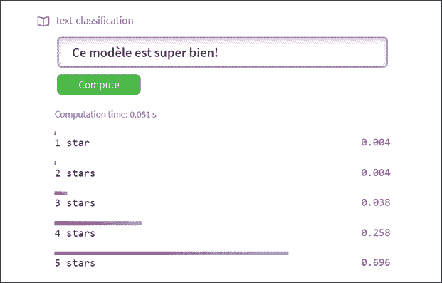

# 十一、检测客户情感以做出预测

情感分析依赖于合成原理。如果我们不能理解一个句子的一部分，我们怎么能理解整个句子呢？对于 NLP 转换器模型来说，这是一项艰巨的任务吗？我们将在本章中尝试几种转换器模型来找出答案。

我们将从**斯坦福情感树库** ( **SST** )开始。SST 提供了包含复杂句子的数据集来分析。分析像`"The movie was great."`这样的句子很容易，如果使用像`"Although the movie was a bit too long, I really enjoyed it."`这样的复杂句子，任务变得非常艰难会发生什么？这个句子是分段的。它迫使转换器模型不仅要理解序列的结构，还要理解它的逻辑形式。

然后，我们将使用复杂的句子和一些简单的句子测试几个 transformer 模型。我们会发现，无论我们尝试哪种模式，如果没有经过足够的训练，都是行不通的。转换器模型和我们一样。他们是需要努力学习并试图达到现实生活中人类基线的学生。

运行 DistilBERT、RoBERTa-large、BERT-base、MiniLM-L12-H84-uncased 和 BERT-base 多语言模型非常有趣！然而，我们会发现这些学生中有一些和我们一样需要更多的训练。

在这个过程中，我们将看到如何使用情感任务的输出来改善客户关系，并以一个可以在您的网站上实现的漂亮的五星界面来结束这一章。

本章涵盖以下主题:

*   用于情感分析的 SST
*   定义长序列的合成性
*   用 AllenNLP (RoBERTa)进行情感分析
*   运行复合句探索转换器新前沿
*   使用拥抱脸情感分析模型
*   用于情感分析的蒸馏瓶
*   试验 MiniLM-L12-H384-未装箱
*   探索罗伯塔-大-曼利
*   查看基于 BERT 的多语言模型

让我们从 SST 开始。

# 入门:情感分析转换器

在这一节中，我们将首先探索 SST，转换器将使用它来训练情感分析模型。

然后，我们将使用 AllenNLP 来运行 RoBERTa-large 转换器。

# 斯坦福情感树库(SST)

*Socher* 等人(2013) 设计了长短语的语义词空间。他们定义了应用于长序列的*合成*原理。组合性原则意味着 NLP 模型必须检查复杂句子的组成表达式以及组合它们的规则，以理解序列的含义。

让我们从 SST 中取一个例子来理解组合性原则的含义。

本节和章节是独立的，因此您可以选择执行所描述的操作，或者阅读章节并查看提供的屏幕截图。

进入互动情感树库:[https://nlp.stanford.edu/sentiment/treebank.html?na=3&nb = 33](https://nlp.stanford.edu/sentiment/treebank.html?na=3&nb=33)。

你可以随意选择。情感树的图表将出现在页面上。点击图片获得情感树:


图 11.1:情感树的图表

对于这个例子，我点击了 6 号图，其中包含一个提到`Jacques Derrida, a pioneer in deconstruction theories in linguistics`的句子。一个长而复杂的句子出现了:

`"Whether or not you're enlightened by any of Derrida's lectures on the other and the self, Derrida is an undeniably fascinating and playful fellow."`

Socher 等人(2013)致力于向量空间和逻辑形式的合成。

例如，定义控制雅克·德里达样本的逻辑规则意味着理解:

*   如何解释单词“`Whether`、“`or`、“`not`”以及将“`Whether`”短语与句子其余部分隔开的逗号。
*   如何理解逗号后的句子第二部分还有另一个“`and`”！

一旦定义了向量空间， *Socher* 等人(2013)就可以生成代表合成性原则的复杂图形。

我们现在可以逐段查看图表。第一段是句子的“`Whether`”段:


图 11.2:复合句中的“是否”部分

这个句子被正确地分成了两个主要部分。第二段也是正确的:


图 11.3:复合句的主要部分

我们可以从 *Socher* 等人(2013)设计的方法中得出几个结论:

*   情感分析不能简化为计算一个句子中的正面词和负面词。
*   转换器模型或任何 NLP 模型必须能够学习组合性原则，以理解复杂句子的成分如何与逻辑形式规则相匹配。
*   transformer 模型必须能够构建一个向量空间来解释复杂句子的微妙之处。

我们现在将把这个理论应用到一个 RoBERTa-large 模型中。

## 使用 RoBERTa-large 进行情感分析

在本节中，我们将使用 AllenNLP 资源来运行一个 RoBERTa-large 转换器。*刘*等(2019)分析了现有的 BERT 模型，发现其训练效果不如预期。考虑到模型生产的速度，这并不奇怪。他们致力于改进 BERT 模型的预训练，以产生一种**稳健优化的 BERT 预训练方法** ( **RoBERTa** )。

让我们首先在`SentimentAnalysis.ipynb`中运行一个 RoBERTa-large 模型。

运行第一个单元以安装`allennlp-models`:

```py
!pip install allennlp==1.0.0 allennlp-models==1.0.0 
```

现在让我们试着运行我们的雅克·德里达样本:

```py
!echo '{"sentence": "Whether or not you're enlightened by any of Derrida's lectures on the other and the self, Derrida is an undeniably fascinating and playful fellow."}' | \

allennlp predict https://storage.googleapis.com/allennlp-public-models/sst-roberta-large-2020.06.08.tar.gz - 
```

输出首先显示 RoBERTa-large 模型的架构，该模型有 24 层和 16 个注意头:

```py
"architectures": [

  "RobertaForMaskedLM"

  ],

  "attention_probs_dropout_prob": 0.1,

  "bos_token_id": 0,

  "eos_token_id": 2,

  "hidden_act": "gelu",

  "hidden_dropout_prob": 0.1,

  "hidden_size": 1024,

  "initializer_range": 0.02,

  "intermediate_size": 4096,

  "layer_norm_eps": 1e-05,

  "max_position_embeddings": 514,

  "model_type": "roberta",

  "num_attention_heads": 16,

  "num_hidden_layers": 24,

  "pad_token_id": 1,

  "type_vocab_size": 1,

  "vocab_size": 50265

} 
```

如有必要，您可以花几分钟时间浏览一下*第 2 章*、*微调 BERT 模型*中 *BERT 模型配置*部分对 BERT 架构的描述，以充分利用该模型。

然后，输出产生情感分析任务的结果，显示输出逻辑和最终的肯定结果:

```py
prediction:  {"logits": [**3.646597385406494**, -2.9539334774017334], "probs": [**0.9986421465873718**, 0.001357800210826099] 
```

输出还包含令牌 id(可能因运行而异)和最终输出标签:

```py
"token_ids": [0, 5994, 50, 45, 47, 769, 38853, 30, 143, 9, 6113, 10505, 281, 25798, 15, 5, 97, 8, 5, 1403, 2156, 211, 14385, 4347, 16, 41, 35559, 12509, 8, 23317, 2598, 479, 2], "label": "1", 
```

输出还显示了令牌本身:

```py
"tokens": ["<s>", "\u0120Whether", "\u0120or", "\u0120not", "\u0120you", "\u0120re", "\u0120enlightened", "\u0120by", "\u0120any", "\u0120of", "\u0120Der", "rid", "as", "\u0120lectures", "\u0120on", "\u0120the", "\u0120other", "\u0120and", "\u0120the", "\u0120self", "\u0120,", "\u0120D", "err", "ida", "\u0120is", "\u0120an", "\u0120undeniably", "\u0120fascinating", "\u0120and", "\u0120playful", "\u0120fellow", "\u0120.", "</s>"]} 
```

花些时间输入一些样本，探索设计良好且经过预训练的 RoBERTa 模型。

现在，让我们看看如何使用情感分析来预测其他 transformer 模型的客户行为。

# 利用情感分析预测客户行为

在本节中，我们将对几个拥抱脸变形模型运行情感分析任务，以查看哪些模型产生最佳结果，哪些模型是我们最喜欢的。

我们将从一个拥抱脸蒸馏模型开始。

## 用 DistilBERT 进行情感分析

让我们用 DistilBERT 运行一个情感分析任务，看看我们如何使用结果来预测客户行为。

打开`SentimentAnalysis.ipynb`并安装转换器和导入电池:

```py
!pip install -q transformers

from transformers import pipeline 
```

我们现在将创建一个名为`classify`的函数，它将使用我们发送给它的序列运行模型:

```py
def classify(sequence,M):

   #DistilBertForSequenceClassification(default model)

    nlp_cls = pipeline('sentiment-analysis')

    if M==1:

      print(nlp_cls.model.config)

    return nlp_cls(sequence) 
```

请注意，如果您将`M=1`发送到该函数，它将显示我们正在使用的`DistilBERT` 6 层 12 头模型的配置:

```py
DistilBertConfig {

  "activation": "gelu",

  "architectures": [

    "DistilBertForSequenceClassification"

  ],

  "attention_dropout": 0.1,

  "dim": 768,

  "dropout": 0.1,

  "finetuning_task": "sst-2",

  "hidden_dim": 3072,

  "id2label": {

    "0": "NEGATIVE",

    "1": "POSITIVE"

  },

  "initializer_range": 0.02,

  "label2id": {

    "NEGATIVE": 0,

    "POSITIVE": 1

  },

  "max_position_embeddings": 512,

  "model_type": "distilbert",

  "n_heads": 12,

  "n_layers": 6,

  "output_past": true,

  "pad_token_id": 0,

  "qa_dropout": 0.1,

  "seq_classif_dropout": 0.2,

  "sinusoidal_pos_embds": false,

  "tie_weights_": true,

  "vocab_size": 30522

} 
```

如果有必要，您可以花几分钟时间浏览一下*第 2 章*、*微调 BERT 模型*中 *BERT 模型配置*部分对 BERT 架构的描述，以充分利用该模型。

这个蒸馏模型的具体参数是标签定义。

我们现在创建一个序列列表(您可以添加更多)，我们可以将它发送给`classify`函数:

```py
seq=3

if seq==1:

  sequence="The battery on my Model9X phone doesn't last more than 6 hours and I'm unhappy about that."

if seq==2:

  sequence="The battery on my Model9X phone doesn't last more than 6 hours and I'm unhappy about that. I was really mad! I bought a Moel10x and things seem to be better. I'm super satisfied now."

if seq==3:

  sequence="The customer was very unhappy"

if seq==4:

  sequence="The customer was very satisfied"

print(sequence)

M=0 #display model cofiguration=1, default=0

CS=classify(sequence,M)

print(CS) 
```

在这种情况下，`seq=3`被激活，以便我们可以模拟我们需要考虑的客户问题。输出为负，这就是我们要找的例子:

```py
[{'label': 'NEGATIVE', 'score': 0.9997098445892334}] 
```

我们可以从这个结果中得出几个结论，通过编写一个函数来预测客户行为，这个函数将:

*   将预测存储在客户管理数据库中。
*   统计客户在一段时间(周、月、年)内对服务或产品的投诉次数。经常抱怨的客户可能会转向竞争对手，以获得更好的产品或服务。
*   发现负面反馈信息中不断出现的产品和服务。产品或服务可能有缺陷，需要质量控制和改进。

您可以花几分钟时间运行其他序列或创建一些序列来探索 DistilBERT 模型。

我们现在将探索其他拥抱脸转换器。

## 基于人脸模型列表的情感分析

在这一部分，我们将探索拥抱脸的转换器模型列表，并输入一些样本来评估他们的结果。这个想法是测试几个模型，而不仅仅是一个，看看哪个模型最适合给定项目的需要。

我们将运行拥抱脸模型:[https://huggingface.co/models](https://huggingface.co/models)。

对于我们使用的每一款模型，你都可以在拥抱脸提供的文档中找到对该模型的描述:[https://huggingface.co/transformers/](https://huggingface.co/transformers/)。

我们将测试几个模型。如果您实现了它们，您可能会发现它们需要针对您希望执行的 NLP 任务进行微调甚至预训练。在这种情况下，对于拥抱面部转换器，您可以执行以下操作:

*   微调可以参考*第二章*、*微调 BERT 模型*
*   关于预训练，您可以参考*第 3 章*、*从头开始预训练 RoBERTa 模型*

让我们先来看看拥抱脸模特的名单:

[https://huggingface.co/models](https://huggingface.co/models)。

然后在**标签:全部**下拉列表中选择**文本分类**；


图 11.4:选择文本分类模型

将出现一个为文本分类而训练的 transformer 模型列表:


图 11.5:拥抱脸预训练文本分类模型

默认排序方式为**排序:最多下载**。

我们现在将搜索一些令人兴奋的转换器模型，我们可以在线测试。

我们将从蒸馏啤酒开始。

### SST 蒸馏瓶

在 SST 上对 `distilbert-base-uncased-finetuned-sst-2-english`模型进行了微调。

让我们尝试一个需要很好理解组合性原则的例子:

`"Though the customer seemed unhappy, she was, in fact satisfied but thinking of something else at the time, which gave a false impression."`

这句话对于一个转换者来说很难分析，需要逻辑规则训练。

输出是假阴性:


图 11.6:复杂序列分类任务的输出

假阴性并不意味着模型工作不正常。我们可以选择另一种模式。然而，这可能意味着我们必须下载和训练它更长更好！

在本书写作的时候，类似伯特的模型在 GLUE 和 SuperGLUE 排行榜上都有不错的排名。排名会不断变化，但转换器的基本概念不会改变。

我们将尝试一个困难但不太复杂的例子。

这个例子对于现实生活中的项目来说是至关重要的一课。例如，当我们试图估计一个客户抱怨了多少次时，我们会得到假阴性和假阳性。在未来几年内，定期的人工干预仍将是强制性的。

让我们试一试 MiniLM 模型。

### MiniLM-L12-H384-未装箱

`MiniLM-L12-H384-uncased` 在 BERT 模型的其他调整中，优化教师的最后一个自我关注层的大小，以获得更好的性能。它有 12 层，12 个头，33M 参数，比 BERT-base 快 2.7 倍。

让我们测试一下它理解组合原则的能力:

`"Though the customer seemed unhappy, she was, in fact satisfied but thinking of something else at the time, which gave a false impression."`

输出很有趣,因为它产生了一个仔细的分割分数:


图 11.7:复合句情感分析

让我们尝试一个包含蕴涵的模型。

### 罗伯塔-大姆利

一个**多体裁自然语言推理** ( **多语种**)[https://cims.nyu.edu/~sbowman/multinli/](https://cims.nyu.edu/~sbowman/multinli/)任务，可以帮助解决一个复杂句子的解释，当我们试图确定客户的意思时。推理任务必须确定一个序列是否包含下一个序列。

我们需要格式化我们的输入，并用序列分割标记分割序列:

`Though the customer seemed unhappy</s></s> she was, in fact satisfied but thinking of something else at the time, which gave a false impression`

结果很有趣，尽管它保持中立:


图 11.8:一个稍微肯定的句子得到的中性结果

但是，这个结果没有错误。第二个序列不是从第一个序列推断出来的。结果小心翼翼的正确。

让我们在一个“积极情感”多语言 BERT-base 模型上完成我们的实验。

### 基于 BERT 的多语言模型

让我们在一个超级酷的伯特模型上进行最后的实验！它设计得非常好。

让我们用一个友好积极的英语句子来运行它:


图 11.9:英语情感分析

让我们用法语和`"Ce modèle est super bien!"` ( `"this model is super good,"`的意思是`"cool"`)来试试:



图 11.10:法语情感分析

这个模特对于抱脸的路径是`nlptown/bert-base-multilingual-uncased-sentiment`。你可以在拥抱脸网站的搜索表格里找到。它现在的链接是[https://hugging face . co/NLP town/Bert-base-multilingual-un cased-sensation？text = Ce+mod % C3 % A8le+est+super+bien % 21](https://huggingface.co/nlptown/bert-base-multilingual-uncased-sentiment?text=Ce+mod%C3%A8le+est+super+bien%21)

您可以使用以下初始化代码在您的网站上实现它:

```py
from transformers import AutoTokenizer, AutoModelForSequenceClassification

tokenizer = AutoTokenizer.from_pretrained("nlptown/bert-base-multilingual-uncased-sentiment")

model = AutoModelForSequenceClassification.from_pretrained("nlptown/bert-base-multilingual-uncased-sentiment") 
```

这需要一些时间和耐心，但结果可能会超级酷！

您可以在您的网站上实现这个转换器，以平均化您的客户的全球满意度！您也可以将它作为持续的反馈来改善您的客户服务，并预测客户的反应。

# 摘要

在这一章中，我们学习了一些高级理论。组合性原则不是一个直观的概念。组合性原则意味着转换器模型必须理解句子的每一部分才能理解整个句子。这涉及到逻辑形式规则，它将提供句子片段之间的联系。

情感分析的理论难度需要大量的转换器模型训练，强大的机器，人力资源。尽管许多 transformer 模型针对许多任务进行了训练，但是它们通常需要针对特定任务进行更多的训练。

我们测试了`RoBERTa-large`、`DistilBERT`、`MiniLM-L12-H384-uncased`，以及优秀的`BERT-base multilingual` 型号。我们发现有些提供了有趣的答案，但需要更多的训练来解决我们在几个模型上运行的 SST 样本。

情感分析需要对一个句子和极其复杂的序列有深刻的理解。尝试`RoBERTa-large-mnli`看看干扰任务会产生什么是有意义的。这里的教训是不要墨守成规，像转换器模型这样非常规的东西！尝试一切。在不同的任务中尝试不同的模型。转换器的灵活性允许我们在同一个模型上尝试许多不同的任务，或者在许多不同的模型上尝试相同的任务。

最后，我们收集了一些改善客户关系的想法。如果我们发现一个客户经常不满意，这个客户可能会去找我们的竞争对手。如果几个客户抱怨一个产品或服务，我们必须预测未来的问题，并改善我们的服务。我们还可以通过在线实时显示转换器的反馈来展示我们的服务质量。

在下一章，*第 12 章*，*用转换器分析假新闻*，我们将使用情感分析来分析对假新闻的情感反应。

# 问题

1.  没有必要为情感分析预先训练转换器。(对/错)
2.  一个句子总是肯定或否定的。它不可能是中立的。(对/错)
3.  组合性原则意味着转换者必须抓住句子的每一部分才能理解它。(对/错)
4.  RoBERTa-large 旨在改进转换器模型的预处理过程。(对/错)
5.  转换器可以提供反馈，告知我们客户是否满意。(对/错)
6.  如果对产品或服务的情感分析一直是负面的，这有助于我们做出正确的决定来改进我们的产品。(对/错)
7.  如果一个模型不能在一项任务中提供好的结果，在改变模型之前需要更多的训练。(对/错)

# 参考

*   *理查德·索彻*，*亚历克斯·佩雷金*，*让·吴*，*杰森·庄*，*克里斯托弗·曼宁*，*吴恩达*，*克里斯托弗·波茨*，*情感树库语义复合递归深度模型*:[https://nlp.stanford.edu/~socherr/EMNLP2013_RNTN.pdf](https://nlp.stanford.edu/~socherr/EMNLP2013_RNTN.pdf)
*   拥抱脸管道、模型和文档:[https://hugging Face . co/transformers/main _ classes/pipelines . html](https://huggingface.co/transformers/main_classes/pipelines.html)
*   [https://huggingface.co/models](https://huggingface.co/models)
*   [https://huggingface.co/transformers/](https://huggingface.co/transformers/ )
*   *刘*，*齐丹陈*，*奥梅尔列维*，*迈克·刘易斯*，*卢克·泽特莱莫耶*，*韦塞林·斯托扬诺夫*，2019，*罗伯塔:一种鲁棒优化的 BERT 预训练方法*:[https://arxiv.org/pdf/1907.11692.pdf](https://arxiv.org/pdf/1907.11692.pdf)
*   艾伦人工智能研究所:【https://allennlp.org/ 
*   艾伦阅读理解研究所资源:[https://demo.allennlp.org/sentiment-analysis](https://demo.allennlp.org/sentiment-analysis)
*   *罗伯塔-大贡献*，*吴赵峰*:【https://zhaofengwu.github.io/】T4
*   *斯坦福情感树库*:【https://nlp.stanford.edu/sentiment/treebank.html 