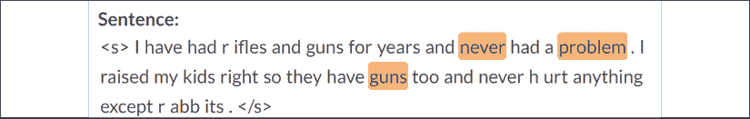
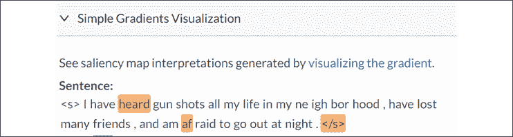

# Twelve

# 用转换器分析假新闻

我们生来都认为地球是平的。婴儿时期，我们在平面上爬行。作为幼儿园的孩子，我们在平坦的操场上玩耍。小学的时候，我们坐在平面教室里。然后，我们的父母和老师告诉我们，地球是圆的，地球另一边的人是颠倒的。我们花了很长时间才明白为什么它们没有从地球上掉下来。即使在今天，当我们看到美丽的日落时，我们仍然看到“日落”，而不是地球远离太阳旋转！

搞清楚什么是假新闻，什么不是，需要时间和精力。像孩子一样，我们不得不通过我们认为是假新闻的东西来解决问题。

在这一章中，我们将讨论当今的热门话题。我们将努力核实气候变化、枪支管制和唐纳德·特朗普的推文等主题的事实。我们将分析推特、脸书帖子和其他信息来源。

我们的目标当然不是评判任何人或任何事。假新闻既涉及观点，也涉及事实。新闻往往取决于当地文化对事实的认知。我们将提供想法和工具来帮助其他人收集关于某个主题的更多信息，并在我们每天收到的信息丛林中找到他们的路。

我们将首先定义引导我们对假新闻做出感性和理性反应的途径。

然后我们将定义一些用转换器和试探法识别假新闻的方法。

我们将使用我们在前几章建立的资源来理解和解释假新闻。我们不会评判。我们将提供解释新闻的变压器模型。有些人可能更喜欢创建一个通用的绝对转换模型来检测和断言消息是假新闻。我选择用转换器教育用户，而不是说教。这种做法是我的看法，不是事实！

本章涵盖以下主题:

*   认知失调
*   对假新闻的情绪反应
*   假新闻的行为表现
*   理性看待假新闻
*   假新闻解决路线图
*   将情感分析转换器任务应用于社交媒体
*   分析 NER 和 SRL 对枪支管制的看法
*   利用转换器提取的信息寻找可靠网站
*   使用变压器产生教育目的的结果
*   如何用客观但批判的眼光阅读前总统特朗普的推文

我们的第一步将是探索对假新闻的情感和理性反应

# 对假新闻的情绪反应

人类行为对我们的社会、文化和经济决策有着巨大的影响。我们的情绪对经济的影响不亚于理性思维。行为经济学推动着我们的决策过程。我们购买消费品，不仅是生理上的需要，也是为了满足情感上的欲望。我们甚至可能会一时冲动买一部智能手机，尽管它超出了我们的预算。

我们对假新闻的情绪和理性反应取决于我们对到来的信息是缓慢思考还是快速反应。*丹尼尔·卡内曼*在他的研究和他的书*思考，快与慢* (2013)中描述了这个过程。他和*因行为经济学研究获得*经济学*诺贝尔奖*。行为驱动我们以前认为合理的决定。我们的很多决定都是基于情感，而不是理智。**

 *让我们将这些概念转化为应用于假新闻的行为流程图。

## 认知失调引发情绪反应

认知失调驱使假新闻登上推特、脸书和其他社交媒体平台的顶端。如果每个人都同意推特的内容，什么都不会发生。如果有人在推特上写道，“气候变化很重要”，没人会有反应。

当我们头脑中矛盾的想法之间的紧张关系累积起来时，我们就进入了认知失调的状态。我们变得紧张、焦虑，这就像烤面包机短路一样让我们疲惫不堪。

2021 年我们有很多例子可以思考！我们应该和新冠肺炎一起戴面具吗？新冠肺炎封锁是好事还是坏事？冠状病毒疫苗有效吗？还是冠状病毒疫苗危险？认知失调就像一个音乐家在演奏一首简单的歌曲时不断出错。它让我们疯狂！

假新闻综合症会成倍增加认知失调！一位专家会断言疫苗是安全的，而另一位专家则认为我们需要小心。一位专家说，在户外戴口罩是没有用的，另一位专家在一个新闻频道上断言，我们必须戴口罩！双方互相指责对方是假新闻！

似乎一方的假新闻中有很大一部分是另一方的真相！

我们现在是 2021 年 1 月，美国共和党和民主党仍然没有就 2020 年 11 月的选举结果达成一致！双方都指责对方是“假新闻”

我们可以打开一份报纸，然后在另一份对立的报纸上阅读另一种观点，进而找到许多其他的话题。本章的一些常识性前提可以从这些例子中得出:

*   试图找到一个能够自动检测假新闻的 transformer 模型是没有意义的。在社交媒体和多元文化表达的世界里，每个群体都有一种知道真相的感觉，另一个群体在表达假新闻。
*   试图将我们的观点作为真理从一种文化表达到另一种文化是没有意义的。在一个全球化的世界里，每个国家、每个大洲以及社交媒体上的每个地方，文化都各不相同。
*   假新闻绝对是一个神话。
*   我们需要为假新闻找到一个更好的定义。

我的看法(当然不是事实！)就是假新闻是一种认知失调的状态，只能通过认知推理来解决。解决假新闻的问题就像试图解决两方之间或我们自己头脑中的冲突一样。

在这一章和生活中，我的建议是分析每一个冲突的张力；用转换器模型解构冲突和想法。我们不是在“打击假新闻”、“寻找内心的平静”，也不是假装用转换器寻找“反对假新闻的绝对真相”。

我们使用转换器来获得对一系列单词(一条信息)的更深入的理解，以形成对一个主题的更深刻和更广泛的观点。

一旦这样做了，让变压器模型的幸运用户获得一个更好的愿景和意见。

为了做到这一点，我把这一章设计成一个课堂练习，供我们自己和他人使用。转换器是加深我们对语言序列的理解、形成更广泛的观点以及发展我们认知能力的一个好方法。

让我们先来看看当有人发布一条有冲突的推文时会发生什么。

### 分析有冲突的推文

以下推文是推特上发布的一条真实消息(我转述了它)。本章中显示的推文是原始数据集格式，而不是 Twitter 界面显示。可以肯定的是，如果一位政治领袖或著名演员在推特上发布内容，许多人会不同意:

`Climate change is bogus. It's a plot by the liberals to take the economy down.`

这会引发情绪反应。推文会堆积在四面八方。它会成为病毒和潮流！

让我们在 transformer tools 上运行这条推文，以了解这条推文如何在某人的头脑中造成认知失调风暴。

打开`Fake_News.ipynb`，我们将在本节中使用的笔记本。

我们将从艾伦人工智能研究所的资源开始。我们将运行我们在*第 11 章*、*中用于情绪分析的 RoBERTa transformer 模型，检测客户情绪以做出预测*。

我们将首先安装`allennlp-models`:

```py
!pip install allennlp==1.0.0 allennlp-models==1.0.0 
```

然后，我们运行下一个单元格来分析推文:

```py
!echo '{"sentence":"Climate change is bogus. It's a plot by the liberals to take the economy down."}' | \

allennlp predict https://storage.googleapis.com/allennlp-public-models/sst-roberta-large-2020.06.08.tar.gz - 
```

输出显示 Tweet 是负面的。正值为`0`，负值在`1`附近:

```py
"probs": [0.0008486526785418391, **0.999151349067688**] 
```

我们现在将前往[https://allennlp.org/](https://allennlp.org/)获取分析的可视化表示。

从一次运行到另一次运行，输出可能会发生变化。变压器模型不断地被训练和更新。我们在这一章的目标是关注变压器模型的推理。

我们选择**情绪分析**(【https://demo.allennlp.org/sentiment-analysis】T2)并选择**罗伯塔模型**来运行分析。

我们得到相同的否定结果。然而，我们可以进一步调查，看看是什么话影响了罗伯塔的决定。

转到**模型解释**，然后点击**简单渐变可视化**以获得以下表示:


图 12.1:可视化最重要的单词

令人惊讶的是，"`climate` " + " `is` " + " `bogus`"对结果的影响最大。“`plot`的政治面来了之后。

在这一点上，你可能会奇怪，为什么我们要用这么简单的例子来解释认知失调。解释来自下一条推文。

一位坚定的共和党人写了第一条推文。让我们称这个成员为“T0”令他惊讶的是，一位共和党人发了以下推文:

`I am a Republican and think that climate change consciousness is a great thing!`

这条推文来自一个我们称之为“`Hunt78`”的成员让我们在`Fake_News.ipynb`中运行这句话:

```py
!echo '{"sentence":"I am a Republican and think that climate change consciousness is a great thing!"}' | \

allennlp predict https://storage.googleapis.com/allennlp-public-models/sst-roberta-large-2020.06.08.tar.gz - 
```

当然，输出是正的:

```py
"probs": [0.9994876384735107, 0.0005123814917169511] 
```

一场认知不和谐的风暴正在`Jaybird65`的头脑中形成。他喜欢`Hunt78`但不同意。一场思想风暴正在形成！如果你阅读了`Jaybird65`和`Hunt78`之间的后续推文，你会发现一些伤害了`Jaybird65`感情的惊人事实:

*   `Jaybird65`和`Hunt78`明显认识。
*   如果你去看他们各自的推特账号，你会发现他们都是猎人。
*   你可以看到他们都是坚定的共和党人。
*   `Jaybird65`的第一条推文来自于他对《纽约时报》的一篇文章的反应，这篇文章称气候变化正在毁灭地球。

`Jaybird65`颇为不解。他能看出`Hunt78`和他一样是共和党人。他也是一个猎人。`Hunt78`怎么会相信气候变化？

这条推特上有大量愤怒的推文。

然而，我们可以看到，假新闻讨论的根源在于对新闻的情绪反应。应对气候变化的合理方法很简单:

*   不管原因是什么，气候正在发生变化。
*   我们不需要通过降低经济来改变人类。
*   我们需要继续制造电动汽车，在大城市有更多的步行空间，以及更好的农业习惯。我们只需要以最有可能产生收入的新方式开展业务。

但是人类的情感是强烈的！

让我们来代表从新闻引导到情绪和理性反应的过程。

### 假新闻的行为表征

假新闻从情绪反应开始，逐渐积累，并经常导致人身攻击。

*图 12.2* 表示当认知失调阻碍我们的思维过程时，对假新闻的三阶段情绪反应路径:

**第一阶段:新消息**

两个人或两群人对他们通过各自媒体获得的新闻做出反应:脸书、推特、其他社交媒体、电视、广播、网站。每个信息来源都包含有偏见的观点。

**第二阶段:共识**

两个人或两群人可以同意也可以不同意。如果他们不同意，我们将进入第三阶段，在此期间冲突可能会加剧。

如果他们同意，这种共识就阻止了热度的积聚，这个消息就被接受为“`real`”新闻。然而，即使各方都相信他们收到的消息不是假的，这并不意味着消息不是假的。以下是解释标有“`not fake news`”的新闻可能是假新闻的一些原因:

*   在 12 世纪早期，大多数欧洲人都认为地球是宇宙的中心，太阳系绕着地球旋转。
*   1900 年，大多数人认为永远不会有能飞越海洋的飞机。
*   2020 年 1 月，大多数欧洲人认为新冠肺炎病毒只影响中国，而不是全球的疫情。

底线是，两党甚至整个社会的共识，并不意味着进来的消息不是假的。如果双方意见不一致，这将导致冲突:


图 12.2:从新闻到假新闻冲突的路径图

让我们面对现实吧。在社交媒体上，成员通常会与其他有相同想法的人汇合，无论如何也很少改变主意。这种表现表明，通常情况下，一个人会坚持自己在推文中表达的观点，一旦有人质疑他们的观点，冲突就会升级！

第三阶段:冲突

假新闻冲突可以分为四个阶段:

*   **3.1** 。冲突始于分歧。每一方都将在脸书或其他平台上发布消息。几次交流之后，冲突可能会消失，因为双方对这个话题都不感兴趣。
*   **3.2** 。如果我们回到`Jaybird65`和`Hunt78`之间的气候变化讨论，我们知道事情会变得很糟糕。对话正在升温！
*   **3.3** 。在某一点上，不可避免地，一方的论点会成为假新闻。`Jaybird65`会生气，在无数的推文中表现出来，说人类导致的气候变化是假新闻。`Hunt78`会生气说否认人类对气候变化的贡献是假新闻。
*   **3.4** 。这些讨论往往以人身攻击告终。戈德温定律经常出现在对话中，即使我们不知道它是如何出现的。戈德温定律指出，在谈话的某一点上，一方会找到最糟糕的参考来描述另一方。它有时表现为“你们这些自由主义者就像希特勒一样，试图用气候变化来迫使我们的经济下滑。”这种类型的信息可以在推特、脸书和其他平台上看到。它甚至出现在总统气候变化演讲的实时聊天中。

有没有一种理性的方法来对待这些讨论，可以安抚双方，让他们冷静下来，至少达成一个折中的共识来向前推进？

让我们试着用转换器和试探法建立一个理性的方法。

# 理性看待假新闻

转换器是有史以来最强大的自然语言处理工具。在本节中，我们将首先定义一种方法，可以将假新闻冲突的双方从情感层面提升到理性层面。

然后，我们将使用转换器工具和试探法。我们将在新冠肺炎疫情期间运行枪支管制和前总统川普推文的转换器样本。我们还将描述可以用经典函数实现的试探法。

您可以实现这些 transformer NLP 任务或您选择的其他任务。在任何情况下，路线图和方法都可以帮助老师、父母、朋友、同事和任何寻求真理的人。你的工作永远是值得的！

让我们从理性对待假新闻的路线图开始，包括转换器。

## 定义假新闻解决路线图

*图 12.3* 定义了理性假新闻分析过程的路线图。该流程包含 transformer NLP 任务和传统功能:


图 12.3:从对假新闻的情绪反应到理性表现

我们看到，一旦情绪反应开始，理性过程几乎总是会开始。理性的过程必须尽快开始，以避免积累情绪化的反应，从而打断讨论。

第 3 阶段现在包含四个工具:

*   **3.1** 。情感分析来分析排名靠前的“情感”正面或负面词汇。我们将使用`AllenNLP.org`资源在我们的`Fake_News.ipynb`笔记本中运行 RoBERTa-large transformer。我们将使用 AllenNLP.org 的可视化工具来可视化关键词和解释。我们在*第 11 章*、*中介绍了情绪分析，检测客户情绪以做出预测*。
*   **3.2** 。**命名实体识别** ( **NER** )为*阶段 3.4* 从社交媒体消息中提取实体。我们在第 10 章、*让你的数据说话:故事、问题和答案*中描述了 NER。我们将使用拥抱脸的伯特变压器模型的任务。我们将使用 AllenNLP.org 的可视化工具来可视化实体和解释。
*   **3.3** 。**语义角色标注** ( **SRL** )为*阶段 3.4* 标注来自社交媒体消息的动词。我们在*第 9 章*、*用基于 BERT 的转换器进行语义角色标注*中描述了 SRL。我们将在`Fake_News.ipynb`中使用 AllenNLP 的 BERT 模型。我们将使用 AllenNLP.org 的可视化工具来可视化标注任务的输出。
*   **3.4** 。参考可靠的网站将被描述，以显示如何经典编码可以帮助。

让我们从枪支管制开始。

## 枪支管制

美国宪法第二修正案主张下列权利:

`A well regulated Militia, being necessary to the security of a free State, the right of the people to keep and bear Arms, shall not be infringed.`

几十年来，美国在这个问题上一直存在分歧:

*   一方面，许多人认为携带枪支是他们的权利，他们不想忍受枪支管制。他们认为持有武器会引发暴力是假新闻。
*   另一方面，许多人认为携带枪支是危险的，如果没有枪支管制，美国将仍然是一个暴力国家。他们认为声称携带武器不危险是假新闻。

我们需要帮助每一方。先说情绪分析。

### 情感分析

如果你阅读推文、脸书的消息、演讲期间的 YouTube 聊天，或者任何其他社交媒体，你会看到党派正在进行一场激烈的战斗。你不需要电视节目。你可以吃你的爆米花，因为推特上的争斗会让政党分裂！

让我们看看一方的推特和另一方的脸书信息。我更改了成员的名字并转述了文本(考虑到信息中的侮辱，这是个不错的主意)。让我们从支持枪支的推特开始:

#### 支持枪支的分析

这条推文是一个人的真实观点:

`Afirst78: I have had rifles and guns for years and never had a problem. I raised my kids right so they have guns too and never hurt anything except rabbits.`

让我们在`Fake_News.ipynb`中运行这个:

```py
!echo '{"sentence": "I have had rifles and guns for years and never had a problem. I raised my kids right so they have guns too and never hurt anything except rabbits."}' | \

allennlp predict https://storage.googleapis.com/allennlp-public-models/sst-roberta-large-2020.06.08.tar.gz - 
```

预测是积极的:

```py
prediction:  {"logits": [1.9383275508880615, -1.6191326379776], "probs": [0.9722791910171509, 0.02772079035639763] 
```

我们现在将在`AllenNLP.org`上可视化结果。 **SmoothGrad 可视化**提供了最好的解释:



图 12.4:句子的 SmoothGrad 可视化

说明显示`Afirst78``never`“+”`problem`“+”【T3。”

结果可能会随着时间的推移而变化。变压器模型不断地被训练和更新。然而，本章的重点是过程，而不是具体的结果。

我们将在每一步收集想法和功能。`Fake_News_FUNCTION_1`是本节的第一个功能:

`Fake_News_FUNCTION_1`:`never`"+"`problem`"+"`guns`"可以提取并标注，以便进一步分析。

我们现在将分析`NYS99`的观点，枪支必须得到控制。

#### 枪支控制分析

`NYS99: "I have heard gunshots all my life in my neighborhood, have lost many friends, and am afraid to go out at night."`

让我们首先运行`Fake_News.ipynb`中的分析:

```py
!echo '{"sentence": "I have heard gunshots all my life in my neighborhood, have lost many friends, and am afraid to go out at night."}' | \

allennlp predict https://storage.googleapis.com/allennlp-public-models/sst-roberta-large-2020.06.08.tar.gz - 
```

结果自然是负面的:

```py
prediction:  {"logits": [-1.3564586639404297, **0.5901418924331665**], "probs": [0.12492450326681137, **0.8750754594802856**] 
```

让我们使用 AllenNLP 在线查找关键词。我们运行示例，可以看到**简单渐变可视化**提供了最佳结果:



图 12.5:句子的简单渐变可视化

本节功能 2 的关键字为“`heard`”+“`afraid`”:

`Fake_News_FUNCTION_2`:`heard`"+"`afraid`"+"`guns`"可以提取并标注，以便进一步分析。

如果我们现在把我们的两个职能放在一起，我们就能清楚地理解为什么这两个政党在互相争斗:

*   `Fake_News_FUNCTION_1`: "`never`" + "`problem`" + "`guns`."

    可能住在美国中西部的一个州。许多这样的州人口少，非常安静，犯罪率也很低。`Afirst78`可能从未去过大城市，享受乡村宁静生活的乐趣。

*   `Fake_News_FUNCTION_2`: "`heard`" + "`afraid`" + "`guns`"

    可能住在大城市或美国大城市的更大区域。犯罪率往往很高，暴力是日常现象。`NYS99`可能从未去过中西部的州，也没见过`Afirst78`的生活。

这两个诚实但有力的观点证明了为什么我们需要实施我们在本章中描述的解决方案。更好的信息是减少假新闻斗争的关键。

我们将遵循我们的过程，并将命名实体识别应用于我们的句子。

### 命名实体识别(NER)

本章旨在说明，通过使用几种转换方法，用户可以从不同的角度更广泛地理解信息。在生产模式下，一个 HTML 页面可以总结本章的转换器方法，甚至包含其他转换器任务。

我们现在必须将我们的流程应用于 Tweet 和脸书消息，尽管我们在消息中看不到任何实体。然而，程序并不知道这一点。我们将只运行第一条消息来说明流程的这一步。

我们将首先安装拥抱脸变压器:

```py
!pip install -q transformers

from transformers import pipeline

from transformers import AutoTokenizer, AutoModelForSequenceClassification,AutoModel 
```

现在，我们可以运行第一条消息:

```py
nlp_token_class = pipeline('ner')

nlp_token_class('I have had rifles and guns for years and never had a problem. I raised my kids right so they have guns too and never hurt anything except rabbits.') 
```

输出不会产生任何结果，因为没有实体。

在继续之前，让我们检查一下我们正在使用的模型:

```py
nlp_token_class.model.config 
```

输出显示该模型使用 9 个标签和 1，024 个特征用于关注层:

```py
BertConfig {

  "_num_labels": 9,

  "architectures": [

    "BertForTokenClassification"

  ],

  "attention_probs_dropout_prob": 0.1,

  "directionality": "bidi",

  "hidden_act": "gelu",

  "hidden_dropout_prob": 0.1,

  "hidden_size": 1024,

  "id2label": {

    "0": "O",

    "1": "B-MISC",

    "2": "I-MISC",

    "3": "B-PER",

    "4": "I-PER",

    "5": "B-ORG",

    "6": "I-ORG",

    "7": "B-LOC",

    "8": "I-LOC"

  }, 
```

我们使用的是 BERT 24 层变压器模型。如果您希望探索架构，请运行`nlp_token_class.model`。

我们现在将对消息运行 SRL。

### 语义角色标签(SRL)

我们将继续按照笔记本中的顺序逐个单元格地运行`Fake_News.ipynb`。我们将研究这两种观点。

先说一个亲枪视角。

#### 亲枪炮 SRL

我们将首先运行`Fake_News.ipynb`中的后续单元格:

```py
!echo '{"sentence": "I have had rifles and guns for years and never had a problem. I raised my kids right so they have guns too and never hurt anything except rabbits."}' | \

allennlp predict https://storage.googleapis.com/allennlp-public-models/bert-base-srl-2020.03.24.tar.gz - 
```

输出非常详细，如果您希望详细研究或解析标签，可能会很有用，如以下摘录所示:

```py
prediction:  {"verbs": [{"verb": "had", "description": "[ARG0: I] have [V: had] [ARG1: rifles and guns] [ARGM-TMP: for years] and never had a problem ... 
```

现在让我们进入**语义角色标记**部分的`AllenNLP.org`的视觉细节。我们首先为此消息运行 SRL 任务。

第一个动词`had`，表示`Afirst78`是一位*经验丰富的枪主*:


图 12.6:动词“had”的 SRL

“`had`”的说法总结了`Afirst78`的经验:“`I`”+“`rifles and guns`”+“`for years`”

“`raised`”的论点展示了`Afirst78`的父母经历:


图 12.7: SRL 动词和动词“提高”的参数

论据解释了许多支持持枪的立场:“`my kids`”+“`have guns`”+“`never hurt anything`”

当点击**文本**时，动词`hurt`遵循在 SRL 任务的格式化文本版本中看到的相同思路:

```py
[ARGM-NEG: never] [V: hurt] [ARG1: anything except rabbits]. 
```

我们可以通过一些解析将这里发现的内容添加到我们的函数集合中:

*   `Fake_News_FUNCTION_3`:`I`"+"`rifles and guns`"+"`for years`"
*   `Fake_News_FUNCTION_4`:`my kids`"+"`have guns`"+"`never hurt anything`"

现在让我们来探讨一下枪支管制的信息。

#### SRL 枪支管制

我们将首先在`Fake_New.ipynb`中运行脸书消息。我们将继续按照在笔记本中创建的顺序逐个单元地运行笔记本:

```py
!echo '{"sentence": "I have heard gunshots all my life in my neighborhood, have lost many friends, and am afraid to go out at night."}' | \

allennlp predict https://storage.googleapis.com/allennlp-public-models/bert-base-srl-2020.03.24.tar.gz - 
```

结果详细标记了序列中的关键动词，如以下摘录所示:

```py
prediction:  {"verbs": [{"verb": "heard", "description": "[ARG0: I] have [V: heard] [ARG1: gunshots all my life in my neighborhood]" 
```

我们继续应用我们的流程，转到`AllenNLP.org`，然后到**语义标注部分**。我们输入句子并运行 transformer 模型。动词“`heard`”显示了这一信息的严峻现实:


图 12.8:动词“听见”的 SRL 表征

我们可以快速解析第五个函数的单词:

*   `Fake_News_FUNCTION_5`:`heard`"+"`gunshots`"+"`all my life`"

动词“`lost`”表示与之相关的重要论元:


图 12.9:动词“丢失”的 SRL 表征

我们有了第六个功能所需的东西:

*   `Fake_News_FUNCTION_6`:`lost`"+"`many`"+"`friends`"

一旦不同的变压器模型阐明了信息的每个方面，向用户建议参考站点是很好的。

### 参考网站

我们已经在 NLP t asks 上运行了转换器，并描述了传统的启发式硬编码，需要对其进行开发以解析数据并生成六个函数:

*   **亲炮**:`Fake_News_FUNCTION_1`:`never`"+"`problem`"+"`guns`"
*   **控枪**:`Fake_News_FUNCTION_2`:`heard`"+"`afraid`"+"`guns`"
*   **亲炮**:`Fake_News_FUNCTION_3`:`I`"+"`rifles and guns`"+"`for years`"
*   **亲炮**:`Fake_News_FUNCTION_4`:`my kids`"+"`have guns`"+"`never hurt anything`"
*   **控枪**:`Fake_News_FUNCTION_5`:`heard`"+"`gunshots`"+"`all my life`"
*   **控枪**:`Fake_News_FUNCTION_6`:`lost`"+"`many`"+"`friends`"

让我们重新组织列表，将两种观点分开，得出一些结论来决定我们的行动。

#### 支持枪支和枪支管制

支持枪支的论点是诚实的，但它们表明缺乏关于美国主要城市正在发生什么的信息:

*   **亲炮**:`Fake_News_FUNCTION_1`:`never`"+"`problem`"+"`guns`"
*   **亲炮**:`Fake_News_FUNCTION_3`:`I`"+"`rifles and guns`"+"`for years`"
*   **亲炮**:`Fake_News_FUNCTION_4`:`my kids`"+"`have guns`"+"`never hurt anything`"

枪支管制的争论是诚实的，但是他们表明缺乏关于中西部大部分地区有多安静的信息:

*   **控枪**:`Fake_News_FUNCTION_2`:`heard`"+"`afraid`"+"`guns`"
*   **控枪**:`Fake_News_FUNCTION_5`:`heard`"+"`gunshots`"+"`all my life`"
*   **控枪**:`Fake_News_FUNCTION_6`:`lost`"+"`many`"+"`friends`"

可以开发每个功能来通知另一方。

比如我们拿`FUNCTION1`来说，用伪代码表达:

```py
Def FUNCTION1:

call FUNCTIONs 2+5+6 Keywords and simplify

Google search=afraid guns lost many friends gunshots 
```

该流程的目标是:

*   首先，运行 transformer 模型来解构和解释消息。NLP 变压器就像一个数学计算器。它们可以产生好的结果，但是需要一个自由思考的人类头脑来解释它们！
*   然后让一个训练有素的 NLP 用户*积极主动，搜索*和*更好地阅读*信息。

变压器模型是为了帮助用户更深入地理解信息，而不是为他们思考！我们是在努力帮助用户，而不是说教或给他们洗脑！

需要解析来处理函数的结果。然而，如果我们有数百条社交媒体消息，我们可以自动让我们的程序完成全部工作。

出现的第一个链接对支持枪支的倡导者来说很有趣:


图 12.10:枪支和暴力

假设我们正在用下面的伪代码搜索枪支管制倡导者:

```py
Def FUNCTION2:

call FUNCTIONs 1+3+4 Keywords and simplify

Google search=never problem guns for years kids never hurt anything 
```

谷歌搜索没有返回支持枪支倡导者的明确正面结果。最有趣的是中性的，有教育意义的:


图 12.11:枪的安全性

你可以在亚马逊的书店、杂志和其他教育材料上进行自动搜索。

最重要的是，有相反想法的人互相交谈而不打架是必不可少的。相互理解是发展双方同理心的最好方法。

人们可能会倾向于信任社交媒体公司。我的建议是永远不要让第三方代理你的思维过程。使用变压器模型解构信息，但保持积极主动！

关于这个话题的一个共识可能是，不管你怎么想，拥有枪支的底线要么是不要在家里拥有枪支，要么是把它们安全地锁起来，这样孩子们就无法接触到它们。

让我们继续关注新冠肺炎和前总统川普的推特。

## 新冠肺炎和前总统川普的推文

唐纳德·特朗普说了太多关于他的话，以至于需要一本书来分析所有的信息！这是一本技术书，不是政治书，所以我们将重点放在科学地分析推文上。

在本章的*枪支管制*部分，我们描述了一种对付假新闻的教育方法。我们不需要再次经历整个过程。

我们在*枪支控制*部分的`Fake_News.ipynb`笔记本中用 BERT 模型实现并运行了 AllenNLP 的 SRL 任务。

在这一节，我们将重点讨论假新闻的逻辑。我们将在 SRL 上运行 BERT 模型，并在`AllenNLP.org`可视化结果。

现在，让我们来看一些关于新冠肺炎的总统推特。

### 语义角色标签(SRL)

SRL 对我们所有人来说都是一个极好的教育工具。我们往往只是被动地阅读推文，并听取别人对它们的评论。用 SRL 分解信息是培养社交媒体分析技能的好方法，可以区分虚假和准确的信息。

我建议在课堂上使用 SRL 变压器作为教学用途。一个年轻的学生可以输入一条推文，并分析每个动词及其论点。它可以帮助年轻一代成为社交媒体上的活跃读者。

我们将首先分析一条相对完整的推文，然后分析一条有冲突的推文:

让我们分析一下在写这本书的时候在 7 月 4 日发现的最新推文。我把那个被称为“美国黑人”的人的名字拿了出来，并转述了前总统的一些话:

`"X is a great American, is hospitalized with coronavirus, and has requested prayer. Would you join me in praying for him today, as well as all those who are suffering from COVID-19?"`

让我们转到`AllenNLP.org`、**语义角色标注**部分，运行句子，看看结果。动词“`hospitalized`”表示该成员贴近事实:


图 12.12:动词“住院”的 SRL 参数

信息很简单:“`X`”+“`hospitalized`”+“`coronavirus`”

动词“`requested`”表明信息正变得政治化:


图 12.13:动词“被请求”的 SRL 参数

我们不知道这个人是要求前总统祈祷，还是他决定让自己成为请求的中心。

一个很好的练习是显示一个 HTML 页面并询问用户他们的想法。例如，可以要求用户查看 SRL 任务的结果，并回答以下两个问题:

`"Was former President Trump asked to pray, or did he deviate a request made to others for political reasons?"`

`"Is the fact that former President Trump states that he was indirectly asked to pray for X fake news or not?"`

你可以考虑一下，自己决定！

我们来看看一个被 Twitter 封禁的。我把这些名字拿了出来，解释了一下，并缓和了语气。然而，当我们在`AllenNLP.org`上运行它并可视化结果时，我们得到了一些令人惊讶的 SRL 输出。

以下是经过缓和和转述的推文:

`These thugs are dishonoring the memory of X.`

`When the looting starts, actions must be taken.`

虽然我隐藏了原始推文的主要部分，但我们可以看到 SRL 任务显示了推文中产生的不良联想:


图 12.14:动词“不名誉”的 SRL 论点

一种教育方法是解释我们不应该把论点“`thugs`”和“`memory`”和“`looting`”联系起来他们根本不适合在一起。

一个重要的练习是询问用户为什么 SRL 论证不一致。

我推荐许多这样的练习，以便 transformer 模型用户开发 SRL 技能，对呈现给他们的任何主题都有批判性的观点。

批判性思维是阻止假新闻疫情传播的最好方法！

我们已经通过转换器、启发式和指导性网站对假新闻进行了理性的处理。然而，最终，假新闻辩论中的许多热点归结为情绪化和非理性的反应。

在舆论的世界里，你永远也找不到一个完全客观的变压器模型来检测假新闻，因为对立双方从来不会在第一时间就真相达成一致！一方将同意变压器模型的输出。另一个人会说这个模型是有偏见的，是由他们的敌人建立的！

最好的方法是倾听别人的意见，尽量保持冷静。

# 在我们走之前

这一章更侧重于应用变压器解决问题，而不是寻找一个银弹变压器模型，这是不存在的。

解决 NLP 问题有两个主要选择:找到新的转换器模型，或者创建可靠、持久的方法来实现转换器模型。

## 寻找银弹

寻找一个银弹变压器模型可能会很费时间，也可能会有回报，这取决于你想在不断变化的模型上花费多少时间和金钱。

例如，可以通过*解开*找到一种新的变压器方法。*人工智能中的*可以让你分离一个表象的特征，使训练过程更加灵活。*彭城何*、*、*、*高剑锋*、*陈*设计了 DeBERTa，一个变压器的解绑版，并在一篇有趣的文章中描述了这个模型:

*德贝塔:解码增强注意力不纠缠的伯特*，【https://arxiv.org/abs/2006.03654】T2

DeBERTa 实施的两个主要理念是:

*   解开变压器模型中的内容和位置，以分别训练两个向量。
*   在预训练过程中，使用解码器中的绝对位置来预测屏蔽令牌。

作者在 GitHub 上提供了代码:[https://github.com/microsoft/DeBERTa](https://github.com/microsoft/DeBERTa)

DeBERTa 在 2020 年 12 月的强力胶排行榜上超过了人类基线，使用 1.5B 参数。

你是否应该停下你在转换器上做的一切，奔向这个模型，整合你的数据，训练这个模型，测试它，并实现它？

很有可能到 2021 年底，另一款模型会打败这款，以此类推。你应该在生产过程中一直更换型号吗？那将是你的决定。

也可以选择设计更好的训练方法。

## 寻找可靠的训练方法

用*提莫·席克*、*、*第六章*、*文本生成用 OpenAI GPT-2 和 GPT-3 模型*设计的宠物等寻找可靠的训练方法，也可以是一种解决方案。*

为什么？在强力胶排行榜上处于有利位置并不意味着该模型将为医学、法律和序列预测的其他关键领域提供高质量的决策。

寻找特定主题的定制培训解决方案可能比尝试强力胶排行榜上所有最好的转换器更有成效。

花点时间考虑如何实现 transformers，为您的项目找到最好的方法。

我们现在将结束这一章和这本书。

# 摘要

假新闻始于我们人类情感历史的深处。当一件事情发生时，情绪会帮助我们对情况做出快速反应。当我们受到威胁时，我们会本能地做出强烈反应。

假新闻激起强烈反应。我们担心这个消息会暂时或永久地损害我们的生活。我们中的许多人认为气候变化可能会使人类从地球上灭绝。其他人认为，如果我们对气候变化反应过于强烈，我们可能会破坏我们的经济和社会。我们中的一些人认为枪是危险的。其他人提醒我们，美国宪法第二修正案赋予我们在美国拥有枪支的权利。

我们经历了其他激烈的冲突，包括新冠肺炎、前总统川普和气候变化。在每一个案例中，我们都看到情绪反应是最容易引发冲突的。

然后，我们设计了一个路线图，将假新闻的情感感知提升到理性水平。我们使用了一些 transformer NLP 任务来展示在 Tweets、脸书消息和其他媒体中找到关键信息是可能的。

我们用一些人认为是真实的新闻，另一些人认为是假新闻的新闻来为老师、父母、朋友、同事或只是人们的谈论创造一个理由。我们添加了经典的软件功能来帮助我们。

至此，您已经有了一个包含 transformer 模型、NLP 任务和样本数据集的工具包。

你可以利用人工智能造福人类。现在就看你如何利用这些转换工具和想法来实现它们，为所有人创造一个更美好的世界！

你将在现实生活中书写下一个篇章！

# 问题

1.  被贴上假新闻标签的新闻永远是假的。(对/错)
2.  每个人都认同的新闻总是准确的。(对/错)
3.  转换器可以用来对推文进行情感分析。(对/错)
4.  使用运行 NER 的蒸馏模型，可以从脸书消息中提取关键实体。(对/错)
5.  关键动词可以从 YouTube 上与运行 SRL 的基于 BERT 的模型的聊天中识别出来。(对/错)
6.  情绪反应是对假新闻的自然第一反应。(对/错)
7.  理性对待假新闻，有助于澄清自己的立场。(对/错)
8.  将转换器连接到可靠的网站可以帮助人们理解为什么有些新闻是假的。(对/错)
9.  转换器可以对可靠的网站进行汇总，帮助我们理解一些被贴上假新闻标签的话题。(对/错)
10.  如果你为了我们所有人的利益而使用人工智能，你就可以改变世界。(对/错)

# 参考

*   *丹尼尔·卡内曼*，2013，*思考，快与慢*
*   拥抱脸管道:[https://hugging Face . co/transformers/main _ classes/Pipelines . html](https://huggingface.co/transformers/main_classes/pipelines.html)
*   艾伦人工智能研究所:【https://allennlp.org/ *