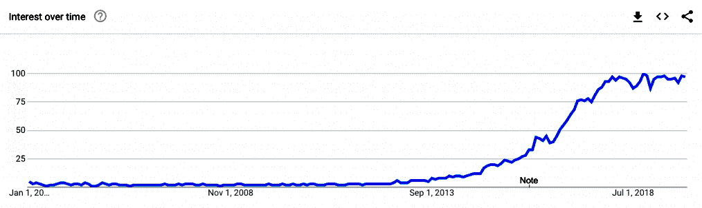
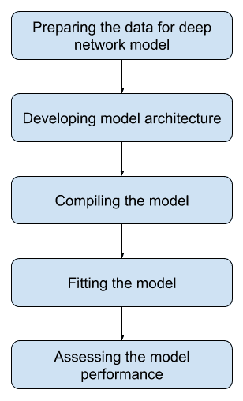
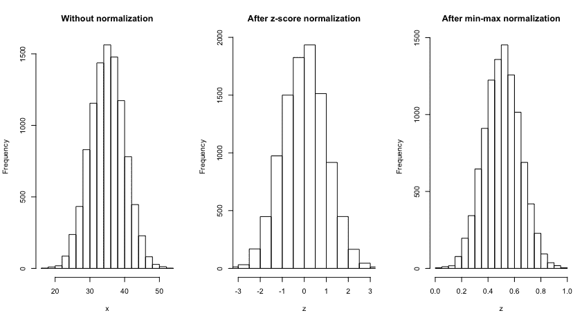
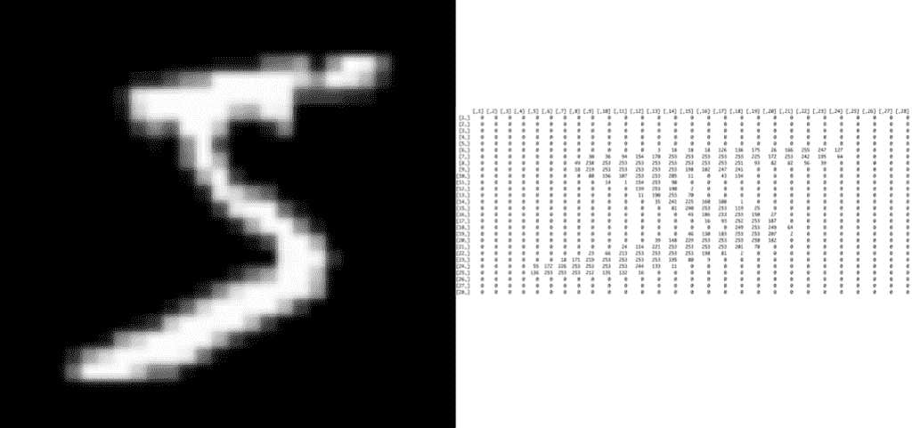
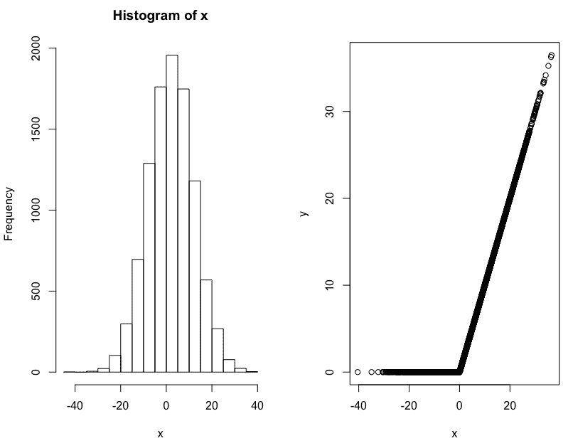
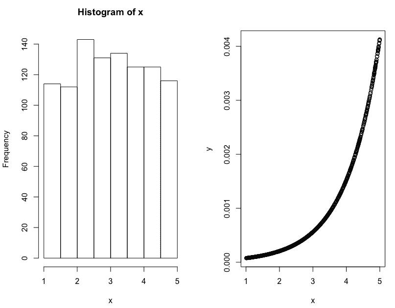
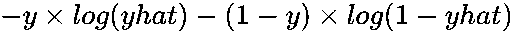
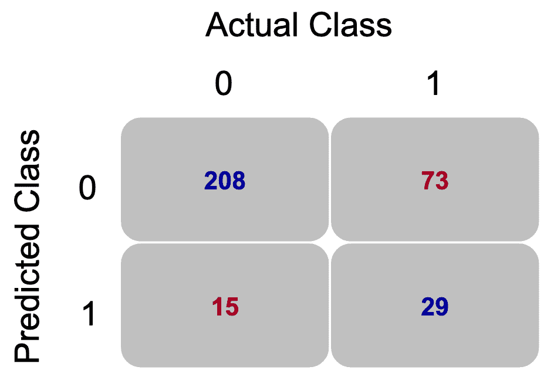
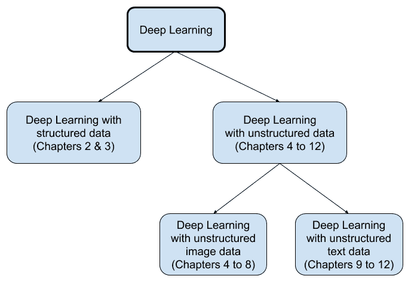

<title>Revisiting Deep Learning Architecture and Techniques</title>  

# 重新审视深度学习架构和技术

深度学习是使用人工神经网络的更广泛的机器学习和人工智能领域的一部分。深度学习方法的一个主要优势是，它们有助于捕捉数据中包含的复杂关系和模式。当关系和模式不是非常复杂时，传统的机器学习方法可能会工作得很好。然而，随着有助于生成和处理越来越多的非结构化数据(如图像、文本和视频)的技术的出现，深度学习方法变得越来越受欢迎，因为它们几乎是处理这些数据的默认选择。计算机视觉和自然语言处理是两个领域，它们在各种领域都有有趣的应用，比如无人驾驶汽车、语言翻译、计算机游戏，甚至是创作新的艺术品。

在深度学习工具包中，我们现在有越来越多的神经网络技术，可以应用于特定类型的任务。例如，在开发图像分类模型时，一种称为**卷积神经网络** ( **CNN** )的特殊类型的深度网络已被证明可以有效地捕捉图像相关数据中存在的独特模式。类似地，另一种流行的深度学习网络称为**递归神经网络** ( **RNNs** )及其变体被发现在处理涉及单词或整数序列的数据时非常有用。另一个流行而有趣的深度学习网络称为**生成对抗网络** ( **甘**)具有生成新图像、语音、音乐或艺术品的能力。

在本书中，我们将使用这些和其他流行的使用 R 软件的深度学习网络。每章都提供了一个完整的例子，它是专门为在普通笔记本电脑上运行而开发的。主要思想是在应用深度学习方法的第一阶段，避免陷入需要高级计算资源的大量数据的困境。你将能够用本书中的例子来复习所有的步骤。使用的示例还包括每个主题的最佳实践，您会发现它们很有用。你还会发现，当面临一个新问题时，尝试复制这些深度学习方法时，实践和应用的方法有助于快速看到全局。

本章概述了本书中涉及的 R 深度学习方法。我们将在本章中讨论以下主题:

*   用 R 进行深度学习
*   开发深层网络模型的过程
*   使用 R 和 RStudio 的流行深度学习技术

<title>Deep learning with R</title>  

# 用 R 进行深度学习

我们将从深度学习网络的流行程度开始，并看看本书中使用的一些重要 R 包的版本。

<title>Deep learning trend</title>  

# 深度学习趋势

深度学习技术利用基于神经网络的模型，在过去几年中受到越来越多的关注。谷歌趋势网站的搜索词**深度学习**提供了以下情节:



前面的图将 100 作为搜索词的最高流行度，其他数字是相对于这个最高点的。可以观察到，从 2014 年左右开始，对**深度学习**这个术语的兴趣逐渐流行起来。在过去的两年里，它享有最高的知名度。深度学习网络流行的原因之一是免费和开源库 TensorFlow 和 Keras 的可用性。

<title>Versions of key R packages used</title>  

# 使用的密钥 R 包的版本

在本书中，我们将使用 Keras R 包，该包使用 TensorFlow 作为构建深度学习网络的后端。下面的代码提供了典型 R 会话的输出，用于本书中的示例，提供了各种版本相关的信息:

```
# Information from a Keras R session
sessionInfo()

R version 3.6.0 (2019-04-26)
Platform: x86_64-apple-darwin15.6.0 (64-bit)
Running under: macOS 10.15

Matrix products: default
BLAS: /System/Library/Frameworks/Accelerate.framework/Versions/A/Frameworks/vecLib.framework/Versions/A/libBLAS.dylib
LAPACK: /Library/Frameworks/R.framework/Versions/3.6/Resources/lib/libRlapack.dylib

Random number generation:
 RNG: Mersenne-Twister 
 Normal: Inversion 
 Sample: Rounding 

locale:
[1] en_US.UTF-8/en_US.UTF-8/en_US.UTF-8/C/en_US.UTF-8/en_US.UTF-8

attached base packages:
[1] stats graphics grDevices utils datasets methods base

other attached packages:
[1] keras_2.2.4.1

loaded via a namespace (and not attached):
 [1] Rcpp_1.0.2 lattice_0.20-38 lubridate_1.7.4 zeallot_0.1.0 
 [5] grid_3.6.0 R6_2.4.0 jsonlite_1.6 magrittr_1.5 
 [9] tfruns_1.4 stringi_1.4.3 whisker_0.4 Matrix_1.2-17 
[13] reticulate_1.13 generics_0.0.2 tools_3.6.0 stringr_1.4.0 
[17] compiler_3.6.0 base64enc_0.1-3 tensorflow_1.14.0
```

如前所述，对于这本书，我们使用了 2019 年 4 月发布的 3.6 版本的 R。这个 R 版本的昵称是种树。Keras 包使用的版本是 2.2.4.1。此外，书中所展示的所有应用程序示例都是在内存为 8 GB 的 Mac 计算机上运行的。使用该规范的主要原因是，它将允许读者浏览所有示例，而不需要高级计算资源来开始使用书中涵盖的任何深度学习网络。

在下一节中，我们将回顾开发深层网络模型的过程，该过程分为五个一般步骤。

<title>Process of developing a deep network model</title>  

# 开发深层网络模型的过程

开发深度学习网络模型可以分为以下流程图所示的五个关键步骤:



根据使用的数据类型、正在开发的深度学习网络的类型以及开发模型的主要目标，前面流程图中提到的每个步骤都可能有不同的要求。我们将回顾每一步，对所涉及的内容有一个大致的了解。

<title>Preparing the data for a deep network model</title>  

# 为深层网络模型准备数据

开发深度学习神经网络模型需要变量具有特定的格式。独立变量可能会有不同的标度，有些变量值以小数表示，有些变量以千为单位。当训练网络时，使用这种变化的变量尺度不是很有效。在开发深度学习网络之前，我们会做出一些改变，使变量具有相似的规模。用于实现这一点的过程被称为**规范化**。

两种常用的归一化方法是 z 得分归一化和最小-最大归一化。在 z 分数归一化中，我们从每个值中减去平均值，然后除以标准差。这种变换产生的值介于-3 和+3 之间，平均值为 0，标准偏差为 1。对于最小-最大归一化，我们从每个数据点减去最小值，然后除以范围。这种转换将数据转换为 0 到 1 之间的值。

例如，参见下图，其中我们从平均值为 35、标准偏差为 5 的正态分布中随机获得了 10，000 个数据点:



从前面的图中，我们可以观察到，在 z 分数归一化后，数据点大多位于-3 和+3 之间。类似地，在最小-最大归一化之后，值的范围变为 0 和 1 之间的数据点。然而，在两种类型的标准化之后，原始数据中看到的整体模式被保留。

使用分类响应变量时，准备数据的另一个重要步骤是进行一次性编码。一键编码将分类变量转换为新的二进制格式，其值包含 0 或 1。这可以通过使用 Keras 中的`to_categorical()`函数轻松实现。

通常，与我们处理结构化数据的情况相比，非结构化数据(如图像或文本)的数据处理步骤更加复杂。此外，数据准备步骤的性质可能因数据类型的不同而不同。例如，我们为开发深度学习分类模型准备图像数据的方式很可能与我们为开发电影评论情感分类模型准备文本数据的方式非常不同。然而，需要注意的一个重要问题是，在我们可以从非结构化数据开发深度学习模型之前，需要首先将它们转换为结构化格式。下面的屏幕截图展示了一个将非结构化图像数据转换为结构化格式的示例，其中使用了一张手写数字 *five* 的图片:



从前面的截图中可以看出，当我们读取一个包含 R 中 28 x 28 尺寸的黑白手写数字 *five* 的图像文件时，它被转换为行和列中的数字，从而得到一个结构化的格式。屏幕截图的右侧显示了 28 行 28 列的数据。表体中的数字是范围从 0 到 255 的像素值，其中零值表示图片中的黑色，255 表示图片中的白色。当开发深度学习模型时，我们利用从图像数据中导出的一些形式的这种结构化数据。

一旦用于开发模型的数据以所需的格式准备好，我们就可以开发模型架构了。

<title>Developing a deep learning model architecture</title>  

# 开发深度学习模型架构

开发模型的架构包括定义各种项目，如网络的类型和层数、激活函数的类型、网络中使用的单元或神经元的数量，以及提供与数据相关的输入/输出值。下面的代码展示了一个在 R 中使用 Keras 指定简单顺序模型架构的例子:

```
# Model architecture
model <- keras_model_sequential()
 model %>% 
 layer_dense(units = 8, activation = 'relu', input_shape = c(21)) %>% 
 layer_dense(units = 3, activation = 'softmax')
```

请注意，顺序模型允许我们一层一层地开发模型。从前面的代码中可以看出，作为顺序模型的一部分，添加了两层密集连接的网络。在选择模型架构时，两个重要的决定涉及层的数量和类型以及层的激活功能的类型。要使用的图层数量和类型取决于数据的性质和复杂性。对于全连接网络(也称为多层感知器)，我们可以借助 Keras 中可用的`layer_dense`函数使用密集层。

另一方面，当处理图像数据时，我们很可能在网络中使用卷积层，使用`layer_conv_2d`函数。我们将在每一章中用例子来讨论关于特定模型架构的更多细节。

深度学习网络中使用不同类型的激活函数。一个整流线性单元，或`relu`，是一个用于隐藏层的流行的激活函数，它使用一个非常简单的计算。如果输入是负的，它将返回值 0，对于其他所有内容，原始值没有变化。作为一个例子，让我们看看下面的代码:

```
# RELU function and related plot
x <- rnorm(10000, 2, 10)
y <- ifelse(x<0, 0, x)
par(mfrow = c(1,2))
hist(x)
plot(x,y)
```

前面的代码从平均值为 2、标准偏差为 10 的正态分布中生成 10，000 个随机数，并将结果存储在`x`中。然后负值变为零并存储在 y 中。下图给出了 x 的直方图以及 x 和 y 的散点图:



从前面的直方图可以观察到，x 具有正值和负值。散点图基于原始 x 值和将负值转换为零后获得的修改后的 y 值，显示了`relu`激活功能的影响。在散点图中，x = 0 左侧的数据点是平坦的，斜率为零。x = 0 右侧的数据点具有斜率为 1 的完美线性模式。

使用`relu`激活功能的主要优点之一是计算简单。对于开发深度学习网络模型，这成为一个重要因素，因为它有助于降低计算成本。对于许多深度学习网络，校正的线性单元被用作默认的激活函数。

用于开发深度网络的另一个流行的激活函数是`softmax`，它通常用于网络的外层。让我们来看看下面的代码，以便更好地理解它:

```
# Softmax function and related plot
x <- runif(1000, 1, 5)
y <- exp(x)/sum(exp(x))
par(mfrow=c(1,2))
hist(x)
plot(x,y)
```

在前面的代码中，我们从 1 到 5 之间的均匀分布中随机抽取了 1，000 个值。要使用`softmax`函数，我们可以将每个输入值 x 的指数除以 x 的指数值之和。基于 x 值生成的直方图以及 x 和 y 值的散点图如下图所示:



我们可以观察到，前面的直方图为 x 值提供了近似一致的模式。从散点图可以看出`softmax`功能的影响，输出值现在位于 0 和 1 之间。这种转换对于根据概率解释结果非常有用，因为现在的值如下:

*   介于 0 和 1 之间
*   这些概率的总和是 1

`softmax`激活函数的这一方面，其中结果可以根据概率进行解释，这使得它在开发深度学习分类模型时成为一种流行的选择。无论我们用它来解决图像分类还是文本分类问题，它都工作得很好。

除了这两个激活函数，我们还利用其他可能更适合特定深度学习模型的函数。

一旦指定了要使用的模型架构，下一步就是编译模型。

<title>Compiling the model</title>  

# 编译模型

编译模型通常包括指定损失函数、选择优化器和指定要使用的度量。然而，这些选择取决于要解决的问题的类型。以下代码是用于编译深度学习二进制分类模型的 R 的示例:

```
model %>% 
   compile(loss = 'binary_crossentropy', 
   optimizer = 'adam',
   metrics = 'accuracy')
```

前面指定的损失函数是`binary_crossentropy`，当响应变量有两类时使用。可以使用以下公式计算二进制交叉熵:



在上式中，y 表示实际类别，`yhat`表示预测概率。让我们考虑使用以下代码的两个示例:

```
# Example-1
y <- c(0, 0, 0, 1, 1, 1)
yhat <- c(0.2, 0.3, 0.1, 0.8, 0.9, 0.7)
(loss <- - y*log(yhat) - (1-y)*log(1-yhat))

[1] 0.2231436 0.3566749 0.1053605 0.2231436 0.1053605 0.3566749

mean(loss)

[1] 0.228393

# Example-2
yhat <- c(0.2, 0.9, 0.1, 0.8, 0.9, 0.2)
(loss <- - y*log(yhat) - (1-y)*log(1-yhat))

[1] 0.2231436 2.3025851 0.1053605 0.2231436 0.1053605 1.6094379

mean(loss)

[1] 0.761505
```

如`Example-1`所示，总共有六种情况用 y 表示，其中前三种情况表示实际类别为 0，接下来的三种情况表示实际类别为 1。`yhat`捕获的预测概率是案例属于类别 1 的概率。在`Example-1`中，`yhat`值正确分类了所有六种情况，所有损失值的平均值约为 0.228。在`Example-2`中，`yhat`值仅正确分类了四种情况，所有损失值的平均值现在增加到大约 0.762。这样的二元交叉熵损失函数有助于评估模型的分类性能。损失值越低，分类性能越好，损失值越高，模型的分类性能越差。

基于深度学习网络正在开发的问题类型，使用各种其他损失函数。对于响应变量有两个以上类别的分类模型，我们利用`categorical_crossentropy`损失函数。对于带有数字响应变量的回归问题，均方差(`mse`)可能是一个合适的损失函数。

当指定模型要使用的优化器时，`adam`是深度学习网络的一个流行选择，在各种情况下都有很好的结果。其他常用的优化器还有`rmsprop`和`adagrad`。当训练深度学习网络时，基于从损失函数获得的反馈来修改网络的参数。参数的这种修改是如何发生的取决于所使用的优化器。因此，选择合适的优化器对于获得合适的模型非常重要。

在编译模型时，我们还指定了一个合适的指标，用于监控培训过程。对于分类问题，`accuracy`是一个最常用的度量标准。对于回归问题，平均绝对误差是一个通常指定的度量。

一旦我们编译了一个模型，我们就准备好去适应它了。

<title>Fitting the model</title>  

# 拟合模型

模型的拟合或训练是在数据的帮助下进行的。用于拟合分类模型的代码示例如下:

```
model %>%   
 fit(training, 
   trainLabels, 
   epochs = 200,
   batch_size = 32, 
   validation_split = 0.2)
```

在前面的代码中，拟合模型包括`training`和`trainLabels`，前者是独立变量的数据，后者包含响应变量的标签。指定历元数以指示将在训练过程中使用的训练数据中所有样本的迭代次数。批量是指要使用的训练数据的样本数，在此之后将更新模型参数。此外，我们还指定了任何验证拆分，其中 0.2%或 20%的拆分意味着来自训练数据的最后 20%的样本将与训练过程分开，以评估模型性能。

当拟合模型时，网络中的不同层具有随机初始化的权重。由于网络权重的这种随机初始化，如果我们用相同的数据、相同的架构和相同的设置再次拟合一个模型，我们将得到稍微不同的结果。这不仅会发生在 R 的不同会话中，还会发生在再次训练模型的同一会话中。

在许多情况下，获得可重复的结果非常重要。例如，在同行评审的国际期刊上发表深度学习相关的文章时，您可能需要根据评审者的反馈从同一模型中生成更多的图。另一种情况是，从事同一项目的团队可能希望与团队的其他成员共享模型和结果。从模型中获得相同结果的最简单方法是保存模型，然后使用以下代码重新加载模型:

```
# Save/reload model
save_model_hdf5(model, 
 filepath, 
 overwrite = TRUE,
 include_optimizer = TRUE)
model_x <- load_model_hdf5(filepath, 
 custom_objects = NULL, 
 compile = TRUE)
```

我们可以通过指定`filepath`来保存模型，然后在需要时重新加载。保存模型允许我们在再次使用模型时获得可重复的结果。它还允许我们与其他人共享相同的模型，这些人可以获得完全相同的结果，并在每次运行需要大量时间的情况下提供帮助。保存并重新加载模型允许您在再次训练模型时继续训练过程。

一旦模型合适，就可以使用训练和测试数据来评估其性能。

<title>Assessing the model performance</title>  

# 评估模型性能

评估深度学习分类模型的性能需要开发一个混淆矩阵，该矩阵总结了对实际和预测类的预测。考虑一个例子，其中开发了一个分类模型来将研究生院申请人分类为两个类别中的一个，其中类别 0 指的是未被接受的申请，类别 1 指的是被接受的申请。这种情况下的混淆矩阵示例解释了以下关键概念:



在前面的混淆矩阵中，有 208 名申请人实际上没有被接受，并且该模型也正确地预测他们不应该被接受。混淆矩阵中的这个单元也被称为**真阴性**。类似地，有 29 名申请人实际上被接受，并且模型也正确地预测他们应该被接受。混淆矩阵中的这个单元被称为**真正**。我们还有单元格，单元格中的数字表示模型对申请人的分类不正确。有 15 名申请人实际上没有被接受，但是模型错误地预测他们应该被接受，这个单元被称为**假阴性**。

当错误地将类别 0 分类为属于类别 1 时所产生的错误的另一个名称是类型 1 错误。最后，有 73 名申请人实际上被接受了，但模型错误地预测他们属于未被接受的类别，这个单元被称为**假阳性**。这种不正确分类的另一个名称是第二类错误。

从混淆矩阵中，我们可以通过将数字加到对角线上并除以总数来计算分类性能的准确度。因此，基于前述矩阵的准确度是(208+29)/(208+29+73+15)，或 72.92%。除了准确性之外，我们还可以发现模型在正确分类每个类别方面的表现。我们可以计算正确分类类别 1 的准确度，也称为敏感度，为 29/(29+73)，或 28.4%。类似地，我们可以计算正确分类类别 0 的准确度，也称为特异性，为 208/(208+15)，或 93.3%。

请注意，在开发分类模型时，可以使用混淆矩阵。然而，其他情况可能需要评估深度学习网络的其他合适的方式。

我们现在可以简要回顾一下本书中涉及的深度学习技术。

<title>Deep learning techniques with R and RStudio</title>  

# 使用 R 和 RStudio 的深度学习技术

深度学习中的术语 **deep** 指的是具有若干层的神经网络模型，学习是在数据的帮助下进行的。根据使用的数据类型，深度学习可以分为两大类，如下面的截图所示:



如上图所示，用于开发深度神经网络模型的数据类型可以是结构化或非结构化类型。在[第 2 章](c5c236d5-fc58-4d90-95b0-2b05b148b187.xhtml)、*用于多类分类的深度神经网络*中，我们说明了深度学习网络用于使用结构化数据的分类问题，其中响应变量是分类类型。在[第 3 章](07c9aa4a-1c93-490a-bfcd-7c4bcde639d5.xhtml)、*用于回归的深度神经网络*中，我们使用结构化数据说明了深度学习网络在回归问题中的使用，其中响应是连续类型的变量。第 4 章至第 12 章说明了深度学习网络主要用于两种类型的非结构化数据，包括图像和文本。在第 4 至 8 章中，我们提供了一些使用图像数据的流行深度学习网络的应用示例，图像数据被视为非结构化类型的数据。最后，在第 9 章到第 12 章中，我们涵盖了一些对文本数据有用的流行深度学习网络，文本数据是非结构化数据中的另一个主要类别。

现在，让我们简单回顾一下第 2 章到第 12 章中的例子和技巧。

<title>Multi-class classification</title>  

# 多类分类

有许多问题的主要目标是开发一个分类模型，该模型使用数据将观察结果分类为两个或更多类别。例如，可以基于几个变量的数据将患者分类为正常、可疑或病理。在这种情况下，深度学习网络将使用几个已经有结果的患者的数据，它将学习将一个患者分为三个类别中的一个。

分类问题的另一个例子是学生向研究生院递交申请。学生的申请可能会被接受或拒绝，这取决于他们在本科期间的 GPA、GRE 和学校排名等变量。另一个有趣的例子是，学生相关数据被用于开发一个模型，该模型有助于将一年级学生分为可能留在当前学校的学生和可能转学的学生。可以开发一个类似的模型来对可能继续留在某个企业或转投竞争对手的客户进行分类。

开发分类模型的挑战之一是类别不平衡。例如，当处理医学数据时，被分类为正常的患者的数量可能远大于被分类为病理的患者的数量。同样，当申请顶尖大学的研究生项目时，数据很可能包含大量申请人未被录取的案例。深层网络模型有助于轻松解决这类问题。本书中使用的 Keras 库提供了一个用户友好的界面，不仅可以轻松地解决这些问题，还可以在快速实验的帮助下获得合适的分类模型。

在[第 2 章](c5c236d5-fc58-4d90-95b0-2b05b148b187.xhtml)、*用于多类分类的深度神经网络*中，我们提供了一个使用 r。

<title>Regression problems</title>  

# 回归问题

涉及数字响应变量的结构化数据被归类为回归问题。例如，一个城市的房价可能取决于一些变量，如房龄、城市犯罪率、房间数量和财产税税率。虽然统计方法，如多元线性回归和弹性网络回归，也可以用于这些情况，但深度学习网络提供了某些优势。通常使用神经网络的一个主要优点是它们可以捕捉非线性。与需要满足某些假设才能使用的统计方法不同，基于神经网络的模型使用起来更加灵活，并且不需要满足许多假设。

许多涉及回归问题的应用也要求识别对响应变量有显著影响的变量或特征。然而，对于深度学习网络，这种特征工程是内置的，它不需要任何额外的努力来提取重要的特征。关于深度学习网络需要注意的一点是，使用的数据集越大，得到的预测模型就越有效。在[第 3 章](07c9aa4a-1c93-490a-bfcd-7c4bcde639d5.xhtml)、*用于回归的深度神经网络*中，我们提供了一个使用 r

<title>Image classification</title>  

# 图像分类

图像数据被归类为非结构化类型的数据。深度学习网络的一个流行应用涉及开发图像分类和识别模型。图像分类有各种应用，如智能手机或社交媒体网络上的人脸识别、医学图像数据的分类、手写数字的分类和自动驾驶汽车。请注意，直接从非结构化数据开发分类模型是不可能的。在开发深度学习网络之前，需要首先将非结构化数据转换为结构化形式。例如，黑白图像可能具有 21×21 的尺寸，因此包含 441(21×21)个像素的数据。一旦我们将图像转换成代表所有像素的数字，开发图像分类模型就变得可行了。虽然人类可以非常容易地对一种类型的服装、一个人或某个物体进行分类，即使图像可能具有不同的大小或方向，但训练计算机做到这一点是一项具有挑战性的任务。

Keras 库提供了几个易于使用的功能来处理图像数据，有助于开发深度学习图像分类网络。当涉及图像识别和分类问题时，具有多层的深度网络或神经网络的有效性尤其突出。在[第 4 章](356e6d56-329c-433e-8b3e-969453363ee9.xhtml)、*图像分类和识别*中，我们提供了一个使用 r

<title>Convolutional neural networks</title>  

# 卷积神经网络

当类别数量增加并且一个类别中的图像表现出显著的可变性时，图像分类任务变得具有挑战性。这种情况还需要大量的样本，以便分类模型可以更准确地捕捉每个类别中固有的特征。例如，时尚零售商可能有各种各样的时尚商品，并且可能对从这些时尚商品的图像数据开发分类模型感兴趣。一种特殊类型的深度网络，称为**卷积神经网络** ( **CNN** )，已被证明在需要大规模图像分类和识别任务的情况下非常有效。CNN 是此类应用中最受欢迎的网络，并被视为大规模图像分类问题的黄金标准。借助于网络中不同类型的层，这些网络能够捕捉图像中的各种微小细节。在[第 5 章](7285aaf1-8ca5-4f1d-95d8-057ce1fbf5f9.xhtml)、*使用卷积神经网络进行图像分类*中，我们提供了一个使用 r。

<title>Autoencoders</title>  

# 自动编码器

深度学习方法涉及使用具有响应或因变量的数据的分类和预测模型，是受监督的深度学习方法的一部分。当处理结构化或非结构化数据时，会出现响应变量不可用或未被使用的情况。不使用响应变量的深度学习网络的应用被分类为无监督的深度学习方法。例如，深度学习的应用可能涉及图像数据，我们希望从这些数据中提取重要的特征，以实现降维。另一个例子涉及包含不想要的噪声的手写图像，并且使用深度网络对图像去噪。在这种情况下，已经发现自动编码器网络对于执行无监督的深度学习任务非常有用。

自动编码器神经网络利用编码器和解码器网络。当图像数据通过编码器时，得到的维数低于原始图像的维数，网络被迫只从输入数据中提取最重要的特征。然后网络的解码器部分从编码器输出的任何可用数据中重建原始数据。在[第 6 章](489413e8-85df-4912-b59a-bd119d93c967.xhtml)、*使用 Keras 应用自动编码器神经网络*中，我们提供了在使用 r 处理图像数据时，应用自动编码器神经网络进行降维、去噪和图像校正的示例

<title>Transfer learning</title>  

# 迁移学习

当图像数据有几个类别时，开发深度学习分类模型是一项具有挑战性的任务。当可用图像的数量有限时，这变得更加具有挑战性。在这种情况下，可以利用在更大的数据集的帮助下开发的现有模型，并通过为另一个分类任务定制它来重用它所学习的模式。这种重新使用预先训练的深度网络模型来完成新的分类任务被称为迁移学习。

Keras 库为图像分类任务提供了各种预训练模型，这些模型使用超过一百万幅图像进行训练，并捕获可重复使用的特征，这些特征可应用于相似但新的数据。将预训练模型从大量样本中学到的知识转移到用小得多的样本量构建的模型有助于节省计算资源。此外，使用迁移学习方法有助于胜过使用较小数据集从头构建的模型。在[第 7 章](c316ef95-6026-4e25-9dd4-7e3a191721d0.xhtml)、*使用迁移学习对小数据进行图像分类*中，我们介绍了迁移学习，并说明了使用 r

<title>Generative adversarial networks</title>  

# 生成对抗网络

《The Verge》的一篇文章(参考文献:[https://www . The Verge . com/2018/10/25/18023266/ai-art-Portrait-christies-obvious-sold](https://www.theverge.com/2018/10/25/18023266/ai-art-portrait-christies-obvious-sold))报道称，一幅使用人工智能算法创作的名为*Edmond Belamy*肖像的艺术品以 43.25 万美元的价格售出。这件艺术品的估价在 7000 美元到 10000 美元之间。用来创作这个艺术品的深度学习算法被称为**生成对抗网络** ( **甘**)。生成对抗网络的独特属性是两个深层网络相互竞争以生成有意义的东西。这两个相互竞争并试图智胜对方的网络被称为生成器和鉴别器网络。

考虑这样一种情况，我们想要生成数字 *five* 的新手写图像。在这种情况下，生成式对抗网络将涉及一个生成器网络，它从简单的随机噪声中创建手写数字 *five* 的假图像，并将其发送到鉴别器网络。假图像与真图像混合，被训练来区分手写数字*五*的真图像和假图像的鉴别器网络将尽力成功区分真图像和假图像。这两个网络相互竞争，直到生成器网络开始制作逼真的假图像，鉴别器网络发现越来越难以区分这些图像。除了图像数据之外，生成对抗网络的应用可以被扩展以生成新的文本或者甚至新的音乐。我们将在[第 8 章](7031c1cb-e20d-4e86-8667-393d0cceddca.xhtml)、*使用生成对抗网络创建新图像*中说明生成对抗网络生成新图像的应用。

<title>Deep network for text classification </title>  

# 文本分类的深度网络

与图像数据相比，文本数据具有某些独特的特征，使其成为一种非常不同的非结构化数据。如前所述，非结构化数据需要额外的处理步骤来达到可用于开发深度学习分类网络的结构化格式。文本数据深度学习的应用之一涉及开发深度神经网络情感分类模型。

为了开发情感分类模型，需要捕获与文本数据相关的情感的标签。例如，我们可以使用电影评论的文本数据和相关的情感标签(正面评论或负面评论)来开发一个可用于自动化该过程的模型。另一个例子是利用推特上的文本数据开发情感分类模型。这种模型可以用于比较成千上万条推文中或重要事件发生后的情绪。情感分类模型可能有用的这种事件的例子包括公司发布新智能手机之前和之后的推文中包含的情感，以及总统候选人在现场辩论中表现之前和之后的推文中包含的情感。在[第 9 章](491ea3a8-47e9-48b4-8553-7387528c8594.xhtml)、*用于文本分类的深层网络*中说明了使用文本数据的情感分类模型的深层网络。

<title>Recurrent neural networks </title>  

# 递归神经网络

文本数据的一个独特特征是单词在文本序列中的位置具有某种意义。**递归神经网络** ( **RNNs** )非常适合处理涉及此类序列的数据。递归网络允许将前一步的输出作为输入传递给下一步。这种在一个步骤中提供先验信息的过程允许递归网络具有记忆，这对于处理涉及序列的数据非常有用。在 RNN,**recurrent**这个名字也来源于这样一个事实，即一个步骤的输出依赖于前一个步骤的信息。

RNNs 可以用来开发情感分类模型，其中的文本数据可以是电影评论、推文、产品评论等等。开发这样的情感分类模型还需要用于训练网络的标签。在第 10 章、*使用递归神经网络进行文本分类*中，我们将详细介绍使用 R 开发用于情感分类的递归神经网络模型的步骤。

<title>Long short-term memory network</title>  

# 长短期记忆网络

**长短期记忆** ( **LSTM** )网络是一种特殊类型的递归神经网络。当关于字或整数序列的数据具有长期依赖性时，LSTM 网络是有用的。例如，对于正确分类包含在电影评论中的情感来说很重要的两个单词可能在一个长句中被许多单词分开。使用常规 RNN 的情感分类模型将难以捕捉单词之间的这种长期依赖性。当序列中的单词或整数之间存在直接的依赖关系时，或者当两个重要的单词相邻时，正则 RNN 非常有用。

除了情感分类，LSTM 网络的应用还可以用于语音识别、语言翻译、异常检测、时间序列预测、回答问题等等。在[第十一章](da73d1c6-4377-4a8f-9bee-01262444f136.xhtml)、*使用长短期记忆网络的文本分类*中说明了 LSTM 网络用于电影评论情感分类的应用。

<title>Convolutional recurrent networks</title>  

# 卷积递归网络

**卷积神经网络**(**CNN**)对于从图像或文本数据中捕获高级局部特征很有用，LSTM 网络可以捕获涉及序列的数据中的长期依赖关系。当我们在同一个模型架构中同时使用 CNN 和一个递归网络时，称为**卷积递归神经网络** ( **CRNN** )。例如，如果我们考虑关于文章及其作者的数据，我们可能会对开发作者分类模型感兴趣，在该模型中，我们可以训练网络将包含文章的文本数据作为输入，然后帮助根据关于作者的概率进行预测。为此，我们可以首先使用一维卷积层从数据中提取重要特征。然后，可以将这些提取的特征传递给 LSTM 递归层，以获得隐藏的长期依赖关系，这些长期依赖关系又被传递给完全连接的密集层。这个密集层然后可以获得正确的作者的概率。CRNNs 还可以应用于与自然语言处理、语音和视频相关的问题。在[第 12 章](be0c6dfc-045c-4698-b36d-74eca5e0a629.xhtml)、*使用卷积递归网络的文本分类*中，我们说明了使用卷积递归网络来开发一个模型，该模型可以根据作者写的文章对作者进行分类。

<title>Tips, tricks, and best practices</title>  

# 提示、技巧和最佳实践

在本书中，我们提供了一个使用 r 应用几种流行的深度学习方法的示例。当处理需要应用深度学习网络的更复杂的问题时，使用某些支持工具有时可能会非常有帮助。TensorFlow 提供了这样一个工具；它被称为 **TensorBoard** ，对于可视化深度网络训练性能非常有用，尤其是在需要实验的情况下。类似地，有一个名为**局部可解释模型不可知解释** ( **LIME** )的包可以帮助可视化和解释特定的预测。在开发深度网络模型时，我们还会获得许多输出，如摘要和图表。有一个名为 **tfruns** 的包可以帮助将所有东西放在一个地方以便于参考。Keras 包中有一个回调功能，可以帮助在合适的时间停止网络训练。我们将在第 13 章、*技巧、诀窍和未来之路*中讨论所有这些技巧、诀窍和最佳实践。

<title>Summary</title>  

# 摘要

近年来，利用人工神经网络的深度学习方法越来越受欢迎。涉及深度学习方法的多个应用领域包括无人驾驶汽车、图像分类、自然语言处理和新图像生成。我们从谷歌趋势网站报道的深度学习术语的流行程度开始第一章。我们描述了应用深度学习方法的五个步骤，并对每个步骤的细节提出了一些广泛的想法。然后，我们简要地看了一下每一章中涉及的深度学习技术和应用它们的情况，以及一些最佳实践。

在下一章中，我们从一个应用示例开始，并说明为多类分类问题开发深度网络模型的步骤。