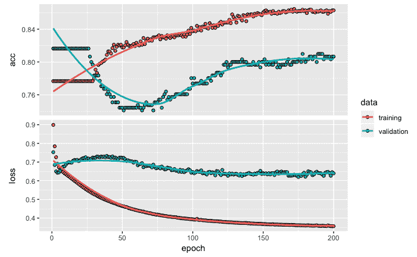
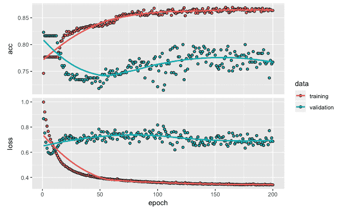
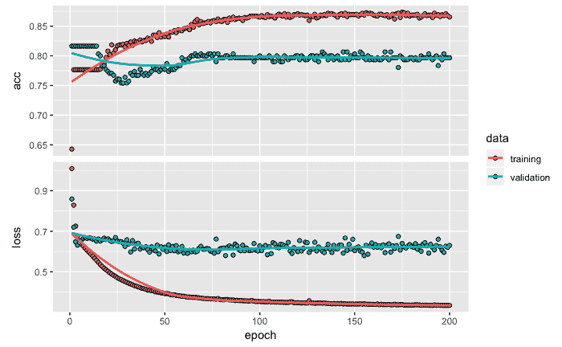
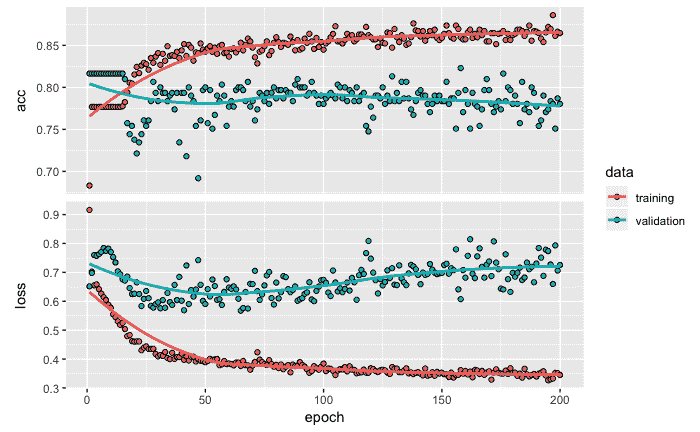
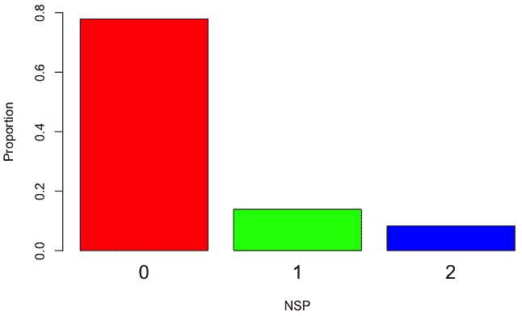
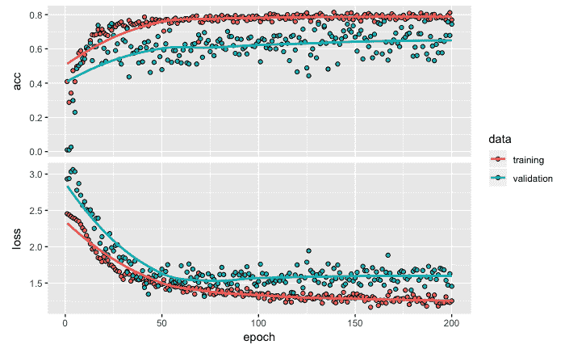

# 二、用于多类分类的深度神经网络

在开发预测和分类模型时，根据响应或目标变量的类型，我们会遇到两种潜在类型的问题:目标变量是分类类型(这是问题的分类类型)或目标变量是数值类型(这是问题的回归类型)。据观察，约 70%的数据属于分类类别产生的问题，其余 30%是回归问题(这里是参考:[https://www . top coder . com/role-of-statistics-in-data-science/](https://www.topcoder.com/role-of-statistics-in-data-science/))。在本章中，我们将提供将深度学习神经网络应用于分类问题的步骤。这些步骤用胎儿心率图或 ctg 来说明。

在本章中，我们将讨论以下主题:

*   对胎儿心脏分娩图(或 CTG)数据集的简单了解
*   数据准备的步骤，包括标准化、数据分区和一次性编码
*   为分类问题创建和拟合深度神经网络模型
*   评估分类模型性能并使用该模型进行预测
*   微调模型以实现性能优化和最佳实践


# 心电图数据集

在这一节中，我们将提供关于用于开发多类分类模型的数据的信息。我们将只使用一个库，即 Keras。


# 数据集(医学)

本章使用的数据集可以在加州大学信息和计算机科学学院维护的 UCI 机器学习库中公开获得。你可以在[https://archive.ics.uci.edu/ml/datasets/cardiotocography](https://archive.ics.uci.edu/ml/datasets/cardiotocography)访问这个。

需要注意的是，此 URL 允许您下载 Excel 数据文件。通过将文件保存为`.csv`文件，可以很容易地将该文件转换为`.csv`格式。

对于数据，我们应该使用用于`.csv`的格式，如下面的代码所示:

```
# Read data
library(keras)
data <- read.csv('~/Desktop/data/CTG.csv', header=T)
str(data)

OUTPUT
 ## 'data.frame': 2126 obs. of 22 variables:
 ## $ LB : int 120 132 133 134 132 134 134 122 122 122 ...
 ## $ AC : num 0 0.00638 0.00332 0.00256 0.00651 ...
 ## $ FM : num 0 0 0 0 0 0 0 0 0 0 ...
 ##  $ UC      : num  0 0.00638 0.00831 0.00768 0.00814 ...
 ##  $ DL      : num  0 0.00319 0.00332 0.00256 0 ...
 ##  $ DS      : num  0 0 0 0 0 0 0 0 0 0 ...
 ##  $ DP      : num  0 0 0 0 0 ...
 ##  $ ASTV    : int  73 17 16 16 16 26 29 83 84 86 ...
 ##  $ MSTV    : num  0.5 2.1 2.1 2.4 2.4 5.9 6.3 0.5 0.5 0.3 ...
 ##  $ ALTV    : int  43 0 0 0 0 0 0 6 5 6 ...
 ##  $ MLTV    : num  2.4 10.4 13.4 23 19.9 0 0 15.6 13.6 10.6 ...
 ##  $ Width   : int  64 130 130 117 117 150 150 68 68 68 ...
 ##  $ Min     : int  62 68 68 53 53 50 50 62 62 62 ...
 ##  $ Max     : int  126 198 198 170 170 200 200 130 130 130 ...
 ##  $ Nmax    : int  2 6 5 11 9 5 6 0 0 1 ...
 ##  $ Nzeros  : int  0 1 1 0 0 3 3 0 0 0 ...
 ##  $ Mode    : int  120 141 141 137 137 76 71 122 122 122 ...
 ##  $ Mean    : int  137 136 135 134 136 107 107 122 122 122 ...
 ##  $ Median  : int  121 140 138 137 138 107 106 123 123 123 ...
 ##  $ Variance: int  73 12 13 13 11 170 215 3 3 1 ...
 ##  $ Tendency: int  1 0 0 1 1 0 0 1 1 1 ...
 ##  $ NSP     : int  2 1 1 1 1 3 3 3 3 3 ...
```

该数据由胎儿 ctg 组成，目标变量将患者分为三类:正常、可疑和病理。该数据集中有 2，126 行。ctg 由三位产科专家进行分类，并将它们中的每一个指定为正常(N)(由 1 表示)、可疑(S)(由 2 表示)和病理(P)(由 3 表示)。有 21 个独立变量，主要目标是开发一个分类模型，以正确地将每个患者分类到由 N、S 和 p 表示的三个类别之一。


# 为模型构建准备数据

在本节中，我们将准备用于构建分类模型的数据。数据准备包括标准化数据、将数据划分为训练数据和测试数据，以及对响应变量进行一次性编码。


# 规范化数字变量

为了开发深层网络模型，我们对数值变量进行了规范化，使它们具有共同的尺度。在处理几个变量时，不同的变量可能有不同的尺度，例如，可能有一个变量显示公司的收入，其值可能以百万美元计。在另一个例子中，可能有一个以厘米为单位显示产品尺寸的变量。这种规模上的极端差异给训练网络带来了困难，而标准化有助于解决这个问题。为了规范化，我们将使用以下代码:

```
# Normalize data 
data <- as.matrix(data)
 dimnames(data) <- NULL  
 data[,1:21] <- normalize(data[,1:21])
 data[,22] <- as.numeric(data[,22]) -1
```

正如您在前面的代码中看到的，我们首先将数据更改为矩阵格式，然后通过将`NULL`分配给维度名称来删除默认名称。在这一步中，22 个变量的名称将更改为`V1`、`V2`、`V3`，...，`V22`。如果您在这个阶段运行`str(data)`，您会注意到原始数据的格式发生了变化。我们使用`normalize`函数对 21 个独立变量进行标准化，这是 Keras 包的一部分。当您运行这行代码时，您会注意到它使用 TensorFlow 作为后端。我们还将目标变量 NSP 从默认的整数类型改为数字类型。此外，在同一行代码中，我们还分别将值从`1`、`2`和`3`更改为`0`、`1`和`2`。


# 划分数据

接下来，我们将把这些数据划分为训练和测试数据集。为了执行数据分区，我们使用以下代码:

```
# Data partition 
set.seed(1234)
 ind <- sample(2, nrow(data), replace = T, prob=c(.7, .3))
 training <- data[ind==1, 1:21]
 test <- data[ind==2, 1:21]
 trainingtarget <- data[ind==1, 22]
 testtarget <- data[ind==2, 22]
```

从前面的代码中可以看出，为了在训练和测试数据集中获得相同的样本以实现可重复性，我们使用带有特定数字的`set.seed`，在本例中是`1234`。这将确保读者也可以在训练和测试数据中获得相同的样本。对于数据分区，这里使用 70:30 的分割，但也可以使用任何其他比例。在机器学习应用程序中，这是一个常用的步骤，以确保预测模型能够很好地处理以测试数据形式存储的未知数据。训练数据用于开发模型，测试数据用于评估模型的性能。有时，预测模型可能在训练数据的情况下表现得非常好，甚至非常好；但是，当使用模型没有看到的测试数据对其进行评估时，性能可能会非常令人失望。在机器学习中，这个问题被称为过度拟合模型。测试数据有助于评估和确保预测模型能够可靠地实现，以便做出适当的决策。

我们使用`training`和`test`名称存储独立变量，使用`trainingtarget`和`testtarget`名称存储目标变量，这些变量存储在数据集的第 22 ^和列中。在数据划分之后，我们将在训练数据中有 1，523 个观察值，剩余的 603 个观察值将在测试数据中。请注意，尽管我们在这里使用 70:30 的分割，但数据分区后的实际比例可能不完全是 70:30。


# 一键编码

在数据划分之后，我们将对响应变量进行一次性编码。一键编码有助于用 0 和 1 来表示分类变量。一键编码的代码和输出如下:

```
# One-hot encoding
 trainLabels <- to_categorical(trainingtarget)
 testLabels <- to_categorical(testtarget)
 print(testLabels[1:10,])

OUTPUT
 ##        [,1] [,2] [,3]
 ##   [1,]    1    0    0
 ##   [2,]    1    0    0
 ##   [3,]    1    0    0
 ##   [4,]    0    0    1
 ##   [5,]    0    0    1
 ##   [6,]    0    1    0
 ##   [7,]    1    0    0
 ##   [8,]    1    0    0
 ##   [9,]    1    0    0
 ##  [10,]    1    0    0

```

正如您在前面的代码中看到的，在 Keras 包中的`to_categorical`函数的帮助下，我们将目标变量转换为二进制类矩阵，其中类的存在或不存在分别简单地用 1 或 0 表示。在这个例子中，我们有三个目标变量的类，它们被转换成三个虚拟变量。这个过程也叫做**一键编码**。首先，从`testLabels`打印 10 行。第一行指示(1，0，0)患者的正常类别，第六行指示(0，1，0)患者的可疑类别，第四行提供(0，0，1)患者的病理类别的示例。

完成这些数据准备步骤后，我们进入下一步，创建分类模型，将患者分类为正常、可疑或病理。


# 创建和拟合深度神经网络模型

在本节中，我们将开发模型架构，编译模型，然后拟合模型。


# 开发模型架构

用于开发模型的代码如下:

```
# Initializing the model
 model <- keras_model_sequential()

# Model architecture
 model %>% 
 layer_dense(units = 8, activation = 'relu', input_shape = c(21)) %>% 
 layer_dense(units = 3, activation = 'softmax')
```

如前面的代码所示，我们首先使用`keras_model_sequential()`函数创建一个顺序模型，它允许添加线性层堆栈。接下来，我们使用管道操作符`%>%`向模型添加层。这个管道操作符将来自左边的信息作为输出，并将该信息作为输入提供给右边的内容。我们使用一个全连接或密集连接的神经网络，使用`layer_dense`函数，然后指定各种输入。在这个数据集中，我们有 21 个独立变量，因此，`input_shape`函数被指定为神经网络中的 21 个神经元或单元。这一层也称为网络中的输入层。第一个隐藏层有 8 个单元，我们在这里使用的激活函数是一个整流线性单元，或`relu`，这是在这些情况下最常用的激活函数。使用管道操作符将第一个隐藏层连接到具有 3 个单位的输出层。我们使用 3 个单位，因为我们的目标变量有 3 个类。输出层使用的激活函数是`'softmax'`，有助于保持输出值的范围在 0 和 1 之间。将输出值的范围保持在 0 和 1 之间将有助于我们以熟悉的概率值的形式解释结果。

在 RStudio 中键入管道运算符`%>%`，对于 Mac 可以使用*Shift*+*Command*+*M*快捷键，对于 Windows 可以使用*Shift*+*Ctrl*+*M*。

为了获得我们已经创建的模型架构的概要，我们可以运行`summary`函数，如下面的代码所示:

```
# Model summary
 summary(model)

 OUTPUT
 ## ___________________________________________________________________________
 ## Layer    (type) Output Shape Param #
 ## ===========================================================================
 ## dense_1 (Dense) (None, 8)      176
 ## ___________________________________________________________________________
 ## dense_2 (Dense) (None, 3)       27
 ## ===========================================================================
 ## Total params: 203
 ## Trainable params: 203
 ## Non-trainable params: 0
 ## ___________________________________________________________________________
```

由于输入层有 21 个单元连接到第一个隐藏层的 8 个单元中的每一个，我们最终得到 168 个权重(21×8)。我们还为隐藏层中的每个单元获得一个偏差项，总共有 8 个这样的项。所以，在第一个也是唯一的隐藏层阶段，我们总共有 176 个参数(168 + 8)。类似地，隐藏层中的 8 个单元连接到输出层中的 3 个单元，产生 24 个权重(8 x 3)。这样，我们在输出层有 24 个权重和 3 个偏置项，总共有 27 个参数。最后，这个神经网络结构的参数总数将是 203。


# 编译模型

为了配置神经网络的学习过程，我们通过指定损失、优化器和度量来编译模型，如以下代码所示:

```
# Compile model 
model %>% 
   compile(loss = 'categorical_crossentropy', 
   optimizer = 'adam',
   metrics = 'accuracy')
```

我们使用`loss`来指定我们想要优化的目标函数。如前面的代码所示，对于损失，我们使用`'categorical_crossentropy'`，因为我们的目标变量有三个类别。对于目标变量有两个类别的情况，我们使用`binary_crossentropy`。对于优化器，我们使用的是`'adam'`优化算法，这是一种流行的深度学习算法。它的流行主要是因为它比其他随机优化方法更快地给出好结果，例如**自适应梯度算法** ( **AdaGrad** )和**均方根传播** ( **RMSProp** )。我们指定了在训练和测试期间评估模型性能的指标。对于`metrics`，我们使用`accuracy`来评估模型的分类性能。

现在我们已经准备好拟合模型，这将在下一节中进行。


# 拟合模型

为了适应这个模型，我们使用了下面的代码:

```
# Fit model
model_one <- model %>%   
 fit(training, 
   trainLabels, 
   epochs = 200,
   batch_size = 32, 
   validation_split = 0.2)

OUTPUT (last 3 epochs)
Epoch 198/200
1218/1218 [==============================] - 0s 43us/step - loss: 0.3662 - acc: 0.8555 - val_loss: 0.5777 - val_acc: 0.8000
Epoch 199/200
1218/1218 [==============================] - 0s 41us/step - loss: 0.3654 - acc: 0.8530 - val_loss: 0.5763 - val_acc: 0.8000
Epoch 200/200
1218/1218 [==============================] - 0s 40us/step - loss: 0.3654 - acc: 0.8571 - val_loss: 0.5744 - val_acc: 0.8000
```

从前面的代码中可以看出，我们看到了以下观察结果:

*   为了适应模型，我们提供了包含 21 个独立变量数据的训练数据和包含目标变量数据的`trainLabels`。
*   迭代或历元的数量被指定为 200。一个时期是训练数据的一次传递，随后是使用验证数据的模型评估。
*   为了避免过度拟合，我们指定验证分割为 0.2，这意味着随着训练的进行，20%的训练数据将用于评估模型性能。
*   请注意，这 20%的数据是训练数据中倒数 20%的数据点。我们将模型训练期间生成的训练和验证数据的损失和精度值数据存储在`model_one`中，以备后用。
*   对于`batch_size`，我们使用默认值 32，它代表每个梯度将使用的样本数。
*   随着模型训练的进行，我们基于每个时期后的训练和验证数据，得到损失和准确性的图形的可视化显示。

*   对于准确性，我们希望模型具有较高的值，因为准确性是一种 t `he-higher-the-better`类型的度量，而对于损失，这是一种`the-lower-the-better`类型的度量，我们希望模型具有较低的值。
*   此外，我们还获得了基于最近 3 个时期的损失输出的数字摘要，如前面的代码输出所示。对于每个时期，我们看到训练数据的 1，523 个样本中的 1，218 个样本(大约 80%)用于拟合模型。其余 20%的数据用于计算验证数据的准确度和损失值。

提醒一句。使用`validation_split`时，注意验证数据不是从训练数据中随机选取的——例如`validation_split = 0.2`时，训练数据的后 20%用于验证，前 80%用于训练。因此，如果目标变量的值不是随机的，那么`validation_split`可能在分类模型中引入偏差。

在训练过程完成 200 个时期后，我们可以使用`plot`函数根据训练和验证数据的损失和准确性来绘制训练进度，如以下代码所示:

```
 plot(model_one)
```

下图提供了一个在顶部窗口中具有精确度而在底部窗口中具有损耗的图:



训练和验证数据的准确性和损失

从前面的损耗和精度图中，我们可以得出以下结论:

*   从顶部图表中的精度图可以看出，精度值在大约 25 个时期后显著增加，然后针对训练数据继续逐渐增加。
*   对于验证数据，进展更加不均衡，在第 25 ^个和第 50 ^个个时期之间，精确度有所下降。
*   对于损失值，在相反的方向观察到有点类似的模式。
*   请注意，如果训练数据的准确性随着历元数的增加而增加，但验证数据的准确性降低，这将表明模型过度拟合。我们没有从该图中看到任何表明模型过度拟合的主要模式。


# 模型评估和预测

在本节中，我们将使用测试数据来评估模型性能。我们当然可以使用训练数据计算损失和准确度值；然而，对分类模型的真正考验是当它与看不见的数据一起使用时。由于测试数据与模型构建过程是分开的，我们现在可以用它来进行模型评估。我们将首先用测试数据计算损失和精度值，然后开发一个混淆矩阵。


# 损失和准确度计算

使用测试数据和输出获得损耗和精度值的代码如下所示:

```
# Model evaluation
 model %>% 
 evaluate(test, testLabels) 

OUTPUT
 ## $loss
 ## [1] 0.4439415
 ##
 ## $acc
 ## [1] 0.8424544
```

正如您在前面的代码中看到的，使用`evaluate`函数，我们可以分别获得损耗和精度值`0.4439`和`0.8424`。使用`colSums(testLabels)`，我们可以发现测试数据中分别有 460、94 和 49 例正常、可疑和病理患者。使用测试数据中总共 603 个样本将这些数字转换为百分比，我们分别获得 76.3%、15.6%和 8.1%。样本数最高的属于正常类别的患者，我们可以用 76.3%作为模型性能的基准。如果我们不使用任何模型，并且简单地将测试数据中的所有病例分类为属于正常类别的患者，那么我们仍将有大约 76.3%的时间是正确的，因为我们将对所有正常患者是正确的，而对其他两个类别是不正确的。

也就是说，我们预测的准确率将高达 76.3%；因此，我们在这里开发的模型应该至少比这个基准数字表现得更好。如果它的功能低于这个数字，那么它不可能有太多的实际用途。由于我们获得了 84.2%的测试数据的准确性，我们肯定比基准值做得更好，但是显然我们还必须尝试改进我们的模型，以便表现得更好。为了做到这一点，让我们更深入地挖掘，并在混淆矩阵的帮助下了解每一类响应变量的模型性能。


# 混淆矩阵

为了获得混淆矩阵，让我们首先对测试数据进行预测，并将其保存在`pred`中。我们使用`predict_classes`进行预测，然后使用`table`函数为测试数据创建预测值与实际值的汇总，以创建混淆矩阵，如以下代码所示:

```
# Prediction and confusion matrix
 pred <- model %>%
   predict_classes(test)
 table(Predicted=pred, Actual=testtarget)

OUTPUT
          Actual
 ## Predicted   0   1   2
 ##         0 435  41  11
 ##         1  24  51  16
 ##         2   1   2  22
```

在前面的混淆矩阵中，显示为输出”，值`0`、`1`和`2`分别代表正常、可疑和病理类别。从混淆矩阵中，我们可以得出以下结论:

*   测试数据中有`435`名患者实际上是正常的，模型也预测他们是正常的。
*   类似地，对于可疑组有`51`个正确预测，对于病理组有`22`个正确预测。
*   如果我们将混淆矩阵对角线上所有正确分类的数字相加，我们得到 508 (435 + 51 + 22)，或 84.2% ((508 ÷ 603) x 100)的准确度。
*   在混淆矩阵中，非对角线数字表示被错误分类的患者数量。最高的错误分类数是 41，其中患者实际上属于可疑组，但是模型错误地将他们分类在正常患者类别中。
*   具有最低数量的错误分类的实例涉及一个实际上属于正常类别的患者，但是模型错误地将该患者分类在病理类别中。

让我们也看看概率方面的预测，而不仅仅是类别，这是我们以前使用的方法。为了预测概率，我们可以使用`predict_prob`函数。然后我们可以使用`cbind`函数来比较测试数据的前七行，如下面的代码所示:

```
# Prediction probabilities
prob <- model %>%
    predict_proba(test)
cbind(prob, pred, testtarget)[1:7,]

OUTPUT
                                         pred testtarget
[1,] 0.993281245 0.006415705 0.000302993    0          0
[2,] 0.979825318 0.018759586 0.001415106    0          0
[3,] 0.982333243 0.014519051 0.003147765    0          0
[4,] 0.009040437 0.271216542 0.719743013    2          2
[5,] 0.008850170 0.267527819 0.723622024    2          2
[6,] 0.946622312 0.030137880 0.0232398603   0          1
[7,] 0.986279726 0.012411724 0.0013086179   0          0
```

在前面的输出中，我们有基于模型的三个类别的概率值，我们也有测试数据中由`pred`表示的预测类别和由`testtarget`表示的实际类别。从前面的输出中，我们可以观察到以下情况:

*   对于第一个样本，`0.993`的最高概率是对于正常类别的患者，这就是预测类别被标识为`0`的原因。因为这个预测与测试数据中的实际结果相匹配，所以我们将它视为正确的分类。
*   类似地，由于第四个样本显示了第三类的最高概率`0.7197`，预测的类被标记为`2`，这证明是正确的预测。
*   然而，对于由`0`表示的第一类别，第六个样本具有最高概率的`0.9466`，而实际类别是`1`。在这种情况下，我们的模型对样本进行了错误分类。

接下来，我们将探索提高模型分类性能的选项，以获得更好的准确性。我们可以遵循的两个关键策略是增加隐藏层的数量以构建更深的神经网络，以及改变隐藏层中的单元数量。我们将在下一节探讨这些选项。


# 性能优化技巧和最佳实践

在本节中，我们将对之前的分类模型进行微调，以探索其功能，并查看其性能是否可以进一步提高。


# 尝试附加的隐藏层

在这个实验中，我们将添加一个额外的隐藏层到先前的模型。模型摘要的代码和输出如下所示:

```
# Model architecture
model <- keras_model_sequential()
model %>% 
   layer_dense(units = 8, activation = 'relu', input_shape = c(21)) %>%   
   layer_dense(units = 5, activation = 'relu') %>% 
   layer_dense(units = 3, activation = 'softmax')

summary(model)

OUTPUT
___________________________________________________________________________
Layer (type)                   Output Shape                Param #     
===========================================================================
dense_1 (Dense)                (None, 8)                    176          
___________________________________________________________________________
dense_2 (Dense)                (None, 5)                    45           
___________________________________________________________________________
dense_3 (Dense)                (None, 3)                    18           
===========================================================================
Total params: 239
Trainable params: 239
Non-trainable params: 0
___________________________________________________________________________
```

如前面的代码和输出所示，我们添加了第二个包含 5 个单元的隐藏层。在这个隐藏层中，我们也使用`relu `作为激活函数。请注意，由于这一更改，我们将参数总数从以前模型中的 203 个增加到了这个模型中的 239 个。

接下来，我们使用以下代码编译并拟合模型:

```
# Compile and fit model
model %>% 
 compile(loss = 'categorical_crossentropy', 
 optimizer = 'adam',
 metrics = 'accuracy')
model_two <- model %>%   
   fit(training, 
       trainLabels, 
       epochs = 200,
       batch_size = 32,  
       validation_split = 0.2)
 plot(model_two)
```

如前面的代码所示，我们已经使用之前使用的相同设置编译了模型。我们还将`fit`功能的设置保持与之前相同。模型输出相关信息存储在`model_two`中。下图提供了`model_two`的精度和损耗图:



训练和验证数据的准确性和损失

从上图中，我们可以观察到以下情况:

*   基于训练和验证数据的准确度值在最初几个时期保持相对恒定。
*   在大约 20 个时期之后，训练数据的准确度开始增加，然后在剩余时期继续增加。然而，增加的速率在大约 100 个时期后减慢。

*   另一方面，基于验证数据的精度下降大约 50 个时期，然后开始增加，然后在大约 125 个时期后变得或多或少恒定。
*   类似地，训练数据的损失值最初显著下降，但是在大约 50 个时期之后，下降率下降。
*   验证数据的损失值在最初的几个时期下降，然后在大约 25 个时期后增加并稳定。

使用基于测试数据的分类预测，我们还可以获得混淆矩阵来评估该分类模型的性能。以下代码用于获得混淆矩阵:

```
# Prediction and confusion matrix
pred <- model %>% 
    predict_classes(test)
table(Predicted=pred, Actual=testtarget)

OUTPUT
          Actual
 ## Predicted   0   1   2
 ##         0 429  38   4
 ##         1  29  54  33
 ##         2   2   2  12
```

从前面的混淆矩阵中，我们可以得出以下结论:

*   通过将`0`、`1`和`2`类的正确分类与以前的模型进行比较，我们注意到只有`1`类有所改进，而`0`和`2`类的正确分类实际上有所减少。
*   该模型的总体精度为 82.1%，低于我们之前获得的精度值 84.2%。因此，在这种情况下，我们试图使我们的模型稍微更深一点并没有提高准确性。


# 在隐藏层中试验更多的单元

现在，让我们使用以下代码，通过更改第一个也是唯一一个隐藏层中的单元数量来微调第一个模型:

```
# Model architecture
 model <- keras_model_sequential()
 model %>% 
   layer_dense(units = 30, activation = 'relu', input_shape = c(21)) %>% 
   layer_dense(units = 3, activation = 'softmax') 

summary(model)
OUTPUT
__________________________________________________________________________
Layer (type)                   Output Shape               Param #      
==========================================================================
dense_1 (Dense)                (None, 30)                  660          
__________________________________________________________________________
dense_2 (Dense)                (None, 3)                   93           
==========================================================================
Total params: 753
Trainable params: 753
Non-trainable params: 0
__________________________________________________________________________

# Compile model
 model %>% 
   compile(loss = 'categorical_crossentropy', 
           optimizer = 'adam',
           metrics = 'accuracy')

# Fit model
model_three <- model %>%
   fit(training, 
       trainLabels, 
       epochs = 200,
       batch_size = 32,
       validation_split = 0.2)
 plot(model_three )
```

如前面的代码和输出所示，我们将第一个也是唯一一个隐藏层中的单元数量从`8`增加到了`30`。该型号的参数总数为`753`。我们用之前使用的相同设置来编译和装配模型。在`model_three`中拟合模型时，我们存储精度和损失值。

以下屏幕截图提供了基于新分类模型的训练和验证数据的准确性和损失图，如下图所示:



训练和验证数据的准确性和损失

我们可以从前面的图中观察到以下情况:

*   没有过度拟合的证据。
*   在大约 75 个时期之后，我们没有看到模型性能的任何重大改进。

使用测试数据和混淆矩阵的类预测是使用以下代码获得的:

```
# Prediction and confusion matrix
 pred <- model %>%
    predict_classes(test)
 table(Predicted=pred, Actual=testtarget)

OUTPUT
          Actual
 ## Predicted   0   1   2
 ##         0 424  35   5
 ##         1  28  55   5
 ##         2   8   4  39
```

从前面的混淆矩阵中，我们可以得出以下结论:

*   与第一个模型相比，我们看到 1 个可疑和 2 个病理类别的分类有所改进。
*   `0`、`1`和`2`类别的正确分类分别是`424`、`55`和`39`。
*   使用测试数据的总体准确度达到 85.9%，比前两个模型好。

我们还可以通过将每一列中正确分类的数量除以该列的总数，来获得显示该模型正确分类每一类的频率的百分比。我们发现，该分类模型正确地分类了正常、可疑和病理病例，其百分比分别约为 92.2%、58.5%和 79.6%。因此，当正确分类正常患者时，模型性能最高；然而，当正确地将患者分类为可疑类别时，模型的准确性下降到仅 58.5%。从混淆矩阵中，我们可以看到与错误分类相关的样本的最高数量是 35。因此，有 35 名患者实际上属于可疑类别，但是分类模型错误地将这些患者归入正常类别。


# 实验使用一个更深的网络，在隐藏层有更多的单元

在建立了分别具有 203、239 和 753 个参数的三个不同的神经网络模型之后，我们现在将建立一个更深的神经网络模型，该模型在隐藏层中包含更多的单元。本实验使用的代码如下:

```
# Model architecture
model <- keras_model_sequential()
model %>%
         layer_dense(units = 40, activation = 'relu', input_shape = c(21)) %>%
         layer_dropout(rate = 0.4) %>%
         layer_dense(units = 30, activation = 'relu') %>%
         layer_dropout(rate = 0.3) %>%
         layer_dense(units = 20, activation = 'relu') %>%
         layer_dropout(rate = 0.2) %>%
         layer_dense(units = 3, activation = 'softmax')
summary(model)

OUTPUT
__________________________________________________________________________
Layer (type)                  Output Shape                 Param #     
==========================================================================
dense_1 (Dense)                (None, 40)                   880          
__________________________________________________________________________
dropout_1 (Dropout)            (None, 40)                    0            
__________________________________________________________________________
dense_2 (Dense)                (None, 30)                   1230         
__________________________________________________________________________
dropout_2 (Dropout)            (None, 30)                    0            
__________________________________________________________________________
dense_3 (Dense)                (None, 20)                   620          
__________________________________________________________________________
dropout_3 (Dropout)            (None, 20)                    0            
__________________________________________________________________________
dense_4 (Dense)                (None, 3)                     63           
==========================================================================
Total params: 2,793
Trainable params: 2,793
Non-trainable params: 0
___________________________________________________________________________

# Compile model
 model %>% 
   compile(loss = 'categorical_crossentropy', 
           optimizer = 'adam',
           metrics = 'accuracy')

# Fit model
model_four <- model %>% 
 fit(training, 
 trainLabels, 
 epochs = 200,
 batch_size = 32, 
 validation_split = 0.2)
plot(model_four)
```

您可以从前面的代码和输出中看到，为了尝试提高分类性能，这个模型总共有 2，793 个参数。该模型有三个隐藏层，三个隐藏层中有 40、30 和 20 个单位。在每个隐藏层之后，我们还添加了一个辍学率为 40%、30%和 20%的辍学层，以避免过度拟合——例如，在第一个隐藏层之后的辍学率为 0.4(或 40%)，在训练时，第一个隐藏层中 40%的单位随机降至零。这有助于避免由于隐藏层中单元数量较多而可能发生的任何过度拟合。我们编译模型，然后用我们之前使用的相同设置运行模型。我们还将每个时期后的损失和精度值存储在`model_four`中。

下图显示了训练和验证数据的准确度和损失值:



训练和验证数据的准确性和损失

从前面的图中，我们可以得出以下结论:

*   训练损失和准确度值在大约 150 个时期后保持大致恒定。
*   验证数据的准确度值在大约 75 个时期后基本保持平稳。
*   然而，对于损失，我们看到在大约 75 个时期后，训练和验证数据之间存在一些差异，验证数据的损失逐渐增加。这表明在大约 75 个时期后过度拟合的存在。

现在，让我们使用测试数据进行预测，并检查产生的混淆矩阵以评估模型性能，如以下代码所示:

```
# Predictions and confusion matrix
pred <- model %>% 
         predict_classes(test)
table(Predicted=pred, Actual=testtarget)

OUTPUT
         Actual
Predicted   0   1   2
        0 431  34   7
        1  20  53   2
        2   9   7  40
```

从前面的混淆矩阵中，可以得出以下结论:

*   `0`、`1`和`2`类别的正确分类分别是`431`、`53`和`40`。
*   总体准确率达到 86.9%，优于前三种模型。
*   我们还可以发现，该分类模型正确地分类了正常、可疑和病理病例，其百分比分别为大约 93.7%、56.4%和 81.6%。


# 通过解决班级失衡问题进行实验

在该数据集中，正常、可疑和病理类别中的患者数量不同。在原始数据集中，正常、可疑和病理患者的数量分别为 1，655、295 和 176。

我们将利用下面的代码来开发一个条形图:

```
# Bar plot
barplot(prop.table(table(data$NSP)),
        col = rainbow(3),
        ylim = c(0, 0.8),
        ylab = 'Proportion',
        xlab = 'NSP',
        cex.names = 1.5)
```

运行上述代码后，我们获得了以下条形图:



三个类别中每个类别的样本比例

在前面的柱状图中，正常、可疑和病理患者的百分比分别约为 78%、14%和 8%。当我们比较这些类别时，我们观察到正常患者的数量比疑似患者的数量多大约 5.6 倍(1，655/295)，比病理患者的数量多大约 9.4 倍。表现出类不平衡但每个类包含显著不同数量事例的模式的数据集被描述为具有类不平衡问题。在训练模型时，具有大量事例的类可能会从中受益，但这是以其他类为代价的。

因此，分类模型可能包含对具有明显更多案例的类别的偏向，并且与其他类别相比，为该类别提供具有更高分类准确性的结果。当数据受到此类不平衡的影响时，重要的是解决问题以避免最终分类模型中的偏差。在这种情况下，我们可以利用类权重来解决数据集中的类不平衡问题。

通常，用于开发分类模型的数据集在每个类别中具有不同数量的样本。使用`class_weight`函数可以轻松处理这种等级不平衡问题。

包含`class_weight`以合并类别不平衡信息的代码如以下代码所示:

```
# Fit model
model_five <- model %>% 
  fit(training, 
      trainLabels,
      epochs = 200,
      batch_size = 32,
      validation_split = 0.2,
      class_weight = list("0"=1,"1"=5.6, "2" = 9.4))
plot(model_five)
```

正如您在前面的代码中看到的，我们为`normal`类指定了权重`1`，为可疑类指定了权重`5.6`，为病理类指定了权重`9.4`。分配这些权重为所有三个类别创造了一个公平的竞争环境。我们将所有其他设置保持为与之前型号相同。训练网络后，每个历元的损失和精度值存储在`model_five`中。

下面的屏幕截图显示了该实验的损耗和精度图:



从基于训练和验证数据的准确性和损失图来看，我们没有看到任何明显的模式表明过度拟合。在大约 100 个时期之后，我们在损失和精度值方面没有看到模型性能的任何重大改进。

模型预测的代码和产生的混淆矩阵如下:

```
# Prediction and confusion matrix
pred <- model %>% 
  predict_classes(test)
table(Predicted=pred, Actual=testtarget)

OUTPUT
         Actual
Predicted   0   1   2
        0 358  12   3
        1  79  74   5
        2  23   8  41
```

从前面的混淆矩阵中，我们可以得出以下结论:

*   `0`、`1`和`2`类别的正确分类分别是`358`、`74`和`41`。
*   总体准确率现在降低到 78.4%，这主要是由于正常类别的准确率下降，因为我们增加了其他两个类别的权重。
*   我们还可以发现，该分类模型正确地分类了正常、可疑和病理病例，其百分比分别为大约 77.8%、78.7%和 83.7%。
*   显然，最大的收获是可疑类，现在正确分类的比率为 78.7%，而以前仅为 56.4%。
*   在病理学类中，我们看不到准确性值的任何重大增益或损失。
*   这些结果清楚地表明了使用权重来解决类别不平衡问题的影响，因为现在跨三个类别的分类性能更加一致。


# 保存和重新加载模型

我们知道，每次我们在 Keras 中运行一个模型，由于随机的初始权重*，模型从不同的起点开始。*一旦我们得到一个具有可接受性能水平的模型，并且希望在将来重用同一个模型，我们可以使用`save_model_hdf5`函数保存该模型。然后，我们可以使用`load_model_hdf5`函数加载相同的模型:

```
# Save and reload model
save_model_hdf5(model, 
 filepath, 
 overwrite = TRUE,
 include_optimizer = TRUE)
model_x <- load_model_hdf5(filepath, 
 custom_objects = NULL, 
 compile = TRUE)
```

前面的代码将允许我们保存模型架构和模型权重，并且，如果需要，将允许我们从先前的训练会话中恢复模型的训练。


# 摘要

在本章中，我们看到了如何开发一个神经网络模型来帮助解决一个分类类型的问题。我们从一个简单的分类模型开始，探索了如何改变隐藏层的数量和隐藏层中单元的数量。探索和微调分类模型背后的想法是说明如何探索和改进分类模型的性能。我们还看到了如何在混淆矩阵的帮助下更深入地理解分类模型的性能。我们在本章开始时有目的地查看了一个相对较小的神经网络模型，并以一个相对较深的神经网络模型的示例结束。涉及几个隐藏层的更深的网络也可能导致过拟合问题，其中分类模型可能在训练数据上表现优异，但在测试数据上表现不佳。为了避免这种情况，我们可以在每个密集层之后使用下降层，如前所述。我们还举例说明了在类别不平衡可能导致分类模型更偏向特定类别的情况下使用类别权重。最后，我们还看到了当我们不需要重新运行模型时，如何保存模型细节以备将来使用。

对于我们在本章中使用的模型，有一些参数我们在各种实验中保持不变——例如，在编译模型时，我们总是使用`adam`作为优化器。使用`adam`受欢迎的原因之一是它不需要太多的调优，并且在更少的时间内提供良好的结果；但是，鼓励读者尝试其他优化器，如`adagrad`、`adadelta`和`rmsprop`，并观察对模型分类性能的影响。我们在本章中保持不变的另一个设置是训练网络时的批量大小 32。还鼓励读者尝试更高(如 64)和更低(如 16)的批量，并观察这对分类性能有什么影响。

随着我们进入未来的章节，我们将逐步开发越来越复杂和更深入的神经网络模型。在讨论了响应变量为分类变量的分类模型后，在下一章中，我们将讨论开发和改进回归类型问题的预测模型的步骤，其中目标变量为数字。