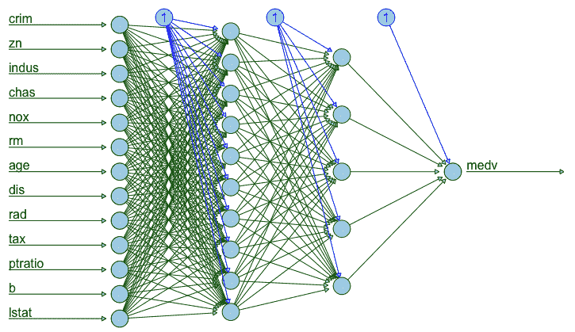
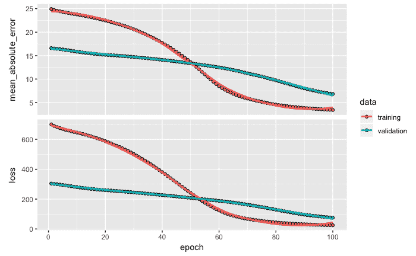
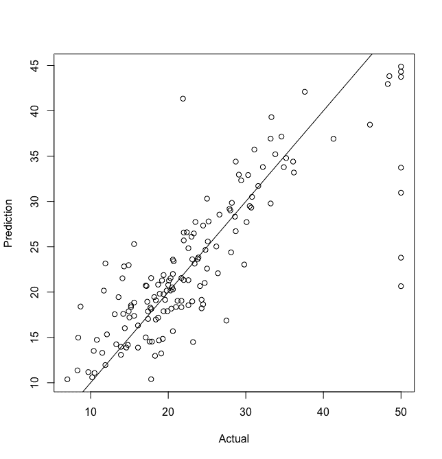
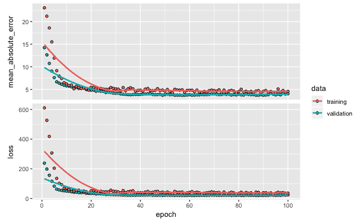
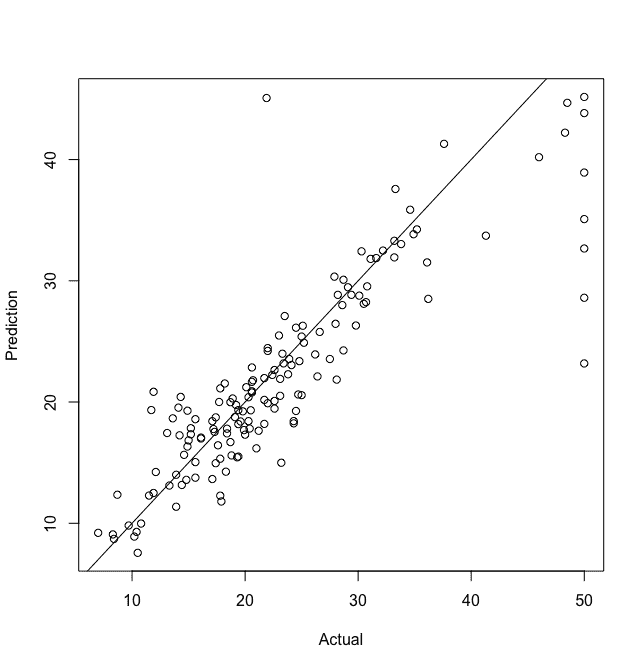
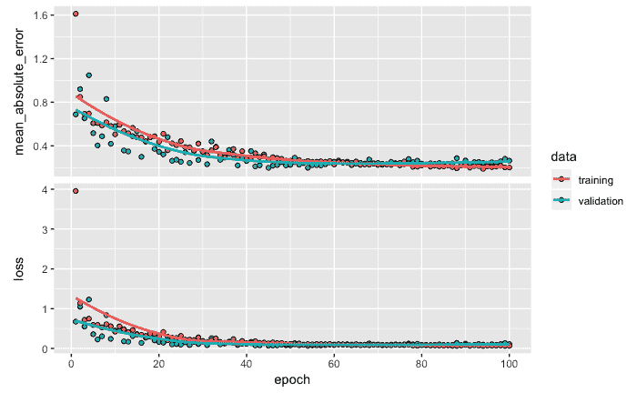
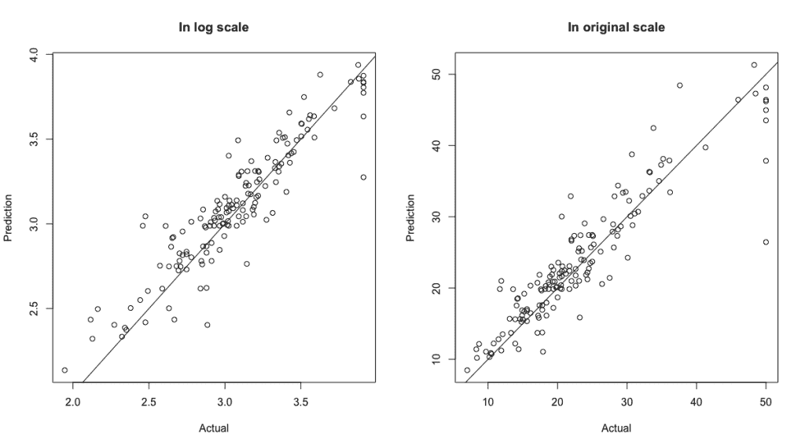

# 三、用于回归的深度神经网络

在上一章中，我们使用了一个包含分类目标变量的数据集，并回顾了使用 Keras 开发分类模型的步骤。在响应变量是数字的情况下，监督学习问题被归类为回归问题。在本章中，我们将开发一个数字响应变量的预测模型。为了说明开发预测模型的过程，我们将使用波士顿住房数据集，该数据集在`mlbench`包中提供。

在本章中，我们将讨论以下主题:

*   了解波士顿住房数据集
*   准备数据
*   创建和拟合用于回归的深度神经网络模型
*   模型评估和预测
*   性能优化技巧和最佳实践


# 了解波士顿住房数据集

在本章中，我们将使用六个库。这些库在下面的代码中列出:

```r
# Libraries
library(keras)
library(mlbench)
library(psych)
library(dplyr)
library(magrittr)
library(neuralnet)
```

`BostonHousing`数据的结构如下:

```r
# Data structure
data(BostonHousing)
str(BostonHousing)

OUTPUT
'data.frame':        506 obs. of  14 variables:

 $ crim   : num  0.00632 0.02731 0.02729 0.03237 0.06905 ...

 $ zn     : num  18 0 0 0 0 0 12.5 12.5 12.5 12.5 ...

 $ indus  : num  2.31 7.07 7.07 2.18 2.18 2.18 7.87 7.87 7.87 7.87 ...

 $ chas   : Factor w/ 2 levels "0","1": 1 1 1 1 1 1 1 1 1 1 ...

 $ nox    : num  0.538 0.469 0.469 0.458 0.458 0.458 0.524 0.524 0.524 0.524 ...

 $ rm     : num  6.58 6.42 7.18 7 7.15 ...

 $ age    : num  65.2 78.9 61.1 45.8 54.2 58.7 66.6 96.1 100 85.9 ...

 $ dis    : num  4.09 4.97 4.97 6.06 6.06 ...

 $ rad    : num  1 2 2 3 3 3 5 5 5 5 ...

 $ tax    : num  296 242 242 222 222 222 311 311 311 311 ...

 $ ptratio: num  15.3 17.8 17.8 18.7 18.7 18.7 15.2 15.2 15.2 15.2 ...

 $ b      : num  397 397 393 395 397 ...

 $ lstat  : num  4.98 9.14 4.03 2.94 5.33 ...

 $ medv   : num  24 21.6 34.7 33.4 36.2 28.7 22.9 27.1 16.5 18.9 ...
```

正如您在前面的输出中看到的，这个数据集有`506`观察值和`14`变量。在这 14 个变量中，13 个是数字变量，1 个(`chas`)是因子类型的变量。最后一个变量`medv`(以千美元为单位的自有住房的中值)是因变量或目标变量。其余 13 个变量是独立的。以下是所有变量的简要说明，以表格形式列出，便于参考:

| **变量** | **描述** |
| `crim` | 按城镇分列的人均犯罪率 |
| `zn` | 面积超过 25，000 平方英尺的住宅用地比例 |
| `indus` | 每个城镇的非零售商业用地比例 |
| `chas` | 查尔斯河虚拟变量(1，如果该区域以河流为界；否则为 0) |
| `nox` | 氮氧化物浓度(百万分之一) |
| `rm` | 每所住宅的平均房间数 |
| `age` | 1940 年以前建造的自有住房比例 |
| `dis` | 到五个波士顿就业中心的加权距离 |
| `rad` | 放射状公路可达性指数 |
| `tax` | 每万美元的全价值财产税税率 |
| `ptratio` | 按城镇分列的学生-教师比率 |
| `lstat` | 人口中低收入成员的百分比 |
| `medv` | 以千美元为单位的自有住房的中值 |

这一数据基于 1970 年的人口普查。Harrison 和 Rubinfeld 于 1978 年发表了一份使用该数据的详细统计研究(参考:[http://citeseerx.ist.psu.edu/viewdoc/download?doi = 10 . 1 . 1 . 926 . 5532&rep = rep 1&type = pdf](http://citeseerx.ist.psu.edu/viewdoc/download?doi=10.1.1.926.5532&rep=rep1&type=pdf)。


# 准备数据

为了便于使用，我们首先将`BostonHousing`数据的名称改为简单的`data`。然后使用`lapply`函数将因子类型的独立变量转换为数值类型。

注意，对于这个数据，唯一的因子变量是`chas`；然而，对于任何其他包含更多因子变量的数据集，这段代码都可以很好地工作。

看一下下面的代码:

```r
# Converting factor variables to numeric
data <- BostonHousing
data %>% lapply(function(x) as.numeric(as.character(x)))
data <- data.frame(data)
```

在前面的代码中，在将因子变量转换为`numeric`类型后，我们还将`data`的格式更改为`data.frame`。


# 可视化神经网络

为了可视化带有隐藏层的神经网络，我们将使用`neuralnet`函数。为了便于说明，在本例中将使用两个具有 10 个和 5 个单位的隐藏层。输入层有 13 个节点，基于 13 个独立变量。对于目标变量`medv`，输出层只有一个节点。使用的代码如下:

```r
# Neural network
n <- neuralnet(medv~crim+zn+indus+chas+nox+rm+age+dis+rad+tax+ptratio+b+lstat,
                data = data,
                hidden = c(10,5),
                linear.output = F,
                lifesign = 'full',
                rep=1)

# Plot
plot(n, col.hidden = "darkgreen", 
      col.hidden.synapse = 'darkgreen',
      show.weights = F, 
      information = F, 
      fill = "lightblue")
```

如前面的代码所示，结果保存在`n`中，然后用于绘制神经网络的架构，如下图所示:



从上图中可以看出，输入层有 13 个节点，对应 13 个独立变量。有两个隐藏层:第一个隐藏层有 10 个节点，第二个隐藏层有 5 个节点。隐藏层中的每个节点都连接到上一层和下一层中的所有节点。输出层有一个响应变量节点`medv`。


# 数据划分

接下来，我们将数据转换成矩阵格式。我们还将维度名称设置为`NULL`，这将变量的名称更改为默认名称`V1`、`V2`、`V3`、...，`V14`:

```r
data <- as.matrix(data)
dimnames(data) <- NULL 
```

然后，我们使用以下代码将数据划分为训练和测试数据集:

```r
# Data partitioning
set.seed(1234)
ind <- sample(2, nrow(data), replace = T, prob=c(.7, .3))
training <- data[ind==1, 1:13]
test <- data[ind==2, 1:13]
trainingtarget <- data[ind==1, 14]
testtarget <- data[ind==2, 14]
```

本例中使用了 70:30 的数据分割。为了保持数据分割的可重复性，我们使用一个随机种子`1234`。这将允许每次在任何计算机上执行数据划分时，在训练和测试数据中包含相同的样本。独立变量的数据存储在`training`中用于训练数据，存储在`test`中用于测试数据。类似地，基于相应分割数据的因变量`medv`的数据存储在`trainingtarget`和`testtarget`中。


# 正常化

为了使数据标准化，需要获得训练数据中所有独立变量的平均值和标准偏差。然后使用`scale`功能进行标准化:

对于训练和测试数据，平均值和标准偏差都基于所使用的训练数据。

```r
# Normalization
m <- colMeans(training)
sd <- apply(training, 2, sd)
training <- scale(training, center = m, scale = sd)
test <- scale(test, center = m, scale = sd)
```

该数据的数据准备步骤到此结束。应当注意的是，不同的数据集可能需要该数据集特有的额外步骤，例如，许多大型数据集可能具有非常大量的缺失数据值，并且它们可能需要额外的数据准备步骤，以达成处理缺失值的策略并在必要时输入缺失值。

在下一节中，我们将创建一个深度神经网络架构，然后拟合一个模型来准确预测数字目标变量。


# 创建和拟合用于回归的深度神经网络模型

为了创建和拟合回归问题的深度神经网络模型，我们将利用 Keras。用于模型架构的代码如下:

注意，基于数据，具有 13 个单位的输入层和具有 1 个单位的输出层是固定的；但是，要获得合适的隐藏层数和每层中的单元数，您需要进行实验。

```r
# Model architecture
model <- keras_model_sequential()
model %>%
   layer_dense(units = 10, activation = 'relu', input_shape = c(13)) %>%  
   layer_dense(units = 5, activation = 'relu') %>%
   layer_dense(units = 1) 
summary(model)

OUTPUT
___________________________________________________________________________

Layer (type)                     Output Shape                Param #      

===========================================================================

dense_1 (Dense)                   (None, 10)                   140          

___________________________________________________________________________

dense_2 (Dense)                   (None, 5)                    55           

___________________________________________________________________________

dense_3 (Dense)                   (None, 1)                     6            

===========================================================================

Total params: 201

Trainable params: 201

Non-trainable params: 0

___________________________________________________________________________
```

从前面的代码中可以看出，我们使用了`keras_model_sequential`函数来创建一个顺序模型。使用`layer_dense`功能定义神经网络的结构。由于有 13 个独立变量，`input_shape`用于指定 13 个单位。第一隐藏层具有`10`个单元，并且整流线性单元或`relu`被用作该第一隐藏层中的激活函数。第二个隐藏层有`5`个单元，用`relu`作为激活函数。最后一个`layer_dense`，有`1`单位，代表一个因变量`medv`。使用`summary`功能，您可以打印显示 201 个参数的模型摘要。


# 计算参数的总数

现在让我们看看如何获得这个模型的总共 201 个参数。`dense_1`层显示`140`参数。这些参数基于输入层中有 13 个单元与第一个隐藏层中的 10 个单元中的每一个相连，这意味着有 130 个参数(13 x 10)。剩余的 10 个参数来自第一个隐藏层中 10 个单元中每个单元的偏差项。类似地，50 个参数(10×5)来自两个隐藏层之间的连接，剩余的 5 个参数来自第二个隐藏层中 5 个单元中的每一个的偏差项。最后，`dense_3`有`6`参数((5 x 1) + 1)。因此，总共有 201 个参数基于在这个例子中选择的神经网络模型的结构。


# 编译模型

定义模型架构后，使用以下代码编译模型以配置学习过程:

```r
# Compile model
model %>% compile(loss = 'mse', 
   optimizer = 'rmsprop', 
   metrics = 'mae')
```

如前面的代码所示，我们将损失函数定义为均方误差，即`mse`。在这一步，还定义了`rmsprop`优化器和平均绝对误差或`mae`指标。我们选择这些是因为我们的响应变量是数字。


# 拟合模型

接下来，使用`fit`功能训练模型。请注意，随着模型训练的进行，我们在每个时期后都会得到一个视觉和数字摘要。下面的代码显示了最后三个时期的输出。我们得到了训练和验证数据的平均绝对误差和损失值。注意，正如[第一章](db6a812d-2bad-4f40-9e99-0e20abbe665c.xhtml)、*重温深度学习架构和技术*中指出的，每次我们训练一个网络，训练和验证误差都会因为网络权重的随机初始化而变化。即使使用相同的随机种子对数据进行分区，这样的结果也是意料之中的。为了获得可重复的结果，最好使用`save_model_hdf5`功能保存模型，然后在需要时重新加载。

用于训练网络的代码如下:

```r
# Fit model
model_one <- model %>%  
   fit(training,
   trainingtarget,
   epochs = 100,
   batch_size = 32,
   validation_split = 0.2)

OUTPUT from last 3 epochs

Epoch 98/100

284/284 [==============================] - 0s 74us/step - loss: 24.9585 - mean_absolute_error: 3.6937 - val_loss: 86.0545 - val_mean_absolute_error: 8.2678

Epoch 99/100

284/284 [==============================] - 0s 78us/step - loss: 24.6357 - mean_absolute_error: 3.6735 - val_loss: 85.4038 - val_mean_absolute_error: 8.2327

Epoch 100/100

284/284 [==============================] - 0s 92us/step - loss: 24.3293 - mean_absolute_error: 3.6471 - val_loss: 84.8307 - val_mean_absolute_error: 8.2015
```

从前面的代码中可以看出，模型是以小批量`32`的方式进行训练的，20%的数据被保留用于验证，以避免过度拟合。这里，运行`100`个时期或迭代来训练网络。一旦训练过程完成，与训练过程相关的信息保存在`model_one`中，然后可用于根据所有时期的训练和验证数据绘制损失和平均绝对误差:

```r
plot(model_one)
```

前面的代码行将返回以下输出。让我们看看训练和验证数据的损失和平均绝对误差(`model_one`)图:



从前面的图中，我们可以得出以下结论:

*   随着训练的进行，训练和验证数据的`mae`和`loss`值都减小。
*   训练数据的误差减少率在大约 60 个时期后降低。

开发预测模型后，我们可以通过评估模型的预测质量来评估其性能，这将在下一节中讨论。


# 模型评估和预测

模型评估是获得合适预测模型过程中的一个重要步骤。使用用于开发模型的训练数据，模型可能表现出良好的性能；然而，对模型的真正测试是用模型还没有见过的数据。让我们看看基于测试数据的模型性能。


# 估价

使用`evaluate`函数，在以下代码所示测试数据的帮助下，评估模型的性能:

```r
# Model evaluation
model %>%  evaluate(test, testtarget) 

OUTPUT
 ## $loss
 ## [1] 31.14591 
 ##
 ## $mean_absolute_error
 ## [1] 3.614594
```

从前面的输出中，我们可以看到测试数据的损失和平均绝对误差分别为`31.15`和`3.61`。我们稍后将使用这些数字来比较和评估我们对当前模型所做的更改是否有助于提高预测性能。


# 预言；预测；预告

让我们预测`test`数据的`medv`值，并使用以下代码将结果存储在`pred`中:

```r
# Prediction
pred <- model %>%  predict(test)
cbind(pred[1:10], testtarget[1:10])

OUTPUT
 [,1] [,2]
 [1,] 33.18942 36.2
 [2,] 18.17827 20.4
 [3,] 17.89587 19.9
 [4,] 13.07977 13.9
 [5,] 14.17268 14.8
 [6,] 19.09264 18.4
 [7,] 19.81316 18.9
 [8,] 21.00356 24.7
 [9,] 30.50263 30.8
[10,] 19.75816 19.4
```

我们可以使用`cbind`函数查看前 10 个预测值和实际值。输出中的第一列显示基于模型的预测值，第二列显示实际值。我们可以从输出中观察到以下情况:

*   测试数据中第一个样本的预测值约为`33.19`，实际值为`36.2`。该模型低估了响应大约`3`点。
*   对于第二个样本，模型低估了响应超过`2`点。
*   对于第十个样本，预测值和实际值非常接近。
*   对于第六个样本，模型高估了响应。

为了全面了解预测性能，我们可以绘制预测值与实际值的散点图。我们将使用以下代码:

```r
plot(testtarget, pred,
      xlab = 'Actual',
      ylab = 'Prediction')
 abline(a=0,b=1)
```

散点图显示了基于测试数据的预测响应值与实际响应值:



从上图中，我们可以看到预测模型的整体性能。实际值和预测值之间的关系是正的，近似线性。虽然我们可以看到该模型具有不错的性能，但显然还有进一步改进的余地，使数据点更接近截距为零、斜率为 1 的理想直线。我们将通过开发更深层次的神经网络模型来进一步探索对模型的改进。


# 丰富

在修改后的新模型中，我们将通过添加更多层来建立更深的网络。额外的层被期望显示数据中的模式，这是我们先前使用的较小的网络所不能显示的。


# 更深层次的网络架构

本实验使用的代码如下:

```r
# Model Architecture
model <- keras_model_sequential()
model %>%
 layer_dense(units = 100, activation = 'relu', input_shape = c(13)) %>% 
 layer_dropout(rate = 0.4) %>%
 layer_dense(units = 50, activation = 'relu') %>%
 layer_dropout(rate = 0.3) %>%
 layer_dense(units = 20, activation = 'relu') %>%
 layer_dropout(rate = 0.2) %>%
 layer_dense(units = 1)  
summary(model)

OUTPUT
 ## ___________________________________________________________________________
 ## Layer (type)                     Output Shape                  Param # 
 ## ===========================================================================
 ## dense_4 (Dense)                  (None, 100)                   1400 
 ## ___________________________________________________________________________
 ## dropout_1 (Dropout)              (None, 100)                   0 
 ## ___________________________________________________________________________
 ## dense_5 (Dense)                  (None, 50)                    5050 
 ## ___________________________________________________________________________
 ## dropout_2 (Dropout)              (None, 50)                    0 
 ## ___________________________________________________________________________
 ## dense_6 (Dense)                  (None, 20)                    1020 
 ## ___________________________________________________________________________
 ## dropout_3 (Dropout)              (None, 20)                    0 
 ## ___________________________________________________________________________
 ## dense_7 (Dense)                  (None, 1)                     21 
 ## ===========================================================================
 ## Total params: 7,491
 ## Trainable params: 7,491
 ## Non-trainable params: 0
 ## _________________________________________________________________________

# Compile model
model %>% compile(loss = 'mse', 
                   optimizer = 'rmsprop', 
                   metrics = 'mae')

# Fit model
model_two <- model %>%  
   fit(training,
       trainingtarget,
       epochs = 100,
       batch_size = 32, 
       validation_split = 0.2)
plot(model_two)
```

从前面的代码中，我们可以看到我们现在有三个隐藏层，分别有`100`、`50`和`20`个单元。我们还在每个隐藏层后添加了一个丢弃层，速率分别为`0.4`、`0.3`和`0.2`。举例来说，舍弃层的比率意味着 0.4 的比率意味着在训练时第一个隐藏层中 40%的单元被舍弃为零，这有助于避免过度拟合。这个模型的参数总数现在已经增加到`7,491`。请注意，在之前的模型中，参数的总数是`201`，显然我们正在寻求一个更大的神经网络。接下来，我们使用之前使用的相同设置编译模型，随后，我们将拟合模型并将结果存储在`model_two`中。


# 结果

下图提供了 100 个时期内`model_two`的损失和平均绝对误差:



从上图中，我们可以观察到以下情况:

*   训练和验证数据的平均绝对误差和损失值非常快地下降到低值，并且在大约 30 个时期之后，我们没有看到任何大的改善。
*   没有过度拟合的证据，因为训练和验证误差似乎彼此更接近。

我们可以使用以下代码获得测试数据的损失和平均绝对误差值:

```r
# Model evaluation
model %>%  evaluate(test, testtarget) 

OUTPUT
 ## $loss
 ## [1] 24.70368 
 ##
 ## $mean_absolute_error
 ## [1] 3.02175 

pred <- model %>%  predict(test)
plot(testtarget, pred,
     xlab = 'Actual', 
     ylab = 'Prediction')
abline(a=0,b=1)
```

使用`test`数据和`model_two`得到的损耗和平均绝对误差值分别为`24.70`和`3.02`。与我们从`model_one`获得的结果相比，这是一个显著的进步。

使用下图中预测值与实际响应值的散点图，我们可以直观地看到这种改进:



从上图中，我们可以看到，实际值与预测值的散点图的分布明显小于之前的散点图。这表明与以前的模型相比，预测性能更好。虽然`model_two`的表现优于之前的模型，但在更高的值时，我们可以看到目标值出现了明显的低估。因此，尽管我们已经开发了一个更好的模型，我们还可以进一步探索进一步改进这个预测模型的潜力。


# 性能优化技巧和最佳实践

提高模型性能可能涉及不同的策略。这里，我们将讨论两个主要策略。一种策略是对模型架构进行更改，并观察结果以获得任何有用的见解或改进的迹象。另一个策略可能涉及探索目标变量的转换。在本节中，我们将尝试这两种策略的组合。


# 输出变量的对数变换

为了克服目标变量在较高值时被严重低估的问题，让我们尝试对目标变量进行对数变换，看看这是否有助于我们进一步改进模型。我们的下一个模型对架构也有一些小的改变。在`model_two`中，我们没有注意到任何与过度拟合相关的重大问题或证据，因此，我们可以稍微增加单位数量，也可以稍微降低辍学率。下面是这个实验的代码:

```r
# log transformation and model architecture 
trainingtarget <- log(trainingtarget)
 testtarget <- log(testtarget)
 model <- keras_model_sequential()
 model %>%
   layer_dense(units = 100, activation = 'relu', input_shape = c(13)) %>%  
   layer_dropout(rate = 0.4) %>% 
   layer_dense(units = 50, activation = 'relu') %>%
   layer_dropout(rate = 0.2) %>%
   layer_dense(units = 25, activation = 'relu') %>%
   layer_dropout(rate = 0.1) %>%
   layer_dense(units = 1)
 summary(model)

OUTPUT
## ___________________________________________________________________________
 ## Layer (type)                     Output Shape                  Param # 
 ## ===========================================================================
 ## dense_8 (Dense)                  (None, 100)                   1400 
 ## ___________________________________________________________________________
 ## dropout_4 (Dropout)              (None, 100)                   0 
 ## ___________________________________________________________________________
 ## dense_9 (Dense)                  (None, 50)                    5050 
 ## ___________________________________________________________________________
 ## dropout_5 (Dropout)              (None, 50)                    0 
 ## ___________________________________________________________________________
 ## dense_10 (Dense)                 (None, 25)                    1275 
 ## ___________________________________________________________________________
 ## dropout_6 (Dropout)              (None, 25)                    0 
 ## ___________________________________________________________________________
 ## dense_11 (Dense)                 (None, 1)                     26 
 ## ===========================================================================
 ## Total params: 7,751
 ## Trainable params: 7,751
 ## Non-trainable params: 0
 ## ___________________________________________________________________________
```

我们将把第三个隐藏层的单位数从`20`增加到`25`。第二和第三隐藏层的辍学率也分别降低到`0.2`和`0.1`。请注意，参数的总数现在已经增加到`7751`。

我们接下来编译模型，然后拟合模型。模型结果存储在`model_three`中，我们用它来绘制图形，如下面的代码所示:

```r
# Compile model
model %>% compile(loss = 'mse', 
                   optimizer = optimizer_rmsprop(lr = 0.005),
                   metrics = 'mae')

# Fit model
 model_three <- model %>%  
   fit(training,
       trainingtarget,
       epochs = 100,
       batch_size = 32, 
       validation_split = 0.2)
plot(model_three)
```

以下显示了训练和验证数据的损失和平均绝对误差输出(`model_three`):



从前面的图中我们可以看出，虽然图中的值由于对数变换而不能与之前的数字直接比较，但我们可以看到，对于平均绝对误差和损失，总误差在大约 50 个时期后下降并变得稳定。


# 模型性能

我们还获得了这个新模型的`loss`和`mae`值，但同样，获得的数字不能与对数标度的前两个模型直接比较:

```r
# Model evaluation
model %>%  evaluate(test, testtarget) 

OUTPUT
## $loss
 ## [1] 0.02701566
 ##
 ## $mean_absolute_error
 ## [1] 0.1194756 

pred <- model %>%  predict(test)
 plot(testtarget, pred)
```

我们获得了实际值(对数转换)与基于测试数据的预测值的散点图。我们还得到了原始标度下的实际值与预测值的散点图，以便与早期的图进行比较。预测响应值与实际响应值(`model_three`)的散点图如下图所示:



从上图中，我们可以看到，在早期模型中观察到的显著低估模式在对数标度和原始标度中都有所改善。在原始比例中，较高值处的数据点相对更接近对角线，这表明模型的预测性能有所提高。


# 摘要

在本章中，我们介绍了当响应变量为数字类型时开发预测模型的步骤。我们从具有 201 个参数的神经网络模型开始，然后开发了具有超过 7000 个参数的深度神经网络模型。您可能已经注意到，与上一章相比，在本章中，我们使用了相对更深入和更复杂的神经网络模型，在上一章中，我们开发了一个具有分类性质的目标变量的分类模型。在[第 2 章](c5c236d5-fc58-4d90-95b0-2b05b148b187.xhtml)、*用于多类分类的深度神经网络*和[第 3 章](07c9aa4a-1c93-490a-bfcd-7c4bcde639d5.xhtml)、*用于回归的深度神经网络*中，我们基于结构化的数据开发了模型。在下一章，我们继续讨论数据类型是非结构化的问题。更具体地说，我们将处理数据的图像类型，并使用深度神经网络模型检查图像分类和识别的问题。

在下一章中，我们将介绍使用深度神经网络开发图像识别和预测模型所需的步骤。