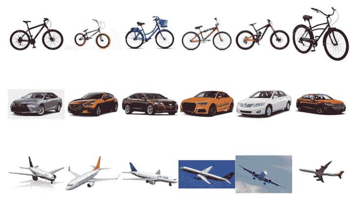
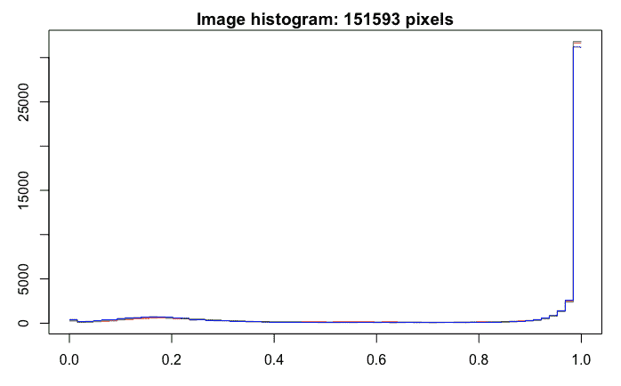
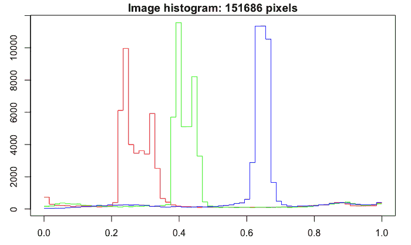
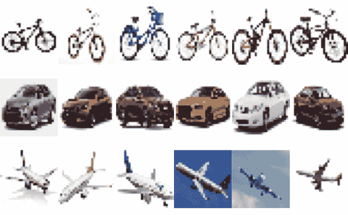
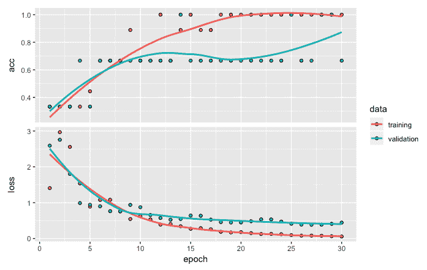
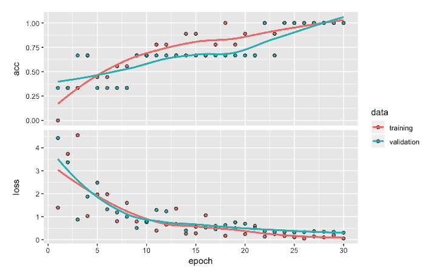

<title>Image Classification and Recognition</title>  

# 图像分类和识别

在前几章中，我们研究了为分类和回归问题开发深度神经网络模型的过程。在这两种情况下，我们处理的是结构化数据，模型是监督学习类型的，目标变量是可用的。图像或图片属于非结构化数据范畴。在本章中，我们将借助一个易于理解的示例，使用 Keras 包来说明深度学习神经网络在图像分类和识别中的应用。我们将从一个小样本开始，来说明开发一个图像分类模型的步骤。我们将把这个模型应用到涉及图像或图片标记的监督学习环境中。

Keras 包含几个用于图像分类的内置数据集，如 CIFAR10、CIFAR100、MNIST 和时尚 MNIST。CIFAR10 包含 50，000 个 32 x 32 颜色训练图像和 10，000 个测试图像，具有 10 个标签类别。另一方面，CIFAR100 包含 50，000 个 32 x 32 颜色训练图像和 10，000 个测试图像，标签类别多达 100 个。MNIST 数据集有 60，000 幅 28 x 28 灰度图像用于训练，10，000 幅图像用于测试 10 个不同的数字。时尚-MNIST 数据集有 60，000 幅 28 x 28 灰度图像用于训练，10，000 幅图像用于测试 10 个时尚类别。这些数据集的格式已经可以直接用于开发深度神经网络模型，只需最少的数据准备相关步骤。然而，为了更好地处理图像数据，我们将从将原始图像从我们的计算机读入 RStudio 开始，并回顾使图像数据为构建分类模型做好准备所需的所有步骤。

所涉及的步骤包括探索图像数据、调整图像大小和形状、一键编码、开发顺序模型、编译模型、拟合模型、评估模型、进行预测以及使用混淆矩阵进行模型性能评估。

更具体地说，在本章中，我们将讨论以下主题:

*   处理图像数据
*   数据准备
*   创建和拟合模型
*   模型评估和预测
*   性能优化技巧和最佳实践

<title>Handling image data</title>  

# 处理图像数据

在本节中，我们将把图像数据读入 R，并进一步研究它，以了解图像数据的各种特征。读取和显示图像的代码如下:

```
# Libraries
library(keras)
library(EBImage)

# Reading and plotting images
setwd("~/Desktop/image18")
temp = list.files(pattern="*.jpg")
mypic <- list()
for (i in 1:length(temp)) {mypic[[i]] <- readImage(temp[i])}
par(mfrow = c(3,6))
for (i in 1:length(temp)) plot(mypic[[i]])
par(mfrow = c(1,1))
```

从前面的代码中可以看出，我们将利用`keras`和`EBImage`库。`EBImage`库对于处理和探索图像数据很有用。我们将从读取存储在我电脑的`image18`文件夹中的 18 个 JPEG 图像文件开始。这些图片各包含 6 张从互联网上下载的自行车、汽车和飞机的图片。使用`readImage`功能读取这些图像文件，并存储在`mypic`中。

以下截图显示了所有 18 张图片:



从前面的截图中，我们可以看到自行车、汽车和飞机的六幅图像。你可能已经注意到，并非所有的图片都是同样的大小。例如，第五辆和第六辆自行车的尺寸明显不同。类似地，第四架和第五架飞机的大小也明显不同。让我们使用下面的代码更仔细地看看第五辆自行车的数据:

```
# Exploring 5th image data
print(mypic[[5]])

OUTPUT
Image 
 colorMode    : Color 
 storage.mode : double 
 dim          : 299 169 3 
 frames.total : 3 
 frames.render: 1 

imageData(object)[1:5,1:6,1]
 [,1] [,2] [,3] [,4] [,5] [,6]
[1,]    1    1    1    1    1    1
[2,]    1    1    1    1    1    1
[3,]    1    1    1    1    1    1
[4,]    1    1    1    1    1    1
[5,]    1    1    1    1    1    1

hist(mypic[[5]])
```

使用`print`函数，我们可以看到一辆自行车的图像(非结构化数据)是如何被转换成数字(结构化数据)的。第五辆自行车的尺寸是 299 x 169 x 3，通过将这三个数相乘得到总共 151，593 个数据点或像素。第一个数字 299 表示以像素为单位的图像宽度，第二个数字 169 表示以像素为单位的图像高度。请注意，彩色图像由代表红色、蓝色和绿色的三个通道组成。从数据中提取的小表显示了 *x* 维度中的前五行数据，以及 *y* 维度中的前六行数据，并且 *z* 维度的值为 1。虽然表体中的所有值都是`1`，但是它们应该在`0`和`1`之间变化。

彩色图像有红色、绿色和蓝色通道。灰度图像只有一个通道。

第五辆自行车的这些数据点用于创建直方图，如下面的屏幕截图所示:



前面的直方图显示了第五幅图像数据的强度值的分布。可以看出，对于该图像，大多数数据点具有高强度值。

现在让我们看看下面基于第 16 张图像(飞机图像)的数据直方图，以作比较:



从前面的直方图中，我们可以看到该图像对于红色、绿色和蓝色具有不同的强度值。一般来说，强度值介于 0 和 1 之间。接近零的数据点代表图像中较暗的颜色，接近一的数据点代表图像中较亮的颜色。

让我们用下面的代码来看看与第 16 张图片有关的数据，一架飞机:

```
# Exploring 16th image data
print(mypic[[16]])

OUTPUT

Image 
 colorMode : Color 
 storage.mode : double 
 dim : 318 159 3 
 frames.total : 3 
 frames.render: 1 

imageData(object)[1:5,1:6,1]
 [,1] [,2] [,3] [,4] [,5] [,6]
[1,] 0.2549020 0.2549020 0.2549020 0.2549020 0.2549020 0.2549020
[2,] 0.2549020 0.2549020 0.2549020 0.2549020 0.2549020 0.2549020
[3,] 0.2549020 0.2549020 0.2549020 0.2549020 0.2549020 0.2549020
[4,] 0.2588235 0.2588235 0.2588235 0.2588235 0.2588235 0.2588235
[5,] 0.2588235 0.2588235 0.2588235 0.2588235 0.2588235 0.2588235
```

从前面代码提供的输出中，我们可以看到两幅图像具有不同的尺寸。第 16 幅图像的尺寸为 318 x 159 x 3，总共有 151，686 个数据点或像素。

为了准备这些数据来开发图像分类模型，我们将从调整所有图像的尺寸到相同的尺寸开始。

<title>Data preparation</title>  

# 数据准备

在这一节中，我们将回顾为开发图像分类模型准备图像数据的步骤。这些步骤将涉及调整图像大小以获得所有图像的相同大小，随后是整形、数据分区和响应变量的一键编码。

<title>Resizing and reshaping</title>  

# 调整大小和形状

为了准备用于开发分类模型的数据，我们首先使用以下代码将所有 18 幅图像的尺寸调整为相同的大小:

```
# Resizing
for (i in 1:length(temp)) {mypic[[i]] <- resize(mypic[[i]], 28, 28)}
```

从前面的代码中可以看出，所有图像的大小现在都调整为 28 x 28 x 3。让我们再次绘制所有的图像，看看使用下面的代码调整大小的影响:

```
# Plot images
par(mfrow = c(3,6))
for (i in 1:length(temp)) plot(mypic[[i]])
par(mfrow = c(1,1)
```

当我们缩小图片的尺寸时，会导致像素数量减少，进而导致图片质量下降，如下图所示:



接下来，我们将使用以下代码将 28 x 28 x 3 的维度重新调整为 28 x 28 x 3 的单一维度(或 2，352 个向量):

```
# Reshape
for (i in 1:length(temp)) {mypic[[i]] <- array_reshape(mypic[[i]], c(28, 28,3))}
str(mypic)

OUTPUT

List of 18
 $ : num [1:28, 1:28, 1:3] 1 1 1 1 1 1 1 1 1 1 ...
 $ : num [1:28, 1:28, 1:3] 1 1 1 1 1 ...
 $ : num [1:28, 1:28, 1:3] 1 1 1 1 1 1 1 1 1 1 ...
 $ : num [1:28, 1:28, 1:3] 1 1 1 1 1 1 1 1 1 1 ...
 $ : num [1:28, 1:28, 1:3] 1 1 1 1 1 1 1 1 1 1 ...
 $ : num [1:28, 1:28, 1:3] 1 1 1 1 1 1 1 1 1 1 ...
 $ : num [1:28, 1:28, 1:3] 0.953 0.953 0.953 0.953 0.953 ...
 $ : num [1:28, 1:28, 1:3] 1 1 1 1 1 1 1 1 1 1 ...
 $ : num [1:28, 1:28, 1:3] 1 1 1 1 1 1 1 1 1 1 ...
 $ : num [1:28, 1:28, 1:3] 1 1 1 1 1 1 1 1 1 1 ...
 $ : num [1:28, 1:28, 1:3] 1 1 1 1 1 1 1 1 1 1 ...
 $ : num [1:28, 1:28, 1:3] 1 1 1 1 1 1 1 1 1 1 ...
 $ : num [1:28, 1:28, 1:3] 1 1 1 1 1 1 1 1 1 1 ...
 $ : num [1:28, 1:28, 1:3] 1 1 1 1 1 1 1 1 1 1 ...
 $ : num [1:28, 1:28, 1:3] 1 1 1 1 0.328 ...
 $ : num [1:28, 1:28, 1:3] 0.26 0.294 0.312 0.309 0.289 ...
 $ : num [1:28, 1:28, 1:3] 0.49 0.49 0.49 0.502 0.502 ...
 $ : num [1:28, 1:28, 1:3] 1 1 1 1 1 1 1 1 1 1 ..
```

通过使用`str(mypic)`观察前面数据的结构，我们可以看到列表中有 18 个不同的条目，对应于我们开始时的 18 幅图像。

接下来，我们将创建培训、验证和测试数据。

<title>Training, validation, and test data</title>  

# 培训、验证和测试数据

我们将分别使用自行车、汽车和飞机的前三幅图像进行训练，每种类型的第四幅图像用于验证，每种类型的其余两幅图像用于测试。因此，训练数据将有九个图像，验证数据将有三个图像，测试数据将有六个图像。下面是实现这一点的代码:

```
# Training Data
a <- c(1:3, 7:9, 13:15)
trainx <- NULL
for (i in a) {trainx <- rbind(trainx, mypic[[i]]) }
str(trainx)

OUTPUT

num [1:9, 1:2352] 1 1 1 1 0.953 ...

# Validation data
b <- c(4, 10, 16)
validx <- NULL
for (i in b) {validx <- rbind(validx, mypic[[i]]) }
str(validx)

OUTPUT

num [1:3, 1:2352] 1 1 0.26 1 1 ...

# Test Data
c <- c(5:6, 11:12, 17:18)
testx <- NULL
for (i in c) {testx <- rbind(testx, mypic[[i]])}
str(testx)

OUTPUT

num [1:6, 1:2352] 1 1 1 1 0.49 ...
```

正如您在前面的代码中看到的，我们将使用`rbind`函数在创建训练、验证和`test`数据时组合每个图像的数据行。在组合来自九个图像的数据行之后，`trainx`的结构指示有 9 行和 2352 列。类似地，对于验证数据，我们有 3 行 2，352 列，对于测试数据，我们有 6 行 2，352 列。

<title>One-hot encoding</title>  

# 一键编码

对于响应变量的一次性编码，我们使用以下代码:

```
# Labels
trainy <- c(0,0,0,1,1,1,2,2,2)
validy <- c(0,1,2)
testy <- c(0,0,1,1,2,2)

# One-hot encoding
trainLabels <- to_categorical(trainy)
validLabels <- to_categorical(validy)
testLabels <- to_categorical(testy)
trainLabels

OUTPUT
 [,1] [,2] [,3]

 [1,]    1    0    0

 [2,]    1    0    0

 [3,]    1    0    0

 [4,]    0    1    0

 [5,]    0    1    0

 [6,]    0    1    0

 [7,]    0    0    1

 [8,]    0    0    1

 [9,]    0    0    1
```

从前面的代码中，我们可以看到以下内容:

*   我们在`trainy`、`validy`和`testy`中存储了每个图像的目标值，其中`0`、`1`和`2`分别表示自行车、汽车和飞机图像。
*   我们通过使用`to_categorical`函数对`trainy`、`validy`和`testy`进行一键编码。这里的一键编码有助于将因子变量转换成零和一的组合。

现在，我们有了可以用于开发深度神经网络分类模型的数据格式，这就是我们将在下一节中做的事情。

<title>Creating and fitting the model</title>  

# 创建和拟合模型

在这一部分中，我们将开发一个图像分类模型来对自行车、汽车和飞机的图像进行分类。我们将首先指定一个模型架构，然后我们将编译该模型，然后使用训练和验证数据来拟合该模型。

<title>Developing the model architecture</title>  

# 开发模型架构

在开发模型架构时，我们首先创建一个顺序模型，然后添加不同的层。以下是代码:

```
# Model architecture
model <- keras_model_sequential() 
model %>% 
  layer_dense(units = 256, activation = 'relu', input_shape = c(2352)) %>% 
  layer_dense(units = 128, activation = 'relu') %>% 
  layer_dense(units = 3, activation = 'softmax')
summary(model)

OUTPUT
______________________________________________________________________
Layer (type)                   Output Shape              Param # 
======================================================================
dense_1 (Dense)                (None, 256)               602368 
______________________________________________________________________
dense_2 (Dense)                (None, 128)               32896 
_____________________________________________________________________
dense_3 (Dense)                (None, 3)                  387 
======================================================================
Total params: 635,651
Trainable params: 635,651
Non-trainable params: 0
_______________________________________________________________________
```

从前面的代码可以看出，输入层有`2352`个单元(28 x 28 x 3)。对于初始模型，我们使用两个隐藏层，分别为 256 和 128 个单元。对于两个隐藏层，我们将使用`relu`激活功能。对于输出层，我们将使用 3 个单位，因为目标变量有 3 个类，分别代表自行车、汽车和飞机。该模型的参数总数为 635，651。

<title>Compiling the model</title>  

# 编译模型

开发完模型架构后，我们可以使用以下代码编译模型:

```
# Compile model
model %>% compile(loss = 'categorical_crossentropy',
  optimizer = 'adam',
  metrics = 'accuracy')
```

我们通过使用`categorical_crossentropy`来编译损失模型，因为我们正在进行多类分类。我们已经分别为优化器和指标指定了`adam`和`accuracy`。

<title>Fitting the model</title>  

# 拟合模型

现在我们准备训练模型。以下是这方面的代码:

```
# Fit model
model_one <- model %>% fit(trainx, 
                         trainLabels, 
                         epochs = 30, 
                         batch_size = 32, 
                         validation_data =  list(validx, validLabels))
plot(model_one)
```

从前面的代码中，我们可以看到以下事实:

*   我们可以使用存储在`trainx`中的`independent`变量和存储在`trainLabels`中的`target`变量来拟合模型。为了防止过度配合，我们将使用`validation_data`。

注意，在前面的章节中，我们通过指定某个百分比来使用`validation_split`，比如 20%；然而，如果我们以 20%的比率使用`validation_split`，它将使用最后 20%的训练数据(所有飞机图像)进行验证。

*   这将产生这样的情况，其中训练数据没有来自飞机图像的样本，并且分类模型将仅基于自行车和汽车图像。

*   因此，得到的图像分类模型会有偏差，并且仅在自行车和汽车图像上表现良好。因此，在这种情况下，我们没有使用`validation_split `函数，而是使用了`validation_data`，我们已经确保在训练和验证数据中都有每种类型的样本。

下图显示了分别针对训练和验证数据的 30 个时期的损失和准确性:



从前面的图中，我们可以得出以下结论:

*   从处理精度的图形部分，我们可以看到，从第 18 个历元开始，训练数据的精度值达到最高值 1。
*   另一方面，基于验证数据的准确性主要在三分之二左右，即 66.7%。因为我们有来自用于验证的三个图像的数据，如果来自验证数据的所有三个图像都被正确分类，则报告的准确度将是 1。在这种情况下，三分之二的图像被正确分类，这导致 66.7%的准确率。
*   从处理损失的图表部分，我们可以看到，对于训练数据，损失值在 8 个时期后从大约 3 显著下降到小于 1。他们从那时起继续减少；然而，损失值的下降速度减慢。

*   基于验证数据，可以看到大致相似的模式。
*   此外，由于损失在其计算中使用概率值，我们观察到与准确性相关图相比，损失相关图的趋势更清晰。

接下来，让我们更详细地评估模型的图像分类性能，以了解其行为。

<title>Model evaluation and prediction</title>  

# 模型评估和预测

在本节中，我们将进行模型评估，并在预测的帮助下为训练和测试数据创建混淆矩阵。让我们从使用训练数据评估模型的图像分类性能开始。

<title>Loss, accuracy, and confusion matrices for training data</title>  

# 训练数据的损失、准确性和混淆矩阵

我们现在将获得训练数据的损失和准确性值，然后使用以下代码创建混淆矩阵:

```
# Model evaluation
model %>% evaluate(trainx, trainLabels)

OUTPUT
12/12 [==============================] - 0s 87us/step
$loss
[1] 0.055556579307

$acc
[1] 1

# Confusion matrix
pred <- model %>%   predict_classes(trainx)
table(Predicted=pred, Actual=trainy)

OUTPUT
 Actual
Predicted 0 1 2
 0 3 0 0
 1 0 3 0
 2 0 0 3
```

从前面的输出可以看出，损耗和精度值分别是`0.056`和`1`。基于训练数据的混淆矩阵指示所有九个图像都被正确地分类为三个类别，因此得到的准确度是 1。

<title>Prediction probabilities for training data</title>  

# 训练数据的预测概率

我们现在可以查看该模型提供的训练数据中所有九幅图像的三个类别的概率。以下是代码:

```
# Prediction probabilities
prob <- model %>%   predict_proba(trainx) 
cbind(prob, Predicted_class = pred, Actual = trainy)

OUTPUT                                                
                                                    Predicted_class Actual

 [1,] 0.9431666135788 0.007227868307 0.049605518579          0        0

 [2,] 0.8056846261024 0.005127847660 0.189187481999          0        0

 [3,] 0.9556384682655 0.001881886506 0.042479615659          0        0

 [4,] 0.0018005876336 0.988727569580 0.009471773170          1        1

 [5,] 0.0002136278927 0.998095452785 0.001690962003          1        1

 [6,] 0.0008950306219 0.994426369667 0.004678600468          1        1

 [7,] 0.0367377623916 0.010597365908 0.952664911747          2        2

 [8,] 0.0568452328444 0.011656147428 0.931498587132          2        2

 [9,] 0.0295505002141 0.011442330666 0.959007143974          2        2
```

在前面的输出中，前三列显示图像是自行车、汽车或飞机的概率，这三个概率的总和是 1。我们可以从输出中观察到以下情况:

*   对于自行车、汽车和飞机，训练数据中第一幅图像的概率分别为`0.943`、`0.007`和`0.049`。由于概率最高的是第一类，所以基于模型的预测类是`0`(针对自行车)，这也是图像的实际类。
*   虽然所有 9 幅图像都被正确分类，但正确分类的概率从`0.806`(图像 2)到`0.998`(图像 5)不等。
*   对于汽车图像(第 4 行到第 6 行)，正确分类的概率范围从`0.989`到`0.998`，并且对于所有三幅图像都是一致高的。因此，这种分类模型在对汽车图像进行分类时表现最佳。
*   对于自行车图像(第 1 行到第 3 行)，正确分类的概率在`0.806`到`0.956`之间，这表明对自行车图像进行正确分类有一定的难度。

*   对于代表自行车图像的第二个样本，第二高的概率是作为飞机图像的`0.189`。显然，这个模型在判断这张图片是自行车还是飞机时有点困惑。
*   对于飞机图像(第 7 行到第 9 行)，正确分类的概率范围从`0.931`到`0.959`，这对于所有三幅图像也是一致高的。

通过查看预测概率，我们可以更深入地了解模型的分类性能，这不能仅通过查看准确性值来获得。然而，虽然训练数据的良好性能是必要的，但这不足以达到可靠的图像分类模型。当分类模型遇到过度拟合问题时，我们很难根据模型没有看到的测试数据的训练数据来复制好的结果。因此，对一个好的分类模型的真正测试是当它对测试数据表现良好时。现在让我们回顾一下测试数据模型的图像分类性能。

<title>Loss, accuracy, and confusion matrices for test data</title>  

# 测试数据的损失、准确性和混淆矩阵

我们现在可以获得测试数据的损失和准确性值，然后使用以下代码创建混淆矩阵:

```
# Loss and accuracy
model %>% evaluate(testx, testLabels)

OUTPUT
6/6 [==============================] - 0s 194us/step
$loss
[1] 0.5517520905

$acc
[1] 0.8333333

# Confusion matrix
pred <- model %>%   predict_classes(testx)
table(Predicted=pred, Actual=testy)

OUTPUT
 Actual
Predicted 0 1 2
 0 2 0 0
 1 0 1 0
 2 0 1 2
```

从前面的输出可以看出，测试数据中图像的损失值和精度值分别是`0.552`和`0.833`。这些结果略逊于我们看到的训练数据的数字；然而，当基于看不见的数据评估模型时，性能会有所下降。混淆矩阵指示一个错误分类的图像，其中汽车的图像被误认为是飞机的图像。因此，对于六个正确分类中的五个，基于测试数据的模型准确度是 83.3%。现在，让我们通过调查基于测试数据中的图像的概率值来更深入地了解模型的预测性能。

<title>Prediction probabilities for test data</title>  

# 测试数据的预测概率

我们现在可以查看测试数据中所有六个图像的三个类别的概率。以下是代码:

```
# Prediction probabilities
prob <- model %>%   predict_proba(testx) 
cbind(prob, Predicted_class = pred, Actual = testy)

OUTPUT                                         

 Predicted_class Actual

[1,] 0.587377548218 0.02450981364 0.38811263442           0      0

[2,] 0.532718658447 0.04708640277 0.42019486427           0      0

[3,] 0.115497209132 0.18486714363 0.69963568449           2      1

[4,] 0.001700860681 0.98481327295 0.01348586939           1      1

[5,] 0.230999588966 0.03030913882 0.73869132996           2      2

[6,] 0.112148292363 0.02054920420 0.86730253696           2      2
```

通过观察这些预测的概率，我们可以得出以下结论:

*   自行车图像预测正确，如前两个示例所示。然而，预测概率在`0.587`和`0.533`相对较低。
*   汽车图像(第 3 行和第 4 行)的结果是混合的，第四个样本以高概率`0.985`正确预测，但是第三个汽车图像以大约`0.7`的概率被错误分类为飞机。
*   飞机图像由第五和第六个样本表示。这两幅图像的预测概率分别为`0.739`和`0.867`。
*   尽管六幅图像中有五幅被正确分类，但与模型在训练数据上的表现相比，许多预测概率相对较低。

因此，总的来说，我们可以说，该模型的性能肯定还有进一步改进的余地。在下一节中，我们将探讨如何提高模型的性能。

<title>Performance optimization tips and best practices</title>  

# 性能优化技巧和最佳实践

在这一节中，我们将探索一个更深层次的网络来提高图像分类模型的性能。我们将查看结果进行比较。

<title>Deeper networks</title>  

# 更深的网络

本节中用于试验更深层次网络的代码如下:

```
# Model architecture
model <- keras_model_sequential() 
model %>% 
  layer_dense(units = 512, activation = 'relu', input_shape = c(2352)) %>% 
  layer_dropout(rate = 0.1) %>%
  layer_dense(units = 256, activation = 'relu') %>%
  layer_dropout(rate = 0.1) %>%
  layer_dense(units = 3, activation = 'softmax')
summary(model)

OUTPUT
_______________________________________________________________________
Layer (type)                    Output Shape             Param # 
=======================================================================
dense_1 (Dense)                  (None, 512)               1204736 
_______________________________________________________________________
dropout_1 (Dropout)              (None, 512)               0 
_______________________________________________________________________
dense_2 (Dense)                  (None, 256)              131328 
_______________________________________________________________________
dropout_2 (Dropout)              (None, 256)               0 
_______________________________________________________________________
dense_3 (Dense)                  (None, 3)                 771 
=======================================================================
Total params: 1,336,835
Trainable params: 1,336,835
Non-trainable params: 0
_______________________________________________________________________

# Compile model
model %>% compile(loss = 'categorical_crossentropy',
  optimizer = 'adam',
  metrics = 'accuracy')

# Fit model
model_two <- model %>% fit(trainx, 
 trainLabels, 
 epochs = 30, 
 batch_size = 32, 
 validation_data = list(validx, validLabels))
plot(model_two)
```

从前面的代码中，我们可以看到以下内容:

*   我们将第一和第二隐藏层中的单元数量分别增加到`512`和`256`。
*   我们还在每个隐藏层后添加了 10%的脱落率的脱落层。
*   这一变化的参数总数现在已经上升到`1336835`。
*   这一次，我们也将运行模型 50 个纪元。我们不对模型进行任何其他更改。

下图提供了 50 个时期的训练和验证数据的准确度和损失值:



从前面的图表中，我们可以看到以下内容:

*   与早期模型相比，在精确度和损耗值方面观察到了一些重大变化。
*   50 个时期后，训练和验证数据的准确度都是 100%。
*   此外，损失和准确性的训练和验证相关曲线的接近程度表明该图像分类模型不太可能遭受过拟合问题。

<title>Results</title>  

# 结果

为了进一步探索模型的图像分类性能的任何变化，这些变化从图形摘要中可能不明显，让我们看一些数字摘要:

1.  我们将首先查看基于训练数据的结果，并将使用以下代码:

```
# Loos and accuracy
model %>% evaluate(trainx, trainLabels)
OUTPUT
12/12 [==============================] - 0s 198us/step
$loss
[1] 0.03438224643

$acc
[1] 1

# Confusion matrix
pred <- model %>%   predict_classes(trainx)
table(Predicted=pred, Actual=trainy)

OUTPUT
 Actual
Predicted 0 1 2
 0 3 0 0
 1 0 3 0
 2 0 0 3
```

从前面的输出中，我们可以看到损耗值现在已经减少到`0.034`，精度保持在`1.0`。对于训练数据，我们获得了与之前相同的混淆矩阵结果，因为所有九幅图像都被模型正确分类，这给出了 100%的准确度水平。

2.  为了更深入地了解模型的分类性能，我们使用了以下代码和输出:

```
# Prediction probabilities
prob <- model %>%   predict_proba(trainx) 
cbind(prob, Predicted_class = pred, Actual = trainy)

OUTPUT        
 Predicted_class Actual

 [1,] 0.97638195753098 0.0071088117547 0.01650915294886     0         0

 [2,] 0.89875286817551 0.0019298568368 0.09931717067957     0         0

 [3,] 0.98671281337738 0.0004396488657 0.01284754090011     0         0

 [4,] 0.00058794603683 0.9992876648903 0.00012432398216     1         1

 [5,] 0.00005639552546 0.9999316930771 0.00001191849515     1         1

 [6,] 0.00020669832884 0.9997472167015 0.00004611289114     1         1

 [7,] 0.03771930187941 0.0022936603054 0.95998704433441     2         2

 [8,] 0.08463590592146 0.0022607713472 0.91310334205627     2         2

 [9,] 0.03016609139740 0.0019471622072 0.96788680553436     2         2
```

根据我们作为训练数据的输出而获得的前述预测概率，我们可以得出以下观察结果:

*   正确的分类现在比早期的模型有更高的概率值。
*   基于第二行的最低正确分类概率是`0.899`。
*   因此，与以前的模型相比，这个模型在正确分类图像时似乎更有把握。

3.  现在让我们看看测试数据中是否也看到了这种改进。我们将使用以下代码和输出:

```
# Loss and accuracy
model %>% evaluate(testx, testLabels)

OUTPUT

6/6 [==============================] - 0s 345us/step
$loss
[1] 0.40148338683

$acc
[1] 0.8333333

# Confusion matrix
pred <- model %>%   predict_classes(testx)
table(Predicted=pred, Actual=testy)

OUTPUT
 Actual
Predicted 0 1 2
 0 2 0 0
 1 0 1 0
 2 0 1 2
```

如前面的输出所示，测试数据丢失和精度值分别为`0.401`和`0.833`。我们确实看到损失值有所改善；然而，精度值再次与先前相同。查看混淆矩阵，我们可以看到，这一次，一辆汽车的图像被错误地归类为飞机。因此，我们看不出基于混淆矩阵的任何重大差异。

4.  接下来，让我们使用以下代码及其输出来查看预测概率:

```
# Prediction probabilities
prob <- model %>%   predict_proba(testx) 
cbind(prob, Predicted_class = pred, Actual = testy)

OUTPUT
 Predicted_class Actual

[1,] 0.7411330938339 0.015922509134 0.242944419384           0      0

[2,] 0.7733710408211 0.021422179416 0.205206796527           0      0

[3,] 0.3322730064392 0.237866103649 0.429860889912           2      1

[4,] 0.0005808877177 0.999227762222 0.000191345287           1      1

[5,] 0.2163420319557 0.009395645000 0.774262309074           2      2

[6,] 0.1447975188494 0.002772571286 0.852429926395           2      2
```

使用测试数据的预测概率，我们可以得出以下两个观察结果:

*   我们看到了与我们根据训练数据的结果观察到的模式一致的相似模式。该模型以比早期模型(`0.53`到`0.98`)更高的概率(`0.74`到`0.99`)正确地分类测试数据中的图像。

*   对于测试数据中的第四个样本，模型似乎混淆了自行车和飞机的图像，而实际上，这个图像是一辆汽车。

因此，总的来说，我们观察到，通过开发更深层次的神经网络，我们能够提高模型的性能。从精度计算来看，性能的提高并不明显；然而，预测概率的计算允许我们开发更好的洞察力和比较模型性能。

<title>Summary</title>  

# 摘要

在这一章中，我们探讨了图像数据和深度神经网络图像分类模型。我们使用了来自自行车、汽车和飞机的 18 幅图像的数据，并进行了适当的数据处理，以使数据准备好用于 Keras 库。我们将图像数据划分为训练、验证和测试数据，随后使用训练数据开发了一个深度神经模型，并通过查看训练和测试数据的损失、准确性、混淆矩阵和概率值来评估其性能。我们还对模型进行了修改，以提高其分类性能。此外，我们观察到，当混淆矩阵提供相同水平的性能时，预测概率可能能够帮助提取两个模型之间的细微差异。

在下一章中，我们将回顾使用**卷积神经网络**(**CNN**)开发深度神经网络图像分类模型的步骤，这在图像分类应用中变得非常流行。细胞神经网络被认为是图像分类问题的黄金标准，对于大规模的图像分类应用非常有效。