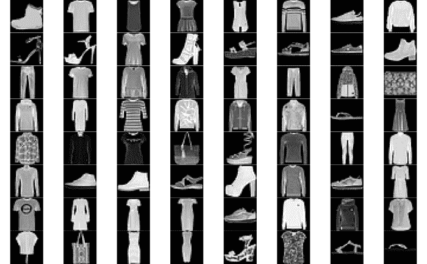
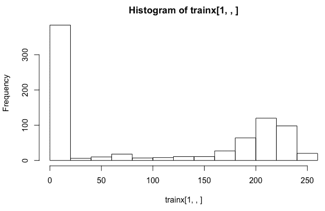
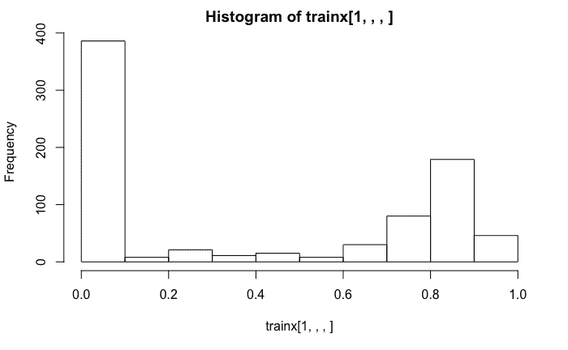

# 五、基于卷积神经网络的图像分类

**卷积神经网络**(**CNN**)是流行的深度神经网络，被认为是大规模图像分类任务的黄金标准。涉及 CNN 的应用包括图像识别和分类、自然语言处理、医学图像分类以及许多其他应用。在这一章中，我们将继续讨论存在反应变量的监督学习情况。本章提供了使用卷积神经网络应用图像分类和识别的步骤，并提供了一个易于理解的实例，该实例涉及与时尚相关的**经修改的美国国家标准与技术研究院** ( **MNIST** )数据。我们还利用从互联网上下载的时尚物品的图像来探索我们开发的分类模型的泛化潜力。

更具体地说，在本章中，我们将讨论以下主题:

*   数据准备
*   卷积神经网络中的层
*   拟合模型
*   模型评估和预测
*   性能优化技巧和最佳实践
*   摘要


# 数据准备

在本章中，我们将利用 Keras 和 EBImage 库:

```
# Libraries
library(keras)
library(EBImage)
```

让我们从看一些从网上下载的图片开始。有 20 个图像包括时尚物品，如衬衫、包、凉鞋、连衣裙等。这些图片是通过谷歌搜索获得的。我们将尝试开发一个图像识别和分类模型，该模型可以识别这些图像并将它们分类到适当的类别中。为了开发这样一个模型，我们将利用《时尚-MNIST》的时尚文章数据库:

```
# Read data
setwd("~/Desktop/image20")
temp = list.files(pattern = "*.jpg")
mypic <- list()
for (i in 1:length(temp))  {mypic[[i]] <- readImage(temp[[i]])}
par(mfrow = c(5,4))
for (i in 1:length(temp)) plot(mypic[[i]])
```

从网上下载的 20 幅时尚单品图片如下:


接下来，让我们来看看时尚 MNIST 的数据，它包含了大量这类时尚物品的图片。


# 时尚-MNIST 数据

我们可以使用`dataset_fashion_mnist`函数从 Keras 访问 MNIST 时装数据。看看下面的代码及其输出:

```
# MNIST data
mnist <- dataset_fashion_mnist()
str(mnist)

OUTPUT
List of 2

 $ train:List of 2

  ..$ x: int [1:60000, 1:28, 1:28] 0 0 0 0 0 0 0 0 0 0 ...

  ..$ y: int [1:60000(1d)] 9 0 0 3 0 2 7 2 5 5 ...

 $ test :List of 2

  ..$ x: int [1:10000, 1:28, 1:28] 0 0 0 0 0 0 0 0 0 0 ...

  ..$ y: int [1:10000(1d)] 9 2 1 1 6 1 4 6 5 7 ...
```

查看前面数据的结构，我们看到它包含 60，000 幅图像的训练数据和 10，000 幅图像的测试数据。所有这些图像都是 28 x 28 灰度图像。从上一章我们知道，图像可以用基于颜色和强度的数字数据来表示。自变量 x 包含强度值，因变量 y 包含从 0 到 9 的标签。

时装-MNIST 数据集中的 10 种不同的时装项目被标记为从 0 到 9，如下表所示:

| 标签 | 描述 |
| --- | --- |
| 0 | t 恤/上衣 |
| 一 | 裤子 |
| 2 | 套衫 |
| 3 | 连衣裙 |
| 四 | 外套 |
| 5 | 凉鞋 |
| 6 | 衬衫 |
| 七 | 运动鞋 |
| 8 | 包 |
| 9 | 踝靴 |

查看上表，我们可能会发现，为这些图像开发一个分类模型将是一项挑战，因为有些类别很难区分。


# 训练和测试数据

我们提取列车图像数据，将其存储在`trainx`中，并将各自的标签存储在`trainy`中。以类似的方式，我们从测试数据中创建`testx`和`testy`。基于`trainy`的表格表明，在训练数据中，10 种不同的时尚产品各有 6000 张图像，而在测试数据中，每种时尚产品有 1000 张图像:

```
#train and test data
trainx <- mnist$train$x
trainy <- mnist$train$y
testx <- mnist$test$x
testy <- mnist$test$y
table(mnist$train$y, mnist$train$y)

       0    1    2    3    4    5    6    7    8    9

  0 6000    0    0    0    0    0    0    0    0    0

  1    0 6000    0    0    0    0    0    0    0    0

  2    0    0 6000    0    0    0    0    0    0    0

  3    0    0    0 6000    0    0    0    0    0    0

  4    0    0    0    0 6000    0    0    0    0    0

  5    0    0    0    0    0 6000    0    0    0    0

  6    0    0    0    0    0    0 6000    0    0    0

  7    0    0    0    0    0    0    0 6000    0    0

  8    0    0    0    0    0    0    0    0 6000    0

  9    0    0    0    0    0    0    0    0    0 6000

table(mnist$test$y,mnist$test$y)      
       0    1    2    3    4    5    6    7    8    9

  0 1000    0    0    0    0    0    0    0    0    0

  1    0 1000    0    0    0    0    0    0    0    0

  2    0    0 1000    0    0    0    0    0    0    0

  3    0    0    0 1000    0    0    0    0    0    0

  4    0    0    0    0 1000    0    0    0    0    0

  5    0    0    0    0    0 1000    0    0    0    0

  6    0    0    0    0    0    0 1000    0    0    0

  7    0    0    0    0    0    0    0 1000    0    0

  8    0    0    0    0    0    0    0    0 1000    0

  9    0    0    0    0    0    0    0    0    0 1000
```

接下来，我们绘制训练数据中的前 64 幅图像。请注意，这些是灰度图像数据，每个图像都有黑色背景。因为我们的图像分类模型将基于这些数据，所以我们开始使用的彩色图像也必须转换成灰度图像。此外，衬衫、外套和连衣裙的图像很难区分，这可能会影响我们模型的准确性。让我们看看下面几行代码:

```
# Display images
par(mfrow = c(8,8), mar = rep(0, 4))
for (i in 1:84) plot(as.raster(trainx[i,,], max = 255))
par(mfrow = c(1,1))
```

我们得到训练数据中前 64 幅图像的输出，如下所示:



下图显示了基于训练数据中第一幅图像(踝靴)的直方图:



左边最高的条来自捕捉图像中黑色背景的低强度数据点。代表踝靴较浅颜色的较高强度值反映在右侧较高的条中。直方图中的这些强度值范围从 0 到 255。


# 调整形状和大小

接下来，我们重塑、训练和测试数据。我们还将训练和测试数据除以 255，以将值的范围从 0-255 更改为 0-1。使用的代码如下:

```
# Reshape and resize
trainx <- array_reshape(trainx, c(nrow(trainx), 784))
testx <- array_reshape(testx, c(nrow(testx), 784))
trainx <- trainx / 255
testx <- testx / 255
str(trainx)

OUTPUT

num [1:60000, 1:784] 0 0 0 0 0 0 0 0 0 0 ...

```

前面的`trainx `的结构显示，在对训练数据进行整形后，我们现在拥有 60，000 行和 784 (28 x 28)列的数据。

在将数据除以 255 之后，我们得到了基于训练数据中第一幅图像(一只踝靴)的直方图输出，如下面的屏幕截图所示:



前面的直方图显示数据点的范围现在已经变为 0 和 1 之间的值。然而，在先前直方图中观察到的形状没有改变。


# 一键编码

接下来，我们使用下面的代码对存储在`trainy`和`testy`中的标签进行一次性编码:

```
# One-hot encoding
trainy <- to_categorical(trainy, 10)
testy <- to_categorical(testy, 10)
head(trainy)
     [,1] [,2] [,3] [,4] [,5] [,6] [,7] [,8] [,9] [,10]

[1,]    0    0    0    0    0    0    0    0    0     1

[2,]    1    0    0    0    0    0    0    0    0     0

[3,]    1    0    0    0    0    0    0    0    0     0

[4,]    0    0    0    1    0    0    0    0    0     0

[5,]    1    0    0    0    0    0    0    0    0     0

[6,]    0    0    1    0    0    0    0    0    0     0
```

在一键编码之后，训练数据的第一行指示第十类别(踝靴)的值为 1。类似地，训练数据的第二行指示第一类别(t 恤/上衣)的值为 1。完成前面提到的更改后，现在时尚 MNIST 的数据已准备好开发图像识别和分类模型。


# 卷积神经网络中的层

在本节中，我们将开发模型架构，然后编译模型。我们还将进行计算，将卷积网络与全连接网络进行比较。让我们从指定模型架构开始。


# 模型架构和相关计算

我们首先使用`keras_model_sequential`函数创建一个模型。用于模型架构的代码如下所示:

```
# Model architecture
model <- keras_model_sequential() 
model %>% 
         layer_conv_2d(filters = 32, 
                        kernel_size = c(3,3), 
                        activation = 'relu', 
                        input_shape = c(28,28,1)) %>%   
         layer_conv_2d(filters = 64, 
                        kernel_size = c(3,3), 
                        activation = 'relu') %>%  
         layer_max_pooling_2d(pool_size = c(2,2)) %>% 
         layer_dropout(rate = 0.25) %>%   
         layer_flatten() %>% 
         layer_dense(units = 64, activation = 'relu') %>%  
         layer_dropout(rate = 0.25) %>% 
         layer_dense(units = 10, activation = 'softmax')
```

如前面的代码所示，我们添加了不同的层来开发 CNN 模型。基于图像的高度和宽度，该网络中的输入层具有 28 x 28 x 1 的尺寸，每个高度和宽度为 28。因为我们使用灰度图像，颜色通道是一个。我们在这里使用二维卷积层，因为我们正在用灰度图像建立深度学习模型。

注意，当利用灰度图像数据开发图像识别和分类模型时，我们利用 2D 卷积层，对于彩色图像，我们利用 3D 卷积层。

让我们来看一些涉及网络的第一卷积层的计算，这将有助于我们理解与密集连接层相比，这类层的用途。在 CNN 中，一层中的神经元不与下一层中的所有神经元相连。

这里，输入层有一个尺寸为 28 x 28 x 1 的图像。为了获得输出形状，我们从 28(输入图像的高度)减去 3(从`kernel_size`)再加上 1。这给了我们 26。输出形状的最终尺寸变为 26 x 26 x 32，其中 32 是输出滤镜的数量。因此，输出形状具有减小的高度和宽度，但是具有更大的深度。为了得出参数的数量，我们使用 3 x 3 x 1 x 32 + 32 = 320，其中 3 x 3 是`kernel_size`，1 是图像的通道数量，32 是输出滤波器的数量，在此基础上我们添加了 32 个偏置项。

如果我们将其与完全连接的神经网络进行比较，我们将获得更多的参数。在完全连接的网络中，28 x 28 x 1 = 784 个神经元将连接到 26 x 26 x 32 = 21，632 个神经元。因此，参数总数将是 784 x 21，632 + 21，632 = 16，981，120。与卷积层相比，这是密集连接层参数数量的 53，000 倍以上。这又有助于显著减少处理时间，从而降低处理成本。

每层的参数数量在以下代码中指明:

```
# Model summary
summary(model)
__________________________________________________________________

Layer (type                   Output Shape             Param #        

==================================================================

conv2d_1 (Conv2D)          (None, 26, 26, 32)            320            

__________________________________________________________________

conv2d_2 (Conv2D)          (None, 24, 24, 64)            18496          

__________________________________________________________________

max_pooling2d_1 (MaxPooling2D) (None, 12, 12, 64)         0              

__________________________________________________________________

dropout_1 (Dropout)        (None, 12, 12, 64)             0              

__________________________________________________________________

flatten_1 (Flatten)        (None, 9216)                   0              

__________________________________________________________________

dense_1 (Dense)            (None, 64)                    589888         

__________________________________________________________________

dropout_2 (Dropout)        (None, 64)                     0              

__________________________________________________________________

dense_2 (Dense)            (None, 10)                     650            

==================================================================

Total params: 609,354

Trainable params: 609,354

Non-trainable params: 0

___________________________________________________________________
```

第二个卷积网络的输出形状是 24×24×64，其中 64 是输出滤波器的数量。这里，输出形状的高度和宽度也减小了，但深度更大。为了得到多个参数，我们使用 3 x 3 x 32 x 64 + 64 = 18，496，其中 3 x 3 是`kernel_size`，32 是前一层滤波器的数量，64 是输出滤波器的数量，在此基础上，我们添加了 64 个偏置项。

下一层是池层，通常位于卷积层之后，执行下采样操作。这有助于减少加工时间，也有助于减少过度拟合。要获得输出形状，我们可以将 24 除以 2，其中 2 来自我们指定的池大小。这里的输出形状是 12 x 12 x 64，没有添加新的参数。池层之后是具有相同输出形状的下降层，同样，没有添加新参数。

在展平的图层中，我们通过将三个数字相乘得到 9，216，从 3 维(12 x 12 x 64)变为一维。其次是具有 64 个单元的密集连接层。这里的参数个数可以得到为 9216 x 64+64 = 589888。随后是另一个丢弃层，以避免过拟合问题，这里没有添加参数。最后，我们有最后一层，这是一个密集连接的层，有 10 个单元代表 10 个时尚项目。这里的参数个数是 64 x 10 + 10 = 650。因此，参数的总数是 609，354。在我们的 CNN 架构中，我们对隐藏层使用 relu 激活功能，对输出层使用 softmax。


# 编译模型

接下来，我们使用以下代码编译模型:

```
# Compile model
model %>% compile(loss = 'categorical_crossentropy',
                  optimizer = optimizer_adadelta(),
                  metrics = 'accuracy')
```

在前面的代码中，loss 被指定为`categorical_crossentropy`,因为有 10 个时尚项目类别。对于优化器，我们使用带有推荐默认设置的`optimizer_adadelta`。Adadelta 是一种用于梯度下降的自适应学习速率方法。顾名思义，它随着时间的推移而动态适应，不需要手动调整学习速率。我们还为指标指定了`accuracy`。

在下一节中，我们将拟合用于图像识别和分类的模型。


# 拟合模型

为了适应模型，我们将继续使用我们在前面章节中使用的格式。以下代码用于拟合模型:

```
# Fit model
model_one <- model %>% fit(trainx, 
                         trainy, 
                         epochs = 15, 
                         batch_size = 128, 
                         validation_split = 0.2)
plot(model_one)
```

这里，我们使用 20 个时期，批量大小为 128，20%的训练数据保留用于验证。因为这里使用的神经网络比前几章更复杂，所以每次运行都可能花费相对更多的时间。


# 准确性和损失

拟合模型后，15 个时期的精度和损失值绘制如下:


我们可以从前面的图中观察到，训练精度继续增加，而最后几个时期的验证精度或多或少是持平的。对于损失值，观察到相反方向的类似模式。然而，我们没有观察到任何重大的过度拟合问题。

现在让我们来评估这个模型，看看这个模型的预测效果如何。


# 模型评估和预测

在拟合模型后，我们将从损失和准确性方面评估其性能。我们还将创建一个混淆矩阵来评估所有 10 种时尚产品的分类性能。我们将对训练和测试数据进行模型评估和预测。我们还将获得不属于 MNIST 时尚数据的时尚项目的图像，并探索如何将模型的性能推广到新图像。


# 培训用数据

基于定型数据的损失和精度分别为 0.115 和 0.960，如以下代码所示:

```
# Model evaluation
model %>% evaluate(trainx, trainy)

$loss  0.1151372
$acc  0.9603167
```

接下来，我们根据预测值和实际值创建一个混淆矩阵:

```
# Prediction and confusion matrix
pred <- model %>%   predict_classes(trainx)
table(Predicted=pred, Actual=mnist$train$y)

OUTPUT

 Actual

Predicted    0    1    2    3    4    5    6    7    8    9

        0 5655    1   53   48    1    0  359    0    2    0

        1    1 5969    2    8    1    0    3    0    0    0

        2   50    0 5642   23  219    0  197    0    2    0

        3   42   23   20 5745   50    0   50    0    3    0

        4    7    1  156  106 5566    0  122    0    4    0

        5    0    0    0    0    0 5971    0    6    1   12

        6  230    3  121   68  159    0 5263    0   11    0

        7    0    0    0    0    0   22    0 5958    3  112

        8   15    3    6    2    4    4    6    0 5974    0

        9    0    0    0    0    0    3    0   36    0 5876
```

从前面的混淆矩阵中，我们可以得出以下结论:

*   对角线上显示的所有 10 个类别的正确分类值都很大，第 6 项(衬衫)的最低值为 5，263，满分为 6，000 分。
*   最佳分类性能见于项目 8(行李)，其中该模型从 6，000 个行李图像中正确分类了 5，974 个。
*   在代表模型错误分类的非对角线数字中，最高值为 359，其中项目 6(衬衫)被误认为项目 0 (t 恤/上衣)。有 230 种情况下，项目-0 (t 恤/上衣)被误归类为项目 6(衬衫)。所以，这个模型在区分第 0 项和第 6 项时肯定有些困难。

让我们通过计算前五项的预测概率来深入了解一下，如下面的代码所示:

```
# Prediction probabilities
prob <- model %>%   predict_proba(trainx) 
prob <- round(prob, 3)
cbind(prob, Predicted_class = pred, Actual = mnist$train$y)[1:5,]

OUTPUT
                                                  Predicted_class Actual

[1,] 0.000 0.000 0.000 0.000 0 0 0.000 0.001 0 0.999         9      9

[2,] 1.000 0.000 0.000 0.000 0 0 0.000 0.000 0 0.000         0      0

[3,] 0.969 0.000 0.005 0.003 0 0 0.023 0.000 0 0.000         0      0

[4,] 0.023 0.000 0.000 0.968 0 0 0.009 0.000 0 0.000         3      3

[5,] 0.656 0.001 0.000 0.007 0 0 0.336 0.000 0 0.000         0      0
```

我们可以从前面的输出中观察到，所有五个时尚项目都被正确分类。正确的分类概率范围从 0.656(第五行中的项目 0)到 1.000(第二行中的项目 0)。这些概率非常高，足以实现正确的分类而不会产生任何混淆。

现在，让我们看看这种性能是否可以在测试数据中重现。


# 测试数据

我们从基于测试数据的损耗和精度值开始:

```
# Model evaluation
model %>% evaluate(testx, testy)

$loss  0.240465

$acc   0.9226
```

我们观察到，与从训练数据获得的值相比，损失更高，精度更低。考虑到我们之前观察到的验证数据的类似情况，这是意料之中的。

测试数据的混淆矩阵如下:

```
# Prediction and confusion matrix
pred <- model %>% predict_classes(testx)
table(Predicted=pred, Actual=mnist$test$y)

OUTPUT
         Actual
Predicted   0   1   2   3   4   5   6   7   8   9
        0 878   0  14  15   0   0  91   0   0   0
        1   1 977   0   2   1   0   1   0   2   0
        2  22   1 899   9  55   0  65   0   2   0
        3  12  14   6 921  14   0  20   0   3   0
        4   2   5  34  26 885   0  57   0   0   0
        5   1   0   0   0   0 988   0   8   1   6
        6  74   1  43  23  43   0 755   0   2   0
        7   0   0   0   0   0   6   0 969   3  26
        8  10   2   4   4   2   0  11   0 987   1
        9   0   0   0   0   0   6   0  23   0 967
```

从前面的混淆矩阵中，我们可以得出以下结论:

*   这个模型在第 6 项(衬衫)上最为混乱，有 91 次将时尚物品归类为第 0 项(t 恤/上衣)。
*   最好的图像识别和分类性能是对于项目-5(凉鞋)，1000 个中有 988 个正确预测。
*   总的来说，混淆矩阵表现出与我们从训练数据中观察到的模式相似的模式。

查看测试数据中前五项的预测概率，我们发现所有五项预测都是正确的。所有五个项目的预测概率都相当高:

```
# Prediction probabilities
prob <- model %>% predict_proba(testx) 
prob <- round(prob, 3)
cbind(prob, Predicted_class = pred, Actual = mnist$test$y)[1:5,]

OUTPUT
 Predicted_class Actual 
[1,] 0.000 0 0.000 0 0.000 0 0.000 0 0 1     9         9 
[2,] 0.000 0 1.000 0 0.000 0 0.000 0 0 0     2         2 
[3,] 0.000 1 0.000 0 0.000 0 0.000 0 0 0     1         1 
[4,] 0.000 1 0.000 0 0.000 0 0.000 0 0 0     1         1 
[5,] 0.003 0 0.001 0 0.004 0 0.992 0 0 0     6         6
```

现在，训练和测试数据在准确性方面都有足够高的分类性能，让我们看看我们是否可以对本章开始时的 20 幅时尚物品图像做同样的事情。


# 来自互联网的 20 件时尚单品

我们从桌面上读取 20 幅彩色图像，并将它们改为灰色，以保持与我们目前使用的数据和模型的兼容性。看一下下面的代码:

```
setwd("~/Desktop/image20")
temp = list.files(pattern = "*.jpg")
mypic <- list()
for (i in 1:length(temp))  {mypic[[i]] <- readImage(temp[[i]])}
for (i in 1:length(temp))  {mypic[[i]] <- channel(mypic[[i]], "gray")}
for (i in 1:length(temp)) {mypic[[i]] <- 1-mypic[[i]]}
for (i in 1:length(temp)) {mypic[[i]] <- resize(mypic[[i]], 28, 28)}
par(mfrow = c(5,4), mar = rep(0, 4))
for (i in 1:length(temp)) plot(mypic[[i]])
```

如前所述，我们还将所有 20 幅图像的大小调整为 28 x 28，由此产生的 20 幅待分类图像如下:


从上图中我们可以看出，MNIST 时装数据的 10 个类别中各有两个时装项目:

```
# Reshape and row-bind
for (i in 1:length(temp)) {mypic[[i]] <- array_reshape(mypic[[i]], c(1,28,28,1))}
new <- NULL
for (i in 1:length(temp)) {new <- rbind(new, mypic[[i]])}
str(new)

OUTPUT

num [1:20, 1:784] 0.0458 0.0131 0 0 0 ...
```

我们按照所需的尺寸对图像进行整形，然后对它们进行行绑定。看`new`的结构，我们看到一个 20×784 的矩阵。但是，为了获得一个合适的结构，我们将把它进一步调整为 20 x 28 x 28 x 1，如下面的代码所示:

```
# Reshape
newx <- array_reshape(new, c(nrow(new),28,28,1))
newy <- c(0,4,5,5,6,6,7,7,8,8,9,0,9,1,1,2,2,3,3,4)
```

我们重塑`new`以获得合适的格式，并将结果保存在`newx`中。我们使用`newy`来存储 20 种时尚商品的实际标签。

现在，我们准备使用预测模型，并创建一个混淆矩阵，如以下代码所示:

```
# Confusion matrix for 20 images
pred <- model %>%   predict_classes(newx)
table(Predicted=pred, Actual=newy)

OUTPUT
 Actual

Predicted 0 1 2 3 4 5 6 7 8 9

        0 1 0 0 0 0 0 0 0 0 0

        1 0 1 0 0 0 0 0 0 0 0

        2 0 0 1 0 0 0 0 0 0 0

        3 1 1 0 2 0 0 0 0 0 2

        4 0 0 1 0 1 0 0 0 0 0

        5 0 0 0 0 0 0 0 1 0 0

        6 0 0 0 0 0 0 2 0 0 0

        8 0 0 0 0 1 2 0 1 2 0
```

我们从对角线上的数字观察到，20 个项目中只有 10 个被正确分类。与训练和测试数据观察到的超过 90%的准确度相比，这意味着只有 50%的低准确度。

接下来，我们使用以下代码以图表的形式总结这些预测，其中包括预测概率、预测类别和实际类别:

```
# Images with prediction probabilities, predicted class, and actual class 
setwd("~/Desktop/image20")
temp = list.files(pattern = "*.jpg")
mypic <- list()
for (i in 1:length(temp))  {mypic[[i]] <- readImage(temp[[i]])}
for (i in 1:length(temp))  {mypic[[i]] <- channel(mypic[[i]], "gray")}
for (i in 1:length(temp)) {mypic[[i]] <- 1-mypic[[i]]}
for (i in 1:length(temp)) {mypic[[i]] <- resize(mypic[[i]], 28, 28)}
predictions <-  predict_classes(model, newx)
probabilities <- predict_proba(model, newx)
probs <- round(probabilities, 2)
par(mfrow = c(5, 4), mar = rep(0, 4))
for(i in 1:length(temp)) {plot(mypic[[i]])
         legend("topleft", legend = max(probs[i,]),  
                bty = "n",text.col = "white",cex = 2)
         legend("top", legend = predictions[i],  
                bty = "n",text.col = "yellow", cex = 2) 
         legend("topright", legend = newy[i],  
                bty = "",text.col = "darkgreen", cex = 2) }
```

上图借助预测概率、预测类别和实际类别(`model-one`)总结了分类模型的性能:


在前面的图中，左上角位置的第一个数字是预测概率，中上位置的第二个数字是预测类，右上角位置的第三个数字是实际类。看看这些错误的分类，令人惊讶的是，凉鞋(第 5 项)、运动鞋(第 7 项)和短靴(第 9 项)的所有图像都被错误地分类了。这些类别的图像在训练和测试数据中被高精度地分类。这六个错误分类导致了非常低的精度值。

我们迄今所做的工作的两个关键方面可以总结如下:

*   第一个是我们通常所期望的—与使用训练数据观察到的结果相比，使用测试数据的模型性能通常较低。
*   第二个有点出乎意料。从网上下载的 20 幅时尚单品图片对同一款模特的准确度有显著降低。

让我们看看是否可以设计一个策略或对模型进行更改，以获得更好的性能。我们计划更仔细地研究这些数据，并找到一种方法，将我们在训练和测试数据中看到的性能转化为 20 张新图像(如果可能)。


# 性能优化技巧和最佳实践

在任何数据分析任务中，了解数据是如何收集的非常重要。使用我们在上一节中开发的模型，测试数据的准确率从 90%以上下降到从互联网上下载的 20 幅时尚单品图像的 50%。如果不解决这种差异，该模型将很难很好地概括任何不属于训练或测试数据的时尚项目，因此不会有太多的实际用途。在这一节中，我们将探讨对模型分类性能的改进。


# 图像修改

看看本章开头的 64 张图片，你会发现一些线索。我们注意到凉鞋、运动鞋和短靴的图像似乎有特定的模式。在所有涉及这些时尚物品的图片中，脚趾总是指向左边。另一方面，在从互联网上下载的三个鞋类时尚项目的图像中，我们注意到脚趾被描绘成指向正确的方向。为了解决这个问题，让我们用一个`flop`函数修改 20 件时装的图像，使脚趾指向左边，然后我们可以再次评估模型的分类性能:

```
# Images with prediction probabilities, predicted class, and actual class setwd("~/Desktop/image20")
temp = list.files(pattern = "*.jpg")
mypic <- list()
for (i in 1:length(temp)) {mypic[[i]] <- readImage(temp[[i]])}
for (i in 1:length(temp)) {mypic[[i]] <- flop(mypic[[i]])}
for (i in 1:length(temp)) {mypic[[i]] <- channel(mypic[[i]], "gray")}
for (i in 1:length(temp)) {mypic[[i]] <- 1-mypic[[i]]}
for (i in 1:length(temp)) {mypic[[i]] <- resize(mypic[[i]], 28, 28)}
predictions <- predict_classes(model, newx)
probabilities <- predict_proba(model, newx)
probs <- round(probabilities, 2)
par(mfrow = c(5, 4), mar = rep(0, 4))
for(i in 1:length(temp)) {plot(mypic[[i]])
 legend("topleft", legend = max(probs[i,]), 
 bty = "",text.col = "black",cex = 1.2)
 legend("top", legend = predictions[i], 
 bty = "",text.col = "darkred", cex = 1.2) 
 legend("topright", legend = newy[i], 
 bty = "",text.col = "darkgreen", cex = 1.2) }
```

以下屏幕截图显示了应用 flop ( `model-one`)函数后的预测概率、预测类别和实际类别:


正如从前面的图中观察到的，在更改了时尚商品的图像方向后，我们现在可以根据凉鞋、运动鞋和短靴的型号获得正确的分类。在 20 个分类中有 16 个正确的情况下，准确率提高到了 80%,而我们之前获得的数字是 50%。请注意，这种准确性的提高来自同一模型。我们在这里做的唯一一件事是观察原始数据是如何收集的，然后与正在使用的新图像数据保持一致。接下来，让我们修改深层网络架构，看看我们能否进一步改善结果。

在使用预测模型将结果归纳为新数据之前，最好先回顾一下数据最初是如何收集的，然后维护新数据格式的一致性。

我们鼓励你做进一步的实验，看看如果时尚 MNIST 数据中一定比例的图像被改变成它们的镜像会发生什么。这是否有助于在不需要对新数据进行更改的情况下更好地进行归纳？


# 对架构的更改

我们通过添加更多的卷积层来修改 CNN 的架构，以说明如何添加这些层。看一下下面的代码:

```
# Model architecture
model <- keras_model_sequential() 
model %>% 
         layer_conv_2d(filters = 32, kernel_size = c(3,3), 
                        activation = 'relu', input_shape = c(28,28,1)) %>%   
         layer_conv_2d(filters = 32, kernel_size = c(3,3), 
                        activation = 'relu') %>%  
         layer_max_pooling_2d(pool_size = c(2,2)) %>% 
         layer_dropout(rate = 0.25) %>%   
         layer_conv_2d(filters = 64, kernel_size = c(3,3), 
                        activation = 'relu') %>% 
         layer_conv_2d(filters = 64, kernel_size = c(3,3), 
                        activation = 'relu') %>%  
         layer_max_pooling_2d(pool_size = c(2,2)) %>% 
         layer_dropout(rate = 0.25) %>%   
         layer_flatten() %>% 
         layer_dense(units = 512, activation = 'relu') %>%  
         layer_dropout(rate = 0.5) %>% 
         layer_dense(units = 10, activation = 'softmax')

# Compile model
model %>% compile(loss = 'categorical_crossentropy',
                  optimizer = optimizer_adadelta(),
                  metrics = 'accuracy')

# Fit model
model_two <- model %>% fit(trainx, 
                         trainy, 
                         epochs = 15, 
                         batch_size = 128, 
                         validation_split = 0.2)
plot(model_two)
```

在前面的代码中，对于前两个卷积层，我们各使用 32 个滤波器，对于下一组卷积层，我们各使用 64 个滤波器。在每对卷积层之后，如前所述，我们添加汇集层和丢弃层。这里进行的另一个改变是在密集层中使用 512 个单元。其他设置与早期网络类似。

以下截图显示了训练和验证数据的准确性和损失(`model_two`):


基于`model_two`的图显示，与`model_one`相比，训练和验证数据在损失和准确性方面的表现更接近。此外，朝向第 15 个时期的线的变平也表明增加时期的数量不太可能有助于进一步提高分类性能。

训练数据的损失和精度值如下获得:

```
# Loss and accuracy
model %>% evaluate(trainx, trainy)

$loss 0.1587473
$acc 0.94285
```

基于该模型的损失和精度值没有显示出重大改进，损失值略高，精度值略低。

以下混淆矩阵总结了预测类别和实际类别:

```
# Confusion matrix for training data
pred <- model %>%   predict_classes(trainx)
table(Predicted=pred, Actual=mnist$train$y)

OUTPUT
 Actual

Predicted    0    1    2    3    4    5    6    7    8    9

        0 5499    0   58   63    3    0  456    0    4    0

        1    2 5936    1    5    3    0    4    0    1    0

        2   83    0 5669   13  258    0  438    0    7    0

        3   69   52   48 5798  197    0  103    0    6    0

        4    3    3  136   49 5348    0  265    0    5    0

        5    0    0    0    0    0 5879    0    3    0    4

        6  309    6   73   67  181    0 4700    0    2    0

        7    0    0    0    0    0   75    0 5943    1  169

        8   35    3   15    5   10    3   34    0 5974    2

        9    0    0    0    0    0   43    0   54    0 5825
```

从混淆矩阵中，我们可以得出以下结论:

*   它表明该模型在项目 6(衬衫)和项目 0 (t 恤/上衣)之间具有最大的混淆(456 个错误分类)。并且这种混淆在两个方向上都可以观察到，其中项目 6 对于项目 0 是混淆的，而项目-0 对于项目 6 是混淆的。
*   项目 8(包)被最准确地分类，在总共 6，000 个实例中有 5，974 个实例(大约 99.6%的准确性)。
*   第 6 项(衬衫)被分类为 10 个类别中准确度最低的，在 6，000 个实例中有 4，700 个实例(大约 78.3%的准确度)。

对于测试数据损失，准确度和混淆矩阵如下所示:

```
# Loss and accuracy for the test data
model %>% evaluate(testx, testy)

$loss 0.2233179
$acc 0.9211

# Confusion matrix for test data
pred <- model %>% predict_classes(testx)
table(Predicted=pred, Actual=mnist$test$y)

OUTPUT
 Actual

Predicted   0   1   2   3   4   5   6   7   8   9

        0 875   1  18   8   0   0 104   0   3   0

        1   0 979   0   2   0   0   0   0   0   0

        2  19   0 926   9  50   0  78   0   1   0

        3  10  14   9 936  35   0  19   0   3   0

        4   2   0  30  12 869   0  66   0   0   0

        5   0   0   0   0   0 971   0   2   1   2

        6  78   3  16  29  45   0 720   0   1   0

        7   0   0   0   0   0  18   0 988   1  39

        8  16   3   1   4   1   0  13   0 989   1

        9   0   0   0   0   0  11   0  10   1 958
```

从前面的输出中，我们观察到损耗比我们用早期模型获得的要低，而精度比早期的性能稍低。从混淆矩阵中，我们可以得出以下结论:

*   它表明模型在项目 6(衬衫)和项目 0 (t 恤/上衣)之间具有最大的混淆(104 个错误分类)。
*   项目 8(包)被最准确地分类，在总共 1，000 个实例中有 989 个实例(大约 98.9%的准确性)。
*   项目 6(衬衫)被分类为 10 个类别中准确度最低的，在 1000 个实例中有 720 个实例(大约 72.0%的准确度)。

因此，总的来说，我们观察到的性能与我们用训练数据观察到的性能相似。

从网上下载的 20 张时尚单品图片，以下截图总结了模特的表现:


从前面的图中可以看出，这一次，我们对 20 张图像中的 17 张进行了正确分类。虽然这是一个稍微好一点的性能，但它仍然比测试数据的 92%的精确度要低一点。此外，请注意，由于样本非常小，精度值可能会大幅波动。

在本节中，我们对 20 幅新图像进行了修改，并对 CNN 模型架构进行了一些更改，以获得更好的分类性能。


# 摘要

在这一章中，我们展示了如何使用一个**卷积神经网络** ( **CNN** )深度学习模型进行图像识别和分类。我们利用流行的时尚 MNIST 数据来训练和测试图像分类模型。我们还检查了涉及许多参数的计算，并能够将其与密集连接的神经网络所需的参数数量进行对比。CNN 模型有助于显著减少所需参数的数量，从而显著节省计算时间和资源。我们还使用了从互联网上下载的时尚商品的图像，以查看基于时尚 MNIST 数据的分类模型是否可以推广到类似的商品。我们确实注意到，在训练数据中保持图像布局的一致性非常重要。此外，我们还展示了如何在模型架构中添加更多的卷积层，以开发更深入的 CNN 模型。

到目前为止，我们已经逐渐从不那么深入的神经网络模型发展到更复杂、更深入的神经网络模型。我们还主要讨论了监督学习方法下的应用。在下一章，我们将讨论另一类有趣的深度神经网络模型，称为自编码器。我们将涵盖涉及自编码器网络的应用，这些应用可以在无监督学习方法下进行分类。