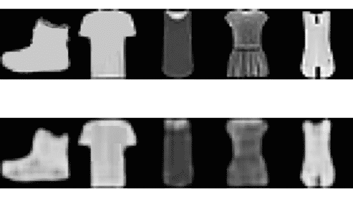
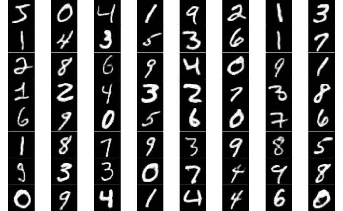
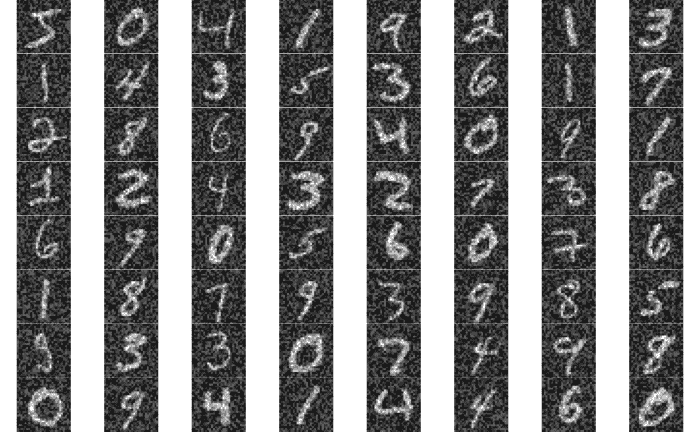
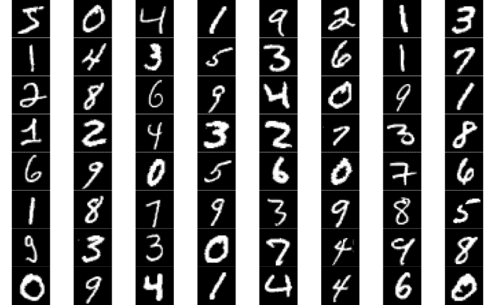
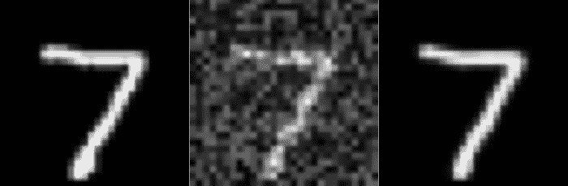
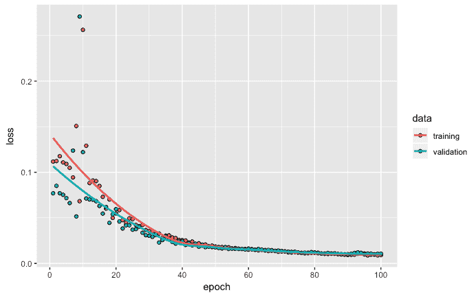
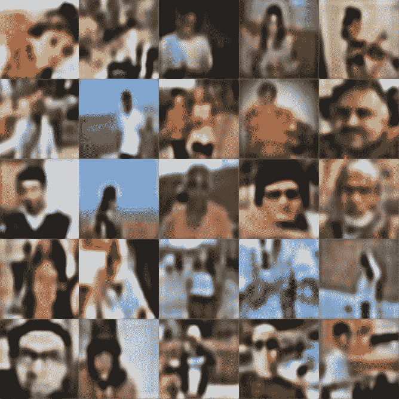

# 六、使用 Keras 应用自编码器神经网络

自编码器网络属于无监督学习类别的方法，其中标记的目标值不可用。然而，由于自编码器通常使用的目标是某种形式的输入数据，它们也可以被称为自我监督学习方法。在本章中，我们将学习如何使用 Keras 应用自编码器神经网络。我们将讨论自编码器的三个应用:降维、图像去噪和图像校正。本章中的例子将使用时尚物品的图像、数字的图像和包含人物的图片。

更具体地说，在本章中，我们将讨论以下主题:

*   自编码器的类型
*   降维自编码器
*   降噪自编码器
*   图像校正自编码器


# 自编码器的类型

自编码器神经网络由两个主要部分组成:

*   第一部分称为编码器，它降低了输入数据的维数。一般来说，这是一个图像。当来自输入图像的数据通过导致较低维度的网络传递时，网络被迫仅提取输入数据的最重要特征。
*   自编码器的第二部分称为解码器，它试图从编码器的输出中重构原始数据。通过指定该网络应该尝试匹配什么输出来训练自编码器网络。

让我们考虑一些使用图像数据的例子。如果指定的输出与作为输入给出的图像相同，那么在训练之后，自编码器网络被期望提供具有较低分辨率的图像，该图像保留了输入图像的关键特征，但是丢失了作为原始输入图像的一部分的一些更精细的细节。这种类型的自编码器可用于降维应用。由于自编码器基于能够捕捉数据中非线性的神经网络，因此与仅使用线性函数的方法相比，它们具有更好的性能。下图显示了自编码器网络的编码器和解码器部分:


如果我们训练自编码器，使得输入图像包含一些噪声或不清晰，并且输出与没有任何噪声的图像相同，那么我们可以创建去噪自编码器。类似地，如果我们用这样的输入/输出图像训练自编码器，其中我们有戴眼镜和不戴眼镜的图像，或者有胡子和没有胡子的图像，等等，我们可以创建有助于图像校正/修改的网络。

接下来，我们将看看如何使用自编码器的三个独立示例:使用降维、图像去噪和图像校正。我们将从使用自编码器进行降维开始。


# 降维自编码器

在本节中，我们将使用时尚 MNIST 数据，指定自编码器模型架构，编译模型，拟合模型，然后重建图像。注意，时尚 MNIST 是 Keras 库的一部分。


# MNIST 时尚数据

我们将继续使用 Keras 和 EBImage 库。读取时尚 MNIST 数据的代码如下:

```
# Libraries
library(keras)

library(EBImage)

# Fashion-MNIST data
mnist <- dataset_fashion_mnist() 
str(mnist)
List of 2
 $ train:List of 2
  ..$ x: int [1:60000, 1:28, 1:28] 0 0 0 0 0 0 0 0 0 0 ...
  ..$ y: int [1:60000(1d)] 9 0 0 3 0 2 7 2 5 5 ...
 $ test :List of 2
  ..$ x: int [1:10000, 1:28, 1:28] 0 0 0 0 0 0 0 0 0 0 ...
  ..$ y: int [1:10000(1d)] 9 2 1 1 6 1 4 6 5 7 ...
```

这里，训练数据具有 60，000 幅图像，测试数据具有 10，000 幅时尚物品的图像。由于我们将在本例中使用无监督学习方法，因此我们将不使用可用于训练和测试数据的标签。

我们将训练图像数据存储在`trainx`中，将测试图像数据存储在`testx`中，如以下代码所示:

```
# Train and test data
trainx <- mnist$train$x

testx <- mnist$test$x

# Plot of 64 images

par(mfrow = c(8,8), mar = rep(0, 4))

for (i in 1:64) plot(as.raster(trainx[i,,], max = 255))
```

在下图中可以看到时尚单品的前 64 个图像:


接下来，我们将把图像数据整形为合适的格式，如下面的代码所示:

```
# Reshape images
trainx <- array_reshape(trainx, c(nrow(trainx), 28, 28, 1))

testx <- array_reshape(testx, c(nrow(testx), 28, 28, 1))

trainx <- trainx / 255

testx <- testx / 255
```

这里，我们还将`trainx`和`testx`除以 255，将 0-255 之间的值的范围改为 0-1 之间的范围。


# 编码器型号

为了指定编码器模型架构，我们将使用以下代码:

```
# Encoder
input_layer <- 
         layer_input(shape = c(28,28,1)) 
encoder <-  input_layer %>% 
         layer_conv_2d(filters = 8, 
                       kernel_size = c(3,3), 
                       activation = 'relu', 
                       padding = 'same') %>%   
         layer_max_pooling_2d(pool_size = c(2,2),
                              padding = 'same') %>% 
         layer_conv_2d(filters = 4, 
                       kernel_size = c(3,3), 
                       activation = 'relu', 
                       padding = 'same') %>%  
         layer_max_pooling_2d(pool_size = c(2,2), 
                              padding = 'same')  

summary(encoder)
Output
Tensor("max_pooling2d_10/MaxPool:0", shape=(?, 7, 7, 4), dtype=float32)
```

这里，对于编码器的输入，我们指定输入层的大小为 28 x 28 x 1。使用两个卷积层，一个具有 8 个滤波器，另一个具有 4 个滤波器。这两层的激活功能都使用**整流线性单元** ( **relus** )。卷积层包括`padding = 'same'`，在输出时保留输入的高度和宽度。例如，在第一个卷积层之后，输出的高度和宽度为 28 x 28。每个卷积层之后是池层。在第一个池层之后，高度和宽度变为 14 x 14，在第二个池层之后，高度和宽度变为 7 x 7。在这个例子中，编码器网络的输出是 7×7×4。


# 解码器模型

为了指定解码器模型架构，我们将使用以下代码:

```
# Decoder
decoder <- encoder %>% 
         layer_conv_2d(filters = 4, 
                       kernel_size = c(3,3), 
                       activation = 'relu',
                       padding = 'same') %>%   
         layer_upsampling_2d(c(2,2)) %>% 
         layer_conv_2d(filters = 8, 
                       kernel_size = c(3,3), 
                       activation = 'relu',
                       padding = 'same') %>%  
         layer_upsampling_2d(c(2,2)) %>% 
         layer_conv_2d(filters = 1, 
                       kernel_size = c(3,3), 
                       activation = 'sigmoid',
                       padding = 'same')

summary(decoder)
Output
Tensor("conv2d_25/Sigmoid:0", shape=(?, 28, 28, 1), dtype=float32)
```

这里，编码器模型已经成为解码器模型的输入。对于解码器网络，我们使用类似的结构，第一卷积层具有 4 个滤波器，第二卷积层具有 8 个滤波器。此外，我们现在使用上采样层，而不是池层。第一个上采样层将高度和宽度更改为 14×14，第二个上采样层将其恢复为 28×28 的原始高度和宽度。在最后一层，我们利用 sigmoid 激活函数，确保输出值保持在 0 和 1 之间。


# 自编码器模型

自编码器模型和显示输出形状和每个层的参数数量的模型概要如下:

```
# Autoencoder
ae_model <- keras_model(inputs = input_layer, outputs = decoder)

summary(ae_model)
__________________________________________________________________________

Layer (type)                      Output Shape               Param #       

==========================================================================

input_5 (InputLayer)              (None, 28, 28, 1)            0             

__________________________________________________________________________

conv2d_21 (Conv2D)                (None, 28, 28, 8)            80            

__________________________________________________________________________

max_pooling2d_9 (MaxPooling2D)    (None, 14, 14, 8)             0             

__________________________________________________________________________

conv2d_22 (Conv2D)                (None, 14, 14, 4)            292           

__________________________________________________________________________

max_pooling2d_10 (MaxPooling2D)   (None, 7, 7, 4)               0             

__________________________________________________________________________

conv2d_23 (Conv2D)                (None, 7, 7, 4)              148           

___________________________________________________________________________

up_sampling2d_9 (UpSampling2D)    (None, 14, 14, 4)             0             

___________________________________________________________________________

conv2d_24 (Conv2D)                (None, 14, 14, 8)            296           

___________________________________________________________________________

up_sampling2d_10 (UpSampling2D)   (None, 28, 28, 8)             0             

___________________________________________________________________________

conv2d_25 (Conv2D)                (None, 28, 28, 1)             73           

===========================================================================

Total params: 889

Trainable params: 889

Non-trainable params: 0

____________________________________________________________________________________
```

这里，除了输入层之外，自编码器模型具有五个卷积层、两个最大池层和两个上采样层。这里，这个自编码器模型中的参数总数是 889。


# 编译和拟合模型

接下来，我们将使用以下代码编译并拟合模型:

```
# Compile model
ae_model %>% compile( loss='mean_squared_error',

         optimizer='adam')

# Fit model
model_one <- ae_model %>% fit(trainx, 

                         trainx, 

                         epochs = 20, 

                         shuffle=TRUE,

                         batch_size = 32, 

                         validation_data = list(testx,testx))
```

这里，我们使用均方误差作为损失函数来编译模型，并将`adam`指定为优化器。为了训练模型，我们将使用`trainx `作为输入和输出。我们将使用`textx`进行验证。我们用 32 的批量大小来拟合模型，并使用 20 个时期。

以下输出显示了训练和验证数据的损失值图:


前面的图显示了良好的收敛性，没有显示任何过度拟合的迹象。


# 重建图像

为了获得重建的图像，我们使用`predict_on_batch`来预测使用自编码器模型的输出。我们使用以下代码来实现这一点:

```
# Reconstruct and plot images - train data
rc <-   ae_model %>%    keras::predict_on_batch(x = trainx)

par(mfrow = c(2,5), mar = rep(0, 4))

for (i in 1:5) plot(as.raster(trainx[i,,,]))

for (i in 1:5) plot(as.raster(rc[i,,,]))
```

来自训练数据的前五幅时尚图像(第一行)和相应的重建图像(第二行)如下:



这里，正如所预期的，可以看到重建的图像捕获了训练图像的关键特征。然而，它忽略了某些更细微的细节。例如，在原始训练图像中更清晰可见的标志在重建图像中变得模糊。

我们还可以使用来自测试数据的图像来查看原始图像和重建图像的绘图。为此，我们可以使用下面的代码:

```
# Reconstruct and plot images - train data
rc <- ae_model %>% keras::predict_on_batch(x = testx) 
par(mfrow = c(2,5), mar = rep(0, 4)) 
for (i in 1:5) plot(as.raster(testx[i,,,])) 
for (i in 1:5) plot(as.raster(rc[i,,,]))
```

下图显示了原始图像(第一行)和使用测试数据重建的图像(第二行):


这里，重建图像的行为与它们之前对训练数据所做的一样。

在这个例子中，我们使用 MNIST 时尚数据来构建自编码器网络，该网络通过保留主要特征并移除涉及更精细细节的特征来帮助降低图像的维度。接下来，我们将看看自编码器模型的另一种变体，它有助于消除图像中的噪声。


# 降噪自编码器

在输入图像包含不需要的噪声的情况下，可以训练自编码器网络来消除这种噪声。这是通过提供带有噪声的图像作为输入并提供相同图像的干净版本作为输出来实现的。训练自编码器网络，使得自编码器的输出尽可能接近输出图像。


# MNIST 数据

我们将利用 Keras 包中可用的 MNIST 数据来说明创建去噪自编码器网络所涉及的步骤。可以使用以下代码读取 MNIST 数据:

```
# MNIST data
mnist <- dataset_mnist()

str(mnist)
List of 2

 $ train:List of 2

  ..$ x: int [1:60000, 1:28, 1:28] 0 0 0 0 0 0 0 0 0 0 ...

  ..$ y: int [1:60000(1d)] 5 0 4 1 9 2 1 3 1 4 ...

 $ test :List of 2

  ..$ x: int [1:10000, 1:28, 1:28] 0 0 0 0 0 0 0 0 0 0 ...

  ..$ y: int [1:10000(1d)] 7 2 1 0 4 1 4 9 5 9 ...
```

MNIST 数据的结构表明它包含训练和测试数据，以及各自的标签。训练数据有 60，000 个从 0 到 9 的数字图像。类似地，测试数据有 10，000 个从 0 到 9 的数字图像。尽管每个图像都有一个标识图像的相应标签，但在本例中，标签数据不是必需的，因此我们将忽略此信息。

我们将在`trainx`中存储训练图像，在`testx`中存储测试图像。为此，我们将使用以下代码:

```
# Train and test data
trainx <- mnist$train$x

testx <- mnist$test$x

# Plot
par(mfrow = c(8,8), mar = rep(0, 4))

for (i in 1:64) plot(as.raster(trainx[i,,], max = 255))
```

下图显示了一个由 8 行 8 列 64 幅图像组成的图，这些图像基于 MNIST 的 0 到 9 之间的数字图像:



前面的图显示了各种书写风格的手写数字。我们将按照要求的格式对图像数据进行整形，并添加随机噪声。


# 数据准备

接下来，我们将使用以下代码以所需格式重塑图像:

```
# Reshape
trainx <- array_reshape(trainx, c(nrow(trainx),28,28,1))

testx <- array_reshape(testx, c(nrow(testx),28,28,1))

trainx <- trainx / 255

testx <- testx / 255
```

在这里，我们重新调整了训练数据，使其大小为 60，000 x 28 x 28 x 1，重新调整了测试数据，使其大小为 10，000 x 28 x 28 x 1。我们还将介于 0 和 255 之间的像素值除以 255，以获得介于 0 和 1 之间的新范围。


# 添加噪声

为了向训练图像添加噪声，我们需要使用以下代码使用均匀分布来获得 0 和 1 之间的 60，000 × 28 × 28 个随机数:

```
# Random numbers from uniform distribution
n <- runif(60000*28*28,0,1)

n <- array_reshape(n, c(60000,28,28,1))

# Plot

par(mfrow = c(8,8), mar = rep(0, 4))

for (i in 1:64) plot(as.raster(n[i,,,]))
```

在这里，我们正在对使用均匀分布生成的随机数进行整形，以匹配我们为训练图像提供的矩阵的维度。结果以图像的形式绘制，显示包含噪声的结果图像。

下图显示了包含噪点的图像:


描绘噪声的图像被添加到存储在`trainx`的图像中。我们需要将它除以 2，以保持得到的`trainn`值在 0 和 1 之间。我们可以使用下面的代码来做到这一点:

```
# Adding noise to handwritten images - train data
trainn <- (trainx + n)/2

par(mfrow = c(8,8), mar = rep(0, 4))

for (i in 1:64) plot(as.raster(trainn[i,,,]))
```

下图显示了前 64 幅训练图像及其噪波:



尽管原始手写数字中添加了噪声，但这些数字仍然是可读的。使用去噪自编码器的主要目的是训练一个保留手写数字并从图像中去除噪声的网络。

我们将使用以下代码对测试数据重复相同的步骤:

```
# Adding noise to handwritten images - test data
n1 <- runif(10000*28*28,0,1) 
n1 <- array_reshape(n1, c(10000,28,28,1)) 
testn <- (testx +n1)/2
```

在这里，我们给测试图像添加了噪声，并将它们存储在`testn`中。现在，我们可以指定编码器架构。


# 编码器型号

用于编码器网络的代码如下:

```
# Encoder
input_layer <- 
         layer_input(shape = c(28,28,1)) 
encoder <-  input_layer %>% 
         layer_conv_2d(filters = 32, 
                       kernel_size = c(3,3), 
                       activation = 'relu', 
                       padding = 'same') %>%   
         layer_max_pooling_2d(pool_size = c(2,2),
                              padding = 'same') %>% 
         layer_conv_2d(filters = 32, 
                       kernel_size = c(3,3), 
                       activation = 'relu', 
                       padding = 'same') %>%  
         layer_max_pooling_2d(pool_size = c(2,2), 
                              padding = 'same') 

summary(encoder)
OutputTensor("max_pooling2d_6/MaxPool:0", shape=(?, 7, 7, 32), dtype=float32)
```

这里，输入层的大小被指定为 28 x 28 x 1。我们使用两个卷积层，每个卷积层有 32 个滤波器，一个整流器线性单元作为激活函数。每个卷积层之后是池层。在第一个池层之后，高度和宽度变为 14 x 14，在第二个池层之后，高度和宽度变为 7 x 7。在这个例子中，编码器网络的输出具有 7×7×32 个维度。


# 解码器模型

对于解码器网络，我们保持相同的结构，只是我们使用上采样层，而不是池层。我们可以使用下面的代码来做到这一点:

```
# Decoder
decoder <- encoder %>% 
         layer_conv_2d(filters = 32, 
                       kernel_size = c(3,3), 
                       activation = 'relu',
                       padding = 'same') %>%   
         layer_upsampling_2d(c(2,2)) %>% 
         layer_conv_2d(filters = 32, 
                       kernel_size = c(3,3), 
                       activation = 'relu',
                       padding = 'same') %>%  
         layer_upsampling_2d(c(2,2)) %>% 
         layer_conv_2d(filters = 1, 
                       kernel_size = c(3,3), 
                       activation = 'sigmoid',
                       padding = 'same')

summary(decoder)
Output
Tensor("conv2d_15/Sigmoid:0", shape=(?, 28, 28, 1), dtype=float32)
```

在前面的代码中，第一个上采样层将高度和宽度更改为 14 x 14，第二个上采样层将其恢复为 28 x 28 的原始高度和宽度。在最后一层，我们使用 sigmoid 激活函数，确保输出值保持在 0 和 1 之间。


# 自编码器模型

现在，我们可以指定自编码器网络。自编码器的型号和概要如下:

```
# Autoencoder
ae_model <- keras_model(inputs = input_layer, outputs = decoder)

summary(ae_model)

______________________________________________________________________

Layer (type)                    Output Shape             Param #       

======================================================================

input_3 (InputLayer)           (None, 28, 28, 1)           0             

______________________________________________________________________

conv2d_11 (Conv2D)             (None, 28, 28, 32)         320           

______________________________________________________________________

max_pooling2d_5 (MaxPooling2D) (None, 14, 14, 32)          0             

_______________________________________________________________________

conv2d_12 (Conv2D)             (None, 14, 14, 32)         9248          

_______________________________________________________________________

max_pooling2d_6 (MaxPooling2D) (None, 7, 7, 32)            0             

_______________________________________________________________________

conv2d_13 (Conv2D)             (None, 7, 7, 32)           9248          

_______________________________________________________________________

up_sampling2d_5 (UpSampling2D) (None, 14, 14, 32)          0             

_______________________________________________________________________

conv2d_14 (Conv2D)             (None, 14, 14, 32)         9248          

_______________________________________________________________________

up_sampling2d_6 (UpSampling2D) (None, 28, 28, 32)          0             

________________________________________________________________________

conv2d_15 (Conv2D)             (None, 28, 28, 1)           289           

========================================================================

Total params: 28,353

Trainable params: 28,353

Non-trainable params: 0

________________________________________________________________________
```

从前面对自编码器网络的总结中，我们可以看到总共有 28，353 个参数。接下来，我们将使用以下代码编译这个模型:

```
# Compile model
ae_model %>% compile( loss='binary_crossentropy', optimizer='adam')
```

对于去噪自编码器，`bianary_crossentropy `损失函数的性能优于其他选项。

当编译自编码器模型时，我们将使用`binary_crossentropy`作为损失函数，因为输入值在 0 和 1 之间。对于优化器，我们将使用`adam`。编译完模型后，我们就可以开始拟合了。


# 拟合模型

为了训练模型，我们使用存储在`trainn`中的带有噪声的图像作为输入，使用存储在`trainx`中的不带噪声的图像作为输出。用于拟合模型的代码如下:

```
# Fit model
model_two <- ae_model %>% fit(trainn, 
                         trainx, 
                         epochs = 100, 
                         shuffle = TRUE,
                         batch_size = 128,  
                        validation_data = list(testn,testx))
```

这里，我们还使用`testn`和`testx`来监控验证错误。我们将运行 100 个 epochs，批量大小为 128。网络训练完成后，我们使用以下代码获得训练和测试数据的损失值:

```
# Loss for train data
ae_model %>% evaluate(trainn, trainx)
      loss 
0.07431865

# Loss for test data
ae_model %>% evaluate(testn, testx)
      loss 
0.07391542
```

训练和测试数据的损失分别是 0.0743 和 0.0739。这两个数字的接近表明不存在过拟合问题。


# 图像重建

拟合模型后，我们可以使用以下代码重建图像:

```
# Reconstructing images - train data
rc <- ae_model %>%   keras::predict_on_batch(x = trainn)

# Plot

par(mfrow = c(8,8), mar = rep(0, 4))

for (i in 1:64) plot(as.raster(rc[i,,,]))
```

在前面的代码中，我们已经使用`ae_model`通过提供包含在`trainn`中的噪声的图像来重建图像。如下图所示，我们绘制了前 64 幅重建图像，以观察噪声图像是否变得更加清晰:



从前面的图中，我们可以观察到自编码器网络已经成功地消除了噪声。我们还可以在`ae_model`的帮助下使用以下代码重建测试数据的图像:

```
# Reconstructing images - test data
rc <- ae_model %>% keras::predict_on_batch(x = testn) 
par(mfrow = c(8,8), mar = rep(0, 4)) 
for (i in 1:64) plot(as.raster(rc[i,,,]))
```

测试数据中前 64 个手写数字的结果图像如下:


在这里，我们可以观察到去噪自编码器在从 0 到 9 位数的图像中去除噪声方面做得不错。为了更仔细地观察模型的性能，我们可以绘制测试数据中的第一幅图像、带有噪声的相应图像以及去除噪声后的重建图像，如下所示:



在前面的截图中，第一个图像是原始图像，而第二个图像是添加噪声后获得的图像。向自编码器提供第二幅图像作为输入，并且使从模型(第三幅图像)获得的结果与第一幅图像匹配。这里，我们可以看到去噪自编码器网络有助于消除噪声。请注意，第三个图像无法保留我们在第一个图像中看到的原始图像的一些更精细的细节。例如，在原始图像中，与第三个图像相比，第七个图像在开始时看起来稍微厚一些，并且朝向下部。然而，它确实成功地从包含带有噪声的数字 7 的图像中提取了 7 的整体模式。


# 图像校正

在第三个应用程序中，我们将检查一个示例，在该示例中，我们将开发一个自编码器模型来消除各种图片上某些人为创建的标记。我们将使用 25 张图片，图片上有一条黑线。读取图像文件并执行相关处理的代码如下:

```
# Reading images and image processing
setwd("~/Desktop/peoplex")
temp = list.files(pattern="*.jpeg")
mypic <- list()
for (i in 1:length(temp)) {mypic[[i]] <- readImage(temp[i])}
for (i in 1:length(temp)) {mypic[[i]] <- resize(mypic[[i]], 128, 128)}
for (i in 1:length(temp)) {dim(mypic[[i]]) <- c(128, 128,3)}
```

在前面的代码中，我们从`peoplex`文件夹中读取带有`.jpeg`扩展名的图像，并调整这些图像的大小，使它们的高度和宽度为 128 x 128。我们还将尺寸更新为 128 x 128 x 3，因为所有图像都是彩色图像。


# 需要校正的图像

我们将使用以下代码组合 25 幅图像，然后绘制它们:

```
# Combine and plot images
trainx <- combine(mypic)
str(trainx)
Formal class 'Image' [package "EBImage"] with 2 slots

  ..@ .Data    : num [1:128, 1:128, 1:3, 1:16] 0.04435 0 0.00357 0.05779 0.05815 ...

  ..@ colormode: int 2
trainx <- aperm(trainx, c(4,1,2,3)
par(mfrow = c(4,4), mar = rep(0, 4))

for (i in 1:16) plot(as.raster(trainx[i,,,]))
```

在这里，我们在将所有 25 幅图像组合成`trainx`后保存它们的数据。查看`tranix`的结构，我们可以看到，合并图像数据后，尺寸现在变成了 128 x 128 x 3 x 16。为了将其转换为所需的 16 x 128 x 128 x 3 格式，我们使用了`aperm`功能。然后，我们绘制所有 25 幅图像。请注意，如果图像是通过旋转绘制的，则可以在任何计算机上非常容易地将它们调整到正确的方向。以下是 25 张图片，所有图片上都有一条黑线:


该应用程序中的自编码器模型将使用这些带有黑线的图像作为输入，并将被训练以去除黑线。


# 干净的图像

我们还将读取同样的 25 幅没有黑线的图像，并将它们保存在`trainy`中，如以下代码所示:

```
# Read image files without black line
setwd("~/Desktop/people")
temp = list.files(pattern="*.jpg")
mypic <- list()
for (i in 1:length(temp)) {mypic[[i]] <- readImage(temp[i])}
for (i in 1:length(temp)) {mypic[[i]] <- resize(mypic[[i]], 128, 128)}
for (i in 1:length(temp)) {dim(mypic[[i]]) <- c(128, 128,3)}
trainy <- combine(mypic)
trainy <- aperm(trainy, c(4,1,2,3))
par(mfrow = c(4,4), mar = rep(0, 4))
for (i in 1:16) plot(as.raster(trainy[i,,,]))
par(mfrow = c(1,1))
```

这里，在调整大小和改变尺寸之后，我们正在合并图像，就像我们之前做的那样。我们还需要对尺寸进行一些调整，以获得所需的格式。接下来，我们将绘制所有 25 个干净的图像，如下所示:


在训练自编码器网络时，我们将使用这些干净的图像作为输出。接下来，我们将指定编码器模型架构。


# 编码器型号

对于编码器模型，我们将使用具有 512、512 和 256 个滤波器的三个卷积层，如以下代码所示:

```
# Encoder network
input_layer <- layer_input(shape = c(128,128,3)) 
encoder <-  input_layer %>% 
         layer_conv_2d(filters = 512, kernel_size = c(3,3), activation = 'relu', padding = 'same') %>%   
         layer_max_pooling_2d(pool_size = c(2,2),padding = 'same') %>% 
         layer_conv_2d(filters = 512, kernel_size = c(3,3), activation = 'relu', padding = 'same') %>%   
         layer_max_pooling_2d(pool_size = c(2,2),padding = 'same') %>% 
         layer_conv_2d(filters = 256, kernel_size = c(3,3), activation = 'relu', padding = 'same') %>%  
         layer_max_pooling_2d(pool_size = c(2,2), padding = 'same')  
summary(encoder)
Output
Tensor("max_pooling2d_22/MaxPool:0", shape=(?, 16, 16, 256), dtype=float32)
```

这里，编码器网络的大小为 16 x 16 x 256。我们将保持其他类似于我们在前两个例子中使用的编码器模型的特性。现在，我们将指定自编码器网络的解码器架构。


# 解码器模型

对于解码器模型，前三个卷积层具有 256、512 和 512 个滤波器，如以下代码所示:

```
# Decoder network
decoder <- encoder %>% 
         layer_conv_2d(filters = 256, kernel_size = c(3,3), activation = 'relu',padding = 'same') %>%   
         layer_upsampling_2d(c(2,2)) %>% 
         layer_conv_2d(filters = 512, kernel_size = c(3,3), activation = 'relu',padding = 'same') %>%   
         layer_upsampling_2d(c(2,2)) %>% 
         layer_conv_2d(filters = 512, kernel_size = c(3,3), activation = 'relu',padding = 'same') %>%  
         layer_upsampling_2d(c(2,2)) %>% 
         layer_conv_2d(filters = 3, kernel_size = c(3,3), activation = 'sigmoid',padding = 'same')
summary(decoder)
Output
Tensor("conv2d_46/Sigmoid:0", shape=(?, 128, 128, 3), dtype=float32)
```

这里，我们使用了上采样层。在最后一个卷积层中，我们使用了一个 sigmoid 激活函数。在最后一个卷积层，我们使用了三个过滤器，因为我们正在利用彩色图像。最后，解码器模型的输出具有 128×128×3 个维度。


# 编译和拟合模型

现在，我们可以使用以下代码编译和拟合模型:

```
# Compile and fit model
ae_model <- keras_model(inputs = input_layer, outputs = decoder)
ae_model %>% compile( loss='mse',
         optimizer='adam')
model_three <- ae_model %>% fit(trainx, 
                         trainy, 
                         epochs = 100, 
                         batch_size = 128, 
                         validation_split = 0.2)
plot(model_three)
```

在前面的代码中，我们使用均方误差作为损失函数来编译自编码器模型，并将`adam`指定为优化器。我们使用`trainx`，其中包含有黑线穿过的图像，作为模型的输入，使用`trainy`，其中包含干净的图像，作为模型试图匹配的输出。我们将历元的数量指定为 100，并使用 128 的批量大小。使用 0.2 或 20%的验证分割，我们将使用 25 个图像中的 20 个用于训练，使用 25 个图像中的 5 个用于计算验证误差。

下图显示了`model_three`的训练和验证图像的 100 个时期的均方误差:



均方误差图表明，随着模型训练的进行，基于训练和验证数据的模型性能有所提高。我们还可以看到，在大约 80 到 100 个历元之间，模型的性能变得近似平坦。除此之外，增加历元数不太可能进一步提高模型性能。


# 从训练数据重建图像

现在，我们可以使用已经获得的模型从训练数据中重建图像。为此，我们可以使用以下代码:

```
# Reconstructing images - training
rc <- ae_model %>%  keras::predict_on_batch(x = trainx)
par(mfrow = c(5,5), mar = rep(0, 4))
for (i in 1:25) plot(as.raster(rc[i,,,]))
```

在前面的代码中，我们使用`predict_on_batch`来重建输入`trainx`后的图像，其中包含带有黑线的图像。这里可以看到所有 25 幅重建图像:


从前面的图中可以看出，自编码器模型已经学会了从输入图像中去除黑线。照片有些模糊，因为自编码器模型试图只输出图像的主要特征，而忽略了某些细节。


# 从新数据重建图像

为了用新的和看不见的数据测试 autoencoder 模型，我们将使用 25 张有黑线的新图像。为此，我们将使用以下代码:

```
# 25 new images
setwd("~/Desktop/newx")
temp = list.files(pattern="*.jpg")
mypic <- list()
for (i in 1:length(temp)) {mypic[[i]] <- readImage(temp[i])}
for (i in 1:length(temp)) {mypic[[i]] <- resize(mypic[[i]], 128, 128)}
for (i in 1:length(temp)) {dim(mypic[[i]]) <- c(128, 128,3)}
newx <- combine(mypic)
newx <- aperm(newx, c(4,1,2,3))
par(mfrow = c(4,4), mar = rep(0, 4))
for (i in 1:16) plot(as.raster(newx[i,,,]))
```

如前面的代码所示，我们读取新的图像数据，然后像前面一样格式化所有图像。下面的图中显示了所有 25 张有黑线穿过的新图片:


这里，所有 25 张图片都有一条黑线穿过。我们将使用来自这些新图像的数据，并使用我们开发的自编码器模型来重建图像，以消除黑线。用于重建和绘制图像的代码如下:

```
# Reconstructing images - new images
rc <- ae_model %>% keras::predict_on_batch(x = newx)
par(mfrow = c(5,5), mar = rep(0, 4))
for (i in 1:25) plot(as.raster(rc[i,,,]))
```

下面的屏幕截图显示了使用自编码器模型后基于 25 个新图像重建的图像，这些新图像上有一条黑线穿过:



前面的屏幕截图再次显示了 autoencoder 模型成功地从所有图像中删除了黑线。然而，正如我们前面观察到的，图像质量很低。这个例子提供了有希望的结果。如果获得的结果也有更高质量的图像输出，那么我们可以在几种不同的情况下使用它。例如，我们可以将戴眼镜的图像重建为不戴眼镜的图像，反之亦然，或者我们可以将一个人不笑的图像重建为一个人微笑的图像。这种方法有几种变体，它们有可能具有重要的商业价值。


# 摘要

在本章中，我们讨论了自编码器网络的三个应用示例。第一种类型的自编码器涉及降维应用。这里，我们使用了自编码器网络架构，它只允许我们了解输入图像的关键特征。使用包含数字图像的 MNIST 数据来说明第二种类型的自编码器。我们人为地在数字图像中添加噪声，并训练网络，使其学会从输入图像中去除噪声。第三种类型的自编码器网络涉及图像校正应用。该应用中的自编码器网络被训练为从输入图像中去除黑线。

在下一章中，我们将介绍另一类深度网络，称为**迁移学习**，并使用它们进行图像分类。