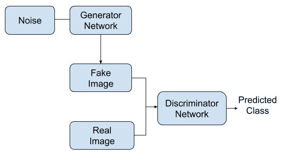
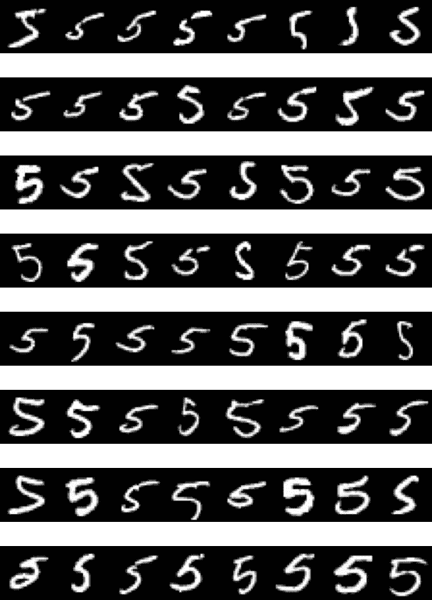
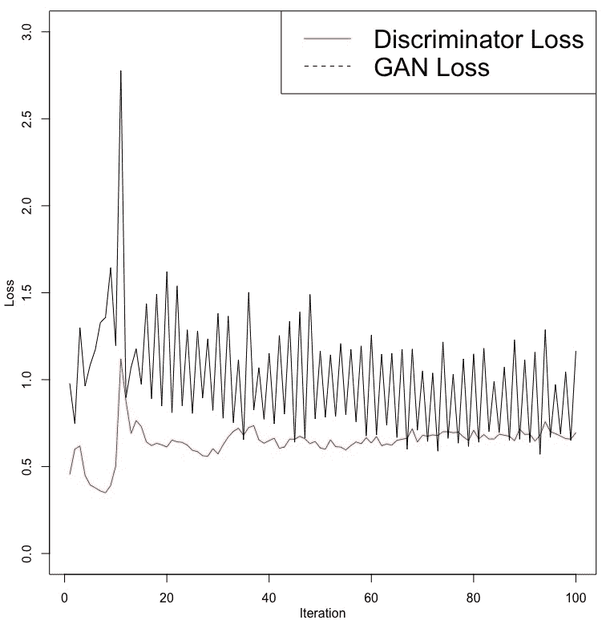
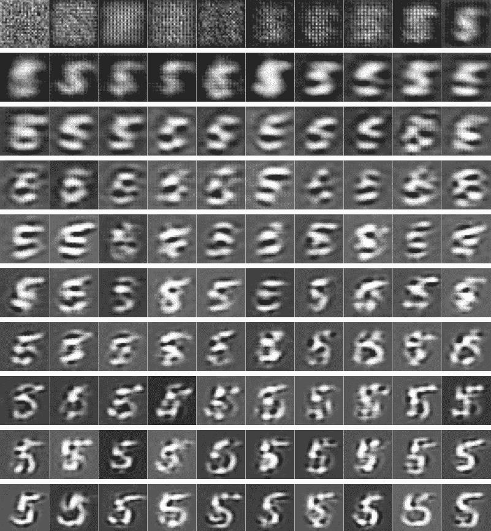
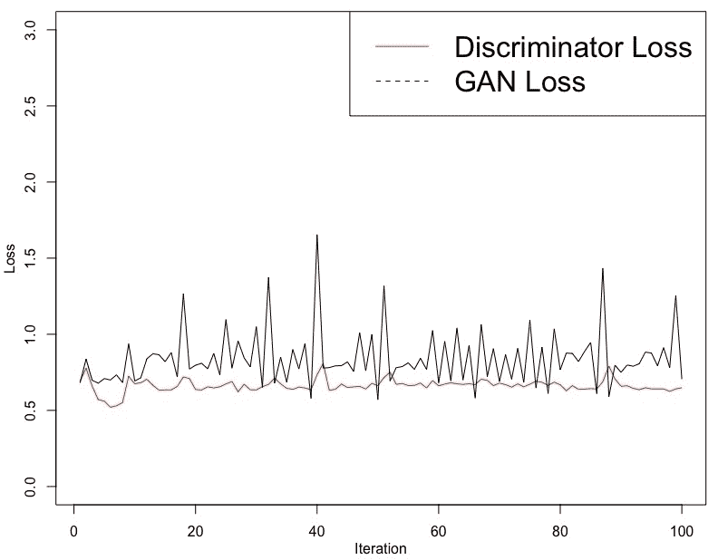
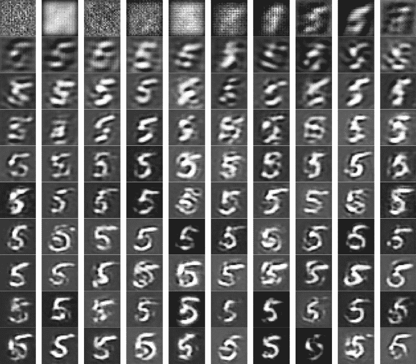
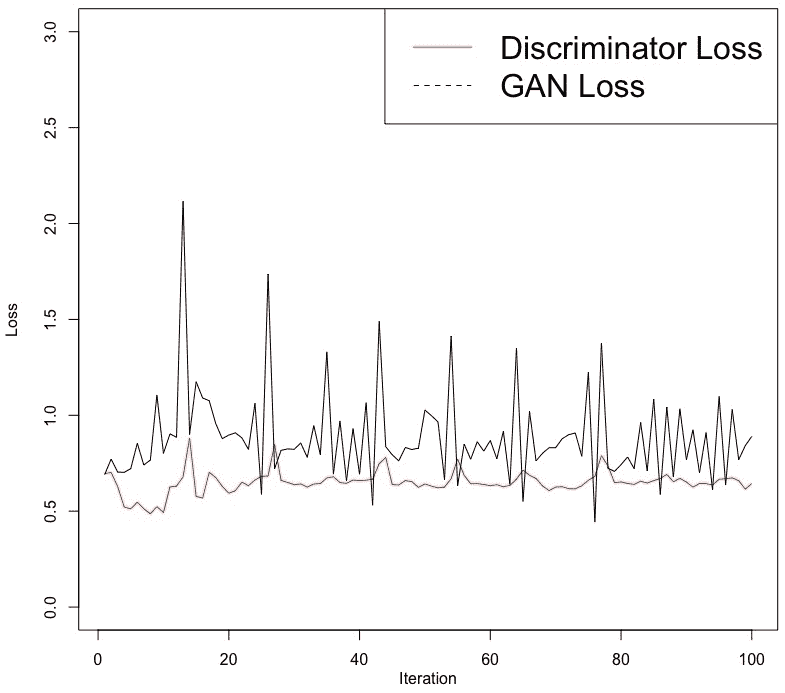
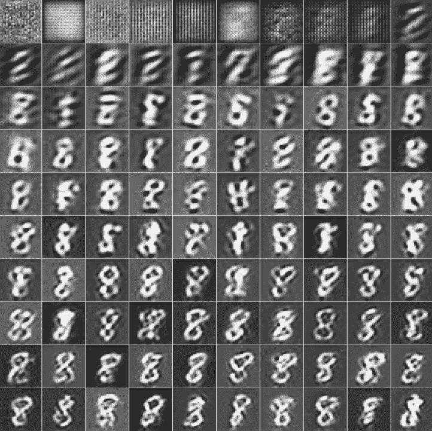

# 八、使用生成对抗网络创建新图像

本章通过一个实例说明了**生成对抗网络** ( **GANs** )在生成新图像中的应用。到目前为止，在本书中，我们使用图像数据说明了深度网络在图像分类任务中的应用。然而，在这一章中，我们将探索一种有助于创建新图像的有趣且受欢迎的方法。生成对抗网络已经被应用于生成新图像、提高图像质量以及生成新文本和新音乐。GANs 的另一个有趣的应用是在异常检测领域。在这里，GAN 被训练来生成被认为是正常的数据。当该网络用于重建被认为不正常或异常的数据时，结果的差异可以帮助我们检测异常的存在。在本章中，我们将看一个生成新图像的例子。

更具体地说，在本章中，我们将讨论以下主题:

*   生成对抗网络概述
*   处理 MNIST 图像数据
*   开发发电机网络
*   开发鉴别器网络
*   训练网络
*   查看结果
*   性能优化技巧和最佳实践


# 生成对抗网络概述

gan 利用两个网络:

*   发电机网络
*   鉴别器网络

对于发电机网络，提供噪声数据作为输入，噪声数据通常是从标准正态分布生成的随机数。显示生成对抗网络的概述的流程图如下:



如前面的流程图所示，生成器网络使用噪声数据作为输入，并试图创建一个我们可以标记为假的图像。这些假图像，连同表示它们是假的标签，被作为输入提供给鉴别器网络。除了标记的假图像，我们还可以提供带有标签的真实图像作为鉴别器网络的输入。

在训练过程中，鉴别器网络试图区分由生成器网络创建的假图像和真实图像。当开发生成对抗网络时，该过程继续，使得生成器网络尽最大努力生成鉴别器网络不能归类为假的图像。与此同时，鉴别器网络在正确区分真假图像方面变得越来越好。

当生成器网络学会一致地产生在训练数据中不可用的图像并且鉴别器网络不能将它们分类为假的时，就实现了成功。对于本章中的真实图像，我们将使用包含手写数字图像的 MNIST 训练数据。

在接下来的部分中，我们将说明为了开发手写数字五的生成对抗网络，我们需要遵循的步骤，该网络在 MNIST 数据中可用。


# 处理 MNIST 图像数据

在本节中，将使用 Keras 库，其中也包括 MNIST 数据。我们还将利用 EBImage 库，它对处理图像数据很有用。MNIST 数据包含从 0 到 9 的手写图像。让我们看一下下面的代码来理解这些数据:

```
# Libraries and MNIST data
library(keras)
library(EBImage)
mnist <- dataset_mnist()
str(mnist)
List of 2
 $ train:List of 2
 ..$ x: int [1:60000, 1:28, 1:28] 0 0 0 0 0 0 0 0 0 0 ...
 ..$ y: int [1:60000(1d)] 5 0 4 1 9 2 1 3 1 4 ...
 $ test :List of 2
 ..$ x: int [1:10000, 1:28, 1:28] 0 0 0 0 0 0 0 0 0 0 ...
 ..$ y: int [1:10000(1d)] 7 2 1 0 4 1 4 9 5 9 ...
```

从前面的代码中，我们可以观察到以下情况:

*   查看这些数据的结构，我们可以看到训练数据中有 60，000 幅图像，测试数据中有 10，000 幅图像。
*   这些手写图像的大小为 28 x 28，颜色为黑白。这意味着只有一个频道。

在这一章中，我们将仅使用来自训练数据的数字 5 来训练生成对抗网络并生成数字 5 的新图像。


# 训练数据中的第五个数字

虽然可以开发一个生成对抗网络来生成所有 10 个数字，但对于刚入门的人来说，建议只从一个数字开始。让我们来看看下面的代码:

```
# Data on digit five
c(c(trainx, trainy), c(testx, testy)) %<-% mnist
trainx <- trainx[trainy==5,,]
str(trainx)
 int [1:5421, 1:28, 1:28] 0 0 0 0 0 0 0 0 0 0 ...
summary(trainx)
   Min. 1st Qu.  Median    Mean 3rd Qu.    Max. 
   0.00    0.00    0.00   33.32    0.00  255.00 

par(mfrow = c(8,8), mar = rep(0, 4))
for (i in 1:64) plot(as.raster(trainx[i,,], max = 255))
par(mfrow = c(1,1))

```

如前面的代码所示，我们选择了包含数字五的图像，并将其保存在`trainx`中。`trainx`的结构向我们展示了 5421 幅这样的图像，它们的尺寸都是 28×28。汇总函数显示`trainx`中的值范围从 0 到 255。在下图中可以看到训练数据中手写数字五的前 64 个图像:



这些手写图像显示出很大的可变性。由于不同的人有不同的书写风格，这种可变性是可以预料的。虽然这些数字大部分都写得很清楚，很容易辨认，但也有一些不太清楚。


# 数据处理

为了给后面的步骤准备数据，我们将调整`trainx`的形状，使其尺寸为 5，421 x 28 x 28 x 1，如以下代码所示:

```
# Reshaping data
trainx <- array_reshape(trainx, c(nrow(trainx), 28, 28, 1))
trainx <- trainx / 255
```

这里，我们还将`trainx`中的值除以 255，以获得 0 到 1 之间的值范围。数据按照要求的格式处理后，我们可以继续开发发电机网络的架构。


# 开发发电机网络

生成器网络将用于从以噪声形式提供的数据中生成假图像。在本节中，我们将开发发电机网络的架构，并通过总结网络来了解相关参数。


# 网络体系结构

让我们看看开发生成器网络架构的代码:

```
# Generator network
h <- 28; w <- 28; c <- 1; l <- 28  
gi <- layer_input(shape = l)
go <- gi %>% layer_dense(units = 32 * 14 * 14) %>%
         layer_activation_leaky_relu() %>% 
         layer_reshape(target_shape = c(14, 14, 32)) %>% 
         layer_conv_2d(filters = 32, 
                       kernel_size = 5,
                       padding = "same") %>% 
         layer_activation_leaky_relu() %>% 
         layer_conv_2d_transpose(filters = 32, 
                                 kernel_size = 4,
                                 strides = 2,
                                 padding = "same") %>% 
         layer_activation_leaky_relu() %>% 
         layer_conv_2d(filters = 1, 
                       kernel_size = 5,
                       activation = "tanh", 
                       padding = "same")
g <- keras_model(gi, go)
```

在前面的代码中，我们可以观察到以下情况:

*   我们指定高度(h)、宽度(w)、通道数量(c)和潜在尺寸(l)分别为 28、28、1 和 28。
*   我们将生成器输入(gi)的输入形状指定为 28。在训练时，将向发生器网络提供 28 个随机数的输入，这些随机数是从标准正态分布获得的，标准正态分布仅仅是噪声。
*   接下来，我们指定了发电机网络输出(go)的架构。
*   最后一层是具有`tanh`激活函数的卷积 2D 层。在最后一层，我们已经设置过滤器为 1，因为我们将不使用彩色图像。
*   注意`layer_conv_2d_transpose`要求尺寸为 28 x 28。
*   发电机输出的输出尺寸将为 28 x 28 x 1。
*   使用的其他值，如过滤器数量、`kernel_size`或步幅，如果您希望探索改进结果，可以在以后进行试验。
*   `gi`和`go`用于发电机网络(g)。

现在，我们来看看这个网络的总结。


# 发电机网络概述

发电机网络概述如下:

```
# Summary of generator network model 
summary(g)
____________________________________________________________________________
Layer (type)                      Output Shape                 Param # 
============================================================================
input_7 (InputLayer)              [(None, 28)]                   0 
____________________________________________________________________________
dense_4 (Dense)                   (None, 6272)                181888 
____________________________________________________________________________
leaky_re_lu_8 (LeakyReLU)         (None, 6272)                   0 
____________________________________________________________________________
reshape_2 (Reshape)               (None, 14, 14, 32)             0 
____________________________________________________________________________
conv2d_6 (Conv2D)                 (None, 14, 14, 32)            25632 
____________________________________________________________________________
leaky_re_lu_9 (LeakyReLU)          (None, 14, 14, 32)             0 
____________________________________________________________________________
conv2d_transpose_2 (Conv2DTranspose) (None, 28, 28, 32)         16416 
____________________________________________________________________________
leaky_re_lu_10 (LeakyReLU)          (None, 28, 28, 32)            0 
____________________________________________________________________________
conv2d_7 (Conv2D)                    (None, 28, 28, 1)           801 
============================================================================
Total params: 224,737
Trainable params: 224,737
Non-trainable params: 0
_______________________________________________________________________________________
```

生成器网络的摘要显示了输出的形状和每层的参数数量。请注意，最终的输出形状是 28 x 28 x 1。将要生成的假图像将具有这些尺寸。总的来说，对于这个网络，我们有 224，737 个参数。

现在我们已经指定了发生器网络的结构，我们可以开发鉴别器网络的架构。


# 开发鉴别器网络

鉴别器网络将用于对假图像和真图像进行分类。本节将讨论网络的体系结构和总结。


# 体系结构

用于开发鉴别器网络架构的代码如下:

```
# Discriminator network
di <- layer_input(shape = c(h, w, c))
do <- di %>% 
         layer_conv_2d(filters = 64, kernel_size = 4) %>% 
         layer_activation_leaky_relu() %>% 
         layer_flatten() %>%
         layer_dropout(rate = 0.3) %>%  
         layer_dense(units = 1, activation = "sigmoid")
d <- keras_model(di, do)
```

从前面的代码中，我们可以观察到以下内容:

*   我们提供了一个输入形状(di ), h = 28，w = 28，c = 1。这是训练网络时会用到的虚实图像的维度。
*   在鉴别器输出(do)的最后一层，我们将激活函数指定为`sigmoid`，单位指定为 1，因为图像被区分为真或假。
*   `di`和`do`用于鉴别器网络模型(d)。


# 鉴频器网络概述

鉴别器网络的总结显示了每层的输出形状和参数数量:

```
# Summary of discriminator network model 
summary(d)
___________________________________________________
Layer (type) Output Shape Param # 
===================================================
input_10 (InputLayer) [(None, 28, 28, 1)] 0 
___________________________________________________
conv2d_12 (Conv2D) (None, 25, 25, 64) 1088 
____________________________________________________
leaky_re_lu_17 (LeakyReLU) (None, 25, 25, 64) 0 
____________________________________________________
flatten_2 (Flatten) (None, 40000) 0 
____________________________________________________
dropout_2 (Dropout) (None, 40000) 0 
____________________________________________________
dense_7 (Dense) (None, 1) 40001 
====================================================
Total params: 41,089
Trainable params: 41,089
Non-trainable params: 0
_____________________________________________________
```

这里，第一层的输出大小为 28 x 28 x 1，这与伪图像和真实图像的尺寸相匹配。参数总数为 41，089。

现在，我们可以使用以下代码编译鉴别器网络模型:

```
# Compile discriminator network
d %>% compile(optimizer = 'rmsprop',
         loss = "binary_crossentropy")
```

这里，我们使用`rmsprop`优化器编译了鉴别器网络。对于损失，我们指定了`binary_crossentropy`。

接下来，我们冻结鉴频器网络的权重。请注意，我们在编译鉴别器网络后冻结了这些权重，以便它仅将它们应用于`gan`模型:

```
# Freeze weights and compile
freeze_weights(d) 
gani <- layer_input(shape = l)
gano <- gani %>% g %>% d
gan <- keras_model(gani, gano)
gan %>% compile(optimizer = 'rmsprop', 
                loss = "binary_crossentropy")
```

这里，生成对抗网络的输出(gano)使用具有固定权重的生成器网络和鉴别器网络。生成对抗网络(gan)以`gani`和`gano`为基础。然后用`rmsprop`优化器和指定为`binary_crossentropy`的损耗编译网络。

现在，我们准备训练网络。


# 训练网络

在本节中，我们将对网络进行培训。在训练网络时，我们将保存假图像并存储损失值，以查看训练进度。它们将帮助我们在创建逼真的假图像时评估网络的有效性。


# 保存假图像和损失值的初始设置

我们将从指定培训过程中需要的一些东西开始。让我们来看看下面的代码:

```
# Initial settings
b <- 50  
setwd("~/Desktop/")
dir <- "FakeImages"
dir.create(dir)
start <- 1; dloss <- NULL; gloss <- NULL
```

从前面的代码中，我们可以观察到以下内容:

*   我们将使用 50 的批量(b)。
*   我们将把假图像保存在`FakeImages`目录中，这个目录是在我们的电脑桌面上创建的。
*   我们还将利用鉴频器损耗值(dloss)和 GAN 损耗值(gloss)，它们由`NULL`初始化。


# 培训过程

接下来，我们将训练模型。这里，我们将使用 100 次迭代。让我们回顾一下这方面的代码，代码被总结为五点:

```
# 1\. Generate 50 fake images from noise
for (i in 1:100) {noise <- matrix(rnorm(b*l), nrow = b, ncol= l)}
fake <- g %>% predict(noise)

# 2\. Combine real & fake images
stop <- start + b - 1 
real <- trainx[start:stop,,,]
real <- array_reshape(real, c(nrow(real), 28, 28, 1))
rows <- nrow(real)
both <- array(0, dim = c(rows * 2, dim(real)[-1]))
both[1:rows,,,] <- fake
both[(rows+1):(rows*2),,,] <- real
labels <- rbind(matrix(runif(b, 0.9,1), nrow = b, ncol = 1),
 matrix(runif(b, 0, 0.1), nrow = b, ncol = 1))
start <- start + b

# 3\. Train discriminator
dloss[i] <- d %>% train_on_batch(both, labels) 

# 4\. Train generator using gan 
fakeAsReal <- array(runif(b, 0, 0.1), dim = c(b, 1))
gloss[i] <- gan %>% train_on_batch(noise, fakeAsReal) 

# 5\. Save fake image
f <- fake[1,,,] 
dim(f) <- c(28,28,1)
image_array_save(f, path = file.path(dir, paste0("f", i, ".png")))}
```

在前面的代码中，我们可以观察到以下情况:

1.  我们从模拟标准正态分布的随机数据点开始，并将结果保存为噪声。然后，我们使用生成器网络`g`从包含随机噪声的数据中创建假图像。注意`noise`的尺寸是 50 x 28，而`fake`的尺寸是 50 x 28 x 28 x 1，并且在每次迭代中包含 50 个假图像。
2.  我们根据批量大小更新开始和停止的值。对于第一次迭代，start 和 stop 的值分别为 1 和 50。对于第二次迭代，start 和 stop 的值分别为 51 和 100。同样，对于第 100 次迭代，start 和 stop 的值分别为 4，951 和 5，000。因为包含手写数字五的`trainx`有超过 5000 个图像，所以在这 100 次迭代中没有图像是重复的。因此，在每次迭代中，选择 50 个真实图像并存储在`real`中，其大小为 50×28×28。我们使用 reshape 将尺寸更改为 50 x 28 x 28 x 1，以便它们与假图像的尺寸相匹配。
3.  然后，我们创建一个名为`both`的空数组，大小为 100 x 28 x 28 x 1，用于存储真实和伪造的图像数据。`both`中的前 50 幅图像包含伪数据，而接下来的 50 幅图像包含真实图像。我们还使用均匀分布生成 50 个介于 0.9 和 1 之间的随机数作为伪图像的标签，并生成类似的介于 0 和 0.1 之间的随机数作为真实图像的标签。请注意，我们没有使用 0 来表示真实图像，使用 1 来表示虚假图像，而是引入了一些随机性或噪声。在标签值中人为引入一些噪声有助于训练网络。
4.  我们使用`both`中包含的图像数据和`labels`中包含的正确类别信息来训练鉴别器网络。我们还将所有 100 次迭代的鉴别器损耗值存储在`dloss`中。如果鉴别器网络学会很好地对假图像和真图像进行分类，那么这个损失值将会很低。
5.  我们试图通过标记包含 0 到 0.1 之间的随机值的噪声来欺骗网络，这是我们用于真实图像的。所有 100 次迭代的结果损失值存储在`gloss`中。如果网络学会在呈现虚假图像方面做得很好，让网络把它们归类为真实的，那么这个损失值就低了。
6.  我们保存 100 次迭代中每一次迭代的第一个假图像，以便我们可以检查它并观察训练过程的影响。

注意，通常，生成对抗网络的训练过程需要大量的计算资源。然而，我们在这里使用的例子是为了快速说明这个过程是如何工作的，并在合理的时间内完成培训过程。对于 100 次迭代和 8 GB 内存的计算机，运行所有代码应该不到一分钟。


# 查看结果

在本节中，我们将回顾从 100 次迭代中获得的网络损耗。我们还将看看从迭代 1 到 100 使用假图像的进展。


# 鉴频器和 GAN 损耗

从我们的 100 次迭代中获得的鉴别器和 GAN 损耗值可以绘制如下。鉴别器损耗基于伪图像和真实图像的损耗值:



从前面的图中，我们可以得出以下结论:

*   鉴频器网络和 GAN 的损耗值在前 20 次迭代中表现出很高的可变性。这种可变性是学习过程的结果。
*   鉴别器网络和发电机网络相互竞争，试图比对方做得更好。当一个网络表现更好时，它是以另一个网络为代价的。这就是为什么如果`dloss`和`gloss`被绘制在散点图上，我们会期望看到它们之间的一些负相关。这种相关性不一定是完全负相关的，但总体模式应该是负相关的。从长远来看，这两个损失值预计会趋同。
*   与从鉴频器网络获得的损耗值相比，从 GAN 获得的损耗值显示出更高的波动。
*   在大约 50 次迭代之后，我们注意到鉴频器损耗值显示出一个小的但是逐渐的增加。这表明鉴别器网络发现越来越难以区分由发生器网络产生的真实和伪造图像。
*   请注意，损失值的增加不一定是负面结果。在这种情况下，这是正反馈，它表明发生器网络与鉴别器网络的对抗正在产生结果。这意味着生成器网络能够创建越来越像真实图像的假图像，并帮助我们实现我们的主要目标。


# 虚假图像

我们将使用以下代码读取假图像，然后绘制它们:

```
# Fake image data
library(EBImage)
setwd("~/Desktop/FakeImages")
temp = list.files(pattern = "*.png")
mypic <- list()
for (i in 1:length(temp)) {mypic[[i]] <- readImage(temp[[i]])}
par(mfrow = c(10,10))
for (i in 1:length(temp)) plot(mypic[[i]])
```

在前面的代码中，我们利用 e image 库来处理假图像数据。我们已经阅读了保存在`FakeImages`目录中的所有 100 张图片。现在，我们可以在 10 x 10 的网格中绘制所有图像，如下图所示:



在前面的图像中，显示了 100 次迭代中的第一个伪图像。由此，我们可以做出如下观察:

*   第一行中的前十个图像代表前 10 次迭代。
*   第一幅图像只是反映了随机噪声。当我们达到 10 次迭代时，图像开始捕捉手写数字 5 的本质。
*   当网络训练经历迭代 91 到 100 时，数字 5 在视觉上变得更加清晰。

在下一节中，我们将通过对网络进行一些更改并观察其对网络训练过程的影响来进行实验。


# 性能优化技巧和最佳实践

在本节中，我们将通过在发生器网络和鉴别器网络中插入额外的卷积层来进行实验。通过这个实验，我们将传达性能优化技巧和最佳实践。


# 发生器和鉴别器网络的变化

发电机网络中的变化显示在以下代码中:

```
# Generator network
gi <- layer_input(shape = l)
go <- gi %>% layer_dense(units = 32 * 14 * 14) %>%
         layer_activation_leaky_relu() %>% 
         layer_reshape(target_shape = c(14, 14, 32)) %>% 
         layer_conv_2d(filters = 32, 
                       kernel_size = 5,
                       padding = "same") %>% 
         layer_activation_leaky_relu() %>% 
         layer_conv_2d_transpose(filters = 32, 
                                 kernel_size = 4,
                                 strides = 2, 
                                 padding = "same") %>% 
         layer_activation_leaky_relu() %>%      
         layer_conv_2d(filters = 64, 
                      kernel_size = 5, 
                      padding = "same") %>% 
         layer_activation_leaky_relu() %>% 
         layer_conv_2d(filters = 1, 
                       kernel_size = 5,
                       activation = "tanh", 
                       padding = "same")
g <- keras_model(gi, go)
```

在这里，我们可以看到，在发电机网络中，我们在最后一层之前添加了`layer_conv_2d`和`layer_activation_leaky_relu`层。发电机网络的参数总数已增加到 276，801。

鉴别器网络中的变化如以下代码所示:

```
# Discriminator network
di <- layer_input(shape = c(h, w, c))
do <- di %>% 
         layer_conv_2d(filters = 64, kernel_size = 4) %>% 
         layer_activation_leaky_relu() %>% 
         layer_conv_2d(filters = 64, kernel_size = 4, strides = 2) %>% 
         layer_activation_leaky_relu() %>% 
         layer_flatten() %>%
         layer_dropout(rate = 0.3) %>%  
         layer_dense(units = 1, activation = "sigmoid")
d <- keras_model(di, do)
```

这里，我们在鉴频器网络的平坦层之前添加了`layer_conv_2d`和`layer_activation_leaky_relu`层。鉴别器网络中的参数数量增加到 148，866 个。我们保持其他一切不变，然后再次训练网络 100 次迭代。

现在，我们可以评估这些变化的影响。


# 这些变化对结果的影响

100 次迭代的鉴频器和 GAN 损耗值可绘制如下:



从前面的图中，我们可以观察到以下情况:

*   通过增加层数，与我们之前获得的结果相比，鉴别器和 GAN 网络的损耗值的波动已经减小。
*   在一些迭代中观察到的尖峰或高损耗值指示相应的网络在与另一个网络竞争时处于困境。
*   与鉴频器网络相关损耗相比，GAN 损耗值的可变性仍然较高。

下面的图是 100 次迭代中每一次迭代的第一个伪图像:



从前面的图像中，我们可以观察到以下情况:

*   通过在生成器和鉴别器网络中添加额外的卷积层，网络开始生成五年前复制手写数字的图像。
*   在之前的网络中，持续看起来像手写数字 5 的假图像直到大约 70-80 次迭代才出现。
*   由于使用了额外的层，我们可以看到数字 5 在大约 20-30 次迭代后或多或少地形成，这表明有所改进。

接下来，我们将尝试使用这个网络来生成另一个手写数字。


# 生成数字八的手写图像

在本实验中，我们将使用与上一个实验相同的网络体系结构。但是，我们将使用它来生成数字 8 的手写图像。该实验中 100 次迭代的鉴别器和 GAN 损耗值可绘制如下:



从前面的图中，我们可以得出以下结论:

*   鉴别器和 GAN 损耗值显示出随着迭代次数从 1 到 100 而减少的可变性。
*   随着网络训练的进行，GAN 损耗在一定间隔内的高峰值正在减少。

每次迭代的第一个伪图像的图如下:



与数字五相比，数字八在开始形成可识别的模式之前需要更多的迭代。

在本节中，我们在发生器和鉴频器网络中试验了额外的卷积层。由于这一点，我们可以作出以下观察:

*   额外的卷积层似乎对伪图像的生成有积极的影响，伪图像开始看起来更像数字 5 的手写图像。
*   尽管我们在本章中提到的数据的结果还不错，但是对于其他数据，我们可能需要对模型架构进行其他的修改。
*   我们还使用具有相同架构的网络来生成逼真的手写数字 8 的假图像。据观察，对于数字 8，在可识别的模式开始出现之前，训练网络需要更多的迭代。
*   注意，用于同时生成所有 10 个手写数字的网络可能更复杂，并且可能需要更多的迭代。
*   类似地，如果我们的彩色图像的尺寸明显大于 28 x 28，这是我们在本章中使用的尺寸，我们将需要更多的计算资源，任务将更具挑战性。


# 摘要

在这一章中，我们使用了一个生成对抗网络来说明如何生成单个手写数字的图像。生成对抗网络利用两个网络:生成器和鉴别器网络。生成器网络从包含随机噪声的数据中创建假图像，而鉴别器网络被训练来区分假图像和真实图像。这两个网络相互竞争，从而可以创建逼真的假图像。虽然在这一章中，我们提供了一个使用生成对抗网络来生成新图像的例子，但是这些网络也已知在生成新文本或新音乐以及异常检测中具有应用。

在这一部分，我们讨论了各种用于处理图像数据的深度学习网络。在下一节中，我们将讨论自然语言处理的深度学习网络。