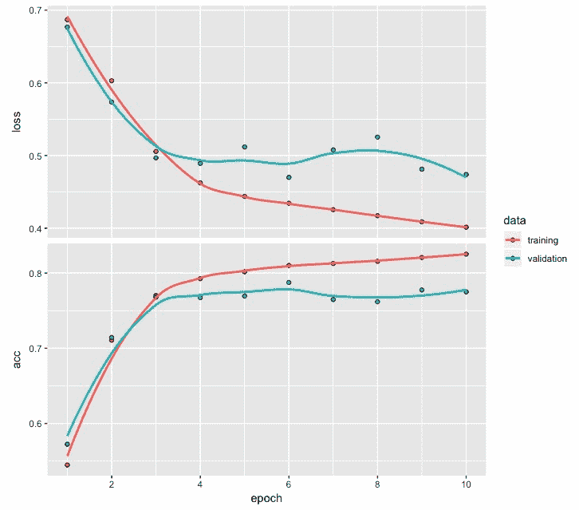
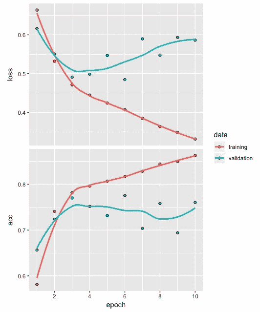
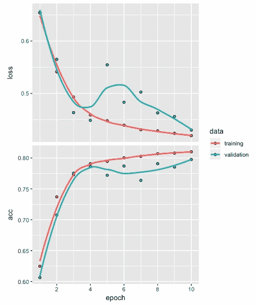
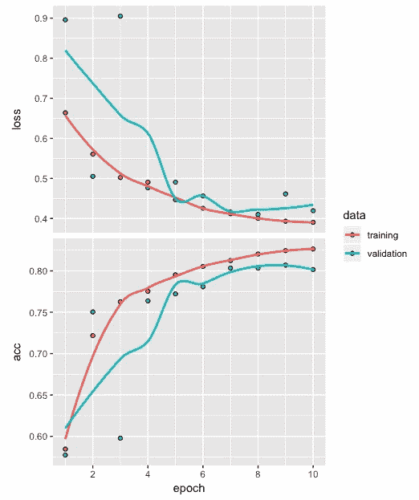
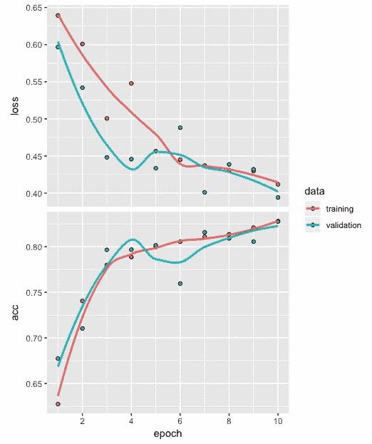

# 十、基于循环神经网络的文本分类

循环神经网络对于解决数据涉及序列的问题很有用。在文本分类、时间序列预测、视频中的帧序列、DNA 序列和语音识别中可以看到一些涉及序列的应用示例。

在本章中，我们将使用循环神经网络开发一个情感(积极或消极)分类模型。我们将首先准备用于开发文本分类模型的数据，然后开发顺序模型、编译模型、拟合模型、评估模型、预测，以及使用混淆矩阵进行模型性能评估。我们还将回顾一些情感分类性能优化的技巧。

更具体地说，在本章中，我们将讨论以下主题:

*   为模型构建准备数据
*   开发循环神经网络模型
*   拟合模型
*   模型评估和预测
*   性能优化技巧和最佳实践


# 为模型构建准备数据

在本章中，我们将使用 Keras 包中的**互联网电影数据库** ( **IMDb** )电影评论文本数据。请注意，没有必要从任何地方下载这些数据，因为可以使用我们将很快讨论的代码从 Keras 库中轻松访问这些数据。此外，该数据集经过预处理，以便将文本数据转换为整数序列。我们不能直接使用文本数据来建立模型，在数据可以用作开发深度学习网络的输入之前，将文本数据预处理成整数序列是必要的。

我们将从使用`dataset_imdb`函数加载`imdb`数据开始，在这里我们还将使用`num_words`指定最常用单词的数量为 500。然后，我们将把`imdb`数据分成`train`和`test`数据集。让我们看一下下面的代码来理解这个数据:

```
# IMDB data
imdb <- dataset_imdb(num_words = 500)
c(c(train_x, train_y), c(test_x, test_y)) %<-% imdb
length(train_x); length(test_x)
[1] 25000
[1] 25000

table(train_y)
train_y
    0     1 
12500 12500 

table(test_y)
test_y
    0     1 
12500 12500
```

让我们看一下前面的代码:

*   `train_x`和`test_x`分别包含表示训练和测试数据中的评论的整数。
*   同样，`train_y`和`test_y`包含`0`和`1`标签，分别代表消极情绪和积极情绪。
*   使用`length`函数，我们可以看到`train_x`和`test_x`都是基于各 25，000 条电影评论。
*   `train_y`和`test_y`的表格显示，在训练和测试数据中有相同数量的正面(12，500)和负面(12，500)评价。

拥有这样一个平衡的数据集有助于避免由于类不平衡问题造成的任何偏差。

电影评论中的单词由唯一的整数表示，分配给单词的每个整数基于其在数据集中的总频率。例如，整数 1 代表最常用的单词，整数 2 代表第二常用的单词，依此类推。此外，整数 0 不用于任何特定的单词，而是表示未知的单词。

让我们使用以下代码来看看`train_x`数据中的第三和第六个序列:

```
# Sequence of integers
train_x[[3]]
  [1]   1  14  47   8  30  31   7   4 249 108   7   4   2  54  61 369
 [17]  13  71 149  14  22 112   4   2 311  12  16   2  33  75  43   2
 [33] 296   4  86 320  35   2  19 263   2   2   4   2  33  89  78  12
 [49]  66  16   4 360   7   4  58 316 334  11   4   2  43   2   2   8
 [65] 257  85   2  42   2   2  83  68   2  15  36 165   2 278  36  69
 [81]   2   2   8 106  14   2   2  18   6  22  12 215  28   2  40   6
 [97]  87 326  23   2  21  23  22  12 272  40  57  31  11   4  22  47
[113]   6   2  51   9 170  23   2 116   2   2  13 191  79   2  89   2
[129]  14   9   8 106   2   2  35   2   6 227   7 129 113

train_x[[6]]
 [1]   1   2 128  74  12   2 163  15   4   2   2   2   2  32  85 156  45
[18]  40 148 139 121   2   2  10  10   2 173   4   2   2  16   2   8   4
[35] 226  65  12  43 127  24   2  10  10

for (i in 1:6) print(length(train_x[[i]]))

Output

[1] 218
[1] 189
[1] 141
[1] 550
[1] 147
[1] 43
```

从前面的代码和输出中，我们可以观察到以下内容:

*   从第三个电影评论相关的整数序列的输出中，我们可以观察到第三个评论包含了 1(第 1 个整数)到 369(第 16 个整数)之间的 141 个整数。
*   由于我们把使用最频繁的词限制在 500，所以对于第三次复习，没有大于 500 的整数。
*   同样，从第六条评论的相关整数序列的输出中，我们可以观察到第六条评论包含 43 个介于 1(第 1 个整数)和 226(第 35 个整数)之间的整数。
*   查看`train_x`数据中前六个序列的长度，我们可以观察到电影评论的长度在 43(列车数据中的第 6 个评论)和 550(列车数据中的第 4 个评论)之间变化。电影评论长度的这种变化是正常的，也是意料之中的。

在我们开发一个电影评论情感分类模型之前，我们需要找到一种方法使所有电影评论的整数序列长度相同。我们可以通过填充序列来实现这一点。


# 填充序列

对文本序列进行填充是为了确保所有的序列具有相同的长度。让我们来看看下面的代码:

```
# Padding and truncation
train_x <- pad_sequences(train_x, maxlen = 100)
test_x <- pad_sequences(test_x, maxlen = 100)
```

从前面的代码中，我们可以观察到以下内容:

*   在`pad_sequences`函数的帮助下，通过为`maxlen`指定一个值，我们可以实现所有整数序列的长度相等。
*   在这个例子中，我们将训练和测试数据中每个电影评论序列的长度限制为 100。注意，在填充序列之前，`train_x`和`test_x`的结构是 25000 条评论的列表。
*   然而，在填充序列之后，两者的结构都变成 25，000 x 100 的矩阵。这可以通过在填充前后运行`str(train_x)`来轻松验证。

为了观察填充对整数序列的影响，让我们看看下面的代码及其输出:

```
# Sequence of integers
train_x[3,]
  [1]   2   4   2  33  89  78  12  66  16   4 360   7   4  58 316 334
 [17]  11   4   2  43   2   2   8 257  85   2  42   2   2  83  68   2
 [33]  15  36 165   2 278  36  69   2   2   8 106  14   2   2  18   6
 [49]  22  12 215  28   2  40   6  87 326  23   2  21  23  22  12 272
 [65]  40  57  31  11   4  22  47   6   2  51   9 170  23   2 116   2
 [81]   2  13 191  79   2  89   2  14   9   8 106   2   2  35   2   6
 [97] 227   7 129 113

train_x[6,]
  [1]   0   0   0   0   0   0   0   0   0   0   0   0   0   0   0   0
 [17]   0   0   0   0   0   0   0   0   0   0   0   0   0   0   0   0
 [33]   0   0   0   0   0   0   0   0   0   0   0   0   0   0   0   0
 [49]   0   0   0   0   0   0   0   0   0   1   2 128  74  12   2 163
 [65]  15   4   2   2   2   2  32  85 156  45  40 148 139 121   2   2
 [81]  10  10   2 173   4   2   2  16   2   8   4 226  65  12  43 127
 [97]  24   2  10  10
```

在前面的代码中可以看到填充`train_x`后第三个整数序列的输出。在这里，我们可以观察到以下情况:

*   第三个序列现在的长度为 100。第三个序列最初有 141 个整数，我们可以观察到位于序列开头的 41 个整数被截断了。
*   另一方面，第六个序列的输出显示了不同的模式。
*   第六个序列最初的长度为 43，但现在在序列的开头添加了 57 个零，以人为地将长度扩展到 100。
*   在每个训练和测试数据中，与电影评论相关的所有 25，000 个整数序列都以类似的方式受到影响。

在下一部分中，我们将开发一个循环神经网络的架构，该架构将用于开发一个电影评论情感分类模型。


# 开发循环神经网络模型

在本节中，我们将开发循环神经网络的体系结构并编译它。让我们看看下面的代码:

```
# Model architecture
model <- keras_model_sequential() 
model %>% 
         layer_embedding(input_dim = 500, output_dim = 32) %>%
         layer_simple_rnn(units = 8) %>%  
         layer_dense(units = 1, activation = "sigmoid")
```

我们从使用`keras_model_sequential`函数初始化模型开始。然后，我们添加嵌入和简单的**循环神经网络** ( **RNN** )层。对于嵌入层，我们将`input_dim`指定为 500，这与我们之前指定的最常用单词的数量相同。下一层是一个简单的 RNN 层，隐藏单元的数量指定为 8。

注意，`layer_simple_rnn`层的默认激活函数是双曲正切(tanh)，这是一条 S 形曲线，输出范围从-1 到+1。

最后的密集层具有一个单元，以利用激活函数 sigmoid 来捕捉电影评论情绪(正面或负面)。当输出位于 0 和 1 之间时，就像在这种情况下，它便于解释，因为它可以被认为是一种概率。

注意，sigmoid 激活函数是一条 S 形曲线，输出范围在 0 和 1 之间。

现在，让我们看看模型摘要，并了解我们如何计算所需的参数数量。


# 参数计算

RNN 模式的概要如下:

```
# Model summary
model

OUTPUT

Model
________________________________________________________________________
Layer (type)                    Output Shape                 Param # 
========================================================================
embedding_21 (Embedding)        (None, None, 32)             16000 
________________________________________________________________________
simple_rnn_23 (SimpleRNN)       (None, 8)                    328 
________________________________________________________________________
dense_24 (Dense)                (None, 1)                    9 
========================================================================
Total params: 16,337
Trainable params: 16,337
Non-trainable params: 0
________________________________________________________________________
```

嵌入层的参数数量是通过将 500(最频繁出现的单词的数量)乘以 32(输出维度)得到 16，000。为了得到简单 RNN 层的参数数量，我们使用 *(h(h+i) + h)* ，其中 *h* 表示隐藏单元的数量，而 *i* 表示该层的输入尺寸。在这种情况下，这是 32。

因此，我们有(8(8 + 32)+8) = 328 个参数。

请注意，如果我们在这里考虑一个完全连接的密集层，我们将得到(8 x 32 + 8) = 264。然而，额外的 64 个参数是因为我们使用循环层来捕获文本数据中的序列。

在循环层中，还使用了来自先前输入的信息，这导致了我们在这里可以看到的这些额外参数。这就是为什么与常规的密集连接的神经网络层相比，rnn 更适合处理序列数据的原因。对于最后一层，即密集层，我们有(1 x 8 + 1) = 9 个参数。总的来说，这个架构有 16，337 个参数。

在循环层中，使用先前输入的信息有助于更好地表示文本或包含某种序列的类似数据中出现的序列。


# 编译模型

编译模型的代码如下:

```
# Compile model
model %>% compile(optimizer = "rmsprop",
         loss = "binary_crossentropy",
         metrics = c("acc"))
```

我们用`rmsprop`优化器编译模型，这是推荐给循环神经网络的。由于电影评论要么是正面的要么是负面的，因此我们利用`binary_crossentropy`作为二进制类型响应的损失函数。最后，对于度量标准，我们指定了精确度。

在下一节中，我们将使用该架构开发一个使用循环神经网络的电影评论情感分类模型。


# 拟合模型

拟合模型的代码如下:

```
# Fit model
model_one <- model %>% fit(train_x, train_y,
         epochs = 10,
         batch_size = 128,
         validation_split = 0.2)
```

为了拟合模型，我们将利用 20%的验证分割，这使用来自训练数据的 20，000 个电影评论数据来构建模型。剩余的 5000 个电影评论训练数据用于评估损失和准确性形式的验证。我们运行 10 个 epochs，批量大小为 128。

使用验证拆分时，需要注意的是，对于 20%，它使用前 80%的定型数据进行定型，后 20%的定型数据进行验证。因此，如果审查数据的前 50%是负面的，后 50%是正面的，20%的验证分割将导致模型验证仅基于正面的审查。因此，在使用验证分割之前，我们必须验证情况并非如此；否则，它将引入显著的偏差。


# 准确性和损失

下图显示了使用`plot(model_one)`的训练和验证数据在 10 个时期后的准确度和损失值:



从上图中，可以观察到以下情况:

*   从时段 1 到 10，训练损失继续减少。
*   验证损失最初减少，但在 3 个时期后开始变得平缓。
*   在相反的方向上也观察到类似的精确度模式。

在下一节中，我们将评估分类模型，并在训练和测试数据的帮助下评估模型预测性能。


# 模型评估和预测

首先，我们将评估基于列车数据的模型的损失和准确性。我们还将基于训练数据获得混淆矩阵。应使用测试数据重复相同的过程。


# 训练数据

我们将使用`evaluate`函数来获取损耗和精度值，如以下代码所示:

```
# Loss and accuracy
model %>% evaluate(train_x, train_y)
$loss
[1] 0.4057531

$acc
[1] 0.8206
```

从前面的输出可以看出，基于训练数据的损失值和准确度值分别为 0.406 和 0.821。

使用训练数据的预测用于开发混淆矩阵，如以下代码所示:

```
# Prediction and confusion matrix
pred <- model %>% predict_classes(train_x)
table(Predicted=pred, Actual=imdb$train$y)
 Actual
Predicted 0 1
 0 9778 1762
 1 2722 10738
```

通过查看前面的混淆矩阵，可以得出以下观察结果:

*   有 9，778 个电影评论被正确分类为负面的，并且有 10，738 个电影评论被正确分类为正面的。我们可以观察到，该模型很好地将评论分为正面或负面。
*   查看错误分类，我们还可以观察到，在 2722 个场合，负面电影评论被错误分类为正面电影评论。与分类模型将正面评论错误分类为负面(1，762 次)相比，这相对较高。

接下来，让我们根据测试数据做一个类似的评估。


# 测试数据

获取损耗和精度值的代码如下:

```
# Loss and accuracy
model %>% evaluate(test_x, test_y)
$loss
[1] 0.4669374

$acc
[1] 0.77852
```

在这里，我们可以看到基于测试数据的损失和准确度分别为 0.467 和 0.778。这些结果比我们从训练数据中观察到的稍差。

接下来，我们将预测测试数据的类，并使用结果来获得混淆矩阵，如以下代码所示:

```
# Prediction and confusion matrix
pred1 <- model %>%   predict_classes(test_x)
table(Predicted=pred1, Actual=imdb$test$y)
         Actual
Predicted     0     1
        0  9134  2171
        1  3366 10329
```

除了总体结果比我们从训练数据中获得的结果稍差之外，我们看不出训练数据和测试数据之间有任何重大差异。

在下一节中，我们将探索一些提高模型性能的策略。


# 性能优化技巧和最佳实践

在开发循环神经网络模型时，我们会遇到需要做出几个与网络相关的决策的情况。这些决定可能包括尝试不同的激活功能，而不是我们使用的默认激活功能。我们来做这样的改动，看看它们对模型的影评情感分类性能有什么影响。

在本节中，我们将尝试以下四个因素:

*   简单 RNN 图层中的单元数量
*   在简单的 RNN 层中使用不同的激活函数
*   添加更多循环层
*   填充序列最大长度的变化


# 简单 RNN 图层中的单元数量

合并这一更改，然后编译/拟合模型的代码如下:

```
# Model architecture
model <- keras_model_sequential() 
model %>% 
         layer_embedding(input_dim = 500, output_dim = 32) %>%
         layer_simple_rnn(units = 32) %>% 
         layer_dense(units = 1, activation = "sigmoid")

# Compile model
model %>% compile(optimizer = "rmsprop",
         loss = "binary_crossentropy",
         metrics = c("acc"))

# Fit model
model_two <- model %>% fit(train_x, train_y,
         epochs = 10,
         batch_size = 128,
         validation_split = 0.2)
```

这里，我们通过将简单 RNN 层中的单元数量从 8 个增加到 32 个来改变架构。其他一切都保持不变。然后，我们编译并拟合模型，如前面的代码所示。

10 个时期后的准确度和损失值可在下图中看到:



前面的图表明了以下情况:

*   epoch 3 以后的训练和验证数据之间的差距明显加大。
*   这清楚地表明，与前面的图相比，过度拟合的水平增加了，在前面的图中，简单 RNN 中的单元数是 8。
*   这也反映在较高的损失值 0.585 和较低的精度值 0.757 中，我们根据这一新模型获得了测试数据。

现在，让我们在简单的 RNN 层中试验一个不同的激活函数，看看这个过度拟合问题是否可以解决。


# 在简单的 RNN 层中使用不同的激活函数

这种变化可以在下面的代码中看到:

```
# Model architecture
model <- keras_model_sequential() 
model %>% 
         layer_embedding(input_dim = 500, output_dim = 32) %>%
         layer_simple_rnn(units = 32, activation = "relu") %>% 
 layer_dense(units = 1, activation = "sigmoid")

# Compile model
model %>% compile(optimizer = "rmsprop",
 loss = "binary_crossentropy",
 metrics = c("acc"))

# Fit model
model_three <- model %>% fit(train_x, train_y,
 epochs = 10,
 batch_size = 128,
 validation_split = 0.2)
```

在前面的代码中，我们将简单 RNN 层中的默认激活函数更改为 ReLU 激活函数。我们保持其他所有东西和之前实验中的一样。

10 个时期后的准确度和损失值可在下图中看到:



从前面的图中，我们可以观察到以下情况:

*   损耗和精度值现在看起来好多了。
*   基于训练和验证的损失和准确度曲线现在彼此更接近。
*   基于我们获得的测试数据，我们使用该模型找到了损失值和精度值，即分别为 0.423 和 0.803。与我们目前获得的结果相比，这显示了更好的结果。

接下来，我们将通过添加更多的循环层进行进一步的实验。这将有助于我们建立更深层次的循环神经网络模型。


# 添加更多循环层

现在，我们将通过向当前网络添加两个额外的循环层来进行实验。包含这一更改的代码如下:

```
# Model architecture
model <- keras_model_sequential() %>% 
         layer_embedding(input_dim = 500, output_dim = 32) %>% 
         layer_simple_rnn(units = 32, 
                          return_sequences = TRUE, 
                          activation = 'relu') %>% 
         layer_simple_rnn(units = 32, 
                          return_sequences = TRUE, 
                          activation = 'relu') %>% 
         layer_simple_rnn(units = 32, 
                          activation = 'relu') %>%
         layer_dense(units = 1, activation = "sigmoid")

# Compile model
model %>% compile(optimizer = "rmsprop",
 loss = "binary_crossentropy",
 metrics = c("acc"))

# Fit model
model_four <- model %>% fit(train_x, train_y,
0 epochs = 10,
 batch_size = 128,
 validation_split = 0.2)
```

当我们添加这些额外的循环层时，我们也将`return_sequences`设置为`TRUE`。我们保持其他一切不变，并编译/拟合模型。基于训练和验证数据的损失和准确度值的曲线如下:



从前面的图中，我们可以观察到以下情况:

*   10 个时期后，训练和验证的损失和准确度值显示出合理的接近水平，表明不存在过度拟合。
*   基于我们计算的测试数据的损失和精度显示出结果中的适当改进，分别为 0.403 和 0.816。
*   这表明，更深的循环层确实有助于以更好的方式捕捉电影评论中的单词序列。反过来，这使得电影评论中的情绪分类变得更好，如积极或消极。


# 填充序列的最大长度

到目前为止，对于训练和测试数据中的电影评论填充序列，我们使用的最大长度是 100。让我们使用下面的代码来看看`train`和`test`数据中的电影评论长度汇总:

```
# Summary of padding sequences
z <- NULL
for (i in 1:25000) {z[i] <- print(length(train_x[[i]]))}
   Min. 1st Qu.  Median    Mean 3rd Qu.    Max. 
   11.0   130.0   178.0   238.7   291.0  2494.0 

z <- NULL
for (i in 1:25000) {z[i] <- print(length(test_x[[i]]))}
   Min. 1st Qu.  Median    Mean 3rd Qu.    Max. 
    7.0   128.0   174.0   230.8   280.0  2315.0
```

从前面的代码中，我们可以观察到以下情况:

*   从列车数据中的影评长度汇总可以看出，最小长度为 11，最大长度为 2494，中值长度为 178。
*   同样，测试数据的最小审查长度为 7，最大长度为 2，315，中值长度为 174。

请注意，当最大填充长度低于中值时(最大长度为 100)，我们倾向于通过删除超过 100 的单词来截断更多的电影评论。同时，当我们选择填充的最大长度明显高于中值时，我们将会遇到这样的情况:更多的电影评论需要包含零，而更少的评论将被截断。

在这一节中，我们将探讨将电影评论中单词序列的最大长度保持在中间值附近的影响。合并这一更改的代码如下:

```
# IMDB data
c(c(train_x, train_y), c(test_x, test_y)) %<-% imdb
train_x <- pad_sequences(train_x, maxlen = 200)  
test_x <- pad_sequences(test_x, maxlen = 200)

# Model architecture
model <- keras_model_sequential() %>% 
         layer_embedding(input_dim = 500, output_dim = 32) %>% 
         layer_simple_rnn(units = 32, 
                          return_sequences = TRUE, 
                          activation = 'relu') %>% 
         layer_simple_rnn(units = 32, 
                          return_sequences = TRUE, 
                          activation = 'relu') %>% 
         layer_simple_rnn(units = 32, 
                          return_sequences = TRUE, 
                          activation = 'relu') %>% 
         layer_simple_rnn(units = 32, 
                          activation = 'relu') %>%
         layer_dense(units = 1, activation = "sigmoid")

# Compile model
model %>% compile(optimizer = "rmsprop",
         loss = "binary_crossentropy",
         metrics = c("acc"))

# Fit model
model_five <- model %>% fit(train_x, train_y,
         epochs = 10,
         batch_size = 128,
         validation_split = 0.2)
```

从前面的代码中，我们可以看到，我们在将`maxlen`指定为 200 之后运行模型。我们保持其他一切都和我们在`model_four`时一样。

训练和验证数据的损失和准确性曲线如下:



从前面的图中，我们可以得出以下结论:

*   不存在过度拟合的问题，因为训练和验证数据点彼此非常接近。
*   基于测试数据的损失和精度分别计算为 0.383 和 0.830。
*   在此阶段，损耗和精度值处于最佳水平。

基于测试数据的混淆矩阵如下:

```
# Prediction and confusion matrix
pred1 <- model %>%   predict_classes(test_x)
table(Predicted=pred1, Actual=imdb$test$y)
         Actual
Predicted     0     1
        0 10066  1819
        1  2434 10681
```

从混淆矩阵中，我们可以得出以下结论:

*   当正确地将电影评论分类为正面(10，681)时，与正确地将负面(10，066)评论分类时相比，该分类模型似乎表现得稍好。
*   至于分类不正确的评论，我们之前观察到的趋势，即负面的电影评论被模型错误地分类为正面的更高，在这种情况下也存在。

在这一部分中，我们对多个单元、激活函数、网络中的循环层数以及填充量进行了实验，以便改进电影评论情感分类模型。您可以进一步研究的一些其他因素包括要包含的最常用单词的数量，以及在填充序列时更改最大长度。


# 摘要

在这一章中，我们使用 IMDb 电影评论数据说明了用于文本情感分类的循环神经网络模型的使用。与常规的密集连接网络相比，循环神经网络更适合处理其中有序列的数据。文本数据就是我们在本章中用到的一个例子。

一般来说，深层网络涉及许多因素或变量，这需要一些实验，包括在得到有用的模型之前改变这些因素的水平。在这一章中，我们还开发了五种不同的电影评论情感分类模型。

一种流行的循环神经网络是**长短期记忆** ( **LSTM** )网络。LSTM 网络能够学习长期依赖性，并帮助循环网络更长时间地记住输入。

在下一章中，我们将查看一个使用 LSTM 网络的应用示例，在该示例中，我们将继续使用 IMDb 电影评论数据，并探索可以对情感分类模型的性能做出的进一步改进。